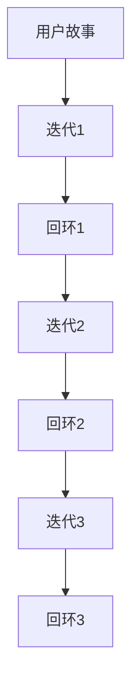

                 

基于您的要求和目录大纲，我将逐步构建文章的内容。首先，我会根据大纲提供每个章节的markdown格式草稿，包括核心概念、算法原理、系统分析与架构设计等内容。接下来，我会详细阐述每个部分，确保满足完整性、简洁性和逻辑性的要求。

### 第1章：敏捷开发概述

#### 1.1 问题背景

在软件开发的早期，瀑布模型（Waterfall Model）是项目管理的标准方法。这种方法按照固定的顺序将开发过程划分为需求分析、设计、编码、测试和部署等阶段。然而，随着时间的推移，这种方法暴露出了一系列问题：

- **需求变更的困难**：一旦项目进入开发阶段，需求变更变得异常困难，这往往导致项目延期和成本超支。
- **无法快速适应市场变化**：传统方法难以在短时间内适应市场变化，使得产品无法及时响应客户需求。
- **沟通成本高**：由于各阶段之间的孤立性，沟通成本高，容易出现误解和错误。
- **质量难以保证**：开发过程中的质量难以得到保证，特别是在项目后期。

这些问题促使开发社区寻求新的方法来改进软件开发过程，从而诞生了敏捷开发。

#### 1.2 问题描述

敏捷开发是为了解决上述问题而诞生的一种软件开发方法论。它主张通过快速迭代、持续交付和客户协作来提高软件开发效率和质量。然而，在实际应用中，敏捷开发也面临一些挑战：

- **团队协调**：敏捷开发强调团队成员之间的紧密协作，但如何有效地协调不同角色的团队成员仍然是一个挑战。
- **规划与管理**：如何在短周期内（如sprint）有效地规划和管理任务，确保项目按时交付。
- **技术债务**：在追求快速交付的过程中，如何平衡短期利益与长期健康。

#### 1.3 解决方案

敏捷开发提出了一系列解决方案来应对这些问题：

- **迭代开发**：通过将项目划分为多个迭代周期，每个迭代周期内完成一部分功能，以便快速反馈和调整。
- **持续交付**：通过持续集成和自动化测试，确保软件始终处于可发布状态。
- **用户故事**：通过用户故事来定义需求，使需求更加具体、可测试和可管理。
- **Scrum框架**：提供了一套明确的角色、会议和工作流程，帮助团队实现敏捷开发。

#### 1.4 边界与外延

敏捷开发的适用范围广泛，但并不是所有项目都适合采用敏捷方法。以下是一些边界和限制：

- **项目规模**：对于大型项目，敏捷方法可能需要更精细的规划和协调。
- **团队文化**：敏捷开发依赖于团队的自我组织和协作，因此团队文化对于成功实施至关重要。
- **客户参与**：客户持续参与是敏捷开发的核心，但并非所有客户都能提供这种级别的参与。

#### 1.5 概念结构与核心要素组成

敏捷开发的核心要素包括：

- **用户故事**：用户故事是一种简洁的需求表述方式，通常包含一个标题、一个简短描述和一个估计点数。
- **迭代**：迭代是敏捷开发中的核心概念，每个迭代周期通常为2到4周，目标是交付一个可用的软件版本。
- **回环**：回环是指在迭代过程中不断进行的需求分析、设计、编码和测试。
- **Scrum框架**：Scrum是一种流行的敏捷开发框架，定义了角色、会议和工作流程。

以下是一个简单的用户故事、迭代和回环的Mermaid流程图：

接下来，我们将深入探讨敏捷开发的核心概念和联系，包括用户故事、迭代、回环和Scrum框架。在接下来的章节中，我们将逐步构建文章的内容。

---

这篇文章的第一部分已经提供了敏捷开发的基础概述。接下来，我们将继续深入探讨敏捷开发的核心概念和联系，以及如何在sprint规划中应用这些概念。请继续阅读下一部分的内容。如果您有特定的要求或需要进一步的信息，请随时告知。

