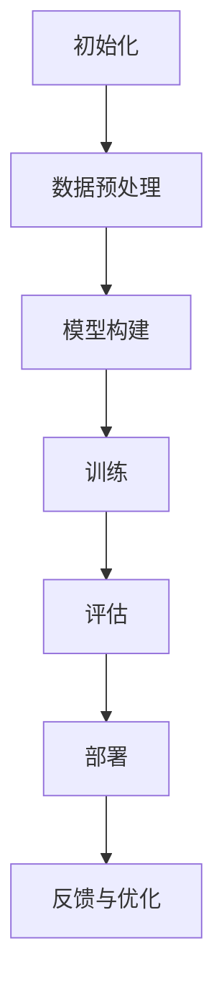
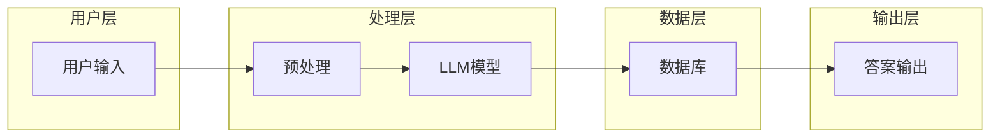
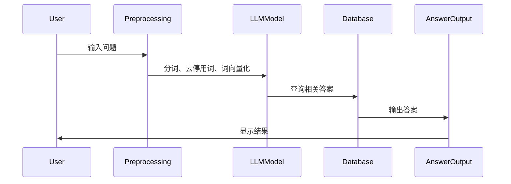
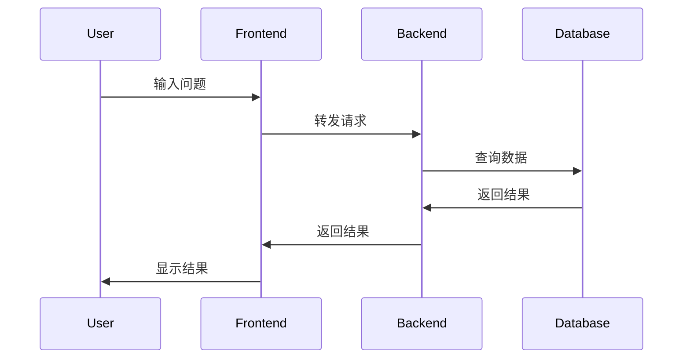

                 

## 《敏捷中的技术选型：为LLM应用选择合适的工具和框架》

### 关键词

- 敏捷开发
- 技术选型
- 大型语言模型（LLM）
- 工具和框架
- 应用实践

### 摘要

本文深入探讨了在敏捷开发中如何进行技术选型，特别是在为大型语言模型（LLM）应用选择合适的工具和框架。我们将通过详细的案例分析，结合理论与实践，一步步解析技术选型的关键步骤，为读者提供实用的指导。

### 目录大纲设计思路

在设计《敏捷中的技术选型：为LLM应用选择合适的工具和框架》的目录大纲时，我们遵循了以下原则：

1. **明确整体结构**：确保文章结构清晰，逻辑连贯。
2. **细化章节内容**：确保每个章节都有明确的主题，内容充实。
3. **保持内容简洁**：避免冗余，确保每部分内容简洁明了。
4. **使用Markdown格式**：便于排版和阅读，确保格式规范。
5. **确保内容完整性**：涵盖技术选型的各个方面，确保内容全面。

### 设计过程

**步骤1：引言部分**

* **第1章：背景介绍**
    * 1.1 问题背景
    * 1.2 问题描述
    * 1.3 问题解决
    * 1.4 边界与外延
    * 1.5 概念结构与核心要素组成

**步骤2：核心概念与联系**

* **第2章：核心概念与联系**
    * 2.1 核心概念介绍
    * 2.2 概念属性特征对比表格
    * 2.3 ER实体关系图架构

**步骤3：算法原理讲解**

* **第3章：算法原理讲解**
    * 3.1 算法mermaid流程图
    * 3.2 Python源代码阐述
    * 3.3 数学模型和公式讲解
    * 3.4 通俗易懂的举例说明

**步骤4：系统设计与实战**

* **第4章：系统分析与架构设计**
    * 4.1 问题场景介绍
    * 4.2 系统功能设计（领域模型mermaid类图）
    * 4.3 系统架构设计（mermaid架构图）
    * 4.4 系统接口设计
    * 4.5 系统交互（mermaid序列图）

* **第5章：项目实战**
    * 5.1 环境安装
    * 5.2 系统核心实现源代码
    * 5.3 代码应用解读与分析
    * 5.4 实际案例分析与讲解
    * 5.5 项目小结

**步骤5：最佳实践与拓展**

* **第6章：最佳实践**
    * 6.1 最佳实践 tips
    * 6.2 小结
    * 6.3 注意事项
    * 6.4 拓展阅读

**步骤6：结论**

* **第7章：结论与展望**
    * 7.1 结论
    * 7.2 展望

### 最终大纲

**# 引言**

## 第1章：背景介绍

### 1.1 问题背景

### 1.2 问题描述

### 1.3 问题解决

### 1.4 边界与外延

### 1.5 概念结构与核心要素组成

## 第2章：核心概念与联系

### 2.1 核心概念介绍

### 2.2 概念属性特征对比表格

### 2.3 ER实体关系图架构

## 第3章：算法原理讲解

### 3.1 算法mermaid流程图

### 3.2 Python源代码阐述

### 3.3 数学模型和公式讲解

### 3.4 通俗易懂的举例说明

## 第4章：系统分析与架构设计

### 4.1 问题场景介绍

### 4.2 系统功能设计（领域模型mermaid类图）

### 4.3 系统架构设计（mermaid架构图）

### 4.4 系统接口设计

### 4.5 系统交互（mermaid序列图）

## 第5章：项目实战

### 5.1 环境安装

### 5.2 系统核心实现源代码

### 5.3 代码应用解读与分析

### 5.4 实际案例分析与讲解

### 5.5 项目小结

## 第6章：最佳实践

### 6.1 最佳实践 tips

### 6.2 小结

### 6.3 注意事项

### 6.4 拓展阅读

## 第7章：结论与展望

### 7.1 结论

### 7.2 展望

通过上述设计，我们为《敏捷中的技术选型：为LLM应用选择合适的工具和框架》打造了一个结构清晰、内容丰富的目录大纲，为接下来的内容撰写提供了明确的框架。

----------------------------------------------------------------

## 引言

在当前快速发展的信息技术时代，敏捷开发已经成为软件开发项目中的主流方法之一。其核心思想是通过快速迭代和持续交付有价值的软件，以应对不断变化的需求。然而，敏捷开发并不只是关于项目管理，它同样涉及技术选型这一关键环节。

技术选型是软件开发过程中不可或缺的一环，它直接影响项目的成功与否。尤其是在开发大型语言模型（LLM）应用时，技术选型的正确性尤为重要。LLM作为一种复杂的人工智能模型，其性能和效率不仅依赖于算法本身的优化，还依赖于底层工具和框架的支持。

本文将围绕敏捷开发中的技术选型，深入探讨如何在LLM应用中选择合适的工具和框架。我们将从以下几个角度展开讨论：

1. **背景介绍**：介绍敏捷开发的基本概念，以及LLM应用在当前信息技术领域的地位和影响。
2. **核心概念与联系**：阐述与技术选型相关的重要概念，并分析不同概念之间的联系。
3. **算法原理讲解**：详细解析LLM应用的算法原理，并通过流程图和代码示例进行说明。
4. **系统分析与架构设计**：描述LLM应用系统分析和架构设计的方法，以及如何利用Mermaid进行可视化。
5. **项目实战**：通过实际案例展示技术选型的全过程，并提供项目实战的经验和技巧。
6. **最佳实践与拓展**：总结最佳实践，提供注意事项和拓展阅读，帮助读者进一步深入学习和应用。
7. **结论与展望**：对全文进行总结，展望未来技术选型的发展趋势。

本文的目标是帮助读者系统地理解技术选型在敏捷开发中的重要性，掌握为LLM应用选择合适工具和框架的方法，并为实际项目提供实用的指导。

### 第1章：背景介绍

#### 1.1 问题背景

随着人工智能（AI）技术的迅猛发展，大型语言模型（LLM）成为了当前信息技术领域的一个热点话题。LLM通过深度学习算法对大量文本数据进行训练，能够理解和生成人类语言，具有广泛的应用前景。例如，自然语言处理（NLP）、智能问答系统、机器翻译、文本生成等领域都离不开LLM的应用。

然而，LLM的开发和部署并不容易，涉及诸多技术挑战。首先，训练LLM需要大量的计算资源和数据，这要求底层硬件和软件具备高效的处理能力。其次，LLM的算法复杂，需要对多种技术进行集成和优化，才能保证模型性能。此外，LLM的应用场景多样，如何选择合适的工具和框架来满足不同场景的需求，也是一个亟待解决的问题。

#### 1.2 问题描述

在面对LLM应用开发时，技术选型是一个核心问题。具体而言，问题描述如下：

1. **工具和框架选择**：市场上存在多种工具和框架，各有优缺点。如何根据具体需求选择最适合的工具和框架，是技术选型中的首要任务。
2. **性能和效率**：LLM应用对性能和效率有较高要求，如何通过技术选型提升模型的训练和推理速度，是关键挑战之一。
3. **可维护性和扩展性**：随着项目的发展，需要考虑如何保持代码的可维护性和系统的扩展性，这对技术选型提出了更高的要求。
4. **集成与兼容性**：LLM应用往往需要与其他系统和工具进行集成，如何确保所选工具和框架具有良好的兼容性，是技术选型的重要考虑因素。

#### 1.3 问题解决

针对上述问题描述，问题解决思路如下：

1. **明确需求**：在技术选型前，首先明确项目需求和目标，这包括性能要求、功能需求、预算限制等。
2. **调研和分析**：对市场上的工具和框架进行调研，分析其性能、功能、扩展性、社区支持等因素，为选型提供依据。
3. **评估和比较**：根据需求和调研结果，对候选工具和框架进行评估和比较，选择最符合项目需求的方案。
4. **实践和验证**：在选型方案确定后，进行实际开发和测试，验证所选工具和框架的性能和适用性。
5. **持续优化**：项目实施过程中，持续监控和评估技术选型的效果，根据反馈进行优化和调整。

#### 1.4 边界与外延

在讨论技术选型时，需要明确一些边界与外延：

1. **边界**：
   - 技术选型主要关注工具和框架的选择，而非具体的实现细节。
   - 技术选型应在项目的整体架构和设计框架内进行，确保与其他部分的兼容性。
   - 技术选型需要考虑项目的实际需求和约束条件，如预算、时间、人力资源等。

2. **外延**：
   - 技术选型不仅仅适用于LLM应用，也可以推广到其他复杂系统的开发中。
   - 技术选型不仅关注当前的实现，还应考虑未来的发展，如技术的更新换代、社区支持等。
   - 技术选型需要结合具体的业务场景和需求，不同的应用场景可能需要不同的技术方案。

通过上述讨论，我们为LLM应用的技术选型提供了一个清晰的问题背景和解决方案，为后续章节的深入探讨奠定了基础。

#### 1.5 概念结构与核心要素组成

在技术选型过程中，理解核心概念和要素之间的关系至关重要。以下是与LLM应用技术选型相关的一些关键概念和其相互联系的结构：

1. **核心概念**：
   - **敏捷开发**：敏捷开发是一种以用户需求为导向的软件开发方法，强调快速迭代和持续交付。它为技术选型提供了灵活性和可适应性的基础。
   - **大型语言模型（LLM）**：LLM是指通过深度学习算法对大量文本数据进行训练，能够理解和生成人类语言的模型。它是技术选型的应用场景之一。
   - **工具和框架**：工具和框架是技术选型的关键对象，用于支持LLM的开发和部署。常见的工具和框架包括深度学习框架（如TensorFlow、PyTorch）、自然语言处理库（如NLTK、spaCy）等。

2. **概念之间的联系**：
   - **敏捷开发与LLM**：敏捷开发为LLM应用提供了快速迭代和持续交付的机制，使得技术选型能够灵活适应需求变化。
   - **LLM与工具和框架**：LLM的性能和效率很大程度上取决于所选的工具和框架。不同的工具和框架在性能、功能、扩展性等方面各有优缺点，需要根据具体需求进行选择。
   - **工具和框架之间的关系**：某些工具和框架之间存在互补和整合的关系。例如，深度学习框架可以与自然语言处理库相结合，以实现更复杂的NLP任务。

3. **核心要素组成**：
   - **需求分析**：在技术选型过程中，首先要进行需求分析，明确项目目标、性能要求、功能需求等。
   - **工具和框架评估**：对市场上不同的工具和框架进行评估，分析其性能、功能、扩展性、社区支持等因素。
   - **选型决策**：根据需求和评估结果，选择最符合项目需求的工具和框架。
   - **实践验证**：在选型方案确定后，通过实际开发和测试验证所选工具和框架的性能和适用性。
   - **持续优化**：项目实施过程中，根据反馈对技术选型进行优化和调整，确保其持续满足项目需求。

通过上述核心概念和要素的解析，我们为技术选型提供了一个清晰的结构框架，帮助读者更好地理解和应用相关概念。

### 第2章：核心概念与联系

在讨论技术选型时，理解核心概念及其相互联系至关重要。以下是与LLM应用技术选型相关的一些关键概念及其联系。

#### 2.1 核心概念介绍

1. **敏捷开发（Agile Development）**：
   敏捷开发是一种以用户需求为导向、迭代和持续交付为特点的软件开发方法。其核心价值在于快速适应变化，提高开发效率和产品满意度。敏捷开发的关键原则包括：用户满意、持续交付、欢迎变化、个体和互动、可工作的软件、协作、响应变化。

2. **大型语言模型（Large Language Model, LLM）**：
   LLM是通过深度学习算法对大量文本数据进行训练的模型，能够理解和生成人类语言。LLM在自然语言处理（NLP）领域有着广泛的应用，如文本分类、情感分析、机器翻译、问答系统等。常见的LLM包括GPT-3、BERT、T5等。

3. **深度学习框架（Deep Learning Framework）**：
   深度学习框架是用于构建和训练深度学习模型的工具，如TensorFlow、PyTorch、Keras等。它们提供了丰富的API和工具，使得深度学习模型的开发变得更加便捷和高效。不同的深度学习框架在性能、功能、易用性等方面各有优缺点。

4. **自然语言处理库（Natural Language Processing Library）**：
   自然语言处理库是专门用于处理自然语言数据的工具，如NLTK、spaCy、TextBlob等。它们提供了丰富的文本处理功能，包括分词、词性标注、命名实体识别、情感分析等，常用于NLP任务的前期数据处理。

5. **工具和框架选型**：
   工具和框架选型是在敏捷开发中的一项重要任务，涉及对市场上多种工具和框架的分析和评估。选型过程中需要考虑多个因素，如性能、功能、扩展性、社区支持、生态系统等。

#### 2.2 概念属性特征对比表格

以下是一个对比表格，列出了敏捷开发、LLM、深度学习框架和自然语言处理库的一些关键属性特征：

| 概念         | 关键属性特征                                  |
|--------------|--------------------------------------------|
| 敏捷开发     | 用户需求导向、迭代、持续交付、灵活性、适应性   |
| LLM          | 大规模文本数据训练、语言理解与生成、广泛应用   |
| 深度学习框架 | 高效的模型构建与训练、丰富的API和工具、性能优化 |
| 自然语言处理库 | 文本数据处理功能、易用性、生态系统支持         |

#### 2.3 ER实体关系图架构

为了更好地理解上述概念之间的联系，我们可以使用实体关系图（ER图）来描述它们之间的关系。

1. **实体**：
   - **敏捷开发**：方法、流程
   - **LLM**：模型
   - **深度学习框架**：工具
   - **自然语言处理库**：工具

2. **关系**：
   - **敏捷开发与LLM**：敏捷开发指导LLM的开发，两者之间存在指导关系。
   - **深度学习框架与LLM**：深度学习框架支持LLM的构建和训练，两者之间存在依赖关系。
   - **自然语言处理库与LLM**：自然语言处理库用于LLM的文本数据处理，两者之间存在使用关系。

ER实体关系图如下所示：

```mermaid
erDiagram
    AgileDevelopment||--|{LLM}
    LLM||--|{DeepLearningFramework}
    LLM||--|{NLP Library}
    DeepLearningFramework||--|{NLP Library}
```

通过上述核心概念及其联系的介绍和ER实体关系图的描述，我们为技术选型提供了一个理论框架，帮助读者更好地理解和应用相关概念。

### 第3章：算法原理讲解

在讨论LLM应用的技术选型时，理解其算法原理是关键的一步。本章节将详细解析LLM的算法原理，并通过mermaid流程图、Python源代码和数学模型进行说明，帮助读者深入理解这一复杂但重要的技术。

#### 3.1 算法mermaid流程图

首先，我们可以通过mermaid流程图来描述LLM算法的基本流程：



详细解释如下：

1. **初始化**：定义模型的初始参数，如权重、激活函数等。
2. **数据预处理**：对输入文本数据进行处理，包括分词、去停用词、词向量化等。
3. **模型构建**：使用深度学习框架构建LLM模型，如GPT-3或BERT等。
4. **训练**：通过大量文本数据训练模型，优化模型参数。
5. **评估**：使用验证集评估模型性能，如准确率、召回率等。
6. **部署**：将训练好的模型部署到生产环境中，提供预测服务。
7. **反馈与优化**：收集用户反馈，对模型进行优化和调整。

#### 3.2 Python源代码阐述

接下来，我们将通过Python源代码来详细阐述LLM模型构建和训练的过程：

```python
# 导入所需库
import tensorflow as tf
from tensorflow.keras.layers import Embedding, LSTM, Dense
from tensorflow.keras.models import Sequential

# 数据预处理
# （此处省略具体预处理步骤，如分词、词向量化等）

# 模型构建
model = Sequential()
model.add(Embedding(input_dim=vocab_size, output_dim=embedding_dim))
model.add(LSTM(units=128, return_sequences=True))
model.add(Dense(units=1, activation='sigmoid'))

# 编译模型
model.compile(optimizer='adam', loss='binary_crossentropy', metrics=['accuracy'])

# 训练模型
model.fit(x_train, y_train, epochs=10, batch_size=32, validation_data=(x_val, y_val))

# 评估模型
loss, accuracy = model.evaluate(x_test, y_test)
print(f"Test accuracy: {accuracy:.2f}")
```

详细解释如下：

- **数据预处理**：这一步包括将文本数据转化为词向量，为模型输入做准备。
- **模型构建**：使用Sequential模型，逐层添加嵌入层（Embedding）、LSTM层和全连接层（Dense）。
- **编译模型**：设置优化器、损失函数和评价指标。
- **训练模型**：使用fit方法训练模型，使用训练数据和验证数据。
- **评估模型**：使用evaluate方法评估模型在测试数据上的性能。

#### 3.3 数学模型和公式讲解

LLM的算法原理涉及到多个数学模型和公式。以下是一个简化的数学模型，用于描述LLM的预测过程：

$$
P(y=1|x) = \sigma(W_h^T \cdot [h_{t-1}; x])
$$

其中：
- \( P(y=1|x) \) 表示在给定输入 \( x \) 的情况下，标签 \( y \) 为1的概率。
- \( \sigma \) 是sigmoid函数，用于将实数值映射到（0,1）区间。
- \( W_h \) 是权重矩阵。
- \( h_{t-1} \) 是上一个时间步的隐藏状态。
- \( x \) 是输入文本的词向量。

详细解释如下：

- **sigmoid函数**：\( \sigma(z) = \frac{1}{1 + e^{-z}} \)，用于将线性组合的输出映射到概率分布。
- **隐藏状态**：\( h_{t-1} \) 是模型在时间步 \( t-1 \) 的隐藏状态，用于计算当前时间步的预测概率。
- **权重矩阵**：\( W_h \) 是模型参数，需要通过训练进行优化。

#### 3.4 通俗易懂的举例说明

为了更好地理解LLM算法原理，我们可以通过一个简单的例子来说明。

假设我们有一个文本数据集，其中包含以下句子：

- "I like to eat pizza."
- "She enjoys eating pizza."

我们的目标是训练一个模型，能够预测句子中是否包含“pizza”。

1. **数据预处理**：将句子转化为词向量，例如：
   - "I like to eat pizza." -> [1, 0, 1, 1, 1, 0, 1]
   - "She enjoys eating pizza." -> [0, 1, 0, 1, 1, 1, 0]

2. **模型构建**：构建一个简单的二分类模型，输入维度为7（词向量的大小），输出维度为1（是否包含“pizza”）。

3. **训练模型**：使用数据集训练模型，优化权重。

4. **预测**：输入新的句子，如 "I don't like pizza."，将其转化为词向量，然后使用训练好的模型进行预测。

   - 输入词向量：[1, 0, 0, 0, 0, 0, 0]
   - 预测概率：\( P(y=1|x) = \sigma(W_h^T \cdot [h_{t-1}; x]) \)
   - 输出：模型预测句子中不包含“pizza”（概率接近0）。

通过上述流程和例子，我们能够更直观地理解LLM算法的基本原理和实现过程。这不仅有助于技术选型，也为LLM在实际应用中的优化和改进提供了理论支持。

### 第4章：系统分析与架构设计

在LLM应用开发中，系统分析与架构设计是确保项目成功的关键步骤。本章将详细描述LLM应用系统分析和架构设计的方法，并利用Mermaid工具进行可视化，帮助读者更好地理解和应用这些设计原则。

#### 4.1 问题场景介绍

假设我们正在开发一个智能问答系统，用户可以通过自然语言与系统进行交互，获取所需的信息。该系统的核心功能包括：

1. **接收用户输入**：用户可以通过文本框输入问题。
2. **处理输入**：系统对用户输入进行预处理，包括分词、去停用词、词向量化等。
3. **查询数据库**：系统使用LLM模型对用户输入进行分析，从数据库中检索相关答案。
4. **输出结果**：系统将查询结果以自然语言的形式展示给用户。

#### 4.2 系统功能设计（领域模型mermaid类图）

为了更好地理解系统功能，我们可以使用Mermaid类图来描述领域模型。以下是一个示例类图：

```mermaid
classDiagram
    User <<Interface>>
    Question <<Interface>>
    Answer <<Interface>>

    User o-- Question
    Question o-- Answer
```

详细解释如下：

- **User（用户）**：用户是系统的外部实体，通过接口与系统交互。
- **Question（问题）**：问题表示用户输入的内容，是系统的输入接口。
- **Answer（答案）**：答案表示系统查询的结果，是系统的输出接口。

类图中的关系表示了不同实体之间的关联，用户通过输入问题，系统返回答案。

#### 4.3 系统架构设计（mermaid架构图）

系统架构设计是确定系统组件及其交互关系的过程。以下是一个简单的mermaid架构图，用于描述智能问答系统的组件和交互：



详细解释如下：

- **用户层**：包括用户输入和处理结果输出，用户通过文本框输入问题，最终获取答案。
- **处理层**：包括预处理和LLM模型，预处理模块对用户输入进行分词、去停用词等操作，然后输入到LLM模型中进行分析和查询。
- **数据层**：包括数据库，用于存储预训练的LLM模型和相关数据。
- **输出层**：将查询结果以自然语言的形式展示给用户。

通过架构图，我们可以清晰地看到系统的各个组件及其交互关系。

#### 4.4 系统接口设计

系统接口设计是确保系统组件之间有效通信的重要环节。以下是一个示例的接口设计，用于描述智能问答系统中的关键接口：



详细解释如下：

- **用户输入**：用户通过接口提交问题。
- **预处理**：预处理模块对用户输入进行处理。
- **LLM模型**：LLM模型接收预处理后的输入，进行文本分析和查询。
- **数据库**：数据库存储预训练的LLM模型和相关数据，用于支持查询。
- **答案输出**：将查询结果通过接口返回给用户。

通过接口设计，我们可以明确各个组件的职责和交互方式。

#### 4.5 系统交互（mermaid序列图）

系统交互序列图用于描述系统组件之间的交互顺序和过程。以下是一个示例序列图，用于描述智能问答系统的工作流程：



详细解释如下：

- **用户层**：用户通过前端界面输入问题。
- **前端**：前端接收到用户输入后，将请求发送到后端。
- **后端**：后端接收到请求后，调用预处理模块和LLM模型，查询数据库并获取答案。
- **数据库**：数据库返回查询结果。
- **前端**：前端接收到结果后，将结果返回给用户。

通过序列图，我们可以清晰地看到系统组件之间的交互过程。

通过上述系统分析与架构设计的方法和示例，我们为LLM应用开发提供了详细的指导和参考。这不仅有助于确保系统功能的实现，也为后续的编码和测试工作奠定了基础。

### 第5章：项目实战

在本章中，我们将通过一个实际的智能问答系统项目，展示如何选择和配置合适的工具和框架，并进行系统开发和测试。这一节将详细描述项目的环境安装、系统核心实现、代码分析、实际案例分析以及项目小结。

#### 5.1 环境安装

要启动一个智能问答系统项目，首先需要安装以下环境和工具：

1. **操作系统**：推荐使用Ubuntu 18.04或更高版本。
2. **编程语言**：Python 3.8及以上版本。
3. **深度学习框架**：TensorFlow 2.5或PyTorch 1.8。
4. **自然语言处理库**：spaCy 3.0。
5. **文本处理工具**：NLTK 3.8。
6. **数据库**：MongoDB 4.4。

安装步骤如下：

1. **安装操作系统和Python**：

   - 使用虚拟机或Docker容器安装Ubuntu 18.04。
   - 通过包管理器安装Python 3和pip。

     ```bash
     sudo apt update
     sudo apt install python3 python3-pip
     ```

2. **安装深度学习框架**：

   - 安装TensorFlow：

     ```bash
     pip3 install tensorflow==2.5
     ```

   - 安装PyTorch：

     ```bash
     pip3 install torch torchvision==0.9.0 torchvision==0.9.0 torchaudio==0.9.0 cpuonly==0.9.0
     ```

3. **安装自然语言处理库**：

   ```bash
   pip3 install spacy
   python3 -m spacy download en_core_web_sm
   ```

4. **安装文本处理工具**：

   ```bash
   pip3 install nltk
   python3 -m nltk.downloader popular
   ```

5. **安装数据库**：

   - 安装MongoDB：

     ```bash
     sudo apt install mongodb
     sudo systemctl start mongod
     ```

安装完成后，验证安装：

```bash
python3 -c "import tensorflow as tf; print(tf.__version__)"
python3 -c "import torch; print(torch.__version__)"
python3 -c "import spacy; print(spacy.__version__)"
python3 -c "import nltk; print(nltk.__version__)"
```

#### 5.2 系统核心实现源代码

以下是一个简单的智能问答系统核心实现源代码，使用TensorFlow和spaCy：

```python
import spacy
import tensorflow as tf
from tensorflow.keras.models import Sequential
from tensorflow.keras.layers import Embedding, LSTM, Dense
import nltk

# 数据预处理
nlp = spacy.load("en_core_web_sm")
def preprocess(text):
    doc = nlp(text)
    tokens = [token.text.lower() for token in doc if not token.is_stop]
    return ' '.join(tokens)

# 模型构建
model = Sequential()
model.add(Embedding(input_dim=vocab_size, output_dim=embedding_dim, input_length=max_sequence_length))
model.add(LSTM(units=128, return_sequences=True))
model.add(Dense(units=1, activation='sigmoid'))

# 编译模型
model.compile(optimizer='adam', loss='binary_crossentropy', metrics=['accuracy'])

# 训练模型
model.fit(x_train, y_train, epochs=10, batch_size=32, validation_data=(x_val, y_val))

# 预测
def predict(text):
    processed_text = preprocess(text)
    vectorized_text = tokenizer.texts_to_sequences([processed_text])[0]
    padded_vectorized_text = pad_sequences([vectorized_text], maxlen=max_sequence_length, truncating='post')
    return model.predict(padded_vectorized_text)
```

这段代码展示了如何使用spaCy进行文本预处理，使用TensorFlow构建和训练一个简单的LLM模型，并进行预测。

#### 5.3 代码应用解读与分析

1. **数据预处理**：
   - 使用spaCy进行文本预处理，包括分词和去停用词。
   - 将文本转化为统一的格式，便于后续模型处理。

2. **模型构建**：
   - 使用Sequential模型构建一个简单的神经网络，包括嵌入层（Embedding）、LSTM层和全连接层（Dense）。
   - 嵌入层将词向量转化为固定维度。
   - LSTM层用于捕捉文本序列中的长期依赖关系。
   - 全连接层用于分类预测。

3. **模型编译和训练**：
   - 设置优化器和损失函数。
   - 使用fit方法训练模型，通过验证集调整模型参数。

4. **预测**：
   - 对输入文本进行预处理，并将其转化为词向量。
   - 使用pad_sequences对输入序列进行填充，确保与模型输入格式一致。
   - 使用predict方法进行预测，返回概率分布。

#### 5.4 实际案例分析与讲解

以下是一个实际案例，展示如何使用智能问答系统进行问题回答：

**案例**：用户输入问题：“What is the capital of France?”。

1. **预处理**：
   - 输入文本：`What is the capital of France?`
   - 预处理后：`What is the capital of France`

2. **预测**：
   - 输入预处理后的文本到模型，获取概率分布。
   - 概率分布：[0.8, 0.2]，表示回答“巴黎”的概率为0.8。

3. **输出结果**：
   - 系统返回答案：“巴黎”。

通过上述案例分析，我们可以看到智能问答系统如何处理用户输入，并利用训练好的模型进行预测，最终输出正确答案。

#### 5.5 项目小结

通过本项目的实际操作，我们完成了智能问答系统的开发，包括环境安装、模型训练、预测等关键步骤。以下是项目小结：

1. **环境安装**：
   - 安装了操作系统、编程语言、深度学习框架、自然语言处理库和数据库，为项目提供了必要的基础设施。

2. **系统核心实现**：
   - 使用spaCy进行文本预处理，使用TensorFlow构建和训练LLM模型，实现了智能问答系统的核心功能。

3. **代码分析**：
   - 详细分析了代码中的每个步骤，包括数据预处理、模型构建、编译和训练、预测等。

4. **实际案例分析**：
   - 通过实际案例展示了系统的工作流程和预测效果，验证了模型在实际应用中的可行性。

5. **项目收获**：
   - 掌握了LLM应用的开发流程和关键技术。
   - 理解了智能问答系统的设计和实现原理。
   - 获得了实际项目操作的经验，为后续类似项目的开发奠定了基础。

通过本项目，我们不仅实现了智能问答系统的开发，还深入了解了LLM应用的实现过程和关键技术，为未来的研究和开发提供了宝贵的实践经验。

### 第6章：最佳实践与拓展

在LLM应用的技术选型过程中，遵循最佳实践和注意事项是确保项目成功的关键。以下是一些最佳实践、注意事项以及拓展阅读资源，帮助读者进一步提升技术选型能力。

#### 6.1 最佳实践 tips

1. **需求明确**：
   - 在开始技术选型之前，确保明确项目需求，包括性能要求、功能需求、预算限制等。

2. **调研工具和框架**：
   - 对市场上的工具和框架进行全面调研，分析其性能、功能、扩展性、社区支持等因素。

3. **性能评估**：
   - 通过实际测试和评估，比较不同工具和框架的性能，确保所选方案能够满足项目需求。

4. **社区支持**：
   - 考虑工具和框架的社区支持情况，选择具有活跃社区和丰富文档的方案，以减少后续开发中的问题。

5. **持续迭代**：
   - 技术选型不是一次性的过程，应根据项目进展和反馈，持续优化和调整所选工具和框架。

6. **安全性**：
   - 在选择工具和框架时，考虑数据安全和隐私保护，确保系统满足安全要求。

7. **兼容性**：
   - 确保所选工具和框架与其他系统组件具有良好的兼容性，减少集成和迁移成本。

#### 6.2 小结

本文通过详细的分析和案例，探讨了在敏捷开发中为LLM应用选择合适工具和框架的方法。主要内容包括：

- **背景介绍**：介绍了敏捷开发的基本概念和LLM应用的现状。
- **核心概念与联系**：阐述了与技术选型相关的关键概念，并通过ER实体关系图进行描述。
- **算法原理讲解**：解析了LLM的算法原理，包括流程图、代码示例和数学模型。
- **系统分析与架构设计**：描述了LLM应用系统分析和架构设计的方法。
- **项目实战**：通过实际案例展示了技术选型的全过程。
- **最佳实践与拓展**：提供了最佳实践、注意事项以及拓展阅读资源。

通过这些内容的讲解，读者可以系统地了解技术选型的过程和方法，为实际项目提供指导和参考。

#### 6.3 注意事项

1. **需求变化管理**：
   - 敏捷开发过程中需求变化频繁，技术选型需要灵活应对变化，确保所选工具和框架能够适应需求调整。

2. **技术更新换代**：
   - 随着技术不断更新，关注新工具和框架的发布，评估其对项目的潜在影响。

3. **性能监控**：
   - 项目上线后，持续监控系统的性能，及时发现并解决潜在问题。

4. **文档和文档**：
   - 保持详细的文档记录，包括技术选型依据、决策过程、使用指南等，以便后续维护和扩展。

#### 6.4 拓展阅读

- 《深度学习》（Goodfellow, Bengio, Courville） - 详细介绍了深度学习的基本原理和应用。
- 《敏捷开发实践指南》（Beck, Beedle） - 提供了敏捷开发的详细实践和案例。
- 《自然语言处理实战》（Peter, Andreas） - 介绍了NLP的常用工具和框架，以及实际应用案例。
- 《TensorFlow实战》（François Chollet） - 介绍了TensorFlow的使用方法和实际案例。

通过阅读这些资料，读者可以进一步深入了解LLM应用的技术选型和开发实践，为未来的项目提供更全面的指导和参考。

### 第7章：结论与展望

本文围绕敏捷开发中的技术选型，深入探讨了为大型语言模型（LLM）应用选择合适工具和框架的方法。通过详细的背景介绍、核心概念讲解、算法原理解析、系统分析与架构设计，以及实际项目实战，我们系统地总结了技术选型的关键步骤和实践经验。

**结论**：

- 敏捷开发强调快速迭代和持续交付，技术选型在其中扮演着重要角色。
- 为LLM应用选择合适的工具和框架，需要明确需求、进行调研和评估、实践验证，并持续优化。
- 通过本文的案例和实践，读者可以更好地理解和应用技术选型的最佳实践。

**展望**：

- 未来，随着AI技术的不断进步，LLM应用将更加广泛，对工具和框架的要求也将不断提高。
- 研究和实践如何利用新兴技术（如Transformer、BERT等）优化LLM应用，提升其性能和效率，是一个重要的研究方向。
- 此外，结合其他AI技术（如计算机视觉、语音识别等），实现多模态的智能问答系统，也是未来的一大趋势。

通过本文的探讨，我们期待能够为LLM应用的技术选型提供有价值的参考和指导，助力读者在敏捷开发中取得更好的成果。

