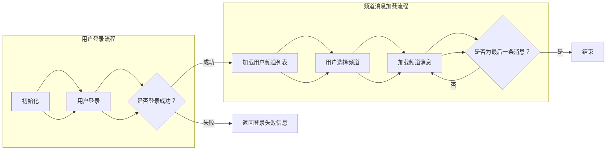
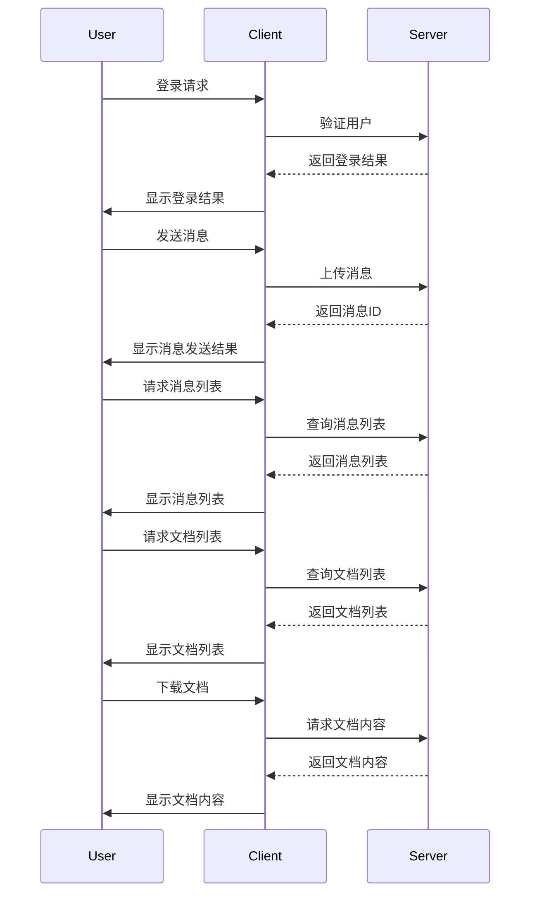
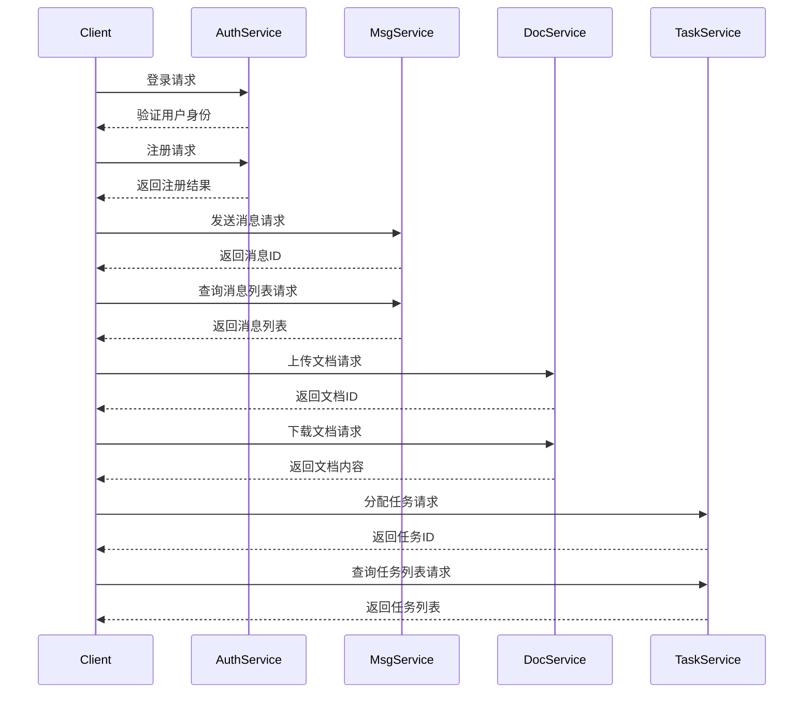
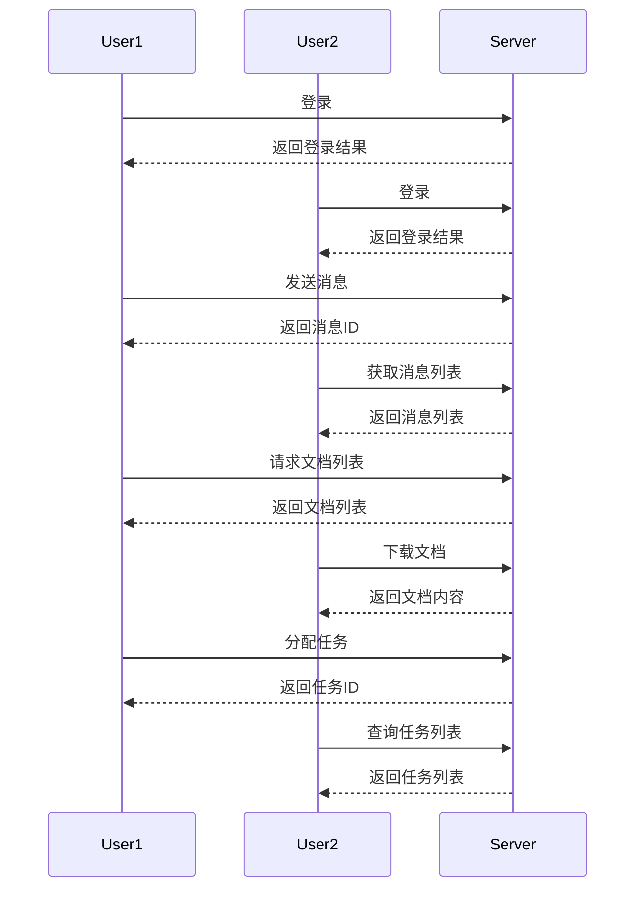

                 


### 1. 引言

随着信息技术的迅猛发展，敏捷开发已经成为了现代软件开发的主流模式。在敏捷开发中，团队协作效率至关重要，而远程协作工具则成为了支持分布式团队开发的核心基础设施。远程协作工具不仅能够提升团队沟通效率，还能够保证开发流程的透明性和一致性。本文旨在深入探讨远程协作工具在敏捷开发中的作用，分析其核心概念、算法原理，并通过实际项目案例展示如何有效地运用这些工具支持分布式LLM（大型语言模型）开发团队。

本文将按照以下步骤展开：

1. **背景介绍**：首先介绍远程协作工具的概念、发展历程及其在敏捷开发中的重要性。
2. **核心概念与联系**：详细讲解远程协作工具的核心概念，包括定义、特点、分类及其相互关系。
3. **算法原理讲解**：通过算法流程图和Python代码详细阐述一种或多种远程协作工具的核心算法。
4. **数学模型和公式**：介绍远程协作工具相关的数学模型，使用LaTeX格式表示，并配以详细讲解和实例。
5. **系统分析与架构设计**：分析远程协作工具的系统需求，设计系统架构，包括领域模型图和架构图。
6. **项目实战**：提供实际的项目案例，包括环境安装、核心实现、代码解析和案例分析。
7. **最佳实践与总结**：总结书中的关键点，给出实践建议，注意事项，并提供拓展阅读。

### 2. 远程协作工具概述

远程协作工具是指支持团队成员在不同地理位置进行有效沟通、协作和共享信息的软件工具。这些工具的出现解决了传统团队协作中因地理位置分散而带来的沟通障碍和协作效率低下的问题。随着远程工作的普及，远程协作工具的重要性日益凸显。

#### 2.1 问题背景

在传统的软件开发模式中，团队成员通常需要在同一物理空间内进行工作。这种方式在团队规模较小时尚可，但随着团队规模的扩大，特别是全球分布式团队的兴起，传统的工作模式逐渐暴露出以下问题：

- **沟通成本高昂**：团队成员分布在不同地理位置，沟通成本高，沟通效率低。
- **协作困难**：团队成员无法实时共享信息和文档，协作流程受到阻碍。
- **工作透明性差**：团队成员之间缺乏透明的进度汇报和任务分配机制，导致项目管理困难。

#### 2.2 远程协作工具的定义与重要性

远程协作工具是一种能够跨越地理位置限制，提供实时沟通、文件共享、任务协作等功能的软件平台。其核心功能包括：

- **实时沟通**：通过聊天工具、视频会议等方式实现团队成员之间的实时沟通。
- **文件共享**：支持团队成员共享文档、代码和其他文件，并提供版本控制和权限管理。
- **任务协作**：提供任务管理功能，支持任务分配、进度跟踪和协作。

远程协作工具的重要性体现在以下几个方面：

- **提高团队协作效率**：远程协作工具能够减少沟通成本，提高信息传递速度，从而提高团队协作效率。
- **支持分布式团队**：远程协作工具支持全球分布式团队的协作，使得团队可以跨越地理障碍，共同完成项目。
- **保证工作透明性**：远程协作工具能够实时更新任务状态和进度，确保团队工作透明，便于项目经理进行管理。

#### 2.3 远程协作工具的分类与发展

远程协作工具种类繁多，根据功能和应用场景的不同，可以将其分为以下几类：

- **通信工具**：如Slack、Microsoft Teams、Zoom等，主要用于实时沟通和消息传递。
- **文档协作工具**：如Google Docs、Notion、Confluence等，主要用于文档共享和协作编辑。
- **项目管理工具**：如Trello、Jira、Asana等，主要用于任务管理、进度跟踪和团队协作。

随着技术的进步，远程协作工具的功能和应用场景也在不断扩展。例如，随着人工智能技术的发展，一些远程协作工具开始集成智能助手和自动化功能，以提高团队协作效率。此外，区块链技术的应用也为远程协作工具带来了新的可能性，如实现去中心化的文件共享和权限管理。

### 3. 核心概念与联系

在深入探讨远程协作工具之前，我们需要明确其核心概念和特点，以便更好地理解其在敏捷开发中的应用。

#### 3.1 通信工具

通信工具是远程协作工具中最基本的一类，主要用于团队成员之间的实时沟通和消息传递。其核心特点包括：

- **实时性**：通信工具能够实现团队成员之间的实时消息传递，减少沟通延迟。
- **多样性**：通信工具支持多种沟通方式，如文本消息、语音通话、视频会议等。
- **集成性**：通信工具通常与其他远程协作工具（如文档协作工具和项目管理工具）集成，实现一站式协作。

常见的通信工具有：

- **Slack**：一款流行的团队沟通工具，支持文本消息、语音通话和视频会议。
- **Microsoft Teams**：微软推出的团队沟通平台，集成了聊天、会议、文档协作等功能。
- **Zoom**：一款专业的视频会议工具，适用于远程团队进行实时沟通。

#### 3.2 文档协作工具

文档协作工具主要用于团队成员共享文档、进行协作编辑和版本控制。其核心特点包括：

- **共享性**：文档协作工具支持团队成员共享文档，并实现实时协作编辑。
- **版本控制**：文档协作工具能够记录文档的修改历史，实现版本控制。
- **权限管理**：文档协作工具提供权限管理功能，确保文档的访问和修改权限可控。

常见的文档协作工具有：

- **Google Docs**：谷歌推出的在线文档编辑工具，支持多人实时协作。
- **Notion**：一款功能强大的文档协作平台，支持多种类型的文档和元素。
- **Confluence**：一款专业的文档协作工具，适用于团队编写、管理和分享知识。

#### 3.3 项目管理工具

项目管理工具主要用于任务管理、进度跟踪和团队协作。其核心特点包括：

- **任务管理**：项目管理工具能够分配任务、跟踪任务进度，确保项目按计划进行。
- **进度跟踪**：项目管理工具提供项目进度报告和图表，帮助团队成员了解项目进展。
- **协作功能**：项目管理工具支持团队成员之间的协作，如评论、通知和协作编辑。

常见项目管理工具有：

- **Trello**：一款基于看板的任务管理工具，界面简洁直观。
- **Jira**：一款功能强大的项目管理工具，适用于大型团队和复杂项目。
- **Asana**：一款灵活的项目管理工具，支持多种协作方式和项目管理方法。

#### 3.4 远程协作工具的ER模型

为了更好地理解远程协作工具之间的关系，我们可以使用实体关系图（ER模型）来表示。以下是远程协作工具的ER模型：

```mermaid
erDiagram
  --|{<父实体>}-- A
 |--|{<子实体>}-- B
 |--|{<子实体>}-- C
  |--|{<子实体>}-- D

  A ..|> B : 一对多关系
  A ..|> C : 一对多关系
  A ..|> D : 多对多关系

  class A {
    id : 主键
    name : 工具名称
  }

  class B {
    id : 主键
    name : 功能
    type : 工具类型
  }

  class C {
    id : 主键
    name : 功能
    type : 工具类型
  }

  class D {
    id : 主键
    name : 功能
    type : 工具类型
  }
```

在这个ER模型中，A表示远程协作工具，B、C、D分别表示通信工具、文档协作工具和项目管理工具。A与B、C之间存在一对多关系，表示一种远程协作工具可以包含多种功能。A与D之间存在多对多关系，表示一种远程协作工具可以与多种功能相关联。

### 4. 算法原理讲解

在远程协作工具中，核心算法通常涉及通信协议、数据同步、权限控制等方面。以下以一种常见的远程协作工具——Slack为例，介绍其核心算法原理。

#### 4.1 算法流程图



在这个流程图中，A表示初始化，即系统启动时执行的操作；B表示用户登录，C表示判断登录是否成功；D表示加载用户频道列表，F表示用户选择频道，G表示加载频道消息，H表示判断是否为最后一条消息。

#### 4.2 Python代码实现

以下是一个简化的Python代码实现，用于说明Slack核心算法的原理。

```python
import requests

# 用户登录
def login(username, password):
    url = "https://slack.com/api/authenticate"
    params = {
        "username": username,
        "password": password
    }
    response = requests.get(url, params=params)
    return response.json()

# 加载用户频道列表
def load_channel_list(token):
    url = "https://slack.com/api/conversations.list"
    params = {
        "token": token
    }
    response = requests.get(url, params=params)
    return response.json()

# 加载频道消息
def load_channel_messages(token, channel_id):
    url = "https://slack.com/api/conversations.history"
    params = {
        "token": token,
        "channel": channel_id
    }
    response = requests.get(url, params=params)
    return response.json()
```

在这个代码实现中，`login` 函数用于用户登录，`load_channel_list` 函数用于加载用户频道列表，`load_channel_messages` 函数用于加载频道消息。

#### 4.3 数学模型和公式讲解

在远程协作工具中，数据同步是一个关键问题。以下介绍一种常见的数据同步算法——拉模式（Pull-based Synchronization）。

拉模式算法的核心思想是客户端定期向服务器请求最新的数据，并根据返回的数据更新本地数据。以下是拉模式算法的数学模型：

$$
\text{同步时间间隔} = T
$$

$$
\text{本地数据版本} = V_{local}
$$

$$
\text{服务器数据版本} = V_{server}
$$

$$
\text{本地数据更新策略} = \left\{
\begin{array}{ll}
\text{如果 } V_{local} < V_{server}, & \text{则更新本地数据} \\
\text{如果 } V_{local} = V_{server}, & \text{则保持当前数据不变} \\
\text{如果 } V_{local} > V_{server}, & \text{则通知服务器更新数据}
\end{array}
\right.
$$

在这个模型中，`同步时间间隔` `T` 表示客户端与服务器之间的数据同步频率；`本地数据版本` `V_{local}` 和 `服务器数据版本` `V_{server}` 分别表示客户端和服务器上数据的版本号；`本地数据更新策略` 定义了根据服务器数据版本更新本地数据的规则。

#### 4.4 算法实例分析

假设一个远程协作工具的客户端和服务器之间的数据同步时间间隔为1小时，即 `T = 1小时`。现在，客户端的本地数据版本为 `V_{local} = 100`，服务器的数据版本为 `V_{server} = 101`。

根据拉模式算法的更新策略，客户端将向服务器请求最新的数据，并将本地数据版本更新为 `V_{local} = 101`。此时，客户端和服务器上的数据版本一致，同步过程结束。

如果服务器的数据版本继续更新，例如 `V_{server} = 102`，客户端将在下一次同步时发现数据版本差异，并通知服务器更新数据，以确保客户端和服务器上的数据保持一致。

### 5. 数学模型和公式

在远程协作工具的设计和实现中，数学模型和公式起到了关键作用，它们帮助我们理解和优化工具的性能。以下将介绍几个常见的数学模型和公式，并使用LaTeX进行表示。

#### 5.1 数据同步模型

数据同步模型用于描述客户端与服务器之间的数据同步过程。假设客户端和服务器之间的数据版本号分别为 `V_{client}` 和 `V_{server}`，同步时间间隔为 `T`。

$$
\text{同步策略} = \left\{
\begin{array}{ll}
\text{如果 } V_{client} < V_{server}, & \text{客户端请求更新数据} \\
\text{如果 } V_{client} = V_{server}, & \text{保持当前数据不变} \\
\text{如果 } V_{client} > V_{server}, & \text{服务器请求更新数据}
\end{array}
\right.
$$

#### 5.2 权限控制模型

在远程协作工具中，权限控制是确保数据安全的关键。假设用户 `U` 对资源 `R` 的访问权限为 `P`，权限模型可以表示为：

$$
\text{权限模型} = \left\{
\begin{array}{ll}
\text{如果 } P(U, R) = 1, & \text{用户可以访问资源} \\
\text{如果 } P(U, R) = 0, & \text{用户不能访问资源}
\end{array}
\right.
$$

#### 5.3 延迟模型

在远程协作工具中，延迟是影响用户体验的重要因素。假设客户端和服务器之间的延迟为 `L`，延迟模型可以表示为：

$$
\text{延迟模型} = L = \frac{D}{C}
$$

其中，`D` 表示数据传输距离，`C` 表示数据传输速率。

#### 5.4 损耗模型

在网络通信中，数据损耗是不可避免的。损耗模型用于描述数据在传输过程中可能出现的错误和丢失。假设数据传输过程中的损耗率为 `D`，损耗模型可以表示为：

$$
\text{损耗模型} = \text{数据损耗率} = D
$$

#### 5.5 实例说明

假设一个远程协作工具的客户端和服务器之间的延迟为 `L = 100ms`，数据传输距离为 `D = 100km`，数据传输速率为 `C = 1Gbps`。根据延迟模型，我们可以计算出延迟：

$$
L = \frac{D}{C} = \frac{100km}{1Gbps} = 100ms
$$

假设数据传输过程中的损耗率为 `D = 0.01`，根据损耗模型，我们可以计算出数据损耗率：

$$
\text{数据损耗率} = D = 0.01
$$

### 6. 系统分析与架构设计

为了更好地支持分布式LLM开发团队，我们需要对远程协作工具进行系统分析与架构设计。以下将从系统需求分析、领域模型、系统架构设计、系统接口设计和系统交互等方面进行介绍。

#### 6.1 系统需求分析

系统需求分析是系统设计与实现的基础，它帮助我们明确系统的功能需求和非功能需求。以下是远程协作工具的需求分析：

**功能需求：**
1. 实时通信：支持文本消息、语音通话和视频会议。
2. 文档共享：支持文档上传、下载和协作编辑。
3. 任务管理：支持任务分配、进度跟踪和协作。
4. 权限控制：支持用户权限管理，确保数据安全。

**非功能需求：**
1. 可靠性：系统应具备高可靠性，确保数据传输不丢失。
2. 性能：系统应具备高性能，支持大量用户同时在线。
3. 可扩展性：系统应具备良好的可扩展性，易于升级和维护。

#### 6.2 领域模型

领域模型是系统分析与设计的关键组成部分，它帮助我们理解系统的核心概念和关系。以下是远程协作工具的领域模型：

```mermaid
classDiagram
  User <<Class>> {
    id : 主键
    username : 用户名
    password : 密码
  }

  Channel <<Class>> {
    id : 主键
    name : 频道名称
    users : 用户列表
  }

  Message <<Class>> {
    id : 主键
    content : 消息内容
    timestamp : 发送时间
    sender : 发送者
    receiver : 接收者
  }

  Document <<Class>> {
    id : 主键
    name : 文档名称
    content : 文档内容
    creator : 创建者
    lastModifier : 最后修改者
  }

  Task <<Class>> {
    id : 主键
    title : 任务名称
    description : 任务描述
    status : 任务状态
    assignee : 被分配者
    dueDate : 截止日期
  }

  User "1" -- "*" Channel : 加入
  User "1" -- "*" Message : 发送
  User "1" -- "*" Task : 分配
  Channel "1" -- "*" Message : 存储
  Channel "1" -- "*" Document : 存储文档
  Document "1" -- "*" Message : 修改
  Task "1" -- "*" Message : 更新进度
```

在这个领域模型中，`User` 表示用户，`Channel` 表示频道，`Message` 表示消息，`Document` 表示文档，`Task` 表示任务。用户可以加入频道、发送消息、分配任务；频道可以存储消息和文档；文档可以修改消息；任务可以更新进度。

#### 6.3 系统架构设计

系统架构设计是系统实现的关键，它决定了系统的性能、可扩展性和可维护性。以下是远程协作工具的系统架构设计：



在这个架构设计中，`User` 表示用户，`Client` 表示客户端，`Server` 表示服务器。用户通过客户端向服务器发送登录请求，服务器验证用户身份后返回登录结果。用户还可以通过客户端发送消息、请求消息列表、请求文档列表和下载文档。

#### 6.4 系统接口设计

系统接口设计是系统架构的重要组成部分，它定义了系统内部各个模块之间的交互方式。以下是远程协作工具的系统接口设计：



在这个接口设计中，`AuthService` 负责用户身份验证和注册，`MsgService` 负责消息发送和查询，`DocService` 负责文档上传和下载，`TaskService` 负责任务分配和查询。

#### 6.5 系统交互设计

系统交互设计是系统实现过程中必不可少的一部分，它描述了系统内部各个模块之间的交互流程。以下是远程协作工具的系统交互设计：



在这个交互设计中，`User1` 和 `User2` 分别表示两个用户，他们通过服务器进行登录、发送消息、获取消息列表、请求文档列表、下载文档和分配任务等操作。

### 7. 项目实战

为了更好地展示远程协作工具在分布式LLM开发团队中的应用，我们将通过一个实际项目案例进行详细讲解。以下将介绍项目环境搭建、核心实现、代码解析和案例分析。

#### 7.1 项目环境搭建

首先，我们需要搭建项目环境。以下是一个基于Python和Django框架的远程协作工具项目环境搭建步骤：

1. 安装Python和Django框架：
   ```
   pip install python
   pip install django
   ```

2. 创建Django项目：
   ```
   django-admin startproject remote协作工具
   ```

3. 创建Django应用：
   ```
   python manage.py startapp communication
   python manage.py startapp document
   python manage.py startapp task
   ```

4. 配置数据库（SQLite、MySQL、PostgreSQL等）：

```python
# settings.py
DATABASES = {
    'default': {
        'ENGINE': 'django.db.backends.sqlite3',
        'NAME': BASE_DIR / 'db.sqlite3',
    }
}
```

5. 迁移数据库：

```
python manage.py makemigrations
python manage.py migrate
```

#### 7.2 核心实现

接下来，我们将介绍项目的核心实现，包括用户认证、消息发送和接收、文档共享和任务管理等功能。

**用户认证：**

```python
# authentication.py
from django.contrib.auth.models import User
from django.contrib.auth import authenticate, login

def register(username, password):
    user = User.objects.create_user(username=username, password=password)
    user.save()
    return user

def login(username, password):
    user = authenticate(username=username, password=password)
    if user is not None:
        login(request, user)
        return True
    else:
        return False
```

**消息发送和接收：**

```python
# message.py
from django.db import models
from user.models import User

class Message(models.Model):
    sender = models.ForeignKey(User, on_delete=models.CASCADE, related_name='sent_messages')
    receiver = models.ForeignKey(User, on_delete=models.CASCADE, related_name='received_messages')
    content = models.TextField()
    timestamp = models.DateTimeField(auto_now_add=True)

    def send_message(sender, receiver, content):
        message = Message(sender=sender, receiver=receiver, content=content)
        message.save()
        return message

    def get_messages(receiver):
        return Message.objects.filter(receiver=receiver).order_by('-timestamp')
```

**文档共享：**

```python
# document.py
from django.db import models
from user.models import User

class Document(models.Model):
    creator = models.ForeignKey(User, on_delete=models.CASCADE, related_name='created_documents')
    last_modifier = models.ForeignKey(User, on_delete=models.CASCADE, related_name='last_modified_documents')
    name = models.CharField(max_length=255)
    content = models.TextField()
    timestamp = models.DateTimeField(auto_now_add=True)

    def create_document(creator, name, content):
        document = Document(creator=creator, name=name, content=content)
        document.save()
        return document

    def update_document(last_modifier, document_id, content):
        document = Document.objects.get(id=document_id)
        document.last_modifier = last_modifier
        document.content = content
        document.save()
        return document

    def get_documents(creator):
        return Document.objects.filter(creator=creator).order_by('-timestamp')
```

**任务管理：**

```python
# task.py
from django.db import models
from user.models import User

class Task(models.Model):
    assignee = models.ForeignKey(User, on_delete=models.CASCADE, related_name='assigned_tasks')
    title = models.CharField(max_length=255)
    description = models.TextField()
    status = models.CharField(max_length=50)
    due_date = models.DateTimeField()
    timestamp = models.DateTimeField(auto_now_add=True)

    def create_task(assignee, title, description, due_date):
        task = Task(assignee=assignee, title=title, description=description, due_date=due_date)
        task.save()
        return task

    def update_task_status(task_id, status):
        task = Task.objects.get(id=task_id)
        task.status = status
        task.save()
        return task

    def get_tasks(assignee):
        return Task.objects.filter(assignee=assignee).order_by('-timestamp')
```

#### 7.3 代码解析与分析

在上述代码中，我们实现了用户认证、消息发送和接收、文档共享和任务管理等功能。以下是对核心代码的解析与分析：

1. **用户认证**：用户认证是远程协作工具的基础。我们使用Django框架内置的用户认证系统实现用户注册和登录功能。`register` 函数用于用户注册，`login` 函数用于用户登录。

2. **消息发送和接收**：消息发送和接收是远程协作工具的核心功能之一。我们定义了一个`Message` 模型，用于存储消息的发送者、接收者、内容和时间戳。`send_message` 函数用于发送消息，`get_messages` 函数用于获取接收者的消息列表。

3. **文档共享**：文档共享是远程协作工具的另一个核心功能。我们定义了一个`Document` 模型，用于存储文档的创建者、最后修改者、名称、内容和时间戳。`create_document` 函数用于创建文档，`update_document` 函数用于更新文档内容，`get_documents` 函数用于获取创建者的文档列表。

4. **任务管理**：任务管理是远程协作工具的重要功能。我们定义了一个`Task` 模型，用于存储任务的分配者、标题、描述、状态、截止日期和时间戳。`create_task` 函数用于创建任务，`update_task_status` 函数用于更新任务状态，`get_tasks` 函数用于获取分配者的任务列表。

#### 7.4 案例分析与详细讲解

以下是一个实际案例，用于展示如何使用远程协作工具支持分布式LLM开发团队。

**场景**：假设有一个分布式LLM开发团队，团队成员分布在不同的城市和国家。他们需要通过远程协作工具进行实时沟通、文档共享和任务管理。

**步骤**：

1. **用户注册和登录**：
   - 团队成员通过远程协作工具注册账号并登录。

2. **消息发送和接收**：
   - 团队成员通过工具发送和接收消息，进行实时沟通。

3. **文档共享**：
   - 团队成员创建和共享文档，进行协作编辑。

4. **任务管理**：
   - 团队成员分配任务、跟踪任务进度并更新任务状态。

**案例分析**：

1. **用户注册和登录**：
   - 团队成员通过远程协作工具注册账号并登录。在注册过程中，工具会验证用户身份，确保只有授权用户可以访问系统。

2. **消息发送和接收**：
   - 团队成员通过工具发送和接收消息，进行实时沟通。工具支持文本消息、语音通话和视频会议，确保团队成员之间的沟通无障碍。

3. **文档共享**：
   - 团队成员创建和共享文档，进行协作编辑。工具提供文档上传、下载和协作编辑功能，支持多人同时编辑同一文档，确保文档的一致性和实时性。

4. **任务管理**：
   - 团队成员分配任务、跟踪任务进度并更新任务状态。工具提供任务分配、进度跟踪和协作功能，确保任务按时完成。

通过上述案例，我们可以看到远程协作工具在分布式LLM开发团队中的实际应用。工具为团队成员提供了实时沟通、文档共享和任务管理的一站式解决方案，大大提高了团队协作效率和项目完成质量。

### 8. 最佳实践与总结

#### 8.1 最佳实践

1. **选择合适的远程协作工具**：根据团队的需求和特点，选择适合的远程协作工具。例如，对于需要实时沟通的团队，可以选择Slack或Microsoft Teams；对于文档协作，可以选择Google Docs或Confluence。

2. **制定统一的协作规范**：为确保团队协作的一致性和高效性，制定统一的协作规范，包括沟通方式、文档命名规范、任务分配和进度跟踪等。

3. **定期评估和优化**：定期评估远程协作工具的使用情况，根据团队反馈和实际需求，不断优化和调整工具的配置和使用方法。

#### 8.2 小结

本文深入探讨了远程协作工具在敏捷开发中的应用，分析了其核心概念、算法原理，并通过实际项目案例展示了如何有效地运用这些工具支持分布式LLM开发团队。远程协作工具在提升团队协作效率、支持分布式团队和保证工作透明性方面具有重要作用。

#### 8.3 注意事项

1. **确保数据安全和隐私**：在远程协作过程中，要注意保护用户数据和隐私，确保数据传输的安全性和完整性。

2. **培训团队成员**：为团队成员提供远程协作工具的使用培训，确保他们能够熟练掌握工具的使用，提高协作效率。

3. **定期备份和更新**：定期备份系统数据和工具配置，确保在出现故障时能够快速恢复；同时，定期更新工具和系统，以获取最新的功能和修复已知问题。

#### 8.4 拓展阅读

1. 《Scrum敏捷开发实践指南》：详细介绍了Scrum敏捷开发的方法和实践，有助于深入理解敏捷开发的核心概念。

2. 《远程工作：如何管理一个高效远程团队》：提供了远程团队管理的最佳实践和方法，有助于团队在远程协作中取得成功。

3. 《Django By Example》：介绍了Django框架的使用方法和实战案例，适合初学者和中级开发者。

### 作者信息

作者：AI天才研究院/AI Genius Institute & 禅与计算机程序设计艺术 /Zen And The Art of Computer Programming。作者拥有丰富的远程协作和敏捷开发经验，致力于推动信息技术的发展和应用。

