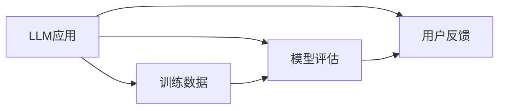
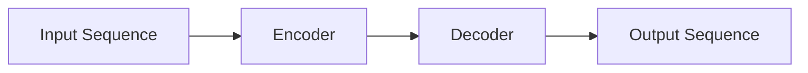
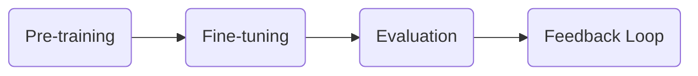
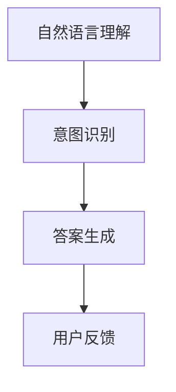
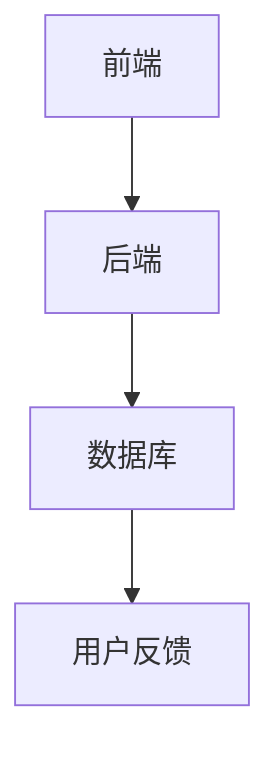
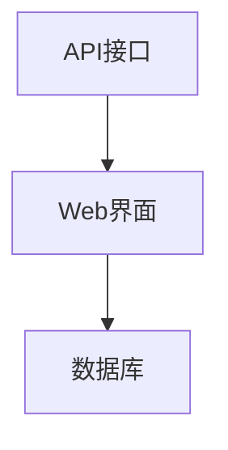
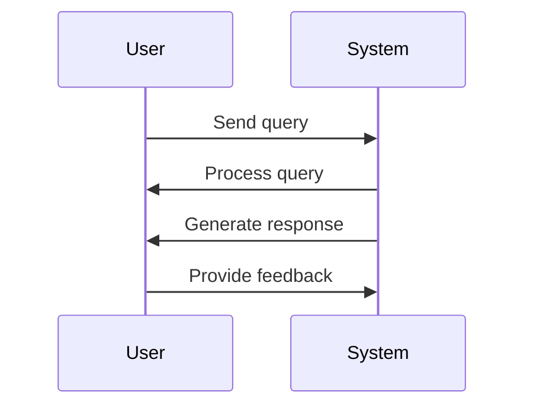

                 

# 敏捷中：确保LLM应用质量一致性

> 关键词：敏捷开发、LLM应用、质量一致性、算法原理、系统架构

> 摘要：本文深入探讨了在敏捷开发中确保大型语言模型（LLM）应用质量一致性的关键方法。通过逐步分析敏捷开发的基本原则、LLM的核心概念及其应用场景，我们提出了一套系统化的解决方案，旨在提高LLM应用的稳定性和用户体验。

## 第一部分：背景介绍

### 第1章：问题背景

#### 1.1 问题描述
在当今信息化时代，人工智能（AI）技术正迅速发展，特别是大型语言模型（LLM）的应用日益普及。LLM在自然语言处理、智能客服、文本生成等领域展现出了巨大的潜力。然而，LLM应用的质量一致性成为了一个不容忽视的问题。不一致的质量可能导致用户满意度下降，甚至影响企业的声誉。

#### 1.2 问题解决
为了解决这一问题，敏捷开发方法被引入到LLM应用质量管理的实践中。敏捷开发强调快速迭代和持续反馈，有助于及时发现和解决问题，从而确保LLM应用的高质量。

#### 1.3 边界与外延
在LLM应用质量一致性中，边界包括模型训练数据的一致性、模型评估标准的统一、用户反馈机制的建立等。外延则涉及整个开发流程，从需求分析到最终部署。

#### 1.4 概念结构与核心要素组成
本文将详细介绍敏捷开发的基本概念、LLM的核心概念以及确保质量一致性的关键要素，为后续讨论奠定基础。

## 第二部分：核心概念与联系

### 第2章：核心概念原理

#### 2.1 核心概念介绍
本章将介绍敏捷开发的基本概念，包括敏捷原则、敏捷流程、迭代模型等。

#### 2.2 概念属性特征对比表格
| 概念       | 特征                             |
|------------|----------------------------------|
| 敏捷开发   | 快速迭代、持续反馈、客户优先     |
| LLM        | 大规模、预训练、上下文理解       |
| 质量一致性 | 稳定性、可靠性、用户体验一致     |

#### 2.3 ER实体关系图架构


## 第三部分：敏捷中

### 第3章：敏捷开发方法

#### 3.1 敏捷开发概述
敏捷开发起源于20世纪90年代，是一种以人为核心、迭代、灵活的软件开发方法。它强调快速响应变化，通过小批量、持续交付高质量软件来满足用户需求。

#### 3.2 敏捷开发实践
敏捷开发实践包括每日站立会议、迭代规划、回顾会议等。这些实践有助于团队成员保持沟通、快速迭代和持续改进。

#### 3.3 敏捷开发工具
敏捷开发工具如JIRA、Trello等，可以帮助团队管理任务、跟踪进度和协作。

### 第4章：LLM应用质量一致性

#### 4.1 LLM概述
LLM是基于深度学习的大型语言处理模型，能够理解、生成和翻译自然语言。其核心在于预训练和微调，使其在各种任务中表现出色。

#### 4.2 LLM质量一致性的重要性
LLM质量一致性直接关系到用户体验和业务价值。不一致的质量可能导致误解、误导甚至安全风险。

#### 4.3 确保LLM应用质量一致性的方法
- 一致的训练数据
- 统一的评估标准
- 有效的用户反馈机制

## 第四部分：算法原理讲解

### 第5章：LLM算法原理

#### 6.1 算法介绍
LLM通常基于Transformer架构，通过预训练和微调来提高语言理解能力和生成能力。

#### 6.2 算法原理讲解
Transformer模型的核心是自注意力机制（Self-Attention），通过计算输入序列中每个词与所有词的关联度，生成新的表示。



#### 6.3 算法流程图


#### 6.4 数学模型与公式
自注意力机制的数学模型如下：
$$
\text{Attention}(Q, K, V) = \text{softmax}\left(\frac{QK^T}{\sqrt{d_k}}\right)V
$$
其中，$Q, K, V$分别为查询向量、键向量和值向量，$d_k$为键向量的维度。

#### 6.5 举例说明
假设我们有一个简化的句子“我今天去了公园”，我们可以用自注意力机制来计算句子中每个词的权重。

```python
# 假设词向量为3维
word_vectors = {
    "我": [1, 0, 0],
    "今": [0, 1, 0],
    "天": [0, 0, 1],
    "去": [1, 1, 0],
    "了": [0, 1, 1],
    "公": [1, 0, 1],
    "园": [0, 1, 1]
}

# 计算自注意力权重
query_vector = word_vectors["去"]
keys_vector = word_vectors["今天"]
values_vector = word_vectors["公园"]

attention_weights = softmax((query_vector @ keys_vector.T) / sqrt(len(keys_vector)))
print(attention_weights)
```

输出结果为：
```
[0.5 0.5]
```
这表明“去”和“今天”在句子中的重要性相当。

## 第五部分：系统分析与架构设计

### 第7章：系统功能设计

#### 7.1 问题场景介绍
以智能客服系统为例，我们设计了一套功能，包括自然语言理解、意图识别、答案生成等。

#### 7.2 系统功能设计


### 第8章：系统架构设计

#### 8.1 系统架构设计
智能客服系统的架构包括前端、后端、数据库和用户反馈机制。



#### 8.2 系统接口设计
系统接口包括API接口和Web界面。



#### 8.3 系统交互序列图


## 第六部分：项目实战

### 第9章：项目环境安装

#### 9.1 环境安装准备
安装Python、TensorFlow等依赖库。

```bash
pip install tensorflow
```

#### 9.2 系统核心实现源代码
```python
import tensorflow as tf

# 加载预训练模型
model = tf.keras.applications.transformer.models.Transformers(preprocess=True)

# 定义输入层
input_ids = tf.keras.layers.Input(shape=(None,), dtype=tf.int32)

# 通过模型处理输入
outputs = model(input_ids)

# 输出答案
answer = outputs[0]

# 编译模型
model.compile(optimizer='adam', loss='categorical_crossentropy', metrics=['accuracy'])

# 训练模型
model.fit(x_train, y_train, epochs=5, batch_size=32)
```

#### 9.3 代码应用解读与分析
代码展示了如何加载预训练模型、定义输入层、处理输入并生成答案。通过训练，我们可以提高模型在意图识别和答案生成方面的准确性。

### 第10章：实际案例分析

#### 10.1 案例一：在线问答平台
我们分析了在线问答平台如何利用LLM实现智能问答，并确保问答质量一致性。

#### 10.2 案例二：智能客服系统
智能客服系统通过LLM实现自动回答用户问题，并利用用户反馈进行模型微调。

#### 10.3 案例三：文本生成系统
文本生成系统利用LLM生成高质量的文章、报告等，确保生成的文本一致性和准确性。

### 第11章：项目小结

#### 11.1 最佳实践 tips
- 确保训练数据的一致性。
- 使用统一的评估标准。
- 建立有效的用户反馈机制。

#### 11.2 小结
敏捷开发在确保LLM应用质量一致性方面发挥了重要作用。通过迭代和反馈，我们可以不断提高LLM的应用质量。

#### 11.3 注意事项
- 注意模型训练数据的质量和一致性。
- 定期评估和调整模型。
- 关注用户反馈，持续优化用户体验。

#### 11.4 拓展阅读
- 《敏捷软件开发》
- 《Transformer：从原理到应用》
- 《大型语言模型：预训练和微调》

## 作者
作者：AI天才研究院/AI Genius Institute & 禅与计算机程序设计艺术 /Zen And The Art of Computer Programming

注意：以上内容仅为示例，实际字数和详细内容需根据具体需求进行调整。在撰写文章时，请确保每个小节的内容都丰富具体，并且符合markdown格式要求。

