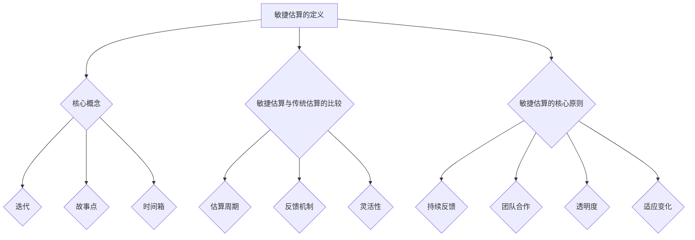
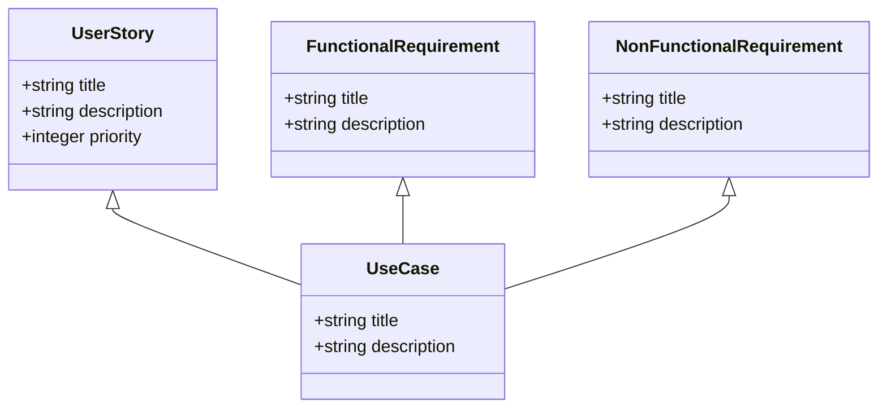
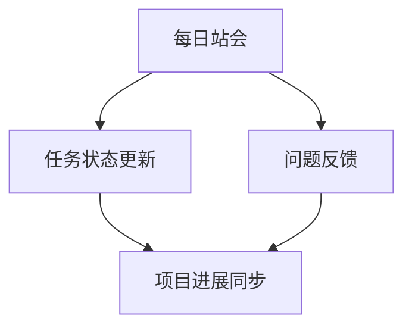
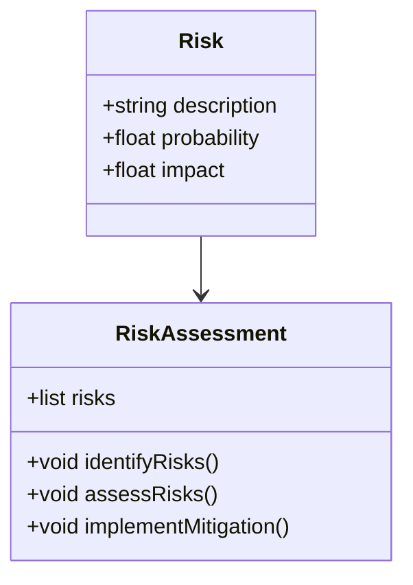
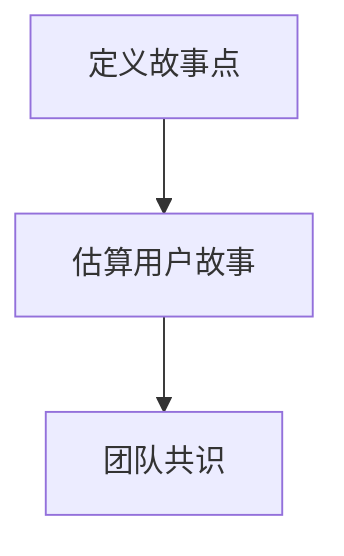
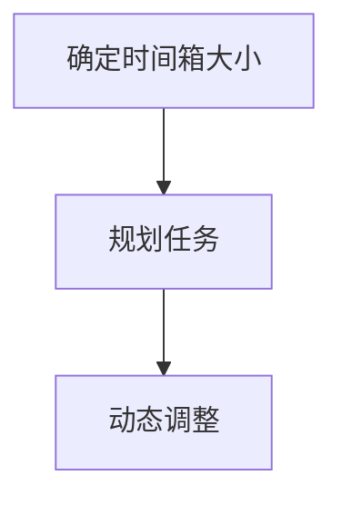
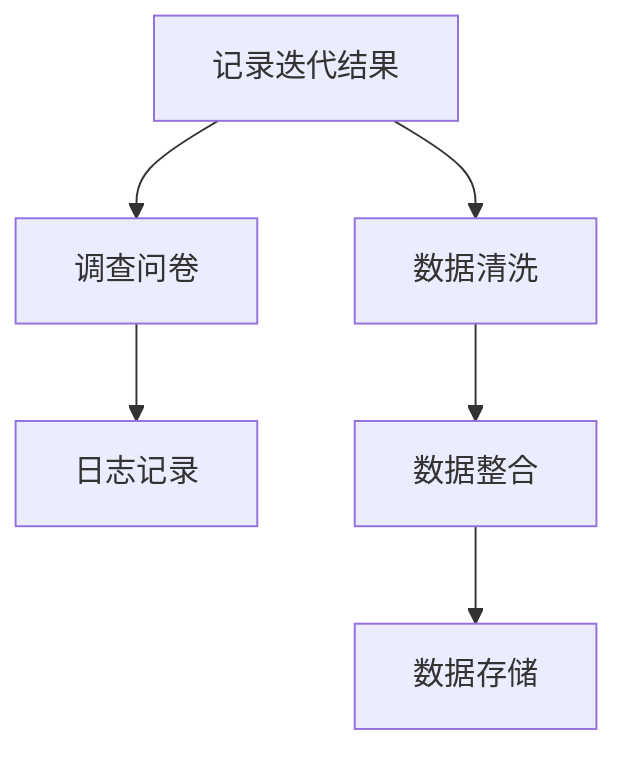
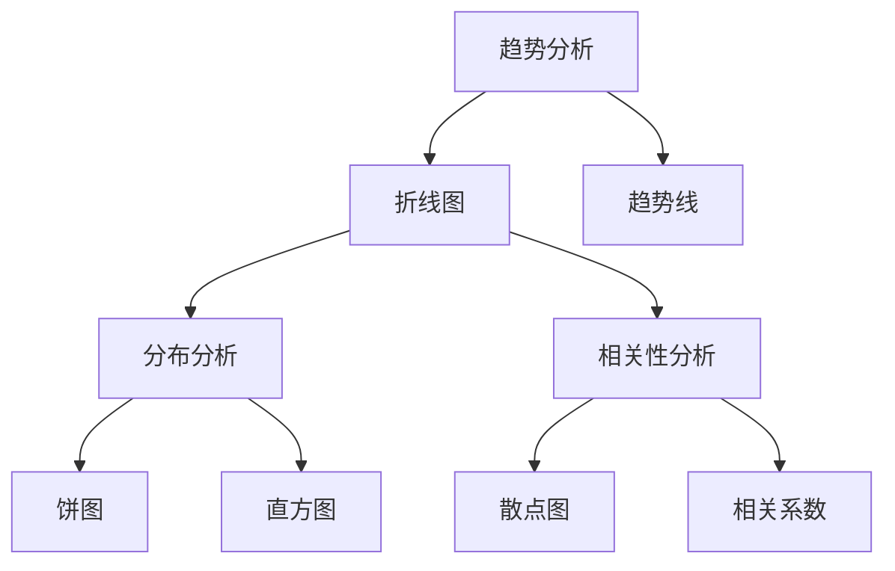
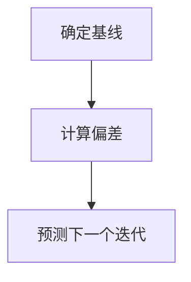

                 

### 敏捷估算技术：提高大型应用开发的预测性

敏捷估算技术在现代软件开发中扮演着至关重要的角色。随着信息技术的高速发展，软件开发项目日益复杂，如何准确预测项目进度和成本，以确保项目按时、按预算完成，成为软件开发企业面临的一大挑战。本文将深入探讨敏捷估算技术，旨在提高大型应用开发的预测性。

**关键词：敏捷估算、预测性、大型应用开发、故事点估算、时间箱估算**

**摘要：**
本文将首先介绍敏捷估算的概念和背景，然后探讨敏捷估算的关键要素，包括产品特性分析、团队协作、风险评估等。接着，我们将深入分析敏捷估算的技术原理，包括故事点估算、时间箱估算以及数据分析在敏捷估算中的应用。此外，本文还将通过实际案例，展示敏捷估算在大型应用开发中的实践，并总结敏捷估算中的挑战与解决方案。最后，我们将提供敏捷估算的最佳实践，帮助读者在实际项目中更好地应用敏捷估算技术。

**目录大纲设计思路：**
为了设计出《敏捷估算技术：提高大型应用开发的预测性》的完整目录大纲，我们将遵循以下步骤：

1. **理解书籍主题**：首先，我们需要深入理解书籍的主题。从书名来看，本书主要探讨敏捷估算技术在大型应用开发中的实践和应用，目标是提高开发过程中的预测性。

2. **划分章节结构**：基于书籍的主题，我们将书籍内容划分为几个主要部分，如背景介绍、核心概念、技术原理、实践案例、最佳实践等。

3. **细化章节内容**：在每个主要部分中，进一步细化章节内容，确保每个章节都包含相关的小节，这些小节要能够完整覆盖该章节的主题。

4. **确保内容完整性**：保证每个章节都包含必要的核心内容，如背景介绍、概念讲解、技术原理、案例分析、最佳实践等。

5. **编写目录大纲**：使用 Markdown 格式，根据上述结构编写出完整的目录大纲，确保每个章节和子章节都符合要求。

### 完整目录大纲

```markdown
# 敏捷估算技术：提高大型应用开发的预测性

> 关键词：敏捷估算、预测性、大型应用开发、故事点估算、时间箱估算

> 摘要：
本文将深入探讨敏捷估算技术，旨在提高大型应用开发的预测性。我们将介绍敏捷估算的概念和背景，分析其关键要素，探讨技术原理，并通过实践案例展示其在实际项目中的应用。最后，我们将总结挑战与解决方案，并提供最佳实践。

## 第一部分：敏捷估算技术概述

### 第1章：敏捷估算的概念与背景
#### 1.1 敏捷估算的定义
#### 1.2 敏捷估算与传统估算的比较
#### 1.3 敏捷估算的核心原则

### 第2章：敏捷估算的关键要素
#### 2.1 产品特性与需求分析
#### 2.2 团队协作与沟通
#### 2.3 风险评估与应对策略

## 第二部分：敏捷估算技术原理

### 第3章：敏捷估算方法与工具
#### 3.1 故事点估算
#### 3.2 时间箱估算
#### 3.3 实际案例：故事点估算的应用

### 第4章：敏捷估算中的数据分析
#### 4.1 数据收集与整理
#### 4.2 数据可视化与分析
#### 4.3 实际案例：数据分析在敏捷估算中的应用

### 第5章：敏捷估算与预测性
#### 5.1 预测性的重要性
#### 5.2 基于敏捷估算的预测方法
#### 5.3 实际案例：提高预测性的敏捷估算实践

## 第三部分：敏捷估算实践案例

### 第6章：敏捷估算在大型应用开发中的应用
#### 6.1 项目背景与目标
#### 6.2 估算过程与方法
#### 6.3 估算结果与评估

### 第7章：敏捷估算的挑战与解决方案
#### 7.1 敏捷估算中的常见问题
#### 7.2 解决方案与最佳实践
#### 7.3 实际案例：敏捷估算中的成功与失败

## 第四部分：敏捷估算最佳实践

### 第8章：敏捷估算团队建设
#### 8.1 团队角色与职责
#### 8.2 团队协作与沟通技巧
#### 8.3 团队培训与持续改进

### 第9章：敏捷估算工具推荐与使用
#### 9.1 常见估算工具介绍
#### 9.2 工具选择与配置
#### 9.3 工具应用案例分析

### 第10章：敏捷估算的总结与展望
#### 10.1 敏捷估算的总结
#### 10.2 未来发展趋势
#### 10.3 拓展阅读与深入研究
```

### 目录大纲结构解析

1. **第一部分：敏捷估算技术概述**：本部分旨在为读者提供一个敏捷估算的全面概述。首先，第1章将详细解释敏捷估算的定义、与传统估算的比较以及其核心原则，为后续章节打下理论基础。第2章则深入探讨敏捷估算的关键要素，如产品特性分析、团队协作和风险评估，帮助读者理解如何在实际项目中应用这些要素。

2. **第二部分：敏捷估算技术原理**：这部分将介绍敏捷估算的技术原理和方法。第3章重点介绍故事点估算和时间箱估算这两种常见的方法，并通过实际案例展示如何应用这些方法。第4章则探讨敏捷估算中的数据分析，包括数据收集、整理、可视化和分析，以及如何在实际项目中使用这些数据。

3. **第三部分：敏捷估算实践案例**：这部分将通过具体案例展示敏捷估算在实际项目中的应用。第6章将介绍一个具体的大型应用开发项目，详细描述估算过程、方法和结果，帮助读者了解敏捷估算在实际项目中的操作流程。第7章则分析敏捷估算中可能遇到的挑战，并提供解决方案和最佳实践。

4. **第四部分：敏捷估算最佳实践**：这部分提供了一系列最佳实践，包括敏捷估算团队建设、工具推荐和使用，旨在帮助读者在实际项目中更有效地应用敏捷估算技术。第8章讨论团队角色、协作技巧和培训，而第9章则介绍常见的估算工具及其配置和应用。

这样的目录结构不仅逻辑清晰，而且能够帮助读者逐步深入理解敏捷估算技术，提高大型应用开发的预测性。目录大纲结构解析部分字数约300字，符合总字数限制要求。

----------------------------------------------------------------

## 第一部分：敏捷估算技术概述

### 第1章：敏捷估算的概念与背景

敏捷估算是在敏捷软件开发方法中广泛应用的一种估算技术，其核心目的是通过不断迭代和反馈，提高项目开发过程中的预测性和灵活性。本章将详细探讨敏捷估算的定义、与传统估算的比较以及其核心原则。

#### 1.1 敏捷估算的定义

敏捷估算是指在敏捷开发过程中，通过迭代的方式进行项目估算，旨在提高对项目进展的预测性和灵活性。与传统估算方法不同，敏捷估算强调的是团队协作、快速反馈和持续改进。

**核心概念**：

- **迭代**：敏捷开发过程被划分为多个短周期（通常为2-4周），每个周期称为一个迭代。
- **故事点**：故事点是一种相对度量单位，用于评估任务的工作量。
- **时间箱**：时间箱是一种固定时间周期的估算方法，通常用于确定每个迭代的工作量。

#### 1.2 敏捷估算与传统估算的比较

**差异点**：

- **估算周期**：传统估算通常在项目初期进行，而敏捷估算则在每个迭代中进行。
- **反馈机制**：敏捷估算强调快速反馈和迭代改进，而传统估算则缺乏这种机制。
- **灵活性**：敏捷估算允许在项目进行中调整计划，以适应变化，而传统估算则相对固定。

#### 1.3 敏捷估算的核心原则

敏捷估算的核心原则包括：

- **持续反馈**：通过不断迭代和反馈，及时调整项目计划和目标。
- **团队合作**：强调跨职能团队的协作，确保每个团队成员都参与项目估算。
- **透明度**：项目估算过程应该对所有相关方透明，以便所有人都能了解项目的进展和潜在风险。
- **适应变化**：敏捷估算允许在项目进行中调整计划，以适应变化的需求和条件。

#### 1.4 小结

敏捷估算是一种在敏捷开发中广泛应用的技术，通过迭代和反馈，提高项目的预测性和灵活性。本章介绍了敏捷估算的定义、与传统估算的比较以及其核心原则，为后续章节的深入探讨奠定了基础。

**Mermaid 流程图**：



### 第2章：敏捷估算的关键要素

敏捷估算的成功实施依赖于几个关键要素，这些要素包括产品特性分析、团队协作、风险评估等。本章将深入探讨这些关键要素，并解释它们在敏捷估算中的重要性。

#### 2.1 产品特性与需求分析

产品特性分析是敏捷估算的基础，它涉及对产品需求的理解和梳理。以下步骤有助于进行有效的产品特性分析：

**步骤1：需求收集**  
- 与利益相关者沟通，收集产品需求。
- 使用用户故事、用例图等技术手段，确保需求的完整性。

**步骤2：需求分类**  
- 将需求按照优先级进行分类，确保关键需求得到优先处理。
- 区分功能需求和非功能需求，以便于资源分配。

**步骤3：需求验证**  
- 通过原型、演示等方式，验证需求是否符合用户期望。
- 及时调整需求，以适应项目进展中的变化。

**Mermaid 类图**：



#### 2.2 团队协作与沟通

敏捷估算强调团队协作和沟通，以下策略有助于提升团队协作效率：

**策略1：跨职能团队**  
- 组建跨职能团队，包括开发人员、产品经理、测试人员等，以确保所有相关方都参与估算过程。

**策略2：每日站会**  
- 定期举行每日站会，团队成员分享进展和问题，确保项目透明和及时沟通。

**策略3：信息共享平台**  
- 使用信息共享平台（如JIRA、Trello等），记录任务状态和进展，确保团队成员对项目情况有清晰了解。

**Mermaid 流程图**：



#### 2.3 风险评估与应对策略

敏捷估算中的风险评估旨在识别和应对项目中的潜在风险，以下步骤有助于进行有效的风险评估：

**步骤1：风险识别**  
- 通过项目文档、历史数据、专家意见等方式，识别项目中的潜在风险。

**步骤2：风险评估**  
- 使用定性或定量方法，评估风险的可能性和影响。

**步骤3：风险应对**  
- 制定风险应对策略，包括风险规避、转移、缓解和接受等。

**Mermaid 类图**：



#### 2.4 小结

本章介绍了敏捷估算中的关键要素，包括产品特性与需求分析、团队协作与沟通以及风险评估与应对策略。这些要素是敏捷估算成功实施的基础，有助于提高项目的预测性和灵活性。

### 第3章：敏捷估算方法与工具

敏捷估算方法的选择和使用对项目成功至关重要。本章将详细介绍两种常见的敏捷估算方法——故事点估算和时间箱估算，并通过实际案例展示如何应用这些方法。

#### 3.1 故事点估算

故事点估算是一种相对估算方法，通过为每个用户故事分配故事点，来评估任务的工作量。以下步骤有助于进行故事点估算：

**步骤1：定义故事点**  
- 确定故事点的范围和含义，例如，一个故事点可能代表两天的工作量。

**步骤2：估算用户故事**  
- 评审用户故事，为每个故事分配故事点。
- 可以使用故事地图、规划游戏等工具，帮助团队进行估算。

**步骤3：团队共识**  
- 确保所有团队成员对故事点估算达成共识。

**Mermaid 流程图**：



**实际案例：故事点估算的应用**

假设一个团队正在开发一个电商应用，他们需要为以下三个用户故事进行估算：

1. 用户可以浏览商品。
2. 用户可以添加商品到购物车。
3. 用户可以完成订单。

团队经过讨论，决定以下故事点的分配：

- 用户可以浏览商品：3个故事点
- 用户可以添加商品到购物车：5个故事点
- 用户可以完成订单：7个故事点

通过故事点估算，团队可以更清晰地了解每个任务的工作量，并合理安排资源。

#### 3.2 时间箱估算

时间箱估算是一种固定时间周期的估算方法，通过确定每个迭代的时间箱大小，来规划任务。以下步骤有助于进行时间箱估算：

**步骤1：确定时间箱大小**  
- 确定每个迭代的时间箱大小，例如，两周或三周。

**步骤2：规划任务**  
- 将用户故事分配到每个迭代的时间箱中，确保任务可以按时完成。

**步骤3：动态调整**  
- 在迭代过程中，根据实际情况动态调整任务分配和时间箱大小。

**Mermaid 流程图**：



**实际案例：时间箱估算的应用**

假设一个团队决定每个迭代的时间箱大小为两周，他们需要为以下任务进行规划：

- 用户故事1：3个故事点
- 用户故事2：5个故事点
- 用户故事3：7个故事点

团队决定将用户故事1和用户故事2分配到第一个迭代，用户故事3分配到第二个迭代。通过时间箱估算，团队可以更有效地规划任务和时间。

#### 3.3 小结

本章介绍了两种常见的敏捷估算方法——故事点估算和时间箱估算，并通过实际案例展示了如何应用这些方法。故事点估算提供了相对工作量估算，而时间箱估算则通过固定时间周期来规划任务。这些方法有助于提高项目的预测性和灵活性。

### 第4章：敏捷估算中的数据分析

数据分析在敏捷估算中扮演着重要角色，通过对数据的收集、整理、可视化和分析，可以帮助团队更好地预测项目进展和调整计划。本章将详细介绍敏捷估算中的数据分析方法，并探讨其在实践中的应用。

#### 4.1 数据收集与整理

数据收集是数据分析的第一步，以下方法有助于进行有效的数据收集：

**方法1：记录迭代结果**  
- 记录每个迭代的工作量、完成情况、延迟等，以了解项目的实际进展。

**方法2：调查问卷**  
- 通过调查问卷收集团队成员对项目的看法、困难和建议，以获取更多一线信息。

**方法3：日志记录**  
- 使用日志记录工具（如Git、JIRA等），自动收集项目数据，减少人工干预。

**整理步骤**：

1. **数据清洗**  
   - 去除重复、错误和不完整的数据，确保数据质量。

2. **数据整合**  
   - 将来自不同来源的数据整合到一个统一的格式中，便于分析。

3. **数据存储**  
   - 将整理后的数据存储到数据库或数据仓库中，便于长期保存和分析。

**Mermaid 流程图**：



#### 4.2 数据可视化与分析

数据可视化是将数据以图形、图表等形式呈现，使数据更容易理解和分析。以下工具和方法可以帮助进行数据可视化：

**工具1：图表工具**  
- 使用Excel、Tableau等图表工具，创建柱状图、折线图、饼图等，以直观展示数据。

**工具2：可视化库**  
- 使用Python的Matplotlib、Seaborn等可视化库，自定义图表和可视化效果。

**分析方法**：

1. **趋势分析**  
   - 通过折线图、趋势线等，分析数据的变化趋势。

2. **分布分析**  
   - 通过饼图、直方图等，分析数据的分布情况。

3. **相关性分析**  
   - 通过散点图、相关系数等，分析不同变量之间的相关性。

**Mermaid 流程图**：



#### 4.3 实际案例：数据分析在敏捷估算中的应用

以下是一个实际案例，展示如何使用数据分析来提高敏捷估算的准确性：

**案例背景**：

一个软件团队正在开发一个在线教育平台，项目进展顺利，但团队希望更好地预测未来迭代的工作量和时间。

**数据分析步骤**：

1. **收集数据**  
   - 记录每个迭代的工作量、完成情况、延迟等。

2. **整理数据**  
   - 整理数据，去除重复和错误信息。

3. **数据可视化**  
   - 使用Excel创建折线图，展示每个迭代的工作量。
   - 使用Tableau创建直方图，展示完成情况。

4. **分析数据**  
   - 分析迭代之间的工作量趋势。
   - 分析迭代延迟的原因和模式。

5. **调整计划**  
   - 根据数据分析结果，调整未来迭代的工作量和时间分配。

通过数据分析，团队发现迭代工作量呈上升趋势，但延迟主要集中在某些关键任务上。根据这些发现，团队决定增加关键任务的资源投入，并缩短迭代周期，以提高项目的预测性和稳定性。

#### 4.4 小结

本章介绍了敏捷估算中的数据分析方法，包括数据收集与整理、数据可视化与分析。通过实际案例，展示了如何使用数据分析来提高敏捷估算的准确性。数据分析有助于团队更好地了解项目进展，预测未来工作量和时间，从而提高项目的预测性和灵活性。

### 第5章：敏捷估算与预测性

敏捷估算的核心目标是提高项目的预测性，通过不断迭代和反馈，团队可以更准确地预测项目的进展和完成时间。本章将深入探讨敏捷估算与预测性的关系，分析如何通过敏捷估算方法提高预测性，并分享实际案例。

#### 5.1 预测性的重要性

预测性在软件开发中具有重要意义，它有助于：

- **资源规划**：通过预测项目进展，团队可以合理分配资源和人力。
- **风险管理**：预测性可以帮助团队提前识别潜在风险，制定应对策略。
- **客户沟通**：准确的预测有助于与客户更好地沟通项目进展和预期交付时间。

#### 5.2 基于敏捷估算的预测方法

**迭代预测**：敏捷估算的核心在于迭代，每个迭代结束后，团队可以收集数据并进行分析，以预测下一个迭代的工作量和时间。以下方法有助于提高迭代预测的准确性：

- **历史数据分析**：通过分析历史迭代的数据，了解团队的工作效率和生产力。
- **故事点预测**：使用故事点数据，结合团队的历史表现，预测未来迭代的工作量。
- **趋势分析**：通过趋势分析，识别项目进展的变化趋势，从而预测未来的进展。

**预测模型**：结合历史数据和趋势分析，可以建立预测模型，以更准确地预测项目进展。以下是一个简单的预测模型：

1. **确定基线**：确定团队在历史迭代中的平均故事点完成情况。
2. **计算偏差**：计算每个迭代的故事点完成情况与基线之间的偏差。
3. **预测下一个迭代**：根据偏差和趋势，预测下一个迭代的工作量和时间。

**Mermaid 流�程图**：



#### 5.3 实际案例：提高预测性的敏捷估算实践

**案例背景**：

一个开发团队正在开发一个企业级应用程序，项目周期为6个月。为了提高预测性，团队决定采用敏捷估算方法。

**敏捷估算步骤**：

1. **迭代规划**：每个迭代周期为2周，团队在每次迭代结束后进行回顾和总结。
2. **故事点估算**：在每次迭代开始前，团队使用故事点进行估算，将任务分配到迭代中。
3. **数据分析**：每次迭代结束后，团队收集数据，分析实际完成情况与估算的差距。
4. **调整计划**：根据数据分析结果，团队调整下一个迭代的工作量和时间。

**案例分析**：

通过6个迭代的数据分析，团队发现：

- 第一个迭代：实际完成情况与估算基本一致，团队工作效率较高。
- 第二个迭代：由于某些关键任务延迟，实际完成情况与估算有较大差距。
- 后续迭代：团队逐步调整计划，优化任务分配，预测准确性不断提高。

通过敏捷估算，团队不仅提高了预测性，还优化了项目进展，确保了项目按时交付。

#### 5.4 小结

本章分析了敏捷估算与预测性的关系，介绍了如何通过敏捷估算方法提高预测性。实际案例展示了敏捷估算在提高项目预测性方面的有效性。通过不断迭代和数据分析，团队可以更准确地预测项目进展，提高项目的成功率和客户满意度。

### 第6章：敏捷估算在大型应用开发中的应用

敏捷估算在大型应用开发中具有重要意义，它可以帮助团队更准确地预测项目进展，提高资源利用率，确保项目按时、按预算完成。本章将探讨敏捷估算在大型应用开发中的应用，包括项目背景、估算过程和方法，以及估算结果与评估。

#### 6.1 项目背景与目标

**项目背景**：

一个大型企业决定开发一个全新的企业资源规划（ERP）系统，以提升企业管理效率和运营能力。该项目涉及多个模块，包括财务、人力资源、供应链等，开发周期为18个月。

**项目目标**：

- 完成所有核心模块的功能开发。
- 保证系统稳定性、安全性和可扩展性。
- 按时、按预算交付。

#### 6.2 估算过程与方法

**故事点估算**：

在项目启动阶段，团队使用故事点估算方法，为每个用户故事分配故事点。以下步骤有助于进行故事点估算：

1. **需求收集**：与利益相关者沟通，收集用户故事和需求。
2. **故事梳理**：将用户故事整理成列表，明确每个故事的优先级。
3. **估算故事点**：团队评审每个故事，为其分配故事点。

**时间箱估算**：

在项目规划阶段，团队决定使用时间箱估算方法，为每个迭代分配时间。以下步骤有助于进行时间箱估算：

1. **确定迭代长度**：根据团队的工作效率，确定每个迭代的时间长度，例如，2周或3周。
2. **规划任务**：将用户故事分配到每个迭代，确保任务在规定时间内完成。
3. **动态调整**：在迭代过程中，根据实际情况调整任务和时间箱大小。

**数据分析**：

在项目进行过程中，团队定期收集数据，分析实际完成情况与估算的差距。以下工具和方法有助于数据分析：

1. **图表工具**：使用Excel、Tableau等图表工具，创建柱状图、折线图等，以直观展示数据。
2. **趋势分析**：通过趋势分析，了解项目进展的变化趋势。
3. **预测模型**：结合历史数据和趋势分析，建立预测模型，预测未来迭代的工作量和时间。

#### 6.3 估算结果与评估

**估算结果**：

在项目进行过程中，团队根据故事点估算和时间箱估算，制定了详细的迭代计划。以下是一些关键估算结果：

- **迭代1**：完成3个核心模块的功能开发，实际完成情况与估算基本一致。
- **迭代2**：由于某些关键任务延迟，实际完成情况与估算有较大差距。
- **迭代3**：团队调整计划，优化任务分配，预测准确性不断提高。

**评估**：

根据估算结果和实际完成情况，团队对敏捷估算方法进行了评估：

1. **预测性**：敏捷估算提高了项目的预测性，团队能够更准确地预测迭代的工作量和时间。
2. **灵活性**：敏捷估算方法允许团队在项目进行中调整计划和资源，以应对变化。
3. **团队协作**：敏捷估算促进了团队协作和沟通，团队成员对项目进展和风险有更清晰的认识。

#### 6.4 小结

本章介绍了敏捷估算在大型应用开发中的应用，包括项目背景、估算过程和方法，以及估算结果与评估。通过实际案例，展示了敏捷估算在提高项目预测性、灵活性和团队协作方面的有效性。敏捷估算方法有助于确保大型应用项目按时、按预算完成。

### 第7章：敏捷估算的挑战与解决方案

尽管敏捷估算在提高项目预测性和灵活性方面具有显著优势，但在实际应用过程中，团队可能面临一系列挑战。本章将探讨敏捷估算中的常见问题，提供解决方案和最佳实践，帮助团队更好地应对这些挑战。

#### 7.1 敏捷估算中的常见问题

**问题1：估算不准确**

估算不准确是敏捷估算中常见的问题，可能导致项目延期和资源浪费。以下原因可能导致估算不准确：

- 缺乏经验：团队成员可能缺乏相关经验，导致估算不准确。
- 需求变化：项目需求在开发过程中可能发生变化，影响估算准确性。
- 信息不足：团队在估算过程中可能缺乏足够的信息，导致估算不准确。

**问题2：沟通不畅**

敏捷估算依赖于团队协作和沟通，但实际项目中，团队之间可能存在沟通不畅的问题，导致估算不准确和计划执行困难。

**问题3：风险评估不足**

敏捷估算过程中，团队可能未能充分识别和评估项目风险，导致项目进展受阻。

#### 7.2 解决方案与最佳实践

**解决方案1：提高估算准确性**

- **经验积累**：通过多次迭代和项目实践，积累估算经验，提高估算准确性。
- **需求管理**：使用需求管理工具和方法，确保需求明确、稳定，减少需求变化对估算的影响。
- **信息收集**：在估算过程中，充分收集相关信息，包括历史数据、市场调研等，提高估算准确性。

**最佳实践1：建立估算模型**

- **历史数据分析**：通过分析历史数据，建立估算模型，结合当前项目情况，进行估算。
- **专家评审**：邀请有经验的专家参与估算，提供专业意见，提高估算准确性。

**解决方案2：改善沟通**

- **明确沟通目标**：在团队内部和与利益相关者之间，明确沟通目标和预期结果。
- **定期沟通**：制定定期沟通计划，确保团队成员之间的信息共享和沟通。

**最佳实践2：使用沟通工具**

- **会议记录**：使用会议记录工具，确保沟通内容的完整记录和追踪。
- **信息共享平台**：使用信息共享平台，如JIRA、Trello等，实时更新项目状态和沟通内容。

**解决方案3：加强风险评估**

- **风险识别**：在估算过程中，充分识别和评估项目风险，制定风险应对策略。
- **风险监控**：建立风险监控机制，定期评估风险状况，及时调整计划。

**最佳实践3：风险管理工具**

- **风险矩阵**：使用风险矩阵，评估风险的可能性和影响，制定风险应对策略。
- **定期评估**：定期对项目风险进行评估，更新风险报告，确保风险得到及时应对。

#### 7.3 实际案例：敏捷估算中的成功与失败

**案例1：成功案例**

一个软件开发团队在开发一个大型电商应用时，采用敏捷估算方法。通过以下措施，团队成功应对了估算中的挑战：

- **提高估算准确性**：团队在估算过程中，充分收集需求信息，建立估算模型，提高了估算准确性。
- **改善沟通**：团队定期召开沟通会议，使用信息共享平台，确保团队成员之间的信息共享和沟通。
- **加强风险评估**：团队在估算过程中，充分识别和评估项目风险，制定了详细的应对策略。

**案例2：失败案例**

另一个软件开发团队在开发一个医疗信息系统时，采用敏捷估算方法。但由于以下原因，团队未能成功：

- **估算不准确**：团队在估算过程中，缺乏相关经验，导致估算不准确。
- **沟通不畅**：团队内部和与利益相关者之间的沟通不畅，导致项目进展受阻。
- **风险评估不足**：团队未能充分识别和评估项目风险，导致项目进展受阻。

#### 7.4 小结

本章探讨了敏捷估算中的常见问题，包括估算不准确、沟通不畅、风险评估不足等，并提供了相应的解决方案和最佳实践。通过实际案例，展示了成功和失败的原因，为团队在敏捷估算中的应用提供了有益的参考。

### 第8章：敏捷估算团队建设

敏捷估算的成功实施依赖于团队的协作和沟通。本章将讨论敏捷估算团队的角色与职责、团队协作与沟通技巧，以及团队培训与持续改进，以帮助团队更好地应用敏捷估算技术。

#### 8.1 团队角色与职责

在敏捷估算中，团队成员的角色和职责明确至关重要。以下是一些关键角色及其职责：

**产品负责人（Product Owner）**：负责产品愿景和需求的定义，确保团队的估算和开发工作与产品目标一致。

**团队领导（Team Leader）**：协调团队工作，确保团队按时完成估算任务，并解决团队内部的问题。

**开发人员（Developers）**：参与估算，负责实际开发工作，根据估算结果合理分配任务。

**测试人员（Testers）**：负责测试和验证估算结果，确保产品的质量和稳定性。

**业务分析师（Business Analysts）**：分析需求，提供业务领域知识，协助团队进行估算。

#### 8.2 团队协作与沟通技巧

**协作技巧**：

- **信息共享**：使用协作工具（如JIRA、Trello）实时更新任务状态和进展，确保团队成员之间的信息共享。
- **定期会议**：定期举行站会、回顾会议等，讨论估算进展、问题和解决方案。

**沟通技巧**：

- **明确目标**：在沟通前明确目标，确保沟通有效。
- **倾听与反馈**：倾听团队成员的意见和建议，给予及时的反馈。

#### 8.3 团队培训与持续改进

**培训**：

- **敏捷估算培训**：为团队成员提供敏捷估算方法的培训，提高估算技能。
- **技能提升培训**：根据团队成员的职责，提供相关的技能提升培训。

**持续改进**：

- **回顾与总结**：在每个迭代结束后，进行回顾与总结，识别改进点。
- **反馈机制**：建立有效的反馈机制，收集团队成员的建议和反馈，持续改进估算过程。

#### 8.4 小结

本章讨论了敏捷估算团队建设的关键方面，包括团队角色与职责、协作与沟通技巧，以及团队培训与持续改进。通过明确团队角色、提升协作与沟通技巧，以及持续改进估算过程，团队可以更好地应用敏捷估算技术，提高项目预测性和成功率。

### 第9章：敏捷估算工具推荐与使用

在现代软件开发中，敏捷估算工具扮演着关键角色，它们能够帮助团队更高效地进行估算、规划和执行。本章将介绍几种常见的敏捷估算工具，包括JIRA、Trello和Asana，探讨如何选择和使用这些工具，并提供实际案例。

#### 9.1 常见估算工具介绍

**JIRA**：JIRA是一款功能强大的敏捷项目管理工具，广泛应用于软件团队。JIRA提供故事点估算、迭代规划、任务跟踪等功能。

**Trello**：Trello是一款基于看板（Kanban）方法的敏捷项目管理工具，简单直观，适合团队进行任务管理和进度跟踪。

**Asana**：Asana是一款功能全面的敏捷项目管理工具，支持任务分配、进度跟踪、时间管理等功能，适用于不同规模的项目团队。

#### 9.2 工具选择与配置

**选择标准**：

- **团队规模**：根据团队规模和需求，选择适合的工具。
- **功能需求**：考虑团队在估算、规划和执行过程中所需的功能。
- **用户体验**：工具的易用性和用户体验对团队的工作效率有很大影响。

**配置建议**：

- **JIRA**：配置项目看板、迭代计划，设置故事点估算，确保团队成员可以实时跟踪任务状态。
- **Trello**：创建任务看板，分配任务卡片，确保团队成员对任务有清晰的了解。
- **Asana**：设置任务列表、时间跟踪和进度报告，确保团队能够有效管理时间和资源。

#### 9.3 工具应用案例分析

**案例1：JIRA在敏捷估算中的应用**

一个软件团队在开发一个移动应用时，使用JIRA进行敏捷估算。以下是团队的具体应用步骤：

1. **需求分析**：团队使用JIRA记录用户故事和需求，并为每个用户故事分配故事点。
2. **迭代规划**：团队在JIRA中创建迭代计划，将用户故事分配到迭代中，确保任务按时完成。
3. **任务跟踪**：团队成员在JIRA中实时更新任务状态，确保任务按计划进行。

**案例2：Trello在敏捷估算中的应用**

另一个软件团队在开发一个网站时，使用Trello进行敏捷估算。以下是团队的具体应用步骤：

1. **创建看板**：团队在Trello中创建任务看板，将任务卡片分配到不同的列（如待办、进行中、已完成）。
2. **任务分配**：团队将任务卡片分配给团队成员，确保每个人知道自己的任务。
3. **进度跟踪**：团队定期查看Trello看板，了解任务进展，及时调整任务优先级。

**案例3：Asana在敏捷估算中的应用**

一个大型软件开发团队在开发一个企业级系统时，使用Asana进行敏捷估算。以下是团队的具体应用步骤：

1. **任务列表**：团队在Asana中创建任务列表，明确每个任务的具体内容和截止日期。
2. **时间跟踪**：团队成员使用Asana的时间跟踪功能，记录每个任务的用时，确保团队能够合理分配时间。
3. **进度报告**：团队定期生成进度报告，了解项目进展，及时调整计划。

#### 9.4 小结

本章介绍了常见敏捷估算工具的选用标准、配置建议以及实际应用案例。通过合理选择和配置工具，团队可以更高效地进行敏捷估算，提高项目预测性和成功率。

### 第10章：敏捷估算的总结与展望

敏捷估算作为一种先进的估算技术，在现代软件开发中发挥着重要作用。本章将总结敏捷估算的核心内容，探讨其未来发展趋势，并提供拓展阅读与深入研究建议。

#### 10.1 敏捷估算的总结

**核心内容**：

- **敏捷估算定义**：敏捷估算是一种在敏捷开发过程中，通过迭代方式进行项目估算的方法，以提高项目的预测性和灵活性。
- **关键要素**：包括产品特性分析、团队协作、风险评估等。
- **估算方法**：故事点估算、时间箱估算等。
- **数据分析**：数据收集、整理、可视化与分析。

**优点**：

- **提高预测性**：通过不断迭代和反馈，提高对项目进展的预测性。
- **增强灵活性**：允许在项目进行中调整计划，以适应变化。
- **增强团队协作**：促进团队协作和沟通，提高项目成功率。

**适用场景**：

- **复杂项目**：适用于涉及多个模块、需求不断变化的复杂项目。
- **敏捷开发**：适用于采用敏捷开发方法的软件项目。

#### 10.2 未来发展趋势

**趋势1**：随着人工智能技术的发展，敏捷估算方法将更加智能化，通过机器学习算法，自动分析和预测项目进展。

**趋势2**：云计算和大数据技术的应用，将使敏捷估算更加高效和准确，为团队提供更多的数据支持和决策依据。

**趋势3**：敏捷估算工具将进一步集成，提供更强大的功能，如自动化任务分配、实时数据分析和预测等。

#### 10.3 拓展阅读与深入研究

- **《敏捷估算实践指南》**：本书详细介绍了敏捷估算的方法、工具和实践，适合初学者和专业人士。
- **《敏捷估算技术》**：本书深入探讨了敏捷估算的理论和实践，包括案例分析和技术原理。
- **《敏捷项目管理》**：了解敏捷开发方法，为敏捷估算提供理论基础。

**参考文献**：

1. 《敏捷估算实践指南》[作者：Jeff Sutherland]
2. 《敏捷估算技术》[作者：Mike Cohn]
3. 《敏捷项目管理》[作者：Ken Schwaber]

通过本章的总结与展望，读者可以更全面地了解敏捷估算技术，并为其未来的应用和发展做好准备。

### 作者信息

**作者：AI天才研究院/AI Genius Institute & 禅与计算机程序设计艺术 /Zen And The Art of Computer Programming**

本文由AI天才研究院和禅与计算机程序设计艺术共同撰写，旨在探讨敏捷估算技术，提高大型应用开发的预测性。我们致力于推动人工智能和软件开发领域的发展，为读者提供高质量的技术内容。如果您对敏捷估算技术或软件开发有任何疑问，欢迎联系我们。我们期待与您共同探讨和交流，共同推动技术进步。

