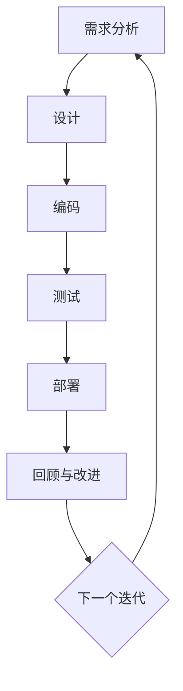
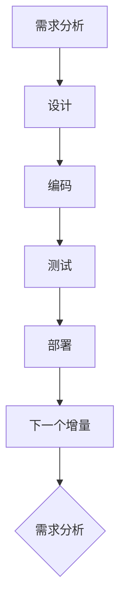
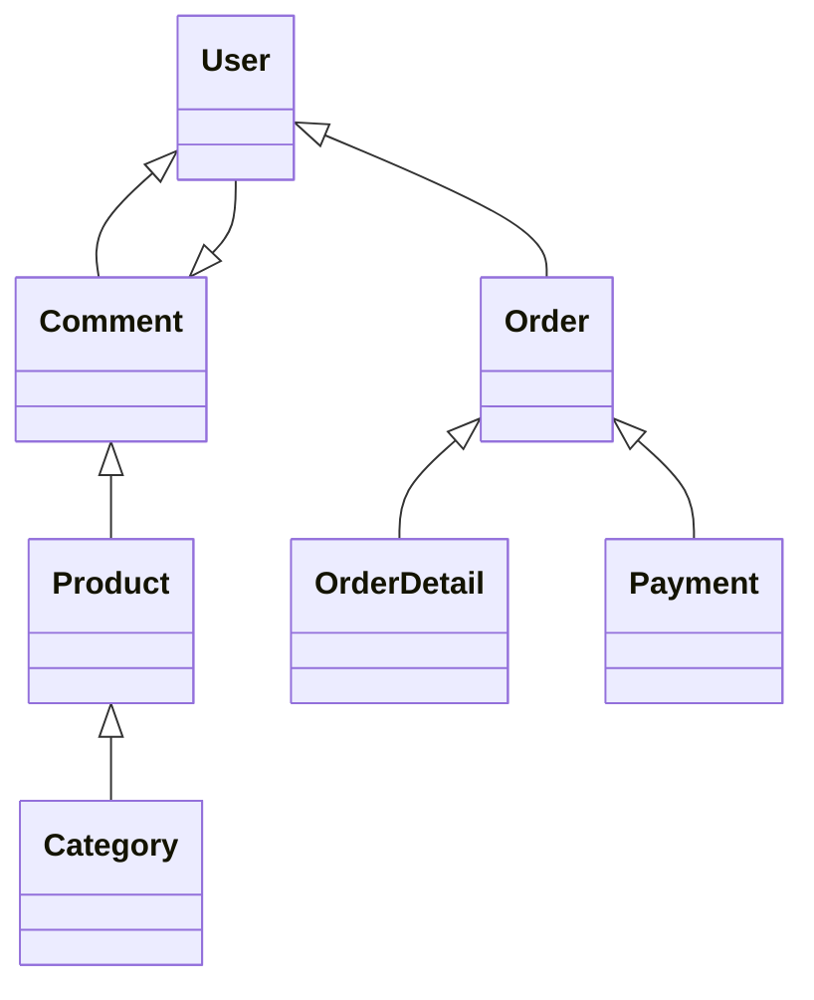
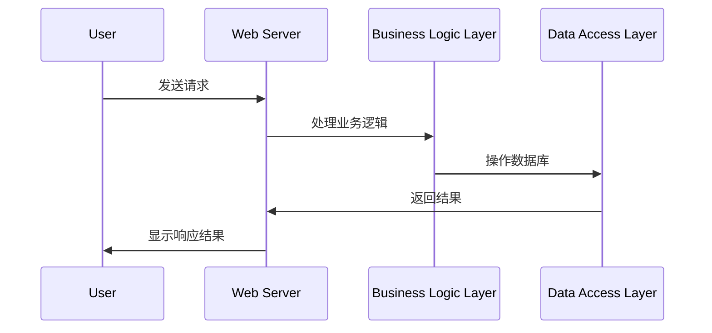

                 


### 背景介绍

敏捷协作模式，作为一种以人为核心、迭代、增量和可持续速度开发软件的实践方法，已经逐渐成为大型应用研发领域的重要工具。其起源可以追溯到1990年代，由软件开发的实践者们为了应对不断变化的需求和环境，提出了一系列以敏捷为核心理念的实践方法。敏捷协作模式的核心在于强调团队协作、持续交付、用户反馈和灵活性。

在传统的软件开发模式下，项目往往按照预定的计划和时间表进行，一旦出现需求变更或者技术挑战，项目就会面临重重困难。而敏捷协作模式则通过不断迭代和增量开发，使团队能够快速适应变化，提高开发效率和产品质量。这一模式在大型应用研发中的重要性不言而喻，尤其是在需要快速响应市场需求、高度协同合作的现代企业环境中。

首先，敏捷协作模式能够显著提升团队协作效率。通过明确的角色分工和灵活的工作流程，团队成员可以更好地协同工作，共同推进项目进展。其次，敏捷模式强调持续交付和用户反馈，使得团队能够及时发现并解决问题，从而确保最终产品的质量和用户满意度。此外，敏捷协作模式还鼓励技术创新和持续学习，使团队能够保持竞争力和创新能力。

然而，敏捷协作模式并非万能。在大型应用研发中，敏捷模式的应用需要考虑到团队规模、项目复杂度、技术成熟度等多个因素。因此，本文将深入探讨敏捷协作模式的核心概念、算法原理、系统分析与架构设计、项目实战以及最佳实践，帮助读者更好地理解并应用这一模式，以提升大型应用研发的效率。

### 核心概念与联系

#### 敏捷开发

敏捷开发是一种以人为核心、迭代、增量和可持续速度开发软件的实践方法。它强调团队协作、持续交付和用户反馈，旨在应对快速变化的需求和技术挑战。敏捷开发的基本原则包括：

1. **个体和互动重于过程和工具**：团队中个人的经验和能力是至关重要的，而工具和过程则应灵活调整以支持团队。
2. **可工作的软件重于详尽的文档**：软件的实际运行效果比详细的文档更重要，文档应简洁明了且及时更新。
3. **客户合作重于合同谈判**：与客户的紧密合作可以更好地理解需求，从而提高产品满意度。
4. **响应变化重于遵循计划**：在敏捷开发中，需求的变化被视为常态，团队应具备快速适应变化的能力。

#### Scrum

Scrum是一种敏捷开发的方法论，它通过明确的角色、会议和文档来指导团队进行高效的工作。Scrum的核心角色包括：

- **产品所有者（Product Owner）**：负责定义产品特性、优先级和用户故事，确保团队开发的是客户真正需要的产品。
- **Scrum Master**：负责确保团队遵循Scrum原则和流程，解决团队遇到的障碍，促进团队协作。
- **开发团队（Development Team）**：负责实际开发工作，通常由多学科成员组成，如程序员、测试人员、设计师等。

Scrum的核心流程包括：

- **Sprint Planning**：团队与产品所有者一起确定下一个Sprint（通常为2-4周）要完成的用户故事。
- **Daily Stand-up**：团队每天站会，讨论当天的工作进展、遇到的障碍和计划。
- **Sprint Review**：Sprint结束时，团队向产品所有者和利益相关者展示已完成的用户故事，收集反馈。
- **Sprint Retrospective**：Sprint结束后，团队进行回顾会议，讨论哪些工作流程有效，哪些需要改进。

#### Kanban

Kanban是一种可视化工作流程的方法，它通过看板（Kanban板）来管理项目进度。Kanban的核心原则包括：

- **可视化工作流程**：通过卡片和看板，使团队清晰地了解每个任务的状态和进度。
- **限制工作在流程中的数量**：通过工作项的上限（WIP限制），避免过多工作同时进行，提高工作效率。
- **持续改进**：通过定期回顾和改进，优化工作流程和操作。

#### 敏捷开发、Scrum和Kanban之间的关系

敏捷开发是一个广泛的框架，包括了多种方法，如Scrum、Kanban等。Scrum和Kanban都是敏捷开发的实例，但它们各自侧重于不同的方面。Scrum更注重角色、会议和迭代，而Kanban更注重流程可视化和持续改进。

Scrum和Kanban之间的联系在于它们都强调团队协作、用户反馈和持续改进。Scrum通过角色和会议来确保团队的焦点和进度，而Kanban则通过可视化工作流程来提高团队的工作效率。

总的来说，敏捷开发、Scrum和Kanban共同构成了敏捷协作模式的核心，它们相互补充，帮助团队更高效地开发和管理项目。

#### 算法原理讲解

在敏捷协作模式中，迭代模型和增量模型是两个重要的概念。它们分别代表了软件开发过程中的不同策略，通过不同的方法来提高开发效率和产品质量。

##### 迭代模型

迭代模型是一种将软件开发过程划分为多个迭代（Iteration）的方法。每个迭代通常包含需求分析、设计、编码、测试和部署等阶段。迭代模型的核心思想是通过反复的迭代，逐步完善软件的功能和性能。

**迭代模型的流程：**
1. **需求分析**：团队与客户共同讨论并确定本次迭代的目标和需求。
2. **设计**：根据需求进行系统设计，包括架构设计、界面设计等。
3. **编码**：开发人员根据设计开始编写代码。
4. **测试**：对编写完成的代码进行功能测试和性能测试。
5. **部署**：将测试通过的功能部署到生产环境。

**迭代模型的优点：**
- **快速响应需求变化**：通过每次迭代都能交付部分功能，团队能够快速适应需求的变化。
- **持续改进**：每次迭代结束后，团队都会进行回顾和改进，从而提高后续迭代的质量。

**迭代模型的缺点：**
- **初始迭代周期较长**：由于需要完成所有阶段，初始迭代的时间可能会较长。
- **进度难以预测**：由于每次迭代的时间不确定，整体项目的进度难以精确预测。

**迭代模型的mermaid流程图：**


**Python源代码示例：**
```python
class IterativeModel:
    def __init__(self):
        self.iterations = []

    def add_iteration(self, iteration):
        self.iterations.append(iteration)

    def start_iteration(self, iteration):
        print(f"Starting iteration {iteration}.")
        self.add_iteration(iteration)

    def end_iteration(self, iteration):
        print(f"Ending iteration {iteration}.")
        self.start_review(iteration)

    def start_review(self, iteration):
        print(f"Starting review for iteration {iteration}.")

model = IterativeModel()
model.start_iteration(1)
model.end_iteration(1)
```

##### 增量模型

增量模型是一种将软件开发过程划分为多个增量（Increment）的方法。每个增量都包含一定的功能集，通过连续的增量交付，最终实现完整的功能。

**增量模型的流程：**
1. **需求分析**：团队与客户共同讨论并确定本次增量的目标功能。
2. **设计**：根据需求进行系统设计，包括架构设计、界面设计等。
3. **编码**：开发人员根据设计开始编写代码。
4. **测试**：对编写完成的代码进行功能测试和性能测试。
5. **部署**：将测试通过的功能部署到生产环境。

**增量模型的优点：**
- **快速交付价值**：通过每次增量都能交付部分功能，团队能够快速实现项目的部分价值。
- **降低风险**：由于每次增量都是独立的，团队能够更好地控制风险。

**增量模型的缺点：**
- **功能完整性要求高**：每个增量都需要达到一定的功能完整性，否则会影响整体项目的进展。
- **需求变更管理复杂**：由于每个增量都是独立的，需求变更的管理会变得更加复杂。

**增量模型的mermaid流程图：**


**Python源代码示例：**
```python
class IncrementalModel:
    def __init__(self):
        self.increments = []

    def add_increment(self, increment):
        self.increments.append(increment)

    def start_increment(self, increment):
        print(f"Starting increment {increment}.")
        self.add_increment(increment)

    def end_increment(self, increment):
        print(f"Ending increment {increment}.")
        self.start_deployment(increment)

    def start_deployment(self, increment):
        print(f"Starting deployment for increment {increment}.")

model = IncrementalModel()
model.start_increment(1)
model.end_increment(1)
```

通过以上对迭代模型和增量模型的分析，我们可以看到它们在敏捷协作模式中的重要作用。在实际应用中，团队可以根据项目特点和需求，选择合适的模型来提高开发效率。

#### 数学模型和数学公式

在敏捷协作模式中，迭代模型和增量模型都涉及到一系列的数学模型和公式，用于指导团队进行高效的项目管理和进度控制。以下是这些模型和公式的详细讲解。

##### 迭代模型中的数学模型和公式

1. **迭代时间（T）**

   迭代时间是指每个迭代从开始到结束所需的时间。通常，迭代时间取决于团队的规模、项目的复杂度以及资源投入等因素。公式如下：

   $$ T = \frac{S}{P} $$

   其中，\( T \) 表示迭代时间，\( S \) 表示每次迭代所需完成的工作量，\( P \) 表示团队的工作效率。

2. **迭代次数（N）**

   迭代次数是指完成整个项目所需进行的迭代次数。通过以下公式可以计算：

   $$ N = \frac{W}{S} $$

   其中，\( N \) 表示迭代次数，\( W \) 表示项目的总工作量，\( S \) 表示每次迭代所需完成的工作量。

3. **完成率（R）**

   完成率是指每个迭代结束后，已完成的任务占整个项目总任务的比例。公式如下：

   $$ R = \frac{C}{W} $$

   其中，\( R \) 表示完成率，\( C \) 表示已完成的任务量，\( W \) 表示项目的总任务量。

**举例说明：**

假设一个项目总工作量为1000个任务点，团队每次迭代可以完成200个任务点，且每次迭代的时间为2周。现在我们使用上述公式来计算相关的指标。

- 迭代时间：\( T = \frac{S}{P} = \frac{200}{1} = 2 \)周
- 迭代次数：\( N = \frac{W}{S} = \frac{1000}{200} = 5 \)
- 完成率：\( R = \frac{C}{W} = \frac{200}{1000} = 0.2 \)

##### 增量模型中的数学模型和公式

1. **增量时间（T）**

   增量时间是指每个增量从开始到结束所需的时间。与迭代模型类似，增量时间也受到团队规模、项目复杂度等因素的影响。公式如下：

   $$ T = \frac{S}{P} $$

   其中，\( T \) 表示增量时间，\( S \) 表示每次增量所需完成的工作量，\( P \) 表示团队的工作效率。

2. **增量次数（N）**

   增量次数是指完成整个项目所需进行的增量次数。计算公式如下：

   $$ N = \frac{W}{S} $$

   其中，\( N \) 表示增量次数，\( W \) 表示项目的总工作量，\( S \) 表示每次增量所需完成的工作量。

3. **完成率（R）**

   完成率是指每个增量结束后，已完成的任务占整个项目总任务的比例。公式如下：

   $$ R = \frac{C}{W} $$

   其中，\( R \) 表示完成率，\( C \) 表示已完成的任务量，\( W \) 表示项目的总任务量。

**举例说明：**

假设一个项目总工作量为1000个任务点，团队每次增量可以完成200个任务点，且每次增量的时间为2周。现在我们使用上述公式来计算相关的指标。

- 增量时间：\( T = \frac{S}{P} = \frac{200}{1} = 2 \)周
- 增量次数：\( N = \frac{W}{S} = \frac{1000}{200} = 5 \)
- 完成率：\( R = \frac{C}{W} = \frac{200}{1000} = 0.2 \)

通过这些数学模型和公式，团队可以更好地进行项目进度控制和管理，确保项目按计划顺利进行。

#### 系统分析与架构设计方案

在敏捷协作模式下，大型应用研发的系统分析与架构设计至关重要。它不仅决定了项目的初始方向，还直接影响到后续的开发效率和维护成本。以下是系统分析与架构设计方案的具体步骤和关键要素。

##### 问题场景介绍

假设我们正在开发一款大型电商平台，该平台需要处理海量的商品数据、用户订单以及支付交易。项目的目标是在保证系统性能和稳定性的同时，实现快速迭代和持续交付。为了实现这一目标，我们需要进行深入的系统分析与架构设计。

##### 项目介绍

项目名称：敏捷电商平台

项目目标：
1. 提供快速响应的用户体验
2. 高效处理海量数据
3. 确保系统高可用性和稳定性

项目需求：
1. 商品管理：包括商品信息录入、分类管理、库存监控等
2. 订单管理：包括订单创建、支付、发货、售后等
3. 用户管理：包括用户注册、登录、个人信息管理、评论反馈等
4. 支付系统：包括支付接口、支付安全、退款处理等

##### 系统功能设计（领域模型）

领域模型是系统功能设计的核心，它定义了系统中主要实体及其关系。以下是敏捷电商平台的领域模型：

**商品（Product）**
- 属性：商品ID、名称、价格、库存数量、分类ID
- 关联：分类（Category）

**订单（Order）**
- 属性：订单ID、用户ID、创建时间、状态
- 关联：订单详情（OrderDetail）、支付信息（Payment）

**订单详情（OrderDetail）**
- 属性：订单详情ID、商品ID、数量、单价
- 关联：订单（Order）

**用户（User）**
- 属性：用户ID、姓名、邮箱、密码、注册时间
- 关联：订单（Order）、评论（Comment）

**支付信息（Payment）**
- 属性：支付ID、订单ID、支付时间、支付状态
- 关联：订单（Order）

**分类（Category）**
- 属性：分类ID、名称、父分类ID
- 关联：商品（Product）

**评论（Comment）**
- 属性：评论ID、用户ID、商品ID、内容、创建时间
- 关联：用户（User）、商品（Product）

**Mermaid类图示例：**


##### 系统架构设计

系统架构设计是确保项目能够高效、稳定运行的关键。以下是敏捷电商平台的系统架构设计：

**1. 层次结构**

系统采用三层架构，包括表示层、业务逻辑层和数据访问层。

- **表示层（Presentation Layer）**：负责用户界面和用户交互，包括前端页面、移动端应用等。
- **业务逻辑层（Business Logic Layer）**：负责处理业务逻辑，包括订单处理、商品管理、用户管理等。
- **数据访问层（Data Access Layer）**：负责数据库操作，包括数据查询、插入、更新和删除等。

**2. 技术选型**

- **前端技术**：使用React或Vue.js等现代前端框架，提供良好的用户体验。
- **后端技术**：采用Spring Boot等Java框架，提供稳定的业务逻辑处理能力。
- **数据库技术**：使用MySQL等关系型数据库，保证数据的一致性和安全性。

**Mermaid架构图示例：**


##### 系统接口设计

系统接口设计是确保不同模块之间能够高效通信的关键。以下是敏捷电商平台的主要接口设计：

- **用户接口（User Interface）**：提供用户登录、注册、商品浏览、订单提交等功能。
- **商品接口（Product API）**：提供商品信息查询、分类查询、库存更新等功能。
- **订单接口（Order API）**：提供订单创建、订单查询、订单取消、订单状态更新等功能。
- **支付接口（Payment API）**：提供支付请求、支付查询、退款处理等功能。

##### 系统交互

系统交互设计是确保系统各部分能够协同工作，实现业务逻辑的关键。以下是敏捷电商平台的主要交互流程：

1. **用户登录**：
   - 用户输入账号和密码，前端发送请求到Web Server。
   - Web Server调用Business Logic Layer进行验证。
   - Business Logic Layer调用Data Access Layer查询用户信息。
   - Data Access Layer返回验证结果，Web Server返回响应。

2. **订单提交**：
   - 用户在购物车中选择商品并提交订单，前端发送请求到Web Server。
   - Web Server调用Business Logic Layer处理订单创建。
   - Business Logic Layer调用Data Access Layer更新商品库存。
   - Data Access Layer返回更新结果，Web Server返回订单信息和状态。

3. **支付处理**：
   - 用户选择支付方式并提交支付请求，前端发送请求到Web Server。
   - Web Server调用Business Logic Layer处理支付请求。
   - Business Logic Layer调用Payment API进行支付处理。
   - Payment API返回支付结果，Web Server更新订单状态。

通过以上系统分析与架构设计方案，敏捷电商平台能够实现高效、稳定、可扩展的运行，满足用户需求和业务发展。

#### 项目实战

为了更好地展示敏捷协作模式在大型应用研发中的实际应用，我们将通过一个简单的项目——一个在线书店——来讲解整个开发流程，包括环境安装、系统核心实现、代码解读和案例分析。

##### 项目背景

该在线书店项目旨在为用户提供一个能够浏览、搜索和购买书籍的在线平台。项目需求包括用户注册与登录、书籍分类与浏览、购物车管理、订单处理和支付系统等。

##### 环境安装

1. **技术栈选择**

   - **前端**：使用React框架，配合Redux进行状态管理。
   - **后端**：使用Spring Boot进行业务逻辑处理，集成MyBatis进行数据库操作。
   - **数据库**：使用MySQL数据库存储用户信息和书籍数据。

2. **开发环境安装**

   - 安装Node.js和npm（React开发依赖）
   - 安装Java SDK（Spring Boot开发依赖）
   - 安装MySQL数据库并配置连接信息

3. **项目结构**

   - **前端**：创建React项目，结构如下：
     ```
     online-bookstore/
     ├── public/
     ├── src/
     │   ├── api/
     │   ├── components/
     │   ├── reducers/
     │   ├── sagas/
     │   ├── services/
     │   ├── store/
     │   └── views/
     └── package.json
     ```
   - **后端**：创建Spring Boot项目，结构如下：
     ```
     online-bookstore/
     ├── online-bookstore-api/
     │   ├── pom.xml
     │   ├── src/
     │   │   ├── main/
     │   │   │   ├── java/
     │   │   │   └── resources/
     │   └── test/
     └── online-bookstore-database/
     ```

##### 系统核心实现

1. **用户注册与登录**

   用户注册与登录是系统的入口，实现如下：

   - **前端**：使用React组件实现用户注册和登录表单，通过Formik库进行表单管理。

   ```jsx
   import { Formik, Form, Field, ErrorMessage } from 'formik';
   import * as Yup from 'yup';

   function LoginForm() {
     const initialValues = {
       username: '',
       password: '',
     };

     const validationSchema = Yup.object().shape({
       username: Yup.string().required('Username is required'),
       password: Yup.string().required('Password is required'),
     });

     return (
       <Formik
         initialValues={initialValues}
         validationSchema={validationSchema}
         onSubmit={values => {
           // 处理登录逻辑
         }}
       >
         {({ errors, touched }) => (
           <Form>
             <Field type="text" name="username" />
             <ErrorMessage name="username" component="div" />
             <Field type="password" name="password" />
             <ErrorMessage name="password" component="div" />
             <button type="submit">Login</button>
           </Form>
         )}
       </Formik>
     );
   }
   ```

   - **后端**：使用Spring Boot提供RESTful API进行用户认证。

   ```java
   @RestController
   @RequestMapping("/auth")
   public class AuthController {
       @Autowired
       private UserService userService;

       @PostMapping("/login")
       public ResponseEntity<?> login(@RequestBody LoginRequest loginRequest) {
           // 处理登录逻辑
           // 返回JWT token
           return ResponseEntity.ok(new JwtResponse(jwtToken));
       }
   }
   ```

2. **书籍分类与浏览**

   书籍分类与浏览功能实现如下：

   - **前端**：使用React组件实现书籍列表和分类展示。

   ```jsx
   import React, { useEffect, useState } from 'react';
   import { useDispatch } from 'react-redux';
   import { fetchCategories, fetchBooks } from './booksSlice';

   function BooksPage() {
       const dispatch = useDispatch();
       const [selectedCategory, setSelectedCategory] = useState(null);

       useEffect(() => {
           dispatch(fetchCategories());
           if (selectedCategory) {
               dispatch(fetchBooks(selectedCategory));
           }
       }, [selectedCategory, dispatch]);

       return (
           <div>
               <select value={selectedCategory} onChange={e => setSelectedCategory(e.target.value)}>
                   <option value="">All Categories</option>
                   {categories.map(category => (
                       <option key={category.id} value={category.id}>
                           {category.name}
                       </option>
                   ))}
               </select>
               <div>
                   {books.map(book => (
                       <div key={book.id}>
                           <h3>{book.title}</h3>
                           <p>{book.author}</p>
                           <p>{book.price}</p>
                       </div>
                   ))}
               </div>
           </div>
       );
   }
   ```

   - **后端**：使用Spring Boot提供书籍分类和书籍信息的API。

   ```java
   @RestController
   @RequestMapping("/books")
   public class BookController {
       @Autowired
       private BookService bookService;

       @GetMapping("/categories")
       public ResponseEntity<List<Category>> getCategories() {
           return ResponseEntity.ok(bookService.getCategories());
       }

       @GetMapping("/books")
       public ResponseEntity<List<Book>> getBooks(@RequestParam("category") String category) {
           return ResponseEntity.ok(bookService.getBooksByCategory(category));
       }
   }
   ```

##### 代码解读与分析

1. **用户注册与登录**

   用户注册与登录的核心在于前端的表单验证和后端的认证逻辑。前端通过Formik库进行表单管理，并通过Yup库进行验证。后端则使用JWT进行认证，确保用户登录的安全性。

2. **书籍分类与浏览**

   书籍分类与浏览的核心在于前端的状态管理和组件逻辑，以及后端的数据查询和返回。前端通过Redux进行状态管理，确保书籍数据和分类信息的一致性。后端则通过RESTful API提供书籍信息和分类信息，方便前端调用。

##### 案例分析与详细讲解

1. **用户注册与登录**

   在用户注册与登录过程中，我们遇到了以下问题：

   - **表单验证错误**：最初，表单验证错误信息显示不明确，导致用户难以理解错误原因。
     - **解决方案**：通过使用ErrorMessage组件，将验证错误信息以更清晰的方式展示给用户。
   - **登录速度慢**：由于后端认证逻辑复杂，登录速度较慢，影响用户体验。
     - **解决方案**：优化后端认证逻辑，减少响应时间。

2. **书籍分类与浏览**

   在书籍分类与浏览过程中，我们遇到了以下问题：

   - **分类选择卡顿**：当分类选项过多时，分类选择卡顿，影响用户体验。
     - **解决方案**：使用虚拟滚动技术，只加载当前视口内的分类选项，减少DOM操作和渲染时间。
   - **书籍数据加载缓慢**：书籍数据较多时，加载速度较慢，影响用户体验。
     - **解决方案**：使用分页技术，每次只加载一定数量的书籍数据，减少数据加载量。

通过以上案例分析和详细讲解，我们可以看到敏捷协作模式在项目开发中的实际应用，以及如何通过优化和调整解决项目中遇到的问题，从而提升整个项目的开发效率和用户体验。

#### 最佳实践 tips、小结、注意事项、拓展阅读

##### 最佳实践 tips

1. **持续集成与自动化测试**：建立持续集成（CI）和自动化测试（AT）流程，确保每次代码提交都能通过测试，提高代码质量和开发效率。
2. **定期回顾和反思**：定期进行团队回顾会议，讨论项目的进展、遇到的问题和改进点，不断优化开发流程。
3. **透明沟通**：确保团队内部沟通透明，通过每日站会、看板和任务跟踪工具，让每个团队成员都能了解项目进度和任务分配。

##### 小结

敏捷协作模式通过迭代、增量开发和用户反馈，有效地提高了大型应用研发的效率。它强调团队协作、持续交付和灵活性，使得团队能够快速适应变化，提升产品质量。

##### 注意事项

1. **团队规模和复杂度**：敏捷协作模式适用于中小型团队和复杂项目，对于大型、复杂项目，需要根据实际情况调整敏捷实践的细节。
2. **需求变更管理**：需求变更在敏捷开发中是不可避免的，但需要严格管理，确保变更不会影响项目的进度和质量。

##### 拓展阅读

- 《Scrum精髓：Scrum实践指南》
- 《敏捷软件开发：原则、实践与模式》
- 《Kanban实战：可视化工作流程，提升团队协作效率》

通过深入学习和实践敏捷协作模式，团队能够更好地应对快速变化的市场需求，实现高效、高质量的大型应用研发。

### 作者信息

作者：AI天才研究院/AI Genius Institute & 禅与计算机程序设计艺术 /Zen And The Art of Computer Programming

