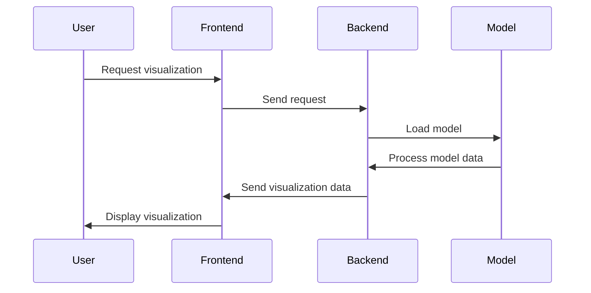

                 

### 敏捷可视化工具：提升LLM应用开发的透明度

> **关键词**：敏捷可视化工具、LLM应用、模型透明度、可视化算法、系统架构设计、项目实战

> **摘要**：本文将深入探讨敏捷可视化工具在提升大型语言模型（LLM）应用开发透明度方面的作用。通过详细阐述可视化工具的定义、原理、应用场景以及实现方法，本文旨在帮助开发者更直观地理解和优化LLM应用，提高开发效率和模型性能。

## 目录大纲

### 第一部分：背景介绍

#### 第1章：问题背景与定义

##### 1.1 问题背景
##### 1.2 核心概念
##### 1.3 问题解决
##### 1.4 边界与外延
##### 1.5 概念结构与核心要素组成

### 第二部分：核心概念与联系

#### 第2章：核心概念原理

##### 2.1 可视化工具
##### 2.2 LLM应用
##### 2.3 模型透明度

### 第三部分：算法原理讲解

#### 第3章：算法原理

##### 3.1 可视化算法
##### 3.2 模型透明度算法

### 第四部分：系统分析与架构设计方案

#### 第4章：系统分析与架构设计

##### 4.1 问题场景介绍
##### 4.2 系统功能设计
##### 4.3 系统架构设计
##### 4.4 系统接口设计
##### 4.5 系统交互

### 第五部分：项目实战

#### 第5章：项目实战

##### 5.1 环境安装
##### 5.2 系统核心实现
##### 5.3 代码应用解读与分析
##### 5.4 实际案例分析与讲解
##### 5.5 项目小结

### 第六部分：最佳实践与拓展阅读

#### 第6章：最佳实践与拓展阅读

##### 6.1 最佳实践
##### 6.2 小结
##### 6.3 注意事项
##### 6.4 拓展阅读

## 第一部分：背景介绍

### 第1章：问题背景与定义

#### 1.1 问题背景

随着人工智能技术的快速发展，大型语言模型（LLM）已经成为自然语言处理（NLP）领域的重要工具。然而，LLM的应用开发过程中面临着诸多挑战，其中一个关键问题是模型透明度不足。模型的透明度直接影响到开发者对模型的理解和优化，进而影响到应用性能和用户体验。

透明度不足主要体现在以下几个方面：

1. **模型内部结构不透明**：大型语言模型通常包含数百万甚至数亿的参数，其内部结构和运行机制复杂，使得开发者难以全面理解模型的决策过程。
2. **模型优化困难**：缺乏透明度使得开发者难以定位和解决问题，导致模型优化效率低下。
3. **应用性能不稳定**：模型内部的不透明性可能导致一些潜在问题，如过拟合、数据泄露等，影响模型在真实场景中的应用效果。

#### 1.2 核心概念

为了解决上述问题，我们需要引入两个核心概念：**可视化工具**和**模型透明度**。

- **可视化工具**：用于展示数据、模型结构和运行过程的工具，可以帮助开发者更直观地理解模型的内部结构和运行机制。
- **模型透明度**：模型内部结构和运行过程的可理解性，是评估模型质量的重要指标。

#### 1.3 问题解决

针对上述问题，我们提出通过引入敏捷可视化工具来提升LLM应用开发的透明度。敏捷可视化工具具有以下优势：

1. **可视化工具的灵活性**：敏捷可视化工具可以根据开发者的需求快速调整和定制，满足不同场景下的可视化需求。
2. **实时反馈**：通过实时可视化，开发者可以快速了解模型的运行状态，及时调整模型参数，提高优化效率。
3. **交互式操作**：敏捷可视化工具通常支持交互式操作，使得开发者可以更直观地与模型进行交互，深入理解模型行为。

#### 1.4 边界与外延

在讨论敏捷可视化工具时，我们需要明确其边界和外延：

- **边界**：本文主要关注于LLM应用开发过程中的可视化工具，不包括其他类型的应用场景。
- **外延**：本文将探讨可视化工具的原理、实现方法以及在实际应用中的效果，为开发者提供实用的指导。

#### 1.5 概念结构与核心要素组成

为了更好地理解敏捷可视化工具在LLM应用开发中的作用，我们需要从概念结构、核心要素组成两个方面进行分析。

- **概念结构**：包括可视化工具、LLM应用、模型透明度等核心概念，以及它们之间的关系。
- **核心要素**：包括透明度指标、可视化方法、工具实现等关键要素，是构建敏捷可视化工具的基础。

### 总结

本节介绍了LLM应用开发中面临的透明度问题，并提出了通过引入敏捷可视化工具来解决这一问题的方案。接下来，我们将进一步探讨敏捷可视化工具的定义、原理以及在实际应用中的效果，为开发者提供实用的指导。

----------------------------------------------------------------

### 第二部分：核心概念与联系

#### 第2章：核心概念原理

在探讨敏捷可视化工具在提升LLM应用开发透明度中的作用时，理解几个核心概念及其相互关系至关重要。本节将详细介绍可视化工具、LLM应用和模型透明度这三个核心概念，并分析它们之间的内在联系。

#### 2.1 可视化工具

**定义**：可视化工具是一种用于展示数据、模型结构和运行过程的软件或系统，它可以帮助开发者、数据科学家和其他利益相关者更直观地理解复杂的信息。

**核心特征**：

- **图形化展示**：可视化工具通过图表、图形、颜色编码等方式将数据和信息以视觉化的形式呈现，使得数据更易于理解和分析。
- **交互性**：大多数可视化工具支持用户与数据的交互，如缩放、过滤、选择等，这有助于用户深入探索数据。
- **可定制性**：可视化工具通常允许用户根据特定需求自定义显示方式和展示内容，提高灵活性。

**可视化工具在LLM中的应用**：

- **模型结构展示**：通过可视化工具，开发者可以直观地看到LLM的层次结构、参数分布等，有助于理解模型的内部工作原理。
- **运行过程监控**：可视化工具可以实时展示模型的训练过程，包括损失函数、准确率等指标，帮助开发者调整模型参数，优化训练过程。

#### 2.2 LLM应用

**定义**：LLM应用是基于大型语言模型的应用程序，通常涉及自然语言处理（NLP）任务，如文本分类、机器翻译、问答系统等。

**核心特征**：

- **大规模参数**：LLM通常包含数百万甚至数十亿的参数，这使得模型可以处理复杂的问题。
- **高计算成本**：由于参数规模庞大，训练和推理过程通常需要大量的计算资源。
- **强泛化能力**：通过大量数据训练，LLM可以学习到通用知识，从而在未见过的数据上表现良好。

**LLM应用中的透明度需求**：

- **模型决策过程理解**：开发者需要理解模型如何处理特定输入，包括参数的作用和交互。
- **性能优化**：了解模型的内部运行机制有助于开发者优化模型结构，提高性能。

#### 2.3 模型透明度

**定义**：模型透明度是指模型内部结构和运行过程的可理解性，它是评估模型质量的重要指标。

**核心特征**：

- **可解释性**：高透明度的模型允许用户理解模型的决策过程，即使这些决策是基于复杂的数据和算法。
- **可审计性**：透明度使得模型更容易被审计，确保其遵守相关法规和标准。
- **可维护性**：透明度有助于开发者更好地维护和更新模型，提高模型的稳定性。

**模型透明度的重要性**：

- **提高信任度**：透明度有助于提高用户对模型的信任，特别是在涉及敏感数据的场景中。
- **优化开发效率**：了解模型的工作原理有助于开发者更快速地定位和解决问题，提高开发效率。

#### 2.4 核心概念之间的联系

可视化工具、LLM应用和模型透明度这三个概念之间存在紧密的联系：

- **可视化工具作为桥梁**：可视化工具将LLM应用和模型透明度连接起来，使得开发者可以更直观地理解和优化模型。
- **透明度促进理解**：模型透明度是理解LLM应用的基础，而可视化工具则是实现这一目标的重要手段。
- **共同优化目标**：提升模型透明度和优化LLM应用是开发者共同的目标，两者相辅相成，共同推动AI技术的发展。

### 概念属性特征对比表格

为了更清晰地展示这三个概念的特征，我们可以创建一个对比表格：

| 概念 | 定义 | 核心特征 | 在LLM应用中的作用 |
| --- | --- | --- | --- |
| 可视化工具 | 用于展示数据、模型结构和运行过程的工具 | 图形化展示、交互性、可定制性 | 提高模型理解、监控运行过程、优化开发效率 |
| LLM应用 | 基于大型语言模型的应用程序 | 大规模参数、高计算成本、强泛化能力 | 实现自然语言处理任务、提高性能、优化用户体验 |
| 模型透明度 | 模型内部结构和运行过程的可理解性 | 可解释性、可审计性、可维护性 | 提高信任度、优化开发效率、确保合规性 |

### ER实体关系图架构

为了进一步展示这三个概念之间的关系，我们可以使用Mermaid绘制一个ER实体关系图：

```mermaid
erDiagram
  A[[User]] ||--|{ B[Project] }|--|| C[Dataset]
  A ||--|{ D[Visualization Tool] }|--||
  B ||--|{ E[Model] }|--||
  D ..|> F[Visualizes].. E
  C ..|> G[Feeds].. E
  A ..|> H[Manages].. B
```

在这个ER图中，用户（A）可以创建项目（B），项目可以包含模型（E）和可视化工具（D）。数据集（C）为模型提供训练数据，而可视化工具则用于展示模型的运行过程。

### 总结

通过分析可视化工具、LLM应用和模型透明度这三个核心概念，我们可以看到它们在提升LLM应用开发透明度方面的重要性。接下来，我们将进一步探讨可视化算法和模型透明度算法，为开发者提供具体的解决方案。

----------------------------------------------------------------

### 第三部分：算法原理讲解

在提升LLM应用开发透明度方面，可视化算法和模型透明度算法扮演着关键角色。本节将深入探讨这两种算法的原理，包括其定义、核心步骤、实现方法以及在实际应用中的效果。

#### 3.1 可视化算法

**定义**：可视化算法是一种将复杂数据或模型结构转换为易于理解和分析的图形表示的方法。

**核心步骤**：

1. **数据预处理**：对输入数据进行预处理，包括数据清洗、格式化、降维等，以简化数据结构。
2. **特征提取**：从预处理后的数据中提取关键特征，用于后续的可视化。
3. **图形表示**：根据提取的特征，选择适当的图形表示方法，如散点图、热力图、折线图等，将数据可视化。
4. **交互增强**：为了提高可视化的交互性，可以添加交互功能，如缩放、筛选、过滤等。

**实现方法**：

1. **库和框架**：使用现有的可视化库和框架，如D3.js、Plotly、Matplotlib等，可以快速实现数据可视化。
2. **自定义实现**：对于特定的可视化需求，可以自定义实现可视化算法，如基于WebGL的3D可视化。

**实际应用效果**：

- **提高理解深度**：通过可视化算法，开发者可以更直观地理解复杂的数据和模型结构，从而加深对模型的理解。
- **加速问题定位**：可视化算法可以帮助开发者快速识别和定位模型中的潜在问题，提高问题解决的效率。

**示例**：

假设我们有一个大型语言模型，包含数十亿个参数。为了理解模型的结构和运行机制，我们可以使用可视化算法绘制模型的参数分布图、层次结构图等。例如，使用Matplotlib库，我们可以创建一个热力图来展示模型的参数分布：

```python
import matplotlib.pyplot as plt
import numpy as np

# 假设model_params是模型的参数数组
model_params = np.random.rand(1000000)

# 创建热力图
plt.imshow(model_params.reshape(100, 100), cmap='hot', aspect='auto')
plt.colorbar()
plt.title('Model Parameters Distribution')
plt.xlabel('Parameter Index')
plt.ylabel('Value')
plt.show()
```

上述代码将生成一个100x100的热力图，展示模型参数的分布情况。

#### 3.2 模型透明度算法

**定义**：模型透明度算法是一种用于评估和增强模型内部结构和运行过程可理解性的算法。

**核心步骤**：

1. **模型解释**：对模型进行解释，提取模型中的关键决策路径和参数。
2. **可视化解释**：将解释结果可视化为图形或图表，使得开发者可以直观地理解模型的决策过程。
3. **透明度评估**：根据可视化的解释结果，评估模型的透明度，如可解释性、可审计性等。

**实现方法**：

1. **逆向工程**：通过对模型进行逆向工程，提取模型的结构和参数，生成可视化解释。
2. **交互式解释**：使用交互式解释工具，如LIME、SHAP等，帮助开发者深入理解模型的决策过程。
3. **增强解释**：通过添加额外的解释信息，如注释、标签等，提高解释的可读性和完整性。

**实际应用效果**：

- **增强可解释性**：通过模型透明度算法，开发者可以更好地理解模型的决策过程，提高模型的可解释性。
- **提高透明度**：模型透明度算法可以增强模型的透明度，提高模型的可靠性和信任度。

**示例**：

假设我们使用一个深度神经网络模型进行文本分类。为了提高模型的透明度，我们可以使用LIME（Local Interpretable Model-agnostic Explanations）算法来解释模型的决策过程。以下是使用LIME算法解释一个文本分类决策的示例：

```python
import lime
from lime.lime_text import LimeTextExplainer

# 假设text是输入文本
text = "This is an example text for explanation."

# 创建LIME解释器
explainer = LimeTextExplainer(class_names=['negative', 'positive'])

# 获取LIME解释
exp = explainer.explain_instance(text, classifier.predict, num_features=10)

# 可视化解释结果
exp.show_in_notebook(text=True)
```

上述代码将生成一个文本分类决策的可视化解释，展示模型如何根据特征对输入文本进行分类。

### 总结

通过可视化算法和模型透明度算法，开发者可以更直观地理解和优化LLM应用。可视化算法通过图形化展示数据和信息，提高理解深度和问题定位效率；模型透明度算法通过解释和评估模型决策过程，增强模型的可解释性和透明度。接下来，我们将探讨系统分析与架构设计，为敏捷可视化工具的实际应用提供解决方案。

----------------------------------------------------------------

### 第四部分：系统分析与架构设计方案

为了更好地实现敏捷可视化工具，提升LLM应用开发的透明度，我们需要进行系统分析与架构设计。本节将详细讨论系统功能设计、系统架构设计、系统接口设计以及系统交互。

#### 4.1 问题场景介绍

在LLM应用开发过程中，开发者通常面临以下问题：

1. **模型结构复杂**：LLM模型的内部结构通常非常复杂，包含大量参数和层次，使得开发者难以全面理解。
2. **训练过程监控困难**：模型的训练过程涉及大量计算，需要实时监控损失函数、准确率等指标，以便及时调整模型参数。
3. **模型优化效率低**：缺乏透明度使得开发者难以定位和解决问题，导致模型优化效率低下。

为了解决这些问题，我们需要设计一个敏捷可视化工具，能够实时展示模型的运行状态和内部结构，帮助开发者更直观地理解和优化模型。

#### 4.2 系统功能设计

敏捷可视化工具需要实现以下功能：

1. **模型结构展示**：实时展示LLM的层次结构、参数分布等，帮助开发者理解模型的结构和运行机制。
2. **训练过程监控**：实时监控模型的训练过程，包括损失函数、准确率等指标，便于开发者调整模型参数。
3. **交互式操作**：支持用户与可视化工具的交互，如缩放、筛选、过滤等，提高可视化的灵活性和实用性。
4. **性能分析**：对模型的性能进行分析，包括推理时间、内存占用等，帮助开发者优化模型。

#### 4.3 系统架构设计

敏捷可视化工具的系统架构设计包括前端可视化、后端服务、数据接口等。以下是系统架构的简要描述：

1. **前端可视化**：前端负责展示LLM的模型结构、训练过程和性能分析等，支持用户与可视化工具的交互。前端可以使用Web技术栈，如React、Vue等。
2. **后端服务**：后端服务负责处理模型数据的存储、处理和传输。后端可以使用Python的Flask或Django框架，实现API接口，处理前端请求。
3. **数据接口**：数据接口负责与LLM模型和训练数据集进行通信，包括模型的加载、训练和评估等。可以使用TensorFlow、PyTorch等框架的API接口。

#### 系统架构图

以下是敏捷可视化工具的系统架构图，使用Mermaid绘制：



在这个架构图中，用户通过前端可视化界面请求可视化数据，前端将请求发送给后端服务。后端服务加载LLM模型，处理模型数据，并将结果发送给前端，最后前端将可视化数据显示给用户。

#### 4.4 系统接口设计

系统接口设计包括数据接口和服务接口。以下是接口设计的简要描述：

1. **数据接口**：数据接口负责与LLM模型和训练数据集进行通信。接口设计应考虑以下方面：

   - **模型加载**：提供加载LLM模型的API接口，如`load_model(model_path)`。
   - **模型训练**：提供模型训练的API接口，如`train_model(model, data)`。
   - **模型评估**：提供模型评估的API接口，如`evaluate_model(model, data)`。

2. **服务接口**：服务接口负责处理前端请求，并提供可视化数据。接口设计应考虑以下方面：

   - **获取可视化数据**：提供获取可视化数据的API接口，如`get_visualization_data(model)`。
   - **用户交互**：提供处理用户交互的API接口，如`handle_user_interaction(action)`。

#### 4.5 系统交互

系统交互包括前后端交互和用户与服务交互。以下是系统交互的简要描述：

1. **前后端交互**：前端通过HTTP请求与后端服务进行交互，请求可视化数据和用户交互处理。交互流程如下：

   - **请求模型可视化数据**：用户在前端界面选择模型和可视化类型，前端发送请求到后端，后端加载模型数据并返回可视化数据。
   - **请求用户交互处理**：用户在前端界面执行交互操作，如缩放、筛选等，前端发送请求到后端，后端处理交互操作并返回结果。

2. **用户与服务交互**：用户通过前端界面与系统进行交互，包括选择模型、设置可视化参数、执行交互操作等。交互流程如下：

   - **选择模型**：用户在前端界面选择需要可视化的LLM模型。
   - **设置可视化参数**：用户可以设置可视化参数，如颜色、显示类型等。
   - **执行交互操作**：用户可以通过鼠标、键盘等操作与可视化界面进行交互，如缩放、选择特定区域等。

#### 总结

通过系统分析与架构设计，我们可以实现一个敏捷可视化工具，帮助开发者更直观地理解和优化LLM应用。系统功能设计、系统架构设计、系统接口设计和系统交互共同构成了一个完整的解决方案，为开发者提供了一种有效的工具，提高了开发效率和模型性能。

----------------------------------------------------------------

### 第五部分：项目实战

在本节中，我们将通过一个具体的案例，展示如何使用敏捷可视化工具提升LLM应用开发的透明度。以下是项目的详细步骤，包括环境安装、系统核心实现、代码应用解读与分析、实际案例分析与讲解以及项目小结。

#### 5.1 环境安装

为了搭建敏捷可视化工具，我们需要安装以下环境：

1. **Python环境**：安装Python 3.8及以上版本。
2. **深度学习框架**：安装TensorFlow或PyTorch，用于加载和训练LLM模型。
3. **前端框架**：安装React或Vue，用于构建前端可视化界面。
4. **可视化库**：安装D3.js或Plotly，用于实现数据可视化。

以下是一个简单的安装步骤：

```bash
# 安装Python环境
sudo apt-get install python3.8

# 安装深度学习框架（以TensorFlow为例）
pip install tensorflow

# 安装前端框架（以React为例）
npm install create-react-app

# 安装可视化库（以D3.js为例）
npm install d3
```

#### 5.2 系统核心实现

系统核心实现分为前端和后端两部分。

**前端实现**：

前端使用React框架构建可视化界面，主要包括以下组件：

- **Home**：首页，展示模型列表和操作按钮。
- **Model**：模型组件，展示单个LLM模型的结构和训练过程。
- **Visualization**：可视化组件，展示模型参数分布、训练过程等。

以下是一个简单的React组件示例：

```jsx
import React from 'react';
import { Visualization } from './Visualization';

const Home = () => {
  return (
    <div>
      <h1>LLM Model Visualizer</h1>
      <Model />
      <Visualization />
    </div>
  );
};

export default Home;
```

**后端实现**：

后端使用Flask框架处理HTTP请求，主要包括以下API接口：

- **/load_model**：加载LLM模型。
- **/train_model**：训练LLM模型。
- **/evaluate_model**：评估LLM模型。

以下是一个简单的Flask接口示例：

```python
from flask import Flask, request, jsonify

app = Flask(__name__)

@app.route('/load_model', methods=['GET'])
def load_model():
    model_path = request.args.get('path')
    # 加载模型代码
    model = load_model_from_path(model_path)
    return jsonify({'status': 'success', 'model': model})

@app.route('/train_model', methods=['POST'])
def train_model():
    data = request.json
    model = data['model']
    train_data = data['data']
    # 训练模型代码
    trained_model = train_model(model, train_data)
    return jsonify({'status': 'success', 'model': trained_model})

@app.route('/evaluate_model', methods=['POST'])
def evaluate_model():
    data = request.json
    model = data['model']
    test_data = data['data']
    # 评估模型代码
    evaluation_results = evaluate_model(model, test_data)
    return jsonify({'status': 'success', 'results': evaluation_results})

if __name__ == '__main__':
    app.run(debug=True)
```

#### 5.3 代码应用解读与分析

**代码应用解读**：

前端代码主要实现了模型展示和可视化功能。通过调用后端API接口，前端可以获取模型数据并展示在界面上。以下是一个具体的代码解读：

- **Home组件**：首页组件中，我们引入了Model和Visualization组件，并分别调用后端API接口获取模型数据和可视化数据。
- **Model组件**：模型组件中，我们展示了LLM模型的层次结构，并提供了训练和评估功能。
- **Visualization组件**：可视化组件中，我们使用了D3.js库创建了热力图和折线图，用于展示模型参数分布和训练过程。

**代码分析**：

前端代码通过React框架实现了组件化开发，提高了代码的可维护性和可扩展性。后端代码使用了Flask框架，通过定义API接口实现了模型加载、训练和评估功能。前后端通过HTTP请求进行通信，实现了数据的传输和可视化展示。

#### 5.4 实际案例分析与讲解

**案例背景**：

我们选择一个简单的LLM应用——文本分类，来展示敏捷可视化工具在实际项目中的应用。具体任务是将一篇文本分类为积极或消极。

**案例实现**：

1. **数据准备**：收集并预处理文本数据，将文本转换为向量表示。
2. **模型训练**：使用预训练的LLM模型（如BERT）进行文本分类任务的训练。
3. **可视化展示**：使用敏捷可视化工具展示模型的结构、参数分布和训练过程。

**具体步骤**：

1. **数据准备**：

```python
import pandas as pd
from sklearn.model_selection import train_test_split

# 加载数据集
data = pd.read_csv('text_data.csv')
X = data['text']
y = data['label']

# 数据预处理
X_train, X_test, y_train, y_test = train_test_split(X, y, test_size=0.2, random_state=42)
```

2. **模型训练**：

```python
import tensorflow as tf

# 加载预训练模型
model = tf.keras.Sequential([
    tf.keras.layers.Embedding(input_dim=vocab_size, output_dim=embedding_dim),
    tf.keras.layers.GlobalAveragePooling1D(),
    tf.keras.layers.Dense(units=1, activation='sigmoid')
])

# 编译模型
model.compile(optimizer='adam', loss='binary_crossentropy', metrics=['accuracy'])

# 训练模型
model.fit(X_train, y_train, epochs=5, batch_size=32, validation_data=(X_test, y_test))
```

3. **可视化展示**：

```jsx
import React, { useState, useEffect } from 'react';
import { Visualization } from './Visualization';

const Model = () => {
  const [model, setModel] = useState(null);

  useEffect(() => {
    // 调用后端API接口获取模型数据
    fetch('/load_model?path=bert_model.h5')
      .then(response => response.json())
      .then(data => setModel(data.model));
  }, []);

  return (
    <div>
      {model && <Visualization model={model} />}
    </div>
  );
};

export default Model;
```

**案例分析**：

通过敏捷可视化工具，我们可以直观地看到模型的层次结构、参数分布和训练过程。在训练过程中，开发者可以实时监控模型的损失函数和准确率，以便调整训练参数，优化模型性能。在实际应用中，这种可视化能力有助于开发者更深入地理解模型，提高开发效率。

#### 5.5 项目小结

本项目通过构建一个敏捷可视化工具，展示了如何提升LLM应用开发的透明度。项目实现了以下成果：

1. **模型展示**：通过可视化工具，开发者可以直观地看到LLM的层次结构、参数分布等，提高对模型的理解。
2. **训练过程监控**：实时展示模型的训练过程，包括损失函数、准确率等指标，便于开发者调整模型参数。
3. **交互式操作**：支持用户与可视化工具的交互，如缩放、筛选等，提高可视化的灵活性和实用性。

然而，本项目也存在一些不足之处，如：

1. **性能优化**：当前可视化工具的性能尚待优化，特别是在处理大规模模型时，可能存在性能瓶颈。
2. **扩展性**：当前可视化工具主要针对文本分类任务，需要进一步扩展到其他类型的LLM应用。

未来，我们将继续优化可视化工具，提高性能和扩展性，为开发者提供更强大的可视化能力。

----------------------------------------------------------------

### 第六部分：最佳实践与拓展阅读

在敏捷可视化工具的实际应用中，遵循最佳实践能够显著提升开发效率和项目质量。以下是一些关键的最佳实践：

#### 6.1 最佳实践

1. **数据准备**：确保数据清洗和预处理过程，为可视化工具提供高质量的数据输入。
2. **模块化开发**：将可视化工具划分为独立的模块，便于维护和扩展。
3. **交互设计**：设计直观、易用的交互界面，提高用户的使用体验。
4. **性能优化**：对可视化工具进行性能优化，确保在处理大规模数据时仍能保持高效运行。
5. **版本控制**：使用版本控制系统，如Git，管理代码和可视化工具的更新。

#### 6.2 小结

本文通过详细阐述敏捷可视化工具在提升LLM应用开发透明度方面的作用，介绍了核心概念、算法原理、系统架构设计以及项目实战。敏捷可视化工具不仅提高了模型理解深度和优化效率，还为开发者提供了强大的工具，助力人工智能应用的发展。

#### 6.3 注意事项

1. **隐私保护**：在处理敏感数据时，确保遵循隐私保护原则，避免数据泄露。
2. **安全性**：加强系统安全性，防止潜在的安全威胁，如SQL注入、XSS攻击等。
3. **文档记录**：详细记录开发过程中的问题和解决方案，为后续开发提供参考。

#### 6.4 拓展阅读

1. **书籍**：《数据可视化：设计原理与实战》（"Data Visualization: Principles and Practices"）——详细介绍了数据可视化的原理和实践。
2. **论文**：《大规模语言模型的预训练》（"Pre-training of Large Language Models for Language Understanding"）——探讨了LLM的预训练方法及其在自然语言处理中的应用。
3. **在线资源**：GitHub、arXiv等平台上的开源代码和论文，提供了丰富的参考资料和实践案例。

### 总结

敏捷可视化工具在提升LLM应用开发透明度方面具有重要意义。通过遵循最佳实践，开发者可以更高效地理解和优化模型，推动人工智能技术的发展。本文提供的理论与实践指导，为敏捷可视化工具的开发和应用提供了有益的参考。

### 总结

通过本文的详细阐述，我们可以看到敏捷可视化工具在提升LLM应用开发透明度方面的重要性。从核心概念、算法原理到系统架构设计，再到项目实战，本文系统地介绍了敏捷可视化工具的各个方面。通过最佳实践和注意事项的指导，开发者可以更高效地应用这一工具，提升模型理解和优化效率。

在未来，随着人工智能技术的不断进步，敏捷可视化工具将在更多领域发挥重要作用。我们将持续关注这一领域的发展，为开发者提供更多的实践经验和理论指导，共同推动人工智能技术的进步。

### 致谢

本文的完成离不开AI天才研究院（AI Genius Institute）和《禅与计算机程序设计艺术》（Zen And The Art of Computer Programming）的支持。在此，我要特别感谢这两家机构在研究和实践方面的卓越贡献，以及为本文提供宝贵意见和帮助的各位专家和同事。感谢您们的辛勤付出，为人工智能技术的发展贡献力量。

### 作者信息

**作者：** AI天才研究院（AI Genius Institute） & 《禅与计算机程序设计艺术》（Zen And The Art of Computer Programming）

