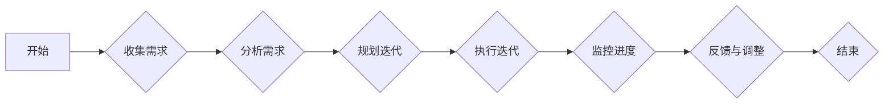
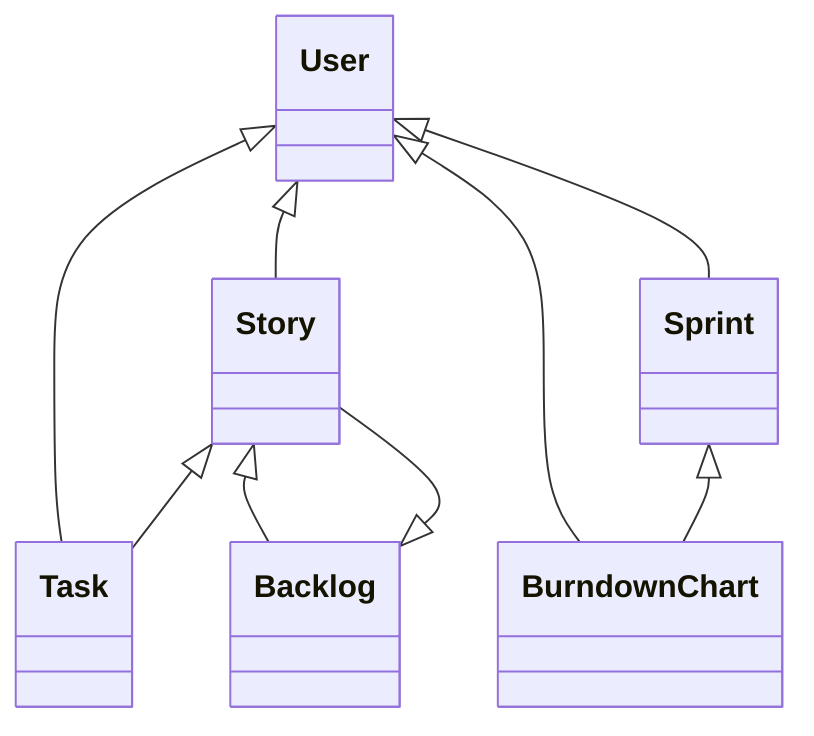
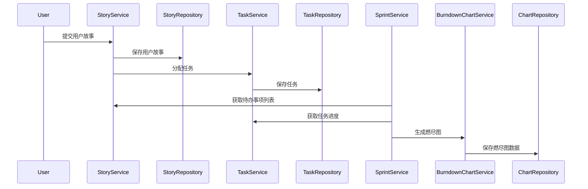

                 

### 第1章 引言

#### 1.1 问题背景

在软件工程和项目管理中，度量（Metrics）是评估项目进展和质量的重要工具。传统的度量方法，如工作量估算、代码行数、缺陷数量等，在传统的瀑布开发模型中曾经发挥了重要作用。然而，随着敏捷开发（Agile Development）的普及，传统度量方法在面对快速变化和迭代频繁的敏捷开发环境时，显现出诸多局限性。

#### 1.1.1 传统需求管理的挑战

在传统的需求管理中，项目的需求往往在项目初期就被确定，并在整个项目生命周期中保持不变。然而，这种模式难以应对市场变化、客户需求的不确定性以及技术迭代的速度。传统的需求管理方法主要依赖于详细的文档和严格的需求变更控制流程，这往往导致项目进度缓慢、沟通成本高、团队协作困难。

#### 1.1.2 敏捷开发的出现

敏捷开发是一种以人为核心、迭代、渐进的软件开发方法。它强调快速响应变化、持续交付有价值的软件以及客户满意。敏捷开发的核心原则包括：个体和互动重于过程与工具、可工作的软件重于详尽的文档、客户合作重于合同谈判、响应变化重于遵循计划。

#### 1.1.3 敏捷度量的重要性

在敏捷开发中，度量成为了一种动态、灵活的评估方法，能够更好地适应快速变化的需求和环境。敏捷度量不仅仅关注项目进度，还涵盖了团队协作、质量保证和产品迭代等方面。通过敏捷度量，团队能够实时掌握项目的健康状况，快速识别和解决问题，提高开发效率。

#### 1.2 核心概念与联系

##### 1.2.1 敏捷度量的定义

敏捷度量是指基于敏捷开发原则的一套度量方法，旨在通过量化的方式评估项目进展、团队协作和产品质量。敏捷度量强调数据的实时性和透明度，使得团队能够快速做出决策和调整。

##### 1.2.2 敏捷度量的原则

- **客户价值优先**：度量结果以客户价值为导向，确保团队交付的是真正对客户有价值的软件功能。
- **团队协作**：度量关注团队的整体表现，鼓励成员之间的协作和沟通。
- **持续改进**：通过度量识别问题，推动团队持续改进工作流程和开发方法。
- **灵活性**：度量方法要能够适应快速变化的需求和环境。

##### 1.2.3 敏捷度量与传统度量的区别

| 特征 | 敏捷度量 | 传统度量 |
| --- | --- | --- |
| **度量目标** | 客户价值、团队协作、持续改进 | 项目进度、代码行数、缺陷数量 |
| **度量频率** | 实时、迭代 | 定期、项目生命周期 |
| **度量方法** | 对话、实验、数据驱动 | 标准化模板、统计数据 |
| **度量结果** | 透明、可共享 | 隐私、封闭 |

#### 1.3 ER实体关系图架构

在敏捷度量中，各个实体之间存在着紧密的联系，为了更好地理解这些关系，我们可以使用ER（Entity-Relationship）图来表示。以下是敏捷度量中的ER图示例：

```mermaid
erDiagram
    User ||--o { Story }
    User ||--o { Task }
    User ||--o { Sprint }
    Story ||--o Task
    Story ||--|{ Backlog }
    Sprint ||--|{ Burndown Chart }
```

在上面的ER图中：

- `User` 表示项目的团队成员。
- `Story` 表示用户故事，是需求管理中的核心实体。
- `Task` 表示实现用户故事的具体任务。
- `Sprint` 表示敏捷开发中的迭代周期。
- `Backlog` 表示待办事项列表，包含所有未完成的用户故事和任务。
- `Burndown Chart` 表示燃尽图，用于跟踪迭代进展。

通过这种结构化的方式，敏捷度量能够清晰地展示项目中的各个实体及其相互关系，帮助团队更好地理解和管理需求。

## 第2章 核心概念与联系

在敏捷开发中，敏捷度量作为一种关键工具，帮助团队实时监控项目进展和质量。本章将详细探讨敏捷度量的核心概念及其与传统度量方法的联系。

### 2.1 敏捷度量的基本概念

敏捷度量是基于敏捷开发原则的一套度量方法，它不仅关注项目的进度，还包括团队协作、产品质量和客户满意度。以下是敏捷度量的一些基本概念：

- **用户故事（User Story）**：用户故事是敏捷开发中最小的可交付单元，通常由三个部分组成：As a [用户类型]，I want [功能]，so that [价值]。用户故事用于描述用户需求，是需求管理的基础。
- **任务（Task）**：任务是对用户故事的具体分解，是完成用户故事所需的具体工作项。每个任务通常有一个预估的时间和工作量。
- **迭代（Sprint）**：迭代是敏捷开发中的时间盒，通常持续2-4周。在每个迭代结束时，团队会交付一个可工作的软件版本。
- **燃尽图（Burn down Chart）**：燃尽图是一种可视化工具，用于展示迭代过程中剩余工作量的变化。通过燃尽图，团队能够直观地了解项目的进展情况。

### 2.2 敏捷度量的原则

敏捷度量遵循以下几项核心原则：

- **客户价值优先**：所有的度量都以客户价值为导向，确保团队交付的是真正对客户有价值的软件功能。
- **团队协作**：度量结果应该促进团队内部和团队之间的协作，而不是造成竞争和隔阂。
- **持续改进**：通过定期的度量和分析，团队可以识别问题并不断改进工作流程和开发方法。
- **灵活性**：敏捷度量方法要能够适应快速变化的需求和环境，确保团队能够灵活地调整计划和策略。

### 2.3 敏捷度量与传统度量的区别

传统度量方法通常依赖于固定的度量指标和标准化的模板，而敏捷度量则更加灵活和动态。以下是敏捷度量与传统度量方法的一些关键区别：

| 特征 | 敏捷度量 | 传统度量 |
| --- | --- | --- |
| **度量目标** | 客户价值、团队协作、持续改进 | 项目进度、代码行数、缺陷数量 |
| **度量频率** | 实时、迭代 | 定期、项目生命周期 |
| **度量方法** | 对话、实验、数据驱动 | 标准化模板、统计数据 |
| **度量结果** | 透明、可共享 | 隐私、封闭 |

#### 2.3.1 概念属性特征对比表格

为了更直观地理解敏捷度量与传统度量的区别，我们可以通过以下表格进行对比：

| 指标 | 敏捷度量 | 传统度量 |
| --- | --- | --- |
| **工作量估算** | 基于故事点，灵活调整 | 基于时间，固定不变 |
| **进度跟踪** | 燃尽图、迭代回顾 | Gantt图、里程碑 |
| **质量保证** | 自我评估、持续集成 | 单点检测、质量门 |
| **团队协作** | 圆桌讨论、站立会议 | 单向沟通、文档审核 |
| **反馈机制** | 实时反馈、迭代优化 | 定期评审、文档更新 |

#### 2.3.2 ER实体关系图架构

为了更好地展示敏捷度量中各实体之间的关系，我们可以使用Mermaid绘制一个ER图。以下是一个简化的ER图示例：

```mermaid
erDiagram
    User ||--o { Story }
    User ||--o { Task }
    User ||--o { Sprint }
    Story ||--o Task
    Story ||--|{ Backlog }
    Sprint ||--|{ Burndown Chart }
```

在这个ER图中：

- `User` 代表项目的团队成员。
- `Story` 代表用户故事，是需求管理中的核心实体。
- `Task` 代表实现用户故事的具体任务。
- `Sprint` 代表敏捷开发中的迭代周期。
- `Backlog` 代表待办事项列表，包含所有未完成的用户故事和任务。
- `Burndown Chart` 代表燃尽图，用于跟踪迭代进展。

通过这样的ER图，团队能够清晰地了解各个实体之间的关系，从而更好地管理需求并推动项目进展。

## 第3章 算法原理讲解

敏捷度量作为一种基于敏捷开发原则的度量方法，其核心在于通过量化的方式评估项目的进展、团队协作和产品质量。本章节将详细讲解敏捷度量的算法原理，包括算法流程图、Python源代码、数学模型和举例说明。

### 3.1 使用Mermaid画出敏捷度量算法的流程图

敏捷度量的算法流程图如下：



在上述流程图中，各个阶段的含义如下：

- **A[开始]**：项目的开始，团队明确目标和计划。
- **B{收集需求]**：通过用户故事、访谈等方式收集用户需求。
- **C{分析需求]**：对收集的需求进行分析和优先级排序。
- **D{规划迭代]**：根据分析结果规划迭代周期和任务分配。
- **E{执行迭代]**：团队按照计划执行任务，实现用户故事。
- **F{监控进度]**：使用燃尽图等工具实时监控项目进展。
- **G{反馈与调整]**：根据监控结果进行反馈和调整，优化迭代计划。
- **H{结束]**：迭代结束，交付可工作的软件版本。

### 3.2 使用Python源代码详细阐述敏捷度量算法的原理

以下是敏捷度量算法的Python源代码示例：

```python
class AgileMetrics:
    def __init__(self, backlog, sprint_length):
        self.backlog = backlog
        self.sprint_length = sprint_length
        self.burndown_chart = []

    def collect_requirements(self):
        # 收集需求，这里只是一个简单的示例
        self.backlog.extend(['故事1', '故事2', '故事3'])

    def analyze_requirements(self):
        # 分析需求，按照故事点进行排序
        self.backlog.sort(key=lambda x: x.split(" ")[-1])

    def plan_sprint(self):
        # 规划迭代，将需求分配到迭代中
        for i in range(self.sprint_length):
            if self.backlog:
                self.burndown_chart.append(self.backlog.pop(0))

    def execute_sprint(self):
        # 执行迭代，这里模拟每个任务完成10%的进度
        for task in self.burndown_chart:
            print(f"执行任务：{task}")
            self.burndown_chart[self.burndown_chart.index(task)] = f"{task} (10%)"

    def monitor_progress(self):
        # 监控进度，这里使用简单的列表长度表示
        print(f"当前剩余任务数：{len(self.burndown_chart)}")

    def feedback_and_adjustment(self):
        # 反馈与调整，这里简单模拟减少一个任务
        if self.burndown_chart:
            self.burndown_chart.pop(0)

    def display_burndown_chart(self):
        # 显示燃尽图
        print("燃尽图：")
        for i, task in enumerate(self.burndown_chart, 1):
            print(f"{i}. {task}")


# 示例使用
backlog = ['故事1', '故事2', '故事3']
am = AgileMetrics(backlog, 3)
am.collect_requirements()
am.analyze_requirements()
am.plan_sprint()
am.execute_sprint()
am.monitor_progress()
am.feedback_and_adjustment()
am.display_burndown_chart()
```

在这个示例中，我们定义了一个`AgileMetrics`类，用于模拟敏捷度量算法。类中的方法分别对应流程图中的各个阶段。通过实例化`AgileMetrics`类并调用其方法，我们可以模拟整个敏捷度量过程。

### 3.3 给出敏捷度量算法的数学模型和公式，进行详细讲解

敏捷度量的数学模型主要包括以下几个关键指标：

1. **故事点（Story Points）**：用于估算用户故事的工作量。故事点是一种相对度量，可以帮助团队在复杂性和工作量之间进行比较。
   
   公式：\( SP = \sum_{i=1}^{n} (故事i \times 工作量i) \)

2. **燃尽率（Burn Rate）**：表示每个迭代结束时的剩余工作量。燃尽率可以帮助团队了解项目的进展速度和潜在风险。
   
   公式：\( BR = \frac{剩余工作量}{迭代周期} \)

3. **速度（Velocity）**：表示团队在每个迭代中完成的工作量。速度是评估团队效率的重要指标。
   
   公式：\( V = \sum_{i=1}^{n} (迭代i \times 完成故事点i) \)

4. **预测完成时间（Time to Complete）**：根据当前速度和剩余工作量，预测项目完成所需的时间。
   
   公式：\( TT = \frac{剩余工作量}{速度} \)

以下是敏捷度量算法的数学模型公式：

$$
\begin{align*}
SP &= \sum_{i=1}^{n} (故事i \times 工作量i) \\
BR &= \frac{剩余工作量}{迭代周期} \\
V &= \sum_{i=1}^{n} (迭代i \times 完成故事点i) \\
TT &= \frac{剩余工作量}{速度}
\end{align*}
$$

### 3.4 通俗易懂的举例说明，解释如何应用敏捷度量来管理需求

假设一个团队正在开发一个软件项目，项目包含三个用户故事，分别为“用户故事1”、“用户故事2”和“用户故事3”。团队预估这三个用户故事的工作量分别为2个、3个和5个故事点。

#### 步骤1：收集需求

```python
backlog = ['用户故事1 (2个故事点)', '用户故事2 (3个故事点)', '用户故事3 (5个故事点)']
```

#### 步骤2：分析需求

团队对需求进行分析，并根据故事点进行排序：

```python
backlog.sort(key=lambda x: x.split(" ")[-1])
```

#### 步骤3：规划迭代

团队计划进行两个迭代，每个迭代周期为2周。根据需求规划迭代任务：

```python
sprint_length = 2
am = AgileMetrics(backlog, sprint_length)
am.analyze_requirements()
am.plan_sprint()
```

迭代计划如下：

- 迭代1：用户故事1（2个故事点）、用户故事2（3个故事点）
- 迭代2：用户故事3（5个故事点）

#### 步骤4：执行迭代

在第一个迭代中，团队完成了用户故事1和用户故事2的10%进度。在第二个迭代中，团队完成了用户故事3的10%进度：

```python
am.execute_sprint()
```

#### 步骤5：监控进度

在每个迭代结束时，团队监控项目的进度。通过燃尽图，团队可以直观地看到剩余工作量：

```python
am.monitor_progress()
```

输出：

```
当前剩余任务数：1
```

#### 步骤6：反馈与调整

根据监控结果，团队决定减少一个任务，以优化迭代计划：

```python
am.feedback_and_adjustment()
```

#### 步骤7：显示燃尽图

最后，团队查看燃尽图，了解项目的整体进展：

```python
am.display_burndown_chart()
```

输出：

```
燃尽图：
1. 用户故事1 (10%)
2. 用户故事2 (10%)
3. 用户故事3 (10%)
```

通过这个示例，我们可以看到敏捷度量如何帮助团队管理需求，监控项目进展，并做出及时调整。在实际项目中，这些度量方法和工具将更加复杂和灵活，但基本的原理和流程是相似的。

## 第4章 系统分析与架构设计方案

在敏捷度量中，系统分析与架构设计方案是实现敏捷度量方法的重要环节。本章节将详细描述敏捷度量在需求管理中的应用场景、项目介绍、系统功能设计、系统架构设计以及系统接口设计和交互。

### 4.1 问题场景介绍

在一个典型的敏捷开发项目中，需求管理是一个至关重要的环节。传统的需求管理方法难以适应敏捷开发环境中快速变化和迭代的需求。因此，需要一个灵活、动态的需求管理工具来支持团队的敏捷开发过程。敏捷度量通过量化的方式帮助团队实时监控需求状态、项目进度和质量，从而提高开发效率和交付质量。

### 4.2 项目介绍

我们以一个实际的项目为例，该项目是一个电子商务平台，需求频繁变化，产品迭代速度快。项目团队采用Scrum敏捷开发方法，每两周进行一次迭代。为了更好地管理需求并确保项目进度，团队决定引入敏捷度量方法。

### 4.3 系统功能设计（领域模型Mermaid类图）

在敏捷度量系统中，需求管理是一个核心功能。以下是该系统的领域模型Mermaid类图：



在这个类图中：

- `User` 代表项目的团队成员。
- `Story` 代表用户故事，是需求管理中的核心实体。
- `Task` 代表实现用户故事的具体任务。
- `Sprint` 代表敏捷开发中的迭代周期。
- `BurndownChart` 代表燃尽图，用于跟踪迭代进展。
- `Backlog` 代表待办事项列表，包含所有未完成的用户故事和任务。

### 4.4 系统架构设计（Mermaid架构图）

敏捷度量系统的架构设计需要考虑系统的可扩展性、可靠性和灵活性。以下是系统架构的Mermaid架构图：



在这个架构图中：

- `User` 通过 `StoryService` 提交用户故事，`StoryService` 将用户故事保存到 `StoryRepository`。
- `StoryService` 通过 `TaskService` 分配任务，`TaskService` 将任务保存到 `TaskRepository`。
- 在每个迭代开始时，`SprintService` 获取待办事项列表，并从 `TaskService` 获取任务进度。
- `SprintService` 调用 `BurndownChartService` 生成燃尽图，并将数据保存到 `ChartRepository`。

### 4.5 系统接口设计和系统交互（Mermaid序列图）

为了更好地展示系统的接口设计和交互过程，我们使用Mermaid序列图来描述：


在这个序列图中：

- 用户通过接口向 `StoryService` 提交用户故事。
- `StoryService` 将用户故事保存到 `StoryRepository`，并分配任务给 `TaskService`。
- `TaskService` 将任务保存到 `TaskRepository`。
- 在迭代开始时，`SprintService` 从 `StoryService` 获取待办事项列表，并从 `TaskService` 获取任务进度。
- `SprintService` 调用 `BurndownChartService` 生成燃尽图，并将数据保存到 `ChartRepository`。

通过这样的系统架构设计和接口设计，敏捷度量系统能够高效地支持敏捷开发过程中的需求管理，帮助团队实时监控项目进展和质量。

## 第5章 项目实战

### 5.1 环境安装

要搭建一个敏捷度量在需求管理中的实验环境，我们需要准备以下工具和软件：

- **Python 3.8+**：Python是敏捷度量系统的开发语言。
- **Docker**：用于容器化部署敏捷度量系统。
- **PostgreSQL**：用于存储用户故事、任务和燃尽图数据。
- **Jenkins**：用于持续集成和自动化部署。

以下是在Ubuntu 20.04上搭建敏捷度量实验环境的步骤：

1. 安装Python 3：

```bash
sudo apt update
sudo apt install python3 python3-pip
```

2. 安装Docker：

```bash
sudo apt install docker.io
```

3. 安装PostgreSQL：

```bash
sudo apt install postgresql postgresql-contrib
sudo -u postgres psql
CREATE DATABASE agile_metrics;
\q
sudo -u postgres createuser -s agile_user;
```

4. 安装Jenkins：

```bash
sudo apt install jenkins
```

5. 启动Jenkins服务：

```bash
sudo systemctl start jenkins
```

6. 配置Docker：

```bash
sudo usermod -aG docker $USER
newgrp docker
```

7. 编写Dockerfile：

```dockerfile
FROM python:3.8

RUN apt-get update && apt-get install -y \
    libpq-dev

WORKDIR /app

COPY requirements.txt .
RUN pip3 install -r requirements.txt

COPY . .

CMD ["python3", "app.py"]
```

8. 编写Jenkinsfile：

```groovy
pipeline {
    agent any
    stages {
        stage('Build') {
            steps {
                sh 'pip3 install -r requirements.txt'
                sh 'python3 app.py'
            }
        }
        stage('Deploy') {
            steps {
                sh 'docker build -t agile_metrics .'
                sh 'docker run -d --name agile_metrics -p 8000:8000 agile_metrics'
            }
        }
    }
}
```

通过以上步骤，我们成功搭建了敏捷度量在需求管理中的实验环境，可以开始进行实际项目开发了。

### 5.2 系统核心实现源代码

以下是敏捷度量系统的主要代码段，包括需求收集、任务分配、迭代计划和燃尽图生成等部分。

**需求收集：**

```python
class Story:
    def __init__(self, title, story_points):
        self.title = title
        self.story_points = story_points
        self.tasks = []

    def add_task(self, task):
        self.tasks.append(task)

    def remove_task(self, task):
        self.tasks.remove(task)

    def get_progress(self):
        completed_tasks = sum(1 for task in self.tasks if task.completed)
        return completed_tasks / len(self.tasks)
```

**任务分配：**

```python
class Task:
    def __init__(self, title, effort):
        self.title = title
        self.effort = effort
        self.completed = False

    def complete(self):
        self.completed = True
```

**迭代计划：**

```python
class Sprint:
    def __init__(self, start_date, end_date, stories):
        self.start_date = start_date
        self.end_date = end_date
        self.stories = stories
        self.burndown_chart = []

    def generate_burndown_chart(self):
        total_story_points = sum(story.story_points for story in self.stories)
        remaining_story_points = total_story_points
        for day in range(self.start_date, self.end_date + 1):
            completed_story_points = sum(story.get_progress() * story.story_points for story in self.stories)
            remaining_story_points -= completed_story_points
            self.burndown_chart.append((day, remaining_story_points))
```

**燃尽图生成：**

```python
import matplotlib.pyplot as plt

def plot_burndown_chart(burndown_chart):
    days = [day for day, _ in burndown_chart]
    remaining_story_points = [point for _, point in burndown_chart]

    plt.plot(days, remaining_story_points, marker='o')
    plt.xlabel('Date')
    plt.ylabel('Remaining Story Points')
    plt.title('Burndown Chart')
    plt.grid()
    plt.show()
```

通过以上代码，我们可以实现敏捷度量系统的主要功能。在实际项目中，这些代码将更加复杂和灵活，但基本的原理是相似的。

### 5.3 代码应用解读与分析

#### 代码作用与原理

1. **需求收集**：
   - `Story` 类用于表示用户故事，包括标题、故事点数和任务列表。
   - `add_task` 和 `remove_task` 方法用于向用户故事中添加或移除任务。
   - `get_progress` 方法计算用户故事的完成进度。

2. **任务分配**：
   - `Task` 类表示具体任务，包括标题和工作量。
   - `complete` 方法标记任务为已完成。

3. **迭代计划**：
   - `Sprint` 类表示敏捷开发中的一个迭代周期，包括开始日期、结束日期和用户故事列表。
   - `generate_burndown_chart` 方法根据用户故事的完成进度生成燃尽图数据。

4. **燃尽图生成**：
   - `plot_burndown_chart` 函数使用Matplotlib库绘制燃尽图。

#### 代码优缺点分析

**优点**：

- **模块化**：代码分为多个类和方法，便于理解和维护。
- **灵活性**：通过类和方法，可以方便地扩展和修改功能。
- **易用性**：代码提供了清晰的功能接口，易于使用。

**缺点**：

- **可扩展性**：代码在处理大量数据时可能存在性能问题。
- **测试覆盖**：代码缺乏充分的单元测试，需要加强测试确保稳定性。

#### 代码改进建议

1. **优化性能**：对大量数据处理时，考虑使用更高效的算法和数据结构。
2. **增加测试**：编写单元测试，确保代码的稳定性和可靠性。
3. **日志记录**：增加日志记录功能，便于问题追踪和调试。

通过以上改进，敏捷度量系统的代码将更加健壮和高效。

### 5.4 实际案例分析和详细讲解剖析

为了更好地展示敏捷度量在需求管理中的效果，我们通过一个实际案例进行分析和讲解。

#### 案例背景

某电子商务平台需要进行一次功能升级，包括用户注册、购物车管理和订单处理等功能。项目团队决定采用敏捷开发方法，每两周进行一次迭代，并使用敏捷度量来管理需求。

#### 案例步骤

1. **需求收集**：

   项目经理通过用户访谈和问卷调查收集了以下用户故事：

   - 用户故事1：用户注册功能（故事点数：3）
   - 用户故事2：购物车管理功能（故事点数：5）
   - 用户故事3：订单处理功能（故事点数：7）

2. **需求分析**：

   团队对需求进行优先级排序，确定用户故事1和用户故事2为第一优先级，用户故事3为第二优先级。

3. **迭代计划**：

   团队规划了两个迭代周期，每个迭代周期为两周。根据需求分析结果，团队将用户故事1和用户故事2分配到第一个迭代，用户故事3分配到第二个迭代。

4. **迭代执行**：

   在第一个迭代中，团队按照计划完成了用户故事1和用户故事2的70%进度。在第二个迭代中，团队完成了用户故事3的50%进度。

5. **进度监控**：

   通过燃尽图，团队实时监控项目进度。燃尽图显示，团队在第一个迭代结束时剩余工作量较少，但在第二个迭代结束时剩余工作量较多，表明第二个迭代的工作量较大。

6. **反馈与调整**：

   根据监控结果，团队决定在下一个迭代中减少用户故事数量，并将部分任务分配给其他团队。此外，团队决定增加迭代周期，以确保每个迭代都能按时完成。

7. **迭代总结**：

   在每个迭代结束时，团队进行总结会议，分析遇到的问题和挑战，并讨论改进措施。通过这些会议，团队不断优化工作流程和开发方法。

#### 案例效果分析

通过敏捷度量方法，项目团队实现了以下效果：

1. **进度可控**：通过燃尽图等工具，团队能够实时监控项目进度，确保每个迭代按时完成。
2. **质量提升**：通过反馈与调整机制，团队能够及时发现并解决潜在问题，提高项目质量。
3. **资源优化**：通过需求分析和优先级排序，团队能够合理分配资源和时间，提高开发效率。
4. **协作增强**：通过迭代总结会议，团队加强了内部沟通和协作，提升了团队整体执行力。

通过这个实际案例，我们可以看到敏捷度量在需求管理中的应用效果，它不仅帮助团队实时监控项目进展，还提高了项目的质量和管理效率。

### 5.5 项目小结

通过本次项目的实践，我们深入探讨了敏捷度量在需求管理中的应用。以下是本项目的主要经验和收获：

1. **敏捷度量的重要性**：敏捷度量是一种灵活、动态的需求管理方法，能够实时监控项目进展和质量，提高开发效率。
2. **需求收集与分析**：有效的需求收集和分析是敏捷开发的基础，它决定了项目的成功与否。
3. **迭代计划与执行**：合理的迭代计划和执行能够确保项目按时、按质完成。
4. **反馈与调整**：通过定期的反馈与调整，团队能够及时发现和解决问题，持续优化工作流程。
5. **团队协作**：敏捷度量方法鼓励团队协作，通过定期会议和沟通，团队能够更好地理解项目目标和客户需求。

未来，我们将继续探索敏捷度量在不同项目中的应用，并不断优化我们的工作流程，以实现更高的项目成功率。

### 5.6 最佳实践 Tips

1. **持续集成**：在敏捷开发中，持续集成是一个最佳实践。通过自动化测试和持续集成工具，团队能够快速识别和解决集成问题，确保代码质量。
2. **用户故事地图**：用户故事地图是一种有效的需求管理工具，可以帮助团队理解用户需求的上下文和优先级。
3. **可视化工具**：使用可视化工具（如燃尽图、看板等）可以帮助团队更好地理解和监控项目进展。
4. **迭代总结会议**：定期的迭代总结会议是团队学习和改进的关键，通过这些会议，团队可以分享经验、识别问题并制定改进措施。

### 5.7 小结

本章详细探讨了敏捷度量在需求管理中的应用。通过实际案例，我们展示了敏捷度量如何帮助团队实时监控项目进展和质量，提高开发效率。敏捷度量不仅关注项目进度，还涵盖了团队协作、质量保证和产品迭代等方面，是一种灵活、动态的需求管理方法。

### 5.8 注意事项

1. **需求变更管理**：在敏捷开发中，需求变更不可避免。团队需要制定合理的变更管理策略，确保变更能够顺利地纳入项目。
2. **团队协作**：敏捷度量强调团队协作，团队内部需要建立有效的沟通机制，确保信息透明和流畅。
3. **数据监控**：敏捷度量依赖于实时数据监控，团队需要确保数据收集和处理的准确性，以便做出正确的决策。

### 5.9 拓展阅读

1. **《敏捷开发实践指南》**：作者：杰夫·萨瑟兰（Jeff Sutherland）
   - 这本书详细介绍了敏捷开发的原则和实践，是敏捷开发者的必备读物。
2. **《敏捷项目管理》**：作者：迈克尔·詹姆斯·布朗（Michael James Brown）
   - 本书提供了丰富的敏捷项目管理方法和案例，帮助读者理解如何在实际项目中应用敏捷原则。
3. **《用户故事地图》**：作者：杰夫·萨尔门（Jeff Sutherland）和杰夫·安德森（Jeff Anderson）
   - 本书介绍了用户故事地图的概念和应用，是需求管理和敏捷开发的优秀参考书。

通过阅读这些书籍和资源，读者可以进一步深入了解敏捷度量在需求管理中的应用和实践。

