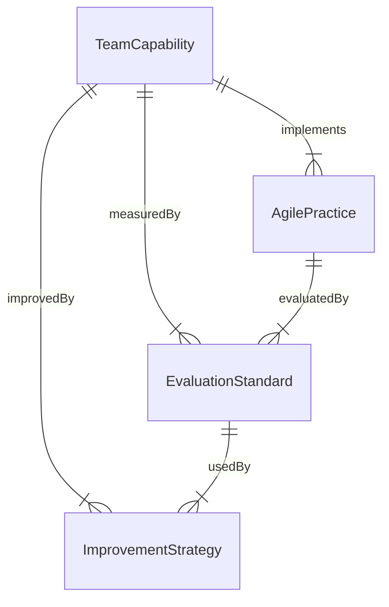

                 

### 引言

#### 敏捷成熟度模型的概念、背景和重要性

在现代软件开发领域，敏捷开发已经成为一种主流的开发方法。敏捷开发强调团队的合作、快速响应变化和持续改进，旨在提高软件开发的效率和质量。然而，即便团队采用了敏捷开发方法，其成熟度仍然可能存在差异。为了更好地衡量和提升团队在敏捷开发中的表现，敏捷成熟度模型应运而生。

敏捷成熟度模型（Agile Maturity Model）是一种用于评估和提升软件开发团队敏捷实践水平的工具。它通过一系列的评估标准和指标，帮助团队识别自身在敏捷实践中的优势和不足，从而进行有针对性的改进。对于使用大型语言模型（LLM）进行应用开发的团队来说，敏捷成熟度模型尤为重要。

首先，LLM应用开发具有高复杂性和高不确定性。传统的开发方法难以应对这种复杂性，而敏捷开发通过迭代和增量的方式，能够更好地适应变化。其次，LLM应用开发团队往往需要高度协作，敏捷成熟度模型提供了评估团队协作能力的标准，有助于提升团队的协作效率。最后，LLM应用开发往往涉及多种技术和工具，敏捷成熟度模型可以帮助团队评估这些技术和工具的使用效果，从而优化开发流程。

总的来说，敏捷成熟度模型不仅是一种评估工具，更是一种指导团队持续改进的方法论。它帮助LLM应用开发团队明确目标、识别问题、制定改进计划，从而实现高效、高质量的软件交付。

#### 本文的结构安排与内容概述

本文将系统性地介绍敏捷成熟度模型，旨在帮助LLM应用开发团队评估自身的发展状况，并指导团队进行改进。文章结构安排如下：

第一部分：引言
- 本章将介绍敏捷成熟度模型的概念、背景和重要性，并简要介绍本文的结构安排。

第二部分：敏捷成熟度模型理论基础
- 本章将详细讲解敏捷成熟度模型的理论基础，包括敏捷开发的基本原则、敏捷成熟度模型的框架和相关理论的联系与区别。

第三部分：敏捷成熟度模型核心概念与联系
- 本章将解析敏捷成熟度模型的核心概念，并使用概念属性特征对比表格和ER实体关系图架构进行详细说明。

第四部分：敏捷成熟度模型评估方法
- 本章将介绍如何评估团队的敏捷成熟度，包括评估流程、常用评估工具和方法以及数据分析与报告编写。

第五部分：LLM应用开发团队的敏捷成熟度评估实践
- 本章将通过实际案例展示如何应用敏捷成熟度模型评估LLM应用开发团队的成熟度。

第六部分：总结与展望
- 本章将对全文内容进行总结，并探讨敏捷成熟度模型在LLM应用开发团队中的未来发展方向。

通过本文的阅读，读者将能够深入了解敏捷成熟度模型，掌握评估和提升团队敏捷成熟度的方法和技巧，从而在LLM应用开发领域实现高效、高质量的软件交付。

### 思考过程

在撰写《敏捷成熟度模型：评估LLM应用开发团队的进展》这篇文章时，我们需要遵循以下思考过程：

#### 确定核心概念和术语

首先，我们需要明确文章中的核心概念和术语。在敏捷成熟度模型中，核心概念包括敏捷开发、敏捷成熟度、LLM应用开发、团队协作、迭代增量等。这些概念和术语构成了文章的理论基础，也是读者理解文章内容的关键。

#### 分析问题背景和现状

接下来，我们需要分析问题背景和现状。当前，敏捷开发已经成为软件开发的主流方法，但不同团队在敏捷实践中的成熟度存在差异。对于LLM应用开发团队来说，如何评估和提升敏捷成熟度成为一个关键问题。我们需要探讨这个问题的重要性和影响，从而引出本文的主题。

#### 梳理敏捷成熟度模型的理论基础

在文章的第二部分，我们将详细讲解敏捷成熟度模型的理论基础。这包括敏捷开发的基本原则、敏捷成熟度模型的框架和相关理论的联系与区别。这部分内容将帮助读者建立对敏捷成熟度模型的理论理解，为后续内容的分析提供依据。

#### 解析核心概念与联系

在第三部分，我们将深入解析敏捷成熟度模型的核心概念，并使用概念属性特征对比表格和ER实体关系图架构进行详细说明。这部分内容将帮助读者理解敏捷成熟度模型的具体构成和运作机制。

#### 介绍评估方法

在第四部分，我们将介绍如何评估团队的敏捷成熟度。这部分内容将包括评估流程、常用评估工具和方法以及数据分析与报告编写。通过这些评估方法，团队可以准确衡量自身的敏捷成熟度，并制定相应的改进计划。

#### 实际案例展示

在第五部分，我们将通过实际案例展示如何应用敏捷成熟度模型评估LLM应用开发团队的成熟度。这部分内容将帮助读者将理论知识应用于实际场景，提高对敏捷成熟度模型的实际操作能力。

#### 总结与展望

在文章的最后，我们将对全文内容进行总结，并探讨敏捷成熟度模型在LLM应用开发团队中的未来发展方向。这部分内容将帮助读者对敏捷成熟度模型有一个全面的认识，并为未来的改进提供指导。

#### 保持逻辑清晰和结构紧凑

在整个撰写过程中，我们需要保持逻辑清晰和结构紧凑。这意味着文章的内容需要有条理，各个部分之间要有明确的逻辑关系。同时，我们需要使用简单易懂的语言，确保读者能够轻松理解文章的内容。

### 敏捷成熟度模型概述

敏捷成熟度模型是一种用于评估和提升软件开发团队敏捷实践水平的工具。它通过一系列的评估标准和指标，帮助团队识别自身在敏捷实践中的优势和不足，从而进行有针对性的改进。对于使用大型语言模型（LLM）进行应用开发的团队来说，敏捷成熟度模型尤为重要。这是因为LLM应用开发具有高复杂性和高不确定性，传统的开发方法难以应对这种复杂性，而敏捷开发通过迭代和增量的方式，能够更好地适应变化。

#### 敏捷成熟度模型的概念

敏捷成熟度模型（Agile Maturity Model）是一种针对敏捷开发实践水平的评估框架。它通常由多个层次和维度组成，每个层次和维度都代表团队在敏捷实践中的一个方面。敏捷成熟度模型的核心目标是帮助团队识别自身在敏捷实践中的成熟度水平，并提供改进的方向和策略。

在敏捷成熟度模型中，成熟度水平通常分为几个级别，如初始级、管理级、协作级、优化级等。每个级别都有具体的评估标准和指标，团队可以根据这些标准和指标评估自身的成熟度水平。例如，在初始级，团队可能还没有完全理解敏捷开发的核心理念，而在管理级，团队已经建立了基本的敏捷流程和机制，能够有效地管理项目。

#### 敏捷成熟度模型的重要性

对于LLM应用开发团队来说，敏捷成熟度模型的重要性体现在以下几个方面：

1. **提升团队效率**：
   敏捷成熟度模型可以帮助团队识别效率低下的原因，从而有针对性地进行改进。例如，通过评估团队的协作情况，团队可以发现协作中的瓶颈，并采取相应的措施来优化协作流程。

2. **优化开发过程**：
   敏捷成熟度模型提供了评估开发流程的标准，团队可以根据这些标准评估自身的开发过程，发现流程中的问题和不足，从而进行优化。例如，团队可以通过评估迭代周期和反馈周期，来优化项目的进度和交付质量。

3. **促进团队成长与改进**：
   敏捷成熟度模型不仅是一种评估工具，更是一种指导团队持续改进的方法论。通过定期的评估和反馈，团队可以不断优化自身的敏捷实践水平，从而实现持续成长。

#### 敏捷成熟度模型在LLM应用开发团队中的应用

对于LLM应用开发团队来说，敏捷成熟度模型的应用具有以下特点：

1. **高复杂性的应对**：
   LLM应用开发涉及大量的数据和算法，具有较高的复杂性。敏捷成熟度模型可以帮助团队识别和解决开发过程中的复杂性问题，例如通过迭代和增量开发，逐步完善应用功能。

2. **快速适应变化的需求**：
   LLM应用开发的需求往往变化较快，敏捷成熟度模型可以帮助团队快速适应这些变化。例如，通过短周期的迭代，团队可以快速响应需求变化，并进行相应的调整。

3. **提升协作效率**：
   LLM应用开发团队通常需要高度协作，敏捷成熟度模型提供了评估团队协作效率的标准。通过这些标准，团队可以发现协作中的问题，并采取相应的措施来优化协作流程。

总的来说，敏捷成熟度模型为LLM应用开发团队提供了一种评估和提升敏捷实践水平的工具和方法。通过定期的评估和反馈，团队可以不断优化自身的敏捷实践水平，从而实现高效、高质量的软件交付。

### 敏捷成熟度模型的理论基础

敏捷成熟度模型（Agile Maturity Model）是在敏捷开发（Agile Development）的基础上发展起来的，旨在通过系统性的评估和改进，帮助软件开发团队实现敏捷实践的持续提升。在深入探讨敏捷成熟度模型之前，我们需要先了解敏捷开发的基本原则和敏捷成熟度模型的核心框架。

#### 敏捷开发的基本原则

敏捷开发起源于20世纪初的软件开发实践，它是对传统瀑布模型的一种反思和改进。敏捷开发强调灵活性、协作和持续改进，其核心原则包括：

1. **个体和互动重于过程和工具**：
   敏捷开发认为，团队成员的个性和互动是项目成功的关键，而不是依赖特定的工具或流程。

2. **可工作的软件重于详尽的文档**：
   敏捷开发更注重实际的软件交付，认为可工作的软件是衡量项目进展的最佳标准，而不是大量的文档。

3. **客户合作重于合同谈判**：
   敏捷开发强调与客户的紧密合作，通过持续沟通和反馈，确保项目的方向和目标与客户需求一致。

4. **响应变化重于遵循计划**：
   敏捷开发接受变化，并认为在项目进行过程中，变化是不可避免的，因此更注重如何适应变化，而不是盲目遵循计划。

#### 敏捷成熟度模型的核心框架

敏捷成熟度模型通常分为几个层级，每个层级代表团队在敏捷实践中的成熟度水平。以下是一个典型的敏捷成熟度模型框架：

1. **初始级（Initial Level）**：
   在这个层级，团队可能还没有完全理解敏捷开发的核心理念，或者只是偶尔采用敏捷实践。团队成员之间的协作和沟通可能存在问题，开发流程也不稳定。

2. **管理级（Managed Level）**：
   在这个层级，团队已经建立了基本的敏捷流程和机制，能够按照计划进行工作。团队成员之间的协作有所改善，但可能还需要进一步优化。

3. **协作级（Collaborating Level）**：
   在这个层级，团队已经实现了高度的协作，能够在不同阶段有效地沟通和合作。团队成员之间的信任和依赖关系得到了加强，项目的交付质量也有所提升。

4. **优化级（Optimizing Level）**：
   在这个层级，团队已经实现了持续改进的循环，能够快速适应变化，并持续提升敏捷实践水平。团队拥有良好的反馈机制和改进计划，能够高效地交付高质量的产品。

#### 敏捷成熟度模型的理论基础

敏捷成熟度模型的理论基础来源于敏捷开发的核心原则和实践经验。以下是一些关键的敏捷成熟度模型理论基础：

1. **S_curve理论**：
   S_curve理论是敏捷成熟度模型的一个重要组成部分，它描述了团队在敏捷实践中的成熟度水平随时间的变化。S_curve通常呈现出一个向上凸起的曲线，表示团队在初始阶段可能成熟度较低，但随着时间的推移，成熟度逐渐提升。

2. **Kano模型**：
   Kano模型是一种用于评估客户满意度的模型，它将客户满意度分为五个等级，分别为必需品、性能、激励、无差异和不满。在敏捷成熟度模型中，Kano模型可以帮助团队识别哪些因素对客户满意度影响最大，从而有针对性地进行改进。

3. **Baker模型**：
   Baker模型是一种用于评估团队敏捷能力的模型，它包括多个维度，如团队协作、沟通、流程管理和技术能力等。Baker模型可以帮助团队识别自身的优势与不足，并制定改进计划。

#### 敏捷成熟度模型与相关理论的联系与区别

敏捷成熟度模型与许多其他软件开发成熟度模型（如CMMI、SW-CMM等）有联系和区别。以下是几个关键点：

1. **与CMMI的联系**：
   CMMI（Capability Maturity Model Integration）是一种广泛使用的软件开发成熟度模型，它涵盖了项目管理、系统工程、软件工程和量化管理等多个方面。敏捷成熟度模型与CMMI在某些方面有相似之处，例如都强调流程管理和持续改进。但敏捷成熟度模型更注重灵活性和适应性，而CMMI则更注重规范性和标准化。

2. **与SW-CMM的联系**：
   SW-CMM（Software Process Capability Maturity Model）是早期的一种软件开发成熟度模型，它分为五个级别，分别代表从无序到有序的过程改进。敏捷成熟度模型与SW-CMM在级别划分上有一定的相似性，但敏捷成熟度模型更加灵活，能够适应快速变化的项目需求。

3. **与相关理论的区别**：
   敏捷成熟度模型与Kano模型、Baker模型等有显著的区别。Kano模型主要关注客户满意度，而敏捷成熟度模型更关注团队在敏捷实践中的成熟度。Baker模型则侧重于评估团队的敏捷能力，而敏捷成熟度模型更侧重于评估团队的敏捷实践水平。

总的来说，敏捷成熟度模型是一种针对敏捷开发实践的评估工具，它通过系统性的评估和改进，帮助团队实现敏捷实践水平的持续提升。与传统的软件开发成熟度模型相比，敏捷成熟度模型更加灵活和适应性，能够更好地适应现代软件开发的需求。

### 敏捷成熟度模型的核心概念与联系

在深入探讨敏捷成熟度模型之前，我们需要明确其核心概念，并理解这些概念之间的联系。敏捷成熟度模型的核心概念包括团队能力、敏捷实践、评估标准和改进策略。这些概念相互作用，共同构成了敏捷成熟度模型的框架。

#### 核心概念

1. **团队能力**：
   团队能力是敏捷成熟度模型的基础，它反映了团队在敏捷实践中的综合实力。团队能力包括多个方面，如沟通协作能力、技术能力、问题解决能力和决策能力等。这些能力不仅影响团队在敏捷实践中的表现，也决定了团队能否高效地应对复杂和变化的需求。

2. **敏捷实践**：
   敏捷实践是敏捷成熟度模型的核心内容，它涵盖了敏捷开发中的各种方法和工具，如Scrum、Kanban、看板等。敏捷实践旨在通过迭代和增量的方式，提高团队的灵活性和响应速度，从而更好地适应市场需求和客户反馈。

3. **评估标准**：
   评估标准是敏捷成熟度模型的重要组成部分，它用于衡量团队在敏捷实践中的成熟度水平。评估标准通常包括一系列的指标和衡量方法，如迭代周期、交付质量、客户满意度等。这些标准有助于团队识别自身在敏捷实践中的优势和不足，从而制定改进计划。

4. **改进策略**：
   改进策略是敏捷成熟度模型的核心目标，它旨在通过评估和反馈，帮助团队实现敏捷实践水平的持续提升。改进策略包括多种方法，如持续集成、代码审查、团队培训等。这些策略有助于团队不断完善自身的敏捷实践，提高软件交付的质量和效率。

#### 概念属性特征对比表格

为了更直观地理解敏捷成熟度模型的核心概念，我们可以使用概念属性特征对比表格进行详细说明。以下是一个简化的概念属性特征对比表格：

| 概念        | 属性特征                             | 关键联系                                       |
| ----------- | ---------------------------------- | -------------------------------------------- |
| 团队能力    | 沟通协作、技术能力、问题解决能力     | 团队能力决定了团队在敏捷实践中的表现           |
| 敏捷实践    | Scrum、Kanban、看板等               | 敏捷实践是实施敏捷开发的具体方法和工具         |
| 评估标准    | 迭代周期、交付质量、客户满意度       | 评估标准用于衡量团队在敏捷实践中的成熟度水平     |
| 改进策略    | 持续集成、代码审查、团队培训         | 改进策略有助于团队实现敏捷实践水平的持续提升     |

#### ER实体关系图架构

为了进一步理解敏捷成熟度模型的核心概念及其相互关系，我们可以使用ER（Entity-Relationship）实体关系图进行说明。以下是一个简化的敏捷成熟度模型ER实体关系图：

在这个ER实体关系图中，`TeamCapability`（团队能力）是核心实体，它与其他实体（`AgilePractice`（敏捷实践）、`EvaluationStandard`（评估标准）和`ImprovementStrategy`（改进策略））通过关系线连接。这种关系描述了敏捷成熟度模型中各个概念之间的相互作用和依赖关系。

- `TeamCapability`与`AgilePractice`之间存在“实施”（implements）关系，表示团队能力决定了敏捷实践的实施效果。
- `TeamCapability`与`EvaluationStandard`之间存在“衡量”（measuredBy）关系，表示团队能力通过评估标准来衡量其成熟度水平。
- `TeamCapability`与`ImprovementStrategy`之间存在“改进”（improvedBy）关系，表示团队能力通过改进策略来实现持续提升。
- `AgilePractice`与`EvaluationStandard`之间存在“评估”（evaluatedBy）关系，表示敏捷实践通过评估标准来评估其有效性。
- `EvaluationStandard`与`ImprovementStrategy`之间存在“使用”（usedBy）关系，表示评估标准通过改进策略来指导改进行动。

通过ER实体关系图，我们可以更清晰地理解敏捷成熟度模型中各个核心概念之间的关系，以及这些概念如何相互作用，共同推动团队敏捷实践水平的提升。

#### 概念联系与对比分析

在敏捷成熟度模型中，核心概念之间存在着密切的联系和相互作用。以下是对这些概念之间的联系和对比分析：

1. **团队能力与敏捷实践**：
   团队能力是敏捷实践的基础。一个具备高团队能力的团队能够更好地理解和应用敏捷实践，从而实现高效的工作流程。例如，一个具备良好沟通协作能力的团队，能够更好地在Scrum框架下进行任务分派和进度跟踪。反之，缺乏团队能力的团队可能在敏捷实践中遇到各种问题，如沟通不畅、任务分配不合理等。

2. **敏捷实践与评估标准**：
   敏捷实践的实施效果需要通过评估标准来衡量。评估标准为敏捷实践提供了具体的衡量指标，如迭代周期、交付质量、客户满意度等。这些标准有助于团队识别自身的优势和不足，从而进行有针对性的改进。例如，通过评估迭代周期，团队可以发现开发流程中的瓶颈，并采取相应的措施来优化流程。

3. **评估标准与改进策略**：
   评估标准为改进策略提供了指导方向。通过评估标准，团队可以识别出需要改进的方面，并根据评估结果制定改进策略。改进策略包括持续集成、代码审查、团队培训等，这些策略有助于团队不断提升敏捷实践水平。例如，如果评估标准显示迭代周期较长，团队可以采取持续集成的方法来缩短迭代周期。

4. **改进策略与团队能力**：
   改进策略的实施有助于提升团队能力。通过改进策略，团队可以不断完善自身的敏捷实践，从而提高团队能力。例如，通过代码审查，团队可以提升代码质量和开发效率；通过团队培训，团队可以提升技术能力和协作能力。

综上所述，敏捷成熟度模型中的核心概念之间存在着紧密的联系和相互依赖。通过这些概念之间的相互作用，团队可以不断优化敏捷实践，提高软件交付的质量和效率。了解这些概念之间的联系和对比，有助于团队更好地理解和应用敏捷成熟度模型，实现敏捷实践水平的持续提升。

### 敏捷成熟度模型评估方法

评估团队的敏捷成熟度是敏捷成熟度模型的重要组成部分，它通过一系列的评估标准和指标，帮助团队识别自身在敏捷实践中的优势和不足。评估方法不仅包括评估流程和步骤，还涉及常用的评估工具和数据分析方法。以下是对这些内容的详细阐述。

#### 评估流程与步骤

评估流程是敏捷成熟度模型中的关键环节，它包括以下几个步骤：

1. **准备阶段**：
   在进行评估之前，需要确保评估的顺利进行。这包括确定评估的目标和范围，准备必要的评估工具和资料，以及组建评估团队。

2. **数据收集**：
   数据收集是评估过程的核心。团队可以通过多种方式收集数据，如问卷调查、访谈、观察等。数据收集的过程需要确保数据的全面性和准确性。

3. **数据分析**：
   收集到的数据需要进行整理和分析，以便从中提取有价值的信息。数据分析的方法包括统计方法、比较分析等，通过这些方法，团队可以识别出在敏捷实践中的优势和不足。

4. **评估结果评定**：
   根据数据分析的结果，对团队的敏捷成熟度进行评定。评估结果通常以评分或等级的形式呈现，如初始级、管理级、协作级等。

5. **反馈与改进计划**：
   将评估结果反馈给团队，并制定改进计划。改进计划应包括具体的改进措施和时间表，以确保评估结果的落实。

#### 常用评估工具与方法

在敏捷成熟度评估过程中，常用的评估工具和方法包括以下几种：

1. **自评估问卷**：
   自评估问卷是团队自我评估的一种有效方法。问卷可以设计成多个维度，如团队协作、流程管理、客户满意度等，通过团队自我评分，可以初步了解团队在各个方面的成熟度。

2. **第三方评估**：
   第三方评估由外部专家进行，具有较高的客观性和权威性。第三方评估通常包括现场观察、访谈、文档审查等，通过全面了解团队的情况，提供更准确的评估结果。

3. **持续改进循环**：
   持续改进循环是一种动态评估方法，它通过定期评估和反馈，帮助团队实现持续改进。这种方法强调评估的连续性和反馈的及时性，确保团队能够及时调整和优化敏捷实践。

#### 数据分析与报告编写

数据分析和报告编写是评估过程的重要组成部分。以下是一些关键步骤：

1. **数据整理与统计**：
   对收集到的数据进行分析和整理，提取关键信息。常用的统计方法包括平均数、中位数、标准差等，通过这些统计方法，可以了解团队在各个评估指标上的表现。

2. **结果呈现**：
   将分析结果以图表、表格等形式呈现，以便于团队理解和讨论。常用的呈现方式包括柱状图、饼图、散点图等。

3. **报告撰写**：
   报告应包括评估结果、评估方法、数据分析、改进建议等内容。报告的撰写应注重逻辑清晰、语言简洁，确保团队能够顺利理解并执行改进计划。

通过以上评估方法和工具，团队可以系统地评估自身的敏捷成熟度，识别问题并进行改进。这种持续性的评估和改进，有助于团队不断提升敏捷实践水平，实现高效、高质量的软件交付。

### LLM应用开发团队的敏捷成熟度评估实践

在了解了敏捷成熟度模型的理论基础和评估方法后，我们将通过实际案例展示如何应用敏捷成熟度模型来评估LLM应用开发团队的成熟度。这一部分将详细介绍一个案例，包括案例背景、评估步骤、评估工具、数据分析以及改进策略。

#### 案例背景

假设我们有一个专注于开发大型语言模型（LLM）的团队，名为“语言智能团队”（Language Intelligence Team，LIT）。该团队由10名成员组成，包括数据科学家、软件工程师、产品经理和测试工程师等。他们正在开发一款名为“智能对话平台”（Smart Dialogue Platform，SDP）的AI应用，旨在为企业提供高效的客户支持解决方案。然而，团队在敏捷实践中的成熟度如何，以及他们如何改进，是我们需要解决的问题。

#### 评估步骤

1. **准备阶段**：
   - 确定评估目标：评估LIT在敏捷实践中的成熟度水平。
   - 确定评估范围：包括团队协作、流程管理、客户满意度等关键领域。
   - 准备评估工具：选择自评估问卷、第三方评估和持续改进循环等工具。

2. **数据收集**：
   - 自评估问卷：向团队成员分发自评估问卷，涵盖敏捷实践的关键方面。
   - 第三方评估：邀请外部专家对团队进行现场观察和访谈，以获取客观评估。
   - 观察和记录：评估团队成员在日常工作中的行为和流程，记录关键数据。

3. **数据分析**：
   - 整理问卷数据：对团队成员的自评估问卷结果进行整理和分析，提取关键信息。
   - 对比外部评估：将第三方评估结果与自评估问卷结果进行对比，识别不一致之处。
   - 统计分析：使用统计方法，如平均数、标准差等，对数据进行量化分析。

4. **评估结果评定**：
   - 根据数据分析结果，将LIT的敏捷成熟度分为不同的等级，如初始级、管理级、协作级等。
   - 撰写评估报告：总结评估结果，包括优势和不足，以及改进建议。

5. **反馈与改进计划**：
   - 向团队反馈评估结果，并讨论改进计划。
   - 制定具体的改进措施和时间表，确保评估结果的落实。

#### 评估工具

1. **自评估问卷**：
   自评估问卷包含以下关键方面：
   - 团队协作：团队成员之间的沟通和协作是否顺畅？
   - 流程管理：团队的敏捷流程是否规范、有效？
   - 客户满意度：客户的反馈是否及时，需求是否得到满足？
   - 迭代周期：项目的迭代周期是否合理，交付是否及时？

2. **第三方评估**：
   第三方评估通过以下方式对团队进行评估：
   - 现场观察：观察团队成员的工作流程和行为，记录关键数据。
   - 访谈：与团队成员进行一对一访谈，了解他们对敏捷实践的看法和反馈。
   - 文档审查：审查团队的文档和记录，验证敏捷实践的实施情况。

3. **持续改进循环**：
   持续改进循环通过以下步骤进行：
   - 定期评估：每季度进行一次敏捷成熟度评估，跟踪团队改进情况。
   - 反馈与讨论：将评估结果反馈给团队，讨论改进措施。
   - 实施改进：根据评估结果，制定具体的改进措施，并跟踪实施效果。

#### 数据分析与报告编写

1. **数据整理与统计**：
   对收集到的数据进行分析和整理，提取关键信息。例如，通过对问卷数据的统计分析，可以发现团队在哪些方面表现较好，哪些方面需要改进。

2. **结果呈现**：
   使用图表和表格等形式，将分析结果呈现给团队。例如，使用柱状图展示团队在不同评估指标上的得分，使用饼图展示各个评估维度的权重。

3. **报告撰写**：
   报告应包括以下内容：
   - 评估结果：总结团队在各个评估指标上的得分和等级。
   - 优势和不足：分析团队在敏捷实践中的优势和不足。
   - 改进建议：提出具体的改进措施和建议，包括改进目标、时间表和责任分配。

#### 改进策略

基于评估结果，LIT可以采取以下改进策略：

1. **提高团队协作**：
   - 定期组织团队建设活动，增强团队成员之间的信任和合作。
   - 实施跨职能团队，确保不同角色之间的沟通和协作更加顺畅。

2. **优化流程管理**：
   - 引入看板（Kanban）方法，可视化工作流程，减少浪费。
   - 定期审查和优化敏捷流程，确保流程的规范性和有效性。

3. **提升客户满意度**：
   - 增强与客户的沟通，及时反馈客户需求，确保产品满足客户期望。
   - 建立客户满意度调查机制，定期收集客户反馈，并进行改进。

4. **缩短迭代周期**：
   - 通过自动化测试和持续集成，加快交付速度。
   - 优化迭代计划，确保每个迭代都能按时交付可工作的软件。

通过上述评估和改进策略，LIT可以不断提升敏捷成熟度，提高开发效率和产品质量，从而实现LLM应用开发团队的高效运作。

### 总结与展望

#### 整体内容回顾

本文系统地介绍了敏捷成熟度模型，并详细探讨了其在评估LLM应用开发团队成熟度中的应用。文章首先介绍了敏捷成熟度模型的概念、背景和重要性，然后从理论基础、核心概念与联系、评估方法以及实际案例等多个维度进行了深入分析。

在理论基础部分，我们回顾了敏捷开发的基本原则和敏捷成熟度模型的核心框架，并探讨了与相关理论的联系与区别。核心概念部分，我们通过概念属性特征对比表格和ER实体关系图，详细阐述了团队能力、敏捷实践、评估标准和改进策略之间的关系。评估方法部分，我们介绍了评估流程、常用评估工具和数据分析与报告编写的方法。最后，通过实际案例展示，我们展示了如何将敏捷成熟度模型应用于LLM应用开发团队的评估和改进。

#### 文章主题思想的总结

本文的主题思想在于通过敏捷成熟度模型，帮助LLM应用开发团队评估和提升敏捷成熟度，从而实现高效、高质量的软件交付。敏捷成熟度模型不仅提供了一种评估工具，更是一种指导团队持续改进的方法论。通过定期的评估和反馈，团队可以识别问题、制定改进计划，并不断优化敏捷实践，从而提升团队的协作效率、优化开发过程，最终实现持续成长与改进。

#### 未来发展方向

随着人工智能技术的不断发展，LLM应用开发团队的敏捷成熟度评估也将面临新的挑战和机遇。以下是一些未来发展方向：

1. **个性化评估模型**：
   鉴于不同团队在敏捷实践中的成熟度存在差异，未来可能需要开发个性化的敏捷成熟度评估模型。这些模型可以根据团队的具体情况和需求，提供更加精准的评估结果和改进建议。

2. **自动化评估工具**：
   随着大数据和机器学习技术的发展，自动化评估工具将成为评估团队敏捷成熟度的重要工具。这些工具可以通过分析大量的数据和反馈，快速、准确地评估团队的敏捷成熟度，并提供个性化的改进建议。

3. **跨领域应用**：
   敏捷成熟度模型不仅适用于软件开发领域，还可以应用于其他领域，如产品设计、市场营销等。未来，可以将敏捷成熟度模型拓展到更多领域，帮助不同类型的团队实现高效协作和持续改进。

4. **持续改进循环**：
   持续改进循环是敏捷成熟度模型的核心。未来，可以进一步研究和优化持续改进循环的机制，确保团队能够在快速变化的环境中持续提升敏捷成熟度。

总之，敏捷成熟度模型在LLM应用开发团队中的应用具有重要意义。通过不断改进和优化评估模型和工具，团队可以更好地应对复杂和变化的需求，实现高效、高质量的软件交付。

### 最佳实践 Tips

在评估LLM应用开发团队的敏捷成熟度时，以下是一些最佳实践和注意事项，可以帮助团队更有效地应用敏捷成熟度模型：

1. **确保全员参与**：
   敏捷成熟度评估不仅仅是管理层或技术团队的任务，需要全体团队成员的参与。这样可以确保评估结果的全面性和客观性，同时也提高了团队成员对改进计划的认同感。

2. **定期评估**：
   定期进行敏捷成熟度评估有助于团队及时发现和解决问题。建议每季度或每半年进行一次评估，以确保评估结果能够反映团队的实际状况。

3. **数据收集的准确性**：
   评估过程中，数据收集的准确性至关重要。确保使用标准化的问卷和评估工具，并定期更新评估指标，以反映团队在敏捷实践中的最新进展。

4. **持续改进的闭环**：
   建立持续改进的闭环机制，确保评估结果能够转化为具体的改进行动。团队应制定详细的改进计划，并定期跟踪和评估改进效果。

5. **外部专家的支持**：
   在评估过程中，可以邀请外部专家参与，提供专业的意见和建议。外部专家的视角可以帮助团队发现内部可能忽视的问题。

6. **重视反馈机制**：
   建立有效的反馈机制，确保团队成员能够在评估过程中提供真实、全面的反馈。同时，对于改进措施的实施效果，也需要及时收集反馈，以便进一步优化。

7. **灵活调整评估模型**：
   鉴于LLM应用开发团队的特性，可能需要根据实际情况灵活调整敏捷成熟度评估模型。例如，可以增加与数据管理、模型训练相关的评估指标。

8. **培训与知识分享**：
   定期组织敏捷实践相关的培训和知识分享活动，提高团队成员对敏捷成熟度模型的了解和应用能力。

通过遵循这些最佳实践和注意事项，LLM应用开发团队可以更有效地应用敏捷成熟度模型，实现敏捷实践的持续改进和提升。

### 注意事项

在应用敏捷成熟度模型评估LLM应用开发团队的成熟度时，以下注意事项可以帮助团队避免常见问题，确保评估过程的有效性：

1. **避免形式主义**：
   敏捷成熟度评估不应仅仅成为一项形式性的任务，而应真正关注团队的实际表现和改进需求。确保评估过程与团队的实际工作紧密结合。

2. **充分考虑LLM应用的特殊性**：
   LLM应用开发具有高复杂性、不确定性和高度协作的特点，因此在评估过程中，需要特别关注这些因素，避免忽略LLM应用的独特需求。

3. **避免过度依赖工具**：
   尽管评估工具和方法有助于提高评估的准确性，但不应过度依赖工具。团队成员的主观反馈和实际操作经验同样重要，应结合多种数据来源进行评估。

4. **确保数据安全与隐私**：
   在数据收集和分析过程中，需确保数据的安全和隐私。对于涉及敏感信息的评估工具和方法，应采取适当的安全措施，防止数据泄露。

5. **避免单一指标评估**：
   敏捷成熟度评估应涵盖多个维度，不应仅仅依赖于单一指标。综合考虑团队协作、流程管理、客户满意度等多个方面，才能获得全面的评估结果。

6. **关注持续改进**：
   敏捷成熟度评估不仅是评估团队当前状态的工具，更是推动团队持续改进的契机。应确保评估结果能够转化为具体的改进行动，并持续跟踪改进效果。

7. **鼓励全员参与**：
   鼓励团队成员积极参与评估过程，不仅可以提高评估的准确性，还可以增强团队的凝聚力和归属感。

通过注意这些事项，LLM应用开发团队可以更有效地应用敏捷成熟度模型，实现敏捷实践的持续改进和提升。

### 拓展阅读

为了深入了解敏捷成熟度模型及其在LLM应用开发团队中的应用，以下是几本推荐的专业书籍和论文：

1. **书籍**：
   - 《敏捷管理实践指南》（"Agile Project Management: Creating Competitive Advantage"） by Jim Highsmith
   - 《敏捷软件开发：原理、实践与模式》（"Agile Software Development: Principles, Patterns, and Practices"） by Robert C. Martin
   - 《Scrum敏捷开发实践指南》（"Scrum: The Art of Doing Twice the Work in Half the Time"） by Jeff Sutherland

2. **论文**：
   - "Agile Maturity Models: A Framework for Evaluating Agile Processes" by Dr. Dobb's Journal
   - "The Role of Agile Maturity Models in Improving Software Development Processes" by International Journal of Computer Science Issues
   - "Using Agile Maturity Models to Evaluate and Improve Agile Adoption" by IEEE Software

这些书籍和论文提供了丰富的理论和实践指导，有助于读者深入了解敏捷成熟度模型，并在实际工作中应用这些方法。通过阅读这些资料，读者可以进一步提升对敏捷成熟度模型的理解，提高团队在LLM应用开发中的敏捷实践水平。

