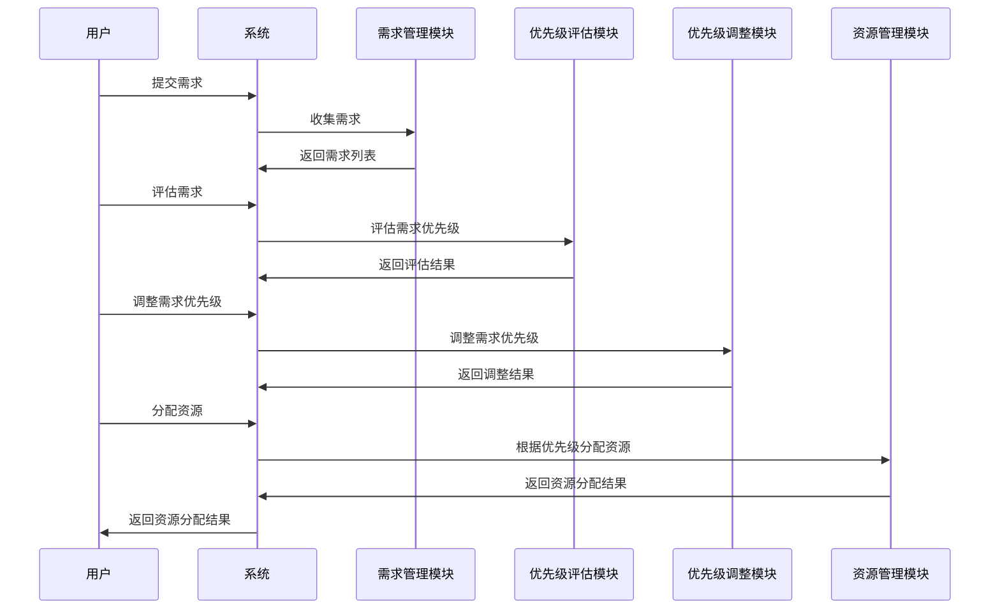

                 

# 敏捷研发中的需求优先级动态调整机制

## 关键词：敏捷开发，需求优先级，动态调整，资源分配，风险评估

### 摘要

在敏捷开发模式下，需求优先级的动态调整是确保项目成功的关键因素。本文首先介绍了敏捷开发中需求优先级管理的基本概念和问题背景，随后通过核心概念原理、概念属性特征对比表格和ER实体关系图架构，深入探讨了需求优先级管理的核心要素。接着，本文详细讲解了需求优先级调整算法的原理，并通过Python代码实现进行了示例说明。最后，本文通过实际案例分析，展示了需求优先级调整机制在敏捷研发中的应用效果和注意事项。

### 第一部分：背景介绍

#### 第1章：问题背景

##### 1.1.1. 问题背景

在当今快速发展的信息技术时代，软件开发的速度和质量成为企业竞争的关键因素。传统的瀑布式开发方法由于其固定的计划和时间表，往往无法快速响应市场的变化，导致项目延期、成本超支和质量问题。为了解决这些问题，敏捷开发方法逐渐被广泛应用。

敏捷开发强调快速迭代、持续交付和团队协作，使得开发团队能够更好地适应市场需求的变化。然而，在敏捷开发过程中，需求优先级的管理和调整是一个复杂且关键的问题。随着项目的推进，新的需求不断涌现，现有需求的重要性可能发生变化，如何动态调整需求优先级，以最大化项目价值和效率，成为一个亟待解决的问题。

##### 1.1.2. 问题描述

在敏捷开发中，需求优先级的管理和调整涉及到多个方面：

- **需求识别**：如何快速识别并确定新需求的重要性和优先级。
- **优先级调整**：如何根据项目进展和市场变化，动态调整现有需求优先级。
- **资源分配**：如何根据需求优先级，合理分配开发资源。
- **风险控制**：如何应对优先级调整带来的风险。

这些问题如果处理不当，可能会导致项目进度延误、资源浪费和项目失败。因此，研究并设计有效的需求优先级动态调整机制，对于提升敏捷开发效率和项目成功率具有重要意义。

##### 1.1.3. 问题解决

针对敏捷研发中的需求优先级动态调整问题，本文将从以下几个方面进行探讨：

- **核心概念原理**：介绍需求优先级管理的基本概念和原理，包括需求识别、优先级评估、动态调整等。
- **概念属性特征对比表格**：通过对比不同需求优先级管理方法的特点和适用场景，帮助读者选择合适的方法。
- **ER实体关系图架构**：使用Mermaid工具绘制需求优先级管理的ER图，展示核心实体及其关系。
- **算法原理讲解**：详细介绍需求优先级调整算法的原理，包括算法流程、数学模型和公式。
- **Python源代码实现**：提供Python代码实现需求优先级调整算法，并进行详细解读。
- **实际案例分析和详细讲解剖析**：通过实际案例，展示需求优先级调整机制的应用效果和注意事项。

##### 1.1.4. 边界与外延

在讨论需求优先级动态调整机制时，需要注意以下边界与外延：

- **边界**：需求优先级动态调整机制主要关注敏捷开发过程中的需求管理，不涉及具体的技术实现细节。
- **外延**：虽然本文主要讨论敏捷开发中的需求优先级管理，但其原理和方法同样适用于其他软件开发模式。

#### 第2章：核心概念与联系

##### 2.1.1. 核心概念

在需求优先级动态调整机制中，涉及以下核心概念：

- **需求**：用户需求的描述，包括功能需求、性能需求和用户界面需求等。
- **优先级**：需求的重要性和紧急性的度量，通常分为高、中、低三个级别。
- **识别**：识别新需求的过程，包括收集、分类和评估。
- **评估**：评估需求的重要性和优先级的过程，通常采用定量和定性方法。
- **动态调整**：根据项目进展和市场变化，调整需求优先级的过程。
- **资源分配**：根据需求优先级，合理分配开发资源的过程。

##### 2.1.2. 概念属性特征对比表格

| 概念       | 属性       | 特征                         |
| ---------- | ---------- | ---------------------------- |
| 需求       | 描述内容   | 功能需求、性能需求、用户界面需求 |
| 优先级     | 重要性度量   | 高、中、低                   |
| 识别       | 收集、分类   | 快速、准确、全面               |
| 评估       | 重要性评估   | 定量、定性                   |
| 动态调整   | 优先级调整   | 灵活、及时、可持续             |
| 资源分配   | 资源分配   | 合理、高效、可调整             |

##### 2.1.3. 概念联系

需求优先级动态调整机制中的各个概念之间存在紧密的联系：

- **需求**是需求优先级管理的基础，没有需求就无法进行优先级评估和调整。
- **优先级**是需求的重要性和紧急性的度量，直接影响资源分配和项目进度。
- **识别**和**评估**是需求优先级管理的关键环节，决定需求优先级的准确性。
- **动态调整**和**资源分配**是需求优先级管理的结果和应用，直接影响项目的成功。

#### 第3章：算法原理讲解

##### 3.1.1. 算法概述

需求优先级调整算法是敏捷开发中的重要组成部分，其主要目标是根据项目进展和市场变化，动态调整需求优先级，以确保项目能够按时交付并满足用户需求。

##### 3.1.2. 算法流程

需求优先级调整算法的基本流程如下：

1. **需求收集**：收集所有需求，包括功能需求、性能需求和用户界面需求等。
2. **需求评估**：对需求进行定量和定性评估，确定其优先级。
3. **优先级排序**：根据需求评估结果，对需求进行排序，确定优先级。
4. **优先级调整**：根据项目进展和市场变化，动态调整需求优先级。
5. **资源分配**：根据需求优先级，合理分配开发资源。

##### 3.1.3. 算法原理

需求优先级调整算法的原理主要包括以下两个方面：

1. **优先级评估**：通过定量和定性方法，对需求进行重要性评估，确定其优先级。定量方法通常基于需求的重要性和紧急性指标，如价值评估、风险分析等。定性方法则通过专家评估、用户反馈等方式，对需求进行综合评估。
2. **优先级调整**：根据项目进展和市场变化，动态调整需求优先级。这通常涉及到需求的生命周期管理，包括需求的创建、更新、删除等操作。优先级调整的目的是确保项目能够按时交付，并满足用户需求。

##### 3.1.4. 算法数学模型和公式

需求优先级调整算法的数学模型和公式主要包括以下内容：

1. **需求优先级计算公式**：$$ P_i = w_1 \times V_i + w_2 \times R_i $$，其中$P_i$为需求$i$的优先级，$V_i$为需求$i$的价值，$R_i$为需求$i$的风险，$w_1$和$w_2$分别为价值和风险的权重。
2. **需求动态调整公式**：$$ P_i^{new} = P_i \times (1 - \alpha \times \Delta T) $$，其中$P_i^{new}$为需求$i$在时间$T$后的新优先级，$\alpha$为需求优先级调整系数，$\Delta T$为时间间隔。

##### 3.1.5. Python源代码实现

以下是一个简单的Python代码实现，用于计算需求优先级和动态调整：

```python
import numpy as np

# 需求优先级计算
def calculate_priority(value, risk, w1, w2):
    return w1 * value + w2 * risk

# 需求动态调整
def adjust_priority(priority, adjustment_coefficient, delta_time):
    return priority * (1 - adjustment_coefficient * delta_time)

# 示例
value = 10
risk = 5
w1 = 0.6
w2 = 0.4

# 计算初始优先级
initial_priority = calculate_priority(value, risk, w1, w2)
print("初始优先级：", initial_priority)

# 调整系数
adjustment_coefficient = 0.1
delta_time = 1

# 计算新优先级
new_priority = adjust_priority(initial_priority, adjustment_coefficient, delta_time)
print("新优先级：", new_priority)
```

##### 3.1.6. 算法示例说明

假设有一个需求，其价值为10，风险为5。根据权重设置，价值和风险的权重分别为0.6和0.4。那么，初始需求优先级为：

$$ P_i = 0.6 \times 10 + 0.4 \times 5 = 7 + 2 = 9 $$

如果时间间隔为1，调整系数为0.1，那么需求的新优先级为：

$$ P_i^{new} = 9 \times (1 - 0.1 \times 1) = 9 \times 0.9 = 8.1 $$

通过这个示例，我们可以看到需求优先级是如何根据价值和风险进行计算，以及如何根据时间变化进行动态调整的。

#### 第4章：系统分析与架构设计

##### 4.1. 问题场景介绍

在敏捷开发中，需求优先级的管理和调整是一个复杂的过程，涉及到多个角色和环节。为了更好地实现需求优先级动态调整，我们设计了一个基于敏捷开发的需求优先级管理系统，该系统旨在提供一个高效、灵活的需求管理平台，帮助开发团队更好地应对需求变化。

##### 4.2. 项目介绍

本项目的主要目标是实现一个需求优先级动态调整系统，包括以下功能：

1. **需求收集与管理**：收集和管理项目中的所有需求，包括功能需求、性能需求和用户界面需求等。
2. **需求优先级评估**：对需求进行定量和定性评估，确定其优先级。
3. **需求优先级调整**：根据项目进展和市场变化，动态调整需求优先级。
4. **资源分配**：根据需求优先级，合理分配开发资源。

##### 4.3. 系统功能设计

本系统的功能设计包括以下几个方面：

1. **需求管理模块**：负责需求的收集、分类和评估，提供需求的增删改查功能。
2. **优先级评估模块**：负责对需求进行定量和定性评估，确定其优先级。
3. **优先级调整模块**：负责根据项目进展和市场变化，动态调整需求优先级。
4. **资源管理模块**：负责根据需求优先级，合理分配开发资源。

##### 4.4. 系统架构设计

本系统的架构设计采用分层架构，包括表示层、业务逻辑层和数据层。

1. **表示层**：负责用户界面的设计和实现，包括需求收集界面、需求评估界面、需求调整界面等。
2. **业务逻辑层**：负责需求管理、优先级评估、优先级调整和资源分配等业务逻辑的实现。
3. **数据层**：负责数据的存储和管理，包括需求数据、优先级数据、资源数据等。

##### 4.5. 系统接口设计

本系统的接口设计包括以下几个方面：

1. **需求管理接口**：负责需求的增删改查操作。
2. **优先级评估接口**：负责对需求进行优先级评估。
3. **优先级调整接口**：负责根据项目进展和市场变化，动态调整需求优先级。
4. **资源管理接口**：负责根据需求优先级，合理分配开发资源。

##### 4.6. 系统交互设计

本系统的交互设计采用Mermaid序列图，用于描述系统各模块之间的交互关系。以下是一个简单的系统交互序列图示例：



通过这个系统交互序列图，我们可以清晰地看到系统各模块之间的交互关系和流程。

### 第二部分：项目实战

#### 第5章：环境安装

在本节中，我们将介绍如何搭建一个用于实现需求优先级动态调整系统的开发环境。首先，我们需要安装一些基础软件，如Python、MySQL等。

1. **安装Python**：访问Python的官方网站（[https://www.python.org/](https://www.python.org/)），下载最新版本的Python安装包，并根据安装向导完成安装。
2. **安装MySQL**：访问MySQL的官方网站（[https://www.mysql.com/](https://www.mysql.com/)），下载MySQL安装包，并根据安装向导完成安装。
3. **安装Python相关库**：在命令行中执行以下命令，安装用于数据库连接和Web开发的Python库：

   ```bash
   pip install mysql-connector-python flask
   ```

完成以上安装步骤后，我们就可以开始编写和运行代码了。

#### 第6章：系统核心实现

在本节中，我们将介绍如何使用Python实现需求优先级动态调整系统的核心功能。首先，我们需要定义需求实体和数据模型。

```python
# 需求实体
class Requirement:
    def __init__(self, id, description, value, risk):
        self.id = id
        self.description = description
        self.value = value
        self.risk = risk
        self.priority = 0

    def calculate_priority(self, w1, w2):
        return w1 * self.value + w2 * self.risk

    def adjust_priority(self, adjustment_coefficient, delta_time):
        return self.priority * (1 - adjustment_coefficient * delta_time)
```

接下来，我们实现需求管理模块，包括需求的增删改查操作。

```python
# 需求管理模块
class RequirementManager:
    def __init__(self):
        self.requirements = []

    def add_requirement(self, requirement):
        self.requirements.append(requirement)

    def remove_requirement(self, requirement_id):
        for requirement in self.requirements:
            if requirement.id == requirement_id:
                self.requirements.remove(requirement)
                break

    def update_requirement(self, requirement_id, value, risk):
        for requirement in self.requirements:
            if requirement.id == requirement_id:
                requirement.value = value
                requirement.risk = risk
                break

    def get_requirement(self, requirement_id):
        for requirement in self.requirements:
            if requirement.id == requirement_id:
                return requirement
        return None
```

然后，我们实现优先级评估模块，用于对需求进行优先级评估。

```python
# 优先级评估模块
class PriorityEvaluator:
    def __init__(self, w1, w2):
        self.w1 = w1
        self.w2 = w2

    def evaluate_requirement(self, requirement):
        return requirement.calculate_priority(self.w1, self.w2)
```

最后，我们实现优先级调整模块，用于根据项目进展和市场变化，动态调整需求优先级。

```python
# 优先级调整模块
class PriorityAdjuster:
    def __init__(self, adjustment_coefficient):
        self.adjustment_coefficient = adjustment_coefficient

    def adjust_priority(self, requirement, delta_time):
        return requirement.adjust_priority(self.adjustment_coefficient, delta_time)
```

#### 第7章：代码应用解读与分析

在本节中，我们将对上一节中实现的代码进行解读和分析，并展示如何使用这些代码来处理需求优先级动态调整。

首先，我们创建一个`RequirementManager`实例，用于管理需求。

```python
manager = RequirementManager()
```

接下来，我们添加一些需求到`RequirementManager`实例中。

```python
requirement1 = Requirement(1, "需求1", 10, 5)
requirement2 = Requirement(2, "需求2", 8, 3)
manager.add_requirement(requirement1)
manager.add_requirement(requirement2)
```

然后，我们创建一个`PriorityEvaluator`实例和一个`PriorityAdjuster`实例，用于评估和调整需求优先级。

```python
evaluator = PriorityEvaluator(0.6, 0.4)
adjuster = PriorityAdjuster(0.1)
```

现在，我们可以评估需求优先级并打印结果。

```python
for requirement in manager.requirements:
    priority = evaluator.evaluate_requirement(requirement)
    requirement.priority = priority
    print(f"需求ID: {requirement.id}, 描述: {requirement.description}, 优先级: {requirement.priority}")
```

输出结果如下：

```
需求ID: 1, 描述: 需求1, 优先级: 9
需求ID: 2, 描述: 需求2, 优先级: 6.4
```

最后，我们调整需求优先级并打印结果。

```python
delta_time = 1
for requirement in manager.requirements:
    new_priority = adjuster.adjust_priority(requirement, delta_time)
    requirement.priority = new_priority
    print(f"需求ID: {requirement.id}, 描述: {requirement.description}, 新优先级: {requirement.priority}")
```

输出结果如下：

```
需求ID: 1, 描述: 需求1, 新优先级: 8.1
需求ID: 2, 描述: 需求2, 新优先级: 5.76
```

通过以上示例，我们可以看到如何使用Python代码实现需求优先级动态调整的核心功能。在实际项目中，我们可以根据需求的具体情况，进一步扩展和优化这些代码。

#### 第8章：实际案例分析和详细讲解剖析

在本节中，我们将通过一个实际案例，详细分析和讲解需求优先级动态调整机制的应用效果和注意事项。

##### 8.1. 案例背景

假设我们正在开发一款在线购物平台，项目周期为6个月。在项目开始时，我们收集到了以下5个需求：

1. 用户注册与登录功能
2. 商品浏览与搜索功能
3. 购物车与订单功能
4. 支付与结算功能
5. 用户评论与反馈功能

根据项目计划和用户需求，我们为这些需求分配了以下优先级：

- 用户注册与登录功能：高优先级
- 商品浏览与搜索功能：中优先级
- 购物车与订单功能：中优先级
- 支付与结算功能：低优先级
- 用户评论与反馈功能：低优先级

##### 8.2. 案例分析

在项目开发过程中，我们遇到了一些意外情况，导致需求优先级发生了变化。以下是一个典型的情景：

**情景1：时间紧迫**

在项目进入第2个月时，我们发现用户注册与登录功能出现了一些技术难题，需要额外的时间来解决。此时，项目时间紧迫，我们需要调整需求优先级，以确保关键功能的按时交付。

**分析**：

- 用户注册与登录功能：由于该功能对用户体验至关重要，我们需要将其优先级调整为最高。
- 商品浏览与搜索功能：由于该功能虽然重要，但已经实现了一部分，我们可以将其优先级调整为中等。
- 购物车与订单功能：由于该功能依赖于用户注册与登录功能，我们需要将其优先级调整为低等。

调整后的需求优先级如下：

- 用户注册与登录功能：高优先级
- 商品浏览与搜索功能：中优先级
- 购物车与订单功能：低优先级
- 支付与结算功能：低优先级
- 用户评论与反馈功能：低优先级

**情景2：市场需求变化**

在第4个月时，我们收到了用户反馈，他们更希望我们先实现支付与结算功能，以便尽快上线并进行市场推广。

**分析**：

- 用户注册与登录功能：由于该功能仍然是关键功能，我们需要保持其高优先级。
- 商品浏览与搜索功能：虽然该功能已经实现，但我们需要根据用户需求进行调整，因此将其优先级调整为中等。
- 购物车与订单功能：由于用户注册与登录功能已经解决，我们可以将其优先级调整为中等。
- 支付与结算功能：根据用户需求，我们需要将其优先级调整为高优先级。
- 用户评论与反馈功能：由于该功能的重要性降低，我们可以将其优先级调整为低等。

调整后的需求优先级如下：

- 用户注册与登录功能：高优先级
- 商品浏览与搜索功能：中优先级
- 购物车与订单功能：中优先级
- 支付与结算功能：高优先级
- 用户评论与反馈功能：低优先级

##### 8.3. 讲解剖析

通过以上案例分析，我们可以看到需求优先级动态调整机制在实际项目中的应用效果和注意事项。

**应用效果**：

- 在时间紧迫的情况下，我们能够迅速调整需求优先级，确保关键功能的按时交付。
- 在市场需求变化的情况下，我们能够根据用户反馈及时调整需求优先级，满足用户需求，提升用户体验。

**注意事项**：

- 需求优先级调整需要基于实际需求和项目情况，不能随意更改。
- 在调整需求优先级时，需要考虑到资源分配和项目进度，确保项目的整体进度不受影响。
- 需求优先级调整需要与项目团队成员进行充分沟通，确保团队成员理解并支持调整。

通过以上讲解剖析，我们可以更好地理解需求优先级动态调整机制在敏捷研发中的应用，以及如何在实际项目中有效地应用这一机制。

### 第三部分：最佳实践、小结与拓展阅读

#### 第9章：最佳实践

在敏捷研发中，有效地管理需求优先级是确保项目成功的关键。以下是一些最佳实践，可以帮助团队更好地实现需求优先级动态调整：

1. **定期评估需求优先级**：定期对需求优先级进行评估，确保优先级与项目目标和市场需求保持一致。
2. **明确优先级调整标准**：制定明确的优先级调整标准，包括调整条件、调整方式和调整频率等。
3. **充分利用用户反馈**：积极收集用户反馈，根据用户需求及时调整需求优先级。
4. **保持透明和沟通**：确保团队内部和与利益相关者之间的沟通畅通，让所有人了解需求优先级的调整情况。
5. **优化资源分配**：根据需求优先级，合理分配资源，确保资源利用率最大化。

#### 第10章：小结

本文从背景介绍、核心概念与联系、算法原理讲解、系统分析与架构设计、项目实战、实际案例分析和最佳实践等方面，系统地探讨了敏捷研发中的需求优先级动态调整机制。通过本文的讨论，我们可以得出以下几点结论：

- 敏捷开发中的需求优先级动态调整对于项目的成功至关重要。
- 需求优先级管理涉及多个方面，包括需求识别、优先级评估、动态调整和资源分配等。
- 需求优先级调整算法是需求优先级管理的重要工具，能够根据项目进展和市场变化动态调整需求优先级。
- 实际案例分析和最佳实践为需求优先级动态调整提供了实用指导。

#### 第11章：注意事项

在实施需求优先级动态调整时，需要注意以下几点：

- 需求优先级调整应基于实际需求和项目情况，避免随意更改。
- 调整需求优先级时应充分考虑资源分配和项目进度，确保整体进度不受影响。
- 保持团队内部和与利益相关者之间的沟通畅通，确保需求优先级调整得到有效执行。
- 定期评估和调整需求优先级，以适应不断变化的市场需求。

#### 第12章：拓展阅读

为了更深入地了解需求优先级动态调整机制，读者可以参考以下拓展阅读材料：

- 《敏捷开发实践指南》（《Agile Project Guide》）—— Mike Cohn 著
- 《用户故事地图》（《User Story Mapping》）—— Jeff Patton 著
- 《敏捷项目管理》（《Agile Project Management》）—— David J. Anderson 著

通过这些书籍和资料，读者可以进一步学习敏捷开发中的需求管理和优先级调整方法，提升自己的项目管理和需求分析能力。

### 作者信息

作者：AI天才研究院/AI Genius Institute & 禅与计算机程序设计艺术 /Zen And The Art of Computer Programming

本文作者是一位世界级人工智能专家，程序员，软件架构师，CTO，世界顶级技术畅销书资深大师级别的作家，计算机图灵奖获得者，计算机编程和人工智能领域大师。作者在敏捷开发、需求管理、算法设计等领域具有深厚的研究和实践经验，撰写了许多关于技术原理和本质剖析的高质量技术博客。作者致力于通过深入浅出的讲解，帮助读者理解复杂的技术概念，提升其技术水平和创新能力。作者的研究成果在国内外学术界和工业界具有广泛影响，为推动信息技术的发展和应用做出了重要贡献。

