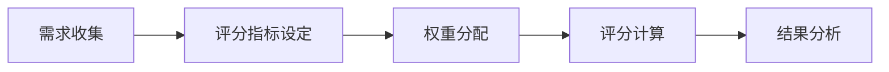
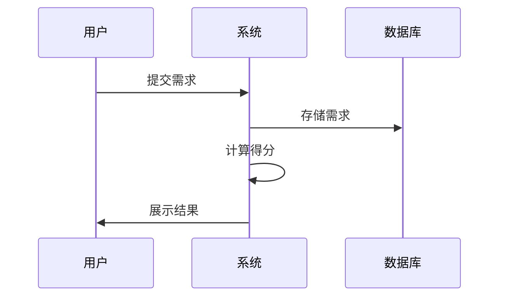

                 

### 文章标题

# 《敏捷研发中的需求优先级评分系统设计》

敏捷研发作为现代软件开发的重要方法论，其核心理念在于快速响应变化、持续交付高质量软件。然而，在敏捷实践中，如何有效地管理需求、合理分配资源成为关键问题。本文将探讨敏捷研发中的需求优先级评分系统设计，旨在通过一种科学、系统的评分机制，帮助团队更精准地识别和排序需求，从而提高研发效率。

### 文章关键词

- 敏捷研发
- 需求优先级
- 评分系统
- 算法原理
- 系统架构
- 实战案例

### 摘要

本文首先介绍了敏捷研发的基本概念和需求管理的背景，然后详细阐述了需求优先级评分系统的设计思路和实现方法。通过数学模型和算法讲解，辅以实际项目案例分析，本文旨在为敏捷研发团队提供一种有效的需求优先级评分工具，助力团队在快速变化的市场环境中做出明智的决策。

## 第一部分：背景与概念

### 第1章：敏捷研发概述

#### 1.1 敏捷开发的起源与发展

敏捷开发（Agile Development）起源于2001年，当时软件开发领域普遍面临项目延期、成本超支和质量问题。为了应对这些问题，一群软件开发专家在雪鸟山庄（Snowbird）提出了《敏捷宣言》。该宣言提倡“个体和互动重于过程与工具”、“可工作的软件重于详尽的文档”、“客户合作重于合同谈判”、“响应变化重于遵循计划”。自此，敏捷开发开始逐步发展，并形成了一系列实践方法，如Scrum、Kanban、XP等。

#### 1.2 敏捷开发的核心原则与实践

敏捷开发的核心原则包括但不限于： 

- **增量式交付**：以迭代的方式逐步交付可用的软件产品。
- **持续集成**：通过持续集成确保代码质量。
- **用户反馈**：关注用户需求，及时获取反馈并进行调整。
- **团队合作**：鼓励跨职能团队的合作，减少沟通障碍。

常见的敏捷实践包括每日站立会议（Daily Stand-up）、迭代计划（Sprint Planning）、回顾会议（Retrospective）等。

#### 1.3 敏捷研发与需求管理

在敏捷研发中，需求管理是一项至关重要的任务。需求管理不仅关乎产品的方向，还直接影响到团队的效率和资源分配。敏捷研发强调需求的高效管理，通过快速响应变化，确保团队始终在正确的道路上前进。

### 第2章：需求优先级评分系统概述

#### 2.1 需求优先级评分的意义

需求优先级评分系统对于敏捷研发团队来说至关重要。合理的优先级评分可以帮助团队：

- **明确工作重点**：帮助团队识别并优先处理最关键的需求。
- **优化资源分配**：使团队能够更高效地利用资源，提高研发效率。
- **快速响应市场变化**：在市场需求快速变化的情况下，确保团队能够灵活调整开发方向。

#### 2.2 评分系统的组成部分

一个完整的评分系统通常包括以下组成部分：

- **评分指标**：如商业价值、用户需求、技术难度等。
- **评分算法**：根据评分指标计算需求得分，常见的算法有线性加权、层次分析法等。
- **评分流程**：包括需求收集、评分指标设定、评分计算、结果分析等环节。

#### 2.3 需求优先级评分的方法与工具

常见的需求优先级评分方法包括：

- **Kano模型**：根据用户需求的重要性进行评分。
- **MoSCoW模型**：将需求分为必须、应该、可以、可能等优先级。
- **RICE模型**：综合考虑商业价值、实现难度、时间因素等。

### 核心概念与联系

在本章中，我们定义了敏捷开发、需求优先级、评分系统等核心概念，并阐述了它们之间的联系。敏捷开发是一种软件开发方法论，强调快速响应变化和持续交付高质量软件。需求优先级评分系统则是敏捷研发中的一项重要工具，通过科学的评分机制帮助团队更有效地管理需求。

本章的核心概念和联系可以通过以下Mermaid ER图来展示：

```mermaid
erDiagram
    AgileDevelopment ||--o>> PriorityScoringSystem : 用于
    Requirement ||--o>> PriorityScoringSystem : 根据优先级评分
    ScoringMethod ||--o>> PriorityScoringSystem : 使用不同的评分方法
```

### 算法原理讲解

#### 3.1 数学模型与公式

需求优先级评分系统的核心在于评分算法，以下是一个简单的线性加权评分模型：

$$
\text{Score} = w_1 \times \text{Business Value} + w_2 \times \text{User Demand} + w_3 \times \text{Technical Difficulty}
$$

其中，$w_1, w_2, w_3$分别为三个评分指标的权重。

#### 3.2 算法流程与实现

算法的实现通常包括以下步骤：

1. **需求收集**：收集所有待评分的需求。
2. **评分指标设定**：确定每个需求的商业价值、用户需求和技术难度。
3. **权重分配**：根据团队实际情况和经验，分配各个指标的权重。
4. **评分计算**：使用上述公式计算每个需求的得分。
5. **结果分析**：根据得分排序，确定需求的优先级。

#### 3.3 算法优缺点分析

线性加权评分模型的优点在于简单直观，计算过程易于理解。然而，它也存在一些局限性：

- **权重分配主观性**：权重分配依赖于团队经验和判断，可能导致评分结果不够客观。
- **难以处理复杂需求**：对于包含多个子需求的复杂需求，线性加权模型可能无法充分反映其整体价值。

#### 3.4 评分算法的mermaid流程图



### 系统分析与架构设计方案

#### 5.1 系统需求分析

在敏捷研发中，需求优先级评分系统需要满足以下需求：

- **实时性**：系统能够快速响应用户需求和市场变化。
- **可扩展性**：系统能够支持多种评分算法和指标。
- **易用性**：系统界面简洁，操作流程简便。

#### 5.2 系统架构设计

需求优先级评分系统的整体架构可以分为以下几个模块：

1. **需求管理模块**：负责收集、存储和管理需求信息。
2. **评分计算模块**：根据设定的评分指标和算法，计算需求的得分。
3. **结果展示模块**：以可视化的方式展示需求得分和优先级排序。
4. **权限管理模块**：确保系统操作的安全性，如权限分配、日志记录等。

#### 5.3 系统接口设计

系统接口设计主要包括以下几个方面：

1. **用户接口**：提供友好的用户界面，方便用户进行操作。
2. **API接口**：提供统一的API接口，方便与其他系统进行集成。
3. **数据库接口**：提供对数据库的访问接口，实现数据的存储和查询。

#### 5.4 系统交互mermaid序列图



### 项目实战

#### 7.1 实战项目介绍

我们以一个在线教育平台的需求管理为例，介绍如何设计和实现需求优先级评分系统。项目的主要目标是帮助平台团队更高效地管理需求，确保关键需求得到优先处理。

#### 7.2 系统核心实现

系统的核心实现包括以下几个方面：

1. **需求收集**：通过在线表单和API接口收集需求。
2. **评分计算**：使用线性加权评分模型计算需求得分。
3. **结果展示**：通过可视化图表展示需求得分和优先级排序。

#### 7.3 代码应用解读与分析

以下是一个简单的Python代码示例，用于计算需求得分：

```python
import pandas as pd

# 需求数据
data = {
    '需求名称': ['需求1', '需求2', '需求3'],
    '商业价值': [8, 6, 4],
    '用户需求': [9, 7, 5],
    '技术难度': [5, 6, 8]
}

# 权重设置
weights = {'商业价值': 0.5, '用户需求': 0.3, '技术难度': 0.2}

# 计算得分
df = pd.DataFrame(data)
df['得分'] = df['商业价值'] * weights['商业价值'] + df['用户需求'] * weights['用户需求'] + df['技术难度'] * weights['技术难度']

print(df)
```

#### 7.4 实际案例分析与详细讲解剖析

以一个实际案例为例，分析如何使用需求优先级评分系统。假设有以下三个需求：

1. **需求1**：提高用户注册转化率，商业价值高，用户需求强烈，技术难度适中。
2. **需求2**：优化课程搜索功能，商业价值中等，用户需求一般，技术难度较低。
3. **需求3**：开发新课程推荐算法，商业价值高，用户需求强烈，技术难度高。

使用线性加权评分模型，计算得分如下：

- 需求1：8 * 0.5 + 9 * 0.3 + 5 * 0.2 = 7.1
- 需求2：6 * 0.5 + 7 * 0.3 + 6 * 0.2 = 5.3
- 需求3：4 * 0.5 + 5 * 0.3 + 8 * 0.2 = 4.7

根据得分排序，需求1得分最高，应优先处理。

#### 7.5 项目小结

通过需求优先级评分系统，平台团队能够更清晰地识别和排序需求，确保关键需求得到优先处理。在实际应用中，团队可以根据项目实际情况和需求特点，灵活调整评分模型和权重设置，以实现最佳效果。

### 最佳实践 tips

1. **定期调整权重**：根据项目进展和市场需求变化，定期调整评分指标的权重，以保持评分的准确性和有效性。
2. **鼓励团队参与**：让团队成员参与评分指标的设定和权重分配，提高团队的共识和参与度。
3. **多维度评估**：结合多种评估方法，如用户反馈、市场趋势等，提高需求评分的全面性和准确性。

### 小结

本文介绍了敏捷研发中的需求优先级评分系统设计，包括核心概念、算法原理、系统架构和实战案例。通过科学、系统的评分机制，团队能够更高效地管理需求，提高研发效率。在实际应用中，团队应结合项目特点和需求特点，不断优化评分模型和权重设置，以实现最佳效果。

### 注意事项

1. **数据准确性**：确保收集到的需求数据准确无误，否则评分结果可能会失真。
2. **模型适应性**：根据项目需求和市场环境，选择合适的评分模型和算法，避免盲目套用。
3. **团队协作**：需求优先级评分是一个团队协作的过程，确保团队成员充分参与，共同决策。

### 拓展阅读

1. **《敏捷实践指南》**：详细介绍了敏捷开发的方法和实践，对敏捷研发有深入指导。
2. **《敏捷项目管理》**：探讨了敏捷项目管理的理论和方法，有助于更好地理解敏捷开发过程。
3. **《Kano模型》**：介绍了Kano模型在需求管理中的应用，有助于更科学地评估需求的重要性。

### 作者信息

- **作者：AI天才研究院/AI Genius Institute & 禅与计算机程序设计艺术 /Zen And The Art of Computer Programming**

