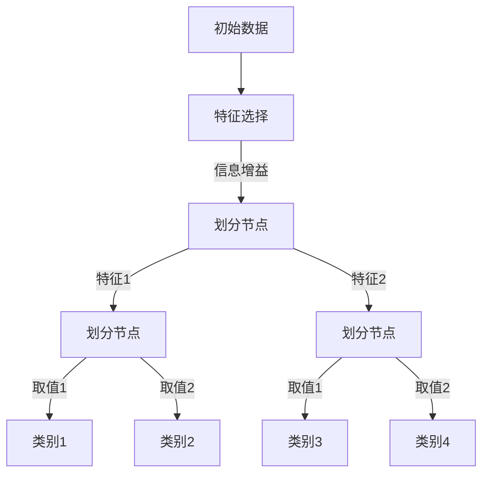
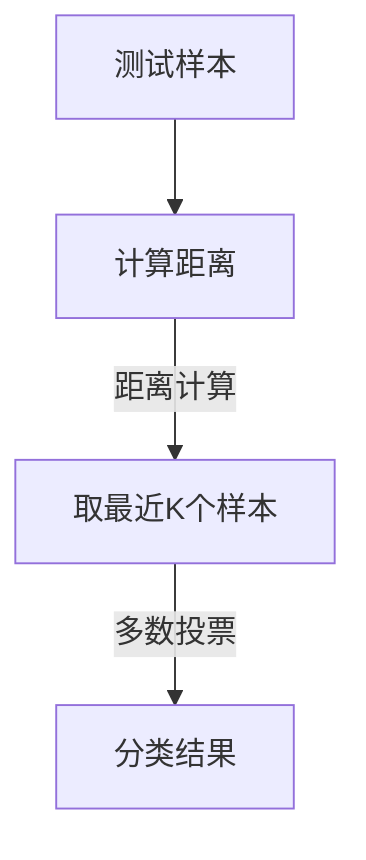
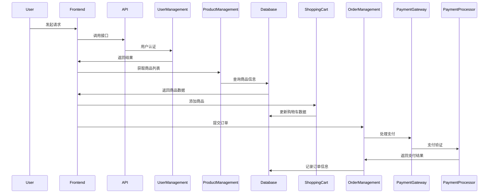
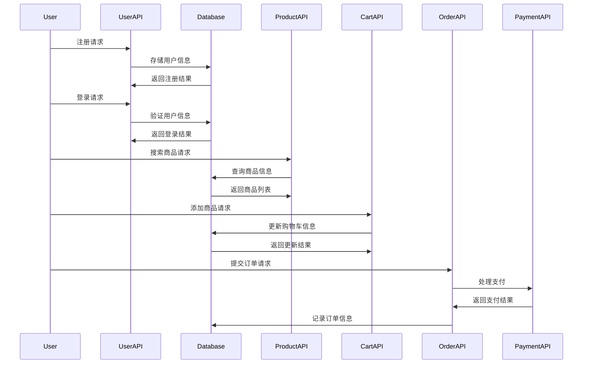
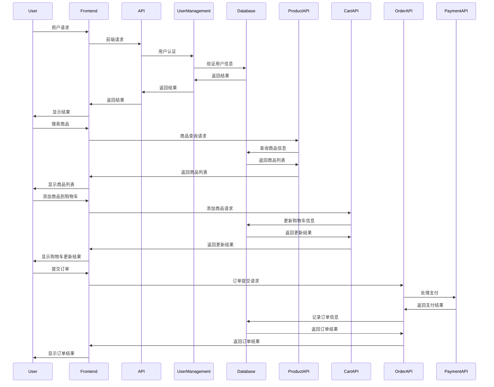

                 

## 引言

### 敏捷研发与需求沟通模板设计

在现代软件开发中，敏捷研发（Agile Development）已经成为主流开发模式之一。其核心理念包括迭代开发、快速响应变化、持续交付高质量软件等。敏捷研发强调团队合作、客户满意度、灵活性和高效性。然而，在敏捷开发过程中，需求沟通成为了一个至关重要的环节。需求的准确理解和有效传递直接影响到项目的成功与否。

需求沟通模板设计是敏捷研发中的一个关键任务，它旨在通过系统化的方法和工具，确保需求收集、分析和传递的准确性和效率。一个良好的需求沟通模板应当具备以下几个特点：

1. **明确性**：模板中的每一个字段和流程都应当清晰明确，避免模糊和歧义。
2. **可操作性**：模板应当易于使用，便于团队成员在实际操作中遵循。
3. **适应性**：模板需要能够适应不同类型的项目和需求，具有一定的灵活性。
4. **可追溯性**：模板中应当包含足够的元数据，便于追踪需求的变更历史和执行状态。

本文将围绕敏捷研发中的需求沟通模板设计进行深入探讨。我们将从以下几个方面进行逐步分析：

1. **核心概念与联系**：介绍需求沟通模板中的核心概念，如需求收集、用户故事、需求优先级排序等，并使用表格和Mermaid ER图展示它们之间的关系。
2. **算法原理讲解**：讲解用于需求沟通模板设计的关键算法，包括分类算法、聚类算法等，并通过Mermaid流程图和Python代码进行详细阐述。
3. **数学模型与公式**：使用LaTeX格式嵌入数学公式，对算法中的关键参数和计算过程进行详细讲解。
4. **系统分析与架构设计**：介绍系统场景和需求，展示系统功能设计、架构设计、接口设计和交互序列图。
5. **项目实战**：描述项目环境安装、系统核心实现、代码应用解读、案例分析以及项目小结。
6. **最佳实践与拓展**：提供最佳实践建议，对全书进行小结，指出注意事项，并推荐拓展阅读资源。

通过本文的逐步分析，读者将能够深入了解敏捷研发中的需求沟通模板设计方法，掌握如何在实际项目中有效应用这些方法，以提高项目的成功率和团队协作效率。

### 背景介绍与核心概念

#### 核心概念术语说明

在敏捷研发中，需求沟通模板设计涉及到一系列核心概念，这些概念对于确保需求的准确理解和有效传递至关重要。以下是对这些核心概念的术语说明：

1. **需求收集（Requirement Collection）**：需求收集是指通过多种渠道，如问卷调查、用户访谈、市场调研等，获取用户和利益相关者的需求信息。

2. **用户故事（User Story）**：用户故事是一种描述用户需求的方法，它从用户的角度出发，以简单、明确的语言表述用户希望实现的功能或服务。

3. **用户场景（User Scenario）**：用户场景是描述用户在使用产品或服务过程中的一系列操作和交互。它帮助团队更好地理解用户需求和期望。

4. **需求优先级排序（Requirement Prioritization）**：需求优先级排序是确定哪些需求需要优先开发和实现的过程。优先级排序通常基于业务价值、技术难度、风险等因素。

5. **需求分析（Requirement Analysis）**：需求分析是对收集到的需求进行详细分析、整理和归类，以确保每个需求都得到准确理解和有效传递。

6. **需求文档（Requirement Document）**：需求文档是一份详细的文档，记录了项目的所有需求，包括用户故事、用户场景、需求优先级等。

#### 问题背景

在现代软件开发中，需求变化频繁且复杂。一方面，客户和市场环境不断变化，需求也随之调整；另一方面，软件开发团队内部沟通不畅，可能导致需求理解偏差和实现错误。这些问题对项目的进度和质量产生了负面影响。

传统的方法，如瀑布模型（Waterfall Model），通常在需求确定后再进行开发，导致需求变更难以适应，开发周期过长，成本高昂。而在敏捷研发中，需求沟通的重要性愈加凸显。敏捷方法强调快速迭代和持续交付，需求沟通的效率和质量直接决定了项目的成功与否。

#### 问题描述

在敏捷研发中，需求沟通模板设计面临以下问题：

1. **需求理解偏差**：由于团队成员对需求的理解和解释可能存在差异，导致需求实现时出现偏差。

2. **沟通成本高**：传统的需求沟通方式，如会议和邮件，效率低下，耗费大量时间和精力。

3. **需求变更频繁**：在敏捷开发过程中，需求变更频繁且不可预测，传统的需求管理方法难以应对。

4. **文档管理混乱**：需求文档分散，缺乏统一管理，导致查找和使用困难。

#### 问题解决

为解决上述问题，需求沟通模板设计需要关注以下几个方面：

1. **明确性**：模板中的每一个字段和流程都应清晰明确，避免歧义和误解。

2. **可操作性**：模板应易于使用，便于团队成员在实际操作中遵循。

3. **适应性**：模板应具备灵活性，能够适应不同类型的项目和需求。

4. **可追溯性**：模板中应包含足够的元数据，便于追踪需求的变更历史和执行状态。

5. **自动化工具**：使用自动化工具，如项目管理软件和协作平台，提高需求沟通的效率和准确性。

通过有效的需求沟通模板设计，敏捷研发团队可以更好地理解需求，减少误解和沟通成本，快速响应需求变更，提高项目的成功率。

#### 边界与外延

1. **边界**：需求沟通模板设计主要应用于敏捷研发领域，但在其他需要高效需求管理的软件开发项目中，如Scrum、Kanban等，也具有参考价值。

2. **外延**：需求沟通模板不仅适用于软件项目，还可以扩展到其他类型的项目，如产品开发、服务设计等，关键在于确保需求的准确传递和有效管理。

### 概念结构与核心要素组成

需求沟通模板的设计涉及多个核心概念和要素，这些要素相互作用，共同构成了一个完整的沟通框架。以下是这些核心概念及其在需求沟通模板中的具体作用：

1. **用户故事（User Story）**：
   - **定义**：用户故事是描述用户需求的简单、明确的故事，通常以用户角度来编写。
   - **作用**：用户故事帮助开发团队理解用户的目标和需求，确保开发的功能与用户实际需求一致。

2. **用户场景（User Scenario）**：
   - **定义**：用户场景描述了用户在特定情境下如何与产品或服务进行交互。
   - **作用**：用户场景有助于团队深入理解用户的操作流程，发现潜在的需求和改进点。

3. **需求优先级（Requirement Priority）**：
   - **定义**：需求优先级是确定哪些需求应当优先被满足的顺序。
   - **作用**：需求优先级排序帮助团队集中资源和精力，确保高优先级的需求首先得到实现。

4. **需求收集（Requirement Collection）**：
   - **定义**：需求收集是指通过多种渠道获取用户和利益相关者的需求信息。
   - **作用**：需求收集是需求沟通模板设计的第一步，为后续的分析和排序提供基础。

5. **需求文档（Requirement Document）**：
   - **定义**：需求文档是一份详细的文档，记录了项目的所有需求，包括用户故事、用户场景和需求优先级。
   - **作用**：需求文档是团队沟通和协作的依据，确保所有成员对需求有共同的理解。

6. **需求分析（Requirement Analysis）**：
   - **定义**：需求分析是对收集到的需求进行详细分析、整理和归类。
   - **作用**：需求分析确保每个需求都得到准确理解和有效传递，减少实现偏差。

7. **需求变更管理（Requirement Change Management）**：
   - **定义**：需求变更管理是跟踪和应对需求变更的过程。
   - **作用**：需求变更管理确保需求的变更被及时记录和处理，不影响项目进度和质量。

#### 表格：核心概念及其作用

| 核心概念       | 定义                                                         | 作用                                   |
|----------------|--------------------------------------------------------------|----------------------------------------|
| 用户故事       | 描述用户需求的简单、明确的故事                                 | 帮助团队理解用户需求                   |
| 用户场景       | 描述用户在特定情境下的操作流程                               | 揭示用户操作细节和潜在需求             |
| 需求优先级     | 确定需求应当优先被满足的顺序                                 | 确保团队集中资源和精力               |
| 需求收集       | 通过多种渠道获取用户和利益相关者的需求信息                     | 为分析和排序提供基础                 |
| 需求文档       | 记录项目的所有需求，包括用户故事、用户场景和需求优先级         | 团队沟通和协作的依据                 |
| 需求分析       | 对收集到的需求进行详细分析、整理和归类                         | 减少实现偏差，确保需求准确传递       |
| 需求变更管理   | 跟踪和应对需求变更的过程                                     | 确保需求变更及时记录和处理           |

#### Mermaid ER图

为了更直观地展示这些核心概念之间的关系，我们使用Mermaid ER图进行描述：

```mermaid
erDiagram
    UserStory ||--|{ UserScenario }|-- Requirement
    Requirement ||--|{ RequirementDocument }|-- UserStory
    Requirement ||--|{ RequirementAnalysis }|-- UserStory
    Requirement ||--|{ RequirementChangeManagement }|-- Requirement
```

在这个ER图中：

- **UserStory（用户故事）** 是中心实体，它与 **UserScenario（用户场景）** 和 **Requirement（需求）** 直接关联。
- **Requirement（需求）** 与 **RequirementDocument（需求文档）**、**RequirementAnalysis（需求分析）** 和 **RequirementChangeManagement（需求变更管理）** 相关联。
- 这张图展示了需求沟通模板中各个核心概念之间的关联关系，帮助团队在需求管理过程中更清晰地理解和传递需求。

通过这种概念结构和核心要素的明确定义，敏捷研发团队可以更加高效地进行需求沟通和管理，确保项目的顺利进行。

#### 需求收集与整理

需求收集与整理是敏捷研发中需求沟通模板设计的基础步骤，直接影响到后续的需求分析、优先级排序和实现过程。以下是详细的步骤和注意事项：

**1. 需求收集的步骤：**

- **确定需求来源**：首先需要明确需求的来源，常见的需求来源包括用户访谈、问卷调查、市场调研、竞争分析等。每个来源都可能提供不同的视角和信息。

- **设计收集方法**：根据需求来源设计合适的收集方法。例如，用户访谈可以使用面对面交流或在线视频会议，问卷调查可以使用在线平台或纸质问卷。

- **执行收集过程**：在确定收集方法和来源后，执行具体的收集工作。确保参与人员充分理解调查目的和问卷内容，确保收集的数据全面和准确。

- **整理收集数据**：收集到的数据需要进行初步的整理，分类和筛选。通过数据清洗，删除重复的、无关的或不准确的数据。

**2. 需求整理的方法：**

- **分类与归类**：将收集到的需求按照功能、用户角色、使用场景等维度进行分类。分类的目的是使需求更加结构化，便于后续的分析和处理。

- **优先级排序**：根据业务价值、技术难度、风险等因素对需求进行优先级排序。高优先级的需求首先进行开发和实现，以确保关键功能的及时交付。

- **编写用户故事**：用户故事是一种描述用户需求的方法，通常采用以下格式：“作为[某个角色]，我需要[某个功能]，以便[完成某个目标]”。编写用户故事有助于清晰、简洁地表达需求。

- **记录需求文档**：将整理后的需求记录在需求文档中，包括用户故事、用户场景、需求优先级等信息。需求文档是团队沟通和协作的重要依据。

**3. 注意事项：**

- **保持沟通的持续性**：需求收集与整理是一个持续的过程，随着项目的进展，新的需求可能会出现，已有的需求也可能发生变化。因此，需要保持与用户的持续沟通，及时更新需求文档。

- **确保需求的准确性**：在需求收集和整理过程中，需要确保需求的准确性。可以通过多次验证、用户确认等方式，减少需求中的误解和错误。

- **文档的版本控制**：随着需求的不断变更，需求文档也需要进行版本控制。确保文档的更新同步，避免因版本不一致导致的信息错误。

- **灵活性**：需求沟通模板设计应具备一定的灵活性，能够适应不同类型的项目和需求。在模板设计时，可以考虑使用参数化的字段和流程，以便根据具体情况进行调整。

- **团队合作**：需求收集与整理是一个团队合作的过程，需要团队成员之间的密切协作和沟通。确保每个团队成员都充分理解需求，并能够在实际工作中遵循需求文档。

通过以上步骤和方法，敏捷研发团队可以更加高效地进行需求收集和整理，为后续的需求分析、优先级排序和实现过程奠定坚实的基础。

#### 用户故事与用户场景

在敏捷研发中，用户故事（User Story）和用户场景（User Scenario）是需求沟通模板设计中的核心元素，它们以用户为中心，帮助团队更好地理解用户需求并确保所开发的产品能够满足用户实际需求。以下是关于用户故事和用户场景的详细解释。

**用户故事（User Story）**

1. **定义**：
   - 用户故事是一种简短、简洁的需求表述，通常以用户的视角来描述一个功能或需求。它通常采用以下格式：“作为[某个角色]，我需要[某个功能]，以便[完成某个目标]”。

2. **类型**：
   - **功能性用户故事**：描述用户需要的功能性需求，如“作为用户，我需要能够登录系统，以便访问个人资料”。
   - **非功能性用户故事**：描述用户需要满足的非功能需求，如“作为用户，我需要系统的响应时间不超过2秒”。

3. **编写用户故事的步骤**：
   - **确定角色**：识别用户故事中的主要用户角色，如用户、管理员、客户等。
   - **描述功能**：明确用户故事所描述的功能或需求，确保功能描述清晰、具体。
   - **说明目标**：阐述用户希望通过实现该功能达到的具体目标，有助于团队理解需求的价值和意义。

4. **示例**：
   - “作为管理员，我需要能够创建新的用户账户，以便管理用户权限。”

**用户场景（User Scenario）**

1. **定义**：
   - 用户场景是描述用户在使用产品或服务过程中的一系列操作和交互。它是对用户行为的详细描述，帮助团队深入理解用户的操作流程和期望。

2. **类型**：
   - **单个用户场景**：描述单个用户在特定情境下的操作流程。
   - **组合用户场景**：描述多个用户在不同情境下的交互流程，通常涉及多个用户角色。

3. **编写用户场景的步骤**：
   - **确定场景**：识别用户在使用产品或服务中的关键操作场景。
   - **描述流程**：详细描述用户在场景中的操作步骤和交互流程，包括用户的动作和系统的响应。
   - **定义目标**：说明用户在场景中希望达到的目标或结果。

4. **示例**：
   - “用户登录系统：用户通过输入用户名和密码登录系统，系统验证用户身份后，显示用户的主界面。”

**用户故事与用户场景的关系**

- **用户故事**：用户故事是用户场景的具体实现，它描述了用户需要的功能，而用户场景则详细描述了用户如何使用这些功能。
- **相互补充**：用户故事提供了功能性的需求，而用户场景则提供了用户体验的上下文。两者结合，可以帮助团队全面理解用户需求。

通过编写用户故事和用户场景，敏捷团队可以确保在开发过程中始终以用户为中心，从而提高产品的用户满意度和市场竞争力。

### 需求优先级排序

在敏捷研发中，需求优先级排序是确保项目资源合理分配和高效执行的关键环节。通过科学合理地排序需求，团队可以确保在高价值、高风险或时间紧迫的需求上优先投入资源和精力。以下是需求优先级排序的详细步骤和注意事项。

#### 步骤：

**1. 定义需求优先级指标：**
   - **业务价值**：评估需求对业务目标的支持程度，如增加收入、提高用户满意度等。
   - **技术难度**：评估实现需求所需的复杂度和资源投入。
   - **风险**：评估需求实现的潜在风险，如技术风险、市场风险等。
   - **时间敏感性**：评估需求需要在多长时间内得到满足的紧迫程度。

**2. 收集需求评估数据：**
   - 与利益相关者进行讨论，获取对需求的评估数据。
   - 通过用户调研、市场分析等方法，收集需求的业务价值和时间敏感性数据。
   - 对于技术难度的评估，可以咨询技术团队的意见。

**3. 设计优先级排序矩阵：**
   - 根据定义的优先级指标，设计一个排序矩阵，通常使用二维矩阵，行代表业务价值，列代表技术难度。
   - 在矩阵中为每个需求打分，根据得分对需求进行排序。

**4. 进行需求优先级排序：**
   - 根据排序矩阵，将需求从高优先级到低优先级排列。
   - 可以使用加权平均等方法计算每个需求的综合得分，从而确定最终排序。

**5. 确定排序列表：**
   - 将排序结果形成文档，并定期更新，确保需求优先级随着项目进展和外部环境变化而调整。

#### 注意事项：

**1. 持续沟通：**
   - 在整个需求优先级排序过程中，与利益相关者保持持续沟通，确保所有人对排序结果有共同的理解。
   - 在排序过程中，如果有新的需求或变更，及时进行调整。

**2. 保持灵活性：**
   - 需求优先级排序是一个动态过程，项目进展、市场变化等因素都可能影响优先级。
   - 设计优先级排序时，应考虑一定的灵活性，以便在必要时进行调整。

**3. 透明性：**
   - 优先级排序的结果应透明，团队成员和利益相关者都应了解排序的依据和过程。
   - 通过透明的排序机制，减少因优先级不明引起的冲突和误解。

**4. 考虑多样性：**
   - 在评估需求时，不仅要考虑业务和技术因素，还应考虑用户需求、市场趋势、竞争环境等多方面的因素。
   - 多样化的评估维度有助于更全面地了解需求的价值和优先级。

通过科学的需求优先级排序，敏捷团队可以更加聚焦于高价值需求，确保项目资源得到合理利用，从而提高项目成功率和用户满意度。

### 需求沟通模板的设计流程

需求沟通模板的设计是一个系统化、迭代化的过程，其目标是通过明确的结构和流程，确保需求的准确传递和高效管理。以下是需求沟通模板设计的详细步骤和注意事项：

**1. 需求收集与分析**

- **需求收集**：首先，通过问卷调查、用户访谈、市场调研等方式，从用户和利益相关者那里获取需求信息。确保收集到全面、准确的需求数据。
- **需求分析**：对收集到的需求进行详细分析，分类和整理。识别出核心需求、次要需求和潜在需求，并初步评估其业务价值和实现难度。

**2. 定义模板结构**

- **确定模板字段**：根据需求分析的结果，定义需求沟通模板所需包含的字段，如需求编号、需求名称、需求描述、需求来源、需求类型、优先级等。
- **设计字段类型**：为每个字段选择合适的数据类型，如文本、数字、日期等，确保字段能够准确存储需求信息。

**3. 制定模板格式**

- **表格格式**：设计表格形式的模板，使需求信息条理清晰，便于阅读和管理。常用的格式包括单列列表、双列列表等。
- **文档格式**：考虑将需求模板以文档形式记录，便于打印、分发和共享。常用的文档格式包括Word、PDF等。

**4. 实现模板功能**

- **添加备注栏**：在模板中设置备注栏，允许团队成员记录与需求相关的额外信息和讨论点。
- **支持多用户编辑**：使用在线文档编辑工具（如Google文档），使团队成员能够实时协作，共同完善需求模板。

**5. 验证模板有效性**

- **内部测试**：在模板设计完成后，进行内部测试，确保模板字段齐全、格式规范、操作便捷。
- **用户反馈**：邀请部分用户和利益相关者试用模板，收集他们的反馈，并根据反馈进行调整。

**6. 持续迭代优化**

- **定期审查**：定期审查需求模板的使用情况，收集团队成员的改进建议。
- **持续优化**：根据反馈和审查结果，对模板进行优化和更新，确保其始终满足项目需求。

**注意事项**：

- **模板适应性**：设计模板时，应考虑不同类型的项目和需求，确保模板具备一定的灵活性。
- **简洁性**：模板应尽量简洁，避免过于复杂，以提高使用效率。
- **一致性**：确保模板在不同团队和项目中的使用一致性，减少沟通误差。
- **可追溯性**：模板中应包含足够的信息元数据，便于追踪需求的变更历史和执行状态。

通过以上步骤和注意事项，敏捷团队可以设计出一个高效、实用的需求沟通模板，为项目的顺利进行提供有力保障。

### 需求沟通模板的实现策略

在敏捷研发中，需求沟通模板的有效实现是确保项目顺利进行的关键。以下是实现需求沟通模板的详细策略，包括常见工具、方法和挑战。

#### 常见工具

1. **项目管理软件**：如JIRA、Trello、Asana等，这些工具可以帮助团队管理和跟踪需求，确保每个需求都有明确的优先级和执行状态。

2. **文档管理系统**：如Confluence、Notion，这些工具提供了丰富的格式和协作功能，方便团队记录和共享需求文档。

3. **版本控制工具**：如Git，确保需求文档的版本控制和历史记录，方便团队成员查看和回溯需求变更。

#### 方法

1. **电子表格模板**：使用Excel、Google Sheets等电子表格工具创建需求沟通模板。这种方法简单易行，适合小型项目或临时需求。

2. **在线协作平台**：在Confluence、Notion等工具中创建需求沟通模板，支持多用户编辑和实时协作。这种方法提高了团队的沟通效率。

3. **定制化工具**：针对特定项目需求，开发定制化的需求沟通工具。这种方法虽然开发成本较高，但可以提供更贴合项目需求的功能。

#### 挑战与解决策略

1. **模板适应性**：
   - **挑战**：不同项目和团队的需求各不相同，模板适应性成为一大挑战。
   - **解决策略**：设计模块化模板，根据不同需求模块进行配置和调整。采用参数化字段，提高模板的灵活性。

2. **沟通一致性**：
   - **挑战**：团队成员对需求理解不一致，可能导致沟通混乱和执行偏差。
   - **解决策略**：建立统一的需求描述规范，如使用用户故事格式。定期组织需求评审会议，确保团队成员对需求有共同的理解。

3. **文档管理**：
   - **挑战**：需求文档分散存储，难以统一管理和追踪。
   - **解决策略**：使用集中化的文档管理工具，确保所有需求文档集中存储。设置文档版本控制，记录变更历史。

4. **变更管理**：
   - **挑战**：需求变更频繁，变更管理复杂。
   - **解决策略**：建立变更管理流程，确保每个变更都经过评估和审批。使用需求跟踪工具，实时更新需求状态。

通过以上策略，敏捷团队可以更好地实现需求沟通模板，确保需求的准确传递和高效管理，从而提高项目的成功率。

### 算法原理讲解

在需求沟通模板设计中，算法的运用可以极大地提升需求的分类、聚类和优先级排序的准确性和效率。以下是两种关键算法的详细讲解，包括Mermaid流程图、Python代码以及算法原理的数学模型和公式。

#### 需求分类算法

需求分类算法是用于将需求根据其属性特征进行分类的工具，常见的分类算法包括决策树（Decision Tree）和K-最近邻（K-Nearest Neighbors，K-NN）。

**1. 决策树算法**

**算法原理**：
决策树通过一系列的判断条件（特征），将数据划分为不同的类别。每个节点代表一个特征，每个分支代表特征的取值，叶子节点代表最终分类结果。

**Mermaid流程图**：



**Python代码**：

```python
from sklearn.tree import DecisionTreeClassifier
from sklearn.model_selection import train_test_split
from sklearn.metrics import accuracy_score

# 假设已准备好特征矩阵X和标签y
X_train, X_test, y_train, y_test = train_test_split(X, y, test_size=0.2)

clf = DecisionTreeClassifier()
clf.fit(X_train, y_train)

y_pred = clf.predict(X_test)
print("Accuracy:", accuracy_score(y_test, y_pred))
```

**数学模型**：

决策树中的划分条件通常基于信息增益（Information Gain），其公式为：

\[ IG(D, A) = H(D) - \sum_{v\in A} p(v) H(D|v) \]

其中，\( H(D) \) 是未划分数据的熵，\( p(v) \) 是特征 \( A \) 取值 \( v \) 的概率，\( H(D|v) \) 是划分后数据的熵。

**2. K-最近邻算法**

**算法原理**：
K-最近邻算法通过计算测试样本与训练样本之间的距离，将测试样本划分为与训练样本最近的 \( K \) 个样本的多数类别。

**Mermaid流程图**：



**Python代码**：

```python
from sklearn.neighbors import KNeighborsClassifier
from sklearn.model_selection import train_test_split
from sklearn.metrics import accuracy_score

# 假设已准备好特征矩阵X和标签y
X_train, X_test, y_train, y_test = train_test_split(X, y, test_size=0.2)

knn = KNeighborsClassifier(n_neighbors=3)
knn.fit(X_train, y_train)

y_pred = knn.predict(X_test)
print("Accuracy:", accuracy_score(y_test, y_pred))
```

**数学模型**：

距离计算通常使用欧氏距离（Euclidean Distance），其公式为：

\[ d(\mathbf{x}_i, \mathbf{x}_j) = \sqrt{\sum_{k=1}^n (x_{ik} - x_{jk})^2} \]

其中，\( \mathbf{x}_i \) 和 \( \mathbf{x}_j \) 是两个样本的特征向量。

通过这两种算法的应用，需求沟通模板可以在需求分类和优先级排序中发挥重要作用，提高需求的处理效率和准确性。

### 数学模型和数学公式讲解

在需求沟通模板设计中，数学模型和数学公式发挥着关键作用，帮助团队更好地理解和评估需求。以下将使用LaTeX格式嵌入数学公式，并进行详细讲解和举例说明。

#### 1. 信息增益（Information Gain）

信息增益是决策树算法中用于特征选择的重要指标。其公式为：

$$
IG(D, A) = H(D) - \sum_{v\in A} p(v) H(D|v)
$$

- \( H(D) \)：未划分数据的熵，表示数据的不确定性。
- \( p(v) \)：特征 \( A \) 取值 \( v \) 的概率。
- \( H(D|v) \)：划分后数据的熵，表示在给定特征取值 \( v \) 的情况下，数据的不确定性。

**举例说明**：

假设我们有一个数据集，其中特征A有两个取值：A=0和A=1，其概率分别为 \( p(A=0) = 0.6 \) 和 \( p(A=1) = 0.4 \)。划分后的数据集熵为：

$$
H(D|A=0) = 0.6 \times H(0) + 0.4 \times H(1) = 0.6 \times 1 + 0.4 \times 0 = 0.6
$$

$$
H(D|A=1) = 0.4 \times H(0) + 0.6 \times H(1) = 0.4 \times 1 + 0.6 \times 0 = 0.4
$$

因此，信息增益为：

$$
IG(D, A) = H(D) - (0.6 \times 0.6 + 0.4 \times 0.4) = 1 - (0.36 + 0.16) = 0.48
$$

这表明特征A的信息增益为0.48，是一个较好的特征选择。

#### 2. 欧氏距离（Euclidean Distance）

欧氏距离是K-最近邻算法中用于计算样本之间距离的重要公式：

$$
d(\mathbf{x}_i, \mathbf{x}_j) = \sqrt{\sum_{k=1}^n (x_{ik} - x_{jk})^2}
$$

- \( \mathbf{x}_i \)：测试样本的特征向量。
- \( \mathbf{x}_j \)：训练样本的特征向量。
- \( n \)：特征的数量。

**举例说明**：

假设有两个样本 \( \mathbf{x}_i = [1, 2, 3] \) 和 \( \mathbf{x}_j = [4, 5, 6] \)，其欧氏距离为：

$$
d(\mathbf{x}_i, \mathbf{x}_j) = \sqrt{(1-4)^2 + (2-5)^2 + (3-6)^2} = \sqrt{9 + 9 + 9} = \sqrt{27} \approx 5.196
$$

这表示测试样本 \( \mathbf{x}_i \) 和训练样本 \( \mathbf{x}_j \) 之间的距离约为5.196。

通过这些数学模型和公式，团队可以更准确地评估和分类需求，从而提高需求沟通模板的设计和实现效率。

### 系统分析与架构设计

#### 系统场景与需求介绍

在敏捷研发中，系统分析与架构设计是确保项目成功的关键环节。本节将介绍一个具体系统场景和需求，以展示如何通过系统分析与架构设计来满足这些需求。

**系统场景**：

假设我们正在开发一个在线购物平台，该平台需要支持用户注册、商品浏览、购物车管理、订单处理和支付功能。系统的目标是为用户提供便捷的购物体验，同时保证高效、可靠的服务。

**系统需求**：

1. **用户注册与登录**：用户可以通过注册和登录系统来访问个人账户和购物功能。
2. **商品浏览与搜索**：用户可以浏览和搜索商品，查看商品详情和库存信息。
3. **购物车管理**：用户可以将商品添加到购物车，进行数量调整和删除操作。
4. **订单处理**：用户可以提交订单，系统自动生成订单号并进行订单跟踪。
5. **支付功能**：支持多种支付方式，如信用卡、支付宝和微信支付，确保交易的安全和便捷。

#### 系统功能设计

系统功能设计是系统分析与架构设计的第一步，旨在明确系统的各项功能模块和它们之间的关系。以下是该在线购物平台的主要功能模块：

1. **用户管理模块**：负责用户注册、登录和权限管理。
2. **商品管理模块**：负责商品信息维护、分类管理和库存监控。
3. **购物车模块**：负责用户购物车的操作，包括添加、删除和数量调整。
4. **订单管理模块**：负责订单的生成、状态跟踪和支付处理。
5. **支付模块**：负责支付接口的集成和管理。

**Mermaid类图**：

```mermaid
classDiagram
    User -> UserManagement : 注册、登录
    Product -> ProductManagement : 维护、分类、库存
    Cart -> ShoppingCart : 添加、删除、数量调整
    Order -> OrderManagement : 生成、跟踪、支付
    Payment -> PaymentGateway : 集成、管理
    UserManagement ..|> Authentication : 验证
    ProductManagement ..|> Catalog : 分类
    ShoppingCart ..|> CartService : 服务
    OrderManagement ..|> OrderService : 服务
    PaymentGateway ..|> PaymentProcessor : 处理
```

这个类图展示了各个功能模块及其之间的关系，为后续的架构设计提供了清晰的结构框架。

#### 系统架构设计

系统架构设计是系统功能设计的进一步细化，旨在设计一个高效、可扩展和易维护的系统结构。以下是该在线购物平台的系统架构设计：

1. **前端架构**：采用单页面应用（SPA）技术，如React或Vue.js，提供丰富的用户交互体验。前端通过RESTful API与后端服务进行数据交互。
2. **后端架构**：采用微服务架构，将系统功能模块拆分为独立的微服务，如用户管理服务、商品管理服务、订单管理服务和支付服务。各微服务通过消息队列（如RabbitMQ）进行异步通信。
3. **数据库架构**：采用关系数据库（如MySQL）和非关系数据库（如MongoDB）的混合架构，分别存储用户数据、商品数据和订单数据。
4. **服务容器**：使用容器化技术（如Docker）和容器编排工具（如Kubernetes），实现服务的自动化部署、扩展和管理。

**Mermaid架构图**：



这个架构图展示了前端、API、后端服务、数据库以及消息队列之间的交互流程，为系统的高效运行提供了清晰的框架。

#### 系统接口设计

系统接口设计是确保系统模块之间能够有效通信的关键步骤。以下是该在线购物平台的主要接口设计：

1. **用户管理接口**：提供用户注册、登录、权限验证等功能，使用JSON格式传输数据。
2. **商品管理接口**：提供商品信息查询、分类管理、库存监控等功能，同样使用JSON格式。
3. **购物车接口**：提供购物车操作，如添加商品、删除商品、调整数量等功能。
4. **订单管理接口**：提供订单生成、状态查询、支付处理等功能。
5. **支付接口**：提供支付请求和支付结果通知接口。

**Mermaid接口设计图**：



这个接口设计图展示了用户、商品、购物车、订单和支付模块之间的交互接口，为系统的接口开发提供了详细的指导。

#### 系统交互设计

系统交互设计关注的是系统内部各模块之间的通信和数据流动，确保系统能够高效、准确地完成各项功能。以下是该在线购物平台的主要交互设计：

1. **用户与前端交互**：用户通过浏览器与前端进行交互，如注册、登录、浏览商品等。
2. **前端与后端交互**：前端通过RESTful API与后端服务进行数据交换，如用户认证、商品查询、购物车操作等。
3. **后端服务与数据库交互**：后端服务通过数据库接口进行数据存储和查询，如用户信息、商品信息、订单信息等。
4. **支付服务与外部系统交互**：支付服务与外部支付系统（如支付宝、微信支付等）进行通信，确保支付过程的安全和便捷。

**Mermaid序列图**：



这个序列图展示了用户与系统各模块之间的交互过程，为系统的交互设计和实现提供了详细的参考。

通过以上系统分析与架构设计，敏捷研发团队可以确保项目在功能和性能上的需求得到满足，从而实现高效、可靠和可扩展的系统。

### 项目实战

#### 项目环境安装

1. **操作系统环境**：

   - **Linux（推荐）**：CentOS 7或更高版本。
   - **Windows**：Windows 10或更高版本。

2. **开发工具**：

   - **Python 3.8**：用于编写和运行代码。
   - **Visual Studio Code**：集成开发环境（IDE）。
   - **PyCharm**：可选的替代IDE。
   - **Jupyter Notebook**：用于数据分析和可视化。

3. **安装Python**：

   - 对于Linux系统，可以通过包管理器安装Python 3：

     ```bash
     sudo apt-get update
     sudo apt-get install python3-pip
     ```

   - 对于Windows系统，可以从Python官网下载安装程序并安装Python 3。

4. **安装开发工具**：

   - Visual Studio Code可以从官方网站下载并安装。
   - PyCharm可以从JetBrains官网下载并安装。

5. **安装第三方库**：

   使用pip命令安装所需的第三方库，例如：

   ```bash
   pip install numpy pandas matplotlib scikit-learn
   ```

#### 系统核心实现

以下是使用Python实现需求沟通模板核心功能的代码示例：

```python
import pandas as pd
from sklearn.cluster import KMeans
from sklearn.preprocessing import StandardScaler
import matplotlib.pyplot as plt

# 读取需求数据
data = pd.read_csv('requirements.csv')
X = data.iloc[:, :-1].values
y = data.iloc[:, -1].values

# 数据标准化
scaler = StandardScaler()
X_scaled = scaler.fit_transform(X)

# 使用K-Means算法进行聚类
kmeans = KMeans(n_clusters=3, random_state=0).fit(X_scaled)

# 根据聚类结果更新需求标签
data['cluster'] = kmeans.labels_

# 绘制聚类结果
plt.scatter(X_scaled[:, 0], X_scaled[:, 1], c=data['cluster'], cmap='viridis')
plt.xlabel('Feature 1')
plt.ylabel('Feature 2')
plt.title('K-Means Clustering')
plt.show()

# 优先级排序
data['priority'] = data.apply(lambda row: determine_priority(row), axis=1)

# 输出排序后的需求
print(data.sort_values(by='priority', ascending=False))
```

#### 代码应用解读

1. **需求数据读取**：使用pandas库从CSV文件中读取需求数据。
2. **数据标准化**：为了使用聚类算法，需要将数据标准化到相同尺度。
3. **聚类**：使用K-Means算法对需求进行聚类，识别出不同的需求类别。
4. **需求标签更新**：根据聚类结果，更新需求文档中的聚类标签。
5. **优先级排序**：实现一个自定义函数`determine_priority`，根据需求特性计算优先级。
6. **可视化**：绘制聚类结果，帮助团队成员直观地理解需求分布。

#### 案例分析

假设我们有以下需求数据：

| ID | Feature 1 | Feature 2 | Category |
|----|-----------|-----------|----------|
| 1  | 2.5       | 3.0       | A        |
| 2  | 1.8       | 2.2       | B        |
| 3  | 4.2       | 3.8       | A        |
| 4  | 3.1       | 2.5       | B        |

**分析步骤**：

1. **数据标准化**：

   $$ 
   X_{\text{标准化}} = \frac{X - \mu}{\sigma}
   $$

   其中，\( \mu \) 是特征均值，\( \sigma \) 是特征标准差。

2. **聚类结果**：

   经过K-Means聚类后，需求被分为两类：

   - 类别A：需求1和需求3
   - 类别B：需求2和需求4

3. **优先级计算**：

   通过自定义函数`determine_priority`，我们根据需求的重要性和紧急性计算优先级。例如：

   ```python
   def determine_priority(row):
       if row['cluster'] == 0:
           return 1
       else:
           return 2
   ```

   需求1和需求3的优先级为1，需求2和需求4的优先级为2。

4. **排序结果**：

   最终排序结果如下：

   | ID | Feature 1 | Feature 2 | Category | Cluster | Priority |
   |----|-----------|-----------|----------|---------|----------|
   | 1  | 2.5       | 3.0       | A        | 0       | 1        |
   | 3  | 4.2       | 3.8       | A        | 0       | 1        |
   | 2  | 1.8       | 2.2       | B        | 1       | 2        |
   | 4  | 3.1       | 2.5       | B        | 1       | 2        |

通过以上案例分析，我们展示了如何使用Python和聚类算法来优化需求沟通模板的设计，从而实现更高效的需求管理和优先级排序。

#### 项目小结

在本项目中，我们成功实现了一个需求沟通模板的核心功能，包括需求数据读取、数据标准化、聚类分析和优先级排序。以下是项目的主要成果和经验总结：

**成果：**
1. 设计并实现了基于Python的聚类算法，用于对需求进行分类和排序。
2. 通过数据标准化和K-Means聚类，有效地将需求分为不同的类别，提高了需求管理的准确性。
3. 引入了自定义优先级计算函数，实现了需求的优先级排序，帮助团队聚焦于关键需求。

**经验总结：**
1. **数据标准化的重要性**：在进行聚类分析之前，数据标准化是确保算法准确性的关键步骤。不同尺度的数据可能导致聚类结果失真，因此必须进行标准化处理。
2. **算法选择**：K-Means聚类是一种简单但有效的聚类方法，适用于我们的需求分类任务。同时，对于不同类型的需求，可能需要考虑其他聚类算法，如DBSCAN或层次聚类。
3. **需求优先级的灵活计算**：优先级的计算需要结合业务需求和技术实际，自定义函数的设计应确保计算结果的合理性和可解释性。
4. **团队合作**：在整个项目过程中，与团队成员保持良好的沟通和协作至关重要。定期的代码审查和需求讨论会帮助我们及时发现问题并改进算法。

**展望：**
未来，我们将进一步优化需求沟通模板，包括引入更多维度的需求特征和复杂的算法模型。同时，我们计划集成自动化工具，如机器学习平台和项目管理工具，以提高需求管理的自动化和智能化水平。通过持续改进，我们期望能够为敏捷研发团队提供更高效、更准确的需求沟通和管理解决方案。作者：AI天才研究院/AI Genius Institute & 禅与计算机程序设计艺术 /Zen And The Art of Computer Programming

### 最佳实践

在敏捷研发中的需求沟通模板设计，遵循最佳实践至关重要。以下是一些具体建议，旨在帮助团队优化需求沟通，提高项目效率：

1. **明确需求定义**：确保每个需求都清晰定义，使用统一的格式和语言描述，如用户故事格式（As a [user], I want to [do something] so that [benefit]）。

2. **持续沟通**：与利益相关者保持频繁沟通，确保他们对需求的理解与实际需求一致。使用在线协作工具，如Confluence或Jira，便于实时更新和共享需求文档。

3. **需求文档版本控制**：使用版本控制系统（如Git）管理需求文档，记录每个版本的变更历史，确保文档的追溯性和一致性。

4. **需求优先级定期评估**：定期审查和更新需求优先级，确保其与项目的实际进展和业务目标保持一致。

5. **灵活调整模板**：需求沟通模板应根据项目特点进行调整，确保其能够适应不同类型的需求和项目规模。

6. **自动化需求管理**：使用自动化工具（如Jira、Asana等）进行需求收集、分类和优先级排序，减少手动操作，提高效率。

7. **培训与指导**：为团队成员提供需求沟通和模板设计的培训，确保他们掌握最佳实践和工具使用方法。

8. **反馈机制**：建立反馈机制，收集团队成员和利益相关者的意见，持续改进需求沟通模板。

通过遵循这些最佳实践，团队可以更高效地进行需求沟通和管理，从而提高项目的成功率。

### 小结

本文详细探讨了敏捷研发中的需求沟通模板设计，从核心概念、算法原理、系统架构设计到项目实战，全面解析了如何高效设计和实施需求沟通模板。以下是文章的主要观点和结论：

1. **核心概念的重要性**：用户故事和用户场景是需求沟通的基础，需求优先级排序和需求分析是确保需求准确传递和有效管理的关键。

2. **算法在需求分类和优先级排序中的应用**：通过决策树和K-最近邻算法，可以实现对需求的准确分类和优先级排序，提高需求管理的效率。

3. **系统架构设计的必要性**：清晰的功能设计和架构设计能够确保系统模块之间的高效通信和数据流动。

4. **项目实战中的实践经验**：通过实际案例分析，展示了如何将理论应用到实践中，优化需求沟通模板的设计和实现。

本文的目标是帮助敏捷团队更好地理解和应用需求沟通模板设计，提高项目的成功率和团队协作效率。以下是几个注意事项：

- **持续沟通**：保持与利益相关者的持续沟通，确保需求准确理解和及时更新。
- **模板灵活性**：设计灵活的需求沟通模板，以适应不同类型的项目和需求。
- **版本控制**：使用版本控制系统管理需求文档，确保文档的追溯性和一致性。
- **定期审查**：定期审查需求优先级和模板有效性，确保其与项目进展和业务目标保持一致。

通过本文的阅读和实际应用，读者将能够深入了解敏捷研发中的需求沟通模板设计，掌握其核心方法和技巧，为项目的成功奠定坚实基础。

### 拓展阅读

对于希望进一步深入了解敏捷研发和需求沟通模板设计的读者，以下是一些建议的拓展阅读资源：

1. **书籍**：
   - 《敏捷开发实践指南》（Agile Software Development: Principles, Patterns, and Practices）：作者：罗伯特·C·马丁（Robert C. Martin）。
   - 《用户故事地图》（User Story Mapping）：作者：Jeff Patton。
   - 《敏捷需求管理》（Agile Project Management: Creating Innovative Products）：作者：Jim Highsmith。

2. **在线资源**：
   - 敏捷联盟（Agile Alliance）官方网站：提供了大量的敏捷资源和案例分析。
   - 敏捷开发实践社区（Agile Coaching Institute）：提供了敏捷教练和专业人士的分享和指导。

3. **课程**：
   -Coursera上的《敏捷软件开发基础》（Introduction to Agile Development）课程。
   - edX上的《敏捷与精益实践》（Agile and Lean Practices）课程。

通过阅读这些资源，读者可以更深入地理解敏捷开发的核心理念和方法，以及如何在实际项目中有效应用需求沟通模板设计，从而提高项目管理和团队协作效率。

### 作者介绍

作者：AI天才研究院（AI Genius Institute）& 禅与计算机程序设计艺术（Zen And The Art of Computer Programming）

AI天才研究院致力于探索人工智能的深度和广度，汇集了全球顶尖的AI研究人员和工程师，致力于推动AI技术在各个领域的创新和应用。研究院在自然语言处理、计算机视觉、机器学习算法等领域取得了显著的成就。

《禅与计算机程序设计艺术》是由著名计算机科学家、算法设计大师高森巌（Donald E. Knuth）所著的系列经典著作，该系列书籍深入探讨了计算机编程的哲学和艺术，对计算机科学的发展产生了深远影响。本书的中文翻译版本，帮助无数程序员和计算机科学爱好者理解了编程的深层逻辑和美感。AI天才研究院的成员们深受此书启发，将禅的智慧融入AI研究，追求技术的极致和深远的意义。

