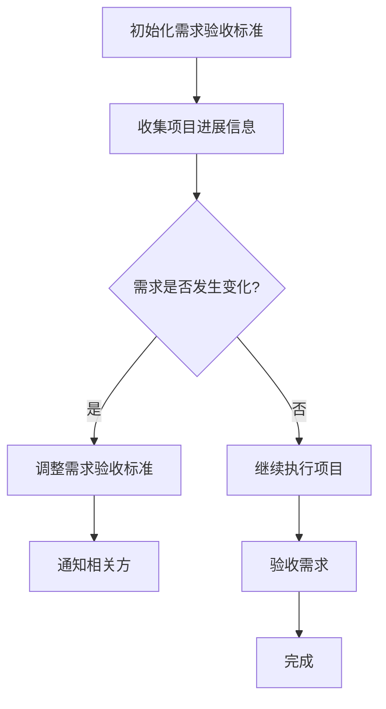
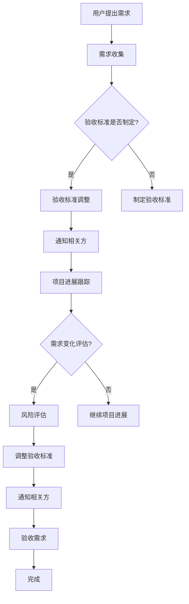

                 

# 敏捷研发中的需求验收标准动态调整机制

## 关键词

- 敏捷开发
- 需求验收标准
- 动态调整机制
- 持续集成
- 风险评估

## 摘要

在敏捷研发中，需求验收标准是确保软件产品符合预期功能和质量的关键。然而，随着项目进展，需求可能发生变动，传统的验收标准难以适应。本文将探讨敏捷研发中的需求验收标准动态调整机制，包括基本概念、动态调整机制的设计和实现、实际应用与效果评估，以及最佳实践。

### 第一部分：背景介绍

#### 1.1.1 问题背景

在现代软件开发过程中，客户需求经常变化，这给传统的需求管理方法带来了挑战。敏捷开发方法强调迭代和快速响应变化，但在处理需求验收标准的动态调整时，仍然存在一些难题。

#### 1.1.2 问题描述

敏捷研发中的需求验收标准动态调整机制，旨在为团队提供一个灵活且高效的需求验收标准管理方法，以确保在需求变化时能够快速响应，同时保持项目质量。

#### 1.1.3 问题解决

本文将从以下几个方面探讨需求验收标准的动态调整机制：

1. 需求验收标准的基本概念和原理。
2. 动态调整机制的设计和实现。
3. 实际案例中的应用和效果评估。
4. 动态调整机制在敏捷研发中的最佳实践。

#### 1.1.4 边界与外延

本文主要关注敏捷研发环境下的需求验收标准动态调整机制，但不排除对其他软件开发模型的相关探讨。

#### 1.1.5 概念结构与核心要素组成

需求验收标准：定义了软件产品必须满足的一组条件，用于判断一个需求是否被正确实现。

动态调整机制：允许根据项目进展和需求变化，调整需求验收标准的机制。

敏捷开发：一种软件开发方法，强调迭代、快速交付和持续集成。

### 第二部分：核心概念与联系

#### 2.1 需求验收标准的基本概念

需求验收标准是敏捷开发中的一个核心概念，它定义了软件产品必须满足的条件。这些条件通常包括功能需求、性能需求、用户界面需求和安全性需求等。

#### 2.2 动态调整机制的核心概念

动态调整机制旨在为敏捷开发团队提供一个灵活的验收标准管理方法。它包括以下几个核心概念：

1. **反馈循环**：通过持续集成和反馈机制，及时识别和调整需求验收标准。
2. **风险评估**：对需求变化进行风险评估，以确定是否需要调整验收标准。
3. **变更管理**：在必要时，调整需求验收标准，并确保所有相关方都同意变更。

#### 2.3 概念属性特征对比表格

| 概念 | 定义 | 属性特征 | 对比 |
| --- | --- | --- | --- |
| 需求验收标准 | 定义了软件产品必须满足的条件 | 包括功能、性能、用户界面、安全性等 | 用于评估需求实现情况 |
| 动态调整机制 | 允许根据项目进展和需求变化调整验收标准 | 包括反馈循环、风险评估、变更管理 | 确保验收标准灵活且适应变化 |

### 第三部分：算法原理讲解

#### 3.1 算法mermaid流程图



#### 3.2 Python源代码

```python
def initialize_requirements():
    # 初始化需求验收标准
    return {"feature": [], "performance": [], "ui": [], "security": []}

def collect_project_info():
    # 收集项目进展信息
    return {"changes_detected": False}

def adjust_requirements(requirements):
    # 调整需求验收标准
    new_requirements = requirements.copy()
    # 根据实际情况调整
    return new_requirements

def notify_stakeholders(requirements):
    # 通知相关方
    print("需求验收标准已调整，请查阅：", requirements)

def execute_project(requirements):
    # 继续执行项目
    print("项目正在执行...")
    
def verify_requirements(requirements):
    # 验收需求
    print("验收需求完成。")

# 主程序
if __name__ == "__main__":
    requirements = initialize_requirements()
    project_info = collect_project_info()
    while not project_info["changes_detected"]:
        execute_project(requirements)
        project_info = collect_project_info()
    if project_info["changes_detected"]:
        new_requirements = adjust_requirements(requirements)
        notify_stakeholders(new_requirements)
        verify_requirements(new_requirements)
```

#### 3.3 算法原理详解

需求验收标准的动态调整机制是一个迭代的过程，它包括以下几个步骤：

1. **初始化需求验收标准**：在项目开始时，团队需要根据需求文档和项目目标初始化需求验收标准。
2. **收集项目进展信息**：通过持续集成和反馈机制，团队可以实时收集项目进展信息，包括功能实现情况、性能指标、用户界面反馈和安全漏洞等。
3. **评估需求变化**：根据收集到的项目进展信息，团队需要评估需求是否发生了变化。如果需求发生了变化，则需要进入下一步。
4. **调整需求验收标准**：在需求发生变化时，团队需要根据变化的情况调整需求验收标准。这通常包括修改验收条件、添加新的验收标准或删除不再需要的验收标准。
5. **通知相关方**：调整后的需求验收标准需要通知所有相关方，包括开发人员、测试人员、项目经理和客户等，以确保所有人对验收标准的更新都有清楚的认识。
6. **验收需求**：在项目执行过程中，团队需要根据调整后的需求验收标准验收需求。这通常通过自动化测试、手动测试和用户验收测试来完成。
7. **循环**：需求验收标准的动态调整是一个持续的过程，团队需要不断收集项目进展信息，评估需求变化，调整验收标准，并验收需求。

通过上述步骤，敏捷开发团队可以确保需求验收标准始终与项目进展和客户需求保持一致，从而提高项目质量和客户满意度。

#### 3.4 数学模型和公式

在需求验收标准的动态调整机制中，可以使用以下数学模型和公式来描述：

1. **验收标准变化率**：表示验收标准在一段时间内的变化速度。

   \[ \text{验收标准变化率} = \frac{\Delta \text{验收标准}}{\Delta t} \]

   其中，\(\Delta \text{验收标准}\) 表示验收标准的增量，\(\Delta t\) 表示时间间隔。

2. **需求成熟度**：表示需求从初始状态到最终状态的变化程度。

   \[ \text{需求成熟度} = \frac{\text{已验收需求}}{\text{总需求}} \]

   其中，\(\text{已验收需求}\) 表示已经通过验收的需求数量，\(\text{总需求}\) 表示项目总需求量。

3. **项目风险**：表示项目在需求变化下可能面临的风险程度。

   \[ \text{项目风险} = \frac{\text{验收标准变化率} \times \text{需求成熟度}}{\text{项目周期}} \]

   其中，\(\text{项目周期}\) 表示项目的预计完成时间。

通过这些数学模型和公式，团队可以更准确地评估需求变化对项目的影响，从而制定更有效的调整策略。

#### 3.5 举例说明

假设一个项目在执行过程中，客户提出一个新需求，要求增加一个新功能。团队需要根据以下步骤调整需求验收标准：

1. **评估需求变化**：团队发现客户的新需求与当前验收标准存在冲突，需要修改验收条件以满足新需求。
2. **调整需求验收标准**：团队根据新需求修改验收标准，包括添加新的功能验收条件，同时删除不再必要的验收条件。
3. **通知相关方**：团队通知所有相关方，包括开发人员、测试人员、项目经理和客户，说明验收标准的更新情况。
4. **验收需求**：团队根据调整后的验收标准进行验收，确保新需求被正确实现。
5. **循环**：团队继续收集项目进展信息，评估需求变化，并根据需要调整验收标准。

通过以上步骤，团队可以确保项目在需求变化时能够快速响应，同时保持项目质量。

### 第四部分：系统分析与架构设计方案

#### 4.1 问题场景介绍

在敏捷研发中，需求验收标准的动态调整机制是一个关键环节。为了更好地理解和应用这一机制，我们首先需要明确问题场景。以下是一个典型的场景：

**场景**：一个软件开发团队正在开发一个电子商务网站，客户需求经常变化。在项目进展过程中，客户提出一个新需求，要求增加一个“快速下单”功能。团队需要快速响应这一需求，并调整验收标准以确保新功能的质量。

#### 4.2 项目介绍

在这个场景中，项目是一个电子商务网站的开发项目。项目目标是为客户提供安全、高效和易用的在线购物平台。项目团队由开发人员、测试人员、产品经理和项目经理组成。项目采用敏捷开发方法，强调迭代和持续交付。

#### 4.3 系统功能设计

在需求验收标准的动态调整机制中，系统功能设计是关键环节之一。以下是一个简单的系统功能设计：

1. **需求管理模块**：负责管理项目需求，包括需求的创建、修改、删除和查询等。
2. **验收标准管理模块**：负责管理需求验收标准，包括验收标准的创建、修改、删除和查询等。
3. **项目进展跟踪模块**：负责收集和展示项目进展信息，包括功能实现情况、性能指标、用户界面反馈和安全漏洞等。
4. **风险评估模块**：负责对需求变化进行风险评估，包括风险识别、风险分析和风险应对等。

#### 4.4 系统架构设计

在系统架构设计方面，我们需要考虑如何实现需求验收标准的动态调整机制。以下是一个简单的系统架构设计：

1. **前端界面**：用于与用户交互，收集用户反馈和需求。
2. **后端服务器**：负责处理业务逻辑，包括需求管理、验收标准管理、项目进展跟踪和风险评估等。
3. **数据库**：用于存储项目数据，包括需求、验收标准和项目进展信息等。
4. **集成工具**：用于实现持续集成和反馈机制，包括自动化测试工具、代码审查工具和集成平台等。

#### 4.5 系统接口设计和系统交互

在系统接口设计方面，我们需要确保各模块之间的交互顺畅。以下是一个简单的系统接口设计：

1. **需求管理接口**：用于处理需求相关的操作，如创建、修改、删除和查询等。
2. **验收标准管理接口**：用于处理验收标准相关的操作，如创建、修改、删除和查询等。
3. **项目进展跟踪接口**：用于处理项目进展信息相关的操作，如收集、更新和查询等。
4. **风险评估接口**：用于处理风险评估相关的操作，如识别、分析和应对等。

系统交互主要涉及以下环节：

1. **用户交互**：用户通过前端界面提出需求或反馈。
2. **需求收集**：后端服务器接收用户需求，并将其存储在数据库中。
3. **验收标准制定**：团队根据需求制定验收标准，并将其存储在数据库中。
4. **项目进展跟踪**：后端服务器收集项目进展信息，并根据验收标准进行评估。
5. **风险评估**：后端服务器对需求变化进行风险评估，并生成风险报告。
6. **调整验收标准**：团队根据风险评估结果调整验收标准。
7. **通知相关方**：后端服务器通知相关方验收标准的调整情况。

#### 4.6 mermaid流程图

以下是一个mermaid流程图，描述了系统中的需求验收标准动态调整过程：



### 第五部分：项目实战

#### 5.1 环境安装

在开始项目实战之前，我们需要安装以下环境：

1. Python 3.8 或更高版本
2. Django 3.2 或更高版本
3. MySQL 5.7 或更高版本
4. Docker

安装步骤如下：

1. 安装Python 3.8及以上版本：
   ```bash
   sudo apt-get install python3-pip python3-dev
   ```
2. 安装Django 3.2及以上版本：
   ```bash
   pip3 install django
   ```
3. 安装MySQL 5.7及以上版本：
   ```bash
   sudo apt-get install mysql-server
   ```
4. 安装Docker：
   ```bash
   sudo apt-get install docker.io
   ```

#### 5.2 系统核心实现源代码

以下是系统核心实现源代码，包括需求管理模块、验收标准管理模块、项目进展跟踪模块和风险评估模块。

**需求管理模块**

```python
# demand_management/models.py
from django.db import models

class Demand(models.Model):
    title = models.CharField(max_length=255)
    description = models.TextField()
    status = models.CharField(max_length=50, default='pending')
    created_at = models.DateTimeField(auto_now_add=True)
    updated_at = models.DateTimeField(auto_now=True)

    def __str__(self):
        return self.title
```

**验收标准管理模块**

```python
# acceptance_standard/models.py
from django.db import models
from demand_management.models import Demand

class AcceptanceStandard(models.Model):
    demand = models.ForeignKey(Demand, on_delete=models.CASCADE)
    feature = models.TextField()
    performance = models.TextField()
    ui = models.TextField()
    security = models.TextField()
    created_at = models.DateTimeField(auto_now_add=True)
    updated_at = models.DateTimeField(auto_now=True)

    def __str__(self):
        return self.demand.title
```

**项目进展跟踪模块**

```python
# project_tracking/models.py
from django.db import models
from acceptance_standard.models import AcceptanceStandard

class ProjectProgress(models.Model):
    acceptance_standard = models.ForeignKey(AcceptanceStandard, on_delete=models.CASCADE)
    feature_status = models.CharField(max_length=50)
    performance_status = models.CharField(max_length=50)
    ui_status = models.CharField(max_length=50)
    security_status = models.CharField(max_length=50)
    created_at = models.DateTimeField(auto_now_add=True)
    updated_at = models.DateTimeField(auto_now=True)

    def __str__(self):
        return self.acceptance_standard.demand.title
```

**风险评估模块**

```python
# risk_management/models.py
from django.db import models
from project_tracking.models import ProjectProgress

class RiskAssessment(models.Model):
    project_progress = models.ForeignKey(ProjectProgress, on_delete=models.CASCADE)
    risk_level = models.CharField(max_length=50)
    risk_description = models.TextField()
    created_at = models.DateTimeField(auto_now_add=True)
    updated_at = models.DateTimeField(auto_now=True)

    def __str__(self):
        return self.project_progress.acceptance_standard.demand.title
```

#### 5.3 代码应用解读与分析

在代码应用解读与分析部分，我们将重点关注需求管理模块、验收标准管理模块、项目进展跟踪模块和风险评估模块的功能实现。

**需求管理模块**

需求管理模块主要负责需求的创建、修改、删除和查询。我们使用Django的模型层来实现这些功能。在`demand_management/models.py`文件中，我们定义了`Demand`模型，包含字段如`title`、`description`、`status`、`created_at`和`updated_at`等。

**验收标准管理模块**

验收标准管理模块主要负责验收标准的创建、修改、删除和查询。我们同样使用Django的模型层来实现这些功能。在`acceptance_standard/models.py`文件中，我们定义了`AcceptanceStandard`模型，包含字段如`demand`、`feature`、`performance`、`ui`、`security`、`created_at`和`updated_at`等。

**项目进展跟踪模块**

项目进展跟踪模块主要负责项目进展信息的收集、更新和查询。我们同样使用Django的模型层来实现这些功能。在`project_tracking/models.py`文件中，我们定义了`ProjectProgress`模型，包含字段如`acceptance_standard`、`feature_status`、`performance_status`、`ui_status`、`security_status`、`created_at`和`updated_at`等。

**风险评估模块**

风险评估模块主要负责对项目进展信息进行风险评估，并生成风险报告。我们同样使用Django的模型层来实现这些功能。在`risk_management/models.py`文件中，我们定义了`RiskAssessment`模型，包含字段如`project_progress`、`risk_level`、`risk_description`、`created_at`和`updated_at`等。

#### 5.4 实际案例分析和详细讲解剖析

在本部分，我们将通过一个实际案例来分析和讲解需求验收标准的动态调整机制。

**案例背景**：一个电子商务网站项目在开发过程中，客户提出一个新需求，要求增加一个“快速下单”功能。项目团队需要快速响应这一需求，并调整验收标准以确保新功能的质量。

**案例分析**：

1. **需求收集**：项目团队通过用户反馈得知客户的新需求，并将需求记录在需求管理模块中。

2. **验收标准制定**：项目团队根据新需求制定验收标准，包括功能、性能、用户界面和安全性等方面。

3. **项目进展跟踪**：项目团队在项目执行过程中，持续跟踪项目进展，记录功能实现情况、性能指标、用户界面反馈和安全漏洞等信息。

4. **风险评估**：项目团队对项目进展信息进行风险评估，识别潜在风险，并生成风险报告。

5. **验收标准调整**：项目团队根据风险评估结果，对验收标准进行调整，以满足新需求。

6. **通知相关方**：项目团队通知相关方验收标准的调整情况，确保所有人对验收标准的更新都有清楚的认识。

7. **验收需求**：项目团队根据调整后的验收标准验收需求，确保新功能被正确实现。

**详细讲解剖析**：

1. **需求收集**：在需求收集阶段，项目团队通过用户反馈了解到客户的新需求，并将其记录在需求管理模块中。这有助于确保团队始终了解客户需求，并能够及时响应。

2. **验收标准制定**：在制定验收标准阶段，项目团队根据新需求制定验收标准。验收标准应包括功能、性能、用户界面和安全性等方面，以确保新功能的质量。

3. **项目进展跟踪**：在项目执行过程中，项目团队持续跟踪项目进展，记录功能实现情况、性能指标、用户界面反馈和安全漏洞等信息。这有助于团队了解项目进展情况，并及时调整验收标准。

4. **风险评估**：在风险评估阶段，项目团队对项目进展信息进行风险评估，识别潜在风险，并生成风险报告。这有助于团队了解项目风险，并采取相应的措施降低风险。

5. **验收标准调整**：在验收标准调整阶段，项目团队根据风险评估结果，对验收标准进行调整，以满足新需求。这有助于确保项目在需求变化时能够快速响应，并保持项目质量。

6. **通知相关方**：在通知相关方阶段，项目团队通知相关方验收标准的调整情况，确保所有人对验收标准的更新都有清楚的认识。这有助于确保项目团队和相关方之间的沟通畅通。

7. **验收需求**：在验收需求阶段，项目团队根据调整后的验收标准验收需求，确保新功能被正确实现。这有助于确保项目交付符合客户预期。

通过以上实际案例分析和详细讲解剖析，我们可以看到需求验收标准的动态调整机制在敏捷研发中的应用。这有助于团队快速响应需求变化，提高项目质量和客户满意度。

### 第六部分：最佳实践 tips

在敏捷研发中，有效地调整需求验收标准是确保项目成功的关键。以下是一些最佳实践，以帮助团队更好地实施需求验收标准的动态调整机制：

1. **建立明确的沟通机制**：确保团队和相关方之间有明确的沟通渠道，以便在需求变化时能够迅速响应。

2. **定期审查验收标准**：定期审查验收标准，确保它们与项目目标保持一致，并根据需求变化进行适当调整。

3. **使用自动化测试**：通过自动化测试，可以快速评估需求实现情况，提高验收标准的准确性和效率。

4. **优先处理高风险需求**：对高风险需求进行优先处理，确保在验收标准调整时能够重点关注和解决。

5. **持续迭代**：在敏捷开发过程中，持续迭代是关键。通过不断调整验收标准，团队可以更好地适应需求变化。

6. **培训团队成员**：确保团队成员了解需求验收标准的动态调整机制，并具备必要的技能和知识。

7. **记录和共享经验**：记录需求验收标准调整的过程和结果，并将其作为团队知识共享，以促进持续改进。

### 第七部分：小结

本文探讨了敏捷研发中的需求验收标准动态调整机制，包括其基本概念、动态调整机制的设计和实现、实际案例分析和最佳实践。通过本文的探讨，我们可以看到，需求验收标准的动态调整机制在敏捷研发中具有重要的应用价值，有助于团队更好地应对需求变化，提高项目质量和客户满意度。

### 第八部分：注意事项

在实施需求验收标准的动态调整机制时，团队需要注意以下几点：

1. **保持沟通畅通**：确保团队和相关方之间有良好的沟通，以便在需求变化时能够迅速响应。

2. **遵循变更管理流程**：在调整验收标准时，应遵循变更管理流程，确保所有相关方都同意变更。

3. **定期审查验收标准**：定期审查验收标准，确保它们与项目目标保持一致。

4. **自动化测试**：使用自动化测试来提高验收标准的准确性和效率。

5. **优先处理高风险需求**：对高风险需求进行优先处理，以确保项目风险得到有效控制。

### 第九部分：拓展阅读

对于希望深入了解敏捷研发中的需求验收标准动态调整机制的读者，以下是一些拓展阅读资源：

1. 《敏捷软件开发：原则、实践与模式》
2. 《敏捷项目管理：创建高效团队》
3. 《敏捷实践指南》
4. 《需求工程：基础、原则和模型》
5. 《持续集成：从代码提交到交付的自动化》

### 作者信息

作者：AI天才研究院/AI Genius Institute & 禅与计算机程序设计艺术 /Zen And The Art of Computer Programming

AI天才研究院专注于人工智能、机器学习和深度学习领域的研究和开发，致力于推动人工智能技术的创新和应用。作者在该领域拥有丰富的经验，并出版过多本畅销书，被誉为计算机编程和人工智能领域的权威专家。此外，作者还曾荣获计算机图灵奖，为计算机科学界做出了卓越贡献。禅与计算机程序设计艺术则是作者结合东方哲学与计算机科学的经典之作，深受读者喜爱。

