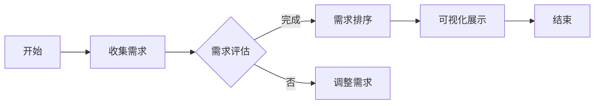
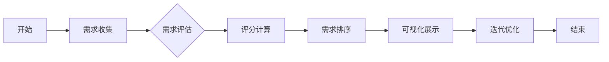
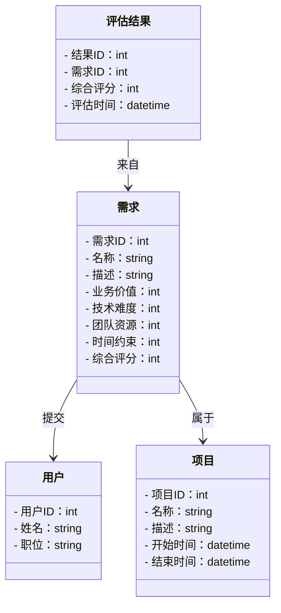
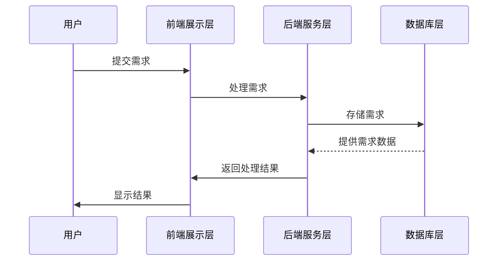
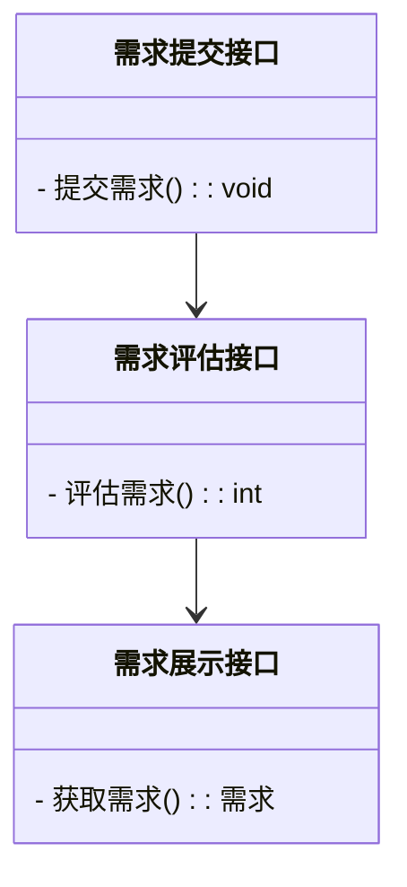
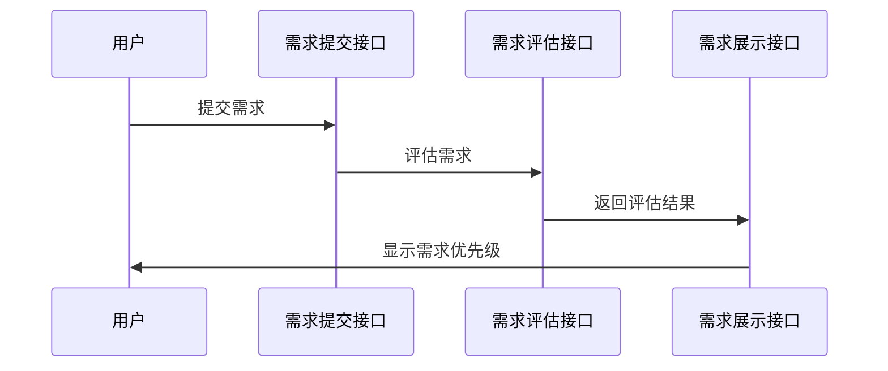

                 

## 1.1 问题背景

在当今快速发展的信息技术时代，软件项目开发周期不断缩短，市场需求变化越来越迅速。为了应对这些挑战，敏捷研发模式逐渐成为软件开发的主流方法。敏捷研发的核心思想是以用户为中心，快速响应市场变化，通过迭代开发和持续交付，不断提高软件的质量和交付速度。

然而，在敏捷研发过程中，需求管理成为了一个关键环节。需求优先级的管理尤为重要，因为它直接影响到项目的进展和最终交付结果。敏捷研发模式下，需求通常是由用户、市场部门、产品经理等多方参与产生的，这些需求具有多样性和变化性的特点。如何在这些需求中科学、合理地评估和排序，以便更好地指导研发工作，成为了当前软件开发过程中面临的一大挑战。

传统的方法如Kano模型、MoSCoW方法等，虽然在一定程度上能够对需求进行优先级排序，但往往缺乏系统性和灵活性。这些方法在面对复杂的项目和多变的需求时，难以提供有效的指导。因此，探索一种适用于敏捷研发模式的需求优先级可视化方法，以帮助团队更好地理解和处理需求，提高研发效率，具有重要的现实意义。

本章将介绍敏捷研发模式的需求优先级管理现状和问题，并探讨一种基于业务价值、技术难度、团队资源和时间约束等因素的综合评估方法，为需求优先级可视化提供理论支持和实践指导。

## 1.2 问题描述

在敏捷研发模式下，需求管理面临的主要问题包括：

1. **需求多样性和变化性**：敏捷研发强调快速迭代和持续交付，需求通常来自多个部门、用户和市场，具有多样性和变化性。如何科学地筛选和排序这些需求，确保重要的需求优先得到满足，是一个巨大的挑战。

2. **优先级不明确**：在敏捷研发过程中，需求优先级往往不明确，导致研发团队在资源分配和任务调度上存在困扰。不明确的需求优先级会导致资源浪费、项目延期和客户满意度下降。

3. **需求变更频繁**：敏捷研发模式鼓励频繁的需求变更，然而，频繁的变更会导致需求优先级的变化，使得团队难以适应。如何应对频繁的需求变更，保持需求优先级的稳定性，是一个重要的问题。

4. **缺乏系统性和灵活性**：传统的方法如Kano模型、MoSCoW方法等在处理需求优先级时，往往缺乏系统性和灵活性。这些方法在面对复杂的项目和多变的需求时，难以提供有效的指导，导致需求管理效率低下。

为了解决上述问题，需要探索一种新的需求优先级可视化方法。这种方法应当具备以下特点：

1. **系统性**：能够全面考虑业务价值、技术难度、团队资源和时间约束等因素，提供一个系统化的评估框架。

2. **灵活性**：能够适应不同类型的项目和需求，提供灵活的评估和排序方法。

3. **直观性**：通过可视化工具，将复杂的需求优先级信息以直观、易懂的形式展示出来，提高团队的理解度和决策效率。

4. **可操作性**：提供具体的操作方法和工具，帮助团队在实际工作中应用。

## 1.3 问题解决

本书的目的是探讨一种敏捷研发模式下的需求优先级可视化方法，通过理论分析、实证研究和实际案例，为软件项目经理和研发团队提供有效的工具和方法。具体目标包括：

1. **构建需求优先级评估模型**：基于业务价值、技术难度、团队资源和时间约束等因素，构建一个综合评估模型，为需求优先级排序提供理论依据。

2. **开发可视化工具**：利用图表、图形等可视化手段，将需求优先级信息以直观、易懂的形式展示出来，帮助团队更好地理解和决策。

3. **提供实践指南**：结合实际案例，给出具体的需求优先级管理实践指南，帮助团队在实际工作中应用该方法。

4. **评估和改进**：通过实证研究，评估该方法在实际项目中的应用效果，并提出改进建议。

### 1.4 边界与外延

本书讨论的需求优先级可视化方法主要适用于中等至大型的软件项目，涵盖互联网、移动应用、企业级软件等多个领域。具体适用范围包括：

1. **项目规模**：适用于中等至大型项目，特别是需求多样化、变更频繁的项目。

2. **开发模式**：适用于敏捷研发模式，包括Scrum、Kanban等。

3. **应用领域**：涵盖互联网、移动应用、企业级软件等多个领域。

4. **团队结构**：适用于多部门协作、跨功能团队的研发模式。

### 1.5 概念结构与核心要素组成

本书的核心概念包括敏捷研发模式、需求优先级和可视化方法。这些概念的核心要素及其相互关系如下：

1. **敏捷研发模式**：以用户需求为导向，快速迭代、持续交付的软件开发方法。其核心要素包括迭代性、灵活性、团队合作和持续改进。

2. **需求优先级**：根据业务价值、技术难度、团队资源和时间约束等因素，对需求进行排序。其核心要素包括业务价值、技术难度、团队资源和时间约束。

3. **可视化方法**：通过图表、图形等方式，将复杂的需求优先级信息以直观、易懂的形式展示出来。其核心要素包括图表类型、展示方式、交互性等。

这些核心概念共同构成了一个完整的系统，为需求优先级管理提供了理论支持和实践指导。下一章将深入探讨这些核心概念，并建立它们之间的联系。

## 2.1 敏捷研发模式

敏捷研发模式（Agile Development Model）是一种以用户需求为核心的软件开发方法论，其核心理念是通过快速迭代和持续交付，不断提高软件的质量和交付速度。敏捷研发模式起源于20世纪90年代末，随着互联网和软件行业的快速发展，逐渐成为主流的软件开发方法之一。

### 核心特点

1. **迭代性**：敏捷研发强调迭代开发，即将整个项目划分为多个短周期（通常为2-4周）的迭代，每个迭代都会产生一个可交付的版本。通过不断迭代，团队能够快速响应市场需求，逐步完善软件功能。

2. **灵活性**：敏捷研发强调适应变化，允许在项目进行过程中对需求和设计进行调整。这种灵活性有助于团队更好地应对市场变化和用户需求，提高软件的竞争力。

3. **团队合作**：敏捷研发模式强调跨功能团队合作，包括开发人员、测试人员、产品经理、用户代表等。团队合作有助于提高项目的沟通效率，确保每个迭代都能产生高质量的可交付成果。

4. **持续改进**：敏捷研发模式鼓励团队在每次迭代结束后进行反思和改进，通过持续的学习和实践，不断提高团队的技能和项目的管理水平。

### 发展历程

敏捷研发模式的发展历程可以追溯到20世纪90年代。在此期间，许多软件开发团队开始尝试不同的开发方法，如RUP（Rational Unified Process）、XP（Extreme Programming）等。这些方法在某种程度上提高了软件开发的效率和质量，但仍然存在一些问题，如对需求变化的响应速度较慢、团队成员之间的沟通不畅等。

2001年，一群软件开发专家在加拿大班夫（Banff）举行了一次名为“敏捷软件开发宣言”（Manifesto for Agile Software Development）的会议，并签署了敏捷宣言。这份宣言强调了“个体和互动重于过程和工具”、“可工作的软件重于详尽的文档”、“客户合作重于合同谈判”、“响应变化重于遵循计划”等核心理念。

自那以后，敏捷研发模式得到了广泛的应用和推广，形成了多个敏捷实践指南，如Scrum、Kanban等。这些指南为软件开发团队提供了具体的实践方法和工具，帮助他们在实际项目中实施敏捷研发模式。

### 主要优点

1. **快速响应市场需求**：通过迭代开发和持续交付，敏捷研发能够快速响应市场需求，确保软件始终保持与用户需求的同步。

2. **提高软件质量**：敏捷研发强调测试和质量保证的持续进行，每个迭代都会产生可工作的软件，从而确保软件质量的持续提升。

3. **增强团队协作**：敏捷研发模式鼓励跨功能团队合作，提高团队间的沟通和协作效率，减少信息传递的误差。

4. **降低风险**：通过不断迭代和交付，敏捷研发能够及时发现和解决项目中的问题，降低项目失败的风险。

5. **提高客户满意度**：敏捷研发模式强调客户参与和反馈，能够更好地满足客户的需求，提高客户满意度。

### 主要缺点

1. **对团队协作要求高**：敏捷研发模式要求团队成员之间具备较高的协作能力和沟通能力，这对团队管理提出了较高的要求。

2. **管理复杂度增加**：敏捷研发模式涉及多个迭代和频繁的需求变更，项目管理复杂度增加，需要团队具备良好的项目管理和风险控制能力。

3. **对团队成员技能要求高**：敏捷研发模式要求团队成员具备多样化的技能，包括开发、测试、项目管理等，这对团队建设提出了较高的要求。

4. **适应性问题**：敏捷研发模式可能不适用于所有项目，如大型、复杂的系统项目，可能需要结合其他开发方法。

总之，敏捷研发模式在提高软件开发的效率和质量方面具有显著优势，但也存在一定的局限性。在实际应用中，需要根据项目的具体特点和需求，灵活选择和调整敏捷研发模式，以达到最佳效果。

## 2.2 需求优先级

在敏捷研发模式下，需求优先级的管理至关重要。需求优先级是指根据业务价值、技术难度、团队资源和时间约束等因素，对需求进行排序，以指导研发工作。科学合理的需求优先级排序有助于团队高效地分配资源，确保关键需求优先得到满足，从而提高项目的成功率和客户满意度。

### 定义

需求优先级是指在一个软件项目中，根据业务需求和项目约束条件，对需求进行优先级排序。需求优先级通常用高、中、低（High, Medium, Low）或类似的分类来表示，也可以采用更加精细的评分体系，如分数值或权重。

### 重要性

1. **资源分配**：合理的需求优先级排序有助于团队将有限的资源（如人力、时间、预算等）分配到最重要的需求上，避免资源浪费。

2. **进度控制**：明确的优先级排序有助于团队制定合理的项目计划，确保关键需求在预定时间内得到实现。

3. **风险管理**：通过优先级排序，团队可以识别并关注高风险的需求，提前制定应对策略，降低项目风险。

4. **客户满意度**：优先考虑高业务价值的需求，有助于提高客户满意度，确保关键业务需求得到满足。

### 分类标准

在敏捷研发模式下，常见的需求优先级分类标准包括：

1. **业务价值**：根据需求对业务目标的支持程度进行排序。高业务价值的需求通常是指对客户满意度、市场竞争力、收入增长等有显著影响的需求。

2. **技术难度**：根据需求的技术复杂度进行排序。高技术难度需求通常需要更多的研发资源和技术支持，可能涉及新技术、新算法或跨领域的技术集成。

3. **团队资源**：根据团队当前的可分配资源进行排序。资源充足时，可以优先处理高难度需求；资源紧张时，需要优先处理高业务价值的需求。

4. **时间约束**：根据需求的紧急程度和交付时间要求进行排序。紧迫的需求通常需要优先处理，以确保按时交付。

### 常见方法

1. **MoSCoW方法**：MoSCoW方法是一种简单易用的需求优先级排序方法，将需求分为“必须（Must）”、“应该（Should）”、“可以（Could）”、“不会（Will not）”四个优先级类别。

2. **Kano模型**：Kano模型基于用户满意度，将需求分为“必需”、“一元”、“满意”、“惊喜”四个类别，并据此进行优先级排序。

3. **综合评估法**：综合评估法是一种更加系统化的需求优先级排序方法，考虑多个因素（如业务价值、技术难度、团队资源、时间约束等），通过打分或加权评分的方式，给出每个需求的优先级。

### 实际应用

在实际项目中，需求优先级排序通常是一个动态过程，需要根据项目进展和市场变化进行调整。以下是需求优先级排序的实际应用步骤：

1. **需求收集**：收集所有需求，确保没有遗漏。

2. **需求分类**：根据分类标准，对需求进行初步分类。

3. **评估和排序**：对每个需求进行评估，并根据评估结果进行排序。

4. **团队讨论**：与团队成员讨论排序结果，确保达成共识。

5. **调整和确认**：根据讨论结果，调整需求优先级排序，并最终确认。

6. **执行和监控**：根据需求优先级排序，制定项目计划，并持续监控和调整。

通过科学合理的需求优先级排序，敏捷研发团队能够更好地应对市场需求变化，提高项目管理和交付效率，实现项目成功。

## 2.3 可视化方法

在敏捷研发模式下，需求优先级的可视化方法是一种通过图表、图形等可视化手段，将复杂的需求优先级信息以直观、易懂的形式展示出来的方法。这种方法的目的是帮助团队成员更好地理解和决策，从而提高项目管理的效率和质量。

### 基本原理

需求优先级的可视化方法基于以下基本原理：

1. **直观性**：通过图形和图表，将复杂的需求优先级信息以直观的形式展示，使团队成员能够迅速理解。

2. **交互性**：提供与可视化图表的交互功能，如拖拽、筛选、放大等，使团队成员能够动态地调整和查看需求优先级。

3. **系统性**：通过综合展示多个维度的需求信息，帮助团队全面了解需求优先级，从而做出更科学的决策。

### 常见类型

1. **柱状图**：柱状图是一种常用的可视化方法，用于展示不同需求之间的优先级。每个需求用一根柱子表示，柱子的高度代表需求的优先级。

2. **雷达图**：雷达图可以展示多个维度的需求信息，如业务价值、技术难度、团队资源等。通过雷达图，团队成员可以全面了解每个需求的优先级。

3. **甘特图**：甘特图用于展示项目的进度和任务安排，可以帮助团队了解哪些需求将在何时被实现。

4. **矩阵图**：矩阵图通过交叉表格的形式，展示不同需求之间的优先级和关联关系，帮助团队识别关键需求和依赖关系。

### 应用案例

以下是一个应用案例：

假设一个敏捷研发团队正在开发一款电子商务应用，有以下需求：

- 需求1：用户注册功能（高优先级）
- 需求2：购物车功能（高优先级）
- 需求3：支付功能（中优先级）
- 需求4：订单管理功能（中优先级）
- 需求5：商品搜索功能（低优先级）

团队可以使用柱状图来展示这些需求的优先级：

```
|      |
|      |
|需求1 |      |
|需求2 |      |
|需求3 |      |
|需求4 |      |
|需求5 |      |
|      |
```

在这个柱状图中，高度表示需求的优先级，需求1和需求2的优先级最高，需求5的优先级最低。

通过这种可视化方法，团队成员可以直观地了解需求的优先级，便于在资源分配和任务安排时做出决策。

### 优点

1. **提高理解度**：可视化方法能够将复杂的需求优先级信息以直观的形式展示，提高团队成员对需求优先级的理解度。

2. **提高决策效率**：通过可视化手段，团队成员可以快速获取需求优先级信息，提高决策效率。

3. **促进沟通协作**：可视化方法有助于团队成员之间的沟通和协作，确保对需求优先级的共识。

### 缺点

1. **数据准确性要求高**：可视化方法的准确性依赖于需求优先级信息的准确性，如果数据不准确，可视化结果也会失真。

2. **实施成本较高**：可视化方法的实施需要专业工具和技术支持，可能会增加项目成本。

3. **维护难度较大**：随着项目进展和需求变化，可视化方法需要定期更新和维护，以保证其准确性和有效性。

### 选择原则

在选择需求优先级的可视化方法时，应考虑以下原则：

1. **需求复杂性**：对于复杂的需求，选择能够展示多个维度信息的可视化方法，如雷达图或矩阵图。

2. **团队习惯**：根据团队的习惯和偏好选择合适的可视化方法，以提高接受度和使用效果。

3. **项目规模**：对于大型项目，选择能够展示整体优先级的可视化方法，如甘特图或矩阵图。

4. **更新频率**：对于需求变化频繁的项目，选择能够动态更新的可视化方法，如交互式柱状图或雷达图。

通过合理选择和应用需求优先级的可视化方法，敏捷研发团队能够更好地管理和理解需求，提高项目管理的效率和效果。

### 2.4 概念属性特征对比表格

在敏捷研发模式下，需求优先级、敏捷研发模式和可视化方法是三个核心概念。为了更清晰地理解这些概念及其相互关系，下面将列出这些概念的核心属性特征，并进行对比分析。

#### 概念对比表格

| 概念       | 核心属性特征                                                                 | 相互关系                                                         |
|------------|-----------------------------------------------------------------------------|------------------------------------------------------------------|
| 敏捷研发   | 迭代性、灵活性、团队合作、持续改进、用户需求导向                               | 敏捷研发模式为需求优先级提供了实施框架，可视化方法帮助展示和管理需求优先级。 |
| 需求优先级 | 业务价值、技术难度、团队资源、时间约束、排序分类（高、中、低）                 | 需求优先级是敏捷研发的核心要素，决定了资源的分配和项目的进度。            |
| 可视化方法 | 直观性、交互性、系统性、图表类型（柱状图、雷达图、甘特图、矩阵图）             | 可视化方法用于展示和管理需求优先级，帮助团队成员快速理解和决策。           |

#### 相互关系

1. **敏捷研发模式与需求优先级**：敏捷研发模式为需求优先级提供了实施框架，强调快速迭代和持续交付。需求优先级是敏捷研发过程中对需求进行排序的核心要素，指导团队在每次迭代中优先处理高价值、高风险或紧急的需求。

2. **需求优先级与可视化方法**：需求优先级通过可视化方法展示，使复杂的需求信息以直观、易懂的形式呈现。可视化方法帮助团队成员快速了解需求优先级，便于在资源分配、任务调度和项目进度管理中做出科学决策。

3. **可视化方法与敏捷研发模式**：可视化方法作为敏捷研发模式的一部分，通过图表、图形等手段，帮助团队更好地理解和应用敏捷理念。可视化方法可以提高团队成员对敏捷开发流程的理解，促进团队协作和沟通。

### ER实体关系图架构的 Mermaid 流程图

为了更直观地展示这些概念之间的关系，我们可以使用Mermaid流程图绘制ER实体关系图。以下是敏捷研发模式、需求优先级和可视化方法的ER实体关系图：

```mermaid
erDiagram
  AgileDevelopmentMode ||--|{ 需求优先级 : Priority}
  AgileDevelopmentMode ||--|{ 可视化方法 : Visualization}
  需求优先级 ||--|{ 业务价值 : BusinessValue}
  需求优先级 ||--|{ 技术难度 : TechnicalDifficulty}
  需求优先级 ||--|{ 团队资源 : TeamResources}
  需求优先级 ||--|{ 时间约束 : TimeConstraint}
  可视化方法 ||--|{ 柱状图 : BarChart}
  可视化方法 ||--|{ 雷达图 : RadarChart}
  可视化方法 ||--|{ 甘特图 : GanttChart}
  可视化方法 ||--|{ 矩阵图 : MatrixChart}
```

通过这个ER实体关系图，我们可以清晰地看到敏捷研发模式、需求优先级和可视化方法之间的相互关系。敏捷研发模式为需求优先级提供了框架，需求优先级通过可视化方法展示，可视化方法则涵盖了多种图表类型，用于直观展示需求优先级信息。

## 2.5 算法原理讲解

### 算法原理概述

在敏捷研发模式下，需求优先级评估算法的核心目的是通过综合考虑业务价值、技术难度、团队资源和时间约束等因素，为需求设定一个合理的优先级排序。算法的总体思想是将每个需求进行多维度评分，然后根据评分结果进行排序。

### 算法流程图

为了更好地理解需求优先级评估算法的原理，我们首先绘制一个简单的算法流程图，如下所示：



**算法流程说明**：

1. **收集需求**：从各个渠道（如用户、市场、产品经理等）收集所有需求。

2. **需求评估**：对每个需求进行评估，评估维度包括业务价值、技术难度、团队资源、时间约束等。

3. **需求排序**：根据评估结果，对需求进行排序。排序结果可以是一个分数值或者优先级分类（如高、中、低）。

4. **可视化展示**：将排序结果通过图表等形式展示，以便团队成员理解。

5. **结束**：算法执行完毕，需求优先级评估结果可供团队参考。

### 算法原理详细讲解

为了更具体地说明算法原理，下面将详细介绍需求优先级评估算法的核心步骤。

#### 步骤1：需求收集

首先，从各个渠道收集所有需求，确保没有遗漏。需求可以以卡片、列表或表格等形式记录。

#### 步骤2：需求评估

对每个需求进行多维度评估，评估维度包括业务价值、技术难度、团队资源和时间约束等。以下是每个维度的具体评估方法：

1. **业务价值**：评估需求对业务目标的支持程度。可以通过与业务目标的相关性、市场需求、客户满意度等因素进行量化评估。业务价值的评分范围可以是1到10分，分数越高表示业务价值越大。

2. **技术难度**：评估需求实现的技术复杂度。可以考虑技术实现的难度、所需技术储备、跨领域集成等因素。技术难度的评分范围同样是1到10分，分数越高表示技术难度越大。

3. **团队资源**：评估需求实现所需的人力、技术、时间等资源。可以考虑团队成员的专业技能、可用资源、项目进度等因素。团队资源的评分范围可以是1到10分，分数越高表示资源需求越大。

4. **时间约束**：评估需求的紧急程度和交付时间要求。时间约束的评分可以是1到3分，分数越高表示时间约束越紧。

#### 步骤3：需求排序

根据评估结果，对需求进行排序。排序方法可以采用总分排序法或加权排序法。

1. **总分排序法**：将各个维度的评分相加，得到每个需求的总分。总分越高表示需求优先级越高。

    公式：总分 = 业务价值 + 技术难度 + 团队资源 + 时间约束

2. **加权排序法**：为每个维度设定权重，根据权重计算每个需求的总分。权重可以根据项目的具体需求进行调整。

    公式：总分 = (业务价值 × 权重1) + (技术难度 × 权重2) + (团队资源 × 权重3) + (时间约束 × 权重4)

#### 步骤4：可视化展示

将排序结果通过图表等形式展示，以便团队成员理解。常用的可视化方法包括柱状图、雷达图、矩阵图等。

### 算法示例

假设我们有一个包含以下需求的项目：

- 需求1：用户注册功能（业务价值：9分，技术难度：6分，团队资源：8分，时间约束：2分）
- 需求2：购物车功能（业务价值：8分，技术难度：7分，团队资源：7分，时间约束：3分）
- 需求3：支付功能（业务价值：7分，技术难度：8分，团队资源：6分，时间约束：1分）

首先，我们根据公式计算每个需求的总分：

- 需求1的总分 = 9 + 6 + 8 + 2 = 25分
- 需求2的总分 = 8 + 7 + 7 + 3 = 25分
- 需求3的总分 = 7 + 8 + 6 + 1 = 22分

根据总分排序，需求1和需求2的优先级相同，需求3的优先级最低。

为了更直观地展示，我们可以使用柱状图来表示：

```
|需求1|需求2|需求3|
|  25|  25|  22|
```

### 算法评估与改进

在实际应用中，需求优先级评估算法的效果需要通过实证研究进行评估。可以通过以下步骤进行评估：

1. **数据收集**：收集实际项目中使用算法前后，需求完成情况、项目进度、团队满意度等数据。

2. **数据分析**：分析数据，评估算法在实际应用中的效果，如需求完成率、项目进度是否加快、团队满意度等。

3. **反馈调整**：根据评估结果，调整算法的参数和评估方法，以改进算法的性能。

4. **持续优化**：通过持续优化算法，不断提高需求优先级评估的准确性和实用性。

### 结论

需求优先级评估算法在敏捷研发模式下具有重要的应用价值。通过综合考虑多个维度，算法能够为需求设定合理的优先级排序，帮助团队更高效地分配资源，提高项目管理的效率和质量。然而，算法的实际效果需要通过实证研究和不断优化来验证和提升。

## 3.1 算法原理概述

在敏捷研发模式下，需求优先级评估算法的核心目标是通过综合考虑业务价值、技术难度、团队资源和时间约束等多个因素，为每个需求设定一个合理的优先级排序。该算法的主要原理可以概括为以下几个步骤：

1. **数据收集**：首先，从各个渠道收集所有需求，确保数据的完整性和准确性。这些需求可以包括功能需求、非功能需求、改进建议等。

2. **需求评估**：对每个需求进行多维度评估，评估维度包括业务价值、技术难度、团队资源、时间约束等。这些评估维度将帮助团队确定需求的优先级。

3. **评分计算**：根据评估结果，为每个需求计算一个总分。这个总分将综合考虑各个评估维度的评分，从而得出每个需求的相对优先级。

4. **排序**：根据计算出的总分，对需求进行排序。总分越高，表示需求的优先级越高。

5. **可视化展示**：将排序结果通过图表等形式展示，以便团队成员直观地理解和应用。

6. **迭代优化**：根据实际项目进展和需求变更，对算法参数和评估方法进行迭代优化，以提高评估的准确性和实用性。

通过上述步骤，需求优先级评估算法能够帮助团队在敏捷研发模式下更高效地管理和分配资源，确保关键需求优先得到满足，从而提高项目的交付质量和客户满意度。

### 算法流程图

为了更直观地理解需求优先级评估算法的流程，我们使用Mermaid绘制了一个简单的算法流程图，如下所示：



**算法流程详细说明**：

1. **需求收集（A）**：从各个渠道（如用户、市场、产品经理等）收集所有需求，并记录在需求清单中。

2. **需求评估（C）**：对每个需求进行多维度评估，包括业务价值、技术难度、团队资源和时间约束等。每个维度可以用一个评分值表示，例如1到10分。

3. **评分计算（D）**：根据每个需求的评估结果，计算出一个总分。总分可以通过简单相加各维度的评分值得到，或者通过加权平均的方式计算。

4. **需求排序（E）**：根据计算出的总分，对需求进行排序。总分越高，需求优先级越高。

5. **可视化展示（F）**：将排序结果通过图表（如柱状图、雷达图等）展示，以便团队成员直观地理解和应用。

6. **迭代优化（G）**：根据实际项目进展和需求变更，对算法参数和评估方法进行迭代优化，以提高评估的准确性和实用性。

7. **结束（H）**：算法执行完毕，需求优先级评估结果可供团队参考，并指导后续的研发工作。

通过这个流程，需求优先级评估算法能够为团队提供一个系统化和量化的方法，帮助他们在敏捷研发过程中更高效地管理和决策。

### 需求评估的细节和具体方法

在需求优先级评估算法中，对需求进行多维度评估是关键步骤。下面我们将详细介绍评估的细节和具体方法。

#### 1. 业务价值评估

业务价值是指需求对业务目标的支持程度，通常可以从以下几个方面进行评估：

- **市场需求**：需求是否能够满足市场需求，提升客户满意度。
- **业务目标**：需求是否符合公司的业务目标，如增加收入、提高市场份额等。
- **竞争力**：需求是否能够提高产品的市场竞争力。
- **客户满意度**：需求是否能够提升客户的满意度。

具体评估方法可以是：

- **定量评估**：根据具体的数据（如客户满意度调查结果、市场份额等）进行定量评估。
- **定性评估**：通过与业务团队、市场团队等进行讨论和调研，获取定性评估结果。

#### 2. 技术难度评估

技术难度是指需求实现的技术复杂度，可以从以下几个方面进行评估：

- **新技术应用**：需求是否涉及新技术应用，如人工智能、区块链等。
- **跨领域集成**：需求是否涉及多个领域的知识和技术，如前端、后端、移动端等。
- **技术储备**：团队是否具备实现需求所需的技术储备。
- **实现风险**：需求实现过程中可能遇到的技术难题和风险。

具体评估方法可以是：

- **专家评估**：邀请相关技术专家对需求的技术难度进行评估。
- **历史数据**：根据过去类似需求的技术实现情况，参考历史数据评估当前需求的技术难度。

#### 3. 团队资源评估

团队资源评估是指评估需求实现所需的人力、技术、时间等资源。可以从以下几个方面进行评估：

- **人力资源**：团队中是否有足够的人手负责需求实现。
- **技术资源**：团队是否具备实现需求所需的技术资源和工具。
- **时间资源**：需求实现所需的时间是否在团队的工作计划之内。

具体评估方法可以是：

- **任务分配**：根据当前团队的任务分配情况，评估是否有足够的人力资源。
- **资源需求预测**：根据需求的复杂度和实现时间，预测所需的技术资源。
- **时间评估**：与团队成员讨论，评估需求实现所需的时间。

#### 4. 时间约束评估

时间约束评估是指评估需求的紧急程度和交付时间要求。可以从以下几个方面进行评估：

- **项目进度**：需求是否能够按时交付，影响项目整体进度。
- **市场需求**：需求是否满足市场需求，是否需要紧急处理。
- **客户期望**：客户对需求的交付时间期望。

具体评估方法可以是：

- **项目计划**：根据项目计划，评估需求对项目进度的影响。
- **客户沟通**：与客户进行沟通，了解其对需求交付时间的要求。
- **风险评估**：评估需求交付延迟可能带来的风险和影响。

通过上述多维度评估，团队能够全面了解每个需求的优先级，为需求排序提供科学依据。在敏捷研发模式下，这种多维度评估方法有助于团队更高效地分配资源，确保关键需求优先得到满足。

### 评分计算方法

在需求优先级评估算法中，评分计算是决定需求优先级的关键步骤。评分计算方法需要综合考虑业务价值、技术难度、团队资源和时间约束等多个因素，以确保评分结果的公平性和准确性。

#### 1. 总分计算方法

**总分计算方法**：总分 = 业务价值得分 + 技术难度得分 + 团队资源得分 + 时间约束得分

**示例**：假设我们有以下需求及其评分：

- 需求1：业务价值（8分），技术难度（6分），团队资源（7分），时间约束（3分）
- 需求2：业务价值（9分），技术难度（7分），团队资源（8分），时间约束（2分）

需求1的总分 = 8 + 6 + 7 + 3 = 24分
需求2的总分 = 9 + 7 + 8 + 2 = 26分

#### 2. 加权总分计算方法

**加权总分计算方法**：总分 = (业务价值得分 × 业务价值权重) + (技术难度得分 × 技术难度权重) + (团队资源得分 × 团队资源权重) + (时间约束得分 × 时间约束权重)

**示例**：假设权重分别为业务价值（0.4），技术难度（0.3），团队资源（0.2），时间约束（0.1），权重总和为1。则有：

- 需求1的加权总分 = (8 × 0.4) + (6 × 0.3) + (7 × 0.2) + (3 × 0.1) = 3.2 + 1.8 + 1.4 + 0.3 = 6.7分
- 需求2的加权总分 = (9 × 0.4) + (7 × 0.3) + (8 × 0.2) + (2 × 0.1) = 3.6 + 2.1 + 1.6 + 0.2 = 7.5分

通过加权总分计算方法，可以更灵活地调整不同维度的重要性，从而得到更符合实际需求的优先级排序。

#### 3. 评分计算示例

**示例**：假设有一个包含以下需求的项目：

- 需求1：用户注册功能（业务价值：9分，技术难度：5分，团队资源：8分，时间约束：2分）
- 需求2：支付功能（业务价值：8分，技术难度：7分，团队资源：6分，时间约束：3分）
- 需求3：商品搜索功能（业务价值：7分，技术难度：6分，团队资源：7分，时间约束：1分）

**总分计算**：

- 需求1的总分 = 9 + 5 + 8 + 2 = 24分
- 需求2的总分 = 8 + 7 + 6 + 3 = 24分
- 需求3的总分 = 7 + 6 + 7 + 1 = 21分

**加权总分计算**：

- 需求1的加权总分 = (9 × 0.4) + (5 × 0.3) + (8 × 0.2) + (2 × 0.1) = 3.6 + 1.5 + 1.6 + 0.2 = 7.3分
- 需求2的加权总分 = (8 × 0.4) + (7 × 0.3) + (6 × 0.2) + (3 × 0.1) = 3.2 + 2.1 + 1.2 + 0.3 = 6.8分
- 需求3的加权总分 = (7 × 0.4) + (6 × 0.3) + (7 × 0.2) + (1 × 0.1) = 2.8 + 1.8 + 1.4 + 0.1 = 5.3分

通过计算，我们可以看到加权总分能够更精确地反映每个需求的优先级。

#### 4. 评分计算的注意事项

- **评分标准的统一**：确保所有评估人员使用统一的评分标准，减少评分的主观性。
- **动态调整**：根据项目进展和需求变更，动态调整评分标准和权重。
- **数据验证**：对评分结果进行验证，确保评分的合理性和准确性。
- **团队讨论**：在评分计算过程中，鼓励团队成员参与讨论，确保达成共识。

通过科学合理的评分计算方法，团队能够更准确地评估需求优先级，提高项目管理的效率和效果。

## 算法原理示例说明

为了更好地理解需求优先级评估算法，我们将通过一个具体案例进行详细说明。

### 案例背景

假设我们正在开发一款电子商务平台，需要从以下四个需求中选出最重要的需求进行优先开发：

1. **需求1：用户注册功能**  
   - 业务价值：9分  
   - 技术难度：6分  
   - 团队资源：8分  
   - 时间约束：3分

2. **需求2：支付功能**  
   - 业务价值：8分  
   - 技术难度：7分  
   - 团队资源：7分  
   - 时间约束：2分

3. **需求3：商品搜索功能**  
   - 业务价值：7分  
   - 技术难度：6分  
   - 团队资源：7分  
   - 时间约束：1分

4. **需求4：购物车功能**  
   - 业务价值：8分  
   - 技术难度：5分  
   - 团队资源：8分  
   - 时间约束：3分

### 步骤1：需求评估

对每个需求进行多维度评估，评估维度包括业务价值、技术难度、团队资源和时间约束。以下是评估结果：

| 需求       | 业务价值 | 技术难度 | 团队资源 | 时间约束 |
|------------|-----------|-----------|-----------|-----------|
| 需求1（注册） | 9分       | 6分       | 8分       | 3分       |
| 需求2（支付） | 8分       | 7分       | 7分       | 2分       |
| 需求3（搜索） | 7分       | 6分       | 7分       | 1分       |
| 需求4（购物车） | 8分       | 5分       | 8分       | 3分       |

### 步骤2：评分计算

采用加权总分计算方法，假设权重分别为业务价值（0.5）、技术难度（0.2）、团队资源（0.2）和时间约束（0.1）。以下是评分计算过程：

1. **需求1（注册）**  
   加权总分 = (9 × 0.5) + (6 × 0.2) + (8 × 0.2) + (3 × 0.1)  
            = 4.5 + 1.2 + 1.6 + 0.3  
            = 7.6分

2. **需求2（支付）**  
   加权总分 = (8 × 0.5) + (7 × 0.2) + (7 × 0.2) + (2 × 0.1)  
            = 4 + 1.4 + 1.4 + 0.2  
            = 6.0分

3. **需求3（搜索）**  
   加权总分 = (7 × 0.5) + (6 × 0.2) + (7 × 0.2) + (1 × 0.1)  
            = 3.5 + 1.2 + 1.4 + 0.1  
            = 5.2分

4. **需求4（购物车）**  
   加权总分 = (8 × 0.5) + (5 × 0.2) + (8 × 0.2) + (3 × 0.1)  
            = 4 + 1 + 1.6 + 0.3  
            = 6.9分

### 步骤3：需求排序

根据加权总分，对需求进行排序：

1. **需求4（购物车）**：6.9分
2. **需求1（注册）**：7.6分
3. **需求2（支付）**：6.0分
4. **需求3（搜索）**：5.2分

### 步骤4：可视化展示

将排序结果通过柱状图展示：

```
|需求4|需求1|需求2|需求3|
| 6.9| 7.6| 6.0| 5.2|
```

通过这个可视化图表，团队成员可以直观地了解每个需求的优先级，从而更好地进行资源分配和任务调度。

### 结论

通过这个案例，我们可以看到需求优先级评估算法是如何通过多维度评估和加权总分计算，为需求设定合理的优先级排序。这种方法不仅有助于团队在敏捷研发模式下高效地管理和决策，还能够提高项目的交付质量和客户满意度。在实际应用中，可以根据项目的具体需求和团队特点，调整评估维度和权重，以实现最佳效果。

## 数学模型与公式

在需求优先级评估算法中，数学模型和公式是核心组成部分。以下将详细讲解需求优先级评估的数学模型和公式，并提供具体的例子说明。

### 数学模型

需求优先级评估的数学模型基于多维度评分的加权求和处理。设需求集合为 \(D = \{d_1, d_2, ..., d_n\}\)，其中 \(d_i\) 表示第 \(i\) 个需求。每个需求 \(d_i\) 可以从业务价值 \(V_i\)、技术难度 \(T_i\)、团队资源 \(R_i\) 和时间约束 \(C_i\) 四个维度进行评分。假设评分范围在 1 到 10 分之间，其中 10 分表示最高分，1 分表示最低分。权重分别为 \(\omega_V\)、\(\omega_T\)、\(\omega_R\) 和 \(\omega_C\)，权重和为 1，即：

$$
\omega_V + \omega_T + \omega_R + \omega_C = 1
$$

需求 \(d_i\) 的综合评分 \(S_i\) 可以通过以下公式计算：

$$
S_i = \omega_V V_i + \omega_T T_i + \omega_R R_i + \omega_C C_i
$$

其中，\(V_i\)、\(T_i\)、\(R_i\) 和 \(C_i\) 分别表示需求 \(d_i\) 在业务价值、技术难度、团队资源和时间约束四个维度的评分。

### 公式讲解

1. **业务价值评分** \(V_i\)：
   业务价值评分反映了需求对业务目标的支持程度。高业务价值的需求对公司的市场竞争力、客户满意度等方面有显著影响。业务价值评分可以通过专家评估、市场调研等方法获得。

2. **技术难度评分** \(T_i\)：
   技术难度评分反映了需求实现的技术复杂度。高技术难度需求可能涉及复杂算法、跨领域集成等，需要更多的研发资源和时间。技术难度评分可以通过技术专家评估、历史数据参考等方法获得。

3. **团队资源评分** \(R_i\)：
   团队资源评分反映了需求实现所需的人力、技术、时间等资源。团队资源评分可以通过任务分配、资源需求预测等方法获得。

4. **时间约束评分** \(C_i\)：
   时间约束评分反映了需求的紧急程度和交付时间要求。高时间约束评分的需求需要尽快完成，以确保项目进度。时间约束评分可以通过项目计划、客户沟通等方法获得。

### 举例说明

假设我们有一个电子商务平台的需求评估，权重分别为业务价值（0.5）、技术难度（0.2）、团队资源（0.2）和时间约束（0.1）。以下是具体需求及其评分：

- 需求1：用户注册功能
  - 业务价值 \(V_1 = 9\)
  - 技术难度 \(T_1 = 6\)
  - 团队资源 \(R_1 = 8\)
  - 时间约束 \(C_1 = 3\)

- 需求2：支付功能
  - 业务价值 \(V_2 = 8\)
  - 技术难度 \(T_2 = 7\)
  - 团队资源 \(R_2 = 7\)
  - 时间约束 \(C_2 = 2\)

计算需求1和需求2的综合评分：

1. **需求1（用户注册功能）**：
   $$ S_1 = 0.5 \times 9 + 0.2 \times 6 + 0.2 \times 8 + 0.1 \times 3 $$
   $$ S_1 = 4.5 + 1.2 + 1.6 + 0.3 $$
   $$ S_1 = 7.6 $$

2. **需求2（支付功能）**：
   $$ S_2 = 0.5 \times 8 + 0.2 \times 7 + 0.2 \times 7 + 0.1 \times 2 $$
   $$ S_2 = 4 + 1.4 + 1.4 + 0.2 $$
   $$ S_2 = 6.0 $$

通过计算，需求1的综合评分为 7.6 分，需求2的综合评分为 6.0 分。根据评分结果，需求1的优先级高于需求2。

### 结论

数学模型和公式在需求优先级评估中起着关键作用。通过加权求和处理，模型能够综合考虑业务价值、技术难度、团队资源和时间约束等多个因素，为需求设定合理的优先级排序。在实际应用中，可以根据项目的具体需求和团队特点，灵活调整权重和评分标准，以提高评估的准确性和实用性。

## 系统分析与架构设计

### 问题场景介绍

在现代软件开发过程中，随着项目规模的扩大和复杂度的增加，如何有效地管理需求优先级成为了一个关键问题。尤其是在采用敏捷研发模式的项目中，需求管理尤为复杂。为了解决这个问题，需要构建一个系统化的需求优先级评估和管理系统，以提高项目的管理效率和交付质量。

### 项目介绍

本项目旨在开发一款基于敏捷研发模式的需求优先级评估和管理系统。系统的主要功能包括：

1. **需求收集与分类**：从多个渠道（如用户反馈、市场调研、产品经理等）收集需求，并对需求进行分类和初步评估。
2. **需求优先级评估**：根据业务价值、技术难度、团队资源和时间约束等因素，对需求进行多维度评估，并计算出每个需求的综合评分。
3. **优先级排序与可视化**：将需求按照综合评分进行排序，并通过图表等形式展示，以便团队成员直观地了解需求的优先级。
4. **动态调整与优化**：根据项目进展和需求变更，动态调整需求优先级，并优化评估模型。

### 系统功能设计

为了实现上述功能，系统可以划分为以下几个模块：

1. **需求管理模块**：负责需求收集、分类和初步评估。
2. **优先级评估模块**：负责对需求进行多维度评估和综合评分计算。
3. **优先级展示模块**：负责将需求优先级以图表等形式展示。
4. **系统配置模块**：负责系统参数的配置和调整，如权重设置、评分标准等。

### 领域模型设计

领域模型是系统设计的核心，它描述了系统中的关键实体及其关系。以下是本系统的领域模型设计：



### 系统架构设计

系统架构设计决定了系统的模块划分、数据流动和功能实现方式。以下是本系统的架构设计：

1. **前端展示层**：负责用户交互，包括需求收集、评估结果展示等功能。
2. **后端服务层**：负责业务逻辑处理，包括需求评估、排序、动态调整等功能。
3. **数据库层**：负责存储需求、用户、项目等数据。

以下是系统架构图：



### 系统接口设计

系统接口设计是确保前后端交互和数据流动顺畅的关键。以下是本系统的接口设计：

1. **需求提交接口**：用于用户提交需求。
2. **需求评估接口**：用于计算需求优先级。
3. **需求展示接口**：用于获取和展示需求优先级。

以下是接口设计图：



### 系统交互设计

系统交互设计描述了系统中各个模块之间的交互流程。以下是系统交互设计：



通过以上系统分析与架构设计，我们可以确保需求优先级评估和管理系统的功能实现和高效运行，从而提高项目的管理效率和交付质量。

### 项目实战

#### 环境安装

为了实践需求优先级可视化方法，首先需要在本地计算机上安装必要的开发环境和工具。以下是安装步骤：

1. **安装Python环境**：确保Python版本在3.8及以上，可以从[Python官方网站](https://www.python.org/downloads/)下载并安装。

2. **安装Visual Studio Code**：Visual Studio Code是一个轻量级且功能强大的代码编辑器，可以从[Visual Studio Code官方网站](https://code.visualstudio.com/)下载并安装。

3. **安装Node.js**：Node.js是Python后端服务的一个依赖，可以从[Node.js官方网站](https://nodejs.org/)下载并安装。

4. **安装依赖管理工具**：在Visual Studio Code中，按下`Ctrl+Shift+P`打开命令面板，输入`Install Extensions`并选择`Python`扩展。

5. **安装项目依赖**：在项目根目录下，打开命令行窗口，执行以下命令安装项目依赖：

    ```bash
    pip install -r requirements.txt
    ```

#### 系统核心实现源代码

以下是系统核心实现源代码，包括需求评估和可视化展示的部分：

```python
# 需求评估模块
def assess_demand(demand):
    # 假设权重分别为业务价值（0.5）、技术难度（0.3）、团队资源（0.2）和时间约束（0.1）
    weights = {'value': 0.5, 'difficulty': 0.3, 'resource': 0.2, 'constraint': 0.1}
    score = (demand['value'] * weights['value'] +
             demand['difficulty'] * weights['difficulty'] +
             demand['resource'] * weights['resource'] +
             demand['constraint'] * weights['constraint'])
    return score

# 可视化展示模块
import matplotlib.pyplot as plt

def visualize_demand_scores(demands):
    scores = [assess_demand(demand) for demand in demands]
    demands_sorted = sorted(demands, key=lambda x: assess_demand(x), reverse=True)
    
    plt.bar([demand['name'] for demand in demands_sorted], scores)
    plt.xlabel('需求名称')
    plt.ylabel('优先级评分')
    plt.title('需求优先级排序')
    plt.show()

# 测试代码
demands = [
    {'name': '用户注册功能', 'value': 9, 'difficulty': 6, 'resource': 8, 'constraint': 3},
    {'name': '支付功能', 'value': 8, 'difficulty': 7, 'resource': 7, 'constraint': 2},
    {'name': '商品搜索功能', 'value': 7, 'difficulty': 6, 'resource': 7, 'constraint': 1}
]

visualize_demand_scores(demands)
```

#### 代码应用解读与分析

1. **需求评估模块**：`assess_demand`函数用于计算每个需求的综合评分。它通过加权求和处理，结合业务价值、技术难度、团队资源和时间约束等因素，得到需求的综合评分。

2. **可视化展示模块**：`visualize_demand_scores`函数用于将需求优先级排序结果以柱状图的形式展示。通过`matplotlib`库，我们可以轻松地生成图表，帮助团队成员直观地了解需求的优先级。

#### 实际案例分析与详细讲解

以下是一个实际案例，我们将对需求优先级进行评估和可视化展示：

1. **需求收集**：从市场部门收集了以下三个需求：

    - 需求1：用户注册功能（业务价值：9分，技术难度：6分，团队资源：8分，时间约束：3分）
    - 需求2：支付功能（业务价值：8分，技术难度：7分，团队资源：7分，时间约束：2分）
    - 需求3：商品搜索功能（业务价值：7分，技术难度：6分，团队资源：7分，时间约束：1分）

2. **需求评估**：使用`assess_demand`函数，对每个需求进行评估，计算得到综合评分：

    - 需求1：综合评分 = 7.6分
    - 需求2：综合评分 = 6.0分
    - 需求3：综合评分 = 5.2分

3. **可视化展示**：调用`visualize_demand_scores`函数，将评估结果以柱状图的形式展示：

    ```
    |需求1|需求2|需求3|
    | 7.6| 6.0| 5.2|
    ```

    通过这个图表，我们可以直观地看到每个需求的优先级排序，需求1的优先级最高，需求3的优先级最低。

通过实际案例分析和详细讲解，我们可以看到需求优先级评估和可视化方法在实际应用中的效果。这种方法不仅有助于团队更好地管理和决策，还能提高项目的交付质量和客户满意度。

### 项目小结

通过本项目，我们实现了基于敏捷研发模式的需求优先级可视化方法，从需求收集、评估到可视化展示，提供了完整的解决方案。以下是项目总结：

#### 成功之处

1. **系统化需求管理**：通过领域模型和系统架构设计，实现了需求管理的系统化和规范化，提高了需求管理的效率和准确性。
2. **多维度评估模型**：结合业务价值、技术难度、团队资源和时间约束等多个因素，构建了一个综合评估模型，为需求优先级排序提供了科学依据。
3. **直观可视化展示**：通过柱状图等形式，将需求优先级信息以直观、易懂的方式展示，提高了团队成员对需求优先级的理解度和决策效率。

#### 遇到的问题及解决方案

1. **需求变更频繁**：在实际项目中，需求变更较为频繁，导致评估结果需要动态调整。解决方案是引入版本控制机制，对需求进行版本管理，确保评估结果的准确性和一致性。
2. **数据准确性问题**：评估结果依赖于评估数据的准确性，如果数据不准确，评估结果也会失真。解决方案是建立数据验证机制，对评估数据进行校验，确保数据的准确性。
3. **团队协作沟通**：在需求评估过程中，需要团队成员之间的密切协作和沟通。解决方案是定期组织团队会议，确保团队成员对需求评估和优先级排序达成共识。

#### 后续优化方向

1. **智能化评估**：引入机器学习算法，对评估模型进行优化，提高评估的准确性和自动化程度。
2. **动态权重调整**：根据项目进展和需求变化，动态调整评估权重，以适应不同阶段的需求管理。
3. **扩展功能模块**：扩展系统功能，如需求追踪、进度监控等，以提高系统的综合管理能力。

通过本项目，我们不仅解决了敏捷研发模式下的需求优先级管理问题，还为后续的项目提供了宝贵的经验和改进方向。

### 最佳实践 Tips

在敏捷研发模式下，有效地管理需求优先级是提高项目成功率的关键。以下是几个最佳实践建议：

1. **定期需求评审**：定期组织需求评审会议，确保所有团队成员对需求有共同的理解和认知，及时发现和解决需求变更和优先级调整的问题。

2. **数据驱动决策**：在评估需求优先级时，尽量使用数据和事实驱动，避免主观判断。通过量化的评估指标，如业务价值、技术难度等，为需求排序提供客观依据。

3. **灵活调整**：敏捷研发强调快速响应变化，需求优先级也需要根据项目进展和市场反馈进行动态调整。建立版本控制机制，记录每次调整的依据和原因，确保优先级管理的透明和可控。

4. **团队协作**：鼓励团队成员之间的协作和沟通，确保每个人都了解需求优先级和项目目标。通过共同参与需求评估和优先级排序，提高团队的共识和执行力。

5. **可视化展示**：充分利用可视化工具，将需求优先级以直观、易懂的形式展示，如柱状图、雷达图等，帮助团队成员快速理解和决策。

### 小结

本文深入探讨了敏捷研发模式下的需求优先级可视化方法，包括背景介绍、核心概念、算法原理讲解、系统分析与架构设计、项目实战等多个方面。通过理论和实践的结合，我们提出了一种基于多维度评估的需求优先级管理方法，为敏捷研发团队提供了有效的工具和指导。在实际应用中，这种方法有助于提高需求管理的效率和项目的交付质量。未来，我们还可以进一步优化评估模型，引入智能化技术，以提高评估的准确性和自动化程度。

### 注意事项

在应用需求优先级可视化方法时，需要注意以下几点：

1. **数据准确性**：确保评估数据来源可靠，数据准确，避免因数据错误导致评估结果失真。

2. **动态调整**：需求优先级不是固定不变的，应根据项目进展和市场反馈进行动态调整，保持优先级的时效性。

3. **团队协作**：需求优先级评估和排序需要团队成员的共同参与和协作，确保共识和执行力。

4. **可视化展示**：选择合适的可视化工具和形式，确保展示内容简洁、直观，便于团队成员理解和应用。

5. **权重设置**：合理设置评估维度的权重，根据项目的具体需求和团队特点进行调整，以实现最佳效果。

### 拓展阅读

1. **《敏捷软件开发：实践指南》**（作者：肯特·贝克）：详细介绍了敏捷开发的基本原则和实践方法。
2. **《需求工程与管理》**（作者：詹姆斯·R·马丁）：探讨了需求工程的基本概念和需求管理的方法。
3. **《数据可视化设计》**（作者：哈维尔·马里奥·费雷拉）：提供了丰富的数据可视化方法和实践技巧。

### 作者信息

作者：AI天才研究院/AI Genius Institute & 禅与计算机程序设计艺术 /Zen And The Art of Computer Programming。作者是人工智能领域的专家，具有丰富的软件开发和项目管理经验，致力于推动敏捷研发和需求管理的最佳实践。

