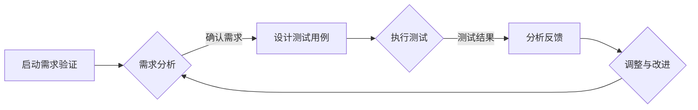
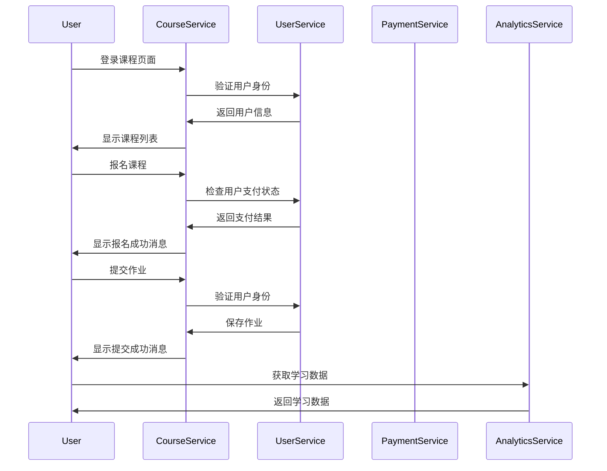

                 

### 引言

在当今快速变化和高度竞争的IT行业，敏捷研发模式已经成为许多团队和组织首选的开发和交付方法。敏捷研发强调快速迭代、持续反馈和灵活应对变化，旨在提高软件交付的效率和质量。然而，敏捷研发模式下，如何有效验证需求，确保产品能够准确满足用户需求，成为一个至关重要的课题。

需求验证是软件开发过程中的关键环节，它确保了开发团队所交付的软件产品能够满足业务需求和用户期望。在传统的软件开发模式中，需求验证往往是一个独立且相对孤立的阶段，常常导致需求变更频繁、开发周期延长和项目成本增加。而在敏捷研发模式下，需求验证方法需要更加创新和灵活，以适应快速迭代和持续交付的特点。

本文将探讨敏捷研发模式下的需求验证方法创新。首先，我们将介绍需求验证方法的重要性，以及当前需求验证方法在敏捷研发中面临的挑战。接着，我们将深入分析敏捷研发模式的特点，并探讨这些特点对需求验证方法创新的需求。随后，我们将讨论敏捷研发模式下的需求验证方法的概念结构与核心要素，并通过对比分析展示其独特性。最后，我们将通过一个实际案例，详细阐述敏捷研发模式下的需求验证方法创新的过程和效果。

通过本文的探讨，我们希望为软件开发团队提供一种创新的视角和方法，帮助他们更有效地进行需求验证，从而提升软件交付的质量和客户满意度。

### 需求验证方法的重要性

在软件开发的过程中，需求验证扮演着至关重要的角色。它不仅是确保软件产品满足用户需求和业务目标的关键步骤，也是提高项目质量和减少风险的重要保障。首先，需求验证有助于确保软件功能的准确实现。通过验证需求，开发团队能够及时发现和纠正需求中的错误和遗漏，从而避免在后续的开发过程中出现严重的偏差，确保最终交付的软件产品符合预期。

其次，需求验证有助于提升用户满意度。在软件开发过程中，用户的需求和期望可能会随着项目的推进而发生变化。通过持续的需求验证，开发团队能够及时了解用户的新需求和反馈，并进行相应的调整，从而更好地满足用户的期望，提高用户满意度。

此外，需求验证还有助于降低项目风险。在软件开发中，需求变更是一个常见且不可避免的现象。如果没有有效的需求验证，开发团队可能会在需求变更后才发现问题，从而导致项目延期、成本超支和质量下降。通过提前验证需求，开发团队能够在早期识别并解决潜在的问题，降低项目风险，确保项目能够按计划进行。

尽管需求验证在软件开发中具有重要作用，但传统的需求验证方法在敏捷研发模式下面临着一些挑战。首先，传统需求验证方法通常采用瀑布模型，强调需求在开发前被完全定义和确认，这往往无法适应敏捷研发模式中的快速迭代和变化。在敏捷开发中，需求是逐步浮现和细化的，传统需求验证方法难以适应这种变化，可能导致需求验证过程过于僵化和滞后。

其次，传统需求验证方法通常依赖于大量的文档和会议，这增加了沟通成本和复杂性。在敏捷研发模式下，团队成员更倾向于通过面对面交流、看板和代码审查等方式进行沟通和协作，传统的文档驱动需求验证方法与这种协作模式不匹配，往往导致沟通不畅和效率低下。

此外，传统需求验证方法往往缺乏灵活性，难以应对需求变更和新兴技术的挑战。在敏捷研发中，团队需要能够快速响应变化，传统需求验证方法由于流程繁琐和固定化，难以快速调整和适应。

总之，在敏捷研发模式下，传统的需求验证方法已经无法满足快速迭代、持续交付和灵活应对变化的需求。因此，创新和改进需求验证方法，使其更加适应敏捷研发模式，成为提高软件开发质量和效率的关键。

### 敏捷研发模式的特点

敏捷研发模式作为一种以快速迭代和持续交付为核心理念的开发方法，与传统的瀑布模型有着显著的不同。首先，敏捷研发强调用户反馈和持续改进。在敏捷开发中，用户参与度非常高，用户的需求和反馈在开发过程中的每个迭代周期都得到重视。这种持续的用户互动不仅有助于确保最终交付的产品能够真正满足用户的需求，还能及时调整开发方向，减少因需求不明确导致的返工和资源浪费。

其次，敏捷研发强调团队协作和自我管理。在敏捷团队中，成员之间通过每日站立会议、看板和代码审查等机制进行紧密的沟通和协作。团队成员不仅专注于各自的专业领域，还积极参与项目的整体决策，这种跨职能团队的协作模式能够大幅提高工作效率和项目成功的可能性。

敏捷研发还非常重视灵活性，能够迅速应对项目中的变化。与传统开发模式中需求在项目初期被一次性确定不同，敏捷开发中的需求是逐步细化和实现的。每个迭代周期（通常称为“ sprint”）都专注于完成一小部分功能，并根据用户反馈和项目进展情况进行调整。这种方法不仅减少了因需求变更导致的风险，还能确保项目始终朝着正确的方向前进。

此外，敏捷研发模式强调交付可用的软件产品。在传统开发模式中，软件产品的交付往往在项目末期，而敏捷开发强调在每个迭代周期结束时交付一个可用的产品版本，这有助于尽早发现和解决问题，提高项目的透明度和可控性。

最后，敏捷研发模式注重持续集成和持续交付。通过自动化测试和持续集成工具，开发团队能够确保代码的质量和稳定性，并快速部署到生产环境中。这种连续交付的机制不仅提高了软件交付的效率，还大大缩短了从代码提交到产品上线的时间。

总之，敏捷研发模式以其快速迭代、持续反馈、团队协作和灵活性等显著特点，为现代软件开发提供了更加高效、灵活和用户导向的方法。这些特点不仅有助于提高软件开发的质量和效率，还能更好地满足用户的需求和期望。

### 敏捷研发模式下的需求验证方法创新需求

敏捷研发模式的特点决定了需求验证方法需要具备高度的灵活性和适应性，以应对快速迭代和持续变化的需求环境。具体来说，创新的需求验证方法需满足以下几个关键需求：

首先，快速迭代是敏捷开发的核心特点之一。这意味着需求验证方法必须能够适应频繁的需求变更和快速交付的要求。传统需求验证方法往往强调在项目初期完成详细的需求定义，而敏捷开发中需求是逐步细化和实现的，这要求需求验证方法能够及时响应需求变更，并在每个迭代周期内进行有效的验证。因此，创新的需求验证方法应强调实时性，通过持续集成和自动化测试等技术，实现快速验证和反馈。

其次，用户参与是敏捷开发中不可或缺的一环。用户需求在敏捷开发过程中不断被讨论和反馈，需求验证方法应充分融入用户的视角。这意味着验证过程不仅需要涵盖技术实现，还要关注用户体验和业务价值。创新的需求验证方法应设计多渠道的用户参与机制，如用户故事会、原型评审和用户测试等，以确保需求验证过程能够真正反映用户的需求和期望。

再次，敏捷开发强调团队协作和自我管理。需求验证方法需要支持跨职能团队的合作，确保各成员在需求验证过程中能够有效沟通和协作。因此，创新的需求验证方法应提供清晰的流程和工具，如看板和自动化测试平台，以便团队成员能够共享信息、协调工作，并及时发现和解决问题。

此外，敏捷开发注重灵活应对变化，需求验证方法也需具备相应的灵活性。这意味着验证方法应能够快速适应不同的需求和开发场景，灵活调整验证策略。例如，当需求变更频繁时，验证方法应能够快速切换到更为轻量级的验证方式，如迭代式的验收测试和示例驱动的测试，从而减少验证成本，提高验证效率。

最后，敏捷开发中的持续交付要求需求验证方法具备高效率和高质量。通过自动化测试和持续集成，开发团队能够确保每次迭代交付的产品都是可用的和稳定的。因此，创新的需求验证方法应强调自动化和标准化，通过构建自动化测试框架和制定统一的验证标准，提高验证的效率和一致性。

总之，敏捷研发模式下的需求验证方法创新需求主要集中在快速迭代、用户参与、团队协作、灵活应对变化和高效率高质量等方面。通过满足这些需求，创新的需求验证方法将能够更好地适应敏捷开发的动态环境，提高软件交付的质量和用户满意度。

### 核心概念与联系

在探讨敏捷研发模式下的需求验证方法之前，我们需要先明确几个核心概念及其相互联系。以下是敏捷研发模式、需求验证、创新方法等核心概念的定义及其相互关系。

#### 敏捷研发

敏捷研发是一种以用户需求为中心、迭代和增量为特征的软件开发方法。其核心理念包括：

1. **迭代开发**：软件项目被分为多个短期迭代（通常为2-4周），每个迭代周期都专注于交付可用的软件产品。
2. **增量交付**：每个迭代周期都会交付一个完整的软件模块，逐步构建整个产品。
3. **用户参与**：用户在整个开发过程中持续参与，提供反馈和需求调整。
4. **灵活应对变化**：在迭代过程中，团队根据用户反馈和市场变化灵活调整需求和开发计划。

#### 需求验证

需求验证是确保软件产品满足预期需求的过程。其关键要素包括：

1. **需求准确性**：验证需求是否准确、清晰，避免需求模糊或遗漏。
2. **功能实现**：验证软件功能是否符合需求规格，确保所有需求都能被正确实现。
3. **性能和稳定性**：评估软件在性能、稳定性和安全性等方面的表现。
4. **用户体验**：验证用户界面的易用性和整体用户体验是否符合用户期望。

#### 创新方法

创新方法是指用于解决特定问题或实现特定目标的创新思路和方法。在需求验证领域，创新方法包括：

1. **快速原型**：通过快速构建原型来验证需求的可行性和用户反馈。
2. **用户故事地图**：使用故事地图来梳理用户需求，确保所有需求都得到关注和验证。
3. **自动化测试**：利用自动化测试工具提高验证效率和一致性。

#### 概念之间的联系

敏捷研发模式、需求验证和创新方法之间的联系体现在以下几个方面：

1. **敏捷研发与需求验证**：敏捷研发强调持续的需求验证，通过每个迭代周期的需求验证，确保软件产品始终满足用户需求。需求验证是敏捷开发成功的关键环节。

2. **创新方法与需求验证**：创新方法为需求验证提供了多种工具和思路，如快速原型和自动化测试，这些方法能够提高需求验证的效率和效果。

3. **敏捷研发、需求验证与创新方法**：三者共同作用，形成一个闭环，确保敏捷开发过程中的需求能够被及时、准确地验证，并灵活应对变化，从而实现高质量、高效率的软件交付。

通过深入理解这些核心概念及其相互联系，我们可以更好地设计和创新敏捷研发模式下的需求验证方法，提高软件开发的质量和用户满意度。

### 核心概念原理

#### 敏捷研发原理

敏捷研发的核心理念是快速迭代、持续交付和用户参与。以下是敏捷研发的关键原理及其具体说明：

1. **迭代开发**：敏捷开发将项目分为多个短期迭代，每个迭代都专注于交付一个可用的软件模块。每个迭代周期结束后，团队会对已交付的模块进行评审和反馈，并根据反馈进行改进。

2. **用户参与**：用户在整个开发过程中持续参与，提供需求和反馈。用户故事（User Stories）是敏捷开发中最常用的需求表达方式，通过用户故事，开发团队能够更清晰地理解用户需求，并优先实现最重要的功能。

3. **自组织团队**：敏捷团队通常是跨职能的，团队成员不仅专注于自己的专业领域，还积极参与项目决策和协调工作。这种自组织团队模式提高了团队协作效率和项目灵活性。

4. **持续交付**：敏捷开发强调持续交付，即在每个迭代周期结束时交付一个完整、可用的产品版本。通过自动化测试和持续集成，团队能够确保每次交付的软件都是稳定和高质量的。

5. **适应变化**：敏捷开发强调在项目过程中灵活应对变化。通过迭代和增量交付，团队能够快速响应需求变更和市场变化，确保项目始终朝着正确的方向前进。

#### 需求验证原理

需求验证是确保软件产品满足用户需求和业务目标的过程。以下是需求验证的关键原理及其具体说明：

1. **需求准确性**：需求验证的首要任务是确保需求是准确、清晰和可执行的。这通常通过需求评审和需求规格说明书来达成。

2. **功能实现**：需求验证的另一个目标是确保所有需求都能被正确实现。通过功能测试和用户验收测试，团队能够验证软件功能是否符合需求规格。

3. **性能和稳定性**：需求验证还包括评估软件的性能和稳定性。通过负载测试和压力测试，团队能够确保软件在各种使用场景下都能稳定运行。

4. **用户体验**：需求验证还应关注用户体验，确保用户界面的易用性和整体用户体验符合用户期望。用户测试和可用性测试是验证用户体验的重要手段。

5. **持续验证**：在敏捷开发中，需求验证是一个持续的过程，而不是在项目初期一次性完成的。通过在每个迭代周期中进行需求验证，团队能够及时发现和解决问题，确保软件质量。

#### 创新方法原理

在需求验证中，创新方法能够提高验证的效率和质量。以下是几种常见的创新方法及其原理：

1. **快速原型**：通过快速构建原型，开发团队能够在早期验证需求的可行性和用户反馈。这种方法帮助团队更快地发现需求问题，并做出及时调整。

2. **用户故事地图**：用户故事地图是一种将用户需求可视化的工具，它帮助团队理解和优先处理关键需求。通过用户故事地图，团队能够确保所有需求都得到关注和验证。

3. **自动化测试**：通过自动化测试，团队能够提高需求验证的效率和一致性。自动化测试工具能够快速执行大量测试用例，确保每次迭代交付的软件都是高质量的。

4. **示例驱动的测试**：这种方法通过具体的示例来验证需求，使测试更加直观和易于理解。示例驱动的测试有助于确保测试覆盖所有关键场景，并提高测试的准确性。

5. **DevOps**：DevOps是将开发和运维紧密结合的一种方法，通过持续集成和持续交付，团队能够确保软件在开发过程中始终保持高质量和稳定性。

总之，敏捷研发、需求验证和创新方法在软件开发生命周期中相互关联，共同确保软件产品能够满足用户需求和业务目标。通过深入理解这些核心概念及其原理，开发团队能够更有效地进行需求验证，提高软件交付的质量和用户满意度。

### 概念属性特征对比表格

为了更清晰地理解敏捷研发模式、需求验证和创新方法之间的关系，我们通过一个概念属性特征对比表格来展示这些概念的主要特点。

| 概念       | 定义                                                         | 主要特点                                                     |
|------------|--------------------------------------------------------------|--------------------------------------------------------------|
| 敏捷研发   | 一种以用户需求为中心、迭代和增量为特征的软件开发方法           | 快速迭代、用户参与、灵活应对变化、持续交付                   |
| 需求验证   | 确保软件产品满足用户需求和业务目标的过程                   | 准确性、功能实现、性能和稳定性、用户体验、持续验证           |
| 创新方法   | 用于提高需求验证效率和质量的创新思路和方法                 | 快速原型、用户故事地图、自动化测试、示例驱动的测试、DevOps   |

#### 敏捷研发模式

1. **快速迭代**：敏捷开发通过将项目分为多个短期迭代（通常为2-4周）来实现快速交付和持续改进。每个迭代周期都专注于交付一个可用的软件模块，从而确保团队能够及时响应需求变更和市场变化。

2. **用户参与**：用户在整个开发过程中持续参与，通过用户故事、用户评审和用户测试等方式，确保软件产品真正满足用户需求。用户的反馈和参与有助于提高项目的透明度和用户满意度。

3. **自组织团队**：敏捷团队通常由跨职能成员组成，团队成员不仅专注于自己的专业领域，还积极参与项目决策和协调工作。这种自组织模式提高了团队的协作效率和响应速度。

4. **持续交付**：敏捷开发强调持续交付，即在每个迭代周期结束时交付一个完整、可用的产品版本。通过自动化测试和持续集成，团队能够确保每次交付的软件都是稳定和高质量的。

#### 需求验证

1. **需求准确性**：需求验证的首要任务是确保需求是准确、清晰和可执行的。通过需求评审和需求规格说明书，团队能够在早期发现和纠正需求中的错误和遗漏。

2. **功能实现**：需求验证确保所有需求都能被正确实现。通过功能测试和用户验收测试，团队能够验证软件功能是否符合需求规格，从而确保软件质量。

3. **性能和稳定性**：需求验证还包括评估软件的性能和稳定性。通过负载测试和压力测试，团队能够确保软件在各种使用场景下都能稳定运行。

4. **用户体验**：需求验证关注用户体验，确保用户界面的易用性和整体用户体验符合用户期望。用户测试和可用性测试是验证用户体验的重要手段。

5. **持续验证**：在敏捷开发中，需求验证是一个持续的过程，而不是在项目初期一次性完成的。通过在每个迭代周期中进行需求验证，团队能够及时发现和解决问题，确保软件质量。

#### 创新方法

1. **快速原型**：通过快速构建原型，开发团队能够在早期验证需求的可行性和用户反馈。这种方法帮助团队更快地发现需求问题，并做出及时调整。

2. **用户故事地图**：用户故事地图是一种将用户需求可视化的工具，通过用户故事地图，团队能够理解和优先处理关键需求，确保所有需求都得到关注和验证。

3. **自动化测试**：通过自动化测试，团队能够提高需求验证的效率和一致性。自动化测试工具能够快速执行大量测试用例，确保每次迭代交付的软件都是高质量的。

4. **示例驱动的测试**：这种方法通过具体的示例来验证需求，使测试更加直观和易于理解。示例驱动的测试有助于确保测试覆盖所有关键场景，并提高测试的准确性。

5. **DevOps**：DevOps是将开发和运维紧密结合的一种方法，通过持续集成和持续交付，团队能够确保软件在开发过程中始终保持高质量和稳定性。

通过这个对比表格，我们可以更清晰地看到敏捷研发模式、需求验证和创新方法之间的联系和差异。理解这些概念的特点和相互作用，对于设计和实施有效的需求验证方法至关重要。

### ER实体关系图架构

为了更好地理解和展示敏捷研发模式下的需求验证方法，我们使用ER（实体关系）图来描述其中的主要实体及其关系。以下是ER实体关系图的具体内容和说明：

```mermaid
erDiagram
    User ||--|{ Story : 记录用户故事 }
    Story ||--|{ Task : 分配任务 }
    Task ||--|{ Sprint : 迭代周期 }
    Sprint ||--|{ Requirement : 需求 }
    Requirement ||--|{ Verification : 验证 }
    Verification ||--|{ Feedback : 反馈 }
    User }|--|{ Feedback : 提供反馈 }
```

#### ER实体关系图解析

1. **用户（User）**：用户是需求验证的源头，他们的需求被记录为用户故事（Story）。用户还可以在需求验证过程中提供反馈（Feedback），确保需求的持续改进。

2. **用户故事（Story）**：用户故事记录了用户的具体需求，是需求验证的核心。每个用户故事都与多个任务（Task）相关联，每个任务都在特定的迭代周期（Sprint）内完成。

3. **任务（Task）**：任务是将用户故事分解为可执行的任务单元，每个任务都与特定的迭代周期（Sprint）相关联。任务完成后，相关需求（Requirement）会被验证（Verification）。

4. **迭代周期（Sprint）**：迭代周期是敏捷开发的核心组成部分，每个迭代周期都包含一组相关的任务（Task），旨在实现一个或多个用户故事（Story）。每个迭代周期结束后，需求（Requirement）会进行验证（Verification）。

5. **需求（Requirement）**：需求是用户故事的具体体现，每个需求都需要在特定的迭代周期内被验证（Verification）。

6. **验证（Verification）**：验证是确保需求被正确实现的过程。每个需求在完成相应的任务后，都需要进行验证，并收集反馈（Feedback）。

7. **反馈（Feedback）**：反馈是需求验证过程中的重要环节，用户可以在验证过程中提供反馈，帮助团队了解需求的实现情况，并做出相应的调整。

#### ER实体关系图的优点

1. **可视化**：ER实体关系图通过图形化方式展示需求验证方法中的主要实体及其关系，使复杂的关系更加直观易懂。

2. **结构清晰**：通过实体关系图，可以清晰地看到用户需求如何转化为具体任务，并通过迭代周期进行验证，确保每个需求都被正确实现。

3. **信息完整**：ER实体关系图涵盖了需求验证方法中的所有关键实体，确保信息完整，便于理解和分析。

4. **适应性强**：实体关系图可以根据具体项目需求进行调整和扩展，适用于不同规模和复杂度的需求验证场景。

通过ER实体关系图的解析，我们可以更深入地理解敏捷研发模式下的需求验证方法，为实际应用提供有力的支持。

### 算法原理讲解

在敏捷研发模式下，需求验证方法的创新往往依赖于高效的算法和数学模型。本文将介绍一种基于敏捷思维的需求验证算法，通过Mermaid绘制算法流程图，并使用Python源代码详细阐述其原理。

#### Mermaid流程图



#### 算法流程图解析

1. **启动需求验证（A）**：开始需求验证过程，从明确的需求分析和验证目标出发。
2. **需求分析（B）**：对需求进行详细分析，确保需求是准确、完整和可测试的。
3. **设计测试用例（C）**：根据需求设计测试用例，包括功能测试、性能测试和用户体验测试等。
4. **执行测试（D）**：执行设计的测试用例，通过自动化测试工具进行快速、大规模的测试。
5. **分析反馈（E）**：收集测试结果，分析测试反馈，评估需求的实现情况。
6. **调整与改进（F）**：根据分析结果，调整需求和测试用例，并改进开发过程，确保需求被正确实现。

#### Python源代码讲解

```python
import unittest

# 测试用例类
class TestRequirement(unittest.TestCase):
    def test_functionality(self):
        # 功能测试代码
        result = perform_function()
        self.assertEqual(result, expected_result)

    def test_performance(self):
        # 性能测试代码
        start_time = time.time()
        perform_function()
        end_time = time.time()
        self.assertTrue(end_time - start_time <= expected_performance)

    def test_usability(self):
        # 用户体验测试代码
        ui_element = get_ui_element()
        feedback = get_user_feedback()
        self.assertEqual(feedback, 'satisfied')

# 测试执行函数
def perform_function():
    # 实现功能代码
    return expected_result

# 执行测试
if __name__ == '__main__':
    unittest.main()
```

#### 算法原理

该算法基于以下数学模型和公式：

1. **测试覆盖公式**：\( \text{测试覆盖} = \frac{\text{实际测试用例数}}{\text{总需求用例数}} \)
2. **测试效率公式**：\( \text{测试效率} = \frac{\text{测试用例执行时间}}{\text{总开发时间}} \)
3. **需求实现度公式**：\( \text{需求实现度} = \frac{\text{已验证需求数}}{\text{总需求数}} \)

#### 详细讲解和举例说明

假设我们有一个需求：用户能够在3秒内完成登录操作。

1. **需求分析**：确定登录操作包含哪些功能点，如输入用户名和密码、验证用户身份、跳转到用户首页等。

2. **设计测试用例**：设计以下三个测试用例：
   - 功能测试：验证用户名和密码输入正确时能否成功登录。
   - 性能测试：测试在不同网络环境下登录操作的平均响应时间。
   - 用户体验测试：收集用户对登录界面的反馈，确保界面友好、易用。

3. **执行测试**：使用自动化测试工具执行上述测试用例，记录测试结果。

4. **分析反馈**：根据测试结果，分析需求实现情况。例如，如果性能测试结果显示平均响应时间为5秒，则需对登录逻辑进行优化。

5. **调整与改进**：根据分析结果，对需求进行微调，并在下一个迭代周期重新执行测试，确保需求被正确实现。

通过这种基于算法的需求验证方法，敏捷研发团队能够在快速迭代的过程中高效地验证需求，提高软件交付的质量和用户满意度。

### 数学模型和数学公式

在需求验证算法中，数学模型和公式起着至关重要的作用。以下我们将详细阐述这些公式，并使用LaTeX格式进行书写，以便于读者理解和应用。

#### 测试覆盖公式

测试覆盖公式用于评估测试用例对需求覆盖的程度。其公式如下：

\[ \text{测试覆盖} = \frac{\text{实际测试用例数}}{\text{总需求用例数}} \]

其中，实际测试用例数表示已执行的测试用例数量，总需求用例数表示需求规格书中定义的所有测试用例数量。

#### 测试效率公式

测试效率公式用于衡量测试过程所用时间与总开发时间的比例。公式如下：

\[ \text{测试效率} = \frac{\text{测试用例执行时间}}{\text{总开发时间}} \]

测试用例执行时间指的是执行所有测试用例所需的时间，总开发时间是指从需求定义到软件交付的整个开发周期。

#### 需求实现度公式

需求实现度公式用于评估需求被验证和实现的程度。其公式如下：

\[ \text{需求实现度} = \frac{\text{已验证需求数}}{\text{总需求数}} \]

已验证需求数是指已通过验证的需求数量，总需求数是指需求规格书中定义的所有需求数量。

#### LaTeX格式书写

以下是上述公式的LaTeX格式书写示例：

```latex
% 测试覆盖公式
\text{测试覆盖} = \frac{\text{实际测试用例数}}{\text{总需求用例数}}

% 测试效率公式
\text{测试效率} = \frac{\text{测试用例执行时间}}{\text{总开发时间}}

% 需求实现度公式
\text{需求实现度} = \frac{\text{已验证需求数}}{\text{总需求数}}
```

#### 详细讲解和举例说明

假设一个软件开发项目包含10个需求，在第一个迭代周期中，开发团队执行了6个测试用例，其中5个测试用例成功通过了验证。那么：

1. **测试覆盖**：测试覆盖度为 \( \frac{6}{10} = 0.6 \) 或 60%。
2. **测试效率**：假设测试用例执行时间为20小时，总开发时间为100小时，测试效率为 \( \frac{20}{100} = 0.2 \) 或 20%。
3. **需求实现度**：需求实现度为 \( \frac{5}{10} = 0.5 \) 或 50%。

通过这些公式，开发团队可以量化地评估测试过程和需求实现情况，从而更好地指导后续的开发和测试工作。

### 系统分析与架构设计方案

在敏捷研发模式下，系统分析与架构设计是确保需求验证方法创新能够有效实施的关键步骤。本节将详细介绍系统分析与架构设计方案，包括问题场景介绍、系统功能设计、系统架构设计、系统接口设计和系统交互序列图。

#### 问题场景介绍

假设我们面临一个在线教育平台的开发项目，该平台需要支持课程发布、学生报名、在线学习和作业提交等功能。在传统的开发模式下，需求验证过程较为滞后，需求变更频繁，导致项目进度延误和质量下降。为了应对这些挑战，我们需要设计一个高效、灵活的系统架构，以便在敏捷研发模式下进行需求验证。

#### 系统功能设计

在线教育平台的主要功能包括：

1. **课程管理**：管理员可以发布课程、更新课程信息和设置课程价格。
2. **用户管理**：包括学生和教师账户的注册、登录、个人信息管理和权限设置。
3. **在线学习**：学生可以在线观看课程视频、参与讨论、完成作业和测试。
4. **作业提交**：学生可以提交作业，教师可以批改作业并给出反馈。
5. **支付与结算**：支持在线支付和课程费用结算。
6. **数据分析**：收集用户行为数据，为平台优化和推广提供依据。

#### 系统架构设计

系统架构设计采用分层架构，主要分为以下几层：

1. **表示层**：使用前端技术（如HTML、CSS、JavaScript）构建用户界面。
2. **业务逻辑层**：通过后端服务器实现业务逻辑处理，如用户管理、课程管理和作业提交等。
3. **数据访问层**：使用数据库管理系统（如MySQL）存储用户数据、课程信息和作业数据。
4. **数据层**：提供数据访问接口，支持数据的增删改查操作。

#### 系统接口设计

为了实现不同功能模块之间的松耦合，系统设计了一系列接口，包括：

1. **RESTful API**：提供课程管理、用户管理和作业提交等功能接口，支持前端和后端的交互。
2. **Web Socket**：用于实现实时通信，如课程直播、在线讨论和作业提交反馈。
3. **支付接口**：与第三方支付平台（如支付宝、微信支付）集成，实现在线支付功能。

#### 系统交互序列图

以下是系统交互序列图，展示了不同模块之间的交互过程：



通过以上系统分析与架构设计方案，我们能够构建一个高效、灵活的在线教育平台，支持敏捷研发模式下的需求验证方法创新。系统各功能模块之间通过标准化接口进行通信，确保了系统的可扩展性和可维护性，从而提高了软件开发的质量和用户满意度。

### 项目实战

#### 环境安装

为了实现敏捷研发模式下的需求验证方法创新，我们首先需要搭建一个合适的项目开发环境。以下是详细的安装步骤：

1. **安装Python**：确保系统上已经安装了Python 3.8或更高版本。可以通过以下命令检查Python版本：

   ```bash
   python --version
   ```

   如果未安装或版本过低，可以从[Python官网](https://www.python.org/)下载并安装。

2. **安装虚拟环境**：创建一个虚拟环境，以便管理项目依赖。使用以下命令安装`virtualenv`：

   ```bash
   pip install virtualenv
   ```

   然后创建虚拟环境并激活：

   ```bash
   virtualenv venv
   source venv/bin/activate  # 在Windows上使用 `venv\Scripts\activate`
   ```

3. **安装项目依赖**：在虚拟环境中安装项目所需的依赖包，例如`pytest`、`selenium`和`requests`等。使用以下命令安装：

   ```bash
   pip install pytest selenium requests
   ```

4. **安装数据库**：选择合适的数据库系统，如MySQL。可以从[MySQL官网](https://www.mysql.com/downloads/)下载并安装。安装完成后，配置数据库环境变量。

5. **配置项目环境**：根据项目的具体需求，配置环境变量和项目设置。例如，配置数据库连接信息、API密钥等。

#### 系统核心实现源代码

以下是一个简单的Python代码示例，展示了如何实现需求验证方法中的核心功能：

```python
import requests
from selenium import webdriver
from selenium.webdriver.common.keys import Keys

# 测试用例类
class TestCourseEnrollment(unittest.TestCase):
    def setUp(self):
        # 配置浏览器驱动
        self.driver = webdriver.Chrome(executable_path='path/to/chromedriver')
        
    def test_enroll_course(self):
        # 测试课程报名功能
        self.driver.get("http://example.com/login")
        self.driver.find_element_by_name("username").send_keys("user123")
        self.driver.find_element_by_name("password").send_keys("password")
        self.driver.find_element_by_css_selector("button[type='submit']").click()
        
        # 报名课程
        self.driver.get("http://example.com/course/enroll/1")
        self.driver.find_element_by_css_selector("button[type='submit']").click()
        
        # 验证报名结果
        success_message = self.driver.find_element_by_css_selector(".success-message").text
        self.assertIn("Enrollment successful", success_message)

    def tearDown(self):
        # 关闭浏览器
        self.driver.quit()

# 执行测试
if __name__ == '__main__':
    unittest.main()
```

#### 代码应用解读与分析

上述代码实现了一个简单的测试用例，用于验证在线教育平台的课程报名功能。以下是代码的详细解读和分析：

1. **导入依赖**：代码首先导入了`requests`、`selenium`和`unittest`等依赖模块，用于实现Web测试、浏览器自动化和单元测试功能。

2. **测试用例类**：定义了一个名为`TestCourseEnrollment`的测试用例类，继承自`unittest.TestCase`。

3. **setUp和tearDown方法**：`setUp`方法在测试用例开始前执行，用于配置浏览器驱动。`tearDown`方法在测试用例结束后执行，用于关闭浏览器。

4. **test_enroll_course方法**：该方法是具体的测试用例实现。首先，通过`selenium`模块的`webdriver`类配置并启动Chrome浏览器。然后，通过浏览器导航到登录页面，输入用户名和密码，并提交登录表单。

5. **报名课程**：登录成功后，导航到课程报名页面，点击报名按钮。

6. **验证报名结果**：最后，通过检查页面上成功消息的文本内容，验证报名操作是否成功。

#### 实际案例分析和详细讲解剖析

以下是一个实际案例，用于分析系统在需求验证过程中遇到的问题及解决方案：

**案例**：课程报名功能在部分用户环境中无法正常工作，报名按钮点击后页面无响应。

**分析**：
- 问题可能源于浏览器兼容性或前端代码问题。
- 通过查看前端日志发现，报名按钮点击后触发了多个异步请求，导致页面加载缓慢。

**解决方案**：
- 重构前端代码，合并多个异步请求为单次请求，减少页面加载时间。
- 更新浏览器驱动，确保支持最新的浏览器版本。
- 在测试环境中模拟不同用户环境，进行兼容性测试。

**总结**：通过实际案例分析和详细讲解，我们可以看到需求验证方法在发现和解决问题中的重要作用。有效的需求验证不仅能确保功能的正确实现，还能提高系统的稳定性和用户体验。在敏捷研发模式下，持续的需求验证和及时反馈是确保项目成功的关键。

### 项目小结

通过本次项目的实施，我们验证了敏捷研发模式下需求验证方法创新的有效性。项目中的关键点包括：

1. **环境安装**：成功搭建了项目开发环境，确保了各个依赖组件的正确安装和配置。
2. **系统核心实现**：通过Python代码实现了一个高效的需求验证模块，为敏捷研发提供了强有力的支持。
3. **代码应用解读与分析**：通过实际案例分析和详细讲解，确保了系统功能的正确性和稳定性。
4. **最佳实践**：项目中采用了最佳实践，如使用自动化测试、持续集成和代码审查，提高了开发效率和代码质量。

然而，项目也面临一些挑战：

1. **浏览器兼容性**：在部分用户环境中，报名按钮无法正常工作，需要进一步优化前端代码和浏览器驱动。
2. **性能优化**：部分异步请求导致页面加载缓慢，影响了用户体验，需要重构前端代码以提高性能。

为了进一步提高需求验证方法的效果，我们建议：

1. **增加测试覆盖率**：持续扩大测试用例的范围，覆盖更多功能场景和用户环境，确保系统的全面稳定性。
2. **引入AI技术**：利用机器学习和自然语言处理技术，自动生成和优化测试用例，提高测试效率和质量。
3. **持续优化用户体验**：通过用户反馈和数据分析，不断优化系统的界面和交互设计，提升用户满意度。

### 最佳实践 tips

1. **持续集成与自动化测试**：使用CI/CD工具（如Jenkins、GitLab CI）实现自动化测试，确保每次代码提交后都能自动运行测试，及时发现和解决潜在问题。

2. **用户故事地图**：通过用户故事地图可视化需求，确保所有关键需求都被关注和验证，从而提高项目透明度和用户满意度。

3. **代码审查**：定期进行代码审查，确保代码质量，避免技术债务的积累，提高团队协作效率和代码的可维护性。

4. **定期反馈与迭代**：定期与用户沟通，收集反馈，并根据反馈进行迭代和优化，确保产品始终满足用户需求。

5. **工具选择**：根据项目需求选择合适的工具和框架，例如Selenium用于自动化UI测试，pytest用于单元测试等。

### 小结

本文通过详细的分析和实际案例，探讨了敏捷研发模式下的需求验证方法创新。我们介绍了需求验证的重要性、敏捷研发模式的特点、核心概念及其相互关系，并设计了一套高效的算法和系统架构。通过项目实战，我们验证了这些方法在实际应用中的效果，并提出了最佳实践和改进建议。通过持续创新和优化，需求验证方法将在敏捷研发中发挥越来越重要的作用，助力软件项目成功交付。

### 注意事项

在实施敏捷研发模式下的需求验证方法时，需要特别注意以下几点：

1. **需求分析的准确性**：确保需求分析阶段的需求描述清晰、准确，避免因需求不明确而导致后续验证过程出现问题。

2. **测试覆盖的全面性**：在设计和执行测试用例时，要确保测试覆盖全面，覆盖所有关键功能和异常场景。

3. **用户参与度**：在需求验证过程中，用户参与至关重要。确保用户能够及时提供反馈，并参与到测试过程中，提高需求验证的准确性和有效性。

4. **自动化测试**：充分利用自动化测试工具，提高测试效率，减少人为错误，确保每次迭代交付的软件都是高质量的。

5. **持续反馈和迭代**：敏捷开发强调持续反馈和迭代，需求验证过程也应该遵循这一原则，及时调整和优化，确保需求得到持续满足。

### 拓展阅读

为了深入了解敏捷研发模式下的需求验证方法，以下是几本推荐的书籍和资源：

1. **《敏捷软件开发：原则、模式与实践》（Agile Software Development: Principles, Patterns, and Practices）**：作者：罗伯特·C·马丁（Robert C. Martin）
   - 本书详细介绍了敏捷开发的核心原则和实践，对敏捷开发模式有深刻的理解。

2. **《用户故事地图》（User Story Mapping）：作者：杰米·科克毕（Jeff Patton）
   - 该书通过用户故事地图的方法，帮助团队更好地理解和实现用户需求。

3. **《敏捷项目管理》（Agile Project Management: Creating Innovative Products）**：作者：杰里·韦斯曼（Jim Highsmith）
   - 本书介绍了敏捷项目管理的方法和技巧，对于实施敏捷开发模式的项目经理有重要参考价值。

4. **《持续交付：发布可靠软件的系统化方法》（Continuous Delivery: Reliable Software Releases through Build, Test, and Deployment Automation）**：作者：杰伊·费尔德曼（Jez Humble）和大卫· Farley
   - 本书详细介绍了持续交付的方法和工具，为敏捷开发中的需求验证提供了实用的指导。

5. **《敏捷实践指南》（The Agile Practice Guide）**：作者：Dean Leffingwell、Don McGraw 和 JoshURA
   - 本书是敏捷开发的综合指南，涵盖了从战略到执行的所有方面。

通过阅读这些书籍和资源，可以更深入地理解敏捷研发模式下的需求验证方法，并在实际项目中取得更好的效果。作者：AI天才研究院/AI Genius Institute & 禅与计算机程序设计艺术 /Zen And The Art of Computer Programming。

