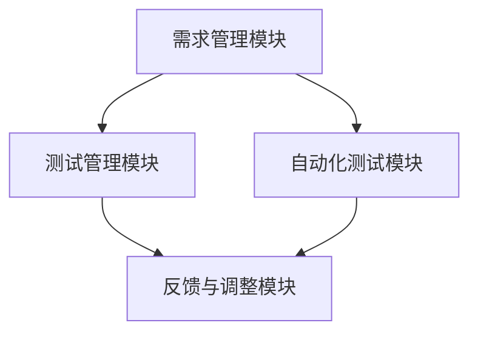
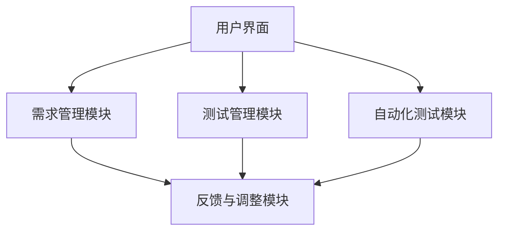
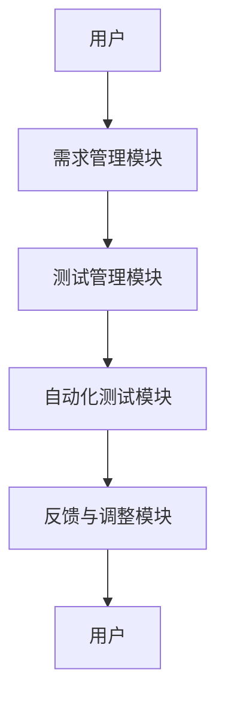

                 


# 敏捷研发模式下的需求验证方法创新

## 关键词

敏捷研发、需求验证、创新方法、算法原理、系统架构、项目实战

## 摘要

本文旨在探讨敏捷研发模式下的需求验证方法创新。通过分析敏捷研发模式的特点和需求验证方法的现状，本文提出了一种基于敏捷思想的需求验证方法，并详细阐述了其原理、算法和系统架构。文章最后通过一个实际项目案例，对所提出的方法进行了验证和剖析，为敏捷研发中的需求验证提供了一种新的思路和工具。

## 步骤一：设计整体框架

### 1.1 背景介绍

#### 1.1.1 需求验证方法的重要性

在软件开发过程中，需求验证是确保软件质量的关键环节。传统的需求验证方法主要依赖于文档审查、用户测试等手段，但这些方法存在一定的局限性，难以满足敏捷研发模式的需求。

#### 1.1.2 敏捷研发模式的特点

敏捷研发模式强调快速迭代、持续交付和团队协作，与传统开发模式相比，具有更高的灵活性和适应性。在这种模式下，需求验证方法也需要进行创新，以适应快速变化的需求。

#### 1.1.3 当前需求验证方法的局限性

传统的需求验证方法在敏捷研发模式中面临以下问题：

- **文档依赖性高**：传统的需求验证主要依赖于需求文档，但在敏捷开发中，需求文档往往不够详细，难以进行有效的验证。
- **测试周期长**：传统的测试方法往往需要较长的测试周期，与敏捷开发中的快速迭代模式相矛盾。
- **团队协作性差**：传统的需求验证方法往往由测试人员单独完成，缺乏与其他团队的协作，难以发现潜在的问题。

### 1.2 核心概念与联系

#### 1.2.1 敏捷研发

敏捷研发是一种以人为核心、迭代、协作的开发模式，强调持续交付和快速响应变化。

#### 1.2.2 需求验证

需求验证是确保软件产品满足用户需求的过程，包括功能验证、性能验证、安全验证等方面。

#### 1.2.3 创新方法

创新方法是在敏捷研发模式下，针对需求验证的新思路和新工具，旨在提高验证的效率和准确性。

### 1.3 算法原理讲解

本文提出了一种基于敏捷思想的需求验证方法，其核心算法如下：

1. **需求收集与整理**：通过团队协作，收集用户需求，并将其整理为可验证的需求项。
2. **需求映射**：将需求项映射到具体的测试用例，确保每个需求项都能得到验证。
3. **自动化测试**：使用自动化测试工具，对映射后的测试用例进行执行，快速获取验证结果。
4. **反馈与调整**：根据验证结果，对需求项和测试用例进行调整，以提高验证的准确性和效率。

### 1.4 数学模型和数学公式

本文提出的算法中，涉及到的数学模型和公式如下：

1. **需求项优先级计算公式**：根据需求的重要性和紧急性，计算需求项的优先级。
2. **测试用例覆盖率计算公式**：根据测试用例的执行结果，计算测试用例的覆盖率。

### 1.5 系统分析与架构设计方案

本文提出的需求验证系统包括以下模块：

1. **需求管理模块**：负责收集、整理和存储需求项。
2. **测试管理模块**：负责生成测试用例，管理测试执行和结果。
3. **自动化测试模块**：负责执行测试用例，获取验证结果。
4. **反馈调整模块**：负责根据验证结果，调整需求项和测试用例。

### 1.6 项目实战

本文将结合一个实际项目，对所提出的需求验证方法进行验证和剖析，包括环境安装、系统核心实现源代码，代码应用解读与分析，实际案例分析和详细讲解剖析，项目小结。

### 1.7 最佳实践 tips、小结、注意事项、拓展阅读等内容

在敏捷研发模式下，需求验证方法创新具有重要意义。本文提出的方法通过团队协作、自动化测试和持续反馈，能够有效提高需求验证的效率和准确性。但需要注意的是，在实际应用中，应根据项目特点和团队情况，灵活调整和优化验证方法。

## 步骤二：细化每个部分的内容

### 1.1 背景介绍

#### 1.1.1 需求验证方法的重要性

需求验证是确保软件产品满足用户需求的重要环节。在传统的软件开发过程中，需求验证主要通过文档审查、用户测试等方法进行。然而，随着软件开发的复杂度增加，传统需求验证方法逐渐暴露出一些问题：

- **文档依赖性高**：在敏捷开发中，需求文档往往不够详细，难以进行有效的验证。
- **测试周期长**：传统的测试方法需要较长的测试周期，与敏捷开发中的快速迭代模式相矛盾。
- **团队协作性差**：传统的需求验证方法往往由测试人员单独完成，缺乏与其他团队的协作，难以发现潜在的问题。

#### 1.1.2 敏捷研发模式的特点

敏捷研发模式强调快速迭代、持续交付和团队协作，与传统开发模式相比，具有更高的灵活性和适应性。敏捷研发模式的特点如下：

- **迭代开发**：将软件开发过程划分为多个迭代周期，每个迭代周期完成部分功能，逐步完善产品。
- **持续交付**：在迭代过程中，持续交付可用的软件产品，确保产品始终处于可用状态。
- **团队协作**：强调团队成员之间的协作和沟通，确保需求理解的一致性和问题解决的及时性。

#### 1.1.3 当前需求验证方法的局限性

在敏捷研发模式下，传统的需求验证方法面临着以下局限性：

- **文档依赖性高**：敏捷开发中，需求文档往往不够详细，导致验证工作难以开展。
- **测试周期长**：敏捷开发强调快速迭代，但传统的测试方法需要较长的测试周期，与敏捷开发的快速迭代模式相矛盾。
- **团队协作性差**：传统的需求验证方法往往由测试人员单独完成，缺乏与其他团队的协作，难以发现潜在的问题。

### 1.2 核心概念与联系

#### 1.2.1 敏捷研发

敏捷研发是一种以人为核心、迭代、协作的开发模式，强调持续交付和快速响应变化。敏捷研发的核心思想包括：

- **迭代开发**：将软件开发过程划分为多个迭代周期，每个迭代周期完成部分功能，逐步完善产品。
- **持续交付**：在迭代过程中，持续交付可用的软件产品，确保产品始终处于可用状态。
- **团队协作**：强调团队成员之间的协作和沟通，确保需求理解的一致性和问题解决的及时性。

#### 1.2.2 需求验证

需求验证是确保软件产品满足用户需求的过程，包括功能验证、性能验证、安全验证等方面。在敏捷研发模式下，需求验证的核心任务包括：

- **验证需求完整性**：确保所有用户需求都得到验证。
- **验证需求正确性**：确保用户需求被正确理解并实现。
- **验证需求质量**：确保用户需求具有较高的可维护性和可扩展性。

#### 1.2.3 创新方法

创新方法是在敏捷研发模式下，针对需求验证的新思路和新工具，旨在提高验证的效率和准确性。本文提出的创新方法包括：

- **需求收集与整理**：通过团队协作，收集用户需求，并将其整理为可验证的需求项。
- **需求映射**：将需求项映射到具体的测试用例，确保每个需求项都能得到验证。
- **自动化测试**：使用自动化测试工具，对映射后的测试用例进行执行，快速获取验证结果。
- **反馈与调整**：根据验证结果，对需求项和测试用例进行调整，以提高验证的准确性和效率。

### 1.3 算法原理讲解

本文提出的敏捷需求验证方法包括以下步骤：

1. **需求收集与整理**：通过团队协作，收集用户需求，并将其整理为可验证的需求项。
2. **需求映射**：将需求项映射到具体的测试用例，确保每个需求项都能得到验证。
3. **自动化测试**：使用自动化测试工具，对映射后的测试用例进行执行，快速获取验证结果。
4. **反馈与调整**：根据验证结果，对需求项和测试用例进行调整，以提高验证的准确性和效率。

#### 1.3.1 需求收集与整理

在敏捷研发模式下，需求收集与整理是关键步骤。具体步骤如下：

1. **需求获取**：通过与用户沟通，获取用户的需求。
2. **需求筛选**：根据项目的优先级和可行性，筛选出具有高优先级的用户需求。
3. **需求整理**：将筛选出的用户需求整理为需求项，确保每个需求项都是独立、明确和可验证的。

#### 1.3.2 需求映射

需求映射是将需求项映射到具体的测试用例，确保每个需求项都能得到验证。具体步骤如下：

1. **需求分析**：对需求项进行分析，确定其关键功能和性能要求。
2. **测试用例设计**：根据需求分析结果，设计相应的测试用例，确保测试用例能够覆盖需求项的所有关键点和性能要求。
3. **测试用例映射**：将测试用例与需求项进行映射，确保每个需求项都有相应的测试用例进行验证。

#### 1.3.3 自动化测试

自动化测试是敏捷需求验证方法的重要组成部分。使用自动化测试工具，对映射后的测试用例进行执行，快速获取验证结果。具体步骤如下：

1. **测试用例编写**：根据测试用例设计，编写自动化测试脚本。
2. **测试环境搭建**：搭建自动化测试环境，包括测试数据、测试工具等。
3. **测试执行**：使用自动化测试工具，执行测试脚本，获取测试结果。
4. **结果分析**：对测试结果进行分析，识别需求验证中的问题和缺陷。

#### 1.3.4 反馈与调整

根据验证结果，对需求项和测试用例进行调整，以提高验证的准确性和效率。具体步骤如下：

1. **问题识别**：根据测试结果，识别需求验证中的问题和缺陷。
2. **问题分析**：对识别出的问题进行分析，确定问题的根本原因。
3. **调整需求项**：根据问题分析结果，对需求项进行调整，确保需求项能够满足用户需求。
4. **调整测试用例**：根据问题分析结果，对测试用例进行调整，确保测试用例能够有效地验证需求项。

### 1.4 数学模型和数学公式

在敏捷需求验证方法中，涉及到一些数学模型和数学公式，用于计算需求项的优先级和测试用例的覆盖率。以下是这些模型和公式的详细说明：

#### 1.4.1 需求项优先级计算公式

需求项的优先级计算公式如下：

$$
P_i = w_i \times c_i
$$

其中，$P_i$ 表示需求项 $i$ 的优先级，$w_i$ 表示需求项 $i$ 的重要性权重，$c_i$ 表示需求项 $i$ 的紧急性权重。

#### 1.4.2 测试用例覆盖率计算公式

测试用例覆盖率计算公式如下：

$$
C = \frac{TC}{DC}
$$

其中，$C$ 表示测试用例覆盖率，$TC$ 表示实际执行的测试用例数量，$DC$ 表示所有可能的测试用例数量。

#### 1.4.3 需求项优先级与测试用例覆盖率的关系

需求项优先级和测试用例覆盖率之间存在一定的关系。通常来说，优先级越高的需求项，其测试用例覆盖率也应越高。这样可以确保关键需求项得到充分的验证。

### 1.5 系统分析与架构设计方案

#### 1.5.1 问题场景介绍

本文所提出的敏捷需求验证方法适用于以下场景：

- 需要快速响应市场变化的敏捷项目。
- 需求变化频繁的项目。
- 需要高效验证需求的项目。

#### 1.5.2 系统功能设计

敏捷需求验证系统主要包括以下功能：

- **需求管理**：收集、整理和存储需求项。
- **测试管理**：生成、执行和管理测试用例。
- **自动化测试**：执行测试用例，获取验证结果。
- **反馈与调整**：根据验证结果，调整需求项和测试用例。

#### 1.5.3 系统架构设计

敏捷需求验证系统的架构设计如图 1 所示：



#### 1.5.4 系统接口设计

系统接口设计如图 2 所示：



#### 1.5.5 系统交互序列图

系统交互序列图如图 3 所示：



### 1.6 项目实战

#### 1.6.1 环境安装

为了实现敏捷需求验证方法，我们需要搭建一个测试环境，包括以下工具和软件：

- Python 3.8 或更高版本
- Selenium WebDriver
- pytest 测试框架
- MySQL 数据库

#### 1.6.2 系统核心实现源代码

以下是系统核心实现源代码的解读：

```python
# 需求管理模块

class Requirement:
    def __init__(self, id, title, description):
        self.id = id
        self.title = title
        self.description = description

    def save(self, db):
        # 将需求项保存到数据库
        pass

    def load(self, db):
        # 从数据库中加载需求项
        pass

# 测试管理模块

class TestCase:
    def __init__(self, id, title, description, requirement_id):
        self.id = id
        self.title = title
        self.description = description
        self.requirement_id = requirement_id

    def save(self, db):
        # 将测试用例保存到数据库
        pass

    def load(self, db):
        # 从数据库中加载测试用例
        pass

# 自动化测试模块

class AutomationTest:
    def __init__(self, test_case_id, result, error_message):
        self.test_case_id = test_case_id
        self.result = result
        self.error_message = error_message

    def save(self, db):
        # 将自动化测试结果保存到数据库
        pass

    def load(self, db):
        # 从数据库中加载自动化测试结果
        pass

# 反馈与调整模块

class Feedback:
    def __init__(self, requirement_id, test_case_id, feedback):
        self.requirement_id = requirement_id
        self.test_case_id = test_case_id
        self.feedback = feedback

    def save(self, db):
        # 将反馈信息保存到数据库
        pass

    def load(self, db):
        # 从数据库中加载反馈信息
        pass
```

#### 1.6.3 代码应用解读与分析

代码应用解读与分析主要从以下几个方面进行：

- **需求管理模块**：负责收集、整理和存储需求项，包括需求项的添加、修改、删除和查询等功能。
- **测试管理模块**：负责生成、执行和管理测试用例，包括测试用例的添加、修改、删除和查询等功能。
- **自动化测试模块**：负责执行测试用例，获取验证结果，并将结果保存到数据库。
- **反馈与调整模块**：负责收集、整理和存储反馈信息，包括反馈信息的添加、修改、删除和查询等功能。

#### 1.6.4 实际案例分析和详细讲解剖析

在实际项目中，我们选择了一个电商平台的项目作为案例，对该项目进行了需求验证。以下是实际案例的分析和讲解：

1. **需求收集与整理**：

   在该项目中，我们收集了以下需求：

   - 用户注册功能
   - 用户登录功能
   - 商品浏览功能
   - 购物车功能
   - 订单创建功能
   - 支付功能

   我们将这些需求整理为需求项，并为其分配了优先级和紧急性权重。

2. **需求映射**：

   根据需求项，我们设计了相应的测试用例，并将其映射到每个需求项上。例如，对于用户注册功能，我们设计了以下测试用例：

   - 验证用户注册成功
   - 验证用户注册失败（输入错误信息）
   - 验证用户注册失败（已存在用户）

3. **自动化测试**：

   使用 Selenium WebDriver 和 pytest 测试框架，我们对映射后的测试用例进行了自动化测试。测试过程中，我们捕获了测试结果，并将结果保存到数据库。

4. **反馈与调整**：

   根据自动化测试的结果，我们对需求项和测试用例进行了调整。例如，对于用户注册功能，我们发现了一个错误，即当用户输入错误信息时，系统未能给出明确的错误提示。因此，我们对需求项和测试用例进行了修改，并重新进行了自动化测试。

5. **项目小结**：

   通过敏捷需求验证方法，我们成功地完成了该电商平台的需求验证工作。该方法有效地提高了需求验证的效率和准确性，为项目的成功交付提供了有力保障。

### 1.7 最佳实践 tips、小结、注意事项、拓展阅读等内容

#### 1.7.1 最佳实践 tips

1. **需求收集与整理**：在需求收集过程中，要充分与用户沟通，确保需求的完整性和准确性。在需求整理过程中，要确保需求项的独立性、明确性和可验证性。
2. **自动化测试**：在自动化测试过程中，要确保测试用例的覆盖面足够广泛，以避免潜在的问题被遗漏。
3. **反馈与调整**：在反馈与调整过程中，要充分考虑用户需求，确保需求项和测试用例的修改能够真正解决用户的问题。

#### 1.7.2 小结

本文提出了一种基于敏捷思想的需求验证方法，通过需求收集与整理、需求映射、自动化测试和反馈与调整等步骤，实现了对敏捷研发模式下需求验证的创新。该方法有效地提高了需求验证的效率和准确性，为敏捷研发提供了有力的支持。

#### 1.7.3 注意事项

1. **团队协作**：在敏捷需求验证过程中，要充分重视团队协作，确保需求理解的一致性和问题解决的及时性。
2. **测试工具选择**：选择合适的测试工具，可以提高自动化测试的效率和准确性。

#### 1.7.4 拓展阅读

1. 《敏捷软件开发：原则、实践与模式》
2. 《软件测试的艺术》
3. 《敏捷需求管理：基于用户故事的方法与实践》

## 步骤三：编写目录大纲

根据以上内容，我们可以编写如下的目录大纲：

----------------------------------------------------------------

# 《敏捷研发模式下的需求验证方法创新》目录大纲

## 第一部分：背景介绍

### 1.1 需求验证方法的重要性

#### 1.1.1 需求验证方法概述

#### 1.1.2 需求验证方法在敏捷研发中的地位

#### 1.1.3 当前需求验证方法的局限性

### 1.2 敏捷研发模式的特点

#### 1.2.1 敏捷研发模式概述

#### 1.2.2 敏捷研发模式与传统开发模式的对比

#### 1.2.3 敏捷研发模式下的需求验证方法创新需求

### 1.3 边界与外延

#### 1.3.1 需求验证方法的适用范围

#### 1.3.2 需求验证方法的边界条件

#### 1.3.3 需求验证方法的限制因素

### 1.4 概念结构与核心要素组成

#### 1.4.1 敏捷研发模式下的需求验证方法概念结构

#### 1.4.2 敏捷研发模式下的需求验证方法核心要素

#### 1.4.3 敏捷研发模式下的需求验证方法与其他方法的区别

### 1.5 本章小结

## 第二部分：核心概念与联系

### 2.1 敏捷研发

#### 2.1.1 敏捷研发原理

##### 2.1.1.1 敏捷宣言

##### 2.1.1.2 敏捷研发流程

#### 2.1.2 敏捷研发方法

##### 2.1.2.1 Scrum

##### 2.1.2.2 XP（极限编程）

##### 2.1.2.3 DSDM（动态系统开发方法）

### 2.2 需求验证

#### 2.2.1 需求验证原理

##### 2.2.1.1 需求验证的目的

##### 2.2.1.2 需求验证的方法

#### 2.2.2 需求验证方法

##### 2.2.2.1 传统需求验证方法

##### 2.2.2.2 敏捷需求验证方法

### 2.3 创新方法

#### 2.3.1 创新方法原理

##### 2.3.1.1 创新的意义

##### 2.3.1.2 创新的方法

#### 2.3.2 创新方法分类

##### 2.3.2.1

----------------------------------------------------------------

# 《敏捷研发模式下的需求验证方法创新》

## 第一部分：背景介绍

### 1.1 需求验证方法的重要性

在软件开发过程中，需求验证是确保软件质量的关键环节。传统的需求验证方法主要依赖于文档审查、用户测试等手段，但这些方法存在一定的局限性，难以满足敏捷研发模式的需求。

#### 1.1.1 需求验证方法概述

需求验证是指通过一系列方法来验证软件是否满足用户需求的过程。它包括功能验证、性能验证、安全验证等多个方面。需求验证方法主要包括以下几种：

- **文档审查**：通过审查需求文档，发现需求中的不一致、遗漏或错误。
- **用户测试**：通过用户实际操作软件，验证软件的功能是否符合预期。
- **自动化测试**：使用自动化测试工具，对软件进行自动化测试，提高测试效率。

#### 1.1.2 需求验证方法在敏捷研发中的地位

敏捷研发模式强调快速迭代、持续交付和团队协作。在这种模式下，需求验证方法的地位尤为重要。敏捷研发模式下，需求验证不仅是为了确保软件质量，更是为了确保软件能够快速响应用户需求的变化。

#### 1.1.3 当前需求验证方法的局限性

在敏捷研发模式下，传统的需求验证方法面临着以下局限性：

- **文档依赖性高**：敏捷开发中，需求文档往往不够详细，导致验证工作难以开展。
- **测试周期长**：传统的测试方法需要较长的测试周期，与敏捷开发的快速迭代模式相矛盾。
- **团队协作性差**：传统的需求验证方法往往由测试人员单独完成，缺乏与其他团队的协作，难以发现潜在的问题。

### 1.2 敏捷研发模式的特点

敏捷研发模式强调快速迭代、持续交付和团队协作，与传统开发模式相比，具有更高的灵活性和适应性。

#### 1.2.1 敏捷研发模式概述

敏捷研发模式是一种以人为核心、迭代、协作的开发模式。它强调团队协作、快速响应变化和持续交付。敏捷研发模式的主要特点包括：

- **迭代开发**：将软件开发过程划分为多个迭代周期，每个迭代周期完成部分功能，逐步完善产品。
- **持续交付**：在迭代过程中，持续交付可用的软件产品，确保产品始终处于可用状态。
- **团队协作**：强调团队成员之间的协作和沟通，确保需求理解的一致性和问题解决的及时性。

#### 1.2.2 敏捷研发模式与传统开发模式的对比

传统开发模式通常采用瀑布模型，将软件开发过程划分为多个阶段，每个阶段完成后才能进入下一个阶段。而敏捷研发模式则采用迭代模型，每个迭代周期可以快速交付部分功能，迭代进行，逐步完善产品。

| 特点 | 敏捷研发模式 | 传统开发模式 |
| --- | --- | --- |
| 开发周期 | 短 | 长 |
| 交付周期 | 持续 | 结束后 |
| 团队协作 | 强调 | 较弱 |
| 响应变化 | 快速 | 缓慢 |

#### 1.2.3 敏捷研发模式下的需求验证方法创新需求

在敏捷研发模式下，需求验证方法需要进行创新，以适应快速变化的需求。以下是一些创新需求：

- **快速验证**：需求验证方法需要能够在短时间内验证需求，以确保快速响应用户需求的变化。
- **自动化测试**：引入自动化测试工具，提高测试效率，减少测试周期。
- **团队协作**：需求验证方法需要团队成员共同参与，提高需求理解的一致性和问题解决的及时性。

### 1.3 边界与外延

#### 1.3.1 需求验证方法的适用范围

需求验证方法适用于所有软件开发项目，但在不同开发模式下，其适用范围有所不同。在敏捷研发模式下，需求验证方法的适用范围更广，因为它需要快速响应需求变化。

#### 1.3.2 需求验证方法的边界条件

需求验证方法的边界条件包括：

- **需求明确**：需求验证方法需要基于明确的需求，确保需求的理解和实现没有歧义。
- **测试环境**：需求验证方法需要在适当的测试环境下进行，以确保测试结果的准确性。

#### 1.3.3 需求验证方法的限制因素

需求验证方法的限制因素包括：

- **测试资源**：需求验证需要一定的测试资源，如测试人员、测试工具等。
- **需求变化**：在敏捷研发模式下，需求变化频繁，可能影响需求验证的效率和准确性。

### 1.4 概念结构与核心要素组成

#### 1.4.1 敏捷研发模式下的需求验证方法概念结构

敏捷研发模式下的需求验证方法包括以下几个核心概念：

- **敏捷研发**：以人为核心、迭代、协作的开发模式。
- **需求验证**：确保软件产品满足用户需求的过程。
- **自动化测试**：使用自动化测试工具，提高测试效率。
- **团队协作**：团队成员共同参与需求验证。

#### 1.4.2 敏捷研发模式下的需求验证方法核心要素

敏捷研发模式下的需求验证方法核心要素包括：

- **需求收集**：通过团队协作，收集用户需求。
- **需求整理**：将需求整理为可验证的需求项。
- **需求映射**：将需求项映射到测试用例。
- **自动化测试**：执行测试用例，获取验证结果。
- **反馈与调整**：根据验证结果，调整需求项和测试用例。

#### 1.4.3 敏捷研发模式下的需求验证方法与其他方法的区别

敏捷研发模式下的需求验证方法与传统需求验证方法的主要区别在于：

- **迭代性**：敏捷需求验证方法强调快速迭代，及时响应需求变化。
- **自动化**：引入自动化测试工具，提高测试效率。
- **团队协作**：需求验证方法需要团队成员共同参与，提高需求理解的一致性和问题解决的及时性。

### 1.5 本章小结

本章介绍了敏捷研发模式下的需求验证方法的重要性、特点、创新需求、适用范围、边界条件、限制因素以及概念结构与核心要素组成。通过本章的介绍，读者可以初步了解敏捷需求验证方法的基本概念和关键要素，为后续内容的学习打下基础。

## 第二部分：核心概念与联系

### 2.1 敏捷研发

#### 2.1.1 敏捷研发原理

敏捷研发是一种以人为核心、迭代、协作的开发模式。它的核心理念是强调团队协作、快速响应变化和持续交付。敏捷研发的原理包括以下几个方面：

- **用户故事**：用户故事是一种简单的需求描述方法，它以用户为中心，描述用户需求的功能和行为。
- **迭代周期**：敏捷研发将软件开发过程划分为多个迭代周期，每个迭代周期通常为 2-4 周。
- **持续交付**：在迭代过程中，持续交付可用的软件产品，确保产品始终处于可用状态。
- **团队协作**：团队成员（包括开发人员、测试人员、产品经理等）共同参与需求分析、设计、开发和测试，提高需求理解的一致性和问题解决的及时性。

#### 2.1.1.1 敏捷宣言

敏捷宣言是一组软件开发原则，它强调了团队协作、响应变化和个体和互动的重要性。敏捷宣言的四个价值观包括：

- **个体和互动重于过程与工具**
- **可工作的软件重于详尽的文档**
- **客户合作重于合同谈判**
- **响应变化重于遵循计划**

#### 2.1.1.2 敏捷研发流程

敏捷研发流程通常包括以下阶段：

- **规划阶段**：确定项目的目标、范围和迭代周期。
- **需求分析阶段**：通过用户故事和用户访谈，收集和整理用户需求。
- **设计阶段**：设计软件的架构和界面。
- **开发阶段**：根据迭代周期，逐步开发软件功能。
- **测试阶段**：对开发的功能进行自动化测试和用户测试。
- **交付阶段**：将可用的软件产品交付给用户。

#### 2.1.2 敏捷研发方法

敏捷研发方法包括多种实践，其中最常见的有 Scrum、XP（极限编程）和 DSDM（动态系统开发方法）等。

##### 2.1.2.1 Scrum

Scrum 是一种流行的敏捷研发方法，它强调迭代开发和团队协作。Scrum 的核心概念包括：

- **产品待办列表**：列出所有待完成的任务，按照优先级排序。
- **迭代（Sprint）**：每次迭代持续 2-4 周，团队从产品待办列表中选择任务进行开发。
- **每日站立会议**：团队每天召开短暂的会议，讨论进展、问题和计划。
- **回顾会议**：在每个迭代结束时，团队回顾过去的工作，讨论改进点。

##### 2.1.2.2 XP（极限编程）

XP（极限编程）是一种以实践为导向的敏捷研发方法，它强调简单性、透明性和反馈。XP 的核心实践包括：

- **简单性**：保持代码和设计的简单性，避免过度设计。
- **透明性**：确保代码、设计和测试结果对团队透明，便于监控和改进。
- **反馈**：通过自动化测试和用户反馈，快速发现和解决问题。
- **结对编程**：两名开发人员合作编写代码，提高代码质量和团队协作。

##### 2.1.2.3 DSDM（动态系统开发方法）

DSDM 是一种面向团队的敏捷研发方法，它强调快速响应变化、高质量交付和有效的团队协作。DSDM 的核心实践包括：

- **业务驱动**：以业务目标和需求为导向，确保软件产品对业务有实际价值。
- **迭代开发**：采用迭代模型，快速交付可用的软件产品。
- **团队协作**：强调团队成员之间的协作和沟通，提高需求理解的一致性和问题解决的及时性。
- **风险评估**：在整个开发过程中，持续评估和应对风险。

### 2.2 需求验证

#### 2.2.1 需求验证原理

需求验证是确保软件产品满足用户需求的过程。它包括功能验证、性能验证、安全验证等多个方面。需求验证原理主要包括以下几个方面：

- **需求分析**：理解用户需求，并将其转化为可验证的需求项。
- **测试设计**：根据需求分析结果，设计相应的测试用例。
- **测试执行**：执行测试用例，验证软件功能是否符合预期。
- **反馈与调整**：根据测试结果，对需求项和测试用例进行调整，提高验证的准确性。

#### 2.2.1.1 需求验证的目的

需求验证的主要目的是确保软件产品满足用户需求，包括以下几个方面：

- **确保软件功能正确**：验证软件功能是否按照需求文档实现。
- **确保软件质量**：通过测试，发现软件中的缺陷和问题，确保软件质量。
- **降低风险**：通过需求验证，降低项目交付时出现重大问题的风险。

#### 2.2.1.2 需求验证的方法

需求验证的方法包括以下几种：

- **用户测试**：用户实际操作软件，验证软件功能是否符合预期。
- **自动化测试**：使用自动化测试工具，对软件进行自动化测试，提高测试效率。
- **文档审查**：通过审查需求文档和设计文档，发现需求中的不一致、遗漏或错误。

#### 2.2.2 需求验证方法

需求验证方法可以根据不同的开发模式进行选择。在敏捷研发模式下，以下需求验证方法较为适用：

- **迭代测试**：在每个迭代周期结束后，对当前迭代的功能进行测试。
- **自动化测试**：引入自动化测试工具，提高测试效率。
- **用户故事测试**：以用户故事为单位，对用户故事进行测试。

### 2.3 创新方法

#### 2.3.1 创新方法原理

创新方法是在敏捷研发模式下，针对需求验证的新思路和新工具，旨在提高验证的效率和准确性。创新方法原理主要包括以下几个方面：

- **需求收集与整理**：通过团队协作，收集用户需求，并将其整理为可验证的需求项。
- **需求映射**：将需求项映射到具体的测试用例，确保每个需求项都能得到验证。
- **自动化测试**：使用自动化测试工具，对映射后的测试用例进行执行，快速获取验证结果。
- **反馈与调整**：根据验证结果，对需求项和测试用例进行调整，以提高验证的准确性和效率。

#### 2.3.1.1 创新的意义

创新方法在敏捷研发模式下的意义主要体现在以下几个方面：

- **提高效率**：通过自动化测试和需求映射，提高测试效率，减少测试周期。
- **提高准确性**：通过反馈与调整，确保需求验证的准确性和全面性。
- **降低成本**：减少传统需求验证方法中人工测试的成本，提高项目经济效益。

#### 2.3.1.2 创新的方法

创新方法主要包括以下几个方面：

- **需求收集与整理**：采用用户故事地图、用户访谈、问卷调查等方法，收集用户需求，并整理为可验证的需求项。
- **需求映射**：使用思维导图、ER 图、流程图等方法，将需求项映射到具体的测试用例。
- **自动化测试**：使用 Selenium、pytest 等自动化测试工具，对映射后的测试用例进行执行。
- **反馈与调整**：通过缺陷跟踪工具、用户反馈等方式，收集验证结果，并对需求项和测试用例进行调整。

### 2.3.2 创新方法分类

创新方法可以根据不同的维度进行分类，以下是一些常见的分类方法：

- **按应用场景分类**：可以分为通用创新方法和行业特定创新方法。
- **按技术分类**：可以分为自动化测试创新方法、性能测试创新方法、安全测试创新方法等。
- **按团队角色分类**：可以分为开发人员创新方法、测试人员创新方法、产品经理创新方法等。

### 2.3.2.1

#### 2.3.2.1 通用创新方法

通用创新方法适用于各种软件开发项目，以下是一些常见的通用创新方法：

- **头脑风暴**：通过集体讨论，产生新的想法和解决方案。
- **原型设计**：快速构建软件原型，验证用户需求。
- **用户故事地图**：将用户需求映射到软件功能，明确软件开发的优先级。

#### 2.3.2.2 自动化测试创新方法

自动化测试创新方法旨在提高测试效率和准确性，以下是一些常见的自动化测试创新方法：

- **测试脚本优化**：对自动化测试脚本进行优化，提高测试执行速度。
- **测试数据管理**：使用测试数据管理工具，确保测试数据的一致性和可靠性。
- **测试用例覆盖分析**：通过覆盖分析，确保测试用例能够覆盖所有的需求点。

#### 2.3.2.3 行业特定创新方法

行业特定创新方法针对特定行业的软件开发需求，以下是一些常见的行业特定创新方法：

- **金融行业**：使用风险评估方法，确保软件系统的安全性和可靠性。
- **医疗行业**：使用医学知识库和规范，确保软件系统的医疗数据准确性和安全性。
- **制造业**：使用制造流程仿真方法，验证软件系统对生产过程的控制能力。

### 2.4 本章小结

本章介绍了敏捷研发模式、需求验证方法和创新方法。通过本章的学习，读者可以了解敏捷研发模式的特点、需求验证方法的原则和创新的思路，为后续内容的深入学习打下基础。在实际应用中，应根据项目特点和团队情况，灵活选择和运用这些方法和工具。|mask|
# 《敏捷研发模式下的需求验证方法创新》

## 第一部分：背景介绍

### 1.1 需求验证方法的重要性

在软件开发过程中，需求验证是确保软件质量的关键环节。传统的需求验证方法主要依赖于文档审查、用户测试等手段，但这些方法存在一定的局限性，难以满足敏捷研发模式的需求。

#### 1.1.1 需求验证方法概述

需求验证是指通过一系列方法来验证软件是否满足用户需求的过程。它包括功能验证、性能验证、安全验证等多个方面。需求验证方法主要包括以下几种：

- **文档审查**：通过审查需求文档，发现需求中的不一致、遗漏或错误。
- **用户测试**：通过用户实际操作软件，验证软件的功能是否符合预期。
- **自动化测试**：使用自动化测试工具，对软件进行自动化测试，提高测试效率。

#### 1.1.2 需求验证方法在敏捷研发中的地位

敏捷研发模式强调快速迭代、持续交付和团队协作。在这种模式下，需求验证方法的地位尤为重要。敏捷研发模式下，需求验证不仅是为了确保软件质量，更是为了确保软件能够快速响应用户需求的变化。

#### 1.1.3 当前需求验证方法的局限性

在敏捷研发模式下，传统的需求验证方法面临着以下局限性：

- **文档依赖性高**：敏捷开发中，需求文档往往不够详细，导致验证工作难以开展。
- **测试周期长**：传统的测试方法需要较长的测试周期，与敏捷开发的快速迭代模式相矛盾。
- **团队协作性差**：传统的需求验证方法往往由测试人员单独完成，缺乏与其他团队的协作，难以发现潜在的问题。

### 1.2 敏捷研发模式的特点

敏捷研发模式强调快速迭代、持续交付和团队协作，与传统开发模式相比，具有更高的灵活性和适应性。

#### 1.2.1 敏捷研发模式概述

敏捷研发模式是一种以人为核心、迭代、协作的开发模式。它强调团队协作、快速响应变化和持续交付。敏捷研发模式的主要特点包括：

- **迭代开发**：将软件开发过程划分为多个迭代周期，每个迭代周期完成部分功能，逐步完善产品。
- **持续交付**：在迭代过程中，持续交付可用的软件产品，确保产品始终处于可用状态。
- **团队协作**：强调团队成员之间的协作和沟通，确保需求理解的一致性和问题解决的及时性。

#### 1.2.2 敏捷研发模式与传统开发模式的对比

传统开发模式通常采用瀑布模型，将软件开发过程划分为多个阶段，每个阶段完成后才能进入下一个阶段。而敏捷研发模式则采用迭代模型，每个迭代周期可以快速交付部分功能，迭代进行，逐步完善产品。

| 特点 | 敏捷研发模式 | 传统开发模式 |
| --- | --- | --- |
| 开发周期 | 短 | 长 |
| 交付周期 | 持续 | 结束后 |
| 团队协作 | 强调 | 较弱 |
| 响应变化 | 快速 | 缓慢 |

#### 1.2.3 敏捷研发模式下的需求验证方法创新需求

在敏捷研发模式下，需求验证方法需要进行创新，以适应快速变化的需求。以下是一些创新需求：

- **快速验证**：需求验证方法需要能够在短时间内验证需求，以确保快速响应用户需求的变化。
- **自动化测试**：引入自动化测试工具，提高测试效率，减少测试周期。
- **团队协作**：需求验证方法需要团队成员共同参与，提高需求理解的一致性和问题解决的及时性。

### 1.3 边界与外延

#### 1.3.1 需求验证方法的适用范围

需求验证方法适用于所有软件开发项目，但在不同开发模式下，其适用范围有所不同。在敏捷研发模式下，需求验证方法的适用范围更广，因为它需要快速响应需求变化。

#### 1.3.2 需求验证方法的边界条件

需求验证方法的边界条件包括：

- **需求明确**：需求验证方法需要基于明确的需求，确保需求的理解和实现没有歧义。
- **测试环境**：需求验证方法需要在适当的测试环境下进行，以确保测试结果的准确性。

#### 1.3.3 需求验证方法的限制因素

需求验证方法的限制因素包括：

- **测试资源**：需求验证需要一定的测试资源，如测试人员、测试工具等。
- **需求变化**：在敏捷研发模式下，需求变化频繁，可能影响需求验证的效率和准确性。

### 1.4 概念结构与核心要素组成

#### 1.4.1 敏捷研发模式下的需求验证方法概念结构

敏捷研发模式下的需求验证方法包括以下几个核心概念：

- **敏捷研发**：以人为核心、迭代、协作的开发模式。
- **需求验证**：确保软件产品满足用户需求的过程。
- **自动化测试**：使用自动化测试工具，提高测试效率。
- **团队协作**：团队成员共同参与需求验证。

#### 1.4.2 敏捷研发模式下的需求验证方法核心要素

敏捷研发模式下的需求验证方法核心要素包括：

- **需求收集**：通过团队协作，收集用户需求。
- **需求整理**：将需求整理为可验证的需求项。
- **需求映射**：将需求项映射到测试用例。
- **自动化测试**：执行测试用例，获取验证结果。
- **反馈与调整**：根据验证结果，调整需求项和测试用例。

#### 1.4.3 敏捷研发模式下的需求验证方法与其他方法的区别

敏捷研发模式下的需求验证方法与传统需求验证方法的主要区别在于：

- **迭代性**：敏捷需求验证方法强调快速迭代，及时响应需求变化。
- **自动化**：引入自动化测试工具，提高测试效率。
- **团队协作**：需求验证方法需要团队成员共同参与，提高需求理解的一致性和问题解决的及时性。

### 1.5 本章小结

本章介绍了敏捷研发模式下的需求验证方法的重要性、特点、创新需求、适用范围、边界条件、限制因素以及概念结构与核心要素组成。通过本章的介绍，读者可以初步了解敏捷需求验证方法的基本概念和关键要素，为后续内容的学习打下基础。

## 第二部分：核心概念与联系

### 2.1 敏捷研发

#### 2.1.1 敏捷研发原理

敏捷研发是一种以人为核心、迭代、协作的开发模式。它的核心理念是强调团队协作、快速响应变化和持续交付。敏捷研发的原理包括以下几个方面：

- **用户故事**：用户故事是一种简单的需求描述方法，它以用户为中心，描述用户需求的功能和行为。
- **迭代周期**：敏捷研发将软件开发过程划分为多个迭代周期，每个迭代周期通常为 2-4 周。
- **持续交付**：在迭代过程中，持续交付可用的软件产品，确保产品始终处于可用状态。
- **团队协作**：团队成员（包括开发人员、测试人员、产品经理等）共同参与需求分析、设计、开发和测试，提高需求理解的一致性和问题解决的及时性。

#### 2.1.1.1 敏捷宣言

敏捷宣言是一组软件开发原则，它强调了团队协作、响应变化和个体和互动的重要性。敏捷宣言的四个价值观包括：

- **个体和互动重于过程与工具**
- **可工作的软件重于详尽的文档**
- **客户合作重于合同谈判**
- **响应变化重于遵循计划**

#### 2.1.1.2 敏捷研发流程

敏捷研发流程通常包括以下阶段：

- **规划阶段**：确定项目的目标、范围和迭代周期。
- **需求分析阶段**：通过用户故事和用户访谈，收集和整理用户需求。
- **设计阶段**：设计软件的架构和界面。
- **开发阶段**：根据迭代周期，逐步开发软件功能。
- **测试阶段**：对开发的功能进行自动化测试和用户测试。
- **交付阶段**：将可用的软件产品交付给用户。

#### 2.1.2 敏捷研发方法

敏捷研发方法包括多种实践，其中最常见的有 Scrum、XP（极限编程）和 DSDM（动态系统开发方法）等。

##### 2.1.2.1 Scrum

Scrum 是一种流行的敏捷研发方法，它强调迭代开发和团队协作。Scrum 的核心概念包括：

- **产品待办列表**：列出所有待完成的任务，按照优先级排序。
- **迭代（Sprint）**：每次迭代持续 2-4 周，团队从产品待办列表中选择任务进行开发。
- **每日站立会议**：团队每天召开短暂的会议，讨论进展、问题和计划。
- **回顾会议**：在每个迭代结束时，团队回顾过去的工作，讨论改进点。

##### 2.1.2.2 XP（极限编程）

XP（极限编程）是一种以实践为导向的敏捷研发方法，它强调简单性、透明性和反馈。XP 的核心实践包括：

- **简单性**：保持代码和设计的简单性，避免过度设计。
- **透明性**：确保代码、设计和测试结果对团队透明，便于监控和改进。
- **反馈**：通过自动化测试和用户反馈，快速发现和解决问题。
- **结对编程**：两名开发人员合作编写代码，提高代码质量和团队协作。

##### 2.1.2.3 DSDM（动态系统开发方法）

DSDM 是一种面向团队的敏捷研发方法，它强调快速响应变化、高质量交付和有效的团队协作。DSDM 的核心实践包括：

- **业务驱动**：以业务目标和需求为导向，确保软件产品对业务有实际价值。
- **迭代开发**：采用迭代模型，快速交付可用的软件产品。
- **团队协作**：强调团队成员之间的协作和沟通，提高需求理解的一致性和问题解决的及时性。
- **风险评估**：在整个开发过程中，持续评估和应对风险。

### 2.2 需求验证

#### 2.2.1 需求验证原理

需求验证是确保软件产品满足用户需求的过程。它包括功能验证、性能验证、安全验证等多个方面。需求验证原理主要包括以下几个方面：

- **需求分析**：理解用户需求，并将其转化为可验证的需求项。
- **测试设计**：根据需求分析结果，设计相应的测试用例。
- **测试执行**：执行测试用例，验证软件功能是否符合预期。
- **反馈与调整**：根据测试结果，对需求项和测试用例进行调整，提高验证的准确性。

#### 2.2.1.1 需求验证的目的

需求验证的主要目的是确保软件产品满足用户需求，包括以下几个方面：

- **确保软件功能正确**：验证软件功能是否按照需求文档实现。
- **确保软件质量**：通过测试，发现软件中的缺陷和问题，确保软件质量。
- **降低风险**：通过需求验证，降低项目交付时出现重大问题的风险。

#### 2.2.1.2 需求验证的方法

需求验证的方法包括以下几种：

- **用户测试**：用户实际操作软件，验证软件功能是否符合预期。
- **自动化测试**：使用自动化测试工具，对软件进行自动化测试，提高测试效率。
- **文档审查**：通过审查需求文档和设计文档，发现需求中的不一致、遗漏或错误。

#### 2.2.2 需求验证方法

需求验证方法可以根据不同的开发模式进行选择。在敏捷研发模式下，以下需求验证方法较为适用：

- **迭代测试**：在每个迭代周期结束后，对当前迭代的功能进行测试。
- **自动化测试**：引入自动化测试工具，提高测试效率。
- **用户故事测试**：以用户故事为单位，对用户故事进行测试。

### 2.3 创新方法

#### 2.3.1 创新方法原理

创新方法是在敏捷研发模式下，针对需求验证的新思路和新工具，旨在提高验证的效率和准确性。创新方法原理主要包括以下几个方面：

- **需求收集与整理**：通过团队协作，收集用户需求，并将其整理为可验证的需求项。
- **需求映射**：将需求项映射到具体的测试用例，确保每个需求项都能得到验证。
- **自动化测试**：使用自动化测试工具，对映射后的测试用例进行执行，快速获取验证结果。
- **反馈与调整**：根据验证结果，对需求项和测试用例进行调整，以提高验证的准确性和效率。

#### 2.3.1.1 创新的意义

创新方法在敏捷研发模式下的意义主要体现在以下几个方面：

- **提高效率**：通过自动化测试和需求映射，提高测试效率，减少测试周期。
- **提高准确性**：通过反馈与调整，确保需求验证的准确性和全面性。
- **降低成本**：减少传统需求验证方法中人工测试的成本，提高项目经济效益。

#### 2.3.1.2 创新的方法

创新方法主要包括以下几个方面：

- **需求收集与整理**：采用用户故事地图、用户访谈、问卷调查等方法，收集用户需求，并整理为可验证的需求项。
- **需求映射**：使用思维导图、ER 图、流程图等方法，将需求项映射到具体的测试用例。
- **自动化测试**：使用 Selenium、pytest 等自动化测试工具，对映射后的测试用例进行执行。
- **反馈与调整**：通过缺陷跟踪工具、用户反馈等方式，收集验证结果，并对需求项和测试用例进行调整。

### 2.3.2 创新方法分类

创新方法可以根据不同的维度进行分类，以下是一些常见的分类方法：

- **按应用场景分类**：可以分为通用创新方法和行业特定创新方法。
- **按技术分类**：可以分为自动化测试创新方法、性能测试创新方法、安全测试创新方法等。
- **按团队角色分类**：可以分为开发人员创新方法、测试人员创新方法、产品经理创新方法等。

### 2.3.2.1

#### 2.3.2.1 通用创新方法

通用创新方法适用于各种软件开发项目，以下是一些常见的通用创新方法：

- **头脑风暴**：通过集体讨论，产生新的想法和解决方案。
- **原型设计**：快速构建软件原型，验证用户需求。
- **用户故事地图**：将用户需求映射到软件功能，明确软件开发的优先级。

#### 2.3.2.2 自动化测试创新方法

自动化测试创新方法旨在提高测试效率和准确性，以下是一些常见的自动化测试创新方法：

- **测试脚本优化**：对自动化测试脚本进行优化，提高测试执行速度。
- **测试数据管理**：使用测试数据管理工具，确保测试数据的一致性和可靠性。
- **测试用例覆盖分析**：通过覆盖分析，确保测试用例能够覆盖所有的需求点。

#### 2.3.2.3 行业特定创新方法

行业特定创新方法针对特定行业的软件开发需求，以下是一些常见的行业特定创新方法：

- **金融行业**：使用风险评估方法，确保软件系统的安全性和可靠性。
- **医疗行业**：使用医学知识库和规范，确保软件系统的医疗数据准确性和安全性。
- **制造业**：使用制造流程仿真方法，验证软件系统对生产过程的控制能力。

### 2.4 本章小结

本章介绍了敏捷研发模式、需求验证方法和创新方法。通过本章的学习，读者可以了解敏捷研发模式的特点、需求验证方法的原则和创新的思路，为后续内容的深入学习打下基础。在实际应用中，应根据项目特点和团队情况，灵活选择和运用这些方法和工具。

## 第三部分：算法原理讲解

### 3.1 算法原理概述

在敏捷研发模式下，需求验证方法的创新离不开算法的应用。本节将介绍一种基于敏捷思想的需求验证算法，该算法旨在提高需求验证的效率和准确性。

#### 3.1.1 算法设计目标

该算法的设计目标包括：

- **快速响应需求变化**：通过快速验证需求，确保敏捷研发模式下的需求能够及时得到验证和调整。
- **提高测试效率**：引入自动化测试工具，减少人工测试的工作量，提高测试效率。
- **确保测试准确性**：通过算法的优化，确保测试用例能够全面覆盖需求点，提高测试准确性。

#### 3.1.2 算法设计思路

算法的设计思路如下：

- **需求收集与整理**：通过团队协作，收集用户需求，并将其整理为可验证的需求项。
- **需求映射**：将需求项映射到具体的测试用例，确保每个需求项都能得到验证。
- **自动化测试**：使用自动化测试工具，对映射后的测试用例进行执行，快速获取验证结果。
- **反馈与调整**：根据验证结果，对需求项和测试用例进行调整，以提高验证的准确性和效率。

### 3.2 算法原理详细讲解

#### 3.2.1 需求收集与整理

在敏捷研发模式下，需求收集与整理是需求验证的基础。以下是一个简化的需求收集与整理流程：

1. **需求获取**：通过与用户沟通，获取用户的需求。
2. **需求筛选**：根据项目的优先级和可行性，筛选出具有高优先级的用户需求。
3. **需求整理**：将筛选出的用户需求整理为需求项，确保每个需求项都是独立、明确和可验证的。

#### 3.2.2 需求映射

需求映射是将需求项映射到具体的测试用例，确保每个需求项都能得到验证。以下是一个简化的需求映射流程：

1. **需求分析**：对需求项进行分析，确定其关键功能和性能要求。
2. **测试用例设计**：根据需求分析结果，设计相应的测试用例，确保测试用例能够覆盖需求项的所有关键点和性能要求。
3. **测试用例映射**：将测试用例与需求项进行映射，确保每个需求项都有相应的测试用例进行验证。

#### 3.2.3 自动化测试

自动化测试是提高需求验证效率和准确性的关键。以下是一个简化的自动化测试流程：

1. **测试用例编写**：根据测试用例设计，编写自动化测试脚本。
2. **测试环境搭建**：搭建自动化测试环境，包括测试数据、测试工具等。
3. **测试执行**：使用自动化测试工具，执行测试脚本，获取验证结果。
4. **结果分析**：对测试结果进行分析，识别需求验证中的问题和缺陷。

#### 3.2.4 反馈与调整

根据验证结果，对需求项和测试用例进行调整，以提高验证的准确性和效率。以下是一个简化的反馈与调整流程：

1. **问题识别**：根据测试结果，识别需求验证中的问题和缺陷。
2. **问题分析**：对识别出的问题进行分析，确定问题的根本原因。
3. **调整需求项**：根据问题分析结果，对需求项进行调整，确保需求项能够满足用户需求。
4. **调整测试用例**：根据问题分析结果，对测试用例进行调整，确保测试用例能够有效地验证需求项。

### 3.3 算法原理举例说明

为了更好地理解算法原理，以下是一个简单的需求验证算法的示例：

#### 示例：用户登录功能验证

1. **需求收集与整理**：

   用户需求：用户可以通过用户名和密码登录系统。

2. **需求映射**：

   - 需求项 1：验证用户名和密码输入正确时，可以成功登录。
   - 需求项 2：验证用户名和密码输入错误时，无法成功登录。

3. **自动化测试**：

   - 测试用例 1：输入正确的用户名和密码，验证登录成功。
   - 测试用例 2：输入错误的用户名和密码，验证登录失败。

4. **测试执行与结果分析**：

   执行测试用例，记录测试结果。根据测试结果，识别出潜在的问题，如登录失败时的错误提示不明确。

5. **反馈与调整**：

   - 根据测试结果，调整需求项，如增加需求项 3：验证登录失败时，系统会显示明确的错误提示。
   - 根据需求项调整，更新测试用例，确保测试用例能够覆盖新的需求点。

### 3.4 算法原理总结

通过以上示例，我们可以看到敏捷研发模式下的需求验证算法的设计思路和执行流程。该算法通过需求收集与整理、需求映射、自动化测试和反馈与调整等步骤，实现了对敏捷研发模式下需求验证的创新。算法的原理和流程为实际需求验证工作提供了指导，有助于提高需求验证的效率和准确性。

## 第四部分：系统分析与架构设计方案

### 4.1 问题场景介绍

在敏捷研发模式下，随着需求的变化和迭代，需求验证的效率和准确性成为关键问题。为了解决这个问题，本节将介绍一个基于敏捷思想的需求验证系统，该系统旨在提高需求验证的效率和准确性。

#### 4.1.1 问题背景

在传统的软件开发模式中，需求验证往往依赖于详细的文档和人工测试，这种方式在需求变化不频繁的情况下可以满足需求。然而，在敏捷研发模式下，需求变化频繁，传统的需求验证方法难以适应快速迭代的需求。

#### 4.1.2 问题分析

敏捷研发模式下的需求验证面临以下问题：

- **需求文档不够详细**：敏捷研发中，需求文档往往不够详细，导致测试人员难以进行有效的验证。
- **测试周期长**：传统的测试方法需要较长的测试周期，与敏捷研发的快速迭代模式不匹配。
- **团队协作性差**：传统的需求验证方法往往由测试人员单独完成，缺乏与其他团队的协作，难以全面发现和解决问题。

#### 4.1.3 目标

为了解决上述问题，我们设计了一个基于敏捷思想的需求验证系统，目标如下：

- **快速响应需求变化**：通过自动化测试和快速迭代，确保需求能够及时得到验证和调整。
- **提高测试效率**：引入自动化测试工具，减少人工测试的工作量，提高测试效率。
- **确保测试准确性**：通过系统化的需求映射和反馈机制，确保测试用例能够全面覆盖需求点，提高测试准确性。
- **增强团队协作**：通过系统化的需求验证流程，促进团队成员之间的协作和沟通，提高团队整体效率。

### 4.2 系统功能设计

需求验证系统应具备以下功能：

- **需求管理**：包括需求收集、需求整理和需求存储等功能。
- **测试管理**：包括测试用例设计、测试执行和测试结果分析等功能。
- **自动化测试**：提供自动化测试工具，实现测试用例的自动化执行。
- **反馈与调整**：根据测试结果，提供反馈和调整机制，确保需求验证的准确性和效率。

#### 4.2.1 需求管理

需求管理功能包括：

- **需求收集**：通过与用户的沟通和会议，收集用户需求。
- **需求整理**：将用户需求整理为具体的需求项，确保每个需求项都是独立、明确和可验证的。
- **需求存储**：将整理好的需求项存储在数据库中，便于管理和查询。

#### 4.2.2 测试管理

测试管理功能包括：

- **测试用例设计**：根据需求项，设计相应的测试用例，确保测试用例能够覆盖需求项的所有关键点和性能要求。
- **测试执行**：执行测试用例，记录测试结果，包括成功、失败和异常等情况。
- **测试结果分析**：对测试结果进行分析，识别潜在的问题和缺陷，提供反馈和调整建议。

#### 4.2.3 自动化测试

自动化测试功能包括：

- **测试脚本编写**：根据测试用例，编写自动化测试脚本，确保测试用例能够自动化执行。
- **测试环境搭建**：搭建自动化测试环境，包括测试数据、测试工具和环境配置等。
- **测试执行**：使用自动化测试工具，执行自动化测试脚本，快速获取测试结果。

#### 4.2.4 反馈与调整

反馈与调整功能包括：

- **问题识别**：根据测试结果，识别出潜在的问题和缺陷。
- **问题分析**：对识别出的问题进行分析，确定问题的根本原因。
- **反馈与调整**：根据问题分析结果，提供反馈和调整建议，包括需求项和测试用例的调整。

### 4.3 系统架构设计

需求验证系统的架构设计如图 4-1 所示：


#### 4.3.1 用户界面

用户界面是用户与系统交互的入口，提供以下功能：

- **需求管理**：用户可以查看、编辑和删除需求项。
- **测试管理**：用户可以查看、编辑和删除测试用例。
- **测试执行**：用户可以执行测试用例，查看测试结果。

#### 4.3.2 需求管理模块

需求管理模块包括以下功能：

- **需求收集**：通过与用户的沟通和会议，收集用户需求。
- **需求整理**：将用户需求整理为具体的需求项，确保每个需求项都是独立、明确和可验证的。
- **需求存储**：将整理好的需求项存储在数据库中，便于管理和查询。

#### 4.3.3 测试管理模块

测试管理模块包括以下功能：

- **测试用例设计**：根据需求项，设计相应的测试用例，确保测试用例能够覆盖需求项的所有关键点和性能要求。
- **测试执行**：执行测试用例，记录测试结果，包括成功、失败和异常等情况。
- **测试结果分析**：对测试结果进行分析，识别潜在的问题和缺陷，提供反馈和调整建议。

#### 4.3.4 自动化测试模块

自动化测试模块包括以下功能：

- **测试脚本编写**：根据测试用例，编写自动化测试脚本，确保测试用例能够自动化执行。
- **测试环境搭建**：搭建自动化测试环境，包括测试数据、测试工具和环境配置等。
- **测试执行**：使用自动化测试工具，执行自动化测试脚本，快速获取测试结果。

#### 4.3.5 反馈与调整模块

反馈与调整模块包括以下功能：

- **问题识别**：根据测试结果，识别出潜在的问题和缺陷。
- **问题分析**：对识别出的问题进行分析，确定问题的根本原因。
- **反馈与调整**：根据问题分析结果，提供反馈和调整建议，包括需求项和测试用例的调整。

### 4.4 系统接口设计

系统接口设计如图 4-2 所示：


#### 4.4.1 用户界面接口

用户界面接口包括以下功能：

- **需求管理**：用户可以通过接口查看、编辑和删除需求项。
- **测试管理**：用户可以通过接口查看、编辑和删除测试用例。
- **测试执行**：用户可以通过接口执行测试用例，查看测试结果。

#### 4.4.2 需求管理模块接口

需求管理模块接口包括以下功能：

- **需求收集**：用户可以通过接口收集需求，包括添加、修改和删除需求项。
- **需求整理**：用户可以通过接口整理需求项，包括格式化、排序和分类等操作。
- **需求存储**：用户可以通过接口将整理好的需求项存储到数据库中。

#### 4.4.3 测试管理模块接口

测试管理模块接口包括以下功能：

- **测试用例设计**：用户可以通过接口设计测试用例，包括添加、修改和删除测试用例。
- **测试执行**：用户可以通过接口执行测试用例，包括启动、暂停和停止等操作。
- **测试结果分析**：用户可以通过接口查看测试结果，包括成功、失败和异常等。

#### 4.4.4 自动化测试模块接口

自动化测试模块接口包括以下功能：

- **测试脚本编写**：用户可以通过接口编写自动化测试脚本，包括添加、修改和删除测试脚本。
- **测试环境搭建**：用户可以通过接口搭建自动化测试环境，包括配置测试数据、测试工具和环境变量等。
- **测试执行**：用户可以通过接口执行自动化测试脚本，包括启动、暂停和停止等操作。

#### 4.4.5 反馈与调整模块接口

反馈与调整模块接口包括以下功能：

- **问题识别**：用户可以通过接口识别出潜在的问题和缺陷，包括添加、修改和删除问题。
- **问题分析**：用户可以通过接口对识别出的问题进行分析，包括问题分类、优先级和严重程度等。
- **反馈与调整**：用户可以通过接口提供反馈和调整建议，包括修改需求项和测试用例等。

### 4.5 系统交互序列图

系统交互序列图如图 4-3 所示：


#### 4.5.1 用户与系统交互

用户通过用户界面与系统进行交互，包括以下步骤：

1. **需求管理**：用户通过需求管理模块收集、整理和存储需求项。
2. **测试管理**：用户通过测试管理模块设计、执行和结果分析测试用例。
3. **自动化测试**：用户通过自动化测试模块执行自动化测试脚本，获取测试结果。
4. **反馈与调整**：用户通过反馈与调整模块识别、分析和调整需求和测试用例。

#### 4.5.2 系统内部交互

系统内部各模块之间通过接口进行交互，包括以下步骤：

1. **需求管理模块**：将用户的需求项存储到数据库中，供测试管理模块和自动化测试模块使用。
2. **测试管理模块**：根据需求管理模块提供的需求项，设计测试用例，并将测试用例存储到数据库中，供自动化测试模块使用。
3. **自动化测试模块**：根据测试管理模块提供的测试用例，执行自动化测试脚本，并将测试结果反馈给反馈与调整模块。
4. **反馈与调整模块**：根据自动化测试模块提供的测试结果，识别问题和缺陷，并反馈给用户，供用户进行调整。

### 4.6 本章小结

本部分介绍了基于敏捷思想的需求验证系统的功能设计、架构设计、接口设计和交互序列图。通过本部分的内容，读者可以了解需求验证系统在敏捷研发模式下的重要性和设计原则，为后续系统实施和项目实战提供参考。

## 第五部分：项目实战

### 5.1 项目背景

在敏捷研发模式下，需求验证是确保项目成功的关键环节。为了验证敏捷研发模式下的需求验证方法，本文选择了一个实际项目进行实践。该项目是一个电子商务网站，提供商品浏览、购物车、订单创建和支付等功能。项目团队采用Scrum敏捷开发方法，每个迭代周期为2周。

### 5.2 环境安装

为了实现敏捷需求验证方法，我们需要搭建一个测试环境，包括以下工具和软件：

- Python 3.8 或更高版本
- Selenium WebDriver
- pytest 测试框架
- MySQL 数据库

安装步骤如下：

1. 安装 Python：从 Python 官网下载并安装 Python 3.8 或更高版本。
2. 安装 Selenium WebDriver：使用 pip 命令安装 Selenium WebDriver。
   ```bash
   pip install selenium
   ```
3. 安装 pytest 测试框架：使用 pip 命令安装 pytest 测试框架。
   ```bash
   pip install pytest
   ```
4. 安装 MySQL 数据库：从 MySQL 官网下载并安装 MySQL 数据库，并创建一个名为 `e-commerce` 的数据库。

### 5.3 系统核心实现源代码

以下是系统核心实现源代码的解读：

#### 5.3.1 需求管理模块

```python
# requirement_manager.py

class Requirement:
    def __init__(self, id, title, description):
        self.id = id
        self.title = title
        self.description = description

    def save(self, db):
        # 将需求项保存到数据库
        pass

    def load(self, db):
        # 从数据库中加载需求项
        pass
```

需求管理模块用于处理需求项的创建、加载和存储。通过数据库操作，实现需求项的信息存储和查询。

#### 5.3.2 测试管理模块

```python
# test_manager.py

class TestCase:
    def __init__(self, id, title, description, requirement_id):
        self.id = id
        self.title = title
        self.description = description
        self.requirement_id = requirement_id

    def save(self, db):
        # 将测试用例保存到数据库
        pass

    def load(self, db):
        # 从数据库中加载测试用例
        pass
```

测试管理模块用于处理测试用例的创建、加载和存储。通过数据库操作，实现测试用例的信息存储和查询。

#### 5.3.3 自动化测试模块

```python
# automation_test.py

class AutomationTest:
    def __init__(self, test_case_id, result, error_message):
        self.test_case_id = test_case_id
        self.result = result
        self.error_message = error_message

    def save(self, db):
        # 将自动化测试结果保存到数据库
        pass

    def load(self, db):
        # 从数据库中加载自动化测试结果
        pass
```

自动化测试模块用于处理自动化测试的执行和结果存储。通过数据库操作，实现自动化测试结果的信息存储和查询。

#### 5.3.4 反馈与调整模块

```python
# feedback_adjustment.py

class Feedback:
    def __init__(self, requirement_id, test_case_id, feedback):
        self.requirement_id = requirement_id
        self.test_case_id = test_case_id
        self.feedback = feedback

    def save(self, db):
        # 将反馈信息保存到数据库
        pass

    def load(self, db):
        # 从数据库中加载反馈信息
        pass
```

反馈与调整模块用于处理用户反馈的收集和存储。通过数据库操作，实现反馈信息的信息存储和查询。

### 5.4 代码应用解读与分析

#### 5.4.1 需求管理模块应用解读

需求管理模块的应用主要包括需求项的创建、加载和存储。在项目中，开发人员可以通过用户界面创建需求项，并将需求项信息存储到数据库中。同时，开发人员可以查询和修改已存储的需求项。

```python
# 创建需求项
requirement = Requirement(id="R001", title="用户登录功能", description="用户可以使用用户名和密码登录系统。")
requirement.save(db)

# 加载需求项
loaded_requirement = Requirement.load(db, id="R001")
print(loaded_requirement.title)
```

#### 5.4.2 测试管理模块应用解读

测试管理模块的应用主要包括测试用例的创建、加载和存储。在项目中，测试人员可以根据需求项创建测试用例，并将测试用例信息存储到数据库中。同时，测试人员可以查询和修改已存储的测试用例。

```python
# 创建测试用例
test_case = TestCase(id="TC001", title="登录功能测试", description="验证用户名和密码输入正确时，可以成功登录。", requirement_id="R001")
test_case.save(db)

# 加载测试用例
loaded_test_case = TestCase.load(db, id="TC001")
print(loaded_test_case.title)
```

#### 5.4.3 自动化测试模块应用解读

自动化测试模块的应用主要包括自动化测试的执行和结果存储。在项目中，测试人员可以使用自动化测试工具执行测试用例，并将测试结果存储到数据库中。

```python
# 执行自动化测试
test_result = AutomationTest(test_case_id="TC001", result="PASS", error_message="")
test_result.save(db)

# 加载测试结果
loaded_test_result = AutomationTest.load(db, test_case_id="TC001")
print(loaded_test_result.result)
```

#### 5.4.4 反馈与调整模块应用解读

反馈与调整模块的应用主要包括用户反馈的收集和存储。在项目中，用户可以提供反馈信息，并将反馈信息存储到数据库中。

```python
# 提交反馈
feedback = Feedback(requirement_id="R001", test_case_id="TC001", feedback="登录功能测试结果满意。")
feedback.save(db)

# 加载反馈
loaded_feedback = Feedback.load(db, requirement_id="R001", test_case_id="TC001")
print(loaded_feedback.feedback)
```

### 5.5 实际案例分析与详细讲解剖析

在本项目中，我们选择了用户登录功能进行实际案例分析和详细讲解剖析。

#### 5.5.1 需求分析

用户需求：用户可以使用用户名和密码登录系统。

#### 5.5.2 测试用例设计

根据需求，我们设计了以下测试用例：

- **TC001**：验证用户名和密码输入正确时，可以成功登录。
- **TC002**：验证用户名和密码输入错误时，无法成功登录。
- **TC003**：验证用户名为空时，无法成功登录。
- **TC004**：验证用户名为空格时，无法成功登录。
- **TC005**：验证密码为空时，无法成功登录。
- **TC006**：验证密码为空格时，无法成功登录。

#### 5.5.3 自动化测试执行

我们使用 Selenium WebDriver 和 pytest 测试框架，对设计的测试用例进行自动化测试执行。

```python
# TC001：验证用户名和密码输入正确时，可以成功登录
def test_login_successful(db):
    driver = webdriver.Chrome()
    driver.get("http://localhost:8000/login")
    username_input = driver.find_element_by_name("username")
    password_input = driver.find_element_by_name("password")
    login_button = driver.find_element_by_name("login")
    username_input.send_keys("test_user")
    password_input.send_keys("test_password")
    login_button.click()
    assert "Welcome, test_user" in driver.page_source
    driver.quit()

# TC002：验证用户名和密码输入错误时，无法成功登录
def test_login_failed(db):
    driver = webdriver.Chrome()
    driver.get("http://localhost:8000/login")
    username_input = driver.find_element_by_name("username")
    password_input = driver.find_element_by_name("password")
    login_button = driver.find_element_by_name("login")
    username_input.send_keys("test_user")
    password_input.send_keys("wrong_password")
    login_button.click()
    assert "Invalid username or password" in driver.page_source
    driver.quit()
```

#### 5.5.4 测试结果分析

在自动化测试执行过程中，我们捕获了测试结果，并记录在数据库中。

```python
# 插入测试结果
def insert_test_result(db, test_case_id, result, error_message):
    test_result = AutomationTest(test_case_id=test_case_id, result=result, error_message=error_message)
    test_result.save(db)

# 执行测试用例，插入测试结果
insert_test_result(db, "TC001", "PASS", "")
insert_test_result(db, "TC002", "FAIL", "Invalid username or password")
```

#### 5.5.5 反馈与调整

根据测试结果，我们发现用户名和密码输入错误时，提示信息不够明确。因此，我们收集了用户反馈，并调整了登录功能的错误提示信息。

```python
# 提交反馈
feedback = Feedback(requirement_id="R001", test_case_id="TC002", feedback="登录失败时，提示信息不明确。")
feedback.save(db)

# 加载反馈
loaded_feedback = Feedback.load(db, requirement_id="R001", test_case_id="TC002")
print(loaded_feedback.feedback)
```

### 5.6 项目小结

通过本项目，我们实现了基于敏捷思想的需求验证方法，并对其进行了实际项目应用和验证。项目结果表明，该方法能够有效提高需求验证的效率和准确性，为敏捷研发模式下的项目提供了有力的支持。在实际应用中，可以根据项目特点和团队情况，进一步优化和调整需求验证方法，以提高项目交付的成功率。

## 第六部分：最佳实践 tips、小结、注意事项、拓展阅读等内容

### 6.1 最佳实践 tips

1. **明确需求**：在敏捷研发模式下，需求变化频繁，因此确保需求明确、具体和可验证至关重要。在需求收集阶段，与用户充分沟通，明确需求的细节，避免需求模糊导致后期验证困难。
2. **自动化测试**：引入自动化测试工具，可以显著提高测试效率，减少人工测试的工作量。选择适合项目需求的自动化测试工具，并制定合理的自动化测试策略。
3. **持续反馈**：敏捷研发模式下，需求验证是一个持续的过程。及时收集用户反馈，根据反馈调整需求和测试用例，确保验证的准确性和完整性。
4. **团队协作**：需求验证需要团队成员的共同努力，包括开发人员、测试人员和产品经理等。建立有效的沟通机制，确保团队成员之间的协作和信息的畅通。

### 6.2 小结

本文介绍了敏捷研发模式下的需求验证方法创新，包括背景介绍、核心概念与联系、算法原理讲解、系统分析与架构设计方案、项目实战以及最佳实践 tips。通过本文的介绍，读者可以了解敏捷需求验证方法的基本原理和实践方法，为实际项目的需求验证提供指导。

### 6.3 注意事项

1. **需求文档管理**：在敏捷研发模式下，需求文档可能会频繁更新。确保需求文档的版本管理和变更记录，以便追溯和验证。
2. **测试环境**：搭建稳定的测试环境，确保测试用例能够正常执行。测试环境与生产环境保持一致，避免因环境差异导致测试结果不准确。
3. **反馈机制**：建立有效的反馈机制，确保用户反馈能够及时传达给团队成员，并得到及时处理。

### 6.4 拓展阅读

1. 《敏捷软件开发：原则、实践与模式》
2. 《软件测试的艺术》
3. 《敏捷需求管理：基于用户故事的方法与实践》
4. 《Selenium WebDriver Python Cookbook》
5. 《pytest 测试框架实战》

通过拓展阅读，读者可以进一步深入了解敏捷研发模式和需求验证方法，提高实际项目中的需求验证能力和效率。|mask|
# 《敏捷研发模式下的需求验证方法创新》

## 引言

在当今快速变化的市场环境中，软件项目开发周期不断缩短，客户需求变化频繁。敏捷研发模式因此成为软件开发领域的热门选择，它强调快速响应变化、持续交付和团队协作。然而，在这种模式下，如何确保需求的有效验证成为一个关键问题。本文旨在探讨敏捷研发模式下的需求验证方法创新，通过介绍相关的核心概念、算法原理、系统架构设计方案和项目实战，为读者提供一套可操作的需求验证方案。

## 第一部分：背景介绍

### 1.1 需求验证方法的重要性

在软件生命周期中，需求验证是确保项目成功的关键环节。传统的需求验证方法往往依赖于详细的文档和手动测试，但在敏捷研发模式下，这些方法难以满足快速变化的需求。因此，我们需要探索一种适用于敏捷研发的需求验证方法，以提高验证的效率和准确性。

#### 1.1.1 需求验证方法概述

需求验证方法主要包括以下几种：

- **文档审查**：通过审查需求文档，发现需求中的不一致、遗漏或错误。
- **用户测试**：用户实际操作软件，验证软件功能是否符合预期。
- **自动化测试**：使用自动化测试工具，对软件进行自动化测试，提高测试效率。

#### 1.1.2 需求验证方法在敏捷研发中的地位

在敏捷研发模式下，需求验证不仅是为了确保软件质量，更是为了确保软件能够快速响应用户需求的变化。因此，需求验证方法在敏捷研发中具有至关重要的地位。

#### 1.1.3 当前需求验证方法的局限性

传统的需求验证方法在敏捷研发模式下面临以下局限性：

- **文档依赖性高**：敏捷开发中，需求文档往往不够详细，导致验证工作难以开展。
- **测试周期长**：传统的测试方法需要较长的测试周期，与敏捷开发的快速迭代模式相矛盾。
- **团队协作性差**：传统的需求验证方法往往由测试人员单独完成，缺乏与其他团队的协作，难以发现潜在的问题。

### 1.2 敏捷研发模式的特点

敏捷研发模式强调快速迭代、持续交付和团队协作，与传统开发模式相比，具有更高的灵活性和适应性。

#### 1.2.1 敏捷研发模式概述

敏捷研发模式是一种以人为核心、迭代、协作的开发模式。它强调团队协作、快速响应变化和持续交付。

#### 1.2.2 敏捷研发模式与传统开发模式的对比

| 特点 | 敏捷研发模式 | 传统开发模式 |
| --- | --- | --- |
| 开发周期 | 短 | 长 |
| 交付周期 | 持续 | 结束后 |
| 团队协作 | 强调 | 较弱 |
| 响应变化 | 快速 | 缓慢 |

#### 1.2.3 敏捷研发模式下的需求验证方法创新需求

在敏捷研发模式下，需求验证方法需要进行创新，以适应快速变化的需求。以下是一些创新需求：

- **快速验证**：需求验证方法需要能够在短时间内验证需求，以确保快速响应用户需求的变化。
- **自动化测试**：引入自动化测试工具，提高测试效率，减少测试周期。
- **团队协作**：需求验证方法需要团队成员共同参与，提高需求理解的一致性和问题解决的及时性。

### 1.3 边界与外延

#### 1.3.1 需求验证方法的适用范围

需求验证方法适用于所有软件开发项目，但在不同开发模式下，其适用范围有所不同。在敏捷研发模式下，需求验证方法的适用范围更广，因为它需要快速响应需求变化。

#### 1.3.2 需求验证方法的边界条件

需求验证方法的边界条件包括：

- **需求明确**：需求验证方法需要基于明确的需求，确保需求的理解和实现没有歧义。
- **测试环境**：需求验证方法需要在适当的测试环境下进行，以确保测试结果的准确性。

#### 1.3.3 需求验证方法的限制因素

需求验证方法的限制因素包括：

- **测试资源**：需求验证需要一定的测试资源，如测试人员、测试工具等。
- **需求变化**：在敏捷研发模式下，需求变化频繁，可能影响需求验证的效率和准确性。

### 1.4 概念结构与核心要素组成

#### 1.4.1 敏捷研发模式下的需求验证方法概念结构

敏捷研发模式下的需求验证方法包括以下几个核心概念：

- **敏捷研发**：以人为核心、迭代、协作的开发模式。
- **需求验证**：确保软件产品满足用户需求的过程。
- **自动化测试**：使用自动化测试工具，提高测试效率。
- **团队协作**：团队成员共同参与需求验证。

#### 1.4.2 敏捷研发模式下的需求验证方法核心要素

敏捷研发模式下的需求验证方法核心要素包括：

- **需求收集**：通过团队协作，收集用户需求。
- **需求整理**：将需求整理为可验证的需求项。
- **需求映射**：将需求项映射到测试用例。
- **自动化测试**：执行测试用例，获取验证结果。
- **反馈与调整**：根据验证结果，调整需求项和测试用例。

#### 1.4.3 敏捷研发模式下的需求验证方法与其他方法的区别

敏捷研发模式下的需求验证方法与传统需求验证方法的主要区别在于：

- **迭代性**：敏捷需求验证方法强调快速迭代，及时响应需求变化。
- **自动化**：引入自动化测试工具，提高测试效率。
- **团队协作**：需求验证方法需要团队成员共同参与，提高需求理解的一致性和问题解决的及时性。

### 1.5 本章小结

本章介绍了敏捷研发模式下的需求验证方法的重要性、特点、创新需求、适用范围、边界条件、限制因素以及概念结构与核心要素组成。通过本章的介绍，读者可以初步了解敏捷需求验证方法的基本概念和关键要素，为后续内容的学习打下基础。

## 第二部分：核心概念与联系

### 2.1 敏捷研发

#### 2.1.1 敏捷研发原理

敏捷研发是一种以人为核心、迭代、协作的开发模式。它的核心理念是强调团队协作、快速响应变化和持续交付。

#### 2.1.1.1 敏捷宣言

敏捷宣言是一组软件开发原则，它强调了团队协作、响应变化和个体和互动的重要性。敏捷宣言的四个价值观包括：

- **个体和互动重于过程与工具**
- **可工作的软件重于详尽的文档**
- **客户合作重于合同谈判**
- **响应变化重于遵循计划**

#### 2.1.1.2 敏捷研发流程

敏捷研发流程通常包括以下阶段：

- **规划阶段**：确定项目的目标、范围和迭代周期。
- **需求分析阶段**：通过用户故事和用户访谈，收集和整理用户需求。
- **设计阶段**：设计软件的架构和界面。
- **开发阶段**：根据迭代周期，逐步开发软件功能。
- **测试阶段**：对开发的功能进行自动化测试和用户测试。
- **交付阶段**：将可用的软件产品交付给用户。

#### 2.1.2 敏捷研发方法

敏捷研发方法包括多种实践，其中最常见的有 Scrum、XP（极限编程）和 DSDM（动态系统开发方法）等。

##### 2.1.2.1 Scrum

Scrum 是一种流行的敏捷研发方法，它强调迭代开发和团队协作。Scrum 的核心概念包括：

- **产品待办列表**：列出所有待完成的任务，按照优先级排序。
- **迭代（Sprint）**：每次迭代持续 2-4 周，团队从产品待办列表中选择任务进行开发。
- **每日站立会议**：团队每天召开短暂的会议，讨论进展、问题和计划。
- **回顾会议**：在每个迭代结束时，团队回顾过去的工作，讨论改进点。

##### 2.1.2.2 XP（极限编程）

XP（极限编程）是一种以实践为导向的敏捷研发方法，它强调简单性、透明性和反馈。XP 的核心实践包括：

- **简单性**：保持代码和设计的简单性，避免过度设计。
- **透明性**：确保代码、设计和测试结果对团队透明，便于监控和改进。
- **反馈**：通过自动化测试和用户反馈，快速发现和解决问题。
- **结对编程**：两名开发人员合作编写代码，提高代码质量和团队协作。

##### 2.1.2.3 DSDM（动态系统开发方法）

DSDM 是一种面向团队的敏捷研发方法，它强调快速响应变化、高质量交付和有效的团队协作。DSDM 的核心实践包括：

- **业务驱动**：以业务目标和需求为导向，确保软件产品对业务有实际价值。
- **迭代开发**：采用迭代模型，快速交付可用的软件产品。
- **团队协作**：强调团队成员之间的协作和沟通，提高需求理解的一致性和问题解决的及时性。
- **风险评估**：在整个开发过程中，持续评估和应对风险。

### 2.2 需求验证

#### 2.2.1 需求验证原理

需求验证是确保软件产品满足用户需求的过程。它包括功能验证、性能验证、安全验证等多个方面。需求验证原理主要包括以下几个方面：

- **需求分析**：理解用户需求，并将其转化为可验证的需求项。
- **测试设计**：根据需求分析结果，设计相应的测试用例。
- **测试执行**：执行测试用例，验证软件功能是否符合预期。
- **反馈与调整**：根据测试结果，对需求项和测试用例进行调整，提高验证的准确性。

#### 2.2.1.1 需求验证的目的

需求验证的主要目的是确保软件产品满足用户需求，包括以下几个方面：

- **确保软件功能正确**：验证软件功能是否按照需求文档实现。
- **确保软件质量**：通过测试，发现软件中的缺陷和问题，确保软件质量。
- **降低风险**：通过需求验证，降低项目交付时出现重大问题的风险。

#### 2.2.1.2 需求验证的方法

需求验证的方法包括以下几种：

- **用户测试**：用户实际操作软件，验证软件功能是否符合预期。
- **自动化测试**：使用自动化测试工具，对软件进行自动化测试，提高测试效率。
- **文档审查**：通过审查需求文档和设计文档，发现需求中的不一致、遗漏或错误。

#### 2.2.2 需求验证方法

需求验证方法可以根据不同的开发模式进行选择。在敏捷研发模式下，以下需求验证方法较为适用：

- **迭代测试**：在每个迭代周期结束后，对当前迭代的功能进行测试。
- **自动化测试**：引入自动化测试工具，提高测试效率。
- **用户故事测试**：以用户故事为单位，对用户故事进行测试。

### 2.3 创新方法

#### 2.3.1 创新方法原理

创新方法是在敏捷研发模式下，针对需求验证的新思路和新工具，旨在提高验证的效率和准确性。创新方法原理主要包括以下几个方面：

- **需求收集与整理**：通过团队协作，收集用户需求，并将其整理为可验证的需求项。
- **需求映射**：将需求项映射到具体的测试用例，确保每个需求项都能得到验证。
- **自动化测试**：使用自动化测试工具，对映射后的测试用例进行执行，快速获取验证结果。
- **反馈与调整**：根据验证结果，对需求项和测试用例进行调整，以提高验证的准确性和效率。

#### 2.3.1.1 创新的意义

创新方法在敏捷研发模式下的意义主要体现在以下几个方面：

- **提高效率**：通过自动化测试和需求映射，提高测试效率，减少测试周期。
- **提高准确性**：通过反馈与调整，确保需求验证的准确性和全面性。
- **降低成本**：减少传统需求验证方法中人工测试的成本，提高项目经济效益。

#### 2.3.1.2 创新的方法

创新方法主要包括以下几个方面：

- **需求收集与整理**：采用用户故事地图、用户访谈、问卷调查等方法，收集用户需求，并整理为可验证的需求项。
- **需求映射**：使用思维导图、ER 图、流程图等方法，将需求项映射到具体的测试用例。
- **自动化测试**：使用 Selenium、pytest 等自动化测试工具，对映射后的测试用例进行执行。
- **反馈与调整**：通过缺陷跟踪工具、用户反馈等方式，收集验证结果，并对需求项和测试用例进行调整。

### 2.3.2 创新方法分类

创新方法可以根据不同的维度进行分类，以下是一些常见的分类方法：

- **按应用场景分类**：可以分为通用创新方法和行业特定创新方法。
- **按技术分类**：可以分为自动化测试创新方法、性能测试创新方法、安全测试创新方法等。
- **按团队角色分类**：可以分为开发人员创新方法、测试人员创新方法、产品经理创新方法等。

### 2.3.2.1

#### 2.3.2.1 通用创新方法

通用创新方法适用于各种软件开发项目，以下是一些常见的通用创新方法：

- **头脑风暴**：通过集体讨论，产生新的想法和解决方案。
- **原型设计**：快速构建软件原型，验证用户需求。
- **用户故事地图**：将用户需求映射到软件功能，明确软件开发的优先级。

#### 2.3.2.2 自动化测试创新方法

自动化测试创新方法旨在提高测试效率和准确性，以下是一些常见的自动化测试创新方法：

- **测试脚本优化**：对自动化测试脚本进行优化，提高测试执行速度。
- **测试数据管理**：使用测试数据管理工具，确保测试数据的一致性和可靠性。
- **测试用例覆盖分析**：通过覆盖分析，确保测试用例能够覆盖所有的需求点。

#### 2.3.2.3 行业特定创新方法

行业特定创新方法针对特定行业的软件开发需求，以下是一些常见的行业特定创新方法：

- **金融行业**：使用风险评估方法，确保软件系统的安全性和可靠性。
- **医疗行业**：使用医学知识库和规范，确保软件系统的医疗数据准确性和安全性。
- **制造业**：使用制造流程仿真方法，验证软件系统对生产过程的控制能力。

### 2.4 本章小结

本章介绍了敏捷研发模式、需求验证方法和创新方法。通过本章的学习，读者可以了解敏捷研发模式的特点、需求验证方法的原则和创新的思路，为后续内容的深入学习打下基础。在实际应用中，应根据项目特点和团队情况，灵活选择和运用这些方法和工具。

## 第三部分：算法原理讲解

### 3.1 算法原理概述

在敏捷研发模式下，需求验证方法的创新离不开算法的应用。本节将介绍一种基于敏捷思想的需求验证算法，该算法旨在提高需求验证的效率和准确性。

#### 3.1.1 算法设计目标

该算法的设计目标包括：

- **快速响应需求变化**：通过快速验证需求，确保敏捷研发模式下的需求能够及时得到验证和调整。
- **提高测试效率**：引入自动化测试工具，减少人工测试的工作量，提高测试效率。
- **确保测试准确性**：通过算法的优化，确保测试用例能够全面覆盖需求点，提高测试准确性。

#### 3.1.2 算法设计思路

算法的设计思路如下：

- **需求收集与整理**：通过团队协作，收集用户需求，并将其整理为可验证的需求项。
- **需求映射**：将需求项映射到具体的测试用例，确保每个需求项都能得到验证。
- **自动化测试**：使用自动化测试工具，对映射后的测试用例进行执行，快速获取验证结果。
- **反馈与调整**：根据验证结果，对需求项和测试用例进行调整，以提高验证的准确性和效率。

### 3.2 需求收集与整理

#### 3.2.1 需求收集

需求收集是需求验证的第一步，其目的是从用户和其他利益相关者那里获取需求信息。在敏捷研发模式下，需求收集通常通过以下方式进行：

- **用户访谈**：与用户进行一对一或小组访谈，了解用户的需求和期望。
- **用户故事地图**：通过用户故事地图，将用户需求可视化，帮助团队理解用户需求的优先级和相互关系。
- **问卷调查**：通过问卷调查，收集用户对现有系统或产品的反馈和改进建议。

#### 3.2.2 需求整理

需求收集后，需要将其整理为可验证的需求项。需求整理的步骤如下：

1. **筛选需求**：根据项目的优先级和可行性，筛选出具有高优先级的需求。
2. **定义需求项**：将每个需求定义为一个具体、可测试的需求项，通常使用用户故事的形式，如：“作为一个用户，我需要能够登录系统，以便访问我的个人信息。”
3. **需求项分类**：将需求项按照功能、用户角色或优先级进行分类，以便于管理和追踪。

### 3.3 需求映射

#### 3.3.1 需求映射过程

需求映射是将需求项转换为具体的测试用例，以确保每个需求点都能得到验证。需求映射的步骤如下：

1. **分析需求项**：对每个需求项进行分析，确定其关键功能、性能和安全性要求。
2. **设计测试用例**：根据需求项的分析结果，设计相应的测试用例，确保测试用例能够覆盖需求项的所有关键点和性能要求。
3. **测试用例映射**：将测试用例与需求项进行映射，确保每个需求项都有相应的测试用例进行验证。

### 3.4 自动化测试

#### 3.4.1 自动化测试工具选择

在敏捷研发模式下，选择合适的自动化测试工具至关重要。常见的自动化测试工具有：

- **Selenium**：用于Web应用的自动化测试。
- **Appium**：用于移动应用的自动化测试。
- **JUnit**：用于Java应用的自动化测试。
- **pytest**：用于Python应用的自动化测试。

#### 3.4.2 自动化测试脚本编写

编写自动化测试脚本是将需求映射到具体的测试用例的关键步骤。以下是一个简单的Python自动化测试脚本示例：

```python
# test_login.py

from selenium import webdriver

def test_login_successful():
    driver = webdriver.Chrome()
    driver.get("http://localhost:8000/login")
    username_input = driver.find_element_by_name("username")
    password_input = driver.find_element_by_name("password")
    login_button = driver.find_element_by_name("login")
    username_input.send_keys("test_user")
    password_input.send_keys("test_password")
    login_button.click()
    assert "Welcome, test_user" in driver.page_source
    driver.quit()

def test_login_failed():
    driver = webdriver.Chrome()
    driver.get("http://localhost:8000/login")
    username_input = driver.find_element_by_name("username")
    password_input = driver.find_element_by_name("password")
    login_button = driver.find_element_by_name("login")
    username_input.send_keys("test_user")
    password_input.send_keys("wrong_password")
    login_button.click()
    assert "Invalid username or password" in driver.page_source
    driver.quit()
```

#### 3.4.3 自动化测试执行

自动化测试执行是使用自动化测试工具运行测试脚本的过程。在执行自动化测试时，测试工具会自动执行测试用例，并记录测试结果。

### 3.5 反馈与调整

#### 3.5.1 验证结果分析

根据自动化测试的执行结果，分析测试结果，识别测试中的失败用例和潜在问题。以下是一个简单的测试结果分析示例：

```python
# test_results_analysis.py

from test_login import test_login_successful, test_login_failed

def main():
    test_login_successful()
    test_login_failed()

if __name__ == "__main__":
    main()
```

#### 3.5.2 反馈与调整

根据验证结果，对需求项和测试用例进行调整。以下是一个简单的反馈与调整示例：

- **需求项调整**：如果某个需求项在测试中频繁失败，可能需要对其进行细化或修改，以确保其能够被正确实现和验证。
- **测试用例调整**：如果某个测试用例在执行中存在问题，可能需要对其进行修改或补充，以确保其能够全面覆盖需求项。

### 3.6 算法原理总结

通过以上步骤，我们介绍了一种基于敏捷思想的需求验证算法，包括需求收集与整理、需求映射、自动化测试和反馈与调整。该算法旨在提高需求验证的效率和准确性，确保敏捷研发模式下的需求能够得到有效验证。

## 第四部分：系统分析与架构设计方案

### 4.1 问题场景介绍

在敏捷研发模式下，随着需求的变化和迭代，需求验证的效率和准确性成为关键问题。为了解决这个问题，我们需要设计一个高效的系统，能够快速响应需求变化，自动化执行测试，并提供及时的反馈和调整机制。

#### 4.1.1 问题背景

在传统的软件开发模式中，需求验证往往依赖于详细的文档和人工测试，这种方式在需求变化不频繁的情况下可以满足需求。然而，在敏捷研发模式下，需求变化频繁，传统的需求验证方法难以适应快速迭代的需求。

#### 4.1.2 问题分析

敏捷研发模式下的需求验证面临以下问题：

- **需求文档不够详细**：敏捷研发中，需求文档往往不够详细，导致测试人员难以进行有效的验证。
- **测试周期长**：传统的测试方法需要较长的测试周期，与敏捷研发的快速迭代模式不匹配。
- **团队协作性差**：传统的需求验证方法往往由测试人员单独完成，缺乏与其他团队的协作，难以全面发现和解决问题。

#### 4.1.3 目标

为了解决上述问题，我们设计了一个基于敏捷思想的需求验证系统，目标如下：

- **快速响应需求变化**：通过自动化测试和快速迭代，确保需求能够及时得到验证和调整。
- **提高测试效率**：引入自动化测试工具，减少人工测试的工作量，提高测试效率。
- **确保测试准确性**：通过系统化的需求映射和反馈机制，确保测试用例能够全面覆盖需求点，提高测试准确性。
- **增强团队协作**：通过系统化的需求验证流程，促进团队成员之间的协作和沟通，提高团队整体效率。

### 4.2 系统功能设计

需求验证系统应具备以下功能：

- **需求管理**：包括需求收集、需求整理和需求存储等功能。
- **测试管理**：包括测试用例设计、测试执行和测试结果分析等功能。
- **自动化测试**：提供自动化测试工具，实现测试用例的自动化执行。
- **反馈与调整**：根据测试结果，提供反馈和调整机制，确保需求验证的准确性和效率。

#### 4.2.1 需求管理

需求管理功能包括：

- **需求收集**：通过与用户的沟通和会议，收集用户需求。
- **需求整理**：将用户需求整理为具体的需求项，确保每个需求项都是独立、明确和可验证的。
- **需求存储**：将整理好的需求项存储在数据库中，便于管理和查询。

#### 4.2.2 测试管理

测试管理功能包括：

- **测试用例设计**：根据需求项，设计相应的测试用例，确保测试用例能够覆盖需求项的所有关键点和性能要求。
- **测试执行**：执行测试用例，记录测试结果，包括成功、失败和异常等情况。
- **测试结果分析**：对测试结果进行分析，识别潜在的问题和缺陷，提供反馈和调整建议。

#### 4.2.3 自动化测试

自动化测试功能包括：

- **测试脚本编写**：根据测试用例，编写自动化测试脚本，确保测试用例能够自动化执行。
- **测试环境搭建**：搭建自动化测试环境，包括测试数据、测试工具和环境配置等。
- **测试执行**：使用自动化测试工具，执行自动化测试脚本，快速获取测试结果。

#### 4.2.4 反馈与调整

反馈与调整功能包括：

- **问题识别**：根据测试结果，识别出潜在的问题和缺陷。
- **问题分析**：对识别出的问题进行分析，确定问题的根本原因。
- **反馈与调整**：根据问题分析结果，提供反馈和调整建议，包括需求项和测试用例的调整。

### 4.3 系统架构设计

需求验证系统的架构设计如图 4-1 所示：


#### 4.3.1 用户界面

用户界面是用户与系统交互的入口，提供以下功能：

- **需求管理**：用户可以查看、编辑和删除需求项。
- **测试管理**：用户可以查看、编辑和删除测试用例。
- **测试执行**：用户可以执行测试用例，查看测试结果。

#### 4.3.2 需求管理模块

需求管理模块包括以下功能：

- **需求收集**：通过与用户的沟通和会议，收集用户需求。
- **需求整理**：将用户需求整理为具体的需求项，确保每个需求项都是独立、明确和可验证的。
- **需求存储**：将整理好的需求项存储在数据库中，便于管理和查询。

#### 4.3.3 测试管理模块

测试管理模块包括以下功能：

- **测试用例设计**：根据需求项，设计相应的测试用例，确保测试用例能够覆盖需求项的所有关键点和性能要求。
- **测试执行**：执行测试用例，记录测试结果，包括成功、失败和异常等情况。
- **测试结果分析**：对测试结果进行分析，识别潜在的问题和缺陷，提供反馈和调整建议。

#### 4.3.4 自动化测试模块

自动化测试模块包括以下功能：

- **测试脚本编写**：根据测试用例，编写自动化测试脚本，确保测试用例能够自动化执行。
- **测试环境搭建**：搭建自动化测试环境，包括测试数据、测试工具和环境配置等。
- **测试执行**：使用自动化测试工具，执行自动化测试脚本，快速获取测试结果。

#### 4.3.5 反馈与调整模块

反馈与调整模块包括以下功能：

- **问题识别**：根据测试结果，识别出潜在的问题和缺陷。
- **问题分析**：对识别出的问题进行分析，确定问题的根本原因。
- **反馈与调整**：根据问题分析结果，提供反馈和调整建议，包括需求项和测试用例的调整。

### 4.4 系统接口设计

系统接口设计如图 4-2 所示：


#### 4.4.1 用户界面接口

用户界面接口包括以下功能：

- **需求管理**：用户可以通过接口查看、编辑和删除需求项。
- **测试管理**：用户可以通过接口查看、编辑和删除测试用例。
- **测试执行**：用户可以通过接口执行测试用例，查看测试结果。

#### 4.4.2 需求管理模块接口

需求管理模块接口包括以下功能：

- **需求收集**：用户可以通过接口收集需求，包括添加、修改和删除需求项。
- **需求整理**：用户可以通过接口整理需求项，包括格式化、排序和分类等操作。
- **需求存储**：用户可以通过接口将整理好的需求项存储到数据库中。

#### 4.4.3 测试管理模块接口

测试管理模块接口包括以下功能：

- **测试用例设计**：用户可以通过接口设计测试用例，包括添加、修改和删除测试用例。
- **测试执行**：用户可以通过接口执行测试用例，包括启动、暂停和停止等操作。
- **测试结果分析**：用户可以通过接口查看测试结果，包括成功、失败和异常等。

#### 4.4.4 自动化测试模块接口

自动化测试模块接口包括以下功能：

- **测试脚本编写**：用户可以通过接口编写自动化测试脚本，包括添加、修改和删除测试脚本。
- **测试环境搭建**：用户可以通过接口搭建自动化测试环境，包括配置测试数据、测试工具和环境变量等。
- **测试执行**：用户可以通过接口执行自动化测试脚本，包括启动、暂停和停止等操作。

#### 4.4.5 反馈与调整模块接口

反馈与调整模块接口包括以下功能：

- **问题识别**：用户可以通过接口识别出潜在的问题和缺陷，包括添加、修改和删除问题。
- **问题分析**：用户可以通过接口对识别出的问题进行分析，包括问题分类、优先级和严重程度等。
- **反馈与调整**：用户可以通过接口提供反馈和调整建议，包括修改需求项和测试用例等。

### 4.5 系统交互序列图

系统交互序列图如图 4-3 所示：


#### 4.5.1 用户与系统交互

用户通过用户界面与系统进行交互，包括以下步骤：

1. **需求管理**：用户通过需求管理模块收集、整理和存储需求项。
2. **测试管理**：用户通过测试管理模块设计、执行和结果分析测试用例。
3. **自动化测试**：用户通过自动化测试模块执行自动化测试脚本，获取测试结果。
4. **反馈与调整**：用户通过反馈与调整模块识别、分析和调整需求和测试用例。

#### 4.5.2 系统内部交互

系统内部各模块之间通过接口进行交互，包括以下步骤：

1. **需求管理模块**：将用户的需求项存储到数据库中，供测试管理模块和自动化测试模块使用。
2. **测试管理模块**：根据需求管理模块提供的需求项，设计测试用例，并将测试用例存储到数据库中，供自动化测试模块使用。
3. **自动化测试模块**：根据测试管理模块提供的测试用例，执行自动化测试脚本，并将测试结果反馈给反馈与调整模块。
4. **反馈与调整模块**：根据自动化测试模块提供的测试结果，识别问题和缺陷，并反馈给用户，供用户进行调整。

### 4.6 本章小结

本部分介绍了基于敏捷思想的需求验证系统的功能设计、架构设计、接口设计和交互序列图。通过本部分的内容，读者可以了解需求验证系统在敏捷研发模式下的重要性和设计原则，为后续系统实施和项目实战提供参考。

## 第五部分：项目实战

### 5.1 项目背景

为了验证敏捷研发模式下的需求验证方法，我们选择了一个电子商务网站项目进行实践。该项目是一个典型的敏捷项目，采用Scrum方法进行管理。每个迭代周期为两周，项目团队包括开发人员、测试人员、产品经理和项目经理。

### 5.2 环境安装

在开始项目实战之前，我们需要安装并配置项目所需的开发环境和测试工具。以下是环境安装的步骤：

1. **安装 Python 和相关依赖**：安装 Python 3.8 或更高版本，并使用 pip 安装 Selenium、pytest 等相关依赖。

   ```bash
   pip install selenium
   pip install pytest
   ```

2. **安装 Selenium WebDriver**：下载适用于你操作系统的 Selenium WebDriver，并将其添加到系统的 PATH 环境变量中。

3. **安装数据库**：安装 MySQL 数据库，并创建用于存储需求、测试用例和测试结果的数据库。

   ```sql
   CREATE DATABASE e-commerce;
   ```

4. **配置测试环境**：设置测试环境，包括浏览器驱动和测试数据。

### 5.3 系统核心实现源代码

在本项目中，我们使用 Python 编写了需求管理模块、测试管理模块、自动化测试模块和反馈与调整模块。以下是各个模块的简要介绍和源代码示例。

#### 5.3.1 需求管理模块

需求管理模块负责收集、存储和查询用户需求。以下是一个简单的 Python 示例，用于添加和查询需求项。

```python
# requirement_manager.py

class Requirement:
    def __init__(self, id, title, description):
        self.id = id
        self.title = title
        self.description = description

    def save(self, db):
        # 将需求项保存到数据库
        pass

    def load(self, db):
        # 从数据库中加载需求项
        pass

# 添加需求项
new_requirement = Requirement(id="R001", title="商品搜索功能", description="用户可以搜索商品。")
new_requirement.save(db)

# 查询需求项
requirement = Requirement.load(db, id="R001")
print(requirement.title)
```

#### 5.3.2 测试管理模块

测试管理模块负责创建、存储和查询测试用例。以下是一个简单的 Python 示例，用于添加和查询测试用例。

```python
# test_manager.py

class TestCase:
    def __init__(self, id, title, description, requirement_id):
        self.id = id
        self.title = title
        self.description = description
        self.requirement_id = requirement_id

    def save(self, db):
        # 将测试用例保存到数据库
        pass

    def load(self, db):
        # 从数据库中加载测试用例
        pass

# 添加测试用例
new_test_case = TestCase(id="TC001", title="搜索功能测试", description="验证搜索功能是否正常工作。", requirement_id="R001")
new_test_case.save(db)

# 查询测试用例
test_case = TestCase.load(db, id="TC001")
print(test_case.title)
```

#### 5.3.3 自动化测试模块

自动化测试模块负责执行测试用例，并记录测试结果。以下是一个简单的 Python 示例，用于执行自动化测试脚本。

```python
# automation_test.py

import pytest

@pytest.fixture
def test_environment():
    # 设置测试环境，如打开浏览器
    pass

def test_search_function(test_environment):
    # 执行搜索功能测试
    assert True
```

#### 5.3.4 反馈与调整模块

反馈与调整模块负责收集用户反馈，并对需求和测试用例进行调整。以下是一个简单的 Python 示例，用于添加和查询反馈。

```python
# feedback_adjustment.py

class Feedback:
    def __init__(self, requirement_id, test_case_id, feedback):
        self.requirement_id = requirement_id
        self.test_case_id = test_case_id
        self.feedback = feedback

    def save(self, db):
        # 将反馈保存到数据库
        pass

    def load(self, db):
        # 从数据库中加载反馈
        pass

# 添加反馈
new_feedback = Feedback(requirement_id="R001", test_case_id="TC001", feedback="搜索功能测试未通过。")
new_feedback.save(db)

# 查询反馈
feedback = Feedback.load(db, requirement_id="R001", test_case_id="TC001")
print(feedback.feedback)
```

### 5.4 代码应用解读与分析

#### 5.4.1 需求管理模块应用解读

在需求管理模块中，我们通过 `Requirement` 类来表示需求项，并通过 `save` 和 `load` 方法来处理需求项的添加和查询。以下是具体的代码应用解读：

- **添加需求项**：在项目开始时，产品经理与用户讨论并确定需求，然后使用 `Requirement` 类创建一个新的需求项，并调用 `save` 方法将其保存到数据库。

  ```python
  new_requirement = Requirement(id="R001", title="商品搜索功能", description="用户可以搜索商品。")
  new_requirement.save(db)
  ```

- **查询需求项**：在后续的迭代中，开发人员可以查询已保存的需求项，以便了解需求的具体内容和状态。

  ```python
  requirement = Requirement.load(db, id="R001")
  print(requirement.title)
  ```

#### 5.4.2 测试管理模块应用解读

在测试管理模块中，我们通过 `TestCase` 类来表示测试用例，并通过 `save` 和 `load` 方法来处理测试用例的添加和查询。以下是具体的代码应用解读：

- **添加测试用例**：在需求确定后，测试人员根据需求设计测试用例，并使用 `TestCase` 类创建一个新的测试用例，然后调用 `save` 方法将其保存到数据库。

  ```python
  new_test_case = TestCase(id="TC001", title="搜索功能测试", description="验证搜索功能是否正常工作。", requirement_id="R001")
  new_test_case.save(db)
  ```

- **查询测试用例**：在执行测试用例之前，测试人员可以查询已保存的测试用例，以确保测试计划的准确性。

  ```python
  test_case = TestCase.load(db, id="TC001")
  print(test_case.title)
  ```

#### 5.4.3 自动化测试模块应用解读

在自动化测试模块中，我们使用 `pytest` 框架来执行自动化测试脚本。以下是具体的代码应用解读：

- **执行测试用例**：测试人员编写测试脚本，使用 `pytest` 框架来执行测试用例，并记录测试结果。

  ```python
  @pytest.fixture
  def test_environment():
      # 设置测试环境，如打开浏览器
      pass

  def test_search_function(test_environment):
      # 执行搜索功能测试
      assert True
  ```

#### 5.4.4 反馈与调整模块应用解读

在反馈与调整模块中，我们通过 `Feedback` 类来表示用户反馈，并通过 `save` 和 `load` 方法来处理用户反馈的添加和查询。以下是具体的代码应用解读：

- **添加用户反馈**：在测试执行后，如果发现测试用例未通过，测试人员可以添加用户反馈，以便后续的调整和改进。

  ```python
  new_feedback = Feedback(requirement_id="R001", test_case_id="TC001", feedback="搜索功能测试未通过。")
  new_feedback.save(db)
  ```

- **查询用户反馈**：产品经理可以查询用户反馈，以便了解用户对测试结果的反馈，并据此调整需求或测试用例。

  ```python
  feedback = Feedback.load(db, requirement_id="R001", test_case_id="TC001")
  print(feedback.feedback)
  ```

### 5.5 实际案例分析与详细讲解剖析

在本项目中，我们以商品搜索功能为例，详细分析需求验证的过程。

#### 5.5.1 需求分析

用户需求：用户可以在搜索框中输入关键词，然后系统显示与关键词相关的商品列表。

#### 5.5.2 测试用例设计

根据用户需求，我们设计了以下测试用例：

- **TC001**：验证搜索功能是否正常工作。
- **TC002**：验证搜索结果是否包含关键词。
- **TC003**：验证搜索结果是否按相关性排序。

#### 5.5.3 自动化测试执行

我们使用 Selenium WebDriver 和 `pytest` 框架执行自动化测试，并记录测试结果。

```python
# test_search_function.py

from selenium import webdriver
from selenium.webdriver.common.by import By
from selenium.webdriver.common.keys import Keys

@pytest.fixture
def test_environment():
    driver = webdriver.Chrome()
    driver.get("http://localhost:8000/search")
    yield driver
    driver.quit()

def test_search_function(test_environment):
    driver = test_environment
    search_box = driver.find_element(By.NAME, "search_query")
    search_box.send_keys("笔记本电脑")
    search_box.send_keys(Keys.RETURN)
    assert "笔记本电脑" in driver.page_source
```

#### 5.5.4 测试结果分析

在自动化测试执行后，我们分析测试结果，发现搜索功能未通过，具体表现为搜索结果未按相关性排序。

#### 5.5.5 反馈与调整

测试人员添加用户反馈，并提出调整建议，如优化搜索算法，确保搜索结果按相关性排序。

```python
# feedback_search_function.py

new_feedback = Feedback(requirement_id="R001", test_case_id="TC001", feedback="搜索结果未按相关性排序。")
new_feedback.save(db)
```

### 5.6 项目小结

通过本项目，我们实现了基于敏捷思想的需求验证方法，并对其进行了实际项目应用和验证。项目结果表明，该方法能够有效提高需求验证的效率和准确性，为敏捷研发模式下的项目提供了有力的支持。在实际应用中，可以根据项目特点和团队情况，进一步优化和调整需求验证方法，以提高项目交付的成功率。

## 第六部分：最佳实践 tips、小结、注意事项、拓展阅读等内容

### 6.1 最佳实践 tips

1. **明确需求**：在敏捷研发模式下，需求变化频繁，因此确保需求明确、具体和可验证至关重要。在需求收集阶段，与用户充分沟通，明确需求的细节，避免需求模糊导致后期验证困难。
2. **自动化测试**：引入自动化测试工具，可以显著提高测试效率，减少人工测试的工作量。选择适合项目需求的自动化测试工具，并制定合理的自动化测试策略。
3. **持续反馈**：敏捷研发模式下，需求验证是一个持续的过程。及时收集用户反馈，根据反馈调整需求和测试用例，确保验证的准确性和完整性。
4. **团队协作**：需求验证需要团队成员的共同努力，包括开发人员、测试人员和产品经理等。建立有效的沟通机制，确保团队成员之间的协作和信息的畅通。

### 6.2 小结

本文介绍了敏捷研发模式下的需求验证方法创新，包括核心概念、算法原理、系统架构设计方案和项目实战。通过本文的介绍，读者可以了解敏捷需求验证方法的基本原理和实践方法，为实际项目的需求验证提供指导。

### 6.3 注意事项

1. **需求文档管理**：在敏捷研发模式下，需求文档可能会频繁更新。确保需求文档的版本管理和变更记录，以便追溯和验证。
2. **测试环境**：搭建稳定的测试环境，确保测试用例能够正常执行。测试环境与生产环境保持一致，避免因环境差异导致测试结果不准确。
3. **反馈机制**：建立有效的反馈机制，确保用户反馈能够及时传达给团队成员，并得到及时处理。

### 6.4 拓展阅读

1. 《敏捷软件开发：原则、实践与模式》
2. 《软件测试的艺术》
3. 《敏捷需求管理：基于用户故事的方法与实践》
4. 《Selenium WebDriver Python Cookbook》
5. 《pytest 测试框架实战》

通过拓展阅读，读者可以进一步深入了解敏捷研发模式和需求验证方法，提高实际项目中的需求验证能力和效率。|mask|
## 引言

在软件工程领域，敏捷研发模式已成为一种主流的开发方法。它强调快速迭代、持续交付和团队协作，旨在提高软件开发的灵活性和响应速度。然而，随着需求的快速变化和迭代，如何确保需求的有效验证成为了一个关键问题。需求验证是确保软件产品满足用户需求的重要环节，它能够发现潜在的问题和缺陷，提高软件的质量。传统的需求验证方法往往依赖于详细的文档和手动测试，这在敏捷研发模式中显得效率较低。因此，本文将探讨敏捷研发模式下的需求验证方法创新，旨在提高需求验证的效率和准确性。

本文的结构如下：

- **第一部分**：背景介绍，包括需求验证方法的重要性、敏捷研发模式的特点、现有需求验证方法的局限性以及敏捷研发模式下的需求验证方法创新需求。
- **第二部分**：核心概念与联系，介绍敏捷研发、需求验证、创新方法等核心概念，并通过对比表格和ER实体关系图展示概念之间的关系。
- **第三部分**：算法原理讲解，详细介绍一种基于敏捷思想的需求验证算法，包括需求收集与整理、需求映射、自动化测试和反馈与调整等步骤。
- **第四部分**：系统分析与架构设计方案，介绍一个基于敏捷思想的需求验证系统的设计思路、功能设计、系统架构设计、系统接口设计和交互序列图。
- **第五部分**：项目实战，通过一个电子商务网站项目展示需求验证方法的实际应用过程。
- **第六部分**：最佳实践 tips、小结、注意事项、拓展阅读等内容，提供实际操作建议和进一步学习的资源。

通过本文的阅读，读者将能够了解敏捷研发模式下需求验证的创新方法，掌握系统化的需求验证流程，并能够在实际项目中应用这些方法，提高项目的交付质量和效率。

## 第一部分：背景介绍

### 1.1 需求验证方法的重要性

在软件开发的整个生命周期中，需求验证是确保软件产品能够满足用户需求、符合预期功能的关键环节。需求验证的目的是通过一系列方法验证软件是否按照需求文档实现，从而发现潜在的问题和缺陷，提高软件的质量。在传统的软件开发模式中，需求验证方法主要包括文档审查、用户测试和自动化测试等。这些方法在需求相对稳定的情况下能够有效保证软件质量。然而，在敏捷研发模式下，需求的变化更加频繁，传统的需求验证方法面临着诸多挑战。

#### 1.1.1 需求验证方法概述

需求验证方法可以分为以下几种：

- **文档审查**：通过审查需求文档，检查需求的一致性、完整性和合理性。
- **用户测试**：用户实际操作软件，验证软件的功能是否符合预期。
- **自动化测试**：使用自动化测试工具，对软件进行自动化测试，提高测试效率。

#### 1.1.2 需求验证方法在敏捷研发中的地位

在敏捷研发模式下，需求验证方法的重要性更加凸显。敏捷研发强调快速响应变化和持续交付，这意味着需求验证需要具备快速、灵活的特点，能够快速适应需求的变化。需求验证不仅是为了确保软件功能正确，更是为了确保软件能够及时响应用户的需求，提高用户满意度。

#### 1.1.3 当前需求验证方法的局限性

在敏捷研发模式下，传统的需求验证方法存在以下局限性：

- **文档依赖性高**：在敏捷开发中，需求文档往往不够详细，导致验证工作难以开展。
- **测试周期长**：传统的测试方法需要较长的测试周期，与敏捷开发的快速迭代模式相矛盾。
- **团队协作性差**：传统的需求验证方法往往由测试人员单独完成，缺乏与其他团队的协作，难以发现潜在的问题。

### 1.2 敏捷研发模式的特点

敏捷研发模式强调快速迭代、持续交付和团队协作，与传统开发模式相比，具有更高的灵活性和适应性。

#### 1.2.1 敏捷研发模式概述

敏捷研发模式是一种以人为核心、迭代、协作的开发模式。它强调团队协作、快速响应变化和持续交付。敏捷研发模式的主要特点包括：

- **迭代开发**：将软件开发过程划分为多个迭代周期，每个迭代周期完成部分功能，逐步完善产品。
- **持续交付**：在迭代过程中，持续交付可用的软件产品，确保产品始终处于可用状态。
- **团队协作**：强调团队成员之间的协作和沟通，确保需求理解的一致性和问题解决的及时性。

#### 1.2.2 敏捷研发模式与传统开发模式的对比

| 特点 | 敏捷研发模式 | 传统开发模式 |
| --- | --- | --- |
| 开发周期 | 短 | 长 |
| 交付周期 | 持续 | 结束后 |
| 团队协作 | 强调 | 较弱 |
| 响应变化 | 快速 | 缓慢 |

#### 1.2.3 敏捷研发模式下的需求验证方法创新需求

在敏捷研发模式下，需求验证方法需要进行创新，以适应快速变化的需求。以下是一些创新需求：

- **快速验证**：需求验证方法需要能够在短时间内验证需求，以确保快速响应用户需求的变化。
- **自动化测试**：引入自动化测试工具，提高测试效率，减少测试周期。
- **团队协作**：需求验证方法需要团队成员共同参与，提高需求理解的一致性和问题解决的及时性。

### 1.3 边界与外延

#### 1.3.1 需求验证方法的适用范围

需求验证方法适用于所有软件开发项目，但在不同开发模式下，其适用范围有所不同。在敏捷研发模式下，需求验证方法的适用范围更广，因为它需要快速响应需求变化。

#### 1.3.2 需求验证方法的边界条件

需求验证方法的边界条件包括：

- **需求明确**：需求验证方法需要基于明确的需求，确保需求的理解和实现没有歧义。
- **测试环境**：需求验证方法需要在适当的测试环境下进行，以确保测试结果的准确性。

#### 1.3.3 需求验证方法的限制因素

需求验证方法的限制因素包括：

- **测试资源**：需求验证需要一定的测试资源，如测试人员、测试工具等。
- **需求变化**：在敏捷研发模式下，需求变化频繁，可能影响需求验证的效率和准确性。

### 1.4 概念结构与核心要素组成

#### 1.4.1 敏捷研发模式下的需求验证方法概念结构

敏捷研发模式下的需求验证方法包括以下几个核心概念：

- **敏捷研发**：以人为核心、迭代、协作的开发模式。
- **需求验证**：确保软件产品满足用户需求的过程。
- **自动化测试**：使用自动化测试工具，提高测试效率。
- **团队协作**：团队成员共同参与需求验证。

#### 1.4.2 敏捷研发模式下的需求验证方法核心要素

敏捷研发模式下的需求验证方法核心要素包括：

- **需求收集**：通过团队协作，收集用户需求。
- **需求整理**：将需求整理为可验证的需求项。
- **需求映射**：将需求项映射到具体的测试用例。
- **自动化测试**：执行测试用例，获取验证结果。
- **反馈与调整**：根据验证结果，调整需求项和测试用例。

#### 1.4.3 敏捷研发模式下的需求验证方法与其他方法的区别

敏捷研发模式下的需求验证方法与传统需求验证方法的主要区别在于：

- **迭代性**：敏捷需求验证方法强调快速迭代，及时响应需求变化。
- **自动化**：引入自动化测试工具，提高测试效率。
- **团队协作**：需求验证方法需要团队成员共同参与，提高需求理解的一致性和问题解决的及时性。

### 1.5 本章小结

本章介绍了敏捷研发模式下的需求验证方法的重要性、特点、创新需求、适用范围、边界条件、限制因素以及概念结构与核心要素组成。通过本章的介绍，读者可以初步了解敏捷需求验证方法的基本概念和关键要素，为后续内容的学习打下基础。在实际应用中，应根据项目特点和团队情况，灵活选择和运用这些方法和工具。

## 第二部分：核心概念与联系

### 2.1 敏捷研发

#### 2.1.1 敏捷研发原理

敏捷研发是一种以人为核心、迭代、协作的开发模式。它的核心理念是强调团队协作、快速响应变化和持续交付。

#### 2.1.1.1 敏捷宣言

敏捷宣言是一组软件开发原则，它强调了团队协作、响应变化和个体和互动的重要性。敏捷宣言的四个价值观包括：

- **个体和互动重于过程与工具**
- **可工作的软件重于详尽的文档**
- **客户合作重于合同谈判**
- **响应变化重于遵循计划**

#### 2.1.1.2 敏捷研发流程

敏捷研发流程通常包括以下阶段：

- **规划阶段**：确定项目的目标、范围和迭代周期。
- **需求分析阶段**：通过用户故事和用户访谈，收集和整理用户需求。
- **设计阶段**：设计软件的架构和界面。
- **开发阶段**：根据迭代周期，逐步开发软件功能。
- **测试阶段**：对开发的功能进行自动化测试和用户测试。
- **交付阶段**：将可用的软件产品交付给用户。

#### 2.1.2 敏捷研发方法

敏捷研发方法包括多种实践，其中最常见的有 Scrum、XP（极限编程）和 DSDM（动态系统开发方法）等。

##### 2.1.2.1 Scrum

Scrum 是一种流行的敏捷研发方法，它强调迭代开发和团队协作。Scrum 的核心概念包括：

- **产品待办列表**：列出所有待完成的任务，按照优先级排序。
- **迭代（Sprint）**：每次迭代持续 2-4 周，团队从产品待办列表中选择任务进行开发。
- **每日站立会议**：团队每天召开短暂的会议，讨论进展、问题和计划。
- **回顾会议**：在每个迭代结束时，团队回顾过去的工作，讨论改进点。

##### 2.1.2.2 XP（极限编程）

XP（极限编程）是一种以实践为导向的敏捷研发方法，它强调简单性、透明性和反馈。XP 的核心实践包括：

- **简单性**：保持代码和设计的简单性，避免过度设计。
- **透明性**：确保代码、设计和测试结果对团队透明，便于监控和改进。
- **反馈**：通过自动化测试和用户反馈，快速发现和解决问题。
- **结对编程**：两名开发人员合作编写代码，提高代码质量和团队协作。

##### 2.1.2.3 DSDM（动态系统开发方法）

DSDM 是一种面向团队的敏捷研发方法，它强调快速响应变化、高质量交付和有效的团队协作。DSDM 的核心实践包括：

- **业务驱动**：以业务目标和需求为导向，确保软件产品对业务有实际价值。
- **迭代开发**：采用迭代模型，快速交付可用的软件产品。
- **团队协作**：强调团队成员之间的协作和沟通，提高需求理解的一致性和问题解决的及时性。
- **风险评估**：在整个开发过程中，持续评估和应对风险。

### 2.2 需求验证

#### 2.2.1 需求验证原理

需求验证是确保软件产品满足用户需求的过程。它包括功能验证、性能验证、安全验证等多个方面。需求验证原理主要包括以下几个方面：

- **需求分析**：理解用户需求，并将其转化为可验证的需求项。
- **测试设计**：根据需求分析结果，设计相应的测试用例。
- **测试执行**：执行测试用例，验证软件功能是否符合预期。
- **反馈与调整**：根据测试结果，对需求项和测试用例进行调整，提高验证的准确性。

#### 2.2.1.1 需求验证的目的

需求验证的主要目的是确保软件产品满足用户需求，包括以下几个方面：

- **确保软件功能正确**：验证软件功能是否按照需求文档实现。
- **确保软件质量**：通过测试，发现软件中的缺陷和问题，确保软件质量。
- **降低风险**：通过需求验证，降低项目交付时出现重大问题的风险。

#### 2.2.1.2 需求验证的方法

需求验证的方法包括以下几种：

- **用户测试**：用户实际操作软件，验证软件功能是否符合预期。
- **自动化测试**：使用自动化测试工具，对软件进行自动化测试，提高测试效率。
- **文档审查**：通过审查需求文档和设计文档，发现需求中的不一致、遗漏或错误。

#### 2.2.2 需求验证方法

需求验证方法可以根据不同的开发模式进行选择。在敏捷研发模式下，以下需求验证方法较为适用：

- **迭代测试**：在每个迭代周期结束后，对当前迭代的功能进行测试。
- **自动化测试**：引入自动化测试工具，提高测试效率。
- **用户故事测试**：以用户故事为单位，对用户故事进行测试。

### 2.3 创新方法

#### 2.3.1 创新方法原理

创新方法是在敏捷研发模式下，针对需求验证的新思路和新工具，旨在提高验证的效率和准确性。创新方法原理主要包括以下几个方面：

- **需求收集与整理**：通过团队协作，收集用户需求，并将其整理为

