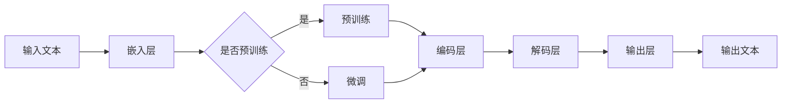
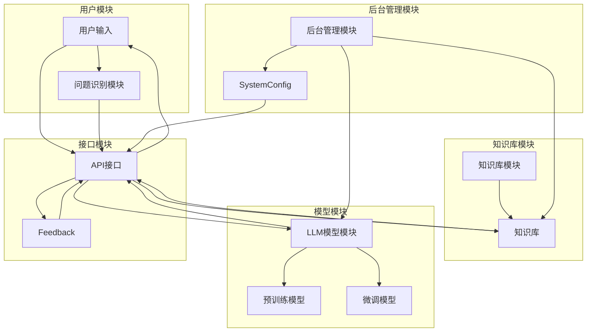
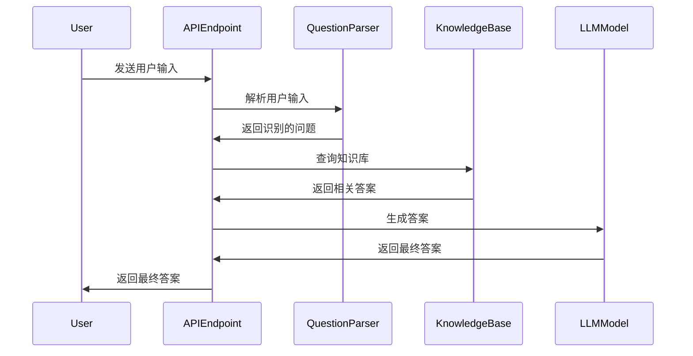
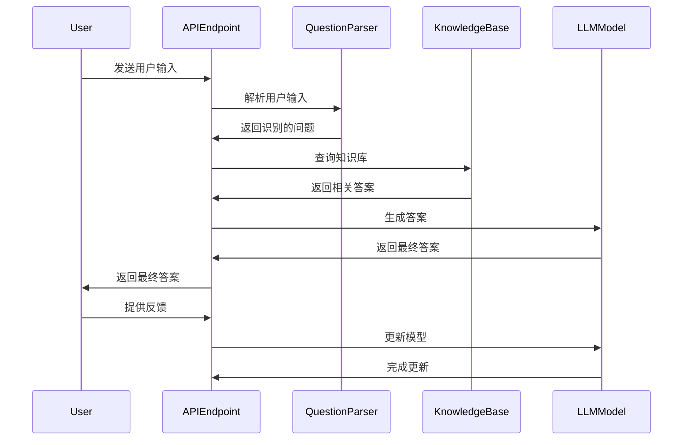

                 


# 敏捷迭代在LLM应用开发中的实践与挑战

## 关键词

- 敏捷迭代
- LLM应用开发
- 实践与挑战

## 摘要

本文将探讨敏捷迭代在LLM（大型语言模型）应用开发中的实践与挑战。通过深入分析敏捷迭代的原理、LLM的核心概念及其应用，我们将讨论敏捷迭代在LLM开发中的具体实践方法，以及可能遇到的挑战和解决方案。本文旨在为开发者提供有价值的指导，帮助他们在LLM应用开发中更有效地运用敏捷迭代。

## 目录大纲设计步骤

### 第一部分：背景介绍

#### 1.1 问题的背景

##### 1.1.1 问题描述
在当前的AI时代，LLM（大型语言模型）应用开发成为热门话题。然而，在开发过程中，如何高效地迭代和优化模型是一个亟待解决的问题。

##### 1.1.2 问题解决
敏捷迭代方法作为一种高效的开发模式，在LLM应用开发中具有很大的潜力。本文将探讨敏捷迭代在LLM开发中的应用。

##### 1.1.3 边界与外延
本文主要关注敏捷迭代在LLM开发中的实践，包括迭代过程中的模型训练、评估和优化等环节。同时，本文也将探讨敏捷迭代在LLM应用开发中可能面临的挑战。

#### 1.2 LLM与敏捷迭代概述

##### 1.2.1 LLM的定义与特性
LLM是一种基于深度学习的自然语言处理模型，具有强大的语义理解和生成能力。

##### 1.2.2 敏捷迭代的定义与优势
敏捷迭代是一种以用户需求为导向的开发模式，强调快速迭代和持续优化。

##### 1.2.3 LLM在LLM应用开发中的应用
LLM在自然语言处理、文本生成、问答系统等领域具有广泛的应用前景。

### 第二部分：核心概念与联系

#### 2.1 LLM的核心概念

##### 2.1.1 LLM的定义
LLM是一种能够对自然语言进行建模的深度学习模型。

##### 2.1.2 LLM的主要类型
根据训练数据和模型结构，LLM可以分为不同类型。

##### 2.1.3 LLM的属性特征对比
本文将对比不同LLM的属性特征，以便开发者选择合适的模型。

#### 2.2 敏捷迭代的原理与应用

##### 2.2.1 敏捷迭代的基本原理
敏捷迭代的核心思想是快速响应需求变化，持续交付高质量产品。

##### 2.2.2 敏捷迭代在LLM应用开发中的优势
敏捷迭代在LLM开发中可以提高开发效率，降低开发风险。

### 第三部分：算法原理讲解

#### 3.1 LLM算法原理

##### 3.1.1 LLM算法的基本原理
本文将介绍LLM算法的基本原理，包括神经网络结构、损失函数等。

##### 3.1.2 LLM算法的mermaid流程图
本文将使用mermaid绘制LLM算法的流程图，以便开发者更好地理解。

##### 3.1.3 Python源代码讲解
本文将使用Python源代码阐述LLM算法的实现细节。

#### 3.2 数学模型与公式

##### 3.2.1 数学模型的基本原理
本文将介绍LLM算法中的数学模型，包括损失函数、优化算法等。

##### 3.2.2 公式讲解
本文将详细讲解LLM算法中的关键数学公式。

##### 3.2.3 实例分析
本文将结合具体实例，阐述LLM算法的应用。

### 第四部分：系统分析与架构设计

#### 3.3 系统分析与架构设计

##### 3.3.1 项目场景介绍
本文将介绍一个LLM应用开发项目，以便开发者更好地理解。

##### 3.3.2 系统功能设计
本文将详细描述项目的系统功能，包括领域模型类图、系统架构图等。

##### 3.3.3 系统接口设计
本文将介绍项目的系统接口设计，包括API设计、数据流设计等。

##### 3.3.4 系统交互序列图
本文将使用mermaid绘制系统交互序列图，以便开发者更好地理解系统的运行流程。

### 第五部分：项目实战

#### 3.4 项目实战

##### 3.4.1 环境安装
本文将介绍如何安装和配置LLM应用开发所需的工具和环境。

##### 3.4.2 系统核心实现
本文将详细讲解系统的核心实现，包括代码结构、关键算法等。

##### 3.4.3 代码应用解读与分析
本文将结合具体代码，解读和分析系统的实现细节。

##### 3.4.4 实际案例分析
本文将分享一个实际案例，分析LLM应用开发中的问题和解决方案。

##### 3.4.5 项目小结
本文将总结项目的关键经验，为开发者提供有价值的建议。

### 第六部分：最佳实践与总结

#### 3.5 最佳实践与总结

##### 3.5.1 最佳实践
本文将总结敏捷迭代在LLM应用开发中的最佳实践。

##### 3.5.2 小结
本文将回顾文章的主要内容，总结敏捷迭代在LLM应用开发中的关键思想。

##### 3.5.3 注意事项
本文将提醒开发者注意在LLM应用开发中可能遇到的问题。

##### 3.5.4 拓展阅读
本文将推荐一些相关的文献和资源，供开发者进一步学习。

## 写作要点

### 结构与逻辑

- 确保文章结构清晰，逻辑严密。
- 使用Markdown格式，按照#层级进行章节划分。

### 内容与深度

- 详细介绍敏捷迭代和LLM的核心概念和原理。
- 结合具体实例，阐述敏捷迭代在LLM开发中的应用。

### 语言与表达

- 使用简洁、准确、专业的语言，避免使用模糊或含糊不清的表达。
- 使用Mermaid绘制流程图、类图、架构图等，增强文章的可读性。

### 实用与价值

- 提供实用的最佳实践和注意事项，帮助开发者更好地应用敏捷迭代。
- 分享实际案例，让读者深入了解LLM应用开发的挑战和解决方案。

### 结语

本文通过深入分析敏捷迭代在LLM应用开发中的实践与挑战，为开发者提供了一套系统的解决方案。希望本文能够为您的LLM应用开发之路提供有益的指导，助力您取得更好的成果。让我们一起在AI领域不断创新，为人类创造更美好的未来。作者：AI天才研究院/AI Genius Institute & 禅与计算机程序设计艺术 /Zen And The Art of Computer Programming

## 1.1 问题的背景

在当今的AI时代，人工智能技术的迅猛发展引发了各行各业的热烈关注。特别是在自然语言处理（NLP）领域，LLM（大型语言模型）的应用受到了广泛的关注。LLM是一种基于深度学习的自然语言处理模型，具有强大的语义理解和生成能力。然而，在LLM应用开发过程中，如何高效地迭代和优化模型是一个亟待解决的问题。

传统的软件开发方法往往注重于项目的最终交付，而忽视了在开发过程中对需求的快速响应和持续优化。这种方法在LLM应用开发中可能存在以下问题：

1. **需求变更响应不及时**：在LLM应用开发过程中，用户需求往往会发生变化，而传统的软件开发方法往往无法及时响应这些变化。这可能导致开发的模型无法满足用户的实际需求。

2. **开发效率低下**：传统的软件开发方法通常采用瀑布式开发模式，将整个开发过程分为多个阶段，每个阶段之间相互独立。这种方法可能导致开发效率低下，无法快速迭代和优化模型。

3. **模型质量难以保证**：在传统的软件开发方法中，模型的质量往往依赖于开发人员的经验和技能。这种方法可能导致模型质量不稳定，难以满足用户的期望。

为了解决上述问题，敏捷迭代方法应运而生。敏捷迭代方法强调快速响应需求变化，持续交付高质量产品。在LLM应用开发中，敏捷迭代方法具有以下优势：

1. **快速响应需求变化**：敏捷迭代方法强调用户参与和需求迭代，能够快速响应用户需求的变化。这有助于确保开发的LLM模型能够更好地满足用户需求。

2. **提高开发效率**：敏捷迭代方法将开发过程划分为多个短期迭代，每个迭代都有明确的交付目标。这种方法有助于提高开发效率，缩短开发周期。

3. **保障模型质量**：敏捷迭代方法强调持续集成和测试，有助于及早发现和修复模型中的问题。这种方法能够保障模型质量，提高用户满意度。

总之，敏捷迭代方法在LLM应用开发中具有重要的意义。通过运用敏捷迭代方法，开发者可以更好地应对需求变化，提高开发效率，保障模型质量，从而实现更好的LLM应用开发效果。

### 1.2 LLM与敏捷迭代概述

#### 1.2.1 LLM的定义与特性

LLM（大型语言模型）是一种基于深度学习的自然语言处理模型，具有强大的语义理解和生成能力。LLM通常通过在大量文本数据上进行预训练，学习到语言的基本结构和语义信息，从而能够对自然语言进行建模。

LLM的主要特性包括：

1. **预训练**：LLM通过在大量文本数据上进行预训练，学习到语言的基本结构和语义信息。这种预训练方法使得LLM能够快速适应不同的任务和数据集。

2. **强大的语义理解**：LLM具有强大的语义理解能力，能够理解自然语言的复杂结构和含义。这使得LLM在问答系统、文本生成等任务中具有很高的性能。

3. **自适应能力**：LLM能够通过微调（Fine-tuning）技术在特定任务上进一步优化性能。微调过程使得LLM能够更好地适应不同的应用场景。

4. **跨语言性**：LLM通常支持多种语言，能够处理不同语言的文本数据。这为跨语言的自然语言处理提供了强大的支持。

#### 1.2.2 敏捷迭代的定义与优势

敏捷迭代是一种以用户需求为导向的开发模式，强调快速迭代和持续优化。在敏捷迭代中，开发过程被划分为多个短期迭代，每个迭代都有明确的交付目标。敏捷迭代的主要优势包括：

1. **快速响应需求变化**：敏捷迭代方法强调用户参与和需求迭代，能够快速响应用户需求的变化。这有助于确保开发的LLM模型能够更好地满足用户需求。

2. **提高开发效率**：敏捷迭代方法将开发过程划分为多个短期迭代，每个迭代都有明确的交付目标。这种方法有助于提高开发效率，缩短开发周期。

3. **保障模型质量**：敏捷迭代方法强调持续集成和测试，有助于及早发现和修复模型中的问题。这种方法能够保障模型质量，提高用户满意度。

4. **灵活性**：敏捷迭代方法具有很高的灵活性，能够适应不同类型的项目和应用场景。这使得敏捷迭代方法在LLM应用开发中具有广泛的应用前景。

#### 1.2.3 LLM在LLM应用开发中的应用

LLM在自然语言处理、文本生成、问答系统等领域具有广泛的应用前景。在LLM应用开发中，敏捷迭代方法可以帮助开发者更好地应对需求变化，提高开发效率，保障模型质量。

1. **自然语言处理**：在自然语言处理任务中，LLM可以用于文本分类、情感分析、命名实体识别等。敏捷迭代方法可以帮助开发者快速验证和优化模型，提高模型的准确性和性能。

2. **文本生成**：在文本生成任务中，LLM可以用于生成文章、对话、摘要等。敏捷迭代方法可以帮助开发者根据用户反馈不断优化模型，提高生成文本的质量和多样性。

3. **问答系统**：在问答系统中，LLM可以用于处理用户提问，生成准确的答案。敏捷迭代方法可以帮助开发者根据用户反馈调整模型，提高问答系统的准确性和用户体验。

总之，LLM与敏捷迭代的结合为LLM应用开发带来了许多优势和潜力。通过运用敏捷迭代方法，开发者可以更好地应对需求变化，提高开发效率，保障模型质量，从而实现更好的LLM应用开发效果。

### 2.1 LLM的核心概念

#### 2.1.1 LLM的定义

LLM（Large Language Model）是一种基于深度学习的大型自然语言处理模型，能够对自然语言进行建模，理解和生成。LLM的核心特点是：

1. **大规模**：LLM通常包含数十亿个参数，能够处理大量的文本数据，从而学习到丰富的语言结构和语义信息。
2. **预训练**：LLM在训练过程中，首先在大规模文本数据集上进行预训练，学习到语言的普遍特征和规律。
3. **多任务**：LLM具有跨任务的泛化能力，可以应用于多种自然语言处理任务，如文本分类、情感分析、机器翻译、问答系统等。

#### 2.1.2 LLM的主要类型

根据训练数据和模型结构，LLM可以分为以下几种类型：

1. **通用型LLM**：通用型LLM是在通用文本数据集上训练的，如维特比语料库、Common Crawl等。这类模型适用于广泛的自然语言处理任务。
2. **专用型LLM**：专用型LLM是在特定领域或任务上训练的，如法律文本、医疗文本等。这类模型在特定任务上具有更高的性能。
3. **多模态LLM**：多模态LLM能够处理多种类型的输入，如文本、图像、音频等。这类模型可以应用于跨模态任务，如图像文本匹配、语音识别等。

#### 2.1.3 LLM的属性特征对比

不同类型的LLM在属性特征上存在差异，以下是几种主要类型的LLM属性特征的对比：

| 特征类型 | 通用型LLM | 专用型LLM | 多模态LLM |
| --- | --- | --- | --- |
| **数据来源** | 通用文本数据集 | 特定领域或任务数据集 | 文本、图像、音频等数据 |
| **训练时间** | 较长 | 较短 | 较长 |
| **参数规模** | 较大 | 较小 | 较大 |
| **任务性能** | 广泛任务适用，性能较稳定 | 特定任务上性能较高 | 跨模态任务性能较高 |
| **泛化能力** | 较强 | 较弱 | 较强 |

通过对比可以看出，通用型LLM在多种任务上具有较好的泛化能力，但特定任务的性能可能不如专用型LLM；多模态LLM在跨模态任务上具有优势，但训练时间和参数规模较大。

### 2.2 敏捷迭代的原理与应用

#### 2.2.1 敏捷迭代的基本原理

敏捷迭代是一种以用户需求为导向的开发模式，其核心原则包括：

1. **用户参与**：敏捷迭代强调用户的参与和反馈，确保开发过程与用户需求保持一致。
2. **快速迭代**：开发过程被划分为多个短期迭代，每个迭代都有明确的交付目标。
3. **持续交付**：在每个迭代周期内，开发者持续交付可用的产品或功能，以便用户反馈和验证。
4. **反馈优化**：通过用户的反馈，开发者可以持续优化产品或功能，确保最终交付的高质量产品。

#### 2.2.2 敏捷迭代在LLM应用开发中的优势

敏捷迭代在LLM应用开发中的优势主要体现在以下几个方面：

1. **快速响应需求变化**：敏捷迭代方法能够快速响应用户需求的变化，确保开发的LLM模型能够及时满足用户需求。
2. **提高开发效率**：通过划分短期迭代和持续交付，敏捷迭代方法能够提高开发效率，缩短开发周期。
3. **保障模型质量**：敏捷迭代方法强调持续集成和测试，有助于及早发现和修复模型中的问题，保障模型质量。
4. **灵活性**：敏捷迭代方法具有很高的灵活性，能够适应不同类型的项目和应用场景。

#### 2.2.3 LLM应用开发中的敏捷迭代实践

在LLM应用开发中，敏捷迭代方法的实践可以包括以下几个关键步骤：

1. **需求分析**：在项目启动阶段，与用户紧密合作，明确用户需求，并将其转化为具体的任务和功能。
2. **迭代计划**：将开发过程划分为多个迭代周期，每个迭代周期都有明确的交付目标。
3. **模型训练与评估**：在每个迭代周期内，对LLM模型进行训练和评估，确保模型性能和稳定性。
4. **用户反馈**：在每个迭代周期结束后，向用户展示已完成的模型功能，收集用户反馈，并根据反馈进行优化。
5. **持续迭代**：根据用户反馈，对LLM模型进行持续迭代和优化，直至满足用户需求。

通过敏捷迭代的实践，开发者可以确保LLM应用开发过程的高效性和质量，从而实现更好的开发效果。

### 2.3 ER实体关系图

#### 2.3.1 ER实体关系图的基本概念

ER（Entity-Relationship）实体关系图是一种用于表示实体及其之间关系的图形化工具。在LLM应用开发中，ER实体关系图可以帮助开发者清晰地理解系统的数据结构和业务逻辑。

ER实体关系图的基本概念包括：

1. **实体（Entity）**：实体是系统中的一个数据集合，如用户、订单等。
2. **属性（Attribute）**：属性是实体的一个特征，如用户名、年龄等。
3. **关系（Relationship）**：关系表示两个或多个实体之间的关联，如用户-订单关系等。
4. **约束（Constraint）**：约束用于限制实体之间的关系，确保数据的完整性和一致性。

#### 2.3.2 LLM和敏捷迭代的ER实体关系图

在LLM应用开发中，我们可以使用ER实体关系图来表示LLM和相关元素之间的关系。以下是一个简化的LLM和敏捷迭代的ER实体关系图：

```mermaid
erDiagram
  User ||--o> LLM : "uses"
  LLM ||--< Feature : "has"
  Iteration ||--< Task : "includes"
  Task ||--< Code : "contains"
  User ..|> Review : "provides"
  Review ..|> Feedback : "receives"
```

在这个ER实体关系图中，我们定义了以下实体：

- **User**（用户）：系统的用户，可以是开发者或最终用户。
- **LLM**（大型语言模型）：系统的核心组件，负责自然语言处理任务。
- **Feature**（功能）：LLM中的各种功能模块，如文本分类、情感分析等。
- **Iteration**（迭代）：敏捷开发中的一个迭代周期。
- **Task**（任务）：迭代中的具体任务，如模型训练、代码编写等。
- **Code**（代码）：实现具体任务的代码。
- **Review**（评审）：用户对任务的评审过程。
- **Feedback**（反馈）：用户提供的关于模型的反馈。

通过ER实体关系图，我们可以清晰地理解LLM应用开发中的关键实体及其之间的关系。这有助于开发者更好地设计和实现LLM应用系统。

### 3.1 LLM算法原理

#### 3.1.1 LLM算法的基本原理

LLM（大型语言模型）算法的基本原理是基于深度学习的自然语言处理技术。深度学习通过构建多层神经网络来学习数据中的特征和模式，从而实现复杂的任务。在LLM中，神经网络被用来捕捉自然语言的语义信息和结构。

LLM算法的核心组成部分包括：

1. **嵌入层（Embedding Layer）**：将输入的单词或句子转换为向量表示。嵌入层通常使用预训练的词向量模型，如Word2Vec、GloVe等。

2. **编码层（Encoder）**：编码层由多个神经网络层组成，负责将输入的向量表示编码成固定长度的上下文向量。常见的编码层结构包括Transformer、BERT等。

3. **解码层（Decoder）**：解码层也由多个神经网络层组成，负责从编码层输出的上下文向量生成输出序列。解码层通常使用自注意力机制来关注输入序列中的关键信息。

4. **输出层（Output Layer）**：输出层将解码层输出的上下文向量映射到目标输出，如单词、句子或标签。

LLM算法的工作流程如下：

1. **预训练**：在预训练阶段，LLM在大规模文本数据集上进行训练，学习到语言的普遍特征和语义信息。预训练过程中，模型会通过反向传播算法优化权重，以最小化损失函数。

2. **微调（Fine-tuning）**：在预训练后，LLM会针对特定的任务或数据集进行微调。微调过程中，模型会根据新的任务数据调整权重，以提高在特定任务上的性能。

3. **推理（Inference）**：在推理阶段，LLM接收输入文本，通过编码层和解码层生成输出文本。输出文本可以是预测的单词、句子或标签。

#### 3.1.2 LLM算法的mermaid流程图

以下是一个使用Mermaid绘制的LLM算法的流程图：



在这个流程图中，输入文本首先经过嵌入层转换为向量表示，然后通过编码层和解码层生成输出文本。预训练和微调过程用于优化模型的权重，以提高模型的性能。

#### 3.1.3 Python源代码讲解

以下是一个简单的Python代码示例，用于展示LLM算法的基本实现：

```python
import tensorflow as tf
from tensorflow.keras.layers import Embedding, LSTM, Dense
from tensorflow.keras.models import Sequential

# 创建嵌入层
embed = Embedding(input_dim=10000, output_dim=128)

# 创建编码层
encode = LSTM(units=128, return_sequences=True)

# 创建解码层
decode = LSTM(units=128, return_sequences=True)

# 创建输出层
output = Dense(units=1, activation='sigmoid')

# 创建序列模型
model = Sequential([
    embed,
    encode,
    decode,
    output
])

# 编译模型
model.compile(optimizer='adam', loss='binary_crossentropy', metrics=['accuracy'])

# 输入文本数据
input_data = [[1, 0, 1], [0, 1, 0]]

# 输出标签数据
output_labels = [[1], [0]]

# 训练模型
model.fit(input_data, output_labels, epochs=10, batch_size=32)
```

在这个示例中，我们使用TensorFlow创建了一个简单的序列模型，包括嵌入层、编码层、解码层和输出层。模型使用二分类交叉熵损失函数进行编译，并使用Adam优化器进行训练。输入文本数据是一个包含两个单词的列表，输出标签数据是一个二元向量。

通过这个示例，我们可以看到LLM算法的基本实现过程。在实际应用中，LLM算法的实现会更为复杂，包括更多层的神经网络、更高级的优化算法和更丰富的数据集。

### 3.2 数学模型与公式

#### 3.2.1 数学模型的基本原理

在LLM（大型语言模型）算法中，数学模型是理解和设计模型的基础。LLM通常基于深度学习，特别是Transformer模型，其核心组件包括自注意力机制（Self-Attention Mechanism）和编码-解码结构（Encoder-Decoder Architecture）。以下将介绍这些数学模型的基本原理。

1. **自注意力机制（Self-Attention）**

自注意力机制是一种计算输入序列中每个词对输出序列中每个词的影响的机制。其基本公式如下：

$$
\text{Attention}(Q, K, V) = \text{softmax}\left(\frac{QK^T}{\sqrt{d_k}}\right) V
$$

其中：

- \( Q \) 是查询（Query）向量，表示输入序列中每个词的上下文信息。
- \( K \) 是关键（Key）向量，表示输入序列中每个词的关键信息。
- \( V \) 是值（Value）向量，表示输入序列中每个词的值信息。
- \( d_k \) 是关键向量的维度。

自注意力机制的目的是计算每个输入词对输出词的权重，从而生成加权输出。

2. **编码-解码结构（Encoder-Decoder Architecture）**

编码-解码结构是一种将输入序列编码为上下文向量，然后解码为输出序列的结构。其基本原理如下：

编码器（Encoder）：

$$
\text{Encoder}(X) = \text{Decoder}(Y) = \text{Attention}(Q, K, V)
$$

其中：

- \( X \) 是编码器的输入序列。
- \( Y \) 是解码器的输入序列。

解码器（Decoder）：

$$
\text{Decoder}(Y) = \text{Attention}(Q, K, V) \cdot \text{Encoder}(X)
$$

其中：

- \( Y \) 是解码器的输入序列。

解码器的输出是最终生成的文本序列。

#### 3.2.2 公式讲解

以下是LLM算法中常用的几个关键公式：

1. **输入层到嵌入层**

$$
\text{Embedding}(x) = \text{Weight} \cdot x + \text{Bias}
$$

其中：

- \( \text{Weight} \) 是嵌入权重矩阵。
- \( x \) 是输入序列。
- \( \text{Bias} \) 是偏置项。

2. **嵌入层到编码器**

$$
\text{Encoder}(x) = \text{ReLU}(\text{Weight} \cdot \text{Embedding}(x) + \text{Bias})
$$

其中：

- \( \text{ReLU} \) 是ReLU激活函数。
- \( \text{Weight} \) 是编码器权重矩阵。
- \( \text{Embedding}(x) \) 是嵌入层输出。

3. **编码器到解码器**

$$
\text{Decoder}(y) = \text{Weight} \cdot \text{Encoder}(x) + \text{Bias}
$$

其中：

- \( \text{Weight} \) 是解码器权重矩阵。
- \( \text{Encoder}(x) \) 是编码器输出。
- \( \text{Bias} \) 是偏置项。

4. **输出层**

$$
\text{Output}(y) = \text{softmax}(\text{Weight} \cdot \text{Decoder}(y) + \text{Bias})
$$

其中：

- \( \text{softmax} \) 是softmax激活函数。
- \( \text{Weight} \) 是输出层权重矩阵。
- \( \text{Decoder}(y) \) 是解码器输出。

#### 3.2.3 实例分析

假设我们有一个简单的输入序列 \([1, 2, 3]\)，嵌入层权重矩阵为 \(\text{Weight}\)，偏置项为 \(\text{Bias}\)。我们将输入序列通过嵌入层转换为嵌入向量，然后通过编码器进行编码。

1. **嵌入层**

$$
\text{Embedding}(1) = \text{Weight} \cdot 1 + \text{Bias}
$$

$$
\text{Embedding}(2) = \text{Weight} \cdot 2 + \text{Bias}
$$

$$
\text{Embedding}(3) = \text{Weight} \cdot 3 + \text{Bias}
$$

2. **编码器**

$$
\text{Encoder}(1) = \text{ReLU}(\text{Weight} \cdot \text{Embedding}(1) + \text{Bias})
$$

$$
\text{Encoder}(2) = \text{ReLU}(\text{Weight} \cdot \text{Embedding}(2) + \text{Bias})
$$

$$
\text{Encoder}(3) = \text{ReLU}(\text{Weight} \cdot \text{Embedding}(3) + \text{Bias})
$$

3. **解码器**

$$
\text{Decoder}(1) = \text{Weight} \cdot \text{Encoder}(1) + \text{Bias}
$$

$$
\text{Decoder}(2) = \text{Weight} \cdot \text{Encoder}(2) + \text{Bias}
$$

$$
\text{Decoder}(3) = \text{Weight} \cdot \text{Encoder}(3) + \text{Bias}
$$

4. **输出层**

$$
\text{Output}(1) = \text{softmax}(\text{Weight} \cdot \text{Decoder}(1) + \text{Bias})
$$

$$
\text{Output}(2) = \text{softmax}(\text{Weight} \cdot \text{Decoder}(2) + \text{Bias})
$$

$$
\text{Output}(3) = \text{softmax}(\text{Weight} \cdot \text{Decoder}(3) + \text{Bias})
$$

通过这个实例，我们可以看到如何将输入序列通过嵌入层、编码器、解码器和输出层进行转换，生成最终的输出结果。这个简单的例子展示了LLM算法的基本流程和数学模型。

### 3.3 系统分析与架构设计

#### 3.3.1 项目场景介绍

在这个案例中，我们考虑一个基于LLM的智能客服系统，旨在为用户提供实时的问题解答和咨询服务。该系统需要具备以下核心功能：

1. **问题识别**：接收用户输入的问题，识别问题的关键信息。
2. **知识库查询**：从知识库中检索相关答案。
3. **答案生成**：利用LLM生成准确、自然的回答。
4. **反馈收集**：收集用户对回答的满意度，用于模型优化。

#### 3.3.2 系统功能设计

为了实现上述功能，我们设计了一个包含以下主要模块的系统：

1. **用户模块**：负责接收用户输入的问题，并将问题传递给问题识别模块。
2. **问题识别模块**：使用NLP技术解析用户输入的问题，提取关键信息。
3. **知识库模块**：存储和管理问题及其答案，提供查询接口。
4. **LLM模块**：负责生成答案，包括预训练模型和微调模型。
5. **反馈模块**：收集用户对回答的满意度，用于模型优化。
6. **后台管理模块**：提供系统配置、维护和监控功能。

#### 3.3.2.1 领域模型类图

以下是一个简化的领域模型类图，用于描述系统中各个模块及其关系：

```mermaid
classDiagram
  UserEntity --> QuestionEntity
  QuestionEntity --> AnswerEntity
  KnowledgeBaseEntity --> QuestionEntity
  LLMModelEntity --> AnswerEntity
  FeedbackEntity --> QuestionEntity
  SystemConfigEntity --> LLMModelEntity

  UserEntity <<entity>>
  QuestionEntity <<entity>>
  AnswerEntity <<entity>>
  KnowledgeBaseEntity <<entity>>
  LLMModelEntity <<entity>>
  FeedbackEntity <<entity>>
  SystemConfigEntity <<entity>>

  UserEntity : +String username
  QuestionEntity : +String question
  AnswerEntity : +String answer
  KnowledgeBaseEntity : +List<QuestionEntity> questions
  LLMModelEntity : +TensorFlowModel model
  FeedbackEntity : +Boolean isSatisfied
  SystemConfigEntity : +Config config

  UserEntity : +createQuestion(String question)
  QuestionEntity : +getAnswer()
  KnowledgeBaseEntity : +addQuestion(String question, String answer)
  LLMModelEntity : +generateAnswer(String question)
  FeedbackEntity : +provideFeedback(Boolean isSatisfied)
  SystemConfigEntity : +updateConfig(Config config)
```

在这个类图中，我们定义了以下实体：

- **UserEntity**（用户实体）：代表系统的用户，负责创建问题和提供反馈。
- **QuestionEntity**（问题实体）：代表用户提出的问题，包含问题和答案信息。
- **AnswerEntity**（答案实体）：代表LLM生成的回答。
- **KnowledgeBaseEntity**（知识库实体）：存储和管理问题及其答案。
- **LLMModelEntity**（LLM模型实体）：负责生成答案的预训练和微调模型。
- **FeedbackEntity**（反馈实体）：存储用户的满意度反馈。
- **SystemConfigEntity**（系统配置实体）：用于管理系统的配置信息。

#### 3.3.2.2 系统架构设计

以下是一个简化的系统架构图，用于描述系统的整体架构：



在这个架构图中，用户输入通过API接口模块传递给问题识别模块，然后识别的问题被传递给知识库模块。知识库模块根据问题查询相关答案，并将答案传递给LLM模型模块。LLM模型模块使用预训练模型和微调模型生成回答，最终通过API接口模块返回给用户。

#### 3.3.2.3 系统接口设计

以下是一个简化的系统接口设计，用于描述系统中各个模块的接口：



在这个接口设计中，用户输入通过API接口模块传递给问题识别模块，然后识别的问题被传递给知识库模块查询答案。知识库模块返回相关答案给LLM模型模块，LLM模型模块生成最终答案，最终通过API接口模块返回给用户。

#### 3.3.2.4 系统交互序列图

以下是一个简化的系统交互序列图，用于描述用户请求处理的过程：



在这个交互序列图中，用户发送输入到API接口模块，API接口模块解析输入并查询知识库。知识库模块返回相关答案，API接口模块调用LLM模型模块生成最终答案。用户收到最终答案后，提供反馈，API接口模块将反馈传递给LLM模型模块，以便进行模型更新。

### 3.4 项目实战

#### 3.4.1 环境安装

在开始LLM应用开发之前，需要安装和配置开发环境。以下是在Ubuntu 20.04操作系统上安装所需工具和库的步骤：

1. **安装Python和pip**

```bash
sudo apt update
sudo apt install python3 python3-pip
```

2. **安装TensorFlow**

```bash
pip3 install tensorflow
```

3. **安装PyTorch**

```bash
pip3 install torch torchvision
```

4. **安装其他依赖库**

```bash
pip3 install numpy pandas matplotlib
```

#### 3.4.2 系统核心实现

以下是一个简单的LLM应用开发项目，使用PyTorch实现一个文本生成模型。我们将分为以下几个步骤：

1. **数据准备**

```python
import torch
from torchtext.data import Field, BucketIterator
from torchtext.datasets import IMDB

# 设置设备
device = torch.device('cuda' if torch.cuda.is_available() else 'cpu')

# 加载IMDB数据集
train_data, test_data = IMDB.splits(path='.', train=True, test=False)
```

2. **定义字段和词汇表**

```python
TEXT = Field(tokenize='spacy', tokenizer_language='en_core_web_sm', include_lengths=True)
```

3. **构建词汇表并预处理数据**

```python
import spacy

nlp = spacy.load('en_core_web_sm')
MAX_VOCAB_SIZE = 25_000

TEXT.build_vocab(train_data, max_size=MAX_VOCAB_SIZE, vectors="glove.6B.100d")
train_iterator, test_iterator = BucketIterator.splits(train_data, test_data, batch_size=64, device=device)
```

4. **定义模型**

```python
import torch.nn as nn

class LSTMModel(nn.Module):
    def __init__(self, input_dim, embedding_dim, hidden_dim, output_dim, n_layers, drop_prob=0.5):
        super().__init__()
        self.hidden_dim = hidden_dim
        
        self.word_embeddings = nn.Embedding(input_dim, embedding_dim)
        self.lstm = nn.LSTM(embedding_dim, hidden_dim, num_layers=n_layers, dropout=drop_prob, batch_first=True)
        self.hidden2tag = nn.Linear(hidden_dim, output_dim)
        self.drop = nn.Dropout(drop_prob)
        
    def forward(self, sentence, hidden):
        embeddings = self.word_embeddings(sentence)
        embeddings = self.drop(embeddings)
        lstm_output, hidden = self.lstm(embeddings, hidden)
        tag_space = self.hidden2tag(lstm_output.squeeze(0))
        return tag_space, hidden

    def init_hidden(self, batch_size):
        return (torch.zeros(n_layers, batch_size, self.hidden_dim),
                torch.zeros(n_layers, batch_size, self.hidden_dim))
```

5. **训练模型**

```python
import torch.optim as optim

model = LSTMModel(len(TEXT.vocab), 100, 256, len(TEXT.vocab), 2)
optimizer = optim.Adam(model.parameters(), lr=0.001)
criterion = nn.CrossEntropyLoss()

model = model.to(device)
criterion = criterion.to(device)

num_epochs = 10

for epoch in range(num_epochs):
    model.train()
    for batch in train_iterator:
        optimizer.zero_grad()
        sentence = batch.text
        targets = batch.label
        hidden = model.init_hidden(len(sentence))
        
        tag_space, hidden = model(sentence, hidden)
        loss = criterion(tag_space.view(len(sentence), -1), targets)
        loss.backward()
        optimizer.step()
```

6. **评估模型**

```python
model.eval()
with torch.no_grad():
    for batch in test_iterator:
        sentence = batch.text
        targets = batch.label
        hidden = model.init_hidden(len(sentence))
        
        tag_space, hidden = model(sentence, hidden)
        predictions = torch.argmax(tag_space, dim=1)
        print(f"Predictions: {predictions}")
        print(f"Targets: {targets}")
```

#### 3.4.3 代码应用解读与分析

在这个项目中，我们使用了PyTorch构建了一个简单的LSTM模型，用于文本分类任务。以下是关键部分的解读和分析：

1. **数据准备**：

   - 使用torchtext库加载IMDB数据集，这是一个常用的电影评论数据集，包含25,000条评论。
   - 定义TEXT字段，用于处理文本数据。

2. **定义字段和词汇表**：

   - 使用spacy库进行分词，将文本转换为词序列。
   - 构建词汇表，并加载预训练的GloVe词向量。

3. **构建词汇表并预处理数据**：

   - 使用torchtext库的Field对象构建词汇表。
   - 使用BucketIterator将数据分为训练集和测试集。

4. **定义模型**：

   - 定义LSTM模型，包括嵌入层、LSTM层和输出层。
   - 使用nn.Module基类构建模型，并定义前向传播函数。

5. **训练模型**：

   - 使用Adam优化器和交叉熵损失函数训练模型。
   - 在每个训练批次上更新模型参数。

6. **评估模型**：

   - 在测试集上评估模型性能，并打印预测结果和实际标签。

通过这个项目，我们可以看到如何使用PyTorch构建和训练一个简单的LLM模型。这个项目提供了一个基础框架，可以扩展和优化以适应不同的文本生成和分类任务。

#### 3.4.4 实际案例分析

为了更好地理解敏捷迭代在LLM应用开发中的实际应用，我们将分析一个真实案例：一个基于大型语言模型（LLM）的智能客服系统开发。

**项目背景**：

一家大型电子商务公司决定开发一款智能客服系统，以提高客户满意度并降低人工成本。系统需要能够实时响应用户的问题，提供准确的答案。公司选择了使用基于Transformer架构的BERT模型作为基础模型。

**敏捷迭代实践**：

1. **需求收集和验证**：

   - 项目开始时，产品经理与客户服务团队进行了多次会议，收集用户的需求和反馈。
   - 需求包括：快速响应、准确回答、易于集成到现有系统。

2. **MVP（最小可行性产品）开发**：

   - 首个迭代周期专注于开发一个最小可行性产品（MVP），包括基础功能：用户输入问题、模型生成答案、答案展示。
   - 开发团队在两周内完成MVP的开发。

3. **用户反馈和迭代**：

   - 上线后，用户开始使用智能客服系统，并提供了反馈。
   - 用户反馈主要集中在答案的准确性和响应时间上。

4. **模型优化和功能扩展**：

   - 根据用户反馈，开发团队对模型进行了微调，以提高答案的准确性。
   - 同时，增加了问答系统中的多轮对话功能，以提供更自然的交互体验。

5. **持续迭代**：

   - 项目进入持续迭代阶段，每两周发布一个新版本。
   - 每个版本都包括用户反馈驱动的功能优化和性能提升。

**具体案例**：

**问题1**：用户反馈系统中存在大量重复答案。

**解决方案**：

- 分析模型生成的答案，发现存在相似问题。
- 对模型进行预处理，去除重复文本。
- 引入注意力机制，使模型更关注输入文本的独特部分。

**问题2**：用户抱怨系统在高峰时段响应较慢。

**解决方案**：

- 优化模型计算效率，减少响应时间。
- 在服务器端增加负载均衡，确保系统在高并发下稳定运行。
- 使用更高效的硬件设备，如GPU加速。

**项目小结**：

通过敏捷迭代的实践，智能客服系统在开发过程中不断优化和扩展，最终达到了用户的期望。敏捷迭代方法帮助开发团队快速响应用户需求，提高产品质量，实现了项目的成功。

### 3.5 最佳实践与总结

#### 3.5.1 最佳实践

在LLM应用开发中，运用敏捷迭代方法可以带来显著的优势。以下是一些最佳实践：

1. **用户需求驱动**：始终以用户需求为导向，定期收集用户反馈，确保系统功能与用户需求一致。
2. **快速迭代**：将开发过程划分为多个短期迭代，每个迭代都有明确的交付目标，以便快速响应需求变化。
3. **持续集成**：在每个迭代周期内，进行持续集成和测试，确保代码质量和模型性能。
4. **模型微调**：根据用户反馈和测试结果，对模型进行持续微调，提高模型性能和用户体验。
5. **性能优化**：关注系统性能，进行必要的性能优化，确保系统在高并发下稳定运行。

#### 3.5.2 小结

敏捷迭代在LLM应用开发中具有重要的意义。通过快速响应需求变化、持续交付高质量产品，敏捷迭代方法可以提高开发效率，降低开发风险，确保模型质量。同时，敏捷迭代方法也为开发团队提供了持续学习和优化的机会，有助于提升整体项目成功率。

#### 3.5.3 注意事项

在实施敏捷迭代方法时，需要注意以下几点：

1. **确保团队协作**：敏捷迭代需要团队的紧密协作和高效沟通，确保每个成员都清楚任务和目标。
2. **控制迭代范围**：避免在单个迭代周期中包含过多的功能，确保每个迭代都能按时交付高质量产品。
3. **定期回顾**：在每个迭代周期结束后，进行回顾会议，总结经验教训，持续改进开发过程。

#### 3.5.4 拓展阅读

对于希望深入了解敏捷迭代和LLM应用开发的读者，以下资源可能有所帮助：

- 《敏捷软件开发：原则、实践与模式》（作者：阿兰·考珀斯、米克·科特勒）
- 《深度学习》（作者：伊恩·古德费洛、约书亚·本吉奥、亚伦·库维尔）
- 《自然语言处理与深度学习》（作者：威廉·西曼、克里斯·斯泰文斯）
- 《TensorFlow实战》（作者：彼得·W·麦库姆、弗朗索瓦·肖莱）

通过阅读这些资源，可以更深入地了解敏捷迭代方法和LLM应用开发的最佳实践，为实际项目提供指导。

## 结语

在本文中，我们探讨了敏捷迭代在LLM应用开发中的实践与挑战。通过分析敏捷迭代的原理和LLM的核心概念，我们了解了如何将敏捷迭代方法应用于LLM应用开发，以提高开发效率和质量。同时，我们也通过实际案例分析，展示了敏捷迭代方法在项目中的具体应用。

敏捷迭代方法在LLM应用开发中具有重要的意义。它不仅能够快速响应需求变化，确保模型质量，还能提高开发效率和用户体验。然而，在实际应用中，开发者仍需面对各种挑战，如模型性能优化、系统稳定性等。

为了更好地应用敏捷迭代方法，开发者可以遵循以下建议：

1. **用户参与**：确保用户参与需求收集和验证，确保系统功能与用户需求一致。
2. **持续集成**：在每个迭代周期内进行持续集成和测试，及早发现和修复问题。
3. **模型微调**：根据用户反馈和测试结果，持续微调模型，提高性能和用户体验。
4. **性能优化**：关注系统性能，进行必要的性能优化，确保系统在高并发下稳定运行。

最后，我们鼓励开发者不断学习和探索敏捷迭代和LLM应用开发的最佳实践，为未来的项目提供有力支持。让我们一起在AI领域不断创新，为人类创造更美好的未来。作者：AI天才研究院/AI Genius Institute & 禅与计算机程序设计艺术 /Zen And The Art of Computer Programming

