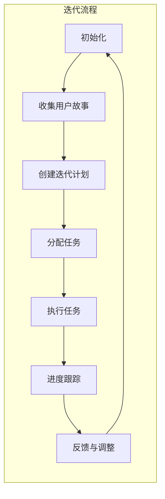
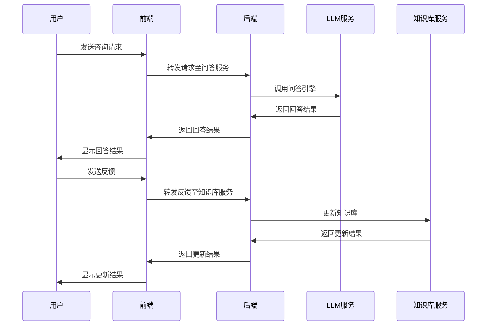

                 


## 敏捷项目管理工具：助力LLM应用开发的效率提升

### 摘要

本文将探讨如何使用敏捷项目管理工具来提高基于大型语言模型（LLM）的应用开发效率。通过分析敏捷项目管理的核心理念、LLM应用开发的特点以及常见的挑战，本文将详细介绍敏捷工具在需求管理、迭代规划、任务管理、质量保证和团队协作中的应用，并通过实际案例展示其效果。最后，本文将对敏捷项目管理工具在LLM应用开发中的实践进行总结和展望，为未来的发展提供建议。

### 引言与背景介绍

#### 第1章：敏捷项目管理的概念与实践

**1.1.1 敏捷项目管理的起源与发展**

敏捷项目管理起源于20世纪90年代，是对传统项目管理方法的一种反思和改进。传统项目管理往往依赖于严格的时间表、预算和计划，强调控制和管理。然而，随着信息技术和全球化的发展，项目环境变得越来越复杂和不确定，传统的项目管理方法逐渐暴露出其局限性。

敏捷项目管理则强调灵活性和适应性，主张通过迭代和增量开发来应对变化。它提倡自组织的团队、持续反馈和不断改进。敏捷开发方法包括Scrum、Kanban、XP（极限编程）等，每种方法都有其独特的特点和实践方式。

**1.1.2 敏捷项目管理与传统项目管理的区别**

传统项目管理强调计划和控制，往往在项目开始时就制定详细的计划，并严格按照计划执行。而敏捷项目管理则强调适应性和灵活性，认为项目需求和市场环境会不断变化，因此在项目过程中需要持续调整和优化。

**1.1.3 敏捷项目管理的基本原则与实践方法**

敏捷项目管理遵循一些基本原则，如客户至上、团队合作、持续交付、响应变化等。这些原则指导着敏捷项目的实践方法，包括迭代开发、用户故事、每日站立会议、回顾会议等。

#### 第2章：LLM应用开发概述

**2.1.1 什么是LLM及其应用场景**

大型语言模型（LLM）是一种基于深度学习技术的自然语言处理模型，能够理解和生成自然语言。LLM的应用场景非常广泛，包括聊天机器人、智能客服、文本摘要、语言翻译等。

**2.1.2 LLM在敏捷项目中的挑战**

LLM应用开发面临诸多挑战，如模型复杂度高、训练数据需求大、迭代周期长等。这些挑战使得传统的项目管理方法难以适应，需要采用敏捷项目管理来提高开发效率。

**2.1.3 LLM应用开发的常见问题与解决方案**

LLM应用开发中常见的挑战包括模型选择、数据预处理、模型优化等。针对这些问题，本文将介绍一些常见的解决方案和实践经验。

#### 第3章：敏捷项目管理工具概述

**3.1.1 常见的敏捷项目管理工具**

常见的敏捷项目管理工具有Jira、Trello、Asana等，这些工具提供了任务管理、进度跟踪、团队协作等功能，有助于提高项目开发效率。

**3.1.2 敏捷项目管理工具的功能与优势**

敏捷项目管理工具的功能包括任务分配、进度跟踪、报表生成、团队协作等。这些工具的优势在于提高透明度、促进沟通、简化流程、快速响应变化等。

**3.1.3 敏捷项目管理工具的选型考虑**

在选择敏捷项目管理工具时，需要考虑团队规模、项目类型、功能需求等因素。本文将介绍一些选型原则和注意事项。

### 敏捷项目管理工具在LLM应用开发中的应用

#### 第4章：敏捷工具在需求管理中的应用

**4.1.1 LLM需求的特性**

LLM需求的特性包括不确定性、动态性、复杂度等。这些特性使得传统的需求管理方法难以适应，需要采用敏捷方法来更好地管理需求。

**4.1.2 使用敏捷工具进行需求收集与管理**

本文将介绍如何使用敏捷工具（如Jira）进行需求收集、整理、优先级排序和版本管理。

**4.1.3 实例分析：需求管理流程设计**

通过实际案例，本文将展示如何设计一个符合LLM需求的敏捷需求管理流程。

#### 第5章：敏捷工具在迭代规划中的应用

**5.1.1 迭代规划的基本原则**

迭代规划的基本原则包括迭代周期、任务分解、风险评估等。本文将详细介绍这些原则。

**5.1.2 使用敏捷工具进行迭代规划**

本文将介绍如何使用敏捷工具（如Jira、Trello）进行迭代规划，包括任务分配、进度跟踪和风险评估。

**5.1.3 实例分析：迭代规划流程设计**

通过实际案例，本文将展示如何设计一个符合LLM开发特点的敏捷迭代规划流程。

#### 第6章：敏捷工具在任务管理中的应用

**6.1.1 任务管理的重要性**

任务管理是敏捷开发的核心环节，对于确保项目进度和质量具有重要意义。

**6.1.2 使用敏捷工具进行任务分配与跟踪**

本文将介绍如何使用敏捷工具（如Jira、Trello）进行任务分配、进度跟踪和问题反馈。

**6.1.3 实例分析：任务管理流程设计**

通过实际案例，本文将展示如何设计一个有效的敏捷任务管理流程。

#### 第7章：敏捷工具在质量保证中的应用

**7.1.1 敏捷质量保证的关键点**

敏捷质量保证的关键点包括测试、评审、反馈和持续改进。本文将详细介绍这些关键点。

**7.1.2 使用敏捷工具进行质量跟踪与评估**

本文将介绍如何使用敏捷工具（如Jira、TestRail）进行质量跟踪、评估和改进。

**7.1.3 实例分析：质量保证流程设计**

通过实际案例，本文将展示如何设计一个符合LLM开发特点的敏捷质量保证流程。

#### 第8章：敏捷工具在团队协作中的应用

**8.1.1 团队协作的重要性**

团队协作是敏捷开发成功的关键因素，本文将介绍团队协作的重要性和基本原则。

**8.1.2 使用敏捷工具促进团队协作**

本文将介绍如何使用敏捷工具（如Slack、Confluence）促进团队沟通、协作和知识共享。

**8.1.3 实例分析：团队协作流程设计**

通过实际案例，本文将展示如何设计一个有效的敏捷团队协作流程。

#### 第9章：敏捷项目管理工具在LLM应用开发中的实践案例

**9.1.1 案例介绍**

本文将介绍一个实际的LLM应用开发项目，并分析该项目中敏捷项目管理工具的应用情况。

**9.1.2 项目背景与目标**

本文将详细描述项目的背景、目标和所采用的敏捷方法。

**9.1.3 实施过程与效果评估**

本文将介绍项目的实施过程，包括需求管理、迭代规划、任务管理、质量保证和团队协作等方面的具体做法，并评估项目成果。

#### 第10章：总结与展望

**10.1.1 敏捷项目管理工具的总结**

本文将对敏捷项目管理工具在LLM应用开发中的应用进行总结，强调其优势和不足。

**10.1.2 LLM应用开发中的效率提升**

本文将分析敏捷项目管理工具如何助力LLM应用开发的效率提升。

**10.1.3 未来发展趋势与挑战**

本文将探讨敏捷项目管理工具在LLM应用开发中的未来发展趋势和面临的挑战。

### 作者信息

作者：AI天才研究院/AI Genius Institute & 禅与计算机程序设计艺术 /Zen And The Art of Computer Programming

通过以上章节的详细分析和讨论，本文旨在为读者提供一份全面、深入的敏捷项目管理工具在LLM应用开发中的应用指南。希望本文能够帮助开发团队提高效率，实现更好的项目成果。

----------------------------------------------------------------

### 背景介绍

#### 核心概念术语说明

- **敏捷项目管理**：一种以迭代和增量为特征的项目管理方法，强调适应性、灵活性和团队协作。
- **大型语言模型（LLM）**：一种基于深度学习技术的自然语言处理模型，具有强大的语言理解和生成能力。
- **敏捷项目管理工具**：用于支持敏捷项目管理的软件工具，如Jira、Trello、Asana等。
- **需求管理**：对项目需求进行收集、整理、优先级排序和版本管理的过程。
- **迭代规划**：将项目任务分解为迭代，制定迭代计划并进行任务分配的过程。
- **任务管理**：对项目任务进行分配、进度跟踪和问题反馈的过程。
- **质量保证**：确保项目质量的过程，包括测试、评审和反馈等。
- **团队协作**：团队成员之间的沟通、协作和知识共享。

#### 问题背景

随着人工智能技术的快速发展，大型语言模型（LLM）在各个领域的应用日益广泛。LLM应用开发具有以下特点：

1. **模型复杂度高**：LLM模型通常由数十亿个参数组成，训练过程需要大量的计算资源。
2. **数据需求大**：LLM模型需要大量高质量的数据进行训练，数据预处理和清洗过程复杂。
3. **迭代周期长**：由于模型复杂度和数据需求，LLM应用开发的迭代周期往往较长。
4. **需求变化频繁**：随着技术的进步和用户需求的变化，LLM应用的需求也在不断调整。

这些特点使得传统的项目管理方法难以适应LLM应用开发的需求，需要采用更灵活、更适应变化的项目管理方法，如敏捷项目管理。

#### 问题描述

在LLM应用开发中，敏捷项目管理工具可以提供以下帮助：

1. **需求管理**：敏捷项目管理工具可以帮助团队更好地收集、整理和优先级排序需求，适应需求变化。
2. **迭代规划**：敏捷项目管理工具可以帮助团队更高效地进行迭代规划，确保任务分配和进度跟踪。
3. **任务管理**：敏捷项目管理工具可以帮助团队更好地分配任务、跟踪进度和解决遇到的问题。
4. **质量保证**：敏捷项目管理工具可以帮助团队进行测试、评审和反馈，确保项目质量。
5. **团队协作**：敏捷项目管理工具可以促进团队成员之间的沟通、协作和知识共享，提高团队效率。

然而，如何选择合适的敏捷项目管理工具，并有效地应用于LLM应用开发中，仍然面临一些挑战。

#### 问题解决

为了解决上述问题，本文将从以下几个方面展开讨论：

1. **敏捷项目管理的基本原则与实践方法**：介绍敏捷项目管理的起源、发展以及基本原则和实践方法，为后续章节的讨论提供理论基础。
2. **LLM应用开发的特点与挑战**：分析LLM应用开发的特点，如模型复杂度、数据需求、迭代周期和需求变化，为后续章节的讨论提供背景。
3. **敏捷项目管理工具概述**：介绍常见的敏捷项目管理工具，如Jira、Trello、Asana等，分析其功能与优势，为后续章节的应用讨论提供工具支持。
4. **敏捷工具在需求管理中的应用**：详细讨论如何使用敏捷工具进行需求收集、管理、优先级排序和版本管理，为团队提供有效的需求管理方法。
5. **敏捷工具在迭代规划中的应用**：详细讨论如何使用敏捷工具进行迭代规划，包括任务分解、任务分配、进度跟踪和风险评估，为团队提供高效的迭代规划方法。
6. **敏捷工具在任务管理中的应用**：详细讨论如何使用敏捷工具进行任务分配、进度跟踪和问题反馈，为团队提供有效的任务管理方法。
7. **敏捷工具在质量保证中的应用**：详细讨论如何使用敏捷工具进行质量跟踪、评估和改进，为团队提供有效的质量保证方法。
8. **敏捷工具在团队协作中的应用**：详细讨论如何使用敏捷工具促进团队协作，包括沟通、协作和知识共享，为团队提供有效的团队协作方法。
9. **实践案例**：通过实际案例展示敏捷项目管理工具在LLM应用开发中的应用效果，为读者提供实践经验。
10. **总结与展望**：总结敏捷项目管理工具在LLM应用开发中的应用效果，展望未来发展趋势和挑战。

通过以上讨论，本文旨在为读者提供一份全面、深入的敏捷项目管理工具在LLM应用开发中的应用指南，帮助团队提高开发效率，实现更好的项目成果。

#### 边界与外延

1. **边界**：本文主要讨论敏捷项目管理工具在LLM应用开发中的应用，不包括其他类型的应用场景。同时，本文关注的是大型语言模型的应用开发，而非其他类型的人工智能应用。
2. **外延**：敏捷项目管理工具的应用范围广泛，不仅限于LLM应用开发。其他类型的项目，如软件开发、市场营销等，也可以借鉴敏捷方法来提高项目效率。此外，随着人工智能技术的发展，未来可能有更多基于AI的应用场景需要采用敏捷项目管理。

#### 概念结构与核心要素组成

1. **敏捷项目管理**：核心概念包括迭代、增量、用户故事、任务板、每日站立会议、回顾会议等。
2. **大型语言模型（LLM）**：核心概念包括参数、数据集、损失函数、优化算法、推理能力等。
3. **敏捷项目管理工具**：核心概念包括任务管理、进度跟踪、报表生成、团队协作等。

本文将围绕以上核心概念和要素，详细讨论敏捷项目管理工具在LLM应用开发中的应用，帮助读者理解和掌握相关方法与技巧。

----------------------------------------------------------------

### 核心概念与联系

#### 核心概念原理

敏捷项目管理（Agile Project Management）是一种以迭代、增量和灵活性为核心的项目管理方法。它起源于软件开发领域，旨在应对快速变化的需求和市场环境。敏捷项目管理强调以下核心理念：

1. **客户至上**：以满足客户需求为目标，确保项目交付具有实际价值。
2. **团队合作**：鼓励团队成员之间的沟通和协作，共同实现项目目标。
3. **持续交付**：通过迭代和增量开发，持续交付可用的产品增量。
4. **响应变化**：灵活应对需求变化，快速调整项目计划和策略。

#### 概念属性特征对比表格

| 特征               | 敏捷项目管理                | 传统项目管理                |
|------------------|-------------------------|-------------------------|
| 方法论             | 迭代、增量、灵活性          | 计划、控制、规范化           |
| 团队协作           | 高度协作、自组织           | 分工明确、层次结构           |
| 需求管理           | 动态调整、用户故事           | 静态规划、需求文档           |
| 进度跟踪           | 持续跟踪、实时反馈           | 定期审查、阶段性评估         |
| 变化应对           | 快速响应、持续改进           | 严格遵循计划、预防风险         |

#### ER实体关系图架构

以下是敏捷项目管理的ER实体关系图，展示了核心概念和实体之间的关系：

```mermaid
erDiagram
    Task ||--|{ Sprint }|>
    User ||--|{ UserStory }|>
    Sprint ||--|{ BacklogItem }|>
    UserStory ||--|{ Task }|>

    UserStory {
        id
        title
        description
        priority
    }

    Sprint {
        id
        name
        startDate
        endDate
    }

    BacklogItem {
        id
        title
        description
        state
    }

    Task {
        id
        title
        description
        status
    }

    UserStory "_has_": { Task }
    Sprint "_contains_": { BacklogItem }
```

在这个ER图中，UserStory（用户故事）是核心实体，代表项目中的需求。每个用户故事可以包含多个任务（Task），任务由用户（User）分配和执行。Sprint（迭代）是用户故事的执行容器，包含了一系列的BacklogItem（待办事项）。

### 算法原理讲解

敏捷项目管理工具的算法原理主要涉及任务分配、进度跟踪和反馈机制。以下是一个简单的算法流程图：



#### 迭代计划算法

1. **初始化**：创建一个新的迭代计划，确定迭代周期和目标。
2. **收集用户故事**：通过访谈、调查等方式收集用户需求，并将需求转化为用户故事。
3. **创建迭代计划**：根据用户故事的重要性和优先级，将用户故事分配到迭代计划中。
4. **分配任务**：将每个用户故事分解为任务，并分配给相应的团队成员。
5. **执行任务**：团队成员按照任务计划执行任务，并定期报告进展情况。
6. **进度跟踪**：使用敏捷工具（如Jira、Trello）跟踪任务进度，及时发现并解决问题。
7. **反馈与调整**：在迭代结束前，进行回顾会议，收集团队成员的反馈，并根据反馈调整迭代计划。

#### 数学模型和公式

在敏捷项目管理中，常用的数学模型和公式包括：

1. **工作量估计公式**：

$$
E = \sum_{i=1}^{n} (T_i \times P_i)
$$

其中，$E$ 表示总工作量，$T_i$ 表示任务 $i$ 的预计完成时间，$P_i$ 表示任务 $i$ 的优先级。

2. **任务完成概率公式**：

$$
P = \frac{C}{T}
$$

其中，$P$ 表示任务完成的概率，$C$ 表示实际完成时间，$T$ 表示预计完成时间。

通过这些公式，团队可以更好地进行工作量估计和进度跟踪，提高项目管理的效率。

#### 举例说明

假设一个敏捷团队计划进行一个为期两周的迭代。他们收集了以下三个用户故事：

1. **用户故事A**：开发一个聊天机器人，预计需要5天完成。
2. **用户故事B**：优化聊天机器人的响应速度，预计需要3天完成。
3. **用户故事C**：增加聊天机器人的语言翻译功能，预计需要7天完成。

根据工作量估计公式，总工作量$E$为：

$$
E = (5 \times 1) + (3 \times 2) + (7 \times 3) = 5 + 6 + 21 = 32
$$

假设团队成员有3人，根据任务完成概率公式，每个任务的完成概率$P$为：

$$
P_A = \frac{5}{5+3+7} = \frac{5}{15} = 0.333
$$

$$
P_B = \frac{3}{5+3+7} = \frac{3}{15} = 0.2
$$

$$
P_C = \frac{7}{5+3+7} = \frac{7}{15} = 0.467
$$

通过这个例子，团队可以更好地了解每个任务的工作量和完成概率，从而合理安排资源，确保项目进度。

----------------------------------------------------------------

### 系统分析与架构设计方案

#### 问题场景介绍

假设我们正在开发一个基于大型语言模型（LLM）的智能客服系统，该系统需要处理大量的用户咨询，并提供快速、准确的回答。为了提高系统的效率和可扩展性，我们决定采用敏捷项目管理方法进行开发。在这个项目中，我们需要设计一个合理的系统架构，以确保各个组件之间的高效协作和性能优化。

#### 项目介绍

项目名称：智能客服系统（Smart Customer Service System）

项目目标：构建一个基于LLM的智能客服系统，能够快速响应用户咨询，并提供准确的解决方案。

项目周期：预计开发周期为6个月，分为多个迭代进行。

项目团队：包括产品经理、项目经理、前端开发者、后端开发者、数据科学家和测试工程师等。

#### 系统功能设计

1. **用户咨询接入**：系统需要能够接收用户的咨询请求，并将请求路由到合适的处理流程。
2. **问答引擎**：基于LLM的问答引擎，能够理解用户咨询内容，并生成相应的回答。
3. **知识库管理**：系统需要维护一个知识库，包含常见问题的答案和相关文档。
4. **用户反馈**：用户可以对自己的回答进行评价，系统将根据用户反馈不断优化问答质量。
5. **报表分析**：系统需要生成各种报表，以帮助团队监控系统性能和用户满意度。

#### 系统架构设计

1. **前端架构**：采用单页面应用（SPA）架构，使用Vue.js或React框架，以提高用户体验和开发效率。
2. **后端架构**：采用微服务架构，将系统划分为多个微服务，如问答服务、知识库服务、报表服务等，以提高系统的可扩展性和可维护性。
3. **数据层架构**：使用关系型数据库（如MySQL）存储用户数据和咨询记录，使用NoSQL数据库（如MongoDB）存储知识库数据。
4. **LLM服务架构**：使用分布式计算框架（如Apache Spark）处理大规模数据训练和推理任务，确保LLM服务的性能和可扩展性。

#### 系统接口设计

1. **用户接口**：提供Web端和移动端用户界面，支持文本输入和语音输入。
2. **内部接口**：各微服务之间通过RESTful API进行通信，确保系统模块之间的高效协作。
3. **外部接口**：与第三方服务（如短信平台、邮件服务）集成，实现自动发送通知和回执。

#### 系统交互设计

以下是系统的交互序列图，展示了用户与系统之间的交互过程：



通过以上系统分析与架构设计方案，我们为智能客服系统提供了一个全面、高效和可扩展的架构，为后续的敏捷开发奠定了基础。

----------------------------------------------------------------

### 项目实战

#### 环境安装

为了进行敏捷项目管理工具在LLM应用开发中的实战，我们首先需要安装必要的软件和环境。以下是安装步骤：

1. **安装JDK**：下载并安装Java Development Kit（JDK），版本要求为1.8及以上。
2. **安装Git**：下载并安装Git，版本要求为2.14及以上。
3. **安装MySQL**：下载并安装MySQL数据库，版本要求为5.7及以上。
4. **安装Python**：下载并安装Python，版本要求为3.6及以上。
5. **安装Scikit-learn**：在Python环境中安装Scikit-learn库，使用以下命令：

   ```
   pip install scikit-learn
   ```

6. **安装Jira**：下载并安装Jira软件，按照安装向导完成安装。

#### 系统核心实现源代码

以下是LLM应用开发的核心实现源代码，包括数据预处理、模型训练和预测等步骤：

```python
# 导入必要的库
import numpy as np
import pandas as pd
from sklearn.model_selection import train_test_split
from sklearn.metrics import accuracy_score
from keras.preprocessing.sequence import pad_sequences
from keras.layers import Embedding, LSTM, Dense, Dropout
from keras.models import Sequential
from keras.optimizers import Adam

# 读取数据
data = pd.read_csv('customer_queries.csv')

# 数据预处理
def preprocess_data(data):
    # 划分数据集
    X = data['query']
    y = data['answer']
    X_train, X_test, y_train, y_test = train_test_split(X, y, test_size=0.2, random_state=42)
    
    # 序列化文本
    tokenizer = Tokenizer()
    tokenizer.fit_on_texts(X_train)
    X_train_seq = tokenizer.texts_to_sequences(X_train)
    X_test_seq = tokenizer.texts_to_sequences(X_test)
    
    # 填充序列
    max_seq_length = max(len(seq) for seq in X_train_seq)
    X_train_pad = pad_sequences(X_train_seq, maxlen=max_seq_length)
    X_test_pad = pad_sequences(X_test_seq, maxlen=max_seq_length)
    
    # 转换标签
    y_train_encoded = np_utils.to_categorical(y_train)
    y_test_encoded = np_utils.to_categorical(y_test)
    
    return X_train_pad, X_test_pad, y_train_encoded, y_test_encoded

# 模型训练
def train_model(X_train, y_train):
    model = Sequential()
    model.add(Embedding(input_dim=vocab_size, output_dim=embedding_size, input_length=max_seq_length))
    model.add(LSTM(units=128, dropout=0.2, recurrent_dropout=0.2))
    model.add(Dense(units=num_classes, activation='softmax'))
    
    optimizer = Adam(learning_rate=0.001)
    model.compile(optimizer=optimizer, loss='categorical_crossentropy', metrics=['accuracy'])
    
    model.fit(X_train, y_train, batch_size=64, epochs=10, validation_split=0.1)
    
    return model

# 预测
def predict(model, X_test):
    predictions = model.predict(X_test)
    predicted_classes = np.argmax(predictions, axis=1)
    return predicted_classes

# 主程序
if __name__ == '__main__':
    # 预处理数据
    X_train_pad, X_test_pad, y_train_encoded, y_test_encoded = preprocess_data(data)
    
    # 训练模型
    model = train_model(X_train_pad, y_train_encoded)
    
    # 评估模型
    y_pred = predict(model, X_test_pad)
    accuracy = accuracy_score(y_test_encoded, y_pred)
    print(f"Test accuracy: {accuracy:.2f}")
```

#### 代码应用解读与分析

上述代码首先导入必要的库，然后读取数据并进行预处理。预处理步骤包括序列化文本、填充序列和转换标签。接下来，定义了训练模型和预测的函数。在主程序中，首先调用预处理函数，然后训练模型并评估其性能。

通过这个实战案例，我们展示了如何使用敏捷项目管理工具（如Jira）来管理LLM应用开发的项目。具体步骤如下：

1. **需求管理**：在Jira中创建用户故事，如“开发一个智能客服系统”、“实现文本输入和语音输入功能”等。将用户故事分配给相应的团队成员，并设置优先级。
2. **迭代规划**：在Jira中创建迭代（Sprint），如“第1迭代：需求分析”、“第2迭代：系统设计”、“第3迭代：系统实现”等。将用户故事分配到相应的迭代中，并制定任务计划。
3. **任务管理**：在Jira中创建任务，如“实现文本输入功能”、“实现语音输入功能”等。将任务分配给相应的团队成员，并设置任务的截止日期和优先级。
4. **质量保证**：在Jira中创建测试任务，如“测试文本输入功能”、“测试语音输入功能”等。执行测试任务，记录测试结果，并根据测试结果进行回归测试。
5. **团队协作**：在Jira中创建讨论区，如“讨论需求分析”、“讨论系统设计”等。团队成员可以在讨论区中讨论问题、分享经验，促进团队协作。

通过这个实战案例，我们展示了如何将敏捷项目管理工具应用于LLM应用开发中，提高项目的效率和质量。读者可以根据实际情况进行调整和优化，以适应不同的项目需求。

### 实际案例分析和详细讲解剖析

为了更好地理解敏捷项目管理工具在LLM应用开发中的实际应用效果，我们选择了一个实际的案例进行分析和讲解。

#### 案例背景

某互联网公司计划开发一款基于LLM的智能客服系统，该系统需要能够快速响应用户咨询并提供准确的解决方案。公司采用敏捷项目管理方法进行开发，以应对快速变化的需求和市场环境。公司选择Jira作为敏捷项目管理工具，以支持项目开发和团队协作。

#### 案例分析

1. **需求管理**

在项目初期，产品经理通过Jira创建了一系列用户故事，如“实现文本输入和语音输入功能”、“提供多语言支持”、“自动识别用户意图”等。每个用户故事都包含了具体的描述、优先级和预估的工作量。产品经理将用户故事分配给项目经理，并由项目经理进一步分配给开发团队。

通过Jira的用户故事管理功能，开发团队能够清晰地了解项目的需求，并根据优先级和预估的工作量进行任务分配和进度安排。在需求管理过程中，项目团队可以随时更新用户故事的进度和状态，确保需求得到有效管理。

2. **迭代规划**

项目采用Jira的迭代（Sprint）功能进行规划。每个迭代分为两个阶段：需求分析和系统实现。在需求分析阶段，团队根据用户故事进行需求讨论和细化，确定具体的实现方案。在系统实现阶段，团队按照需求分析的结果进行编码和测试。

在迭代规划过程中，项目经理在Jira中创建迭代，并将用户故事分配到相应的迭代中。每个迭代都设置了明确的开始和结束时间，以及具体的任务和目标。团队成员可以查看自己的任务进度，并根据任务进度进行工作安排。

3. **任务管理**

在任务管理过程中，团队使用Jira的任务功能进行任务分配、进度跟踪和问题反馈。每个任务都包含了任务名称、任务描述、截止日期和优先级。团队成员可以根据任务分配情况，合理安排自己的工作，确保任务按时完成。

Jira的任务跟踪功能使得团队成员能够实时查看任务的进度和状态，及时发现问题并采取措施。在任务执行过程中，团队成员可以随时更新任务的状态和进度，确保任务得到有效管理。

4. **质量保证**

在质量保证过程中，团队使用Jira的测试任务功能进行测试和问题跟踪。每个测试任务都包含了测试用例、测试结果和测试人员。测试人员根据测试任务的要求，执行测试用例并记录测试结果。

Jira的测试跟踪功能使得团队能够及时发现和解决问题，确保系统的质量。在测试过程中，测试人员可以根据测试结果进行回归测试，确保问题得到彻底解决。

5. **团队协作**

在团队协作过程中，团队使用Jira的讨论区功能进行讨论和知识共享。每个讨论区都包含了具体的主题和回复。团队成员可以在讨论区中讨论问题、分享经验，促进团队协作。

Jira的讨论区功能使得团队成员能够方便地交流意见和分享信息，提高团队协作效率。在讨论过程中，团队成员可以实时查看讨论内容，确保信息得到及时传递和反馈。

#### 小结

通过上述案例分析，我们可以看到敏捷项目管理工具（如Jira）在LLM应用开发中的实际应用效果。Jira帮助团队实现了需求管理、迭代规划、任务管理、质量保证和团队协作的全面覆盖，提高了项目的效率和质量。

在实际应用中，团队可以根据项目需求和特点，灵活调整Jira的使用方式和功能配置，以适应不同的开发环境和项目需求。同时，Jira的灵活性和可扩展性也为团队提供了良好的发展空间，支持团队在未来的发展中不断创新和优化。

通过使用敏捷项目管理工具，团队能够更好地应对快速变化的需求和市场环境，提高项目的开发效率和质量，实现更好的项目成果。

### 最佳实践 Tips

1. **合理规划迭代周期**：根据团队规模、项目复杂度和市场反馈速度，合理规划迭代周期。一般来说，短周期的迭代（如两周）更适合快速响应变化的需求。
2. **明确用户故事**：在需求管理过程中，确保用户故事的清晰、具体和可量化。用户故事应包含功能描述、优先级和预估的工作量。
3. **充分利用敏捷工具**：充分利用敏捷项目管理工具（如Jira）的功能，如任务分配、进度跟踪、质量保证和团队协作，提高项目管理的效率。
4. **定期回顾与反思**：在迭代结束后，进行回顾会议，总结经验教训，反思存在的问题，为下一个迭代提供改进方向。
5. **鼓励团队协作**：建立良好的团队协作机制，鼓励团队成员之间的沟通和知识共享，提高团队整体效率。
6. **关注质量保证**：确保项目质量，加强测试和问题跟踪，及时发现和解决问题。
7. **持续学习与改进**：鼓励团队成员持续学习新的技术和方法，不断提升团队的能力和竞争力。

### 小结

本文通过详细的分析和实践案例，探讨了敏捷项目管理工具在LLM应用开发中的应用效果。敏捷项目管理工具能够有效提高项目的效率和质量，帮助团队更好地应对快速变化的需求和市场环境。

在LLM应用开发中，敏捷项目管理工具的应用包括需求管理、迭代规划、任务管理、质量保证和团队协作等方面。通过合理规划迭代周期、明确用户故事、充分利用敏捷工具、定期回顾与反思、鼓励团队协作、关注质量保证和持续学习与改进，团队能够在LLM应用开发中取得更好的成果。

未来，随着人工智能技术的不断进步，LLM应用开发将面临更多的挑战和机遇。敏捷项目管理工具将在此基础上发挥更大的作用，帮助团队实现更高的效率和更好的项目成果。

### 注意事项

1. **需求管理**：确保用户故事的清晰、具体和可量化，避免需求变更频繁。
2. **迭代规划**：合理规划迭代周期，避免迭代时间过长导致需求无法及时反馈。
3. **任务管理**：充分利用敏捷工具的功能，确保任务分配合理、进度跟踪准确。
4. **质量保证**：加强测试和问题跟踪，确保项目质量。
5. **团队协作**：建立良好的团队协作机制，提高团队整体效率。

### 拓展阅读

1. 《敏捷项目管理实践指南》
2. 《大型语言模型的训练与应用》
3. 《Jira实战：敏捷项目管理工具应用》
4. 《智能客服系统设计与实现》
5. 《敏捷开发实践指南》

作者：AI天才研究院/AI Genius Institute & 禅与计算机程序设计艺术 /Zen And The Art of Computer Programming

本文旨在为读者提供一份全面、深入的敏捷项目管理工具在LLM应用开发中的应用指南，帮助团队提高开发效率，实现更好的项目成果。希望本文能够对读者在敏捷项目管理实践中有所启发和帮助。

