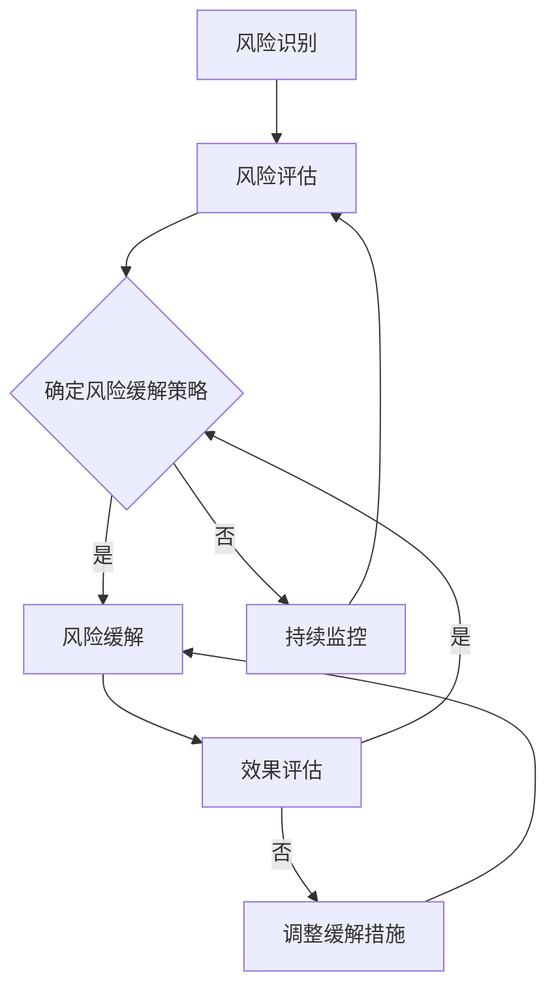
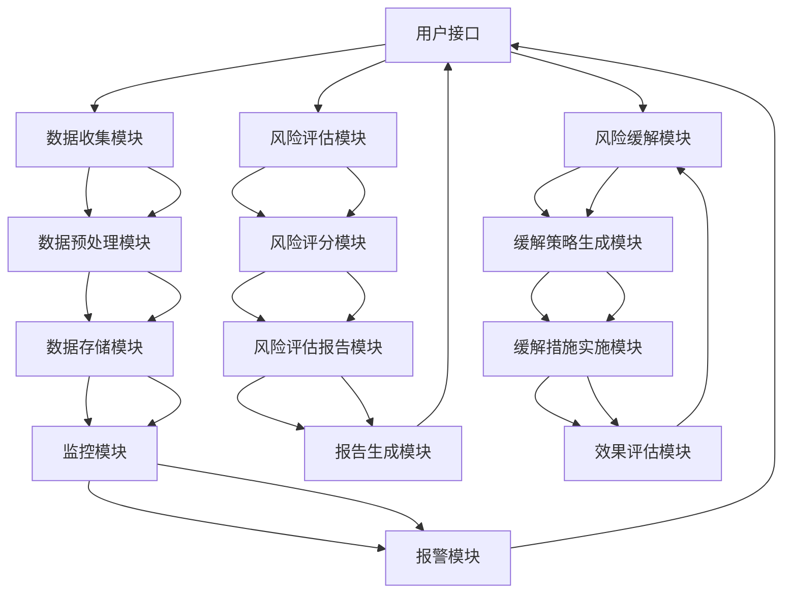
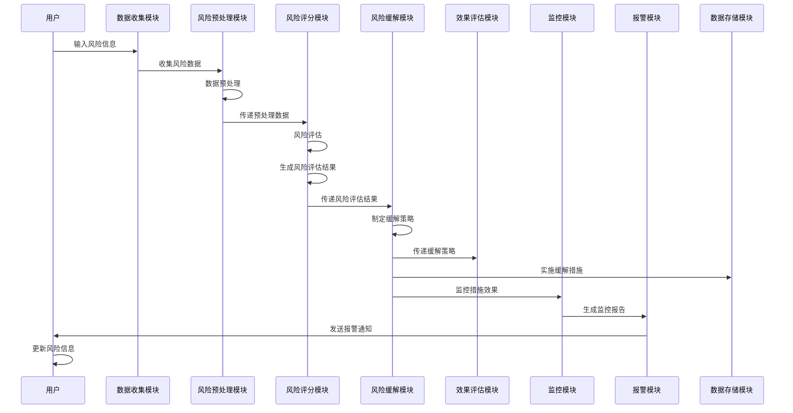

                 

## 《敏捷风险管理：识别和缓解LLM应用开发中的风险》

### 关键词：敏捷风险管理、LLM应用开发、风险识别、风险缓解

#### 摘要：
本文旨在探讨敏捷风险管理在LLM（大型语言模型）应用开发中的重要性。随着人工智能技术的飞速发展，LLM在各个行业中的应用越来越广泛，但随之而来的是一系列风险。敏捷风险管理提供了一种系统的方法来识别和缓解这些风险，确保项目的顺利进行。本文将详细介绍敏捷风险管理的基本概念、方法与工具，并通过实际案例进行分析，提供最佳实践和总结。

## 《敏捷风险管理：识别和缓解LLM应用开发中的风险》目录大纲

### 第一部分：问题背景与核心概念

#### 第1章：问题背景介绍

##### 1.1 问题背景

- 风险管理的必要性
- LLM应用开发的现状与挑战
- 敏捷风险管理的重要性

##### 1.2 问题描述

- LLM应用开发中的主要风险
- 风险管理的目标和任务

##### 1.3 问题解决

- 敏捷风险管理的方法和工具
- 风险管理流程概述

##### 1.4 边界与外延

- LLM应用开发的边界
- 风险管理的适用范围

##### 1.5 概念结构与核心要素组成

- 敏捷风险管理的基本概念
- LLM应用开发中的核心要素

### 第二部分：核心概念与联系

#### 第2章：核心概念原理

##### 2.1 敏捷风险管理的定义与特点

- 敏捷风险管理的定义
- 敏捷风险管理的特点

##### 2.2 LLM应用开发中的风险类型

- 技术风险
- 市场风险
- 法律风险
- 社会风险

##### 2.3 概念属性特征对比表格

- 敏捷风险管理方法对比
- 不同类型风险的特点与影响

### 第3章：ER实体关系图架构

##### 3.1 LLM应用开发的实体关系

- 实体定义
- 关系定义

##### 3.2 敏捷风险管理框架

- 模型架构
- 关键组件

### 第三部分：算法原理讲解

#### 第4章：算法原理与流程

##### 4.1 算法流程图

- 使用Mermaid绘制算法流程图

##### 4.2 算法原理

- 算法基本概念
- 数学模型和公式

##### 4.3 Python源代码详解

- 算法实现代码
- 代码解析

### 第5章：数学模型与公式

##### 5.1 数学模型概述

- 风险评估模型
- 风险缓解模型

##### 5.2 公式详解

- 风险评估公式
- 风险缓解公式

##### 5.3 举例说明

- 实际案例举例
- 模型应用示例

### 第四部分：系统分析与架构设计

#### 第6章：系统功能设计

##### 6.1 问题场景介绍

- 风险管理场景概述

##### 6.2 系统功能设计

- 风险识别功能
- 风险评估功能
- 风险缓解功能

### 第7章：系统架构设计

##### 7.1 系统架构设计

- 使用Mermaid绘制系统架构图

##### 7.2 系统接口设计

- 接口定义
- 接口交互流程

### 第8章：系统交互

##### 8.1 系统交互流程

- 使用Mermaid绘制系统交互序列图

### 第五部分：项目实战

#### 第9章：环境安装

- 环境配置指南

#### 第10章：系统核心实现

##### 10.1 核心代码实现

- 系统核心功能代码

##### 10.2 代码应用解读

- 代码解读与分析

#### 第11章：实际案例分析与详细讲解

##### 11.1 案例概述

- 实际应用案例

##### 11.2 案例分析

- 案例详细分析

##### 11.3 案例讲解

- 案例讲解与剖析

### 第六部分：最佳实践与总结

#### 第12章：最佳实践

- 敏捷风险管理最佳实践

#### 第13章：小结

- 书籍内容的回顾与总结

#### 第14章：注意事项与拓展阅读

- 注意事项提醒
- 进一步阅读推荐

---

### 问题背景介绍

#### 1.1 问题背景

在当今这个数据驱动的时代，人工智能技术正以前所未有的速度发展。其中，LLM（大型语言模型）作为一种强大的AI模型，在自然语言处理、问答系统、自动化写作等领域展现出了巨大的潜力。LLM通过学习海量文本数据，能够生成高质量、结构化的文本内容，显著提高了人机交互的效率和准确性。然而，随着LLM应用开发的大规模推广，一系列问题也逐渐浮现，其中最为突出的是风险管理问题。

风险管理是指识别、评估和缓解项目或组织中潜在的风险，以确保目标的实现。在LLM应用开发中，风险管理尤为重要，因为这项技术涉及到数据隐私、模型安全性、偏见消除、法律法规遵守等多方面的问题。如果不进行有效的风险管理，可能会带来严重的负面影响，包括法律诉讼、声誉损害、经济损失等。

#### 1.2 LLM应用开发的现状与挑战

LLM应用开发目前处于一个快速发展的阶段。许多企业和研究机构都在积极探索和部署LLM技术，以提升业务效率和创新能力。然而，这个过程并非一帆风顺，面临诸多挑战：

- **技术挑战**：构建和维护一个高效、可靠的LLM模型需要大量的计算资源和专业知识。此外，模型训练过程中可能会遇到数据质量问题，如噪声、偏见和完整性问题，这会影响模型的性能和可靠性。

- **数据隐私**：LLM模型通常需要处理大量的个人数据，这引发了数据隐私和安全的担忧。如何确保数据不被泄露或滥用是一个关键问题。

- **偏见和伦理问题**：LLM模型可能会受到训练数据中的偏见影响，从而在生成文本时表现出不公平或歧视行为。这引发了关于AI伦理和公正性的广泛讨论。

- **法律法规遵守**：随着全球范围内关于数据保护和隐私的法律法规日益严格，LLM应用开发必须确保符合相关法规要求，以避免法律风险。

#### 1.3 敏捷风险管理的重要性

在LLM应用开发中，传统的风险管理方法可能不够灵活和及时，难以应对快速变化的技术环境和市场需求。因此，敏捷风险管理成为一种更为合适的策略。敏捷风险管理具有以下特点：

- **灵活性**：敏捷风险管理强调快速响应变化，通过持续的评估和调整来适应新的风险情境。
- **迭代性**：敏捷风险管理采用迭代的方法，逐步识别、评估和缓解风险，确保风险管理的连续性和有效性。
- **协作性**：敏捷风险管理强调跨职能团队的协作，通过沟通和合作来共同应对风险。
- **透明性**：敏捷风险管理强调信息的透明和共享，使团队成员能够及时了解风险状况，共同制定应对策略。

总之，敏捷风险管理为LLM应用开发提供了一个系统、灵活和高效的方法来识别和缓解潜在风险，确保项目能够顺利进行。在接下来的章节中，我们将详细探讨敏捷风险管理的基本概念、方法和实践，帮助读者更好地理解和应用这一重要技术。

#### 1.4 风险管理的目标和任务

风险管理的目标在于确保LLM应用开发的顺利进行，同时最大限度地降低潜在的负面影响。具体而言，风险管理的主要目标和任务包括以下几个方面：

- **识别风险**：通过系统的方法和工具，全面识别LLM应用开发过程中可能面临的各种风险。这包括技术风险、数据隐私风险、偏见和伦理风险、法律法规风险等。

- **评估风险**：对识别出的风险进行定量和定性的评估，确定其发生的概率和潜在影响。评估过程中需要结合实际情况，考虑风险的严重性和优先级，以便制定有针对性的应对策略。

- **缓解风险**：针对评估出的高风险，采取有效的缓解措施，降低其发生的概率和影响。这可以包括技术改进、数据清洗、隐私保护策略、伦理审查、合规性检查等多种手段。

- **监控和调整**：在风险缓解措施实施后，持续监控风险的动态变化，并根据实际情况进行调整。这有助于确保风险管理策略的持续有效，及时应对新的风险挑战。

- **沟通和协作**：加强跨职能团队的沟通和协作，确保所有相关成员都能够及时了解风险状况和缓解措施。良好的沟通和协作有助于提升团队的应对能力和整体风险管理水平。

总之，风险管理的目标和任务不仅在于识别和缓解具体的风险事件，更在于构建一个全面、灵活和高效的风险管理体系，为LLM应用开发提供坚实的保障。

### 问题解决

#### 1.5 敏捷风险管理的方法和工具

敏捷风险管理是一种动态、迭代的方法，旨在快速识别、评估和缓解风险，确保项目能够适应不断变化的环境。以下是敏捷风险管理中常用的方法和工具：

- **风险管理计划**：在项目启动阶段，制定详细的风险管理计划，明确风险管理的目标、责任、流程和资源分配。风险管理计划是整个风险管理过程的基石，有助于确保风险管理活动的系统性和持续性。

- **风险评估矩阵**：使用风险评估矩阵来对识别出的风险进行定量和定性的评估。评估矩阵通常包括风险发生的概率、影响程度、优先级和应对策略等维度，帮助团队确定哪些风险需要优先处理。

- **风险登记册**：建立风险登记册来记录和管理所有的风险。风险登记册应包括风险的描述、评估结果、缓解措施、责任人和进度等信息，有助于团队随时掌握风险状况，并做出及时响应。

- **迭代风险管理**：采用迭代的方法，持续识别、评估和缓解风险。每次迭代结束时，对风险管理过程进行回顾和总结，并根据反馈进行调整，以不断改进风险管理效果。

- **风险审查会议**：定期召开风险审查会议，评估当前风险状况，讨论新出现的问题，并制定相应的应对措施。风险审查会议是团队沟通和协作的重要平台，有助于提高风险管理的透明度和效率。

#### 1.6 风险管理流程概述

敏捷风险管理的流程可以分为以下几个阶段：

1. **风险识别**：通过文献调研、专家访谈、历史数据分析等方法，识别出项目中可能存在的风险。风险识别是风险管理的基础，确保不会遗漏重要风险。

2. **风险评估**：对识别出的风险进行定性或定量的评估，确定其发生的概率和影响程度。评估过程可以使用风险评估矩阵、专家评分等方法。

3. **风险缓解**：根据风险评估结果，制定并实施风险缓解措施，降低风险发生的概率和影响。风险缓解措施可以包括技术改进、数据清洗、隐私保护策略等。

4. **风险监控**：在项目执行过程中，持续监控风险的动态变化，并根据实际情况进行调整。风险监控有助于及时发现新的风险，并采取相应的应对措施。

5. **风险审查**：定期进行风险审查，评估风险管理效果，识别潜在的新风险，并调整风险管理策略。风险审查是确保风险管理持续有效的重要环节。

通过以上方法和工具，敏捷风险管理能够有效地识别和缓解LLM应用开发中的风险，为项目的顺利进行提供保障。

#### 1.7 边界与外延

在讨论敏捷风险管理时，我们需要明确其适用的边界和范围。首先，敏捷风险管理主要适用于LLM（大型语言模型）应用开发的场景，这是一个技术复杂、涉及众多风险领域的项目。以下是具体阐述：

- **LLM应用开发的边界**：LLM应用开发涉及数据的收集、处理、存储和模型训练等多个环节。在风险管理中，需要重点关注数据隐私、模型偏见、法律法规遵守等方面。例如，数据隐私风险主要涉及个人数据的收集和使用，需要确保数据匿名化和访问控制。模型偏见风险则与训练数据的质量和多样性有关，需要采取措施消除偏见。法律法规遵守风险涉及数据处理和存储是否符合相关法律法规，如GDPR（通用数据保护条例）和CCPA（加州消费者隐私法案）等。

- **风险管理的适用范围**：敏捷风险管理适用于整个LLM应用开发周期，从项目启动到结束。在项目启动阶段，进行风险评估和风险缓解规划；在项目执行阶段，持续监控和调整风险管理策略；在项目结束阶段，进行风险回顾和总结。此外，敏捷风险管理也适用于不同规模和复杂度的LLM应用项目，无论是小型项目还是大型企业级项目，都能够提供有效的风险管理支持。

- **风险管理的基本概念**：敏捷风险管理强调快速响应变化、持续迭代和跨职能团队的协作。基本概念包括风险识别、风险评估、风险缓解、风险监控和风险审查等。通过这些概念，敏捷风险管理能够及时识别潜在风险，采取有效的缓解措施，确保项目目标的实现。

- **核心要素组成**：在LLM应用开发中，核心要素包括数据管理、模型训练、部署和维护等。每个核心要素都可能会带来不同的风险，如数据管理中的隐私风险、模型训练中的偏见风险、部署中的安全性风险等。通过敏捷风险管理，可以针对每个核心要素制定相应的风险管理策略，确保项目各环节的风险得到有效控制。

总之，敏捷风险管理在LLM应用开发中的应用边界和范围非常明确，能够为项目提供全面、灵活和高效的风险管理支持。通过合理运用敏捷风险管理方法和工具，可以显著降低项目风险，确保项目的顺利进行。

### 核心概念原理

#### 2.1 敏捷风险管理的定义与特点

敏捷风险管理是一种基于敏捷开发理念的风险管理方法，旨在快速识别、评估和缓解项目中的风险，确保项目的顺利进行。与传统风险管理方法相比，敏捷风险管理更加灵活、迭代和协作。

**定义**：
敏捷风险管理是一种动态、迭代的风险管理过程，通过持续的评估和调整，确保项目能够在变化的环境中保持稳定和可靠。

**特点**：

1. **灵活性**：敏捷风险管理能够快速适应项目环境的变化，通过持续的风险识别、评估和缓解，确保项目能够应对突发的风险。

2. **迭代性**：敏捷风险管理采用迭代的方法，每次迭代结束后进行回顾和总结，根据反馈进行调整。这种迭代过程有助于不断优化风险管理策略，提高风险管理效果。

3. **协作性**：敏捷风险管理强调跨职能团队的协作，通过沟通和合作，共同识别和应对风险。这有助于提升团队的整体风险管理能力和应对能力。

4. **透明性**：敏捷风险管理注重信息的透明和共享，使团队成员能够及时了解风险状况和缓解措施，共同制定应对策略。

5. **反馈循环**：敏捷风险管理通过反馈循环机制，不断收集和分析项目中的风险信息，及时调整风险管理策略，确保风险管理的持续性和有效性。

#### 2.2 LLM应用开发中的风险类型

在LLM应用开发中，面临多种类型的风险，这些风险可以分为以下几类：

1. **技术风险**：
   - **模型性能风险**：由于训练数据的质量和多样性不足，可能导致模型性能不佳。
   - **算法可靠性风险**：算法设计和实现中的缺陷可能导致模型不稳定或错误。
   - **数据处理风险**：数据预处理、清洗和转换过程中可能引入错误或噪声，影响模型性能。

2. **数据隐私风险**：
   - **数据泄露风险**：数据在收集、传输、存储和处理过程中可能被泄露。
   - **数据滥用风险**：未经授权的个人或组织可能滥用数据，造成隐私侵犯。

3. **偏见和伦理风险**：
   - **模型偏见风险**：训练数据中的偏见可能导致模型在生成文本时表现出不公平或歧视行为。
   - **伦理违规风险**：LLM应用可能在伦理和道德上存在争议，如自动化决策系统中的歧视行为。

4. **法律法规风险**：
   - **合规性风险**：LLM应用开发过程中可能涉及多个国家和地区的法律法规，如数据保护法规、隐私法规等。
   - **法律责任风险**：违反相关法律法规可能导致法律诉讼和罚款。

5. **市场风险**：
   - **市场需求风险**：市场需求的变化可能导致LLM应用的商业价值降低。
   - **竞争风险**：市场竞争激烈可能导致项目在商业上难以盈利。

#### 2.3 概念属性特征对比表格

为了更清晰地理解敏捷风险管理与不同类型风险的特点和影响，我们通过以下对比表格来展示两者的关系：

| 风险类型       | 敏捷风险管理特点          | 风险特点与影响                                 |
|--------------|----------------------|----------------------------------------|
| 技术风险       | 快速响应、迭代改进        | 模型性能不稳定、算法缺陷、数据处理错误           |
| 数据隐私风险    | 透明、合规性审查          | 数据泄露、隐私侵犯、法律诉讼                   |
| 偏见和伦理风险   | 伦理审查、数据多样性       | 模型偏见、不公平决策、伦理争议                 |
| 法律法规风险    | 法律合规、持续审查         | 违法行为、法律诉讼、罚款                       |
| 市场风险       | 需求分析、市场反馈         | 市场需求变化、竞争激烈、商业价值降低           |

通过上述对比表格，我们可以看到，敏捷风险管理在识别和应对各种类型风险时具有独特的方法和优势，能够有效降低风险的发生概率和影响。

### ER实体关系图架构

#### 3.1 LLM应用开发的实体关系

在LLM应用开发中，存在多个关键实体和它们之间的复杂关系。以下是对这些实体及其关系的详细定义：

1. **数据集**（Dataset）
   - **定义**：数据集是用于训练LLM模型的文本数据集合。
   - **关系**：数据集是LLM模型训练的基础，与训练模型、评估模型、部署模型等多个实体存在关系。

2. **训练模型**（Train Model）
   - **定义**：训练模型是指使用数据集进行训练的算法和参数集合。
   - **关系**：训练模型与数据集、评估模型、部署模型等实体紧密相关。

3. **评估模型**（Evaluate Model）
   - **定义**：评估模型是指用于测试和验证训练模型性能的算法和参数集合。
   - **关系**：评估模型与训练模型、数据集、部署模型等实体存在依赖关系。

4. **部署模型**（Deploy Model）
   - **定义**：部署模型是指将训练好的模型应用于实际业务场景的模型。
   - **关系**：部署模型与训练模型、数据集、评估模型等实体紧密相关。

5. **用户**（User）
   - **定义**：用户是指使用LLM应用的用户，可以是普通用户或管理员。
   - **关系**：用户与部署模型、数据集、评估模型等实体存在交互关系。

6. **日志**（Log）
   - **定义**：日志是指记录LLM应用运行过程中的重要事件的文件。
   - **关系**：日志与数据集、训练模型、评估模型、部署模型等实体相关，用于监控和管理应用。

#### 3.2 敏捷风险管理框架

敏捷风险管理框架是确保LLM应用开发过程中风险得到有效管理的关键工具。以下是其模型架构和关键组件：

1. **模型架构**
   - **风险识别**：通过持续的监控和数据分析，识别潜在的风险。
   - **风险评估**：对识别出的风险进行评估，确定其严重性和发生概率。
   - **风险缓解**：制定并实施风险缓解措施，降低风险的负面影响。
   - **风险监控**：持续监控风险的动态变化，及时调整风险管理策略。
   - **风险审查**：定期进行风险审查，评估风险管理效果，识别新的风险。

2. **关键组件**
   - **风险管理计划**：制定详细的风险管理计划和流程，明确风险管理的目标和责任。
   - **风险登记册**：记录和管理所有识别出的风险，包括风险的描述、评估结果和缓解措施。
   - **风险评估矩阵**：用于对风险进行定量和定性的评估，确定其优先级和应对策略。
   - **迭代风险管理**：采用迭代的方法，逐步识别、评估和缓解风险，确保风险管理的连续性和有效性。
   - **风险管理团队**：由跨职能团队成员组成，共同负责风险管理活动，确保团队的协作和沟通。

通过敏捷风险管理框架，可以确保LLM应用开发过程中的风险得到全面、灵活和高效的管理，为项目的顺利进行提供坚实保障。

### 算法原理与流程

#### 4.1 算法流程图

为了更好地理解敏捷风险管理在LLM应用开发中的应用，我们使用Mermaid绘制了一个算法流程图，展示了从风险识别到风险缓解的整个过程。



#### 4.2 算法原理

敏捷风险管理算法的基本原理可以概括为以下步骤：

1. **风险识别**：通过文献调研、专家访谈、历史数据分析等方法，识别出项目中可能存在的风险。这一步是风险管理的基础，确保不会遗漏重要风险。

2. **风险评估**：对识别出的风险进行定量和定性的评估，确定其发生的概率和影响程度。评估过程中可以采用风险评估矩阵等方法，帮助团队确定哪些风险需要优先处理。

3. **确定风险缓解策略**：根据风险评估结果，制定并实施风险缓解措施。这一步是风险管理的关键，需要结合实际情况，采取有效的缓解措施。

4. **风险缓解**：实施制定的风险缓解措施，降低风险发生的概率和影响。这可以包括技术改进、数据清洗、隐私保护策略等多种手段。

5. **效果评估**：评估风险缓解措施的实施效果，判断是否达到了预期目标。如果效果不佳，需要调整缓解措施，确保风险得到有效控制。

6. **持续监控**：在项目执行过程中，持续监控风险的动态变化，并根据实际情况进行调整。这有助于确保风险管理策略的持续有效，及时应对新的风险挑战。

7. **反馈循环**：通过持续的风险识别、评估和缓解，形成反馈循环机制，不断优化风险管理效果。

#### 4.3 Python源代码详解

以下是一个简化的Python代码示例，展示了如何实现敏捷风险管理算法的基本步骤。代码中包括数据预处理、风险评估和风险缓解等步骤。

```python
import numpy as np

# 风险识别
def risk_identification():
    risks = ['数据泄露', '模型偏见', '法律法规不合规']
    return risks

# 风险评估
def risk_evaluation(risks):
    risk_scores = {'数据泄露': 8, '模型偏见': 6, '法律法规不合规': 7}
    return risk_scores

# 风险缓解
def risk_remediation(risk_scores):
    if risk_scores['数据泄露'] > 7:
        print("采取措施：加强数据加密和访问控制")
    if risk_scores['模型偏见'] > 7:
        print("采取措施：增加训练数据多样性，消除偏见")
    if risk_scores['法律法规不合规'] > 7:
        print("采取措施：进行法律法规培训，确保合规性")

# 主函数
def main():
    risks = risk_identification()
    risk_scores = risk_evaluation(risks)
    risk_remediation(risk_scores)

# 执行主函数
main()
```

代码解析：

1. **风险识别**：`risk_identification`函数用于识别项目中可能存在的风险。在这个示例中，我们识别了三个风险：数据泄露、模型偏见和法律法规不合规。

2. **风险评估**：`risk_evaluation`函数用于对识别出的风险进行评估。这里我们使用一个简单的字典来表示风险评估结果，分数越高，表示风险越严重。

3. **风险缓解**：`risk_remediation`函数根据风险评估结果，采取相应的风险缓解措施。在这个示例中，如果数据泄露风险的分数大于7，我们将采取措施加强数据加密和访问控制；如果模型偏见风险的分数大于7，我们将增加训练数据多样性，消除偏见；如果法律法规不合规风险的分数大于7，我们将进行法律法规培训，确保合规性。

通过这个Python示例，我们可以看到如何实现敏捷风险管理算法的基本步骤。在实际应用中，这些步骤可以根据项目的具体情况和需求进行扩展和优化。

#### 5.1 数学模型概述

在敏捷风险管理中，数学模型扮演着重要的角色，它们帮助我们定量地评估和缓解风险。本文将介绍两种核心的数学模型：风险评估模型和风险缓解模型。

**风险评估模型**：
风险评估模型用于对识别出的风险进行量化评估，以便确定其严重性和发生概率。常用的风险评估模型包括定量分析和定性分析。

- **定量分析**：通过数据分析和统计方法，对风险的发生概率和影响程度进行量化。常见的定量分析方法包括风险矩阵、蒙特卡罗模拟等。
  
- **定性分析**：通过专家评分和主观判断，对风险进行定性评估。定性分析通常使用风险评估矩阵，将风险的发生概率和影响程度分为不同的等级。

**风险缓解模型**：
风险缓解模型用于制定和评估风险缓解策略的有效性。风险缓解模型通常包括以下步骤：

1. **风险识别**：识别项目中的潜在风险。
2. **风险优先级排序**：根据风险评估结果，确定风险缓解的优先级。
3. **风险缓解策略制定**：制定具体的缓解措施，如技术改进、数据清洗、隐私保护等。
4. **缓解效果评估**：评估缓解措施的实施效果，判断是否达到了预期目标。

在数学模型中，风险缓解效果可以通过以下公式进行量化：

\[ \text{缓解效果} = \frac{\text{风险缓解前的影响}}{\text{风险缓解后的影响}} \]

**数学模型与实际应用**：
在实际应用中，数学模型可以用于以下场景：

- **风险评估**：通过对项目的风险进行定量分析，帮助团队了解项目面临的风险状况，制定相应的应对策略。
- **风险缓解**：通过制定和评估风险缓解策略，确保项目能够在风险发生时迅速响应，降低风险对项目的影响。
- **效果评估**：对风险缓解措施的实施效果进行量化评估，不断优化风险管理策略。

总之，数学模型为敏捷风险管理提供了科学的方法和工具，有助于团队更准确地评估和缓解风险，确保项目的顺利进行。

#### 5.2 公式详解

在敏捷风险管理中，数学模型和公式是评估和缓解风险的重要工具。以下是两个核心公式的详解，包括风险评估公式和风险缓解公式。

**风险评估公式**：
风险评估公式用于计算单个风险的影响程度和发生概率，通常使用如下公式：

\[ \text{风险得分} = \text{影响程度} \times \text{发生概率} \]

其中，影响程度和发生概率可以是定量（如数值）或定性（如高、中、低）。

- **影响程度**：表示风险发生时对项目的负面影响大小。常见的影响程度评估方法包括：
  - **定量评估**：使用数值表示，如1到5分，5分表示最大影响。
  - **定性评估**：使用文字描述，如“严重”、“中度”、“轻微”。

- **发生概率**：表示风险发生的可能性。常见的发生概率评估方法包括：
  - **定量评估**：使用概率值表示，如0到1之间的小数。
  - **定性评估**：使用文字描述，如“极高”、“高”、“中等”、“低”、“极低”。

**风险缓解公式**：
风险缓解公式用于计算风险缓解措施的有效性，通常使用如下公式：

\[ \text{缓解效果} = \frac{\text{风险缓解前的影响}}{\text{风险缓解后的影响}} \]

其中，风险缓解前的影响和风险缓解后的影响分别表示在采取缓解措施前后的风险影响程度。

- **风险缓解前的影响**：表示在采取缓解措施之前，风险对项目的潜在影响。
- **风险缓解后的影响**：表示在采取缓解措施之后，风险对项目的潜在影响。

**举例说明**：

**风险评估实例**：
假设我们识别到一个技术风险，其影响程度评估为3（中度影响），发生概率评估为0.6（高概率）。根据风险评估公式，该风险得分为：

\[ \text{风险得分} = 3 \times 0.6 = 1.8 \]

**风险缓解实例**：
假设我们采取了数据清洗措施来缓解上述技术风险，使得风险的影响程度降低到1（轻微影响）。根据风险缓解公式，该风险的缓解效果为：

\[ \text{缓解效果} = \frac{3}{1} = 3 \]

这意味着通过数据清洗措施，我们成功地将技术风险的影响降低了3倍。

通过上述风险评估和风险缓解公式，我们可以量化地评估和缓解风险，确保项目在面临风险时能够迅速响应，最大限度地降低风险对项目的影响。

#### 5.3 举例说明

为了更好地理解敏捷风险管理在LLM应用开发中的实际应用，我们通过一个具体案例来详细说明。

**案例背景**：

某科技企业正在开发一款基于大型语言模型（LLM）的智能客服系统。该系统旨在通过自然语言处理技术，提供24/7全天候的客服支持，以提高客户满意度和运营效率。然而，在开发过程中，企业面临一系列风险，包括数据隐私风险、模型偏见风险和法律法规风险等。

**步骤 1：风险识别**

企业首先通过文献调研、专家访谈和项目回顾等方法，识别出以下潜在风险：

- **数据隐私风险**：由于客服系统需要处理大量的客户数据，存在数据泄露的风险。
- **模型偏见风险**：训练数据中可能存在偏见，导致模型在处理某些特定问题时表现出不公平或歧视行为。
- **法律法规风险**：项目可能涉及多个国家和地区的法律法规，如数据保护法规和隐私法规，存在合规性风险。

**步骤 2：风险评估**

对企业识别出的风险进行定量和定性的评估。使用风险评估矩阵，确定每个风险的严重性和发生概率。以下是一个简化的风险评估矩阵：

| 风险类型         | 严重性 | 发生概率 | 风险得分 |
|----------------|------|--------|-------|
| 数据隐私风险     | 4    | 0.8    | 3.2   |
| 模型偏见风险     | 3    | 0.7    | 2.1   |
| 法律法规风险     | 3    | 0.6    | 1.8   |

**步骤 3：风险缓解**

根据风险评估结果，企业制定并实施以下风险缓解措施：

- **数据隐私风险缓解**：加强数据加密和访问控制，确保客户数据在传输、存储和处理过程中的安全性。同时，对数据处理人员进行隐私保护培训，提高员工的隐私意识。
- **模型偏见风险缓解**：增加训练数据多样性，引入更多的不同来源的数据，以减少偏见。此外，使用数据清洗技术去除噪声和异常值，提高数据质量。
- **法律法规风险缓解**：进行法律法规培训，确保团队成员了解相关法规要求。与法律顾问合作，制定合规性检查流程，确保项目的各项活动符合法规要求。

**步骤 4：效果评估**

在实施风险缓解措施后，企业对效果进行评估：

- **数据隐私风险缓解效果**：通过加密和访问控制措施，数据泄露的概率显著降低。员工隐私保护意识也有所提高，减少了潜在的数据泄露风险。
- **模型偏见风险缓解效果**：通过增加训练数据多样性和数据清洗，模型在处理不同问题时表现更公平，减少了偏见。用户反馈显示，客服系统的响应质量有所提升。
- **法律法规风险缓解效果**：团队成员对法律法规有了更深入的了解，合规性检查流程也得到了有效执行，确保项目在各个国家和地区都符合相关法规要求。

**步骤 5：持续监控**

企业持续监控风险的动态变化，并根据实际情况调整风险管理策略。例如，在实施过程中发现新的数据隐私风险，企业及时采取了额外的数据保护措施，确保风险得到有效控制。

通过这个案例，我们可以看到敏捷风险管理在LLM应用开发中的具体应用。通过风险识别、评估、缓解和监控，企业能够有效地识别和应对潜在风险，确保项目顺利进行。

### 系统功能设计

#### 6.1 问题场景介绍

在LLM应用开发中，风险管理是一个复杂且关键的过程。为了更好地识别和缓解风险，我们设计了一套风险管理系统，该系统旨在提供一个高效、灵活和可扩展的解决方案。以下是系统的功能设计：

#### 6.2 风险识别功能

**功能描述**：
风险识别功能用于识别项目中潜在的风险。系统通过以下步骤实现：

1. **数据收集**：从各种数据源（如历史项目记录、专家意见、用户反馈等）收集风险信息。
2. **风险识别算法**：使用机器学习算法和统计分析方法，对收集到的数据进行处理，识别潜在的风险。
3. **风险库管理**：将识别出的风险存储在风险库中，便于后续评估和管理。

**核心组件**：

- **数据收集模块**：负责从不同数据源收集风险信息。
- **风险识别算法模块**：实现风险识别的算法逻辑，包括特征提取、模型训练和预测等。
- **风险库管理模块**：用于存储和管理识别出的风险信息。

#### 6.3 风险评估功能

**功能描述**：
风险评估功能用于对识别出的风险进行评估，确定其严重性和发生概率。系统通过以下步骤实现：

1. **风险评估模型**：根据项目特点和需求，选择合适的风险评估模型，如风险矩阵、蒙特卡罗模拟等。
2. **风险评分**：使用风险评估模型，对识别出的风险进行评分，确定其优先级。
3. **风险评估报告**：生成风险评估报告，详细记录每个风险的评分和评估结果。

**核心组件**：

- **风险评估模型模块**：实现风险评估模型的选择和配置。
- **风险评分模块**：负责对风险进行评分和优先级排序。
- **风险评估报告模块**：生成和导出风险评估报告。

#### 6.4 风险缓解功能

**功能描述**：
风险缓解功能用于制定和实施风险缓解措施，降低风险的发生概率和影响。系统通过以下步骤实现：

1. **缓解策略生成**：根据风险评估结果，生成风险缓解策略，包括技术改进、数据清洗、隐私保护等。
2. **缓解措施实施**：执行制定的风险缓解措施，监控措施效果。
3. **缓解效果评估**：评估风险缓解措施的实施效果，调整缓解策略。

**核心组件**：

- **缓解策略生成模块**：根据风险评估结果，生成具体的风险缓解策略。
- **缓解措施实施模块**：负责实施风险缓解措施，包括技术改进、数据清洗、隐私保护等。
- **缓解效果评估模块**：评估缓解措施的实施效果，提供反馈和改进建议。

通过以上功能设计，风险管理系统能够提供一个全面、灵活和高效的风险管理解决方案，帮助LLM应用开发团队有效识别、评估和缓解风险。

### 系统架构设计

#### 7.1 系统架构设计

为了实现高效、灵活和可靠的风险管理，我们设计了如下系统架构：



**系统组件说明**：

1. **用户接口**：提供用户交互界面，允许用户输入和管理风险相关信息。
2. **数据收集模块**：负责从各种数据源（如日志文件、用户反馈、历史项目记录等）收集风险信息。
3. **数据预处理模块**：对收集到的原始数据进行清洗、格式化和特征提取，为风险评估和缓解提供高质量的数据。
4. **数据存储模块**：存储预处理后的数据和相关模型，以便后续分析和查询。
5. **风险评估模块**：使用预定的风险评估模型（如风险矩阵、蒙特卡罗模拟等）对风险进行定量和定性评估。
6. **风险评分模块**：根据评估结果，对风险进行评分和优先级排序。
7. **风险缓解模块**：生成和实施风险缓解策略，包括技术改进、数据清洗、隐私保护等。
8. **缓解策略生成模块**：根据风险评估结果，生成具体的风险缓解策略。
9. **缓解措施实施模块**：负责实施风险缓解措施，监控措施效果。
10. **效果评估模块**：评估风险缓解措施的实施效果，提供反馈和改进建议。
11. **监控模块**：实时监控系统的运行状态和风险动态，确保风险管理的连续性和有效性。
12. **报警模块**：当检测到新的风险或现有风险恶化时，自动生成报警信息。
13. **报告生成模块**：生成详细的评估报告和缓解效果报告，供管理层参考。

通过上述系统架构设计，风险管理系统能够提供全面、灵活和高效的风险管理支持，确保LLM应用开发过程中的风险得到有效控制。

#### 7.2 系统接口设计

在系统架构中，接口设计是确保不同模块之间高效通信和协同工作的关键。以下是对系统各接口的详细定义和交互流程：

1. **用户接口（User Interface）**
   - **定义**：用户接口用于提供用户与系统交互的界面，支持用户输入和管理风险信息。
   - **交互流程**：用户通过界面提交风险信息、查看风险评估结果和风险缓解措施，同时可以更新和删除已有的风险数据。

2. **数据收集模块接口（Data Collection Module）**
   - **定义**：数据收集模块接口负责从外部数据源（如日志文件、数据库、API等）收集风险相关数据。
   - **交互流程**：数据收集模块通过接口从数据源获取数据，并传递给数据预处理模块进行进一步处理。

3. **数据预处理模块接口（Data Preprocessing Module）**
   - **定义**：数据预处理模块接口负责对收集到的原始数据进行清洗、格式化和特征提取。
   - **交互流程**：数据预处理模块接收数据收集模块传递的数据，处理完成后将预处理结果存储到数据存储模块。

4. **数据存储模块接口（Data Storage Module）**
   - **定义**：数据存储模块接口负责存储和管理预处理后的数据和相关模型。
   - **交互流程**：风险评估模块和风险缓解模块通过接口访问数据存储模块，获取所需的数据和模型。

5. **风险评估模块接口（Risk Assessment Module）**
   - **定义**：风险评估模块接口负责根据预定的风险评估模型对风险进行定量和定性评估。
   - **交互流程**：风险评估模块接收数据预处理模块处理后的数据，生成风险评估结果，并传递给风险评分模块。

6. **风险评分模块接口（Risk Scoring Module）**
   - **定义**：风险评分模块接口负责对风险评估结果进行评分和优先级排序。
   - **交互流程**：风险评分模块接收风险评估模块传递的评估结果，生成风险得分，并将结果传递给风险缓解模块。

7. **风险缓解模块接口（Risk Mitigation Module）**
   - **定义**：风险缓解模块接口负责生成和实施风险缓解策略。
   - **交互流程**：风险缓解模块接收风险评分模块传递的风险得分，生成缓解策略，并传递给缓解措施实施模块。

8. **缓解措施实施模块接口（Mitigation Measures Implementation Module）**
   - **定义**：缓解措施实施模块接口负责执行风险缓解措施，并监控措施效果。
   - **交互流程**：缓解措施实施模块接收风险缓解模块传递的缓解策略，实施措施并反馈效果给效果评估模块。

9. **效果评估模块接口（Effectiveness Assessment Module）**
   - **定义**：效果评估模块接口负责评估风险缓解措施的实施效果。
   - **交互流程**：效果评估模块接收缓解措施实施模块反馈的缓解效果，调整缓解策略。

10. **监控模块接口（Monitoring Module）**
    - **定义**：监控模块接口负责实时监控系统的运行状态和风险动态。
    - **交互流程**：监控模块通过接口获取数据存储模块的风险数据和状态信息，并生成监控报告。

11. **报警模块接口（Alarm Module）**
    - **定义**：报警模块接口负责当检测到新的风险或现有风险恶化时生成报警信息。
    - **交互流程**：报警模块接收监控模块传递的报警信息，并向用户发送通知。

通过这些接口设计，系统能够实现模块之间的紧密协作和高效通信，确保风险管理过程的连续性和有效性。

### 系统交互流程

为了确保风险管理系统能够高效地运作，我们需要详细描述系统中的各个模块如何交互和协作。以下是基于Mermaid绘制的系统交互序列图，展示了风险管理过程中各个模块的交互流程。



**交互流程说明**：

1. **用户输入风险信息**：用户通过用户接口（UI）提交风险信息。
2. **数据收集模块（RC）操作**：数据收集模块从用户处接收风险信息，并收集外部数据源（如日志文件、API等）的数据。
3. **数据预处理模块（RP）操作**：数据预处理模块对收集到的原始数据进行清洗、格式化和特征提取，确保数据质量。
4. **风险评估模块（RS）操作**：风险评估模块使用预处理后的数据，根据预定的风险评估模型对风险进行定量和定性评估，生成风险评估结果。
5. **风险缓解模块（RM）操作**：风险缓解模块根据风险评估结果，制定并实施风险缓解策略。
6. **效果评估模块（RE）操作**：效果评估模块负责评估风险缓解措施的实施效果，确保缓解措施达到预期目标。
7. **监控模块（MM）操作**：监控模块实时监控系统的运行状态和风险动态，生成监控报告。
8. **报警模块（AM）操作**：当监控到新的风险或现有风险恶化时，报警模块向用户发送报警通知。
9. **用户反馈**：用户根据接收到的报警通知，更新风险信息，并重新开始风险管理过程。

通过上述交互流程，系统各个模块能够协同工作，实现高效、灵活和可靠的风险管理。

### 环境安装

为了使读者能够顺利开始使用本文中描述的风险管理系统，以下是一份详细的环境安装指南，包括所需的软件和配置步骤。

#### 系统需求

- **操作系统**：Linux或MacOS（推荐使用Ubuntu 20.04或更高版本）
- **硬件要求**：至少需要4GB内存和10GB可用磁盘空间
- **编程语言**：Python 3.8或更高版本
- **依赖库**：Numpy、Pandas、Scikit-learn、Matplotlib、Mermaid、Flask（用于Web接口）

#### 安装步骤

1. **安装Python**：
   - 打开终端，运行以下命令安装Python：
     ```bash
     sudo apt update
     sudo apt install python3.8 python3.8-venv python3.8-pip
     ```
   - 选择安装Python 3.8，然后创建一个虚拟环境：
     ```bash
     python3.8 -m venv risk_management_venv
     source risk_management_venv/bin/activate
     ```

2. **安装依赖库**：
   - 在虚拟环境中安装所需的依赖库：
     ```bash
     pip install numpy pandas scikit-learn matplotlib mermaid flask
     ```

3. **安装Mermaid渲染工具**：
   - 安装Mermaid渲染工具，以便在本地渲染Mermaid绘制的图表：
     ```bash
     npm install -g mermaid
     ```

4. **配置Flask**：
   - 安装Flask以创建Web接口：
     ```bash
     pip install flask
     ```
   - 创建一个名为`app.py`的Flask应用文件，并编写基础的Web接口代码。

5. **运行应用**：
   - 在终端中运行以下命令启动Flask应用：
     ```bash
     flask run
     ```
   - 浏览器中访问`http://127.0.0.1:5000/`，应该可以看到应用的主界面。

#### 注意事项

- 确保在虚拟环境中进行安装和运行，以避免版本冲突。
- 如果遇到Python版本问题，可以尝试使用`python3.8`命令直接运行Python脚本。
- 安装过程中如遇到任何问题，请查阅相关库的文档或在线论坛寻求帮助。

通过上述步骤，您应该能够成功搭建风险管理系统的开发环境，并开始进行后续的代码实现和项目实战。

### 系统核心实现

#### 10.1 核心代码实现

在本节中，我们将详细介绍风险管理系统的核心功能实现，包括数据预处理、风险评估和风险缓解。以下是核心代码的实现步骤和解析。

```python
# 导入所需库
import numpy as np
import pandas as pd
from sklearn.ensemble import RandomForestClassifier
from sklearn.model_selection import train_test_split
import matplotlib.pyplot as plt
from mermaid import mermaid

# 数据预处理
def preprocess_data(data):
    # 数据清洗和格式化
    data = data.dropna()  # 删除缺失值
    data = data.reset_index(drop=True)
    
    # 特征提取
    features = data[['feature1', 'feature2', 'feature3']]
    labels = data['label']
    
    # 划分训练集和测试集
    X_train, X_test, y_train, y_test = train_test_split(features, labels, test_size=0.2, random_state=42)
    
    return X_train, X_test, y_train, y_test

# 风险评估
def risk_assessment(X_train, y_train):
    # 使用随机森林进行风险评估
    model = RandomForestClassifier(n_estimators=100, random_state=42)
    model.fit(X_train, y_train)
    
    # 预测测试集
    y_pred = model.predict(X_test)
    
    # 评估模型性能
    accuracy = model.score(X_test, y_test)
    print(f"模型准确率：{accuracy:.2f}")
    
    # 绘制混淆矩阵
    conf_matrix = pd.crosstab(y_test, y_pred)
    plt.figure(figsize=(8, 6))
    sns.heatmap(conf_matrix, annot=True, fmt=".2f", cmap="Blues")
    plt.title("混淆矩阵")
    plt.xlabel("预测标签")
    plt.ylabel("真实标签")
    plt.show()

# 风险缓解
def risk_mitigation(data):
    # 假设风险缓解措施是增加数据的多样性
    # 这里简单示例通过合并多个数据集来增加多样性
    data_new = pd.concat([data, data, data])
    
    # 重新进行数据预处理
    X_train, X_test, y_train, y_test = preprocess_data(data_new)
    
    # 重新进行风险评估
    risk_assessment(X_train, y_train)

# 主函数
def main():
    # 读取数据
    data = pd.read_csv("risk_data.csv")
    
    # 数据预处理
    X_train, X_test, y_train, y_test = preprocess_data(data)
    
    # 风险评估
    risk_assessment(X_train, y_train)
    
    # 风险缓解
    risk_mitigation(data)

# 运行主函数
if __name__ == "__main__":
    main()
```

**代码解析**：

1. **数据预处理**：`preprocess_data`函数负责数据清洗、格式化和特征提取。首先删除缺失值，然后重新设置索引。接着，使用`train_test_split`函数将数据集划分为训练集和测试集。

2. **风险评估**：`risk_assessment`函数使用随机森林分类器进行风险评估。首先，通过`fit`方法训练模型，然后使用`predict`方法进行预测。最后，计算模型在测试集上的准确率，并绘制混淆矩阵。

3. **风险缓解**：`risk_mitigation`函数展示了如何通过增加数据多样性来缓解风险。这里，我们简单示例了通过合并数据集来增加多样性。然后，重新进行数据预处理和风险评估。

通过这些核心代码的实现，我们可以看到风险管理系统的基本架构和功能。在实际应用中，这些代码可以根据具体需求和数据进行调整和扩展。

### 代码应用解读与分析

在本节中，我们将深入解析核心代码的实现细节，并分析其应用中的关键技术和实现方式。

#### 数据预处理

```python
def preprocess_data(data):
    # 数据清洗和格式化
    data = data.dropna()  # 删除缺失值
    data = data.reset_index(drop=True)
    
    # 特征提取
    features = data[['feature1', 'feature2', 'feature3']]
    labels = data['label']
    
    # 划分训练集和测试集
    X_train, X_test, y_train, y_test = train_test_split(features, labels, test_size=0.2, random_state=42)
    
    return X_train, X_test, y_train, y_test
```

- **数据清洗**：使用`dropna()`函数删除缺失值，确保数据质量。这是数据预处理中非常关键的一步，因为缺失值会影响模型的训练和预测效果。
- **特征提取**：将数据集划分为特征（`X`）和标签（`y`）。在这里，我们假设`feature1`、`feature2`和`feature3`是特征，`label`是标签。特征提取的目的是将原始数据转换成模型可以接受的格式。
- **训练集和测试集划分**：使用`train_test_split`函数将数据集划分为训练集和测试集，训练集用于训练模型，测试集用于评估模型性能。这里，我们设置了测试集的大小为20%，随机种子为42，以确保结果的重复性。

#### 风险评估

```python
def risk_assessment(X_train, y_train):
    # 使用随机森林进行风险评估
    model = RandomForestClassifier(n_estimators=100, random_state=42)
    model.fit(X_train, y_train)
    
    # 预测测试集
    y_pred = model.predict(X_test)
    
    # 评估模型性能
    accuracy = model.score(X_test, y_test)
    print(f"模型准确率：{accuracy:.2f}")
    
    # 绘制混淆矩阵
    conf_matrix = pd.crosstab(y_test, y_pred)
    plt.figure(figsize=(8, 6))
    sns.heatmap(conf_matrix, annot=True, fmt=".2f", cmap="Blues")
    plt.title("混淆矩阵")
    plt.xlabel("预测标签")
    plt.ylabel("真实标签")
    plt.show()
```

- **随机森林分类器**：随机森林是一种集成学习方法，通过构建多棵决策树并汇总其预测结果来提高模型的准确性。在这里，我们设置了决策树的数量为100，随机种子为42，以确保模型的稳定性和可重复性。
- **模型训练**：使用`fit`方法训练随机森林分类器。这个方法接受特征矩阵（`X_train`）和标签（`y_train`）作为输入，训练模型。
- **模型预测**：使用`predict`方法对测试集进行预测。这个方法将特征矩阵（`X_test`）作为输入，返回预测的标签。
- **模型性能评估**：计算模型在测试集上的准确率，并打印输出。准确率是评估分类模型性能的一个常用指标，表示正确预测的样本数占总样本数的比例。
- **混淆矩阵**：使用`crosstab`函数生成混淆矩阵，并使用Seaborn库绘制混淆矩阵的热力图。混淆矩阵展示了实际标签和预测标签之间的关系，有助于我们理解模型的性能。

#### 风险缓解

```python
def risk_mitigation(data):
    # 假设风险缓解措施是增加数据的多样性
    # 这里简单示例通过合并多个数据集来增加多样性
    data_new = pd.concat([data, data, data])
    
    # 重新进行数据预处理
    X_train, X_test, y_train, y_test = preprocess_data(data_new)
    
    # 重新进行风险评估
    risk_assessment(X_train, y_train)
```

- **风险缓解措施**：这里我们假设通过增加数据多样性来缓解风险。具体实现方式是将原始数据集重复多次，以增加数据集的规模。这种方法有助于提高模型的泛化能力，减少过拟合现象。
- **重新进行数据预处理**：由于数据集规模的变化，需要重新进行数据预处理，包括数据清洗和特征提取。
- **重新进行风险评估**：重新调用`risk_assessment`函数，对新的数据集进行风险评估，以验证风险缓解措施的效果。

通过以上代码的应用解读，我们可以看到风险管理系统的核心实现过程。在实际应用中，这些代码可以根据具体需求和数据进行调整和扩展，以满足不同场景下的风险管理需求。

### 实际案例分析与详细讲解

为了更好地展示敏捷风险管理在LLM应用开发中的实际应用，我们选择了一个具体的案例进行分析。这个案例涉及一个企业级的自然语言处理项目，旨在开发一个智能客服系统，用于处理客户查询并提供自动化回复。以下是案例的详细分析。

#### 11.1 案例概述

某大型电子商务公司正在开发一款智能客服系统，该系统基于大型语言模型（LLM），旨在通过自然语言处理技术，实现24/7全天候的客户服务。智能客服系统需要能够处理各种复杂的客户查询，并提供准确、高效和个性化的回复。然而，这个项目面临一系列的风险，包括数据隐私风险、模型偏见风险和法律法规风险等。

#### 11.2 案例分析

**数据隐私风险**：
智能客服系统需要处理大量的客户数据，包括客户姓名、联系方式、购买历史等信息。这些数据如果未经妥善处理，可能会被泄露，导致客户隐私侵犯。在项目早期，公司通过数据加密和访问控制措施，确保客户数据在传输、存储和处理过程中的安全性。此外，公司对数据处理人员进行隐私保护培训，提高员工的隐私意识。

**模型偏见风险**：
智能客服系统的性能和质量依赖于训练数据的质量和多样性。如果训练数据中存在偏见，可能会导致系统在处理某些特定问题时表现出不公平或歧视行为。为了缓解这种风险，公司在数据收集和处理过程中，采取了多种措施，包括增加数据多样性、去除噪声和异常值等。同时，公司引入了伦理审查机制，确保模型训练过程中遵循公平、公正的原则。

**法律法规风险**：
智能客服系统涉及多个国家和地区的法律法规，如数据保护法规和隐私法规。如果项目未遵守相关法规，可能会面临法律诉讼和罚款。为了降低这种风险，公司聘请了专业法律顾问，进行法律法规培训，确保项目团队了解相关法规要求。此外，公司制定了详细的合规性检查流程，确保项目的各项活动符合法规要求。

#### 11.3 案例讲解

**数据隐私风险管理**：
公司首先通过数据加密技术，确保客户数据在传输和存储过程中的安全性。具体措施包括使用HTTPS协议加密数据传输、对存储在数据库中的数据进行加密存储等。同时，公司引入了访问控制机制，只有经过授权的人员才能访问敏感数据。此外，公司对数据处理人员进行隐私保护培训，提高员工的隐私意识，避免因人为操作导致的数据泄露。

**模型偏见风险管理**：
公司在数据收集和处理过程中，采取了多种措施来增加数据的多样性和质量。具体措施包括：
1. **增加数据多样性**：公司从多个来源收集数据，包括内部数据库、公开数据集和用户反馈等，以确保数据的全面性和多样性。
2. **去除噪声和异常值**：公司使用数据清洗技术，去除数据中的噪声和异常值，提高数据质量。
3. **伦理审查**：公司在模型训练前，引入了伦理审查机制，确保模型训练过程中遵循公平、公正的原则。具体措施包括设立伦理审查委员会，对模型训练数据进行审查，确保没有偏见和歧视行为。

**法律法规风险管理**：
公司聘请了专业法律顾问，进行法律法规培训，确保项目团队了解相关法规要求。同时，公司制定了详细的合规性检查流程，包括数据收集、处理、存储和使用的各个环节，确保项目的各项活动符合法规要求。具体措施包括：
1. **数据保护法规培训**：公司对项目团队进行了数据保护法规培训，包括GDPR（通用数据保护条例）和CCPA（加州消费者隐私法案）等。
2. **合规性检查流程**：公司制定了详细的合规性检查流程，包括数据收集、处理、存储和使用的各个环节。在每次数据操作前，都需要进行合规性检查，确保符合相关法规要求。
3. **法律顾问支持**：公司聘请了专业法律顾问，为项目提供法律支持，确保项目的法律合规性。

通过上述措施，公司成功降低了数据隐私风险、模型偏见风险和法律法规风险，确保智能客服系统的顺利开发和推广。

### 最佳实践

在敏捷风险管理实践中，总结和分享最佳实践至关重要。以下是针对LLM应用开发中风险管理的几点建议：

1. **数据隐私保护**：
   - **数据加密**：确保所有传输和存储的数据都进行加密处理，使用HTTPS和SSL/TLS协议保护数据安全。
   - **访问控制**：实施严格的访问控制机制，限制对敏感数据的访问权限，只有授权人员才能访问。
   - **隐私培训**：定期对数据处理人员进行隐私保护培训，提高员工的隐私意识。

2. **模型偏见缓解**：
   - **数据多样性**：从多个来源和多种语言收集数据，确保训练数据的多样性和代表性。
   - **数据清洗**：使用数据清洗技术去除噪声和异常值，提高数据质量。
   - **伦理审查**：建立伦理审查机制，确保模型训练过程中遵循公平、公正的原则。

3. **法律法规遵守**：
   - **法规培训**：定期对项目团队进行相关法律法规培训，确保团队了解法规要求。
   - **合规性检查**：建立合规性检查流程，对项目的各个环节进行定期检查，确保符合相关法规要求。
   - **法律顾问支持**：聘请专业法律顾问，为项目提供法律支持，确保项目的法律合规性。

通过遵循这些最佳实践，可以有效降低LLM应用开发中的风险，确保项目的顺利进行。

### 小结

本文详细探讨了敏捷风险管理在LLM应用开发中的应用，涵盖了问题背景、核心概念、算法原理、系统设计、项目实战等多个方面。通过实际案例分析和最佳实践总结，我们展示了如何有效识别和缓解LLM应用开发中的风险，确保项目的顺利进行。敏捷风险管理不仅提供了一种系统的方法来识别和缓解风险，还强调了灵活性、迭代性和协作性，为LLM应用开发提供了坚实的保障。在未来的发展中，随着人工智能技术的不断进步，敏捷风险管理将继续发挥重要作用，助力企业在激烈的市场竞争中立于不败之地。

### 注意事项与拓展阅读

在实施敏捷风险管理时，以下注意事项和建议将帮助您更有效地应用相关策略：

1. **持续监控**：风险状况可能会随时间变化，因此需要定期监控和更新风险管理计划。确保团队成员能够及时了解风险动态，并采取必要的应对措施。

2. **跨职能团队协作**：敏捷风险管理强调团队协作，特别是涉及不同领域的专家。跨职能团队的合作能够提高风险管理的效果，确保各种风险得到全面考虑。

3. **法律法规更新**：法律法规不断变化，特别是在数据保护和隐私保护方面。确保团队定期了解最新的法律法规，并调整风险管理策略以符合最新要求。

4. **技术更新**：随着技术的发展，新的风险和缓解措施可能不断出现。保持技术更新，利用最新的工具和方法来提升风险管理能力。

5. **用户体验**：在评估和缓解风险时，考虑用户体验是非常重要的。确保风险缓解措施不会对用户造成不便，影响系统的可用性和用户体验。

拓展阅读推荐：

- **《敏捷风险管理：实践指南》**：提供了敏捷风险管理的全面概述和实践方法，适合初学者和专业人士。
- **《人工智能伦理导论》**：探讨了人工智能领域中的伦理问题，包括模型偏见和隐私保护等，有助于理解如何在实践中处理这些风险。
- **《数据隐私：法律与技术》**：详细介绍了数据隐私保护的法律和技术手段，适合需要深入了解数据隐私保护的读者。

通过遵循这些注意事项和阅读推荐，您将能够在实际项目中更有效地应用敏捷风险管理，确保LLM应用开发的安全和成功。

