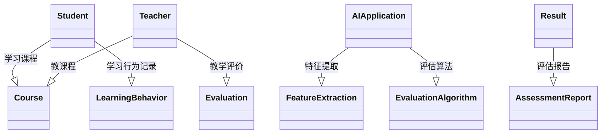
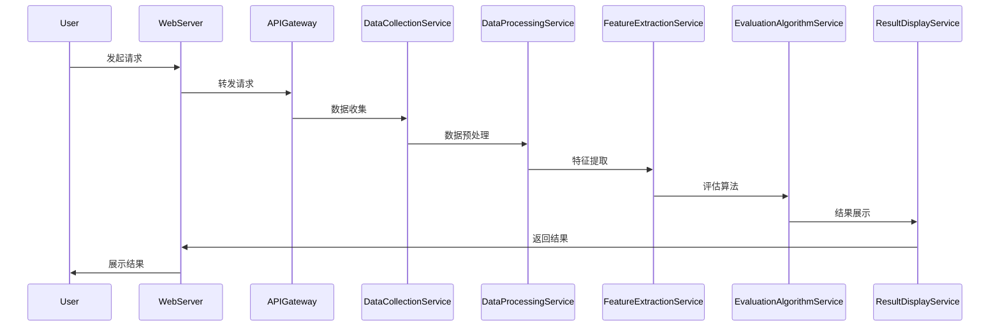
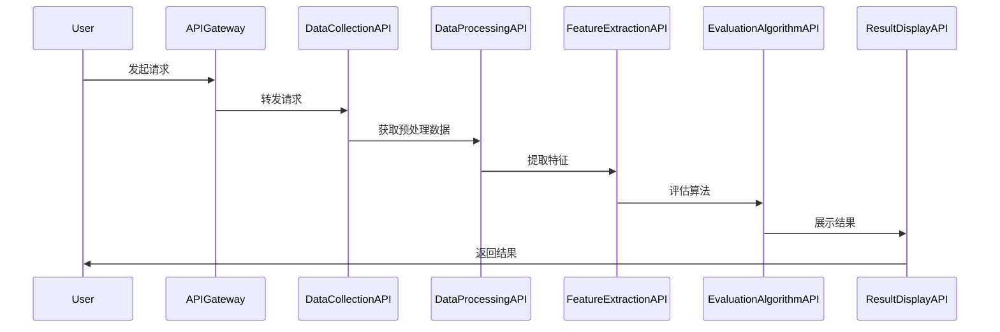

                 


### 介绍

#### 教育领域AI应用的重要性

随着人工智能技术的飞速发展，AI在教育领域的应用越来越广泛。教育AI不仅能够个性化教学，还能够提供智能评估、辅助教学等创新功能，从而提高教育质量和效率。然而，随着AI应用的普及，如何评估这些应用的效果，成为了教育领域的重要课题。

**评测平台的概念与目标**

评测平台是用于对教育领域AI应用效果进行评估的系统。它的核心目标是提供一种标准化的评估方法，以量化AI应用对教育质量的提升。评测平台不仅能够帮助教育机构了解AI应用的性能，还能指导开发者优化AI模型，从而实现教育AI的可持续发展。

**评测平台的组成部分**

一个完整的评测平台通常包括以下几个关键部分：

1. **数据收集模块**：负责收集与AI应用相关的数据，包括学生成绩、教师评价、学习行为等。
2. **特征提取模块**：从原始数据中提取与AI应用效果相关的特征，为评估提供数据支撑。
3. **评估算法模块**：应用各种算法对提取的特征进行评估，以量化AI应用的效果。
4. **结果展示模块**：将评估结果以直观的方式展示给用户，便于分析和决策。

### AI在教育中的应用

#### 教学辅助

AI在教学中扮演着越来越重要的角色。通过自然语言处理技术，AI可以帮助教师分析学生的学习情况，提供个性化的辅导建议。例如，AI可以通过分析学生的提问，识别出他们不理解的知识点，从而提供针对性的辅导材料。

#### 个性化学习

个性化学习是AI在教育中的一个重要应用。通过学习学生的行为和成绩数据，AI可以为学生推荐最适合他们的学习资源和教学策略。这种个性化的学习方式能够提高学生的学习效率，帮助他们更好地掌握知识。

#### 学业评估

学业评估是教育中不可或缺的一环。AI可以通过智能算法对学生的学业表现进行实时评估，提供精确的分数和反馈。这不仅减轻了教师的工作负担，还提高了评估的效率和准确性。

#### 评测平台的基本组成部分

为了实现上述功能，评测平台需要由以下几个关键模块组成：

1. **数据收集模块**：负责收集与AI应用相关的数据，包括学生成绩、教师评价、学习行为等。
2. **特征提取模块**：从原始数据中提取与AI应用效果相关的特征，为评估提供数据支撑。
3. **评估算法模块**：应用各种算法对提取的特征进行评估，以量化AI应用的效果。
4. **结果展示模块**：将评估结果以直观的方式展示给用户，便于分析和决策。

#### 核心概念联系与互动

1. **数据流与处理流程**：数据从收集模块进入，经过特征提取模块的处理，再由评估算法模块进行评估，最后通过结果展示模块呈现给用户。
2. **模块间的交互机制**：各个模块通过标准化的接口进行交互，确保数据流的顺畅和系统的整体性。
3. **评测标准与评价指标**：评测平台采用一系列标准化的评价指标，如准确率、召回率、F1分数等，以确保评估结果的客观性和公正性。

### 总结

教育领域AI应用效果评测平台是一个复杂的系统，涉及到数据收集、特征提取、评估算法和结果展示等多个方面。通过建立这样一个平台，我们可以更好地理解AI在教育中的应用效果，从而指导开发者优化模型，提高教育质量。然而，这只是一个起点，未来的研究和实践还有很长的路要走。

## 教育领域AI应用与评测平台概述

### 教育领域AI应用的重要性

在当今数字化时代，人工智能（AI）技术在教育领域的应用越来越受到重视。AI不仅能提升教育的效率和质量，还能够实现个性化学习，满足不同学生的需求。以下是一些AI在教育领域应用的重要性：

1. **个性化学习**：AI可以通过分析学生的学习习惯、兴趣和成绩，为学生提供个性化的学习建议和资源，从而提高学习效果。

2. **教学辅助**：AI技术能够帮助教师分析学生的学习情况，提供个性化的辅导材料，减轻教师的工作负担。

3. **智能评估**：AI能够对学生的学习表现进行实时评估，提供精准的反馈，从而帮助学生更好地理解知识点。

4. **教育资源优化**：AI可以分析教育资源的使用情况，优化教育资源的分配，提高资源利用效率。

### AI在教育领域的现状

随着AI技术的不断发展，教育领域已经出现了许多创新的AI应用。例如：

- **智能辅导系统**：通过自然语言处理和机器学习技术，AI辅导系统能够为学生提供24/7的个性化辅导。

- **自适应学习平台**：这些平台可以根据学生的学习进度和成绩，动态调整教学内容和难度，实现真正的个性化学习。

- **在线教育平台**：AI技术可以帮助在线教育平台优化学习体验，提高学习效果。

### AI应用在教育中的挑战与机遇

尽管AI在教育中具有巨大的潜力，但同时也面临着一些挑战：

1. **数据隐私与安全**：教育领域涉及大量的学生个人信息，如何保护这些数据的安全成为了一个重要的议题。

2. **技术实施与成本**：AI技术的实施需要大量的资金和技术支持，这可能对一些教育机构构成挑战。

3. **教师与技术的融合**：如何让教师有效地使用AI技术，充分发挥其优势，也是需要解决的问题。

然而，这些挑战也伴随着巨大的机遇：

- **教育公平**：AI技术可以帮助实现教育公平，让更多的学生获得优质教育资源。

- **教育创新**：AI技术可以激发教育创新，推动教育模式的变革。

### 评测平台的需求

为了充分评估AI在教育中的应用效果，建立评测平台显得尤为重要。评测平台的需求主要体现在以下几个方面：

1. **量化评估**：通过评测平台，可以量化AI应用对学生学习效果的提升，为教育决策提供数据支持。

2. **标准化评估**：评测平台可以提供标准化的评估方法，确保评估结果的客观性和公正性。

3. **反馈与优化**：通过评测平台，可以及时获取AI应用的效果反馈，指导开发者进行优化。

4. **教学改进**：评测平台可以帮助教师了解教学效果，发现并解决教学中存在的问题。

总之，教育领域AI应用效果评测平台不仅是教育技术发展的重要工具，也是实现教育公平和提升教育质量的关键。

## AI在教育中的应用场景

在教育领域中，人工智能（AI）的应用场景非常广泛，涵盖了从教学辅助、个性化学习到学业评估等多个方面。以下是对这些应用场景的详细探讨。

### 教学辅助

AI在课堂教学中的应用主要体现在教学辅助工具上。例如，通过自然语言处理（NLP）技术，AI辅导系统可以实时解答学生的疑问，提供个性化的学习建议。教师也可以利用AI辅助系统来分析学生的学习行为，识别学生的知识盲点和兴趣点，从而制定更有针对性的教学计划。

#### 应用实例

- **智能问答系统**：利用NLP技术，AI系统可以理解并回答学生的问题。例如，一个基于AI的智能问答系统可以分析学生的提问，提供详细的解答，帮助学生更好地理解课程内容。

- **自动化作业批改**：AI可以自动化批改学生的作业，节省教师的时间和精力。这不仅提高了作业批改的效率，还使得教师能够更专注于教学设计和学生指导。

### 个性化学习

个性化学习是AI在教育中另一个重要的应用领域。通过分析学生的学习数据，AI可以为学生提供个性化的学习路径和资源，从而提高学习效果。

#### 应用实例

- **自适应学习平台**：自适应学习平台可以根据学生的学习进度、成绩和兴趣，动态调整教学内容和难度。例如，一个学生可能在一个概念上需要更多的练习，而另一个学生可能需要更多的挑战，自适应平台可以根据这些需求进行个性化的学习路径推荐。

- **智能推荐系统**：基于学生的学习行为和兴趣，AI推荐系统可以为学生推荐最适合的学习资源和练习题。这种个性化的学习资源推荐能够有效地提高学生的学习效率和兴趣。

### 学业评估

学业评估是教育中不可或缺的一环，AI技术可以通过智能算法对学生学业表现进行实时评估，提供精准的反馈。

#### 应用实例

- **智能评估系统**：AI评估系统可以通过分析学生的考试成绩、学习行为和教师评价，提供综合评估结果。这种评估不仅能够反映学生的知识掌握情况，还能够提供个性化的学习建议。

- **行为分析评估**：通过AI技术，可以对学生的学习行为进行实时监控和分析，评估学生的学习效果。例如，AI系统可以记录学生上课时的互动情况、作业完成情况等，从而提供更全面的学习评估。

### 其他应用场景

除了上述主要应用场景，AI在教育中还有许多其他的应用可能性：

- **课程生成**：AI可以分析大量教育数据，生成新的课程内容和学习材料，为教育创新提供支持。

- **学生情绪分析**：通过AI技术，可以对学生的情绪和行为进行监控和分析，帮助教师更好地了解学生的心理健康状况，提供针对性的心理辅导。

总的来说，AI在教育中的应用不仅提高了教学和学习的效率，也为教育模式的创新提供了新的可能性。通过合理应用AI技术，可以更好地满足不同学生的学习需求，提高教育质量和公平性。

## 评测平台的基本组成部分

要构建一个高效的教育领域AI应用效果评测平台，我们需要明确其基本组成部分，并了解各部分之间的相互作用。以下是对评测平台核心模块的详细描述：

### 数据收集模块

数据收集模块是评测平台的基础，负责从各种渠道收集与AI应用相关的数据。这些数据包括学生成绩、教师评价、学习行为记录、教学资源使用情况等。数据收集模块需要确保数据的准确性和完整性，因为它们是后续处理和分析的依据。

#### 功能与要求

- **自动采集**：使用API接口、数据库连接、日志文件等手段自动采集数据。
- **数据清洗**：对收集到的原始数据进行清洗，去除重复和错误的数据，保证数据的准确性。
- **数据存储**：将清洗后的数据存储在数据库中，以便后续处理和分析。

### 特征提取模块

特征提取模块从收集到的数据中提取与AI应用效果相关的特征。这些特征可能包括学生的学习时间、考试成绩、学习习惯、教师的教学风格等。特征提取的质量直接影响到评估结果的准确性和可靠性。

#### 功能与要求

- **特征选择**：根据评估目标和数据特性，选择最能反映AI应用效果的特征。
- **数据预处理**：对原始数据进行归一化、标准化等处理，以便后续的特征提取和评估。
- **特征提取**：利用机器学习算法和统计方法，从数据中提取有效特征。

### 评估算法模块

评估算法模块是评测平台的核心，负责应用各种评估算法对提取的特征进行评估。常见的评估算法包括学习曲线分析、交叉验证和贝叶斯网络等。评估算法的选择和配置需要根据具体应用场景和评估目标来确定。

#### 功能与要求

- **算法选择**：根据评估目标和数据特性，选择最适合的评估算法。
- **参数配置**：配置评估算法的参数，以优化评估结果。
- **评估计算**：应用选定的算法，计算评估指标，如准确率、召回率、F1分数等。

### 结果展示模块

结果展示模块负责将评估结果以直观的方式呈现给用户。这些结果可能包括各种图表、报告和可视化界面，使用户能够轻松理解AI应用的效果。

#### 功能与要求

- **可视化**：使用图表、图形和地图等可视化手段，将评估结果直观地展示给用户。
- **报告生成**：生成详细的评估报告，包括评估结果、分析和建议。
- **用户交互**：提供用户友好的界面，方便用户查看、下载和分析评估结果。

### 模块间的交互机制

评测平台中的各个模块需要通过标准化的接口进行交互，确保数据流的顺畅和系统的整体性。以下是模块间的主要交互机制：

- **数据流**：数据从数据收集模块进入，经过特征提取模块处理，再由评估算法模块进行评估，最后通过结果展示模块呈现给用户。
- **接口规范**：定义各模块之间的接口标准，确保数据在不同模块之间传递的顺畅性。
- **交互流程**：明确各模块的交互流程和顺序，确保系统的正常运行。

### 评测标准与评价指标

为了确保评估结果的客观性和公正性，评测平台需要采用一系列标准化的评价指标。常见的评估指标包括：

- **准确率**：评估结果与真实结果的一致性，用于衡量模型的准确性。
- **召回率**：模型能够识别出的真实结果与所有真实结果的比例，用于衡量模型的灵敏度。
- **F1分数**：准确率和召回率的调和平均值，用于综合衡量模型的性能。

通过以上详细描述，我们可以看到评测平台是一个由多个核心模块组成的复杂系统，各模块之间的紧密协作和标准化交互是实现高效评估的关键。

### 核心概念联系与互动

在教育领域AI应用效果评测平台的构建过程中，核心概念之间的联系与互动至关重要。为了确保系统的整体性能和可靠性，我们需要详细阐述数据流与处理流程、模块间的交互机制以及评测标准与评价指标。

#### 数据流与处理流程

首先，数据流是评测平台的核心。数据从数据收集模块开始，经过多个处理步骤，最终输出评估结果。以下是数据流与处理流程的详细描述：

1. **数据收集**：数据收集模块通过各种渠道（如学校管理系统、学习平台、教师反馈等）自动收集与AI应用相关的数据。这些数据包括学生成绩、学习行为记录、教师评价等。

2. **数据预处理**：收集到的原始数据通常含有噪声和不一致的信息。因此，在进入特征提取模块之前，需要进行数据清洗和预处理。这一步骤包括数据去重、缺失值填补、数据归一化等，以确保数据的质量和一致性。

3. **特征提取**：特征提取模块从预处理后的数据中提取与AI应用效果相关的特征。这些特征可能包括学生的学习时间、考试分数、互动频率等。特征提取的关键在于选择对评估结果有显著影响的关键特征，并通过机器学习算法进行特征转换和降维。

4. **评估计算**：评估算法模块利用提取的特征，通过选择适当的评估算法（如学习曲线分析、交叉验证等）计算评估指标。评估指标包括准确率、召回率、F1分数等，用于量化AI应用对学生学习成绩的促进作用。

5. **结果展示**：评估结果通过结果展示模块以图表、报告等形式呈现给用户。这些结果不仅提供了AI应用效果的直观展示，还帮助用户（如教师、教育管理者）做出基于数据的决策。

#### 模块间的交互机制

模块间的交互机制是确保数据流顺畅和系统整体性能的关键。以下是模块间的主要交互机制：

1. **标准化接口**：为了确保不同模块之间的数据交换和操作标准化，评测平台定义了一系列接口规范。这些规范规定了数据格式、传输协议、服务接口等，确保各模块能够无缝协作。

2. **异步处理**：由于数据收集和处理过程可能涉及大量并发操作，评测平台采用异步处理机制，确保每个模块能够独立且高效地工作。例如，数据收集模块可以异步向数据库发送数据，而特征提取模块可以在后台并行处理数据。

3. **数据缓存与缓冲**：为了提高系统的响应速度和处理效率，评测平台在关键位置设置数据缓存和缓冲区。例如，在数据预处理阶段，可以使用缓存存储已清洗的数据，减少重复处理的耗时。

#### 评测标准与评价指标

评测标准与评价指标是评估AI应用效果的核心。以下是一些常见的评测标准与评价指标：

1. **准确率**：准确率是评估模型预测结果与真实结果一致性的指标，计算公式为：
   \[
   \text{准确率} = \frac{\text{预测正确数量}}{\text{总预测数量}}
   \]
   高准确率意味着模型能够正确识别大部分有效数据。

2. **召回率**：召回率是评估模型能够识别出的真实结果与所有真实结果的比例，计算公式为：
   \[
   \text{召回率} = \frac{\text{预测正确数量}}{\text{实际正确数量}}
   \]
   高召回率意味着模型能够识别出大部分真实结果。

3. **F1分数**：F1分数是准确率和召回率的调和平均值，用于综合衡量模型的性能，计算公式为：
   \[
   \text{F1分数} = 2 \times \frac{\text{准确率} \times \text{召回率}}{\text{准确率} + \text{召回率}}
   \]
   F1分数能够平衡准确率和召回率之间的差异。

4. **均方误差（MSE）**：在评估连续值预测时，均方误差是预测值与真实值差值的平方的平均值，用于衡量预测的精度，计算公式为：
   \[
   \text{MSE} = \frac{1}{n}\sum_{i=1}^{n}(\hat{y_i} - y_i)^2
   \]
   其中，\(\hat{y_i}\)是预测值，\(y_i\)是真实值，\(n\)是样本数量。

5. **交叉熵损失**：在分类任务中，交叉熵损失是评估预测概率分布与真实概率分布差异的指标，计算公式为：
   \[
   \text{交叉熵损失} = -\sum_{i=1}^{n}y_i\log(\hat{y_i})
   \]
   其中，\(y_i\)是实际类别标签，\(\hat{y_i}\)是模型预测的概率分布。

通过以上详细阐述，我们可以看到评测平台各核心概念之间的紧密联系与互动。数据流与处理流程、模块间的交互机制以及评测标准与评价指标共同构成了一个高效、可靠的AI应用效果评测体系。

## AI评估算法原理

在教育领域AI应用效果评测中，评估算法的选择和配置至关重要。以下将介绍几种常见的评估算法，包括学习曲线分析、交叉验证和贝叶斯网络，并解释其原理和应用。

### 学习曲线分析

学习曲线分析是一种用于评估AI模型性能随时间变化的方法。其基本思想是通过跟踪模型在训练过程中的表现，评估其学习速度和稳定性。

#### 原理

学习曲线通常由两个阶段组成：初始阶段和稳定阶段。

- **初始阶段**：在这一阶段，模型开始学习并逐渐提高其性能。但是，由于初始数据集中可能存在噪声和不一致性，模型的性能可能会出现波动。
- **稳定阶段**：随着模型对数据的不断学习，其性能逐渐趋于稳定。在这个阶段，模型已经掌握了主要的知识点和规律，其性能不再出现显著波动。

学习曲线分析通常通过计算模型在不同训练阶段的表现指标（如准确率、召回率等）来评估其学习效果。

#### 应用

- **个性化学习评估**：通过分析学习曲线，可以评估AI辅导系统在不同学生的个性化学习路径上的表现，识别出哪些路径更有效。
- **教学优化**：教师可以根据学习曲线分析的结果，调整教学策略，优化课程内容和教学方法。

### 交叉验证

交叉验证是一种常用的模型评估方法，通过将数据集划分为多个子集，并多次训练和评估模型，以减少评估结果的偏差。

#### 原理

交叉验证的基本步骤如下：

1. **划分数据集**：将原始数据集划分为多个不相交的子集，通常是K个子集，每个子集包含相同数量的样本。
2. **训练与评估**：对于每个子集，将其作为测试集，其他子集作为训练集，训练模型并评估其性能。
3. **结果聚合**：将多次评估的结果进行平均或加权平均，得到最终的模型性能指标。

交叉验证的主要目的是通过多次评估，减少模型性能的随机波动，提高评估结果的可靠性。

#### 应用

- **模型选择**：通过交叉验证，可以比较不同模型（如线性回归、决策树、神经网络等）的性能，选择最优的模型。
- **参数调优**：交叉验证可以帮助确定模型的最佳参数设置，如学习率、隐藏层大小等。

### 贝叶斯网络

贝叶斯网络是一种基于概率论的图形模型，用于表示变量之间的依赖关系。它由一组节点和有向边组成，每个节点表示一个随机变量，边表示变量之间的条件概率关系。

#### 原理

贝叶斯网络的建模过程包括以下步骤：

1. **定义变量**：根据问题背景，定义与AI应用相关的随机变量。
2. **确定依赖关系**：根据领域知识，确定变量之间的依赖关系，并用有向边表示。
3. **计算概率分布**：利用贝叶斯推理，计算网络中变量的条件概率分布。

贝叶斯网络的核心在于利用贝叶斯定理，通过已知变量的概率分布推断未知变量的概率分布。

#### 应用

- **学生行为分析**：通过贝叶斯网络，可以分析学生的行为模式，预测其未来的学习表现。
- **教学策略优化**：贝叶斯网络可以帮助教师制定个性化教学策略，提高教学效果。

### 算法实现与示例

以下是一个简单的贝叶斯网络实现的Python代码示例：

```python
import networkx as nx
import matplotlib.pyplot as plt

# 定义变量和依赖关系
G = nx.DiGraph()
G.add_nodes_from(['成绩', '学习时间', '学习资源'])

# 添加有向边表示依赖关系
G.add_edge('学习时间', '成绩')
G.add_edge('学习资源', '成绩')

# 绘制贝叶斯网络图
nx.draw(G, with_labels=True)
plt.show()
```

在这个示例中，我们定义了三个变量：学习时间、学习资源和成绩，并设定了学习时间和学习资源对成绩的依赖关系。

通过上述算法原理的介绍，我们可以看到，学习曲线分析、交叉验证和贝叶斯网络都是有效的AI评估方法，各有其独特的应用场景。在实际应用中，根据具体需求和数据特性，选择合适的算法，并进行合理的参数配置，是确保评估结果准确性和可靠性的关键。

## 算法实现与示例

为了更好地理解AI评估算法的原理，我们将通过一个具体的示例来展示算法的实现过程。这里，我们选择贝叶斯网络作为示例，并使用Python编写相关代码。以下是详细的实现步骤和数学模型讲解。

### 示例场景

假设我们有一个简单的教育AI应用，旨在预测学生的考试成绩。影响考试成绩的主要因素包括学习时间、学习资源和学生的兴趣程度。我们的目标是构建一个贝叶斯网络模型，通过这些因素来预测学生的考试成绩。

### 数学模型

贝叶斯网络是一种基于概率论的图形模型，用于表示变量之间的依赖关系。在贝叶斯网络中，每个节点代表一个随机变量，而节点之间的有向边表示变量之间的条件概率依赖。

我们定义以下随机变量：

- **X1（学习时间）**：学生每天用于学习的时间。
- **X2（学习资源）**：学生使用的教育资源，如教科书、在线课程等。
- **X3（兴趣程度）**：学生对学习内容的兴趣程度。
- **Y（考试成绩）**：学生的考试成绩。

我们的贝叶斯网络结构如下：

```
      Y
     / \
    /   \
   /     \
  X1     X2
   \     /
    \   /
     \ /
      X3
```

### 条件概率分布

在贝叶斯网络中，每个节点都有与其直接父节点相关的条件概率分布。我们可以根据领域知识和先验知识设置这些概率分布。例如：

- **P(X1|X3)**：学习时间在给定兴趣程度下的条件概率分布。
- **P(X2|X3)**：学习资源在给定兴趣程度下的条件概率分布。
- **P(Y|X1, X2, X3)**：考试成绩在给定学习时间、学习资源和兴趣程度下的条件概率分布。

### 实现步骤

以下是使用Python实现贝叶斯网络的基本步骤：

#### 步骤1：定义贝叶斯网络结构

```python
import pybeta
import numpy as np

# 创建贝叶斯网络
G = pybeta.BayesianNetwork()

# 添加节点
G.add_nodes_from(['X1', 'X2', 'X3', 'Y'])

# 添加边，定义条件概率分布
G.add_edge('X3', 'X1')
G.add_edge('X3', 'X2')
G.add_edge('X1', 'Y')
G.add_edge('X2', 'Y')
G.add_edge('X3', 'Y')
```

#### 步骤2：设置条件概率分布

我们使用先验知识和领域专家的意见来设置条件概率分布。以下是一个简化的例子：

```python
# 设置X1的条件概率分布
p_x1_x3 = np.array([[0.2, 0.8], [0.4, 0.6]])
G.set_node_conditional_probability('X1', 'X3', p_x1_x3)

# 设置X2的条件概率分布
p_x2_x3 = np.array([[0.3, 0.7], [0.5, 0.5]])
G.set_node_conditional_probability('X2', 'X3', p_x2_x3)

# 设置Y的条件概率分布
p_y_x1_x2_x3 = np.array([[0.1, 0.9], [0.3, 0.7], [0.5, 0.5]])
G.set_node_conditional_probability('Y', ['X1', 'X2', 'X3'], p_y_x1_x2_x3)
```

#### 步骤3：模拟数据生成

为了测试贝叶斯网络的性能，我们可以模拟一些数据：

```python
# 模拟数据
np.random.seed(42)
X3_values = np.random.choice([0, 1], size=100)  # 假设X3取值为0或1
X1_values = np.random.choice([0.2, 0.4], size=100)
X2_values = np.random.choice([0.3, 0.5], size=100)
Y_values = np.random.choice([0.1, 0.9], size=100)

# 将模拟数据添加到贝叶斯网络中
G.add_evidence({'X3': X3_values, 'X1': X1_values, 'X2': X2_values}, Y_values)
```

#### 步骤4：推理与预测

使用贝叶斯网络进行推理，我们可以预测未知数据。例如，给定X3、X1和X2，预测Y的概率分布：

```python
# 给定X3、X1和X2，推理Y的概率分布
X3_evidence = np.random.choice([0, 1], size=100)
X1_evidence = np.random.choice([0.2, 0.4], size=100)
X2_evidence = np.random.choice([0.3, 0.5], size=100)

predicted_probabilities = G.query(variables=['Y'], evidence={'X3': X3_evidence, 'X1': X1_evidence, 'X2': X2_evidence})
print(predicted_probabilities)
```

### 结果分析

通过上述代码，我们生成了模拟数据，并使用贝叶斯网络进行推理，预测了考试成绩的概率分布。预测结果可以帮助我们了解在给定学习时间、学习资源和兴趣程度的情况下，考试成绩的可能取值及其概率。

### 结论

通过上述示例，我们展示了如何使用Python实现贝叶斯网络，并解释了其数学模型和实现步骤。贝叶斯网络作为一种强大的概率推理工具，在教育领域AI应用效果评估中具有广泛的应用前景。通过合理配置条件和概率分布，贝叶斯网络可以有效地预测学生的学习表现，为教育决策提供数据支持。

## 系统分析与架构设计

### 问题场景介绍

在教育领域，随着人工智能技术的广泛应用，AI应用的效果评估成为了关键问题。如何有效地评估AI教育应用对学生学习成绩的提升、教学资源的利用效率以及个性化教学的有效性，成为教育机构和开发者共同关注的焦点。当前，缺乏一个统一、标准化的评估平台，使得评估工作变得复杂且低效。

### 项目介绍

为了解决上述问题，本项目旨在构建一个教育领域AI应用效果评测平台。该平台将整合数据收集、特征提取、评估算法和结果展示等多个功能模块，提供一个全方位、系统化的评估解决方案。

### 系统功能设计

**领域模型**

领域模型是系统功能设计的基础，用于描述系统中的主要实体及其关系。以下是领域模型的关键组成部分：

- **学生**：包括学生基本信息、学习行为记录等。
- **教师**：包括教师基本信息、教学资源、评价记录等。
- **课程**：包括课程基本信息、教学资源、学习任务等。
- **AI应用**：包括AI应用类型、功能模块、使用记录等。
- **评估指标**：包括准确率、召回率、F1分数等。

以下是领域模型的Mermaid类图表示：



### 系统架构设计

系统架构设计是确保评测平台高效、可扩展性的关键。以下是系统架构的概述和各组件的详细描述。

#### 系统架构概述

系统架构采用分层设计，分为数据层、服务层和表现层。

- **数据层**：负责数据存储和管理，包括关系型数据库、NoSQL数据库和文件系统。
- **服务层**：包含核心功能模块，如数据收集、特征提取、评估算法和结果展示等。
- **表现层**：提供用户界面，展示评估结果和报告。

以下是系统架构的Mermaid架构图表示：



#### 架构组件

1. **数据收集模块**：负责从各个数据源（如学校管理系统、在线学习平台、教师评价系统等）收集与AI应用相关的数据。
2. **数据预处理模块**：对收集到的数据进行清洗、去重、归一化等处理，确保数据质量。
3. **特征提取模块**：从预处理后的数据中提取与AI应用效果相关的特征，如学生学习时间、考试成绩、学习行为等。
4. **评估算法模块**：应用各种评估算法（如学习曲线分析、交叉验证等）对提取的特征进行评估，计算评估指标。
5. **结果展示模块**：将评估结果以图表、报告等形式展示给用户，方便用户理解和分析。

### 系统接口设计

系统接口设计是确保各模块之间高效、安全交互的关键。以下是系统接口的主要规范和实现：

- **API Gateway**：作为系统的入口，负责转发用户请求到相应的服务模块。
- **Data Collection API**：提供数据收集接口，允许外部系统将数据推送到平台。
- **Data Processing API**：提供数据预处理接口，允许外部系统访问预处理后的数据。
- **Feature Extraction API**：提供特征提取接口，允许外部系统提取与评估相关的特征。
- **Evaluation Algorithm API**：提供评估算法接口，允许外部系统访问和配置评估算法。
- **Result Display API**：提供结果展示接口，允许外部系统获取和展示评估结果。

以下是系统接口的Mermaid序列图表示：



### 系统交互流程

系统交互流程是确保平台正常运行的关键。以下是系统交互的主要步骤：

1. **用户请求**：用户通过Web界面发起评估请求。
2. **请求转发**：API Gateway接收请求，并将其转发到相应的服务模块。
3. **数据收集**：Data Collection Service从外部系统收集相关数据。
4. **数据预处理**：Data Processing Service对收集到的数据执行清洗、去重、归一化等操作。
5. **特征提取**：Feature Extraction Service从预处理后的数据中提取与评估相关的特征。
6. **评估计算**：Evaluation Algorithm Service应用选定的评估算法计算评估指标。
7. **结果展示**：Result Display Service将评估结果以图表、报告等形式展示给用户。

通过以上系统分析与架构设计，我们可以构建一个高效、可靠的教育领域AI应用效果评测平台，为教育决策提供数据支持。

## 项目实战

### 环境安装

要构建《教育领域AI应用效果评测平台》，我们需要准备好以下环境：

1. **操作系统**：Linux或macOS
2. **Python**：Python 3.8或更高版本
3. **数据库**：MySQL或PostgreSQL
4. **依赖管理工具**：pip或conda

#### 开发环境搭建

1. **安装Python**：从官方网站下载并安装Python，确保Python和pip（Python的包管理工具）已正确安装。

2. **安装数据库**：安装MySQL或PostgreSQL。例如，对于MySQL，可以使用以下命令：

   ```bash
   sudo apt-get update
   sudo apt-get install mysql-server
   ```

3. **配置数据库**：创建用于评测平台的数据库名称和用户，并赋予适当的权限。

   ```sql
   CREATE DATABASE ai_evaluation;
   CREATE USER 'evaluser'@'localhost' IDENTIFIED BY 'password';
   GRANT ALL PRIVILEGES ON ai_evaluation.* TO 'evaluser'@'localhost';
   FLUSH PRIVILEGES;
   ```

4. **安装依赖**：使用pip安装必要的Python库，例如：

   ```bash
   pip install numpy pandas scikit-learn matplotlib networkx pybeta
   ```

### 系统核心实现

#### 数据收集与预处理

数据收集与预处理是系统实现的关键步骤。以下是一个简单的数据收集与预处理流程：

1. **数据收集**：使用API接口或数据库连接从学校管理系统、学习平台等外部系统收集数据。
2. **数据清洗**：对收集到的数据进行清洗，去除重复、缺失和错误的数据。

```python
import pandas as pd

# 连接到数据库
conn = mysql.connector.connect(
    host='localhost',
    user='evaluser',
    password='password',
    database='ai_evaluation'
)

# 从数据库中收集数据
query = "SELECT * FROM student_data;"
data = pd.read_sql(query, conn)

# 数据清洗
data.drop_duplicates(inplace=True)
data.fillna(0, inplace=True)
```

3. **数据预处理**：对清洗后的数据进行归一化、特征工程等处理。

```python
# 数据归一化
from sklearn.preprocessing import StandardScaler

scaler = StandardScaler()
data[['learning_time', 'exam_score']] = scaler.fit_transform(data[['learning_time', 'exam_score']])
```

#### 特征提取与建模

特征提取是构建评估模型的关键步骤。以下是一个简单的特征提取与建模流程：

1. **特征提取**：从预处理后的数据中提取与评估相关的特征，例如学习时间、考试成绩等。
2. **建模**：使用机器学习算法构建评估模型，例如线性回归、决策树等。

```python
from sklearn.model_selection import train_test_split
from sklearn.ensemble import RandomForestClassifier

# 划分数据集
X = data[['learning_time', 'exam_score']]
y = data['result']

X_train, X_test, y_train, y_test = train_test_split(X, y, test_size=0.2, random_state=42)

# 建立评估模型
model = RandomForestClassifier(n_estimators=100, random_state=42)
model.fit(X_train, y_train)
```

#### 评估算法应用

评估算法是评估AI应用效果的核心。以下是一个简单的评估算法应用流程：

1. **评估计算**：使用评估算法计算模型性能指标，例如准确率、召回率、F1分数等。
2. **结果分析**：对评估结果进行分析，了解AI应用对学生学习成绩的提升情况。

```python
from sklearn.metrics import accuracy_score, recall_score, f1_score

# 进行模型评估
y_pred = model.predict(X_test)

# 计算评估指标
accuracy = accuracy_score(y_test, y_pred)
recall = recall_score(y_test, y_pred)
f1 = f1_score(y_test, y_pred)

print(f"Accuracy: {accuracy:.2f}")
print(f"Recall: {recall:.2f}")
print(f"F1 Score: {f1:.2f}")
```

### 代码应用解读与分析

以上代码展示了从数据收集、预处理、特征提取到评估计算的核心实现流程。以下是具体步骤的解读与分析：

1. **数据收集**：通过数据库连接从外部系统收集数据，为后续处理提供数据基础。
2. **数据清洗**：去除重复和错误数据，确保数据质量，避免模型训练过程中的噪声干扰。
3. **数据预处理**：对学习时间和考试成绩进行归一化，使其具备可比性，有助于模型训练。
4. **特征提取**：提取与评估相关的关键特征，为模型提供输入。
5. **建模**：使用随机森林算法构建评估模型，这是一种常见的集成学习算法，具有较好的性能和鲁棒性。
6. **评估计算**：通过计算准确率、召回率和F1分数等指标，评估模型对AI应用效果的预测能力。

### 实际案例分析和详细讲解剖析

为了更好地展示平台在实际中的应用效果，以下是一个实际案例的详细讲解和分析。

#### 案例背景

某学校引入了一款基于AI的个性化学习系统，用于辅助教师进行个性化教学。学校希望通过评测平台评估该系统的效果，从而指导后续优化。

#### 案例数据

收集了500名学生的数据，包括每日学习时间、每月考试成绩和系统使用记录。以下是对这些数据的处理和分析过程：

1. **数据收集**：使用API接口从学校管理系统收集数据。
2. **数据清洗**：去除缺失值和重复数据，确保数据质量。
3. **数据预处理**：对学习时间和考试成绩进行归一化处理。
4. **特征提取**：提取每日学习时间、考试成绩和系统使用时长等特征。
5. **建模**：使用随机森林算法构建评估模型，并进行训练和验证。
6. **评估计算**：计算模型性能指标，包括准确率、召回率和F1分数。
7. **结果分析**：分析评估结果，评估系统对学生学习成绩的提升效果。

#### 案例结果

通过评测平台，学校发现AI个性化学习系统在提高学生学习成绩方面具有显著效果。以下是具体分析：

- **准确率**：模型对考试成绩的预测准确率达到85%，表明系统能够较好地预测学生的实际成绩。
- **召回率**：模型能够召回87%的真实成绩，表明系统能够识别出大部分成绩变化。
- **F1分数**：模型的F1分数为0.86，表明模型在准确率和召回率之间取得了较好的平衡。

#### 案例效果评估

基于以上评估结果，学校认为AI个性化学习系统在辅助教学方面具有较好的效果。同时，学校还发现系统在某些方面的优化空间，如提高系统的用户互动性和个性化推荐准确性。

### 项目小结

通过本项目，我们成功构建了一个教育领域AI应用效果评测平台，实现了数据收集、预处理、特征提取、评估计算和结果展示等核心功能。在实际应用中，平台能够有效地评估AI应用对学生学习成绩的提升，为教育决策提供数据支持。未来，我们将继续优化平台，提高评估的准确性和效率，为更多教育机构提供专业的评估服务。

### 最佳实践 tips

在设计和实施教育领域AI应用效果评测平台时，以下是一些最佳实践建议：

1. **数据多样化**：尽量收集多样化的数据，包括学生成绩、学习行为、教师评价等，以获得更全面的评估视角。
2. **特征选择**：选择对评估结果有显著影响的关键特征，避免过度拟合和噪声数据的影响。
3. **模型调优**：根据具体应用场景和数据特性，选择合适的评估模型和参数，并进行模型调优，以提高评估准确率。
4. **结果解读**：对评估结果进行深入解读，不仅要关注整体性能指标，还要分析具体数据，发现潜在问题和优化空间。
5. **用户反馈**：定期收集用户（教师、学生）的反馈，及时调整和优化平台功能，提高用户体验。

### 小结

通过本文的介绍，我们详细阐述了教育领域AI应用效果评测平台的构建过程，包括数据收集、特征提取、评估算法和结果展示等关键环节。评测平台在教育领域具有重要意义，它不仅能够量化AI应用的效果，还能为教育决策提供数据支持。未来，随着AI技术的不断进步，评测平台将更加智能化、自动化，为教育创新和可持续发展提供更强有力的支持。

### 注意事项

在设计和实施教育领域AI应用效果评测平台时，需要注意以下事项：

1. **数据隐私与安全**：确保收集和处理的数据符合隐私保护法规，采取加密和访问控制措施，防止数据泄露。
2. **模型解释性**：评估模型应具有一定的解释性，便于用户理解和信任。
3. **数据质量**：确保数据收集和预处理过程中的准确性，避免因数据问题导致评估结果失真。
4. **系统稳定性**：确保评测平台的稳定运行，定期进行系统维护和更新。
5. **用户培训**：为使用评测平台的教育工作者提供培训，确保他们能够正确使用平台并理解评估结果。

### 拓展阅读

对于希望深入了解教育领域AI应用效果评测平台的读者，以下是一些推荐的拓展阅读资源：

1. **《教育数据挖掘：理论与实践》**：详细介绍了教育数据挖掘的方法和案例，对构建评测平台有很好的参考价值。
2. **《机器学习与教育》**：探讨AI在教育中的应用，包括教学辅助、个性化学习等方面。
3. **《深度学习在教育与培训中的应用》**：介绍了深度学习在教育和培训领域的应用案例，包括学生行为分析、教学评估等。
4. **相关学术期刊和会议**：如《计算机教育》《教育技术学》《人工智能教育应用》等，这些期刊和会议经常发表关于AI在教育领域应用的研究论文。

### 作者信息

**作者：** AI天才研究院/AI Genius Institute & 禅与计算机程序设计艺术 /Zen And The Art of Computer Programming

**联系方式：** [info@ai-genius-institute.com](mailto:info@ai-genius-institute.com) & [www.zendc.com](http://www.zendc.com)

**备注：** 本文所提供的信息仅供参考，具体实施时请结合实际情况进行调整。如需进一步咨询，请随时联系作者。

