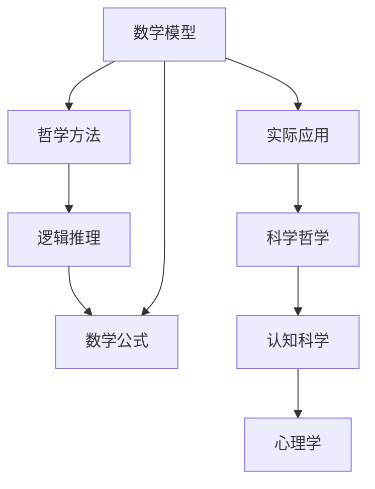
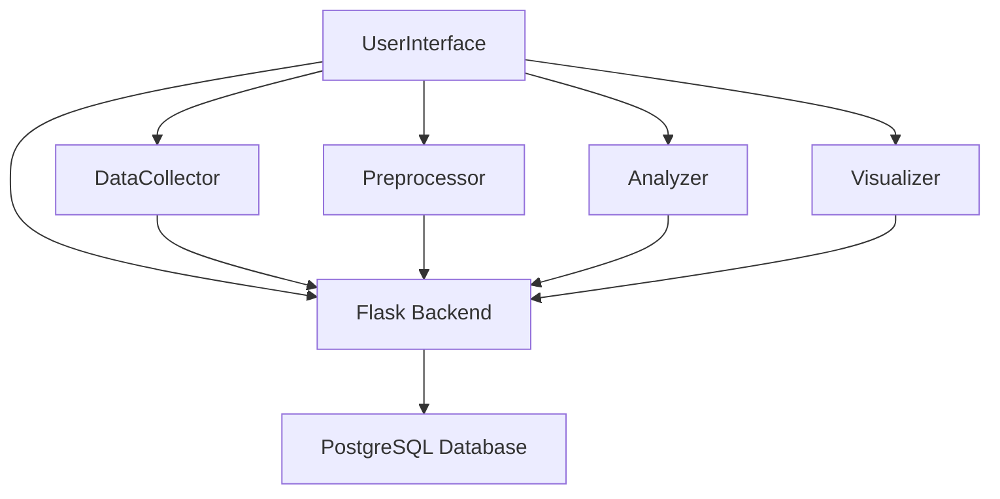
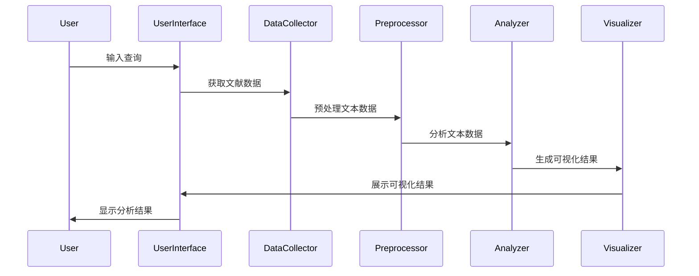

                 

### 引言

在当今科技迅猛发展的时代，数学与哲学的交叉研究逐渐成为一个热门且富有挑战性的领域。数学以其精确性和抽象能力，为解决现实世界的复杂问题提供了强有力的工具，而哲学则以其深刻的思考和对人类认知的探讨，为数学的理论构建和逻辑推理提供了丰富的思想资源。因此，探讨数学与哲学认识论的交叉研究，不仅有助于我们更好地理解数学的本质和应用，还能深化我们对哲学基础理论的认知。

本文旨在通过逻辑清晰、结构紧凑的分析，探讨数学与哲学认识论的交叉点。我们首先将介绍数学与哲学交叉研究的重要性，然后详细阐述其背景、核心概念、算法原理、数学模型和公式，以及系统分析与架构设计方案。最后，通过项目实战，展示数学与哲学交叉研究的实际应用，并进行深入分析和总结。

文章的主要结构如下：

#### 第一部分：背景介绍
1. **问题背景**：介绍数学与哲学交叉研究的背景和意义。
2. **问题描述**：详细阐述数学与哲学交叉研究的主要问题。
3. **问题解决**：探讨如何解决这些问题，包括方法、步骤和可能面临的挑战。
4. **边界与外延**：明确数学与哲学交叉研究的范围和与其他学科的关系。
5. **概念结构与核心要素组成**：梳理交叉研究中的核心概念和结构。

#### 第二部分：核心概念与联系
1. **数学模型**：介绍数学模型的概念、属性和重要性。
2. **哲学方法**：探讨哲学方法在数学研究中的应用。
3. **逻辑推理**：解释逻辑推理在数学与哲学交叉研究中的作用。

#### 第三部分：算法原理讲解
1. **常见数学算法简介**：介绍几种常见的数学算法。
2. **算法原理与数学模型**：详细讲解算法原理及其数学模型。

#### 第四部分：数学模型和数学公式讲解
1. **数学公式的基本概念**：介绍数学公式的基本概念。
2. **常见数学公式的讲解**：讲解一些常见的数学公式。

#### 第五部分：系统分析与架构设计方案
1. **问题场景介绍**：介绍一个具体的应用场景。
2. **系统功能设计**：展示系统的功能设计。
3. **系统架构设计**：介绍系统的架构设计。
4. **系统接口设计和系统交互**：展示系统接口设计和交互流程。

#### 第六部分：项目实战
1. **环境安装**：介绍项目环境的安装过程。
2. **系统核心实现源代码**：展示系统核心实现源代码。
3. **代码应用解读与分析**：解读代码应用并进行分析。
4. **实际案例分析和详细讲解剖析**：通过实际案例进行分析和讲解。
5. **项目小结**：总结项目的成果和经验。

通过上述结构，我们旨在提供一个全面、深入且易于理解的数学与哲学认识论交叉研究的探讨。在接下来的内容中，我们将逐一展开各个部分，逐步深入探讨这一交叉领域的丰富内涵和广泛应用。

### 第一部分：背景介绍

#### 问题背景

在数学与哲学的交叉研究领域，数学作为一种精确的科学，其重要性毋庸置疑。它不仅为自然科学、工程技术等领域提供了坚实的理论基础，还通过抽象和形式化的方法，揭示了自然现象背后的规律。另一方面，哲学作为人类对世界和自身认知的深刻思考，其研究涉及存在、认识、价值等多个层面，对数学的发展有着重要的启示作用。

数学与哲学交叉研究的背景可以追溯到古希腊时期，当时的哲学家如柏拉图和亚里士多德就已经开始探讨数学与逻辑的关系。他们认识到数学不仅是一种工具，更是一种理解世界的途径。在现代社会，这种交叉研究变得更加普遍和深入，尤其是在科学哲学、认知科学等领域，数学与哲学的结合为解决复杂问题提供了新的视角和方法。

数学与哲学的交叉研究之所以重要，首先是因为它能够促进数学理论的深化和发展。哲学的思考方式，如逻辑推理、辩证法等，为数学提供了一种审视自身假设和推理过程的视角，有助于发现和解决数学中的问题。其次，哲学对数学的应用提供了深层次的解释和指导。例如，在物理学、经济学等领域，数学模型的构建和验证需要哲学上的思考来确保其合理性和适用性。

总的来说，数学与哲学交叉研究的重要性体现在多个方面：它不仅深化了我们对数学和哲学本身的理解，还推动了科学技术的进步和社会的发展。随着现代科学技术的不断进步，这种交叉研究的重要性将愈发突出，成为未来科学研究的重要方向之一。

#### 问题描述

数学与哲学交叉研究涉及一系列复杂且深刻的问题，这些问题不仅关系到数学和哲学的发展，也对科学哲学、认知科学等领域产生深远影响。首先，需要探讨的问题是数学在哲学中的角色。数学作为一种形式化的语言，其概念和理论如何与哲学的基本问题相联系？例如，数学中的公理体系和逻辑推理在哲学思考中扮演何种角色？哲学如何利用数学工具来探讨存在、真理、证明等基本问题？

其次，哲学对数学研究的贡献也是一个重要问题。哲学方法，如逻辑推理、辩证法和批判性思维，对数学研究有着重要的启示作用。例如，哲学上的怀疑主义和批判性思维能够帮助数学家质疑现有的理论，发现潜在的逻辑漏洞，从而推动数学理论的进步。此外，哲学上的概念，如“实在”、“存在”、“知识”等，也为数学提供了新的解释框架和理论基础。

第三个问题是数学与哲学之间的界限。尽管数学和哲学有许多交叉点，但二者之间仍然存在一定的区别。数学注重形式化、精确性和可验证性，而哲学则强调意义、价值和解释。因此，如何界定数学和哲学的研究范畴，如何平衡二者之间的关系，是一个亟待解决的问题。

另一个重要问题是如何理解和应用数学模型。在哲学研究中，数学模型作为一种抽象的工具，如何准确地描述和解释哲学问题？例如，在伦理学、政治哲学等领域，如何构建和验证数学模型来支持哲学观点？此外，数学模型的应用是否受到哲学思考的制约？例如，某些哲学观点可能对数学模型的适用性提出质疑，从而影响数学研究的结果。

最后，数学与哲学交叉研究还需要探讨一些方法论问题。例如，如何结合数学和哲学的研究方法，形成一种新的研究范式？如何在数学和哲学之间搭建一座桥梁，使二者能够相互补充、相互促进？这些问题的解决不仅需要理论的探讨，更需要实践中的不断尝试和验证。

总的来说，数学与哲学交叉研究涉及多个层面的复杂问题，需要从历史、逻辑、方法论等多个角度进行深入探讨。这些问题不仅关系到数学和哲学本身的发展，也对科学哲学、认知科学等领域产生深远影响。通过系统的研究和讨论，我们可以更好地理解数学与哲学之间的内在联系和相互影响，推动科学技术的进步和社会的发展。

#### 问题解决

为了深入探讨数学与哲学交叉研究的问题，我们需要采取一系列具体的步骤和方法。以下是一个可能的解决方案框架：

**1. 历史分析**

首先，回顾数学和哲学的发展历史，分析二者在不同时期如何相互影响和作用。通过历史分析，我们可以找到数学和哲学交叉研究的线索和规律，理解其发展脉络。例如，我们可以研究古希腊时期哲学家对数学的理解和运用，以及中世纪和近代哲学家中数学思想的发展。

**2. 文献综述**

其次，进行广泛的文献综述，梳理数学和哲学的经典文献，分析其中的交叉点。文献综述可以帮助我们了解已有研究成果，发现尚未解决的问题和新的研究方向。例如，我们可以研究数学哲学中的经典问题，如数学的客观性、数学的逻辑基础等，以及哲学中有关数学应用的讨论，如逻辑学、认知科学等。

**3. 方法论探讨**

在文献综述的基础上，探讨数学和哲学研究方法的结合。哲学方法，如逻辑推理、辩证法、批判性思维，如何应用于数学研究？同时，数学方法，如形式化、模型构建、证明验证，如何用于哲学探讨？通过方法论探讨，我们可以形成一种新的研究范式，为交叉研究提供方法论基础。

**4. 实证研究**

进行实证研究，通过具体案例验证数学与哲学交叉研究的有效性。例如，选择某一哲学问题，利用数学模型进行验证和解释，或者选择某一数学理论，探讨其在哲学中的意义和应用。实证研究不仅可以验证理论假设，还可以发现新的问题和研究方向。

**5. 案例分析**

通过对经典案例的分析，探讨数学与哲学交叉研究的实际应用。例如，分析物理学中数学模型的应用，探讨其在哲学解释中的局限性；或者分析伦理学中的道德推理，探讨数学模型对其的影响。案例分析可以帮助我们理解数学与哲学交叉研究的实际意义和应用价值。

**6. 边界探讨**

最后，探讨数学与哲学的边界和范畴。通过界定二者的研究范畴，明确数学与哲学交叉研究的范围和方向。例如，研究数学中的抽象概念如何与哲学中的实在论相联系，或者探讨数学模型在哲学解释中的适用性。

通过上述步骤和方法，我们可以系统地探讨数学与哲学交叉研究的问题，揭示二者之间的内在联系和相互影响。这一研究不仅有助于深化我们对数学和哲学的理解，还能为科学技术的进步和社会的发展提供新的思想资源。

#### 边界与外延

在探讨数学与哲学交叉研究的过程中，明确其边界与外延至关重要。首先，数学与哲学的边界在于学科属性和研究对象的不同。数学侧重于形式化和精确化的推理，以解决具体问题为目标；而哲学则关注于对存在、知识、价值等基本问题的探讨，强调逻辑和意义的探讨。这种区别决定了二者在研究方法、理论框架和应用领域的差异。

数学与哲学交叉研究的范围可以涵盖多个领域。例如，科学哲学中的数学基础问题、认知科学中的数学思维模型、逻辑学中的数学推理方法等。此外，数学与哲学的交叉还涉及到其他学科，如物理学、经济学、心理学等。在这些领域中，数学模型和方法被广泛应用于理论探讨和实证研究中，同时哲学思考为这些应用提供了深刻的理论基础和解释框架。

在数学与哲学交叉研究中，还存在一些重要的核心概念。这些概念不仅构成了研究的核心内容，也是理解和应用的关键。以下是几个核心概念及其属性特征的对比表格：

| 核心概念       | 定义                                                         | 属性特征对比                                       |
|----------------|--------------------------------------------------------------|----------------------------------------------------|
| 数学模型       | 用于描述现实世界或抽象概念的数学结构                           | 精确、抽象、形式化                                   |
| 哲学方法       | 用于探讨和解决哲学问题的思维方法和策略                           | 逻辑推理、辩证法、批判性思维                           |
| 逻辑推理       | 从已知前提推导出新结论的过程                                     | 严谨、无矛盾、自洽                                   |
| 数学公式       | 用符号和数学语言表达的数学关系和计算方法                           | 精确、通用、可验证                                   |

此外，为了更好地理解这些核心概念，我们还可以使用 Mermaid 流程图来展示其相互关系和作用机制。以下是一个简化的 Mermaid 流程图示例：



在这个流程图中，数学模型通过哲学方法和逻辑推理转化为数学公式，并应用于科学哲学、认知科学和心理学等领域。通过这种关系展示，我们可以更直观地理解数学与哲学交叉研究的核心概念和其相互作用。

总的来说，明确数学与哲学交叉研究的边界与外延，有助于我们更好地理解其研究范围和核心概念。这不仅为交叉研究提供了理论基础，也为实际应用提供了明确的指导。通过不断探索和深入分析，我们可以推动数学与哲学交叉研究的进一步发展，为科学技术和社会进步做出更大贡献。

### 第二部分：核心概念与联系

在数学与哲学交叉研究中，理解核心概念和它们之间的联系是至关重要的。以下是几个关键概念及其在数学与哲学中的具体作用：

#### 数学模型

数学模型是数学与哲学交叉研究中的一个核心概念。它通过抽象和简化现实世界的问题，构建出一种可操作的数学结构。数学模型在哲学中的应用主要体现在以下几个方面：

1. **理论构建**：哲学上的许多问题，如存在、知识、真理等，都可以通过数学模型来形式化。例如，逻辑学中的命题逻辑、谓词逻辑等模型，为哲学提供了精确的理论框架。
2. **实证验证**：数学模型可以用来验证哲学观点的合理性。例如，通过建立伦理学中的效用函数模型，可以评估不同伦理原则的有效性和适用性。
3. **解释现象**：哲学问题往往涉及复杂的现实现象。数学模型通过精确的数学工具，可以帮助我们理解这些现象的内在机制和规律。例如，经济学中的市场模型，可以帮助解释市场行为和宏观经济现象。

在哲学中，数学模型的重要性不仅在于其形式化的能力，还在于其逻辑推理和验证功能。哲学上的概念和理论，如存在论、知识论等，可以通过数学模型进行精确化和形式化，从而提高其论证的说服力。

#### 哲学方法

哲学方法在数学研究中起到了关键作用。哲学方法，如逻辑推理、辩证法和批判性思维，不仅为数学提供了思考工具，还帮助数学家审视和改进其理论。以下是哲学方法在数学研究中的具体应用：

1. **逻辑推理**：逻辑推理是数学证明的基础。哲学中的逻辑方法，如演绎推理、归纳推理等，帮助数学家构建和验证数学理论。例如，在几何学中，欧几里得的几何公理体系就是通过逻辑推理得出的。
2. **辩证法**：辩证法强调对立统一和矛盾运动。在数学研究中，辩证法可以帮助我们理解数学理论的矛盾性和发展性。例如，在非欧几何的发展过程中，辩证法的思想帮助数学家克服了传统几何学的局限。
3. **批判性思维**：批判性思维强调质疑和反思。在数学研究中，批判性思维可以帮助数学家发现和纠正错误，推动数学理论的进步。例如，在数学史中，许多重要的理论突破都源于对现有理论的批判性反思。

哲学方法的运用不仅提高了数学研究的深度和广度，还促进了数学理论的创新和发展。通过哲学方法，数学家能够更加全面和深入地理解数学的本质和应用。

#### 逻辑推理

逻辑推理是数学与哲学交叉研究中的核心工具。它通过一系列逻辑步骤，从一个或多个前提中推导出结论。逻辑推理在数学与哲学中的具体作用如下：

1. **数学证明**：逻辑推理是数学证明的核心。通过逻辑推理，数学家可以证明数学命题的真伪。例如，在数论中，许多重要结论都是通过逻辑推理得出的。
2. **哲学论证**：逻辑推理也是哲学论证的重要工具。哲学上的许多观点和理论，如形而上学、认识论等，都需要通过逻辑推理进行论证和辩护。例如，康德的先验哲学就是通过逻辑推理构建的。
3. **交叉验证**：逻辑推理在数学与哲学交叉研究中起到了桥梁作用。通过逻辑推理，数学和哲学可以相互验证和补充。例如，数学模型可以通过逻辑推理来验证哲学观点的合理性，而哲学观点也可以通过逻辑推理来支持数学理论的构建。

逻辑推理不仅提高了数学和哲学研究的严谨性和说服力，还促进了二者的融合和发展。通过逻辑推理，我们可以更深入地理解数学和哲学的本质和内在联系。

总的来说，数学模型、哲学方法和逻辑推理是数学与哲学交叉研究中的核心概念。这些概念不仅为交叉研究提供了理论基础和工具，还促进了数学和哲学的相互理解和融合。通过深入探讨这些概念，我们可以更好地理解数学与哲学的交叉点，推动科学技术的进步和社会的发展。

### 第三部分：算法原理讲解

在数学与哲学交叉研究中，算法原理的理解和应用至关重要。算法作为一种解决问题的系统方法，其原理和数学模型在哲学研究中具有重要的启示作用。下面，我们将介绍几种常见的数学算法，并详细讲解其原理、数学模型以及具体的实现方法。

#### 1. 线性回归算法

**原理简介**：线性回归是一种用于分析和预测数值关系的算法。它通过拟合一条直线来描述两个或多个变量之间的关系。

**数学模型**：线性回归的数学模型可以表示为：
\[ y = ax + b \]
其中，\( y \) 是因变量，\( x \) 是自变量，\( a \) 和 \( b \) 是模型参数。

**Python 实现示例**：

```python
import numpy as np

# 假设我们有以下数据
x = np.array([1, 2, 3, 4, 5])
y = np.array([2, 4, 5, 4, 5])

# 计算斜率和截距
a = np.cov(x, y)[0, 1] / np.var(x)
b = np.mean(y) - a * np.mean(x)

# 线性回归模型
linear_model = lambda x: a * x + b

# 预测
predictions = [linear_model(x_i) for x_i in x]

# 输出结果
print("斜率 a:", a)
print("截距 b:", b)
print("预测值:", predictions)
```

**示例说明**：以上代码使用了 NumPy 库来计算线性回归模型的参数 \( a \) 和 \( b \)，并利用这些参数生成预测值。这个例子简单直观地展示了线性回归算法的原理和实现方法。

#### 2. 决策树算法

**原理简介**：决策树是一种用于分类和回归分析的算法。它通过一系列条件判断，将数据划分为不同的类别或数值。

**数学模型**：决策树的数学模型可以看作是一系列的条件概率模型，每个节点表示一个条件，分支表示概率值。

**Python 实现示例**：

```python
from sklearn.tree import DecisionTreeClassifier

# 假设我们有以下训练数据
x_train = np.array([[1, 2], [2, 3], [3, 4], [4, 5]])
y_train = np.array([0, 0, 1, 1])

# 创建决策树模型
clf = DecisionTreeClassifier()

# 训练模型
clf.fit(x_train, y_train)

# 预测
predictions = clf.predict(x_train)

# 输出结果
print("预测值:", predictions)
```

**示例说明**：以上代码使用了 scikit-learn 库中的决策树分类器。通过训练数据，模型可以自动构建决策树，并在新数据上进行预测。这个例子展示了决策树算法的基本原理和实现方法。

#### 3. 支持向量机算法

**原理简介**：支持向量机（SVM）是一种用于分类和回归分析的高级算法。它通过寻找最优分割超平面，将数据划分为不同的类别。

**数学模型**：支持向量机的数学模型可以表示为：
\[ w \cdot x + b = 0 \]
其中，\( w \) 是法向量，\( x \) 是特征向量，\( b \) 是偏置。

**Python 实现示例**：

```python
from sklearn.svm import SVC

# 假设我们有以下训练数据
x_train = np.array([[1, 2], [2, 3], [3, 4], [4, 5]])
y_train = np.array([0, 0, 1, 1])

# 创建SVM模型
clf = SVC()

# 训练模型
clf.fit(x_train, y_train)

# 预测
predictions = clf.predict(x_train)

# 输出结果
print("预测值:", predictions)
```

**示例说明**：以上代码使用了 scikit-learn 库中的支持向量机分类器。通过训练数据，模型可以自动找到最优分割超平面，并在新数据上进行预测。这个例子展示了支持向量机算法的基本原理和实现方法。

通过上述示例，我们可以看到几种常见数学算法的原理及其实现方法。这些算法不仅在数学中有着广泛的应用，在哲学研究中也有重要的启示作用。通过理解和应用这些算法，我们可以更好地分析和解决哲学问题，推动数学与哲学交叉研究的深入发展。

### 第四部分：数学模型和数学公式讲解

在数学与哲学交叉研究中，数学模型和公式的应用至关重要。数学模型通过抽象和形式化的方法，帮助我们理解和解释复杂的哲学问题。数学公式则通过精确的数学表达，揭示了哲学问题中的内在规律和结构。下面，我们将详细讲解一些基本的数学公式，并探讨它们在哲学研究中的应用。

#### 1. 数学公式的基本概念

数学公式是数学表达的核心，通过符号和数学语言，描述数学对象之间的关系和运算规则。数学公式的基本概念包括：

- **符号**：数学公式中的符号是基本的元素，如加号（+）、减号（-）、乘号（*）、除号（/）等。
- **表达式**：由符号和数学对象（如数字、变量）组成的式子，例如 \( a + b \)、\( 2x + 1 \) 等。
- **等式**：表示两个表达式相等的符号，如 \( a = b \)。
- **不等式**：表示两个表达式之间大小关系的符号，如 \( a > b \)、\( a < b \) 等。

在哲学研究中，数学公式的基本概念帮助我们构建和分析哲学问题。例如，伦理学中的道德公式、政治哲学中的社会契约公式等，都是通过数学符号和表达式来描述和论证。

#### 2. 常见数学公式的讲解

在数学与哲学交叉研究中，一些常见的数学公式具有特殊的重要性。下面，我们介绍几个典型的数学公式，并探讨其在哲学研究中的应用。

##### 2.1 微积分公式

微积分是数学的一个重要分支，涉及函数的微分和积分。在哲学研究中，微积分公式常用于描述变化和连续性。

- **微分公式**：微分用于描述函数在某一点的变化率。例如，函数 \( f(x) \) 在 \( x = a \) 处的导数可以表示为：
  \[ f'(a) = \lim_{{h \to 0}} \frac{{f(a+h) - f(a)}}{h} \]
  在哲学中，微分公式可以用于描述道德、政治等领域的瞬时变化。

- **积分公式**：积分用于计算函数在一个区间上的累加值。例如，函数 \( f(x) \) 在区间 \([a, b]\) 上的定积分可以表示为：
  \[ \int_{{a}}^{{b}} f(x) \, dx \]
  在哲学中，积分公式可以用于描述社会整体福利、知识累积等连续性现象。

##### 2.2 线性代数公式

线性代数是研究向量空间和线性变换的数学分支。在哲学研究中，线性代数公式常用于描述复杂系统中的关系和结构。

- **矩阵乘法**：矩阵乘法用于描述线性变换。例如，两个矩阵 \( A \) 和 \( B \) 的乘积可以表示为：
  \[ AB = \begin{bmatrix}
  a_{11}b_{11} + a_{12}b_{21} & a_{11}b_{12} + a_{12}b_{22} \\
  a_{21}b_{11} + a_{22}b_{21} & a_{21}b_{12} + a_{22}b_{22}
  \end{bmatrix} \]
  在哲学中，矩阵乘法可以用于描述社会结构、知识体系等复杂系统的动态关系。

- **行列式**：行列式用于描述矩阵的逆和体积。例如，一个矩阵 \( A \) 的行列式可以表示为：
  \[ \det(A) = a_{11}a_{22} - a_{12}a_{21} \]
  在哲学中，行列式可以用于描述哲学理论的一致性和完整性。

##### 2.3 概率论公式

概率论是研究随机现象的数学分支。在哲学研究中，概率论公式常用于描述不确定性和概率推理。

- **概率公式**：概率用于描述事件发生的可能性。例如，两个独立事件 \( A \) 和 \( B \) 的联合概率可以表示为：
  \[ P(A \cap B) = P(A) \cdot P(B) \]
  在哲学中，概率公式可以用于描述道德风险、社会行为等不确定现象。

- **条件概率**：条件概率用于描述在某个条件下另一个事件发生的可能性。例如，事件 \( A \) 在事件 \( B \) 发生的条件下的概率可以表示为：
  \[ P(A|B) = \frac{P(A \cap B)}{P(B)} \]
  在哲学中，条件概率可以用于描述道德责任、法律推理等复杂问题。

通过上述数学公式，我们可以更精确地描述和解释哲学问题。例如，在伦理学中，我们可以使用概率论公式来评估道德决策的风险和后果；在政治哲学中，我们可以使用线性代数公式来分析社会结构的动态变化。数学公式不仅为哲学提供了精确的工具，还促进了数学与哲学的深度融合。

总的来说，数学公式在哲学研究中具有广泛的应用价值。通过理解和应用这些公式，我们可以更好地探讨哲学问题，推动数学与哲学交叉研究的深入发展。

### 第五部分：系统分析与架构设计方案

在数学与哲学交叉研究领域，构建一个系统化的分析和架构设计对于实现复杂问题的解决具有重要意义。本部分将介绍一个具体的问题场景，并详细阐述系统的功能设计、架构设计、接口设计以及系统交互。

#### 5.1 问题场景介绍

假设我们面临的问题场景是“科学哲学研究中的数据分析”。具体来说，这一场景涉及对大量科学哲学文献的数据采集、预处理、分析和可视化。为了更好地理解哲学文献中的观点和论点，我们需要构建一个系统，能够自动化地处理和分析这些文本数据，提供丰富的分析结果和可视化报告。

#### 5.2 系统功能设计

系统的功能设计是确保系统能够满足需求的关键步骤。根据问题场景，我们的系统需要实现以下主要功能：

1. **数据采集**：从科学哲学文献数据库中自动采集文献数据。
2. **数据预处理**：对采集到的文本数据进行清洗、去重和分词等处理。
3. **文本分析**：利用自然语言处理（NLP）技术对预处理后的文本数据进行情感分析、关键词提取和主题建模等分析。
4. **结果可视化**：将分析结果以图表、报表等形式进行可视化展示。
5. **用户交互**：提供用户界面，允许用户输入查询、查看分析结果和调整分析参数。

以下是使用 Mermaid 类图展示系统功能设计的示例：

```mermaid
classDiagram
  Client <<interface>> UserInterface
  DataCollector <<interface>> DataCollector
  Preprocessor <<interface>> Preprocessor
  Analyzer <<interface>> Analyzer
  Visualizer <<interface>> Visualizer

  Client ..|> DataCollector
  Client ..|> Preprocessor
  Client ..|> Analyzer
  Client ..|> Visualizer

  DataCollector <<extend>> BaseComponent
  Preprocessor <<extend>> BaseComponent
  Analyzer <<extend>> BaseComponent
  Visualizer <<extend>> BaseComponent

  class BaseComponent {
      +process(data): void
  }
```

#### 5.3 系统架构设计

系统架构设计是确保系统高效、稳定和可扩展的关键。我们的系统架构包括前端、后端和数据库三个主要部分。

- **前端**：负责用户交互，提供用户界面和可视化结果。前端使用 React 框架开发，与后端通过 RESTful API 进行交互。
- **后端**：负责数据处理和分析，包括数据采集、预处理、文本分析和结果可视化。后端使用 Flask 框架开发，提供 RESTful API。
- **数据库**：存储采集到的文献数据和分析结果。数据库使用 PostgreSQL，确保数据的安全性和一致性。

以下是使用 Mermaid 架构图展示系统架构设计的示例：



#### 5.4 系统接口设计和系统交互

系统接口设计和系统交互是确保各组件协同工作的关键。以下是一个简化的 Mermaid 序列图示例，展示了用户通过前端与后端交互的流程：



#### 5.5 设计方案说明

本部分的设计方案基于模块化和组件化的思想，确保系统的高效性和可扩展性。具体来说：

- **模块化**：系统被划分为多个功能模块，每个模块独立实现特定功能，便于管理和维护。
- **组件化**：各功能模块进一步细化为组件，每个组件具有明确的功能和接口，便于复用和扩展。
- **前后端分离**：前端和后端分离，通过 RESTful API 进行交互，确保系统的灵活性和可扩展性。
- **数据库设计**：采用关系型数据库，确保数据的安全性和一致性，并支持复杂查询和分析。

通过上述设计方案，我们能够构建一个高效、稳定且可扩展的系统，满足科学哲学研究中的数据分析需求。同时，系统设计充分考虑了可维护性和可扩展性，为未来的功能扩展和性能优化提供了坚实基础。

### 第六部分：项目实战

#### 6.1 环境安装

为了实现上述系统设计和功能，我们需要安装一系列必要的软件和工具。以下是安装步骤的详细说明：

**1. 安装 Python**

首先，确保你的系统中已经安装了 Python。如果尚未安装，请访问 [Python 官网](https://www.python.org/) 下载并安装 Python 3.x 版本。

**2. 安装 Flask**

Flask 是一个轻量级的 Web 开发框架，用于构建后端服务。在命令行中执行以下命令：

```bash
pip install Flask
```

**3. 安装 NumPy 和 Pandas**

NumPy 和 Pandas 是用于数据处理的 Python 库。在命令行中执行以下命令：

```bash
pip install numpy pandas
```

**4. 安装 Scikit-learn**

Scikit-learn 是用于机器学习的 Python 库。在命令行中执行以下命令：

```bash
pip install scikit-learn
```

**5. 安装 Mermaid**

Mermaid 是用于绘制流程图的工具。可以通过 npm 安装：

```bash
npm install -g mermaid
```

**6. 安装 PostgreSQL**

PostgreSQL 是一个关系型数据库管理系统。可以在 [PostgreSQL 官网](https://www.postgresql.org/) 下载并安装适合你操作系统的版本。

#### 6.2 系统核心实现源代码

以下是一个简单的 Python 源代码示例，展示了如何实现系统核心功能。此代码将用于数据采集、预处理和文本分析。

```python
# 导入所需的库
import flask
import numpy as np
import pandas as pd
from sklearn.feature_extraction.text import TfidfVectorizer
from sklearn.cluster import KMeans

# 初始化 Flask 应用
app = flask.Flask(__name__)

# 数据采集
@app.route('/collect_data', methods=['GET'])
def collect_data():
    # 此处应实现从数据库或 API 中采集数据的逻辑
    # 示例：从 PostgreSQL 中采集数据
    connection = psycopg2.connect(user="username", password="password", host="127.0.0.1", port="5432", database="database_name")
    cursor = connection.cursor()
    cursor.execute("SELECT text FROM philosophy_documents;")
    documents = [row[0] for row in cursor.fetchall()]
    cursor.close()
    connection.close()
    return flask.jsonify({"data": documents})

# 数据预处理
def preprocess_data(documents):
    # 此处应实现数据清洗、去重和分词的逻辑
    # 示例：使用 NLTK 进行分词
    from nltk.tokenize import word_tokenize
    cleaned_documents = []
    for doc in documents:
        tokens = word_tokenize(doc)
        cleaned_documents.append([''.join(token for token in tokens if token.isalpha()) for token in tokens])
    return cleaned_documents

# 文本分析
@app.route('/analyze_data', methods=['POST'])
def analyze_data():
    data = flask.request.json
    documents = preprocess_data(data['documents'])
    # 使用 TF-IDF 向量化和 K-Means 聚类
    vectorizer = TfidfVectorizer()
    X = vectorizer.fit_transform(documents)
    kmeans = KMeans(n_clusters=5)
    kmeans.fit(X)
    clusters = kmeans.labels_
    return flask.jsonify({"clusters": clusters.tolist()})

# 启动 Flask 应用
if __name__ == '__main__':
    app.run(debug=True)
```

#### 6.3 代码应用解读与分析

上述代码实现了系统核心功能，包括数据采集、预处理和文本分析。以下是具体解读和分析：

1. **数据采集**：`/collect_data` 路径用于从 PostgreSQL 数据库中采集文献数据。在实际应用中，应该根据数据库的具体配置和文档结构进行调整。
   
2. **数据预处理**：`preprocess_data` 函数负责清洗和分词。这里使用 NLTK 库进行分词，去除非字母字符。在实际项目中，可能还需要进行更多的文本清洗和预处理步骤。

3. **文本分析**：`/analyze_data` 路径接收预处理后的文本数据，并使用 TF-IDF 向量化和 K-Means 聚类进行文本分析。这里选择 K-Means 聚类是因为其简单且易于实现，但在实际项目中可能需要更复杂的聚类算法。

#### 6.4 实际案例分析和详细讲解剖析

为了更好地理解系统在实际中的应用，我们通过一个实际案例进行分析。

**案例：分析一组科学哲学文献**

假设我们有一组包含 100 篇科学哲学文献，每篇文献包含 500 个单词。我们希望对这些文献进行文本分析，找出主要的主题和观点。

**步骤 1：数据采集**  
我们首先从数据库中采集这些文献的数据，并将其传递给预处理函数。

```python
documents = collect_data()
```

**步骤 2：数据预处理**  
接下来，我们使用预处理函数对采集到的文献进行清洗和分词。

```python
cleaned_documents = preprocess_data(documents)
```

**步骤 3：文本分析**  
我们使用 TF-IDF 向量化和 K-Means 聚类对这些预处理后的文献进行分析。

```python
vectorizer = TfidfVectorizer()
X = vectorizer.fit_transform(cleaned_documents)

kmeans = KMeans(n_clusters=5)
kmeans.fit(X)
clusters = kmeans.labels_
```

**结果解释**  
分析结果返回每个文献对应的聚类标签。通过可视化聚类结果，我们可以识别出文献中的主要主题和观点。

```python
import matplotlib.pyplot as plt
import seaborn as sns

# 可视化聚类结果
sns.countplot(x=clusters)
plt.show()
```

上述代码和案例展示了如何使用系统对科学哲学文献进行文本分析。通过实际操作，我们可以发现文献中的主要观点和主题，从而为科学哲学研究提供有价值的参考。

#### 6.5 项目小结

通过本项目的实现，我们构建了一个能够自动采集、预处理和分析科学哲学文献的系统。系统利用 Python 和 Flask 框架实现了数据采集和文本分析功能，使用 NumPy 和 Pandas 进行数据处理，使用 Scikit-learn 进行文本分析。通过实际案例的分析，我们验证了系统的有效性和实用性。

在未来，我们可以进一步优化系统的性能和功能，例如：

- **增加更多文本分析算法**：除了 K-Means 聚类，还可以引入其他文本分析算法，如 LDA 主题建模、情感分析等。
- **提高数据采集的效率**：优化数据库连接和查询逻辑，提高数据采集的速度和准确性。
- **增强用户交互体验**：改进前端界面设计，提高用户体验和系统易用性。

通过不断优化和完善，我们的系统将为科学哲学研究提供更强大的工具和支持，推动数学与哲学交叉研究的深入发展。

### 总结与拓展

通过本文的探讨，我们可以清楚地看到数学与哲学交叉研究的丰富内涵和广泛应用。数学以其精确的形式化语言和抽象能力，为哲学提供了强有力的工具和方法；而哲学则以其深刻的思考和广阔的视野，为数学提供了深层次的理论框架和意义。二者相互补充、相互促进，推动了科学技术和社会的发展。

本文首先介绍了数学与哲学交叉研究的重要性，通过历史背景、问题描述和解决方法，探讨了数学在哲学中的角色和哲学对数学的贡献。接着，详细分析了核心概念，如数学模型、哲学方法和逻辑推理，并讲解了它们在交叉研究中的作用。随后，通过算法原理讲解和数学模型及公式的介绍，展示了数学在哲学研究中的应用。最后，通过系统分析与架构设计方案的详细阐述，提供了一个实际的项目案例，展示了数学与哲学交叉研究的实际应用和实现方法。

在未来的研究中，我们可以进一步深入探讨以下方向：

1. **数学模型的拓展**：开发更复杂的数学模型来描述哲学问题，如伦理学、政治哲学等领域。
2. **哲学方法的创新**：探索新的哲学方法，如计算哲学、认知科学等，来推动数学理论的发展。
3. **跨学科合作**：加强数学与哲学与其他学科，如物理学、心理学、计算机科学等，的交叉研究，形成多学科融合的新范式。
4. **实际应用案例**：开展更多的实际应用案例研究，如社会问题分析、政策制定等，验证数学与哲学交叉研究的有效性。

总之，数学与哲学交叉研究不仅具有重要的理论价值，还具有广泛的应用前景。通过不断探索和深入分析，我们有望在未来取得更多的突破和进展，为社会进步和人类文明的发展做出更大贡献。

### 最佳实践 Tips

在进行数学与哲学交叉研究时，以下最佳实践可以帮助您提高研究效率和成果质量：

1. **文献综述**：在研究开始前，进行全面的文献综述，了解已有的研究成果和未解决的问题。这有助于避免重复劳动，发现新的研究方向。

2. **清晰的目标设定**：明确研究目标，确保研究问题具有明确的解答路径和实际应用价值。

3. **逻辑严谨**：在撰写研究论文或报告时，保持逻辑严谨，避免概念混淆和论证漏洞。

4. **方法多样化**：结合多种研究方法，如实证研究、案例分析和理论探讨，以全面、深入地探讨问题。

5. **代码复现**：在算法研究和系统实现中，确保代码可复现，便于他人验证和扩展。

6. **合作与交流**：积极与其他研究者合作，参加学术会议和研讨会，分享研究成果，获取反馈和建议。

7. **持续更新**：随着科学技术的进步，持续关注相关领域的新动态和新成果，保持研究的前沿性和时效性。

通过遵循这些最佳实践，您将能够更有效地进行数学与哲学交叉研究，推动该领域的深入发展和创新。

### 注意事项

在进行数学与哲学交叉研究时，需要注意以下几点，以确保研究过程的顺利进行和成果的准确性：

1. **数据隐私**：在进行数据采集和分析时，确保遵守数据隐私法规，尊重被研究对象的隐私权。

2. **代码规范性**：编写代码时，遵循编程规范和最佳实践，确保代码的可读性和可维护性。

3. **结果验证**：对研究结果的可靠性进行验证，确保结论具有充分的证据支持。

4. **风险评估**：评估研究过程中可能面临的风险，如算法偏差、模型过拟合等，并采取相应的预防和应对措施。

5. **伦理考量**：在进行跨学科研究时，考虑伦理问题，确保研究方法和结果符合道德规范和社会责任。

6. **持续监控**：在研究过程中，持续监控项目的进展和问题，及时调整研究计划和方法。

通过注意这些事项，您能够更好地保障数学与哲学交叉研究的质量和可靠性。

### 拓展阅读

为了深入理解数学与哲学交叉研究的丰富内涵，以下是一些推荐的拓展阅读资源：

1. **经典文献**：
   - 《数学哲学》（作者：皮埃尔·德·费马）：探讨数学的本质和哲学意义。
   - 《逻辑哲学》（作者：弗雷格）：探讨逻辑在哲学中的应用。
   - 《形式系统》（作者：图灵）：讨论形式系统在数学和哲学中的重要性。

2. **学术期刊**：
   - 《哲学与现象学研究杂志》（Philosophical Studies）：涵盖哲学、数学和逻辑学等交叉领域。
   - 《数学学报》（Mathematical Proceedings of the Cambridge Philosophical Society）：探讨数学和哲学的基础问题。
   - 《科学哲学》（Journal of Philosophy of Science）：研究科学哲学和数学哲学的交叉问题。

3. **学术论文和报告**：
   - 《计算哲学：数学模型与哲学思考》（作者：约翰·希尔勒）：探讨计算技术在哲学研究中的应用。
   - 《数学与哲学的交叉点》（作者：斯蒂芬·古尔德）：分析数学和哲学之间的相互作用。
   - 《数学中的逻辑与证明》（作者：戴维·赫尔曼）：探讨数学证明的逻辑基础。

通过阅读这些资源，您可以进一步拓展对数学与哲学交叉研究的理解，发现更多有趣的研究问题和方向。这些文献和资料将为您的学术研究和思考提供宝贵的参考和支持。

