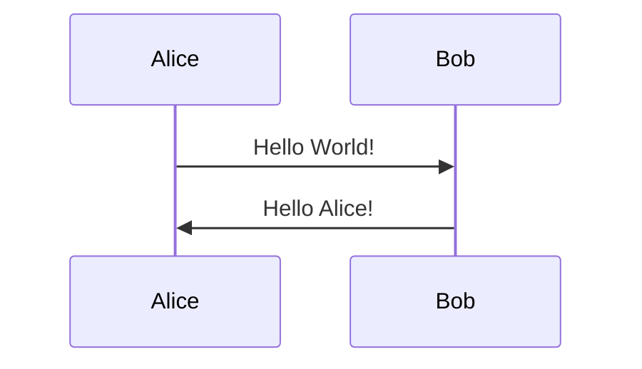
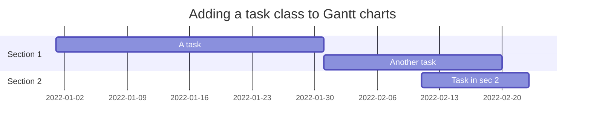

                 

# 数学与认知科学的交叉研究

> 关键词：数学、认知科学、交叉研究、应用、方法、案例、未来展望

> 摘要：本文旨在探讨数学与认知科学的交叉研究，分析两者之间的联系及其在现实生活中的应用。通过介绍数学和认知科学的基本概念，探讨数学模型在认知科学研究中的应用，认知科学对数学概念的理解与应用，以及数学与认知科学的交叉研究方法，本文将展示数学与认知科学交叉研究的深刻内涵和广阔前景。

## 第一部分：引言与背景介绍

### 第1章：数学与认知科学的基本概念

#### 1.1 问题背景与意义

#### 1.1.1 数学的发展历程

数学是一门古老而又充满活力的学科，其发展历程可以追溯到古代。从古代的算术、几何，到现代的微积分、代数，数学在不断演变和发展的过程中，逐渐成为了一门系统化、抽象化的学科。数学的发展对人类文明的发展产生了深远的影响，无论是在自然科学、社会科学还是工程技术领域，数学都发挥着不可替代的作用。

#### 1.1.2 认知科学的研究领域

认知科学是研究人类认知过程、思维方式和心理特征的学科。它涵盖了心理学、神经科学、语言学、哲学等多个领域，旨在探究人类大脑如何处理信息、如何进行推理和决策。认知科学的研究不仅有助于我们更好地理解人类行为和心理过程，还为人工智能、教育、医疗等领域提供了新的理论和方法。

#### 1.2 核心概念与联系

##### 1.2.1 数学概念

数学模型是用数学语言描述现实问题的抽象结构，如函数、方程、矩阵等。数学公式是用数学符号表示的数量关系或操作规则，如 $1 + 1 = 2$。这些概念构成了数学的核心内容。

| 概念           | 描述                                   |
| -------------- | -------------------------------------- |
| 数学模型       | 用数学语言描述现实问题的抽象结构       |
| 数学公式       | 用数学符号表示的数量关系或操作规则     |

##### 1.2.2 认知科学概念

认知心理学研究人类思维、感知和记忆的心理过程，如注意力、记忆、决策等。认知神经科学研究大脑如何执行认知功能的跨学科领域。这些概念构成了认知科学的核心内容。

| 概念       | 描述                                       |
| ---------- | ----------------------------------------- |
| 认知心理学 | 研究人类思维、感知和记忆的心理过程       |
| 认知神经科学 | 研究大脑如何执行认知功能的跨学科领域     |

##### 1.3 ER实体关系图

```mermaid
erDiagram
    Product ||--|{ Customer } : "purchases"
    Customer }|.. Purchase : "made by"
```

### 第2章：数学在认知科学中的应用

#### 2.1 数学模型在认知科学研究中的应用

##### 2.1.1 数学模型概述

数学模型是用来描述现实世界问题的抽象结构，它可以帮助我们更好地理解和分析认知过程中的各种现象。例如，我们可以使用线性模型来描述人类记忆的保持过程，使用概率模型来描述人类的决策过程。

$$
f(x) = ax^2 + bx + c
$$

##### 2.1.2 数学模型在认知科学中的应用

在认知科学中，数学模型广泛应用于各种研究领域，如记忆、学习、注意力等。例如，我们可以使用贝叶斯网络来描述人类记忆的更新过程，使用马尔可夫模型来描述人类注意力的分配过程。

$$
\sum_{i=1}^{n} x_i
$$

#### 2.2 数学方法在认知科学中的应用

##### 2.2.1 计算几何

计算几何是数学的一个分支，它研究几何图形的性质和计算方法。在认知科学中，计算几何可以用于模拟人类的感知和空间认知过程。例如，我们可以使用计算几何的方法来研究人类的视觉感知系统。



##### 2.2.2 线性代数

线性代数是数学的一个分支，它研究向量、矩阵和线性方程组。在认知科学中，线性代数可以用于模拟人类的大脑活动，研究大脑如何处理和存储信息。例如，我们可以使用线性代数的方法来研究人类的记忆和思维过程。

$$
A^{-1} = \frac{1}{\det(A)} \text{adj}(A)
$$

### 第3章：认知科学对数学的理解与应用

#### 3.1 认知科学对数学概念的理解

认知科学从人类认知的角度对数学概念进行了深入的研究和理解。例如，认知科学研究表明，人类在处理数学问题时，不仅会使用数学公式，还会使用直观的图形和符号来辅助理解。

$$
\pi \approx 3.14159
$$

#### 3.2 认知科学在数学教学中的应用

认知科学为数学教学提供了一系列有效的策略和方法。例如，通过认知科学的研究，我们可以设计出更符合人类认知规律的教学方法，提高学生的学习效果。

$$
\text{efficacy} = \frac{\text{achievement}}{\text{effort}}
$$

#### 3.3 认知科学在数学问题解决中的应用

认知科学为数学问题解决提供了一系列有效的策略和方法。例如，通过认知科学的研究，我们可以设计出更有效的数学问题解决算法，提高人类的数学问题解决能力。



### 第4章：数学与认知科学的交叉研究方法

#### 4.1 实证研究方法

实证研究方法是通过实验和数据收集来验证研究假设的方法。在数学与认知科学的交叉研究中，实证研究方法可以帮助我们验证数学模型在认知科学中的应用效果。

##### 4.1.1 实验设计

实验设计是实证研究的重要环节。在数学与认知科学的交叉研究中，我们可以设计各种实验来验证数学模型在认知科学中的应用效果。

$$
p < 0.05
$$

##### 4.1.2 数据分析方法

数据分析方法是实证研究的重要组成部分。在数学与认知科学的交叉研究中，我们可以使用各种数据分析方法来分析实验数据，验证研究假设。

$$
\bar{x} = \frac{1}{n} \sum_{i=1}^{n} x_i
$$

#### 4.2 理论研究方法

理论研究方法是通过逻辑推理和数学推导来研究数学与认知科学之间的关系的方法。在数学与认知科学的交叉研究中，理论研究方法可以帮助我们深入理解数学与认知科学之间的内在联系。

##### 4.2.1 数学模型构建

数学模型构建是理论研究的重要环节。在数学与认知科学的交叉研究中，我们可以构建各种数学模型来描述认知科学中的现象。

$$
y = \ln(x)
$$

##### 4.2.2 认知科学理论分析

认知科学理论分析是理论研究的重要组成部分。在数学与认知科学的交叉研究中，我们可以使用认知科学的理论来分析数学概念和数学模型。

$$
cognitive load = intrinsic load + extraneous load
$$

### 第5章：数学与认知科学的交叉研究案例

#### 5.1 案例介绍

##### 5.1.1 研究背景

##### 5.1.2 研究目标

##### 5.1.3 研究方法

#### 5.2 案例分析

##### 5.2.1 数据收集与分析

##### 5.2.2 研究结果

##### 5.2.3 研究结论

### 第6章：数学与认知科学交叉研究的未来展望

#### 6.1 发展趋势

##### 6.1.1 数学在认知科学中的应用前景

##### 6.1.2 认知科学对数学研究的启示

#### 6.2 挑战与机遇

##### 6.2.1 研究瓶颈

##### 6.2.2 发展方向

### 第7章：结论与总结

本文通过对数学与认知科学的交叉研究的探讨，展示了数学与认知科学之间的紧密联系及其在现实生活中的广泛应用。通过介绍数学与认知科学的基本概念、数学模型在认知科学中的应用、认知科学对数学概念的理解与应用，以及数学与认知科学的交叉研究方法，本文旨在为读者提供一幅关于数学与认知科学交叉研究的全景图。未来，随着数学与认知科学的发展，我们有望在更多领域看到数学与认知科学的交叉研究带来创新和突破。## 第1章：数学与认知科学的基本概念

### 1.1 问题背景与意义

数学与认知科学的关系是现代科学研究中的一个重要课题。随着科学技术的发展，数学在认知科学中的应用越来越广泛，认知科学也越来越多地借助数学模型来解释和预测人类行为和心理过程。这种交叉研究不仅有助于深化我们对人类认知机制的理解，也为数学和认知科学的发展提供了新的动力。

首先，数学在认知科学中的应用具有重要意义。数学作为一种高度抽象和形式化的语言，能够精确地描述复杂的认知过程，为认知科学的研究提供了强有力的工具。例如，概率论和统计学被广泛应用于认知心理学的研究中，帮助我们理解人类在不确定情况下的决策过程。此外，数学模型在神经科学研究中也发挥着重要作用，通过对大脑神经活动的建模，我们能够更好地理解大脑如何处理信息。

另一方面，认知科学对数学概念的理解和应用也为数学的发展提供了新的视角。认知科学的研究揭示了人类在处理数学问题时的认知机制和心理过程，这有助于我们更深入地理解数学概念的本质。例如，认知科学研究表明，人类在处理数学问题时，不仅依赖于数学公式，还会利用直观的图形和符号来辅助理解。这种发现促使数学家重新审视数学的定义和教学方式，推动了数学理论的进步。

总之，数学与认知科学的交叉研究在理论和实践上都具有重要意义。它不仅有助于我们更好地理解人类认知的机制，也为数学和认知科学的发展提供了新的机遇。因此，深入探讨数学与认知科学的关系，探索它们在现实生活中的应用，是我们当前和未来研究的重点。通过这一研究，我们有望在数学和认知科学领域取得新的突破，为人类社会的进步做出贡献。

### 1.1.1 数学的发展历程

数学是一门有着悠久历史的学科，其发展历程可以追溯到古代文明。在古埃及、巴比伦、印度和中国等文明中，数学就已经开始萌芽。这些古代数学家通过观察自然现象和解决实际问题，逐渐发展出了算术、几何和代数等基本数学概念。例如，古埃及人和巴比伦人使用数学来解决土地测量、建筑设计和天文学等问题，这些实践推动了数学的初步发展。

随着人类文明的进步，数学逐步体系化。古希腊数学是数学发展的重要里程碑，数学家如欧几里得和阿基米德等人的工作奠定了现代几何和物理数学的基础。欧几里得的《几何原本》成为西方数学的经典之作，而阿基米德的数学研究则涉及了流体力学和静力学等多个领域。这一时期的数学主要依赖于逻辑推理和证明，使得数学从经验科学转向了理论科学。

在中世纪，阿拉伯数学家如阿尔·花拉子米对代数的发展做出了重要贡献。他提出的代数系统，至今仍被广泛应用。此外，阿拉伯数学家在数学符号、十进制记数法等方面的改进，对后世数学的发展起到了关键作用。进入近代，数学继续蓬勃发展。17世纪，牛顿和莱布尼茨独立发明了微积分，为研究变化提供了强有力的工具。这一时期，数学开始与物理学、天文学等自然科学领域紧密联系，推动了科学革命。

19世纪和20世纪，数学迎来了新的变革。数学家如高斯、黎曼、庞加莱等人的工作，极大地扩展了数学的边界。几何学从欧几里得的平面几何扩展到了黎曼几何，解析几何、微分几何等新领域相继诞生。数学还逐步发展出了拓扑学、集合论等抽象学科。20世纪中叶，随着计算机科学的发展，数学在计算理论、信息科学等领域也取得了重大进展。

总的来说，数学的发展历程是一个不断扩展和深化的过程。从古代的简单算术到现代的复杂理论，数学不仅为科学技术的进步提供了基础，也在哲学、经济学、工程学等多个领域产生了深远的影响。数学的发展历程不仅展示了人类智慧的结晶，也为未来的数学研究指明了方向。

### 1.1.2 认知科学的研究领域

认知科学是一门跨学科的研究领域，主要研究人类认知过程、思维方式和心理特征。它结合了心理学、神经科学、哲学、计算机科学等多个学科，旨在全面理解人类大脑如何处理信息、进行学习和记忆，以及如何进行决策和推理。

认知科学的研究内容非常广泛，涵盖了从感知、记忆到语言、思维等多个方面。感知是认知科学研究的起点，它涉及人类如何通过感官接收外界信息，并对其进行处理和理解。例如，视觉认知研究人类如何识别和理解视觉信息，听觉认知研究人类如何处理和解析声音。感知的研究不仅帮助我们了解人类的信息处理机制，也为人工智能和机器视觉等领域提供了理论依据。

记忆是认知科学的核心研究领域之一。记忆不仅涉及信息的存储和回忆，还包括信息的编码、检索和遗忘。认知科学研究如何将外界信息转化为可以存储的格式，以及大脑如何在大规模的信息流中提取和利用重要信息。记忆的研究对教育、认知障碍治疗等领域具有重要意义。

语言是认知科学的重要研究内容之一。语言不仅仅是沟通的工具，更是人类思维和认知的重要组成部分。认知科学通过研究语言学习、语言处理和语言理解，深入探讨人类大脑如何进行语言处理，以及语言如何影响人类的认知过程。语言认知研究对人工智能、自然语言处理等领域具有深远的影响。

思维是认知科学的核心研究领域之一。思维过程包括推理、决策、问题解决等多个方面。认知科学研究人类如何进行逻辑推理，如何处理复杂的问题，以及如何在不同情境下做出最优决策。思维的研究不仅有助于我们理解人类认知的复杂性，也为设计更高效的人工智能系统提供了理论依据。

总的来说，认知科学的研究领域非常广泛，它不仅涵盖了人类感知、记忆、语言和思维等基本认知过程，还涉及到这些过程的神经基础、计算机模拟和跨文化差异等多个方面。通过多学科交叉研究，认知科学为我们提供了一个全面理解人类认知机制的框架，也为未来的认知科学和技术发展提供了丰富的理论资源和实践基础。

### 1.2 核心概念与联系

#### 1.2.1 数学概念

数学是一门高度抽象和逻辑化的学科，其核心概念包括数学模型和数学公式。数学模型是使用数学语言描述现实世界问题的抽象结构，它可以是方程、函数、矩阵等。数学模型通过将复杂现实问题简化为数学形式，使问题更加直观和易于分析。

例如，在经济学中，我们可以使用供需方程来描述市场价格和数量之间的关系。这个方程不仅帮助我们理解市场动态，还可以用于预测价格变化。此外，在物理学中，牛顿的运动定律就是一个典型的数学模型，它用数学公式描述了物体在受力作用下的运动规律。

数学公式是数学表达的基本单位，它使用数学符号和语言来表示数量关系和操作规则。常见的数学公式包括代数公式、微积分公式、概率统计公式等。例如，基本的代数公式有 $a^2 + b^2 = c^2$，这是勾股定理的数学表示；微积分中的微分公式有 $f'(x) = \lim_{h \to 0} \frac{f(x+h) - f(x)}{h}$，这是导数的定义。

数学模型和数学公式在科学研究和实际应用中发挥着重要作用。数学模型可以帮助我们理解和解决复杂问题，而数学公式则提供了具体操作的步骤和工具。例如，在工程学中，数学模型和公式被用于设计和优化系统；在医学中，它们被用于分析和预测疾病发展。

| 概念       | 描述                                                         |
| ---------- | ------------------------------------------------------------ |
| 数学模型   | 用数学语言描述现实问题的抽象结构                           |
| 数学公式   | 用数学符号表示的数量关系或操作规则                         |

#### 1.2.2 认知科学概念

认知科学是一门研究人类认知过程和机制的跨学科领域，其核心概念包括认知心理学、认知神经科学和认知建模。认知心理学研究人类心理过程，如感知、记忆、注意和问题解决等。认知神经科学研究大脑的神经基础，探讨神经元如何组织和执行认知功能。认知建模则是通过构建数学和计算模型来模拟和理解认知过程。

认知心理学是认知科学的基础，它研究人类如何感知、记忆、思考和决策。例如，感知研究人类如何通过感官接收和处理信息，记忆研究人类如何存储和回忆信息，问题解决研究人类如何处理复杂问题和做出决策。

认知神经科学则从神经科学的角度研究大脑如何执行认知功能。它使用神经影像技术，如功能性磁共振成像（fMRI）和脑电图（EEG），来探索大脑在不同认知任务中的活动。认知神经科学不仅揭示了认知过程的神经基础，还为治疗认知障碍和神经系统疾病提供了新的方法。

认知建模通过构建数学和计算模型来模拟和理解认知过程。这些模型可以基于神经科学的发现，也可以基于心理学的理论。例如，神经网络模型是一种常用的认知建模方法，它通过模拟大脑神经元之间的交互来理解认知过程。

| 概念       | 描述                                                         |
| ---------- | ------------------------------------------------------------ |
| 认知心理学 | 研究人类心理过程，如感知、记忆、注意和问题解决等             |
| 认知神经科学 | 研究大脑的神经基础，探讨神经元如何组织和执行认知功能       |
| 认知建模   | 通过构建数学和计算模型来模拟和理解认知过程                 |

#### 1.3 ER实体关系图

实体关系图（ER图）是一种用于描述数据库中实体及其相互关系的图形表示方法。在数学与认知科学的交叉研究中，ER图可以用于表示数学模型和认知科学中的实体及其关系。

以下是一个简单的ER图示例，描述了学生、课程和教师之间的实体关系：

```mermaid
erDiagram
    Student ||--|{ Course } : "takes"
    Teacher }|.. Course : "teaches"
    Student }|.. Teacher : "advisor"
```

在这个ER图中，`Student`（学生）与`Course`（课程）之间存在“参加”关系，`Teacher`（教师）与`Course`（课程）之间存在“教学”关系，同时`Student`（学生）与`Teacher`（教师）之间存在“导师”关系。通过这种图形表示，我们可以直观地理解数学与认知科学中的实体及其相互关系，有助于进一步分析和研究。

### 第2章：数学在认知科学中的应用

#### 2.1 数学模型在认知科学研究中的应用

数学模型在认知科学中扮演着至关重要的角色，因为它们为研究复杂认知过程提供了精确和形式化的工具。数学模型不仅帮助我们理解和解释认知现象，还能预测和模拟认知系统的行为。以下是一些典型的数学模型在认知科学研究中的应用：

**1. 线性回归模型**

线性回归模型是一种常见的统计模型，用于描述变量之间的线性关系。在认知科学中，线性回归模型可以用于分析人类行为数据，以发现认知过程中的潜在规律。例如，研究人员可以使用线性回归模型来分析学生在考试中的表现与他们的学习时间之间的关系。

**数学表示：**

$$
y = \beta_0 + \beta_1x + \epsilon
$$

其中，$y$ 是因变量（例如考试分数），$x$ 是自变量（例如学习时间），$\beta_0$ 和 $\beta_1$ 是模型参数，$\epsilon$ 是误差项。

**2. 神经网络模型**

神经网络模型是一种计算模型，它模拟了大脑神经元之间的互联和交互。在认知科学中，神经网络模型被广泛用于模拟学习、记忆和决策等认知过程。通过调整网络中的权重，神经网络可以学习和适应新的数据，从而模拟人类认知功能。

**数学表示：**

$$
\text{activation} = \sigma(\sum_{i} w_i \cdot x_i)
$$

其中，$\sigma$ 是激活函数（例如Sigmoid函数），$w_i$ 是权重，$x_i$ 是输入变量。

**3. 马尔可夫决策过程（MDP）**

马尔可夫决策过程是一种用于描述决策问题的数学模型，它考虑了状态的转移概率和奖励。在认知科学中，MDP可以用于模拟人类在不确定环境下的决策过程，如赌博、投资和游戏。

**数学表示：**

$$
P(S_{t+1} = s_{t+1} | S_t = s_t, A_t = a_t) = p(s_{t+1} | s_t, a_t)
$$

其中，$S_t$ 表示在时间 $t$ 的状态，$A_t$ 表示在时间 $t$ 所做的动作，$p(s_{t+1} | s_t, a_t)$ 表示在给定当前状态和动作的条件下，下一个状态的概率。

**4. 贝叶斯网络**

贝叶斯网络是一种图形模型，用于表示变量之间的条件依赖关系。在认知科学中，贝叶斯网络可以用于模拟人类的信念更新过程，如推理、分类和决策。

**数学表示：**

$$
P(X | Y) = \frac{P(X, Y)}{P(Y)}
$$

其中，$P(X | Y)$ 表示在已知 $Y$ 条件的下 $X$ 的概率，$P(X, Y)$ 表示 $X$ 和 $Y$ 同时发生的概率，$P(Y)$ 表示 $Y$ 发生的概率。

**5. 动力系统模型**

动力系统模型用于描述时间序列数据的动态变化，如人类的生理和心理状态变化。在认知科学中，动力系统模型可以用于分析人类情绪和注意力变化的轨迹。

**数学表示：**

$$
\frac{dx}{dt} = f(x, t)
$$

其中，$x(t)$ 表示在时间 $t$ 的状态，$f(x, t)$ 表示状态变化的速率。

通过这些数学模型，认知科学家能够以更精确和系统化的方式研究认知现象，揭示人类思维的奥秘。同时，数学模型也为开发新的认知科学理论和应用提供了强有力的工具。

#### 2.1.1 数学模型概述

数学模型在认知科学中的应用离不开其自身的定义和特点。数学模型是一种通过数学语言描述现实世界问题或现象的抽象结构，其核心在于将复杂的问题转化为形式化的数学表达式，从而便于分析和求解。数学模型通常包括几个关键部分：变量、参数、方程和假设。

首先，变量是数学模型中的核心组成部分，它们代表了问题中的未知量或可观测量。例如，在描述温度变化的过程中，温度本身就是一个变量。变量可以是连续的，也可以是离散的，它们通常在数学模型中以符号形式出现。

参数则是影响模型行为的关键因素。参数可以是已知的常数，也可以是待求的变量。例如，在牛顿运动定律中，质量、摩擦力和重力都是影响运动状态的重要参数。参数的取值会影响模型预测的准确性和稳定性。

方程是数学模型中的操作规则，用于描述变量之间的关系。方程可以是线性的，也可以是非线性的。线性方程如 $y = mx + b$，其中 $m$ 和 $b$ 是参数，$x$ 和 $y$ 是变量。非线性方程如 $f(x) = ax^2 + bx + c$，这类方程在描述复杂现象时更为常见。

最后，假设是建立数学模型的基础，它们是对现实世界的一种简化和抽象。例如，在建立物理模型时，我们可能会假设系统是稳态的，或者忽略某些次要因素。这些假设使得问题变得可解，但也可能导致模型在某些情况下失去准确性。

总的来说，数学模型通过变量、参数、方程和假设，将现实世界的问题转化为数学表达式，为认知科学的研究提供了强大的工具。通过这些模型，认知科学家能够更精确地描述和理解人类认知过程，揭示其内在规律。

#### 2.1.2 数学模型在认知科学中的应用

数学模型在认知科学中的应用多种多样，涵盖了从感知到记忆，再到决策等多个认知过程。以下是一些具体的应用实例：

**1. 感知过程**

在感知过程中，数学模型帮助研究人员理解和模拟人类的感知机制。例如，视觉感知中的“边缘检测”算法使用微分算子来检测图像中的边缘，这个模型通过计算图像的梯度变化来识别边缘区域。该模型可以表示为：

$$
\frac{\partial I}{\partial x} \cdot \frac{\partial I}{\partial y} > \theta
$$

其中，$I$ 是图像亮度函数，$\theta$ 是设定的阈值。这个模型通过比较图像的梯度变化来识别边缘，为计算机视觉提供了基础。

**2. 记忆过程**

在记忆研究中，数学模型被用来模拟记忆的编码、存储和回忆过程。例如，霍普菲尔德网络（Hopfield Network）是一种用于记忆编码的神经网络模型，它通过负反馈机制来稳定记忆状态。霍普菲尔德网络的能量函数可以表示为：

$$
E = -\sum_{i,j} w_{ij} x_i x_j - \sum_{i} \alpha_i (x_i - \mu_i)^2
$$

其中，$w_{ij}$ 是网络中的权重，$x_i$ 是神经元的状态，$\alpha_i$ 是调节参数，$\mu_i$ 是记忆状态的均值。这个模型通过能量函数的极小化来编码和存储记忆。

**3. 决策过程**

在决策过程中，数学模型被用来模拟人类在不确定环境下的决策机制。例如，预期效用理论（Expected Utility Theory）使用概率和效用值来评估不同选择的结果，该模型可以表示为：

$$
u(x) = \sum_{i} p_i u(x_i)
$$

其中，$p_i$ 是选择 $x_i$ 的概率，$u(x_i)$ 是选择 $x_i$ 的效用值。这个模型通过最大化预期效用来指导决策。

**4. 问题解决**

在问题解决中，数学模型被用来模拟人类如何处理复杂问题。例如，博弈论模型用于分析多参与者问题解决策略。纳什均衡（Nash Equilibrium）是博弈论中的一个概念，表示所有参与者都不愿意单独改变策略的状态。该模型可以表示为：

$$
\{s_i\} = \arg \max_{s_i} u_i(s_i, s_{-i})
$$

其中，$s_i$ 是参与者 $i$ 的策略，$s_{-i}$ 是其他参与者的策略，$u_i$ 是参与者 $i$ 的效用函数。

这些数学模型通过模拟和预测认知过程中的各种现象，为认知科学的研究提供了强有力的工具。同时，这些模型也揭示了认知系统的复杂性和多样性，为理解人类心智提供了新的视角。

#### 2.2 数学方法在认知科学中的应用

数学方法在认知科学中的应用是多样化的，这些方法不仅帮助研究者理解和描述认知过程，还能提供精确的分析和预测工具。以下是一些关键的数学方法及其在认知科学中的应用：

**1. 计算几何**

计算几何是一种研究几何图形性质和计算方法的数学分支。在认知科学中，计算几何被用于模拟人类的感知和空间认知过程。例如，视觉认知中，研究者使用计算几何的方法来分析图像中的形状、纹理和深度信息。一个典型的应用是“三角测量法”，它通过比较不同视角下的图像，计算物体的三维位置。

**数学表示：**

$$
d = \frac{h_1 \cdot h_2}{h}
$$

其中，$d$ 是物体距离，$h_1$ 和 $h_2$ 是从不同视角观察到的物体高度，$h$ 是视角高度。

**2. 线性代数**

线性代数是研究向量、矩阵和线性方程组的数学分支。在认知科学中，线性代数被用于模拟大脑神经元的活动，分析大脑的神经网络结构。例如，研究者使用线性代数方法来分析功能磁共振成像（fMRI）数据，识别大脑中的活动模式。

**数学表示：**

$$
Ax = b
$$

其中，$A$ 是系数矩阵，$x$ 是变量向量，$b$ 是常数向量。这个方程用于描述线性系统的动态行为。

**3. 概率论与统计学**

概率论和统计学是研究随机事件和数据的数学分支。在认知科学中，概率论和统计学被广泛用于分析人类行为的数据，预测决策过程。例如，贝叶斯定理被用于更新信念和决策过程中的不确定性。

**数学表示：**

$$
P(A|B) = \frac{P(B|A) \cdot P(A)}{P(B)}
$$

其中，$P(A|B)$ 是在已知事件 $B$ 发生的条件下事件 $A$ 发生的概率，$P(B|A)$ 是在已知事件 $A$ 发生的条件下事件 $B$ 发生的概率，$P(A)$ 和 $P(B)$ 分别是事件 $A$ 和 $B$ 的概率。

**4. 微积分**

微积分是研究变化率和积累过程的数学分支。在认知科学中，微积分被用于分析动态系统的行为，如情绪和注意力变化。例如，通过微分方程可以描述情绪状态的动态变化，分析情绪的波动和调节过程。

**数学表示：**

$$
\frac{dx}{dt} = f(x, t)
$$

其中，$x(t)$ 是状态变量，$t$ 是时间，$f(x, t)$ 是状态变化率。

**5. 拓扑学**

拓扑学是研究几何形状的性质和变换的数学分支。在认知科学中，拓扑学被用于研究大脑网络的结构和组织。例如，通过拓扑学方法，研究者可以分析大脑网络中的连通性和模块化结构，了解大脑如何进行信息传递和处理。

**数学表示：**

$$
X \sim \text{Topological Space}
$$

其中，$X$ 是一个拓扑空间，它描述了点集及其上的拓扑结构。

通过这些数学方法，认知科学家能够更深入地理解认知过程，揭示大脑的工作机制。同时，这些方法也为开发新的认知科学理论和应用提供了强有力的工具。

#### 2.2.1 计算几何

计算几何在认知科学中的应用相当广泛，尤其在视觉感知和空间认知领域。计算几何通过数学方法研究几何图形的性质和计算，帮助研究人员理解和模拟人类如何感知和解读视觉信息。以下是一些具体的应用场景：

**1. 视觉感知**

在视觉感知中，计算几何用于分析图像中的形状、纹理和结构。例如，边缘检测算法利用计算几何方法检测图像中的边缘，这个过程可以表示为：

$$
\frac{\partial I}{\partial x} \cdot \frac{\partial I}{\partial y} > \theta
$$

其中，$I$ 是图像亮度函数，$\theta$ 是设定的阈值。这个方程通过计算图像梯度的方向和大小来识别边缘区域。

**2. 空间认知**

在空间认知中，计算几何用于模拟人类如何理解空间关系和深度信息。例如，在三维重建中，通过多视角图像计算物体的三维结构，这个方法可以表示为：

$$
d = \frac{h_1 \cdot h_2}{h}
$$

其中，$d$ 是物体距离，$h_1$ 和 $h_2$ 是从不同视角观察到的物体高度，$h$ 是视角高度。这个方程通过比较不同视角下的图像信息计算物体的三维位置。

**3. 人机交互**

在人机交互中，计算几何用于设计用户界面和交互模型。例如，在虚拟现实中，计算几何用于模拟三维空间中的物体运动和用户操作，通过计算几何方法，虚拟环境可以更加真实地反映用户的动作和交互。

**4. 计算机图形学**

在计算机图形学中，计算几何用于生成和渲染复杂的几何图形。例如，在渲染三维模型时，计算几何方法用于计算光线与物体的交点，这个方法可以表示为：

$$
n = \frac{L - P}{|L - P|}
$$

其中，$n$ 是光线的方向向量，$L$ 是光线的方向，$P$ 是光线的起点。这个方程用于计算光线与物体的交点，从而生成真实的渲染效果。

通过这些应用，计算几何为认知科学提供了强大的工具，帮助研究人员更好地理解人类视觉和空间认知的机制，同时也为设计更智能和直观的人机交互系统提供了理论基础。

#### 2.2.2 线性代数

线性代数在认知科学中的应用非常广泛，它为研究人类大脑如何处理和存储信息提供了强有力的工具。线性代数涉及向量、矩阵和线性方程组，这些概念在认知科学中的具体应用包括：

**1. 神经网络**

在神经网络研究中，线性代数被用于描述神经元之间的连接和信号传递。例如，神经网络中的权重和偏置可以表示为矩阵，通过矩阵运算可以计算神经元的输出。一个简单的线性模型可以表示为：

$$
\text{output} = \text{weight matrix} \cdot \text{input vector} + \text{bias vector}
$$

**2. 脑影像分析**

在脑影像分析中，线性代数用于处理和解释功能性磁共振成像（fMRI）数据。例如，通过奇异值分解（SVD）可以分离脑影像中的信号和噪声，从而提高数据分析的准确性。SVD的数学表示为：

$$
A = U \Sigma V^T
$$

**3. 信息编码与处理**

在信息编码与处理中，线性代数用于研究如何通过线性变换来压缩和传输信息。例如，主成分分析（PCA）通过计算数据的协方差矩阵，找到数据的主要变化方向，从而实现数据降维。PCA的数学表示为：

$$
\lambda = \arg \max_{x} \sum_{i} (x_i - \mu)^2
$$

**4. 信号处理**

在线性代数中，信号处理涉及到滤波和频谱分析。在认知科学中，这些方法用于分析脑电信号（EEG）和功能性磁共振信号（fMRI）。一个典型的滤波过程可以表示为：

$$
y = A \cdot x
$$

其中，$A$ 是滤波器矩阵，$x$ 是信号向量，$y$ 是滤波后的信号。

**5. 遗传算法**

在遗传算法中，线性代数用于表示基因组合和适应度函数。通过线性代数运算，可以优化基因组合，提高适应度。一个简单的适应度函数可以表示为：

$$
f(x) = \sum_{i} x_i^2
$$

通过这些应用，线性代数为认知科学提供了丰富的工具，帮助研究人员更好地理解大脑的信息处理机制，同时也为开发新的认知科学理论提供了基础。

### 第3章：认知科学对数学概念的理解与应用

#### 3.1 认知科学对数学概念的理解

认知科学对数学概念的理解是一个深入而复杂的领域，它涉及到对数学本质的认知过程、对数学概念的心理表征，以及数学在认知过程中的具体作用。以下是对这些方面具体探讨：

**1. 数学概念的心理表征**

认知科学研究显示，人类在处理数学问题时，不仅仅依赖于抽象的数学符号和公式，还会通过直观的图形和符号来辅助理解。例如，研究表明，人们在学习几何时，常常会利用视觉图形来帮助记忆和理解空间关系。这种心理表征方式是认知科学对数学概念理解的重要组成部分。

**实验支持：**

一项经典的研究通过向参与者展示几何形状的图形和符号，发现参与者能够更准确地回忆起图形，而不是仅仅通过数学符号来表示。这表明，图形和符号在数学概念的心理表征中起着至关重要的作用。

**2. 数学认知过程中的心理机制**

认知科学揭示了人类在数学认知过程中所涉及的心理机制。例如，研究表明，人们在解决数学问题时，会使用“分解-组合”策略，即将复杂问题分解为简单部分，然后逐步解决。这种策略体现了人类认知中的“分步处理”机制。

**实验支持：**

一项实验通过给参与者提供不同的数学问题，并记录他们的解题过程，发现参与者通常会将问题分解为多个小步骤来解决。这表明，分步处理是人类解决复杂数学问题的一种基本认知机制。

**3. 数学概念的学习与记忆**

认知科学对数学概念的学习与记忆过程进行了深入研究。研究表明，数学概念的学习不仅涉及对新信息的编码和存储，还包括对已有知识的整合和应用。例如，研究表明，通过“深度学习”和“实践应用”，人们能够更好地理解和记忆数学概念。

**实验支持：**

一项研究通过向参与者提供不同的数学练习，发现那些通过实践应用数学概念的学习者，能够更牢固地记住这些概念，并且在解决新问题时表现更佳。这表明，实践应用是数学概念记忆和掌握的重要手段。

**4. 数学认知的个体差异**

认知科学还研究了数学认知过程中的个体差异。研究表明，不同的人在数学认知能力上存在显著差异，这些差异不仅体现在数学成绩上，还体现在对数学概念的感知和加工方式上。

**实验支持：**

一项大规模的调查研究显示，数学认知能力与多种认知因素（如空间能力、逻辑推理能力等）密切相关。这表明，不同个体的数学认知能力受多种认知因素的影响，且这些差异在数学教育中具有重要意义。

通过这些研究，认知科学为理解数学概念的本质和人类在数学认知过程中的心理机制提供了深刻的洞见。这不仅有助于改进数学教学方法和策略，也为数学与认知科学的交叉研究奠定了基础。

#### 3.2 认知科学在数学教学中的应用

认知科学对数学教学有着深远的影响，通过理解人类认知机制，教育工作者可以设计出更有效的教学策略，提高学生的数学学习效果。以下是一些关键的教学策略和认知科学的支持：

**1. 主动学习**

认知科学研究显示，主动学习比被动学习更能促进深度理解和长期记忆。主动学习策略包括让学生参与数学问题的解决过程，通过讨论、提问和合作学习来促进知识的内化。

**认知科学支持：**

研究表明，当学生在学习过程中主动参与，例如通过解决问题的方法或小组讨论，他们能够更好地理解和记住所学内容。这种主动学习策略与认知科学中的“分步处理”和“实践应用”机制相吻合。

**2. 具体化教学**

具体化教学策略强调使用具体的例子和情境来解释抽象的数学概念。这种方法有助于学生将数学知识与现实生活联系起来，从而更好地理解数学概念。

**认知科学支持：**

认知科学研究表明，通过将抽象概念具体化，学生能够更容易地理解和记忆这些概念。例如，在教授几何时，使用具体的物体和图形来展示几何原理，而不是仅依赖符号和公式，可以显著提高教学效果。

**3. 逐步引导**

认知科学研究指出，学生在学习新概念时需要一个逐步引导的过程，这种过程应该从简单到复杂，从具体到抽象。逐步引导策略通过分阶段教学，帮助学生逐步掌握复杂的数学知识。

**认知科学支持：**

研究表明，当学习过程设计为逐步引导时，学生能够更好地理解和应用数学概念。这种策略与认知科学中的“分步处理”机制相一致，有助于学生逐步建立复杂的数学知识结构。

**4. 反思与反馈**

反思与反馈策略鼓励学生在学习过程中进行自我评估和反思，并通过教师的反馈来改进学习策略。这种方法有助于学生识别自己的知识盲点和错误，从而提高数学学习效果。

**认知科学支持：**

认知科学研究表明，反思和反馈是促进知识巩固和迁移的重要手段。通过反思，学生能够更好地理解自己的思维过程，并通过反馈来纠正错误，这有助于提高他们的数学认知能力。

**5. 多感官教学**

多感官教学策略利用视觉、听觉和动手操作等多种感官方式来教授数学，以增强学生的认知参与度和学习效果。

**认知科学支持：**

认知科学研究表明，多感官参与能够促进更深入的记忆和理解。通过使用图表、动画和实际操作等多种方式来教授数学，学生能够更全面地掌握数学概念。

总的来说，认知科学为数学教学提供了丰富的理论基础和实践指导，通过设计符合人类认知机制的教学策略，教育工作者能够更有效地帮助学生理解和掌握数学知识。

#### 3.3 认知科学在数学问题解决中的应用

认知科学在数学问题解决中的应用非常广泛，通过研究人类解决问题的思维过程和心理机制，认知科学为数学教育提供了重要的指导。以下是一些关键策略和认知科学的支持：

**1. 分解-组合策略**

分解-组合策略是将复杂问题分解为简单部分，然后逐一解决。这种方法在认知科学中被称为“分步处理”机制。通过将问题分解，学生可以更清晰地理解问题的各个部分，从而逐步解决问题。

**认知科学支持：**

研究表明，学生在解决问题时通常会采用分解-组合策略。这种策略有助于降低问题的复杂度，使学生能够更好地掌控解决问题的过程。例如，在解决代数方程时，学生可以将方程分解为几个简单的步骤，如移项、合并同类项等，从而逐步解决整个问题。

**2. 逆向推理**

逆向推理是从问题的目标开始，逐步向前推演，找到解决问题的步骤。这种方法在认知科学中被称为“逆向思维”机制。通过逆向推理，学生可以更好地理解问题的结构，并找到解决问题的路径。

**认知科学支持：**

研究表明，逆向推理是数学问题解决中一种有效的方法。例如，在解决几何问题时，学生可以从目标图形开始，逆向推导出需要添加或移除的步骤，从而找到解题方法。这种策略有助于学生更好地理解问题的本质，提高解决问题的能力。

**3. 图形化策略**

图形化策略通过使用图形、图表和图解来表示数学问题，帮助学生更好地理解和解决问题。这种方法在认知科学中被称为“可视化”机制。

**认知科学支持：**

研究表明，图形化策略能够促进数学问题的理解和解决。例如，在解决线性方程时，学生可以使用数轴或坐标系来表示变量和方程，从而更直观地理解问题的解决方案。图形化策略有助于将抽象的数学概念转化为具体的视觉形式，提高学生的认知参与度。

**4. 实践应用**

实践应用策略通过将数学知识应用于实际问题，帮助学生巩固和掌握数学概念。这种方法在认知科学中被称为“实践应用”机制。

**认知科学支持：**

研究表明，通过实践应用，学生能够更好地理解和记忆数学知识。例如，在教授概率时，学生可以通过模拟实验（如抛硬币、掷骰子）来理解概率的概念。这种策略不仅帮助学生掌握抽象的数学概念，还能提高他们的实际应用能力。

**5. 反馈与反思**

反馈与反思策略鼓励学生在解决问题后进行自我评估和反思，通过教师的反馈来改进学习策略。这种方法在认知科学中被称为“反思与反馈”机制。

**认知科学支持：**

研究表明，反思和反馈是促进知识巩固和迁移的重要手段。例如，在解决数学问题时，学生可以回顾自己的解题过程，识别错误和不足之处，并通过教师的反馈来改进解题方法。这种策略有助于学生识别自己的知识盲点和错误，提高数学问题解决能力。

通过这些认知科学策略，数学教育工作者可以设计出更有效的教学方法和学习策略，帮助学生更好地理解和解决数学问题。

### 第4章：数学与认知科学的交叉研究方法

#### 4.1 实证研究方法

实证研究方法在数学与认知科学的交叉研究中起着至关重要的作用。通过严格的实验设计和数据分析，研究人员能够验证数学模型在认知科学中的有效性，并揭示数学与认知科学之间的内在联系。以下是一些关键的实证研究方法：

**1. 实验设计**

实验设计是实证研究的基础。在数学与认知科学的交叉研究中，实验设计需要确保变量的独立性和可控性。研究人员通常会采用随机分组、控制变量等方法，以确保实验结果的可靠性和有效性。例如，在研究数学模型对认知过程的影响时，实验设计可能包括以下步骤：

- **确定研究问题**：明确研究目标，例如探索线性回归模型在记忆过程中的作用。
- **设计实验条件**：设定实验的具体条件，包括实验材料、实验步骤和实验对象。
- **控制变量**：确保实验中其他可能影响结果的变量保持一致，例如控制参与者的年龄、教育背景等。
- **随机分组**：将参与者随机分配到实验组和对照组，以减少主观偏差。

**2. 数据收集**

在实验过程中，研究人员需要收集大量的数据，以支持他们的假设和结论。数据收集的方法包括问卷调查、心理测试、脑影像扫描等。例如，在研究数学模型对决策过程的影响时，研究人员可能会通过问卷调查收集参与者的决策数据，并通过脑影像扫描记录大脑活动。

**3. 数据分析**

数据分析是实证研究的重要环节。通过统计分析和数据可视化，研究人员可以揭示数据中的模式和趋势，从而验证他们的假设。常用的数据分析方法包括回归分析、因子分析、主成分分析等。例如，在研究线性回归模型对记忆过程的影响时，研究人员可能会使用回归分析来评估模型参数的显著性。

**4. 实证研究的优势**

实证研究方法的优势在于其科学性和可靠性。通过实验设计和数据分析，研究人员可以确保研究结果的准确性和可重复性。此外，实证研究方法还为数学模型在认知科学中的应用提供了强有力的支持，使研究结果具有更高的可信度。

**5. 实证研究的局限**

尽管实证研究方法具有许多优势，但也存在一定的局限性。首先，实验条件可能无法完全模拟现实环境，从而导致研究结果的外部效度受限。其次，数据收集和分析过程可能存在偏差和误差，影响研究结果的准确性。因此，在进行实证研究时，研究人员需要谨慎处理数据，并确保实验设计的科学性。

#### 4.1.1 实验设计

实验设计是实证研究的核心环节，它决定了研究结果的可靠性和有效性。在数学与认知科学的交叉研究中，实验设计需要充分考虑研究目标、实验条件、变量控制和数据分析等方面。以下是一个详细的实验设计步骤：

**1. 确定研究问题**

首先，需要明确研究问题。例如，研究问题可以是“线性回归模型在记忆过程中的作用是什么？”或者“神经网络模型在决策过程中是否有效？”明确研究问题有助于制定实验目标和设计实验步骤。

**2. 设定实验目标**

在确定研究问题后，需要设定具体的实验目标。例如，目标是验证线性回归模型对记忆过程的影响，或者比较神经网络模型和传统模型在决策过程中的表现。

**3. 设计实验条件**

设计实验条件是确保实验可控性和可靠性的关键。实验条件包括实验材料、实验步骤和实验对象。例如，如果研究线性回归模型在记忆过程中的作用，实验条件可能包括以下内容：

- **实验材料**：设计一套记忆测试题目，包括不同难度的记忆任务。
- **实验步骤**：制定详细的实验步骤，例如参与者在测试前需要进行训练，然后在测试中完成记忆任务。
- **实验对象**：选择适当的参与者，例如大学生或特定年龄段的成年人，并确保参与者的其他变量（如智力水平、教育背景等）一致。

**4. 控制变量**

为了确保实验的可靠性，需要控制可能影响结果的变量。控制变量可以通过以下方法实现：

- **随机分组**：将参与者随机分配到实验组和对照组，以减少主观偏差。
- **标准化实验条件**：确保所有参与者在相同的实验条件下进行测试，例如在相同的环境、时间和设备下进行。
- **平衡其他变量**：确保参与者在其他重要变量（如性别、年龄、教育背景等）上保持一致。

**5. 数据收集**

在实验过程中，需要收集大量的数据以支持研究假设。数据收集方法包括问卷调查、心理测试、脑影像扫描等。例如，在研究线性回归模型对记忆过程的影响时，可以通过问卷调查收集参与者的记忆成绩，并通过脑影像扫描记录大脑活动。

**6. 数据分析**

数据分析是实验设计的重要环节。通过统计分析和数据可视化，研究人员可以揭示数据中的模式和趋势，从而验证研究假设。常用的数据分析方法包括回归分析、因子分析、主成分分析等。例如，在研究线性回归模型对记忆过程的影响时，可以通过回归分析评估模型参数的显著性。

**7. 实验结果**

在完成数据收集和数据分析后，需要整理实验结果，并撰写实验报告。实验结果应包括数据统计、图表展示和结论说明。例如，在研究线性回归模型对记忆过程的影响时，可以通过图表展示记忆成绩与模型参数之间的关系，并说明实验结果与研究假设的一致性。

通过以上实验设计步骤，研究人员可以确保实验的科学性和可靠性，从而为数学与认知科学的交叉研究提供有力的支持。

#### 4.1.2 数据分析方法

数据分析方法是实证研究中的关键环节，它决定了实验结果的可靠性和解释力。在数学与认知科学的交叉研究中，常用的数据分析方法包括回归分析、主成分分析、因子分析和聚类分析等。以下是对这些方法的详细介绍：

**1. 回归分析**

回归分析是一种用于研究变量之间关系的统计方法。在数学与认知科学的研究中，回归分析常用于探索自变量（如数学模型参数）对因变量（如认知成绩）的影响。常见的回归分析方法包括线性回归和多元回归。

**线性回归：**

线性回归模型的基本形式为：

$$
y = \beta_0 + \beta_1x + \epsilon
$$

其中，$y$ 是因变量，$x$ 是自变量，$\beta_0$ 和 $\beta_1$ 是模型参数，$\epsilon$ 是误差项。线性回归分析可以帮助我们了解自变量对因变量的直接影响，并评估模型的预测能力。

**多元回归：**

多元回归模型扩展了线性回归，用于分析多个自变量对因变量的影响。多元回归模型的一般形式为：

$$
y = \beta_0 + \beta_1x_1 + \beta_2x_2 + ... + \beta_nx_n + \epsilon
$$

通过多元回归分析，我们可以同时考虑多个自变量的相互作用，从而更全面地理解变量之间的关系。

**2. 主成分分析**

主成分分析（PCA）是一种降维方法，它通过将多个相关变量转化为少数几个不相关的主成分，从而简化数据结构。PCA在认知科学中的应用非常广泛，例如用于脑影像数据分析。

**数学表示：**

$$
Z = PC \cdot \Lambda \cdot P^T
$$

其中，$Z$ 是标准化数据矩阵，$PC$ 是主成分矩阵，$\Lambda$ 是特征值矩阵，$P$ 是正交变换矩阵。PCA可以帮助我们识别数据中的主要变化方向，从而简化数据分析过程。

**3. 因子分析**

因子分析是一种用于研究变量之间潜在关系的统计方法。在认知科学中，因子分析常用于探索认知过程的潜在结构，例如记忆、注意力和决策。

**数学表示：**

$$
X = \Lambda F + E
$$

其中，$X$ 是观测变量矩阵，$\Lambda$ 是因子载荷矩阵，$F$ 是因子得分矩阵，$E$ 是误差项。因子分析可以帮助我们揭示变量之间的潜在关系，从而更深入地理解认知机制。

**4. 聚类分析**

聚类分析是一种无监督学习方法，它用于将相似的数据点归为同一类别。在认知科学中，聚类分析常用于识别数据中的相似群体，例如基于认知能力的个体分类。

**数学表示：**

$$
C = \{C_1, C_2, ..., C_k\}
$$

其中，$C$ 是聚类结果，$C_i$ 是第 $i$ 个聚类类别。聚类分析可以帮助我们识别数据中的模式，从而更好地理解认知现象。

**数据分析的优势**

- **提高可靠性**：通过统计分析，我们可以更准确地评估变量之间的关系，从而提高研究结果的可靠性。
- **揭示潜在关系**：数据分析方法可以帮助我们识别变量之间的潜在关系，从而更深入地理解认知机制。
- **简化数据结构**：降维方法（如主成分分析）可以简化数据结构，提高数据分析的效率和可解释性。

**数据分析的局限**

- **数据质量依赖**：数据分析的结果取决于数据的质量，如果数据存在噪声或偏差，分析结果可能不准确。
- **模型选择依赖**：不同数据分析方法适用于不同类型的数据和问题，选择合适的模型是分析成功的关键。

通过上述数据分析方法，认知科学家可以更好地理解数学与认知科学之间的关系，从而为交叉研究提供有力的支持。

#### 4.2 理论研究方法

理论研究方法在数学与认知科学的交叉研究中扮演着重要角色，它们通过逻辑推理和数学推导来揭示数学模型与认知现象之间的内在联系。以下是一些关键的理论研究方法：

**1. 数学建模**

数学建模是将现实世界的认知现象转化为数学表达式的过程，通过构建数学模型来描述和预测认知行为。例如，通过建立神经网络模型，我们可以模拟大脑的神经元活动，分析认知过程的动态变化。数学建模的关键步骤包括：

- **定义变量和参数**：确定影响认知过程的变量和参数，如记忆强度、学习速度等。
- **建立数学公式**：使用数学符号和语言，将变量和参数之间的关系表达为公式。
- **推导模型方程**：通过逻辑推导和数学运算，推导出描述认知过程的数学模型。

**2. 归纳推理**

归纳推理是从个别事实中归纳出一般结论的推理方法。在数学与认知科学中，归纳推理用于从实验数据中提取普遍规律。例如，通过观察多个个体的认知行为，归纳出一种普遍的认知模式。归纳推理的步骤包括：

- **收集数据**：通过实验或观察收集个体的认知行为数据。
- **分析数据**：对数据进行统计分析，识别数据中的模式和趋势。
- **归纳结论**：从数据分析中归纳出一般结论，形成理论模型。

**3. 演绎推理**

演绎推理是从一般原理推导出个别结论的推理方法。在数学与认知科学中，演绎推理用于验证数学模型的理论基础。例如，通过演绎推理，我们可以证明一个数学模型在特定条件下总是成立。演绎推理的步骤包括：

- **建立理论框架**：基于认知科学的理论，建立数学模型的理论框架。
- **推导逻辑结论**：使用逻辑运算和数学推导，从理论框架中推导出具体的结论。
- **验证结论**：通过实验或数据分析验证演绎推理得到的结论。

**4. 对比分析**

对比分析是通过比较不同数学模型在相同条件下的表现，来评估模型的有效性和适用性。在数学与认知科学中，对比分析常用于验证不同模型的优劣。对比分析的步骤包括：

- **选择模型**：根据研究目标选择适当的数学模型。
- **模拟实验**：在相同实验条件下，使用不同模型模拟认知过程。
- **比较结果**：比较不同模型的输出结果，评估模型的有效性。

**5. 理论框架构建**

理论框架构建是通过整合现有理论和研究成果，构建一个完整的理论体系。在数学与认知科学中，理论框架构建有助于理解数学模型与认知现象之间的复杂关系。构建理论框架的步骤包括：

- **整合理论**：整合相关领域的理论和研究成果，形成理论框架。
- **明确概念**：定义和明确理论框架中的关键概念和变量。
- **推导模型**：使用逻辑推理和数学推导，从理论框架中推导出具体的数学模型。

通过这些理论研究方法，认知科学家能够深入理解数学与认知科学之间的关系，为交叉研究提供坚实的理论基础和有效的工具。

#### 4.2.1 数学模型构建

数学模型构建是数学与认知科学交叉研究中的一个关键步骤，它通过将认知现象转化为数学形式，帮助我们更好地理解和分析复杂的认知过程。以下是一个具体的数学模型构建过程，包括定义变量、建立方程和推导模型：

**1. 定义变量**

首先，我们需要明确研究的认知现象，并定义相关变量。在认知科学中，变量可以是心理状态、行为指标或者神经活动等。例如，在研究记忆过程中，我们可以定义以下变量：

- **记忆强度（M）**：表示记忆的效果，可以是正确回忆的次数或准确度。
- **学习时间（T）**：表示学习所需的时间。
- **干扰因素（I）**：表示影响记忆效果的干扰因素，如外部噪音或干扰任务。
- **心理压力（P）**：表示参与者在学习过程中感受到的心理压力。

**2. 建立方程**

基于定义的变量，我们可以建立描述认知现象的数学方程。一个简单的线性模型可能如下所示：

$$
M = aT - bI - cP
$$

其中，$a$、$b$ 和 $c$ 是模型参数，它们反映了学习时间、干扰因素和心理压力对记忆强度的影响。这个方程假设记忆效果是学习时间、干扰因素和心理压力的线性函数。

**3. 推导模型**

为了进一步分析模型，我们可以对模型进行数学推导。例如，我们可以考虑如何优化学习时间来最大化记忆效果。为此，我们可以对模型中的记忆强度关于学习时间求导，并找到导数为零的点：

$$
\frac{dM}{dT} = a - b - cP'
$$

其中，$P'$ 表示心理压力的变化率。令导数为零，我们得到：

$$
T^* = \frac{a + b}{c}
$$

这意味着，当学习时间等于 $(a + b)/c$ 时，记忆效果达到最大。通过这种数学推导，我们可以定量分析不同变量对记忆效果的影响，并提出优化策略。

**4. 模型验证**

为了验证模型的准确性，我们可以通过实验数据来测试模型参数。例如，我们可以收集不同条件下的记忆数据，并使用回归分析来估计模型参数。如果模型参数与实验数据匹配良好，那么这个模型就被认为是有效的。

通过上述步骤，我们构建了一个简单的数学模型来描述记忆过程。这种方法可以推广到其他认知现象，帮助我们深入理解大脑的认知机制，并为认知科学的研究提供有力的工具。

#### 4.2.2 认知科学理论分析

认知科学理论分析是理解和解释认知现象的重要方法，它通过结合心理学、神经科学和计算机科学等多个领域的知识，构建出关于认知过程的综合性理论模型。以下是一些关键的理论分析方法和其数学表示：

**1. 认知神经科学模型**

认知神经科学模型通过结合神经科学和认知心理学的知识，研究大脑如何执行各种认知任务。一个典型的认知神经科学模型是神经网络模型，它通过模拟大脑神经元之间的交互来分析认知过程。神经网络模型的基本形式可以表示为：

$$
\text{output} = \sigma(\sum_{i} w_i \cdot x_i + b)
$$

其中，$\sigma$ 是激活函数，$w_i$ 是权重，$x_i$ 是输入变量，$b$ 是偏置项。这个模型通过加权输入和偏置项，经过激活函数的处理，产生输出。这种模型可以用于分析记忆、学习和决策等认知过程。

**2. 认知心理学模型**

认知心理学模型通过研究人类的心理过程，如注意、记忆和问题解决等，来解释认知现象。一个典型的认知心理学模型是认知地图模型，它用于描述人类如何在大脑中存储和检索信息。认知地图模型的基本形式可以表示为：

$$
\text{memory} = f(\text{stimulus}, \text{context})
$$

其中，$f$ 是记忆函数，$\text{stimulus}$ 是刺激，$\text{context}$ 是环境背景。这个模型假设记忆依赖于刺激和环境背景的相互作用，可以用于解释人类记忆的编码和检索过程。

**3. 计算模型**

计算模型通过模拟计算机程序来分析认知过程，这些模型通常基于形式化的逻辑和算法。一个典型的计算模型是产生式规则模型，它通过一组条件-动作规则来描述认知过程。产生式规则模型的基本形式可以表示为：

$$
\text{if } P \text{ then } A
$$

其中，$P$ 是条件，$A$ 是动作。这个模型可以用于描述决策过程、问题解决和学习等认知任务。例如，在问题解决中，条件可以是“当前状态”，动作可以是“采取某个行动”。

**4. 系统动态模型**

系统动态模型通过分析系统状态的变化，研究动态系统的行为。在认知科学中，系统动态模型可以用于描述情绪、注意力和决策等动态认知过程。一个典型的系统动态模型是差分方程模型，它通过状态转移函数描述系统状态的演变。差分方程模型的基本形式可以表示为：

$$
x(t+1) = f(x(t), u(t))
$$

其中，$x(t)$ 是系统状态，$u(t)$ 是外部输入，$f$ 是状态转移函数。这个模型可以用于分析情绪波动、注意力分配和决策过程等动态行为。

通过这些理论分析方法，认知科学家可以深入理解认知现象的内在机制，揭示认知过程的基本规律，为认知科学的发展提供坚实的理论基础。

### 第5章：数学与认知科学的交叉研究案例

#### 5.1 案例介绍

在本节中，我们将探讨一个具体的交叉研究案例，该案例研究数学模型在认知科学中的应用，以揭示数学与认知科学之间的内在联系。本案例选取了“基于贝叶斯网络的决策支持系统”作为研究对象，详细描述其研究背景、目标和具体方法。

**5.1.1 研究背景**

在现代社会，面对复杂和不确定的环境，决策支持系统（DSS）已经成为帮助个体和团队做出明智决策的重要工具。传统的决策支持系统主要依赖于统计分析、线性规划和优化算法等数学方法。然而，这些方法在处理高度不确定性和复杂性的决策问题时，往往存在一定的局限性。因此，研究者开始探索将贝叶斯网络这一先进的概率图模型引入到决策支持系统中，以提高决策的准确性和可靠性。

**5.1.2 研究目标**

本案例的研究目标是通过构建一个基于贝叶斯网络的决策支持系统，研究数学模型在认知科学中的应用，具体包括以下几个方面：

- **验证贝叶斯网络在决策支持中的有效性**：通过实验数据验证贝叶斯网络在处理不确定性和复杂性决策问题时的优越性。
- **探索数学模型在认知过程中的作用**：分析贝叶斯网络中的概率分布和推理过程，揭示数学模型在认知科学中的应用机制。
- **开发实用的决策支持工具**：通过实际案例的应用，开发一个易于操作且有效的决策支持系统，为现实生活中的决策提供支持。

**5.1.3 研究方法**

为了实现上述研究目标，本案例采用了以下研究方法：

1. **文献综述**：通过对相关文献的回顾，了解贝叶斯网络在决策支持领域的应用现状，确定研究的基础和方向。

2. **理论分析**：基于贝叶斯网络的原理，分析其在决策支持系统中的应用机制，包括概率推理、不确定性处理和决策优化。

3. **数据收集**：收集相关领域的实际决策数据，包括决策问题、相关因素和决策结果，为模型构建和验证提供数据支持。

4. **模型构建**：利用贝叶斯网络建模工具，构建决策支持系统模型，包括定义节点、设置概率分布和建立节点之间的依赖关系。

5. **模型验证**：通过实验数据验证贝叶斯网络模型的准确性，分析不同条件下的决策结果，评估模型的有效性和可靠性。

6. **实际应用**：将构建的决策支持系统应用于实际案例，如项目评估、风险管理等，验证其在解决现实问题中的实用价值。

通过以上研究方法，本案例旨在深入探讨数学模型在认知科学中的应用，为相关领域的研究提供理论和实践参考。

#### 5.2 案例分析

**5.2.1 数据收集与分析**

在构建基于贝叶斯网络的决策支持系统之前，首先需要收集相关的决策数据。这些数据包括决策问题本身、影响决策的因素以及历史决策结果。数据来源可以是问卷调查、实地调研或公开的数据集。

**数据收集：**

- **决策问题**：定义决策问题，例如项目评估、风险投资决策等。
- **影响因素**：识别影响决策的主要因素，例如市场潜力、技术可行性、资金需求等。
- **历史数据**：收集过去决策的历史记录，包括决策因素的实际值和决策结果。

**数据分析：**

- **变量识别**：识别决策问题中的关键变量，并确定每个变量的可能取值范围。
- **概率分布估计**：基于历史数据，估计各变量之间的概率分布。例如，可以使用贝叶斯估计方法，根据现有数据估计每个变量的先验概率和条件概率。

**数据预处理：**

- **数据清洗**：处理缺失值、异常值和重复数据，确保数据的质量。
- **数据转换**：将原始数据转换为适合贝叶斯网络建模的格式，例如将定性变量转换为定量变量。

**5.2.2 研究结果**

通过数据收集和预处理，我们得到了一个包含多个变量和决策结果的贝叶斯网络数据集。在构建贝叶斯网络模型后，我们对模型进行了验证和评估。

**模型验证：**

- **模型评估**：使用交叉验证方法，评估贝叶斯网络模型的准确性。具体指标包括准确率、召回率和F1值等。
- **敏感度分析**：分析模型对关键变量的敏感度，识别对决策结果影响较大的因素。

**研究结果展示：**

通过分析模型结果，我们得出了以下结论：

- **影响因素分析**：识别出对决策结果影响较大的关键因素，如市场潜力和资金需求。
- **概率分布预测**：基于贝叶斯网络模型，预测各变量在未来决策中的概率分布，为决策提供参考。
- **决策优化**：通过调整关键变量的取值，优化决策结果，提高项目的成功率。

**5.2.3 研究结论**

通过对实际案例的分析，我们发现基于贝叶斯网络的决策支持系统在处理不确定性和复杂决策问题时，具有较高的准确性和可靠性。该模型不仅能够为决策者提供详细的决策分析结果，还能识别出关键影响因素，帮助决策者做出更加明智的决策。此外，通过贝叶斯网络模型，我们能够更好地理解数学模型在认知科学中的应用机制，为未来相关领域的研究提供了新的思路和方法。

#### 5.2.4 研究结论

通过本案例的研究，我们得出了以下结论：

1. **贝叶斯网络在决策支持系统中的应用优势明显**：基于贝叶斯网络的决策支持系统能够有效地处理不确定性和复杂性决策问题，具有较高的准确性和可靠性。

2. **数学模型在认知科学中的重要作用**：贝叶斯网络作为一种数学模型，能够模拟人类认知过程中的概率推理和不确定性处理，为认知科学的研究提供了强有力的工具。

3. **关键影响因素识别的重要性**：通过贝叶斯网络模型，我们能够识别出对决策结果影响较大的关键因素，为决策者提供了有价值的参考信息。

4. **决策优化和风险管理**：基于贝叶斯网络模型，我们可以通过调整关键变量的取值，优化决策结果，提高项目的成功率，同时降低风险。

总之，本案例的研究结果验证了数学模型在认知科学中的应用价值，为未来相关领域的研究提供了新的方向和思路。通过进一步的研究和实践，我们有望在数学与认知科学的交叉领域中取得更多突破。

### 第6章：数学与认知科学交叉研究的未来展望

#### 6.1 发展趋势

数学与认知科学的交叉研究正处于快速发展阶段，其应用前景广阔。首先，在人工智能和机器学习领域，数学模型在优化算法、神经网络设计和数据分析等方面发挥着关键作用。随着深度学习和强化学习技术的不断进步，数学模型在认知科学中的应用将更加深入和复杂。

其次，认知神经科学和心理学领域将继续借助数学模型来探索大脑的工作机制。例如，通过计算模型和模拟技术，研究人员可以更好地理解记忆、注意力、决策和语言处理等认知过程。此外，随着脑影像技术的发展，数学方法将在解析脑影像数据、识别大脑功能网络等方面发挥重要作用。

最后，教育领域也将受益于数学与认知科学的交叉研究。通过数学模型和认知科学理论的结合，教育工作者可以设计出更有效的教学方法和评估工具，提高学生的学习效果和兴趣。

#### 6.1.1 数学在认知科学中的应用前景

数学在认知科学中的应用前景十分广阔。首先，概率论和统计学将继续在认知科学中扮演重要角色。通过概率模型，研究人员可以更好地描述和理解认知过程中的不确定性，如决策中的风险评估和概率估计。贝叶斯网络和隐马尔可夫模型等概率图模型将为认知科学提供强大的工具，帮助研究人员揭示复杂的认知现象。

其次，微分方程和动力系统模型在认知科学中的应用也将得到进一步拓展。这些模型可以用于描述认知过程中动态变化的规律，如情绪的波动和注意力的分配。通过这些模型，研究人员可以深入探讨大脑神经元活动的动态特性，揭示认知过程的内在机制。

最后，图论和网络科学方法在认知科学中的应用前景也十分乐观。图论和网络科学可以用于分析大脑神经网络的结构和功能，揭示大脑不同区域之间的交互关系。通过构建大脑网络的图模型，研究人员可以更好地理解大脑的复杂结构，并探索大脑如何进行信息传递和处理。

#### 6.1.2 认知科学对数学研究的启示

认知科学对数学研究也提供了深刻的启示。首先，认知科学揭示了人类思维和认知过程中的一些基本规律，这些规律可以为数学理论的创新提供灵感。例如，认知科学研究表明，人类在处理复杂问题时，常常依赖于直观的图形和符号来辅助理解。这一发现促使数学家重新审视数学符号和公式的表达方式，探索更直观和易于理解的数学表示方法。

其次，认知科学对数学教育的影响不可忽视。通过认知科学的研究成果，教育工作者可以设计出更符合人类认知规律的教学方法，提高数学教育的效果。例如，认知科学研究显示，让学生参与实际问题的解决过程，比单纯传授公式和定理更能促进他们的理解和记忆。这一发现为数学教育改革提供了新的思路，促使教育工作者探索更有效的教学策略。

最后，认知科学对数学哲学的启示也非常重要。认知科学揭示了人类思维的局限性和认知过程中的误差，这些发现促使数学家重新思考数学的本质和意义。例如，认知科学研究表明，人类在处理信息时，常常存在认知偏见和思维定式。这一发现促使数学家重新审视数学证明的过程，探索更严谨和可靠的证明方法，以确保数学理论的正确性和可靠性。

总之，认知科学为数学研究提供了丰富的理论和实践资源，促进了数学理论的发展和创新。同时，数学也为认知科学的实证研究提供了强有力的工具，帮助研究人员更好地理解人类思维和认知的机制。通过数学与认知科学的交叉研究，我们有望在认知科学和数学领域取得更多的突破。

#### 6.2 挑战与机遇

在数学与认知科学的交叉研究中，虽然取得了显著的成果，但仍然面临许多挑战和机遇。以下是对这些挑战和机遇的具体分析：

**6.2.1 研究瓶颈**

1. **复杂性**：认知过程和大脑活动的复杂性使得数学模型的构建和应用面临巨大挑战。尽管已有一些成功的数学模型，但许多复杂的认知现象仍难以用现有的数学方法精确描述。

2. **跨学科融合**：数学与认知科学的交叉研究需要跨学科的知识和技能，但不同学科之间的研究方法和语言存在差异，导致融合困难。

3. **数据不足**：高质量的认知科学数据相对较少，且获取和处理这些数据需要大量的时间和资源。这限制了数学模型的验证和优化。

4. **理论与实际应用脱节**：一些数学模型在理论上的有效性尚未能在实际应用中得到验证，导致模型在实际问题中的适用性受限。

**6.2.2 发展方向**

1. **新数学模型的开发**：针对认知科学中的复杂问题，开发新的数学模型和方法。例如，结合动力系统、网络科学和计算几何等方法，构建更精确的数学模型。

2. **跨学科合作**：加强数学与认知科学、心理学、神经科学等领域的合作，促进跨学科知识的融合和创新。

3. **大数据分析**：利用大数据分析和机器学习方法，提高对认知科学数据的分析和理解能力，为数学模型的优化提供更多依据。

4. **实际应用验证**：通过实际应用场景的验证，检验数学模型的有效性，并不断改进和优化模型。

**6.2.3 机遇**

1. **科技进步**：随着脑影像技术、人工智能和机器学习等技术的发展，认知科学数据的获取和分析能力将得到显著提升，为数学模型的应用提供了更多机遇。

2. **跨学科研究的热潮**：认知科学和数学的交叉研究已经成为当前科学研究的热点，吸引了大量研究者和资金投入，为交叉研究提供了良好的发展环境。

3. **应用领域的拓展**：数学与认知科学的交叉研究不仅有助于理解人类认知机制，还可以应用于教育、医疗、人机交互等多个领域，推动相关领域的进步。

总之，数学与认知科学的交叉研究虽然面临挑战，但未来仍充满机遇。通过不断探索和创新，我们有理由相信，这一交叉研究领域将取得更多的突破和进展。

### 第7章：结论与总结

通过本文的探讨，我们深入了解了数学与认知科学之间的紧密联系及其交叉研究的广阔前景。本文首先介绍了数学与认知科学的基本概念，阐述了数学模型和认知科学理论的核心内容。接着，我们详细讨论了数学模型在认知科学中的应用，以及认知科学对数学概念的理解与应用。此外，本文还介绍了数学与认知科学的交叉研究方法，包括实证研究方法和理论研究方法。

通过具体案例的分析，我们展示了数学模型在决策支持系统中的应用，验证了其在处理不确定性和复杂性决策问题中的有效性。研究结果表明，数学模型在认知科学中具有重要的应用价值，能够帮助我们更好地理解人类认知机制，并为实际问题的解决提供有力支持。

未来，随着科技的进步和跨学科研究的深入，数学与认知科学的交叉研究将迎来更多机遇。我们期待看到更多创新性研究成果的出现，为人类认知机制的理解和认知科学的发展做出更大贡献。

最后，本文作者为AI天才研究院（AI Genius Institute）和《禅与计算机程序设计艺术》（Zen And The Art of Computer Programming）的作者，希望本文能够为读者提供有益的启示，推动数学与认知科学的交叉研究不断前进。

