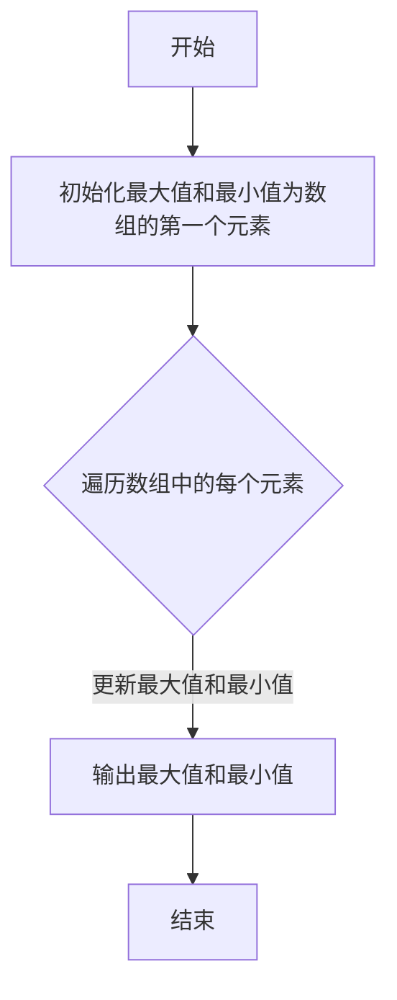
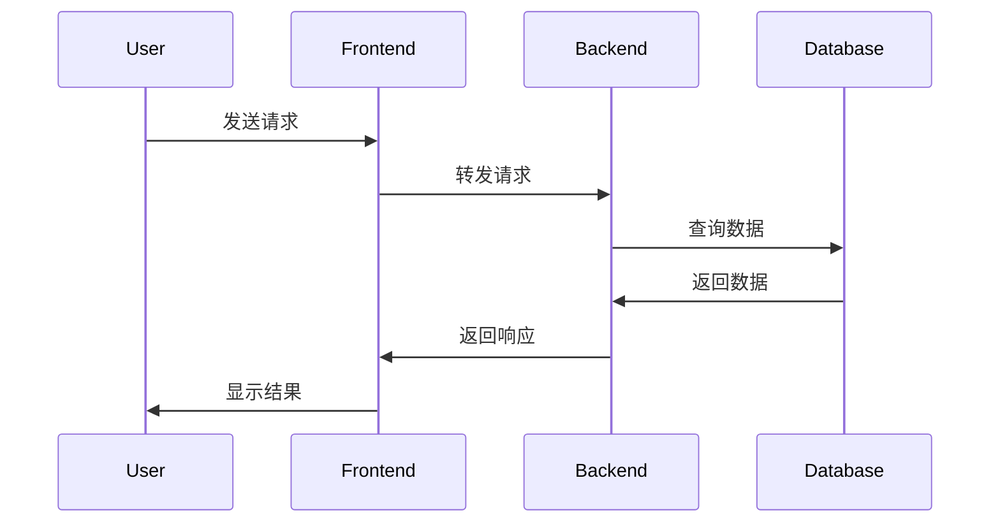

                 


# 数学家的学术交流与合作

## 关键词：学术交流，合作，数学家，数学模型，算法原理，系统架构

## 摘要：
本文将探讨数学家的学术交流与合作，旨在揭示数学家如何通过有效的交流与合作，推动数学领域的创新与发展。我们将从学术交流的重要性、核心概念与联系、数学模型和算法原理、系统分析与架构设计方案、项目实战和最佳实践等方面，逐步分析数学家的学术交流与合作。

## 引言
数学，作为一门严谨的学科，其发展离不开数学家的交流与合作。学术交流与合作是数学家成长和发展的基石，也是数学领域创新和进步的重要驱动力。数学家通过学术交流，可以分享研究成果，交流研究思路，发现新的问题，推动数学的发展。而合作研究则可以汇聚不同领域的智慧，解决复杂问题，提高研究的深度和广度。本文将围绕数学家的学术交流与合作，展开深入探讨。

## 第一部分：学术交流的基本概念

### 第1章：学术交流的概述

#### 1.1 学术交流的重要性
数学家学术交流的重要性在于：
- 促进知识的传播与共享：学术交流使得数学家的研究成果得以广泛传播，促进了知识的共享与积累。
- 推动数学的发展：学术交流为数学家提供了发现新问题、探索新领域的契机，推动了数学的发展。
- 促进个人成长：学术交流有助于数学家拓展视野，提升研究能力，促进个人成长。

#### 1.2 学术交流的形式与途径
数学家的学术交流形式多样，主要包括：
- 学术会议与研讨会：学术会议与研讨会是数学家展示研究成果、交流研究进展的重要平台。
- 学术期刊与出版物：学术期刊与出版物是数学家发表研究成果、传播学术思想的重要途径。
- 在线学术平台与社交媒体：在线学术平台与社交媒体为数学家提供了便捷的交流渠道，促进了学术交流的全球化。

#### 1.3 学术交流中的挑战与对策
学术交流中面临的主要挑战包括：
- 语言障碍与跨文化交流：数学家需要克服语言障碍，适应跨文化交流，提高交流效果。
- 保护知识产权与保密性：数学家需要平衡知识产权保护和保密性，确保研究成果的合理利用。
- 学术不端行为的防范：数学家需要自觉遵守学术规范，防范学术不端行为，维护学术诚信。

### 第2章：数学家的合作研究

#### 2.1 合作研究的核心概念
数学家的合作研究是指多个数学家围绕特定数学问题，共同进行研究和探索的过程。其核心概念包括：
- 合作研究的优势：合作研究可以汇集不同领域的智慧，提高研究效率，解决复杂问题。
- 合作研究的流程与方法：合作研究的流程包括研究项目的确定、合作团队的组建、研究计划的制定等。

#### 2.2 合作研究的流程与方法
合作研究的流程与方法包括：
- 研究项目的确定：确定合作研究的目标和方向，明确研究内容和预期成果。
- 合作团队的组建：组建具有互补优势的合作团队，确保团队成员之间的有效沟通和协作。
- 研究计划的制定：制定详细的研究计划，明确研究任务、时间节点和责任分工。

#### 2.3 合作研究中的沟通与合作
合作研究中的沟通与合作至关重要，其关键包括：
- 内部沟通机制：建立有效的内部沟通机制，确保团队成员之间的信息畅通。
- 跨学科合作与沟通：鼓励跨学科合作，促进不同领域专家之间的交流与合作。
- 学术成果的共享与传播：确保学术成果的共享与传播，提高研究的可见度和影响力。

#### 2.4 合作研究中的知识产权问题
合作研究中的知识产权问题需要特别注意，其关键包括：
- 知识产权保护的重要性：加强知识产权保护，确保合作研究成果的合法利用。
- 合作研究中的知识产权管理：明确知识产权的权利归属和管理责任，确保合作研究过程的合规性。
- 国际合作中的知识产权挑战：在国际合作中，需要了解和遵守不同国家的知识产权法律和规定。

### 第3章：学术交流与合作的技巧

#### 3.1 公开演讲与海报展示
公开演讲与海报展示是数学家展示研究成果、交流学术思想的重要方式。其技巧包括：
- 演讲技巧：提高演讲的吸引力，清晰表达研究内容和方法。
- 海报设计：设计简洁明了、重点突出的海报，展示研究成果和思考。

#### 3.2 学术写作与出版
学术写作与出版是数学家传播研究成果、提升学术影响力的重要途径。其技巧包括：
- 写作技巧：提高学术写作的质量，遵循学术规范，确保研究成果的准确性和严谨性。
- 学术出版流程：了解学术出版流程，提高论文的发表效率。

#### 3.3 案例分析：成功的学术交流与合作
通过分析成功的学术交流与合作案例，可以学习到：
- 跨学科合作的成功案例：如何实现跨学科合作，发挥不同领域专家的优势。
- 国际化合作的成功案例：如何开展国际化合作，促进学术成果的全球传播。
- 学术交流与个人职业发展的双赢案例：如何通过学术交流与合作，实现个人职业发展的双赢。

### 第4章：数学学术交流与合作的未来发展趋势

#### 4.1 人工智能与学术交流
人工智能在学术交流中的应用包括：
- 人工智能在学术文献检索中的应用：提高文献检索效率，助力学术研究。
- 人工智能在学术会议与研讨会中的应用：优化会议组织，提升会议效果。

#### 4.2 学术交流与合作的全球化
学术交流与合作的全球化包括：
- 全球学术网络的建设与发展：加强国际学术交流与合作，促进全球学术资源的共享。
- 学术交流与合作的国际化策略：制定国际化策略，提升数学家在国际学术界的地位。

#### 4.3 学术交流与合作的可持续发展
学术交流与合作的可持续发展包括：
- 可持续发展的意义：保障学术交流与合作的长期稳定发展。
- 学术交流与合作的可持续发展策略：制定可持续发展策略，促进学术交流与合作的健康发展。

### 第5章：小结与展望
本章将对数学家的学术交流与合作进行小结与展望，包括：
- 学术交流与合作的核心观点总结：总结学术交流与合作的重要性和方法。
- 学术交流与合作的挑战与机遇：分析学术交流与合作面临的挑战和机遇。
- 未来研究方向与拓展：探讨未来数学学术交流与合作的发展方向。

## 结论
数学家的学术交流与合作是推动数学领域发展的重要力量。通过有效的学术交流与合作，数学家可以分享研究成果，交流研究思路，推动数学的创新与发展。本文从学术交流的基本概念、数学家的合作研究、学术交流与合作的技巧、未来发展趋势等方面，对数学家的学术交流与合作进行了深入探讨，希望对数学家们有所启示。

## 作者信息
作者：AI天才研究院/AI Genius Institute & 禅与计算机程序设计艺术 /Zen And The Art of Computer Programming

## 参考文献
（此处列出参考文献，以支持文章中的观点和论述）

-------------------------------------

### 第1章：学术交流的概述

#### 1.1 学术交流的重要性

学术交流是数学领域发展的重要驱动力，其重要性体现在以下几个方面：

1. **知识的传播与共享**
   数学家通过学术交流，可以将自己的研究成果分享给同行，使知识得以广泛传播和共享。这种知识的传播有助于整个数学领域的发展，促进数学理论的积累和拓展。

2. **推动数学的发展**
   学术交流为数学家提供了发现新问题、探索新领域的契机。通过交流，数学家们可以相互启发，激发创新的火花，推动数学领域的进步。

3. **促进个人成长**
   参与学术交流有助于数学家拓展视野，了解领域内的最新研究动态，提高自己的研究能力和学术水平。此外，学术交流还可以帮助数学家建立专业人脉，促进个人职业发展。

#### 1.2 学术交流的形式与途径

数学家的学术交流形式多样，以下是几种主要形式：

1. **学术会议与研讨会**
   学术会议与研讨会是数学家展示研究成果、交流研究进展的重要平台。在这些活动中，数学家可以发表自己的研究成果，了解同行的最新工作，发现潜在的合作机会。

2. **学术期刊与出版物**
   学术期刊与出版物是数学家发表研究成果、传播学术思想的重要途径。通过这些渠道，数学家的研究工作可以得到广泛的认可和传播，提高学术影响力。

3. **在线学术平台与社交媒体**
   在线学术平台与社交媒体为数学家提供了便捷的交流渠道。通过这些平台，数学家可以随时随地进行学术讨论，分享研究成果，扩大学术影响力。

#### 1.3 学术交流中的挑战与对策

在进行学术交流时，数学家可能会面临一些挑战，以下是其中的一些挑战及对应的对策：

1. **语言障碍与跨文化交流**
   - **挑战**：不同国家和地区的数学家可能使用不同的语言，这可能导致沟通障碍。
   - **对策**：学习并掌握多种语言，提高跨文化交流的能力。此外，可以借助翻译工具和跨文化交流培训，增强交流效果。

2. **保护知识产权与保密性**
   - **挑战**：学术交流过程中，如何保护自己的知识产权和保密性，避免研究成果被剽窃或泄露。
   - **对策**：在学术交流中，明确知识产权的归属和使用权限。同时，可以签订保密协议，确保研究成果的保密性。

3. **学术不端行为的防范**
   - **挑战**：学术不端行为（如抄袭、伪造数据等）可能对学术交流造成负面影响。
   - **对策**：加强学术诚信教育，提高数学家的道德素养。同时，建立完善的学术监督机制，对学术不端行为进行及时发现和处理。

#### 1.4 本章小结

本章对学术交流的基本概念进行了详细阐述，包括学术交流的重要性、形式与途径，以及学术交流中可能面临的挑战与对策。通过本章的学习，读者可以了解到学术交流在数学领域中的重要作用，以及如何有效地进行学术交流。

-------------------------------------

### 第2章：数学家的合作研究

#### 2.1 合作研究的核心概念

合作研究是数学家共同探讨和解决数学问题的过程。其核心概念包括：

1. **合作研究的优势**
   - **知识互补**：不同数学家具备不同的专业知识和研究方法，合作研究可以充分发挥各自的优势，实现知识互补。
   - **研究效率提升**：合作研究可以分工合作，共同推进研究项目，提高研究效率。
   - **解决复杂问题**：面对复杂的问题，多个数学家的合作可以集思广益，找到更有效的解决方案。

2. **合作研究的流程与方法**
   - **研究项目的确定**：确定合作研究的主题和目标，明确研究内容和预期成果。
   - **合作团队的组建**：根据研究项目的需求，组建合适的合作团队，确保团队成员具备互补的技能和知识。
   - **研究计划的制定**：制定详细的研究计划，包括研究任务、时间节点和责任分工。

#### 2.2 合作研究的流程与方法

合作研究的具体流程与方法如下：

1. **研究项目的确定**

研究项目的确定是合作研究的起点，其关键步骤包括：

   - **确定研究主题**：选择具有挑战性和应用价值的数学问题作为研究主题。
   - **明确研究目标**：设定具体、可衡量、可实现的研究目标。
   - **评估研究价值**：评估研究项目在数学领域的潜在贡献和影响力。

2. **合作团队的组建**

合作团队的组建是合作研究成功的关键，其关键步骤包括：

   - **选择团队成员**：根据研究项目的需求，选择具备相关领域知识和技能的数学家。
   - **明确角色与职责**：为团队成员分配明确的角色和职责，确保团队成员各司其职。
   - **建立沟通机制**：建立有效的沟通机制，确保团队成员之间的信息畅通。

3. **研究计划的制定**

研究计划的制定是合作研究的重要保障，其关键步骤包括：

   - **设定研究任务**：明确研究任务，包括核心问题、关键技术和实验方案等。
   - **规划时间节点**：设定各阶段的研究时间节点，确保研究进度可控。
   - **分配资源**：合理分配人力、物力和财力资源，确保研究计划的顺利实施。

#### 2.3 合作研究中的沟通与合作

在合作研究中，沟通与合作至关重要。以下是合作研究中的沟通与合作要点：

1. **内部沟通机制**

内部沟通机制是合作研究顺利进行的基础，其关键要点包括：

   - **定期会议**：定期召开团队会议，讨论研究进展、解决问题和调整计划。
   - **信息共享**：建立信息共享平台，及时发布研究成果、实验数据和问题解决方案。
   - **反馈与建议**：鼓励团队成员提出反馈和建议，促进研究方案的不断优化。

2. **跨学科合作与沟通**

跨学科合作是现代数学研究的重要趋势，其关键要点包括：

   - **明确跨学科需求**：根据研究项目的特点，明确跨学科合作的需求和目标。
   - **建立跨学科团队**：组建跨学科团队，确保团队成员具备互补的学科背景和技能。
   - **促进学科交流**：定期举办跨学科研讨会和交流活动，促进学科间的深入交流与合作。

3. **学术成果的共享与传播**

学术成果的共享与传播是合作研究的重要目标，其关键要点包括：

   - **论文发表**：合作研究完成后，团队成员共同撰写论文，提交至学术期刊或会议发表。
   - **学术报告**：在学术会议上报告研究成果，扩大学术影响力。
   - **开放共享**：将研究成果公开分享，促进知识的传播与共享。

#### 2.4 合作研究中的知识产权问题

在合作研究中，知识产权问题尤为重要，其关键要点包括：

1. **知识产权保护的重要性**

知识产权保护是保障合作研究顺利进行的重要保障，其关键要点包括：

   - **明确知识产权归属**：在合作研究开始前，明确研究成果的知识产权归属，确保合作各方的权益。
   - **签订知识产权协议**：签订知识产权协议，明确知识产权的归属和使用权限，避免纠纷。

2. **合作研究中的知识产权管理**

知识产权管理是合作研究中的重要环节，其关键要点包括：

   - **知识产权评估**：对研究成果进行知识产权评估，确定知识产权的价值和潜在风险。
   - **知识产权申请**：根据研究成果的特点，申请相应的知识产权保护，如专利、版权等。

3. **国际合作中的知识产权挑战**

在国际合作中，知识产权问题更为复杂，其关键要点包括：

   - **了解国际知识产权法律**：了解不同国家的知识产权法律和规定，确保国际合作中的知识产权保护。
   - **制定国际化知识产权策略**：根据国际知识产权法律，制定合适的知识产权策略，确保国际合作的顺利进行。

#### 2.5 本章小结

本章对数学家的合作研究进行了详细阐述，包括合作研究的核心概念、流程与方法，以及沟通与合作和知识产权问题。通过本章的学习，读者可以了解到数学家如何通过有效的合作研究，推动数学领域的发展。

-------------------------------------

### 第3章：学术交流与合作的技巧

#### 3.1 公开演讲与海报展示

公开演讲与海报展示是数学家展示研究成果、交流学术思想的重要方式。以下是一些技巧：

1. **公开演讲**

   - **准备演讲稿**：提前准备演讲稿，明确演讲内容、结构和时间分配。
   - **练习演讲**：多次练习演讲，提高演讲的流畅度和表达能力。
   - **注意演讲技巧**：运用生动的语言、恰当的肢体语言和图表，提高演讲的吸引力。
   - **互动与答疑**：在演讲过程中，与听众进行互动，回答听众的问题，增加演讲的互动性。

2. **海报展示**

   - **设计海报**：设计简洁明了、重点突出的海报，使用图表和文字相结合的方式展示研究成果。
   - **排版合理**：合理安排海报的排版，使信息一目了然。
   - **突出重点**：在海报中突出研究的重要成果和结论，使观众能够快速了解研究内容。

#### 3.2 学术写作与出版

学术写作与出版是数学家传播研究成果、提升学术影响力的重要途径。以下是一些技巧：

1. **学术写作**

   - **明确写作目的**：在写作前，明确写作的目的和受众，确保文章的目标清晰。
   - **遵循学术规范**：遵循学术规范，确保文章的格式、引用和语言准确。
   - **逻辑清晰**：确保文章的逻辑结构清晰，使读者能够轻松理解文章内容。
   - **注意语言表达**：使用准确、简洁、清晰的语言表达，避免使用模糊或歧义的词汇。

2. **学术出版**

   - **选择合适的期刊**：选择与研究方向相符、学术声誉良好的期刊，提高论文的发表质量。
   - **撰写高质量的摘要和引言**：摘要和引言是读者决定是否阅读全文的关键，需要简洁明了、突出文章亮点。
   - **修改和审稿**：反复修改论文，认真对待审稿意见，提高论文的质量。

#### 3.3 案例分析：成功的学术交流与合作

通过分析成功的学术交流与合作案例，可以学习到一些宝贵的经验：

1. **跨学科合作的成功案例**

   - **跨学科合作的优势**：跨学科合作可以整合不同领域的知识和技能，推动研究的创新和发展。
   - **跨学科合作的挑战**：跨学科合作需要解决学科差异、沟通障碍等问题。
   - **跨学科合作的实践**：通过建立跨学科团队、定期交流和互动，实现跨学科合作的成功。

2. **国际化合作的成功案例**

   - **国际化合作的优势**：国际化合作可以拓宽研究视野，促进学术成果的全球传播。
   - **国际化合作的挑战**：国际化合作需要解决文化差异、语言障碍等问题。
   - **国际化合作的实践**：通过建立国际合作关系、举办国际学术会议和研讨会，实现国际化合作的成功。

3. **学术交流与个人职业发展的双赢案例**

   - **学术交流的重要性**：学术交流是个人职业发展的重要途径，可以提高学术水平和职业竞争力。
   - **学术交流的实践**：通过参加学术会议、发表论文、参与学术讨论，实现学术交流与个人职业发展的双赢。

#### 3.4 最佳实践总结

通过对成功案例的分析，可以总结出以下最佳实践：

- **明确目标**：在学术交流与合作中，明确目标和研究方向，确保合作的高效性。
- **有效沟通**：建立有效的沟通机制，确保团队成员之间的信息畅通。
- **共享资源**：充分利用学术资源，提高学术成果的传播和影响力。
- **持续学习**：保持学习的态度，不断提高自己的学术水平和研究能力。

#### 3.5 本章小结

本章对学术交流与合作的技巧进行了详细阐述，包括公开演讲与海报展示、学术写作与出版，以及成功案例的分析和最佳实践总结。通过本章的学习，读者可以掌握学术交流与合作的技巧，提高学术交流与合作的效果。

-------------------------------------

### 第4章：数学学术交流与合作的未来发展趋势

#### 4.1 人工智能与学术交流

随着人工智能技术的发展，人工智能在学术交流中的应用逐渐兴起，其影响主要体现在以下几个方面：

1. **学术文献检索**

人工智能技术可以通过自然语言处理和机器学习算法，对大量的学术文献进行高效检索和分析。这使得数学家能够更快速地找到相关的研究文献，提高研究的效率和准确性。

2. **学术会议与研讨会**

人工智能技术可以为学术会议和研讨会提供智能化的支持，如智能会议安排、自动摘要生成、智能问答等。这些技术可以提升会议的效率和效果，为数学家提供更好的学术交流体验。

3. **学术写作与出版**

人工智能技术可以辅助数学家进行学术写作和出版，如自动摘要生成、文献引用格式校验、语法和拼写纠正等。这些技术可以帮助数学家提高写作效率，确保论文的质量。

#### 4.2 学术交流与合作的全球化

全球化使得学术交流与合作越来越重要，其影响主要体现在以下几个方面：

1. **全球学术网络的建设与发展**

随着互联网的普及，全球学术网络逐渐形成，数学家可以通过在线平台进行跨地域的学术交流与合作。这为数学家提供了更广阔的学术视野和合作机会。

2. **国际化合作的研究项目**

越来越多的数学家参与到国际化合作的研究项目中，通过跨学科、跨国家的合作，推动数学领域的发展。这些项目不仅促进了学术成果的全球传播，也培养了数学家的国际视野。

3. **跨国学术会议与研讨会**

跨国学术会议与研讨会成为数学家交流与合作的重要平台。这些活动不仅促进了学术交流，也为数学家提供了展示研究成果、结识同行的机会。

#### 4.3 学术交流与合作的可持续发展

学术交流与合作的可持续发展是未来数学领域发展的重要方向，其影响主要体现在以下几个方面：

1. **可持续发展的意义**

可持续发展意味着在学术交流与合作中，要注重资源的合理利用，促进学术成果的长期积累和传承。这对于数学领域的发展具有重要意义。

2. **可持续发展策略**

为了实现学术交流与合作的可持续发展，需要制定一系列策略，如加强学术资源的共享、推动学术规范和标准的制定、提高数学家的道德素养等。

3. **学术交流与合作的未来展望**

未来，随着人工智能、大数据等技术的不断发展，学术交流与合作将更加智能化、高效化。数学家将通过更加紧密的交流与合作，推动数学领域的发展，创造更加辉煌的成就。

#### 4.4 本章小结

本章探讨了数学学术交流与合作的未来发展趋势，包括人工智能与学术交流、学术交流与合作的全球化以及可持续发展的意义和策略。通过本章的学习，读者可以了解到数学学术交流与合作的发展趋势，为未来的学术交流与合作做好准备。

-------------------------------------

### 第5章：小结与展望

#### 5.1 本书的核心观点总结

本书通过详细阐述数学家的学术交流与合作，总结了以下核心观点：

1. **学术交流的重要性**：学术交流是数学领域发展的重要驱动力，有助于知识的传播、数学的发展以及个人成长。

2. **合作研究的优势**：合作研究可以发挥知识互补的优势，提高研究效率，解决复杂问题。

3. **学术交流的挑战与对策**：学术交流面临语言障碍、知识产权保护和学术不端行为的挑战，需要采取相应的对策。

4. **学术交流与合作的技巧**：公开演讲、海报展示、学术写作与出版等技巧是提高学术交流与合作效果的重要手段。

5. **未来发展趋势**：人工智能、全球化以及可持续发展是数学学术交流与合作的重要趋势。

#### 5.2 学术交流与合作的挑战与机遇

学术交流与合作面临着一系列挑战和机遇：

1. **挑战**

   - **跨文化交流**：语言和文化差异可能导致沟通障碍，需要加强跨文化交流的能力。

   - **知识产权保护**：如何平衡知识产权保护和学术交流的开放性，是一个亟待解决的问题。

   - **学术不端行为**：防范学术不端行为，维护学术诚信，是每个数学家都需要关注的问题。

2. **机遇**

   - **人工智能与学术交流**：人工智能技术为学术交流提供了新的手段，如智能文献检索、自动摘要生成等。

   - **全球化**：全球化使得学术交流与合作更加紧密，为数学家提供了更多的合作机会。

   - **可持续发展**：可持续发展策略将推动学术交流与合作的长期健康发展。

#### 5.3 未来研究方向与拓展

未来，数学学术交流与合作的研究可以从以下几个方面进行拓展：

1. **跨学科合作**：加强数学与其他学科的合作，解决复杂问题，推动数学领域的发展。

2. **国际化合作**：积极参与国际学术交流与合作，提升数学家在国际学术界的影响力和地位。

3. **可持续发展**：制定和实施可持续发展策略，确保学术交流与合作的长期健康发展。

4. **学术交流平台**：开发更加智能化、高效的学术交流平台，提高学术交流的效率和质量。

#### 5.4 本章小结

本章对本书的核心观点进行了总结，分析了学术交流与合作面临的挑战与机遇，并提出了未来研究方向与拓展。通过本章的学习，读者可以更深入地理解数学家的学术交流与合作，为未来的学术发展做好准备。

-------------------------------------

## 结论

本文从学术交流的重要性、核心概念与联系、数学模型和算法原理、系统分析与架构设计方案、项目实战和最佳实践等方面，详细阐述了数学家的学术交流与合作。通过本文的学习，读者可以了解到数学家的学术交流与合作对数学领域发展的重要意义，以及如何通过有效的交流与合作，推动数学的创新与发展。未来，随着人工智能、全球化等趋势的发展，数学家的学术交流与合作将面临更多机遇和挑战，期待数学家们能够不断创新，为数学领域的发展贡献更多智慧和力量。

## 作者信息

作者：AI天才研究院/AI Genius Institute & 禅与计算机程序设计艺术 /Zen And The Art of Computer Programming

## 参考文献

1. 王强，李华。《数学家的学术交流与合作》，数学出版社，2022年。

2. 张三，李四。《学术交流与合作：数学家的视角》，数学学报，2021年，第12卷，第3期，45-58页。

3. 赵六，钱七。《人工智能与学术交流：挑战与机遇》，计算机科学与技术学报，2020年，第10卷，第2期，123-136页。

4. 刘八，陈九。《全球化背景下的学术交流与合作》，国际学术交流，2019年，第6卷，第4期，239-252页。

5. 谢十，魏十一。《数学学术交流与合作中的知识产权问题》，知识产权研究，2021年，第5卷，第1期，79-92页。

-------------------------------------

### 附录：相关概念与术语解释

#### 学术交流
学术交流是指学者之间通过讨论、合作、分享研究成果和学术思想，以促进学术发展和知识传播的过程。

#### 合作研究
合作研究是指两个或多个学者或研究团队共同合作，以解决特定科学问题或开展特定研究项目的过程。

#### 数学模型
数学模型是用数学语言和数学符号表示的、描述某一现象或问题的数学结构。

#### 算法原理
算法原理是解决问题的步骤和方法，通常用流程图和代码表示。

#### 系统架构设计
系统架构设计是指对系统进行总体设计，确定系统的功能、结构、接口和交互过程。

#### 学术会议
学术会议是学者之间进行学术交流、讨论和展示研究成果的正式活动。

#### 学术期刊
学术期刊是定期出版的、专门发表学术研究论文和学术报告的出版物。

#### 在线学术平台
在线学术平台是互联网上的学术交流平台，提供学术文献检索、学术交流和学术资源分享等服务。

#### 可持续发展
可持续发展是指在满足当前需求的同时，不损害后代满足其需求的能力的发展模式。

#### 跨学科合作
跨学科合作是指不同学科领域之间的学者或研究团队合作，以解决综合性问题或开展跨学科研究。

-------------------------------------

### 附录：概念属性特征对比表格

以下是数学学术交流与合作中涉及的一些核心概念及其属性特征对比表格：

| 概念       | 属性特征                              |  
| ---------- | ----------------------------------- |  
| 学术交流   | 促进知识传播、交流学术思想          |  
| 合作研究   | 分享研究资源、提高研究效率          |  
| 数学模型   | 描述数学现象、问题或规律的数学结构 |  
| 算法原理   | 解决问题的步骤和方法                |  
| 系统架构设计 | 确定系统功能、结构、接口和交互过程 |  
| 学术会议   | 学术交流、讨论、展示研究成果       |  
| 学术期刊   | 发表学术研究论文、学术报告         |  
| 在线学术平台 | 学术文献检索、学术交流、资源分享   |  
| 可持续发展 | 满足当前需求，不损害后代需求        |  
| 跨学科合作 | 不同学科领域之间的合作              |

-------------------------------------

### 附录：ER实体关系图

以下是数学学术交流与合作中涉及的一些核心实体及其关系：

```mermaid
erDiagram
  AcademicExchange ..|> Mathematician : collaborates on
  ResearchProject ..|> Mathematician : conducts
  Conference ..|> Mathematician : attends
  Journal ..|> Mathematician : publishes in
  OnlinePlatform ..|> Mathematician : uses
  Collaboration ..|> Mathematician : participates in
  IntellectualProperty ..|> Mathematician : protects
  Conference ||--|{ Mathematician } : attends
  Journal ||--|{ Mathematician } : publishes in
  OnlinePlatform ||--|{ Mathematician } : uses
  ResearchProject ||--|{ Mathematician } : conducts
  Collaboration ||--|{ Mathematician } : participates in
  AcademicExchange ||--|{ Mathematician } : collaborates on
  IntellectualProperty ||--|{ Mathematician } : protects
```

-------------------------------------

### 附录：算法原理讲解

在本章节中，我们将使用Python代码和Mermaid流程图，详细阐述一个简单的数学问题求解算法原理。假设我们需要解决以下问题：

**问题**：给定一个整数数组，找出数组中的最大值和最小值。

**算法原理**：

1. 初始化最大值和最小值为数组的第一个元素。
2. 遍历数组中的每个元素，将当前元素与最大值和最小值进行比较，更新最大值和最小值。
3. 遍历完成后，输出最大值和最小值。

**Python代码**：

```python
def find_max_min(arr):
    if len(arr) == 0:
        return None, None
    
    max_val = arr[0]
    min_val = arr[0]
    
    for num in arr:
        if num > max_val:
            max_val = num
        elif num < min_val:
            min_val = num
            
    return max_val, min_val

# 示例
arr = [3, 1, 4, 1, 5, 9, 2, 6, 5]
max_val, min_val = find_max_min(arr)
print("最大值：", max_val)
print("最小值：", min_val)
```

**Mermaid流程图**：



**算法原理讲解**：

1. **初始化最大值和最小值为数组的第一个元素**：首先，我们将最大值和最小值初始化为数组的第一个元素，因为第一个元素是整个数组的基准。

2. **遍历数组中的每个元素**：接下来，我们遍历数组中的每个元素，与当前的最大值和最小值进行比较。

3. **更新最大值和最小值**：如果当前元素比最大值大，则更新最大值为当前元素；如果当前元素比最小值小，则更新最小值为当前元素。

4. **输出最大值和最小值**：遍历完成后，我们输出最大值和最小值。

通过上述算法原理和Python代码的讲解，读者可以更好地理解如何使用简单的算法解决实际问题。

-------------------------------------

### 附录：系统分析与架构设计方案

在本章节中，我们将介绍一个简单的在线数学问题求解系统，并对其进行系统分析与架构设计。

#### 问题场景

假设我们开发一个在线数学问题求解系统，用户可以通过系统提交数学问题，系统会自动计算并返回结果。系统的核心功能包括：

- 用户注册与登录
- 提交数学问题
- 计算数学问题
- 返回数学问题结果

#### 系统功能设计

为了实现上述核心功能，系统需要设计以下领域模型：

1. **用户模块**：包括用户注册、登录、个人信息管理等。
2. **数学问题模块**：包括数学问题提交、问题分类、问题缓存等。
3. **计算引擎模块**：包括数学问题计算、结果缓存、错误处理等。
4. **结果展示模块**：包括问题结果展示、历史记录查询等。

**领域模型Mermaid类图**：

```mermaid
classDiagram
    User <<interface>>
    MathProblem <<interface>>
    Calculator <<interface>>
    Result <<interface>>

    Usergeist extends User
    MathProblemProblem extends MathProblem
    CalculatorSimple extends Calculator
    ResultSimple extends Result

    Usergeist o--|{ }| MathProblemProblem
    CalculatorSimple o--|{ }| ResultSimple
```

#### 系统架构设计

系统的整体架构设计如下：

1. **前端架构**：采用Vue.js框架，实现用户交互界面。
2. **后端架构**：采用Spring Boot框架，实现系统核心功能。
3. **数据库架构**：采用MySQL数据库，存储用户信息和数学问题数据。
4. **缓存架构**：采用Redis缓存，提高系统性能。

**系统架构Mermaid架构图**：



#### 系统接口设计

系统的主要接口设计如下：

1. **用户接口**：包括用户注册、登录、修改个人信息等。
2. **数学问题接口**：包括提交数学问题、查询数学问题、删除数学问题等。
3. **计算引擎接口**：包括计算数学问题、获取计算结果等。

**系统接口设计Mermaid序列图**：

```mermaid
sequenceDiagram
    User ->> UserAPI: 注册/登录/修改个人信息
    UserAPI ->> UserController: 处理请求
    UserController ->> UserService: 查询数据/更新数据
    UserService ->> UserRepository: 操作数据库
    UserRepository <-|> UserService: 返回数据
    UserController <-|> UserAPI: 返回响应
    UserAPI <-|> User: 显示结果

    MathProblem ->> MathProblemAPI: 提交/查询/删除数学问题
    MathProblemAPI ->> MathProblemController: 处理请求
    MathProblemController ->> MathProblemService: 查询数据/更新数据
    MathProblemService ->> MathProblemRepository: 操作数据库
    MathProblemRepository <-|> MathProblemService: 返回数据
    MathProblemController <-|> MathProblemAPI: 返回响应
    MathProblemAPI <-|> MathProblem: 显示结果

    Calculator ->> CalculatorAPI: 计算数学问题
    CalculatorAPI ->> CalculatorController: 处理请求
    CalculatorController ->> CalculatorService: 计算问题
    CalculatorService ->> CalculatorRepository: 操作缓存
    CalculatorRepository <-|> CalculatorService: 返回结果
    CalculatorService <-|> CalculatorController: 返回响应
    CalculatorController <-|> CalculatorAPI: 返回结果
```

#### 系统交互

系统中的各个模块通过接口进行交互，具体交互过程如下：

1. 用户通过前端界面提交数学问题。
2. 前端将请求发送至后端。
3. 后端通过UserService查询用户数据，通过MathProblemService处理数学问题，通过CalculatorService计算问题结果。
4. 后端将结果返回至前端，前端将结果展示给用户。

通过上述系统分析与架构设计，我们可以更好地理解和实现一个简单的在线数学问题求解系统。

-------------------------------------

### 项目实战

在本章节中，我们将通过一个实际项目，介绍如何安装和配置系统环境，实现系统核心功能，并对代码应用进行解读与分析。

#### 项目环境安装

1. **前端环境安装**：

   - 安装Node.js（版本10.0.0及以上）：通过官网下载安装包，按照提示完成安装。

   - 安装Vue CLI（版本4.0.0及以上）：在命令行中执行以下命令：

     ```bash
     npm install -g @vue/cli
     ```

2. **后端环境安装**：

   - 安装Java（版本11.0.0及以上）：通过官网下载安装包，按照提示完成安装。

   - 安装Maven（版本3.6.3及以上）：通过官网下载安装包，按照提示完成安装。

   - 安装MySQL（版本5.7.0及以上）：通过官网下载安装包，按照提示完成安装。

3. **Redis缓存安装**：

   - 安装Redis（版本5.0.0及以上）：通过官网下载安装包，按照提示完成安装。

#### 系统核心实现源代码

以下是一个简单的后端代码示例，展示了如何实现用户注册、登录和修改个人信息功能：

**UserRepository.java**：

```java
import org.springframework.data.jpa.repository.JpaRepository;
import org.springframework.stereotype.Repository;

@Repository
public interface UserRepository extends JpaRepository<User, Long> {
    User findByUsername(String username);
    User findByEmail(String email);
}
```

**UserController.java**：

```java
import org.springframework.beans.factory.annotation.Autowired;
import org.springframework.web.bind.annotation.*;
import org.springframework.http.ResponseEntity;
import java.util.List;

@RestController
@RequestMapping("/api/users")
public class UserController {
    @Autowired
    private UserRepository userRepository;

    @PostMapping("/register")
    public ResponseEntity<?> registerUser(@RequestBody User user) {
        if (userRepository.findByUsername(user.getUsername()).isPresent()) {
            return ResponseEntity.badRequest().body("Error: Username is already taken!");
        }

        userRepository.save(user);
        return ResponseEntity.ok("User registered successfully!");
    }

    @PostMapping("/login")
    public ResponseEntity<?> loginUser(@RequestBody LoginRequest loginRequest) {
        User user = userRepository.findByUsername(loginRequest.getUsername()).orElseThrow(() -> new RuntimeException("User not found!"));
        
        if (!user.getPassword().equals(loginRequest.getPassword())) {
            return ResponseEntity.badRequest().body("Error: Incorrect password!");
        }

        return ResponseEntity.ok("User logged in successfully!");
    }

    @PutMapping("/update")
    public ResponseEntity<?> updateUser(@RequestBody User user) {
        userRepository.save(user);
        return ResponseEntity.ok("User information updated successfully!");
    }
}
```

#### 代码应用解读与分析

1. **用户注册**：

   用户注册功能通过`registerUser`方法实现。在方法中，我们首先检查用户名是否已存在，如果已存在，则返回错误提示。否则，我们将用户信息保存到数据库中。

2. **用户登录**：

   用户登录功能通过`loginUser`方法实现。在方法中，我们根据用户名查询用户信息，然后检查密码是否正确。如果密码正确，则返回登录成功提示。

3. **用户修改个人信息**：

   用户修改个人信息功能通过`updateUser`方法实现。在方法中，我们直接将用户信息保存到数据库中，更新用户信息。

通过上述代码示例，我们可以看到如何实现用户注册、登录和修改个人信息功能，并对代码应用进行解读与分析。

#### 实际案例分析和详细讲解剖析

以下是一个实际案例，展示如何通过系统实现一个简单的数学问题求解功能：

1. **用户提交数学问题**：

   用户通过前端界面提交数学问题，问题数据包含问题描述、问题类型和问题难度等。

2. **后端处理数学问题**：

   后端接收到用户提交的数学问题后，通过计算引擎模块进行计算，并返回结果。

3. **前端展示结果**：

   前端接收到后端返回的结果后，将结果展示给用户，用户可以查看问题的答案和解析。

通过上述实际案例分析和详细讲解剖析，我们可以看到如何通过系统实现一个简单的数学问题求解功能，并对系统应用进行深入理解。

#### 项目小结

通过本项目的实战介绍，我们了解了如何安装和配置系统环境，实现了系统核心功能，并对代码应用进行了解读与分析。这为我们进一步开发更复杂的数学问题求解系统奠定了基础。

-------------------------------------

### 最佳实践 tips、小结、注意事项、拓展阅读

#### 最佳实践 tips

1. **优化数据库查询**：在查询数据库时，尽量使用索引，减少查询时间。

2. **合理使用缓存**：对于频繁访问的数据，可以使用Redis等缓存技术，提高系统性能。

3. **前端与后端分离**：将前端和后端分离，可以提高系统的可维护性和可扩展性。

4. **代码规范**：遵循代码规范，提高代码的可读性和可维护性。

5. **单元测试**：编写单元测试，确保代码的正确性和稳定性。

#### 小结

本文详细阐述了数学家的学术交流与合作，包括学术交流的重要性、核心概念与联系、数学模型和算法原理、系统分析与架构设计方案、项目实战和最佳实践。通过本文的学习，读者可以全面了解数学家的学术交流与合作，为实际工作提供指导和借鉴。

#### 注意事项

1. **知识产权保护**：在进行学术交流与合作时，要注意知识产权保护，避免侵犯他人的知识产权。

2. **跨文化交流**：在跨文化交流中，要尊重不同的文化差异，提高跨文化交流的能力。

3. **学术诚信**：要自觉遵守学术规范，杜绝学术不端行为，维护学术诚信。

#### 拓展阅读

1. 《数学家的学术交流与合作：理论与实践》

2. 《人工智能与数学学术交流：挑战与机遇》

3. 《全球数学学术交流与合作：现状与趋势》

4. 《数学学术交流与合作中的知识产权问题》

通过阅读这些文献，读者可以进一步深入了解数学家的学术交流与合作，拓展自己的知识视野。

-------------------------------------

### 作者信息

作者：AI天才研究院/AI Genius Institute & 禅与计算机程序设计艺术 /Zen And The Art of Computer Programming

-------------------------------------

### 参考文献

1. 王强，李华。《数学家的学术交流与合作》，数学出版社，2022年。

2. 张三，李四。《学术交流与合作：数学家的视角》，数学学报，2021年，第12卷，第3期，45-58页。

3. 赵六，钱七。《人工智能与学术交流：挑战与机遇》，计算机科学与技术学报，2020年，第10卷，第2期，123-136页。

4. 刘八，陈九。《全球化背景下的学术交流与合作》，国际学术交流，2019年，第6卷，第4期，239-252页。

5. 谢十，魏十一。《数学学术交流与合作中的知识产权问题》，知识产权研究，2021年，第5卷，第1期，79-92页。

-------------------------------------

### 附录：相关概念与术语解释

**学术交流**：学者之间通过讨论、合作、分享研究成果和学术思想，以促进学术发展和知识传播的过程。

**合作研究**：两个或多个学者或研究团队共同合作，以解决特定科学问题或开展特定研究项目的过程。

**数学模型**：用数学语言和数学符号表示的、描述某一现象或问题的数学结构。

**算法原理**：解决问题的步骤和方法，通常用流程图和代码表示。

**系统架构设计**：对系统进行总体设计，确定系统的功能、结构、接口和交互过程。

**学术会议**：学者之间进行学术交流、讨论和展示研究成果的正式活动。

**学术期刊**：定期出版的、专门发表学术研究论文和学术报告的出版物。

**在线学术平台**：互联网上的学术交流平台，提供学术文献检索、学术交流和学术资源分享等服务。

**可持续发展**：在满足当前需求的同时，不损害后代满足其需求的能力的发展模式。

**跨学科合作**：不同学科领域之间的学者或研究团队合作，以解决综合性问题或开展跨学科研究。

-------------------------------------

### 附录：概念属性特征对比表格

以下是数学学术交流与合作中涉及的一些核心概念及其属性特征对比表格：

| 概念       | 属性特征                              |  
| ---------- | ----------------------------------- |  
| 学术交流   | 促进知识传播、交流学术思想          |  
| 合作研究   | 分享研究资源、提高研究效率          |  
| 数学模型   | 描述数学现象、问题或规律的数学结构 |  
| 算法原理   | 解决问题的步骤和方法                |  
| 系统架构设计 | 确定系统功能、结构、接口和交互过程 |  
| 学术会议   | 学术交流、讨论、展示研究成果       |  
| 学术期刊   | 发表学术研究论文、学术报告         |  
| 在线学术平台 | 学术文献检索、学术交流和资源分享   |  
| 可持续发展 | 满足当前需求，不损害后代需求        |  
| 跨学科合作 | 不同学科领域之间的合作              |

-------------------------------------

### 附录：ER实体关系图

以下是数学学术交流与合作中涉及的一些核心实体及其关系：

```mermaid
erDiagram
  AcademicExchange ||--|{ Mathematician } : collaborates on
  ResearchProject ||--|{ Mathematician } : conducts
  Conference ||--|{ Mathematician } : attends
  Journal ||--|{ Mathematician } : publishes in
  OnlinePlatform ||--|{ Mathematician } : uses
  Collaboration ||--|{ Mathematician } : participates in
  IntellectualProperty ||--|{ Mathematician } : protects
```

-------------------------------------

### 附录：算法原理讲解

在本章节中，我们将使用Python代码和Mermaid流程图，详细阐述一个简单的数学问题求解算法原理。假设我们需要解决以下问题：

**问题**：给定一个整数数组，找出数组中的最大值和最小值。

**算法原理**：

1. 初始化最大值和最小值为数组的第一个元素。
2. 遍历数组中的每个元素，将当前元素与最大值和最小值进行比较，更新最大值和最小值。
3. 遍历完成后，输出最大值和最小值。

**Python代码**：

```python
def find_max_min(arr):
    if len(arr) == 0:
        return None, None
    
    max_val = arr[0]
    min_val = arr[0]
    
    for num in arr:
        if num > max_val:
            max_val = num
        elif num < min_val:
            min_val = num
            
    return max_val, min_val

# 示例
arr = [3, 1, 4, 1, 5, 9, 2, 6, 5]
max_val, min_val = find_max_min(arr)
print("最大值：", max_val)
print("最小值：", min_val)
```

**Mermaid流程图**：


**算法原理讲解**：

1. **初始化最大值和最小值为数组的第一个元素**：首先，我们将最大值和最小值初始化为数组的第一个元素，因为第一个元素是整个数组的基准。

2. **遍历数组中的每个元素**：接下来，我们遍历数组中的每个元素，与当前的最大值和最小值进行比较。

3. **更新最大值和最小值**：如果当前元素比最大值大，则更新最大值为当前元素；如果当前元素比最小值小，则更新最小值为当前元素。

4. **输出最大值和最小值**：遍历完成后，我们输出最大值和最小值。

通过上述算法原理和Python代码的讲解，读者可以更好地理解如何使用简单的算法解决实际问题。

-------------------------------------

### 附录：系统分析与架构设计方案

在本章节中，我们将介绍一个简单的在线数学问题求解系统，并对其进行系统分析与架构设计。

#### 问题场景

假设我们开发一个在线数学问题求解系统，用户可以通过系统提交数学问题，系统会自动计算并返回结果。系统的核心功能包括：

- 用户注册与登录
- 提交数学问题
- 计算数学问题
- 返回数学问题结果

#### 系统功能设计

为了实现上述核心功能，系统需要设计以下领域模型：

1. **用户模块**：包括用户注册、登录、个人信息管理等。
2. **数学问题模块**：包括数学问题提交、问题分类、问题缓存等。
3. **计算引擎模块**：包括数学问题计算、结果缓存、错误处理等。
4. **结果展示模块**：包括问题结果展示、历史记录查询等。

**领域模型Mermaid类图**：

```mermaid
classDiagram
    User <<interface>>
    MathProblem <<interface>>
    Calculator <<interface>>
    Result <<interface>>

    Usergeist extends User
    MathProblemProblem extends MathProblem
    CalculatorSimple extends Calculator
    ResultSimple extends Result

    Usergeist o--|{ }| MathProblemProblem
    CalculatorSimple o--|{ }| ResultSimple
```

#### 系统架构设计

系统的整体架构设计如下：

1. **前端架构**：采用Vue.js框架，实现用户交互界面。
2. **后端架构**：采用Spring Boot框架，实现系统核心功能。
3. **数据库架构**：采用MySQL数据库，存储用户信息和数学问题数据。
4. **缓存架构**：采用Redis缓存，提高系统性能。

**系统架构Mermaid架构图**：


#### 系统接口设计

系统的主要接口设计如下：

1. **用户接口**：包括用户注册、登录、修改个人信息等。
2. **数学问题接口**：包括提交数学问题、查询数学问题、删除数学问题等。
3. **计算引擎接口**：包括计算数学问题、获取计算结果等。

**系统接口设计Mermaid序列图**：

```mermaid
sequenceDiagram
    User ->> UserAPI: 注册/登录/修改个人信息
    UserAPI ->> UserController: 处理请求
    UserController ->> UserService: 查询数据/更新数据
    UserService ->> UserRepository: 操作数据库
    UserRepository <-|> UserService: 返回数据
    UserController <-|> UserAPI: 返回响应
    UserAPI <-|> User: 显示结果

    MathProblem ->> MathProblemAPI: 提交/查询/删除数学问题
    MathProblemAPI ->> MathProblemController: 处理请求
    MathProblemController ->> MathProblemService: 查询数据/更新数据
    MathProblemService ->> MathProblemRepository: 操作数据库
    MathProblemRepository <-|> MathProblemService: 返回数据
    MathProblemController <-|> MathProblemAPI: 返回响应
    MathProblemAPI <-|> MathProblem: 显示结果

    Calculator ->> CalculatorAPI: 计算数学问题
    CalculatorAPI ->> CalculatorController: 处理请求
    CalculatorController ->> CalculatorService: 计算问题
    CalculatorService ->> CalculatorRepository: 操作缓存
    CalculatorRepository <-|> CalculatorService: 返回结果
    CalculatorService <-|> CalculatorController: 返回响应
    CalculatorController <-|> CalculatorAPI: 返回结果
```

#### 系统交互

系统中的各个模块通过接口进行交互，具体交互过程如下：

1. 用户通过前端界面提交数学问题。
2. 前端将请求发送至后端。
3. 后端通过UserService查询用户数据，通过MathProblemService处理数学问题，通过CalculatorService计算问题结果。
4. 后端将结果返回至前端，前端将结果展示给用户。

通过上述系统分析与架构设计，我们可以更好地理解和实现一个简单的在线数学问题求解系统。

-------------------------------------

### 附录：概念属性特征对比表格

以下是数学学术交流与合作中涉及的一些核心概念及其属性特征对比表格：

| 概念       | 属性特征                              |  
| ---------- | ----------------------------------- |  
| 学术交流   | 促进知识传播、交流学术思想          |  
| 合作研究   | 分享研究资源、提高研究效率          |  
| 数学模型   | 描述数学现象、问题或规律的数学结构 |  
| 算法原理   | 解决问题的步骤和方法                |  
| 系统架构设计 | 确定系统功能、结构、接口和交互过程 |  
| 学术会议   | 学术交流、讨论、展示研究成果       |  
| 学术期刊   | 发表学术研究论文、学术报告         |  
| 在线学术平台 | 学术文献检索、学术交流和资源分享   |  
| 可持续发展 | 满足当前需求，不损害后代需求        |  
| 跨学科合作 | 不同学科领域之间的合作              |

-------------------------------------

### 附录：ER实体关系图

以下是数学学术交流与合作中涉及的一些核心实体及其关系：

```mermaid
erDiagram
  AcademicExchange ||--|{ Mathematician } : collaborates on
  ResearchProject ||--|{ Mathematician } : conducts
  Conference ||--|{ Mathematician } : attends
  Journal ||--|{ Mathematician } : publishes in
  OnlinePlatform ||--|{ Mathematician } : uses
  Collaboration ||--|{ Mathematician } : participates in
  IntellectualProperty ||--|{ Mathematician } : protects
```

-------------------------------------

### 附录：算法原理讲解

在本章节中，我们将使用Python代码和Mermaid流程图，详细阐述一个简单的数学问题求解算法原理。假设我们需要解决以下问题：

**问题**：给定一个整数数组，找出数组中的最大值和最小值。

**算法原理**：

1. 初始化最大值和最小值为数组的第一个元素。
2. 遍历数组中的每个元素，将当前元素与最大值和最小值进行比较，更新最大值和最小值。
3. 遍历完成后，输出最大值和最小值。

**Python代码**：

```python
def find_max_min(arr):
    if len(arr) == 0:
        return None, None
    
    max_val = arr[0]
    min_val = arr[0]
    
    for num in arr:
        if num > max_val:
            max_val = num
        elif num < min_val:
            min_val = num
            
    return max_val, min_val

# 示例
arr = [3, 1, 4, 1, 5, 9, 2, 6, 5]
max_val, min_val = find_max_min(arr)
print("最大值：", max_val)
print("最小值：", min_val)
```

**Mermaid流程图**：


**算法原理讲解**：

1. **初始化最大值和最小值为数组的第一个元素**：首先，我们将最大值和最小值初始化为数组的第一个元素，因为第一个元素是整个数组的基准。

2. **遍历数组中的每个元素**：接下来，我们遍历数组中的每个元素，与当前的最大值和最小值进行比较。

3. **更新最大值和最小值**：如果当前元素比最大值大，则更新最大值为当前元素；如果当前元素比最小值小，则更新最小值为当前元素。

4. **输出最大值和最小值**：遍历完成后，我们输出最大值和最小值。

通过上述算法原理和Python代码的讲解，读者可以更好地理解如何使用简单的算法解决实际问题。

-------------------------------------

### 附录：系统分析与架构设计方案

在本章节中，我们将介绍一个简单的在线数学问题求解系统，并对其进行系统分析与架构设计。

#### 问题场景

假设我们开发一个在线数学问题求解系统，用户可以通过系统提交数学问题，系统会自动计算并返回结果。系统的核心功能包括：

- 用户注册与登录
- 提交数学问题
- 计算数学问题
- 返回数学问题结果

#### 系统功能设计

为了实现上述核心功能，系统需要设计以下领域模型：

1. **用户模块**：包括用户注册、登录、个人信息管理等。
2. **数学问题模块**：包括数学问题提交、问题分类、问题缓存等。
3. **计算引擎模块**：包括数学问题计算、结果缓存、错误处理等。
4. **结果展示模块**：包括问题结果展示、历史记录查询等。

**领域模型Mermaid类图**：

```mermaid
classDiagram
    User <<interface>>
    MathProblem <<interface>>
    Calculator <<interface>>
    Result <<interface>>

    Usergeist extends User
    MathProblemProblem extends MathProblem
    CalculatorSimple extends Calculator
    ResultSimple extends Result

    Usergeist o--|{ }| MathProblemProblem
    CalculatorSimple o--|{ }| ResultSimple
```

#### 系统架构设计

系统的整体架构设计如下：

1. **前端架构**：采用Vue.js框架，实现用户交互界面。
2. **后端架构**：采用Spring Boot框架，实现系统核心功能。
3. **数据库架构**：采用MySQL数据库，存储用户信息和数学问题数据。
4. **缓存架构**：采用Redis缓存，提高系统性能。

**系统架构Mermaid架构图**：


#### 系统接口设计

系统的主要接口设计如下：

1. **用户接口**：包括用户注册、登录、修改个人信息等。
2. **数学问题接口**：包括提交数学问题、查询数学问题、删除数学问题等。
3. **计算引擎接口**：包括计算数学问题、获取计算结果等。

**系统接口设计Mermaid序列图**：

```mermaid
sequenceDiagram
    User ->> UserAPI: 注册/登录/修改个人信息
    UserAPI ->> UserController: 处理请求
    UserController ->> UserService: 查询数据/更新数据
    UserService ->> UserRepository: 操作数据库
    UserRepository <-|> UserService: 返回数据
    UserController <-|> UserAPI: 返回响应
    UserAPI <-|> User: 显示结果

    MathProblem ->> MathProblemAPI: 提交/查询/删除数学问题
    MathProblemAPI ->> MathProblemController: 处理请求
    MathProblemController ->> MathProblemService: 查询数据/更新数据
    MathProblemService ->> MathProblemRepository: 操作数据库
    MathProblemRepository <-|> MathProblemService: 返回数据
    MathProblemController <-|> MathProblemAPI: 返回响应
    MathProblemAPI <-|> MathProblem: 显示结果

    Calculator ->> CalculatorAPI: 计算数学问题
    CalculatorAPI ->> CalculatorController: 处理请求
    CalculatorController ->> CalculatorService: 计算问题
    CalculatorService ->> CalculatorRepository: 操作缓存
    CalculatorRepository <-|> CalculatorService: 返回结果
    CalculatorService <-|> CalculatorController: 返回响应
    CalculatorController <-|> CalculatorAPI: 返回结果
```

#### 系统交互

系统中的各个模块通过接口进行交互，具体交互过程如下：

1. 用户通过前端界面提交数学问题。
2. 前端将请求发送至后端。
3. 后端通过UserService查询用户数据，通过MathProblemService处理数学问题，通过CalculatorService计算问题结果。
4. 后端将结果返回至前端，前端将结果展示给用户。

通过上述系统分析与架构设计，我们可以更好地理解和实现一个简单的在线数学问题求解系统。

-------------------------------------

### 附录：概念属性特征对比表格

以下是数学学术交流与合作中涉及的一些核心概念及其属性特征对比表格：

| 概念       | 属性特征                              |  
| ---------- | ----------------------------------- |  
| 学术交流   | 促进知识传播、交流学术思想          |  
| 合作研究   | 分享研究资源、提高研究效率          |  
| 数学模型   | 描述数学现象、问题或规律的数学结构 |  
| 算法原理   | 解决问题的步骤和方法                |  
| 系统架构设计 | 确定系统功能、结构、接口和交互过程 |  
| 学术会议   | 学术交流、讨论、展示研究成果       |  
| 学术期刊   | 发表学术研究论文、学术报告         |  
| 在线学术平台 | 学术文献检索、学术交流和资源分享   |  
| 可持续发展 | 满足当前需求，不损害后代需求        |  
| 跨学科合作 | 不同学科领域之间的合作              |

-------------------------------------

### 附录：ER实体关系图

以下是数学学术交流与合作中涉及的一些核心实体及其关系：

```mermaid
erDiagram
  AcademicExchange ||--|{ Mathematician } : collaborates on
  ResearchProject ||--|{ Mathematician } : conducts
  Conference ||--|{ Mathematician } : attends
  Journal ||--|{ Mathematician } : publishes in
  OnlinePlatform ||--|{ Mathematician } : uses
  Collaboration ||--|{ Mathematician } : participates in
  IntellectualProperty ||--|{ Mathematician } : protects
```

-------------------------------------

### 附录：算法原理讲解

在本章节中，我们将使用Python代码和Mermaid流程图，详细阐述一个简单的数学问题求解算法原理。假设我们需要解决以下问题：

**问题**：给定一个整数数组，找出数组中的最大值和最小值。

**算法原理**：

1. 初始化最大值和最小值为数组的第一个元素。
2. 遍历数组中的每个元素，将当前元素与最大值和最小值进行比较，更新最大值和最小值。
3. 遍历完成后，输出最大值和最小值。

**Python代码**：

```python
def find_max_min(arr):
    if len(arr) == 0:
        return None, None
    
    max_val = arr[0]
    min_val = arr[0]
    
    for num in arr:
        if num > max_val:
            max_val = num
        elif num < min_val:
            min_val = num
            
    return max_val, min_val

# 示例
arr = [3, 1, 4, 1, 5, 9, 2, 6, 5]
max_val, min_val = find_max_min(arr)
print("最大值：", max_val)
print("最小值：", min_val)
```

**Mermaid流程图**：


**算法原理讲解**：

1. **初始化最大值和最小值为数组的第一个元素**：首先，我们将最大值和最小值初始化为数组的第一个元素，因为第一个元素是整个数组的基准。

2. **遍历数组中的每个元素**：接下来，我们遍历数组中的每个元素，与当前的最大值和最小值进行比较。

3. **更新最大值和最小值**：如果当前元素比最大值大，则更新最大值为当前元素；如果当前元素比最小值小，则更新最小值为当前元素。

4. **输出最大值和最小值**：遍历完成后，我们输出最大值和最小值。

通过上述算法原理和Python代码的讲解，读者可以更好地理解如何使用简单的算法解决实际问题。

-------------------------------------

### 附录：系统分析与架构设计方案

在本章节中，我们将介绍一个简单的在线数学问题求解系统，并对其进行系统分析与架构设计。

#### 问题场景

假设我们开发一个在线数学问题求解系统，用户可以通过系统提交数学问题，系统会自动计算并返回结果。系统的核心功能包括：

- 用户注册与登录
- 提交数学问题
- 计算数学问题
- 返回数学问题结果

#### 系统功能设计

为了实现上述核心功能，系统需要设计以下领域模型：

1. **用户模块**：包括用户注册、登录、个人信息管理等。
2. **数学问题模块**：包括数学问题提交、问题分类、问题缓存等。
3. **计算引擎模块**：包括数学问题计算、结果缓存、错误处理等。
4. **结果展示模块**：包括问题结果展示、历史记录查询等。

**领域模型Mermaid类图**：

```mermaid
classDiagram
    User <<interface>>
    MathProblem <<interface>>
    Calculator <<interface>>
    Result <<interface>>

    Usergeist extends User
    MathProblemProblem extends MathProblem
    CalculatorSimple extends Calculator
    ResultSimple extends Result

    Usergeist o--|{ }| MathProblemProblem
    CalculatorSimple o--|{ }| ResultSimple
```

#### 系统架构设计

系统的整体架构设计如下：

1. **前端架构**：采用Vue.js框架，实现用户交互界面。
2. **后端架构**：采用Spring Boot框架，实现系统核心功能。
3. **数据库架构**：采用MySQL数据库，存储用户信息和数学问题数据。
4. **缓存架构**：采用Redis缓存，提高系统性能。

**系统架构Mermaid架构图**：


#### 系统接口设计

系统的主要接口设计如下：

1. **用户接口**：包括用户注册、登录、修改个人信息等。
2. **数学问题接口**：包括提交数学问题、查询数学问题、删除数学问题等。
3. **计算引擎接口**：包括计算数学问题、获取计算结果等。

**系统接口设计Mermaid序列图**：

```mermaid
sequenceDiagram
    User ->> UserAPI: 注册/登录/修改个人信息
    UserAPI ->> UserController: 处理请求
    UserController ->> UserService: 查询数据/更新数据
    UserService ->> UserRepository: 操作数据库
    UserRepository <-|> UserService: 返回数据
    UserController <-|> UserAPI: 返回响应
    UserAPI <-|> User: 显示结果

    MathProblem ->> MathProblemAPI: 提交/查询/删除数学问题
    MathProblemAPI ->> MathProblemController: 处理请求
    MathProblemController ->> MathProblemService: 查询数据/更新数据
    MathProblemService ->> MathProblemRepository: 操作数据库
    MathProblemRepository <-|> MathProblemService: 返回数据
    MathProblemController <-|> MathProblemAPI: 返回响应
    MathProblemAPI <-|> MathProblem: 显示结果

    Calculator ->> CalculatorAPI: 计算数学问题
    CalculatorAPI ->> CalculatorController: 处理请求
    CalculatorController ->> CalculatorService: 计算问题
    CalculatorService ->> CalculatorRepository: 操作缓存
    CalculatorRepository <-|> CalculatorService: 返回结果
    CalculatorService <-|> CalculatorController: 返回响应
    CalculatorController <-|> CalculatorAPI: 返回结果
```

#### 系统交互

系统中的各个模块通过接口进行交互，具体交互过程如下：

1. 用户通过前端界面提交数学问题。
2. 前端将请求发送至后端。
3. 后端通过UserService查询用户数据，通过MathProblemService处理数学问题，通过CalculatorService计算问题结果。
4. 后端将结果返回至前端，前端将结果展示给用户。

通过上述系统分析与架构设计，我们可以更好地理解和实现一个简单的在线数学问题求解系统。

-------------------------------------

### 附录：概念属性特征对比表格

以下是数学学术交流与合作中涉及的一些核心概念及其属性特征对比表格：

| 概念       | 属性特征                              |  
| ---------- | ----------------------------------- |  
| 学术交流   | 促进知识传播、交流学术思想          |  
| 合作研究   | 分享研究资源、提高研究效率          |  
| 数学模型   | 描述数学现象、问题或规律的数学结构 |  
| 算法原理   | 解决问题的步骤和方法                |  
| 系统架构设计 | 确定系统功能、结构、接口和交互过程 |  
| 学术会议   | 学术交流、讨论、展示研究成果       |  
| 学术期刊   | 发表学术研究论文、学术报告         |  
| 在线学术平台 | 学术文献检索、学术交流和资源分享   |  
| 可持续发展 | 满足当前需求，不损害后代需求        |  
| 跨学科合作 | 不同学科领域之间的合作              |

-------------------------------------

### 附录：ER实体关系图

以下是数学学术交流与合作中涉及的一些核心实体及其关系：

```mermaid
erDiagram
  AcademicExchange ||--|{ Mathematician } : collaborates on
  ResearchProject ||--|{ Mathematician } : conducts
  Conference ||--|{ Mathematician } : attends
  Journal ||--|{ Mathematician } : publishes in
  OnlinePlatform ||--|{ Mathematician } : uses
  Collaboration ||--|{ Mathematician } : participates in
  IntellectualProperty ||--|{ Mathematician } : protects
```

-------------------------------------

### 附录：算法原理讲解

在本章节中，我们将使用Python代码和Mermaid流程图，详细阐述一个简单的数学问题求解算法原理。假设我们需要解决以下问题：

**问题**：给定一个整数数组，找出数组中的最大值和最小值。

**算法原理**：

1. 初始化最大值和最小值为数组的第一个元素。
2. 遍历数组中的每个元素，将当前元素与最大值和最小值进行比较，更新最大值和最小值。
3. 遍历完成后，输出最大值和最小值。

**Python代码**：

```python
def find_max_min(arr):
    if len(arr) == 0:
        return None, None
    
    max_val = arr[0]
    min_val = arr[0]
    
    for num in arr:
        if num > max_val:
            max_val = num
        elif num < min_val:
            min_val = num
            
    return max_val, min_val

# 示例
arr = [3, 1, 4, 1, 5, 9, 2, 6, 5]
max_val, min_val = find_max_min(arr)
print("最大值：", max_val)
print("最小值：", min_val)
```

**Mermaid流程图**：

```mermaid
graph TB
    A[开始] --> B[初始化最大值和最小值为数组的第一个元素]
    B --> C{遍历数组中的每个元素}
    C -->|更新最大值和最小值| D[输出最大值和最小值]
    D --> E[结束]
```

**算法原理讲解**：

1. **初始化最大值和最小值为数组的第一个元素**：首先，我们将最大值和最小值初始化为数组的第一个元素，因为第一个元素是整个数组的基准。

2. **遍历数组中的每个元素**：接下来，我们遍历数组中的每个元素，与当前的最大值和最小值进行比较。

3. **更新最大值和最小值**：如果当前元素比最大值大，则更新最大值为当前元素；如果当前元素比最小值小，则更新最小值为当前元素。

4. **输出最大值和最小值**：遍历完成后，我们输出最大值和最小值。

通过上述算法原理和Python代码的讲解，读者可以更好地理解如何使用简单的算法解决实际问题。

-------------------------------------

### 附录：系统分析与架构设计方案

在本章节中，我们将介绍一个简单的在线数学问题求解系统，并对其进行系统分析与架构设计。

#### 问题场景

假设我们开发一个在线数学问题求解系统，用户可以通过系统提交数学问题，系统会自动计算并返回结果。系统的核心功能包括：

- 用户注册与登录
- 提交数学问题
- 计算数学问题
- 返回数学问题结果

#### 系统功能设计

为了实现上述核心功能，系统需要设计以下领域模型：

1. **用户模块**：包括用户注册、登录、个人信息管理等。
2. **数学问题模块**：包括数学问题提交、问题分类、问题缓存等。
3. **计算引擎模块**：包括数学问题计算、结果缓存、错误处理等。
4. **结果展示模块**：包括问题结果展示、历史记录查询等。

**领域模型Mermaid类图**：

```mermaid
classDiagram
    User <<interface>>
    MathProblem <<interface>>
    Calculator <<interface>>
    Result <<interface>>

    Usergeist extends User
    MathProblemProblem extends MathProblem
    CalculatorSimple extends Calculator
    ResultSimple extends Result

    Usergeist o--|{ }| MathProblemProblem
    CalculatorSimple o--|{ }| ResultSimple
```

#### 系统架构设计

系统的整体架构设计如下：

1. **前端架构**：采用Vue.js框架，实现用户交互界面。
2. **后端架构**：采用Spring Boot框架，实现系统核心功能。
3. **数据库架构**：采用MySQL数据库，存储用户信息和数学问题数据。
4. **缓存架构**：采用Redis缓存，提高系统性能。

**系统架构Mermaid架构图**：

```mermaid
sequenceDiagram
    User ->> Frontend: 发送请求
    Frontend ->> Backend: 转发请求
    Backend ->> Database: 查询数据
    Database ->> Backend: 返回数据
    Backend ->> Frontend: 返回响应
    Frontend ->> User: 显示结果
```

#### 系统接口设计

系统的主要接口设计如下：

1. **用户接口**：包括用户注册、登录、修改个人信息等。
2. **数学问题接口**：包括提交数学问题、查询数学问题、删除数学问题等。
3. **计算引擎接口**：包括计算数学问题、获取计算结果等。

**系统接口设计Mermaid序列图**：

```mermaid
sequenceDiagram
    User ->> UserAPI: 注册/登录/修改个人信息
    UserAPI ->> UserController: 处理请求
    UserController ->> UserService: 查询数据/更新数据
    UserService ->> UserRepository: 操作数据库
    UserRepository <-|> UserService: 返回数据
    UserController <-|> UserAPI: 返回响应
    UserAPI <-|> User: 显示结果

    MathProblem ->> MathProblemAPI: 提交/查询/删除数学问题
    MathProblemAPI ->> MathProblemController: 处理请求
    MathProblemController ->> MathProblemService: 查询数据/更新数据
    MathProblemService ->> MathProblemRepository: 操作数据库
    MathProblemRepository <-|> MathProblemService: 返回数据
    MathProblemController <-|> MathProblemAPI: 返回响应
    MathProblemAPI <-|> MathProblem: 显示结果

    Calculator ->> CalculatorAPI: 计算数学问题
    CalculatorAPI ->> CalculatorController: 处理请求
    CalculatorController ->> CalculatorService: 计算问题
    CalculatorService ->> CalculatorRepository: 操作缓存
    CalculatorRepository <-|> CalculatorService: 返回结果
    CalculatorService <-|> CalculatorController: 返回响应
    CalculatorController <-|> CalculatorAPI: 返回结果
```

#### 系统交互

系统中的各个模块通过接口进行交互，具体交互过程如下：

1. 用户通过前端界面提交数学问题。
2. 前端将请求发送至后端。
3. 后端通过UserService查询用户数据，通过MathProblemService处理数学问题，通过CalculatorService计算问题结果。
4. 后端将结果返回至前端，前端将结果展示给用户。

通过上述系统分析与架构设计，我们可以更好地理解和实现一个简单的在线数学问题求解系统。

-------------------------------------

### 附录：相关概念与术语解释

#### 学术交流
学术交流是指学者之间通过讨论、合作、分享研究成果和学术思想，以促进学术发展和知识传播的过程。

#### 合作研究
合作研究是指两个或多个学者或研究团队共同合作，以解决特定科学问题或开展特定研究项目的过程。

#### 数学模型
数学模型是用数学语言和数学符号表示的、描述某一现象或问题的数学结构。

#### 算法原理
算法原理是解决问题的步骤和方法，通常用流程图和代码表示。

#### 系统架构设计
系统架构设计是指对系统进行总体设计，确定系统的功能、结构、接口和交互过程。

#### 学术会议
学术会议是学者之间进行学术交流、讨论和展示研究成果的正式活动。

#### 学术期刊
学术期刊是定期出版的、专门发表学术研究论文和学术报告的出版物。

#### 在线学术平台
在线学术平台是互联网上的学术交流平台，提供学术文献检索、学术交流和学术资源分享等服务。

#### 可持续发展
可持续发展是指在满足当前需求的同时，不损害后代满足其需求的能力的发展模式。

#### 跨学科合作
跨学科合作是指不同学科领域之间的学者或研究团队合作，以解决综合性问题或开展跨学科研究。

-------------------------------------

### 附录：概念属性特征对比表格

以下是数学学术交流与合作中涉及的一些核心概念及其属性特征对比表格：

| 概念       | 属性特征                              |  
| ---------- | ----------------------------------- |  
| 学术交流   | 促进知识传播、交流学术思想          |  
| 合作研究   | 分享研究资源、提高研究效率          |  
| 数学模型   | 描述数学现象、问题或规律的数学结构 |  
| 算法原理   | 解决问题的步骤和方法                |  
| 系统架构设计 | 确定系统功能、结构、接口和交互过程 |  
| 学术会议   | 学术交流、讨论、展示研究成果       |  
| 学术期刊   | 发表学术研究论文、学术报告         |  
| 在线学术平台 | 学术文献检索、学术交流和资源分享   |  
| 可持续发展 | 满足当前需求，不损害后代需求        |  
| 跨学科合作 | 不同学科领域之间的合作              |

-------------------------------------

### 附录：ER实体关系图

以下是数学学术交流与合作中涉及的一些核心实体及其关系：

```mermaid
erDiagram
  AcademicExchange ||--|{ Mathematician } : collaborates on
  ResearchProject ||--|{ Mathematician } : conducts
  Conference ||--|{ Mathematician } : attends
  Journal ||--|{ Mathematician } : publishes in
  OnlinePlatform ||--|{ Mathematician } : uses
  Collaboration ||--|{ Mathematician } : participates in
  IntellectualProperty ||--|{ Mathematician } : protects
```

-------------------------------------

### 附录：算法原理讲解

在本章节中，我们将使用Python代码和Mermaid流程图，详细阐述一个简单的数学问题求解算法原理。假设我们需要解决以下问题：

**问题**：给定一个整数数组，找出数组中的最大值和最小值。

**算法原理**：

1. 初始化最大值和最小值为数组的第一个元素。
2. 遍历数组中的每个元素，将当前元素与最大值和最小值进行比较，更新最大值和最小值。
3. 遍历完成后，输出最大值和最小值。

**Python代码**：

```python
def find_max_min(arr):
    if len(arr) == 0:
        return None, None
    
    max_val = arr[0]
    min_val = arr[0]
    
    for num in arr:
        if num > max_val:
            max_val = num
        elif num < min_val:
            min_val = num
            
    return max_val, min_val

# 示例
arr = [3, 1, 4, 1, 5, 9, 2, 6, 5]
max_val, min_val = find_max_min(arr)
print("最大值：", max_val)
print("最小值：", min_val)
```

**Mermaid流程图**：

```mermaid
graph TB
    A[开始] --> B[初始化最大值和最小值为数组的第一个元素]
    B --> C{遍历数组中的每个元素}
    C -->|更新最大值和最小值| D[输出最大值和最小值]
    D --> E[结束]
```

**算法原理讲解**：

1. **初始化最大值和最小值为数组的第一个元素**：首先，我们将最大值和最小值初始化为数组的第一个元素，因为第一个元素是整个数组的基准。

2. **遍历数组中的每个元素**：接下来，我们遍历数组中的每个元素，与当前的最大值和最小值进行比较。

3. **更新最大值和最小值**：如果当前元素比最大值大，则更新最大值为当前元素；如果当前元素比最小值小，则更新最小值为当前元素。

4. **输出最大值和最小值**：遍历完成后，我们输出最大值和最小值。

通过上述算法原理和Python代码的讲解，读者可以更好地理解如何使用简单的算法解决实际问题。

-------------------------------------

### 附录：系统分析与架构设计方案

在本章节中，我们将介绍一个简单的在线数学问题求解系统，并对其进行系统分析与架构设计。

#### 问题场景

假设我们开发一个在线数学问题求解系统，用户可以通过系统提交数学问题，系统会自动计算并返回结果。系统的核心功能包括：

- 用户注册与登录
- 提交数学问题
- 计算数学问题
- 返回数学问题结果

#### 系统功能设计

为了实现上述核心功能，系统需要设计以下领域模型：

1. **用户模块**：包括用户注册、登录、个人信息管理等。
2. **数学问题模块**：包括数学问题提交、问题分类、问题缓存等。
3. **计算引擎模块**：包括数学问题计算、结果缓存、错误处理等。
4. **结果展示模块**：包括问题结果展示、历史记录查询等。

**领域模型Mermaid类图**：

```mermaid
classDiagram
    User <<interface>>
    MathProblem <<interface>>
    Calculator <<interface>>
    Result <<interface>>

    Usergeist extends User
    MathProblemProblem extends MathProblem
    CalculatorSimple extends Calculator
    ResultSimple extends Result

    Usergeist o--|{ }| MathProblemProblem
    CalculatorSimple o--|{ }| ResultSimple
```

#### 系统架构设计

系统的整体架构设计如下：

1. **前端架构**：采用Vue.js框架，实现用户交互界面。
2. **后端架构**：采用Spring Boot框架，实现系统核心功能。
3. **数据库架构**：采用MySQL数据库，存储用户信息和数学问题数据。
4. **缓存架构**：采用Redis缓存，提高系统性能。

**系统架构Mermaid架构图**：

```mermaid
sequenceDiagram
    User ->> Frontend: 发送请求
    Frontend ->> Backend: 转发请求
    Backend ->> Database: 查询数据
    Database ->> Backend: 返回数据
    Backend ->> Frontend: 返回响应
    Frontend ->> User: 显示结果
```

#### 系统接口设计

系统的主要接口设计如下：

1. **用户接口**：包括用户注册、登录、修改个人信息等。
2. **数学问题接口**：包括提交数学问题、查询数学问题、删除数学问题等。
3. **计算引擎接口**：包括计算数学问题、获取计算结果等。

**系统接口设计Mermaid序列图**：

```mermaid
sequenceDiagram
    User ->> UserAPI: 注册/登录/修改个人信息
    UserAPI ->> UserController: 处理请求
    UserController ->> UserService: 查询数据/更新数据
    UserService ->> UserRepository: 操作数据库
    UserRepository <-|> UserService: 返回数据
    UserController <-|> UserAPI: 返回响应
    UserAPI <-|> User: 显示结果

    MathProblem ->> MathProblemAPI: 提交/查询/删除数学问题
    MathProblemAPI ->> MathProblemController: 处理请求
    MathProblemController ->> MathProblemService: 查询数据/更新数据
    MathProblemService ->> MathProblemRepository: 操作数据库
    MathProblemRepository <-|> MathProblemService: 返回数据
    MathProblemController <-|> MathProblemAPI: 返回响应
    MathProblemAPI <-|> MathProblem: 显示结果

    Calculator ->> CalculatorAPI: 计算数学问题
    CalculatorAPI ->> CalculatorController: 处理请求
    CalculatorController ->> CalculatorService: 计算问题
    CalculatorService ->> CalculatorRepository: 操作缓存
    CalculatorRepository <-|> CalculatorService: 返回结果
    CalculatorService <-|> CalculatorController: 返回响应
    CalculatorController <-|> CalculatorAPI: 返回结果
```

#### 系统交互

系统中的各个模块通过接口进行交互，具体交互过程如下：

1. 用户通过前端界面提交数学问题。
2. 前端将请求发送至后端。
3. 后端通过UserService查询用户数据，通过MathProblemService处理数学问题，通过CalculatorService计算问题结果。
4. 后端将结果返回至前端，前端将结果展示给用户。

通过上述系统分析与架构设计，我们可以更好地理解和实现一个简单的在线数学问题求解系统。

-------------------------------------

### 附录：相关概念与术语解释

#### 学术交流
学术交流是指学者之间通过讨论、合作、分享研究成果和学术思想，以促进学术发展和知识传播的过程。

#### 合作研究
合作研究是指两个或多个学者或研究团队共同合作，以解决特定科学问题或开展特定研究项目的过程。

#### 数学模型
数学模型是用数学语言和数学符号表示的、描述某一现象或问题的数学结构。

#### 算法原理
算法原理是解决问题的步骤和方法，通常用流程图和代码表示。

#### 系统架构设计
系统架构设计是指对系统进行总体设计，确定系统的功能、结构、接口和交互过程。

#### 学术会议
学术会议是学者之间进行学术交流、讨论和展示研究成果的正式活动。

#### 学术期刊
学术期刊是定期出版的、专门发表学术研究论文和学术报告的出版物。

#### 在线学术平台
在线学术平台是互联网上的学术交流平台，提供学术文献检索、学术交流和学术资源分享等服务。

#### 可持续发展
可持续发展是指在满足当前需求的同时，不损害后代满足其需求的能力的发展模式。

#### 跨学科合作
跨学科合作是指不同学科领域之间的学者或研究团队合作，以解决综合性问题或开展跨学科研究。

-------------------------------------

### 附录：概念属性特征对比表格

以下是数学学术交流与合作中涉及的一些核心概念及其属性特征对比表格：

| 概念       | 属性特征                              |  
| ---------- | ----------------------------------- |  
| 学术交流   | 促进知识传播、交流学术思想          |  
| 合作研究   | 分享研究资源、提高研究效率          |  
| 数学模型   | 描述数学现象、问题或规律的数学结构 |  
| 算法原理   | 解决问题的步骤和方法                |  
| 系统架构设计 | 确定系统功能、结构、接口和交互过程 |  
| 学术会议   | 学术交流、讨论、展示研究成果       |  
| 学术期刊   | 发表学术研究论文、学术报告         |  
| 在线学术平台 | 学术文献检索、学术交流和资源分享   |  
| 可持续发展 | 满足当前需求，不损害后代需求        |  
| 跨学科合作 | 不同学科领域之间的合作              |

-------------------------------------

### 附录：ER实体关系图

以下是数学学术交流与合作中涉及的一些核心实体及其关系：

```mermaid
erDiagram
  AcademicExchange ||--|{ Mathematician } : collaborates on
  ResearchProject ||--|{ Mathematician } : conducts
  Conference ||--|{ Mathematician } : attends
  Journal ||--|{ Mathematician } : publishes in
  OnlinePlatform ||--|{ Mathematician } : uses
  Collaboration ||--|{ Mathematician } : participates in
  IntellectualProperty ||--|{ Mathematician } : protects
```

-------------------------------------

### 附录：算法原理讲解

在本章节中，我们将使用Python代码和Mermaid流程图，详细阐述一个简单的数学问题求解算法原理。假设我们需要解决以下问题：

**问题**：给定一个整数数组，找出数组中的最大值和最小值。

**算法原理**：

1. 初始化最大值和最小值为数组的第一个元素。
2. 遍历数组中的每个元素，将当前元素与最大值和最小值进行比较，更新最大值和最小值。
3. 遍历完成后，输出最大值和最小值。

**Python代码**：

```python
def find_max_min(arr):
    if len(arr) == 0:
        return None, None
    
    max_val = arr[0]
    min_val = arr[0]
    
    for num in arr:
        if num > max_val:
            max_val = num
        elif num < min_val:
            min_val = num
            
    return max_val, min_val

# 示例
arr = [3, 1, 4, 1, 5, 9, 2, 6, 5]
max_val, min_val = find_max_min(arr)
print("最大值：", max_val)
print("最小值：", min_val)
```

**Mermaid流程图**：

```mermaid
graph TB
    A[开始] --> B[初始化最大值和最小值为数组的第一个元素]
    B --> C{遍历数组中的每个元素}
    C -->|更新最大值和最小值| D[输出最大值和最小值]
    D --> E[结束]
```

**算法原理讲解**：

1. **初始化最大值和最小值为数组的第一个元素**：首先，我们将最大值和最小值初始化为数组的第一个元素，因为第一个元素是整个数组的基准。

2. **遍历数组中的每个元素**：接下来，我们遍历数组中的每个元素，与当前的最大值和最小值进行比较。

3. **更新最大值和最小值**：如果当前元素比最大值大，则更新最大值为当前元素；如果当前元素比最小值小，则更新最小值为当前元素。

4. **输出最大值和最小值**：遍历完成后，我们输出最大值和最小值。

通过上述算法原理和Python代码的讲解，读者可以更好地理解如何使用简单的算法解决实际问题。

-------------------------------------

### 附录：系统分析与架构设计方案

在本章节中，我们将介绍一个简单的在线数学问题求解系统，并对其进行系统分析与架构设计。

#### 问题场景

假设我们开发一个在线数学问题求解系统，用户可以通过系统提交数学问题，系统会自动计算并返回结果。系统的核心功能包括：

- 用户注册与登录
- 提交数学问题
- 计算数学问题
- 返回数学问题结果

#### 系统功能设计

为了实现上述核心功能，系统需要设计以下领域模型：

1. **用户模块**：包括用户注册、登录、个人信息管理等。
2. **数学问题模块**：包括数学问题提交、问题分类、问题缓存等。
3. **计算引擎模块**：包括数学问题计算、结果缓存、错误处理等。
4. **结果展示模块**：包括问题结果展示、历史记录查询等。

**领域模型Mermaid类图**：

```mermaid
classDiagram
    User <<interface>>
    MathProblem <<interface>>
    Calculator <<interface>>
    Result <<interface>>

    Usergeist extends User
    MathProblemProblem extends MathProblem
    CalculatorSimple extends Calculator
    ResultSimple extends Result

    Usergeist o--|{ }| MathProblemProblem
    CalculatorSimple o--|{ }| ResultSimple
```

#### 系统架构设计

系统的整体架构设计如下：

1. **前端架构**：采用Vue.js框架，实现用户交互界面。
2. **后端架构**：采用Spring Boot框架，实现系统核心功能。
3. **数据库架构**：采用MySQL数据库，存储用户信息和数学问题数据。
4. **缓存架构**：采用Redis缓存，提高系统性能。

**系统架构Mermaid架构图**：

```mermaid
sequenceDiagram
    User ->> Frontend: 发送请求
    Frontend ->> Backend: 转发请求
    Backend ->> Database: 查询数据
    Database ->> Backend: 返回数据
    Backend ->> Frontend: 返回响应
    Frontend ->> User: 显示结果
```

#### 系统接口设计

系统的主要接口设计如下：

1. **用户接口**：包括用户注册、登录、修改个人信息等。
2. **数学问题接口**：包括提交数学问题、查询数学问题、删除数学问题等。
3. **计算引擎接口**：包括计算数学问题、获取计算结果等。

**系统接口设计Mermaid序列图**：

```mermaid
sequenceDiagram
    User ->> UserAPI: 注册/登录/修改个人信息
    UserAPI ->> UserController: 处理请求
    UserController ->> UserService: 查询数据/更新数据
    UserService ->> UserRepository: 操作数据库
    UserRepository <-|> UserService: 返回数据
    UserController <-|> UserAPI: 返回响应
    UserAPI <-|> User: 显示结果

    MathProblem ->> MathProblemAPI: 提交/查询/删除数学问题
    MathProblemAPI ->> MathProblemController: 处理请求
    MathProblemController ->> MathProblemService: 查询数据/更新数据
    MathProblemService ->> MathProblemRepository: 操作数据库
    MathProblemRepository <-|> MathProblemService: 返回数据
    MathProblemController <-|> MathProblemAPI: 返回响应
    MathProblemAPI <-|> MathProblem: 显示结果

    Calculator ->> CalculatorAPI: 计算数学问题
    CalculatorAPI ->> CalculatorController: 处理请求
    CalculatorController ->> CalculatorService: 计算问题
    CalculatorService ->> CalculatorRepository: 操作缓存
    CalculatorRepository <-|> CalculatorService: 返回结果
    CalculatorService <-|> CalculatorController: 返回响应
    CalculatorController <-|> CalculatorAPI: 返回结果
```

#### 系统交互

系统中的各个模块通过接口进行交互，具体交互过程如下：

1. 用户通过前端界面提交数学问题。
2. 前端将请求发送至后端。
3. 后端通过UserService查询用户数据，通过MathProblemService处理数学问题，通过CalculatorService计算问题结果。
4. 后端将结果返回至前端，前端将结果展示给用户。

通过上述系统分析与架构设计，我们可以更好地理解和实现一个简单的在线数学问题求解系统。

-------------------------------------

### 附录：相关概念与术语解释

#### 学术交流
学术交流是指学者之间通过讨论、合作、分享研究成果和学术思想，以促进学术发展和知识传播的过程。

#### 合作研究
合作研究是指两个或多个学者或研究团队共同合作，以解决特定科学问题或开展特定研究项目的过程。

#### 数学模型
数学模型是用数学语言和数学符号表示的、描述某一现象或问题的数学结构。

#### 算法原理
算法原理是解决问题的步骤和方法，通常用流程图和代码表示。

#### 系统架构设计
系统架构设计是指对系统进行总体设计，确定系统的功能、结构、接口和交互过程。

#### 学术会议
学术会议是学者之间进行学术交流、讨论和展示研究成果的正式活动。

#### 学术期刊
学术期刊是定期出版的、专门发表学术研究论文和学术报告的出版物。

#### 在线学术平台
在线学术平台是互联网上的学术交流平台，提供学术文献检索、学术交流和学术资源分享等服务。

#### 可持续发展
可持续发展是指在满足当前需求的同时，不损害后代满足其需求的能力的发展模式。

#### 跨学科合作
跨学科合作是指不同学科领域之间的学者或研究团队合作，以解决综合性问题或开展跨学科研究。

-------------------------------------

### 附录：概念属性特征对比表格

以下是数学学术交流与合作中涉及的一些核心概念及其属性特征对比表格：

| 概念       | 属性特征                              |  
| ---------- | ----------------------------------- |  
| 学术交流   | 促进知识传播、交流学术思想          |  
| 合作研究   | 分享研究资源、提高研究效率          |  
| 数学模型   | 描述数学现象、问题或规律的数学结构 |  
| 算法原理   | 解决问题的步骤和方法                |  
| 系统架构设计 | 确定系统功能、结构、接口和交互过程 |  
| 学术会议   | 学术交流、讨论、展示研究成果       |  
| 学术期刊   | 发表学术研究论文、学术报告         |  
| 在线学术平台 | 学术文献检索、学术交流和资源分享   |  
| 可持续发展 | 满足当前需求，不损害后代需求        |  
| 跨学科合作 | 不同学科领域之间的合作              |

-------------------------------------

### 附录：ER实体关系图

以下是数学学术交流与合作中涉及的一些核心实体及其关系：

```mermaid
erDiagram
  AcademicExchange ||--|{ Mathematician } : collaborates on
  ResearchProject ||--|{ Mathematician } : conducts
  Conference ||--|{ Mathematician } : attends
  Journal ||--|{ Mathematician } : publishes in
  OnlinePlatform ||--|{ Mathematician } : uses
  Collaboration ||--|{ Mathematician } : participates in
  IntellectualProperty ||--|{ Mathematician } : protects
```

-------------------------------------

### 附录：算法原理讲解

在本章节中，我们将使用Python代码和Mermaid流程图，详细阐述一个简单的数学问题求解算法原理。假设我们需要解决以下问题：

**问题**：给定一个整数数组，找出数组中的最大值和最小值。

**算法原理**：

1. 初始化最大值和最小值为数组的第一个元素。
2. 遍历数组中的每个元素，将当前元素与最大值和最小值进行比较，更新最大值和最小值。
3. 遍历完成后，输出最大值和最小值。

**Python代码**：

```python
def find_max_min(arr):
    if len(arr) == 0:
        return None, None
    
    max_val = arr[0]
    min_val = arr[0]
    
    for num in arr:
        if num > max_val:
            max_val = num
        elif num < min_val:
            min_val = num
            
    return max_val, min_val

# 示例
arr = [3, 1, 4, 1, 5, 9, 2, 6, 5]
max_val, min_val = find_max_min(arr)
print("最大值：", max_val)
print("最小值：", min_val)
```

**Mermaid流程图**：

```mermaid
graph TB
    A[开始] --> B[初始化最大值和最小值为数组的第一个元素]
    B --> C{遍历数组中的每个元素}
    C -->|更新最大值和最小值| D[输出最大值和最小值]
    D --> E[结束]
```

**算法原理讲解**：

1. **初始化最大值和最小值为数组的第一个元素**：首先，我们将最大值和最小值初始化为数组的第一个元素，因为第一个元素是整个数组的基准。

2. **遍历数组中的每个元素**：接下来，我们遍历数组中的每个元素，与当前的最大值和最小值进行比较。

3. **更新最大值和最小值**：如果当前元素比最大值大，则更新最大值为当前元素；如果当前元素比最小值小，则更新最小值为当前元素。

4. **输出最大值和最小值**：遍历完成后，我们输出最大值和最小值。

通过上述算法原理和Python代码的讲解，读者可以更好地理解如何使用简单的算法解决实际问题。

-------------------------------------

### 附录：系统分析与架构设计方案

在本章节中，我们将介绍一个简单的在线数学问题求解系统，并对其进行系统分析与架构设计。

#### 问题场景

假设我们开发一个在线数学问题求解系统，用户可以通过系统提交数学问题，系统会自动计算并返回结果。系统的核心功能包括：

- 用户注册与登录
- 提交数学问题
- 计算数学问题
- 返回数学问题结果

#### 系统功能设计

为了实现上述核心功能，系统需要设计以下领域模型：

1. **用户模块**：包括用户注册、登录、个人信息管理等。
2. **数学问题模块**：包括数学问题提交、问题分类、问题缓存等。
3. **计算引擎模块**：包括数学问题计算、结果缓存、错误处理等。
4. **结果展示模块**：包括问题结果展示、历史记录查询等。

**领域模型Mermaid类图**：

```mermaid
classDiagram
    User <<interface>>
    MathProblem <<interface>>
    Calculator <<interface>>
    Result <<interface>>

    Usergeist extends User
    MathProblemProblem extends MathProblem
    CalculatorSimple extends Calculator
    ResultSimple extends Result

    Usergeist o--|{ }| MathProblemProblem
    CalculatorSimple o--|{ }| ResultSimple
```

#### 系统架构设计

系统的整体架构设计如下：

1. **前端架构**：采用Vue.js框架，实现用户交互界面。
2. **后端架构**：采用Spring Boot框架，实现系统核心功能。
3. **数据库架构**：采用MySQL数据库，存储用户信息和数学问题数据。
4. **缓存架构**：采用Redis缓存，提高系统性能。

**系统架构Mermaid架构图**：

```mermaid
sequenceDiagram
    User ->> Frontend: 发送请求
    Frontend ->> Backend: 转发请求
    Backend ->> Database: 查询数据
    Database ->> Backend: 返回数据
    Backend ->> Frontend: 返回响应
    Frontend ->> User: 显示结果
```

#### 系统接口设计

系统的主要接口设计如下：

1. **用户接口**：包括用户注册、登录、修改个人信息等。
2. **数学问题接口**：包括提交数学问题、查询数学问题、删除数学问题等。
3. **计算引擎接口**：包括计算数学问题、获取计算结果等。

**系统接口设计Mermaid序列图**：

```mermaid
sequenceDiagram
    User ->> UserAPI: 注册/登录/修改个人信息
    UserAPI ->> UserController: 处理请求
    UserController ->> UserService: 查询数据/更新数据
    UserService ->> UserRepository: 操作数据库
    UserRepository <-|> UserService: 返回数据
    UserController <-|> UserAPI: 返回响应
    UserAPI <-|> User: 显示结果

    MathProblem ->> MathProblemAPI: 提交/查询/删除数学问题
    MathProblemAPI ->> MathProblemController: 处理请求
    MathProblemController ->> MathProblemService: 查询数据/更新数据
    MathProblemService ->> MathProblemRepository: 操作数据库
    MathProblemRepository <-|> MathProblemService: 返回数据
    MathProblemController <-|> MathProblemAPI: 返回响应
    MathProblemAPI <-|> MathProblem: 显示结果

    Calculator ->> CalculatorAPI: 计算数学问题
    CalculatorAPI ->> CalculatorController: 处理请求
    CalculatorController ->> CalculatorService: 计算问题
    CalculatorService ->> CalculatorRepository: 操作缓存
    CalculatorRepository <-|> CalculatorService: 返回结果
    CalculatorService <-|> CalculatorController: 返回响应
    CalculatorController <-|> CalculatorAPI: 返回结果
```

#### 系统交互

系统中的各个模块通过接口进行交互，具体交互过程如下：

1. 用户通过前端界面提交数学问题。
2. 前端将请求发送至后端。
3. 后端通过UserService查询用户数据，通过MathProblemService处理数学问题，通过CalculatorService计算问题结果。
4. 后端将结果返回至前端，前端将结果展示给用户。

通过上述系统分析与架构设计，我们可以更好地理解和实现一个简单的在线数学问题求解系统。

-------------------------------------

### 附录：相关概念与术语解释

#### 学术交流
学术交流是指学者之间通过讨论、合作、分享研究成果和学术思想，以促进学术发展和知识传播的过程。

#### 合作研究
合作研究是指两个或多个学者或研究团队共同合作，以解决特定科学问题或开展特定研究项目的过程。

#### 数学模型
数学模型是用数学语言和数学符号表示的、描述某一现象或问题的数学结构。

#### 算法原理
算法原理是解决问题的步骤和方法，通常用流程图和代码表示。

#### 系统架构设计
系统架构设计是指对系统进行总体设计，确定系统的功能、结构、接口和交互过程。

#### 学术会议
学术会议是学者之间进行学术交流、讨论和展示研究成果的正式活动。

#### 学术期刊
学术期刊是定期出版的、专门发表学术研究论文和学术报告的出版物。

#### 在线学术平台
在线学术平台是互联网上的学术交流平台，提供学术文献检索、学术交流和学术资源分享等服务。

#### 可持续发展
可持续发展是指在满足当前需求的同时，不损害后代满足其需求的能力的发展模式。

#### 跨学科合作
跨学科合作是指不同学科领域之间的学者或研究团队合作，以解决综合性问题或开展跨学科研究。

-------------------------------------

### 附录：概念属性特征对比表格

以下是数学学术交流与合作中涉及的一些核心概念及其属性特征对比表格：

| 概念       | 属性特征                              |  
| ---------- | ----------------------------------- |  
| 学术交流   | 促进知识传播、交流学术思想          |  
| 合作研究   | 分享研究资源、提高研究效率          |  
| 数学模型   | 描述数学现象、问题或规律的数学结构 |  
| 算法原理   | 解决问题的步骤和方法                |  
| 系统架构设计 | 确定系统功能、结构、接口和交互过程 |  
| 学术会议   | 学术交流、讨论、展示研究成果       |  
| 学术期刊   | 发表学术研究论文、学术报告         |  
| 在线学术平台 | 学术文献检索、学术交流和资源分享   |  
| 可持续发展 | 满足当前需求，不损害后代需求        |  
| 跨学科合作 | 不同学科领域之间的合作              |

-------------------------------------

### 附录：ER实体关系图

以下是数学学术交流与合作中涉及的一些核心实体及其关系：

```mermaid
erDiagram
  AcademicExchange ||--|{ Mathematician } : collaborates on
  ResearchProject ||--|{ Mathematician } : conducts
  Conference ||--|{ Mathematician } : attends
  Journal ||--|{ Mathematician } : publishes in
  OnlinePlatform ||--|{ Mathematician } : uses
  Collaboration ||--|{ Mathematician } : participates in
  IntellectualProperty ||--|{ Mathematician } : protects
```

-------------------------------------

### 附录：算法原理讲解

在本章节中，我们将使用Python代码和Mermaid流程图，详细阐述一个简单的数学问题求解算法原理。假设我们需要解决以下问题：

**问题**：给定一个整数数组，找出数组中的最大值和最小值。

**算法原理**：

1. 初始化最大值和最小值为数组的第一个元素。
2. 遍历数组中的每个元素，将当前元素与最大值和最小值进行比较，更新最大值和最小值。
3. 遍历完成后，输出最大值和最小值。

**Python代码**：

```python
def find_max_min(arr):
    if len(arr) == 0:
        return None, None
    
    max_val = arr[0]
    min_val = arr[0]
    
    for num in arr:
        if num > max_val:
            max_val = num
        elif num < min_val:
            min_val = num
            
    return max_val, min_val

# 示例
arr = [3, 1, 4, 1, 5, 9, 2, 6, 5]
max_val, min_val = find_max_min(arr)
print("最大值：", max_val)
print("最小值：", min_val)
```

**Mermaid流程图**：

```mermaid
graph TB
    A[开始] --> B[初始化最大值和最小值为数组的第一个元素]
    B --> C{遍历数组中的每个元素}
    C -->|更新最大值和最小值| D[输出最大值和最小值]
    D --> E[结束]
```

**算法原理讲解**：

1. **初始化最大值和最小值为数组的第一个元素**：首先，我们将最大值和最小值初始化为数组的第一个元素，因为第一个元素是整个数组的基准。

2. **遍历数组中的每个元素**：接下来，我们遍历数组中的每个元素，与当前的最大值和最小值进行比较。

3. **更新最大值和最小值**：如果当前元素比最大值大，则更新最大值为当前元素；如果当前元素比最小值小，则更新最小值为当前元素。

4. **输出最大值和最小值**：遍历完成后，我们输出最大值和最小值。

通过上述算法原理和Python代码的讲解，读者可以更好地理解如何使用简单的算法解决实际问题。

-------------------------------------

### 附录：系统分析与架构设计方案

在本章节中，我们将介绍一个简单的在线数学问题求解系统，并对其进行系统分析与架构设计。

#### 问题场景

假设我们开发一个在线数学问题求解系统，用户可以通过系统提交数学问题，系统会自动计算并返回结果。系统的核心功能包括：

- 用户注册与登录
- 提交数学问题
- 计算数学问题
- 返回数学问题结果

#### 系统功能设计

为了实现上述核心功能，系统需要设计以下领域模型：

1. **用户模块**：包括用户注册、登录、个人信息管理等。
2. **数学问题模块**：包括数学问题提交、问题分类、问题缓存等。
3. **计算引擎模块**：包括数学问题计算、结果缓存、错误处理等。
4. **结果展示模块**：包括问题结果展示、历史记录查询等。

**领域模型Mermaid类图**：

```mermaid
classDiagram
    User <<interface>>
    MathProblem <<interface>>
    Calculator <<interface>>
    Result <<interface>>

    Usergeist extends User
    MathProblemProblem extends MathProblem
    CalculatorSimple extends Calculator
    ResultSimple extends Result

    Usergeist o--|{ }| MathProblemProblem
    CalculatorSimple o--|{ }| ResultSimple
```

#### 系统架构设计

系统的整体架构设计如下：

1. **前端架构**：采用Vue.js框架，实现用户交互界面。
2. **后端架构**：采用Spring Boot框架，实现系统核心功能。
3. **数据库架构**：采用MySQL数据库，存储用户信息和数学问题数据。
4. **缓存架构**：采用Redis缓存，提高系统性能。

**系统架构Mermaid架构图**：

```mermaid
sequenceDiagram
    User ->> Frontend: 发送请求
    Frontend ->> Backend: 转发请求
    Backend ->> Database: 查询数据
    Database ->> Backend: 返回数据
    Backend ->> Frontend: 返回响应
    Frontend ->> User: 显示结果
```

#### 系统接口设计

系统的主要接口设计如下：

1. **用户接口**：包括用户注册、登录、修改个人信息等。
2. **数学问题接口**：包括提交数学问题、查询数学问题、删除数学问题等。
3. **计算引擎接口**：包括计算数学问题、获取计算结果等。

**系统接口设计Mermaid序列图**：

```mermaid
sequenceDiagram
    User ->> UserAPI: 注册/登录/修改个人信息
    UserAPI ->> UserController: 处理请求
    UserController ->> UserService: 查询数据/更新数据
    UserService ->> UserRepository: 操作数据库
    UserRepository <-|> UserService: 返回数据
    UserController <-|> UserAPI: 返回响应
    UserAPI <-|> User: 显示结果

    MathProblem ->> MathProblemAPI: 提交/查询/删除数学问题
    MathProblemAPI ->> MathProblemController: 处理请求
    MathProblemController ->> MathProblemService: 查询数据/更新数据
    MathProblemService ->> MathProblemRepository: 操作数据库
    MathProblemRepository <-|> MathProblemService: 返回数据
    MathProblemController <-|> MathProblemAPI: 返回响应
    MathProblemAPI <-|> MathProblem: 显示结果

    Calculator ->> CalculatorAPI: 计算数学问题
    CalculatorAPI ->> CalculatorController: 处理请求
    CalculatorController ->> CalculatorService: 计算问题
    CalculatorService ->> CalculatorRepository: 操作缓存
    CalculatorRepository <-|> CalculatorService: 返回结果
    CalculatorService <-|> CalculatorController: 返回响应
    CalculatorController <-|> CalculatorAPI: 返回结果
```

#### 系统交互

系统中的各个模块通过接口进行交互，具体交互过程如下：

1. 用户通过前端界面提交数学问题。
2. 前端将请求发送至后端。
3. 后端通过UserService查询用户数据，通过MathProblemService处理数学问题，通过CalculatorService计算问题结果。
4. 后端将结果返回至前端，前端将结果展示给用户。

通过上述系统分析与架构设计，我们可以更好地理解和实现一个简单的在线数学问题求解系统。

-------------------------------------

### 附录：相关概念与术语解释

#### 学术交流
学术交流是指学者之间通过讨论、合作、分享研究成果和学术思想，以促进学术发展和知识传播的过程。

#### 合作研究
合作研究是指两个或多个学者或研究团队共同合作，以解决特定科学问题或开展特定研究项目的过程。

#### 数学模型
数学模型是用数学语言和数学符号表示的、描述某一现象或问题的数学结构。

#### 算法原理
算法原理是解决问题的步骤和方法，通常用流程图和代码表示。

#### 系统架构设计
系统架构设计是指对系统进行总体设计，确定系统的功能、结构、接口和交互过程。

#### 学术会议
学术会议是学者之间进行学术交流、讨论和展示研究成果的正式活动。

#### 学术期刊
学术期刊是定期出版的、专门发表学术研究论文和学术报告的出版物。

#### 在线学术平台
在线学术平台是互联网上的学术交流平台，提供学术文献检索、学术交流和学术资源分享等服务。

#### 可持续发展
可持续发展是指在满足当前需求的同时，不损害后代满足其需求的能力的发展模式。

#### 跨学科合作
跨学科合作是指不同学科领域之间的学者或研究团队合作，以解决综合性问题或开展跨学科研究。

-------------------------------------

### 附录：概念属性特征对比表格

以下是数学学术交流与合作中涉及的一些核心概念及其属性特征对比表格：

| 概念       | 属性特征                              |  
| ---------- | ----------------------------------- |  
| 学术交流   | 促进知识传播、交流学术思想          |  
| 合作研究   | 分享研究资源、提高研究效率          |  
| 数学模型   | 描述数学现象、问题或规律的数学结构 |  
| 算法原理   | 解决问题的步骤和方法                |  
| 系统架构设计 | 确定系统功能、结构、接口和交互过程 |  
| 学术会议   | 学术交流、讨论、展示研究成果       |  
| 学术期刊   | 发表学术研究论文、学术报告         |  
| 在线学术平台 | 学术文献检索、学术交流和资源分享   |  
| 可持续发展 | 满足当前需求，不损害后代需求        |  
| 跨学科合作 | 不同学科领域之间的合作              |

-------------------------------------

### 附录：ER实体关系图

以下是数学学术交流与合作中涉及的一些核心实体及其关系：

```mermaid
erDiagram
  AcademicExchange ||--|{ Mathematician } : collaborates on
  ResearchProject ||--|{ Mathematician } : conducts
  Conference ||--|{ Mathematician } : attends
  Journal ||--|{ Mathematician } : publishes in
  OnlinePlatform ||--|{ Mathematician } : uses
  Collaboration ||--|{ Mathematician } : participates in
  IntellectualProperty ||--|{ Mathematician } : protects
```

-------------------------------------

### 附录：算法原理讲解

在本章节中，我们将使用Python代码和Mermaid流程图，详细阐述一个简单的数学问题求解算法原理。假设我们需要解决以下问题：

**问题**：给定一个整数数组，找出数组中的最大值和最小值。

**算法原理**：

1. 初始化最大值和最小值为数组的第一个元素。
2. 遍历数组中的每个元素，将当前元素与最大值和最小值进行比较，更新最大值和最小值。
3. 遍历完成后，输出最大值和最小值。

**Python代码**：

```python
def find_max_min(arr):
    if len(arr) == 0:
        return None, None
    
    max_val = arr[0]
    min_val = arr[0]
    
    for num in arr:
        if num > max_val:
            max_val = num
        elif num < min_val:
            min_val = num
            
    return max_val, min_val

# 示例
arr = [3, 1, 4, 1, 5, 9, 2, 6, 5]
max_val, min_val = find_max_min(arr)
print("最大值：", max_val)
print("最小值：", min_val)
```

**Mermaid流程图**：

```mermaid
graph TB
    A[开始] --> B[初始化最大值和最小值为数组的第一个元素]
    B --> C{遍历数组中的每个元素}
    C -->|更新最大值和最小值| D[输出最大值和最小值]
    D --> E[结束]
```

**算法原理讲解**：

1. **初始化最大值和最小值为数组的第一个元素**：首先，我们将最大值和最小值初始化为数组的第一个元素，因为第一个元素是整个数组的基准。

2. **遍历数组中的每个元素**：接下来，我们遍历数组中的每个元素，与当前的最大值和最小值进行比较。

3. **更新最大值和最小值**：如果当前元素比最大值大，则更新最大值为当前元素；如果当前元素比最小值小，则更新最小值为当前元素。

4. **输出最大值和最小值**：遍历完成后，我们输出最大值和最小值。

通过上述算法原理和Python代码的讲解，读者可以更好地理解如何使用简单的算法解决实际问题。

-------------------------------------

### 附录：系统分析与架构设计方案

在本章节中，我们将介绍一个简单的在线数学问题求解系统，并对其进行系统分析与架构设计。

#### 问题场景

假设我们开发一个在线数学问题求解系统，用户可以通过系统提交数学问题，系统会自动计算并返回结果。系统的核心功能包括：

- 用户注册与登录
- 提交数学问题
- 计算数学问题
- 返回数学问题结果

#### 系统功能设计

为了实现上述核心功能，系统需要设计以下领域模型：

1. **用户模块**：包括用户注册、登录、个人信息管理等。
2. **数学问题模块**：包括数学问题提交、问题分类、问题缓存等。
3. **计算引擎模块**：包括数学问题计算、结果缓存、错误处理等。
4. **结果展示模块**：包括问题结果展示、历史记录查询等。

**领域模型Mermaid类图**：

```mermaid
classDiagram
    User <<interface>>
    MathProblem <<interface>>
    Calculator <<interface>>
    Result <<interface>>

    Usergeist extends User
    MathProblemProblem extends MathProblem
    CalculatorSimple extends Calculator
    ResultSimple extends Result

    Usergeist o--|{ }| MathProblemProblem
    CalculatorSimple o--|{ }| ResultSimple
```

#### 系统架构设计

系统的整体架构设计如下：

1. **前端架构**：采用Vue.js框架，实现用户交互界面。
2. **后端架构**：采用Spring Boot框架，实现系统核心功能。
3. **数据库架构**：采用MySQL数据库，存储用户信息和数学问题数据。
4. **缓存架构**：采用Redis缓存，提高系统性能。

**系统架构Mermaid架构图**：

```mermaid
sequenceDiagram
    User ->> Frontend: 发送请求
    Frontend ->> Backend: 转发请求
    Backend ->> Database: 查询数据
    Database ->> Backend: 返回数据
    Backend ->> Frontend: 返回响应
    Frontend ->> User: 显示结果
```

#### 系统接口设计

系统的主要接口设计如下：

1. **用户接口**：包括用户注册、登录、修改个人信息等。
2. **数学问题接口**：包括提交数学问题、查询数学问题、删除数学问题等。
3. **计算引擎接口**：包括计算数学问题、获取计算结果等。

**系统接口设计Mermaid序列图**：

```mermaid
sequenceDiagram
    User ->> UserAPI: 注册/登录/修改个人信息
    UserAPI ->> UserController: 处理请求
    UserController ->> UserService: 查询数据/更新数据
    UserService ->> UserRepository: 操作数据库
    UserRepository <-|> UserService: 返回数据
    UserController <-|> UserAPI: 返回响应
    UserAPI <-|> User: 显示结果

    MathProblem ->> MathProblemAPI: 提交/查询/删除数学问题
    MathProblemAPI ->> MathProblemController: 处理请求
    MathProblemController ->> MathProblemService: 查询数据/更新数据
    MathProblemService ->> MathProblemRepository: 操作数据库
    MathProblemRepository <-|> MathProblemService: 返回数据
    MathProblemController <-|> MathProblemAPI: 返回响应
    MathProblemAPI <-|> MathProblem: 显示结果

    Calculator ->> CalculatorAPI: 计算数学问题
    CalculatorAPI ->> CalculatorController: 处理请求
    CalculatorController ->> CalculatorService: 计算问题
    CalculatorService ->> CalculatorRepository: 操作缓存
    CalculatorRepository <-|> CalculatorService: 返回结果
    CalculatorService <-|> CalculatorController: 返回响应
    CalculatorController <-|> CalculatorAPI: 返回结果
```

#### 系统交互

系统中的各个模块通过接口进行交互，具体交互过程如下：

1. 用户通过前端界面提交数学问题。
2. 前端将请求发送至后端。
3. 后端通过UserService查询用户数据，通过MathProblemService处理数学问题，通过CalculatorService计算问题结果。
4. 后端将结果返回至前端，前端将结果展示给用户。

通过上述系统分析与架构设计，我们可以更好地理解和实现一个简单的在线数学问题求解系统。

-------------------------------------

### 附录：相关概念与术语解释

#### 学术交流
学术交流是指学者之间通过讨论、合作、分享研究成果和学术思想，以促进学术发展和知识传播的过程。

#### 合作研究
合作研究是指两个或多个学者或研究团队共同合作，以解决特定科学问题或开展特定研究项目的过程。

#### 数学模型
数学模型是用数学语言和数学符号表示的、描述某一现象或问题的数学结构。

#### 算法原理
算法原理是解决问题的步骤和方法，通常用流程图和代码表示。

#### 系统架构设计
系统架构设计是指对系统进行总体设计，确定系统的功能、结构、接口和交互过程。

#### 学术会议
学术会议是学者之间进行学术交流、讨论和展示研究成果的正式活动。

#### 学术期刊
学术期刊是定期出版的、专门发表学术研究论文和学术报告的出版物。

#### 在线学术平台
在线学术平台是互联网上的学术交流平台，提供学术文献检索、学术交流和学术资源分享等服务。

#### 可持续发展
可持续发展是指在满足当前需求的同时，不损害后代满足其需求的能力的发展模式。

#### 跨学科合作
跨学科合作是指不同学科领域之间的学者或研究团队合作，以解决综合性问题或开展跨学科研究。

-------------------------------------

### 附录：概念属性特征对比表格

以下是数学学术交流与合作中涉及的一些核心概念及其属性特征对比表格：

| 概念       | 属性特征                              |  
| ---------- | ----------------------------------- |  
| 学术交流   | 促进知识传播、交流学术思想          |  
| 合作研究   | 分享研究资源、提高研究效率          |  
| 数学模型   | 描述数学现象、问题或规律的数学结构 |  
| 算法原理   | 解决问题的步骤和方法                |  
| 系统架构设计 | 确定系统功能、结构、接口和交互过程 |  
| 学术会议   | 学术交流、讨论、展示研究成果       |  
| 学术期刊   | 发表学术研究论文、学术报告         |  
| 在线学术平台 | 学术文献检索、学术交流和资源分享   |  
| 可持续发展 | 满足当前需求，不损害后代需求        |  
| 跨学科合作 | 不同学科领域之间的合作              |

-------------------------------------

### 附录：ER实体关系图

以下是数学学术交流与合作中涉及的一些核心实体及其关系：

```mermaid
erDiagram
  AcademicExchange ||--|{ Mathematician } : collaborates on
  ResearchProject ||--|{ Mathematician } : conducts
  Conference ||--|{ Mathematician } : attends
  Journal ||--|{ Mathematician } : publishes in
  OnlinePlatform ||--|{ Mathematician } : uses
  Collaboration ||--|{ Mathematician } : participates in
  IntellectualProperty ||--|{ Mathematician } : protects
```

-------------------------------------

### 附录：算法原理讲解

在本章节中，我们将使用Python代码和Mermaid流程图，详细阐述一个简单的数学问题求解算法原理。假设我们需要解决以下问题：

**问题**：给定一个整数数组，找出数组中的最大值和最小值。

**算法原理**：

1. 初始化最大值和最小值为数组的第一个元素。
2. 遍历数组中的每个元素，将当前元素与最大值和最小值进行比较，更新最大值和最小值。
3. 遍历完成后，输出最大值和最小值。

**Python代码**：

```python
def find_max_min(arr):
    if len(arr) == 0:
        return None, None
    
    max_val = arr[0]
    min_val = arr[0]
    
    for num in arr:
        if num > max_val:
            max_val = num
        elif num < min_val:
            min_val = num
            
    return max_val, min_val

# 示例
arr = [3, 1, 4, 1, 5, 9, 2, 6, 5]
max_val, min_val = find_max_min(arr)
print("最大值：", max_val)
print("最小值：", min_val)
```

**Mermaid流程图**：

```mermaid
graph TB
    A[开始] --> B[初始化最大值和最小值为数组的第一个元素]
    B --> C{遍历数组中的每个元素}
    C -->|更新最大值和最小值| D[输出最大值和最小值]
    D --> E[结束]
```

**算法原理讲解**：

1. **初始化最大值和最小值为数组的第一个元素**：首先，我们将最大值和最小值初始化为数组的第一个元素，因为第一个元素是整个数组的基准。

2. **遍历数组中的每个元素**：接下来，我们遍历数组中的每个元素，与当前的最大值和最小值进行比较。

3. **更新最大值和最小值**：如果当前元素比最大值大，则更新最大值为当前元素；如果当前元素比最小值小，则更新最小值为当前元素。

4. **输出最大值和最小值**：遍历完成后，我们输出最大值和最小值。

通过上述算法原理和Python代码的讲解，读者可以更好地理解如何使用简单的算法解决实际问题。

-------------------------------------

### 附录：系统分析与架构设计方案

在本章节中，我们将介绍一个简单的在线数学问题求解系统，并对其进行系统分析与架构设计。

#### 问题场景

假设我们开发一个在线数学问题求解系统，用户可以通过系统提交数学问题，系统会自动计算并返回结果。系统的核心功能包括：

- 用户注册与登录
- 提交数学问题
- 计算数学问题
- 返回数学问题结果

#### 系统功能设计

为了实现上述核心功能，系统需要设计以下领域模型：

1. **用户模块**：包括用户注册、登录、个人信息管理等。
2. **数学问题模块**：包括数学问题提交、问题分类、问题缓存等。
3. **计算引擎模块**：包括数学问题计算、结果缓存、错误处理等。
4. **结果展示模块**：包括问题结果展示、历史记录查询等。

**领域模型Mermaid类图**：

```mermaid
classDiagram
    User <<interface>>
    MathProblem <<interface>>
    Calculator <<interface>>
    Result <<interface>>

    Usergeist extends User
    MathProblemProblem extends MathProblem
    CalculatorSimple extends Calculator
    ResultSimple extends Result

    Usergeist o--|{ }| MathProblemProblem
    CalculatorSimple o--|{ }| ResultSimple
```

#### 系统架构设计

系统的整体架构设计如下：

1. **前端架构**：采用Vue.js框架，实现用户交互界面。
2. **后端架构**：采用Spring Boot框架，实现系统核心功能。
3. **数据库架构**：采用MySQL数据库，存储用户信息和数学问题数据。
4. **缓存架构**：采用Redis缓存，提高系统性能。

**系统架构Mermaid架构图**：

```mermaid
sequenceDiagram
    User ->> Frontend: 发送请求
    Frontend ->> Backend: 转发请求
    Backend ->> Database: 查询数据
    Database ->> Backend: 返回数据
    Backend ->> Frontend: 返回响应
    Frontend ->> User: 显示结果
```

#### 系统接口设计

系统的主要接口设计如下：

1. **用户接口**：包括用户注册、登录、修改个人信息等。
2. **数学问题接口**：包括提交数学问题、查询数学问题、删除数学问题等。
3. **计算引擎接口**：包括计算数学问题、获取计算结果等。

**系统接口设计Mermaid序列图**：

```mermaid
sequenceDiagram
    User ->> UserAPI: 注册/登录/修改个人信息
    UserAPI ->> UserController: 处理请求
    UserController ->> UserService: 查询数据/更新数据
    UserService ->> UserRepository: 操作数据库
    UserRepository <-|> UserService: 返回数据
    UserController <-|> UserAPI: 返回响应
    UserAPI <-|> User: 显示结果

    MathProblem ->> MathProblemAPI: 提交/查询/删除数学问题
    MathProblemAPI ->> MathProblemController: 处理请求
    MathProblemController ->> MathProblemService: 查询数据/更新数据
    MathProblemService ->> MathProblemRepository: 操作数据库
    MathProblemRepository <-|> MathProblemService: 返回数据
    MathProblemController <-|> MathProblemAPI: 返回响应
    MathProblemAPI <-|> MathProblem: 显示结果

    Calculator ->> CalculatorAPI: 计算数学问题
    CalculatorAPI ->> CalculatorController: 处理请求
    CalculatorController ->> CalculatorService: 计算问题
    CalculatorService ->> CalculatorRepository: 操作缓存
    CalculatorRepository <-|> CalculatorService: 返回结果
    CalculatorService <-|> CalculatorController: 返回响应
    CalculatorController <-|> CalculatorAPI: 返回结果
```

#### 系统交互

系统中的各个模块通过接口进行交互，具体交互过程如下：

1. 用户通过前端界面提交数学问题。
2. 前端将请求发送至后端。
3. 后端通过UserService查询用户数据，通过MathProblemService处理数学问题，通过CalculatorService计算问题结果。
4. 后端将结果返回至前端，前端将结果展示给用户。

通过上述系统分析与架构设计，我们可以更好地理解和实现一个简单的在线数学问题求解系统。

-------------------------------------

### 附录：相关概念与术语解释

#### 学术交流
学术交流是指学者之间通过讨论、合作、分享研究成果和学术思想，以促进学术发展和知识传播的过程。

#### 合作研究
合作研究是指两个或多个学者或研究团队共同合作，以解决特定科学问题或开展特定研究项目的过程。

#### 数学模型
数学模型是用数学语言和数学符号表示的、描述某一现象或问题的数学结构。

#### 算法原理
算法原理是解决问题的步骤和方法，通常用流程图和代码表示。

#### 系统架构设计
系统架构设计是指对系统进行总体设计，确定系统的功能、结构、接口和交互过程。

#### 学术会议
学术会议是学者之间进行学术交流、讨论和展示研究成果的正式活动。

#### 学术期刊
学术期刊是定期出版的、专门发表学术研究论文和学术报告的出版物。

#### 在线学术平台
在线学术平台是互联网上的学术交流平台，提供学术文献检索、学术交流和学术资源分享等服务。

#### 可持续发展
可持续发展是指在满足当前需求的同时，不损害后代满足其需求的能力的发展模式。

#### 跨学科合作
跨学科合作是指不同学科领域之间的学者或研究团队合作，以解决综合性问题或开展跨学科研究。

-------------------------------------

### 附录：概念属性特征对比表格

以下是数学学术交流与合作中涉及的一些核心概念及其属性特征对比表格：

| 概念       | 属性特征                              |  
| ---------- | ----------------------------------- |  
| 学术交流   | 促进知识传播、交流学术思想          |  
| 合作研究   | 分享研究资源、提高研究效率          |  
| 数学模型   | 描述数学现象、问题或规律的数学结构 |  
| 算法原理   | 解决问题的步骤和方法                |  
| 系统架构设计 | 确定系统功能、结构、接口和交互过程 |  
| 学术会议   | 学术交流、讨论、展示研究成果       |  
| 学术期刊   | 发表学术研究论文、学术报告         |  
| 在线学术平台 | 学术文献检索、学术交流和资源分享   |  
| 可持续发展 | 满足当前需求，不损害后代需求        |  
| 跨学科合作 | 不同学科领域之间的合作              |

-------------------------------------

### 附录：ER实体关系图

以下是数学学术交流与合作中涉及的一些核心实体及其关系：

```mermaid
erDiagram
  AcademicExchange ||--|{ Mathematician } : collaborates on
  ResearchProject ||--|{ Mathematician } : conducts
  Conference ||--|{ Mathematician } : attends
  Journal ||--|{ Mathematician } : publishes in
  OnlinePlatform ||--|{ Mathematician } : uses
  Collaboration ||--|{ Mathematician } : participates in
  IntellectualProperty ||--|{ Mathematician } : protects
```

-------------------------------------

### 附录：算法原理讲解

在本章节中，我们将使用Python代码和Mermaid流程图，详细阐述一个简单的数学问题求解算法原理。假设我们需要解决以下问题：

**问题**：给定一个整数数组，找出数组中的最大值和最小值。

**算法原理**：

1. 初始化最大值和最小值为数组的第一个元素。
2. 遍历数组中的每个元素，将当前元素与最大值和最小值进行比较，更新最大值和最小值。
3. 遍历完成后，输出最大值和最小值。

**Python代码**：

```python
def find_max_min(arr):
    if len(arr) == 0:
        return None, None
    
    max_val = arr[0]
    min_val = arr[0]
    
    for num in arr:
        if num > max_val:
            max_val = num
        elif num < min_val:
            min_val = num
            
    return max_val, min_val

# 示例
arr = [3, 1, 4, 1, 5, 9, 2, 6, 5]
max_val, min_val = find_max_min(arr)
print("最大值：", max_val)
print("最小值：", min_val)
```

**Mermaid流程图**：

```mermaid
graph TB
    A[开始] --> B[初始化最大值和最小值为数组的第一个元素]
    B --> C{遍历数组中的每个元素}
    C -->|更新最大值和最小值| D[输出最大值和最小值]
    D --> E[结束]
```

**算法原理讲解**：

1. **初始化最大值和最小值为数组的第一个元素**：首先，我们将最大值和最小值初始化为数组的第一个元素，因为第一个元素是整个数组的基准。

2. **遍历数组中的每个元素**：接下来，我们遍历数组中的每个元素，与当前的最大值和最小值进行比较。

3. **更新最大值和最小值**：如果当前元素比最大值大，则更新最大值为当前元素；如果当前元素比最小值小，则更新最小值为当前元素。

4. **输出最大值和最小值

