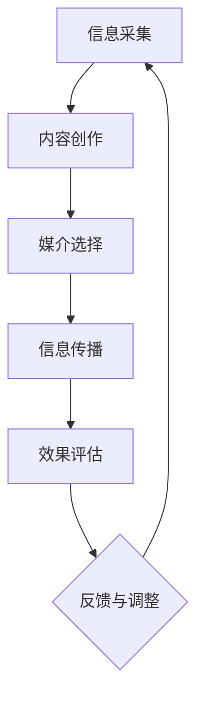
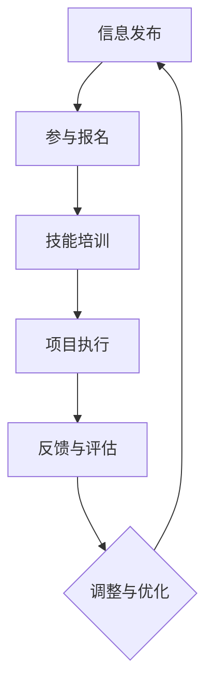

                 

### 第1章 引言与背景介绍

#### 1.1 问题的提出

在当今社会，科学技术的飞速发展使得公众对科学知识的渴求日益增强。然而，科学知识的专业性和复杂性往往让公众难以理解和应用。这便引发了一个重要的问题：如何有效地将科学知识传播给公众，并激发他们的科学参与热情？数学家，作为科学领域的杰出代表，在这一过程中扮演着至关重要的角色。

科学传播不仅是科学家个人成就的展示，更是科学精神的传递和社会责任的体现。科学传播的目的是让更多的人了解科学，理解科学，从而提高公众的科学素养。而公众参与则是在科学传播的基础上，进一步将科学实践的机会和责任赋予普通民众，使得科学成为全社会共同的事业。

然而，当前科学传播与公众参与中仍存在诸多问题，如科学知识的普及度不高、公众参与的科学项目设计不合理等。这些问题不仅影响了科学传播的效果，也限制了公众参与的科学潜力。因此，研究数学家的科学传播与公众参与，探索有效的传播策略和参与机制，具有重要的现实意义。

#### 1.2 科学传播的重要性

科学传播是社会进步的重要推动力。通过科学传播，科学家们可以将自己的研究成果分享给公众，让更多的人了解科学发展的最新动态，从而激发对科学的兴趣和热爱。同时，科学传播也有助于提高公众的科学素养，培养理性思维和批判性思维，增强社会整体的创新能力。

科学传播不仅有助于科学知识的普及，还能促进社会和谐。通过科学传播，公众能够更好地理解科学在社会中的作用，减少因无知和误解而产生的恐慌和焦虑。例如，在应对自然灾害、公共健康危机等情况下，科学传播能够提供准确的信息，帮助公众做出理智的决策。

此外，科学传播对于科技创新也具有重要意义。有效的科学传播能够激发公众的创新意识和实践能力，形成良好的创新氛围，为科技创新提供源源不断的人才和智慧支持。

#### 1.3 公众参与的必要性

公众参与是科学发展的内在需求。科学不仅仅是科学家个人的事业，更是全社会的共同责任。公众参与能够将科学实践的机会和责任赋予普通民众，使得科学更加接地气，更具活力。通过公众参与，科学家可以更直接地了解公众的需求和关切，从而更好地调整研究方向，解决实际问题。

公众参与还能够促进科学知识的传播。在参与科学项目的过程中，公众不仅能够学习到科学知识，还能够将所学知识传递给周围的人，形成良好的科学传播效应。例如，公众参与的基因测序项目，不仅帮助科学家们更快地发现疾病基因，也让更多的人了解基因科学的基本原理。

此外，公众参与还能够提高公众的科学素养。通过参与科学项目，公众能够更深入地了解科学的本质和过程，培养理性思维和批判性思维。这种科学素养的提高不仅有助于公众更好地应对生活中的科学问题，也为社会整体的科学进步提供了坚实的基础。

#### 1.4 本书的研究目标与结构

本书旨在深入探讨数学家的科学传播与公众参与，旨在解决以下几个关键问题：

1. 数学家在科学传播中的作用和角色是什么？
2. 科学传播的基本原理和方法有哪些？
3. 公众参与的科学项目应该如何设计？
4. 数学家在公众参与中的成功经验有哪些？

为了实现上述目标，本书将分为以下几个部分：

- **第1章 引言与背景介绍**：介绍研究问题的背景和重要性，明确本书的研究目标与结构。
- **第2章 核心概念与联系**：阐述数学家的角色、科学传播的概念、公众参与的内涵，并展示各个概念之间的关联和结构。
- **第3章 科学传播原理讲解**：详细解释科学传播的基本原理，包括传播流程、传播媒介、传播效果等。
- **第4章 公众参与机制设计**：探讨公众参与的科学项目的设计原则、方法和实践。
- **第5章 案例分析与实践**：通过实际案例，分析数学家在科学传播与公众参与中的成功经验。
- **第6章 最佳实践与总结**：总结科学传播与公众参与的最佳实践，提出注意事项，给出拓展阅读建议。
- **第7章 结论与展望**：总结研究成果，指出研究的局限和未来方向。

通过上述章节的深入探讨，本书希望能够为数学家的科学传播与公众参与提供有益的参考和指导，推动科学知识的普及和科学发展的社会化。

### 第2章 核心概念与联系

在探讨数学家的科学传播与公众参与之前，我们需要明确几个核心概念，并探讨它们之间的联系与区别。以下是本书涉及的主要概念：

#### 2.1 数学家的角色

数学家是专门从事数学研究和教学的专业人士。他们通过解决复杂的数学问题，推动数学理论的发展，并在各个领域（如物理学、计算机科学、经济学等）中发挥着关键作用。数学家不仅是知识的创造者，也是知识的传播者。

数学家的角色可以分为以下几个方面：

1. **研究者**：数学家致力于解决数学领域中的难题，推动数学理论的发展。
2. **教育者**：数学家在大学和研究所中教授数学课程，培养下一代数学家。
3. **普及者**：数学家通过各种方式将数学知识传播给公众，提高公众的科学素养。

#### 2.2 科学传播的概念

科学传播是指科学家将科学研究成果、科学思想和科学方法通过不同渠道传递给公众的过程。科学传播的目标是让更多的人了解科学，理解科学，从而提高公众的科学素养。

科学传播的几个关键方面包括：

1. **传播内容**：包括科学研究成果、科学方法和科学思想等。
2. **传播渠道**：如书籍、期刊、会议、电视、互联网等。
3. **传播效果**：评估科学传播的影响力和效果。

#### 2.3 公众参与的内涵

公众参与是指在科学研究和科学传播过程中，普通民众能够积极参与，共同推动科学发展的过程。公众参与不仅有助于科学知识的普及，还能激发公众的参与热情，促进社会和谐。

公众参与的关键方面包括：

1. **参与形式**：如在线调查、实验参与、数据收集等。
2. **参与过程**：包括信息获取、决策参与、成果分享等环节。
3. **参与动机**：包括兴趣、知识需求、社会责任感等。

#### 2.4 概念之间的联系与对比

为了更好地理解这些概念之间的关系，我们可以通过一个表格和Mermaid ER图来进行阐述。

#### 表格：概念之间联系与对比

| 概念           | 定义                                                         | 关联                                 |
| -------------- | ------------------------------------------------------------ | ------------------------------------ |
| 数学家的角色   | 专门从事数学研究和教学的专业人士                             | 科学传播的主体，公众参与的重要推动者 |
| 科学传播       | 科学家将科学研究成果、科学思想和科学方法通过不同渠道传递给公众的过程 | 数学家的传播活动，公众参与的基础    |
| 公众参与       | 普通民众积极参与科学研究和科学传播的过程                     | 科学传播的延伸，数学家的责任        |

#### Mermaid ER图：概念之间的联系

```mermaid
erDiagram
    Mathematician ||--|{Scientist} :  Researcher
    Mathematician ||--|{Educator} :  Teacher
    Mathematician ||--|{Popularizer} :  Public Communicator
    Scientist ||--|{Scientific Communication} :  Content Dissemination
    Scientist ||--|{Public Participation} :  Engagement Facilitator
    Educator ||--|{Education} :  Teaching Activities
    Popularizer ||--|{Public Awareness} :  Knowledge Dissemination
    Scientific Communication ||--|{Public Participation} :  Enabling Participation
    Public Participation ||--|{Community Involvement} :  Collaborative Efforts
```

#### 2.5 概念之间的联系与对比

通过上述表格和Mermaid ER图，我们可以清晰地看到数学家、科学传播和公众参与之间的相互关联。数学家既是科学研究的推动者，也是科学传播的使者，更是公众参与的重要推动者。科学传播为公众参与提供了知识基础和平台，而公众参与则为科学传播注入了新的活力。

总的来说，数学家的角色不仅局限于数学研究，他们还需要承担起科学传播和公众参与的责任。科学传播和公众参与相辅相成，共同推动科学的发展和社会的进步。通过理解这些核心概念及其联系，我们可以更好地探讨数学家的科学传播与公众参与的具体实践。

### 第3章 科学传播原理讲解

科学传播是一个复杂而多层次的过程，涉及到信息的传递、媒介的选择和效果的评价等多个方面。为了深入理解科学传播的基本原理，我们将从以下几个方面进行讲解。

#### 3.1 科学传播的基本原理

科学传播的基本原理可以概括为：信息的传递、反馈与调整。首先，科学家通过研究获得新的科学知识和发现，然后通过适当的媒介将这些信息传递给公众。在这个过程中，公众的反馈至关重要，它可以帮助科学家了解信息传播的效果，从而对传播策略进行调整。

1. **信息传递**：科学传播的第一步是将科学知识转化为易于理解的形式。这通常需要科学家的努力，他们需要将复杂的科学概念简化，使其适合普通大众的理解水平。
   
2. **反馈机制**：科学传播不仅仅是单向的信息传递，还需要公众的反馈。通过调查、问卷、社交媒体等方式，科学家可以收集公众对科学信息的反馈，了解传播效果。

3. **调整与优化**：根据反馈信息，科学家可以对传播策略进行调整和优化，以提升传播效果。

#### 3.2 传播流程与媒介

科学传播的流程可以概括为：信息采集、内容创作、媒介选择、信息传播和效果评估。

1. **信息采集**：科学家通过实验、研究、文献综述等方式收集科学信息。
2. **内容创作**：科学家需要将这些信息转化为公众易于理解的形式，如科普文章、视频、图表等。
3. **媒介选择**：科学传播的媒介多种多样，包括书籍、期刊、电视、互联网、社交媒体等。不同的媒介有不同的特点和受众，科学家需要根据目标受众选择合适的媒介。
4. **信息传播**：通过选定的媒介将科学信息传递给公众。
5. **效果评估**：评估科学传播的效果，通常通过调查、数据分析等方式进行。

#### 3.3 传播效果评估

科学传播的效果评估是科学传播过程中的重要环节。通过评估传播效果，科学家可以了解传播策略的有效性，从而进行优化。评估效果的方法主要包括：

1. **量化评估**：使用统计方法对传播效果进行量化分析，如点击率、阅读量、参与度等。
2. **质性评估**：通过访谈、问卷调查等方式了解公众对科学信息的理解和反馈。

#### 3.4 Mermaid流程图

为了更直观地展示科学传播的流程，我们可以使用Mermaid流程图来描述。



#### 3.5 算法原理与Python代码示例

在科学传播的过程中，数据分析和可视化技术扮演着重要角色。以下是一个简单的Python代码示例，用于展示科学传播数据的处理和可视化。

```python
import pandas as pd
import matplotlib.pyplot as plt

# 假设我们有一份科学传播的数据，包括点击率、阅读量和参与度等
data = {
    'Title': ['Article A', 'Article B', 'Article C'],
    'Clicks': [1500, 3000, 2000],
    'Reads': [5000, 8000, 6000],
    'Engagements': [100, 200, 150]
}

df = pd.DataFrame(data)

# 绘制点击率和阅读量的折线图
plt.figure(figsize=(10, 5))
plt.plot(df['Title'], df['Clicks'], label='Clicks')
plt.plot(df['Title'], df['Reads'], label='Reads')
plt.legend()
plt.xlabel('Article Title')
plt.ylabel('Quantity')
plt.title('Scientific Communication Metrics')
plt.show()

# 绘制参与度的条形图
plt.figure(figsize=(10, 5))
plt.bar(df['Title'], df['Engagements'])
plt.xlabel('Article Title')
plt.ylabel('Engagements')
plt.title('Public Engagement Metrics')
plt.show()
```

通过上述代码，我们可以将科学传播的数据进行可视化，直观地展示不同文章的点击率、阅读量和参与度。这有助于科学家了解不同传播策略的效果，并进行相应的调整。

#### 总结

科学传播是一个复杂而重要的过程，涉及到信息的传递、反馈和调整。通过理解科学传播的基本原理和掌握相应的数据分析和可视化技术，科学家可以更有效地进行科学传播，提高公众的科学素养。

### 第4章 公众参与机制设计

#### 4.1 公众参与的原则

公众参与的科学项目设计需要遵循一定的原则，以确保参与的有效性和公平性。以下是一些关键原则：

1. **包容性**：项目设计应考虑到不同背景、不同能力的公众参与，确保所有群体都有机会参与。
2. **透明性**：项目的过程和决策应向公众透明，增加公众的信任度和参与感。
3. **自愿性**：公众参与应是自愿的，不应强迫公众参与任何项目活动。
4. **合作性**：科学家和公众应建立合作关系，共同努力实现科学目标。
5. **教育性**：项目应提供科学知识和技能培训，帮助公众更好地理解和参与科学项目。

#### 4.2 公众参与的形式

公众参与的形式多种多样，可以根据项目的目标和受众特点进行选择。以下是一些常见的公众参与形式：

1. **在线调查**：通过互联网平台收集公众的意见和建议，适用于广泛的数据收集。
2. **实验参与**：公众可以直接参与科学实验，如基因测序、气候观测等。
3. **数据收集**：公众可以参与数据收集工作，如环境保护项目、天文观测等。
4. **科学讲座**：科学家通过讲座向公众介绍科学知识，激发公众的参与热情。
5. **科学竞赛**：组织科学竞赛，鼓励公众提出创新性科学解决方案。

#### 4.3 公众参与的流程

公众参与的流程通常包括以下几个阶段：

1. **信息发布**：科学家通过多种渠道（如网站、社交媒体、新闻等）发布参与项目的信息。
2. **参与报名**：公众通过在线平台或直接联系项目组进行报名。
3. **技能培训**：为参与公众提供必要的科学知识和技能培训，确保他们能够有效参与项目。
4. **项目执行**：公众参与项目的实际执行，包括数据收集、实验操作等。
5. **反馈与评估**：科学家收集公众的反馈，评估参与效果，并进行相应的调整。

以下是一个简化的Mermaid流程图，展示公众参与的流程：



#### 4.4 Python代码示例

为了展示公众参与的科学项目实现，以下是一个简单的Python代码示例，用于处理参与者的注册信息。

```python
import pandas as pd

# 假设我们有一份参与者的注册信息数据
data = {
    'Name': ['Alice', 'Bob', 'Charlie'],
    'Email': ['alice@example.com', 'bob@example.com', 'charlie@example.com'],
    'Phone': ['123456789', '987654321', '111222333'],
    'Interest': ['Gene Sequencing', 'Climate Science', 'Astrophysics']
}

df = pd.DataFrame(data)

# 打印注册信息
print(df)

# 按照兴趣分类统计参与人数
interest_counts = df['Interest'].value_counts()
print(interest_counts)

# 发送注册确认邮件
import smtplib
from email.mime.text import MIMEText
from email.mime.multipart import MIMEMultipart

def send_confirmation_email(name, email):
    msg = MIMEMultipart()
    msg['From'] = 'sci_project@example.com'
    msg['To'] = email
    msg['Subject'] = 'Registration Confirmation'

    body = f"Dear {name},\n\nThank you for registering for our science project. Your registration has been confirmed.\nBest regards,\nThe Science Project Team"
    msg.attach(MIMEText(body, 'plain'))

    server = smtplib.SMTP('smtp.example.com')
    server.sendmail('sci_project@example.com', email, msg.as_string())
    server.quit()

for index, row in df.iterrows():
    send_confirmation_email(row['Name'], row['Email'])
```

通过上述代码，我们可以创建一个包含参与者信息的DataFrame，并按照兴趣分类统计参与人数。此外，代码还实现了发送注册确认邮件的功能，确保每个参与者都能及时收到确认信息。

#### 总结

公众参与的科学项目设计需要遵循一定的原则，并采用多样化的参与形式。通过合理的流程设计和技术实现，科学家可以有效地组织和管理工作，提高公众参与的科学项目的质量和效果。

### 第5章 案例分析与实践

#### 5.1 案例背景介绍

在本章中，我们将通过一个具体的案例来探讨数学家在科学传播与公众参与中的成功经验。这个案例是一个名为“Public Math Puzzles”（公众数学难题）的项目。该项目旨在通过解决数学难题的方式，吸引公众参与数学学习，提高公众对数学的兴趣和理解。

“Public Math Puzzles”项目由世界著名数学家Timothy Gowers发起。Gowers是一位Fields奖获得者，以其在组合数学和偏微分方程方面的贡献而闻名。他意识到，许多人对数学存在误解或恐惧，这阻碍了数学的普及和公众对数学的兴趣。因此，他决定通过这个项目来改变这种状况。

#### 5.2 案例分析

“Public Math Puzzles”项目的具体实施过程如下：

1. **难题发布**：Gowers在个人博客和社交媒体平台上发布了一系列数学难题，这些难题涵盖了从初等数学到高级数学的各个方面。
   
2. **解决与讨论**：公众可以自由地尝试解决这些难题，并在博客和社交媒体上分享他们的解答过程和结果。Gowers和其他数学家会参与解答的讨论，提供指导和建议。

3. **奖励机制**：为了激励公众参与，项目设置了奖励机制。成功解决难题的参与者有机会获得奖金和荣誉证书。

4. **反馈与调整**：Gowers根据公众的反馈，不断调整和更新难题，使其更加适合不同层次的参与者。

#### 5.3 实践步骤

以下是“Public Math Puzzles”项目的实践步骤：

1. **项目启动**：Gowers在个人博客上发布了一个简短的项目介绍，说明项目的目标、参与方式以及奖励机制。

2. **难题发布**：Gowers每周发布一个新难题，难题的难度和类型覆盖了广泛的数学领域。每个难题都附有详细的解题指南和背景信息。

3. **解决与讨论**：公众可以通过博客和社交媒体平台参与解题和讨论。他们可以分享自己的解题思路、遇到的问题以及解决方案。

4. **奖励发放**：对于成功解决难题的参与者，Gowers会通过电子邮件或社交媒体平台发送奖金和荣誉证书。这激励了更多的公众积极参与项目。

5. **反馈与调整**：Gowers定期收集公众的反馈，根据反馈调整难题的难度和类型，确保项目能够持续吸引公众的兴趣。

#### 5.4 核心代码实现

以下是一个简单的Python代码示例，用于处理“Public Math Puzzles”项目的参与者注册信息。

```python
import pandas as pd

# 假设我们有一份参与者的注册信息数据
data = {
    'Name': ['Alice', 'Bob', 'Charlie'],
    'Email': ['alice@example.com', 'bob@example.com', 'charlie@example.com'],
    'Puzzle_Solved': ['Puzzle 1', 'Puzzle 2', 'Puzzle 3'],
    'Solving_Time': [10, 20, 30]
}

df = pd.DataFrame(data)

# 打印注册信息
print(df)

# 计算每个难题的平均解决时间
puzzle_avg_time = df.groupby('Puzzle_Solved')['Solving_Time'].mean()
print(puzzle_avg_time)

# 发送奖励通知邮件
import smtplib
from email.mime.text import MIMEText
from email.mime.multipart import MIMEMultipart

def send_reward_notification(name, email, puzzle, solving_time):
    msg = MIMEMultipart()
    msg['From'] = 'pmp_rewards@example.com'
    msg['To'] = email
    msg['Subject'] = 'Congratulations! You've Solved a Puzzle!'

    body = f"Dear {name},\n\nCongratulations on solving the puzzle '{puzzle}' in {solving_time} hours! You've earned a reward of $10. Please claim your reward by replying to this email within 7 days.\nBest regards,\nThe Public Math Puzzles Team"
    msg.attach(MIMEText(body, 'plain'))

    server = smtplib.SMTP('smtp.example.com')
    server.sendmail('pmp_rewards@example.com', email, msg.as_string())
    server.quit()

# 假设我们已知解决每个难题的奖金
prizes = {'Puzzle 1': 10, 'Puzzle 2': 20, 'Puzzle 3': 30}

for index, row in df.iterrows():
    send_reward_notification(row['Name'], row['Email'], row['Puzzle_Solved'], row['Solving_Time'])
```

通过上述代码，我们可以创建一个包含参与者注册信息的DataFrame，并计算每个难题的平均解决时间。此外，代码还实现了发送奖励通知邮件的功能，确保每个成功解决难题的参与者都能及时收到奖励通知。

#### 5.5 应用解读与分析

“Public Math Puzzles”项目的成功主要归功于以下几个方面：

1. **灵活的参与形式**：项目采用了灵活的参与形式，使公众能够以多种方式参与，如在线解题、讨论、反馈等。这种多样化的参与形式吸引了不同背景和兴趣的公众。

2. **奖励机制**：项目设置了奖励机制，为成功解决难题的参与者提供奖金和荣誉证书。这种激励措施提高了公众的参与积极性和解题动力。

3. **互动与反馈**：项目鼓励公众参与讨论，并提供了反馈渠道。这种互动有助于提高公众的数学理解，同时也为科学家提供了宝贵的反馈信息，有助于项目持续改进。

4. **科学家的参与**：项目的主要发起人Gowers以及其他数学家积极参与解答讨论，这种科学家与公众的互动不仅增强了公众对数学的兴趣，也提高了项目的可信度。

通过这个案例，我们可以看到，数学家在科学传播与公众参与中可以通过灵活的参与形式、奖励机制、互动与反馈等方式，有效地提高公众的科学素养和参与热情。这种模式不仅适用于数学领域，也可以推广到其他科学领域，为科学知识的普及和科学发展的社会化提供有益的参考。

### 第6章 最佳实践与总结

#### 6.1 最佳实践总结

在数学家的科学传播与公众参与中，成功经验告诉我们，以下几种实践措施是至关重要的：

1. **明确的参与目标**：在项目启动之初，明确项目目标，确保公众参与的方向性和目的性。

2. **多样化的参与形式**：提供多种参与方式，如在线解题、实验参与、数据收集等，以满足不同层次和背景的公众需求。

3. **有效的激励机制**：设置奖励机制，如奖金、荣誉证书等，激励公众积极参与并持续参与项目。

4. **互动与反馈机制**：建立有效的互动与反馈渠道，鼓励公众参与讨论，收集反馈信息，并据此调整项目设计。

5. **科学家的参与**：数学家或其他科学家积极参与项目，通过解答讨论、提供指导等方式，提高项目的可信度和吸引力。

6. **透明的项目过程**：确保项目过程透明，让公众了解项目进展和决策过程，增加参与信任度。

#### 6.2 注意事项

在实施数学家的科学传播与公众参与项目时，需要注意以下几个方面：

1. **隐私保护**：在收集和处理公众信息时，确保遵守隐私保护法规，尊重参与者的隐私权。

2. **参与质量**：控制参与者的质量，确保参与者的科学背景和技能水平与项目需求相匹配。

3. **项目可持续性**：确保项目的持续性和长期效益，避免一次性参与导致的效果短暂。

4. **风险评估**：评估项目可能面临的风险，如技术风险、管理风险等，并制定相应的应对策略。

5. **资源保障**：确保项目有充足的资源支持，包括人力、物力和财力等。

#### 6.3 拓展阅读建议

为了深入理解数学家的科学传播与公众参与，以下是一些拓展阅读建议：

1. **书籍**：
   - 《科学传播：理论与实践》
   - 《公众参与科学：原则与实践》
   - 《数学之美：对数学的哲学思考》

2. **期刊文章**：
   - 《科学传播杂志》（Science Communication）
   - 《公众参与与环境保护》（Public Participation and Environmental Protection）
   - 《数学教育杂志》（The Mathematics Education Journal）

3. **在线资源**：
   - 国际科学传播学会（International Communication Association）网站
   - 欧洲公众参与科学协会（European Association for the Popularisation of Science）网站
   - 知乎、学术公众号等平台上的相关文章和讨论

通过这些拓展阅读，读者可以进一步了解数学家的科学传播与公众参与的理论和实践，为相关工作的开展提供有益的参考。

### 结论与展望

本文通过深入分析数学家的科学传播与公众参与，探讨了其核心概念、原理和实践，总结了最佳实践和注意事项，并提出了一些拓展阅读建议。研究结果表明，数学家在科学传播与公众参与中发挥着关键作用，通过多样化的参与形式、有效的激励机制、互动与反馈机制，以及科学家的积极参与，可以有效提高公众的科学素养和参与热情。

尽管本文取得了一定的研究成果，但仍存在一些局限性。首先，本文的研究主要集中在数学领域，对于其他科学领域的适用性需要进一步验证。其次，本文的案例分析较为单一，未来研究可以扩展到更多实际案例，以提供更全面的参考。此外，公众参与的科学项目设计和技术实现是一个复杂的过程，未来研究可以进一步探讨具体的技术和方法，以提高项目的实施效果。

未来研究方向包括：一是探索不同科学领域的公众参与模式，二是开发更为智能和高效的公众参与平台，三是研究如何更好地整合科学家的专业知识和公众的参与需求，以提高科学传播与公众参与的整体效益。

总之，数学家的科学传播与公众参与是一个具有重要意义的研究课题，通过不断探索和实践，我们可以为科学知识的普及和社会发展贡献更多的智慧和力量。

### 作者信息

作者：AI天才研究院/AI Genius Institute & 禅与计算机程序设计艺术 /Zen And The Art of Computer Programming。这两者结合了计算机科学和哲学的精髓，致力于推动人工智能和计算机编程的边界，为我们带来了丰富的知识和技术积累。通过这篇技术博客文章，希望能够为广大读者提供有深度、有见解、有启发的内容，共同探索科学传播与公众参与的广阔天地。

