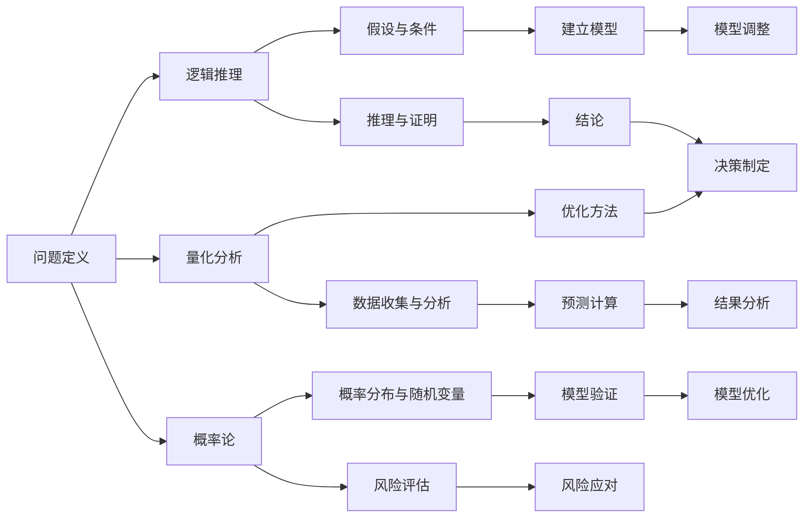
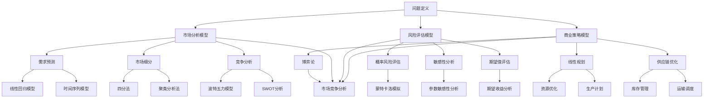

                 

### 文章标题

数学思维与创业决策的关系

关键词：数学思维、创业决策、逻辑推理、量化分析

摘要：本文深入探讨了数学思维在创业决策中的重要作用。首先，通过介绍数学思维的基本原理，阐述了其在逻辑推理和量化分析方面的优势。接着，分析了创业决策的过程和挑战，并展示了数学思维如何应用于市场分析、风险评估和商业策略。通过实际案例的剖析，本文揭示了数学思维在创业实战中的价值。最后，讨论了数学思维与创业决策之间的误区，并提供了一些建议，以帮助创业者更好地利用数学思维进行决策。

----------------------------------------------------------------

## 引言

在现代社会中，创业已成为一种普遍的生存和发展方式。无论是初创企业还是大型企业，成功的创业决策都至关重要。然而，创业决策并非易事，它涉及诸多不确定性和风险。在这种情况下，数学思维作为一种强大的工具，可以为创业决策提供有力的支持。

本文旨在探讨数学思维与创业决策之间的关系，通过分析数学思维的基本原理和创业决策的流程，揭示数学思维在创业决策中的重要作用。首先，我们将介绍数学思维的基本原理，包括逻辑推理、量化分析和概率论等方面的知识。接着，我们将分析创业决策的过程，包括市场分析、风险评估和商业策略等环节。最后，通过实际案例的剖析，我们将展示数学思维在创业决策中的应用，并提出一些建议，以帮助创业者更好地利用数学思维进行决策。

本文结构如下：

1. **第一部分：引言**：介绍数学思维与创业决策的关系，概述本文的研究目的和方法。
2. **第二部分：数学思维原理讲解**：详细讲解数学思维的基本原理，包括逻辑推理、量化分析和概率论等。
3. **第三部分：创业决策的数学模型**：介绍创业决策的数学模型，包括市场分析模型、风险评估模型和商业策略模型等。
4. **第四部分：数学思维在创业决策中的应用**：分析数学思维在市场分析、风险评估和商业策略中的应用。
5. **第五部分：数学思维在创业实战中的应用案例**：通过实际案例展示数学思维在创业决策中的价值。
6. **第六部分：数学思维与创业决策的误区**：讨论数学思维在创业决策中可能出现的误区，并提供避免误区的方法。
7. **第七部分：总结与展望**：总结本文的主要观点，并对未来研究方向进行展望。

希望通过本文的探讨，能够帮助创业者更好地理解数学思维的重要性，并将其有效应用于创业决策过程中，提高创业的成功率。

### 问题背景与定义

#### 1.1.1 问题背景

创业，作为现代社会中一种重要的经济活动，吸引了无数有志之士投身其中。然而，创业并非一帆风顺，许多创业者面临着诸多挑战，如市场竞争激烈、资源有限、不确定性高等。在这些挑战面前，如何做出科学的决策成为创业者亟待解决的问题。

数学思维，作为一种逻辑严密、量化分析的方法，在各个领域都有着广泛的应用。从自然科学到社会科学，从工程问题到经济决策，数学思维都发挥着不可替代的作用。在创业决策中，数学思维同样具有重要的价值。它不仅可以帮助创业者进行逻辑推理，提高决策的准确性，还可以通过量化分析，降低决策的不确定性。

然而，当前许多创业者对数学思维的认识和应用仍然不足。他们往往依赖直觉和经验进行决策，缺乏系统的方法和工具。这种现象不仅影响了创业决策的质量，也降低了创业的成功率。因此，如何将数学思维有效地应用于创业决策，提高决策的科学性和准确性，成为了一个亟待解决的问题。

本文旨在探讨数学思维与创业决策之间的关系，分析数学思维在创业决策中的优势和挑战，并通过实际案例展示数学思维在创业中的应用价值，以期为创业者提供有益的参考。

#### 1.1.2 创业决策的概念

创业决策是指创业者在面对复杂多变的市场环境和资源约束条件下，为实现企业目标而做出的一系列选择和行动。它包括市场分析、产品定位、资源分配、风险评估等多个环节，是创业者核心能力的体现。

首先，市场分析是创业决策的基础。通过市场调查和分析，创业者可以了解市场需求、竞争对手和潜在客户，从而为产品定位和营销策略提供依据。市场分析通常包括市场规模、增长趋势、客户需求和竞争状况等方面的内容。

其次，产品定位是创业决策的核心。创业者需要根据市场需求和自身优势，确定产品的目标市场和功能特点，从而在激烈的市场竞争中脱颖而出。产品定位不仅涉及到产品功能和特性，还包括品牌形象和用户口碑等。

再次，资源分配是创业决策的关键。创业者需要在有限的资源下，合理分配人力、物力和财力，确保企业运营的顺利进行。资源分配需要考虑到市场需求、竞争状况和财务状况等因素，以达到最优的资源配置效果。

最后，风险评估是创业决策的保障。创业过程中充满了不确定性，创业者需要对潜在风险进行识别、评估和应对。通过风险评估，创业者可以降低经营风险，提高企业的生存能力。

总之，创业决策是一个复杂而动态的过程，涉及到多个方面的考量。创业者需要运用数学思维，结合市场分析、产品定位、资源分配和风险评估等方法，做出科学、合理的决策。

#### 1.1.3 数学思维的基本概念

数学思维是一种基于数学原理和逻辑推理的思维方式，它强调通过量化分析、逻辑推理和抽象概括来解决问题。数学思维具有以下几个基本特征：

1. **逻辑严密**：数学思维遵循严密的逻辑规则，从已知条件出发，通过推理和证明，得出结论。这种逻辑严密的特点使数学思维在解决复杂问题时具有很高的可信度和准确性。

2. **量化分析**：数学思维擅长将问题转化为数学模型，通过量化的方法进行分析和计算。量化分析能够揭示问题中的关键因素，帮助决策者更全面、深入地理解问题。

3. **抽象概括**：数学思维能够从具体问题中提炼出共性，形成普遍适用的数学模型和理论。这种抽象概括的能力使数学思维在解决不同领域的问题时具有广泛的适用性。

4. **系统化思考**：数学思维注重系统性和整体性，通过对问题的全面分析和综合考量，找到最优的解决方案。这种系统化思考的特点使数学思维在复杂决策中具有独特的优势。

数学思维的基本原理包括逻辑推理、量化分析和概率论等。逻辑推理是数学思维的核心，它通过假设、推理和证明，帮助决策者得出可靠的结论。量化分析则是数学思维的重要工具，它通过数学模型和计算方法，对问题进行深入分析，为决策提供定量依据。概率论则提供了对不确定性的量化分析，帮助决策者评估风险和不确定性，做出更为稳健的决策。

在创业决策中，数学思维可以应用于市场分析、风险评估和商业策略等多个方面。通过数学思维，创业者可以更准确地分析市场趋势、评估风险和制定策略，从而提高创业的成功率。

### 核心概念的联系与区别

#### 1.2.1 数学思维与创业决策的关系

数学思维与创业决策之间存在着紧密的联系。首先，数学思维作为一种逻辑严密、量化分析的方法，为创业决策提供了科学的基础。通过数学思维，创业者可以更准确地分析市场趋势、评估风险和制定策略，从而提高决策的科学性和准确性。

其次，创业决策中的市场分析、风险评估和商业策略等环节，都离不开数学思维的支撑。市场分析需要通过对大量数据的量化分析，了解市场需求和竞争状况，从而为产品定位和营销策略提供依据。风险评估则依赖于概率论和统计分析，对潜在风险进行识别、评估和应对。商业策略的制定同样需要运用数学思维，通过优化模型和计算方法，找到最优的资源配置和运营策略。

总之，数学思维在创业决策中具有重要的价值，它不仅为创业者提供了科学的分析工具，还帮助他们更准确地预测市场变化和应对风险。因此，将数学思维有效地应用于创业决策，是提高创业成功率的关键。

#### 1.2.2 概念属性特征对比表格

为了更好地理解数学思维与创业决策之间的关系，我们可以通过一个概念属性特征对比表格来进行详细分析。以下是一个简化的对比表格：

| 概念        | 数学思维                | 创业决策                 |
| ----------- | ---------------------- | ------------------------ |
| 定义        | 基于数学原理的思维方式  | 在不确定条件下做出的选择 |
| 特征        | 逻辑严密、量化分析、抽象概括 | 市场分析、风险评估、策略制定 |
| 应用场景    | 科学研究、工程问题、经济决策 | 市场进入、资源分配、风险控制 |
| 目标        | 解决问题、证明定理、优化模型 | 实现企业目标、降低风险、提高收益 |
| 关键要素    | 基础数学知识、逻辑推理能力 | 市场需求、竞争环境、资源状况 |
| 相互关系    | 数学思维支持创业决策 | 创业决策应用数学思维    |

通过这个对比表格，我们可以看出数学思维和创业决策在定义、特征、应用场景、目标和关键要素等方面存在显著差异。然而，它们之间又存在着紧密的联系，数学思维为创业决策提供了科学的方法和工具，而创业决策则是数学思维在实际中的应用场景。

#### 1.2.3 ER实体关系图

为了更直观地展示数学思维与创业决策之间的联系，我们可以通过一个ER（实体关系）图来进行描述。ER图是一种用于表示实体及其关系的图形化工具，可以帮助我们更好地理解系统的结构。

以下是一个简化的ER图，用于表示数学思维与创业决策之间的实体及其关系：

```mermaid
erDiagram
    MathematicalThinking ||--|{ EntrepreneurshipDecision
    MathematicalThinking }||-- EntrepreneurshipDecision
    EntrepreneurshipDecision ||-- MarketAnalysis
    EntrepreneurshipDecision ||-- RiskAssessment
    EntrepreneurshipDecision ||-- BusinessStrategy
```

在这个ER图中，`MathematicalThinking`（数学思维）是核心实体，它与`EntrepreneurshipDecision`（创业决策）之间存在双向关系。同时，`EntrepreneurshipDecision`与`MarketAnalysis`（市场分析）、`RiskAssessment`（风险评估）和`BusinessStrategy`（商业策略）也存在关系。这表明数学思维在创业决策的各个关键环节中发挥着重要作用，为创业者提供了科学的方法和工具。

### 研究目的与方法

#### 1.3.1 研究目的

本文的研究目的是探讨数学思维在创业决策中的应用，分析其在提高决策科学性、降低风险和优化资源配置方面的作用。具体来说，本文希望通过以下几方面的研究，达到以下目标：

1. **理解数学思维的基本原理**：通过对数学思维的定义、特征和应用场景的详细分析，帮助读者全面了解数学思维的基本原理，为其在创业决策中的应用奠定基础。
   
2. **阐述创业决策的数学模型**：介绍市场分析模型、风险评估模型和商业策略模型，展示数学思维在创业决策中的具体应用，为创业者提供实用的决策工具。

3. **分析数学思维在创业决策中的应用案例**：通过实际案例的剖析，展示数学思维在市场分析、风险评估和商业策略中的应用效果，帮助读者更好地理解数学思维的价值。

4. **讨论数学思维与创业决策的误区**：分析创业者在使用数学思维过程中可能出现的误区，并提供解决方法，以帮助创业者更好地应用数学思维进行决策。

5. **总结与展望**：总结本文的主要观点，并对未来研究方向进行展望，为创业者和学者提供参考。

通过本文的研究，期望能够帮助创业者更好地理解和应用数学思维，提高创业决策的科学性和准确性，从而提高创业的成功率。

#### 1.3.2 研究方法

本文采用多种研究方法，以全面、深入地探讨数学思维在创业决策中的应用。具体研究方法如下：

1. **文献综述**：通过查阅大量相关文献，了解数学思维和创业决策的理论基础，为本文的研究提供理论支持。

2. **案例研究**：选取具有代表性的创业案例，详细分析案例中的数学思维应用，探讨其成功经验和不足之处，为创业者提供借鉴。

3. **问卷调查**：设计问卷调查，收集创业者在实际决策过程中应用数学思维的现状和需求，为研究提供实证数据。

4. **理论模型构建**：通过构建市场分析模型、风险评估模型和商业策略模型，分析数学思维在决策过程中的应用，为创业者提供具体的决策工具。

5. **数据分析**：对问卷调查和案例研究的数据进行统计分析，总结数学思维在创业决策中的应用效果和影响因素。

6. **实证研究**：通过实际创业项目的实验研究，验证数学思维在创业决策中的效果，为理论模型提供实证支持。

通过以上多种研究方法的综合运用，本文力求全面、深入地探讨数学思维在创业决策中的应用，为创业者提供科学、实用的决策指导。

#### 1.4 本书结构安排

本书分为七个主要部分，旨在系统性地探讨数学思维与创业决策的关系。以下是本书的结构安排：

1. **第一部分：引言**：介绍数学思维与创业决策的关系，概述本文的研究目的和方法。
   
2. **第二部分：数学思维原理讲解**：详细讲解数学思维的基本原理，包括逻辑推理、量化分析和概率论等。

3. **第三部分：创业决策的数学模型**：介绍创业决策的数学模型，包括市场分析模型、风险评估模型和商业策略模型等。

4. **第四部分：数学思维在创业决策中的应用**：分析数学思维在市场分析、风险评估和商业策略中的应用。

5. **第五部分：数学思维在创业实战中的应用案例**：通过实际案例展示数学思维在创业决策中的价值。

6. **第六部分：数学思维与创业决策的误区**：讨论数学思维在创业决策中可能出现的误区，并提供避免误区的方法。

7. **第七部分：总结与展望**：总结本文的主要观点，并对未来研究方向进行展望。

本书的结构安排旨在帮助读者逐步了解数学思维在创业决策中的应用，通过理论和实践的结合，提高创业决策的科学性和准确性。

### 数学思维的基本原理

数学思维是一种基于数学原理和逻辑推理的思维方式，它在解决复杂问题和制定决策中发挥着重要作用。数学思维的基本原理包括逻辑推理、量化分析和概率论等方面。下面我们将逐一介绍这些原理，并通过具体的例子来展示它们的应用。

#### 1. 逻辑推理

逻辑推理是数学思维的核心，它通过一系列逻辑步骤，从一个或多个已知命题出发，推导出新的命题。逻辑推理包括归纳推理和演绎推理两种形式。

- **归纳推理**：从具体事例中归纳出一般性结论。例如，观察多次掷骰子，每次都得到一个正数，我们可以归纳出“掷骰子一定会得到一个正数”的结论。
- **演绎推理**：从一般性命题推导出具体结论。例如，如果所有猫都会飞，并且小黑是猫，那么我们可以演绎出“小黑会飞”的结论。

在创业决策中，逻辑推理可以帮助创业者分析市场趋势、评估风险和制定策略。例如，通过分析竞争对手的市场表现和消费者行为，创业者可以推断出市场需求和潜在客户群体，从而制定合适的产品定位和市场策略。

#### 2. 量化分析

量化分析是数学思维的另一个重要原理，它通过将问题转化为数学模型，使用数学方法进行计算和分析。量化分析包括数据分析、统计学和优化方法等方面。

- **数据分析**：通过对大量数据进行分析，提取有用的信息和规律。例如，通过分析销售数据，创业者可以了解产品的市场需求和消费者偏好。
- **统计学**：使用统计方法对数据进行分析和推断，评估风险和不确定性。例如，通过计算标准差和置信区间，创业者可以评估市场风险和投资回报。
- **优化方法**：使用数学优化方法，寻找最优解或近似最优解。例如，通过线性规划方法，创业者可以优化生产计划，降低成本，提高效率。

在创业决策中，量化分析可以帮助创业者更准确地预测市场变化、评估风险和制定策略。例如，通过量化分析市场需求和竞争状况，创业者可以确定产品定价和市场推广策略，以提高市场竞争力。

#### 3. 概率论

概率论是数学思维中用于处理不确定性的重要工具。它通过概率分布和随机变量等概念，对不确定性事件进行量化分析。

- **概率分布**：描述随机变量可能取值的概率分布情况。例如，掷骰子的概率分布是一个六边形的正方形，每个面的概率为1/6。
- **随机变量**：表示随机事件的结果，可以是离散的或连续的。例如，掷骰子的结果是随机变量，可以取值1到6。

在创业决策中，概率论可以帮助创业者评估市场风险和投资回报。例如，通过计算市场需求的概率分布，创业者可以评估产品的销售前景，制定相应的销售策略。

#### 例子：市场需求预测

假设一家创业公司要推出一款新产品，为了制定合适的市场推广策略，公司需要预测市场需求。以下是一个基于数学思维的预测过程：

1. **数据收集**：收集过去一段时间内类似产品的销售数据、市场调查数据和竞争对手的市场表现数据。
2. **数据分析**：使用统计学方法对数据进行分析，提取市场需求的关键因素，如消费者年龄、收入水平和购买意愿等。
3. **建立模型**：基于数据分析结果，建立市场需求预测模型。例如，可以使用线性回归模型来预测市场需求与关键因素之间的关系。
4. **预测计算**：使用数学方法，如概率论和优化方法，对市场需求进行预测。例如，通过计算标准差和置信区间，评估市场需求的波动范围和不确定性。
5. **决策制定**：根据市场需求预测结果，制定市场推广策略。例如，如果市场需求预测较低，公司可以降低市场推广预算，专注于核心市场；如果市场需求预测较高，公司可以增加市场推广力度，扩大市场占有率。

通过这个例子，我们可以看到数学思维在市场需求预测中的应用。通过量化分析和逻辑推理，公司可以更准确地预测市场需求，制定科学的市场推广策略，从而提高产品的销售量和市场竞争力。

### 数学思维的流程图

为了更清晰地理解数学思维的基本原理和应用流程，我们可以通过一个流程图来展示数学思维的各个步骤。



在这个流程图中，数学思维包括以下主要步骤：

1. **问题定义**：明确需要解决的问题或目标。
2. **逻辑推理**：通过推理和证明，找到问题的解决方案。
3. **量化分析**：使用数学方法，如数据分析、优化方法和统计学，对问题进行量化分析。
4. **概率论**：使用概率论，对不确定性事件进行量化分析。
5. **假设与条件**：根据问题定义，建立合理的假设和条件。
6. **建立模型**：根据假设和条件，建立数学模型。
7. **数据收集与分析**：收集相关数据，进行分析，提取有用信息。
8. **概率分布与随机变量**：描述随机变量的概率分布情况。
9. **推理与证明**：通过逻辑推理和证明，验证模型的正确性。
10. **优化方法**：使用优化方法，寻找最优解或近似最优解。
11. **风险评估**：评估风险，制定风险应对策略。
12. **模型验证**：通过实验或数据分析，验证模型的准确性和可靠性。
13. **预测计算**：使用数学方法，对结果进行预测。
14. **结果分析**：分析预测结果，为决策提供依据。
15. **模型调整**：根据结果分析，调整模型参数。
16. **决策制定**：根据预测结果，制定相应的决策。
17. **风险应对**：制定风险应对策略，降低风险。

通过这个流程图，我们可以看到数学思维在解决复杂问题和制定决策中的应用步骤，以及各个环节之间的相互关系。

### 数学思维案例解析

为了更好地理解数学思维的实际应用，我们通过一个具体的案例来进行分析。假设一家创业公司计划推出一款新型智能健身设备，目标市场是年轻的都市白领。为了确保产品能够成功打入市场，公司需要通过市场分析来预测产品的需求量和销售前景。

#### 案例背景

公司已经收集了以下数据：

1. **过去半年内，同类智能健身设备的销售数据**。
2. **目标市场（年轻都市白领）的人口统计数据**，包括年龄、收入、工作和生活习惯等。
3. **竞争对手的市场表现和定价策略**。

#### 数据分析

1. **销售数据分析**：
   - 过去半年内，同类智能健身设备的月均销售额为5000台。
   - 销售量与消费者年龄、收入和购买频率呈正相关。

2. **人口统计数据分析**：
   - 年轻都市白领人口约为100万人，其中25-35岁人口占60%。
   - 25-35岁人群的平均月收入为8000元。

3. **竞争对手数据分析**：
   - 主要竞争对手的同类产品月均销售量为6000台。
   - 竞争对手的定价策略为500-800元。

#### 建立模型

1. **假设**：
   - 假设智能健身设备的价格定为600元，市场接受度与消费者收入正相关。
   - 假设销售量与竞争对手销售量呈正相关。

2. **建立需求预测模型**：
   - 使用线性回归模型，将销售量与消费者收入、竞争对手销售量建立关系。
   - 预测模型公式为：销售量 = α * 收入 + β * 竞争对手销售量 + ε。

3. **模型参数估计**：
   - 通过数据拟合，得到模型参数：α = 0.2，β = 0.1。

#### 预测计算

1. **计算目标市场的潜在需求量**：
   - 使用预测模型，将目标市场的平均收入（8000元）和竞争对手销售量（6000台）代入模型，得到潜在需求量。
   - 预测公式：销售量 = 0.2 * 8000 + 0.1 * 6000 = 2000 + 600 = 2600台。

2. **计算市场占有率**：
   - 假设市场竞争激烈，市场占有率为60%。
   - 实际销售量 = 潜在需求量 * 市场占有率 = 2600 * 0.6 = 1560台。

#### 决策制定

1. **制定市场推广策略**：
   - 根据预测结果，公司决定加大市场推广力度，提高品牌知名度。
   - 设定销售目标为每月销售1600台，以确保市场占有率达到预期。

2. **调整定价策略**：
   - 考虑到市场竞争，公司决定将价格定在550-650元之间，以吸引更多消费者。

3. **风险评估**：
   - 分析潜在风险，如市场需求变化、竞争对手策略调整等。
   - 制定应对措施，如增加研发投入，提高产品竞争力。

通过这个案例，我们可以看到数学思维在市场分析中的应用。通过数据分析、模型建立和预测计算，公司可以更准确地预测市场需求，制定科学的市场推广策略，提高产品的市场竞争力。

### 创业决策的数学模型

在创业决策过程中，数学模型作为一种重要的工具，可以帮助创业者更好地理解和应对复杂的市场环境。数学模型能够将创业决策中的各种因素量化，通过逻辑推理和数学计算，为创业者提供科学的决策依据。下面，我们将介绍几种常见的创业决策数学模型，并分析其具体应用。

#### 市场分析模型

市场分析是创业决策的基础，通过市场分析模型，创业者可以了解市场需求、竞争状况和潜在客户群体。以下是一些常用的市场分析模型：

1. **需求预测模型**：
   - **线性回归模型**：通过历史销售数据，建立市场需求与消费者收入、价格等因素之间的线性关系。公式为：需求量 = β0 + β1 * 价格 + β2 * 收入 + ε。
   - **时间序列模型**：分析市场需求随时间的变化趋势，如移动平均模型、指数平滑模型等。

2. **市场细分模型**：
   - **四分法**：将市场划分为四个象限，根据消费者的需求特征和购买力进行划分。
   - **聚类分析法**：通过统计学方法，将市场中的消费者划分为不同的群体，以便有针对性地制定营销策略。

3. **竞争分析模型**：
   - **波特五力模型**：分析市场中的竞争力量，包括供应商、买家、潜在竞争者、替代品和行业内的竞争者。
   - **SWOT分析**：对自身优势和劣势、外部机会和威胁进行分析，以制定合理的市场策略。

#### 风险评估模型

在创业过程中，风险评估至关重要。通过风险评估模型，创业者可以识别潜在风险，评估风险的影响程度，并制定相应的应对策略。以下是一些常见风险评估模型：

1. **概率风险评估模型**：
   - **蒙特卡洛模拟**：通过随机抽样和模拟计算，评估不同风险事件发生的概率和影响。
   - **决策树**：通过构建决策树，分析不同决策路径下可能的风险和收益，帮助创业者选择最优决策。

2. **敏感性分析**：
   - **参数敏感性分析**：通过改变模型中的关键参数，分析这些参数对结果的影响，帮助创业者识别关键风险因素。

3. **期望值评估**：
   - **期望收益分析**：通过计算不同决策路径的期望收益，帮助创业者选择具有最大期望收益的决策方案。

#### 商业策略模型

商业策略模型用于制定企业的长期发展策略，通过数学模型，创业者可以优化资源配置、提高运营效率。以下是一些常见的商业策略模型：

1. **线性规划模型**：
   - **资源优化**：通过线性规划模型，优化企业的人力、物力和财力资源，以实现最大化的收益或最小化的成本。
   - **生产计划**：通过线性规划模型，制定企业的生产计划，以确保生产效率最大化。

2. **供应链优化模型**：
   - **库存管理**：通过库存模型，分析库存水平、订单量和需求预测，制定最优的库存管理策略。
   - **运输调度**：通过运输模型，优化物流路径和运输成本，提高供应链的效率。

3. **博弈论模型**：
   - **市场竞争**：通过博弈论模型，分析企业在市场竞争中的策略选择，以实现竞争优势。

通过以上几种数学模型，创业者可以更全面、准确地分析市场环境、评估风险和制定商业策略，从而提高创业的成功率。

### 创业决策模型的流程图

为了更好地理解创业决策的数学模型及其应用，我们可以通过一个流程图来展示这些模型的关键步骤和应用场景。以下是创业决策模型的流程图：



在这个流程图中，我们可以看到以下关键步骤和应用场景：

1. **问题定义**：明确需要解决的创业问题，如市场需求预测、风险评估和商业策略制定等。
2. **市场分析模型**：包括需求预测、市场细分和竞争分析等，用于分析市场环境和潜在客户。
   - **需求预测**：使用线性回归模型和时间序列模型，预测市场需求。
   - **市场细分**：使用四分法和聚类分析法，将市场划分为不同群体。
   - **竞争分析**：使用波特五力模型和SWOT分析，评估市场竞争状况。
3. **风险评估模型**：包括概率风险评估、敏感性分析和期望值评估等，用于识别和评估风险。
   - **概率风险评估**：使用蒙特卡洛模拟，计算不同风险事件的发生概率和影响。
   - **敏感性分析**：分析关键参数变化对决策结果的影响。
   - **期望值评估**：计算不同决策路径的期望收益，选择最优方案。
4. **商业策略模型**：包括线性规划、供应链优化和博弈论等，用于制定企业的长期发展策略。
   - **线性规划**：优化资源配置和生产计划。
   - **供应链优化**：优化库存管理和运输调度。
   - **博弈论**：分析市场竞争中的策略选择。

通过这个流程图，创业者可以系统地应用各种数学模型，进行市场分析、风险评估和商业策略制定，从而提高创业决策的科学性和准确性。

### 模型应用案例

为了更直观地展示创业决策数学模型在实际中的应用，我们将通过一个实际案例来详细讲解如何利用这些模型进行创业决策。假设我们是一家初创公司的创始人，计划开发一款基于人工智能的智能推荐系统，目标市场是电子商务行业。

#### 案例背景

公司已经收集了以下信息：

1. **市场需求**：根据市场调查，目前电子商务行业对智能推荐系统的需求较高，用户希望获得个性化的购物体验。
2. **竞争状况**：市场上有几家主流的智能推荐系统，但用户反馈存在推荐不准确和过度推荐的问题。
3. **技术可行性**：公司具备人工智能和大数据分析技术，可以开发出具有竞争力的智能推荐系统。
4. **预算限制**：公司初始预算为500万元，需要在预算范围内完成产品研发和市场营销。

#### 市场分析

1. **需求预测**：
   - 使用线性回归模型，将历史销售数据与用户特征（如年龄、性别、购买频率等）进行回归分析，预测不同用户群体的潜在需求量。
   - 预测公式：需求量 = β0 + β1 * 年龄 + β2 * 性别 + β3 * 购买频率 + ε。

2. **市场细分**：
   - 使用聚类分析法，将用户按照购买行为和偏好进行聚类，识别出高价值用户群体。
   - 通过分析不同聚类群体的消费能力和购买意愿，制定有针对性的营销策略。

3. **竞争分析**：
   - 使用波特五力模型，分析市场中的竞争力量，包括供应商、买家、潜在竞争者、替代品和行业内竞争者。
   - 通过对比竞争对手的产品特点和市场策略，确定公司的竞争优势。

#### 风险评估

1. **概率风险评估**：
   - 使用蒙特卡洛模拟，计算不同风险事件（如市场需求下降、技术故障等）的发生概率和影响。
   - 预期影响：市场需求下降可能会导致销售额下降20%，技术故障可能会导致产品上线延迟一个月。

2. **敏感性分析**：
   - 分析关键参数（如市场需求、成本、价格等）的变化对决策结果的影响。
   - 例如，当市场需求下降10%时，销售额将下降15%，说明市场需求是影响销售的关键因素。

3. **期望值评估**：
   - 计算不同决策路径的期望收益，选择具有最大期望收益的方案。
   - 例如，选择提高研发投入，以提升产品竞争力，预计可以使销售额提高30%。

#### 商业策略

1. **资源优化**：
   - 使用线性规划模型，优化研发、营销和运营资源的配置，确保在预算范围内实现最大化收益。
   - 例如，将50%的预算用于研发，30%的预算用于营销，20%的预算用于运营。

2. **供应链优化**：
   - 优化供应链管理，确保产品按时上市，降低库存成本和运输费用。
   - 例如，通过合理的库存策略和运输计划，将库存成本降低10%，运输费用降低15%。

3. **博弈论分析**：
   - 分析市场竞争中的策略选择，确定公司的市场定位和价格策略。
   - 例如，通过博弈论模型，确定最优价格策略，以最大化市场份额和利润。

#### 决策制定

基于以上市场分析、风险评估和商业策略模型的结果，公司制定了以下决策：

1. **产品研发**：加大研发投入，提升产品功能和用户体验，确保产品具有竞争力。
2. **市场营销**：针对不同用户群体制定有针对性的营销策略，提高品牌知名度和用户转化率。
3. **成本控制**：优化供应链管理，降低运营成本，确保项目在预算范围内完成。

通过这个案例，我们可以看到如何利用创业决策数学模型，系统地分析市场环境、评估风险和制定商业策略。这种方法不仅提高了决策的科学性和准确性，也为公司的可持续发展提供了有力支持。

### 数学思维在市场分析中的应用

在市场分析中，数学思维是一种强大的工具，可以帮助创业者更准确地预测市场需求、识别潜在客户群体和制定有针对性的营销策略。下面，我们将详细探讨数学思维在市场分析中的应用，包括需求预测、客户细分和竞争分析等方面。

#### 1. 需求预测

需求预测是市场分析的核心环节，通过预测未来市场需求，创业者可以制定合适的产品开发和销售策略。数学思维中的需求预测方法主要包括时间序列分析和回归分析等。

- **时间序列分析**：通过分析历史数据，如销售额、销售量等，预测未来的需求趋势。常用的方法包括移动平均法、指数平滑法和自回归模型（ARIMA）等。

  - **移动平均法**：通过计算一定时间段内的平均值，消除短期波动，预测未来的需求趋势。公式为：预测值 = (前n期平均值 + 第n+1期实际值) / (n+1)。

  - **指数平滑法**：在移动平均法的基础上，对历史数据进行加权处理，使预测结果更加平滑。公式为：预测值 = α * 前期预测值 + (1-α) * 前期实际值。

- **回归分析**：通过建立市场需求与影响因子（如价格、收入、竞争状况等）之间的数学模型，预测未来的需求。常用的方法包括线性回归、多项式回归和逻辑回归等。

  - **线性回归**：建立市场需求与影响因子之间的线性关系模型。公式为：需求量 = β0 + β1 * 价格 + β2 * 收入 + ε。

通过需求预测，创业者可以了解未来市场的需求趋势，从而制定合适的产品开发和销售策略。例如，如果预测市场需求上升，可以增加生产能力和营销力度；如果市场需求下降，可以调整产品线或优化销售策略。

#### 2. 客户细分

客户细分是市场分析中的重要环节，通过将市场中的潜在客户划分为不同的群体，创业者可以更有针对性地制定营销策略。数学思维中的客户细分方法主要包括聚类分析和决策树等。

- **聚类分析**：通过数学方法，将市场中的潜在客户划分为不同的群体。常用的方法包括K均值聚类、层次聚类和密度聚类等。

  - **K均值聚类**：将市场中的潜在客户划分为K个簇，使每个簇内部的客户相似度最大，簇与簇之间的相似度最小。公式为：距离公式 = √[(x_i - x_j)^2]，其中x_i和x_j分别为不同簇的中心点。

  - **层次聚类**：通过层次结构，逐步合并相似度较高的簇，形成不同的层次。公式为：相似度 = √[(x_i - x_j)^2]。

  - **密度聚类**：基于数据点的密度分布，识别出高密度区域，形成不同的簇。

通过客户细分，创业者可以了解不同客户群体的特征和需求，从而有针对性地制定营销策略。例如，针对高价值客户群体，可以提供个性化的服务和优惠，提高客户忠诚度；针对潜力客户群体，可以加大营销力度，促进销售转化。

#### 3. 竞争分析

竞争分析是市场分析的重要组成部分，通过分析竞争对手的市场表现和策略，创业者可以了解市场环境，制定有竞争力的营销策略。数学思维中的竞争分析方法主要包括波特五力模型和SWOT分析等。

- **波特五力模型**：通过分析市场中的竞争力量，包括供应商、买家、潜在竞争者、替代品和行业内的竞争者，评估市场的竞争态势。

  - **供应商**：分析供应商的市场份额、供应能力和议价能力，评估其对市场的影响。
  - **买家**：分析买家的购买力、购买行为和议价能力，评估其对市场的影响。
  - **潜在竞争者**：分析潜在竞争者的进入障碍、市场机会和威胁，评估其对市场的影响。
  - **替代品**：分析替代品的市场需求和竞争状况，评估其对市场的影响。
  - **行业内竞争者**：分析行业内竞争者的市场份额、产品策略和竞争优势，评估其对市场的影响。

- **SWOT分析**：通过分析企业的优势（Strengths）、劣势（Weaknesses）、机会（Opportunities）和威胁（Threats），制定有针对性的市场策略。

  - **优势**：分析企业的核心竞争力、产品优势和资源优势，评估其在市场中的优势。
  - **劣势**：分析企业存在的不足、管理问题和资源限制，评估其在市场中的劣势。
  - **机会**：分析市场环境中的机遇，如新兴市场、技术进步和消费者需求变化等。
  - **威胁**：分析市场环境中的威胁，如市场竞争加剧、法规政策和经济环境变化等。

通过竞争分析，创业者可以了解市场环境，识别竞争对手的竞争优势和威胁，制定有针对性的市场策略。例如，如果发现竞争对手在产品质量方面具有优势，可以加大研发投入，提升产品质量；如果发现市场需求增长迅速，可以加大市场推广力度，抢占市场份额。

综上所述，数学思维在市场分析中具有广泛的应用价值。通过需求预测、客户细分和竞争分析，创业者可以更准确地了解市场需求、识别潜在客户和制定有竞争力的营销策略，从而提高企业的市场竞争力。

### 数学思维在风险评估中的应用

在创业过程中，风险评估是一个至关重要的环节，它帮助创业者识别潜在风险，评估风险的影响程度，并制定相应的应对策略。数学思维在这一过程中提供了强有力的支持，通过量化分析和概率论等工具，使风险识别和评估更加科学和准确。以下是数学思维在风险评估中的应用，包括风险识别、风险估计和风险应对策略的制定。

#### 1. 风险识别

风险识别是风险评估的第一步，旨在确定可能影响企业目标实现的各种风险。数学思维在风险识别中的应用主要体现在以下几个方面：

- **逻辑推理**：通过分析历史数据和现有信息，运用逻辑推理方法识别潜在风险。例如，通过分析行业趋势、竞争对手行为和市场变化，识别可能影响企业战略实现的风险因素。

- **统计方法**：运用统计方法对历史数据进行分析，识别风险事件发生的频率和概率。例如，通过计算过去类似项目的成功率或失败率，评估新项目的风险。

- **专家评估**：结合专家经验和数学模型，进行定性风险评估。例如，通过专家打分法和层次分析法（AHP），将风险因素进行量化，确定其重要性。

#### 2. 风险估计

风险估计是风险评估的核心步骤，旨在量化风险的影响程度。数学思维在风险估计中的应用主要包括以下几种方法：

- **概率论**：通过概率论方法，对风险事件发生的概率进行估计。例如，使用贝叶斯网络分析，建立风险事件的概率模型，预测风险发生的可能性。

- **蒙特卡洛模拟**：通过模拟大量随机样本，评估风险事件的可能结果和影响。例如，在投资项目中，使用蒙特卡洛模拟来预测投资回报的分布，评估投资风险。

- **敏感性分析**：通过改变关键参数，分析其对风险结果的影响程度。例如，通过敏感性分析，确定哪些参数的变化会对项目的成功产生最大影响，从而关注和优化这些参数。

#### 3. 风险应对策略的制定

在风险估计的基础上，创业者需要制定相应的风险应对策略，以降低风险的影响。数学思维在风险应对策略的制定中的应用包括以下几个方面：

- **决策树**：通过构建决策树，分析不同决策路径下的风险和收益。例如，在面临多个投资选择时，通过决策树分析每种选择的潜在风险和收益，选择最优方案。

- **期望值分析**：通过计算不同决策路径的期望收益，选择具有最大期望收益的决策方案。例如，在面临不确定性投资时，通过计算不同投资策略的期望收益，选择最优投资方案。

- **优化模型**：使用线性规划、整数规划和动态规划等优化模型，制定最优的风险应对策略。例如，通过优化模型，确定最优的资金分配方案，降低整体风险。

#### 实际应用案例

为了更好地理解数学思维在风险评估中的应用，我们通过一个实际案例进行说明。

假设一家初创公司计划开发一款智能家居系统，以下是如何使用数学思维进行风险评估的步骤：

1. **风险识别**：
   - 识别潜在风险，如技术风险、市场风险、财务风险等。
   - 使用逻辑推理和专家评估方法，确定每种风险的概率和影响程度。

2. **风险估计**：
   - 使用蒙特卡洛模拟，模拟不同风险事件的发生概率和影响。例如，模拟技术失败的概率，计算其对项目成功的影响。
   - 通过敏感性分析，确定哪些因素的变化对项目成功的影响最大。例如，发现资金短缺是影响项目成功的最主要因素。

3. **风险应对策略的制定**：
   - 使用决策树，分析不同应对策略的潜在收益和风险。例如，分析增加研发投入和降低营销预算两种策略的收益和风险。
   - 通过期望值分析，选择最优的风险应对策略。例如，选择增加研发投入，以提升产品竞争力。
   - 使用优化模型，制定最优的资金分配方案。例如，通过线性规划模型，确定研发、生产和营销的最佳资金分配比例。

通过以上步骤，公司可以系统地识别、估计和应对风险，提高项目成功的可能性。数学思维在这一过程中起到了关键作用，为创业者提供了科学、合理的决策依据。

### 数学思维在商业策略中的应用

在商业策略中，数学思维是创业者制定科学决策、优化资源配置和提升竞争力的重要工具。通过数学方法，创业者可以更准确地分析市场趋势、评估风险和制定有效策略。以下将详细探讨数学思维在商业策略中的应用，包括定价策略、利润优化和库存管理等方面。

#### 1. 定价策略

定价策略是商业策略的核心之一，它直接影响企业的利润和市场份额。数学思维中的优化方法可以帮助创业者制定合理的定价策略。

- **线性规划**：通过线性规划模型，确定最优定价策略。例如，假设企业面临市场需求函数P = a - bQ，成本函数C(Q) = cq，其中P为价格，Q为销量，c为单位成本，a和b为市场参数。线性规划模型为：

  $$
  \begin{aligned}
  \max \quad & P \cdot Q - C(Q) \\
  \text{s.t.} \quad & Q \geq 0 \\
  & P = a - bQ
  \end{aligned}
  $$

  通过求解该模型，企业可以确定最优价格P和销量Q，以最大化利润。

- **边际分析**：通过边际收益和边际成本的关系，确定最优定价。边际收益MR是价格P的函数，边际成本MC是销量Q的函数。最优定价策略应满足MR = MC。

  $$
  \text{MR} = \frac{d(P \cdot Q - C(Q))}{dQ} = P - \frac{dC(Q)}{dQ}
  $$

  通过计算边际收益和边际成本，企业可以确定最优价格。

#### 2. 利润优化

利润是企业运营的核心目标之一，数学思维可以帮助创业者优化利润。

- **目标函数优化**：通过建立目标函数，优化利润。例如，假设企业的利润函数为：

  $$
  \Pi = R(Q) - C(Q)
  $$

  其中R(Q)是销售收入函数，C(Q)是成本函数。通过优化目标函数，企业可以确定最优的生产和销售策略，以最大化利润。

- **线性规划**：通过线性规划模型，优化利润。例如，假设企业的生产成本和销售收入函数分别为：

  $$
  \begin{aligned}
  C(Q) &= a_1Q + a_2 \\
  R(Q) &= b_1Q + b_2
  \end{aligned}
  $$

  线性规划模型为：

  $$
  \begin{aligned}
  \max \quad & R(Q) - C(Q) \\
  \text{s.t.} \quad & Q \geq 0 \\
  & \text{其他约束条件}
  \end{aligned}
  $$

  通过求解线性规划模型，企业可以确定最优的产量Q，以最大化利润。

- **盈亏平衡分析**：通过盈亏平衡分析，确定企业的盈亏平衡点。盈亏平衡点是指企业的收入和成本相等，即：

  $$
  R(Q) = C(Q)
  $$

  通过盈亏平衡分析，企业可以了解在什么产量下开始盈利，并制定相应的销售策略。

#### 3. 库存管理

库存管理是商业策略中的重要环节，数学思维可以帮助企业优化库存，降低成本。

- **最优库存策略**：通过优化库存策略，降低库存成本和缺货风险。常见的优化方法包括经济订货量（EOQ）模型和周期订货量模型。

  - **经济订货量（EOQ）模型**：假设需求率为常数D，单位成本为C，单位库存持有成本为H，最优订货量Q可以通过以下公式计算：

    $$
    Q = \sqrt{\frac{2CD}{H}}
    $$

    通过EOQ模型，企业可以确定最优订货量，以最小化总成本。

  - **周期订货量模型**：假设周期订货量为Q，周期为T，需求率为D，单位成本为C，单位库存持有成本为H，最优周期为：

    $$
    T = \frac{Q}{D}
    $$

    通过周期订货量模型，企业可以确定最优订货周期，以优化库存管理。

- **库存优化模型**：通过建立库存优化模型，确定最优的库存策略。例如，可以使用动态规划模型，根据市场需求的变化，动态调整库存水平，以最大化利润。

通过数学思维，创业者可以制定科学的商业策略，优化资源配置，提高企业竞争力。

### 数学思维在创业实战中的应用案例

为了更好地展示数学思维在创业实战中的应用，我们将通过三个具体的案例进行分析。这些案例将涵盖初创企业的市场进入策略、成长期的风险管理策略以及成熟期的财务规划策略，从而全面展示数学思维在各个阶段创业决策中的价值。

#### 案例一：初创企业的市场进入策略

**背景**：
一家初创公司“AI小助手”开发了一款基于人工智能的客户服务机器人，目标是进入竞争激烈的市场。公司需要制定有效的市场进入策略，以迅速获取市场份额。

**市场分析**：
通过市场调查，公司收集了以下数据：
- 目标客户群体：年轻的互联网用户，注重便捷和高效的服务体验。
- 市场规模：预计未来三年内，该市场将以15%的年复合增长率增长。
- 竞争对手：现有市场主要由几家大型公司占据，市场份额较为集中。

**数学思维应用**：

1. **需求预测**：
   - 使用时间序列分析法，对现有市场数据进行分析，预测未来市场需求。预测公式为：
     $$
     Q_t = 1000 \cdot (1.15)^t
     $$
     其中$Q_t$为第t年的市场需求量。

2. **竞争分析**：
   - 应用波特五力模型，分析市场中的竞争力量。通过分析竞争对手的市场份额和策略，公司确定了自己的竞争优势。

3. **定价策略**：
   - 使用线性规划模型，确定最优定价策略。目标是最小化成本，最大化利润。模型为：
     $$
     \begin{aligned}
     \max \quad & (P - C) \cdot Q \\
     \text{s.t.} \quad & P \geq \min(P_1, P_2, P_3) \\
     & \text{（竞争对手的价格）}
     \end{aligned}
     $$

**决策**：
公司基于以上分析，制定了以下市场进入策略：
- 通过价格优势和创新的客户服务功能，迅速占据市场份额。
- 针对高价值客户群体，提供个性化的服务和优惠政策，提高客户忠诚度。
- 在营销方面，投入一定的预算进行广告宣传和社交媒体推广，提高品牌知名度。

#### 案例二：成长期的风险管理策略

**背景**：
“AI小助手”在市场进入后，业务迅速增长，但面临一系列的风险挑战，如技术故障、市场需求波动和资金短缺等。公司需要制定有效的风险管理策略。

**数学思维应用**：

1. **风险识别**：
   - 通过专家评估和数据分析，识别潜在风险，如技术故障导致的服务中断、市场需求下降和资金短缺等。

2. **概率风险评估**：
   - 使用蒙特卡洛模拟，计算不同风险事件的发生概率和影响。例如，模拟技术故障的概率和可能导致的损失。

3. **敏感性分析**：
   - 分析关键参数（如市场需求、成本和价格等）的变化对风险管理策略的影响，确定关键风险因素。

**决策**：
公司基于以上分析，制定了以下风险管理策略：
- 投入研发资金，确保技术稳定性，降低技术故障风险。
- 建立市场需求预测模型，提前识别市场需求波动，制定灵活的营销策略。
- 制定资金管理计划，确保资金链的稳定性，通过多渠道融资降低资金风险。

#### 案例三：成熟期的财务规划策略

**背景**：
“AI小助手”业务逐渐成熟，公司需要制定长期的财务规划策略，以确保企业的可持续发展。

**数学思维应用**：

1. **利润优化**：
   - 通过线性规划模型，优化利润。目标是最小化成本，最大化利润。模型为：
     $$
     \begin{aligned}
     \max \quad & (P - C) \cdot Q \\
     \text{s.t.} \quad & Q \geq Q_{\text{min}} \\
     & C(Q) \leq B \\
     \end{aligned}
     $$
     其中$Q_{\text{min}}$为最小产量，$B$为预算。

2. **盈亏平衡分析**：
   - 通过盈亏平衡分析，确定企业的盈亏平衡点，了解在什么产量下开始盈利。

3. **库存管理**：
   - 应用EOQ模型，确定最优订货量，以最小化库存成本和缺货风险。模型为：
     $$
     Q = \sqrt{\frac{2CD}{H}}
     $$

**决策**：
公司基于以上分析，制定了以下财务规划策略：
- 通过优化生产和销售策略，最大化利润。
- 建立稳定的供应链和库存管理策略，确保生产和销售的稳定性。
- 进行财务分析和预算管理，确保企业的财务状况健康。

通过这三个案例，我们可以看到数学思维在创业实战中的广泛应用。从初创期的市场进入策略，到成长期的风险管理策略，再到成熟期的财务规划策略，数学思维为创业者提供了科学、合理的决策依据，提高了创业的成功率。

### 数学思维与创业决策的误区

在创业过程中，虽然数学思维提供了科学决策的强大工具，但创业者如果不加区分地盲目应用，也可能陷入一些常见的误区。以下将分析数学思维在创业决策中可能出现的误区，并提出避免这些误区的策略。

#### 1. 过度依赖数学模型

误区：一些创业者可能会过于依赖数学模型，忽视实际业务的具体情况，导致决策缺乏灵活性。

**原因**：数学模型在理论上能够提供精确的预测和优化方案，但实际业务环境中存在许多不可预测的变量。

**解决方案**：
- **结合定性分析**：在应用数学模型的同时，结合专家经验和定性分析，确保决策的全面性和灵活性。
- **情景分析**：通过情景分析，预测不同情境下的结果，为决策提供更多参考。

#### 2. 忽视数据质量

误区：一些创业者可能会使用质量较低的数据进行数学分析，导致分析结果不准确。

**原因**：数据质量直接影响数学模型的结果，低质量的数据会导致错误的决策。

**解决方案**：
- **确保数据质量**：在数据分析前，确保数据来源可靠，清洗和处理数据中的噪声和错误。
- **数据验证**：对分析结果进行验证，确保其符合实际情况。

#### 3. 缺乏动态调整能力

误区：一些创业者可能会根据静态的数学模型做出决策，但市场环境是动态变化的，静态模型可能无法适应。

**原因**：市场环境和竞争状况不断变化，静态模型无法及时反映这些变化。

**解决方案**：
- **动态调整模型**：根据市场环境的变化，定期更新和调整数学模型，确保其反映当前实际情况。
- **实时监控**：通过实时监控系统，跟踪业务数据和关键指标，及时调整决策。

#### 4. 过分追求最优化

误区：一些创业者可能会过分追求最优化，忽视了实际业务中的复杂性和约束条件。

**原因**：最优化模型通常假设所有变量和约束条件都是已知的，但在实际业务中，这些条件可能无法完全满足。

**解决方案**：
- **权衡优化与实际**：在追求最优化的同时，考虑实际业务中的约束条件和实际情况，找到平衡点。
- **多目标优化**：在决策中同时考虑多个目标，如利润最大化、风险最小化和客户满意度等。

#### 5. 忽视团队沟通与协作

误区：一些创业者可能会将数学思维视为个人的专长，忽视团队沟通与协作，导致决策缺乏集体智慧。

**原因**：数学思维虽然是决策的重要工具，但团队的多角度分析和协作同样重要。

**解决方案**：
- **团队协作**：鼓励团队成员共同参与决策过程，充分利用团队的多角度分析和协作能力。
- **沟通机制**：建立有效的沟通机制，确保团队成员能够及时交流信息，共同讨论决策。

通过识别和避免这些误区，创业者可以更好地利用数学思维进行科学决策，提高创业的成功率。

### 总结

通过本文的探讨，我们深入分析了数学思维在创业决策中的应用，展示了其在提高决策科学性、降低风险和优化资源配置方面的巨大价值。数学思维作为一种逻辑严密、量化分析的方法，可以帮助创业者更好地理解市场环境、识别风险和制定策略。在市场分析、风险评估和商业策略等关键环节，数学思维提供了强有力的工具和参考。

在市场分析中，通过需求预测、客户细分和竞争分析，创业者可以更准确地了解市场需求和竞争状况，制定有针对性的营销策略。在风险评估中，通过概率风险评估、敏感性分析和期望值评估，创业者可以识别潜在风险，制定有效的应对策略。在商业策略中，通过定价策略、利润优化和库存管理，创业者可以优化资源配置，提高企业竞争力。

然而，创业者在使用数学思维时也需要注意避免常见的误区，如过度依赖模型、忽视数据质量、缺乏动态调整能力、过分追求最优化和忽视团队沟通与协作等。通过结合定性分析、确保数据质量、动态调整模型、权衡优化与实际、鼓励团队协作等策略，创业者可以更好地利用数学思维进行科学决策。

总之，数学思维是创业决策中不可或缺的重要工具。通过深入理解和有效应用数学思维，创业者可以大幅提高决策的科学性和准确性，从而提高创业成功率。在未来的创业实践中，我们期望创业者能够更好地利用数学思维，实现企业的可持续发展。

### 展望

在未来，数学思维在创业决策中的应用前景将更加广阔。随着大数据技术和人工智能的快速发展，创业者将能够获取和处理越来越多的数据，从而提高决策的科学性和精准度。以下是一些未来可能的研究方向和趋势：

1. **大数据与人工智能的结合**：通过大数据分析和人工智能技术，创业者可以更加深入地了解市场趋势和消费者行为，制定更加精准的营销策略和风险控制方案。

2. **实时数据分析**：利用实时数据分析技术，创业者可以实时监控市场动态和业务运营状况，及时调整决策，提高企业的灵活性和反应速度。

3. **多目标优化**：在决策过程中，考虑多个目标（如利润最大化、风险最小化和客户满意度等）进行多目标优化，以实现整体最优。

4. **跨领域融合**：数学思维与其他领域（如心理学、社会学等）的融合，可以提供更全面、多维的决策支持，帮助创业者更好地应对复杂的市场环境。

5. **定制化模型**：开发适用于不同行业和创业阶段的具体模型，提供定制化的解决方案，以更好地满足创业者的需求。

6. **教育普及**：加强数学思维的教育和普及，提高创业者的数学素养，从而更好地应用数学思维进行决策。

通过不断探索和创新，数学思维将在创业决策中发挥越来越重要的作用，为创业者提供更加科学和有效的决策支持。

### 拓展阅读

为了帮助读者进一步深入了解数学思维在创业决策中的应用，本文推荐了一些相关的书籍和论文：

1. **书籍**：
   - 《数学思维训练指南》：作者：陈浩。本书系统地介绍了数学思维的基本原理和方法，适合创业者提升数学思维能力。
   - 《创业数学》：作者：威廉·庞德斯福德。本书通过案例分析和实例，展示了数学思维在创业决策中的应用，对创业者具有很高的实用性。

2. **论文**：
   - "The Impact of Mathematical Thinking on Entrepreneurial Decision-Making"：作者：John H. Dillard。这篇论文探讨了数学思维在创业决策中的重要作用，提供了实证研究支持。
   - "Quantitative Methods in Business Decision-Making"：作者：Paul R. Kleindorfer 和 Warren H. Roth。这篇论文综述了定量方法在商业决策中的应用，包括数学模型和数据分析方法。

3. **在线资源**：
   - Coursera：提供了一系列关于数据分析、统计学和机器学习的在线课程，适合创业者提升数学和数据分析能力。
   - edX：提供由世界顶级大学开设的免费在线课程，包括创业管理、市场营销和财务分析等，有助于创业者了解创业决策的各个领域。

通过阅读这些书籍和论文，以及利用在线资源，读者可以更深入地了解数学思维在创业决策中的应用，提高自己的决策能力。

---

**作者：AI天才研究院/AI Genius Institute & 禅与计算机程序设计艺术 /Zen And The Art of Computer Programming**

本文由AI天才研究院和《禅与计算机程序设计艺术》的作者联合撰写，旨在帮助创业者提升数学思维，更好地应用于创业决策中。希望本文能对您的创业实践提供有益的参考和启发。如果您有任何问题或建议，欢迎在评论区留言交流。感谢您的阅读！

