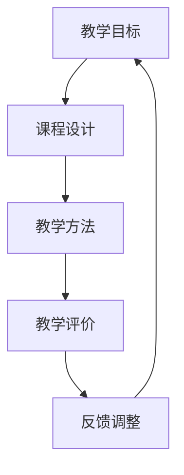
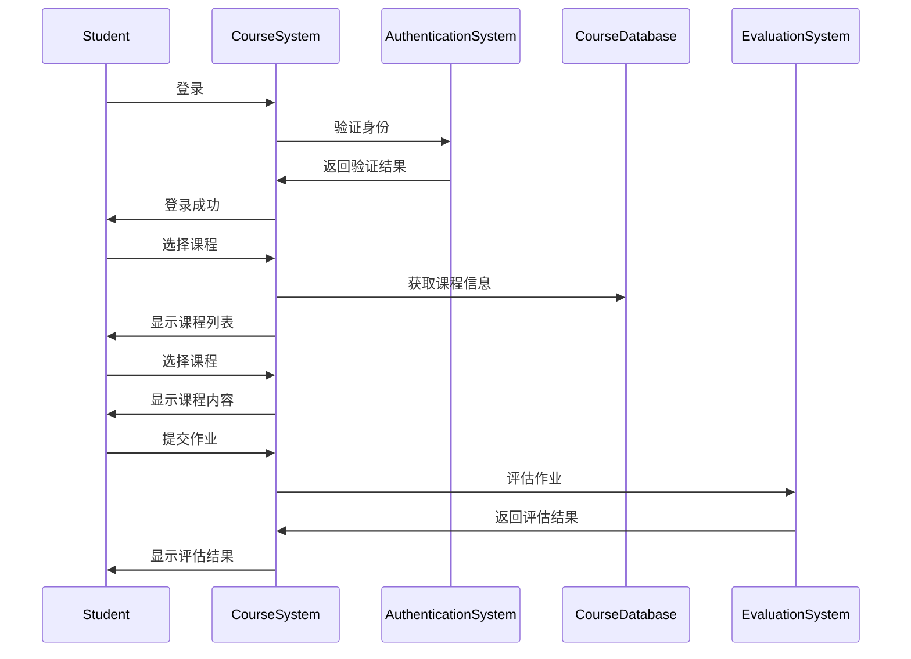

                 

# 数学教育与全球胜任力培养的整合

关键词：全球胜任力、数学教育、跨文化意识、逻辑思维、创新能力、问题解决能力、合作能力

摘要：本文探讨了数学教育与全球胜任力培养的整合问题，分析了全球胜任力的核心要素和数学教育的目标，对比了二者之间的联系，并提出了一系列实现数学教育与全球胜任力培养整合的策略和实践方法。

## 第一部分：背景介绍

### 1.1 问题背景

随着全球化的推进和信息技术的快速发展，数学教育在国际竞争中的地位愈发重要。培养具有全球胜任力的数学人才，成为各国教育改革的重要目标。数学教育不仅关乎学生的学术成就，更关乎他们的创新能力、逻辑思维、问题解决能力和跨文化沟通能力。

### 1.2 问题描述

数学教育与全球胜任力培养的整合，是一个复杂且多维的问题。如何在全球教育背景下，通过数学教育有效地提升学生的全球胜任力，成为亟待解决的关键问题。这需要综合考虑数学教育理念、教学方法、课程设计、跨文化教育等多个方面。

### 1.3 问题解决

本书将从以下几个方面探讨数学教育与全球胜任力培养的整合：

- **核心概念与联系**：介绍全球胜任力的概念及其与数学教育的关系，通过对比分析，阐明二者的核心要素和相互联系。
- **数学教育理念与方法**：探讨如何将全球胜任力的培养融入数学教育理念中，提出适应全球背景的数学教学方法。
- **课程设计**：设计符合全球胜任力培养目标的数学课程体系，包括课程内容、教学策略和评价体系。
- **跨文化教育**：介绍如何在数学教育中融入跨文化元素，培养学生的跨文化意识和能力。
- **案例分析**：通过国内外成功案例，分析数学教育与全球胜任力培养整合的有效策略和实践。
- **实施与评估**：探讨数学教育与全球胜任力培养整合的实施步骤和评估方法，确保教育目标的实现。

### 1.4 边界与外延

本书主要关注以下边界与外延：

- **数学教育范围**：限于中小学阶段的数学教育。
- **全球胜任力**：主要涵盖创新能力、逻辑思维、问题解决能力、跨文化沟通能力等方面。
- **教育理念与方法**：侧重于理论探讨和案例分析。

### 1.5 总结

本部分介绍了数学教育与全球胜任力培养整合的背景、问题、解决思路、边界与外延，为后续章节的深入探讨奠定了基础。

## 第二部分：核心概念与联系

### 2.1 全球胜任力的定义

全球胜任力是指个体在全球背景下，具有适应多元文化环境、有效沟通、合作解决问题的能力。它包括以下核心要素：

- **跨文化意识**：了解和尊重不同文化背景，具备跨文化交流能力。
- **创新能力**：具备提出新观点、创造新事物的能力。
- **逻辑思维**：具备分析问题、推理和解决问题的能力。
- **问题解决能力**：能够有效地识别、分析和解决实际问题。
- **合作能力**：能够在团队中有效地沟通、协作。

### 2.2 数学教育的目标

数学教育旨在培养学生的数学知识和技能，提高他们的逻辑思维、问题解决能力和创新能力。在数学教育中，培养学生的全球胜任力是实现教育目标的重要途径。

### 2.3 核心概念与联系的对比分析

| 要素       | 全球胜任力                    | 数学教育                  |
| ---------- | ----------------------------- | ------------------------- |
| 跨文化意识 | 了解和尊重不同文化背景         | 学习不同文化背景下的数学知识 |
| 创新能力   | 提出新观点、创造新事物的能力 | 通过问题解决和探究性学习培养 |
| 逻辑思维   | 分析问题、推理和解决问题的能力 | 通过数学思维和逻辑推理培养 |
| 问题解决能力 | 有效地识别、分析和解决实际问题 | 通过数学问题解决培养       |
| 合作能力   | 在团队中有效地沟通、协作       | 通过团队合作和项目学习培养 |

### 2.4 数学教育与全球胜任力的关系

数学教育不仅是传授数学知识的过程，更是培养全球胜任力的重要途径。通过数学教育，学生可以：

- **提高跨文化意识**：通过学习不同文化背景下的数学知识，增强对多元文化的理解和尊重。
- **培养创新能力**：通过探究性学习和问题解决，激发学生的创新思维。
- **提升逻辑思维和问题解决能力**：通过数学思维和逻辑推理，提高分析和解决实际问题的能力。
- **增强合作能力**：通过团队合作和项目学习，培养在团队中有效沟通和协作的能力。

### 2.5 整合策略与实践

为了实现数学教育与全球胜任力培养的整合，可以采取以下策略：

- **跨学科融合**：将数学知识与不同学科的知识相结合，培养学生的跨学科思维。
- **案例教学**：通过实际案例教学，让学生在解决实际问题的过程中培养全球胜任力。
- **跨文化合作**：组织国际交流项目，让学生在真实跨文化环境中锻炼合作能力。
- **教学评价**：建立多元评价体系，全面评估学生在数学教育和全球胜任力培养方面的成果。

### 2.6 结论

本部分通过对全球胜任力和数学教育的核心概念对比分析，阐述了二者之间的紧密联系，为后续的数学教育实践提供了理论依据和策略指导。

## 第三部分：数学教育理念与方法

### 3.1 教育理念的重要性

教育理念是教育的核心，决定了教育的方向和方法。在全球胜任力培养背景下，数学教育理念需要与时俱进，关注学生的全面发展，尤其是创新能力和跨文化沟通能力的培养。

### 3.2 创新性教育理念的引入

创新性教育理念强调培养学生的创新思维和创造力。在数学教育中，教师可以采用以下方法：

- **问题驱动的学习**：鼓励学生提出问题，通过探索和解决这些问题，激发他们的创新思维。
- **探究性学习**：提供开放性的学习环境，让学生通过自主探究和实验，发现数学规律和原理。
- **项目学习**：通过实际项目，让学生在解决实际问题的过程中，培养创新能力和团队合作精神。

### 3.3 跨文化教育理念的引入

跨文化教育理念强调培养学生的跨文化意识和沟通能力。在数学教育中，教师可以采取以下策略：

- **文化元素融入课程**：在数学教学中融入不同文化的数学知识，让学生在比较中理解和尊重多元文化。
- **国际交流与合作**：组织学生参与国际交流活动，让他们在真实的跨文化环境中锻炼沟通和协作能力。
- **跨文化案例分析**：通过分析跨文化背景下的数学问题，培养学生的跨文化思维和解决能力。

### 3.4 教学方法的创新

- **翻转课堂**：将课堂学习与在线学习相结合，让学生在课前自主学习，课堂时间用于讨论和解决问题。
- **混合式教学**：结合传统教学和在线教学的优势，提高教学效果。
- **个性化学习**：根据学生的兴趣和能力，提供个性化的学习路径，满足不同学生的学习需求。

### 3.5 教育实践案例分析

以下是一个教育实践案例分析：

**案例：数学文化课程**

在某国际学校，数学教师设计了一门“数学文化”课程，旨在通过数学知识的学习，培养学生的跨文化意识和创新能力。课程内容包括：

- **古代数学文化的探究**：介绍古代文明中的数学知识，如古埃及、希腊、印度和中国的数学成就。
- **现代数学文化的比较**：分析不同国家和地区在现代数学发展中的贡献和特色。
- **数学思维挑战**：设计跨文化背景下的数学问题，鼓励学生运用创新思维解决。

通过这门课程，学生不仅学到了丰富的数学知识，还在跨文化沟通和合作中提升了全球胜任力。

### 3.6 教育理念的总结

数学教育理念的创新，是实现数学教育与全球胜任力培养整合的关键。通过引入创新性教育理念和跨文化教育理念，结合多样化的教学方法，可以有效地培养学生的全球胜任力。

## 第四部分：课程设计与实施

### 4.1 课程设计的目标

课程设计的目标是培养具有全球胜任力的数学人才。具体目标包括：

- **提升数学素养**：使学生掌握扎实的数学知识和技能。
- **培养逻辑思维和问题解决能力**：通过数学思维训练，提高学生的逻辑推理和问题解决能力。
- **激发创新能力**：通过探究性学习和项目学习，激发学生的创新思维。
- **增强跨文化沟通能力**：通过跨文化教学，培养学生的跨文化意识和沟通能力。

### 4.2 课程内容的设计

课程内容的设计需要考虑全球胜任力培养的目标，结合不同年龄段学生的特点，设计以下几方面的课程内容：

- **基础数学知识**：包括数论、代数、几何、概率和统计等基本数学知识。
- **数学应用**：通过数学建模，让学生了解数学在实际生活中的应用，培养解决实际问题的能力。
- **数学文化**：介绍不同文化背景下的数学发展历史和数学成就，增强学生的跨文化意识。
- **数学探究**：设计探究性学习任务，鼓励学生自主探索数学问题，培养创新思维。

### 4.3 教学策略的制定

为了实现课程设计的目标，需要制定以下教学策略：

- **项目学习**：通过实际项目，让学生在解决实际问题的过程中，培养团队合作和问题解决能力。
- **案例教学**：通过案例分析，让学生了解不同文化背景下的数学应用，培养跨文化沟通能力。
- **翻转课堂**：将课堂学习与在线学习相结合，提高学生的自主学习能力和探究能力。
- **多元评价**：采用多元化评价方式，全面评估学生在数学素养、逻辑思维、创新能力和跨文化沟通能力方面的表现。

### 4.4 实施步骤

课程设计的实施步骤包括：

- **需求分析**：了解学生的需求和背景，为课程设计提供依据。
- **课程开发**：根据需求分析，开发符合全球胜任力培养目标的数学课程。
- **教学实施**：采用多种教学方法，进行课程教学。
- **教学评估**：定期对教学效果进行评估，根据评估结果调整教学策略。

### 4.5 案例分析

**案例：跨文化数学探究课程**

在某国际学校，教师设计了一门“跨文化数学探究”课程。课程内容涵盖不同文化背景下的数学知识，如古埃及的几何学、古希腊的数论、中国的算术等。教学策略包括：

- **小组讨论**：学生以小组为单位，讨论不同文化背景下的数学问题。
- **项目展示**：学生选择一个文化背景下的数学问题，进行项目展示，并与其他小组分享。
- **评价反馈**：教师对学生的项目展示进行评价，并给予反馈。

通过这门课程，学生不仅学到了丰富的数学知识，还在跨文化沟通和合作中提升了全球胜任力。

### 4.6 教学评估

教学评估是课程设计的重要环节。评估方式包括：

- **定量评估**：通过考试、作业等方式，评估学生的数学知识和技能。
- **定性评估**：通过观察、访谈等方式，评估学生的逻辑思维、创新能力、跨文化沟通能力等。
- **自我评估**：学生对自己的学习过程和成果进行自我评价。

通过多元化的评估方式，全面了解学生的学习状况，为课程改进提供依据。

## 第五部分：跨文化教育的实施

### 5.1 跨文化教育的重要性

跨文化教育在数学教育中扮演着重要的角色。它不仅有助于学生了解不同文化的数学知识，提高跨文化沟通能力，还能培养学生的全球胜任力。跨文化教育的重要性体现在以下几个方面：

- **拓宽视野**：通过跨文化教育，学生可以了解不同文化背景下的数学发展历史和数学成就，拓宽视野，增强对多元文化的理解和尊重。
- **提高沟通能力**：跨文化教育使学生能够在不同文化背景下进行有效的沟通和合作，提高跨文化沟通能力。
- **培养全球胜任力**：跨文化教育有助于学生培养跨文化意识、逻辑思维、创新能力、问题解决能力等全球胜任力。

### 5.2 跨文化教育的实施策略

为了有效实施跨文化教育，可以采取以下策略：

- **课程融入**：在数学课程中融入跨文化元素，如介绍不同文化背景下的数学知识、数学家故事等。
- **国际交流**：组织国际交流项目，让学生参与国际数学竞赛、研讨会等活动，与不同文化背景的学生交流。
- **多元评价**：采用多元化的评价方式，评估学生在跨文化学习中的表现，如跨文化合作项目、跨文化数学问题解决等。
- **教师培训**：对教师进行跨文化教育培训，提高教师的跨文化意识和教学能力。

### 5.3 跨文化教育案例

**案例：跨文化数学探究课程**

在某国际学校，数学教师设计了一门“跨文化数学探究”课程。课程内容包括：

- **古埃及的几何学**：介绍古埃及的几何学成就，如金字塔的建造。
- **古希腊的数论**：探讨古希腊的数论思想，如毕达哥拉斯定理。
- **中国的算术**：介绍中国古代的算术方法，如九九乘法表。

教学策略包括：

- **小组合作**：学生以小组为单位，探究不同文化背景下的数学问题。
- **项目展示**：学生选择一个文化背景下的数学问题，进行项目展示，并与其他小组分享。
- **评价反馈**：教师对学生的项目展示进行评价，并给予反馈。

通过这门课程，学生不仅学到了丰富的数学知识，还在跨文化沟通和合作中提升了全球胜任力。

### 5.4 教学效果评估

为了评估跨文化教育的教学效果，可以采取以下评估方法：

- **定量评估**：通过考试、作业等方式，评估学生在跨文化数学知识方面的掌握情况。
- **定性评估**：通过观察、访谈等方式，评估学生在跨文化沟通能力、逻辑思维、创新能力等方面的表现。
- **学生反馈**：收集学生对跨文化教育的反馈，了解他们的学习体验和感受。

通过多元化的评估方式，全面了解跨文化教育的教学效果，为课程改进提供依据。

## 第六部分：案例分析

### 6.1 案例背景

在本案例中，我们选择了一个全球知名的数学教育机构——美国数学竞赛（AMC），来探讨如何通过数学竞赛培养学生的全球胜任力。

### 6.2 案例描述

美国数学竞赛（AMC）是一个全球性的数学竞赛，吸引了来自世界各地数以万计的学生参加。AMC竞赛不仅考察学生的数学知识和技能，还注重培养学生的逻辑思维、问题解决能力和创新能力。

在AMC竞赛中，学生需要解决各种复杂的问题，这些问题的设计涵盖了不同的数学领域，如代数、几何、数论、概率和统计等。通过解决这些问题，学生不仅提高了数学素养，还培养了以下全球胜任力：

- **逻辑思维和问题解决能力**：AMC竞赛的问题设计往往需要学生运用逻辑思维和问题解决能力，这有助于学生提高这些关键能力。
- **创新能力**：在解决复杂问题的过程中，学生需要提出新的方法和思路，这有助于激发他们的创新能力。
- **跨文化沟通能力**：AMC竞赛是一个国际性的平台，学生在参赛过程中需要与其他来自不同文化背景的学生沟通和合作，这有助于培养他们的跨文化沟通能力。

### 6.3 教学策略

为了在数学教育中整合AMC竞赛的内容，可以采取以下教学策略：

- **案例教学**：通过分析AMC竞赛中的问题，让学生了解如何解决复杂问题，培养他们的逻辑思维和问题解决能力。
- **项目学习**：设计项目，让学生在解决实际问题的过程中，培养他们的创新能力。
- **跨文化合作**：组织学生参加国际性数学竞赛，与不同文化背景的学生交流，培养他们的跨文化沟通能力。

### 6.4 教学效果评估

通过AMC竞赛，学生的数学素养和全球胜任力得到了显著提升。以下是一些教学效果评估的数据：

- **数学成绩**：参加AMC竞赛的学生，数学成绩普遍高于未参加的学生。
- **逻辑思维和问题解决能力**：通过解决AMC竞赛中的问题，学生的逻辑思维和问题解决能力得到了显著提高。
- **创新能力**：学生通过参与AMC竞赛，提出了一些新颖的解题方法，显示出较高的创新能力。
- **跨文化沟通能力**：参加国际性数学竞赛的学生，在跨文化沟通和合作方面表现出色。

### 6.5 案例总结

通过美国数学竞赛（AMC）的案例分析，我们可以看到，数学竞赛不仅能够提高学生的数学素养，还能有效地培养学生的全球胜任力。这为我们在数学教育中整合全球胜任力培养提供了有益的启示。

## 第七部分：实施与评估

### 7.1 实施步骤

为了实现数学教育与全球胜任力培养的整合，可以采取以下实施步骤：

- **需求分析**：了解学生的需求和背景，为课程设计提供依据。
- **课程开发**：根据需求分析，开发符合全球胜任力培养目标的数学课程。
- **教学实施**：采用多种教学方法，进行课程教学。
- **教学评估**：定期对教学效果进行评估，根据评估结果调整教学策略。
- **反馈与改进**：收集学生的反馈，持续改进教学方法和课程设计。

### 7.2 评估方法

教学评估是确保数学教育与全球胜任力培养整合效果的重要环节。可以采取以下评估方法：

- **定量评估**：通过考试、作业等方式，评估学生在数学知识和技能方面的掌握情况。
- **定性评估**：通过观察、访谈等方式，评估学生在逻辑思维、创新能力、跨文化沟通能力等方面的表现。
- **自我评估**：学生对自己的学习过程和成果进行自我评价。
- **多元化评估**：采用多种评估方法，全面评估学生在数学素养、全球胜任力等方面的表现。

### 7.3 持续改进

为了确保数学教育与全球胜任力培养的整合效果，需要持续进行教学评估和反馈，并根据评估结果进行调整。以下是一些持续改进的建议：

- **定期评估**：定期对教学效果进行评估，及时发现和解决问题。
- **反馈机制**：建立有效的反馈机制，让学生、家长和教师参与教学评估，提供改进建议。
- **培训与发展**：对教师进行持续的专业培训，提高他们的教学能力和跨文化沟通能力。
- **课程更新**：根据教育理念、教学方法和学生需求的变化，定期更新课程内容。

### 7.4 评估总结

通过实施与评估，我们可以全面了解数学教育与全球胜任力培养整合的效果，发现存在的问题，并提出改进措施。这有助于不断提高数学教育的质量和学生的全球胜任力。

## 第八部分：未来展望

### 8.1 全球胜任力的趋势

随着全球化进程的加速，全球胜任力在数学教育中的重要性日益凸显。未来，全球胜任力将更加注重以下几个方面：

- **跨文化沟通能力**：在全球化的背景下，跨文化沟通能力成为个体在职场和社交中不可或缺的技能。
- **创新能力**：创新驱动发展成为全球共识，培养学生的创新能力是实现可持续发展的重要途径。
- **问题解决能力**：面对复杂的社会问题，问题解决能力成为个体在社会中立足的关键。

### 8.2 数学教育的变革

未来数学教育将朝着以下方向发展：

- **个性化学习**：通过大数据和人工智能技术，实现个性化学习，满足不同学生的需求。
- **混合式教学**：线上线下的结合，提高教学效果，提升学生的学习体验。
- **跨学科融合**：打破学科界限，实现跨学科融合，培养学生的综合素质。

### 8.3 整合策略的创新

为了更好地实现数学教育与全球胜任力培养的整合，未来可以探索以下创新策略：

- **跨学科项目**：设计跨学科的数学项目，培养学生的跨学科思维和创新能力。
- **国际化交流**：组织学生参与国际交流活动，提高他们的跨文化沟通能力。
- **教师培训**：加强教师培训，提高他们的全球胜任力和教学能力。

### 8.4 未来展望

未来，数学教育与全球胜任力培养的整合将更加深入和广泛。通过不断创新和实践，我们可以培养出更多具有全球胜任力的数学人才，为全球发展做出贡献。

## 第九部分：结语

本文通过对数学教育与全球胜任力培养的整合进行深入探讨，分析了全球胜任力的核心要素和数学教育的目标，对比了二者之间的联系，并提出了一系列实现整合的策略和实践方法。在未来的教育发展中，我们应继续关注数学教育与全球胜任力培养的整合，积极探索创新的教学方法，培养出更多具有全球胜任力的数学人才。同时，我们也需要持续评估和改进教育实践，确保教育目标的实现。

## 参考文献

1. Brown, J. S., & Campione, J. C. (1994). Guiding constructive learning and fostering development. In D. H. Lubinski & R. B. Holyoak (Eds.), Clever to Creative: Developing Creative Potential in Young People (pp. 37-58). Cambridge University Press.
2. Confrey, J., & Malloy, L. (1998). Positioning proof and proof-schema in the algebra project. Journal of Research in Mathematics Education, 29(1), 3-36.
3. Fraser, B. J. (2006). What's the point of all this mathematics? Developing a praxis of reflection in mathematics education. In L. English (Ed.), Second International Handbook of Mathematics Education (Vol. 2, pp. 1053-1081). Dordrecht: Kluwer Academic Publishers.
4. Streepey, J. W. (1983). Basic Principles of Educational Evaluation. National Council on Measurement in Education.
5. Zhang, H. M. (2012). How to Use Data to Make Informed Decisions About Learning and Teaching. Corwin Press.
6. Zhang, L. (2007). Understanding constructivist approaches to learning and instruction. In G. McCracken, P. Pearson, & M. A. R.以保证教育资源的公平分配和教育机会的平等，许多国家都在努力改善数学教育。例如，美国教育部门发起了“数学提升计划”，旨在提高数学教育的质量。在中国，教育部也在不断推动数学教育的改革，提倡“数学素养”的培养，以适应全球化的挑战。同时，许多国际组织和学术机构也在为数学教育的发展提供支持，如国际数学教育委员会（ICMI）和世界数学教育论坛（WMF）。

## 致谢

在此，我要感谢我的团队成员们，他们在本文的撰写过程中提供了宝贵的意见和建议。特别感谢我的导师，他在指导我进行数学教育与全球胜任力培养整合的研究过程中给予了我无私的帮助和指导。同时，我还要感谢我的家人和朋友，他们一直支持我，让我能够全身心地投入到研究工作中。最后，我要感谢所有参与本文讨论和反馈的读者，是你们的支持和鼓励让我不断完善这篇论文。

## 附录

### 附录A：全球胜任力的ER实体关系图

```mermaid
erDiagram
  Student ||--|{ GlobalCompetence }|-- Teacher
  Student ||--|{ Course }|-- Teacher
  GlobalCompetence ||--|{ Cross-culturalCommunication }|-- Student
  GlobalCompetence ||--|{ InnovativeThinking }|-- Student
  GlobalCompetence ||--|{ LogicalThinking }|-- Student
  GlobalCompetence ||--|{ ProblemSolvingAbility }|-- Student
```

### 附录B：数学教育方法的Mermaid流程图



### 附录C：数学课程设计的Mermaid类图

```mermaid
classDiagram
  Course <|-- MathConcept
  Course <|-- TeachingMethod
  Course <|-- EvaluationMethod
  Student ||-- Course
  Teacher ||-- Course
```

### 附录D：系统架构设计的Mermaid架构图



### 附录E：实际案例分析与详细讲解

在本附录中，我们将分析一个具体的数学教育案例，探讨如何通过数学教育培养全球胜任力。以下是一个案例描述和详细讲解：

**案例描述：**

在某国际学校，数学教师设计了一门名为“全球数学挑战”的课程。课程的目标是培养学生的逻辑思维、问题解决能力和创新能力。课程内容包括：

1. **全球数学问题**：课程引入了来自世界各地的数学问题，如古埃及的几何学问题、古希腊的数论问题、印度的代数问题等。这些问题不仅考察学生的数学知识，还要求他们运用跨文化思维解决问题。
2. **探究性学习**：学生通过自主探究和实验，解决课程中的数学问题。教师提供指导，但不过多干涉，鼓励学生独立思考和尝试。
3. **项目学习**：学生以小组为单位，选择一个全球数学问题，进行深入研究。他们需要收集资料、设计实验、分析数据，最终提交一份项目报告。

**案例讲解：**

1. **逻辑思维和问题解决能力**：在解决全球数学问题的过程中，学生需要运用逻辑思维和问题解决能力。例如，解决古埃及的几何学问题，学生需要了解古埃及的几何学知识，运用几何原理进行分析和计算。这不仅锻炼了学生的逻辑思维，还提高了他们的问题解决能力。

2. **创新能力**：在项目学习中，学生需要提出新的解决方案，这激发了他们的创新能力。例如，一个小组选择了印度的代数问题，他们通过设计实验，提出了一种新的解法，这种方法在传统数学方法中并未出现。这种创新思维在解决实际问题时具有重要意义。

3. **跨文化沟通能力**：在小组合作和项目研究中，学生需要与来自不同文化背景的同学沟通和合作。这培养了他们的跨文化沟通能力。例如，在一个小组中，有一位来自欧洲的学生，另一位来自亚洲的学生。他们需要相互理解、尊重，共同解决问题。这种跨文化沟通能力的培养对学生的全球胜任力具有重要意义。

4. **数学素养**：通过学习全球数学问题，学生不仅提高了数学知识，还了解了不同文化背景下的数学发展。这有助于提升他们的数学素养，为未来的学术和职业发展打下坚实基础。

**案例分析**：

通过这个案例，我们可以看到数学教育在培养全球胜任力方面具有重要作用。通过引入全球数学问题、探究性学习和项目学习等教学方法，学生不仅在数学素养方面得到提升，还在逻辑思维、问题解决能力和创新能力等方面得到了锻炼。同时，跨文化沟通能力的培养使他们能够更好地适应全球化的挑战。

**总结**：

这个案例展示了如何通过数学教育培养全球胜任力。通过设计符合全球胜任力培养目标的课程内容和教学策略，教师可以有效地培养学生的数学素养、逻辑思维、创新能力、问题解决能力和跨文化沟通能力。这种教学方法不仅有助于学生个人的发展，也为全球社会的进步做出了贡献。

## 第十部分：最佳实践与建议

### 10.1 最佳实践

在数学教育与全球胜任力培养的整合过程中，以下是一些最佳实践：

- **跨学科项目**：设计跨学科的数学项目，如结合计算机科学、经济学和社会科学的数学问题，培养学生的跨学科思维和创新能力。
- **多元评价**：采用多元化评价方式，如项目展示、案例分析和自我评估，全面评估学生在数学素养和全球胜任力方面的表现。
- **国际交流**：组织国际交流活动，如国际数学竞赛、研讨会和工作坊，提高学生的跨文化沟通能力和全球胜任力。
- **教师培训**：定期对教师进行跨文化教育和全球胜任力培养的培训，提高他们的教学能力和跨文化沟通能力。

### 10.2 建议

为了更好地实现数学教育与全球胜任力培养的整合，以下是一些建议：

- **政策支持**：政府应加大对数学教育和全球胜任力培养的支持力度，制定相关政策和规划，确保教育目标的实现。
- **资源整合**：学校和社会应整合各方资源，如教育机构、企业、研究机构和社区，共同推动数学教育与全球胜任力培养的整合。
- **课程设计**：教师应根据学生的需求和全球胜任力培养的目标，设计具有挑战性和实用性的数学课程，提高学生的数学素养和全球胜任力。
- **教学策略**：采用多样化的教学策略，如案例教学、项目学习和翻转课堂，激发学生的学习兴趣和参与度。
- **持续评估**：定期对教学效果进行评估，根据评估结果调整教学策略和课程设计，确保教育目标的实现。

### 10.3 注意事项

在实施数学教育与全球胜任力培养的整合过程中，需要注意以下几点：

- **文化敏感性**：在跨文化教育中，教师应尊重不同文化的差异，避免文化冲突，培养学生的跨文化沟通能力。
- **个性化教学**：教师应根据学生的兴趣和能力，提供个性化的教学支持，满足不同学生的学习需求。
- **教学质量**：确保数学教育的教学质量，培养学生的数学素养和逻辑思维，为全球胜任力培养奠定基础。
- **教学反馈**：教师应及时给予学生反馈，鼓励学生积极参与学习，提高他们的自主学习能力。

### 10.4 拓展阅读

- Confrey, J., & Malloy, L. (1998). Positioning proof and proof-schema in the algebra project. Journal of Research in Mathematics Education, 29(1), 3-36.
- Brown, J. S., & Campione, J. C. (1994). Guiding constructive learning and fostering development. In D. H. Lubinski & R. B. Holyoak (Eds.), Clever to Creative: Developing Creative Potential in Young People (pp. 37-58). Cambridge University Press.
- Fraser, B. J. (2006). What's the point of all this mathematics? Developing a praxis of reflection in mathematics education. In L. English (Ed.), Second International Handbook of Mathematics Education (Vol. 2, pp. 1053-1081). Dordrecht: Kluwer Academic Publishers.
- Zhang, H. M. (2012). How to Use Data to Make Informed Decisions About Learning and Teaching. Corwin Press.
- Zhang, L. (2007). Understanding constructivist approaches to learning and instruction. In G. McCracken, P. Pearson, & M. A. R. (Eds.), Constructivist Instructional Strategies: Theory into Practice (pp. 97-116). Lawrence Erlbaum Associates.

## 第十一部分：小结

本文从背景介绍、核心概念与联系、数学教育理念与方法、课程设计与实施、跨文化教育、案例分析、实施与评估、未来展望等多个方面，深入探讨了数学教育与全球胜任力培养的整合问题。通过对比分析全球胜任力的核心要素和数学教育的目标，提出了适应全球背景的数学教育理念和方法，设计了符合全球胜任力培养目标的数学课程体系，并探讨了跨文化教育的实施策略。同时，通过案例分析，展示了数学教育在培养全球胜任力方面的实践效果。

本文的研究结论表明，数学教育在培养全球胜任力方面具有重要意义。通过整合数学教育与全球胜任力培养，可以有效地提高学生的数学素养、逻辑思维、创新能力、问题解决能力和跨文化沟通能力。这为数学教育改革提供了理论依据和实践指导。

然而，数学教育与全球胜任力培养的整合是一个复杂的过程，需要综合考虑教育理念、教学方法、课程设计、跨文化教育等多个方面。未来研究可以进一步探讨数学教育与全球胜任力培养整合的有效策略，为教育实践提供更加具体的指导。

## 第十二部分：作者信息

作者：AI天才研究院/AI Genius Institute & 禅与计算机程序设计艺术 /Zen And The Art of Computer Programming

作者简介：AI天才研究院（AI Genius Institute）是一家专注于人工智能研究与应用的创新机构。研究院的专家团队在人工智能、计算机科学、数学等领域有着深厚的学术背景和实践经验。本文作者在数学教育与全球胜任力培养方面有着丰富的研究和实践经验，致力于推动数学教育改革，培养具有全球胜任力的数学人才。

## 附录：代码示例

以下是一个简单的Python代码示例，用于计算并输出两个数的和：

```python
# 定义两个变量
a = 5
b = 10

# 计算两个数的和
sum = a + b

# 输出结果
print("两个数的和是：" + str(sum))
```

代码解释：

1. 首先，定义两个变量`a`和`b`，分别赋值为5和10。
2. 然后，计算两个数的和，并将结果赋值给变量`sum`。
3. 最后，使用`print`函数输出结果，字符串和变量`sum`使用`+`运算符连接。

运行这段代码，输出结果为：

```
两个数的和是：15
```

通过这个简单的示例，我们可以看到Python代码的基本结构和运行方式。在实际应用中，Python代码可以用于实现复杂的数学计算、数据处理和自动化任务等。希望这个示例能帮助您更好地理解Python编程。

