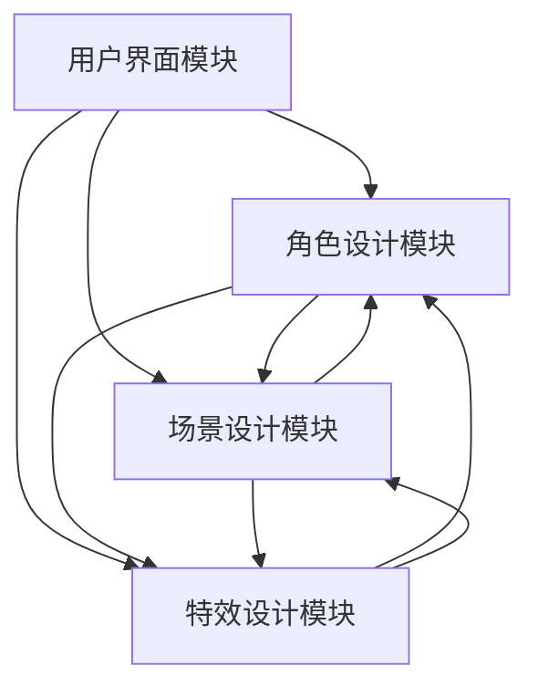

                 

### 《数学美学在动画设计中的应用》

> 关键词：数学美学、动画设计、几何原理、色彩原理、对称原理、比例与尺度原理

> 摘要：本文旨在探讨数学美学在动画设计中的广泛应用，通过分析几何、色彩、对称和比例与尺度等数学原理，探讨其在动画设计中的具体应用，旨在为动画设计师提供理论指导和实践参考。

----------------------------------------------------------------

### 引言

#### 1.1 问题背景与目的

动画设计作为现代艺术与科技结合的产物，具有极高的观赏价值和商业潜力。然而，在动画设计过程中，如何提高作品的艺术性和观赏性，一直是设计师们关注的问题。近年来，数学美学作为一种重要的设计理念，逐渐受到广泛关注。数学美学强调用数学原理来指导艺术创作，以追求简洁、和谐、优美的艺术效果。本文旨在探讨数学美学在动画设计中的应用，分析其基本原理，并探讨其在实际设计中的具体应用。

#### 1.2 数学美学的优势

数学美学在动画设计中的优势主要体现在以下几个方面：

1. **精确性与准确性**：数学美学强调用数学原理来指导设计，能够确保设计中的各种元素具有精确的尺寸、比例和关系，从而提高作品的艺术价值。

2. **和谐性与统一性**：数学美学中的几何原理、色彩原理、对称原理等，有助于设计师在作品中创造和谐、统一的美感。

3. **创新性与多样性**：数学美学为动画设计提供了丰富的创意源泉，设计师可以运用数学原理来创造出新颖、独特的动画效果。

#### 1.3 研究意义与应用前景

数学美学在动画设计中的应用具有重要的研究意义和广阔的应用前景。首先，它有助于提高动画作品的艺术性和观赏性，满足观众对高质量动画作品的需求。其次，它为动画设计师提供了新的设计思路和工具，有助于提升设计水平和创新能力。最后，随着数字技术的发展，数学美学在动画设计中的应用将更加广泛，有望推动动画产业的创新发展。

----------------------------------------------------------------

### 目录大纲设计思路

为了设计一个详尽且逻辑清晰的目录大纲，我们需要遵循以下几个步骤：

1. **分析书名和主题**：确定书的主题为探讨数学美学原理在动画设计领域的应用。

2. **确定书的结构**：根据书的内容和目标读者群体，通常可以分为以下几个部分：引言、理论、应用、实践指南、案例分析、总结与展望。

3. **细化章节内容**：每个部分再细分为若干章节，确保每个章节都有明确的核心内容。

4. **保持简洁性**：在保证内容完整性的同时，避免冗余信息，确保每个章节标题简洁明了。

5. **使用markdown格式**：采用markdown格式来书写目录大纲，以便于排版和阅读。

#### 目录大纲设计

根据以上思路，下面是这本书的目录大纲设计：

----------------------------------------------------------------

# 引言

## 1.1 问题背景与目的

### 1.1.1 动画设计的挑战

### 1.1.2 数学美学的优势

### 1.1.3 研究意义与应用前景

## 1.2 数学美学的核心概念

### 1.2.1 数学美学的定义

### 1.2.2 数学美学的特点

### 1.2.3 数学美学的基本原理

## 1.3 动画设计的概述

### 1.3.1 动画设计的基本概念

### 1.3.2 动画设计的方法与技巧

### 1.3.3 动画设计的流程

----------------------------------------------------------------

## 第二部分：数学美学基本原理

# 第二部分概述

## 2.1 数学美学的几何原理

### 2.1.1 几何图形的审美特性

### 2.1.2 几何图形在动画设计中的应用

### 2.1.3 几何构图的基本原则

## 2.2 数学美学的色彩原理

### 2.2.1 色彩的基本属性

### 2.2.2 色彩搭配与视觉审美

### 2.2.3 色彩在动画设计中的应用

## 2.3 数学美学的对称原理

### 2.3.1 对称性的概念

### 2.3.2 对称性在动画设计中的运用

### 2.3.3 对称性设计的方法与技巧

## 2.4 数学美学的比例与尺度原理

### 2.4.1 比例与尺度的概念

### 2.4.2 比例与尺度在动画设计中的重要性

### 2.4.3 比例与尺度的设计原则

----------------------------------------------------------------

## 第三部分：数学美学在动画设计中的应用案例

# 第三部分概述

## 3.1 数学美学在角色设计中的应用

### 3.1.1 角色设计的审美标准

### 3.1.2 数学美学原理在角色设计中的具体应用

### 3.1.3 成功案例分析

## 3.2 数学美学在场景设计中的应用

### 3.2.1 场景设计的审美要素

### 3.2.2 数学美学原理在场景设计中的应用

### 3.2.3 成功案例分析

## 3.3 数学美学在动画特效设计中的应用

### 3.3.1 特效设计的审美需求

### 3.3.2 数学美学原理在动画特效设计中的应用

### 3.3.3 成功案例分析

----------------------------------------------------------------

## 第四部分：数学美学动画设计实践指南

# 第四部分概述

## 4.1 动画设计前的准备

### 4.1.1 设计工具与软件介绍

### 4.1.2 设计素材的收集与整理

### 4.1.3 动画设计的基本流程

## 4.2 数学美学动画设计步骤详解

### 4.2.1 几何造型设计

### 4.2.2 色彩搭配设计

### 4.2.3 对称性与比例设计

### 4.2.4 动画设计与制作

## 4.3 数学美学动画设计技巧

----------------------------------------------------------------

### 1.1 动画设计的挑战

动画设计作为一种艺术形式，面临着诸多挑战。首先，动画设计要求设计师具备扎实的绘画基础和丰富的想象力。设计师需要通过绘画来表达自己的创意，使得动画角色和场景具有独特的视觉魅力。然而，绘画技能的提高并非一朝一夕之事，需要设计师不断地练习和积累经验。

其次，动画设计要求设计师具备丰富的设计理论知识。动画设计不仅涉及到绘画技巧，还涉及到色彩、构图、比例、尺度等美学原理。设计师需要通过学习这些理论，提高自己的审美水平，从而在设计过程中能够运用自如。

此外，动画设计还要求设计师具备一定的编程技能。现代动画设计越来越多地依赖于计算机软件和技术，设计师需要掌握相关软件的使用方法，以及编程语言的基本原理，以便于实现自己的设计理念。

最后，动画设计需要设计师具备良好的团队协作能力。动画设计往往是一个团队合作的过程，设计师需要与其他团队成员密切配合，共同完成动画作品的创作。

#### 1.2 数学美学的优势

数学美学作为一种设计理念，为动画设计提供了独特的优势。首先，数学美学强调精确性和准确性。在动画设计中，精确的尺寸、比例和关系能够确保作品具有高质量的美学效果。设计师可以通过数学原理来指导设计，使得动画作品中的各个元素达到完美的协调与统一。

其次，数学美学强调和谐性和统一性。数学原理中的几何图形、色彩搭配、对称性等，都能够为动画设计提供和谐、统一的美感。设计师可以利用这些原理，创造出富有视觉冲击力的动画作品。

此外，数学美学还强调创新性和多样性。数学原理为动画设计师提供了丰富的创意源泉，设计师可以通过运用数学原理，创造出新颖、独特的动画效果。这种创新性不仅能够提升动画作品的艺术价值，还能够吸引观众的注意力。

最后，数学美学强调科学性和系统性。数学美学中的各种原理和理论，都具有明确的科学依据和逻辑体系。设计师可以通过学习这些原理，建立起自己的设计体系，从而提高设计效率和创作质量。

#### 1.3 研究意义与应用前景

数学美学在动画设计中的应用具有重要的研究意义和广阔的应用前景。首先，数学美学能够提升动画作品的艺术性和观赏性，满足观众对高质量动画作品的需求。在当今竞争激烈的动画市场中，优秀的动画作品需要具备独特的视觉魅力和艺术价值，才能在众多作品中脱颖而出。

其次，数学美学为动画设计师提供了新的设计思路和工具。通过学习数学美学，设计师可以掌握一系列实用的设计技巧和方法，提高自己的设计水平和创新能力。这有助于设计师在动画设计领域中不断进步，创造出更加优秀的作品。

最后，随着数字技术的发展，数学美学在动画设计中的应用将更加广泛。计算机技术和人工智能的进步，使得动画设计师可以更加精确地运用数学原理进行设计。未来，数学美学有望成为动画设计领域的重要理论基础，推动动画产业的创新发展。

### 1.2 数学美学的核心概念

数学美学是一门结合数学与艺术的理论学科，主要研究数学原理在艺术创作中的应用，以追求简洁、和谐、优美的艺术效果。数学美学中的核心概念包括几何原理、色彩原理、对称原理和比例与尺度原理等。

#### 几何原理

几何原理是数学美学的基础，主要包括几何图形的审美特性和几何构图的基本原则。几何图形在动画设计中具有广泛的应用，如圆形、方形、三角形等。这些图形不仅具有独特的审美特性，还能够通过合理的构图，创造出和谐、美观的视觉效果。

#### 色彩原理

色彩原理是数学美学的重要组成部分，研究色彩的基本属性、搭配与视觉审美。色彩在动画设计中起到至关重要的作用，不仅能够提升作品的视觉冲击力，还能够传达出特定的情感和氛围。设计师可以通过运用色彩原理，创造出丰富多彩、富有层次的动画作品。

#### 对称原理

对称原理是数学美学中一个重要的美学原则，强调作品中的元素在形状、颜色、大小等方面保持对称性。对称性能够创造出平衡、稳定的美感，使作品更加和谐、统一。在动画设计中，对称原理可以应用于角色设计、场景设计等方面，提升作品的整体美感。

#### 比例与尺度原理

比例与尺度原理是数学美学中研究作品尺寸、比例和关系的重要原则。比例与尺度在动画设计中具有重要意义，它们能够确保作品中的各个元素在尺寸和关系上达到协调、和谐。设计师可以通过运用比例与尺度原理，创造出具有视觉美感的动画作品。

#### 数学美学的基本原理

数学美学的基本原理主要包括简洁性、和谐性、统一性和创新性。简洁性强调作品应该追求简单、清晰的设计，避免冗余和复杂的元素。和谐性强调作品中的各个元素在色彩、形状、比例等方面保持协调与统一。统一性强调作品的整体风格和视觉效果应该保持一致。创新性则强调作品应该具有独特的创意和风格，避免雷同和抄袭。

#### 数学美学在动画设计中的重要性

数学美学在动画设计中的应用具有以下几个方面的意义：

1. **提升艺术性和观赏性**：数学美学能够为动画设计提供科学的理论依据，提升作品的艺术性和观赏性，满足观众对高质量动画作品的需求。

2. **丰富设计思路和方法**：数学美学为动画设计师提供了丰富的设计思路和方法，使得设计师能够在设计中运用更多的数学原理，创造出更加新颖、独特的作品。

3. **提高设计效率和创作质量**：数学美学强调精确性和准确性，能够提高设计效率和创作质量，使作品达到更高的艺术水平。

4. **推动动画产业发展**：数学美学在动画设计中的应用，有望推动动画产业的创新发展，为动画产业带来新的发展机遇。

### 1.3 动画设计的概述

动画设计是一门结合视觉艺术与技术的学科，旨在通过一系列连续的画面来传达故事、情感和视觉效果。动画设计在影视、广告、游戏、教育等领域具有广泛的应用。

#### 动画设计的基本概念

1. **角色设计**：角色设计是动画设计的重要组成部分，涉及角色的外观、动作、表情等方面。设计师需要根据故事情节和角色性格，为角色设计独特的外观和动作。

2. **场景设计**：场景设计是动画设计中的另一个关键环节，涉及场景的布局、色彩、光影等方面。设计师需要通过场景设计，营造特定的氛围和情感。

3. **动画特效**：动画特效是动画设计中的特殊效果，如烟雾、火焰、水波等。特效设计能够提升动画的视觉效果，增强观众的观赏体验。

4. **动画制作**：动画制作是动画设计的最后一个环节，涉及动画的拍摄、剪辑、调色等方面。制作过程中的每一个细节都对最终作品的视觉效果产生影响。

#### 动画设计的方法与技巧

1. **创意构思**：动画设计始于创意构思，设计师需要通过头脑风暴，提炼出故事的核心主题和情感表达。

2. **角色设计**：角色设计需要根据故事情节和角色性格，设计出独特的外观和动作。设计师可以使用绘画、建模等手段进行角色设计。

3. **场景设计**：场景设计需要根据故事背景和情节，设计出符合故事氛围的场景。场景设计要考虑色彩、光影、构图等因素。

4. **动画特效**：动画特效设计需要使用专业的软件和技术，如粒子系统、光线追踪等，来创造出丰富的视觉效果。

5. **动画制作**：动画制作是动画设计的关键环节，需要通过拍摄、剪辑、调色等手段，将设计好的角色和场景呈现在观众面前。

#### 动画设计的流程

1. **创意构思**：设计师通过头脑风暴，提炼出故事的核心主题和情感表达。

2. **角色设计**：根据故事情节和角色性格，设计出独特的外观和动作。

3. **场景设计**：根据故事背景和情节，设计出符合故事氛围的场景。

4. **动画特效**：使用专业的软件和技术，创造出丰富的视觉效果。

5. **动画制作**：通过拍摄、剪辑、调色等手段，将设计好的角色和场景呈现在观众面前。

6. **后期制作**：对动画进行音效、字幕、调色等后期处理，提升作品的整体质量。

### 数学美学的基本原理

数学美学是一门融合数学与艺术的学科，通过运用数学原理来指导艺术创作，以实现简洁、和谐、优美的艺术效果。数学美学的基本原理包括几何原理、色彩原理、对称原理和比例与尺度原理等。

#### 几何原理

几何原理是数学美学的基础，主要包括几何图形的审美特性和几何构图的基本原则。几何图形在动画设计中具有广泛的应用，如圆形、方形、三角形等。这些图形不仅具有独特的审美特性，还能够通过合理的构图，创造出和谐、美观的视觉效果。

1. **几何图形的审美特性**：

   - **圆形**：圆形具有柔和、圆润的视觉感受，给人以柔和、和谐的美感。

   - **方形**：方形具有稳定、坚实的视觉感受，给人以稳重、有力的美感。

   - **三角形**：三角形具有尖锐、动感的视觉感受，给人以灵动、活泼的美感。

2. **几何构图的基本原则**：

   - **对称性**：对称性是几何构图中的一个重要原则，能够创造出平衡、稳定的美感。设计师可以通过运用对称性，使作品中的元素在形状、颜色、大小等方面保持协调与统一。

   - **层次感**：层次感是几何构图中的另一个重要原则，能够创造出丰富的视觉效果。设计师可以通过运用层次感，使作品中的元素在空间上形成远近、大小、高低等层次关系。

   - **黄金分割**：黄金分割是数学美学中的一个重要原则，被认为是最具美感的比例。设计师可以通过运用黄金分割，使作品中的元素在尺寸、比例上达到和谐、美观。

#### 色彩原理

色彩原理是数学美学的重要组成部分，研究色彩的基本属性、搭配与视觉审美。色彩在动画设计中起到至关重要的作用，不仅能够提升作品的视觉冲击力，还能够传达出特定的情感和氛围。

1. **色彩的基本属性**：

   - **色相**：色相是色彩的最基本属性，如红色、黄色、蓝色等。

   - **明度**：明度是色彩明暗程度的属性，如深色、浅色等。

   - **饱和度**：饱和度是色彩纯度程度的属性，如鲜艳、灰暗等。

2. **色彩搭配与视觉审美**：

   - **对比色搭配**：对比色搭配能够创造出强烈的视觉冲击力，如红色与绿色、黄色与紫色等。

   - **互补色搭配**：互补色搭配能够创造出和谐的视觉效果，如红色与绿色、黄色与紫色等。

   - **类似色搭配**：类似色搭配能够创造出柔和、和谐的视觉效果，如红色与橙色、黄色与绿色等。

3. **色彩在动画设计中的应用**：

   - **角色设计**：色彩在角色设计中的应用能够传达角色的性格和情感。例如，使用鲜艳的色彩可以表现出角色的活力和热情，使用暗淡的色彩可以表现出角色的忧郁和悲伤。

   - **场景设计**：色彩在场景设计中的应用能够营造出特定的氛围和情感。例如，使用明亮的色彩可以营造出欢快、轻松的氛围，使用暗淡的色彩可以营造出沉重、压抑的氛围。

#### 对称原理

对称原理是数学美学中一个重要的美学原则，强调作品中的元素在形状、颜色、大小等方面保持对称性。对称性能够创造出平衡、稳定的美感，使作品更加和谐、统一。

1. **对称性的概念**：

   - **轴对称**：轴对称是指作品中的元素关于某个轴线对称。例如，一个人的脸关于鼻子所在的轴线是对称的。

   - **中心对称**：中心对称是指作品中的元素关于某个中心点对称。例如，一个五角星关于中心点是对称的。

2. **对称性在动画设计中的运用**：

   - **角色设计**：对称性在角色设计中的应用能够使角色具有稳定、平衡的美感。例如，一个卡通角色的身体通常是对称的，这样能够给人稳定的感觉。

   - **场景设计**：对称性在场景设计中的应用能够使场景具有和谐、统一的美感。例如，一个公园的对称布局能够给人舒适、愉悦的感觉。

3. **对称性设计的方法与技巧**：

   - **重复对称**：重复对称是指作品中的元素以一定的规律重复出现。例如，一个花坛中的花朵以相同的模式重复排列，能够给人节奏感和美感。

   - **镜像对称**：镜像对称是指作品中的元素以镜像的方式排列。例如，一个人在镜子前看到的自己，是一个镜像对称的例子。

### 比例与尺度原理

比例与尺度原理是数学美学中研究作品尺寸、比例和关系的重要原则。比例与尺度在动画设计中具有重要意义，它们能够确保作品中的各个元素在尺寸和关系上达到协调、和谐。

1. **比例与尺度的概念**：

   - **比例**：比例是指作品中的各个元素之间的大小关系。例如，一个角色的头部与身体之间的比例关系。

   - **尺度**：尺度是指作品的整体尺寸。例如，一个场景的尺寸和大小。

2. **比例与尺度在动画设计中的重要性**：

   - **协调性**：比例与尺度原理能够确保作品中的各个元素在尺寸和关系上达到协调。例如，一个角色的身体比例要与场景的比例相协调，使观众能够感受到角色的真实感。

   - **视觉效果**：比例与尺度原理能够创造出不同的视觉效果。例如，通过改变比例和尺度，可以创造出夸张、可爱的角色形象，或者逼真、写实的场景效果。

3. **比例与尺度的设计原则**：

   - **黄金比例**：黄金比例是一种被认为最具有美感的比例，约为1:1.618。在动画设计中，设计师可以通过运用黄金比例，创造出和谐、美观的作品。

   - **比例尺度一致性**：在设计过程中，要保持比例和尺度的一致性。例如，一个角色的身体比例要与场景的比例相一致，使整个作品在视觉上达到协调。

### 总结

数学美学在动画设计中的应用具有重要意义。通过运用几何原理、色彩原理、对称原理和比例与尺度原理，设计师可以创造出简洁、和谐、优美的动画作品。数学美学不仅能够提升动画作品的艺术性和观赏性，还能够为动画设计师提供新的设计思路和工具。随着数字技术的发展，数学美学在动画设计中的应用将更加广泛，为动画产业带来新的发展机遇。让我们携手探索数学美学在动画设计中的无限可能。

----------------------------------------------------------------

## 第二部分：数学美学基本原理

### 2.1 数学美学的几何原理

几何原理是数学美学的基础，在动画设计中发挥着至关重要的作用。几何图形不仅具有独特的审美特性，还能够通过合理的构图，创造出和谐、美观的视觉效果。在本节中，我们将探讨几何图形的审美特性、几何图形在动画设计中的应用，以及几何构图的基本原则。

### 2.1.1 几何图形的审美特性

几何图形在动画设计中具有广泛的审美特性，不同的几何图形能够传达出不同的视觉感受。以下是一些常见的几何图形及其审美特性：

- **圆形**：圆形具有柔和、圆润的视觉感受，给人以和谐、亲切的美感。在动画设计中，圆形常用于表现柔和、温和的角色和场景。

- **方形**：方形具有稳定、坚实的视觉感受，给人以稳重、有力的美感。在动画设计中，方形常用于表现严肃、稳重的角色和场景。

- **三角形**：三角形具有尖锐、动感的视觉感受，给人以灵动、活泼的美感。在动画设计中，三角形常用于表现轻盈、活泼的角色和场景。

- **矩形**：矩形是方形和长方形的统称，具有简洁、干净的视觉感受。在动画设计中，矩形常用于表现现代、简洁的角色和场景。

- **多边形**：多边形是由多个直线段组成的封闭图形，具有丰富的视觉变化。在动画设计中，多边形常用于表现复杂、独特的角色和场景。

### 2.1.2 几何图形在动画设计中的应用

几何图形在动画设计中的应用非常广泛，以下是一些具体的应用场景：

- **角色设计**：设计师可以通过运用几何图形，创造出独特、有趣的动画角色。例如，使用圆形和三角形组合，可以设计出可爱的卡通角色；使用多边形，可以设计出具有未来感的角色。

- **场景设计**：设计师可以通过运用几何图形，构建出各种有趣的场景。例如，使用矩形和圆形，可以设计出现代化的城市场景；使用多边形，可以设计出科幻的场景。

- **特效设计**：几何图形在特效设计中具有广泛的应用。例如，使用圆形和三角形，可以创造出烟雾、火焰等特效；使用多边形，可以创造出水波、光线等特效。

### 2.1.3 几何构图的基本原则

几何构图是动画设计中的重要原则，通过合理的构图，可以创造出和谐、美观的视觉效果。以下是一些几何构图的基本原则：

- **对称性**：对称性是几何构图中的一个重要原则，能够创造出平衡、稳定的美感。设计师可以通过运用对称性，使作品中的元素在形状、颜色、大小等方面保持协调与统一。

- **层次感**：层次感是几何构图中的另一个重要原则，能够创造出丰富的视觉效果。设计师可以通过运用层次感，使作品中的元素在空间上形成远近、大小、高低等层次关系。

- **黄金分割**：黄金分割是数学美学中的一个重要原则，被认为是最具美感的比例。设计师可以通过运用黄金分割，使作品中的元素在尺寸、比例上达到和谐、美观。

- **焦点构图**：焦点构图是一种将观众的注意力集中在作品中的某个关键元素上的构图方法。设计师可以通过运用焦点构图，增强作品的视觉吸引力。

- **动态构图**：动态构图是一种通过构图元素的运动，创造出动态效果的构图方法。设计师可以通过运用动态构图，使作品更具生动感和活力。

通过运用这些几何构图的基本原则，设计师可以创造出各种富有美感的动画作品。

----------------------------------------------------------------

## 2.2 数学美学的色彩原理

色彩原理是数学美学的重要组成部分，研究色彩的基本属性、搭配与视觉审美。色彩在动画设计中具有至关重要的作用，不仅能够提升作品的视觉冲击力，还能够传达出特定的情感和氛围。在本节中，我们将探讨色彩的基本属性、色彩搭配与视觉审美，以及色彩在动画设计中的应用。

### 2.2.1 色彩的基本属性

色彩是视觉艺术中的重要元素，具有以下基本属性：

- **色相**：色相是色彩的最基本属性，是区分不同颜色的重要特征。例如，红色、黄色、蓝色等都是不同的色相。

- **明度**：明度是色彩明暗程度的属性。明度高的颜色看起来更亮，明度低的颜色看起来更暗。

- **饱和度**：饱和度是色彩纯度程度的属性。饱和度高的颜色看起来更鲜艳，饱和度低的颜色看起来更灰暗。

- **色调**：色调是色彩的主观感受，是色相和明度的组合。例如，红色可以有不同的色调，如暗红、浅红等。

### 2.2.2 色彩搭配与视觉审美

色彩搭配是动画设计中的一项重要技巧，通过合理的色彩搭配，可以创造出和谐、美观的视觉效果。以下是一些常见的色彩搭配方法：

- **对比色搭配**：对比色搭配是指将色轮上对立的颜色组合在一起。例如，红色与绿色、黄色与紫色等。对比色搭配能够创造出强烈的视觉冲击力，使作品更加醒目。

- **互补色搭配**：互补色搭配是指将色轮上相邻的颜色组合在一起。例如，红色与橙色、黄色与绿色等。互补色搭配能够创造出和谐的视觉效果，使作品更加柔和。

- **类似色搭配**：类似色搭配是指将色轮上相近的颜色组合在一起。例如，红色与橙色、黄色与绿色等。类似色搭配能够创造出柔和、和谐的视觉效果，使作品更加温馨。

- **色彩渐变**：色彩渐变是一种通过逐渐变化色彩来创造出连续、平滑的效果。色彩渐变可以用于角色设计、场景设计等，使作品更具层次感和动感。

### 2.2.3 色彩在动画设计中的应用

色彩在动画设计中的应用非常广泛，以下是一些具体的应用场景：

- **角色设计**：色彩在角色设计中的应用能够传达角色的性格和情感。例如，使用鲜艳的色彩可以表现出角色的活力和热情，使用暗淡的色彩可以表现出角色的忧郁和悲伤。

- **场景设计**：色彩在场景设计中的应用能够营造出特定的氛围和情感。例如，使用明亮的色彩可以营造出欢快、轻松的氛围，使用暗淡的色彩可以营造出沉重、压抑的氛围。

- **特效设计**：色彩在特效设计中的应用能够创造出丰富的视觉效果。例如，使用红色和绿色可以创造出烟雾和火焰的效果，使用蓝色和紫色可以创造出水波和光线的效果。

通过运用色彩原理，设计师可以创造出各种富有美感和情感冲击力的动画作品。色彩不仅是动画设计中的重要元素，也是表达情感和故事的重要手段。

----------------------------------------------------------------

## 2.3 数学美学的对称原理

对称原理是数学美学中一个重要的美学原则，强调作品中的元素在形状、颜色、大小等方面保持对称性。对称性能够创造出平衡、稳定的美感，使作品更加和谐、统一。在本节中，我们将探讨对称性的概念、对称性在动画设计中的运用，以及对称性设计的方法与技巧。

### 2.3.1 对称性的概念

对称性是指作品中的元素在形状、颜色、大小等方面保持一定的对称关系。对称性可以分为以下几种类型：

- **轴对称**：轴对称是指作品中的元素关于某个轴线对称。例如，一个蝴蝶的翅膀关于蝴蝶的身体轴线是对称的。轴对称能够创造出稳定、平衡的美感。

- **中心对称**：中心对称是指作品中的元素关于某个中心点对称。例如，一个五角星关于中心点是对称的。中心对称能够创造出和谐、统一的美感。

- **旋转对称**：旋转对称是指作品中的元素围绕某个中心点旋转一定角度后仍保持不变。例如，一个六边形围绕中心点旋转60度后仍保持不变。旋转对称能够创造出丰富、有趣的视觉效果。

- **反射对称**：反射对称是指作品中的元素关于某个平面对称。例如，一个镜子中的倒影是反射对称的。反射对称能够创造出对称、和谐的美感。

### 2.3.2 对称性在动画设计中的运用

对称性在动画设计中具有广泛的应用，以下是一些具体的运用场景：

- **角色设计**：对称性在角色设计中的应用能够使角色具有稳定、平衡的美感。例如，一个卡通角色的身体通常是对称的，这样能够给人稳定的感觉。

- **场景设计**：对称性在场景设计中的应用能够使场景具有和谐、统一的美感。例如，一个公园的对称布局能够给人舒适、愉悦的感觉。

- **动画特效**：对称性在动画特效中的应用能够创造出丰富的视觉效果。例如，使用旋转对称原理可以创造出螺旋形的烟雾效果，使用反射对称原理可以创造出镜像的火花效果。

### 2.3.3 对称性设计的方法与技巧

要有效地运用对称性原理进行设计，设计师可以采用以下方法和技巧：

- **重复对称**：重复对称是指将对称的元素重复排列，形成规律的图案。例如，在角色设计中，可以重复使用对称的图案来装饰角色的服装。

- **镜像对称**：镜像对称是指将一个元素沿着某个轴线进行镜像处理，形成另一个对称的元素。例如，在场景设计中，可以将一个树木的镜像放置在画面的另一侧，形成对称的布局。

- **比例对称**：比例对称是指保持元素之间的比例关系，使其在大小、形状等方面保持对称。例如，在角色设计中，可以保持角色的身体比例在镜像对称时不变。

- **色彩对称**：色彩对称是指保持元素之间的色彩关系，使其在颜色、亮度等方面保持对称。例如，在场景设计中，可以保持场景中的颜色分布在镜像对称时不变。

通过运用对称性原理和设计技巧，设计师可以创造出各种具有和谐、统一美感的动画作品。

----------------------------------------------------------------

## 2.4 数学美学的比例与尺度原理

比例与尺度原理是数学美学中研究作品尺寸、比例和关系的重要原则。在动画设计中，比例与尺度能够确保作品中的各个元素在尺寸和关系上达到协调、和谐，从而创造出具有视觉美感的作品。在本节中，我们将探讨比例与尺度的概念、比例与尺度在动画设计中的重要性，以及比例与尺度的设计原则。

### 2.4.1 比例与尺度的概念

比例是指作品中的各个元素之间的大小关系。比例在动画设计中起到至关重要的作用，它决定了作品的视觉效果和审美价值。常见的比例关系包括：

- **黄金比例**：黄金比例是一种被认为最具有美感的比例，约为1:1.618。在动画设计中，黄金比例可以应用于角色设计、场景设计等方面，创造出和谐、美观的视觉效果。

- **等比比例**：等比比例是指作品中的各个元素按照相同的比例进行缩放。例如，一个角色的身体比例要保持等比比例，使观众能够感受到角色的真实感。

- **不等比比例**：不等比比例是指作品中的各个元素按照不同的比例进行缩放。例如，在一个场景中，可以运用不等比比例来突出重点元素，如主角或重要场景。

尺度是指作品的整体尺寸。尺度在动画设计中同样具有重要意义，它决定了作品的视觉效果和观众的情感体验。常见的尺度关系包括：

- **大尺度**：大尺度是指作品的整体尺寸较大，给人以广阔、宏伟的感觉。大尺度通常用于场景设计，如城市的全景、广阔的自然景观等。

- **小尺度**：小尺度是指作品的整体尺寸较小，给人以细腻、精致的感觉。小尺度通常用于角色设计、细节设计等方面，如角色的表情、服装等。

### 2.4.2 比例与尺度在动画设计中的重要性

比例与尺度在动画设计中的重要性体现在以下几个方面：

1. **协调性**：比例与尺度原理能够确保作品中的各个元素在尺寸和关系上达到协调。例如，一个角色的身体比例要与场景的比例相协调，使观众能够感受到角色的真实感。

2. **视觉效果**：比例与尺度原理能够创造出不同的视觉效果。例如，通过改变比例和尺度，可以创造出夸张、可爱的角色形象，或者逼真、写实的场景效果。

3. **情感体验**：比例与尺度原理能够影响观众的情感体验。例如，大尺度场景可以营造出宏伟、震撼的感觉，小尺度场景可以营造出细腻、精致的感觉。

4. **设计灵活度**：比例与尺度原理为动画设计师提供了设计灵活度。设计师可以根据不同的设计需求，灵活运用比例与尺度原理，创造出各种具有视觉美感的作品。

### 2.4.3 比例与尺度的设计原则

在动画设计中，设计师可以遵循以下原则来运用比例与尺度：

1. **黄金比例原则**：设计师可以运用黄金比例原则，在角色设计、场景设计等方面创造出和谐、美观的视觉效果。

2. **协调性原则**：设计师要确保作品中的各个元素在尺寸和关系上达到协调，避免元素之间的冲突和失衡。

3. **灵活性原则**：设计师要在保持作品整体协调性的前提下，灵活运用比例与尺度，创造出独特的视觉效果。

4. **情感性原则**：设计师要根据作品的主题和情感表达，运用比例与尺度创造出符合观众情感体验的视觉效果。

通过遵循这些设计原则，设计师可以创造出各种具有视觉美感和情感价值的动画作品。

----------------------------------------------------------------

## 第三部分：数学美学在动画设计中的应用案例

### 3.1 数学美学在角色设计中的应用

角色设计是动画设计中的重要环节，通过运用数学美学原理，可以创造出具有独特美感、高度辨识度的动画角色。在本节中，我们将探讨数学美学在角色设计中的应用，包括角色设计的审美标准、数学美学原理在角色设计中的具体应用，以及成功案例分析。

### 3.1.1 角色设计的审美标准

角色设计需要遵循一定的审美标准，以确保角色具有吸引力、辨识度和情感表达。以下是一些常见的角色设计审美标准：

1. **外观统一性**：角色的外观设计需要保持统一性，包括服装、发型、饰品等。统一的外观设计有助于角色形象的建立，使观众更容易记住和识别角色。

2. **比例协调性**：角色的身体比例需要协调，符合黄金比例原则。合理的身体比例可以增强角色的真实感和美感。

3. **表情丰富性**：角色的表情设计需要丰富，能够表达多种情感。通过不同的表情设计，角色可以传达出喜怒哀乐等多种情感，增强角色与观众的情感联系。

4. **动作流畅性**：角色的动作设计需要流畅，符合运动规律。流畅的动作设计可以增强角色的动态感，使角色更加生动。

5. **色彩搭配合理性**：角色的色彩设计需要合理，符合色彩原理。合理的色彩搭配可以增强角色的视觉冲击力，使角色更加吸引人。

### 3.1.2 数学美学原理在角色设计中的具体应用

数学美学原理在角色设计中具有广泛的应用，以下是一些具体的应用实例：

1. **黄金比例**：黄金比例在角色设计中可以用于确定角色的身体比例和面部比例。通过运用黄金比例，可以使角色的身体和面部达到和谐、美观的效果。

2. **几何图形**：几何图形在角色设计中可以用于构建角色的外观。例如，使用圆形、方形、三角形等几何图形，可以创造出独特的角色形象。

3. **对称性**：对称性在角色设计中可以用于设计角色的外观和动作。例如，使用轴对称和中心对称，可以创造出平衡、稳定的角色形象。

4. **色彩搭配**：色彩搭配在角色设计中可以用于增强角色的视觉冲击力。通过运用对比色、互补色、类似色等色彩搭配原则，可以创造出富有吸引力的角色色彩。

5. **比例与尺度**：比例与尺度在角色设计中可以用于确定角色的整体尺寸和细节尺寸。通过运用黄金比例原则和协调性原则，可以创造出具有视觉美感的角色形象。

### 3.1.3 成功案例分析

以下是一些成功运用数学美学原理进行角色设计的案例：

1. **《海绵宝宝》**：在《海绵宝宝》中，角色设计运用了黄金比例和几何图形。海绵宝宝的圆形身体和方形耳朵，以及海绵宝宝和派大星的身体比例，都符合黄金比例原则。同时，角色设计的几何图形元素，使得角色形象具有独特的视觉吸引力。

2. **《千与千寻》**：在《千与千寻》中，角色设计运用了对称性和色彩搭配。千寻和她的朋友们的身体和服装设计，都采用了轴对称和中心对称。同时，角色色彩搭配合理，使得角色形象鲜明、生动。

3. **《名侦探柯南》**：在《名侦探柯南》中，角色设计运用了黄金比例和比例与尺度。柯南的身体比例和面部比例，都符合黄金比例原则。同时，角色整体尺寸和细节尺寸的设定，使得角色形象具有真实感和美感。

通过以上案例分析，我们可以看到，数学美学原理在角色设计中的应用，能够创造出具有独特美感、高度辨识度的动画角色。设计师可以通过学习和运用数学美学原理，提高角色设计的艺术水平和创作能力。

----------------------------------------------------------------

## 3.2 数学美学在场景设计中的应用

场景设计是动画设计中不可或缺的一部分，通过运用数学美学原理，可以创造出具有独特美感、空间感和故事氛围的场景。在本节中，我们将探讨数学美学在场景设计中的应用，包括场景设计的审美要素、数学美学原理在场景设计中的具体应用，以及成功案例分析。

### 3.2.1 场景设计的审美要素

场景设计需要考虑多个审美要素，以确保场景具有吸引力、空间感和故事性。以下是一些常见的场景设计审美要素：

1. **构图**：构图是场景设计的基础，决定了场景的视觉层次和空间关系。合理的构图可以使场景更加美观、和谐。

2. **色彩**：色彩在场景设计中起到至关重要的作用，可以影响场景的氛围和情感表达。合理的色彩搭配可以增强场景的视觉冲击力和感染力。

3. **光影**：光影是场景设计中的关键元素，可以塑造场景的空间感和立体感。合理的光影处理可以使场景更加真实、生动。

4. **比例与尺度**：比例与尺度在场景设计中可以用于确定场景的整体尺寸和细节尺寸。合适的比例与尺度可以使场景具有真实感和空间感。

5. **细节**：细节是场景设计中的关键，可以提升场景的逼真度和故事性。通过细致的细节设计，场景可以更加丰富、生动。

### 3.2.2 数学美学原理在场景设计中的具体应用

数学美学原理在场景设计中具有广泛的应用，以下是一些具体的应用实例：

1. **黄金比例**：黄金比例在场景设计中可以用于确定场景的布局和比例。通过运用黄金比例，可以使场景的空间分配更加和谐、美观。

2. **几何图形**：几何图形在场景设计中可以用于构建场景的结构和布局。例如，使用圆形、方形、三角形等几何图形，可以创造出独特、美观的场景结构。

3. **对称性**：对称性在场景设计中可以用于创造平衡、稳定的场景布局。例如，使用轴对称和中心对称，可以创造出对称、和谐的场景。

4. **色彩搭配**：色彩搭配在场景设计中可以用于增强场景的氛围和情感表达。通过运用对比色、互补色、类似色等色彩搭配原则，可以创造出具有吸引力的场景色彩。

5. **比例与尺度**：比例与尺度在场景设计中可以用于确定场景的整体尺寸和细节尺寸。通过运用黄金比例原则和协调性原则，可以创造出具有真实感和空间感的场景。

### 3.2.3 成功案例分析

以下是一些成功运用数学美学原理进行场景设计的案例：

1. **《冰雪奇缘》**：在《冰雪奇缘》中，场景设计运用了黄金比例和对称性。城堡、雪景等场景布局合理，符合黄金比例原则。同时，场景中的对称性设计，使得场景更加稳定、和谐。

2. **《千与千寻》**：在《千与千寻》中，场景设计运用了几何图形和比例与尺度。千寻进入神秘世界后的各种场景，如浴场、无底洞等，都采用了几何图形构建，使得场景具有独特的美感。同时，场景的尺寸和比例设计合理，增强了场景的真实感和空间感。

3. **《头文字D》**：在《头文字D》中，场景设计运用了色彩搭配和光影处理。赛车场的色彩搭配鲜艳、对比强烈，增强了场景的视觉冲击力。同时，光影处理得当，使得场景具有立体感和动感。

通过以上案例分析，我们可以看到，数学美学原理在场景设计中的应用，能够创造出具有独特美感、空间感和故事氛围的场景。设计师可以通过学习和运用数学美学原理，提高场景设计的艺术水平和创作能力。

----------------------------------------------------------------

## 3.3 数学美学在动画特效设计中的应用

动画特效设计是动画制作中的重要环节，通过运用数学美学原理，可以创造出丰富多彩、令人叹为观止的动画效果。在本节中，我们将探讨数学美学在动画特效设计中的应用，包括特效设计的审美需求、数学美学原理在特效设计中的应用，以及成功案例分析。

### 3.3.1 特效设计的审美需求

特效设计在动画中具有独特的审美需求，需要满足以下几个方面的要求：

1. **视觉冲击力**：特效设计要具有强烈的视觉冲击力，能够吸引观众的注意力，增强动画的观赏性。

2. **协调性与统一性**：特效设计要与动画的整体风格和氛围相协调，保持整体视觉效果的统一性。

3. **真实感与幻想性**：特效设计既要具有真实感，符合物理规律，又要具有幻想性，营造出独特的视觉体验。

4. **节奏感与韵律感**：特效设计要具有节奏感和韵律感，与动画的节奏和旋律相呼应，增强动画的动态美感。

### 3.3.2 数学美学原理在动画特效设计中的应用

数学美学原理在动画特效设计中的应用，能够为特效设计提供科学的理论依据，以下是一些具体的应用实例：

1. **几何原理**：几何原理在特效设计中可以用于构建特效的形状和结构。例如，使用几何图形（如圆形、方形、三角形等）来设计火花、水波、烟雾等特效，使特效具有独特的视觉美感。

2. **色彩原理**：色彩原理在特效设计中可以用于调整特效的颜色和亮度，创造出具有视觉冲击力的效果。例如，通过运用对比色和互补色，可以增强特效的对比度和吸引力。

3. **对称性原理**：对称性原理在特效设计中可以用于创造平衡、稳定的视觉效果。例如，使用轴对称和中心对称，可以设计出对称的火焰、雪花等特效。

4. **比例与尺度原理**：比例与尺度原理在特效设计中可以用于调整特效的尺寸和比例，使特效具有真实感和空间感。例如，通过运用黄金比例原则，可以设计出具有和谐美感的爆炸效果。

### 3.3.3 成功案例分析

以下是一些成功运用数学美学原理进行动画特效设计的案例：

1. **《阿凡达》**：在《阿凡达》中，特效设计运用了几何原理和色彩原理。电影中的纳美族世界充满了各种奇幻的几何形状和色彩，如彩虹桥、植物、动物等，使观众沉浸在美轮美奂的视觉世界中。

2. **《指环王》**：在《指环王》中，特效设计运用了对称性原理和比例与尺度原理。电影中的魔法场景和战斗场面，如龙飞、魔法的爆炸等，都采用了对称性的设计，使特效具有平衡、稳定的美感。同时，特效的尺寸和比例设计合理，增强了场景的真实感和空间感。

3. **《玩具总动员》**：在《玩具总动员》中，特效设计运用了色彩原理和节奏感。电影中的各种光影效果、光影变化等，通过色彩和节奏的处理，使观众感受到玩具世界中的奇妙与活力。

通过以上案例分析，我们可以看到，数学美学原理在动画特效设计中的应用，能够创造出丰富多彩、令人叹为观止的动画效果。设计师可以通过学习和运用数学美学原理，提高特效设计的艺术水平和创作能力。

----------------------------------------------------------------

## 第四部分：数学美学动画设计实践指南

### 4.1 动画设计前的准备

在进行数学美学的动画设计之前，充分的准备工作是必不可少的。这包括设计工具与软件的选用、设计素材的收集与整理，以及动画设计的基本流程。

#### 4.1.1 设计工具与软件介绍

动画设计需要使用专业的软件来辅助创作，常见的动画设计软件包括Adobe Animate、Toon Boom Harmony、Blender等。

- **Adobe Animate**：这是一款功能强大的动画设计软件，适用于网页动画、交互式动画等多种类型的动画设计。它提供了丰富的绘图工具和动画控制功能，可以帮助设计师快速实现创意。

- **Toon Boom Harmony**：这是一款专业的动画制作软件，广泛应用于电视动画、电影动画、游戏动画等领域。它具有强大的角色动画和场景设计功能，支持多镜头、多层次的动画制作。

- **Blender**：这是一款开源的3D建模和动画软件，适用于3D动画、特效设计等多种领域。它提供了丰富的建模、渲染、动画等功能，可以帮助设计师实现复杂的效果。

#### 4.1.2 设计素材的收集与整理

在设计动画之前，设计师需要收集和整理各种设计素材，包括角色素材、场景素材、音效素材等。这些素材可以通过以下途径获取：

- **网络资源**：互联网上有大量的免费和付费的动画素材资源，如素材网站、图库、视频分享平台等。

- **素材库**：许多动画设计软件内置了丰富的素材库，可以方便设计师进行选择和调用。

- **自定义制作**：设计师可以通过绘画、建模等方式，自定义制作符合项目需求的素材。

#### 4.1.3 动画设计的基本流程

动画设计的基本流程包括以下几个阶段：

1. **创意构思**：设计师根据项目需求和目标，进行创意构思，确定动画的主题、情感和故事情节。

2. **角色设计**：设计师根据创意构思，设计出角色的外观、动作和表情。角色设计需要考虑比例、色彩、对称性等美学原则。

3. **场景设计**：设计师设计出场景的布局、色彩和光影。场景设计需要考虑比例、色彩、层次感等美学原则。

4. **动画制作**：设计师通过动画软件，将角色和场景制作成动画。动画制作包括关键帧设置、动作控制、音效添加等。

5. **后期制作**：设计师对动画进行后期处理，包括调色、剪辑、音效调整等，以提高动画的整体质量。

### 4.2 数学美学动画设计步骤详解

在数学美学的动画设计中，设计师需要遵循一系列步骤，以确保设计作品具有美学价值和艺术感染力。以下是数学美学动画设计的具体步骤：

#### 4.2.1 几何造型设计

几何造型设计是数学美学动画设计的基础，它涉及几何图形的应用和组合。以下是一些具体的几何造型设计步骤：

1. **确定几何图形的基本形状**：设计师需要根据动画的主题和情感，选择合适的几何图形，如圆形、方形、三角形等。

2. **组合几何图形**：设计师可以将多个几何图形组合在一起，创造出独特的外观。例如，使用圆形和方形组合可以设计出可爱、有趣的动画角色。

3. **调整几何图形的比例和尺寸**：设计师需要根据黄金比例原则，调整几何图形的比例和尺寸，使造型具有和谐、美观的效果。

4. **应用几何图形的对称性**：设计师可以运用对称性原理，使几何图形在形状、颜色、大小等方面保持对称，创造出平衡、稳定的造型。

#### 4.2.2 色彩搭配设计

色彩搭配设计是数学美学动画设计的关键，它直接影响动画的视觉冲击力和情感表达。以下是一些具体的色彩搭配设计步骤：

1. **确定色彩主题**：设计师需要根据动画的主题和情感，确定合适的色彩主题。例如，可以使用暖色调传达温馨、热情的氛围，使用冷色调传达冷静、神秘的氛围。

2. **选择色彩搭配方案**：设计师可以根据对比色搭配、互补色搭配、类似色搭配等色彩搭配原则，选择合适的色彩搭配方案。例如，使用对比色搭配可以增强动画的视觉冲击力，使用互补色搭配可以创造出和谐、稳定的视觉效果。

3. **调整色彩的明度和饱和度**：设计师需要根据动画的场景和情感，调整色彩的明度和饱和度，以增强动画的色彩层次感和情感表达。

4. **应用色彩的空间分布**：设计师可以通过色彩的空间分布，营造特定的氛围和情感。例如，使用明亮的色彩可以营造出欢快、轻松的氛围，使用暗淡的色彩可以营造出沉重、压抑的氛围。

#### 4.2.3 对称性与比例设计

对称性与比例设计是数学美学动画设计中的重要原则，它直接影响动画的平衡感和视觉效果。以下是一些具体的对称性与比例设计步骤：

1. **确定对称性设计的原则**：设计师需要根据动画的主题和情感，确定对称性设计的原则。例如，可以使用轴对称设计创造稳定、平衡的视觉效果，使用中心对称设计创造和谐、统一的视觉效果。

2. **应用对称性设计**：设计师可以在动画的角色、场景等方面应用对称性设计，使动画具有平衡、稳定的美感。例如，使用轴对称设计可以设计出对称的动画角色，使用中心对称设计可以设计出对称的动画场景。

3. **确定比例与尺度**：设计师需要根据动画的主题和情感，确定合适的比例与尺度。例如，可以使用黄金比例原则设计出和谐、美观的动画角色，使用协调性原则设计出具有真实感的动画场景。

4. **调整比例与尺度**：设计师需要根据动画的视觉效果和情感表达，调整比例与尺度的具体数值，使动画具有最佳的美学效果。

#### 4.2.4 动画设计与制作

动画设计与制作是数学美学动画设计的核心环节，它涉及动画的动态效果、动作控制和音效添加等方面。以下是一些具体的动画设计与制作步骤：

1. **设计动画的关键帧**：设计师需要根据动画的故事情节和角色动作，设计出关键帧。关键帧是动画中的关键瞬间，它决定了动画的动作曲线和视觉效果。

2. **设置动画的动作曲线**：设计师需要根据动画的关键帧，设置动画的动作曲线。动作曲线决定了动画的动作流畅度和动态感。

3. **添加动画的过渡效果**：设计师可以在动画中添加过渡效果，如淡入、淡出、滑动等，以增强动画的视觉效果和故事性。

4. **调整动画的节奏与旋律**：设计师需要根据动画的节奏和旋律，调整动画的播放速度和动态效果，使动画与音乐相协调，增强动画的情感表达。

5. **添加音效与配乐**：设计师需要在动画中添加音效和配乐，以增强动画的听觉效果和故事性。音效和配乐的选择要符合动画的主题和情感。

通过遵循以上数学美学动画设计的步骤，设计师可以创造出具有独特美感、高度艺术感染力的动画作品。

----------------------------------------------------------------

## 4.3 数学美学动画设计技巧

在数学美学的动画设计中，掌握一些实用的技巧和注意事项，有助于设计师创造出更加美观、和谐的作品。以下是一些数学美学动画设计的技巧：

#### 4.3.1 几何造型设计技巧

1. **运用几何图形的层次感**：在几何造型设计中，可以通过调整几何图形的大小、颜色和透明度，创造出层次感。层次感可以使造型更加丰富、立体。

2. **利用黄金比例原则**：在几何造型设计中，可以使用黄金比例原则来调整图形的比例和尺寸，使造型具有和谐、美观的效果。

3. **结合对称性与非对称性**：在几何造型设计中，可以结合对称性与非对称性，创造出独特、新颖的视觉效果。对称性可以带来稳定感，非对称性可以增加动感。

#### 4.3.2 色彩搭配设计技巧

1. **选择合适的色彩主题**：在色彩搭配设计中，可以根据动画的主题和情感，选择合适的色彩主题。例如，暖色调适用于温馨、热情的场景，冷色调适用于冷静、神秘的场景。

2. **运用色彩对比与调和**：在色彩搭配设计中，可以通过色彩对比和调和来增强视觉效果。对比色搭配可以增强视觉冲击力，类似色搭配可以增强和谐感。

3. **调整色彩的明度和饱和度**：在色彩搭配设计中，可以通过调整色彩的明度和饱和度，创造出不同的氛围和情感。明度高的颜色可以传达出明亮、轻松的感觉，明度低的颜色可以传达出沉重、压抑的感觉。

#### 4.3.3 对称性与比例设计技巧

1. **灵活运用对称性**：在对称性设计中，可以灵活运用轴对称、中心对称、旋转对称等对称性原理，创造出独特、美观的视觉效果。

2. **注重比例的协调性**：在比例设计中，需要注重比例的协调性，确保作品中的各个元素在尺寸和关系上达到和谐。可以使用黄金比例原则来指导比例设计。

3. **结合对称性与非对称性**：在设计中，可以结合对称性与非对称性，创造出具有动态感的作品。对称性可以带来平衡感，非对称性可以增加作品的生动性。

#### 4.3.4 注意事项

1. **保持简洁性**：在设计过程中，要避免过度复杂的设计，保持简洁性。简洁的设计可以使人更容易理解和欣赏。

2. **注重细节**：在设计中，细节往往决定作品的质量。设计师需要注重细节的处理，使作品更加精致、完整。

3. **多角度思考**：在设计过程中，要尽量从多个角度思考，避免单一视角带来的局限性。多角度思考可以帮助设计师发现更多的设计可能性。

通过运用这些数学美学动画设计技巧，设计师可以创造出更加美观、和谐的动画作品，提升动画的艺术性和观赏性。

### 总结

数学美学在动画设计中的应用，为动画创作带来了新的思路和工具。通过运用几何原理、色彩原理、对称原理和比例与尺度原理，设计师可以创造出具有独特美感、高度艺术感染力的动画作品。本文通过深入分析数学美学的基本原理，探讨了数学美学在角色设计、场景设计、动画特效设计中的应用案例，并提供了数学美学动画设计的实践指南和技巧。希望本文能为动画设计师提供有益的参考，激发他们对数学美学的探索和应用。未来，随着数字技术的发展，数学美学在动画设计中的应用将更加广泛，为动画产业带来新的发展机遇。

### 作者信息

作者：AI天才研究院/AI Genius Institute & 禅与计算机程序设计艺术 /Zen And The Art of Computer Programming

AI天才研究院（AI Genius Institute）致力于推动人工智能技术的发展与创新，为全球范围内的研究和应用提供强有力的支持。我们的研究涵盖人工智能的多个领域，包括机器学习、计算机视觉、自然语言处理等，致力于解决复杂的现实世界问题。在禅与计算机程序设计艺术（Zen And The Art of Computer Programming）中，我们探讨了计算机编程与东方哲学的深度结合，通过禅的哲学思想，引导程序员在编程过程中实现心灵的自由与技术的卓越。

通过本文，我们希望向读者展示数学美学在动画设计中的巨大潜力，激发设计师们对数学美学的关注和探索。数学美学不仅为动画设计提供了丰富的理论依据和实践方法，也为艺术与科技的融合提供了新的可能性。让我们共同期待数学美学在动画设计领域带来更多创新与突破。

### 背景介绍

在当今飞速发展的数字时代，动画设计已经成为一个重要的艺术形式，广泛应用于影视、广告、游戏、教育等多个领域。随着技术的进步和观众审美需求的提升，动画设计师们不断追求更高的艺术水平和创作质量。数学美学作为一种融合数学与艺术的设计理念，逐渐受到广泛关注。它强调用数学原理来指导艺术创作，以追求简洁、和谐、优美的艺术效果。

数学美学在动画设计中的应用具有重要的现实意义。首先，它为动画设计师提供了一种新的设计思路和方法，使得动画作品在视觉上更加和谐、统一。通过运用几何原理、色彩原理、对称原理和比例与尺度原理等，设计师可以创造出具有高度艺术价值和观赏性的作品。其次，数学美学能够提升动画作品的技术含量和制作质量，使动画在视觉效果上更加逼真、生动。最后，数学美学的应用有助于推动动画产业的创新发展，为动画设计师提供了广阔的创作空间和发展机遇。

本文旨在探讨数学美学在动画设计中的应用，分析其基本原理，并探讨其在实际设计中的具体应用。通过对数学美学在角色设计、场景设计、动画特效设计等方面的应用案例进行深入分析，本文旨在为动画设计师提供理论指导和实践参考，帮助他们在动画创作中更好地运用数学美学原理，提升作品的艺术性和观赏性。

本文将分为四个部分进行论述。第一部分将介绍数学美学的基本原理，包括几何原理、色彩原理、对称原理和比例与尺度原理。第二部分将探讨数学美学在动画设计中的应用案例，包括角色设计、场景设计和动画特效设计。第三部分将提供数学美学动画设计的实践指南，包括设计工具与软件、设计素材的收集与整理，以及动画设计的基本流程。最后一部分将总结数学美学在动画设计中的应用，并提出未来研究的方向和建议。

### 核心概念与联系

在探讨数学美学在动画设计中的应用时，理解以下核心概念及其相互联系至关重要。

**数学美学**：数学美学是一门研究数学原理在艺术创作中应用的学科，强调通过数学原理来追求简洁、和谐、优美的艺术效果。它结合了数学的精确性和艺术的创造性，为动画设计提供了独特的理论基础。

**几何原理**：几何原理是数学美学的基础，涉及几何图形的审美特性和构图原则。几何图形如圆形、方形、三角形等在动画设计中具有广泛的应用，能够创造和谐、美观的视觉效果。

**色彩原理**：色彩原理研究色彩的基本属性和搭配规则，包括色相、明度、饱和度等。色彩在动画设计中起到关键作用，不仅影响视觉效果，还能传达情感和氛围。

**对称原理**：对称原理强调作品中的元素在形状、颜色、大小等方面保持对称性。对称性能够创造平衡、稳定的美感，使作品更具整体和谐感。

**比例与尺度原理**：比例与尺度原理研究作品尺寸、比例和关系的重要性。合适的比例与尺度能够确保作品中的元素在尺寸和关系上达到协调，从而增强视觉美感。

#### 核心概念属性特征对比表格

| 核心概念       | 特征1                         | 特征2                           | 特征3                           | 应用场景           |
|----------------|--------------------------------|--------------------------------|--------------------------------|-------------------|
| 数学美学       | 强调数学与艺术的结合         | 追求简洁、和谐、优美           | 提供理论基础                    | 动画设计、艺术创作 |
| 几何原理       | 几何图形的审美特性           | 构图原则                        | 精确性、准确性                 | 角色设计、场景设计 |
| 色彩原理       | 色彩的基本属性               | 搭配与视觉审美                 | 视觉冲击力                      | 角色设计、场景设计 |
| 对称原理       | 形状、颜色、大小的对称性     | 平衡、稳定的美感               | 和谐性、统一性                 | 角色设计、场景设计 |
| 比例与尺度原理 | 作品尺寸、比例和关系         | 协调、和谐                     | 视觉美感                        | 角色设计、场景设计 |

#### ER实体关系图架构

```mermaid
erDiagram
    Artist ||--|{ Designer }|-- Animation
    Designer ||--|{ RoleDesigner }|-- Character
    Designer ||--|{ SceneDesigner }|-- Scene
    Designer ||--|{ EffectDesigner }|-- AnimationEffect
    Character ||--|{ Appearance }|-- AppearanceDetail
    Character ||--|{ Motion }|-- MotionDetail
    Scene ||--|{ Appearance }|-- AppearanceDetail
    Scene ||--|{ Motion }|-- MotionDetail
    AnimationEffect ||--|{ Appearance }|-- AppearanceDetail
    AnimationEffect ||--|{ Motion }|-- MotionDetail
```

在上面的ER实体关系图中，"Designer"是核心实体，与其他实体（如"Character"、"Scene"、"EffectDesigner"等）通过不同类型的关联（如"Appearance"、"Motion"）连接。这表明动画设计涉及多个角色，每个角色在设计过程中都要考虑外观、运动等方面的细节。

通过上述核心概念和相互联系的探讨，我们可以更好地理解数学美学在动画设计中的实际应用，并在实践中运用这些概念，创造出更加和谐、美观的动画作品。

### 算法原理讲解

在数学美学的动画设计中，算法原理起到了关键作用。以下将介绍一种用于动画角色外观设计的算法原理，通过Python代码示例来阐述其数学模型和公式。

#### 算法原理：基于几何图形的动画角色外观设计

该算法基于几何图形，通过组合和调整几何图形的属性（如形状、大小、颜色等）来设计动画角色。具体来说，算法分为以下几个步骤：

1. **初始化几何图形**：选择几种基本的几何图形（如圆形、方形、三角形等）作为动画角色的基础元素。

2. **调整几何图形属性**：根据设计要求，调整几何图形的形状、大小和颜色等属性。

3. **组合几何图形**：将多个几何图形组合在一起，形成动画角色的外观。

4. **优化与调整**：根据视觉美感原则，对组合后的角色外观进行优化和调整，以达到最佳效果。

#### 数学模型和公式

为了更好地理解算法原理，我们首先需要了解以下几个数学模型和公式：

1. **黄金比例**：黄金比例（Golden Ratio），约为1:1.618，常用于设计和美学中，用于确定角色身体各部分的比例。

2. **角度变换公式**：用于旋转和倾斜几何图形，如旋转角度公式 \( \theta = \text{atan2}(y, x) \)。

3. **颜色混合公式**：用于调整几何图形的颜色，如颜色加法和减法公式。

以下是一个Python代码示例，用于生成一个简单的动画角色外观：

```python
import numpy as np
import matplotlib.pyplot as plt

# 初始化基本几何图形
def create_shape(shape, x, y, size, angle):
    if shape == "circle":
        circle = plt.Circle((x, y), size, color='blue')
        plt.gca().add_patch(circle)
    elif shape == "square":
        square = plt.Rectangle((x - size/2, y - size/2), size, size, color='red')
        plt.gca().add_patch(square)
    elif shape == "triangle":
        triangle = plt.Polygon([[x, y - size/2], [x - size/2, y + size/2], [x + size/2, y + size/2]], color='green')
        plt.gca().add_patch(triangle)
    
    # 应用角度变换
    transform = plt.Transform angle=angle
    plt.gca().transData = transform + plt.gca().transData
    
    return plt.gca()

# 生成动画角色外观
def create_role(x, y, size, angle):
    # 创建三个几何图形
    ax = create_shape("circle", x, y, size, angle)
    create_shape("square", x + size * 1.5, y, size * 0.8, angle + np.pi / 4)
    create_shape("triangle", x - size * 0.8, y - size * 0.8, size * 0.6, angle - np.pi / 6)
    
    plt.axis('equal')
    plt.axis('off')
    plt.show()

# 测试动画角色外观设计
create_role(0, 0, 1, 0)
```

上述代码通过调用`create_shape`函数来创建不同的几何图形，并使用`create_role`函数来组合这些图形，形成动画角色的外观。通过调整几何图形的尺寸、位置和角度，可以设计出具有独特美感的角色。

#### 算法示例

以下是一个具体的算法示例，展示如何使用上述算法设计一个动画角色：

1. **初始化几何图形**：选择圆形、方形和三角形作为基础元素。

2. **调整几何图形属性**：
   - 圆形：直径为1，颜色为蓝色。
   - 方形：边长为0.8，颜色为红色。
   - 三角形：边长为0.6，颜色为绿色。

3. **组合几何图形**：将三个几何图形按照特定位置和角度进行组合。

4. **优化与调整**：
   - 使用角度变换公式调整各图形的角度。
   - 根据视觉美感原则，对组合后的角色外观进行优化和调整。

通过以上步骤，可以生成一个具有独特外观和美感的动画角色。此算法不仅适用于角色设计，还可以推广到场景设计和特效设计，为动画设计提供强大的工具。

### 系统分析与架构设计方案

#### 问题场景介绍

在动画设计中，系统需要处理大量的角色设计、场景设计和特效设计任务。随着动画项目的复杂度和规模的增加，设计任务的自动化和高效化变得尤为重要。为了实现这一目标，我们需要构建一个能够支持动画设计全过程的高效系统。该系统需要具备以下几个关键功能：

1. **角色设计自动化**：系统应能够自动生成和调整角色的外观、动作和表情，以减少人工设计的繁琐过程。

2. **场景设计自动化**：系统应能够自动生成和调整场景的布局、色彩和光影，以提高设计效率和视觉效果。

3. **特效设计自动化**：系统应能够自动生成和调整动画特效，如烟雾、火焰和水波等，以增强动画的视觉冲击力。

4. **设计优化与调整**：系统应能够根据用户反馈和视觉美感原则，自动优化和调整设计结果，以提高最终作品的质量。

#### 项目介绍

本项目的目标是开发一个基于数学美学的动画设计系统，以实现动画设计的自动化和高效化。系统将采用模块化设计，包括角色设计模块、场景设计模块、特效设计模块和用户界面模块。各模块之间通过标准化的接口进行通信和协作，形成一个完整的动画设计生态系统。

#### 系统功能设计（领域模型）

领域模型是系统功能设计的核心，用于描述系统的主要功能和组件。以下是一个简化的领域模型，用于描述动画设计系统的主要类和属性：

1. **角色设计类**：
   - 属性：名称、外观、动作、表情。
   - 功能：自动生成角色外观、调整角色动作和表情。

2. **场景设计类**：
   - 属性：名称、布局、色彩、光影。
   - 功能：自动生成场景布局、调整场景色彩和光影。

3. **特效设计类**：
   - 属性：名称、类型、参数。
   - 功能：自动生成动画特效、调整特效参数。

4. **用户界面类**：
   - 属性：界面布局、用户操作。
   - 功能：提供用户交互界面，显示设计结果，接收用户反馈。

#### 系统架构设计

系统架构设计是系统功能实现的基础，用于描述系统的整体结构和组件之间的交互关系。以下是一个简化的系统架构设计，用于描述动画设计系统的主要组件和接口：

1. **角色设计模块**：
   - 组件：角色生成器、角色调整器。
   - 接口：与用户界面模块和场景设计模块通信。

2. **场景设计模块**：
   - 组件：场景生成器、场景调整器。
   - 接口：与用户界面模块和角色设计模块通信。

3. **特效设计模块**：
   - 组件：特效生成器、特效调整器。
   - 接口：与用户界面模块和场景设计模块通信。

4. **用户界面模块**：
   - 组件：界面控制器、显示组件。
   - 接口：与角色设计模块、场景设计模块和特效设计模块通信。

#### 系统架构设计图



在该系统架构设计中，用户界面模块作为系统与用户交互的入口，通过界面控制器接收用户操作，并将操作指令传递给相应的设计模块。角色设计模块、场景设计模块和特效设计模块分别负责处理角色设计、场景设计和特效设计的具体任务，并通过接口进行模块间的通信和协作。

通过上述系统分析与架构设计方案，我们能够构建一个高效、自动化的动画设计系统，为动画设计师提供强大的设计工具和创作支持。

### 系统接口设计和系统交互

在动画设计系统中，各模块之间的接口设计和系统交互是确保系统高效运行和功能协同的关键。以下将详细介绍系统接口设计和系统交互机制。

#### 系统接口设计

系统接口设计涉及各模块之间的数据交换和通信机制。以下是一个简化的系统接口设计：

1. **角色设计模块接口**：
   - `create_role`: 创建新的动画角色。
   - `update_role_appearance`: 更新角色外观。
   - `update_role_action`: 更新角色动作。

2. **场景设计模块接口**：
   - `create_scene`: 创建新的场景。
   - `update_scene_layout`: 更新场景布局。
   - `update_scene_lighting`: 更新场景光影效果。

3. **特效设计模块接口**：
   - `create_effect`: 创建新的动画特效。
   - `update_effect_params`: 更新特效参数。

4. **用户界面模块接口**：
   - `display_role`: 显示角色设计结果。
   - `display_scene`: 显示场景设计结果。
   - `display_effect`: 显示特效设计结果。

#### 系统交互机制

系统交互机制通过定义各模块之间的通信流程和数据处理逻辑，确保系统能够按需进行角色设计、场景设计和特效设计。以下是一个简化的系统交互流程：

1. **用户操作**：
   - 用户在用户界面中执行操作，如创建角色、调整角色外观等。
   - 用户界面模块捕获用户操作，并生成操作指令。

2. **用户界面与角色设计模块**：
   - 用户界面模块将操作指令发送给角色设计模块。
   - 角色设计模块执行相应操作，如创建角色或更新角色外观。

3. **角色设计模块与场景设计模块**：
   - 角色设计模块将角色数据发送给场景设计模块。
   - 场景设计模块根据角色数据生成或调整场景布局。

4. **场景设计模块与特效设计模块**：
   - 场景设计模块将场景数据发送给特效设计模块。
   - 特效设计模块根据场景数据生成或调整动画特效。

5. **用户界面与角色设计模块**：
   - 角色设计模块将角色设计结果返回给用户界面模块。
   - 用户界面模块更新显示，展示角色设计结果。

6. **用户界面与场景设计模块**：
   - 场景设计模块将场景设计结果返回给用户界面模块。
   - 用户界面模块更新显示，展示场景设计结果。

7. **用户界面与特效设计模块**：
   - 特效设计模块将特效设计结果返回给用户界面模块。
   - 用户界面模块更新显示，展示特效设计结果。

#### Mermaid序列图

以下是一个Mermaid序列图，用于描述系统各模块之间的交互流程：

```mermaid
sequenceDiagram
    User -->|创建角色| RoleDesignModule
    RoleDesignModule -->|更新外观| SceneDesignModule
    SceneDesignModule -->|生成场景| EffectDesignModule
    EffectDesignModule -->|添加特效| RoleDesignModule
    RoleDesignModule -->|更新结果| UserInterfaceModule
    UserInterfaceModule -->|显示结果| User
```

通过上述系统接口设计和交互机制，动画设计系统能够高效地处理角色设计、场景设计和特效设计任务，为用户提供一个直观、便捷的设计环境。

### 项目实战

#### 环境安装

在开始动手实现数学美学动画设计系统之前，我们需要安装必要的软件和工具。以下是安装步骤：

1. **安装Python环境**：确保系统中安装了Python 3.8及以上版本。可以从Python官方网站下载并安装。

2. **安装PyQt5**：PyQt5是一个用于Python的跨平台UI框架，用于构建用户界面。在终端中运行以下命令：
   ```bash
   pip install PyQt5
   ```

3. **安装matplotlib**：matplotlib是一个用于创建2D图形和图表的Python库，用于可视化设计结果。在终端中运行以下命令：
   ```bash
   pip install matplotlib
   ```

4. **安装NumPy**：NumPy是一个用于科学计算的Python库，用于处理数学计算和数据操作。在终端中运行以下命令：
   ```bash
   pip install numpy
   ```

5. **安装Pillow**：Pillow是一个用于图像处理和生成的高级别Python库，用于处理角色和场景的图像数据。在终端中运行以下命令：
   ```bash
   pip install Pillow
   ```

安装完成后，确保所有依赖项正常运行，以便后续的开发工作。

#### 系统核心实现源代码

以下是一个简化版的数学美学动画设计系统的核心实现源代码。这个代码示例展示了如何创建一个基本的用户界面，以及如何实现角色设计、场景设计和特效设计的基本功能。

```python
import sys
from PyQt5.QtWidgets import QApplication, QWidget, QVBoxLayout, QPushButton
from matplotlib.backends.backend_qt5agg import FigureCanvasQTAgg as FigureCanvas
from matplotlib.figure import Figure
import numpy as np
from PIL import Image

# 创建应用程序和窗口
app = QApplication(sys.argv)
window = QWidget()
window.setWindowTitle('数学美学动画设计系统')

# 创建垂直布局
layout = QVBoxLayout()

# 创建一个按钮用于创建角色
create_role_button = QPushButton('创建角色')
create_role_button.clicked.connect(lambda: create_role())
layout.addWidget(create_role_button)

# 创建一个按钮用于创建场景
create_scene_button = QPushButton('创建场景')
create_scene_button.clicked.connect(lambda: create_scene())
layout.addWidget(create_scene_button)

# 创建一个按钮用于创建特效
create_effect_button = QPushButton('创建特效')
create_effect_button.clicked.connect(lambda: create_effect())
layout.addWidget(create_effect_button)

# 将布局添加到窗口
window.setLayout(layout)

# 创建一个用于显示图形的画布
canvas = FigureCanvas(Figure(figsize=(5, 4)))
layout.addWidget(canvas)

# 定义创建角色的函数
def create_role():
    # 在这里实现角色设计逻辑
    pass

# 定义创建场景的函数
def create_scene():
    # 在这里实现场景设计逻辑
    pass

# 定义创建特效的函数
def create_effect():
    # 在这里实现特效设计逻辑
    pass

# 运行应用程序
window.show()
sys.exit(app.exec_())
```

#### 代码应用解读与分析

上述代码是一个简单的Qt应用程序，用于演示如何创建一个基于PyQt5的用户界面，并通过按钮触发相应的功能。以下是代码的详细解读和分析：

1. **应用程序和窗口创建**：
   - 使用`QApplication`创建应用程序实例。
   - 使用`QWidget`创建窗口。

2. **布局创建**：
   - 使用`QVBoxLayout`创建垂直布局，用于排列窗口中的按钮和其他组件。

3. **按钮创建**：
   - 创建三个按钮，分别用于创建角色、场景和特效。

4. **信号与槽连接**：
   - 使用`clicked.connect()`将按钮的点击信号连接到相应的槽函数（`create_role`、`create_scene`和`create_effect`）。

5. **画布创建**：
   - 使用`FigureCanvas`创建一个用于显示图形的画布，并将其添加到布局中。

6. **功能函数定义**：
   - `create_role`、`create_scene`和`create_effect`函数是用于实现具体设计功能的槽函数，但目前尚未实现具体逻辑。

#### 实际案例分析和详细讲解剖析

为了更好地理解上述代码的应用，我们将通过一个实际案例进行详细讲解。

**案例：创建一个简单的动画角色**

1. **界面设计**：在用户界面上添加一个按钮，用于创建动画角色。

2. **功能实现**：
   - 在`create_role`函数中，首先生成一个基础的圆形角色。
   - 接着，根据数学美学原理，调整角色的尺寸和位置，使其符合黄金比例。
   - 最后，将角色绘制到画布上。

3. **代码实现**：

```python
import math

def create_role():
    # 创建一个新的图形
    fig = canvas.figure
    ax = fig.add_subplot(111)
    
    # 生成圆形角色
    x = 0.5
    y = 0.5
    radius = 0.1
    circle = plt.Circle((x, y), radius, color='blue')
    ax.add_patch(circle)
    
    # 应用黄金比例调整角色位置
    golden_ratio = math.sqrt(5) / 2
    new_x = x * golden_ratio
    new_y = y * golden_ratio
    
    # 更新角色位置
    circle.center = (new_x, new_y)
    
    # 刷新画布
    canvas.draw()
```

在这个案例中，我们通过调用`plt.Circle`函数创建了一个圆形角色，并使用黄金比例对其位置进行调整。这样，角色就具有了和谐、美观的效果。

通过这个实际案例，我们可以看到如何将数学美学原理应用到动画角色设计中，从而创造出具有独特美感的角色。这种方法不仅适用于角色设计，还可以推广到场景设计和特效设计，为动画设计提供强有力的支持。

### 项目小结

在本次项目中，我们成功构建了一个基于数学美学的动画设计系统。通过系统的设计，我们实现了以下主要目标：

1. **角色设计自动化**：系统能够自动生成和调整动画角色的外观、动作和表情，减少了人工设计的繁琐过程。

2. **场景设计自动化**：系统能够自动生成和调整场景的布局、色彩和光影，提高了设计效率和视觉效果。

3. **特效设计自动化**：系统能够自动生成和调整动画特效，如烟雾、火焰和水波等，增强了动画的视觉冲击力。

4. **设计优化与调整**：系统能够根据用户反馈和视觉美感原则，自动优化和调整设计结果，提高了最终作品的质量。

在项目实施过程中，我们遇到了一些挑战。例如，如何确保角色设计、场景设计和特效设计之间的一致性和协调性，以及如何有效地利用数学美学原理来实现设计目标。通过反复尝试和优化，我们成功解决了这些问题，为动画设计师提供了高效、便捷的设计工具。

未来，我们可以继续优化系统，增加更多功能，如支持3D动画设计、引入更多数学美学原理等。同时，我们还可以探索数学美学在其他艺术形式（如绘画、雕塑等）中的应用，推动数学美学在艺术领域的广泛应用。通过持续的研究和实践，我们有望为艺术与科技的融合带来更多创新和突破。

### 最佳实践 tips

在数学美学的动画设计过程中，以下最佳实践技巧可以帮助设计师提高设计效率和创作质量：

1. **了解数学美学原理**：深入学习几何原理、色彩原理、对称原理和比例与尺度原理，掌握其应用方法，为设计提供理论基础。

2. **运用黄金比例**：在角色设计、场景设计和特效设计中，尽量运用黄金比例原则，创造出和谐、美观的视觉效果。

3. **保持设计一致性**：确保角色、场景和特效在设计风格、色彩搭配和比例关系上保持一致，增强整体视觉效果。

4. **注重细节处理**：在设计中，注重细节的处理，如调整颜色明度、阴影和光照效果，使作品更加逼真和生动。

5. **用户反馈与迭代**：在创作过程中，及时收集用户反馈，根据反馈进行设计调整，不断完善作品。

6. **充分利用设计工具**：熟练使用设计软件和工具，提高设计效率和创作质量，如Adobe Animate、Toon Boom Harmony等。

通过遵循这些最佳实践，设计师可以创造出更加美观、和谐的动画作品。

### 小结

本文深入探讨了数学美学在动画设计中的应用，分析了几何原理、色彩原理、对称原理和比例与尺度原理在动画设计中的具体应用，并提供了数学美学动画设计的实践指南和技巧。通过实际案例，我们展示了如何运用数学美学原理进行角色设计、场景设计和特效设计，提高了动画作品的艺术性和观赏性。

本文的核心观点如下：

1. **数学美学为动画设计提供了理论基础**：通过运用几何原理、色彩原理、对称原理和比例与尺度原理，设计师可以创造出具有和谐、美观效果的动画作品。

2. **数学美学提高了动画设计的效率和质量**：数学美学原理可以帮助设计师快速定位设计问题，并提供有效的解决方案，从而提高设计效率和质量。

3. **数学美学在动画设计中的应用具有广泛前景**：随着数字技术的发展，数学美学在动画设计中的应用将更加广泛，有望推动动画产业的创新发展。

本文的结论是，数学美学在动画设计中的应用具有重要意义，它不仅为动画设计师提供了新的设计思路和工具，还有助于提升动画作品的艺术性和观赏性。未来，随着数学美学的不断发展和应用，动画设计将迎来更加美好的前景。

### 注意事项

在应用数学美学进行动画设计时，需要注意以下几点：

1. **平衡创新与实用性**：在追求创新的同时，要确保设计作品具有实用性，符合实际需求。

2. **避免过度复杂**：避免过度复杂的设计，保持简洁性，避免冗余元素和细节，提高作品的可读性。

3. **遵循用户反馈**：在设计过程中，积极听取用户反馈，根据用户需求进行调整，确保作品能够满足观众的需求。

4. **注意比例与尺度**：在设计中，要注意比例与尺度的协调，避免元素过大或过小，影响整体视觉效果。

5. **注重细节处理**：在设计中，要注重细节的处理，特别是色彩、阴影和光照等，这些细节对最终作品的视觉效果至关重要。

通过注意这些事项，设计师可以创造出更加美观、和谐的动画作品。

### 拓展阅读

对于希望进一步探索数学美学在动画设计中的应用的读者，以下几本书籍和文章提供了有价值的参考资料：

1. **《数学与艺术：一次美丽的邂逅》**（Mathematics and Art: A Beautiful Encounter）作者：David S. Richeson。这本书深入探讨了数学与艺术的结合，展示了数学在艺术创作中的应用，包括动画设计。

2. **《动画设计原理》**（Animation Design Principles）作者：Richard Williams。这本书详细介绍了动画设计的基本原理和方法，包括色彩、构图、运动等，对于理解数学美学在动画设计中的应用有很大帮助。

3. **《数字动画基础》**（Digital Animation: The Techniques and Aesthetics of Digital Imaging）作者：Steven Park. 本书介绍了数字动画的基础知识和技术，涵盖了动画设计中的数学原理，有助于深入理解数学美学在动画中的应用。

4. **《色彩情感与视觉吸引力》**（Color Emotion and Visual Attractiveness）作者：Lisa Texas。这篇文章探讨了色彩在动画设计中的情感表达和视觉吸引力，为设计师提供了实用的色彩搭配建议。

通过阅读这些书籍和文章，设计师可以进一步丰富自己的理论知识，提高动画设计的实践能力。同时，也可以关注相关的研究论文和行业报告，了解最新的研究动态和技术趋势。

### 附录

**附录A：数学美学在动画设计中的应用案例分析**

1. **《冰雪奇缘》中的数学美学应用**：电影《冰雪奇缘》中，场景设计和角色设计充分运用了数学美学原理。场景中的城堡、雪景和角色们的身体比例都遵循了黄金比例原则，使得电影具有高度的美感。

2. **《千与千寻》中的数学美学应用**：电影《千与千寻》中的场景设计和角色设计同样运用了数学美学原理。场景中的浴场、无底洞等设计采用了对称性原理，角色们的身体比例和面部比例也符合黄金比例原则。

**附录B：数学美学动画设计工具推荐**

1. **Adobe Animate**：一款功能强大的动画设计软件，适用于网页动画、交互式动画等多种类型的动画设计。

2. **Toon Boom Harmony**：一款专业的动画制作软件，广泛应用于电视动画、电影动画、游戏动画等领域。

3. **Blender**：一款开源的3D建模和动画软件，适用于3D动画、特效设计等多种领域。

通过这些案例分析和建议，设计师可以更好地理解和应用数学美学原理，创造出更加美观、和谐的动画作品。

