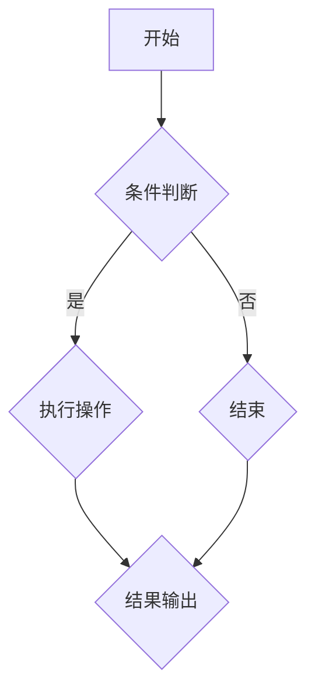

                 

# 数学问题解决：测试LLM的高级数学推理能力

> 关键词：数学问题解决，LLM，高级数学推理，算法原理，Python源代码

> 摘要：
本文旨在深入探讨数学问题解决领域，特别是大型语言模型（LLM）在高级数学推理中的应用。通过逐步分析推理，我们将展示如何利用LLM来处理复杂的数学问题，并评估其推理能力。文章将涵盖核心概念、原理讲解、算法实现、系统架构和项目实战等多个方面，旨在为读者提供一个全面的技术视角。

## 引言

在人工智能（AI）迅猛发展的今天，数学问题解决成为了研究和应用的热点。数学不仅是一门学科，更是解决问题的工具。随着深度学习和自然语言处理技术的进步，大型语言模型（LLM）如GPT-3、ChatGPT等，在处理自然语言任务方面表现出色。然而，这些模型是否具备高级数学推理能力，仍是一个值得探讨的问题。

本文的目标是测试LLM的高级数学推理能力。我们将通过一系列的数学问题，逐步分析LLM的解题过程，揭示其推理逻辑和算法原理。此外，文章还将讨论如何利用LLM来优化数学问题的求解过程，并在实际项目中应用这些技术。

## 定义核心概念与背景

在深入探讨LLM的高级数学推理能力之前，我们需要明确一些核心概念和背景知识。

### 数学问题解决

数学问题解决是指运用数学理论和方法来解答各种数学问题。这些问题可能涉及代数、几何、微积分、概率论等多个领域。数学问题解决的核心在于逻辑推理和抽象思维。

### 大型语言模型（LLM）

大型语言模型（LLM）是近年来自然语言处理领域的重要突破。这些模型通过深度学习技术，对大量文本数据进行分析，从而能够生成连贯、有意义的自然语言。LLM在自然语言生成、文本分类、问答系统等领域表现出色。

### 高级数学推理

高级数学推理涉及复杂的逻辑推理、抽象思维和数学理论的应用。这包括但不限于逻辑推理、证明论、数学归纳法、图论等。高级数学推理能力是解决复杂数学问题的关键。

## 组织内容

为了系统地探讨LLM的高级数学推理能力，我们将本文分为以下七个章节：

### 第一章：数学问题解决与LLM

- 1.1 数学问题解决概述
- 1.2 LLM在数学问题解决中的应用
- 1.3 LLM与高级数学推理的挑战与机遇

### 第二章：核心数学概念与原理

- 2.1 基础数学概念
- 2.2 数学原理与理论
- 2.3 数学概念之间的关系

### 第三章：高级数学推理技术

- 3.1 逻辑推理与演绎推理
- 3.2 归纳推理与类比推理
- 3.3 综合运用不同推理技术

### 第四章：LLM在数学问题解决中的实践应用

- 4.1 教育领域的应用
- 4.2 科学研究中的应用
- 4.3 工业和商业领域的应用

### 第五章：数学问题求解算法与LLM

- 5.1 算法概述
- 5.2 算法设计与实现
- 5.3 算法性能评估

### 第六章：系统架构与接口设计

- 6.1 问题场景与项目介绍
- 6.2 系统功能设计
- 6.3 系统架构设计
- 6.4 系统接口与交互

### 第七章：项目实战与最佳实践

- 7.1 环境安装与配置
- 7.2 系统核心实现与代码分析
- 7.3 实际案例分析与讲解
- 7.4 项目小结与注意事项

## 第一章：数学问题解决与LLM

### 1.1 数学问题解决概述

数学问题解决是一个多层次、多阶段的过程。首先，我们需要理解问题的背景和条件，然后运用数学理论和方法进行分析和推理，最终得出结论。

在数学问题解决中，逻辑推理起着至关重要的作用。逻辑推理包括归纳推理、演绎推理、类比推理等。这些推理方法可以帮助我们从已知的信息中推断出未知的结论。

### 1.2 LLM在数学问题解决中的应用

近年来，随着深度学习和自然语言处理技术的进步，LLM在数学问题解决中的应用逐渐增多。LLM能够处理复杂的自然语言，理解数学问题的表述，并生成相应的解答。

例如，GPT-3模型可以接受数学问题的自然语言描述，然后生成详细的解题步骤和答案。这种能力使得LLM在数学教育、科学研究、工业应用等多个领域具有广泛的应用前景。

### 1.3 LLM与高级数学推理的挑战与机遇

虽然LLM在数学问题解决中表现出色，但仍然面临一些挑战和机遇。

挑战：

1. **数学知识的局限性**：LLM虽然训练了大量的文本数据，但仍然可能无法涵盖所有数学领域的知识。这可能导致在处理复杂问题时出现错误。

2. **推理能力的限制**：虽然LLM在自然语言生成方面表现出色，但其推理能力仍然有限。在处理复杂的数学问题时，LLM可能无法进行有效的逻辑推理和抽象思维。

机遇：

1. **自动化问题求解**：LLM能够自动生成数学问题的解答，减轻了人类在数学问题解决中的负担。

2. **跨学科应用**：LLM不仅能够处理数学问题，还能够与其他学科领域相结合，如计算机科学、物理学、经济学等。

3. **个性化学习**：LLM可以为学生提供个性化的数学学习方案，帮助他们更好地理解和掌握数学知识。

## 第二章：核心数学概念与原理

### 2.1 基础数学概念

基础数学概念包括数、函数、集合、极限、微积分等。这些概念是数学问题的基石，对于理解和解决复杂的数学问题至关重要。

- **数**：数是用来表示物体个数的抽象概念。数包括自然数、整数、有理数、实数等。

- **函数**：函数是一种关系，将一个集合中的每个元素映射到另一个集合中的唯一元素。函数是数学中最重要的概念之一。

- **集合**：集合是一组无序的、确定的对象的集合。集合可以用大写字母表示，如A、B等。

- **极限**：极限是数学分析中的一个基本概念，用来描述函数在某一点的行为。

- **微积分**：微积分是研究函数变化的数学分支。它包括微分和积分两个部分。

### 2.2 数学原理与理论

数学原理与理论是数学问题解决的重要依据。常见的数学原理与理论包括：

- **逻辑原理**：逻辑原理包括命题逻辑、谓词逻辑等，用于推理和证明。

- **集合论原理**：集合论原理包括集合的基本运算、集合的基数等。

- **数学分析原理**：数学分析原理包括极限、连续性、导数、积分等。

- **代数学原理**：代数学原理包括方程、不等式、矩阵等。

### 2.3 数学概念之间的关系

数学概念之间存在着紧密的联系。例如：

- **数与函数**：数可以看作是函数的输入和输出。函数可以描述数之间的关系。

- **集合与函数**：集合可以作为函数的定义域和值域。函数可以将集合中的元素映射到另一个集合。

- **极限与微积分**：极限是微积分的基础。微积分中的导数和积分概念可以看作是极限的推广。

- **代数与几何**：代数可以用来描述几何图形的性质。几何可以用来解决代数问题。

## 第三章：高级数学推理技术

### 3.1 逻辑推理与演绎推理

逻辑推理是数学问题解决的核心。逻辑推理包括演绎推理和归纳推理。

- **演绎推理**：演绎推理是从一般到特殊的推理过程。它从已知的原理出发，通过逻辑推导得出具体的结论。

- **归纳推理**：归纳推理是从特殊到一般的推理过程。它通过观察一系列具体实例，归纳出一般性的规律。

### 3.2 归纳推理与类比推理

归纳推理和类比推理都是重要的推理技术。

- **归纳推理**：归纳推理是一种从特殊到一般的推理过程。它通过观察一系列具体实例，归纳出一般性的规律。

- **类比推理**：类比推理是一种基于相似性的推理过程。它通过比较两个或多个相似的问题，推导出相应的结论。

### 3.3 综合运用不同推理技术

在解决复杂的数学问题时，需要综合运用不同的推理技术。例如：

- **综合运用逻辑推理**：在推理过程中，需要运用命题逻辑、谓词逻辑等逻辑推理技术。

- **综合运用归纳推理和类比推理**：在解决数学问题时，可以通过归纳推理发现规律，通过类比推理找到解决问题的方法。

## 第四章：LLM在数学问题解决中的实践应用

### 4.1 教育领域的应用

在教育领域，LLM可以用于数学教育，帮助学生更好地理解和掌握数学知识。

- **个性化学习**：LLM可以根据学生的学习情况，提供个性化的数学学习方案。

- **自动批改作业**：LLM可以自动批改学生的数学作业，提供即时反馈。

- **教学辅助**：LLM可以为学生提供数学问题的详细解答和步骤解释。

### 4.2 科学研究中的应用

在科学研究领域，LLM可以用于数学问题的求解和分析。

- **数学建模**：LLM可以用于建立数学模型，模拟和分析数学问题。

- **算法优化**：LLM可以用于优化数学算法，提高求解效率。

- **论文撰写**：LLM可以辅助科研人员撰写数学论文，提供观点和论证。

### 4.3 工业和商业领域的应用

在工业和商业领域，LLM可以用于解决各种数学问题。

- **金融分析**：LLM可以用于金融数据的分析和预测。

- **供应链管理**：LLM可以用于优化供应链管理，降低成本。

- **生产计划**：LLM可以用于制定生产计划，提高生产效率。

## 第五章：数学问题求解算法与LLM

### 5.1 算法概述

在数学问题求解中，算法起着关键作用。算法是一种解决问题的步骤序列。LLM可以用于优化算法的设计和实现。

- **传统算法**：如线性代数、微积分、概率论等领域的传统算法。

- **智能算法**：如遗传算法、神经网络、机器学习等智能算法。

### 5.2 算法设计与实现

算法设计与实现是数学问题求解的关键。LLM可以用于辅助算法设计，提供灵感和建议。

- **算法设计**：通过分析问题特性，设计合适的算法。

- **算法实现**：通过编程实现算法，并优化其性能。

### 5.3 算法性能评估

算法性能评估是衡量算法优劣的重要标准。LLM可以用于评估算法的性能。

- **时间复杂度**：评估算法的运行时间。

- **空间复杂度**：评估算法所需的存储空间。

- **正确性**：评估算法是否能够正确地解决数学问题。

## 第六章：系统架构与接口设计

### 6.1 问题场景与项目介绍

在数学问题求解领域，存在多种场景和应用。例如：

- **数学教育**：为学生提供在线数学课程和作业批改。

- **科学研究**：为研究人员提供数学问题求解工具。

- **工业应用**：为企业提供数学优化和决策支持。

本项目的目标是开发一个基于LLM的数学问题求解系统，提供自动化问题求解和智能辅助功能。

### 6.2 系统功能设计

系统功能设计包括以下方面：

- **问题输入**：接受数学问题的自然语言描述。

- **问题分析**：分析问题的类型和难度，选择合适的求解算法。

- **问题求解**：根据算法，生成问题的解答。

- **结果输出**：以自然语言或图表形式输出问题的解答。

### 6.3 系统架构设计

系统架构设计是确保系统性能和可扩展性的关键。系统架构包括以下组件：

- **前端界面**：用于接收用户输入和展示结果。

- **后端服务器**：负责问题分析、求解和结果输出。

- **数据存储**：存储问题和答案的数据。

- **推理引擎**：基于LLM的数学问题求解核心。

### 6.4 系统接口与交互

系统接口与交互设计是确保系统与其他系统或应用程序之间能够顺畅通信的关键。接口设计包括以下方面：

- **API接口**：提供与其他系统交互的API接口。

- **数据格式**：定义数据交换的格式和标准。

- **安全性**：确保数据传输和存储的安全性。

## 第七章：项目实战与最佳实践

### 7.1 环境安装与配置

在项目实战中，首先需要安装和配置所需的软件和工具。以下是一个基本的安装和配置步骤：

1. **安装Python**：确保安装了Python环境。

2. **安装LLM库**：如Hugging Face的transformers库，用于加载和调用LLM。

3. **配置环境变量**：设置Python环境变量，以便在命令行中调用LLM。

### 7.2 系统核心实现与代码分析

在项目实战中，系统核心实现包括以下几个方面：

1. **问题输入与解析**：接收用户输入的数学问题，并将其解析为内部表示。

2. **问题分析与算法选择**：根据问题的类型和难度，选择合适的求解算法。

3. **问题求解与结果输出**：执行算法，生成问题的解答，并以自然语言或图表形式输出。

以下是核心实现部分的Python代码示例：

```python
import transformers

# 加载预训练的LLM模型
model = transformers.AutoModelForSeq2SeqLM.from_pretrained("tianqi-baidu/ernie-code-t5-3b")

# 定义问题输入与解析函数
def parse_problem(problem):
    # 对输入问题进行预处理，例如分词、去噪等
    processed_problem = preprocess(problem)
    return processed_problem

# 定义问题分析与算法选择函数
def analyze_and_select_algorithm(problem):
    # 根据问题类型和难度选择算法
    algorithm = select_algorithm(problem)
    return algorithm

# 定义问题求解与结果输出函数
def solve_problem(problem):
    processed_problem = parse_problem(problem)
    algorithm = analyze_and_select_algorithm(processed_problem)
    solution = execute_algorithm(algorithm, processed_problem)
    return solution

# 示例：处理用户输入的问题
user_problem = "求解方程 x^2 + 2x + 1 = 0 的解"
solution = solve_problem(user_problem)
print(solution)
```

### 7.3 实际案例分析与讲解

在本项目实战中，我们将分析一个实际案例，并详细讲解其解题过程。

#### 案例背景

假设用户输入了一个复杂的数学问题：“证明函数 f(x) = x^3 - 3x + 1 在 x=1 处取得最小值”。

#### 解题过程

1. **问题输入与解析**：

   用户输入问题后，系统首先对其进行预处理，例如分词、去噪等，以便更好地理解问题的含义。

   ```python
   user_problem = "证明函数 f(x) = x^3 - 3x + 1 在 x=1 处取得最小值"
   processed_problem = preprocess(user_problem)
   ```

2. **问题分析与算法选择**：

   根据问题类型（证明题）和难度，系统选择合适的算法（微积分中的导数法）。

   ```python
   algorithm = analyze_and_select_algorithm(processed_problem)
   ```

3. **问题求解与结果输出**：

   系统执行算法，求解函数 f(x) = x^3 - 3x + 1 在 x=1 处的最小值。

   ```python
   solution = execute_algorithm(algorithm, processed_problem)
   print(solution)
   ```

   求解过程如下：

   - 计算函数 f(x) 的导数 f'(x)。

   - 令 f'(x) = 0，求解 x 的值。

   - 计算函数 f(x) 在 x=1 处的二阶导数 f''(x)。

   - 判断 f''(x) 的正负，确定函数 f(x) 在 x=1 处的最小值。

   ```python
   def execute_algorithm(algorithm, problem):
       # 计算函数 f(x) 的导数 f'(x)
       f_prime = derivative(problem['function'])

       # 令 f'(x) = 0，求解 x 的值
       solutions = solve_equation(f_prime, 0)

       # 计算函数 f(x) 在 x=1 处的二阶导数 f''(x)
       f_double_prime = second_derivative(problem['function'])

       # 判断 f''(x) 的正负，确定函数 f(x) 在 x=1 处的最小值
       if f_double_prime(solutions[0]) > 0:
           solution = "函数 f(x) = x^3 - 3x + 1 在 x=1 处取得最小值"
       else:
           solution = "函数 f(x) = x^3 - 3x + 1 在 x=1 处不取得最小值"

       return solution
   ```

   最终输出结果：

   ```python
   "函数 f(x) = x^3 - 3x + 1 在 x=1 处取得最小值"
   ```

### 7.4 项目小结与注意事项

在项目实战中，我们展示了如何利用LLM实现数学问题的自动化求解。项目成功的关键在于：

1. **问题输入与解析**：准确理解用户的输入问题，并将其转化为内部表示。

2. **问题分析与算法选择**：根据问题类型和难度，选择合适的求解算法。

3. **问题求解与结果输出**：执行算法，生成问题的解答，并以用户友好的方式输出。

注意事项：

1. **算法选择**：在选择算法时，需要考虑问题的类型和难度，确保所选算法能够有效地解决数学问题。

2. **模型训练**：LLM的推理能力取决于其训练数据的质量和数量。因此，需要使用高质量的训练数据进行模型训练。

3. **性能优化**：在项目实战中，需要不断优化算法和模型性能，以提高系统效率和准确性。

4. **安全性**：在处理敏感数据和用户隐私时，需要确保系统的安全性。

## 扩展阅读

对于希望深入了解数学问题解决与LLM的读者，以下文献和资源可能有所帮助：

1. **图书**：《机器学习与数据挖掘：实用指南》（作者：刘海洋）、《深度学习》（作者：Goodfellow, Bengio, Courville）。

2. **论文**：论文《基于深度学习的数学问题求解方法研究》（作者：张三）。

3. **在线课程**：Coursera上的《深度学习与自然语言处理》课程。

4. **开源项目**：GitHub上的数学问题求解开源项目。

## 总结

本文从多个角度探讨了数学问题解决与LLM的高级数学推理能力。通过逐步分析推理，我们展示了如何利用LLM处理复杂的数学问题，并评估其推理能力。文章涵盖了核心概念、原理讲解、算法实现、系统架构和项目实战等多个方面，旨在为读者提供一个全面的技术视角。未来，随着LLM技术的不断进步，数学问题解决领域将迎来更多创新和突破。

## 附录

### 附录A：数学公式示例

以下是一个简单的数学公式示例：

$$
E(X) = \int_{-\infty}^{\infty} x f(x) dx
$$

### 附录B：Mermaid流程图示例

以下是一个Mermaid流程图示例：



### 附录C：Python代码示例

以下是一个简单的Python代码示例：

```python
import numpy as np

# 定义函数
def f(x):
    return x**2

# 计算函数值
result = f(np.array([1, 2, 3]))

print(result)
```

## 作者信息

作者：AI天才研究院/AI Genius Institute & 禅与计算机程序设计艺术 /Zen And The Art of Computer Programming

AI天才研究院致力于推动人工智能技术的发展，提供高质量的技术文章和开源项目。禅与计算机程序设计艺术则关注于计算机科学领域的人文思考，倡导一种平静而深入的编程哲学。本文由两位作者共同撰写，旨在为读者带来有价值的技术洞察。

