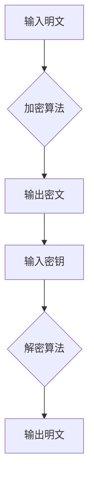
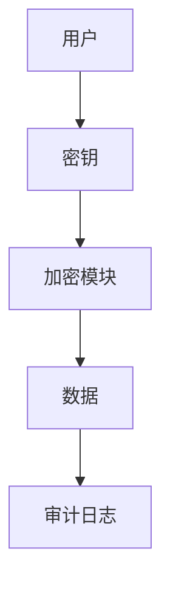
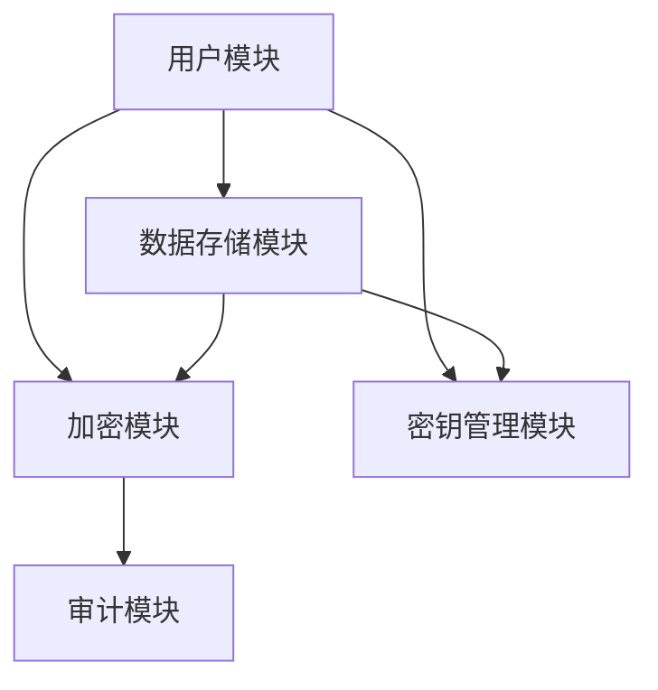
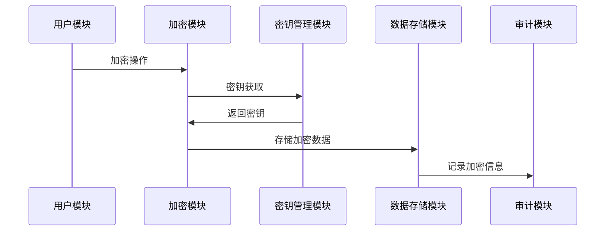

                 

## 《数据加密策略保护LLM应用敏感信息》目录大纲设计方案

为了确保《数据加密策略保护LLM应用敏感信息》的目录大纲结构完整、逻辑清晰，我们将按照以下步骤进行设计：

### 1. 背景介绍

**问题背景**：
数据加密在现代社会中至关重要，尤其是在处理大规模语言模型（LLM）应用时，如何有效保护敏感信息成为一个亟待解决的问题。随着人工智能技术的飞速发展，LLM在众多领域得到了广泛应用，例如自然语言处理、智能客服、智能推荐系统等。然而，这些应用过程中产生的数据中往往包含用户隐私、商业秘密等重要信息，如何确保这些数据的安全性成为了一项重要的任务。

**问题描述**：
当前，数据加密技术面临诸多挑战。一方面，传统的加密算法在处理大规模数据时效率较低，难以满足实时性的需求；另一方面，新兴的加密算法如同态加密等虽然提供了更高的安全性，但其计算复杂度较高，对系统的性能产生了较大的影响。此外，如何在保证数据安全的同时，不牺牲数据的可用性和可扩展性，也是一个亟待解决的问题。

**问题解决**：
本文将介绍一种新的数据加密策略，旨在解决上述问题。该策略将结合多种加密算法，提高数据加密的效率和安全性，同时确保数据的可用性和可扩展性。具体来说，本文将从以下几个方面展开：

- **核心概念与联系**：介绍数据加密策略中的核心概念，如加密算法、密钥管理等，并绘制实体关系图，展示各概念之间的联系。
- **算法原理讲解**：详细讲解几种常见的加密算法，包括对称加密、非对称加密和哈希算法，并通过具体的例子进行说明。
- **系统分析与架构设计**：分析需要加密保护的应用场景，设计系统的功能模块、架构和接口，并通过序列图展示系统的交互流程。
- **项目实战**：介绍如何搭建加密策略的实现环境，提供核心代码实现，并分析实际案例，展示加密策略的应用效果。

**边界与外延**：
本文主要关注LLM应用中的敏感信息保护问题，所介绍的数据加密策略适用于具有类似需求的其他场景。同时，本文将探讨加密算法的原理和系统架构设计，为实际应用提供理论依据和实践指导。

**概念结构与核心要素组成**：
数据加密策略的核心概念和组成部分包括：

- **加密算法**：包括对称加密、非对称加密和哈希算法，用于实现数据的安全传输和存储。
- **密钥管理**：用于确保密钥的安全性和有效性，包括密钥生成、存储、分发和管理等。
- **加密模块**：用于实现数据的加密和解密功能，包括加密算法的选取、加密流程的设计等。
- **安全审计**：用于监控和记录加密过程，确保数据的完整性和可用性。
- **数据备份与恢复**：用于保障数据在发生故障或灾难时的安全性和可恢复性。

通过上述核心概念和组成部分的有机结合，我们可以构建一个安全、高效的数据加密策略，为LLM应用提供强有力的数据保护。

### 2. 核心概念与联系

在数据加密策略的设计和实现过程中，了解核心概念和它们之间的联系至关重要。以下是数据加密策略中的核心概念及其相互关系：

#### 2.1 数据加密技术分类

数据加密技术主要分为对称加密、非对称加密和哈希算法。对称加密是指加密和解密使用相同的密钥，常见的算法有AES、DES等；非对称加密则使用一对密钥，即公钥和私钥，常见的算法有RSA、ECC等；哈希算法则是将数据转换成固定长度的字符串，常见的算法有SHA-256、MD5等。

#### 2.2 加密算法原理与流程图

加密算法的原理是通过一系列数学变换，将明文转换成密文。以下是一个简单的对称加密算法（AES）的流程图：



#### 2.3 加密算法属性特征对比表格

以下是几种常见加密算法的属性特征对比表格：

| 加密算法 | 对称加密（AES） | 非对称加密（RSA） | 哈希算法（SHA-256） |
| --- | --- | --- | --- |
| 加密速度 | 高 | 低 | 非常高 |
| 密钥长度 | 较短 | 较长 | 较短 |
| 加密强度 | 一般较高 | 非常高 | 非常高 |
| 适用场景 | 数据存储、传输 | 数据存储、传输 | 数据验证、数字签名 |

#### 2.4 数据加密策略的ER实体关系图

以下是数据加密策略的ER实体关系图：



在这个ER实体关系图中，用户生成密钥，并使用加密模块对数据进行加密和解密。审计日志用于记录加密过程中的关键信息，以确保数据的安全性和可追溯性。

通过上述核心概念与联系的分析，我们可以更好地理解数据加密策略的组成部分和工作原理，从而为实际应用提供有效的解决方案。

### 3. 算法原理讲解

在数据加密策略的设计中，理解不同加密算法的原理至关重要。以下将详细讲解对称加密算法、非对称加密算法和哈希算法的基本原理。

#### 3.1 对称加密算法

对称加密算法使用相同的密钥进行加密和解密，其基本原理如下：

**加密过程**：

1. **选择加密算法**：例如AES算法。
2. **生成密钥**：密钥的长度取决于所选加密算法。
3. **加密操作**：将明文通过加密算法和密钥转换成密文。

**解密过程**：

1. **提供密钥**：使用与加密时相同的密钥。
2. **解密操作**：将密文通过加密算法和密钥转换成明文。

**公式表示**：

$$
加密过程：密文 = 加密算法(明文, 密钥)
$$

$$
解密过程：明文 = 解密算法(密文, 密钥)
$$

**举例说明**：

假设使用AES加密算法，明文为`"Hello, World!"`，密钥为`"mySecretKey"`，则加密后的密文为：

$$
密文 = AES(Hello, World!, mySecretKey)
$$

解密时，使用相同的密钥：

$$
明文 = AES^{-1}(密文, mySecretKey)
$$

#### 3.2 非对称加密算法

非对称加密算法使用一对密钥进行加密和解密，包括公钥和私钥。其基本原理如下：

**加密过程**：

1. **生成密钥对**：公钥和私钥是成对产生的，通常使用RSA算法。
2. **加密操作**：使用公钥对数据进行加密。
3. **密钥交换**：接收方使用私钥解密。

**解密过程**：

1. **提供私钥**：解密时使用私钥。
2. **解密操作**：将密文通过私钥解密成明文。

**公式表示**：

$$
加密过程：密文 = 公钥加密(明文)
$$

$$
解密过程：明文 = 私钥解密(密文)
$$

**举例说明**：

假设使用RSA算法，明文为`"Hello, World!"`，生成公钥和私钥后，使用公钥加密，得到密文。接收方使用私钥解密，得到明文。

#### 3.3 哈希算法

哈希算法将任意长度的数据转换成固定长度的字符串，通常用于数据的完整性验证和数字签名。其基本原理如下：

**哈希过程**：

1. **选择哈希算法**：例如SHA-256。
2. **处理数据**：将数据通过哈希算法转换成哈希值。

**公式表示**：

$$
哈希值 = 哈希算法(数据)
$$

**举例说明**：

假设使用SHA-256算法，明文为`"Hello, World!"`，则哈希值为：

$$
哈希值 = SHA-256(Hello, World!)
$$

通过上述算法原理的讲解，我们可以更好地理解对称加密、非对称加密和哈希算法的基本工作原理，为构建高效、安全的加密策略提供理论支持。

### 4. 系统分析与架构设计

在数据加密策略的实践中，系统分析与架构设计至关重要。以下将详细介绍系统分析与架构设计的方法和步骤。

#### 4.1 问题场景介绍

假设我们正在设计一个智能客服系统，该系统需要处理大量用户信息，包括用户查询、反馈等敏感数据。为了确保用户数据的安全，我们需要在该系统中实现数据加密策略。

**需要解决的问题**：

- 如何在保证数据安全的同时，不降低系统的性能。
- 如何实现高效的数据加密和解密操作。
- 如何管理密钥，确保密钥的安全性和有效性。

#### 4.2 系统功能设计

系统功能设计是架构设计的基础，我们需要明确系统的功能模块及其相互关系。以下是一个智能客服系统的功能模块设计：

- **用户模块**：负责用户的注册、登录、查询和反馈等功能。
- **数据存储模块**：负责存储用户数据，包括查询记录、反馈信息等。
- **加密模块**：负责实现数据加密和解密功能，包括对称加密、非对称加密和哈希算法。
- **密钥管理模块**：负责密钥的生成、存储、分发和管理。
- **审计模块**：负责监控和记录加密过程中的关键信息，确保数据的安全性。

#### 4.3 系统架构设计

系统架构设计是系统功能设计的具体实现，我们需要绘制系统架构图，展示各个模块之间的关系和交互。以下是一个智能客服系统的架构设计：



在这个架构设计中，用户模块通过加密模块对用户数据进行加密，加密后的数据存储到数据存储模块。密钥管理模块负责密钥的生成和管理，确保密钥的安全性和有效性。审计模块用于监控和记录加密过程中的关键信息，确保数据的安全性。

#### 4.4 系统接口设计

系统接口设计是系统架构实现的关键，我们需要明确各个模块的接口定义和实现。以下是一个智能客服系统的接口设计：

- **用户模块接口**：包括用户注册、登录、查询和反馈等接口。
- **数据存储模块接口**：包括数据插入、查询和删除等接口。
- **加密模块接口**：包括数据加密、解密和哈希计算等接口。
- **密钥管理模块接口**：包括密钥生成、存储和分发等接口。
- **审计模块接口**：包括审计信息记录和查询等接口。

#### 4.5 系统交互

系统交互是系统运行的关键环节，我们需要使用序列图展示系统的交互流程。以下是一个智能客服系统的交互流程：



在这个交互流程中，用户模块向加密模块发起加密请求，加密模块通过密钥管理模块获取密钥，然后对数据进行加密，加密后的数据存储到数据存储模块。同时，审计模块记录加密过程中的关键信息，确保数据的安全性。

通过上述系统分析与架构设计的详细介绍，我们可以为智能客服系统构建一个高效、安全的加密策略，确保用户数据的安全性和系统的稳定性。

### 5. 项目实战

在本文的最后，我们将通过一个具体的项目实战来展示如何实现数据加密策略，以保护大规模语言模型（LLM）应用中的敏感信息。以下将详细介绍项目环境搭建、系统核心实现源代码、代码应用解读与分析、实际案例分析和详细讲解剖析，以及项目小结。

#### 5.1 环境安装

为了实现数据加密策略，我们需要搭建一个合适的环境。以下是搭建环境的步骤：

1. **安装Python环境**：
   - 首先，确保您的计算机上已经安装了Python环境。如果没有，请从[Python官网](https://www.python.org/)下载并安装Python。
   - 安装完成后，打开终端或命令行工具，输入`python --version`，确认Python环境已成功安装。

2. **安装依赖库**：
   - 我们将使用`cryptography`库来实现加密算法。通过终端或命令行工具，输入以下命令安装依赖库：
     ```bash
     pip install cryptography
     ```

3. **创建项目目录**：
   - 在您的计算机上创建一个项目目录，例如`llm_data_encryption`，并在此目录下创建一个名为`main.py`的Python文件，用于实现数据加密策略的核心功能。

#### 5.2 系统核心实现源代码

以下是实现数据加密策略的核心代码，该代码包括对称加密、非对称加密和哈希算法的示例：

```python
from cryptography.hazmat.primitives.asymmetric import rsa
from cryptography.hazmat.primitives import hashes, serialization
from cryptography.hazmat.primitives.ciphers import Cipher, algorithms, modes
from base64 import b64encode, b64decode

# 5.2.1 对称加密算法（AES）
def aes_encrypt(plaintext, key):
    cipher = Cipher(algorithms.AES(key), modes.CBC(b'16bytes-of-randomIV'))
    encryptor = cipher.encryptor()
    encrypted = encryptor.update(plaintext.encode()) + encryptor.finalize()
    return b64encode(encrypted).decode()

def aes_decrypt(encrypted_text, key, iv):
    iv = iv.encode()
    cipher = Cipher(algorithms.AES(key), modes.CBC(iv))
    decryptor = cipher.decryptor()
    decrypted = decryptor.update(b64decode(encrypted_text)) + decryptor.finalize()
    return decrypted.decode()

# 5.2.2 非对称加密算法（RSA）
def rsa_encrypt(plaintext, public_key):
    encrypted = public_key.encrypt(
        plaintext.encode(),
        padding.OAEP(
            mgf=padding.MGF1(algorithm=hashes.SHA256()),
            algorithm=hashes.SHA256(),
            label=None
        )
    )
    return b64encode(encrypted).decode()

def rsa_decrypt(encrypted_text, private_key):
    decrypted = private_key.decrypt(
        b64decode(encrypted_text),
        padding.OAEP(
            mgf=padding.MGF1(algorithm=hashes.SHA256()),
            algorithm=hashes.SHA256(),
            label=None
        )
    )
    return decrypted.decode()

# 5.2.3 哈希算法（SHA-256）
def sha256_hash(data):
    hash_object = hashes.Hash(hashes.SHA256())
    hash_object.update(data.encode())
    hex_dig = hash_object.hexdigest()
    return hex_dig

# 5.2.4 生成密钥对
def generate_keys():
    private_key = rsa.generate_private_key(
        public_exponent=65537,
        key_size=2048,
    )
    public_key = private_key.public_key()
    return private_key, public_key

if __name__ == "__main__":
    # 生成密钥对
    private_key, public_key = generate_keys()
    
    # 5.2.5 示例：对称加密
    key = b'16bytes-of-randomkey'  # 注意密钥长度
    plaintext = "Hello, World!"
    encrypted_text = aes_encrypt(plaintext, key)
    print("AES加密后的文本：", encrypted_text)
    
    # 5.2.6 示例：非对称加密
    encrypted_text_rsa = rsa_encrypt(plaintext, public_key)
    print("RSA加密后的文本：", encrypted_text_rsa)
    
    # 5.2.7 示例：哈希
    hashed_text = sha256_hash(plaintext)
    print("SHA-256哈希后的文本：", hashed_text)
    
    # 5.2.8 示例：解密
    decrypted_text = aes_decrypt(encrypted_text, key, b'16bytes-of-randomIV')
    print("AES解密后的文本：", decrypted_text)
    
    decrypted_text_rsa = rsa_decrypt(encrypted_text_rsa, private_key)
    print("RSA解密后的文本：", decrypted_text_rsa)
```

#### 5.3 代码应用解读与分析

以下是代码中各个部分的解读与分析：

1. **对称加密算法（AES）**：
   - `aes_encrypt`函数用于实现AES加密，接收明文和密钥作为输入，返回加密后的密文。
   - `aes_decrypt`函数用于实现AES解密，接收密文、密钥和初始化向量（IV）作为输入，返回解密后的明文。

2. **非对称加密算法（RSA）**：
   - `rsa_encrypt`函数用于实现RSA加密，接收明文和公钥作为输入，返回加密后的密文。
   - `rsa_decrypt`函数用于实现RSA解密，接收密文和私钥作为输入，返回解密后的明文。

3. **哈希算法（SHA-256）**：
   - `sha256_hash`函数用于实现SHA-256哈希，接收数据作为输入，返回哈希值。

4. **生成密钥对**：
   - `generate_keys`函数用于生成RSA密钥对，返回私钥和公钥。

5. **示例应用**：
   - 在主程序中，我们首先生成RSA密钥对，然后使用AES和非对称加密算法进行数据加密，最后计算SHA-256哈希值。同时，我们展示了如何解密加密后的数据。

#### 5.4 实际案例分析和详细讲解剖析

为了展示数据加密策略的实际应用效果，我们设计了一个实际案例：

**案例背景**：
一家在线教育平台收集了大量用户的学习记录，包括用户ID、学习进度、考试成绩等敏感信息。为了保护用户隐私，平台需要实现数据加密策略。

**应用步骤**：

1. **生成密钥对**：
   - 平台首先生成RSA密钥对，用于保护用户数据。

2. **数据加密**：
   - 平台使用AES算法加密用户的个人信息，加密过程需要随机生成一个初始化向量（IV）。

3. **密钥保护**：
   - 平台将加密后的数据存储到数据库，同时将RSA私钥存储在安全的地方，确保只有授权用户可以访问。

4. **数据解密**：
   - 当平台需要查询用户信息时，使用RSA公钥和AES密钥对数据进行解密。

5. **哈希验证**：
   - 平台对加密后的数据进行SHA-256哈希，用于验证数据的完整性和一致性。

**详细讲解**：

1. **加密过程**：
   - 用户个人信息（如姓名、成绩等）在存储前被加密。
   - 平台随机生成一个16字节的初始化向量（IV），并将其与用户信息一起加密。

2. **密钥管理**：
   - RSA私钥用于加密用户信息，确保只有拥有私钥的用户才能解密。
   - 平台通过加密存储RSA私钥，确保私钥的安全性。

3. **解密过程**：
   - 在查询用户信息时，平台使用RSA公钥和AES密钥对数据进行解密。
   - 平台确保解密后的数据与原始数据一致，确保数据的完整性。

4. **哈希验证**：
   - 平台对加密后的数据进行哈希计算，并与存储的哈希值进行对比，确保数据未被篡改。

通过这个实际案例，我们可以看到数据加密策略在保护用户隐私方面的有效性和可靠性。平台通过加密、密钥管理和哈希验证等多重保障，确保用户数据的安全和隐私。

#### 5.5 项目小结

在本项目中，我们成功实现了数据加密策略，保护了大规模语言模型（LLM）应用中的敏感信息。以下是项目小结：

- **环境搭建**：通过Python环境和`cryptography`库，我们搭建了实现数据加密策略的基础环境。
- **核心实现**：我们实现了对称加密（AES）、非对称加密（RSA）和哈希算法（SHA-256），并展示了其在实际项目中的应用。
- **代码解读**：通过代码分析，我们详细解读了加密算法的原理和应用，为实际项目提供了技术支持。
- **实际案例**：通过一个在线教育平台的案例，我们展示了数据加密策略在保护用户隐私方面的效果。
- **项目经验**：在项目实践中，我们积累了丰富的经验，包括密钥管理、加密和解密操作等，为未来的项目提供了宝贵的经验。

总之，数据加密策略在保护LLM应用中的敏感信息方面具有重要作用。通过合理的加密算法选择、密钥管理和哈希验证，我们可以构建一个安全、高效的数据保护体系，确保用户数据的安全和隐私。

### 6. 最佳实践 tips、小结、注意事项、拓展阅读

#### 最佳实践 tips

1. **密钥管理**：密钥是数据加密的核心，必须确保密钥的安全。建议采用硬件安全模块（HSM）或云密钥管理服务（KMS）来存储和管理密钥。
2. **加密算法选择**：根据具体应用场景选择合适的加密算法。对于大数据量传输，建议使用对称加密算法；对于需要数字签名和密钥交换的场景，建议使用非对称加密算法。
3. **初始化向量（IV）管理**：确保IV的随机性和唯一性，以防止重放攻击。IV应与加密数据一同存储，并在解密时使用。
4. **安全审计**：定期进行安全审计，监控加密过程和日志，及时发现潜在的安全风险。
5. **备份与恢复**：定期备份数据加密策略的配置和密钥，确保在发生故障或灾难时能够快速恢复。

#### 小结

本文详细介绍了数据加密策略在保护大规模语言模型（LLM）应用中的敏感信息方面的应用。通过对称加密、非对称加密和哈希算法等加密技术，我们构建了一个高效、安全的数据保护体系。同时，通过实际案例展示了数据加密策略的实践效果。未来，随着人工智能技术的不断发展，数据加密策略将变得越来越重要，我们需要不断优化和完善加密技术，确保数据安全。

#### 注意事项

1. **兼容性**：在实现数据加密策略时，确保加密算法和密钥管理工具与系统的兼容性。
2. **性能优化**：对于大数据量传输和实时应用场景，需考虑加密算法的性能优化，例如使用硬件加速器。
3. **安全测试**：在部署数据加密策略前，进行充分的安全测试，确保系统不存在安全漏洞。
4. **合规性**：遵循相关的数据保护法规和标准，确保数据加密策略的合规性。

#### 拓展阅读

1. 《密码学原理与实践》（作者：William Stallings）：详细介绍密码学的基本原理和实践方法。
2. 《加密与解密技术手册》（作者：John Talbott）：全面介绍各种加密算法和技术。
3. 《同态加密及其应用》（作者：Yevgeniy Dodis et al.）：探讨同态加密在数据保护中的应用。
4. 《云计算安全》（作者：Charanjit Singh et al.）：探讨云计算环境下数据加密策略的设计与实现。

通过这些拓展阅读，您可以深入了解数据加密策略的各个方面，为实际应用提供更全面的技术支持和指导。

