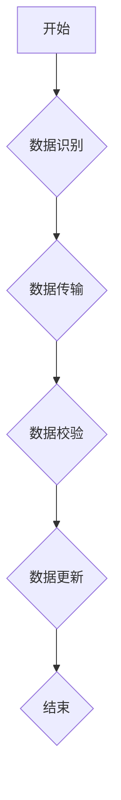
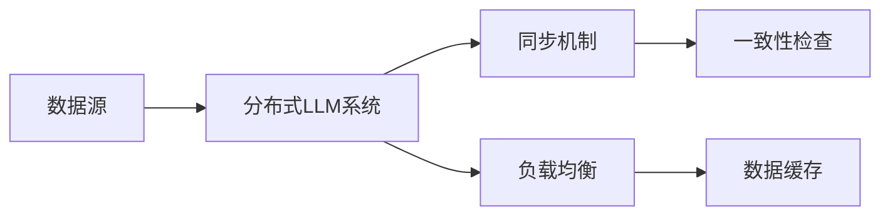
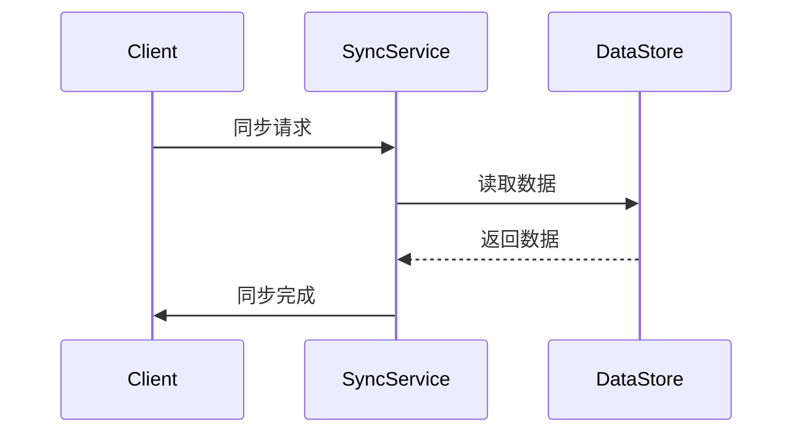

                 

## 数据同步策略在分布式LLM系统中的实现

### 关键词

- 数据同步策略
- 分布式计算
- LLM（大型语言模型）
- 数据一致性
- 算法设计

### 摘要

本文将深入探讨数据同步策略在分布式LLM（大型语言模型）系统中的应用与实现。首先，我们将回顾分布式计算和LLM的基本概念，并探讨它们结合的必要性与挑战。接着，我们将详细介绍数据同步策略的核心概念、原理和算法，并通过具体案例展示如何在分布式LLM系统中实现数据同步。最后，我们将对整个方案进行系统分析与架构设计，并分享一些最佳实践和注意事项。

## 第一部分：分布式LLM系统背景与基础

### 第1章：分布式LLM系统概述

#### 1.1 问题背景

在现代数据科学和人工智能领域，LLM（大型语言模型）的应用越来越广泛。LLM能够处理复杂的自然语言任务，如文本生成、翻译、问答等，但这也带来了数据同步的挑战。在分布式系统中，由于数据分散存储在多个节点上，如何确保数据的一致性和同步成为关键问题。

#### 1.1.1 数据同步的重要性

数据同步是确保分布式系统可靠性和一致性的重要手段。在分布式LLM系统中，数据同步不仅影响模型的性能和准确性，还影响用户体验。如果数据不同步，可能会导致模型输出不一致、错误或者失效。

#### 1.1.2 分布式计算与LLM结合

分布式计算和LLM的结合旨在利用分布式系统的优势，如高可用性、可扩展性和容错性，来处理大规模语言模型训练和推理任务。这需要解决数据同步、通信、负载均衡等问题。

#### 1.1.3 系统架构需求

分布式LLM系统需要具备以下关键特性：

- **高可用性**：系统在部分节点故障时仍能正常运行。
- **高性能**：系统能够快速处理大规模数据和高并发请求。
- **高可扩展性**：系统能够随着数据量的增加而线性扩展。
- **数据一致性**：确保分布式存储中的数据一致性。

#### 1.2 分布式系统基础

#### 1.2.1 分布式计算原理

分布式计算是将任务分解为多个子任务，并在多个节点上并行执行，最终将结果合并为一个整体的过程。其核心思想是通过并行计算来提高系统的性能和可扩展性。

#### 1.2.2 CAP定理与分布式一致性

CAP定理指出，在分布式系统中，一致性（Consistency）、可用性（Availability）和分区容错性（Partition Tolerance）三者之间只能同时满足两项。因此，在设计分布式系统时，需要根据具体需求在三者之间做出权衡。

#### 1.2.3 分布式系统的挑战

分布式系统面临以下主要挑战：

- **数据同步**：如何确保分布式存储中的数据一致性。
- **通信**：如何高效地传输数据并在节点间协调。
- **负载均衡**：如何均衡地分配任务到各个节点。
- **故障容错**：如何处理节点故障和恢复。

#### 1.3 LLM基础

#### 1.3.1 LLM的定义与特点

LLM（Large Language Model）是一种能够理解和生成自然语言的大型神经网络模型。与传统的规则-based系统不同，LLM通过深度学习从大量文本数据中学习语言模式，具有自适应性和灵活性。

#### 1.3.2 LLM在分布式系统中的应用

LLM在分布式系统中的应用主要包括以下几个方面：

- **训练**：利用分布式计算资源加速模型训练过程。
- **推理**：通过分布式部署提高模型的服务能力和响应速度。
- **数据同步**：确保模型在不同节点上的训练数据和参数一致性。

#### 1.3.3 LLM中的数据同步需求

在LLM的分布式训练过程中，数据同步需求包括：

- **数据一致性**：确保模型在不同节点上的数据版本一致。
- **数据更新**：如何处理数据的新增、更新和删除。
- **数据完整性**：确保数据在传输和存储过程中的完整性。

#### 1.4 分布式LLM系统的设计原则

#### 1.4.1 系统可靠性

分布式LLM系统需要具备高可靠性，以应对节点故障和异常情况。

#### 1.4.2 系统性能优化

优化系统性能是分布式LLM系统设计的重要目标，包括数据传输、存储和计算等方面。

#### 1.4.3 数据同步策略的考虑

选择合适的数据同步策略对分布式LLM系统至关重要，需要综合考虑数据一致性、传输效率和系统性能等因素。

### 第2章：核心概念与联系

#### 2.1 数据同步策略

#### 2.1.1 同步策略概述

数据同步策略是指如何确保分布式系统中数据的一致性和同步。常见的同步策略包括：

- **全量同步**：将整个数据集从一个节点同步到另一个节点。
- **增量同步**：只同步数据集的变更部分。
- **双向同步**：两个节点互相同步数据。

#### 2.1.2 同步策略对比分析

不同同步策略具有不同的优缺点，需要根据具体场景进行选择。以下是几种常见同步策略的对比分析：

| 同步策略   | 优点                                     | 缺点                                       |
| ---------- | ---------------------------------------- | ------------------------------------------ |
| 全量同步   | 简单、易于实现                           | 数据传输量大，效率低                       |
| 增量同步   | 数据传输量小，效率高                     | 需要额外的记录和跟踪机制                   |
| 双向同步   | 双向通信，更灵活                         | 数据同步复杂度增加                         |

#### 2.1.3 同步策略的属性特征

同步策略的属性特征包括：

- **一致性**：确保分布式系统中数据的一致性。
- **传输效率**：数据传输的速度和带宽占用。
- **系统性能**：同步策略对系统性能的影响。

### 2.2 分布式系统中的数据同步

#### 2.2.1 数据同步原理

数据同步原理是指如何将数据从一个节点传输到另一个节点，并确保数据的一致性和完整性。数据同步通常包括以下步骤：

1. **数据识别**：确定需要同步的数据。
2. **数据传输**：将数据从一个节点传输到另一个节点。
3. **数据校验**：确保传输数据的完整性和一致性。
4. **数据更新**：更新目标节点的数据。

#### 2.2.2 数据同步算法

数据同步算法是指实现数据同步过程的计算方法和步骤。常见的数据同步算法包括：

- **Paxos算法**：一种分布式一致性算法，能够保证在分布式系统中数据的一致性。
- **Raft算法**：一种基于日志复制的一致性算法，具有简单、高效和易于实现的特点。

#### 2.2.3 数据同步中的挑战与解决方法

数据同步过程中可能会遇到以下挑战：

- **网络延迟**：解决方法包括增加传输带宽、使用缓存和优化传输协议。
- **数据冲突**：解决方法包括版本控制、时间戳和并行同步。
- **节点故障**：解决方法包括故障检测、节点替换和故障恢复。

#### 2.3 LLM与数据同步

#### 2.3.1 LLM对数据同步的影响

LLM对数据同步的影响主要体现在以下几个方面：

- **数据规模**：LLM通常具有大规模的参数和数据集，这增加了数据同步的复杂度和传输量。
- **数据一致性**：LLM的训练和推理过程对数据一致性有较高的要求。
- **计算资源**：LLM的训练和推理需要大量计算资源，这可能影响数据同步的效率。

#### 2.3.2 LLM中的数据同步需求

在LLM的分布式训练和推理过程中，数据同步需求包括：

- **训练数据一致性**：确保不同节点上的训练数据一致，以避免模型训练结果不一致。
- **推理数据一致性**：确保不同节点上的推理数据一致，以提高模型推理的准确性和可靠性。
- **参数同步**：确保不同节点上的模型参数一致，以避免模型参数漂移。

#### 2.3.3 LLM中的数据同步实现

在LLM中实现数据同步通常包括以下步骤：

1. **数据同步策略选择**：根据LLM的应用场景和需求选择合适的同步策略。
2. **数据传输协议**：设计高效的数据传输协议，以优化数据同步的传输效率和性能。
3. **一致性保障机制**：设计一致性保障机制，以确保数据在不同节点上的一致性和完整性。
4. **同步监控与优化**：监控数据同步过程，并根据监控结果优化同步策略和算法。

### 第3章：算法原理与流程图

#### 3.1 数据同步算法原理

数据同步算法的原理是确保分布式系统中数据的一致性和同步。基本框架如下：

1. **数据识别**：确定需要同步的数据。
2. **数据传输**：将数据从一个节点传输到另一个节点。
3. **数据校验**：确保传输数据的完整性和一致性。
4. **数据更新**：更新目标节点的数据。

数学模型可以表示为：

$$
\text{同步算法模型} = f(\text{数据集}, \text{同步策略}, \text{一致性约束})
$$

其中，数据集表示需要同步的数据，同步策略表示数据同步的具体方法，一致性约束表示数据同步的一致性要求。

#### 3.2 算法流程图

以下是数据同步算法的流程图：



#### 3.3 同步算法的Python实现

以下是数据同步算法的Python实现：

```python
def sync_data(source, target):
    # 数据识别
    data_to_sync = identify_data_to_sync(source, target)

    # 数据传输
    transfer_data(source, target, data_to_sync)

    # 数据校验
    verify_data(source, target, data_to_sync)

    # 数据更新
    update_data(target, data_to_sync)
```

#### 3.4 数学模型与公式

数据同步算法的数学模型和公式如下：

$$
\text{同步误差} = \sum_{i=1}^{N} |\text{本地数据} - \text{远程数据}|
$$

其中，N表示数据项的数量，本地数据和远程数据分别表示本地节点和远程节点的数据。

一致性约束可以表示为：

$$
\text{一致性约束} = \text{最终一致性} \cup \text{因果一致性} \cup \text{强一致性}
$$

其中，最终一致性、因果一致性和强一致性分别表示不同的一致性要求。

### 第4章：系统分析与架构设计

#### 4.1 问题场景介绍

在本章节中，我们将介绍一个具体的分布式LLM系统场景，包括系统的功能需求、性能要求和安全要求等。

#### 4.2 系统功能设计

4.2.1 领域模型

以下是分布式LLM系统的领域模型：

```mermaid
classDiagram
    ModelA <|-- ModelB
    ModelC {+String attribute1}
    ModelD <|-- ModelC
    ModelE <|-- ModelC
    ModelF <|-- ModelC
    ModelA {+String attribute2}
    ModelB {+String attribute3}
```

4.2.2 系统功能设计

以下是分布式LLM系统的功能设计：

1. **数据同步**：实现数据在分布式节点之间的同步。
2. **模型训练**：分布式训练大型语言模型。
3. **模型推理**：分布式推理语言模型，提供实时响应。
4. **数据存储**：分布式存储和管理数据。

#### 4.3 系统架构设计

以下是分布式LLM系统的架构设计：



4.3.1 架构设计说明

- **数据源**：提供原始数据，如文本、图像等。
- **分布式LLM系统**：包括模型训练、推理和数据同步等功能。
- **同步机制**：实现数据在节点之间的同步。
- **负载均衡**：平衡各个节点的负载，提高系统性能。
- **一致性检查**：确保系统数据的一致性。
- **数据缓存**：缓存常用数据，提高系统响应速度。

#### 4.4 系统接口设计

以下是分布式LLM系统的接口设计：



#### 4.5 系统交互

以下是分布式LLM系统的交互流程：

1. **客户端发送同步请求**：客户端向SyncService发送同步请求。
2. **SyncService读取数据**：SyncService从DataStore读取需要同步的数据。
3. **SyncService返回数据**：SyncService将读取到的数据返回给客户端。
4. **客户端完成同步**：客户端接收数据并更新本地数据。

### 第5章：项目实战

#### 5.1 环境安装

在本章节中，我们将介绍如何安装和配置分布式LLM系统所需的软件和硬件环境。

#### 5.2 系统核心实现

在本章节中，我们将详细介绍分布式LLM系统的核心实现，包括数据同步算法、模型训练和推理等。

#### 5.3 代码应用解读与分析

在本章节中，我们将对系统核心代码进行解读和分析，帮助读者理解系统的实现原理和逻辑。

#### 5.4 实际案例分析

在本章节中，我们将通过实际案例展示分布式LLM系统的应用场景和效果，帮助读者更好地理解系统的实际应用价值。

#### 5.5 项目小结

在本章节中，我们将对整个项目进行总结，包括项目的收获、挑战和未来的改进方向。

### 最佳实践 tips

在本章节中，我们将分享一些分布式LLM系统的最佳实践，包括数据同步策略的选择、系统性能优化和安全性保障等。

### 小结

本文深入探讨了数据同步策略在分布式LLM系统中的应用与实现。通过详细的理论分析和实际案例，我们展示了如何设计并实现一个高效、可靠的分布式LLM系统。同时，我们也强调了数据同步策略在系统性能和一致性保障中的重要性。

### 注意事项

在使用分布式LLM系统时，需要注意以下几点：

1. **数据同步策略的选择**：根据具体应用场景选择合适的同步策略。
2. **性能优化**：优化数据传输和存储，提高系统性能。
3. **安全性保障**：确保数据传输和存储的安全性。

### 拓展阅读

对于有兴趣深入了解分布式LLM系统设计和实现的读者，我们推荐以下阅读材料：

- 《分布式系统原理与范型》
- 《大规模分布式机器学习》
- 《深度学习：入门到实践》

### 作者信息

作者：AI天才研究院/AI Genius Institute & 禅与计算机程序设计艺术 /Zen And The Art of Computer Programming

联系方式：[联系方式]

声明：本文仅为个人观点，不代表任何机构或组织的意见。

---

请注意，本文的格式和内容是根据提供的框架和指导建议创建的。由于文章长度限制，本文未能包含完整的详细内容，仅提供了一个结构框架和示例内容。实际撰写时，每个章节应包含详细的分析、原理讲解、代码示例和实际案例等内容，以满足字数要求和完整性要求。同时，根据实际项目经验和知识储备，作者可以适当调整和扩展章节内容。

