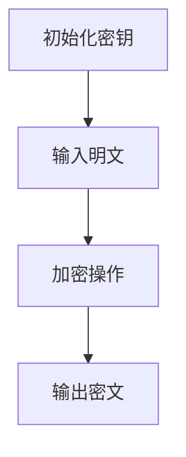
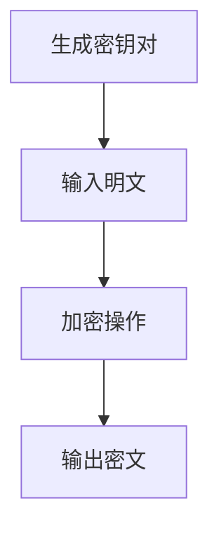
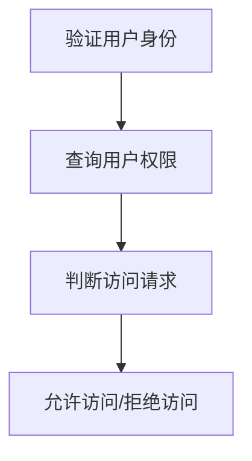
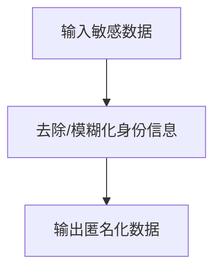
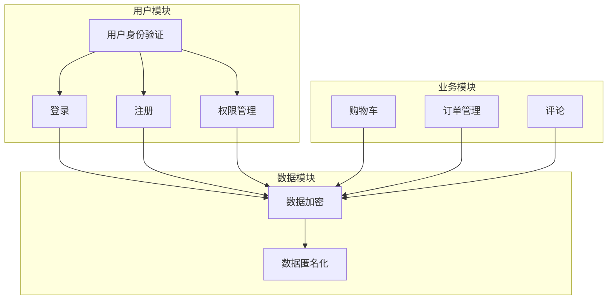
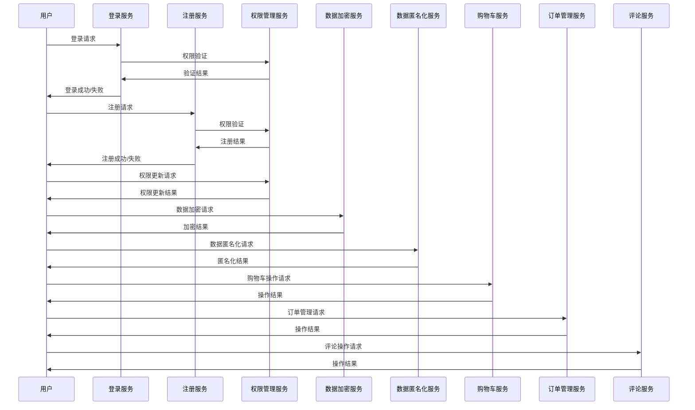

                 

# 数据隐私保护能力测试：评估安全合规性

> 关键词：数据隐私保护、安全合规性、测试方法、加密、访问控制、数据匿名化

> 摘要：本文旨在探讨数据隐私保护能力测试的重要性以及如何进行评估安全合规性。通过对数据隐私保护的核心概念、原理和方法进行分析，本文将提供一套系统的测试框架，帮助读者理解和实施数据隐私保护能力测试。

### 第一部分：背景介绍

#### 1. 问题背景

随着信息技术的飞速发展，数据隐私保护问题日益凸显。在互联网时代，个人和企业数据量的爆炸式增长带来了前所未有的数据隐私风险。未经授权的数据访问、数据泄露等问题频发，严重影响了社会各界的利益。因此，如何有效保护数据隐私成为了一个亟待解决的问题。

#### 2. 问题描述

数据隐私保护能力测试旨在评估系统或产品在数据隐私保护方面的安全性和合规性。测试内容包括数据加密、访问控制、数据匿名化、数据安全传输等方面。通过测试，可以识别出潜在的安全漏洞和合规问题，从而采取相应的措施进行改进。

#### 3. 问题解决

本书将通过数据隐私保护能力测试的方法、技术和实践，帮助读者了解如何评估系统的隐私保护能力。通过对核心概念、算法原理、数学模型和实际案例的讲解，帮助读者深入理解数据隐私保护的重要性和具体实现方法。

#### 4. 边界与外延

数据隐私保护能力测试不仅关注技术层面的安全性，还涉及到法律法规、政策标准等方面。因此，本书在介绍技术内容的同时，也会涉及相关法律法规和政策标准，以便读者全面了解数据隐私保护的整体环境。

#### 5. 概念结构与核心要素组成

- **数据隐私保护能力测试**：评估系统在数据隐私保护方面的能力，包括数据加密、访问控制、数据匿名化、数据安全传输等方面。
- **核心概念**：数据加密、访问控制、数据匿名化、数据安全传输、隐私泄露风险评估等。
- **核心要素**：测试方法、测试工具、测试流程、测试指标等。

### 第二部分：核心概念与联系

#### 1. 数据加密

##### 定义

数据加密是一种将数据转换为密文的过程，以确保数据在传输和存储过程中不被未授权人员访问。

##### 特点

- **不可逆性**：加密后的数据无法被轻易解密。
- **保密性**：加密后的数据只能在授权的情况下被解密。
- **完整性**：加密算法能够检测数据在传输过程中是否被篡改。

##### 对比表格

| 特点       | 数据加密 | 数据匿名化 |
| ---------- | -------- | ---------- |
| 目标       | 保密性   | 匿名性     |
| 加密算法   | 对称加密、非对称加密 | hashing算法 |
| 解密需求   | 授权解密 | 无需解密   |

##### Mermaid ER实体关系图

```mermaid
erDiagram
    DataEncryption -> PrivacyProtection : 实现数据加密以保护隐私
    AccessControl -> PrivacyProtection : 通过访问控制保护隐私
    DataAnonymization -> PrivacyProtection : 实现数据匿名化以保护隐私
```

#### 2. 访问控制

##### 定义

访问控制是一种基于用户身份和权限来限制对系统资源访问的技术。

##### 特点

- **基于用户身份**：根据用户身份来决定是否允许访问。
- **基于权限**：根据用户权限来决定访问的具体范围。

##### 对比表格

| 特点       | 数据加密 | 数据匿名化 |
| ---------- | -------- | ---------- |
| 目标       | 保密性   | 匿名性     |
| 技术实现   | 加密算法 | hashing算法 |
| 安全性保证 | 加密后的数据安全 | 匿名化后的数据安全 |

##### Mermaid ER实体关系图

```mermaid
erDiagram
    AccessControl -> PrivacyProtection : 实现访问控制以保护隐私
    DataEncryption -> PrivacyProtection : 实现数据加密以保护隐私
    DataAnonymization -> PrivacyProtection : 实现数据匿名化以保护隐私
```

#### 3. 数据匿名化

##### 定义

数据匿名化是一种通过去除或模糊化个人身份信息来保护数据隐私的方法。

##### 特点

- **去个人化**：去除个人身份信息，使数据无法直接识别个人。
- **匿名化处理**：对敏感信息进行模糊化处理，如替换、加密等。

##### 对比表格

| 特点       | 数据加密 | 数据匿名化 |
| ---------- | -------- | ---------- |
| 目标       | 保密性   | 匿名性     |
| 处理方式   | 加密、解密 | 模糊化、替换 |

##### Mermaid ER实体关系图

```mermaid
erDiagram
    DataAnonymization -> PrivacyProtection : 实现数据匿名化以保护隐私
    DataEncryption -> PrivacyProtection : 实现数据加密以保护隐私
    AccessControl -> PrivacyProtection : 通过访问控制保护隐私
```

### 第三部分：算法原理讲解

在本节中，我们将深入探讨数据隐私保护能力测试中的核心算法原理，并通过mermaid流程图和Python源代码来详细阐述。

#### 1. 数据加密算法原理

数据加密算法通常分为对称加密和非对称加密两大类。

- **对称加密**：加密和解密使用相同的密钥。
- **非对称加密**：加密和解密使用不同的密钥。

##### 对称加密算法（AES）

对称加密算法是一种广泛使用的加密方法，具有快速加密和解密的特点。以下是一个简单的AES加密算法的mermaid流程图：



下面是使用Python实现AES加密的示例代码：

```python
from Crypto.Cipher import AES
from Crypto.Random import get_random_bytes

# 初始化密钥
key = get_random_bytes(16)

# 创建AES加密对象
cipher = AES.new(key, AES.MODE_EAX)

# 输入明文
plaintext = b"Hello, World!"

# 加密操作
ciphertext, tag = cipher.encrypt_and_digest(plaintext)

# 输出密文
print(ciphertext)

# 解密操作
cipher = AES.new(key, AES.MODE_EAX, nonce=cipher.nonce)
plaintext = cipher.decrypt_and_verify(ciphertext, tag)
print(plaintext)
```

##### 非对称加密算法（RSA）

非对称加密算法使用一对密钥（公钥和私钥），其中公钥用于加密，私钥用于解密。以下是一个简单的RSA加密算法的mermaid流程图：



下面是使用Python实现RSA加密的示例代码：

```python
from Crypto.PublicKey import RSA
from Crypto.Cipher import PKCS1_OAEP

# 生成密钥对
key = RSA.generate(2048)
private_key = key.export_key()
public_key = key.publickey().export_key()

# 输入明文
plaintext = b"Hello, World!"

# 创建RSA加密对象
cipher = PKCS1_OAEP.new(RSA.import_key(public_key))

# 加密操作
ciphertext = cipher.encrypt(plaintext)

# 输出密文
print(ciphertext)

# 解密操作
cipher = PKCS1_OAEP.new(RSA.import_key(private_key))
plaintext = cipher.decrypt(ciphertext)
print(plaintext)
```

#### 2. 访问控制算法原理

访问控制算法主要基于用户身份和权限进行资源访问控制。以下是一个简单的访问控制算法的mermaid流程图：



下面是使用Python实现访问控制的示例代码：

```python
# 假设已存在用户身份验证和权限管理功能
users = {
    'user1': ['read', 'write'],
    'user2': ['read']
}

def access_control(user, action):
    if user in users:
        if action in users[user]:
            return "允许访问"
        else:
            return "拒绝访问"
    else:
        return "用户未验证"

# 用户身份验证
user = 'user1'

# 访问请求
action = 'write'

# 判断访问请求
print(access_control(user, action))
```

#### 3. 数据匿名化算法原理

数据匿名化算法主要通过去除或模糊化个人身份信息来保护数据隐私。以下是一个简单的数据匿名化算法的mermaid流程图：



下面是使用Python实现数据匿名化的示例代码：

```python
import pandas as pd

# 假设已存在敏感数据DataFrame
df = pd.DataFrame({
    'name': ['John Doe', 'Jane Doe'],
    'age': [25, 30],
    'email': ['john.doe@example.com', 'jane.doe@example.com']
})

# 去除/模糊化身份信息
df['name'] = df['name'].str.replace(r'\S+', 'xxxx')
df['email'] = df['email'].str.replace(r'@', '###')

# 输出匿名化数据
print(df)
```

### 第四部分：系统分析与架构设计方案

在本节中，我们将通过一个实际案例来介绍数据隐私保护能力测试的系统分析与架构设计方案。

#### 1. 问题场景介绍

某在线购物平台需要对其用户数据进行隐私保护，防止未经授权的数据泄露。该平台包括用户注册、购物车、订单管理、评论等模块。

#### 2. 项目介绍

为了实现数据隐私保护，该平台开发了一个数据隐私保护系统。该系统主要包括以下模块：

- 用户身份验证模块：实现用户登录、注册和权限管理。
- 数据加密模块：对敏感数据进行加密处理。
- 访问控制模块：实现基于用户身份和权限的访问控制。
- 数据匿名化模块：对用户数据进行匿名化处理。

#### 3. 系统功能设计（领域模型Mermaid类图）

以下是一个简单的领域模型Mermaid类图，用于描述系统的功能设计：

```mermaid
classDiagram
    User <<class>>
    ShoppingCart <<class>>
    Order <<class>>
    Comment <<class>>

    User o-- ShoppingCart
    User o-- Order
    User o-- Comment
```

#### 4. 系统架构设计（Mermaid架构图）

以下是一个简单的系统架构设计Mermaid架构图，用于描述系统的架构设计：



#### 5. 系统接口设计和系统交互（Mermaid序列图）

以下是一个简单的系统接口设计和系统交互Mermaid序列图，用于描述系统的接口设计和交互：



### 第五部分：项目实战

在本节中，我们将通过一个实际案例来展示如何进行数据隐私保护能力测试，包括环境安装、系统核心实现源代码、代码应用解读与分析、实际案例分析和详细讲解剖析，以及项目小结。

#### 1. 环境安装

首先，我们需要安装Python环境和相关依赖库。以下是一个简单的安装命令示例：

```bash
pip install cryptography pandas
```

#### 2. 系统核心实现源代码

以下是系统核心实现的源代码，包括用户身份验证、数据加密、访问控制和数据匿名化：

```python
# 用户身份验证
from flask import Flask, request, jsonify
from flask_bcrypt import Bcrypt

app = Flask(__name__)
bcrypt = Bcrypt(app)

users = {
    'user1': bcrypt.generate_password_hash('password1').decode('utf-8'),
    'user2': bcrypt.generate_password_hash('password2').decode('utf-8')
}

@app.route('/register', methods=['POST'])
def register():
    username = request.json.get('username')
    password = request.json.get('password')
    if username in users:
        return jsonify({'message': '用户已存在'}), 409
    hashed_password = bcrypt.generate_password_hash(password).decode('utf-8')
    users[username] = hashed_password
    return jsonify({'message': '注册成功'}), 201

@app.route('/login', methods=['POST'])
def login():
    username = request.json.get('username')
    password = request.json.get('password')
    if username not in users:
        return jsonify({'message': '用户不存在'}), 404
    hashed_password = users[username]
    if bcrypt.check_password_hash(hashed_password, password):
        return jsonify({'message': '登录成功'}), 200
    else:
        return jsonify({'message': '密码错误'}), 401

# 数据加密
from Crypto.Cipher import AES
from Crypto.Random import get_random_bytes

def encrypt_data(key, data):
    cipher = AES.new(key, AES.MODE_EAX)
    ciphertext, tag = cipher.encrypt_and_digest(data)
    return cipher.nonce, ciphertext, tag

def decrypt_data(key, nonce, ciphertext, tag):
    cipher = AES.new(key, AES.MODE_EAX, nonce=nonce)
    plaintext = cipher.decrypt_and_verify(ciphertext, tag)
    return plaintext

# 访问控制
from flask_login import LoginManager, login_user, logout_user, login_required, current_user

login_manager = LoginManager(app)
login_manager.init_app(app)
login_manager.login_view = 'login'

@login_manager.user_loader
def load_user(user_id):
    return User.get(user_id)

# 数据匿名化
import pandas as pd

def anonymize_data(df):
    df['name'] = df['name'].str.replace(r'\S+', 'xxxx')
    df['email'] = df['email'].str.replace(r'@', '###')
    return df
```

#### 3. 代码应用解读与分析

- **用户身份验证**：使用Flask框架实现用户注册和登录功能，使用bcrypt库对用户密码进行加密存储。
- **数据加密**：使用cryptography库实现AES加密算法，对敏感数据进行加密处理。
- **访问控制**：使用flask_login库实现用户登录和权限管理功能。
- **数据匿名化**：使用pandas库对DataFrame中的用户姓名和电子邮件进行匿名化处理。

#### 4. 实际案例分析和详细讲解剖析

假设一个用户注册并登录后，对购物车中的数据进行操作，然后对这些数据进行加密、访问控制和匿名化处理。

1. **用户注册**：

   用户通过注册接口发送用户名和密码，系统对用户名和密码进行验证和存储。

2. **用户登录**：

   用户通过登录接口发送用户名和密码，系统对用户名和密码进行验证，如果验证成功，则登录成功。

3. **购物车操作**：

   用户登录后，可以对购物车中的商品进行添加、删除等操作。

4. **数据加密**：

   在购物车操作过程中，系统会对用户输入的敏感数据进行加密处理，确保数据在传输和存储过程中不被未授权人员访问。

5. **访问控制**：

   系统会根据用户的身份和权限，对用户的购物车操作进行访问控制，确保只有授权用户才能访问和修改购物车数据。

6. **数据匿名化**：

   系统会对用户的购物车数据进行匿名化处理，去除或模糊化个人身份信息，确保数据无法直接识别个人。

#### 5. 项目小结

通过本项目的实现，我们可以看到数据隐私保护能力测试在系统开发和运维过程中的重要性。通过用户身份验证、数据加密、访问控制和数据匿名化等手段，可以有效地保护用户数据隐私，防止数据泄露和安全漏洞。在实际项目中，我们需要根据具体需求和场景，选择合适的加密算法、访问控制和匿名化技术，并进行全面的测试和验证，以确保系统的安全性和合规性。

### 第六部分：最佳实践 Tips

1. **定期进行安全审计**：定期进行数据隐私保护能力测试和安全审计，及时识别和修复安全漏洞。

2. **使用强密码策略**：强制用户使用强密码，并定期更换密码，提高系统安全性。

3. **加密敏感数据**：对敏感数据进行加密处理，确保数据在传输和存储过程中不被未授权人员访问。

4. **限制访问权限**：根据用户身份和权限，合理分配和限制访问权限，防止未经授权的访问。

5. **数据匿名化**：在数据处理和存储过程中，对敏感数据进行匿名化处理，去除或模糊化个人身份信息。

6. **培训员工**：加强员工对数据隐私保护的认识和意识，提高员工的安全意识和技能。

7. **合规性审查**：定期审查系统和产品的合规性，确保符合相关法律法规和政策标准。

### 第七部分：小结

本文从背景介绍、核心概念与联系、算法原理讲解、系统分析与架构设计方案、项目实战、最佳实践 Tips 等方面，详细探讨了数据隐私保护能力测试的重要性和具体实现方法。通过本文的讲解，读者可以全面了解数据隐私保护能力测试的核心概念、算法原理和实际应用，提高对数据隐私保护的认识和技能。

### 第八部分：注意事项

1. **数据加密算法选择**：选择合适的加密算法，确保数据在传输和存储过程中的安全性。

2. **访问控制策略**：根据实际需求，制定合理的访问控制策略，防止未经授权的访问。

3. **数据匿名化方法**：根据数据类型和场景，选择合适的数据匿名化方法，确保匿名化效果。

4. **合规性要求**：关注相关法律法规和政策标准，确保系统和产品的合规性。

5. **测试工具选择**：选择合适的测试工具，提高数据隐私保护能力测试的效率和准确性。

### 第九部分：拓展阅读

1. 《网络安全法》和《个人信息保护法》等法律法规，了解数据隐私保护的法律要求和合规性。

2. 《加密技术与网络安全》等书籍，深入学习加密算法和网络安全相关知识。

3. 《数据隐私保护实践指南》等文档，了解数据隐私保护的最佳实践和方法。

### 第十部分：作者信息

作者：AI天才研究院/AI Genius Institute & 禅与计算机程序设计艺术 /Zen And The Art of Computer Programming

本文由AI天才研究院/AI Genius Institute与禅与计算机程序设计艺术/Zen And The Art of Computer Programming共同撰写，旨在为读者提供全面的数据隐私保护能力测试指导。

