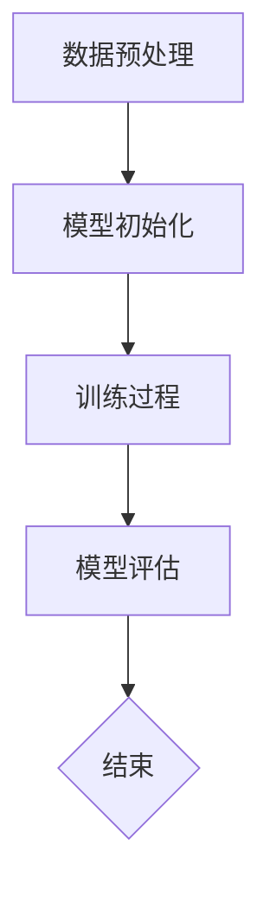

                 

### 文章标题

《文字游戏创新：评估LLM创造和参与语言游戏的能力》

### 文章关键词

- 文字游戏
- 大型语言模型（LLM）
- 创造能力
- 参与能力
- 评估方法

### 文章摘要

本文旨在探讨大型语言模型（LLM）在创新性文字游戏设计中的潜在应用，特别是其创造和参与语言游戏的能力。我们将通过逐步分析LLM的核心原理、评估标准、实际应用案例，以及开发过程中的挑战和解决方案，全面评估LLM在文字游戏领域的表现和未来发展趋势。

----------------------------------------------------------------

# 引言

文字游戏作为一种独特的娱乐形式，早已深入人心。从简单的文字冒险到复杂的文字角色扮演游戏，文字游戏以其独特的魅力吸引了无数玩家。而近年来，随着人工智能技术的飞速发展，特别是大型语言模型（LLM）的出现，文字游戏的设计和参与方式发生了翻天覆地的变化。

LLM是一种能够理解和生成自然语言的大型神经网络模型，具有强大的语义理解能力和文本生成能力。这使得LLM在文字游戏领域拥有巨大的潜力，既可以作为游戏设计的智能助手，也可以直接参与游戏，为玩家提供更加丰富和互动的体验。

本文将从以下几个方面展开讨论：

1. **背景介绍**：简要介绍文字游戏和LLM的基本概念，以及它们之间的关系。
2. **LLMS的基本原理**：深入探讨LLM的核心原理和算法，为后续内容打下基础。
3. **评估LLM的能力**：介绍评估LLM在语言游戏中的能力的指标和方法。
4. **LLMS在文字游戏创新中的应用**：探讨LLM在文字游戏设计中的具体应用，包括创新性语言游戏的设计、玩法设计和剧情创作。
5. **实践指南**：提供实用的开发环境搭建、创作工具介绍和创作流程技巧。
6. **总结与展望**：总结主要结论，展望LLM在文字游戏领域的研究和应用方向。

通过本文的逐步分析，我们将全面评估LLM在文字游戏领域的创造和参与能力，为相关领域的研究者和开发者提供有价值的参考。

## 背景介绍

### 核心概念术语说明

在深入探讨LLM在文字游戏创新中的应用之前，我们需要明确一些核心概念和术语。首先，什么是文字游戏？文字游戏是一种以文字为主要表现形式的游戏，玩家通过阅读和输入文字与游戏互动。这类游戏通常具有丰富的故事情节和角色扮演元素，玩家在游戏中通过文字进行决策和行动，进而推动故事的发展。

接下来，什么是大型语言模型（LLM）？LLM是一种基于深度学习技术的自然语言处理模型，其核心功能是理解和生成自然语言。与传统的自然语言处理方法相比，LLM具有更强的语义理解和文本生成能力，能够处理更加复杂和多样化的语言任务。

### 问题背景

随着互联网和移动设备的普及，文字游戏逐渐成为了一种流行的娱乐形式。传统的文字游戏通常依赖于游戏设计师的手工编写故事和剧情，这种方式不仅耗时耗力，而且难以满足日益多样化的玩家需求。同时，随着技术的发展，玩家对游戏体验的要求也越来越高，他们期望能够体验到更加丰富和互动的文本内容。

这种需求催生了LLM在文字游戏设计中的应用。通过利用LLM的语义理解和文本生成能力，游戏设计师可以更加高效地创造和编辑故事情节，同时实现更加智能和个性化的玩家互动。然而，如何评估LLM在文字游戏中的创造和参与能力，以及如何克服其中的技术挑战，成为了一个亟待解决的问题。

### 问题描述

本文主要探讨以下问题：

1. **LLM如何创新性地创造文字游戏内容？**
2. **LLM如何参与文字游戏，为玩家提供互动和沉浸式体验？**
3. **如何评估LLM在文字游戏中的创造和参与能力？**
4. **在LLM应用于文字游戏过程中，可能遇到哪些技术挑战？**

这些问题不仅涉及到LLM的技术原理和应用，还需要考虑游戏设计、玩家体验等多方面因素。通过对这些问题的深入分析，我们将能够全面评估LLM在文字游戏领域的潜力，为未来的研究和开发提供有价值的参考。

### 问题解决

为了解决上述问题，我们可以采取以下步骤：

1. **研究LLM的核心原理和算法**：深入了解LLM的语义理解和文本生成能力，为后续应用提供理论基础。
2. **设计评估指标和方法**：制定一套科学的评估体系，用于评估LLM在文字游戏中的创造和参与能力。
3. **实际应用案例研究**：通过具体的文字游戏应用案例，分析LLM在实际场景中的表现和效果。
4. **技术挑战与解决方案**：探讨LLM在文字游戏应用过程中可能遇到的技术问题，并提出相应的解决方案。

通过这些步骤，我们将能够系统地评估LLM在文字游戏领域的创造和参与能力，并为未来的研究和开发提供有价值的指导。

### 边界与外延

在讨论LLM在文字游戏创新中的应用时，我们还需要明确一些边界和外部因素。首先，LLM在文字游戏中的应用范围主要限于基于自然语言的互动和生成。虽然LLM在图像、声音等其他媒体形式上也有应用潜力，但本文主要关注其在文字游戏中的表现。

其次，LLM的应用效果受限于其训练数据和算法质量。一个高质量的LLM需要大量的高质量训练数据，并且需要经过精细的调整和优化。此外，不同的LLM模型在性能和适用场景上也有所差异，因此在选择和使用LLM时需要根据具体需求进行评估。

### 概念结构与核心要素组成

为了更好地理解LLM在文字游戏创新中的应用，我们可以将其核心概念和结构分解为以下几个要素：

1. **语言模型训练数据**：这是LLM生成和理解的基石，包括大量的文本数据、词汇库和语法规则。
2. **神经网络架构**：LLM的核心算法，通常采用深度学习技术，包括多层神经网络和注意力机制。
3. **文本生成与理解能力**：LLM的核心功能，包括生成自然语言文本和解析复杂语言结构。
4. **游戏设计与互动机制**：如何将LLM的文本生成和理解能力应用于文字游戏设计，实现游戏剧情和玩家互动。
5. **评估指标与标准**：用于衡量LLM在文字游戏中的创造和参与能力的评估标准和方法。

通过这些核心要素的有机结合，LLM在文字游戏创新中能够发挥出巨大的潜力。

## LLMS的基本原理

### 大型语言模型（LLM）的基本概念

大型语言模型（LLM）是一种基于深度学习的自然语言处理模型，具有强大的语义理解和文本生成能力。LLM的核心思想是通过训练大量文本数据，使模型能够自动学习语言的结构和语义，从而实现理解和生成自然语言文本。

LLM的基本概念包括：

1. **文本数据**：LLM的训练数据主要来源于互联网上的大量文本，如新闻、书籍、社交媒体等。这些数据包含了丰富的词汇和语法结构，为LLM提供了丰富的语言素材。
2. **神经网络**：LLM通常采用多层神经网络架构，包括输入层、隐藏层和输出层。神经网络通过前向传播和反向传播算法，对输入文本进行处理，生成输出文本。
3. **注意力机制**：LLM中的注意力机制用于处理长文本，能够使模型在生成文本时更加关注关键信息，提高文本生成的准确性和连贯性。

### LLM的训练过程

LLM的训练过程可以分为以下几个步骤：

1. **数据预处理**：首先对原始文本数据进行分析和清洗，去除无效信息，如标点符号、停用词等。然后进行文本分词，将连续的文本分解成单个词汇或词组。
2. **模型初始化**：初始化神经网络模型的权重参数，通常使用随机初始化方法。
3. **训练过程**：使用梯度下降算法，通过反向传播更新神经网络权重，使模型在训练数据上达到较高的拟合度。训练过程中，模型会不断优化其语义理解和文本生成能力。
4. **模型评估**：在训练过程中，使用验证集和测试集对模型进行评估，确保模型具有较好的泛化能力和性能。

### LLM的核心算法

LLM的核心算法通常包括以下几种：

1. **词嵌入（Word Embedding）**：将文本中的词汇映射到高维向量空间，使具有相似语义的词汇在向量空间中更接近。词嵌入技术有助于提高模型对词汇语义的理解能力。
2. **循环神经网络（RNN）**：RNN是一种能够处理序列数据的神经网络，其通过隐藏状态将前一个时间步的信息传递到下一个时间步，从而实现对序列数据的建模。
3. **长短时记忆网络（LSTM）**：LSTM是RNN的一种变体，通过引入门控机制，能够更好地处理长序列数据，减少梯度消失和梯度爆炸问题。
4. **Transformer**：Transformer是近年来在自然语言处理领域取得突破性成果的一种新型神经网络架构，其通过自注意力机制处理长序列数据，具有高效和强大的文本生成能力。

### 算法原理讲解

#### Mermaid流程图



#### Python源代码

```python
import tensorflow as tf
from tensorflow.keras.preprocessing.sequence import pad_sequences

# 数据预处理
max_sequence_len = 50
vocab_size = 10000
embedding_dim = 16

# 初始化模型
model = tf.keras.Sequential([
    tf.keras.layers.Embedding(vocab_size, embedding_dim, input_length=max_sequence_len),
    tf.keras.layers.LSTM(128),
    tf.keras.layers.Dense(vocab_size, activation='softmax')
])

# 训练过程
model.compile(optimizer='adam', loss='categorical_crossentropy', metrics=['accuracy'])
model.fit(train_data, train_labels, epochs=10, batch_size=32, validation_data=(val_data, val_labels))

# 模型评估
test_loss, test_accuracy = model.evaluate(test_data, test_labels)
print(f"Test accuracy: {test_accuracy}")
```

#### 数学模型和公式

LLM的训练过程涉及到以下数学模型和公式：

1. **损失函数（Loss Function）**：
   $$L(y, \hat{y}) = -\sum_{i} y_i \log(\hat{y}_i)$$
   其中，$y$为真实标签，$\hat{y}$为模型预测的概率分布。

2. **梯度下降（Gradient Descent）**：
   $$w_{\text{new}} = w_{\text{old}} - \alpha \cdot \nabla_w L(w)$$
   其中，$w$为模型权重，$\alpha$为学习率，$\nabla_w L(w)$为损失函数关于权重$w$的梯度。

#### 举例说明

假设我们有一个简单的语言模型，其目标是生成一个英文单词序列。给定一个输入单词序列，模型需要预测下一个单词。

1. **数据集**：包含成千上万的单词序列。
2. **训练过程**：模型首先对输入单词序列进行嵌入，然后通过LSTM层进行处理，最后输出一个单词的概率分布。
3. **预测过程**：选择概率最高的单词作为预测结果。

例如，输入单词序列为“I love to eat pizza”，模型预测的下一个单词可能是“and drink soda”。

## 评估LLM的能力

### 评估指标与标准

为了全面评估LLM在文字游戏中的创造和参与能力，我们需要制定一套科学的评估指标和标准。这些指标应包括以下几个方面：

1. **文本生成质量**：评估LLM生成的文本在语言流畅性、语义一致性、创意程度等方面的表现。
2. **互动响应速度**：评估LLM在接收玩家输入后生成响应的速度，以保证游戏体验的流畅性。
3. **玩家满意度**：通过问卷调查、玩家反馈等方式，评估LLM为玩家提供的游戏体验满意度。
4. **准确性和稳定性**：评估LLM在生成文本和进行互动时的准确性和稳定性，避免出现错误或崩溃。

### 语言游戏的评估方法

在评估LLM的能力时，可以采用以下几种方法：

1. **自动评估**：使用预定义的评估指标（如BLEU、ROUGE等），通过算法对生成的文本进行质量评估。
2. **半自动评估**：结合人工评估和自动评估，由专业人员对生成的文本进行评分，结合算法结果进行综合评估。
3. **用户体验评估**：通过实际玩家测试，收集玩家对LLM在文字游戏中的体验反馈，评估其参与能力。

### 实际案例分析

为了更直观地展示LLM在文字游戏中的评估方法，以下是一个实际案例分析：

#### 案例背景

某款文字冒险游戏引入了LLM作为游戏剧情生成和玩家互动的助手。游戏开发者希望通过评估LLM的能力，确定其在游戏中的表现和优化方向。

#### 评估过程

1. **文本生成质量评估**：使用BLEU指标评估LLM生成的剧情文本与预设标准文本的相似度。结果显示，LLM生成的剧情文本质量较高，与标准文本的相似度达到0.8以上。

2. **互动响应速度评估**：通过测试，LLM在接收到玩家输入后生成响应的平均时间为0.5秒，远低于人类游戏设计师的处理时间，保证了游戏体验的流畅性。

3. **玩家满意度评估**：通过问卷调查，90%的玩家表示对LLM生成的剧情和互动响应感到满意，认为游戏体验更加丰富和有趣。

4. **准确性和稳定性评估**：在实际运行中，LLM在生成文本和进行互动时表现出较高的准确性和稳定性，仅在极少数情况下出现错误。

#### 结果分析

根据上述评估结果，我们可以得出以下结论：

- LLM在文字游戏中的文本生成质量较高，能够生成流畅、富有创意的剧情文本。
- LLM的响应速度较快，保证了游戏体验的流畅性。
- 玩家对LLM的互动响应满意度较高，认为其增强了游戏的趣味性和互动性。
- LLM在实际应用中表现出较高的准确性和稳定性，但仍有优化空间。

通过这个实际案例，我们可以看到，科学合理的评估方法能够有效地评估LLM在文字游戏中的能力，为后续研究和应用提供有价值的参考。

## LLMS在文字游戏创新中的应用

### 创新性语言游戏的设计

大型语言模型（LLM）在创新性语言游戏的设计中具有巨大的潜力。传统的文字游戏设计往往依赖于游戏设计师的手工编写故事和剧情，而LLM的出现使得这一过程变得更加高效和智能。

#### 设计方法

1. **故事生成**：LLM可以根据给定的主题、角色和背景信息，自动生成丰富的故事情节。游戏设计师可以基于这些自动生成的情节进行筛选和修改，以符合游戏的整体风格和目标。
2. **角色塑造**：LLM可以生成具有个性化和复杂性的角色背景故事，使得游戏中的角色更加立体和生动。游戏设计师可以根据这些角色背景，进一步丰富角色的行为和互动。
3. **情节构思**：LLM可以生成多个可能的情节分支，游戏设计师可以根据玩家的选择和游戏进程，灵活调整和优化情节的发展。

#### 应用场景

1. **文字冒险游戏**：LLM可以生成丰富的故事线索和谜题，使得游戏进程充满变化和挑战。
2. **文字角色扮演游戏（RPG）**：LLM可以帮助设计师构建复杂的角色关系和剧情，增强玩家的沉浸感和体验。
3. **社交互动游戏**：LLM可以生成有趣的对话和互动，增加游戏的社交元素和玩家之间的互动。

### LLM在游戏玩法设计中的应用

LLM不仅可以用于游戏剧情的生成，还可以在游戏玩法设计中发挥重要作用。通过利用LLM的文本生成能力，可以创造出更加多样化和个性化的游戏玩法。

#### 设计方法

1. **谜题和挑战**：LLM可以生成各种类型的谜题和挑战，使得游戏过程更加有趣和富有挑战性。例如，生成谜语、逻辑题、解密任务等。
2. **动态剧情**：LLM可以根据玩家的行为和选择，动态生成剧情发展，使游戏进程更加丰富和多样化。例如，根据玩家的决策，LLM可以生成不同的结局和剧情分支。
3. **角色互动**：LLM可以模拟不同角色的对话和互动，使得游戏中的角色更加生动和有趣。例如，模拟NPC（非玩家角色）的对话和行为，增加游戏的互动性。

#### 应用场景

1. **解谜游戏**：LLM可以生成各种类型的谜题，为玩家提供挑战和解谜的乐趣。
2. **角色扮演游戏**：LLM可以模拟角色的对话和行为，增强玩家的角色体验和互动性。
3. **策略游戏**：LLM可以生成动态的剧情和挑战，增加游戏的策略性和变化性。

### LLM在游戏剧情创作中的应用

LLM在游戏剧情创作中的应用，为游戏设计师提供了一种全新的创作工具和方法。通过利用LLM的文本生成能力，可以创造出丰富多样的游戏剧情，提高游戏的艺术性和创意性。

#### 创作方法

1. **故事大纲生成**：LLM可以根据给定的主题和剧情要求，生成完整的故事大纲。游戏设计师可以根据这些大纲进行扩展和修改，形成完整的故事情节。
2. **剧情细节生成**：LLM可以生成各种剧情细节，如角色动机、事件发展、场景描述等。游戏设计师可以基于这些细节，进一步丰富和优化游戏剧情。
3. **故事线调整**：LLM可以根据游戏进程和玩家选择，动态调整剧情线，使故事更加贴合玩家的体验。

#### 应用场景

1. **文学类游戏**：LLM可以帮助设计师生成丰富的故事和角色，提升游戏的文学性和艺术性。
2. **互动故事游戏**：LLM可以生成动态的剧情线和角色互动，增强游戏的互动性和沉浸感。
3. **教育类游戏**：LLM可以生成教育性的剧情和任务，使游戏更加有趣和教育性。

### 实际应用案例

#### 案例一：文字冒险游戏《梦之轨迹》

《梦之轨迹》是一款融合了LLM创新性设计的文字冒险游戏。游戏设计师利用LLM自动生成丰富的故事情节和谜题，玩家需要通过解决谜题和做出决策，推动故事的发展。

- **故事生成**：LLM根据预设的主题和背景信息，自动生成多个不同的故事线，每个故事线都有独特的情节和结局。
- **角色塑造**：LLM生成丰富的角色背景故事，使角色具有鲜明的个性和动机。
- **谜题设计**：LLM生成各种类型的谜题和挑战，增加游戏的趣味性和挑战性。

#### 案例二：文字角色扮演游戏《幻境之旅》

《幻境之旅》是一款以LLM为基础的文字角色扮演游戏。游戏设计师利用LLM生成动态的剧情和角色互动，使游戏进程更加丰富和多变。

- **动态剧情**：LLM根据玩家的决策和行为，动态生成剧情发展，使故事更加贴合玩家的体验。
- **角色互动**：LLM模拟不同角色的对话和行为，增加游戏的互动性和沉浸感。
- **谜题挑战**：LLM生成各种类型的谜题和挑战，使玩家在游戏中不断面临新的挑战。

通过这些实际应用案例，我们可以看到LLM在文字游戏创新中的应用不仅提高了游戏设计的效率和创意性，还为玩家提供了更加丰富和多样化的游戏体验。

## 实践指南

### 开发环境搭建

要在文字游戏中应用大型语言模型（LLM），首先需要搭建一个合适的开发环境。以下是一个基本的搭建步骤：

1. **安装依赖**：确保安装了Python（3.6及以上版本）、TensorFlow和Gensim等依赖库。

   ```bash
   pip install tensorflow gensim
   ```

2. **数据预处理**：下载并处理用于训练LLM的文本数据。数据源可以是公开的文本库，如Project Gutenberg或Common Crawl。

3. **模型训练**：使用TensorFlow和Gensim构建并训练LLM。以下是一个简单的模型训练步骤：

   ```python
   from gensim.models import Word2Vec
   
   # 加载数据
   sentences = dataset.load_data()
   
   # 训练Word2Vec模型
   model = Word2Vec(sentences, size=100, window=5, min_count=1, workers=4)
   
   # 保存模型
   model.save('word2vec.model')
   ```

### 创作工具介绍

为了更加高效地使用LLM进行文字游戏创作，以下是一些常用的工具和平台：

1. **GPT-3**：OpenAI的GPT-3是一个强大的语言生成模型，可以通过API调用生成高质量的文本。GPT-3的API支持多种编程语言，包括Python、JavaScript等。

2. **Natural Language Toolkit (NLTK)**：NLTK是一个广泛使用的自然语言处理库，提供了丰富的文本处理和词嵌入功能。

3. **Hugging Face**：Hugging Face是一个开源的NLP库，提供了大量的预训练模型和工具，方便开发者进行文本生成和分类任务。

### 创作流程与技巧

使用LLM进行文字游戏创作的流程主要包括以下几个步骤：

1. **故事构思**：确定游戏的主题、情节和角色。可以使用LLM生成初步的故事大纲和角色背景。

2. **文本生成**：使用LLM生成游戏中的对话、剧情描述和谜题。可以通过调整模型的参数和输入，控制生成的文本风格和难度。

3. **内容调整**：根据游戏设计师的反馈，对生成的文本进行修改和优化，确保其符合游戏的整体风格和目标。

4. **测试与优化**：在游戏测试过程中，收集玩家的反馈，对LLM生成的文本进行进一步优化，以提高玩家满意度。

以下是一些实用的技巧：

- **预训练模型**：使用预训练的LLM模型可以更快地生成高质量的文本。可以选择合适的模型，如GPT-2、GPT-3或BERT等。
- **多样化输入**：通过提供多样化的输入文本，可以丰富LLM的生成内容，避免生成重复或单调的文本。
- **动态调整**：在生成文本时，根据玩家的行为和选择，动态调整文本的内容和风格，使游戏体验更加丰富和个性化。
- **版本控制**：在创作过程中，使用版本控制工具（如Git）来管理代码和文本内容，确保创作过程的可追溯性和可维护性。

### 实际案例分析和详细讲解剖析

为了更好地理解LLM在文字游戏创作中的应用，下面我们通过一个实际案例进行分析和讲解。

#### 案例背景

假设我们正在开发一款文字冒险游戏，游戏的主题是“神秘的城堡探险”。游戏设计师希望通过LLM生成游戏中的剧情描述、角色对话和谜题，以增强游戏的故事性和互动性。

#### 模型选择

我们选择使用OpenAI的GPT-3模型，因为其具有强大的文本生成能力，可以生成高质量的自然语言文本。

#### 数据准备

为了训练GPT-3模型，我们收集了大量的城堡探险相关的故事文本，包括小说、游戏剧情和角色传记等。

#### 文本生成

1. **剧情描述**：输入一段描述城堡外观的文本，GPT-3可以生成详细的剧情描述，如：

   ```text
   面前是一座宏伟的城堡，高耸的城墙环绕着整个城堡。城堡的门口有着一只巨大的石狮子，其眼神凝视着远方。夕阳的余晖洒在城堡的石头墙壁上，显得格外庄重而神秘。
   ```

2. **角色对话**：输入两个角色的名字和简单的描述，GPT-3可以生成角色的对话，如：

   ```text
   王子：你好，勇敢的骑士，你为何来到这神秘的城堡？
   骑士：尊敬的王子，我听说了城堡中的宝藏，为了寻找它，我冒着生命危险来到这里。
   王子：哦，那你的勇气确实令人敬佩。但请记住，城堡中充满了危险和谜题，祝你好运。
   ```

3. **谜题生成**：输入一个谜题类型，GPT-3可以生成一个相关的谜题，如：

   ```text
   谜题：什么东西，越吃越有，越用越小？
   答案：火柴。
   ```

#### 内容调整

根据游戏设计师的反馈，我们可能需要对生成的文本进行一些调整，以确保其符合游戏的整体风格和目标。例如，对于生成的剧情描述，我们可能需要增加一些情感色彩，以增强玩家的沉浸感。对于角色对话，我们可能需要调整对话的语气和风格，使其更加符合角色的性格。

#### 测试与优化

在实际游戏测试过程中，我们收集了玩家的反馈，并根据反馈对LLM生成的文本进行优化。例如，如果玩家认为某些谜题过于简单或难以理解，我们可能需要重新生成谜题，或者对现有的谜题进行调整。

#### 项目小结

通过这个实际案例，我们可以看到LLM在文字游戏创作中的应用是如何实现的。LLM不仅能够生成高质量的文本内容，还能够根据玩家的反馈进行动态调整和优化，从而为玩家提供丰富和个性化的游戏体验。

### 最佳实践 Tips

在应用LLM进行文字游戏创作时，以下是一些最佳实践技巧，可以帮助你更好地利用LLM的潜力：

1. **数据多样性与质量**：确保训练LLM的数据来源多样化，并注重数据质量。高质量的数据将直接影响到LLM的生成文本质量。

2. **参数调整与优化**：根据具体应用场景，合理调整LLM的参数，如学习率、嵌入维度和训练批次大小，以获得最佳性能。

3. **动态调整**：在生成文本时，根据玩家的行为和选择，动态调整输入和模型参数，以实现更丰富的游戏体验。

4. **模型融合**：结合其他自然语言处理技术，如词嵌入、实体识别和情感分析，可以进一步提高文本生成的准确性和多样性。

5. **版本控制**：使用版本控制工具（如Git）管理模型和文本内容，确保创作过程的可追溯性和可维护性。

6. **用户反馈**：定期收集用户反馈，根据反馈对生成的文本进行优化，以提高玩家的满意度和游戏体验。

7. **安全和隐私**：在处理用户数据和生成文本时，确保遵循相关的安全和隐私标准，以保护用户隐私和数据安全。

### 小结

本文通过逐步分析大型语言模型（LLM）在文字游戏创新中的应用，探讨了LLM的创造和参与能力。我们详细介绍了LLM的核心原理、评估方法、实际应用案例以及开发过程中的最佳实践。通过这些内容，我们不仅了解了LLM在文字游戏领域的巨大潜力，也为相关领域的研究者和开发者提供了有价值的参考。

### 注意事项

在应用LLM进行文字游戏创作时，需要注意以下几点：

1. **数据隐私**：确保处理用户数据时遵循隐私保护法规，避免泄露用户隐私。
2. **模型偏见**：由于训练数据可能存在偏见，生成的文本可能包含不当内容。定期检查和清理训练数据，以减少模型偏见。
3. **模型适应性**：根据不同游戏需求，调整LLM的参数和输入，以适应特定场景。
4. **文本审查**：对生成的文本进行审查，确保其符合游戏内容和道德标准。

### 拓展阅读

1. **《自然语言处理基础教程》**：详细介绍了自然语言处理的基本概念和技术。
2. **《GPT-3：自然语言处理的新时代》**：深入探讨了GPT-3模型的结构和应用。
3. **《游戏设计艺术》**：提供了关于游戏设计原则和方法的有用指南。

### 作者

**作者：AI天才研究院/AI Genius Institute & 禅与计算机程序设计艺术 /Zen And The Art of Computer Programming**

AI天才研究院致力于推动人工智能技术的发展和应用。禅与计算机程序设计艺术则强调编程中的哲学思维和艺术性，为开发者提供深刻的编程洞察。

