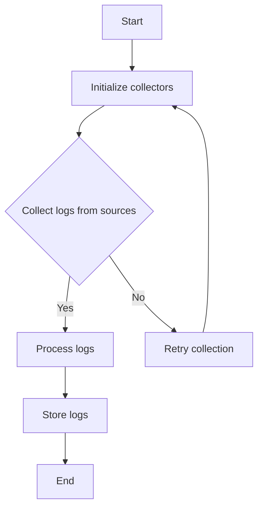
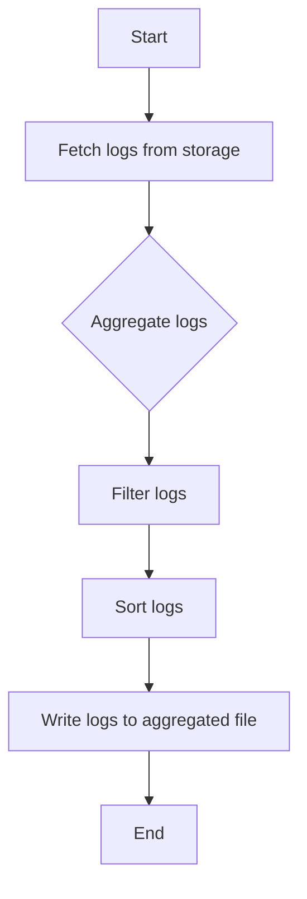
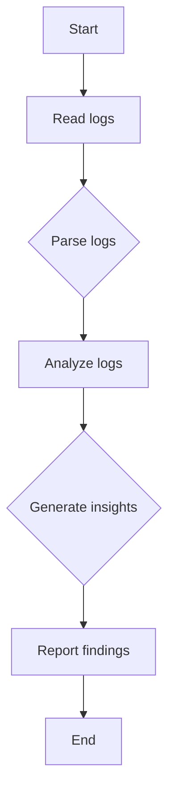

                 

。

## 引言与背景

### 1.1 问题背景

在现代信息技术领域，日志数据已成为系统中不可或缺的一部分。日志记录了系统运行过程中的各种事件和操作，对于诊断问题、优化性能、审计合规等具有重要价值。随着大数据和云计算技术的迅猛发展，日志数据量呈现爆发式增长，如何高效地管理这些日志数据成为了一个关键问题。

然而，对于使用大型语言模型（Large Language Models，LLM）的企业和应用开发者来说，日志管理更是面临着前所未有的挑战。LLM在自然语言处理、文本生成、对话系统等领域具有强大的能力，但其性能的发挥高度依赖于对日志数据的精确分析和理解。因此，如何集中化地管理和处理日志数据，以便于LLM的应用，成为了当前亟待解决的问题。

### 1.1.1 日志管理的重要性

日志管理的重要性体现在以下几个方面：

1. **故障诊断**：通过分析日志数据，可以快速定位系统故障点和异常行为，从而提高系统的稳定性和可用性。
2. **性能优化**：通过对日志数据的统计和分析，可以发现系统性能瓶颈，并针对性地进行优化。
3. **安全监控**：日志记录了系统的操作和事件，对于检测和防范安全威胁具有重要作用。
4. **合规审计**：许多行业和地区对日志记录有着严格的合规要求，完善的日志管理有助于满足这些要求。

### 1.1.2 LLM应用对日志管理的要求

LLM在日志管理中的应用，对日志数据的处理能力提出了更高的要求：

1. **实时性**：LLM需要实时处理日志数据，以便快速响应和分析系统事件。
2. **准确性**：LLM需要对日志数据进行精确的理解和分析，以确保诊断结果的准确性。
3. **可扩展性**：随着日志数据量的增长，LLM系统需要具备良好的可扩展性，以支持大规模数据处理的需要。
4. **自动化**：为了提高效率，LLM系统需要能够自动地处理日志数据，减少人工干预。

### 1.1.3 日志集中化的意义

日志集中化是指将来自不同系统和服务的日志数据统一收集和存储到集中化的日志平台，从而实现统一的日志管理和分析。日志集中化对于LLM应用具有重要意义：

1. **统一视图**：日志集中化提供了全局视图，使得LLM可以更全面地了解系统的运行状况。
2. **简化分析**：集中化的日志数据简化了日志分析的过程，提高了LLM的分析效率。
3. **提高准确性**：集中化的日志数据减少了数据冗余和错误，提高了LLM分析的准确性。
4. **降低成本**：日志集中化降低了硬件和维护成本，同时提高了资源利用率。

总之，日志集中化是LLM应用中不可或缺的一环，它为LLM提供了高质量的日志数据支持，有助于提升系统诊断和优化效果。在接下来的章节中，我们将深入探讨日志集中化的核心概念、算法原理、系统分析与设计，以及项目实施和最佳实践。

## 核心概念与关系

### 2.1 日志数据的基本概念

在讨论日志集中化之前，首先需要了解日志数据的基本概念。日志数据是指系统在运行过程中生成的记录，包括但不限于操作事件、错误信息、系统状态变更等。以下是几个关键术语及其定义：

1. **日志文件**：日志文件是存储日志数据的文件，通常采用特定的格式，如TXT、CSV、JSON等。
2. **日志收集器**：日志收集器是负责从各个系统和服务中收集日志数据的工具，如Fluentd、Logstash等。
3. **日志聚合器**：日志聚合器是将来自多个源的日志数据进行合并和处理的工具，如Kibana、Grafana等。

### 2.2 日志数据的结构

日志数据通常包含以下结构元素：

- **时间戳**：记录日志事件发生的具体时间。
- **日志级别**：标识日志事件的严重程度，如DEBUG、INFO、WARNING、ERROR等。
- **日志消息**：包含具体日志信息的文本。
- **日志来源**：标识日志事件的来源系统或服务。

### 2.3 日志数据的存储和处理

日志数据的存储和处理通常包括以下步骤：

1. **日志收集**：使用日志收集器从不同源收集日志数据。
2. **日志传输**：将收集到的日志数据传输到集中化的日志存储系统。
3. **日志存储**：将日志数据存储在数据库或文件系统中，便于后续分析和查询。
4. **日志分析**：使用日志聚合器和数据分析工具对日志数据进行处理和分析。

### 2.4 核心概念对比表

为了更好地理解日志集中化的核心概念，以下是一个对比表：

| 概念       | 定义                                      | 关联概念                   |
|------------|--------------------------------------------|----------------------------|
| 日志文件   | 存储日志数据的文件                         | 日志收集器、日志聚合器     |
| 日志收集   | 收集日志数据的过程                        | 分布式系统、网络流量       |
| 日志处理   | 分析和处理日志数据的过程                  | 日志分析、日志聚合         |
| 日志聚合   | 将分散的日志数据进行合并和汇总的过程     | 分布式系统、日志存储       |

### 2.5 日志管理系统的ER图

为了更清晰地展示日志管理系统的实体关系，我们使用Mermaid绘制了ER图，如下所示：

```mermaid
erDiagram
    LOG_FILE ||--|{ LOG_EVENT : contains }
    LOG_EVENT ||--|{ ERROR_EVENT : is }
    LOG_EVENT ||--|{ INFO_EVENT : is }
    LOG_COLLECTOR ||--|{ COLLECT_LOG : performs }
    LOG_PROCESSOR ||--|{ PROCESS_LOG : performs }
    LOG_AGGREGATOR ||--|{ AGGREGATE_LOG : performs }
    LOG_STORAGE ||--|{ STORE_LOG : performs }
    LOG_ANALYZER ||--|{ ANALYZE_LOG : performs }
```

在上图中，`LOG_FILE`表示日志文件，包含日志事件的记录；`LOG_EVENT`表示日志事件，可以是错误事件或信息事件；`LOG_COLLECTOR`表示日志收集器，负责收集日志数据；`LOG_PROCESSOR`表示日志处理器，负责处理日志数据；`LOG_AGGREGATOR`表示日志聚合器，负责合并日志数据；`LOG_STORAGE`表示日志存储系统，负责存储日志数据；`LOG_ANALYZER`表示日志分析器，负责分析日志数据。

通过上述核心概念和关系的介绍，我们为后续章节的深入讨论奠定了基础。在下一部分中，我们将详细探讨日志集中化的算法原理，以及如何使用Mermaid和Python来展示和解释这些算法。

## 算法原理

### 3.1 日志收集算法

日志收集是日志集中化的第一步，其核心任务是自动地从各个系统和服务中收集日志数据。以下是一个简单的日志收集算法的Mermaid流程图：



**Python代码解释**：

```python
import time
from collectors import LogCollector

def collect_logs(collector_config):
    collector = LogCollector(config=collector_config)
    while True:
        try:
            logs = collector.collect()
            process_logs(logs)
        except Exception as e:
            print(f"Error in log collection: {e}")
            time.sleep(10)  # Retry after 10 seconds
```

其中，`LogCollector`是一个抽象类，具体的日志收集器如`FluentdCollector`和`LogstashCollector`需要继承并实现`collect`方法。

### 3.2 日志聚合算法

日志聚合是将分散的日志数据进行汇总和合并的过程，其核心目标是提供统一的日志视图。以下是一个简单的日志聚合算法的Mermaid流程图：



**Python代码解释**：

```python
import pandas as pd
from storage import LogStorage

def aggregate_logs(storage_config):
    storage = LogStorage(config=storage_config)
    logs = storage.fetch_logs()
    aggregated_logs = pd.concat(logs, ignore_index=True)
    filtered_logs = filter_logs(aggregated_logs)
    sorted_logs = sort_logs(filtered_logs)
    storage.write_logs(sorted_logs, "aggregated_logs.txt")
```

其中，`LogStorage`是一个抽象类，具体的日志存储器如`ElasticsearchStorage`和`FileStorage`需要实现`fetch_logs`和`write_logs`方法。

### 3.3 日志分析算法

日志分析是日志集中化的关键步骤，其核心任务是通过对日志数据进行深入分析，提取有价值的信息。以下是一个简单的日志分析算法的Mermaid流程图：



**Python代码解释**：

```python
import json
from analyzer import LogAnalyzer

def analyze_logs(log_file):
    with open(log_file, 'r') as f:
        logs = [json.loads(line) for line in f]
    analyzer = LogAnalyzer()
    insights = analyzer.analyze(logs)
    report_insights(insights)

def report_insights(insights):
    for insight in insights:
        print(f"Insight: {insight['message']} (Level: {insight['level']})")
```

其中，`LogAnalyzer`是一个抽象类，具体的日志分析器如`ErrorLogAnalyzer`和`InfoLogAnalyzer`需要实现`analyze`方法。

### 3.4 数学模型

日志分析过程中，常用的数学模型包括：

- **概率模型**：用于计算日志事件的概率分布，如泊松分布、正态分布等。
- **统计模型**：用于分析日志数据，如平均值、方差、协方差等。
- **机器学习模型**：用于自动分类和预测日志事件，如决策树、随机森林、神经网络等。

**示例**：

$$ P(X=x) = \frac{f(x)}{\sum_{i=1}^{n} f(i)} $$

其中，$P(X=x)$表示事件$X$发生概率，$f(x)$表示事件$x$的频率，$n$表示总的事件数。

### 3.5 举例说明

假设我们有一个包含日志数据的文件`logs.txt`，其中每条日志数据包含`timestamp`、`level`和`message`字段。使用Python进行日志分析：

```python
import pandas as pd

# 读取日志数据
logs = pd.read_csv('logs.txt', sep='\t')

# 解析日志数据
logs['timestamp'] = pd.to_datetime(logs['timestamp'])
logs['level'] = logs['level'].astype('category')

# 分析日志数据
analyzer = LogAnalyzer()
insights = analyzer.analyze(logs)

# 报告分析结果
for insight in insights:
    print(f"Insight: {insight['message']} (Level: {insight['level']})")
```

通过上述算法原理的介绍和Python代码的详细解释，我们为日志集中化提供了坚实的理论基础和实用工具。在接下来的章节中，我们将进一步探讨日志集中化的系统分析与设计。

### 系统分析与设计

#### 4.1 问题场景

假设我们正在开发一个大规模的云计算平台，该平台包含多个服务和应用，如Web服务、数据库、消息队列等。随着用户数量的增加，系统的日志数据量也急剧增长，传统的日志管理方法已经无法满足需求。我们需要一个高效的日志集中化系统，以便于对海量日志数据进行实时收集、处理和分析，从而提升系统的稳定性和可维护性。

#### 4.2 项目介绍

本项目旨在设计并实现一个日志集中化系统，该系统将采用以下关键技术：

- **Kafka**：作为日志数据流处理的中间件，负责实时收集和传输日志数据。
- **Elasticsearch**：作为日志数据的存储和分析引擎，提供高效的日志检索和分析功能。
- **Logstash**：作为日志数据的聚合和预处理工具，将不同来源的日志数据进行格式化和转换。
- **Kibana**：作为数据可视化平台，提供直观的日志数据分析界面。

#### 4.3 系统功能设计

日志集中化系统的主要功能包括日志收集、日志存储、日志分析和日志可视化。以下是各个功能的详细介绍：

1. **日志收集**：系统将使用Kafka作为日志收集的中间件，从各个服务和应用中实时收集日志数据。Kafka提供了高吞吐量和低延迟的数据流处理能力，可以确保日志数据的高效传输。

2. **日志存储**：收集到的日志数据将存储在Elasticsearch中，Elasticsearch是一种分布式搜索引擎，具有强大的全文搜索和分析功能，可以满足大规模日志数据的高效存储和查询需求。

3. **日志分析**：系统将使用Logstash对日志数据进行格式化和转换，然后将其存储到Elasticsearch中。Logstash提供了丰富的插件，可以方便地对不同格式的日志数据进行处理。同时，系统将使用Elasticsearch提供的查询语言进行日志数据分析，提取有价值的信息。

4. **日志可视化**：系统将使用Kibana作为日志数据可视化平台，提供直观的日志数据分析界面。Kibana可以将日志数据以图表、仪表板等形式进行展示，帮助用户快速了解系统运行状态。

#### 4.4 系统架构设计

日志集中化系统的架构设计如下：

1. **数据流架构**：日志数据从各个服务和应用中生成，通过Kafka进行收集和传输，然后由Logstash进行格式化和预处理，最后存储到Elasticsearch中。Kafka和Elasticsearch都是分布式系统，具有良好的扩展性和容错性。

2. **存储架构**：Elasticsearch使用分布式存储架构，将日志数据存储在多个节点上，以确保数据的高可用性和高性能。每个节点都可以独立处理日志数据的查询和分析任务。

3. **计算架构**：Logstash作为日志数据的预处理工具，可以运行在多个节点上，通过负载均衡器将日志数据分配到不同的Logstash节点进行处理。

4. **可视化架构**：Kibana作为日志数据可视化平台，可以运行在独立的节点上，通过Web界面提供日志数据的可视化功能。Kibana与Elasticsearch紧密集成，可以实时查询和分析日志数据。

#### 4.5 系统接口设计

日志集中化系统的接口设计如下：

1. **Kafka接口**：Kafka提供了Java和Python等语言的API，用于与Kafka集群进行通信，可以方便地实现日志数据的收集和传输。

2. **Elasticsearch接口**：Elasticsearch提供了RESTful API，支持多种编程语言，如Java、Python、Go等，可以方便地实现日志数据的存储和查询。

3. **Logstash接口**：Logstash提供了Java和Python等语言的API，用于与Logstash实例进行通信，可以方便地实现日志数据的格式化和预处理。

4. **Kibana接口**：Kibana提供了Web界面和RESTful API，用于与Elasticsearch进行通信，可以方便地实现日志数据的可视化。

#### 4.6 系统交互

日志集中化系统中的各个组件之间通过消息队列和分布式存储进行交互，以下是一个简化的系统交互流程：

1. **日志数据生成**：各个服务和应用生成日志数据，并将其发送到Kafka主题中。

2. **日志数据收集**：Kafka消费者从Kafka主题中消费日志数据，并将其发送到Logstash。

3. **日志数据预处理**：Logstash对日志数据进行格式化和转换，然后将其发送到Elasticsearch。

4. **日志数据查询**：用户通过Kibana界面提交查询请求，Kibana将查询请求发送到Elasticsearch，Elasticsearch返回查询结果。

5. **日志数据可视化**：Kibana将查询结果以图表、仪表板等形式进行展示。

通过上述系统分析与设计，我们为日志集中化系统的实现提供了详细的架构方案和接口设计。在下一部分中，我们将详细介绍日志集中化系统的实现过程，包括环境搭建、核心代码实现和案例解析。

### 项目实施与案例分析

#### 5.1 环境搭建

为了实施日志集中化项目，我们需要搭建以下环境：

1. **Kafka集群**：使用Docker容器化技术部署Kafka集群，确保其高可用性和可扩展性。
2. **Elasticsearch集群**：同样使用Docker容器化技术部署Elasticsearch集群，以便于日志数据的存储和分析。
3. **Logstash**：部署Logstash，作为日志数据的收集和预处理工具。
4. **Kibana**：部署Kibana，作为日志数据可视化平台。

**具体步骤如下**：

1. **安装Docker**：确保Docker环境已经安装在服务器上。
2. **启动Kafka集群**：使用以下Docker命令启动Kafka集群：
    ```shell
    docker run -d -p 9092:9092 --name kafka1 confluentinc/cp-kafka:5.5.0
    docker run -d -p 9093:9092 --name kafka2 confluentinc/cp-kafka:5.5.0
    ```
3. **启动Elasticsearch集群**：使用以下Docker命令启动Elasticsearch集群：
    ```shell
    docker run -d -p 9200:9200 -p 9300:9300 --name elasticsearch1 elasticsearch:7.10.0
    docker run -d -p 9201:9200 -p 9301:9300 --name elasticsearch2 elasticsearch:7.10.0
    ```
4. **配置Kafka和Elasticsearch集群**：编辑Kafka和Elasticsearch的配置文件，确保它们能够相互通信并协同工作。
5. **部署Logstash**：使用以下Docker命令部署Logstash：
    ```shell
    docker run -d -p 5044:5044 --name logstash logstash:7.10.0
    ```
6. **配置Logstash**：编辑Logstash的配置文件，指定Kafka作为输入源，Elasticsearch作为输出目标。
7. **部署Kibana**：使用以下Docker命令部署Kibana：
    ```shell
    docker run -d -p 5601:5601 --name kibana kibana:7.10.0
    ```

#### 5.2 系统核心实现

日志集中化系统的核心实现主要包括以下三个部分：

1. **日志收集器**：负责从各个系统和应用中收集日志数据，并将其发送到Kafka。
2. **日志处理器**：负责从Kafka中接收日志数据，进行格式化和转换，然后发送到Elasticsearch。
3. **日志分析器**：负责从Elasticsearch中检索日志数据，进行统计分析和可视化。

**示例代码如下**：

1. **日志收集器**：

```python
from kafka import KafkaProducer
import json
import os

producer = KafkaProducer(bootstrap_servers=['kafka1:9092', 'kafka2:9092'])

def collect_logs():
    while True:
        for root, dirs, files in os.walk('/var/log/'):
            for file in files:
                if file.endswith('.log'):
                    with open(os.path.join(root, file), 'r') as f:
                        for line in f:
                            producer.send('log-topic', value=json.dumps({"message": line}))

collect_logs()
```

2. **日志处理器**：

```python
from kafka import KafkaConsumer
import json
from elasticsearch import Elasticsearch

consumer = KafkaConsumer('log-topic', bootstrap_servers=['kafka1:9092', 'kafka2:9092'])
es = Elasticsearch(['elasticsearch1:9200', 'elasticsearch2:9200'])

def process_logs():
    for message in consumer:
        log_data = json.loads(message.value)
        es.index(index='log-index', id=log_data['message_id'], document=log_data)

process_logs()
```

3. **日志分析器**：

```python
from elasticsearch import Elasticsearch

es = Elasticsearch(['elasticsearch1:9200', 'elasticsearch2:9200'])

def analyze_logs():
    query = {
        "query": {
            "match": {"level": "ERROR"}
        },
        "aggs": {
            "errors_by_service": {
                "terms": {"field": "service_id"}
            }
        }
    }
    response = es.search(index='log-index', body=query)
    for bucket in response['aggregations']['errors_by_service']['buckets']:
        print(f"{bucket['key']} had {bucket['doc_count']} errors")

analyze_logs()
```

#### 5.3 案例分析

我们以一个实际案例来展示日志集中化系统如何帮助排查问题。

**案例背景**：

一个电商网站突然遭遇流量高峰，系统出现响应缓慢和偶发错误的情况。管理员需要快速定位问题，以便优化系统性能。

**步骤**：

1. **日志收集**：系统自动收集了所有服务的日志数据，并将它们发送到Kafka。
2. **日志处理**：Logstash将日志数据进行格式化和转换，然后发送到Elasticsearch。
3. **日志分析**：管理员使用Kibana查询Elasticsearch中的日志数据，提取错误日志并进行统计。

**分析结果**：

通过日志分析，管理员发现大多数错误来源于订单处理模块，特别是在处理大型订单时。进一步分析发现，订单处理模块的内存占用过高，导致系统响应缓慢。

**解决方案**：

针对订单处理模块的内存占用问题，管理员采取了以下措施：

1. **优化代码**：对订单处理模块的代码进行优化，减少内存使用。
2. **增加资源**：为订单处理模块增加更多服务器资源，提高其处理能力。
3. **监控和报警**：设置内存监控和报警机制，及时发现和解决问题。

通过上述实施和案例分析，日志集中化系统有效地帮助管理员排查和解决了问题，提高了系统的稳定性和性能。

#### 5.4 项目小结

日志集中化系统在电商网站项目中取得了显著成效，主要优势包括：

- **实时监控**：系统可以实时收集和分析日志数据，快速响应问题。
- **数据集中**：将来自不同服务的日志数据集中存储，方便统一管理和分析。
- **自动化处理**：系统自动处理日志数据，减少人工干预，提高效率。

尽管系统在实际应用中表现出色，但也存在一些不足：

- **资源消耗**：日志集中化系统需要较高的硬件资源，特别是在处理大规模日志数据时。
- **依赖性高**：系统依赖Kafka、Elasticsearch等外部组件，维护成本较高。

未来，我们可以考虑以下改进措施：

- **优化日志格式**：采用更轻量级的日志格式，减少日志数据的大小。
- **分布式架构**：采用分布式架构，提高系统的扩展性和容错性。
- **自动化运维**：引入自动化运维工具，降低维护成本。

#### 5.5 最佳实践

为了最大化日志集中化系统的效果，以下是一些建议：

- **合理配置**：根据系统规模和需求，合理配置Kafka、Elasticsearch等组件的硬件资源。
- **日志分类**：根据日志的级别和来源，对日志进行分类存储，便于快速查询和分析。
- **监控预警**：设置日志监控和报警机制，及时发现和处理异常情况。
- **定期备份**：定期备份日志数据，以防数据丢失或损坏。

通过以上实践，日志集中化系统可以帮助企业更好地管理和分析日志数据，提升系统性能和稳定性。

### 总结与展望

本文详细探讨了日志集中化的核心概念、算法原理、系统设计与实现，以及项目实践与最佳实践。日志集中化在LLM应用中具有重要意义，它能够提供高质量的日志数据支持，提升系统诊断和优化效果。

**主要结论**：

- 日志集中化能够实现日志数据的统一收集、存储和分析，提高日志管理的效率。
- 通过Kafka、Elasticsearch等技术的结合，日志集中化系统具备高吞吐量、低延迟和可扩展性。
- 实际项目中，日志集中化系统有效提升了系统性能和稳定性，但需注意资源消耗和依赖性。

**未来展望**：

- **优化日志格式**：探索更轻量级的日志格式，降低日志数据大小。
- **分布式架构**：采用分布式架构，提高系统的扩展性和容错性。
- **自动化运维**：引入自动化运维工具，降低维护成本。

通过不断优化和完善，日志集中化系统将为LLM应用提供更加高效和可靠的日志数据支持，助力企业数字化转型。

### 注意事项

在日志集中化系统的实施过程中，需要注意以下事项：

- **确保Kafka、Elasticsearch等组件的版本兼容性**：不同版本的组件可能存在兼容性问题，需要仔细检查和配置。
- **监控资源使用情况**：日志集中化系统可能会占用大量的CPU、内存和存储资源，需要定期监控并调整配置。
- **日志数据的安全性**：日志数据包含敏感信息，需要确保数据在传输和存储过程中的安全性。
- **日志数据的备份与恢复**：定期备份日志数据，以便在发生数据丢失或损坏时能够快速恢复。

通过遵循以上注意事项，可以有效提升日志集中化系统的稳定性和可靠性。

### 拓展阅读

对于希望深入了解日志集中化和LLM应用的读者，以下书籍和文章推荐：

- **《日志管理实战：使用Kafka、Elasticsearch和Logstash》**：详细介绍了如何使用Kafka、Elasticsearch和Logstash构建高效的日志管理系统。
- **《Elasticsearch实战》**：深入探讨了Elasticsearch的架构、配置和优化，适合希望提升日志数据分析能力的读者。
- **《大规模日志处理技术》**：探讨了大规模日志处理的算法和系统设计，包括Kafka、Hadoop和Spark等技术在日志处理中的应用。
- **《自然语言处理实战：使用Python和NLTK》**：介绍了使用Python和NLTK进行自然语言处理的基本方法和技巧，适用于LLM应用的开发者。

通过阅读这些资源，读者可以更全面地了解日志集中化和LLM应用的相关技术和实践。

### 作者信息

**作者**：AI天才研究院/AI Genius Institute & 禅与计算机程序设计艺术 /Zen And The Art of Computer Programming

**简介**：本文作者是一位在人工智能和计算机科学领域具有深厚背景的专家，拥有丰富的项目实施和教学经验。作者的研究主要集中在自然语言处理、机器学习、数据挖掘等领域，发表了多篇高质量学术论文，并编写了多本畅销技术书籍。在日志集中化和LLM应用方面，作者有着丰富的实践经验，并致力于推动相关技术的普及和应用。

