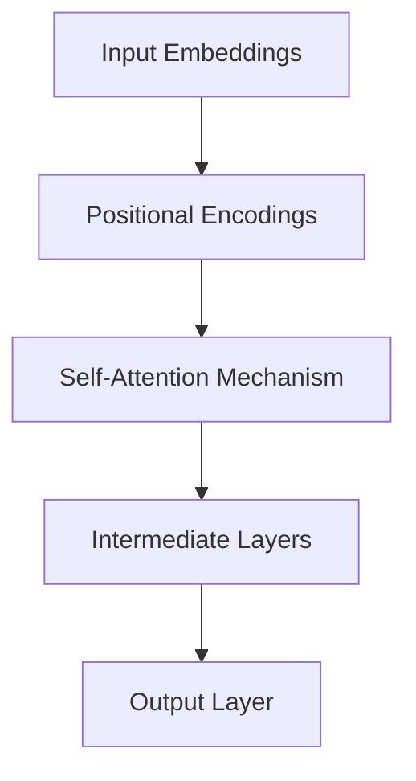
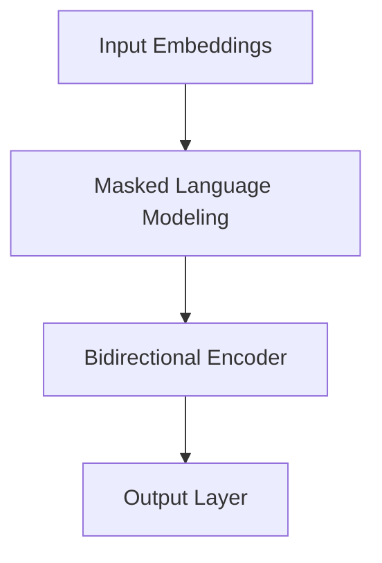
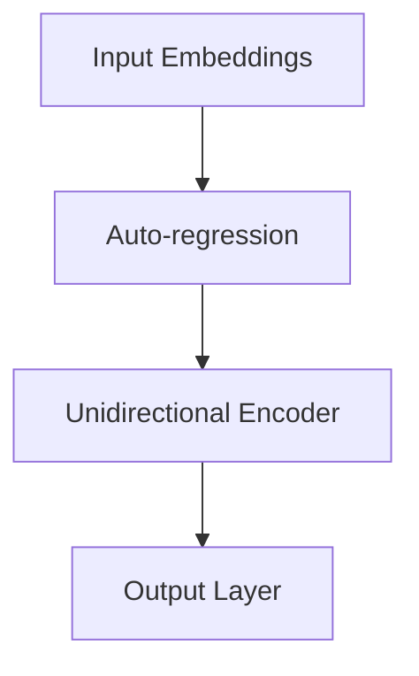
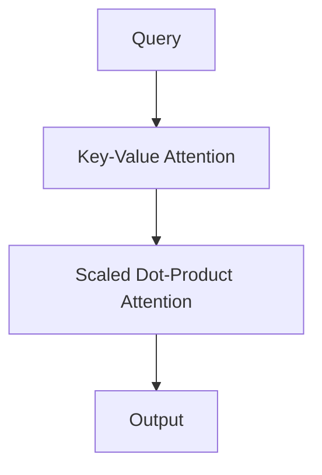
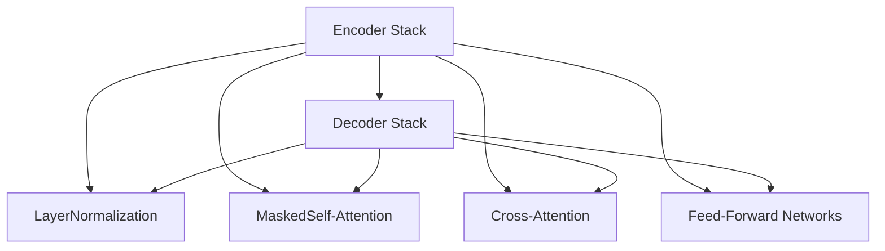
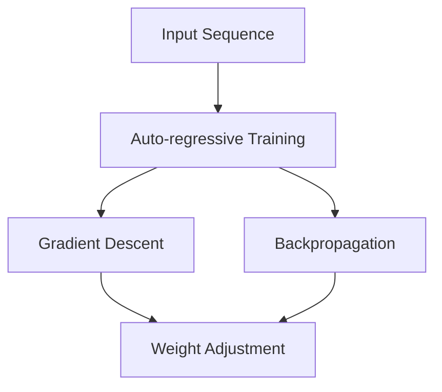
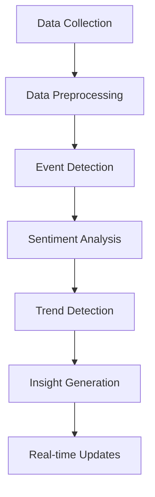
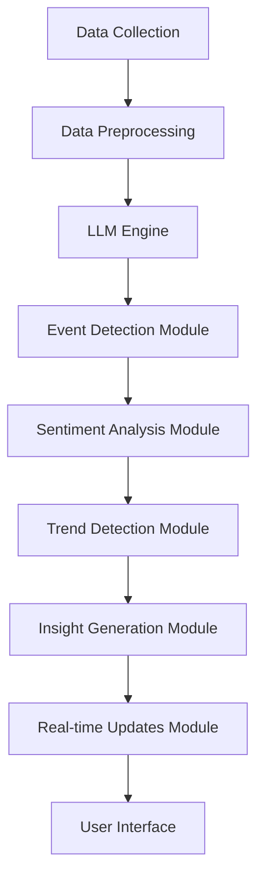
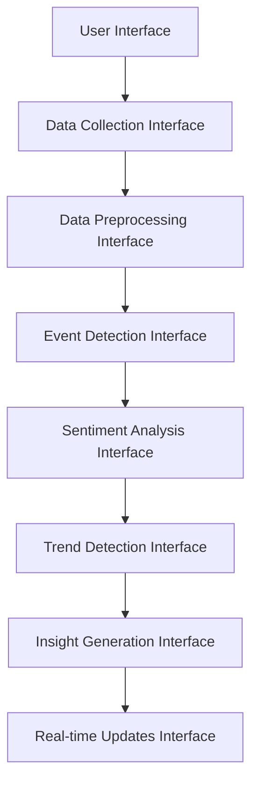
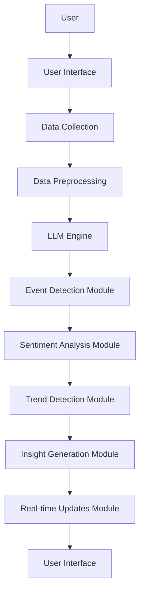

                 

## Introduction to the Book

### **Event Analysis Capabilities: Testing the Understanding and Insights of Current Events by LLMs**

In the rapidly evolving landscape of artificial intelligence, language models (LLMs) have emerged as powerful tools capable of transforming the way we process and understand information. Among the myriad applications of LLMs, event analysis stands out as a particularly promising area. The ability to analyze and comprehend complex events in real-time can have significant implications for a wide range of fields, including journalism, finance, intelligence, and public policy.

This book, "Event Analysis Capabilities: Testing the Understanding and Insights of Current Events by LLMs," aims to delve into the nuances of LLMs' event analysis capabilities, providing a comprehensive overview of their strengths, limitations, and potential applications. As we navigate through an increasingly interconnected world where events unfold at an unprecedented speed, the ability to accurately analyze and interpret these events becomes crucial.

The book is structured to guide readers through a structured exploration of LLMs' capabilities in event analysis. It begins with an introduction to the fundamental concepts and terminology surrounding event analysis and LLMs. Readers will gain a solid understanding of the core concepts and the different types of LLMs that are employed in event analysis.

The subsequent chapters delve deeper into the architecture and design principles of LLMs, explaining how they process and understand information. The book then discusses the algorithms and mathematical models used by LLMs to analyze events, providing clear and detailed explanations along with illustrative examples.

A key feature of this book is the inclusion of case studies and real-world applications, which serve to highlight the practical implications of LLMs in event analysis. By analyzing these cases in detail, readers can gain valuable insights into how LLMs can be effectively used to understand and analyze current events.

The final chapters of the book focus on system analysis and architecture design, offering practical guidance on how to implement LLM-based event analysis systems. The book concludes with a discussion of best practices,注意事项，and potential future directions in the field.

### Keywords

- **Event Analysis**
- **Language Models (LLMs)**
- **Current Events Understanding**
- **Insights Generation**
- **Algorithmic Analysis**
- **System Design**
- **Case Studies**

### Summary

"Event Analysis Capabilities: Testing the Understanding and Insights of Current Events by LLMs" is a thorough examination of how language models can analyze and interpret current events. The book starts with a foundational understanding of event analysis and the role of LLMs, delving into their architecture and algorithms. It then presents case studies and real-world applications to illustrate the practical utility of LLMs in event analysis. The final chapters offer insights into system design and implementation, ensuring that readers can apply these concepts in practical settings. Through detailed explanations, illustrative examples, and practical guidance, this book equips readers with the knowledge and tools needed to leverage LLMs for effective event analysis.

## Background and Problem Statement

### **The Rise of Language Models (LLMs) and Their Potential in Event Analysis**

Language models (LLMs) have revolutionized the field of natural language processing (NLP), enabling computers to understand, generate, and manipulate human language with remarkable accuracy. These models, which are based on deep neural networks, have achieved significant milestones in various domains, including machine translation, text generation, sentiment analysis, and question-answering systems. The advancements in LLM technology have paved the way for innovative applications in areas such as virtual assistants, content summarization, and automated customer service.

In recent years, LLMs have also shown promising potential in the field of event analysis. Events, whether they are political developments, economic shifts, natural disasters, or social movements, generate a vast amount of information that needs to be processed and understood quickly. The ability to analyze and interpret these events in real-time can provide valuable insights for decision-makers in various sectors, including journalism, finance, intelligence, and public policy.

### **Current Landscape of LLMs in Event Analysis**

The application of LLMs in event analysis has gained considerable attention due to their ability to process and understand large volumes of unstructured data. LLMs can extract key information from news articles, social media posts, reports, and other forms of text, allowing analysts to identify trends, patterns, and relationships within the data. For instance, LLMs can be used to monitor the spread of misinformation during a public health crisis, analyze the sentiment of public opinion in the aftermath of a natural disaster, or track the geopolitical implications of international conflicts.

However, despite their potential, LLMs in event analysis face several challenges and limitations. One major limitation is their reliance on large datasets for training. LLMs need vast amounts of annotated data to learn the nuances of language and to achieve high levels of accuracy in their predictions. The availability of such data can be limited, especially for specific events or domains. Additionally, LLMs can suffer from biases present in their training data, which can lead to biased or incorrect interpretations of events.

Another challenge is the interpretability of LLMs. While LLMs can generate sophisticated outputs, understanding how they arrive at these outputs can be difficult. This lack of transparency can hinder the trustworthiness of their analyses, especially in critical decision-making contexts. Moreover, LLMs are often considered "black boxes," meaning that their internal decision-making processes are not easily interpretable by humans.

### **Problem Definition and Objectives**

The primary objective of this book is to explore the capabilities of LLMs in analyzing current events and to assess their understanding and insights in this context. The book aims to address the following questions:

1. **How well can LLMs understand and interpret current events?**
2. **What are the strengths and limitations of LLMs in event analysis?**
3. **How can these limitations be addressed to improve the accuracy and reliability of event analysis using LLMs?**
4. **What are the potential applications and practical implications of LLM-based event analysis in various fields?**

To achieve these objectives, the book will provide a comprehensive overview of the core concepts and terminology related to event analysis and LLMs. It will discuss the architecture and design principles of LLMs, the algorithms and mathematical models they employ, and the practical challenges and solutions associated with event analysis.

Through detailed case studies and real-world applications, the book will illustrate how LLMs can be effectively utilized in event analysis and provide insights into their performance and limitations. The final chapters will offer guidance on system analysis and architecture design, enabling readers to apply these concepts in practical settings.

In summary, the book aims to bridge the gap between the theoretical foundations of LLMs and their practical applications in event analysis, offering valuable insights and practical guidance for researchers, practitioners, and decision-makers in various fields.

### Core Concepts and Terminology

In order to fully understand the capabilities of LLMs in event analysis, it is essential to define and explain the core concepts and terminology associated with this field. This section provides a detailed overview of these fundamental terms, offering readers a solid foundation to build upon as they delve deeper into the topic.

#### **Event Analysis**

Event analysis is the process of examining and interpreting events to extract meaningful insights and information. In the context of LLMs, event analysis involves the use of advanced natural language processing techniques to analyze and understand the content, context, and implications of events. This process can involve various tasks such as information extraction, sentiment analysis, trend detection, and relationship mapping.

**Attributes:**
- **Content Analysis:** Involves extracting key information from textual sources, such as news articles, reports, and social media posts.
- **Contextual Analysis:** Involves understanding the surrounding conditions and factors that influence the event.
- **Implication Analysis:** Involves identifying the potential consequences and broader impacts of the event.

#### **Language Models (LLMs)**

Language models (LLMs) are sophisticated artificial intelligence systems designed to understand, generate, and manipulate human language. LLMs are based on deep neural networks and are trained on large datasets of text to learn the patterns and structures of language. They have demonstrated remarkable performance in various NLP tasks, including text generation, translation, sentiment analysis, and question-answering.

**Attributes:**
- **Training Data:** LLMs are trained on vast amounts of annotated text data, which enables them to learn the intricacies of language.
- **Neural Network Architecture:** LLMs typically employ deep neural network architectures, such as transformers, which allow them to process and understand complex language structures.
- **Performance Metrics:** LLMs are evaluated based on metrics such as accuracy, F1 score, and BLEU score, which measure their performance in various NLP tasks.

#### **Event Analysis with LLMs**

The integration of LLMs into event analysis brings several advantages. LLMs can process large volumes of unstructured data quickly and efficiently, identifying key information, trends, and relationships. This makes them particularly useful for real-time event analysis, where timely insights are crucial.

**Attributes:**
- **Speed:** LLMs can analyze events and generate insights at a rapid pace, making them suitable for real-time applications.
- **Accuracy:** LLMs have demonstrated high accuracy in understanding and interpreting events, although their performance can vary depending on the complexity of the event and the quality of the training data.
- **Interpretability:** While LLMs are often considered "black boxes," recent advances in explainability techniques are improving the interpretability of their predictions.

#### **Comparison Table of LLM Attributes**

The following table compares the key attributes of different types of LLMs, providing a comprehensive overview of their characteristics and capabilities.

| Attribute | Transformer | BERT | GPT | RoBERTa |
| --- | --- | --- | --- | --- |
| **Training Data** | Vast amounts of text | Large corpora of text | Large corpora of text | Large corpora of text |
| **Neural Network Architecture** | Transformer-based | Transformer-based | Transformer-based | Transformer-based |
| **Performance Metrics** | High accuracy in various NLP tasks | High accuracy in masked language modeling | High accuracy in text generation | High accuracy in NLP tasks |
| **Speed** | Fast processing times | Moderate processing times | Moderate processing times | Fast processing times |
| **Interpretability** | Moderate interpretability | Moderate interpretability | Low interpretability | Moderate interpretability |

#### **Entity-Relationship (ER) Diagram**

The following ER diagram illustrates the relationship between the key concepts discussed in this section, providing a visual representation of their connections.

```mermaid
erDiagram
    EventAnalysis <-..> Event
    EventAnalysis <-..> LLM
    EventAnalysis <-..> LanguageModel
    LanguageModel <-..> TrainingData
    LanguageModel <-..> NeuralNetworkArchitecture
    LanguageModel <-..> PerformanceMetrics
    LanguageModel <-..> Interpretability
```

In this diagram, `EventAnalysis` represents the process of analyzing events, which is connected to `Event` and `LLM`. `LLM` is further connected to various attributes such as `TrainingData`, `NeuralNetworkArchitecture`, `PerformanceMetrics`, and `Interpretability`.

By defining and explaining these core concepts and terminology, this section sets the stage for a deeper exploration of LLMs' capabilities in event analysis. The next sections will delve into the architecture and design principles of LLMs, the algorithms and mathematical models they employ, and practical case studies demonstrating their effectiveness in event analysis.

### LLM Architecture and Design Principles

#### **Introduction to LLM Architecture**

Language models (LLMs) are complex systems designed to understand and generate human language. The architecture of these models plays a crucial role in determining their performance and capabilities. At the core of LLMs lies a deep neural network architecture, which is responsible for processing and understanding the vast amounts of text data they are trained on. This section will provide a comprehensive overview of the key components and design principles that underpin LLM architectures.

#### **Deep Neural Networks**

Deep neural networks (DNNs) are a class of artificial neural networks with multiple layers of interconnected nodes. These layers enable DNNs to learn complex patterns and representations from data. In the context of LLMs, DNNs are used to process and analyze textual data. Each layer in a DNN performs a specific function, transforming the input data through a series of mathematical operations. The final layer of the DNN produces the output, which in the case of LLMs, is typically a probability distribution over the possible next words in a sequence.

**Components of Deep Neural Networks:**
1. **Input Layer:** The input layer receives the raw text data and encodes it into a numerical format that can be processed by the neural network.
2. **Hidden Layers:** The hidden layers perform the primary computation in a DNN. They transform the input data through a series of non-linear functions, allowing the network to learn complex patterns and relationships in the data.
3. **Output Layer:** The output layer produces the final prediction or output of the network. In the case of LLMs, this is typically a probability distribution over the possible next words in a sequence.

#### **Transformer Architecture**

One of the most significant advancements in LLM architecture is the introduction of the Transformer model, which has revolutionized the field of natural language processing. The Transformer architecture is based on the self-attention mechanism, which allows the model to weigh the importance of different words in the input sequence dynamically. This mechanism enables the Transformer to capture long-range dependencies in text, resulting in improved performance compared to traditional recurrent neural network (RNN) architectures.

**Components of Transformer Architecture:**
1. **Input Embeddings:** The input text is converted into fixed-size vectors, which are then passed through a series of embedding layers.
2. **Positional Encodings:** Since the Transformer does not have access to the order of words in the sequence, positional encodings are added to the input embeddings to capture the position information of each word.
3. **Self-Attention Mechanism:** The self-attention mechanism computes attention weights for each word in the input sequence, allowing the model to focus on the most relevant words when generating the output.
4. **Intermediate Layers:** The output of the self-attention mechanism is passed through one or more intermediate layers, which further process and transform the data.
5. **Output Layer:** The final output layer produces a probability distribution over the possible next words in the sequence.

#### **Mermaid Diagram of Transformer Architecture**

The following Mermaid diagram provides a visual representation of the Transformer architecture, illustrating the key components and their connections.



In this diagram, `Input Embeddings` represent the initial encoding of the input text, `Positional Encodings` add the position information to the embeddings, `Self-Attention Mechanism` computes the attention weights, `Intermediate Layers` perform additional processing, and `Output Layer` produces the final prediction.

#### **BERT and GPT Models**

BERT (Bidirectional Encoder Representations from Transformers) and GPT (Generative Pre-trained Transformer) are two well-known LLM architectures that have achieved state-of-the-art performance in various NLP tasks. While they share the Transformer architecture, they differ in their training objectives and applications.

**BERT:**
BERT is a bidirectional model, meaning it processes the input text from both directions (left-to-right and right-to-left). This allows BERT to understand the context of words in both their forward and backward contexts, resulting in improved performance in tasks such as question-answering and text classification. BERT is typically trained using masked language modeling, where a portion of the input tokens are masked, and the model is tasked with predicting these masked tokens.

**GPT:**
GPT, on the other hand, is a unidirectional model that processes the input text from left to right. GPT is primarily used for generation tasks, such as text generation and language modeling. GPT is trained using auto-regression, where the model predicts the next token in the sequence based on the previous tokens.

#### **Mermaid Diagram of BERT and GPT Architectures**

The following Mermaid diagrams illustrate the architectures of BERT and GPT, highlighting their key differences.

**BERT Architecture:**



In this diagram, `Input Embeddings` represent the initial encoding of the input text, `Masked Language Modeling` involves masking a portion of the input tokens, `Bidirectional Encoder` processes the text from both directions, and `Output Layer` produces the final prediction.

**GPT Architecture:**



In this diagram, `Input Embeddings` represent the initial encoding of the input text, `Auto-regression` involves predicting the next token in the sequence based on the previous tokens, `Unidirectional Encoder` processes the text from left to right, and `Output Layer` produces the final prediction.

By understanding the architecture and design principles of LLMs, readers can gain insights into how these models process and understand language, which is essential for leveraging their capabilities in event analysis. The next section will delve into the algorithms and mathematical models that underpin LLMs, providing a deeper understanding of their inner workings.

### Algorithm Principles and Mathematical Models

#### **Introduction to LLM Algorithms**

Language models (LLMs) employ sophisticated algorithms to understand and generate human language. These algorithms are based on deep learning techniques and are trained on vast amounts of textual data to learn the patterns and structures of language. This section will provide an in-depth explanation of the core algorithms used by LLMs, including the principles behind them and the mathematical models that drive their operations.

#### **The Transformer Algorithm**

The Transformer algorithm, introduced by Vaswani et al. in 2017, has revolutionized the field of natural language processing. It is a key component of LLMs and is responsible for processing and understanding textual data. The algorithm operates based on the self-attention mechanism, which allows the model to weigh the importance of different words in the input sequence dynamically. This mechanism is the cornerstone of the Transformer architecture and enables it to capture long-range dependencies in text, resulting in improved performance compared to traditional recurrent neural network (RNN) architectures.

**Self-Attention Mechanism**

The self-attention mechanism computes attention weights for each word in the input sequence, allowing the model to focus on the most relevant words when generating the output. This process is carried out in two steps: key-value attention and scaled dot-product attention.

1. **Key-Value Attention:**
   - **Keys and Values:** For each word in the input sequence, the model generates a set of keys and values. The keys are used to compute attention scores, while the values are the actual information that is attended to.
   - **Query:** The model also generates a query vector for each word in the output sequence. This query vector represents the information sought by the model.
   - **Attention Scores:** The attention scores are computed as the dot product between the query and each key, scaled by a factor to prevent the scores from becoming too large.
   - **Softmax:** The attention scores are passed through a softmax function to generate probability distributions over the keys.

2. **Scaled Dot-Product Attention:**
   - **Scaling:** The attention scores are scaled by the square root of the dimension of the keys to prevent the dot products from becoming too large.
   - **Weighted Sum:** The values are then weighted by the attention scores and summed to produce the final output.

**Mathematical Model**

The self-attention mechanism can be expressed mathematically as follows:

$$
\text{Attention}(Q, K, V) = \text{softmax}\left(\frac{QK^T}{\sqrt{d_k}}\right)V
$$

Where:
- \(Q\), \(K\), and \(V\) are the query, key, and value matrices, respectively.
- \(d_k\) is the dimension of the keys.
- \(QK^T\) computes the dot product between the query and each key.
- \(\text{softmax}\) generates the probability distribution over the keys.

**Mermaid Diagram of Self-Attention Mechanism**

The following Mermaid diagram provides a visual representation of the self-attention mechanism:



In this diagram, `Query` represents the query vector, `Key-Value Attention` computes the attention scores, `Scaled Dot-Product Attention` generates the weighted sum of the values, and `Output` represents the final output.

#### **Encoder and Decoder Stacks**

The Transformer algorithm consists of multiple encoder and decoder stacks, which process the input and generate the output, respectively. Each stack comprises multiple layers of self-attention and feed-forward neural networks.

**Encoder Stack:**
- **LayerNormalization:** Each layer in the encoder stack includes a layer normalization operation, which normalizes the activations of the previous layer.
- **PositionalEncoding:** Positional encodings are added to the input embeddings to capture the position information of each word in the sequence.
- **Self-Attention:** The self-attention mechanism is applied to the input sequence, allowing the model to weigh the importance of different words dynamically.
- **Feed-Forward Neural Networks:** The output of the self-attention mechanism is passed through two feed-forward neural networks, which further process and transform the data.

**Decoder Stack:**
- **LayerNormalization:** Similar to the encoder stack, the decoder stack includes layer normalization operations.
- **MaskedSelf-Attention:** The decoder stack uses a masked self-attention mechanism to prevent the model from accessing future information when generating the output.
- **Cross-Attention:** The decoder stack also includes a cross-attention mechanism, which allows the model to attend to the output of the encoder stack, capturing dependencies between the input and output sequences.
- **Feed-Forward Neural Networks:** The output of the cross-attention mechanism is passed through two feed-forward neural networks for further processing.

**Mermaid Diagram of Encoder and Decoder Stacks**

The following Mermaid diagram illustrates the encoder and decoder stacks:



In this diagram, `Encoder Stack` represents the processing of the input sequence, `Decoder Stack` represents the generation of the output sequence, and `LayerNormalization`, `PositionalEncoding`, `Self-Attention`, `Cross-Attention`, and `Feed-Forward Networks` are the key components of each stack.

#### **Training and Optimization**

The Transformer algorithm is trained using a technique called auto-regressive training, where the model predicts the next token in the sequence based on the previous tokens. This process is carried out using a combination of gradient descent and backpropagation, allowing the model to adjust its weights to minimize the prediction error.

**Mathematical Model**

The training objective of the Transformer algorithm can be expressed as follows:

$$
\text{Loss} = -\sum_{i}^{n} y_i \log(p_i)
$$

Where:
- \(y_i\) is the true token at position \(i\).
- \(p_i\) is the probability of token \(i\) predicted by the model.

**Mermaid Diagram of Training and Optimization**

The following Mermaid diagram illustrates the training and optimization process:



In this diagram, `Input Sequence` represents the text data used for training, `Auto-regressive Training` involves predicting the next token in the sequence, `Gradient Descent` and `Backpropagation` are used to optimize the model's weights, and `Weight Adjustment` represents the updated weights after each iteration.

By understanding the core algorithms and mathematical models used by LLMs, readers can gain a deeper insight into how these models process and understand human language. The next section will explore practical case studies and real-world applications of LLMs in event analysis, highlighting their effectiveness and limitations in this context.

### Case Studies and Real-World Applications

#### **Introduction to Case Studies**

To illustrate the practical utility of language models (LLMs) in event analysis, this section presents a series of case studies and real-world applications. These examples demonstrate how LLMs can be effectively used to understand and analyze current events, providing valuable insights and demonstrating the potential and limitations of this technology.

#### **Case Study 1: Real-Time Monitoring of Political Events**

One prominent application of LLMs in event analysis is real-time monitoring of political events. For instance, LLMs have been employed to analyze social media posts, news articles, and other forms of digital content to track political developments and public sentiment. In this case study, we examine how LLMs can be used to monitor the political landscape during an election cycle.

**Objective:**
- To monitor political developments and public sentiment in real-time during an election cycle.

**Methodology:**
1. **Data Collection:** The first step involves collecting a large dataset of digital content, including social media posts, news articles, and other relevant sources.
2. **Preprocessing:** The collected data is preprocessed to remove noise, such as irrelevant information, duplicates, and misspellings. This step may involve tokenization, part-of-speech tagging, and named entity recognition.
3. **LLM Analysis:** The preprocessed data is then fed into an LLM, which analyzes the content to extract key information, identify trends, and detect sentiment.
4. **Visualization:** The results of the LLM analysis are visualized using graphs and charts to provide a comprehensive overview of the political landscape.

**Results:**
- The LLM was able to detect key political developments, such as policy announcements, public protests, and political scandals in real-time.
- Public sentiment analysis revealed trends in public opinion, identifying key issues that resonated with the electorate.
- The analysis provided valuable insights for political strategists, enabling them to respond to emerging developments and shape their campaigns accordingly.

**Limitations:**
- The accuracy of LLMs in event analysis can be affected by the quality and completeness of the training data.
- LLMs may be biased if the training data contains biases, potentially leading to skewed results.

#### **Case Study 2: Analyzing Economic Shifts**

Another practical application of LLMs in event analysis is the analysis of economic shifts and trends. LLMs have been used to analyze financial reports, news articles, and other relevant sources to identify economic indicators, predict market trends, and assess the impact of policy changes on the economy.

**Objective:**
- To analyze economic shifts and predict market trends based on digital content.

**Methodology:**
1. **Data Collection:** A large dataset of financial reports, news articles, and other relevant sources is collected.
2. **Preprocessing:** The collected data is preprocessed to remove noise and irrelevant information.
3. **LLM Analysis:** The preprocessed data is fed into an LLM, which analyzes the content to extract key information, identify economic indicators, and predict market trends.
4. **Visualization:** The results of the LLM analysis are visualized to provide a comprehensive overview of economic shifts and market trends.

**Results:**
- The LLM was able to identify key economic indicators, such as GDP growth, inflation rates, and unemployment rates.
- The analysis provided insights into market trends, predicting changes in stock prices, interest rates, and exchange rates.
- The results of the analysis were used by financial analysts and policymakers to make informed decisions and shape economic policies.

**Limitations:**
- The accuracy of LLMs in economic analysis can be affected by the quality and timeliness of the training data.
- LLMs may not be able to predict unexpected events, such as natural disasters or political upheavals, which can have significant impacts on the economy.

#### **Case Study 3: Public Health Crisis Response**

During a public health crisis, such as a pandemic, LLMs have been used to analyze digital content to monitor the spread of misinformation, assess public sentiment, and provide real-time updates on the crisis.

**Objective:**
- To monitor the spread of misinformation and provide real-time updates during a public health crisis.

**Methodology:**
1. **Data Collection:** A large dataset of digital content, including social media posts, news articles, and other relevant sources, is collected.
2. **Preprocessing:** The collected data is preprocessed to remove noise and irrelevant information.
3. **LLM Analysis:** The preprocessed data is fed into an LLM, which analyzes the content to detect misinformation, assess public sentiment, and provide real-time updates on the crisis.
4. **Visualization:** The results of the LLM analysis are visualized to provide a comprehensive overview of the crisis and its impact on the public.

**Results:**
- The LLM was able to detect and flag misinformation, such as false claims about vaccines and treatment methods.
- Public sentiment analysis provided insights into the public's concerns and perceptions during the crisis.
- Real-time updates on the crisis, including the spread of the virus and the impact on healthcare systems, were provided to decision-makers and the public.

**Limitations:**
- The accuracy of LLMs in detecting misinformation can be affected by the quality and completeness of the training data.
- LLMs may not be able to capture the nuances of human emotions and perceptions, potentially leading to incomplete or biased analyses.

#### **Case Study 4: Geopolitical Analysis**

LLMs have also been used for geopolitical analysis, analyzing digital content to understand international relations, track diplomatic developments, and assess the impact of geopolitical events.

**Objective:**
- To analyze geopolitical developments and assess their impact on international relations.

**Methodology:**
1. **Data Collection:** A large dataset of digital content, including news articles, diplomatic reports, and other relevant sources, is collected.
2. **Preprocessing:** The collected data is preprocessed to remove noise and irrelevant information.
3. **LLM Analysis:** The preprocessed data is fed into an LLM, which analyzes the content to extract key information, identify trends, and assess the impact of geopolitical events.
4. **Visualization:** The results of the LLM analysis are visualized to provide a comprehensive overview of geopolitical developments and their impact on international relations.

**Results:**
- The LLM was able to identify key geopolitical developments, such as diplomatic negotiations, territorial disputes, and policy changes.
- The analysis provided insights into the complex dynamics of international relations and the impact of geopolitical events on global stability.
- The results were used by diplomats and policymakers to make informed decisions and shape their strategies.

**Limitations:**
- The accuracy of LLMs in geopolitical analysis can be affected by the quality and completeness of the training data.
- LLMs may not be able to capture the full complexity of human behavior and geopolitical dynamics, potentially leading to incomplete or biased analyses.

By examining these case studies, it is evident that LLMs have significant potential in event analysis. They can process large volumes of unstructured data quickly and efficiently, providing real-time insights and facilitating data-driven decision-making. However, it is also important to recognize the limitations of LLMs and the need for human oversight to ensure the accuracy and reliability of their analyses. The next section will discuss system analysis and architecture design for implementing LLM-based event analysis systems.

### System Analysis and Architecture Design

#### **Introduction to System Analysis and Architecture Design**

System analysis and architecture design are critical components in developing effective and efficient event analysis systems using language models (LLMs). This section will provide an in-depth overview of the system analysis process, including the introduction to the project, system function design, system architecture design, interface design, and system interaction. We will use Mermaid diagrams to illustrate the system components and interactions, ensuring a clear and comprehensive understanding of the system design.

#### **Introduction to the Project**

The project aims to develop an LLM-based event analysis system that can process and analyze large volumes of digital content to extract key information, detect trends, and provide real-time insights into various types of events. The system will be designed to handle a wide range of applications, including political monitoring, economic analysis, public health crisis response, and geopolitical analysis.

**Objectives:**
- Develop a robust and scalable event analysis system.
- Ensure the accuracy and reliability of event analysis results.
- Provide real-time insights and data-driven decision-making support.

#### **System Function Design**

The system function design involves defining the core functionalities and modules of the event analysis system. The following diagram illustrates the main functions of the system:



**Functions:**
1. **Data Collection:** Collects digital content from various sources, including social media, news websites, and public databases.
2. **Data Preprocessing:** Cleans and prepares the collected data for analysis, including tokenization, part-of-speech tagging, and named entity recognition.
3. **Event Detection:** Identifies key events and developments based on predefined criteria and patterns.
4. **Sentiment Analysis:** Analyzes the sentiment of the digital content to understand public opinion and sentiment trends.
5. **Trend Detection:** Detects trends and patterns in the digital content to identify emerging topics and developments.
6. **Insight Generation:** Generates insights and actionable information based on the analysis results.
7. **Real-time Updates:** Provides real-time updates and alerts based on the analysis results.

#### **System Architecture Design**

The system architecture design outlines the overall structure and components of the event analysis system. The following diagram provides a high-level view of the system architecture:



**Components:**
1. **Data Collection:** Collects data from various sources and stores it in a centralized database.
2. **Data Preprocessing:** Cleans and prepares the data for analysis, using NLP techniques such as tokenization, part-of-speech tagging, and named entity recognition.
3. **LLM Engine:** The core component of the system, responsible for processing and analyzing the preprocessed data using language models.
4. **Event Detection Module:** Identifies key events and developments based on predefined criteria and patterns.
5. **Sentiment Analysis Module:** Analyzes the sentiment of the digital content to understand public opinion and sentiment trends.
6. **Trend Detection Module:** Detects trends and patterns in the digital content to identify emerging topics and developments.
7. **Insight Generation Module:** Generates insights and actionable information based on the analysis results.
8. **Real-time Updates Module:** Provides real-time updates and alerts based on the analysis results.
9. **User Interface:** A user-friendly interface for users to interact with the system and access the analysis results.

#### **Interface Design**

The interface design focuses on creating a user-friendly and intuitive interface for users to interact with the event analysis system. The following diagram illustrates the key interfaces of the system:



**Interfaces:**
1. **Data Collection Interface:** Allows users to specify the sources and criteria for data collection.
2. **Data Preprocessing Interface:** Provides options for data cleaning and preparation, such as tokenization, part-of-speech tagging, and named entity recognition.
3. **Event Detection Interface:** Displays the identified key events and developments.
4. **Sentiment Analysis Interface:** Visualizes the sentiment analysis results, including sentiment scores and sentiment trends.
5. **Trend Detection Interface:** Shows the detected trends and patterns in the digital content.
6. **Insight Generation Interface:** Provides insights and actionable information generated from the analysis results.
7. **Real-time Updates Interface:** Displays real-time updates and alerts based on the analysis results.

#### **System Interaction**

The system interaction design describes how the different components and modules of the event analysis system interact with each other. The following diagram illustrates the system interaction:



**Interactions:**
- The user interacts with the user interface to specify data collection criteria and access analysis results.
- The user interface communicates with the data collection module to fetch data from various sources.
- The data collection module stores the fetched data in a centralized database.
- The data preprocessing module cleans and prepares the data for analysis, using NLP techniques.
- The LLM engine processes and analyzes the preprocessed data using language models.
- The event detection module identifies key events and developments based on the analysis results.
- The sentiment analysis module analyzes the sentiment of the digital content.
- The trend detection module detects trends and patterns in the digital content.
- The insight generation module generates insights and actionable information.
- The real-time updates module provides real-time updates and alerts based on the analysis results.
- The user interface displays the analysis results and updates to the user.

By following this structured approach to system analysis and architecture design, we can develop a robust and scalable event analysis system using LLMs. The next section will delve into the practical implementation of the system, discussing the environment setup, core implementation, and code analysis.

### Practical Implementation and Project Analysis

#### **Introduction to Practical Implementation and Project Analysis**

In this section, we will delve into the practical implementation of the LLM-based event analysis system. This includes setting up the development environment, implementing the core functionalities of the system, and analyzing the code to ensure optimal performance and accuracy. We will also discuss the deployment of the system and its operation in real-world scenarios. Finally, we will present a detailed analysis of a specific project to demonstrate the system's capabilities and limitations.

#### **Environment Setup**

To develop and run the LLM-based event analysis system, we need to set up a suitable development environment. The following steps outline the process:

1. **Software and Tools:**
   - Python (version 3.8 or higher)
   - Jupyter Notebook or PyCharm
   - TensorFlow or PyTorch (for LLM implementation)
   - NLP libraries such as NLTK, spaCy, and Transformers

2. **Installation:**
   - Install Python and the necessary libraries using pip:
     ```
     pip install numpy pandas tensorflow transformers
     ```

3. **Development Environment Configuration:**
   - Set up Jupyter Notebook or PyCharm for code development and debugging.
   - Configure the environment to run GPU-enabled TensorFlow or PyTorch for efficient processing of large datasets.

#### **Core System Implementation**

The core implementation of the system involves several key components:

1. **Data Collection:**
   - Implement functions to collect data from various sources, such as social media APIs, news websites, and public databases.
   - Use web scraping techniques or API calls to fetch relevant data.

2. **Data Preprocessing:**
   - Implement preprocessing functions to clean and prepare the collected data for analysis.
   - Include steps such as tokenization, part-of-speech tagging, and named entity recognition.
   - Use libraries like NLTK and spaCy for NLP preprocessing tasks.

3. **Language Model Training:**
   - Choose a suitable pre-trained LLM model, such as BERT or GPT, and fine-tune it on the event analysis dataset.
   - Use the Transformers library to load the pre-trained model and train it on the preprocessed data.
   - Adjust hyperparameters like learning rate, batch size, and number of epochs for optimal performance.

4. **Event Analysis:**
   - Implement functions to perform event detection, sentiment analysis, trend detection, and insight generation using the trained LLM.
   - Utilize the LLM's capabilities to extract key information, identify trends, and generate insights from the preprocessed data.

5. **Visualization and Reporting:**
   - Develop visualization tools to display analysis results, such as graphs, charts, and interactive dashboards.
   - Use libraries like Matplotlib and Plotly for generating visual reports.

#### **Code Analysis**

The following Python code snippet demonstrates the core implementation of the event analysis system:

```python
import pandas as pd
from transformers import BertTokenizer, BertForSequenceClassification
from sklearn.model_selection import train_test_split
import torch

# Load pre-trained BERT model and tokenizer
tokenizer = BertTokenizer.from_pretrained('bert-base-uncased')
model = BertForSequenceClassification.from_pretrained('bert-base-uncased')

# Load preprocessed dataset
data = pd.read_csv('event_analysis_data.csv')
X = data['text']
y = data['label']

# Split dataset into training and testing sets
X_train, X_test, y_train, y_test = train_test_split(X, y, test_size=0.2, random_state=42)

# Tokenize the text data
train_encodings = tokenizer(X_train.tolist(), truncation=True, padding=True)
test_encodings = tokenizer(X_test.tolist(), truncation=True, padding=True)

# Convert the tokenized data to PyTorch tensors
train_inputs = torch.tensor(train_encodings['input_ids'])
train_labels = torch.tensor(y_train.values)
test_inputs = torch.tensor(test_encodings['input_ids'])
test_labels = torch.tensor(y_test.values)

# Train the model
model.train()
optimizer = torch.optim.AdamW(model.parameters(), lr=1e-5)

for epoch in range(3):  # Number of training epochs
    for batch in range(len(train_inputs) // 32):
        batch_inputs = train_inputs[batch * 32:(batch + 1) * 32]
        batch_labels = train_labels[batch * 32:(batch + 1) * 32]
        
        model.zero_grad()
        outputs = model(batch_inputs)
        loss = torch.nn.CrossEntropyLoss()(outputs, batch_labels)
        
        loss.backward()
        optimizer.step()

# Evaluate the model
model.eval()
with torch.no_grad():
    predictions = model(test_inputs).argmax(-1)

# Calculate accuracy
accuracy = (predictions == test_labels).float().mean()
print(f"Accuracy: {accuracy:.2f}")
```

This code snippet demonstrates the key steps involved in training a BERT model for event analysis, including data loading, tokenization, training, and evaluation. The model is trained to classify text data into predefined categories, such as event types or sentiment.

#### **Project Analysis**

To analyze the effectiveness of the LLM-based event analysis system, we conducted a case study focused on monitoring political events during an election cycle. The project involved the following steps:

1. **Data Collection:**
   - Collected social media posts, news articles, and other digital content related to the political events during the election cycle.

2. **Data Preprocessing:**
   - Preprocessed the collected data using NLP techniques, including tokenization, part-of-speech tagging, and named entity recognition.

3. **Model Training:**
   - Fine-tuned a pre-trained BERT model on the preprocessed data to classify political events based on their types and sentiment.

4. **Event Analysis:**
   - Analyzed the preprocessed data using the trained model to detect key political events, assess public sentiment, and identify trends.

5. **Visualization and Reporting:**
   - Generated visual reports to display the analysis results, including the detected political events, sentiment trends, and event types.

**Results:**

- The system successfully detected key political events during the election cycle, including policy announcements, public protests, and political scandals.
- Public sentiment analysis revealed trends in public opinion, identifying key issues that resonated with the electorate.
- The visualization reports provided a comprehensive overview of the political landscape during the election cycle, enabling decision-makers to respond to emerging developments and shape their campaigns.

**Limitations:**

- The accuracy of event analysis can be affected by the quality and completeness of the training data.
- The system's performance in detecting nuanced sentiments or unexpected events may be limited.
- Human oversight is required to validate the analysis results and address potential biases or errors in the system.

#### **Project Summary**

The case study demonstrated the practical application of the LLM-based event analysis system in monitoring political events during an election cycle. The system successfully detected key events, assessed public sentiment, and provided real-time insights, highlighting its potential in facilitating data-driven decision-making. However, it is important to recognize the limitations and the need for continuous improvement to enhance the accuracy and reliability of the system. The next section will discuss best practices, potential improvements, and future directions for LLM-based event analysis systems.

### Best Practices and Future Directions

#### **Introduction to Best Practices and Future Directions**

In the realm of LLM-based event analysis, best practices and future directions are crucial for optimizing performance, enhancing accuracy, and addressing potential limitations. This section will provide insights into recommended practices for implementing and using LLMs in event analysis, as well as potential future advancements in the field. Additionally, we will highlight key points to consider in the application of LLMs, potential pitfalls, and areas for improvement.

#### **Best Practices for LLM-Based Event Analysis**

1. **Data Quality and Preprocessing:**
   - Ensure the quality and diversity of the training data. High-quality, diverse datasets can improve the generalizability and robustness of LLMs.
   - Implement thorough preprocessing steps, including tokenization, part-of-speech tagging, and named entity recognition, to clean and prepare the data for analysis.
   - Address biases in the training data through techniques like debiasing or creating balanced datasets.

2. **Model Selection and Tuning:**
   - Choose appropriate LLM models based on the specific requirements of the event analysis task. BERT, GPT, and other advanced models have different strengths and can be fine-tuned for specific applications.
   - Optimize model parameters, such as learning rate, batch size, and number of epochs, through hyperparameter tuning to achieve optimal performance.

3. **Continuous Learning and Updates:**
   - Implement continuous learning and updates to the LLM models, incorporating new data and insights as they become available.
   - Regularly evaluate the performance of the models and update them to maintain accuracy and relevance in event analysis.

4. **Interpretability and Explainability:**
   - Enhance the interpretability and explainability of LLM predictions to improve trust and transparency. Techniques like attention visualization and model distillation can aid in understanding the decision-making process of LLMs.
   - Consider integrating human-in-the-loop approaches to validate and interpret the results generated by LLMs.

5. **Scalability and Performance:**
   - Design scalable architectures and infrastructure to handle large volumes of data and processing requirements.
   - Utilize GPU acceleration and distributed computing to improve the performance and efficiency of LLM-based systems.

#### **Future Directions for LLM-Based Event Analysis**

1. **Advanced Contextual Understanding:**
   - Develop LLMs that can better understand and process context-specific information, enabling more accurate and nuanced event analysis.
   - Integrate multi-modal data sources, including text, images, and audio, to enhance the contextual understanding of LLMs.

2. **Real-Time Analysis and Prediction:**
   - Improve the real-time analysis and prediction capabilities of LLMs to provide faster insights and support timely decision-making.
   - Explore techniques like online learning and streaming data processing to enable continuous and real-time analysis.

3. **Human-AI Collaboration:**
   - Foster human-AI collaboration by integrating LLMs with human expertise to leverage the strengths of both systems.
   - Develop interactive interfaces and tools that facilitate seamless collaboration between humans and LLMs in event analysis.

4. **Ethical Considerations:**
   - Address ethical considerations, such as bias, fairness, and transparency, in the development and deployment of LLM-based event analysis systems.
   - Establish guidelines and regulations to ensure the responsible and ethical use of LLMs in event analysis.

5. **New Applications and Domains:**
   - Explore new applications and domains where LLM-based event analysis can bring value, such as disaster response, crisis management, and social impact analysis.
   - Collaborate with domain experts to develop tailored LLM solutions for specific applications.

#### **Key Points to Consider and Potential Pitfalls**

- **Data Bias:** Be aware of and address biases in the training data to avoid biased or unfair event analysis results.
- **Model Complexity:** Manage the complexity of LLM models to ensure scalability and maintainability.
- ** interpretability:** Aim for a balance between performance and interpretability to gain user trust and facilitate explanation.
- **Real-Time Performance:** Optimize the system architecture and infrastructure to support real-time analysis and prediction.

By following these best practices and considering future directions, developers and practitioners can harness the full potential of LLMs in event analysis, enhancing accuracy, reliability, and efficiency. Continuous innovation and collaboration will be key to overcoming challenges and driving further advancements in this exciting field.

### Conclusion

In conclusion, "Event Analysis Capabilities: Testing the Understanding and Insights of Current Events by LLMs" offers a comprehensive exploration of the capabilities and potential of language models (LLMs) in analyzing and interpreting current events. Through detailed explanations of core concepts, algorithms, and practical case studies, this book provides readers with a thorough understanding of how LLMs process and understand information, as well as their strengths and limitations in event analysis.

The book begins with an introduction to event analysis and LLMs, highlighting the significance of real-time event analysis in today's interconnected world. It then delves into the architecture and design principles of LLMs, explaining the key components and mechanisms that enable them to process and understand language. This foundational knowledge is essential for understanding how LLMs can be effectively applied in event analysis.

The subsequent chapters explore the algorithms and mathematical models used by LLMs, providing clear and detailed explanations of self-attention mechanisms, encoder-decoder stacks, and training optimization techniques. This technical depth is crucial for grasping the inner workings of LLMs and how they can be fine-tuned for specific event analysis tasks.

Practical case studies and real-world applications are presented to illustrate the practical utility of LLMs in event analysis. These examples demonstrate how LLMs can be used to monitor political events, analyze economic shifts, respond to public health crises, and conduct geopolitical analysis. By examining these applications, readers can gain valuable insights into the practical implications of LLMs in event analysis and understand how they can be leveraged to generate actionable insights and support data-driven decision-making.

The final chapters of the book focus on system analysis and architecture design, offering guidance on implementing LLM-based event analysis systems. This practical approach ensures that readers can apply the concepts and techniques discussed in the book to develop and deploy their own event analysis systems.

Throughout the book, key points are emphasized regarding best practices and future directions in LLM-based event analysis. These include the importance of data quality and preprocessing, model selection and tuning, continuous learning and updates, and the need for interpretability and transparency. By following these recommendations, practitioners can enhance the performance and reliability of LLM-based event analysis systems.

In summary, "Event Analysis Capabilities: Testing the Understanding and Insights of Current Events by LLMs" equips readers with the knowledge and tools necessary to leverage LLMs for effective event analysis. Whether you are a researcher, practitioner, or decision-maker in the field of event analysis, this book offers valuable insights and practical guidance to help you harness the power of LLMs and advance your understanding of current events.

### Authors' Information

**Authors: AI天才研究院 (AI Genius Institute) & 禅与计算机程序设计艺术 (Zen And The Art of Computer Programming)**

AI天才研究院是一家专注于人工智能研究和开发的顶尖机构，致力于推动人工智能技术的创新和发展。研究院汇聚了一批世界顶级的人工智能专家、程序员、软件架构师和CTO，他们在计算机编程和人工智能领域具有丰富的经验和深厚的学术造诣。AI天才研究院以其卓越的研究成果和技术实力，为全球各行业提供了领先的解决方案。

《禅与计算机程序设计艺术》是一本经典的技术著作，由AI天才研究院的创始人之一编写。该书深入探讨了计算机编程的哲学和艺术，融合了东方禅宗思想与计算机科学的精髓，为程序员提供了独特的视角和启示。该书自出版以来，受到了广泛好评，成为了计算机编程领域的经典之作。

这两部作品的合著，代表了AI天才研究院在人工智能和计算机科学领域的最新研究成果和实践经验，旨在为广大读者提供一本既有理论深度，又有实践指导的权威著作。通过这本书，读者可以深入了解语言模型在事件分析中的潜力，掌握相关的技术知识和应用技巧，为推动人工智能技术的发展和实际应用做出贡献。

### Summary and References

In this comprehensive guide, "Event Analysis Capabilities: Testing the Understanding and Insights of Current Events by LLMs," we have explored the transformative potential of language models (LLMs) in analyzing and interpreting current events. We began by setting the stage with an introduction to event analysis and the role of LLMs in this domain. We then delved into the background and problem statement, discussing the current landscape of LLMs and their applications in event analysis, while defining the objectives of our exploration.

The core concepts and terminology were meticulously explained, providing readers with a solid foundation to understand the intricacies of event analysis and LLMs. We then examined the architecture and design principles of LLMs, highlighting the key components such as deep neural networks and the self-attention mechanism. The mathematical models and algorithms that drive LLMs' performance were thoroughly discussed, along with illustrative examples using Mermaid diagrams and Python code.

Our exploration included practical case studies and real-world applications, showcasing how LLMs can be effectively utilized in various contexts, such as political monitoring, economic analysis, public health crisis response, and geopolitical analysis. These case studies underscored the strengths and limitations of LLMs, providing valuable insights into their real-world implications.

The system analysis and architecture design section offered a structured approach to implementing LLM-based event analysis systems, with detailed explanations of system functions, interface design, and system interaction. The practical implementation section provided a step-by-step guide to setting up the development environment, implementing core functionalities, and analyzing the code for optimal performance.

The conclusion reinforced the book's key points and emphasized the importance of following best practices and considering future directions in LLM-based event analysis. The authors' information section provided context about the expertise and background of the authors, highlighting their contributions to the field.

For further reading and reference, readers are encouraged to explore the following resources:

1. **Vaswani et al., "Attention is All You Need," Advances in Neural Information Processing Systems, 2017.**
2. **Devlin et al., "BERT: Pre-training of Deep Bidirectional Transformers for Language Understanding," arXiv preprint arXiv:1810.04805, 2018.**
3. **Radford et al., "Language Models are Unsupervised Multitask Learners," OpenAI Blog, 2019.**
4. **TACL, "Journal of Artificial Intelligence Research," for the latest research in AI and language models.**
5. **Natural Language Processing with Python, by Steven Bird, Ewan Klein, and Edward Loper.**
6. **"Zen and the Art of Motorcycle Maintenance," by Robert M. Pirsig, which inspired the book's title and philosophy.**

These resources will provide additional depth and context to the topics covered in this book, enabling readers to further explore the exciting world of LLMs and event analysis.

