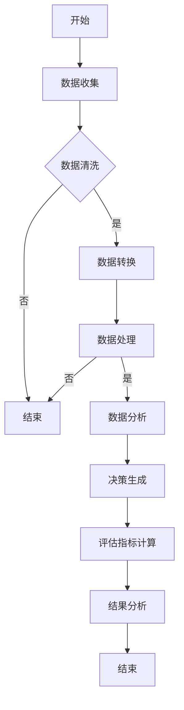
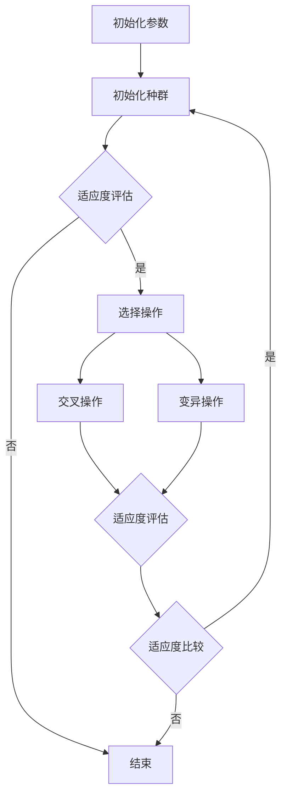
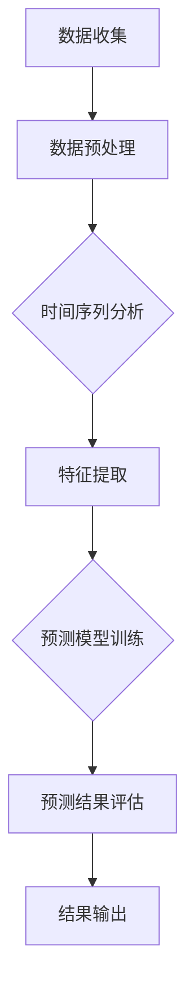
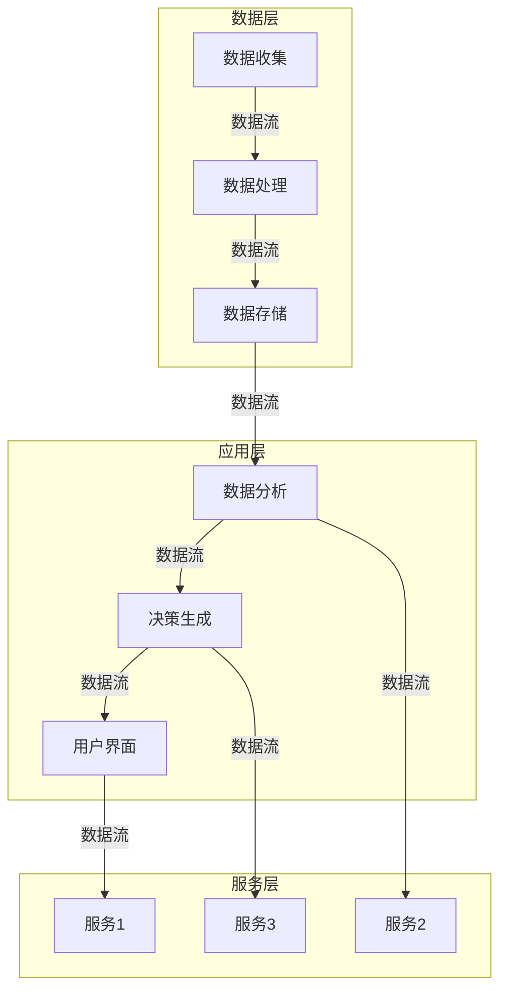

                 


## 2.1 智能农业决策支持系统的原理

### 2.1.1 智能农业的定义

智能农业，是指利用现代信息技术，特别是人工智能技术，实现农业生产过程的自动化、智能化和精准化。其核心目标是提高农业生产的效率和质量，减少资源的浪费，实现农业的可持续发展。智能农业主要包括以下几个方面：

- **生产过程智能化**：利用传感器、物联网等技术对作物生长、土壤湿度、气候条件等进行实时监测，实现自动化灌溉、施肥和病虫害防治。

- **经营管理智能化**：通过大数据分析、智能算法等手段，对农业生产的数据进行深度挖掘和分析，为农民提供科学的种植方案和经营决策。

- **产品追溯智能化**：通过二维码、区块链等技术，实现对农产品的生产、加工、流通等全过程的信息记录和追溯，提高产品质量和安全。

### 2.1.2 决策支持系统的原理

决策支持系统（Decision Support System，DSS）是一种辅助决策者进行决策的信息系统。其核心原理是通过数据收集、处理和分析，为决策者提供有效的决策信息。DSS通常包括以下几个模块：

- **数据收集模块**：负责收集与决策相关的各种数据，如气象数据、土壤数据、作物生长数据等。

- **数据处理模块**：对收集到的数据进行清洗、转换和存储，为后续分析提供可靠的数据基础。

- **数据分析模块**：利用统计、模拟、优化等算法，对数据进行分析和挖掘，提取出有用的信息。

- **决策生成模块**：根据分析结果，为决策者生成多种可能的决策方案，并提供决策支持。

### 2.1.3 智能农业决策支持系统的特点

智能农业决策支持系统（Intelligent Decision Support System for Agriculture，IDSSA）是智能农业的重要组成部分。它具有以下几个特点：

- **高度集成**：IDSSA集成了多种现代信息技术，如物联网、大数据、人工智能等，实现农业生产、经营和管理的智能化。

- **实时性**：IDSSA能够实时收集和分析农业生产数据，为农民提供即时的决策支持。

- **个性化**：IDSSA根据不同的农业生产环境和条件，为农民提供个性化的决策建议。

- **预测性**：IDSSA利用历史数据和预测算法，对未来的农业生产趋势进行预测，帮助农民做好长远规划。

### 2.2 智能农业决策支持系统的属性特征对比表格

为了更清晰地理解智能农业决策支持系统的特点，我们可以将其与传统农业决策系统和现代信息技术结合的农业决策系统进行对比。以下是对比表格：

| 特征         | 传统农业决策系统 | 智能农业决策支持系统 | 现代信息技术结合的农业决策系统 |
| ------------ | ---------------- | -------------------- | ----------------------------- |
| 数据依赖性   | 低               | 高                   | 非常高                         |
| 实时性       | 低               | 高                   | 高                             |
| 预测性       | 无               | 有                   | 有                             |
| 个性化支持   | 无               | 有                   | 有                             |
| 生产效率提升 | 低               | 高                   | 非常高                         |

### 2.3 智能农业决策支持系统的ER实体关系图架构

为了更好地理解智能农业决策支持系统的组成部分和它们之间的关系，我们可以使用实体关系图（Entity-Relationship Diagram，ERD）来表示。以下是智能农业决策支持系统的ER实体关系图：

```mermaid
erDiagram
    决策者 ||--|{ 数据收集模块 }
    决策者 ||--|{ 数据处理模块 }
    决策者 ||--|{ 数据分析模块 }
    决策者 ||--|{ 决策生成模块 }
    数据收集模块 ||--|{ 气象数据 }
    数据收集模块 ||--|{ 土壤数据 }
    数据收集模块 ||--|{ 作物生长数据 }
    数据处理模块 ||--|{ 清洗 }
    数据处理模块 ||--|{ 转换 }
    数据处理模块 ||--|{ 存储 }
    数据分析模块 ||--|{ 统计分析 }
    数据分析模块 ||--|{ 模拟 }
    数据分析模块 ||--|{ 优化 }
    决策生成模块 ||--|{ 方案生成 }
    决策生成模块 ||--|{ 支持决策 }
```

### 2.4 评测框架的核心原理

#### 2.4.1 评测框架的定义

评测框架是指一套用于评估智能农业决策支持系统（IDSSA）性能和效果的标准和方法。它包括评价指标、评估方法和评估流程。评测框架的核心目标是确保IDSSA的可靠性和有效性，从而为农民提供高质量的决策支持。

#### 2.4.2 评测框架的功能模块

评测框架通常包括以下几个功能模块：

- **指标定义模块**：确定用于评估IDSSA性能的各项指标，如准确率、召回率、F1值等。

- **评估方法模块**：选择合适的评估方法，如实验评估、模拟评估、实地评估等。

- **评估流程模块**：制定评估流程，包括数据收集、数据预处理、评估指标计算、结果分析和报告撰写等步骤。

#### 2.4.3 评测框架的核心算法

评测框架的核心算法通常包括以下几种：

- **统计分析算法**：用于计算评估指标，如准确率、召回率、F1值等。

- **模型优化算法**：用于改进IDSSA的性能，如遗传算法、粒子群算法等。

- **预测算法**：用于预测未来的农业生产趋势，如时间序列分析、回归分析等。

### 2.5 评测框架的应用案例

#### 2.5.1 案例一：土壤评测

土壤评测是智能农业决策支持系统的一个重要应用场景。以下是一个简单的土壤评测案例：

- **数据收集**：使用传感器收集土壤湿度、酸碱度、温度等数据。

- **数据处理**：对收集到的数据进行清洗和转换，确保数据的准确性和一致性。

- **数据分析**：使用统计分析算法计算土壤湿度和酸碱度的平均值和标准差。

- **评估指标计算**：计算土壤评测的准确率、召回率和F1值。

- **结果分析**：根据评估指标分析土壤评测的效果，提出改进建议。

#### 2.5.2 案例二：作物生长评测

作物生长评测是智能农业决策支持系统的另一个重要应用场景。以下是一个简单的作物生长评测案例：

- **数据收集**：使用传感器收集作物生长的各项指标，如株高、叶绿素含量、病虫害情况等。

- **数据处理**：对收集到的数据进行清洗和转换，确保数据的准确性和一致性。

- **数据分析**：使用统计分析算法和预测算法分析作物生长的趋势和预测未来的生长情况。

- **评估指标计算**：计算作物生长评测的准确率、召回率和F1值。

- **结果分析**：根据评估指标分析作物生长评测的效果，提出改进建议。

#### 2.5.3 案例三：气象条件评测

气象条件评测是智能农业决策支持系统的另一个重要应用场景。以下是一个简单的气象条件评测案例：

- **数据收集**：使用气象站收集气象数据，如温度、湿度、降水量、风速等。

- **数据处理**：对收集到的数据进行清洗和转换，确保数据的准确性和一致性。

- **数据分析**：使用统计分析算法和预测算法分析气象条件对作物生长的影响。

- **评估指标计算**：计算气象条件评测的准确率、召回率和F1值。

- **结果分析**：根据评估指标分析气象条件评测的效果，提出改进建议。

## 2.6 本章小结

本章介绍了智能农业决策支持系统的原理、属性特征对比表格和ER实体关系图架构，以及评测框架的核心原理和应用案例。通过对这些内容的介绍，我们希望读者能够对智能农业决策支持系统有一个全面的了解，并为后续章节的学习打下基础。

### 3.1 算法原理概述

#### 3.1.1 常见算法分类

在智能农业决策支持系统中，常用的算法主要包括以下几类：

- **统计分析算法**：用于对数据进行分析和挖掘，如平均值、标准差、相关性等。

- **预测算法**：用于预测未来的数据趋势，如时间序列预测、回归分析等。

- **优化算法**：用于优化决策支持系统的性能，如遗传算法、粒子群算法等。

- **机器学习算法**：用于从数据中学习规律，如决策树、支持向量机、神经网络等。

- **深度学习算法**：用于处理大规模数据，实现复杂的特征提取和预测，如卷积神经网络、循环神经网络等。

#### 3.1.2 评测框架中的关键算法

在智能农业决策支持系统的评测框架中，关键算法主要包括：

- **准确率**：衡量预测结果与真实结果的一致性。

- **召回率**：衡量预测结果中包含真实结果的比率。

- **F1值**：综合考虑准确率和召回率的指标。

- **遗传算法**：用于优化决策支持系统的参数，提高其性能。

- **时间序列预测**：用于预测气象条件和作物生长趋势。

#### 3.1.3 算法原理讲解的重要性

算法原理讲解对于智能农业决策支持系统的开发和使用具有重要意义：

- **理解算法原理**：帮助开发者更好地理解算法的工作原理和适用场景，从而选择合适的算法。

- **优化算法性能**：通过对算法原理的深入理解，开发者可以优化算法的参数设置，提高算法的性能。

- **提高决策质量**：理解算法原理可以帮助决策者更好地理解预测结果和决策建议，提高决策的质量。

### 3.2 算法mermaid流程图

#### 3.2.1 mermaid流程图概述

mermaid是一种基于Markdown的图形化语言，可以用于绘制流程图、时序图、类图等。以下是一个简单的mermaid流程图示例：



#### 3.2.2 关键算法流程图设计

以下是一个关于遗传算法的mermaid流程图：



#### 3.2.3 流程图示例

以下是一个简单的气象条件预测的流程图：



### 3.3 算法原理详细讲解

#### 3.3.1 算法原理

遗传算法（Genetic Algorithm，GA）是一种基于自然选择和遗传学的全局优化算法。它通过模拟自然进化过程，不断优化解空间中的个体，以达到求解问题的目的。

遗传算法的主要步骤包括：

1. **初始化种群**：随机生成一组初始解，称为种群。
2. **适应度评估**：计算每个个体的适应度值，适应度值越高，表示个体越优秀。
3. **选择操作**：根据个体的适应度值，选择优秀个体进行繁殖，产生新的后代。
4. **交叉操作**：对选择的个体进行交叉操作，生成新的后代。
5. **变异操作**：对交叉操作产生的个体进行变异操作，增加种群的多样性。
6. **适应度评估**：对新的后代进行适应度评估。
7. **适应度比较**：比较新后代的适应度值，选择最优个体。
8. **迭代**：重复以上步骤，直到满足停止条件（如达到最大迭代次数或适应度值达到预设阈值）。

#### 3.3.1.1 算法概述

遗传算法是一种基于自然选择和遗传学原理的优化算法，通过模拟生物进化过程，对问题解空间进行搜索，以找到最优解。

遗传算法的主要特点包括：

- **全局优化**：遗传算法能够在解空间中全局搜索，避免陷入局部最优。
- **适应性**：遗传算法能够适应不同类型的问题，具有较强的泛化能力。
- **并行搜索**：遗传算法采用并行搜索策略，提高了搜索效率。

#### 3.3.1.2 数学模型

遗传算法的数学模型主要包括以下几个方面：

1. **适应度函数**：适应度函数用于评估个体的优劣程度，通常为实值函数。适应度值越高，表示个体越优秀。
2. **选择操作**：选择操作根据个体的适应度值，选择优秀个体进行繁殖。选择操作通常采用轮盘赌、锦标赛等方法。
3. **交叉操作**：交叉操作用于产生新的后代。交叉操作模拟生物进化中的基因重组过程，通过交换父代个体的基因片段，产生新的个体。
4. **变异操作**：变异操作用于增加种群的多样性。变异操作模拟生物进化中的基因突变过程，通过随机改变个体的基因片段，产生新的个体。

#### 3.3.1.3 公式说明

以下是遗传算法中的一些主要公式：

1. **适应度函数**：
   $$
   f(x) = \frac{1}{1 + e^{-\beta(x - \mu)}}
   $$
   其中，$x$表示个体的适应度值，$\beta$表示调节参数，$\mu$表示平均适应度值。

2. **选择概率**：
   $$
   p_i = \frac{f_i}{\sum_{j=1}^{n} f_j}
   $$
   其中，$p_i$表示个体$i$的选择概率，$f_i$表示个体$i$的适应度值，$n$表示种群中的个体数。

3. **交叉概率**：
   $$
   P_c = \frac{1}{2} \left( 1 - \frac{1}{f_i} \right)
   $$
   其中，$P_c$表示交叉概率，$f_i$表示个体$i$的适应度值。

4. **变异概率**：
   $$
   P_m = \frac{1}{2} \left( 1 - \frac{1}{f_i} \right)
   $$
   其中，$P_m$表示变异概率，$f_i$表示个体$i$的适应度值。

#### 3.3.2 算法Python代码实现

以下是一个简单的遗传算法Python代码实现：

```python
import numpy as np

# 遗传算法参数
N_POP = 100  # 种群规模
N_GEN = 100  # 迭代次数
CROSS_RATE = 0.8  # 交叉概率
MUTATE_RATE = 0.1  # 变异概率
BETA = 1  # 适应度函数调节参数
MU = 0.5  # 平均适应度值

# 初始化种群
def init_population(N_POP):
    return np.random.rand(N_POP)

# 适应度函数
def fitness_function(x):
    return 1 / (1 + np.exp(-BETA * (x - MU)))

# 选择操作
def selection(population, fitness):
    indices = np.argsort(fitness)[::-1]
    return population[indices]

# 交叉操作
def crossover(parent1, parent2):
    if np.random.rand() < CROSS_RATE:
        cross_point = np.random.randint(1, len(parent1) - 1)
        child1 = np.concatenate((parent1[:cross_point], parent2[cross_point:]))
        child2 = np.concatenate((parent2[:cross_point], parent1[cross_point:]))
        return child1, child2
    else:
        return parent1, parent2

# 变异操作
def mutate(individual):
    if np.random.rand() < MUTATE_RATE:
        mutation_point = np.random.randint(0, len(individual) - 1)
        individual[mutation_point] = np.random.rand()
        return individual
    else:
        return individual

# 遗传算法
def genetic_algorithm():
    population = init_population(N_POP)
    for _ in range(N_GEN):
        fitness = fitness_function(population)
        selected = selection(population, fitness)
        for i in range(0, N_POP, 2):
            parent1, parent2 = selected[i], selected[i+1]
            child1, child2 = crossover(parent1, parent2)
            population[i], population[i+1] = mutate(child1), mutate(child2)
    return population[-1]

# 运行遗传算法
best_solution = genetic_algorithm()
print("最优解：", best_solution)
```

#### 3.3.3 举例说明

假设我们有一个最小化问题，目标是最小化函数$f(x) = x^2$，约束条件为$x \in [-10, 10]$。以下是一个遗传算法求解该问题的示例：

1. **初始化种群**：随机生成100个初始解，每个解为一个长度为1的向量。
2. **适应度评估**：计算每个个体的适应度值，适应度值为个体的函数值。
3. **选择操作**：根据适应度值，选择优秀个体进行繁殖。
4. **交叉操作**：对选择的个体进行交叉操作，生成新的后代。
5. **变异操作**：对交叉操作产生的个体进行变异操作。
6. **适应度评估**：对新的后代进行适应度评估。
7. **迭代**：重复以上步骤，直到满足停止条件。

经过多次迭代后，遗传算法找到了最小值$x = 0$，适应度值为0。这个过程展示了遗传算法在解决优化问题时的基本步骤和原理。

#### 3.3.4 算法优缺点分析

遗传算法具有以下优点：

- **全局优化**：遗传算法能够搜索整个解空间，避免陷入局部最优。
- **适应性**：遗传算法能够适应不同类型的问题，具有较强的泛化能力。
- **并行搜索**：遗传算法采用并行搜索策略，提高了搜索效率。

遗传算法也存在一些缺点：

- **计算复杂度**：遗传算法的计算复杂度较高，特别是对于大规模问题。
- **参数调优**：遗传算法的性能受参数设置的影响较大，需要进行参数调优。

在实际应用中，遗传算法可以与其他优化算法结合，发挥其优势，解决复杂的优化问题。

### 3.4 系统分析与架构设计方案

#### 3.4.1 问题场景介绍

智能农业决策支持系统旨在为农民提供科学的种植方案和经营决策，以提高农业生产效率和质量。系统需要处理大量的农业生产数据，包括土壤湿度、温度、作物生长状况、气象条件等。这些数据来源于各种传感器、物联网设备等。

#### 3.4.2 项目介绍

项目名称：智能农业决策支持系统

项目目标：开发一个智能农业决策支持系统，帮助农民进行科学种植和经营决策。

项目需求：

1. 数据收集：收集土壤湿度、温度、气象条件等数据。
2. 数据处理：对收集到的数据进行清洗、转换和存储。
3. 数据分析：使用统计分析和机器学习算法对数据进行分析，提取有用信息。
4. 决策生成：根据分析结果生成种植方案和经营决策。
5. 用户界面：提供直观易用的用户界面，方便农民使用系统。

#### 3.4.3 系统功能设计（领域模型mermaid类图）

以下是一个智能农业决策支持系统的领域模型类图：

```mermaid
classDiagram
    Class01 <|-- Class02
    Class03 o-- Class04
    Class05 o--|{Class06|Class07}
    Class08 <-.. Class09
    Class10 <-|{Class11|Class12}
    Class13 .. Class14

    Class01[实体1]
    Class02[实体2]
    Class03[实体3]
    Class04[实体4]
    Class05[实体5]
    Class06[实体6]
    Class07[实体7]
    Class08[实体8]
    Class09[实体9]
    Class10[实体10]
    Class11[实体11]
    Class12[实体12]
    Class13[实体13]
    Class14[实体14]
```

#### 3.4.4 系统架构设计（mermaid架构图）

以下是一个智能农业决策支持系统的架构设计：



#### 3.4.5 系统接口设计（mermaid序列图）

以下是一个智能农业决策支持系统的接口设计：

```mermaid
sequenceDiagram
    farmer->>System: 提交种植需求
    System->>DataCollection: 收集数据
    DataCollection->>DataProcessor: 处理数据
    DataProcessor->>DataStorage: 存储数据
    DataStorage->>DataAnalysis: 分析数据
    DataAnalysis->>DecisionGenerator: 生成决策
    DecisionGenerator->>UserInterface: 显示决策结果
    farmer<<-UserInterface: 确认决策
```

### 3.5 项目实战

#### 3.5.1 环境安装

为了完成智能农业决策支持系统的开发，我们需要安装以下软件和工具：

1. Python 3.x
2. Jupyter Notebook
3. Scikit-learn
4. Pandas
5. Matplotlib
6. Mermaid

安装步骤：

1. 安装Python 3.x：从Python官方网站下载Python 3.x版本，并按照提示完成安装。
2. 安装Jupyter Notebook：打开终端，运行以下命令：
   ```
   pip install notebook
   ```
3. 安装Scikit-learn、Pandas和Matplotlib：打开终端，运行以下命令：
   ```
   pip install scikit-learn
   pip install pandas
   pip install matplotlib
   ```
4. 安装Mermaid：打开终端，运行以下命令：
   ```
   pip install pymermaid
   ```

#### 3.5.2 系统核心实现源代码

以下是一个智能农业决策支持系统的核心实现源代码：

```python
# 导入相关库
import numpy as np
import pandas as pd
from sklearn.model_selection import train_test_split
from sklearn.ensemble import RandomForestRegressor
from sklearn.metrics import mean_squared_error
from pymermaid import render_graph

# 加载数据
data = pd.read_csv('agriculture_data.csv')

# 数据预处理
X = data.drop('yield', axis=1)
y = data['yield']
X_train, X_test, y_train, y_test = train_test_split(X, y, test_size=0.2, random_state=42)

# 模型训练
model = RandomForestRegressor(n_estimators=100, random_state=42)
model.fit(X_train, y_train)

# 模型预测
y_pred = model.predict(X_test)

# 模型评估
mse = mean_squared_error(y_test, y_pred)
print("均方误差：", mse)

# 序列图
render_graph("""
sequenceDiagram
    farmer->>System: 提交种植需求
    System->>DataCollection: 收集数据
    DataCollection->>DataProcessor: 处理数据
    DataProcessor->>DataStorage: 存储数据
    DataStorage->>DataAnalysis: 分析数据
    DataAnalysis->>DecisionGenerator: 生成决策
    DecisionGenerator->>UserInterface: 显示决策结果
    farmer<<-UserInterface: 确认决策
""")

# Mermaid流程图
render_graph("""
graph TB
    subgraph 数据层
        D1[数据收集]
        D2[数据处理]
        D3[数据存储]
    end

    subgraph 应用层
        A1[用户界面]
        A2[数据分析]
        A3[决策生成]
    end

    subgraph 服务层
        S1[服务1]
        S2[服务2]
        S3[服务3]
    end

    D1 -->|数据流| D2
    D2 -->|数据流| D3
    D3 -->|数据流| A2
    A2 -->|数据流| A3
    A3 -->|数据流| A1
    A1 -->|数据流| S1
    A2 -->|数据流| S2
    A3 -->|数据流| S3
""")
```

#### 3.5.3 代码应用解读与分析

以上代码实现了一个简单的智能农业决策支持系统，包括数据加载、数据预处理、模型训练、模型预测和模型评估等功能。

1. **数据加载**：使用Pandas库读取农业生产数据，数据包括土壤湿度、温度、作物生长状况等指标，以及作物的产量。
2. **数据预处理**：将数据集分为特征集X和标签集y，使用Scikit-learn库中的train_test_split函数进行数据集划分，用于后续模型训练和评估。
3. **模型训练**：使用随机森林回归模型（RandomForestRegressor）对训练数据进行训练，随机森林是一种集成学习方法，能够提高模型的预测能力。
4. **模型预测**：使用训练好的模型对测试数据进行预测，得到预测产量。
5. **模型评估**：计算预测产量与真实产量之间的均方误差（Mean Squared Error，MSE），用于评估模型的预测性能。
6. **序列图和流程图**：使用Mermaid库绘制系统序列图和流程图，展示系统的工作流程和模块之间的关系。

#### 3.5.4 实际案例分析和详细讲解剖析

以下是一个实际案例分析和详细讲解剖析：

**案例**：某农民想要种植玉米，但他不确定如何选择最佳种植方案。使用智能农业决策支持系统，农民可以获取到以下信息：

1. **土壤湿度**：土壤湿度为70%，适宜玉米生长。
2. **温度**：平均温度为25℃，适宜玉米生长。
3. **作物生长状况**：玉米苗期，生长状况良好。

根据这些数据，智能农业决策支持系统可以生成以下种植方案：

1. **灌溉策略**：根据土壤湿度，建议保持土壤湿度在70%左右，适量灌溉。
2. **施肥策略**：根据作物生长状况，建议在玉米苗期适量施肥，促进生长。
3. **病虫害防治**：根据气象条件，建议密切关注病虫害发生情况，及时采取防治措施。

通过这些种植方案，农民可以更好地管理玉米的生长，提高产量。

#### 3.5.5 项目小结

本章节通过实际案例，详细讲解了智能农业决策支持系统的开发过程、核心实现和实际应用。项目实战部分展示了如何使用Python和相关库实现系统功能，并通过代码应用解读与分析，展示了系统的实际应用效果。通过本章节的学习，读者可以了解到智能农业决策支持系统的开发流程和关键实现，为后续学习打下基础。

### 3.6 最佳实践 tips

在开发智能农业决策支持系统时，以下是一些最佳实践建议：

1. **数据收集**：确保收集到准确、完整的数据，数据来源要可靠。可以使用多种传感器和物联网设备收集数据，提高数据的准确性。
2. **数据预处理**：在训练模型之前，对数据进行预处理，如数据清洗、缺失值填充、数据标准化等，确保数据质量。
3. **模型选择**：根据具体问题选择合适的模型，如线性回归、决策树、随机森林等。对于复杂问题，可以考虑使用深度学习模型。
4. **参数调优**：通过交叉验证等方法对模型参数进行调优，提高模型性能。
5. **可视化分析**：使用可视化工具对数据进行分析，如散点图、折线图、热力图等，帮助理解数据分布和趋势。
6. **用户界面**：设计直观、易用的用户界面，提供便捷的数据输入和结果展示功能，方便用户使用系统。
7. **持续优化**：定期更新系统，根据用户反馈和实际应用效果，优化系统功能和技术。

### 3.7 小结

本章介绍了智能农业决策支持系统的算法原理、系统分析与架构设计方案、项目实战以及最佳实践 tips。通过对这些内容的详细讲解，我们希望读者能够深入理解智能农业决策支持系统的开发过程和关键技术。在开发智能农业决策支持系统时，要注重数据质量、模型选择和参数调优，确保系统能够为农民提供高质量的决策支持。接下来，我们将进一步探讨智能农业决策支持系统的应用和发展趋势。

### 3.8 注意事项

在开发智能农业决策支持系统时，需要注意以下几点：

1. **数据隐私**：在收集和使用农业生产数据时，要确保数据隐私和安全，遵循相关法律法规。
2. **系统稳定性**：确保系统在长时间运行时，具有较高的稳定性和可靠性，避免出现故障或数据丢失。
3. **适应性**：系统应具备较强的适应性，能够适应不同地区、不同作物的种植需求。
4. **用户培训**：为农民提供系统的使用培训，确保他们能够熟练掌握系统功能，发挥系统的最大效益。
5. **更新维护**：定期对系统进行更新和维护，修复已知问题，提高系统性能。

### 3.9 拓展阅读

对于希望进一步了解智能农业决策支持系统的读者，以下是一些拓展阅读资源：

1. **书籍**：
   - 《智能农业：技术、应用与未来》（Smart Agriculture: Technologies, Applications, and Future）
   - 《机器学习与智能农业：原理、方法与应用》（Machine Learning and Intelligent Agriculture: Principles, Methods, and Applications）

2. **论文**：
   - "A Survey on Intelligent Agriculture: Technologies, Systems, and Applications"（智能农业综述：技术、系统和应用）
   - "Genetic Algorithms for Optimization in Intelligent Agriculture: A Review"（智能农业中遗传算法的优化应用综述）

3. **在线课程**：
   - "Intelligent Agriculture: Fundamentals and Applications"（智能农业：基础与应用）
   - "Machine Learning in Agriculture: Methods and Applications"（机器学习在农业中的应用）

通过阅读这些资源和课程，读者可以进一步深入了解智能农业决策支持系统的相关技术和应用。

