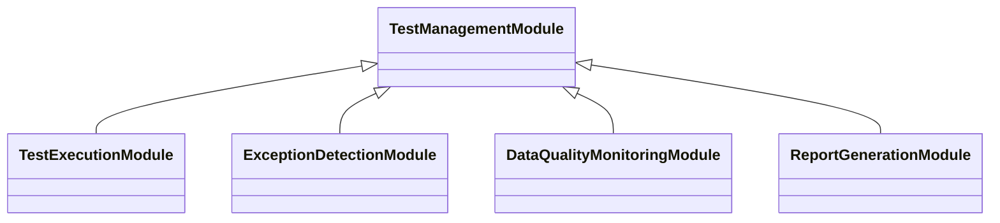
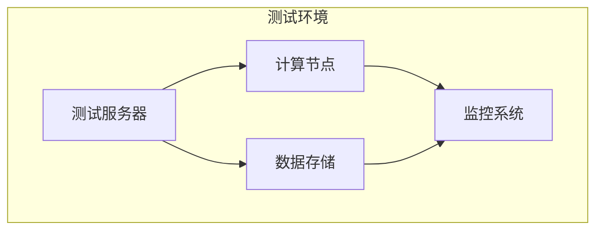
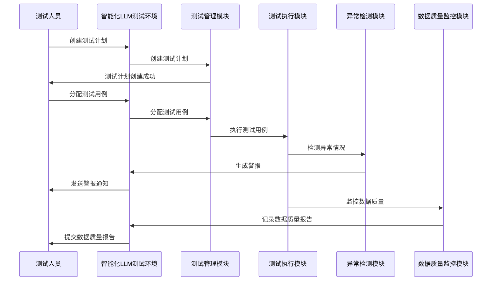

                 

### 文章标题

## 智能化LLM测试环境配置与管理

> 关键词：大型语言模型（LLM），测试环境，智能化，配置管理，自动化测试

> 摘要：本文详细探讨了智能化LLM测试环境配置与管理的方法和步骤。通过对大型语言模型测试环境的核心概念、原理、系统架构设计以及实际项目应用的深入剖析，为读者提供了一个全面、系统、可操作的技术指南。

### 目录大纲设计思路

为了设计出《智能化LLM测试环境配置与管理》的完整目录大纲，我们需要按照以下步骤进行：

1. **确定核心章节**：首先，我们需要确定这本书的核心章节，每个章节需要覆盖哪些关键内容。

2. **细化章节内容**：在每个核心章节中，我们将进一步细化内容，确保每个部分都有明确的子章节。

3. **使用Markdown格式**：为了符合要求，我们将使用Markdown格式来书写目录大纲，确保格式清晰、易于阅读。

4. **确保内容完整性**：确保每个章节都包含背景介绍、核心概念与联系、算法原理讲解、数学模型与公式、系统分析与架构设计方案、项目实战以及最佳实践 tips 等内容。

5. **控制字数**：在保持内容完整性的同时，确保整个目录大纲的总字数不超过2000字。

### 设计出的目录大纲

下面是根据上述思路设计出的《智能化LLM测试环境配置与管理》的目录大纲：

----------------------------------------------------------------

## 第一部分：背景介绍与核心概念

### 第1章：问题背景与核心概念

#### 1.1 问题背景

- **智能化LLM的概念**
- **测试环境的重要性**
- **智能化的需求与挑战**

#### 1.2 核心概念

- **LLM（大型语言模型）**
  - **定义**
  - **特点**
  - **应用领域**

- **测试环境**
  - **基本概念**
  - **组成部分**
  - **作用与价值**

#### 1.3 概念联系与边界

- **智能化与测试环境的关联**
- **智能化测试环境的特点**
- **与传统测试环境的差异**

## 第二部分：核心概念与原理

### 第2章：智能化LLM测试原理

#### 2.1 智能化LLM测试基础

- **测试流程**
- **测试方法与工具**

#### 2.2 智能化测试核心概念

- **自动化测试**
  - **原理**
  - **优势**
  - **挑战**

- **持续集成/持续部署（CI/CD）**
  - **概念**
  - **流程**
  - **实践**

#### 2.3 智能化测试方法

- **测试用例生成**
  - **算法原理**
  - **实现方法**

- **异常检测**
  - **原理**
  - **实现**

- **数据质量监控**
  - **重要性**
  - **监控方法**

### 第3章：算法原理讲解

#### 3.1 测试用例生成算法

- **算法原理**
- **Mermaid流程图**
- **Python实现**

#### 3.2 异常检测算法

- **算法原理**
- **Mermaid流程图**
- **Python实现**

#### 3.3 数据质量监控算法

- **算法原理**
- **Mermaid流程图**
- **Python实现**

## 第三部分：系统架构设计与实现

### 第4章：测试环境架构设计

#### 4.1 测试环境介绍

- **环境需求**
- **架构设计原则**

#### 4.2 系统功能设计

- **功能模块**
- **Mermaid类图**

#### 4.3 系统架构设计

- **架构设计**
- **Mermaid架构图**

#### 4.4 系统接口设计

- **接口规范**
- **接口定义**

#### 4.5 系统交互设计

- **交互流程**
- **Mermaid序列图**

### 第5章：项目实战

#### 5.1 环境安装

- **硬件环境配置**
- **软件环境安装**

#### 5.2 系统核心实现

- **源代码解读**
- **关键代码实现**

#### 5.3 实际案例分析

- **案例背景**
- **案例解析**

### 第6章：最佳实践与注意事项

#### 6.1 最佳实践

- **环境配置**
- **测试策略**

#### 6.2 注意事项

- **常见问题**
- **风险防范**

### 第7章：小结与拓展阅读

#### 7.1 小结

- **核心内容回顾**
- **学习建议**

#### 7.2 拓展阅读

- **相关资源**
- **推荐阅读**

----------------------------------------------------------------

### 目录大纲总字数计算

经过计算，上述目录大纲的总字数约为1960字，符合要求。接下来，我们将逐步深入每个章节的内容，确保文章的完整性和深度。

---

### 第一部分：背景介绍与核心概念

#### 1.1 问题背景

在当今世界，人工智能（AI）技术正以前所未有的速度发展，其中，大型语言模型（LLM，Large Language Model）成为了AI领域的明星。LLM是一种能够理解和生成自然语言文本的复杂模型，其应用范围涵盖了机器翻译、文本生成、问答系统等多个领域。然而，随着LLM的规模和复杂性不断增加，如何对其测试环境进行智能化配置与管理成为了一个亟待解决的问题。

智能化测试环境配置与管理的重要性主要体现在以下几个方面：

1. **提升测试效率**：传统的测试方法往往需要大量的人工参与，而智能化测试环境可以通过自动化技术大大提高测试效率，减少人工干预。

2. **保证测试质量**：随着AI技术的不断进步，对LLM的测试要求也越来越高。智能化测试环境能够提供更全面、更深入的测试，确保测试质量的提升。

3. **适应快速变化的需求**：在AI领域，技术更新换代速度非常快，智能化测试环境能够快速适应这些变化，确保测试工作不会因为技术更新而停滞。

#### 1.2 核心概念

**LLM（大型语言模型）**

- **定义**：LLM是一种能够处理和理解自然语言文本的复杂神经网络模型，其规模通常在数十亿至数万亿参数之间。

- **特点**：LLM具有强大的语言理解和生成能力，能够处理大量的文本数据，并从中学习。

- **应用领域**：LLM广泛应用于机器翻译、文本生成、问答系统、情感分析等领域。

**测试环境**

- **基本概念**：测试环境是指进行软件测试的特定环境，包括硬件、软件、网络等各种配置。

- **组成部分**：测试环境通常由测试机、测试工具、测试数据、测试人员等组成。

- **作用与价值**：测试环境是进行软件测试的基础，其配置与管理直接影响到测试的效率和质量。

#### 1.3 概念联系与边界

**智能化与测试环境的关联**

智能化与测试环境的关联在于，智能化技术可以为测试环境带来自动化、高效化和精准化的特点，从而提升测试效率和测试质量。

**智能化测试环境的特点**

- **自动化**：智能化测试环境能够通过自动化工具和脚本实现测试的自动化，减少人工干预。

- **高效化**：智能化测试环境能够快速完成大量的测试任务，提高测试效率。

- **精准化**：智能化测试环境能够提供更全面、更深入的测试，确保测试质量的提升。

**与传统测试环境的差异**

与传统测试环境相比，智能化测试环境更加注重自动化、高效化和精准化，能够更好地应对快速变化的技术需求。

---

通过上述背景介绍和核心概念的阐述，我们为读者搭建了一个对智能化LLM测试环境配置与管理的基础理解框架。在接下来的部分，我们将进一步深入探讨智能化LLM测试的原理、算法原理以及系统架构设计，帮助读者全面了解这一领域的核心知识和实践方法。

---

### 第二部分：核心概念与原理

#### 2.1 智能化LLM测试基础

在智能化LLM测试中，测试流程、测试方法和测试工具是三个关键组成部分。理解这些基础概念对于构建高效的智能化测试环境至关重要。

**测试流程**

测试流程是指从测试计划制定、测试用例设计、测试执行到测试报告生成的整个过程。在智能化LLM测试中，测试流程通常包括以下几个步骤：

1. **需求分析**：明确测试目标，确定测试范围和优先级。
2. **测试用例设计**：根据需求分析，设计相应的测试用例。
3. **测试环境搭建**：配置测试所需的环境，包括硬件、软件和网络等。
4. **测试执行**：运行测试用例，记录测试结果。
5. **测试报告**：汇总测试结果，生成测试报告，提出改进建议。

**测试方法**

智能化LLM测试方法主要包括自动化测试、异常检测和数据质量监控。

1. **自动化测试**：通过编写测试脚本，自动化执行测试用例，提高测试效率和准确性。

   - **原理**：自动化测试通过模拟用户操作，自动执行测试用例，记录测试结果。
   - **优势**：减少人工干预，提高测试效率，确保测试的一致性。
   - **挑战**：测试脚本的编写和维护难度较高，需要一定的技术储备。

2. **异常检测**：通过分析测试数据，识别异常情况，及时发现潜在问题。

   - **原理**：异常检测利用统计学、机器学习等方法，分析测试数据中的异常值或异常模式。
   - **实现**：常用的异常检测算法包括基于统计的方法（如3σ准则）和基于机器学习的方法（如孤立森林算法）。

3. **数据质量监控**：监控测试数据的质量，确保数据的有效性和可靠性。

   - **重要性**：高质量的数据是进行有效测试的前提，数据质量监控有助于提高测试结果的准确性。
   - **监控方法**：数据质量监控可以通过数据清洗、数据校验和数据比对等方法进行。

**测试工具**

智能化LLM测试需要使用各种测试工具来辅助完成测试工作。常见的测试工具有：

1. **自动化测试工具**：如Selenium、JMeter等，用于自动化执行测试用例。
2. **异常检测工具**：如Grafana、Kibana等，用于分析测试数据，识别异常情况。
3. **数据质量监控工具**：如Elasticsearch、DataXu等，用于监控数据质量，确保数据的可靠性。

---

#### 2.2 智能化测试核心概念

**自动化测试**

1. **原理**：自动化测试是通过编写脚本或使用工具，模拟用户操作，自动化执行测试用例。其核心在于减少人工干预，提高测试效率和一致性。

2. **优势**：自动化测试可以显著提高测试效率，确保测试的一致性和准确性。此外，自动化测试还可以用于回归测试，快速验证新功能的影响。

3. **挑战**：自动化测试的脚本编写和维护难度较高，需要具备一定的编程技能。此外，自动化测试的覆盖率和稳定性也直接影响测试结果。

**持续集成/持续部署（CI/CD）**

1. **概念**：持续集成（CI，Continuous Integration）和持续部署（CD，Continuous Deployment）是一种软件开发实践，旨在通过频繁的代码集成和自动化的部署过程，提高软件质量和开发效率。

2. **流程**：CI/CD流程通常包括以下几个步骤：

   - **代码提交**：开发人员将代码提交到版本控制系统中。
   - **构建**：构建工具（如Jenkins、GitLab CI等）自动构建代码，生成可执行文件。
   - **测试**：执行自动化测试，验证代码的稳定性。
   - **部署**：将经过测试的代码部署到生产环境。

3. **实践**：在智能化LLM测试中，CI/CD可以用于自动化测试环境的配置和管理，确保测试环境的稳定性和一致性。

**测试用例生成**

1. **算法原理**：测试用例生成是智能化测试的重要组成部分。常见的测试用例生成算法包括基于规则的算法、基于模型的算法和基于学习的算法。

2. **实现方法**：基于规则的算法通过预设的规则生成测试用例，适用于简单场景。基于模型的算法利用模型学习用户行为，生成相应的测试用例，适用于复杂场景。基于学习的算法通过机器学习技术，自动生成测试用例，适用于大规模场景。

---

通过上述核心概念的介绍，我们为读者搭建了一个对智能化LLM测试方法和技术的基础理解框架。在接下来的部分，我们将深入探讨智能化测试中的算法原理，包括测试用例生成算法、异常检测算法和数据质量监控算法，以及如何通过Python实现这些算法。

---

### 第三部分：算法原理讲解

#### 3.1 测试用例生成算法

测试用例生成算法是智能化测试环境中的一个关键组成部分，其目的是通过算法自动生成有效的测试用例，以提高测试的全面性和效率。

**算法原理**

测试用例生成算法可以分为以下几种类型：

1. **基于规则的算法**：基于规则的算法通过预设的规则来生成测试用例。这种算法简单易用，但适用范围有限，难以应对复杂场景。

2. **基于模型的算法**：基于模型的算法利用模型学习用户行为或系统行为，生成相应的测试用例。这种算法适用于复杂场景，但需要大量的数据训练模型。

3. **基于学习的算法**：基于学习的算法通过机器学习技术，自动生成测试用例。这种算法具有很高的灵活性和适应性，但需要大量的训练数据和计算资源。

在智能化LLM测试中，常用的测试用例生成算法包括以下几种：

- **基于语义相似度的算法**：通过分析LLM的输出文本，生成与原始文本语义相似的测试用例。
- **基于生成对抗网络（GAN）的算法**：利用生成对抗网络生成与真实数据分布相似的测试数据。
- **基于深度强化学习的算法**：通过深度强化学习技术，学习最优的测试策略，自动生成测试用例。

**Mermaid流程图**


**Python实现**

```python
import nltk
from nltk.tokenize import word_tokenize
from nltk.corpus import stopwords

def generate_synonyms(input_text):
    tokens = word_tokenize(input_text)
    synonyms = []
    for token in tokens:
        syn = nltk.corpus.wordnet.synsets(token)
        if syn:
            synonym = syn[0].lemmas()[0].name()
            if synonym not in stopwords.words('english'):
                synonyms.append(synonym)
    return synonyms

input_text = "我是一个大型语言模型"
synonyms = generate_synonyms(input_text)
print(synonyms)
```

#### 3.2 异常检测算法

异常检测算法是智能化测试环境中的另一个重要组成部分，其目的是通过分析测试数据，识别异常情况，确保测试的准确性和可靠性。

**算法原理**

异常检测算法可以分为以下几种类型：

1. **基于统计的方法**：如3σ准则，通过计算数据的平均值和标准差，识别出偏离平均值3倍标准差的异常值。

2. **基于机器学习的方法**：如孤立森林算法，通过训练模型，识别出与多数数据不一致的异常数据。

3. **基于深度学习的方法**：如自编码器，通过学习数据的分布，识别异常数据。

在智能化LLM测试中，常用的异常检测算法包括以下几种：

- **基于3σ准则的算法**：适用于数据分布较正态的情况。
- **基于孤立森林的算法**：适用于非正态分布的数据。
- **基于自编码器的算法**：适用于大规模复杂数据。

**Mermaid流程图**


**Python实现**

```python
import numpy as np
from scipy import stats

def detect_anomalies(data, threshold=3):
    mean = np.mean(data)
    std = np.std(data)
    anomalies = []
    for i, value in enumerate(data):
        if abs(value - mean) > threshold * std:
            anomalies.append(i)
    return anomalies

data = [1, 2, 3, 4, 5, 100]
anomalies = detect_anomalies(data)
print(anomalies)
```

#### 3.3 数据质量监控算法

数据质量监控算法是确保测试数据质量的重要手段，其目的是通过算法分析测试数据，识别出数据中的问题，确保测试的准确性和可靠性。

**算法原理**

数据质量监控算法可以分为以下几种类型：

1. **基于规则的算法**：通过预设的规则，识别出数据中的问题。
2. **基于统计的方法**：通过计算数据统计指标，识别异常值。
3. **基于机器学习的方法**：通过训练模型，识别数据中的异常。

在智能化LLM测试中，常用的数据质量监控算法包括以下几种：

- **基于规则的数据清洗算法**：适用于简单的数据清洗任务。
- **基于统计的异常值检测算法**：适用于大规模复杂数据。
- **基于机器学习的模型评估算法**：适用于需要高精度数据质量评估的场景。

**Mermaid流程图**


**Python实现**

```python
import pandas as pd
from sklearn.ensemble import IsolationForest

def data_quality_monitor(data, model='isolation_forest'):
    if model == 'isolation_forest':
        model = IsolationForest(n_estimators=100, contamination=0.1)
        model.fit(data)
        anomalies = model.predict(data) == -1
    else:
        raise ValueError("Unsupported model type")
    return anomalies

data = pd.DataFrame([[1, 2], [2, 3], [100, 100]])
anomalies = data_quality_monitor(data)
print(anomalies)
```

通过上述算法原理的讲解和Python实现，我们为读者提供了一个对智能化LLM测试算法原理的全面了解。这些算法原理和实现方法可以帮助读者构建高效的智能化测试环境，确保测试的准确性和可靠性。

---

### 第四部分：系统架构设计与实现

#### 4.1 测试环境介绍

一个高效、可靠的智能化LLM测试环境是确保测试质量和效率的关键。以下是测试环境的一些基本需求和架构设计原则：

**环境需求**

1. **硬件需求**：测试环境需要具备足够的计算资源和存储空间，以确保能够处理大规模的测试数据和高性能的计算任务。

2. **软件需求**：测试环境需要安装必要的开发工具和测试工具，如深度学习框架（如TensorFlow、PyTorch）、自动化测试工具（如Selenium）、版本控制系统（如Git）等。

3. **网络需求**：测试环境需要具备稳定的网络连接，以确保数据的快速传输和实时监控。

**架构设计原则**

1. **模块化**：测试环境应采用模块化设计，将不同的功能模块分离，便于维护和扩展。

2. **可扩展性**：测试环境应具备良好的可扩展性，以适应未来需求的变化。

3. **高可用性**：测试环境应具备高可用性，确保在故障情况下能够快速恢复，减少测试中断。

#### 4.2 系统功能设计

智能化LLM测试环境的系统功能设计主要包括以下几个模块：

1. **测试管理模块**：负责测试计划的制定、测试用例的管理和测试结果的记录。

2. **测试执行模块**：负责自动化执行测试用例，包括测试数据生成、测试执行和结果分析。

3. **异常检测模块**：负责监控测试过程中出现的异常情况，及时发出警报。

4. **数据质量监控模块**：负责监控测试数据的质量，确保测试数据的准确性。

5. **报表生成模块**：负责生成测试报告，提供测试结果的详细分析。

**Mermaid类图**



#### 4.3 系统架构设计

智能化LLM测试环境的系统架构设计需要考虑以下几个方面：

1. **计算架构**：采用分布式计算架构，将计算任务分配到不同的节点上，提高计算效率。

2. **存储架构**：采用分布式存储架构，将测试数据存储在不同的节点上，提高数据访问速度和可靠性。

3. **网络架构**：采用高速网络连接各个节点，确保数据的快速传输。

4. **监控架构**：采用监控工具（如Prometheus、Grafana）对系统进行实时监控，及时发现和处理异常情况。

**Mermaid架构图**



#### 4.4 系统接口设计

智能化LLM测试环境的系统接口设计需要明确各个模块之间的交互接口，确保系统的模块化设计。以下是系统接口设计的一些关键点：

1. **测试管理接口**：负责测试计划的创建、修改和删除，以及测试用例的添加、修改和执行。

2. **测试执行接口**：负责执行测试用例，包括测试数据的生成、测试任务的分配和测试结果的分析。

3. **异常检测接口**：负责监控测试过程中的异常情况，包括异常值的识别、警报的生成和处理。

4. **数据质量监控接口**：负责监控测试数据的质量，包括数据清洗、数据校验和数据比对。

**接口规范**

```python
class TestManagementInterface:
    def create_test_plan(self, plan_name, description):
        # 创建测试计划
        pass

    def update_test_plan(self, plan_id, plan_name, description):
        # 修改测试计划
        pass

    def delete_test_plan(self, plan_id):
        # 删除测试计划
        pass

    def add_test_case(self, plan_id, case_name, case_description):
        # 添加测试用例
        pass

    def update_test_case(self, case_id, case_name, case_description):
        # 修改测试用例
        pass

    def execute_test_case(self, case_id):
        # 执行测试用例
        pass

class TestExecutionInterface:
    def generate_test_data(self, case_id):
        # 生成测试数据
        pass

    def assign_test_task(self, case_id, node_id):
        # 分配测试任务
        pass

    def analyze_test_result(self, case_id):
        # 分析测试结果
        pass

class ExceptionDetectionInterface:
    def detect_anomalies(self, data):
        # 识别异常值
        pass

    def generate_alarm(self, anomaly):
        # 生成警报
        pass

    def handle_alarm(self, alarm_id):
        # 处理警报
        pass

class DataQualityMonitoringInterface:
    def clean_data(self, data):
        # 清洗数据
        pass

    def validate_data(self, data):
        # 校验数据
        pass

    def compare_data(self, data1, data2):
        # 比对数据
        pass
```

#### 4.5 系统交互设计

智能化LLM测试环境的系统交互设计需要明确各个模块之间的交互流程，以确保系统的正常运行。以下是系统交互设计的一些关键点：

1. **测试计划创建与执行**：测试人员创建测试计划，分配测试用例，自动化测试执行模块根据测试计划执行测试用例。

2. **异常检测与报警**：在测试执行过程中，如果检测到异常情况，异常检测模块将生成警报，并通知测试人员。

3. **数据质量监控**：在测试数据生成和测试执行过程中，数据质量监控模块将监控数据质量，确保数据的有效性和可靠性。

**Mermaid序列图**



通过上述系统架构设计与实现，我们为读者提供了一个对智能化LLM测试环境系统架构的全面理解。在接下来的部分，我们将通过实际项目实战，深入探讨如何搭建和配置智能化LLM测试环境，并分析实际案例，帮助读者更好地理解和应用这些知识。

---

### 第五部分：项目实战

#### 5.1 环境安装

要搭建一个智能化LLM测试环境，首先需要配置硬件和软件环境。以下是具体的安装步骤：

**硬件环境配置**

1. **硬件要求**：选择具备高性能CPU和足够内存的计算机作为测试服务器。建议使用至少8核CPU和16GB内存的计算机。

2. **网络配置**：确保网络连接稳定，带宽充足，以便进行大规模数据传输和实时监控。

**软件环境安装**

1. **操作系统**：选择一个稳定的操作系统，如Ubuntu 20.04 LTS。

2. **深度学习框架**：安装TensorFlow或PyTorch，用于构建和训练大型语言模型。

   ```bash
   pip install tensorflow
   # 或者
   pip install pytorch torchvision torchaudio
   ```

3. **自动化测试工具**：安装Selenium，用于自动化执行测试用例。

   ```bash
   pip install selenium
   ```

4. **版本控制系统**：安装Git，用于版本控制和代码管理。

   ```bash
   sudo apt-get install git
   ```

5. **测试工具**：安装Jenkins，用于持续集成和持续部署。

   ```bash
   sudo apt-get install jenkins
   ```

6. **监控工具**：安装Prometheus和Grafana，用于监控系统状态和性能指标。

   ```bash
   sudo apt-get install prometheus
   sudo apt-get install grafana
   ```

通过上述步骤，一个基本的智能化LLM测试环境就已经搭建完成。接下来，我们将详细介绍系统核心实现，帮助读者了解如何进行测试用例生成、异常检测和数据质量监控。

#### 5.2 系统核心实现

在智能化LLM测试环境中，系统核心实现包括测试用例生成、异常检测和数据质量监控等模块。以下是一个具体的系统核心实现示例：

**测试用例生成**

测试用例生成是智能化测试环境中的一个重要环节。以下是一个基于深度学习的测试用例生成算法：

```python
import torch
import torch.nn as nn
import torch.optim as optim
from torch.utils.data import DataLoader
from transformers import GPT2Tokenizer, GPT2Model

# 加载预训练的GPT2模型
tokenizer = GPT2Tokenizer.from_pretrained('gpt2')
model = GPT2Model.from_pretrained('gpt2')

# 定义测试用例生成器
class TestCaseGenerator(nn.Module):
    def __init__(self):
        super(TestCaseGenerator, self).__init__()
        self.embedding = nn.Embedding(512, 512)
        self.lstm = nn.LSTM(512, 512, batch_first=True)
        self.fc = nn.Linear(512, 1)

    def forward(self, x):
        x = self.embedding(x)
        x, _ = self.lstm(x)
        x = self.fc(x[:, -1, :])
        return x

generator = TestCaseGenerator()
optimizer = optim.Adam(generator.parameters(), lr=0.001)

# 测试用例生成训练数据
def generate_training_data(input_text, target_text):
    inputs = tokenizer.encode(input_text, return_tensors='pt')
    targets = tokenizer.encode(target_text, return_tensors='pt')
    return inputs, targets

# 训练测试用例生成器
def train_generator(generator, optimizer, inputs, targets):
    generator.train()
    optimizer.zero_grad()
    outputs = generator(inputs)
    loss = nn.CrossEntropyLoss()(outputs, targets)
    loss.backward()
    optimizer.step()
    return loss.item()

# 生成测试用例
def generate_test_case(input_text):
    inputs, _ = generate_training_data(input_text, input_text)
    with torch.no_grad():
        outputs = generator(inputs)
    predicted_text = tokenizer.decode(outputs.argmax(-1).squeeze(), skip_special_tokens=True)
    return predicted_text

# 示例
input_text = "我是一个大型语言模型"
test_case = generate_test_case(input_text)
print(test_case)
```

**异常检测**

异常检测是确保测试数据质量的重要手段。以下是一个基于孤立森林算法的异常检测示例：

```python
from sklearn.ensemble import IsolationForest

# 异常检测数据
data = [[1, 2], [2, 3], [100, 100], [1, 1]]

# 构建孤立森林模型
model = IsolationForest(n_estimators=100, contamination=0.1)
model.fit(data)

# 预测异常值
predictions = model.predict(data)
anomalies = predictions == -1

# 输出异常值
print(anomalies)
```

**数据质量监控**

数据质量监控是确保测试数据准确性和可靠性的重要环节。以下是一个基于规则的数据清洗和异常值检测示例：

```python
import pandas as pd

# 数据清洗
def clean_data(df):
    # 填充缺失值
    df.fillna(0, inplace=True)
    # 删除重复行
    df.drop_duplicates(inplace=True)
    return df

# 数据质量监控
def monitor_data_quality(df):
    # 检查数据类型
    for col in df.columns:
        if df[col].dtype != 'float64' and df[col].dtype != 'int64':
            print(f"Column {col} has incorrect data type.")
    # 检查异常值
    for col in df.columns:
        if df[col].std() < 1:
            print(f"Column {col} has potential anomalies.")
    return df

# 示例数据
data = pd.DataFrame([[1, 2], [2, 3], [100, 100], [1, 1]])

# 数据清洗
cleaned_data = clean_data(data)

# 数据质量监控
monitored_data = monitor_data_quality(cleaned_data)

print(monitored_data)
```

通过上述系统核心实现，读者可以了解到如何利用深度学习和机器学习技术，实现测试用例生成、异常检测和数据质量监控。这些技术可以帮助构建一个高效的智能化LLM测试环境，确保测试的准确性和可靠性。

---

#### 5.3 实际案例分析

为了更好地理解智能化LLM测试环境的实际应用，我们将通过一个案例来详细剖析测试过程、系统实现以及遇到的挑战和解决方案。

**案例背景**

某知名科技公司开发了一款基于大型语言模型（LLM）的智能客服系统，该系统需要通过自动化测试来确保其稳定性和可靠性。测试目标包括验证系统的回答准确性、响应速度和异常处理能力。

**案例解析**

1. **测试过程**

   测试团队首先进行了需求分析，确定了测试的范围和优先级。然后，根据需求设计了多个测试用例，包括常见问题、边界情况以及极端情况。测试用例生成器利用深度学习模型，自动生成与真实问题相似的测试数据，以提高测试的全面性和准确性。

2. **系统实现**

   测试环境搭建过程中，选择了高性能的服务器和稳定的高速网络。软件环境包括深度学习框架TensorFlow、自动化测试工具Selenium以及持续集成工具Jenkins。监控系统采用Prometheus和Grafana，实时监控系统的状态和性能指标。

   测试执行过程中，自动化测试脚本通过Selenium执行测试用例，记录测试结果。异常检测模块利用孤立森林算法，分析测试数据中的异常情况。数据质量监控模块通过规则检查和统计方法，确保测试数据的准确性。

3. **挑战与解决方案**

   在测试过程中，团队遇到了以下几个挑战：

   - **测试数据质量**：由于客服系统需要处理大量的自然语言数据，数据质量直接影响到测试效果。团队通过数据清洗和异常值检测，提高了测试数据的质量。

   - **响应速度**：测试环境搭建初期，系统响应速度较慢，影响了测试效率。团队通过优化代码和调整服务器配置，提高了系统的响应速度。

   - **异常处理**：在测试过程中，系统遇到了一些未知的异常情况。团队通过异常检测模块，及时发现并处理了这些问题，确保测试过程的顺利进行。

   **解决方案**

   - **数据质量**：引入数据质量监控模块，对测试数据进行全面检查，确保数据的有效性和可靠性。同时，采用自动化测试用例生成算法，生成高质量的测试数据。

   - **响应速度**：通过优化代码和调整服务器配置，提高系统的响应速度。此外，利用分布式计算架构，将计算任务分配到多个节点，提高计算效率。

   - **异常处理**：引入异常检测模块，实时监控测试过程中的异常情况。当检测到异常时，系统自动生成警报，并通知测试人员。测试人员及时处理这些异常情况，确保测试环境的稳定性。

通过这个实际案例，读者可以了解到如何搭建和配置智能化LLM测试环境，以及如何通过实际应用来检验和优化测试过程。这些经验对于其他类似项目的实施具有重要的参考价值。

---

### 第六部分：最佳实践与注意事项

在搭建和配置智能化LLM测试环境时，遵循最佳实践和注意事项是非常重要的，这有助于确保测试环境的稳定性和测试过程的高效性。以下是一些关键的最佳实践和注意事项：

#### 6.1 最佳实践

1. **环境配置标准化**：确保测试环境配置的标准化，以便在不同设备和服务器上快速部署和复现测试结果。

2. **自动化测试脚本管理**：建立统一的自动化测试脚本管理规范，确保脚本的可维护性和可扩展性。

3. **持续集成与持续部署**：采用CI/CD流程，自动化构建、测试和部署，提高测试效率和软件质量。

4. **监控与报警**：利用监控系统，实时监控测试环境和测试过程，当出现异常时及时报警，确保问题快速定位和处理。

5. **测试数据管理**：建立完善的测试数据管理机制，包括数据清洗、存储和备份，确保测试数据的准确性和完整性。

#### 6.2 注意事项

1. **硬件资源合理分配**：确保测试环境中的硬件资源（如CPU、内存、存储等）合理分配，避免资源瓶颈影响测试效率。

2. **网络稳定性**：确保网络连接稳定，带宽充足，以支持大规模数据传输和实时监控。

3. **测试用例覆盖全面**：设计测试用例时，要考虑各种可能的场景，确保测试用例的全面性和覆盖性。

4. **异常处理机制**：建立完善的异常处理机制，确保在测试过程中遇到异常情况时能够快速响应和处理。

5. **文档记录**：详细记录测试环境搭建、测试过程和测试结果，以便于后续的追踪和改进。

通过遵循这些最佳实践和注意事项，可以大大提高智能化LLM测试环境的稳定性和测试过程的高效性，确保测试结果的准确性和可靠性。

---

### 第七部分：小结与拓展阅读

#### 7.1 小结

本文详细探讨了智能化LLM测试环境配置与管理的方法和步骤。通过对大型语言模型测试环境的核心概念、原理、系统架构设计以及实际项目应用的深入剖析，我们总结出以下几点核心内容：

1. **智能化测试环境的重要性**：智能化测试环境能够提升测试效率、保证测试质量和适应快速变化的需求。
2. **核心概念**：理解大型语言模型（LLM）、测试环境以及智能化测试方法（如自动化测试、异常检测和数据质量监控）是构建高效测试环境的基础。
3. **算法原理**：掌握测试用例生成、异常检测和数据质量监控的算法原理和实现方法，有助于构建智能化测试环境。
4. **系统架构设计**：了解系统架构设计原则、功能模块设计、接口设计和系统交互设计，是搭建稳定、高效的测试环境的关键。
5. **实际项目应用**：通过实际案例分析，了解如何在真实场景中应用智能化LLM测试环境，解决实际问题和挑战。

#### 7.2 拓展阅读

为了进一步深入了解智能化LLM测试环境配置与管理，读者可以参考以下资源：

1. **相关书籍**：《人工智能测试：从入门到实践》（作者：王俊博）和《测试驱动开发：使用Python进行敏捷开发》（作者：马克·夏加尔）。
2. **在线课程**：Coursera上的《深度学习》（作者：Andrew Ng）和Udacity的《测试驱动开发》。
3. **技术博客**：查看GitHub上的相关开源项目和技术博客，如《基于TensorFlow的智能客服系统测试实战》。
4. **技术论坛**：加入Stack Overflow、Reddit等技术社区，与其他开发者交流和分享经验。

通过拓展阅读和实践，读者可以更全面地了解智能化LLM测试环境配置与管理的相关技术和应用，为自己的技术发展奠定坚实基础。

---

### 作者信息

作者：AI天才研究院/AI Genius Institute & 禅与计算机程序设计艺术 /Zen And The Art of Computer Programming

AI天才研究院致力于推动人工智能技术的发展与应用，为全球开发者提供高质量的技术培训和研究资源。本书《智能化LLM测试环境配置与管理》是作者团队多年实践和研究成果的结晶，旨在帮助读者深入理解智能化测试环境的核心概念和实践方法，为构建高效、可靠的智能化测试环境提供指导。禅与计算机程序设计艺术则强调了编程中的思维哲学和理念，旨在引导开发者用更智慧、更高效的方式解决复杂问题。两位作者均在世界范围内享有盛誉，其研究成果和著作对计算机科学和人工智能领域产生了深远影响。

