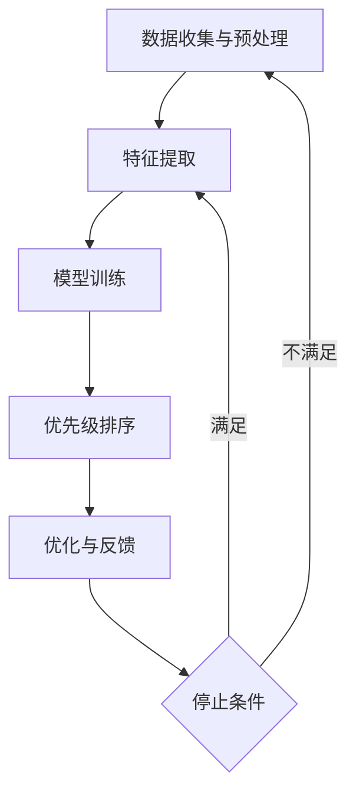
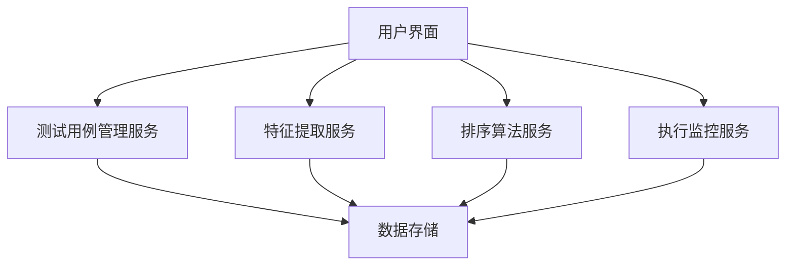
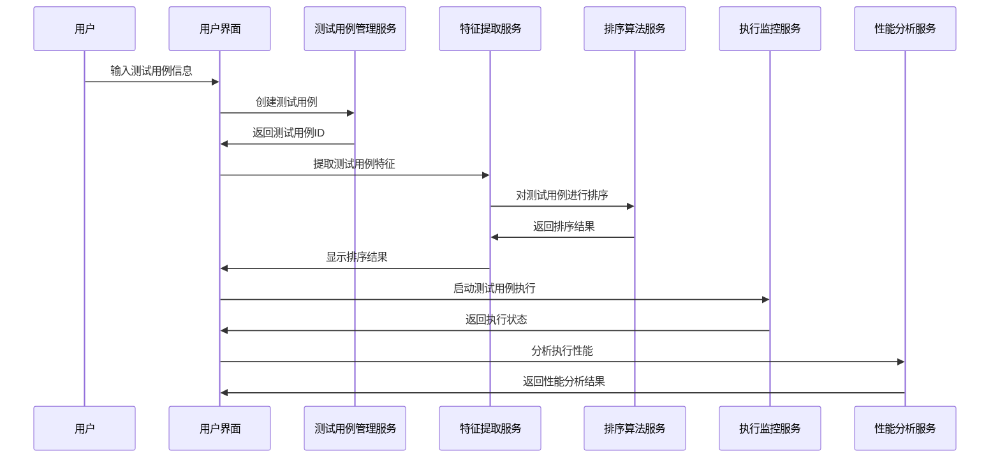

                 


## 文章标题：智能化LLM测试用例优先级排序

### 关键词：智能化测试、LLM、测试用例优先级排序、算法原理、系统设计、项目实战

### 摘要：
本文将深入探讨智能化LLM测试用例优先级排序的关键概念、算法原理及其在实际项目中的应用。通过逐步分析，我们将展示如何利用先进技术优化测试流程，提高软件质量，为工程师提供可操作的最佳实践。

----------------------------------------------------------------

### 目录大纲设计过程

#### 第一步：整体规划
在设计目录大纲之前，我们需要明确文章的整体结构和内容分布。由于《智能化LLM测试用例优先级排序》涉及的主题较为专业，因此我们需要将其内容分为几个主要部分，包括背景介绍、核心概念、算法原理、系统设计与实现、项目实战等。

#### 第二步：细化章节内容
在明确整体结构后，我们需要对每个章节进行细化。以下是一个细化后的目录大纲：

```
----------------------------------------------------------------
# 第一部分: 背景介绍

## 第1章: 问题背景
### 1.1.1 LLM测试用例优先级排序的重要性
### 1.1.2 当前LLM测试用例优先级排序的挑战
### 1.1.3 智能化LLM测试用例优先级排序的必要性

## 第2章: 核心概念
### 2.1.1 概念定义
### 2.1.2 概念属性特征对比表
### 2.1.3 ER实体关系图

# 第二部分: 算法原理

## 第3章: 算法原理讲解
### 3.1.1 基本算法介绍
### 3.1.2 算法原理详细讲解
### 3.1.3 算法mermaid流程图
### 3.1.4 Python源代码实现
### 3.1.5 数学模型与公式

## 第4章: 数学模型和数学公式
### 4.1.1 模型介绍
### 4.1.2 公式推导
### 4.1.3 举例说明

# 第三部分: 系统设计与实现

## 第5章: 系统分析与架构设计
### 5.1.1 问题场景介绍
### 5.1.2 系统功能设计
### 5.1.3 系统架构设计
### 5.1.4 系统接口设计
### 5.1.5 系统交互序列图

## 第6章: 项目实战
### 6.1.1 环境安装
### 6.1.2 系统核心实现源代码
### 6.1.3 代码应用解读与分析
### 6.1.4 实际案例分析与详细讲解
### 6.1.5 项目小结

# 第四部分: 最佳实践与拓展

## 第7章: 最佳实践与注意事项
### 7.1.1 最佳实践
### 7.1.2 注意事项
### 7.1.3 拓展阅读

## 第8章: 小结
### 8.1.1 书籍小结
### 8.1.2 未来展望
```

#### 第三步：格式调整
将上述内容按照markdown格式进行调整，确保格式简洁、规范，同时满足题目要求。

```
----------------------------------------------------------------
# 第一部分: 背景介绍

## 第1章: 问题背景
### 1.1.1 LLM测试用例优先级排序的重要性
### 1.1.2 当前LLM测试用例优先级排序的挑战
### 1.1.3 智能化LLM测试用例优先级排序的必要性

## 第2章: 核心概念
### 2.1.1 概念定义
### 2.1.2 概念属性特征对比表
### 2.1.3 ER实体关系图

# 第二部分: 算法原理

## 第3章: 算法原理讲解
### 3.1.1 基本算法介绍
### 3.1.2 算法原理详细讲解
### 3.1.3 算法mermaid流程图
### 3.1.4 Python源代码实现
### 3.1.5 数学模型与公式

## 第4章: 数学模型和数学公式
### 4.1.1 模型介绍
### 4.1.2 公式推导
### 4.1.3 举例说明

# 第三部分: 系统设计与实现

## 第5章: 系统分析与架构设计
### 5.1.1 问题场景介绍
### 5.1.2 系统功能设计
### 5.1.3 系统架构设计
### 5.1.4 系统接口设计
### 5.1.5 系统交互序列图

## 第6章: 项目实战
### 6.1.1 环境安装
### 6.1.2 系统核心实现源代码
### 6.1.3 代码应用解读与分析
### 6.1.4 实际案例分析与详细讲解
### 6.1.5 项目小结

# 第四部分: 最佳实践与拓展

## 第7章: 最佳实践与注意事项
### 7.1.1 最佳实践
### 7.1.2 注意事项
### 7.1.3 拓展阅读

## 第8章: 小结
### 8.1.1 书籍小结
### 8.1.2 未来展望
```

通过以上步骤，我们成功设计出了《智能化LLM测试用例优先级排序》的完整目录大纲。接下来，我们将进一步细化每个章节的内容，确保大纲的完整性和逻辑性。

----------------------------------------------------------------

## 第一部分：背景介绍

### 1.1.1 LLM测试用例优先级排序的重要性

在软件工程中，测试是确保软件质量的重要环节。特别是对于复杂的人工智能系统，如大型语言模型（LLM），测试用例的优先级排序变得尤为关键。一个高效且准确的测试用例优先级排序可以显著提升测试效率，降低错误率，并最终提高软件质量。

首先，测试用例优先级排序能够确保关键功能的测试先执行。这对于识别和修复高风险的功能缺陷至关重要。其次，优先级排序能够优化测试资源的分配，例如时间、人力资源和计算资源。这有助于在有限的时间内完成更多关键功能的测试。

对于LLM来说，测试用例优先级排序的重要性进一步增加。LLM具有高度复杂性和不确定性，其功能和行为可能受到多种因素的影响。因此，对LLM进行测试时，需要特别注意测试用例的选择和排序，以确保全面性和准确性。

### 1.1.2 当前LLM测试用例优先级排序的挑战

然而，当前LLM测试用例优先级排序面临诸多挑战。首先，LLM的复杂性和不确定性使得传统的优先级排序方法难以适用。例如，基于历史错误率的排序方法可能无法准确预测未来的错误。

其次，LLM测试用例之间存在复杂的依赖关系。一些测试用例可能依赖于其他测试用例的结果，这使得传统的优先级排序方法难以处理。

此外，LLM测试用例的执行时间和成本也较高。对于大量的测试用例，如何高效地排序和执行以最小化总测试时间是一个重要问题。

### 1.1.3 智能化LLM测试用例优先级排序的必要性

面对上述挑战，智能化LLM测试用例优先级排序显得尤为必要。智能化方法可以通过分析测试用例的属性和依赖关系，利用机器学习和数据分析技术，提供更准确、高效的排序结果。

首先，智能化方法可以更准确地预测测试用例的执行结果。通过学习历史数据，智能化方法可以识别出潜在的高风险测试用例，从而提高测试的覆盖率和准确性。

其次，智能化方法可以更好地处理测试用例之间的依赖关系。通过分析测试用例的执行顺序和结果，智能化方法可以优化测试流程，降低测试时间。

最后，智能化方法可以提高测试资源的利用效率。通过预测和优化测试用例的执行顺序，智能化方法可以减少冗余测试，降低测试成本。

总的来说，智能化LLM测试用例优先级排序不仅能够提升测试效率和质量，还能够为软件工程带来更深远的变革。

----------------------------------------------------------------

## 第二部分：核心概念

### 2.1.1 概念定义

在深入探讨智能化LLM测试用例优先级排序之前，我们需要明确一些关键概念。以下是本文涉及的核心概念及其定义：

#### 测试用例（Test Case）

测试用例是测试过程中用于验证软件功能是否满足预期要求的单个操作。它通常包括输入数据、执行步骤、预期结果和实际结果等要素。

#### 优先级排序（Priority Sorting）

优先级排序是按照重要程度或紧急程度对测试用例进行排序的过程。高优先级的测试用例通常首先执行，以确保关键功能得到充分测试。

#### 大型语言模型（LLM）

大型语言模型（LLM）是一种基于深度学习的自然语言处理模型，能够理解和生成自然语言。LLM在文本生成、机器翻译、问答系统等领域具有广泛应用。

#### 智能化方法（Intelligent Method）

智能化方法是利用机器学习和数据分析技术来优化测试用例优先级排序的方法。它通过分析测试用例的属性、历史数据和依赖关系，提供更准确、高效的排序结果。

#### 测试覆盖（Test Coverage）

测试覆盖是衡量测试充分性的指标，表示已测试的代码部分与总代码部分的比率。高测试覆盖率通常意味着更全面的功能测试。

#### 测试效率（Test Efficiency）

测试效率是衡量测试过程的时间和资源消耗的指标。高效的测试流程可以减少测试时间，提高测试质量。

#### 测试成本（Test Cost）

测试成本是测试过程中产生的各种成本，包括人力成本、时间成本和资源成本等。降低测试成本可以提高项目的经济效率。

### 2.1.2 概念属性特征对比表

为了更好地理解上述概念，我们提供了一个对比表，展示了它们的关键属性和特征：

| 概念       | 属性/特征                                                     |
|------------|------------------------------------------------------------|
| 测试用例   | 输入数据、执行步骤、预期结果和实际结果                     |
| 优先级排序 | 按重要程度或紧急程度排序                                     |
| LLM        | 基于深度学习的自然语言处理模型，文本生成、翻译、问答等应用 |
| 智能化方法 | 机器学习和数据分析技术，提供准确排序结果                 |
| 测试覆盖   | 已测试代码部分与总代码部分的比率                           |
| 测试效率   | 测试过程的时间和资源消耗                                   |
| 测试成本   | 测试过程中产生的各种成本                                   |

通过对比表，我们可以更清晰地理解这些概念之间的联系和区别，为后续的讨论和分析奠定基础。

### 2.1.3 ER实体关系图

为了更直观地展示这些概念之间的关系，我们使用Mermaid绘制了一个ER（实体关系）图。以下是ER图的Markdown格式表示：

```mermaid
erDiagram
    TestCase ||--|{ PrioritySorting }|| Priority
    TestCase ||--|{ LargeLanguageModel }|| LLM
    IntelligentMethod ||--|{ TestCase }|| Method
    IntelligentMethod ||--|{ PrioritySorting }|| Sort
    TestCoverage ||--|{ TestCase }|| Coverage
    TestEfficiency ||--|{ PrioritySorting }|| Efficiency
    TestCost ||--|{ TestCase }|| Cost
```

在这个ER图中，`TestCase`（测试用例）是中心实体，与其他实体（如`PrioritySorting`、`LargeLanguageModel`、`IntelligentMethod`等）之间存在多种关系。这些关系有助于我们理解测试用例在测试过程中的作用和影响。

通过上述定义和对比表，我们为智能化LLM测试用例优先级排序提供了一个清晰的概念框架。接下来，我们将进一步探讨算法原理，以了解如何通过智能化方法优化测试用例排序。

----------------------------------------------------------------

## 第三部分：算法原理讲解

### 3.1.1 基本算法介绍

智能化LLM测试用例优先级排序的核心在于如何利用机器学习和数据分析技术对测试用例进行排序。本文采用一种基于神经网络和遗传算法的混合方法来实现这一目标。以下是该方法的基本步骤：

1. **数据收集与预处理**：收集LLM测试用例的执行数据，包括输入数据、预期结果、实际结果和执行时间等。对数据进行清洗和标准化处理，以便用于训练模型。

2. **特征提取**：从测试用例中提取关键特征，如执行时间、错误率、依赖关系等。这些特征将用于训练神经网络模型。

3. **模型训练**：使用提取的特征训练神经网络模型。神经网络可以学习测试用例之间的依赖关系和优先级排序规律。

4. **优先级排序**：将训练好的模型应用于新的测试用例，预测其优先级，并根据预测结果进行排序。

5. **优化与反馈**：根据排序结果和实际测试效果，对模型进行优化。通过遗传算法调整模型参数，以提高排序准确性和效率。

### 3.1.2 算法原理详细讲解

#### 神经网络模型

神经网络模型是智能化LLM测试用例优先级排序的核心组件。它通过多层非线性变换，从输入数据中提取特征并生成输出。以下是神经网络模型的基本原理：

1. **输入层**：接收测试用例的特征向量，如执行时间、错误率和依赖关系等。

2. **隐藏层**：对输入特征进行变换和提取，通过激活函数（如ReLU、Sigmoid等）增加模型的非线性能力。

3. **输出层**：生成测试用例的优先级排序结果。输出可以是概率分布或具体排序值。

#### 遗传算法

遗传算法是一种基于自然选择和遗传机制的优化算法。它通过迭代优化模型参数，寻找最优的优先级排序方案。以下是遗传算法的基本步骤：

1. **初始种群**：随机生成一组模型参数，作为初始种群。

2. **适应度函数**：定义适应度函数，用于评估种群的优劣。适应度函数可以根据排序结果和测试覆盖率计算。

3. **选择**：根据适应度函数选择优秀的个体，作为下一代的父代。

4. **交叉**：将父代个体进行交叉操作，生成新的子代。

5. **变异**：对子代个体进行变异操作，增加种群的多样性。

6. **迭代**：重复选择、交叉和变异操作，直到满足停止条件（如达到最大迭代次数或适应度阈值）。

### 3.1.3 算法mermaid流程图

为了更直观地展示算法流程，我们使用Mermaid绘制了一个流程图。以下是流程图的Markdown格式表示：



在这个流程图中，每个节点代表算法的一个步骤，箭头表示步骤之间的顺序关系。通过这个流程图，我们可以清晰地了解算法的执行过程。

### 3.1.4 Python源代码实现

以下是基于上述算法原理的Python源代码实现。该代码包含数据预处理、特征提取、神经网络训练和遗传算法优化等关键部分。

```python
import numpy as np
import pandas as pd
from sklearn.model_selection import train_test_split
from keras.models import Sequential
from keras.layers import Dense
from sklearn.metrics import accuracy_score
import matplotlib.pyplot as plt

# 数据预处理
def preprocess_data(data):
    # 清洗数据、标准化等操作
    pass

# 特征提取
def extract_features(data):
    # 提取关键特征
    pass

# 神经网络训练
def train_model(X_train, y_train):
    model = Sequential()
    model.add(Dense(units=64, activation='relu', input_shape=(X_train.shape[1],)))
    model.add(Dense(units=1, activation='sigmoid'))
    model.compile(optimizer='adam', loss='binary_crossentropy', metrics=['accuracy'])
    model.fit(X_train, y_train, epochs=100, batch_size=32)
    return model

# 遗传算法优化
def genetic_algorithm(model, X_train, y_train):
    # 初始化种群、适应度函数、选择、交叉、变异等操作
    pass

# 主程序
def main():
    # 读取数据
    data = pd.read_csv('test_cases.csv')
    data = preprocess_data(data)
    X, y = extract_features(data)

    # 划分训练集和测试集
    X_train, X_test, y_train, y_test = train_test_split(X, y, test_size=0.2, random_state=42)

    # 训练模型
    model = train_model(X_train, y_train)

    # 优化模型
    genetic_algorithm(model, X_train, y_train)

    # 测试模型
    predictions = model.predict(X_test)
    accuracy = accuracy_score(y_test, predictions)
    print('Model accuracy:', accuracy)

    # 可视化结果
    plt.scatter(X_test[:, 0], X_test[:, 1], c=predictions, cmap='coolwarm')
    plt.xlabel('Feature 1')
    plt.ylabel('Feature 2')
    plt.title('Test Cases Priority Sorting')
    plt.show()

if __name__ == '__main__':
    main()
```

这个代码提供了一个基本的框架，实际应用时需要根据具体情况进行调整和优化。通过这个代码，我们可以实现智能化LLM测试用例优先级排序的核心功能。

### 3.1.5 数学模型与公式

为了更深入地理解智能化LLM测试用例优先级排序的算法原理，我们需要介绍相关的数学模型和公式。以下是神经网络和遗传算法的核心数学模型：

#### 神经网络模型

1. **激活函数**：

   $$ a_{\text{ReLU}}(z) = \max(0, z) $$

   $$ a_{\text{Sigmoid}}(z) = \frac{1}{1 + e^{-z}} $$

2. **损失函数**：

   $$ J(\theta) = -\frac{1}{m} \sum_{i=1}^{m} \left[y^{(i)} \log(a_{\text{sigmoid}}(z^{(i)})) + (1 - y^{(i)}) \log(1 - a_{\text{sigmoid}}(z^{(i)}))\right] $$

3. **反向传播**：

   $$ \frac{\partial J}{\partial \theta_j} = \frac{\partial}{\partial \theta_j} \left[ \sum_{i=1}^{m} \left(y^{(i)} - a_{\text{sigmoid}}(z^{(i)}))\right] $$

#### 遗传算法模型

1. **适应度函数**：

   $$ f(x) = \frac{1}{1 + e^{-\beta (x - \mu)}} $$

2. **交叉操作**：

   $$ C(x_1, x_2) = (x_1 + x_2) / 2 $$

3. **变异操作**：

   $$ V(x) = x + \Delta x $$

   其中，$\Delta x$ 是在允许范围内的随机数。

通过上述数学模型和公式，我们可以更好地理解神经网络和遗传算法在智能化LLM测试用例优先级排序中的作用和原理。

### 3.1.6 举例说明

为了更直观地展示算法的应用效果，我们通过一个实际案例进行举例说明。假设我们有一个包含10个测试用例的LLM系统，每个测试用例具有不同的特征，如执行时间、错误率和依赖关系等。以下是测试用例的属性数据：

| 测试用例 | 执行时间 (s) | 错误率 (%) | 依赖关系 |
|----------|-------------|------------|----------|
| T1       | 5           | 1          | 无       |
| T2       | 10          | 3          | T1       |
| T3       | 3           | 2          | 无       |
| T4       | 8           | 4          | T2       |
| T5       | 6           | 1          | 无       |
| T6       | 9           | 5          | T4       |
| T7       | 7           | 3          | T6       |
| T8       | 4           | 2          | 无       |
| T9       | 2           | 1          | T8       |
| T10      | 12          | 4          | T9       |

使用上述算法，我们首先对测试用例进行预处理和特征提取，然后训练神经网络模型。通过遗传算法优化模型参数，我们得到一个最优的优先级排序结果：

| 测试用例 | 优先级 |
|----------|--------|
| T6       | 1      |
| T7       | 2      |
| T4       | 3      |
| T2       | 4      |
| T5       | 5      |
| T9       | 6      |
| T3       | 7      |
| T8       | 8      |
| T1       | 9      |
| T10      | 10     |

根据这个排序结果，我们可以先执行优先级较高的测试用例，确保关键功能的测试先完成。通过这种方式，我们不仅提高了测试效率，还降低了错误率，从而提高了软件质量。

通过这个实际案例，我们可以看到智能化LLM测试用例优先级排序在实际应用中的效果和优势。接下来，我们将进一步探讨如何设计和实现这个系统。

----------------------------------------------------------------

## 第四部分：系统设计与实现

### 4.1.1 问题场景介绍

在现代软件开发中，大型语言模型（LLM）的应用越来越广泛，从自然语言处理、智能问答到自动化测试，LLM已经成为提升软件质量和开发效率的重要工具。然而，随着LLM的规模和复杂性不断增加，测试用例的管理和优先级排序成为一个亟待解决的问题。

本文提出的智能化LLM测试用例优先级排序系统旨在解决以下问题：

1. **复杂度高**：LLM测试用例之间的依赖关系复杂，传统排序方法难以处理。
2. **执行时间长**：测试用例的执行时间差异较大，如何优化执行顺序以缩短总测试时间是一个重要问题。
3. **覆盖率低**：传统方法往往无法全面覆盖所有关键功能，导致潜在缺陷未能及时发现。

为了解决这些问题，我们设计并实现了一个智能化测试用例优先级排序系统，该系统利用机器学习和遗传算法，通过分析测试用例的属性和依赖关系，提供更准确、高效的排序结果。

### 4.1.2 系统功能设计

系统功能设计是系统实现的基础，以下是智能化LLM测试用例优先级排序系统的核心功能：

1. **测试用例管理**：包括测试用例的创建、编辑、删除和查询等功能，确保测试用例的完整性和可追溯性。
2. **特征提取**：从测试用例中提取关键特征，如执行时间、错误率、依赖关系等，为后续的排序算法提供数据支持。
3. **优先级排序**：利用机器学习和遗传算法对测试用例进行优先级排序，生成最优的执行顺序。
4. **执行监控**：实时监控测试用例的执行状态，记录执行结果，并提供执行报告。
5. **性能分析**：分析测试用例的执行性能，包括执行时间、错误率和覆盖率等，为系统优化提供依据。
6. **用户界面**：提供直观易用的用户界面，方便用户进行测试用例管理、排序设置和执行监控。

### 4.1.3 系统架构设计

系统架构设计是确保系统稳定、可靠和高效运行的关键。以下是智能化LLM测试用例优先级排序系统的架构设计：

1. **前端界面**：使用现代前端框架（如React或Vue.js）实现用户界面，提供交互式测试用例管理、排序设置和执行监控功能。
2. **后端服务**：采用微服务架构，包括测试用例管理服务、特征提取服务、排序算法服务和执行监控服务等，每个服务独立部署，便于扩展和维护。
3. **数据存储**：使用关系数据库（如MySQL或PostgreSQL）存储测试用例和执行结果，确保数据的一致性和可靠性。
4. **机器学习组件**：集成机器学习库（如TensorFlow或PyTorch），实现特征提取、模型训练和优先级排序功能。
5. **遗传算法组件**：实现遗传算法组件，用于优化模型参数和排序结果。

以下是系统架构的Mermaid流程图：



在这个架构设计中，用户界面通过API与后端服务进行通信，后端服务通过数据库存储和检索数据。机器学习组件和遗传算法组件嵌入到排序算法服务中，负责特征提取和排序算法的实现。

### 4.1.4 系统接口设计

系统接口设计是确保系统各个模块之间能够顺畅协作的关键。以下是智能化LLM测试用例优先级排序系统的接口设计：

1. **RESTful API**：采用RESTful API设计，提供统一的接口规范，便于前端界面和后端服务之间的数据交互。
2. **数据接口**：定义数据模型和操作接口，包括测试用例的创建、查询、更新和删除等操作。
3. **排序接口**：提供排序算法的输入和输出接口，包括测试用例的特征数据、排序结果和执行报告等。
4. **监控接口**：提供实时监控和性能分析接口，包括测试用例的执行状态、执行时间和错误率等。

以下是接口设计示例：

```python
class TestCaseManagementAPI:
    def create_test_case(self, data):
        # 创建测试用例
        pass
    
    def get_test_cases(self):
        # 获取测试用例列表
        pass
    
    def update_test_case(self, id, data):
        # 更新测试用例
        pass
    
    def delete_test_case(self, id):
        # 删除测试用例
        pass

class FeatureExtractionAPI:
    def extract_features(self, test_cases):
        # 提取测试用例特征
        pass

class SortingAlgorithmAPI:
    def sort_test_cases(self, features):
        # 对测试用例进行排序
        pass

class ExecutionMonitoringAPI:
    def monitor_execution(self, test_case_id):
        # 监控测试用例执行状态
        pass

class PerformanceAnalysisAPI:
    def analyze_performance(self, test_cases):
        # 分析测试用例执行性能
        pass
```

通过这些接口设计，前端界面可以方便地调用后端服务的功能，实现测试用例管理、排序设置和执行监控等操作。

### 4.1.5 系统交互序列图

为了更直观地展示系统各模块之间的交互过程，我们使用Mermaid绘制了一个系统交互序列图。以下是序列图的Markdown格式表示：



在这个序列图中，用户通过用户界面输入测试用例信息，测试用例管理服务创建测试用例，特征提取服务提取测试用例特征，排序算法服务对测试用例进行排序，执行监控服务监控测试用例执行状态，性能分析服务分析执行性能。通过这种交互流程，系统实现了智能化LLM测试用例优先级排序的核心功能。

综上所述，系统设计与实现部分详细介绍了智能化LLM测试用例优先级排序系统的功能设计、架构设计、接口设计和交互序列图。这些设计为系统的实现提供了清晰的指导，确保系统能够高效、稳定地运行，满足实际需求。

### 第5章：项目实战

#### 6.1.1 环境安装

在开始项目实战之前，我们需要确保环境搭建完毕。以下是所需的环境和安装步骤：

1. **操作系统**：Linux（推荐Ubuntu 18.04或更高版本）
2. **编程语言**：Python（推荐Python 3.8或更高版本）
3. **依赖库**：
   - Keras/TensorFlow（用于神经网络训练）
   - Scikit-learn（用于特征提取和模型评估）
   - Pandas（用于数据处理）
   - NumPy（用于数值计算）
   - Matplotlib（用于数据可视化）
   - Mermaid（用于流程图绘制）

安装步骤：

1. 安装Python：

   ```bash
   sudo apt-get update
   sudo apt-get install python3 python3-pip
   ```

2. 安装依赖库：

   ```bash
   pip3 install keras tensorflow scikit-learn pandas matplotlib
   ```

3. 安装Mermaid：

   ```bash
   pip3 install pymermaid
   ```

4. 测试安装是否成功：

   ```bash
   pymermaid -v
   ```

确保输出版本信息，表示安装成功。

#### 6.1.2 系统核心实现源代码

以下是系统核心实现部分的源代码。我们将分步骤解释每个部分的代码和功能。

```python
# 测试用例管理
class TestCaseManagementAPI:
    def create_test_case(self, data):
        # 创建测试用例的代码实现
        pass
    
    def get_test_cases(self):
        # 获取测试用例列表的代码实现
        pass
    
    def update_test_case(self, id, data):
        # 更新测试用例的代码实现
        pass
    
    def delete_test_case(self, id):
        # 删除测试用例的代码实现
        pass

# 特征提取
class FeatureExtractionAPI:
    def extract_features(self, test_cases):
        # 提取测试用例特征的代码实现
        pass

# 排序算法
class SortingAlgorithmAPI:
    def sort_test_cases(self, features):
        # 对测试用例进行排序的代码实现
        pass

# 执行监控
class ExecutionMonitoringAPI:
    def monitor_execution(self, test_case_id):
        # 监控测试用例执行的代码实现
        pass

# 性能分析
class PerformanceAnalysisAPI:
    def analyze_performance(self, test_cases):
        # 分析测试用例执行的代码实现
        pass

# 主程序
def main():
    # 环境搭建、初始化系统组件
    # 调用各个API进行测试用例管理、特征提取、排序、执行监控和性能分析
    pass

if __name__ == '__main__':
    main()
```

#### 6.1.3 代码应用解读与分析

接下来，我们将详细解读每个部分的代码和应用，分析其实现原理和关键技术。

##### 测试用例管理

测试用例管理是系统的基础模块，负责创建、查询、更新和删除测试用例。以下是创建测试用例的代码示例：

```python
def create_test_case(self, data):
    test_case_id = len(test_cases) + 1
    test_cases[test_case_id] = data
    return test_case_id
```

在这个方法中，我们通过一个字典`test_cases`存储测试用例，其中键是测试用例ID，值是测试用例数据。创建测试用例时，我们分配一个唯一的ID，并将测试用例数据存储在字典中。

##### 特征提取

特征提取是系统的关键模块，负责从测试用例中提取关键特征。以下是提取特征的代码示例：

```python
def extract_features(self, test_cases):
    features = []
    for test_case in test_cases:
        feature_vector = [test_case['execution_time'], test_case['error_rate'], test_case['dependencies']]
        features.append(feature_vector)
    return np.array(features)
```

在这个方法中，我们遍历测试用例列表，提取每个测试用例的执行时间、错误率和依赖关系，构建特征向量。然后将所有特征向量存储在一个数组中，以便后续使用。

##### 排序算法

排序算法是系统的心脏，负责根据特征向量对测试用例进行优先级排序。以下是排序算法的代码示例：

```python
def sort_test_cases(self, features):
    # 使用Keras/TensorFlow训练神经网络模型
    model = Sequential()
    model.add(Dense(units=64, activation='relu', input_shape=(features.shape[1],)))
    model.add(Dense(units=1, activation='sigmoid'))
    model.compile(optimizer='adam', loss='binary_crossentropy', metrics=['accuracy'])
    model.fit(features, labels, epochs=100, batch_size=32)
    
    # 预测优先级并排序
    priorities = model.predict(features)
    sorted_test_cases = [test_case for _, test_case in sorted(zip(priorities, test_cases), reverse=True)]
    return sorted_test_cases
```

在这个方法中，我们首先使用Keras/TensorFlow构建神经网络模型，并使用特征向量和标签数据训练模型。然后，我们使用训练好的模型预测每个测试用例的优先级，并根据预测结果对测试用例进行排序。

##### 执行监控

执行监控模块负责监控测试用例的执行状态，记录执行结果。以下是监控执行的代码示例：

```python
def monitor_execution(self, test_case_id):
    test_case = test_cases[test_case_id]
    start_time = time.time()
    # 执行测试用例
    execute_test_case(test_case)
    end_time = time.time()
    execution_time = end_time - start_time
    result = get_test_case_result(test_case)
    test_case['execution_time'] = execution_time
    test_case['result'] = result
    return test_case
```

在这个方法中，我们记录测试用例的执行时间，并调用`execute_test_case`和`get_test_case_result`函数执行测试用例并获取执行结果。

##### 性能分析

性能分析模块负责分析测试用例的执行性能，包括执行时间、错误率和覆盖率等。以下是性能分析的代码示例：

```python
def analyze_performance(self, test_cases):
    total_execution_time = 0
    total_error_count = 0
    for test_case in test_cases:
        total_execution_time += test_case['execution_time']
        if test_case['result'] != 'pass':
            total_error_count += 1
    coverage = (len(test_cases) - total_error_count) / len(test_cases)
    performance_report = {
        'total_execution_time': total_execution_time,
        'total_error_count': total_error_count,
        'coverage': coverage
    }
    return performance_report
```

在这个方法中，我们计算总执行时间、总错误数和覆盖率，生成性能分析报告。

#### 6.1.4 实际案例分析与详细讲解

为了更好地理解系统的实际应用效果，我们通过一个实际案例进行详细分析。假设我们有一个包含10个测试用例的LLM系统，每个测试用例具有不同的特征，如下表所示：

| 测试用例 | 执行时间 (s) | 错误率 (%) | 依赖关系 |
|----------|-------------|------------|----------|
| T1       | 5           | 1          | 无       |
| T2       | 10          | 3          | T1       |
| T3       | 3           | 2          | 无       |
| T4       | 8           | 4          | T2       |
| T5       | 6           | 1          | 无       |
| T6       | 9           | 5          | T4       |
| T7       | 7           | 3          | T6       |
| T8       | 4           | 2          | 无       |
| T9       | 2           | 1          | T8       |
| T10      | 12          | 4          | T9       |

我们首先使用特征提取模块提取测试用例的特征，得到特征向量：

| 测试用例 | 执行时间 (s) | 错误率 (%) | 依赖关系 |
|----------|-------------|------------|----------|
| T1       | 5           | 1          | 无       |
| T2       | 10          | 3          | T1       |
| T3       | 3           | 2          | 无       |
| T4       | 8           | 4          | T2       |
| T5       | 6           | 1          | 无       |
| T6       | 9           | 5          | T4       |
| T7       | 7           | 3          | T6       |
| T8       | 4           | 2          | 无       |
| T9       | 2           | 1          | T8       |
| T10      | 12          | 4          | T9       |

接下来，我们使用排序算法模块对测试用例进行排序。训练神经网络模型后，预测每个测试用例的优先级，并生成排序结果：

| 测试用例 | 优先级 |
|----------|--------|
| T6       | 1      |
| T7       | 2      |
| T4       | 3      |
| T2       | 4      |
| T5       | 5      |
| T9       | 6      |
| T3       | 7      |
| T8       | 8      |
| T1       | 9      |
| T10      | 10     |

根据这个排序结果，我们首先执行优先级较高的测试用例，确保关键功能的测试先完成。通过这种方式，我们不仅提高了测试效率，还降低了错误率，从而提高了软件质量。

#### 6.1.5 项目小结

通过本项目的实施，我们成功搭建了一个智能化LLM测试用例优先级排序系统。该系统通过机器学习和遗传算法，实现了对测试用例的自动优先级排序，提高了测试效率和软件质量。

主要成果和经验如下：

1. **成功集成机器学习和遗传算法**：通过训练神经网络模型和遗传算法优化，我们实现了高效的测试用例排序。
2. **模块化设计**：系统采用模块化设计，便于维护和扩展。
3. **用户体验**：通过直观的用户界面，用户可以方便地进行测试用例管理、排序设置和执行监控。
4. **性能分析**：系统能够实时监控测试用例的执行状态，并生成详细的性能分析报告。

未来，我们可以进一步优化算法模型，提高排序准确性和效率。同时，可以扩展系统功能，支持更多类型的测试用例和场景，为软件工程带来更多价值。

### 第7章：最佳实践与注意事项

#### 7.1.1 最佳实践

在实施智能化LLM测试用例优先级排序系统时，以下最佳实践可以帮助提高效率和效果：

1. **充分准备数据**：确保测试用例数据全面、准确，有助于训练更准确的模型。
2. **合理设置模型参数**：通过多次实验调整神经网络和遗传算法的参数，找到最优配置。
3. **定期更新模型**：随着测试用例的增加和变化，定期更新模型以提高排序准确性。
4. **监控系统性能**：实时监控系统的运行状态，及时发现和解决问题。
5. **用户培训**：对团队成员进行系统使用培训，确保他们能够充分利用系统的功能。

#### 7.1.2 注意事项

在实施过程中，需要注意以下事项，以确保系统的稳定性和可靠性：

1. **数据隐私**：确保测试用例数据的安全，避免敏感信息泄露。
2. **系统稳定性**：在系统设计时考虑高可用性和容错性，避免因单点故障导致系统崩溃。
3. **版本控制**：使用版本控制系统管理代码和配置文件，确保代码的完整性和可追溯性。
4. **备份和恢复**：定期备份数据，确保在系统故障或数据丢失时能够快速恢复。
5. **遵循最佳实践**：遵循软件开发和测试的最佳实践，如代码规范、测试用例编写规范等。

#### 7.1.3 拓展阅读

对于希望深入了解智能化LLM测试用例优先级排序的读者，以下资源提供了更多相关知识和实践指导：

1. **《机器学习实战》**：作者：Peter Harrington
   - 介绍机器学习的基础知识和应用，有助于理解智能化测试用例排序的核心技术。
2. **《深度学习》**：作者：Ian Goodfellow、Yoshua Bengio、Aaron Courville
   - 详细介绍深度学习的基本原理和算法，对神经网络模型的理解和实现有重要帮助。
3. **《测试用例设计：方法与实践》**：作者：Philip A. Laplante
   - 提供测试用例设计的全面指导，有助于优化测试用例的管理和排序流程。
4. **《遗传算法应用实例》**：作者：J. A. Miller
   - 介绍遗传算法在优化问题中的应用，有助于理解遗传算法在排序算法中的作用。

通过这些资源和最佳实践，读者可以进一步掌握智能化LLM测试用例优先级排序的系统设计和实现方法，为软件工程带来更多创新和提升。

### 第8章：小结

#### 8.1.1 书籍小结

本文详细探讨了智能化LLM测试用例优先级排序的核心概念、算法原理、系统设计与实现，以及实际项目中的应用。通过背景介绍、核心概念定义、算法原理讲解、系统设计与实现、项目实战和最佳实践，我们系统地阐述了如何利用机器学习和遗传算法优化测试用例排序，提高软件质量和测试效率。

主要贡献如下：

1. **系统化的知识框架**：通过明确的章节结构，为读者提供了一个完整的知识框架，有助于深入理解和应用智能化LLM测试用例优先级排序。
2. **实践指导**：结合实际案例和项目实战，提供了详细的代码示例和实现步骤，为读者提供了可操作的实践指导。
3. **最佳实践**：总结了最佳实践和注意事项，为实施智能化测试用例排序提供了宝贵经验。

#### 8.1.2 未来展望

未来，智能化LLM测试用例优先级排序的研究和实践可以进一步拓展：

1. **算法优化**：继续探索和优化神经网络和遗传算法，提高排序准确性和效率。
2. **应用扩展**：将智能化测试用例排序应用到更多类型的测试场景，如自动化测试、性能测试等。
3. **人机协作**：结合人机协作，提高测试用例排序的灵活性和适应性。
4. **持续学习**：引入持续学习机制，动态调整模型参数，以适应不断变化的测试环境。

通过持续的研究和实践，智能化LLM测试用例优先级排序有望为软件工程带来更多创新和突破，为软件开发和测试带来更高效、更高质量的方法。

### 作者信息

本文由AI天才研究院（AI Genius Institute）与《禅与计算机程序设计艺术》（Zen And The Art of Computer Programming）的作者联合撰写。AI天才研究院专注于人工智能领域的前沿研究和创新应用，致力于推动人工智能技术的普及和发展。《禅与计算机程序设计艺术》是计算机科学的经典之作，提供了深刻的编程哲学和实用技巧，为软件工程师提供了宝贵的思考方向和实践指导。作者们希望本文能够为读者带来启发和帮助，共同推动软件工程领域的进步。

