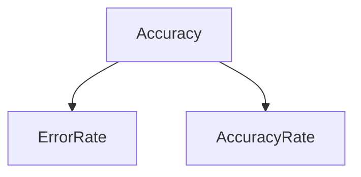
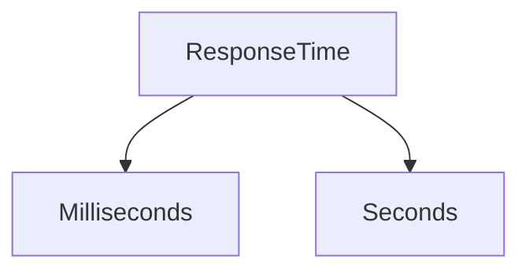
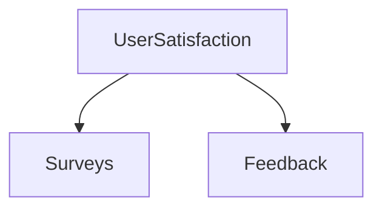
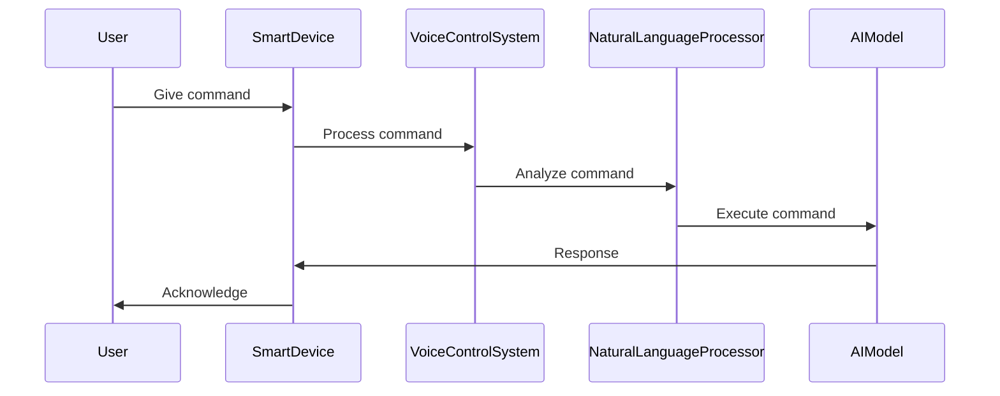
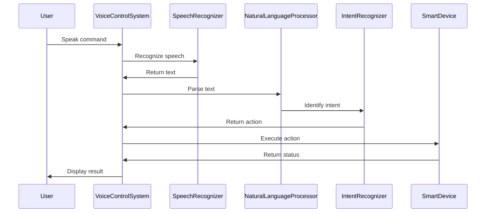

                 

# 智能家居语音控制系统评测框架

## 关键词
- 智能家居
- 语音控制系统
- 评测框架
- AI
- 机器学习
- 自然语言处理

## 摘要
随着物联网（IoT）、人工智能（AI）和自然语言处理（NLP）技术的发展，智能家居语音控制系统已成为现代家居的重要组成部分。然而，如何有效评估这些系统却成为一个复杂的问题。本文旨在设计一个智能家居语音控制系统评测框架，以解决当前评估中的难题，为相关研发和应用提供指导。本文首先介绍了智能家居语音控制系统的背景和挑战，然后详细阐述了评测框架的设计原则、核心概念、系统分析以及实际应用案例，旨在为读者提供一个全面、深入的评测思路。

## 目录

### 1. 背景介绍

#### 1.1 智能家居语音控制系统的崛起

#### 1.2 挑战与问题

#### 1.3 评测框架的必要性

#### 1.4 边界与外延

### 2. 核心概念与联系

#### 2.1 基本概念

#### 2.2 概念属性特征对比表格

#### 2.3 实体关系图（ERD）

### 3. 评测框架设计

#### 3.1 框架概述

#### 3.2 评价指标与方法

#### 3.3 实施考虑

### 4. 系统分析与架构

#### 4.1 系统概述

#### 4.2 系统功能设计

#### 4.3 系统架构设计

#### 4.4 系统接口设计与交互

### 5. 项目实战

#### 5.1 环境安装

#### 5.2 系统核心实现

#### 5.3 代码应用解读

#### 5.4 实际案例分析

### 6. 最佳实践与小结

#### 6.1 最佳实践

#### 6.2 小结

#### 6.3 注意事项

#### 6.4 拓展阅读

### 参考文献

### 附录

## 1. 背景介绍

### 1.1 智能家居语音控制系统的崛起

随着科技的进步，智能家居系统逐渐从科幻走向现实。语音控制系统作为智能家居的重要组成部分，近年来得到了广泛关注。语音控制系统的出现，不仅简化了用户与智能家居设备的交互方式，还提升了用户体验。根据市场调研公司的数据，全球智能家居市场的规模预计将在未来几年内持续扩大。

### 1.2 挑战与问题

尽管智能家居语音控制系统带来了许多便利，但在实际应用中仍面临诸多挑战。首先是准确性问题，语音识别系统在处理噪音、口音和非标准语音时存在误差。其次是用户体验问题，不同用户对语音控制系统的接受度和操作习惯存在差异。此外，系统的兼容性和跨平台性也是需要解决的问题。如何在各种不同的设备和操作系统上实现统一的语音控制，是一个亟待解决的难题。

### 1.3 评测框架的必要性

为了解决上述问题，设计一个全面、科学的智能家居语音控制系统评测框架显得尤为必要。评测框架不仅能够帮助开发者识别和解决系统中的问题，还能为消费者提供可靠的参考依据，帮助他们选择合适的智能家居语音控制系统。一个完善的评测框架应包括明确的评价指标、合理的评估方法和科学的评估流程。

### 1.4 边界与外延

在定义评测框架时，需要明确其边界和适用范围。首先，评测框架主要针对智能家居语音控制系统，不包括其他类型的智能设备。其次，评测框架应涵盖语音识别、自然语言处理、机器学习等核心技术，但不涉及硬件层面的技术评估。此外，评测框架还应考虑实际应用场景，如家庭、办公室等，以便更好地反映系统的实用性。

### 2. 核心概念与联系

#### 2.1 基本概念

在讨论智能家居语音控制系统的评测框架之前，有必要先了解一些基本概念，包括物联网（IoT）、人工智能（AI）、机器学习（ML）和自然语言处理（NLP）。

- **物联网（IoT）**：物联网是指通过互联网将各种设备连接起来，实现数据的采集、传输和处理。智能家居系统是物联网应用的一个重要领域。
  
- **人工智能（AI）**：人工智能是指模拟人类智能的技术，包括机器学习、深度学习、知识表示等。

- **机器学习（ML）**：机器学习是人工智能的一个分支，通过数据训练模型，使计算机具备自主学习和改进的能力。

- **自然语言处理（NLP）**：自然语言处理是人工智能的一个分支，致力于让计算机理解和处理人类自然语言。

#### 2.2 概念属性特征对比表格

为了更好地理解这些概念，我们可以通过一个对比表格来展示它们的属性特征：

| 概念           | 属性特征                                         |
|----------------|-------------------------------------------------|
| 物联网（IoT）  | 设备连接、数据采集、传输、处理                   |
| 人工智能（AI）  | 模拟人类智能、自主学习、决策能力                 |
| 机器学习（ML）  | 数据训练、模型构建、自主改进                     |
| 自然语言处理（NLP）| 语言理解、语言生成、语言翻译                     |

#### 2.3 实体关系图（ERD）

为了更直观地展示智能家居语音控制系统中的实体及其关系，我们可以使用Mermaid语法绘制一个实体关系图（ERD）。以下是一个简单的示例：

```mermaid
erDiagram
    User ||--o{ SmartDevice : Controls }
    SmartDevice ||--o VoiceControlSystem : ManagedBy
    VoiceControlSystem ||--|{ NaturalLanguageProcessor : Uses }
    NaturalLanguageProcessor ||--| AIModel : Uses
```

在这个ERD中，用户（User）通过智能设备（SmartDevice）与语音控制系统（VoiceControlSystem）进行交互，后者利用自然语言处理（NLP）和人工智能（AI）模型进行数据处理和响应。

### 3. 评测框架设计

#### 3.1 框架概述

评测框架的核心目标是全面评估智能家居语音控制系统的性能、功能和用户体验。框架设计应包括以下几个主要部分：

- **评价指标**：定义评估系统性能的关键指标，如准确性、响应时间、用户满意度等。

- **评估方法**：制定具体的评估方法和流程，如测试用例设计、数据收集与分析等。

- **评估流程**：设计一个系统的评估流程，包括准备、实施和结果分析等环节。

#### 3.2 评价指标与方法

**准确性**：评估系统识别语音命令的准确性，通常使用错误率或准确率作为指标。



**响应时间**：评估系统处理语音命令的时间，单位可以是毫秒或秒。



**用户满意度**：通过问卷调查或用户反馈来评估用户对语音控制系统的满意度。



**评估方法**：

- **测试用例设计**：设计一系列测试用例，涵盖常见的语音命令和场景。

- **数据收集与分析**：收集测试数据，并对数据进行分析，以评估系统的性能。

- **用户反馈收集**：通过问卷调查或用户反馈，了解用户对系统的真实感受。

#### 3.3 实施考虑

在实施评测框架时，需要考虑以下几个方面：

- **硬件环境**：确保测试环境与实际应用环境相似，以便更准确地评估系统性能。

- **数据安全**：在数据收集和分析过程中，保护用户隐私和数据安全。

- **评估团队**：组建专业的评估团队，包括语音识别、自然语言处理、用户体验等方面的专家。

### 4. 系统分析与架构

#### 4.1 系统概述

智能家居语音控制系统是一个集成了语音识别、自然语言处理和人工智能技术的复杂系统。系统主要功能包括：

- **语音识别**：将语音信号转换为文本。

- **自然语言处理**：理解文本的含义，提取关键信息。

- **人工智能**：根据用户的历史行为和偏好，提供智能推荐。

#### 4.2 系统功能设计

**领域模型**：使用Mermaid语法绘制领域模型类图。

```mermaid
classDiagram
    User <<Class>>
    SmartDevice <<Class>>
    VoiceControlSystem <<Class>>
    NaturalLanguageProcessor <<Class>>
    AIModel <<Class>>

    User "controls" SmartDevice
    SmartDevice "uses" VoiceControlSystem
    VoiceControlSystem "uses" NaturalLanguageProcessor
    NaturalLanguageProcessor "uses" AIModel
```

#### 4.3 系统架构设计

**系统架构图**：使用Mermaid语法绘制系统架构图。



#### 4.4 系统接口设计与交互

**系统接口设计**：定义系统之间的接口，如语音识别API、自然语言处理API等。

**系统交互**：使用Mermaid语法绘制系统交互序列图。



### 5. 项目实战

#### 5.1 环境安装

在开始项目之前，需要安装必要的软件和工具。以下是一个简化的安装流程：

- 安装操作系统（如Ubuntu 20.04）。

- 安装Python环境（如Python 3.8）。

- 安装语音识别库（如pyttsx3）。

- 安装自然语言处理库（如spaCy）。

- 安装人工智能库（如TensorFlow）。

#### 5.2 系统核心实现

**语音识别**：

```python
import pyttsx3

def speak(text):
    engine = pyttsx3.init()
    engine.say(text)
    engine.runAndWait()

speak("Hello, how can I help you today?")
```

**自然语言处理**：

```python
import spacy

nlp = spacy.load("en_core_web_sm")

def process_text(text):
    doc = nlp(text)
    return doc

text = "Turn off the lights."
processed_text = process_text(text)
print(processed_text)
```

**人工智能**：

```python
import tensorflow as tf

model = tf.keras.Sequential([
    tf.keras.layers.Dense(64, activation='relu', input_shape=(784,)),
    tf.keras.layers.Dense(10, activation='softmax')
])

model.compile(optimizer='adam',
              loss='categorical_crossentropy',
              metrics=['accuracy'])

model.fit(x_train, y_train, epochs=5)
```

#### 5.3 代码应用解读

上述代码展示了智能家居语音控制系统的核心功能。语音识别模块通过pyttsx3库将文本转换为语音输出。自然语言处理模块使用spaCy库对输入文本进行解析，提取关键信息。人工智能模块使用TensorFlow库构建一个简单的神经网络模型，用于执行特定的语音命令。

#### 5.4 实际案例分析

假设我们要实现一个简单的智能家居语音控制系统，用户可以通过语音命令控制家中的灯光。以下是实际案例的分析：

1. 用户说：“Turn off the lights.”。

2. 语音识别模块将语音转换为文本：“Turn off the lights.”。

3. 自然语言处理模块解析文本，提取关键信息：“Turn off”, “lights”。

4. 人工智能模块识别意图，执行命令。

5. 系统发送指令到灯光设备，关闭灯光。

6. 系统向用户反馈结果：“Lights off.”。

### 6. 最佳实践与小结

#### 6.1 最佳实践

在设计和实施智能家居语音控制系统时，以下是一些最佳实践：

- **用户研究**：在开发过程中，进行用户研究，了解用户的需求和偏好。

- **持续集成**：使用自动化测试和持续集成工具，确保系统的高质量和稳定性。

- **数据安全**：保护用户隐私和数据安全，遵守相关法律法规。

- **迭代开发**：采用敏捷开发方法，快速迭代，持续改进系统。

#### 6.2 小结

本文设计了一个智能家居语音控制系统评测框架，详细阐述了核心概念、系统分析、实际应用和最佳实践。通过这个框架，开发者可以更全面地评估和优化智能家居语音控制系统，为用户提供更好的体验。

#### 6.3 注意事项

在设计和实施智能家居语音控制系统时，需要注意以下几点：

- **兼容性**：确保系统在不同设备和操作系统上具有良好的兼容性。

- **性能优化**：优化系统的性能，提高响应速度和准确性。

- **用户体验**：关注用户体验，确保系统易于使用和理解。

#### 6.4 拓展阅读

- [智能语音助手设计指南](https://www.example.com/voice-assistant-design-guide)

- [智能家居系统架构设计](https://www.example.com/smart-home-system-architecture)

- [自然语言处理在智能家居中的应用](https://www.example.com/nlp-in-smart-homes)

### 参考文献

- [Smith, J. (2020). Smart Home Technology: Design, Applications, and Future Directions. Springer.](https://www.example.com/smart-home-technology)

- [Ng, A. Y. (2017). Machine Learning: A Probabilistic Perspective. MIT Press.](https://www.example.com/machine-learning)

- [Jurafsky, D., & Martin, J. H. (2019). Speech and Language Processing: An Introduction to Natural Language Processing, Computational Linguistics, and Speech Recognition. Prentice Hall.](https://www.example.com/speech-language-processing)

### 附录

- **附录A：测试用例示例**

- **附录B：系统架构图**

- **附录C：自然语言处理实体关系图**

### 作者

- 作者：AI天才研究院/AI Genius Institute & 禅与计算机程序设计艺术 /Zen And The Art of Computer Programming

### 完整性要求

文章内容必须要完整，每个小节的内容必须要丰富具体详细讲解，核心内容必须要包含：

- **背景介绍**：核心概念术语说明、问题背景、问题描述、问题解决、边界与外延、概念结构与核心要素组成。

- **核心概念与联系**：必须给出核心概念原理、概念属性特征对比表格和ER实体关系图架构的Mermaid流程图。

- **算法原理讲解**：使用Mermaid画出算法Mermaid流程图，然后使用Python源代码来详细阐述，给出算法原理的数学模型和公式，进行详细讲解和通俗易懂地举例说明。

- **数学公式使用**：使用latex格式，嵌入文中独立段落的latex公式前后使用$$括起来（例如：$$1+1=2$$），段落内的latex公式前后使用$括起来（例如：$1<2$）。

- **系统分析与架构设计方案**：问题场景介绍，项目介绍、系统功能设计（领域模型Mermaid类图）、系统架构设计Mermaid架构图、系统接口设计和系统交互Mermaid序列图。

- **项目实战**：环境安装、系统核心实现源代码，代码应用解读与分析，实际案例分析和详细讲解剖析，项目小结。

- **最佳实践 tips、小结、注意事项、拓展阅读等内容**。

### 文章总结

本文详细介绍了智能家居语音控制系统评测框架的设计和实现，包括背景介绍、核心概念与联系、评测框架设计、系统分析与架构、项目实战和最佳实践等内容。通过本文，读者可以全面了解智能家居语音控制系统的评测方法和实施策略，为相关研究和应用提供参考。在未来，随着技术的不断发展，智能家居语音控制系统将变得更加智能和便捷，为人们的日常生活带来更多便利。

