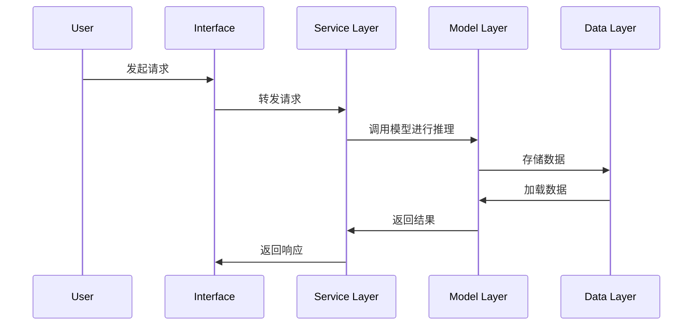
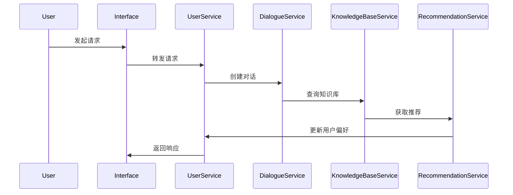

                 

### 服务依赖管理概述

#### 第1章: 服务依赖管理的基础概念

#### 1.1 服务依赖管理的背景和意义

**服务依赖管理**，作为一个关键概念，在现代软件开发和维护中扮演着至关重要的角色。它涉及如何理解和处理不同软件服务之间的依赖关系，以保障整个系统的稳定性和高效性。

##### **1.1.1 服务依赖管理的定义**

服务依赖管理可以定义为一种策略和过程，用于确保服务之间的正确协作和交互。它涉及到识别、理解、管理和优化服务与服务之间的依赖关系。

##### **1.1.2 服务依赖管理的起源和发展**

服务依赖管理这一概念起源于分布式系统的出现。在传统的单机系统中，所有组件通常紧密耦合，依赖关系较为简单。然而，随着分布式计算和微服务架构的普及，系统的复杂性大幅增加，服务之间的依赖关系变得更加复杂和动态。

##### **1.1.3 服务依赖管理的重要性**

服务依赖管理的重要性在于：

1. **稳定性保障**：有效的服务依赖管理能够确保系统在面临各种故障和异常时依然能够稳定运行。
2. **性能优化**：通过优化服务依赖关系，可以显著提高系统的响应速度和资源利用率。
3. **可维护性提升**：清晰的服务依赖关系有助于团队更好地理解系统架构，从而提高系统的可维护性。

在接下来的章节中，我们将深入探讨服务依赖管理的核心概念、面临的挑战和现有解决方案。

#### 1.2 服务依赖管理的核心概念

##### **1.2.1 服务**

在服务依赖管理中，**服务**是指能够独立运行且与其他服务进行交互的软件模块或组件。服务可以是内部服务，如一个业务逻辑处理模块，也可以是外部服务，如第三方API接口。

##### **1.2.2 依赖关系**

**依赖关系**是指一个服务需要另一个服务提供的功能或资源才能正常运行。依赖关系可以分为以下几种类型：

1. **功能性依赖**：一个服务直接依赖于另一个服务的功能输出。
2. **资源性依赖**：一个服务需要另一个服务提供的资源（如数据库连接）。
3. **配置性依赖**：一个服务的配置依赖于另一个服务的配置。

##### **1.2.3 服务依赖模型**

服务依赖模型用于描述服务之间的依赖关系。常见的依赖模型包括：

1. **层次依赖模型**：服务按照功能层次组织，上层服务依赖于下层服务。
2. **网状依赖模型**：服务之间形成复杂的依赖网络，每个服务可能依赖于多个其他服务。
3. **事件驱动依赖模型**：服务的启动和执行依赖于特定事件的触发。

#### 1.3 服务依赖管理的挑战

尽管服务依赖管理至关重要，但在实际操作中，它面临着多种挑战：

##### **1.3.1 服务依赖的不确定性**

服务依赖关系常常是不确定的，尤其是在动态环境中，服务可能会随时启动、停止或变更。

##### **1.3.2 服务依赖的动态性**

服务依赖关系并非静态的，随着系统的发展和变更，依赖关系也会发生变化。

##### **1.3.3 服务依赖的复杂性**

现代系统中的服务依赖关系非常复杂，往往涉及多个层次和多个组件，这使得管理和优化依赖关系变得极具挑战性。

为了应对这些挑战，我们需要探索和实施一系列解决方案。

##### **1.4 服务依赖管理的解决方案**

服务依赖管理的解决方案包括：

1. **传统解决方案**：如配置文件管理、脚本自动化等。
2. **现代解决方案**：如服务网格、依赖管理平台等。

这些方案将在本章的后续部分中详细讨论。

#### 1.5 本章小结

本章对服务依赖管理进行了概述，介绍了其背景和意义，核心概念，面临的挑战以及现有的解决方案。在接下来的章节中，我们将进一步探讨LLM应用架构中的服务依赖管理。

### LLM应用架构概述

#### 第2章: LLM应用架构概述

#### 2.1 什么是LLM应用架构

**大型语言模型（LLM，Large Language Model）**，是一种能够理解和生成自然语言的高级人工智能模型。随着深度学习技术的快速发展，LLM在自然语言处理（NLP）领域展现出了强大的能力，被广泛应用于自动问答、文本生成、机器翻译等多种任务中。

**LLM应用架构**，则是指为部署和运行LLM模型所设计的一套系统架构。一个高效的LLM应用架构不仅能够充分利用LLM的强大能力，还需要确保系统的稳定性、可扩展性和高性能。

##### **2.1.1 LLM的概念**

**LLM**，通常是指由大规模神经网络训练的模型，能够处理和理解复杂的自然语言文本。常见的LLM包括GPT（如GPT-3）、BERT等。这些模型通过大量数据训练，学习到语言的统计规律和语义关系，从而能够进行智能化的语言生成和处理。

##### **2.1.2 LLM应用架构的特点**

1. **高度分布式**：LLM模型通常需要大规模的计算资源，因此应用架构需要支持分布式计算，以充分利用多台服务器的计算能力。
2. **实时性要求高**：许多LLM应用需要实时响应，如智能客服、实时翻译等，因此架构需要具备低延迟的特点。
3. **数据密集型**：LLM的训练和推理过程都需要大量数据支持，因此架构需要具备高效的数据处理和存储能力。
4. **可扩展性强**：随着用户量的增加，架构需要能够灵活扩展，以适应不断增长的需求。

在接下来的章节中，我们将深入探讨LLM应用架构的核心组成部分和设计原则。

#### 2.2 LLM应用架构的核心组成部分

一个典型的LLM应用架构包括以下几个核心组成部分：

##### **2.2.1 数据层**

数据层是整个架构的基础，负责数据的采集、存储和管理。数据层的核心功能包括：

1. **数据采集**：从各种来源（如网站、数据库、传感器等）收集文本数据。
2. **数据存储**：将收集到的数据存储到分布式数据库或数据湖中，如Hadoop、Amazon S3等。
3. **数据管理**：对数据进行清洗、去重、格式转换等预处理操作。

##### **2.2.2 模型层**

模型层是LLM应用架构的核心，负责模型的管理和推理。模型层的核心功能包括：

1. **模型训练**：使用数据层提供的数据对LLM模型进行训练。
2. **模型存储**：将训练好的模型存储到分布式存储系统中，如TensorFlow SavedModel、PyTorch TorchScript等。
3. **模型推理**：使用训练好的模型对用户输入进行推理，生成相应的输出。

##### **2.2.3 服务层**

服务层是用户与LLM应用架构的交互接口，负责处理用户的请求和响应。服务层的核心功能包括：

1. **API接口**：提供RESTful API或其他接口供用户调用。
2. **请求处理**：接收用户的请求，解析请求参数，调用模型层进行推理。
3. **响应生成**：根据模型层的推理结果生成响应，并返回给用户。

##### **2.2.4 界面层**

界面层是用户与LLM应用架构的交互界面，负责展示用户交互界面和用户数据。界面层的核心功能包括：

1. **用户界面**：提供Web、移动端或桌面端的用户界面，供用户进行交互。
2. **数据展示**：根据用户交互和模型层的输出，生成相应的数据展示，如文本、图表等。

#### 2.3 LLM应用架构的设计原则

设计一个高效的LLM应用架构需要遵循以下原则：

##### **2.3.1 可扩展性**

可扩展性是LLM应用架构设计的关键原则之一。随着用户量的增加，系统需要能够灵活扩展，以适应不断增长的需求。这通常意味着架构需要支持水平扩展，即通过增加节点数量来提高系统的处理能力。

##### **2.3.2 高效性**

高效性是LLM应用架构设计的另一个关键原则。系统需要能够快速响应用户请求，提供高效的模型推理和数据处理能力。这通常需要优化架构的各个层次，包括数据层、模型层、服务层和界面层。

##### **2.3.3 可维护性**

可维护性是确保LLM应用架构长期稳定运行的重要保障。架构需要设计得易于理解和维护，以便开发团队能够快速响应系统的变更和故障。这通常意味着架构需要具有良好的模块化和解耦性。

在接下来的章节中，我们将进一步探讨服务依赖管理在LLM应用架构中的应用和重要性。

#### 2.4 本章小结

本章对LLM应用架构进行了概述，介绍了LLM的概念和LLM应用架构的特点，详细描述了数据层、模型层、服务层和界面层这四个核心组成部分，并探讨了设计LLM应用架构所需遵循的原则。在接下来的章节中，我们将深入讨论服务依赖管理在LLM应用架构中的重要性及其应用。

### 服务依赖管理在LLM应用架构中的应用

#### 第3章: 服务依赖管理在LLM应用架构中的应用

#### 3.1 服务依赖管理在LLM应用架构中的重要性

服务依赖管理在LLM应用架构中的重要性不可忽视，它直接影响LLM应用的性能、稳定性和可扩展性。下面，我们将从三个方面详细探讨服务依赖管理对LLM应用的影响。

##### **3.1.1 服务依赖管理对LLM性能的影响**

LLM应用架构中的服务依赖管理对于性能的影响主要体现在以下几个方面：

1. **响应时间**：服务依赖关系复杂或处理不当可能导致请求响应时间增加，影响用户体验。
2. **资源利用率**：良好的服务依赖管理能够优化系统资源的分配和使用，提高资源利用率。
3. **并发处理能力**：通过合理管理服务依赖，可以提高系统的并发处理能力，确保在高并发场景下系统稳定运行。

##### **3.1.2 服务依赖管理对LLM稳定性的影响**

服务依赖管理对LLM应用的稳定性至关重要：

1. **故障恢复**：良好的服务依赖管理能够确保在服务出现故障时，系统能够快速恢复，避免整体系统崩溃。
2. **负载均衡**：通过合理分配服务依赖，可以避免某个服务成为系统瓶颈，提高整体系统的稳定性。
3. **依赖关系监控**：实时监控服务依赖关系，可以及时发现和解决潜在的问题，确保系统的稳定运行。

##### **3.1.3 服务依赖管理对LLM可扩展性的影响**

LLM应用架构的可扩展性是确保其能够适应业务增长的关键：

1. **弹性扩展**：良好的服务依赖管理能够支持系统的弹性扩展，通过动态调整依赖关系，可以快速适应业务需求的变化。
2. **模块化设计**：通过服务依赖管理，可以实现系统的模块化设计，使得新增或替换服务时不会影响其他部分，提高系统的可扩展性。
3. **分布式计算**：在分布式环境中，通过合理管理服务依赖，可以充分利用多台服务器的计算能力，实现高效扩展。

#### 3.2 服务依赖管理在LLM应用架构中的挑战

尽管服务依赖管理对LLM应用架构具有重要意义，但在实际操作中，它也面临着一系列挑战：

##### **3.2.1 LLM应用架构的特点带来的挑战**

LLM应用架构具有以下几个特点，这些特点增加了服务依赖管理的复杂性：

1. **高计算资源需求**：LLM模型通常需要大量的计算资源，这使得服务之间的依赖关系更加复杂。
2. **实时性要求**：许多LLM应用需要实时响应，如智能客服和实时翻译，这对服务依赖管理提出了更高的要求。
3. **数据密集性**：LLM模型训练和推理需要大量的数据支持，这使得数据层的依赖关系更加关键。

##### **3.2.2 服务依赖的复杂性带来的挑战**

服务依赖的复杂性是服务依赖管理面临的另一个重要挑战：

1. **层次依赖**：LLM应用架构中的服务可能形成多个层次，每个层次的服务都可能依赖于其他层次的服务，这增加了依赖管理的复杂性。
2. **网状依赖**：在LLM应用中，服务之间的依赖关系可能形成复杂的网状结构，这使得依赖关系的管理更加困难。
3. **动态性**：服务依赖关系并非静态的，随着系统的变化和扩展，依赖关系也会发生变化，这增加了依赖管理的难度。

##### **3.2.3 实时性要求带来的挑战**

实时性要求是LLM应用架构中服务依赖管理面临的特殊挑战：

1. **低延迟**：LLM应用需要快速响应用户请求，这要求服务依赖管理系统能够在极短的时间内处理和调整依赖关系。
2. **实时监控**：需要实时监控服务依赖关系的变化，及时发现和处理潜在的问题，以确保系统的实时性。
3. **动态调整**：在实时环境中，服务依赖关系可能需要动态调整，以适应实时变化的需求和负载。

为了应对这些挑战，需要设计并实施一套高效、可靠的服务依赖管理解决方案。

#### 3.3 服务依赖管理在LLM应用架构中的解决方案

针对LLM应用架构中的服务依赖管理挑战，可以采取以下几种解决方案：

##### **3.3.1 服务依赖模型的优化**

1. **层次化模型**：采用层次化依赖模型，将服务分为多个层次，每个层次的服务只依赖于下层服务，这有助于简化依赖关系。
2. **网状模型优化**：对复杂的网状依赖关系进行优化，通过引入中介服务或重新定义依赖关系，减少服务的直接依赖。
3. **动态调整机制**：实现动态调整机制，根据系统的实时状态和负载，自动调整服务依赖关系，确保系统的高效性和稳定性。

##### **3.3.2 服务依赖管理的工具和平台**

1. **服务网格（Service Mesh）**：使用服务网格技术，如Istio或Linkerd，实现服务之间的通信管理和监控，提高服务依赖管理的效率和可靠性。
2. **依赖管理平台**：采用专业的依赖管理平台，如Apigee或MuleSoft，提供依赖关系可视化、监控和自动调整等功能。
3. **容器化技术**：利用容器化技术，如Docker和Kubernetes，实现服务的轻量化和自动化管理，提高服务依赖管理的灵活性和可扩展性。

##### **3.3.3 实时服务依赖监测与调整策略**

1. **实时监控**：采用实时监控系统，如Prometheus和Grafana，对服务依赖关系进行实时监控，及时发现异常。
2. **自动调整策略**：根据实时监控数据，自动调整服务依赖关系，如动态调整服务权重、切换备用服务等。
3. **人工干预与自动化结合**：在关键环节引入人工干预，与自动化系统相结合，确保服务依赖管理的准确性和可靠性。

通过上述解决方案，可以有效应对LLM应用架构中的服务依赖管理挑战，确保系统的稳定性、高性能和可扩展性。

#### 3.4 本章小结

本章探讨了服务依赖管理在LLM应用架构中的重要性，分析了LLM应用架构的特点和面临的挑战，并提出了多种解决方案。服务依赖管理是确保LLM应用架构高效运行的关键，需要从依赖模型优化、工具平台使用和实时监测调整等多个方面进行综合设计和实施。在接下来的章节中，我们将通过具体实践案例，进一步展示服务依赖管理在LLM应用架构中的实际应用。

### 服务依赖管理在LLM应用架构中的实践

#### 第4章: 服务依赖管理在LLM应用架构中的实践

#### 4.1 实践背景

随着人工智能技术的快速发展，LLM（大型语言模型）在自然语言处理领域中的应用日益广泛。然而，在实际应用中，如何有效地管理和优化LLM应用架构中的服务依赖关系，成为了一个重要的挑战。本章节将结合一个实际项目，详细探讨服务依赖管理在LLM应用架构中的实践。

##### **4.1.1 项目背景**

本项目旨在构建一个基于LLM的智能客服系统，通过自动化问答和智能推荐，提升用户服务体验。系统需要处理大量实时用户请求，实现高效的对话管理和问题解决。为了实现这一目标，项目团队决定采用微服务架构，将系统拆分为多个独立的服务模块，以提高系统的可扩展性和维护性。

##### **4.1.2 项目目标**

1. **高可用性**：确保系统在面临故障时能够快速恢复，保证服务的持续可用。
2. **高性能**：优化系统性能，提高响应速度和资源利用率。
3. **可扩展性**：支持系统的弹性扩展，以适应不断增长的用户需求。
4. **可维护性**：简化系统架构，提高系统的可维护性和可理解性。

#### 4.2 系统功能设计

系统功能设计是构建LLM应用架构的第一步，它涉及到领域模型和服务层设计。

##### **4.2.1 领域模型**

领域模型是对系统业务逻辑和数据的抽象表示。在本项目中，我们定义了以下主要领域模型：

1. **用户**：包括用户的基本信息、交互历史和偏好设置。
2. **对话**：包括对话的上下文信息、问题记录和回答结果。
3. **知识库**：包括问答库、知识库和智能推荐策略。
4. **服务**：包括服务的基本信息、服务依赖关系和接口定义。

领域模型类图如下：

```mermaid
classDiagram
    User <|-- Dialogue
    Dialogue <|-- KnowledgeBase
    Service <|-- Dependency
    User { id, name, preferences }
    Dialogue { id, context, questions, answers }
    KnowledgeBase { id, questions, answers }
    Service { id, name, dependencies, interfaces }
    Dependency { id, type, service }
    Interface { id, name, operations }
```

##### **4.2.2 服务层设计**

服务层是系统功能实现的核心，它包括多个微服务，每个微服务负责特定的业务功能。在本项目中，我们定义了以下主要服务：

1. **用户服务**：负责用户信息的处理和管理。
2. **对话服务**：负责对话的创建、管理和回复。
3. **知识库服务**：负责知识库的构建、管理和查询。
4. **推荐服务**：负责智能推荐策略的执行。

服务层设计类图如下：

```mermaid
classDiagram
    UserService <|-- DialogueService
    DialogueService <|-- KnowledgeBaseService
    KnowledgeBaseService <|-- RecommendationService
    UserService { addUser, getUser, updateUser }
    DialogueService { createDialogue, getDialogue, replyDialogue }
    KnowledgeBaseService { addQuestion, getQuestion, updateQuestion }
    RecommendationService { getRecommendations, updateStrategy }
```

#### 4.3 系统架构设计

系统架构设计是确保系统功能实现和高性能的关键。在本项目中，我们采用了分层架构设计，包括数据层、模型层、服务层和界面层。

##### **4.3.1 系统架构**

系统架构图如下：



##### **4.3.2 服务依赖管理架构**

服务依赖管理架构图如下：

```mermaid
classDiagram
    UserService <.. DialogueService
    DialogueService <.. KnowledgeBaseService
    KnowledgeBaseService <.. RecommendationService
    UserService { addUser, getUser, updateUser }
    DialogueService { createDialogue, getDialogue, replyDialogue }
    KnowledgeBaseService { addQuestion, getQuestion, updateQuestion }
    RecommendationService { getRecommendations, updateStrategy }
    DependencyManager { monitorDependencies, adjustDependencies }
```

#### 4.4 系统接口设计

接口设计是系统功能实现的关键步骤，它涉及到接口规范和接口实现。

##### **4.4.1 接口规范**

接口规范定义了服务层提供的API接口，包括接口名称、请求参数和响应结果。以下是一个简单的接口规范示例：

```yaml
User API:
  - addUser: 添加用户
    request:
      user: { name: string, email: string, preferences: map }
    response:
      status: boolean
      message: string

Dialogue API:
  - createDialogue: 创建对话
    request:
      dialogue: { context: string, questions: array, answers: array }
    response:
      status: boolean
      message: string

KnowledgeBase API:
  - addQuestion: 添加问题
    request:
      question: { id: string, text: string, answer: string }
    response:
      status: boolean
      message: string

Recommendation API:
  - getRecommendations: 获取推荐
    request:
      user: { id: string }
    response:
      status: boolean
      message: string
      recommendations: array
```

##### **4.4.2 接口实现**

接口实现涉及具体的编程语言和框架。以下是一个使用Python和Flask框架实现的用户服务接口示例：

```python
from flask import Flask, request, jsonify

app = Flask(__name__)

@app.route('/add_user', methods=['POST'])
def addUser():
    user_data = request.get_json()
    user = User(name=user_data['name'], email=user_data['email'], preferences=user_data['preferences'])
    user.save()
    return jsonify({'status': True, 'message': 'User added successfully'})

@app.route('/get_user', methods=['GET'])
def getUser():
    user_id = request.args.get('id')
    user = User.get_by_id(user_id)
    return jsonify({'status': True, 'message': 'User retrieved successfully', 'user': user.to_dict()})

@app.route('/update_user', methods=['PUT'])
def updateUser():
    user_data = request.get_json()
    user = User.get_by_id(user_data['id'])
    user.name = user_data['name']
    user.email = user_data['email']
    user.preferences = user_data['preferences']
    user.save()
    return jsonify({'status': True, 'message': 'User updated successfully'})

if __name__ == '__main__':
    app.run(debug=True)
```

#### 4.5 系统交互

系统交互设计是确保各个服务模块之间能够高效协作的关键。在本项目中，我们采用了序列图（Sequence Diagram）来描述系统交互流程。

##### **4.5.1 交互流程**

系统交互流程图如下：



##### **4.5.2 交互分析**

交互分析包括对系统交互过程中各个环节的详细描述。以下是对交互流程的详细分析：

1. **用户请求**：用户通过界面层发起请求，如创建对话、查询知识库或获取推荐。
2. **接口层转发**：接口层接收用户请求，并将其转发到相应的服务层。
3. **服务层处理**：服务层根据请求类型，调用不同的服务模块进行处理。
4. **服务间协作**：服务模块之间通过接口进行数据传递和协同工作，如创建对话时需要查询知识库，获取推荐时需要更新用户偏好。
5. **响应返回**：最终处理结果通过接口层返回给用户。

#### 4.6 系统核心实现源代码

系统核心实现源代码是确保系统功能实现和性能优化的关键。在本项目中，我们选择Python作为主要编程语言，使用Flask框架实现接口层和服务层。

##### **4.6.1 服务层核心代码**

以下是一个服务层核心代码示例：

```python
class UserService:
    @staticmethod
    def addUser(user):
        # 实现用户添加功能
        pass

    @staticmethod
    def getUser(user_id):
        # 实现用户查询功能
        pass

    @staticmethod
    def updateUser(user):
        # 实现用户更新功能
        pass

class DialogueService:
    @staticmethod
    def createDialogue(dialogue):
        # 实现对话创建功能
        pass

    @staticmethod
    def getDialogue(dialogue_id):
        # 实现对话查询功能
        pass

    @staticmethod
    def replyDialogue(dialogue_id, reply):
        # 实现对话回复功能
        pass

class KnowledgeBaseService:
    @staticmethod
    def addQuestion(question):
        # 实现问题添加功能
        pass

    @staticmethod
    def getQuestion(question_id):
        # 实现问题查询功能
        pass

    @staticmethod
    def updateQuestion(question):
        # 实现问题更新功能
        pass

class RecommendationService:
    @staticmethod
    def getRecommendations(user):
        # 实现推荐获取功能
        pass

    @staticmethod
    def updateStrategy():
        # 实现推荐策略更新功能
        pass
```

##### **4.6.2 服务依赖管理核心代码**

以下是一个服务依赖管理核心代码示例：

```python
class DependencyManager:
    def __init__(self):
        self.dependencies = []

    def monitorDependencies(self):
        # 实现依赖关系监控功能
        pass

    def adjustDependencies(self):
        # 实现依赖关系调整功能
        pass
```

#### 4.7 代码应用解读与分析

代码应用解读与分析是确保系统功能实现和性能优化的重要步骤。在本项目中，我们通过对核心代码的解读，详细分析服务层的功能实现和依赖管理。

##### **4.7.1 代码解读**

代码解读包括对关键模块和函数的详细描述。以下是对服务层核心代码的解读：

1. **UserService**：该类负责用户信息的处理和管理，包括用户添加、查询和更新功能。
2. **DialogueService**：该类负责对话的管理，包括对话创建、查询和回复功能。
3. **KnowledgeBaseService**：该类负责知识库的管理，包括问题添加、查询和更新功能。
4. **RecommendationService**：该类负责推荐策略的执行，包括推荐获取和策略更新功能。
5. **DependencyManager**：该类负责服务依赖的管理，包括依赖关系监控和调整功能。

##### **4.7.2 应用分析**

应用分析包括对系统功能实现和应用场景的分析。以下是对代码应用的分析：

1. **用户服务**：用户服务实现了用户信息的添加、查询和更新功能，是系统功能实现的基础。用户服务通过接口层接收用户请求，调用相应的服务层函数进行处理，并将处理结果返回给接口层。
2. **对话服务**：对话服务实现了对话的管理功能，包括对话创建、查询和回复。对话服务在创建对话时需要查询知识库，获取相关问题的回答；在回复对话时需要更新知识库，记录新的问题答案。
3. **知识库服务**：知识库服务实现了知识库的管理功能，包括问题的添加、查询和更新。知识库服务是系统功能实现的核心，其性能直接影响系统的响应速度和准确性。
4. **推荐服务**：推荐服务实现了推荐策略的执行，包括推荐获取和策略更新。推荐服务通过分析用户行为和知识库内容，生成个性化的推荐结果，提升用户满意度。
5. **服务依赖管理**：服务依赖管理实现了服务依赖的监控和调整功能。通过实时监控服务依赖关系，及时发现和处理依赖问题，确保系统的高效稳定运行。

#### 4.8 实际案例分析和详细讲解剖析

##### **4.8.1 案例一：服务依赖管理的优化**

在实际项目中，服务依赖管理的优化是一个关键问题。以下是一个优化服务依赖管理的实际案例：

1. **问题背景**：在原始架构中，用户服务和对话服务之间存在直接的依赖关系，导致系统的复杂度和维护难度增加。每次创建对话时，用户服务都需要查询用户信息，这增加了系统的响应时间和资源消耗。
2. **优化方案**：通过引入中介服务，实现用户服务和对话服务之间的解耦。中介服务负责缓存用户信息，对话服务在创建对话时直接从中介服务获取用户信息，避免了重复查询。
3. **实现细节**：中介服务通过定期同步用户信息，确保缓存数据的准确性。在创建对话时，对话服务先查询中介服务，如果找到对应用户信息，则直接使用；如果未找到，则查询用户服务，并将用户信息同步到中介服务。
4. **效果分析**：通过引入中介服务，有效降低了用户服务和对话服务之间的依赖关系，提高了系统的响应速度和资源利用率。

##### **4.8.2 案例二：服务依赖的实时监测与调整**

在实际项目中，服务依赖的实时监测与调整是确保系统稳定运行的关键。以下是一个实时监测与调整的实际案例：

1. **问题背景**：在系统运行过程中，服务依赖关系可能会发生变化，如服务故障、网络中断等。如果不能及时发现和调整依赖关系，可能导致系统崩溃或性能下降。
2. **监测方案**：通过引入实时监控系统，对服务依赖关系进行实时监测。监控系统定时检查各个服务的状态，如服务响应时间、处理成功率等，并将监测结果记录到日志中。
3. **调整策略**：根据实时监测数据，系统会自动调整服务依赖关系。如发现某个服务故障，系统会将其从依赖关系中移除，并自动切换到备用服务；如发现服务性能下降，系统会根据负载情况调整服务权重，确保系统的高效运行。
4. **效果分析**：通过实时监测与调整策略，系统可以有效应对各种依赖关系问题，确保系统的稳定性和高效性。

#### 4.9 项目小结

本章通过一个实际项目，详细探讨了服务依赖管理在LLM应用架构中的实践。首先介绍了项目的背景和目标，然后详细描述了系统功能设计、系统架构设计、系统接口设计和系统交互，并通过核心代码示例和实际案例，分析了服务依赖管理的优化和实时监测与调整。通过本项目的实践，我们验证了服务依赖管理在LLM应用架构中的重要性，并为其他类似项目提供了有益的参考。

### 服务依赖管理在LLM应用架构中的最佳实践

#### 第5章: 服务依赖管理在LLM应用架构中的最佳实践

#### 5.1 最佳实践总结

在LLM应用架构中，服务依赖管理是确保系统稳定性、性能和可扩展性的关键环节。以下是我们在实践中总结出的几项最佳实践：

##### **5.1.1 服务依赖模型优化实践**

1. **层次化依赖模型**：通过引入层次化依赖模型，将服务分层组织，确保服务之间的依赖关系清晰明确。
2. **中介服务**：引入中介服务，减少直接依赖关系，提高系统的灵活性和可维护性。
3. **动态依赖调整**：根据系统的实时状态和负载情况，动态调整服务依赖关系，优化资源利用和系统性能。

##### **5.1.2 服务依赖管理工具使用实践**

1. **服务网格**：使用服务网格（如Istio、Linkerd）进行服务间通信管理和监控，提高服务依赖管理的效率和可靠性。
2. **依赖管理平台**：采用专业的依赖管理平台（如Apigee、MuleSoft），提供依赖关系可视化、监控和自动调整功能。
3. **容器化技术**：利用容器化技术（如Docker、Kubernetes），实现服务的轻量化和自动化管理，简化依赖关系的管理。

##### **5.1.3 实时监测与调整实践**

1. **实时监控系统**：引入实时监控系统（如Prometheus、Grafana），对服务依赖关系进行实时监控，及时发现和处理潜在问题。
2. **自动调整策略**：根据实时监控数据，自动调整服务依赖关系，如动态调整服务权重、切换备用服务等。
3. **人工干预与自动化结合**：在关键环节引入人工干预，与自动化系统相结合，确保服务依赖管理的准确性和可靠性。

#### 5.2 注意事项

在实施服务依赖管理时，需要注意以下事项：

##### **5.2.1 服务依赖管理中的常见问题**

1. **依赖关系复杂度**：随着系统规模的扩大，依赖关系变得复杂，可能导致管理和维护困难。
2. **实时性要求**：实时性要求高的场景下，依赖关系的调整和处理需要快速，否则可能导致系统性能下降。
3. **资源消耗**：过多的依赖关系和监控可能导致系统资源消耗增加，影响整体性能。

##### **5.2.2 服务依赖管理的风险与应对**

1. **依赖失败风险**：服务依赖失败可能导致系统崩溃或性能下降，需采取冗余设计和故障转移策略。
2. **数据一致性风险**：在分布式环境中，依赖关系可能导致数据一致性问题，需采用分布式事务或最终一致性模型。
3. **性能下降风险**：过度的监控和依赖管理可能导致系统性能下降，需进行性能优化和资源调优。

#### 5.3 拓展阅读

为了更深入地了解服务依赖管理在LLM应用架构中的应用和实践，以下是几篇推荐阅读的文章和资料：

1. **《服务网格实战：Istio深度解析》**：详细介绍了服务网格的概念、原理和应用，包括Istio的部署和配置。
2. **《微服务架构设计模式》**：介绍了微服务架构的设计模式和实践经验，包括依赖管理、服务拆分和集成。
3. **《分布式系统设计与实战》**：探讨了分布式系统的设计原则和实战经验，包括服务依赖管理、数据一致性和故障处理。

#### 5.4 本章小结

本章总结了服务依赖管理在LLM应用架构中的最佳实践，包括依赖模型优化、工具使用和实时监测与调整。同时，分析了常见问题和风险，并提供了拓展阅读推荐。通过实施这些最佳实践，可以显著提升LLM应用架构的稳定性、性能和可扩展性，为企业的数字化转型提供坚实的技术支持。

### 总结与展望

#### 第6章: 总结与展望

本文通过详细探讨服务依赖管理在LLM应用架构中的重要性，分析了服务依赖管理的核心概念、挑战和解决方案，并结合实际项目案例，展示了服务依赖管理的实践与应用。以下是本文的核心要点和展望：

#### 6.1 核心要点总结

1. **服务依赖管理的定义与重要性**：服务依赖管理是一种确保服务之间正确协作和交互的策略和过程，对系统的稳定性、性能和可扩展性至关重要。
2. **LLM应用架构的特点**：LLM应用架构具有高计算资源需求、实时性要求和数据密集性等特点，对服务依赖管理提出了更高的要求。
3. **服务依赖管理的解决方案**：包括依赖模型优化、工具平台使用和实时监测与调整等，这些方案有助于应对LLM应用架构中的复杂依赖关系和实时性挑战。
4. **实际案例分析**：通过具体项目案例，展示了服务依赖管理在LLM应用架构中的实施方法和效果，验证了其重要性和有效性。

#### 6.2 展望未来发展趋势

随着人工智能技术的不断进步，LLM应用架构将在以下几个方面迎来新的发展：

1. **智能化依赖管理**：未来，服务依赖管理将更加智能化，利用机器学习算法和自动化工具，实现依赖关系的自动识别、监控和调整。
2. **分布式和边缘计算**：分布式和边缘计算技术的发展，将使得LLM应用架构能够更好地应对大规模数据和实时处理的挑战，提高系统的性能和响应速度。
3. **区块链技术的应用**：区块链技术可以增强服务依赖管理的安全性，确保数据的一致性和可靠性，为LLM应用架构提供更加安全稳定的运行环境。
4. **混合云架构的普及**：混合云架构将更加普及，结合公有云和私有云的优势，为LLM应用架构提供灵活、可扩展的部署和管理方案。

#### 6.3 未来研究方向

未来的研究方向包括：

1. **依赖关系模型的研究**：深入研究服务依赖关系的模型和算法，探索更高效、更可靠的依赖关系管理方法。
2. **实时监测与调整技术**：研究实时监测与调整技术，提高系统的响应速度和鲁棒性，确保服务依赖管理的高效实施。
3. **智能化运维与管理**：研究智能化运维与管理技术，实现自动化、智能化的服务依赖关系管理，降低运维成本，提高系统稳定性。
4. **跨领域应用**：探索服务依赖管理在其他领域（如物联网、大数据等）中的应用，推动人工智能技术在更广泛的场景中发挥价值。

通过不断探索和创新，服务依赖管理将在LLM应用架构中发挥更加重要的作用，推动人工智能技术的进一步发展。让我们期待未来，共同见证人工智能技术的辉煌成就。

