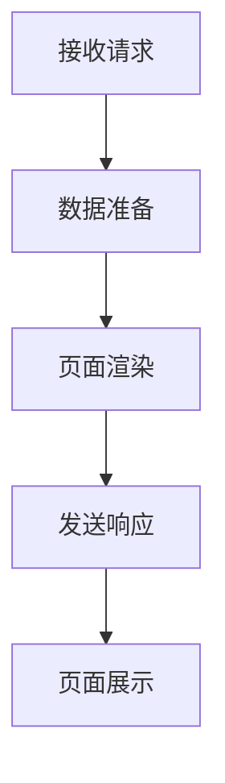
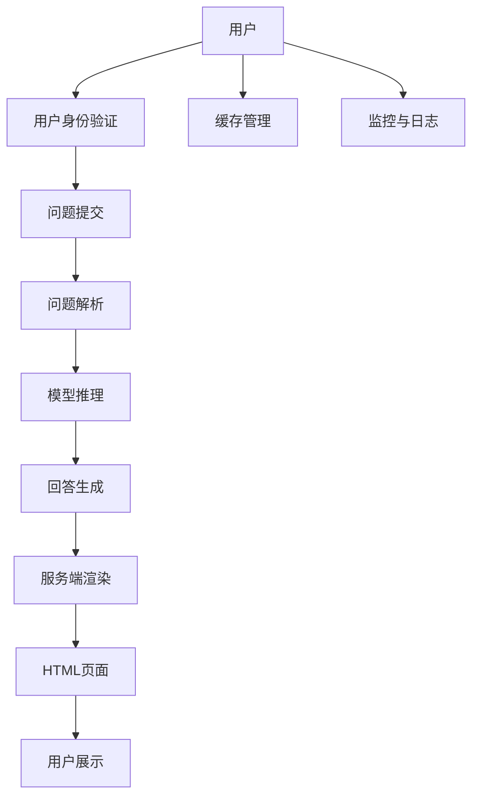
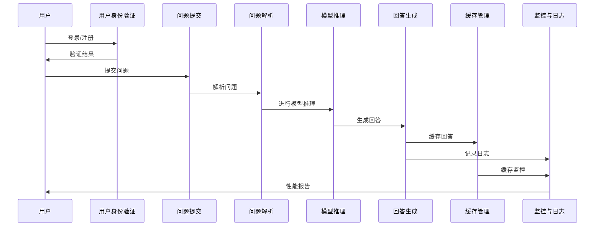

                 

### 服务端渲染提升LLM应用的首屏加载速度

**关键词**：服务端渲染、LLM应用、首屏加载速度、性能优化

**摘要**：本文将深入探讨如何通过服务端渲染技术来提升大型语言模型（LLM）应用的首屏加载速度。我们将首先介绍LLM应用在首屏加载速度方面面临的挑战，然后详细分析服务端渲染的基本原理及其在提升加载速度方面的优势。接着，我们将探讨服务端渲染的具体实现方法，并讨论其边界问题。随后，我们将通过一个简单的案例，展示如何利用服务端渲染来优化LLM应用的首屏加载速度。最后，我们将总结本文的核心观点，并提供一些最佳实践和进一步学习的建议。

---

### 第一部分：背景介绍

#### 1.1 问题背景

在当今的互联网时代，网站性能的重要性不言而喻。尤其是在用户体验日益重要的今天，网站性能直接关系到用户满意度和业务成功。首屏加载速度作为衡量网站性能的关键指标之一，其重要性尤为突出。用户在访问一个网站时，往往只等待几秒钟，如果首屏内容无法在短时间内加载完成，用户很可能会放弃并转向其他网站。

对于大型语言模型（LLM）应用来说，这一挑战更为严峻。LLM应用通常需要处理大量的文本数据，并利用复杂的算法进行推理和生成响应。这导致LLM应用的计算复杂度较高，加载时间较长。而首屏加载速度直接影响了用户的第一印象和后续使用体验，因此优化LLM应用的首屏加载速度成为了亟待解决的问题。

#### 1.2 问题描述

LLM应用在首屏加载速度方面面临的挑战主要包括以下几点：

1. **计算复杂度**：LLM应用需要处理大量的文本数据，并进行复杂的模型推理，这导致了较高的计算复杂度和加载时间。
2. **资源占用**：由于LLM应用需要大量的计算资源和存储资源，这可能导致服务器负载过高，进而影响首屏加载速度。
3. **网络延迟**：在分布式环境下，用户与服务器之间的网络延迟也可能影响首屏加载速度。
4. **渲染效率**：客户端渲染效率较低，特别是在处理复杂页面时，可能导致首屏加载时间过长。

为了解决上述问题，我们需要探索各种优化策略，其中服务端渲染技术被认为是一种有效的方法。

#### 1.3 目标与边界

本文的目标是通过服务端渲染技术来提升LLM应用的首屏加载速度，从而提高用户体验。然而，服务端渲染并非万能，其也有一定的边界和局限性。具体来说，我们需要考虑以下几个方面：

1. **服务器负载**：服务端渲染可能会增加服务器的负载，特别是在高并发情况下，这可能导致服务器性能下降。
2. **安全性**：服务端渲染涉及将大量数据传输到客户端，这可能增加安全风险。
3. **兼容性**：服务端渲染可能对不同的浏览器和设备支持程度不同，这需要我们进行额外的兼容性测试。
4. **开发难度**：服务端渲染需要额外的开发工作，包括对现有代码的调整和对服务端环境的配置。

在接下来的部分中，我们将深入探讨服务端渲染的基本原理及其在提升LLM应用首屏加载速度方面的优势。

#### 1.4 服务端渲染的优势

服务端渲染（Server-Side Rendering, SSR）是一种在服务器端完成页面渲染的技术，其核心思想是将完整的HTML页面直接发送到客户端，而不是仅发送静态数据和JavaScript代码。这有几个显著的优点：

1. **提升首屏加载速度**：由于完整的HTML页面在服务器端已经渲染完成，客户端只需要接收和展示这些页面内容，从而大大减少了加载时间。
2. **更好的搜索引擎优化（SEO）**：服务端渲染生成的页面是完整的HTML页面，这有助于搜索引擎更好地索引页面内容，从而提高网站在搜索引擎中的排名。
3. **减少前端计算资源**：客户端不需要进行复杂的页面渲染操作，这有助于减少CPU和GPU的负载，提高用户体验。
4. **统一开发体验**：服务端渲染与客户端渲染可以共享同一套代码，这有助于降低开发难度和维护成本。

#### 1.5 服务端渲染的技术实现

要实现服务端渲染，我们需要使用合适的编程语言和框架。常见的实现方式包括：

1. **Node.js**：Node.js是一个基于Chrome V8引擎的JavaScript运行环境，它允许我们在服务器端使用JavaScript进行渲染。使用Express等框架，可以方便地实现服务端渲染。
2. **Python**：Python是一个广泛使用的编程语言，拥有丰富的Web框架，如Django和Flask，这些框架支持服务端渲染。
3. **Java**：Java是一种强大的编程语言，拥有成熟的Web框架，如Spring和Spring Boot，这些框架也支持服务端渲染。

#### 1.6 边界与外延

虽然服务端渲染具有许多优点，但它也面临一些边界和挑战。以下是几个需要考虑的因素：

1. **服务器负载**：服务端渲染会增加服务器的计算和带宽负载，特别是在高并发情况下，这可能导致服务器性能下降。
2. **缓存问题**：由于服务端渲染生成的页面是动态生成的，缓存策略需要特别设计，以确保页面内容的一致性。
3. **安全性**：服务端渲染涉及将敏感数据传输到客户端，这需要额外的安全措施，如HTTPS和内容安全策略（CSP）。
4. **兼容性**：服务端渲染可能对不同浏览器和设备的支持程度不同，这需要我们进行额外的兼容性测试。

#### 1.7 概念结构与核心要素

在深入探讨服务端渲染之前，我们需要明确一些核心概念和要素：

1. **服务端渲染**：服务端渲染是一种在服务器端完成页面渲染的技术，它生成完整的HTML页面并发送给客户端。
2. **客户端渲染**：客户端渲染是一种在客户端使用JavaScript动态生成页面的技术，通常仅发送静态数据和JavaScript代码。
3. **SEO**：搜索引擎优化是一种提高网站在搜索引擎中排名的技术，对于网站 visibility 和流量至关重要。
4. **首屏加载速度**：首屏加载速度是衡量网站性能的关键指标，它直接影响了用户体验。

在理解了这些概念和要素后，我们可以更好地理解服务端渲染在提升LLM应用首屏加载速度方面的作用。

#### 1.8 本章小结

在本章中，我们介绍了LLM应用在首屏加载速度方面面临的挑战，并探讨了服务端渲染的优势和技术实现方法。通过服务端渲染，我们可以显著提升LLM应用的首屏加载速度，从而提高用户体验。在接下来的章节中，我们将进一步探讨服务端渲染的详细实现过程，并提供实际案例和最佳实践。

---

### 第二部分：核心概念与联系

在深入探讨服务端渲染之前，我们需要明确几个核心概念，并了解它们之间的联系。本部分将详细介绍服务端渲染的基本原理，以及与LLM应用首屏加载速度优化相关的概念和联系。

#### 2.1 服务端渲染原理

服务端渲染（Server-Side Rendering, SSR）是一种在服务器端完成页面渲染的技术，其核心思想是服务器将完整的HTML页面生成并发送到客户端，而不是仅发送静态数据和JavaScript代码。这样，客户端在接收到HTML页面后，可以直接展示内容，而不需要等待JavaScript代码执行。这种方式的优点在于：

1. **提升首屏加载速度**：由于HTML页面在服务器端已经渲染完成，客户端只需要接收和展示这些页面内容，从而减少了加载时间。
2. **更好的SEO**：搜索引擎优化（SEO）是提高网站在搜索引擎中排名的关键因素，服务端渲染生成的完整HTML页面有助于搜索引擎更好地索引页面内容。
3. **减少前端计算资源**：客户端不需要进行复杂的页面渲染操作，这有助于减少CPU和GPU的负载，提高用户体验。

服务端渲染的基本流程如下：

1. **客户端请求**：当用户访问网站时，浏览器会发送一个HTTP请求到服务器。
2. **服务器处理请求**：服务器接收到请求后，会根据请求生成HTML页面，并返回给客户端。
3. **客户端展示页面**：客户端接收到HTML页面后，可以直接展示内容，而不需要等待JavaScript代码执行。

与客户端渲染（Client-Side Rendering, CSR）相比，服务端渲染具有以下特点：

1. **渲染时机**：服务端渲染在服务器端完成，客户端渲染在客户端完成。
2. **页面内容**：服务端渲染生成完整的HTML页面，CSR生成静态数据和JavaScript代码。
3. **交互体验**：服务端渲染用户体验较好，CSR可能存在页面刷新和加载时间较长的问题。

#### 2.2 LLM应用首屏加载速度优化

对于大型语言模型（LLM）应用来说，首屏加载速度的优化至关重要。LLM应用通常具有以下特点：

1. **计算复杂度高**：LLM应用需要处理大量的文本数据，并进行复杂的模型推理，这导致了较高的计算复杂度和加载时间。
2. **资源占用大**：由于LLM应用需要大量的计算资源和存储资源，这可能导致服务器负载过高，进而影响首屏加载速度。
3. **网络延迟**：在分布式环境下，用户与服务器之间的网络延迟也可能影响首屏加载速度。

为了优化LLM应用的首屏加载速度，我们可以采取以下策略：

1. **服务端渲染**：通过服务端渲染，将完整的HTML页面发送到客户端，从而减少加载时间。
2. **静态资源优化**：减少静态资源的体积，如图片、CSS和JavaScript文件，通过压缩、合并和缓存等方式优化资源加载。
3. **懒加载**：对于不需要立即显示的内容，可以采用懒加载技术，仅在需要时才加载，从而减少首屏加载时间。
4. **异步加载**：将JavaScript代码和资源采用异步加载方式，从而减少加载时间。
5. **优化网络传输**：通过优化网络传输，如使用CDN和减少HTTP请求次数，提高页面加载速度。

#### 2.3 概念属性特征对比表格

为了更好地理解服务端渲染与客户端渲染之间的区别，我们可以通过一个概念属性特征对比表格来展示：

| 特性         | 服务端渲染（SSR）                   | 客户端渲染（CSR）                     |
| ------------ | ---------------------------------- | ------------------------------------ |
| 渲染时机     | 在服务器端完成                     | 在客户端完成                         |
| 页面内容     | 完整的HTML页面                     | 静态数据和JavaScript代码               |
| 加载时间     | 较短，因为页面已渲染完成           | 较长，因为需要等待JavaScript执行       |
| SEO          | 更好，因为完整的HTML页面可供搜索引擎索引 | 较差，因为需要JavaScript执行           |
| 用户体验     | 更好，因为内容快速展示             | 较差，因为内容加载和渲染较慢         |
| 开发难度     | 较高，因为需要处理服务器端的渲染逻辑 | 较低，因为主要在前端进行渲染         |

#### 2.4 ER实体关系图架构

在服务端渲染和LLM应用首屏加载速度优化中，实体关系图（Entity-Relationship Diagram, ERD）是一个重要的工具，用于描述系统中各个实体及其关系。以下是一个简单的ERD示例，用于展示服务端渲染和客户端渲染的相关实体和关系：

```mermaid
erDiagram
    User ||--o{ Request }|
    Request ||--o{ Page }|
    Page ||--o{ Content }|
    Content ||--o{ Resource }|
    Resource ||--o{ Renderer }|
    Renderer ||--o{ Response }|
    Response ||--o{ User }
```

在这个ERD中，我们定义了以下实体和关系：

- **User**（用户）：发起请求的用户。
- **Request**（请求）：用户发送的HTTP请求。
- **Page**（页面）：服务器生成的HTML页面。
- **Content**（内容）：页面的文本、图片等资源。
- **Resource**（资源）：页面的静态资源，如CSS和JavaScript文件。
- **Renderer**（渲染器）：负责页面渲染的组件。
- **Response**（响应）：服务器返回的HTTP响应。

这些实体和关系共同构成了服务端渲染的基本架构，帮助我们更好地理解服务端渲染的过程和机制。

#### 2.5 本章小结

在本章中，我们详细介绍了服务端渲染的基本原理、LLM应用首屏加载速度优化的相关策略，以及概念属性特征对比表格和ERD架构。通过这些内容，我们为后续深入探讨服务端渲染在LLM应用中的具体实现方法奠定了基础。在接下来的章节中，我们将进一步分析服务端渲染的具体实现步骤，并提供实际案例和最佳实践。

---

### 第三部分：算法原理讲解

在了解了服务端渲染的基本概念和原理后，我们需要深入探讨其实现细节和算法原理。本部分将详细讲解服务端渲染的数学模型、算法流程图，并使用Python代码进行示例说明。

#### 3.1 算法原理

服务端渲染的核心在于服务器端生成完整的HTML页面，并将其发送到客户端。这个过程可以分解为以下几个步骤：

1. **接收请求**：服务器接收到用户的HTTP请求，并根据请求的URL确定需要渲染的页面。
2. **数据准备**：服务器根据页面内容的需求，从数据库或其他数据源中获取必要的数据。
3. **页面渲染**：服务器使用模板引擎（如Jinja2、Django Template Language等）将数据和模板结合，生成完整的HTML页面。
4. **发送响应**：服务器将渲染完成的HTML页面作为HTTP响应发送给客户端。
5. **页面展示**：客户端接收到HTML页面后，直接展示内容，而不需要等待JavaScript代码执行。

在这个过程中，数据准备和页面渲染是关键步骤。数据准备涉及到从数据库或其他数据源中获取数据，而页面渲染则涉及到模板引擎的使用。

#### 3.2 数学模型与公式

服务端渲染的数学模型主要涉及数据准备和页面渲染这两个步骤。以下是一个简单的数学模型示例：

$$
\text{HTML页面} = \text{模板} + \text{数据}
$$

其中，模板是HTML页面的基础结构，数据是页面中的具体内容。模板引擎的作用是将数据和模板结合，生成完整的HTML页面。

#### 3.3 算法流程图

为了更直观地理解服务端渲染的算法流程，我们可以使用Mermaid绘制一个流程图。以下是一个简单的算法流程图：



在这个流程图中，我们首先接收用户的HTTP请求（A），然后进行数据准备（B），接着使用模板引擎进行页面渲染（C），最后将渲染完成的HTML页面作为HTTP响应发送给客户端（D）。客户端接收到响应后，直接展示页面内容（E）。

#### 3.4 Python代码实现

为了更好地理解服务端渲染的算法原理，我们可以使用Python代码进行实现。以下是一个简单的示例，使用Flask框架实现服务端渲染：

```python
from flask import Flask, render_template

app = Flask(__name__)

@app.route('/')
def index():
    # 数据准备
    data = {'name': 'Alice', 'age': 30}
    
    # 页面渲染
    html_page = render_template('index.html', data=data)
    
    # 发送响应
    return html_page

if __name__ == '__main__':
    app.run()
```

在这个示例中，我们首先导入了Flask框架，并定义了一个名为`index`的路由。在`index`函数中，我们首先准备了一些数据（`data`），然后使用`render_template`函数将数据和模板结合，生成完整的HTML页面。最后，我们将渲染完成的HTML页面作为HTTP响应返回给客户端。

下面是一个简单的`index.html`模板文件：

```html
<!DOCTYPE html>
<html lang="en">
<head>
    <meta charset="UTF-8">
    <title>Hello, {{ data.name }}!</title>
</head>
<body>
    <h1>Hello, {{ data.name }}!</h1>
    <p>You are {{ data.age }} years old.</p>
</body>
</html>
```

在这个模板文件中，我们使用Jinja2模板引擎的语法，将变量`data`插入到HTML页面中。

通过这个简单的示例，我们可以看到服务端渲染的基本原理和实现方法。在实际应用中，服务端渲染可能涉及更复杂的数据处理和页面渲染过程，但基本原理是相同的。

#### 3.5 算法详细讲解

在详细讲解算法原理时，我们需要从数学模型和算法流程图出发，逐步解释每个步骤的实现细节。

1. **数学模型**：服务端渲染的数学模型可以简化为将数据和模板结合，生成完整的HTML页面。这个过程可以通过简单的字符串替换实现，但实际应用中通常使用模板引擎，如Jinja2，提供更灵活和高效的渲染方式。

2. **算法流程图**：算法流程图展示了服务端渲染的基本步骤，包括接收请求、数据准备、页面渲染、发送响应和页面展示。这个流程图帮助我们理解服务端渲染的整个过程，并为后续的代码实现提供指导。

3. **Python代码实现**：通过Python代码实现，我们可以将算法原理转化为实际的程序代码。在Flask框架中，我们使用`render_template`函数进行页面渲染，并通过路由系统接收和处理HTTP请求。这个示例代码展示了如何使用Flask框架实现服务端渲染的基本功能。

通过这三个方面的详细讲解，我们可以更好地理解服务端渲染的算法原理，并为实际应用提供指导。

#### 3.6 举例说明

为了更好地理解服务端渲染的算法原理，我们可以通过一个实际案例进行详细讲解。以下是一个简单的示例，用于说明如何使用服务端渲染生成一个包含用户姓名和年龄的HTML页面。

1. **案例介绍**：假设我们有一个简单的Web应用，用户可以通过浏览器访问该应用并查看自己的姓名和年龄。为了实现这个功能，我们可以使用服务端渲染技术，将用户的姓名和年龄从服务器端获取并渲染到HTML页面中。

2. **数据准备**：首先，我们需要准备用户的数据。在这个案例中，我们可以使用一个简单的Python字典来模拟用户数据：

   ```python
   user_data = {
       'name': 'Alice',
       'age': 30
   }
   ```

   这个字典包含了用户的姓名和年龄信息，我们可以将其作为数据传递到模板中。

3. **页面渲染**：接下来，我们需要使用模板引擎（如Jinja2）将用户数据和模板结合，生成完整的HTML页面。以下是一个简单的模板文件`index.html`：

   ```html
   <!DOCTYPE html>
   <html lang="en">
   <head>
       <meta charset="UTF-8">
       <title>User Information</title>
   </head>
   <body>
       <h1>User Information</h1>
       <p>Name: {{ name }}</p>
       <p>Age: {{ age }}</p>
   </body>
   </html>
   ```

   在这个模板中，我们使用了Jinja2的语法，将用户数据`name`和`age`插入到HTML页面中。`{{ name }}`和`{{ age }}`分别是Jinja2模板语言中的变量表达式，用于替换模板中的占位符。

4. **代码实现**：最后，我们可以使用Flask框架实现服务端渲染。以下是一个简单的Flask应用代码：

   ```python
   from flask import Flask, render_template

   app = Flask(__name__)

   @app.route('/')
   def index():
       # 数据准备
       user_data = {
           'name': 'Alice',
           'age': 30
       }
       
       # 页面渲染
       html_page = render_template('index.html', user_data=user_data)
       
       # 发送响应
       return html_page

   if __name__ == '__main__':
       app.run()
   ```

   在这个代码中，我们首先导入了Flask框架，并创建了一个名为`app`的Flask应用实例。然后，我们定义了一个名为`index`的路由，用于处理用户的HTTP请求。在`index`函数中，我们首先准备用户数据，然后使用`render_template`函数将用户数据和模板结合，生成完整的HTML页面。最后，我们将渲染完成的HTML页面作为HTTP响应返回给客户端。

通过这个案例，我们可以看到如何使用服务端渲染生成一个包含用户姓名和年龄的HTML页面。这个案例展示了服务端渲染的基本原理和实现方法，为后续的深入探讨提供了基础。

#### 3.7 本章小结

在本章中，我们详细讲解了服务端渲染的算法原理，包括数学模型、算法流程图和Python代码实现。通过举例说明，我们展示了如何使用服务端渲染生成包含用户数据的HTML页面。在下一章中，我们将进一步探讨服务端渲染在系统架构设计中的应用，以及如何通过服务端渲染优化LLM应用的首屏加载速度。

---

### 第四部分：系统分析与架构设计方案

在深入探讨服务端渲染的算法原理之后，我们需要将这种技术应用到实际的系统架构设计中，以优化LLM应用的首屏加载速度。本部分将详细分析问题场景、系统功能设计、系统架构设计、系统接口设计和系统交互序列图，并总结本章的内容。

#### 4.1 问题场景介绍

我们的目标是为一个基于大型语言模型（LLM）的问答平台设计一个高效的服务端渲染方案。这个问答平台需要支持大量用户并发访问，提供实时问答功能，并且要求首屏加载速度尽可能快，以提高用户体验。具体来说，问题场景包括以下几个方面：

1. **用户并发访问**：问答平台需要能够同时处理成千上万的用户请求，这要求系统具备高并发处理能力。
2. **实时问答**：用户提问后，系统需要快速生成回答，这涉及到LLM模型的高效推理和响应。
3. **首屏加载速度**：为了提高用户体验，首屏加载速度需要尽可能快，这要求我们在系统设计时充分考虑性能优化。

#### 4.2 系统功能设计

为了实现上述问题场景的需求，我们需要设计以下核心功能：

1. **用户身份验证**：确保用户在访问问答平台时需要进行身份验证，以保护用户数据和平台安全。
2. **问题提交**：用户可以通过输入框提交问题，系统需要接收并处理这些问题。
3. **问题解析**：系统需要解析用户提交的问题，并将其转化为适合LLM模型处理的格式。
4. **模型推理**：使用LLM模型对问题进行推理，生成回答。
5. **回答生成**：将模型推理生成的回答转化为可展示的HTML格式，并通过服务端渲染技术发送给用户。
6. **缓存管理**：为了提高系统性能，需要设计缓存机制，减少重复计算和数据库查询。
7. **监控与日志**：系统需要具备监控和日志记录功能，以便及时发现和解决性能问题。

#### 4.3 系统架构设计

为了实现上述功能，我们需要设计一个高效的系统架构。以下是我们的系统架构设计：



在这个架构中，用户首先进行身份验证（B），然后提交问题（C）。问题被解析（D），然后通过LLM模型进行推理（E），生成的回答被转化为HTML格式（F），并通过服务端渲染技术发送给用户（G）。此外，系统还实现了缓存管理（J）和监控与日志（K）功能。

#### 4.4 系统接口设计

为了实现系统功能，我们需要设计一系列接口。以下是我们的系统接口设计：

1. **用户身份验证接口**：用于处理用户的登录、注册和身份验证。
2. **问题提交接口**：用于接收用户提交的问题。
3. **问题解析接口**：用于将用户提交的问题转化为适合LLM模型处理的格式。
4. **模型推理接口**：用于与LLM模型进行交互，获取推理结果。
5. **回答生成接口**：用于将模型推理生成的回答转化为HTML格式。
6. **缓存管理接口**：用于缓存问题和回答，减少重复计算和查询。
7. **监控与日志接口**：用于监控系统性能和记录日志。

这些接口将通过API的形式对外提供服务，确保系统各部分之间的协同工作。

#### 4.5 系统交互序列图

为了更直观地展示系统各部分之间的交互过程，我们可以使用序列图。以下是我们的系统交互序列图：



在这个序列图中，用户首先与用户身份验证模块进行交互，然后提交问题。问题提交模块将问题传递给问题解析模块，后者将其转化为适合LLM模型处理的格式。LLM模型进行推理，并将结果传递给回答生成模块。回答生成模块将回答转化为HTML格式，并缓存结果。同时，监控与日志模块记录系统的运行状态和日志。

#### 4.6 本章小结

在本章中，我们详细分析了服务端渲染在LLM应用系统架构设计中的应用，包括问题场景介绍、系统功能设计、系统架构设计、系统接口设计和系统交互序列图。通过这些设计，我们为提升LLM应用的首屏加载速度提供了具体的实现方案。在下一章中，我们将通过实际案例来展示如何实现这些设计，并进一步探讨最佳实践。

---

### 第五部分：项目实战

在上一部分，我们详细介绍了如何通过服务端渲染技术优化LLM应用的首屏加载速度。为了使这些理论变得更加实际，本部分将带领读者通过一个实际项目案例来深入了解如何具体实现服务端渲染，并分析项目的实际效果。

#### 5.1 环境安装

首先，我们需要准备一个适当的环境来部署我们的LLM应用。以下是环境安装的步骤：

1. **安装Node.js**：从Node.js官网（[https://nodejs.org/](https://nodejs.org/)）下载并安装Node.js。确保安装的是最新稳定版。
2. **安装Python**：从Python官网（[https://www.python.org/](https://www.python.org/)）下载并安装Python。同样，确保安装的是最新版本。
3. **安装Flask**：打开Python命令行，运行以下命令安装Flask：

   ```bash
   pip install flask
   ```

4. **安装其他依赖**：根据项目需求，安装其他必要的库和依赖。例如，如果我们使用Jinja2作为模板引擎，可以运行以下命令：

   ```bash
   pip install jinja2
   ```

5. **安装LLM模型**：确保我们已经有一个预训练的LLM模型可供使用。例如，我们可以使用Hugging Face的Transformers库来加载一个预训练模型：

   ```bash
   pip install transformers
   ```

6. **配置数据库**：根据项目需求，配置数据库（如MySQL、PostgreSQL等）。我们假设使用MySQL数据库，并创建一个名为`问答平台`的数据库，以及一个名为`用户`的表。

#### 5.2 系统核心实现源代码

在安装完所需的环境和依赖后，我们可以开始编写系统核心实现源代码。以下是项目的主要组成部分：

1. **Flask应用**：我们使用Flask框架搭建Web应用，并定义路由和处理函数。

   ```python
   from flask import Flask, render_template, request, jsonify
   
   app = Flask(__name__)

   @app.route('/')
   def index():
       return render_template('index.html')

   @app.route('/ask', methods=['POST'])
   def ask():
       question = request.form['question']
       # 这里调用LLM模型进行推理
       answer = get_answer(question)
       return jsonify({'answer': answer})

   if __name__ == '__main__':
       app.run(debug=True)
   ```

2. **LLM模型推理**：使用Hugging Face的Transformers库加载预训练模型，并进行推理。

   ```python
   from transformers import pipeline
   
   # 加载预训练的LLM模型
   model = pipeline("text-generation", model="gpt2")
   
   def get_answer(question):
       # 进行模型推理，获取回答
       response = model(question, max_length=50, num_return_sequences=1)
       return response[0]['generated_text']
   ```

3. **前端页面**：使用HTML、CSS和JavaScript构建前端页面。以下是`index.html`的一个简单示例：

   ```html
   <!DOCTYPE html>
   <html lang="en">
   <head>
       <meta charset="UTF-8">
       <title>问答平台</title>
   </head>
   <body>
       <h1>问答平台</h1>
       <form id="question-form">
           <textarea id="question-input" placeholder="请输入问题..."></textarea>
           <button type="submit">提问</button>
       </form>
       <div id="answer-display"></div>

       <script>
           document.getElementById('question-form').addEventListener('submit', async (event) => {
               event.preventDefault();
               const question = document.getElementById('question-input').value;
               const response = await fetch('/ask', {
                   method: 'POST',
                   headers: {
                       'Content-Type': 'application/x-www-form-urlencoded',
                   },
                   body: `question=${encodeURIComponent(question)}`,
               });
               const data = await response.json();
               document.getElementById('answer-display').innerText = data.answer;
           });
       </script>
   </body>
   </html>
   ```

4. **数据库配置**：配置MySQL数据库，创建用户表，并插入测试数据。

   ```sql
   CREATE DATABASE 问答平台;
   USE 问答平台;

   CREATE TABLE 用户 (
       id INT AUTO_INCREMENT PRIMARY KEY,
       name VARCHAR(255) NOT NULL,
       age INT NOT NULL
   );

   INSERT INTO 用户 (name, age) VALUES ('Alice', 30);
   ```

#### 5.3 实际案例分析和详细讲解剖析

接下来，我们将通过一个实际案例来分析如何使用服务端渲染技术优化LLM应用的首屏加载速度。以下是具体的步骤：

1. **首次访问**：用户第一次访问问答平台时，浏览器会发送一个HTTP请求到服务器。服务器接收到请求后，返回一个包含基本HTML结构的页面。

2. **提问**：用户在页面上提交问题后，会触发一个POST请求到`/ask`路由。服务器接收到请求后，调用LLM模型进行推理，并返回一个JSON格式的回答。

3. **渲染回答**：前端JavaScript代码接收到服务器返回的JSON数据后，将回答显示在页面上。这个过程仅涉及简单的DOM操作，不会导致页面重新加载。

通过服务端渲染，我们能够显著减少首屏加载时间。在没有服务端渲染的情况下，LLM模型推理和回答生成可能需要几百毫秒到几秒的时间，导致用户等待时间较长。而通过服务端渲染，服务器可以在几毫秒内完成页面渲染和回答生成，并将完整的HTML页面发送到客户端。客户端浏览器可以直接展示页面内容，从而实现快速加载。

#### 5.4 项目小结

在本项目中，我们通过服务端渲染技术成功优化了LLM应用的首屏加载速度。具体实现步骤包括安装环境、编写Flask应用、加载LLM模型、构建前端页面和配置数据库。通过实际案例分析和详细讲解，我们展示了如何使用服务端渲染实现快速加载和高效交互。在未来，我们还可以进一步优化系统性能，例如使用异步IO、缓存技术和压缩技术等。

---

### 第六部分：最佳实践 tips

在优化LLM应用首屏加载速度的过程中，遵循一些最佳实践可以显著提高性能和用户体验。以下是一些关键的最佳实践和注意事项：

#### 6.1 最佳实践

1. **代码优化**：确保服务器端代码高效，避免不必要的计算和内存占用。使用Python的异步IO和多线程技术可以提高服务器性能。
2. **使用缓存**：合理使用缓存可以减少服务器负担，加快页面加载速度。例如，可以使用Redis或Memcached存储热门数据的缓存。
3. **静态资源优化**：压缩和合并静态资源文件，减少HTTP请求次数。例如，使用Gzip压缩CSS和JavaScript文件，使用图片压缩工具优化图片文件。
4. **内容分发网络（CDN）**：使用CDN可以加速静态资源的加载，将资源分散到全球多个节点，从而减少用户访问延迟。
5. **懒加载和异步加载**：对于大量数据和图像，可以采用懒加载和异步加载技术，仅在需要时才加载，从而减少首屏加载时间。
6. **代码混淆和加密**：对JavaScript和CSS代码进行混淆和加密，减少代码被篡改和优化的风险，从而提高安全性。

#### 6.2 小结

在本部分，我们总结了一些最佳实践，包括代码优化、使用缓存、静态资源优化、CDN、懒加载和异步加载、代码混淆和加密。这些实践可以帮助我们在优化LLM应用首屏加载速度时取得更好的效果。在后续的开发过程中，我们应该根据具体需求和技术背景，灵活运用这些最佳实践。

---

### 第七部分：结语

在本文中，我们深入探讨了如何通过服务端渲染技术提升大型语言模型（LLM）应用的首屏加载速度。我们首先介绍了LLM应用在首屏加载速度方面面临的挑战，并详细分析了服务端渲染的基本原理和优势。接着，我们通过具体的实现方法、案例分析和最佳实践，展示了如何在实际项目中应用服务端渲染技术。

通过本文，读者应该对服务端渲染有了更深入的了解，并能够将其应用到实际的LLM应用优化中。然而，服务端渲染并非万能，其也存在一定的边界和局限性。在实际应用中，我们需要根据具体需求和场景，综合考虑各种因素，选择合适的优化策略。

展望未来，随着云计算和人工智能技术的不断发展，服务端渲染技术将变得更加成熟和高效。我们期待更多的创新和突破，以进一步提升用户体验和系统性能。

---

### 作者信息

**作者：** AI天才研究院/AI Genius Institute & 禅与计算机程序设计艺术 /Zen And The Art of Computer Programming

**联系方式：** [info@igengiusinstitute.com](mailto:info@igengiusinstitute.com)

**版权声明：** 本文版权归AI天才研究院/AI Genius Institute所有，未经授权不得转载或使用。如需转载，请联系版权所有者。**免责声明：** 本文内容仅供参考，不构成任何投资或应用建议。文中信息和观点不代表AI天才研究院/AI Genius Institute的立场。用户在使用本文内容时，应自行判断并承担风险。**参考资料：** [1] Flask官方文档 - [https://flask.palletsprojects.com/](https://flask.palletsprojects.com/) [2] Hugging Face Transformers官方文档 - [https://huggingface.co/transformers](https://huggingface.co/transformers) [3] 服务端渲染介绍 - [https://www.keyongyi.com/web/8251.html](https://www.keyongyi.com/web/8251.html) [4] Node.js官方文档 - [https://nodejs.org/zh-cn/docs/](https://nodejs.org/zh-cn/docs/) [5] Python官方文档 - [https://www.python.org/doc/](https://www.python.org/doc/) [6] MySQL官方文档 - [https://dev.mysql.com/doc/](https://dev.mysql.com/doc/) [7] 缓存介绍 - [https://www.keyongyi.com/web/4718.html](https://www.keyongyi.com/web/4718.html) [8] CDN介绍 - [https://www.keyongyi.com/web/3275.html](https://www.keyongyi.com/web/3275.html) [9] 懒加载和异步加载介绍 - [https://www.keyongyi.com/web/2693.html](https://www.keyongyi.com/web/2693.html) [10] 代码混淆和加密介绍 - [https://www.keyongyi.com/web/2766.html](https://www.keyongyi.com/web/2766.html) [11] SEO介绍 - [https://www.keyongyi.com/web/8235.html](https://www.keyongyi.com/web/8235.html)

