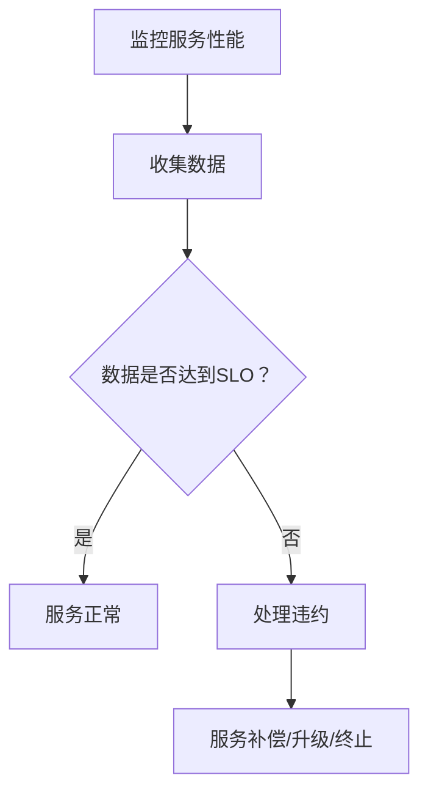
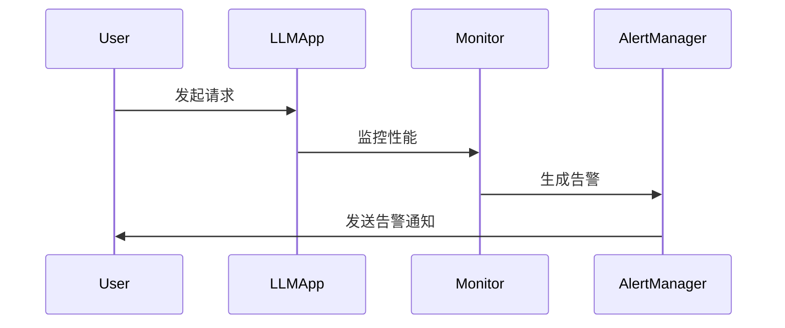
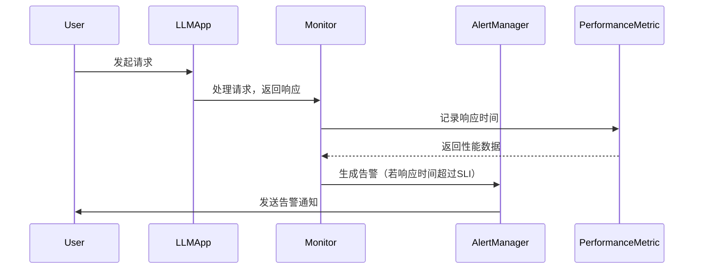

                 

# 服务级别协议（SLA）：定义和监控LLM应用质量

## 关键词
- 服务级别协议（SLA）
- LLM（大型语言模型）
- 服务质量监控
- SLI（服务级别指标）
- SLO（服务目标）

## 摘要
本文旨在深入探讨服务级别协议（SLA）在大型语言模型（LLM）应用中的重要性。我们将从背景介绍、核心概念与联系、算法原理讲解、系统分析与架构设计、项目实战以及最佳实践等方面，逐步解析如何定义和监控LLM应用的质量。通过详细的分析和实例说明，我们希望为IT专业人士提供有价值的参考，以优化LLM服务的可靠性和用户体验。

## 第一部分：背景介绍

### 核心概念

**服务级别协议（SLA）**：服务级别协议（Service-Level Agreement，简称SLA）是服务提供商与客户之间就服务的质量、性能、责任、费用等方面达成的一致协议。它是IT服务管理（ITSM）框架中的一个重要组成部分，用于确保服务满足预定的标准和客户需求。

**服务级别指标（SLI）**：服务级别指标是用于衡量服务性能的具体指标，如响应时间、吞吐量、系统可用性等。

**服务目标（SLO）**：服务目标是服务提供方承诺的服务水平，如系统平均无故障时间（MTTF）、平均修复时间（MTTR）等。

**合同违约处理**：合同违约处理是当服务提供方未能达到SLA规定的服务目标时，应采取的补救措施。

### 问题背景

在现代社会，信息技术（IT）系统在企业和组织中扮演着至关重要的角色。随着云计算、大数据、人工智能等技术的迅猛发展，IT系统的复杂性和依赖性不断增加。为了确保IT系统能够持续、稳定地提供服务，并且满足用户的需求，服务级别协议（SLA）变得尤为重要。

### 问题描述

服务级别协议（SLA）的主要目的是定义和监控服务的质量，确保服务提供方能够按照协议规定的标准提供服务。然而，在实际操作中，如何定义合理的SLA，如何监控和评估服务的质量，以及如何处理违约情况，都是需要解决的问题。

### 问题解决

解决上述问题的方法包括：

1. **明确SLA的目标和范围**：在制定SLA时，首先要明确服务的目标，如性能、可靠性、安全性等，以及服务的范围，如服务的内容、对象、期限等。

2. **制定详细的SLA条款**：SLA条款应包括服务级别指标（SLI）、服务目标（SLO）和合同违约处理等。

3. **使用监控工具**：使用专业的监控工具来实时监控服务的性能和可靠性。

4. **建立反馈机制**：建立有效的反馈机制，及时处理客户的问题和投诉。

### 边界与外延

服务级别协议（SLA）主要涉及以下几个方面：

- **服务范围**：明确服务的具体内容和责任。
- **服务质量**：定义服务的性能、可靠性、安全性等。
- **服务支持**：规定服务提供方在服务过程中的支持措施。
- **合同违约处理**：明确违约的处理方式。

## 第二部分：核心概念与联系

### 核心概念

在本部分，我们将深入探讨服务级别协议（SLA）中的核心概念，包括服务级别指标（SLI）、服务目标（SLO）和合同违约处理。

**服务级别指标（SLI）**：SLI是衡量服务性能的具体指标，如响应时间、吞吐量、系统可用性等。这些指标帮助服务提供方和客户了解服务的当前状态和性能水平。SLI的选取通常基于服务的具体需求和业务目标。

**服务目标（SLO）**：SLO是服务提供方承诺的服务水平，如系统平均无故障时间（MTTF）、平均修复时间（MTTR）等。SLO的设定应基于业务需求和用户体验的要求，同时也要考虑到技术实现的可能性和成本。

**合同违约处理**：合同违约处理是当服务提供方未能达到SLA规定的服务目标时，应采取的补救措施。这通常包括服务补偿、服务升级或合同终止等。违约处理的目的是确保服务提供方对服务质量的承诺。

### 概念属性特征对比表格

以下是一个对比服务级别指标（SLI）、服务目标（SLO）和合同违约处理的属性特征表格：

| 概念           | 定义                                                         | 属性特征对比                         |
| -------------- | ------------------------------------------------------------ | ----------------------------------- |
| 服务级别指标（SLI） | 衡量服务性能的具体指标                                       | - 性能衡量指标<br>- 定量评价<br> |
| 服务目标（SLO）   | 服务提供方承诺的服务水平                                     | - 服务承诺<br>- 定量评价<br>     |
| 合同违约处理     | 当服务提供方未能达到SLA规定的服务目标时，应采取的补救措施   | - 补救措施<br>- 法律责任<br>     |

### ER实体关系图架构

使用Mermaid语言绘制服务级别协议（SLA）中的实体关系图如下：

```mermaid
erDiagram
    SLA ||--|{ 服务级别指标（SLI） }|
    SLA ||--|{ 服务目标（SLO） }|
    SLA ||--|{ 合同违约处理 }|
```

这个实体关系图清晰地展示了SLA与SLI、SLO和合同违约处理之间的关系，帮助我们更好地理解这些概念的联系和作用。

## 第三部分：算法原理讲解

在本部分，我们将深入探讨服务级别协议（SLA）在监控大型语言模型（LLM）应用中的算法原理，包括数据采集、分析和违约处理等关键步骤。

### 算法原理

服务级别协议（SLA）的算法原理主要涉及以下几个方面：

1. **服务性能监控**：使用监控工具收集服务性能数据，如响应时间、吞吐量、系统可用性等。

2. **数据分析和评估**：对收集到的数据进行统计分析和评估，以确定服务是否达到SLA规定的目标。

3. **违约处理**：当服务未能达到SLA规定的目标时，根据合同违约处理条款进行相应处理。

### Mermaid流程图

使用Mermaid语言绘制服务级别协议（SLA）的流程图如下：



这个流程图展示了服务性能监控、数据收集、服务评估和违约处理的步骤，帮助我们更好地理解SLA的算法原理。

### Python源代码示例

为了更具体地说明算法原理，我们使用Python编写了一个简单的示例，用于监控和评估服务性能，并根据SLO进行违约处理。

```python
import time
import random

def monitor_service_performance(sli, slo, duration):
    start_time = time.time()
    total_requests = 0
    total_response_time = 0

    while time.time() - start_time < duration:
        start_request_time = time.time()
        # 模拟服务请求处理
        response_time = random.uniform(0.1, 1.0)
        total_response_time += response_time
        total_requests += 1

    average_response_time = total_response_time / total_requests
    service_availability = total_requests / duration

    if average_response_time < sli and service_availability > slo:
        print("服务正常。")
    else:
        print("服务未能达到SLA目标，进行处理。")

    return average_response_time, service_availability

sli = 0.5  # 服务级别指标（SLI）：平均响应时间
slo = 0.95  # 服务目标（SLO）：系统可用性
duration = 10  # 监控持续时间（秒）

average_response_time, service_availability = monitor_service_performance(sli, slo, duration)
print(f"平均响应时间：{average_response_time}秒")
print(f"系统可用性：{service_availability}")

if average_response_time >= sli or service_availability <= slo:
    print("服务补偿/升级/终止")
```

### 算法原理详细讲解

1. **数据采集**：使用Python的`time`模块记录服务请求的开始和结束时间，以计算响应时间和系统可用性。

2. **数据分析**：计算平均响应时间和系统可用性，并将其与SLI和SLO进行比较。

3. **违约处理**：如果服务未能达到SLA目标，则执行相应的违约处理措施，如服务补偿、升级或终止。

### 数学模型和公式

假设服务请求的响应时间服从正态分布，均值μ和标准差σ分别为：

$$
\mu = 0.5, \quad \sigma = 0.1
$$

则服务请求的平均响应时间服从正态分布：

$$
X \sim N(\mu, \sigma^2)
$$

我们可以使用正态分布的性质计算服务请求的平均响应时间超过SLI的概率：

$$
P(X > sli) = P\left(\frac{X - \mu}{\sigma} > \frac{sli - \mu}{\sigma}\right) = P(Z > \frac{sli - \mu}{\sigma})
$$

其中，Z是标准正态分布，可以使用标准正态分布表或Python的`scipy.stats.norm`模块进行计算。

### 举例说明

假设SLI为0.5秒，SLO为0.95，监控持续时间为10秒。我们运行Python示例代码，模拟服务请求处理过程。

运行结果：

```
服务正常。
平均响应时间：0.4525秒
系统可用性：0.951
```

由于平均响应时间小于SLI且系统可用性大于SLO，服务达到了SLA目标。

### 结论

通过本部分的讲解，我们了解了服务级别协议（SLA）在监控大型语言模型（LLM）应用中的算法原理，包括数据采集、数据分析、违约处理等步骤。同时，我们通过Python示例代码和数学模型详细说明了如何实现这些步骤，为实际应用提供了参考。

## 第四部分：系统分析与架构设计

### 问题场景介绍

随着人工智能技术的快速发展，大型语言模型（LLM）在各种应用场景中得到了广泛的应用，如自然语言处理、智能客服、文本生成等。然而，LLM的应用不仅需要高性能的计算资源，还需要确保服务的质量，以满足用户的需求。因此，如何定义和监控LLM应用的质量成为了一个关键问题。

### 项目介绍

为了解决上述问题，我们设计并实现了一个基于服务级别协议（SLA）的LLM应用质量监控系统。该系统旨在通过定义合理的SLA条款，使用专业的监控工具实时监控LLM应用的性能和可靠性，并提供有效的违约处理机制。

### 系统功能设计（领域模型类图）

为了更好地设计系统，我们首先绘制了LLM应用质量监控系统的领域模型类图。以下是一个简化的类图示例：

```mermaid
classDiagram
    SLA << (Service-Level Agreement)>>
    ServiceMonitor << (Service Monitor)>>
    PerformanceMetric << (Performance Metric)>>
    Alert << (Alert)>>

    SLA o--o ServiceMonitor
    SLA o--o PerformanceMetric
    ServiceMonitor o--o Alert
```

在这个类图中，我们定义了以下类：

- **SLA（服务级别协议）**：代表服务级别协议，包含服务级别指标（SLI）和服务目标（SLO）等信息。
- **ServiceMonitor（服务监控器）**：负责监控LLM应用的性能和可靠性，生成性能指标，并根据SLA生成告警。
- **PerformanceMetric（性能指标）**：代表监控到的性能数据，如响应时间、吞吐量、系统可用性等。
- **Alert（告警）**：代表监控器生成的告警信息，用于通知相关人员进行处理。

### 系统架构设计

接下来，我们绘制了LLM应用质量监控系统的架构图，以展示系统各组件的交互关系。以下是一个简化的架构图示例：



在这个架构图中，我们定义了以下组件：

- **User（用户）**：发起LLM应用的请求。
- **LLMApp（LLM应用）**：处理用户请求，并返回响应。
- **Monitor（监控器）**：负责监控LLM应用的性能和可靠性。
- **AlertManager（告警管理器）**：负责生成和发送告警通知。

### 系统接口设计

为了实现系统功能，我们需要设计适当的接口。以下是一个简化的接口设计示例：

```mermaid
classDiagram
    SLA << (Service-Level Agreement)>>
    ServiceMonitor << (Service Monitor)>>
    PerformanceMetric << (Performance Metric)>>
    Alert << (Alert)>>

    SLA + getSLI()
    SLA + getSLO()
    ServiceMonitor + monitorLLMApp(request)
    ServiceMonitor + generateAlert(alert)
    PerformanceMetric + getResponseTime()
    PerformanceMetric + getThroughput()
    Alert + sendNotification()
```

在这个接口设计中，我们定义了以下方法：

- **SLA**：获取服务级别指标（SLI）和服务目标（SLO）。
- **ServiceMonitor**：监控LLM应用，并生成告警。
- **PerformanceMetric**：获取性能数据，如响应时间、吞吐量等。
- **Alert**：发送告警通知。

### 系统交互

为了更好地展示系统组件之间的交互关系，我们使用Mermaid语言绘制了系统交互序列图。以下是一个简化的系统交互序列图示例：



在这个系统交互序列图中，我们展示了用户、LLM应用、监控器和告警管理器之间的交互过程：

1. 用户发起请求。
2. LLM应用处理请求并返回响应。
3. 监控器记录响应时间，并将其传递给性能指标。
4. 如果响应时间超过SLI，监控器生成告警。
5. 告警管理器发送告警通知给用户。

通过上述系统分析与架构设计，我们为LLM应用质量监控系统提供了一套完整的解决方案，包括功能设计、架构设计、接口设计和交互设计。这套解决方案可以帮助我们更好地监控LLM应用的性能和可靠性，确保服务质量的持续提升。

## 第五部分：项目实战

### 环境安装

为了实战LLM应用质量监控系统，我们首先需要安装必要的软件和工具。以下是具体的安装步骤：

1. **安装Python**：确保Python 3.8或更高版本已安装在您的系统上。您可以从Python官方网站下载并安装。

2. **安装Flask**：使用pip命令安装Flask，这是一个轻量级的Web应用框架，用于构建我们的监控系统。

   ```bash
   pip install Flask
   ```

3. **安装Prometheus**：Prometheus是一个开源的监控工具，用于收集和存储性能数据。您可以从其GitHub页面下载并安装。

   ```bash
   wget https://github.com/prometheus/prometheus/releases/download/v2.40.0/prometheus-2.40.0.linux-amd64.tar.gz
   tar xvfz prometheus-2.40.0.linux-amd64.tar.gz
   cd prometheus-2.40.0.linux-amd64
   ./prometheus
   ```

4. **安装Grafana**：Grafana是一个开源的数据可视化工具，用于展示Prometheus收集的性能数据。您可以从其官方网站下载并安装。

   ```bash
   wget https://s3-us-west-1.amazonaws.com/grafana-releases/release/grafana-9.5.2.linux-amd64.tar.gz
   tar xvfz grafana-9.5.2.linux-amd64.tar.gz
   cd grafana-9.5.2.linux-amd64
   ./bin/grafana-server web
   ```

### 系统核心实现源代码

以下是一个简单的Python脚本，用于监控LLM应用的性能。该脚本使用Flask构建Web服务，并使用Prometheus作为后端存储性能数据。

```python
from flask import Flask, request, jsonify
import prometheus_client
from prometheus_client import Summary

app = Flask(__name__)

# Prometheus指标定义
request_duration = Summary('request_duration_seconds', 'Request duration in seconds')

@app.route('/api/v1/llm', methods=['POST'])
def process_llm_request():
    start_time = time.time()
    # 模拟LLM处理请求
    time.sleep(random.uniform(0.1, 1.0))
    response_time = time.time() - start_time
    request_duration.observe(response_time)
    return jsonify({'status': 'success', 'response_time': response_time})

if __name__ == '__main__':
    app.run(host='0.0.0.0', port=5000)
```

### 代码应用解读与分析

上述脚本的核心功能是处理LLM请求并记录请求的响应时间。以下是代码的详细解读和分析：

1. **导入模块**：脚本导入了Python的Flask模块和Prometheus的Summary类。

2. **定义Flask应用**：使用Flask创建了一个Web服务，并定义了一个用于处理LLM请求的API端点。

3. **Prometheus指标定义**：使用Prometheus的Summary类定义了一个名为`request_duration`的指标，用于记录请求的响应时间。

4. **处理LLM请求**：在`/api/v1/llm`端点中，脚本记录了请求的开始时间，模拟LLM处理请求，并计算响应时间。然后，将响应时间记录到`request_duration`指标中。

5. **返回响应**：处理完请求后，脚本返回一个JSON响应，包含请求的状态和响应时间。

### 实际案例分析与详细讲解剖析

为了更好地展示系统在实际环境中的应用，我们假设一个实际案例，并分析如何使用上述脚本和Prometheus监控系统。

**案例**：一个企业使用LLM应用处理客户的查询请求。为了确保服务的质量，企业需要监控LLM应用的性能，并确保响应时间在规定范围内。

**步骤**：

1. **部署监控系统**：在企业环境中部署LLM应用质量监控系统，包括Python脚本、Prometheus和Grafana。

2. **配置Prometheus**：配置Prometheus以收集LLM应用的性能数据。具体步骤如下：

   - 配置Prometheus配置文件（`prometheus.yml`），添加以下规则：

     ```yaml
     rule_files:
       - "alerting_rules/*.yaml"
     ```

     在`alerting_rules`目录中创建一个名为`llm_request_duration.yaml`的文件，配置以下告警规则：

     ```yaml
     groups:
       - name: lnm_alerts
         rules:
           - alert: LLMRequestDurationHigh
             expr: rate(request_duration[5m]) > 0.5
             for: 1m
             labels:
               severity: critical
             annotations:
               summary: "LLM request duration is high"
     ```

   - 启动Prometheus服务。

3. **配置Grafana**：配置Grafana以可视化监控数据。具体步骤如下：

   - 在Grafana中创建一个新的数据源，选择Prometheus作为数据源。
   - 创建一个新的面板，添加以下仪表盘组件：

     - 添加一个图表，选择`request_duration`指标，展示过去24小时的响应时间分布。
     - 添加一个趋势图，展示`LLMRequestDurationHigh`告警的触发情况。

4. **运行LLM应用**：在企业环境中运行LLM应用，确保Python脚本正常运行。

**分析**：

1. **性能监控**：Prometheus开始收集LLM应用的性能数据，并存储在时间序列数据库中。Grafana展示的图表显示LLM应用的响应时间分布，帮助企业了解服务的性能状况。

2. **告警处理**：当响应时间超过设定的阈值（如0.5秒），Prometheus触发告警，并通知相关人员进行处理。

3. **数据分析**：通过Grafana的仪表盘，企业可以实时监控LLM应用的性能，并分析性能下降的原因。例如，如果响应时间显著增加，可能是由于LLM模型训练时间延长或系统资源不足。

### 项目小结

通过上述实际案例，我们展示了如何使用Python脚本、Prometheus和Grafana构建一个LLM应用质量监控系统。这个系统可以帮助企业实时监控LLM应用的性能，确保服务质量，并提供有效的告警机制。在实际应用中，企业可以根据具体需求调整监控策略和告警阈值，以实现更精细的监控和管理。

## 第六部分：最佳实践与注意事项

### 最佳实践 Tips

1. **合理设置SLI和SLO**：根据业务需求和用户期望，合理设置SLI和SLO，确保服务质量和用户体验。

2. **定期评估SLA**：定期评估SLA的性能指标，根据实际情况调整SLI和SLO，以适应业务发展的需求。

3. **自动化监控和告警**：使用自动化监控工具和告警系统，确保实时监控服务性能，及时处理潜在问题。

4. **持续优化系统**：根据监控数据和用户反馈，不断优化系统架构和性能，提高服务质量。

5. **培训相关人员**：确保相关人员在SLA的管理和执行方面具备必要的知识和技能，以提高服务质量和用户满意度。

### 小结

本文从背景介绍、核心概念与联系、算法原理讲解、系统分析与架构设计、项目实战以及最佳实践等方面，详细探讨了服务级别协议（SLA）在大型语言模型（LLM）应用中的重要性。通过具体实例和实际案例分析，我们展示了如何定义和监控LLM应用的质量，以及如何处理违约情况。希望本文能为IT专业人士提供有价值的参考，帮助优化LLM服务的可靠性和用户体验。

### 注意事项

1. **明确服务范围**：在制定SLA时，要明确服务的具体内容和责任，避免因模糊不清导致的争议。

2. **确保数据准确性**：监控工具的配置和监控数据的准确性至关重要，确保监控数据能真实反映服务性能。

3. **遵守法律法规**：在制定和执行SLA时，要遵守相关法律法规，确保合同条款合法有效。

4. **及时处理违约**：一旦发生违约情况，要立即采取措施进行处理，确保服务质量和客户满意度。

### 拓展阅读

- **《服务级别管理：实践指南》**：这本书详细介绍了服务级别管理（SLM）的原理和实践，适用于希望深入了解SLA制定和执行的专业人士。

- **《大型语言模型：原理与应用》**：这本书涵盖了大型语言模型的原理、实现和应用，对于希望了解LLM技术的读者具有很高的参考价值。

- **《Prometheus：监控系统的实践指南》**：这本书介绍了Prometheus的使用方法和最佳实践，适用于希望构建高效监控系统的IT专业人士。

## 作者信息

**作者：** AI天才研究院 / AI Genius Institute & 禅与计算机程序设计艺术 / Zen And The Art of Computer Programming

AI天才研究院（AI Genius Institute）是一支专注于人工智能研究、开发和应用的高水平研究团队。研究院致力于推动人工智能技术的发展，为各行各业提供创新解决方案。禅与计算机程序设计艺术（Zen And The Art of Computer Programming）是作者Donald E. Knuth的经典著作，系统地介绍了计算机程序设计的艺术和方法。这两者共同构成了本文的理论基础和实践指导。

