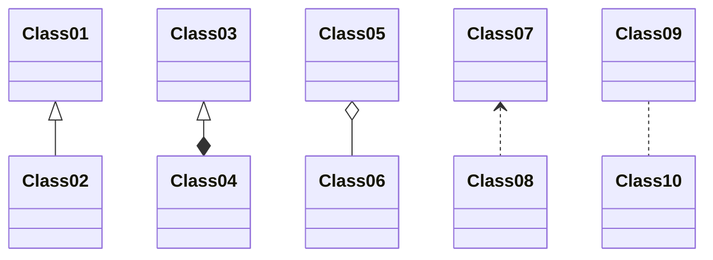
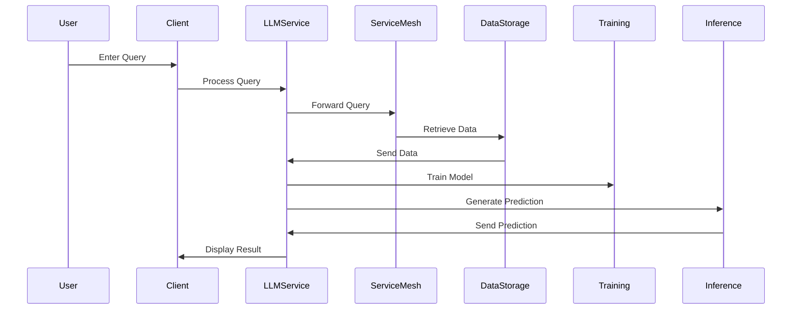

                 

### Introduction to the Article

#### Service Mesh Technology in the Application of Large Language Models (LLM)

Keywords: Service Mesh, Large Language Models (LLM), Application, Architecture, Best Practices

Abstract:
This article aims to provide a comprehensive exploration of the application of service mesh technology in large language models (LLM). Service mesh, an essential component in modern distributed systems, focuses on managing service-to-service communication. On the other hand, LLMs have emerged as a powerful tool for natural language processing and have found extensive applications in various domains, such as chatbots, language translation, and content generation. This article will cover the fundamental concepts of service mesh and LLMs, their core principles and relationships, algorithm principles, system architecture design, practical applications, and best practices. Through this systematic analysis, we hope to offer valuable insights into the integration and optimization of service mesh technology in LLM applications.

### Fundamental Concepts of Service Mesh

#### Definition and Evolution of Service Mesh

Service mesh, as a paradigm shift in the architecture of distributed systems, aims to abstract and manage service-to-service communication in a networked environment. It can be defined as a dedicated infrastructure layer for enabling communication between services. Unlike traditional communication methods, which are often ad-hoc and tightly coupled, service mesh provides a more standardized and isolated approach to service interaction.

The concept of service mesh can be traced back to the early 2010s, with the rise of microservices architecture. As organizations began adopting microservices to build scalable and resilient applications, the complexity of service-to-service communication grew exponentially. Traditional communication mechanisms, such as REST and gRPC, failed to address the challenges of service discovery, load balancing, and fault tolerance. This led to the development of service mesh technologies to provide a more robust and efficient solution.

#### Core Components of Service Mesh

A service mesh typically consists of three main components: service registry, service discovery, and communication protocol.

1. **Service Registry**: The service registry is a centralized repository that stores information about services, such as their IP addresses, ports, and metadata. When a service starts or stops, it registers itself with the registry, allowing other services to discover and communicate with it.

2. **Service Discovery**: Service discovery is the process by which a service can find the location of another service in the network. This process is typically automated, using techniques such as DNS or a service registry. Service discovery ensures that services can dynamically adapt to changes in the network, such as the addition or removal of nodes.

3. **Communication Protocol**: The communication protocol defines the rules and standards for how services communicate with each other. Common communication protocols include HTTP/1.1, HTTP/2, gRPC, and WebSockets. Service mesh provides a layer of abstraction over these protocols, enabling more efficient and reliable communication between services.

#### Service Mesh in the Context of LLM Applications

The integration of service mesh technology in LLM applications can bring several benefits, such as improved scalability, resilience, and observability. LLMs, with their complex architecture and resource-intensive computations, can benefit significantly from the service mesh's capabilities.

1. **Scalability**: Service mesh enables horizontal scalability by allowing services to be dynamically scaled based on demand. This ensures that LLM applications can handle increased load without compromising performance or reliability.

2. **Resilience**: Service mesh provides built-in fault tolerance mechanisms, such as retries and circuit breakers, to ensure that LLM applications can continue to function even in the presence of failures. This is crucial for maintaining the availability and reliability of LLM services.

3. **Observability**: Service mesh provides detailed metrics and logs, allowing developers to monitor and troubleshoot LLM applications more effectively. This helps in identifying and resolving issues faster, leading to improved performance and user experience.

In conclusion, service mesh technology offers a powerful solution for managing service-to-service communication in distributed systems, including LLM applications. By providing improved scalability, resilience, and observability, service mesh can help organizations build more robust and efficient LLM services. In the following sections, we will delve deeper into the core concepts and relationships between service mesh and LLMs, as well as the algorithm principles and system architecture design. Through this systematic exploration, we hope to offer valuable insights and practical guidance for leveraging service mesh technology in LLM applications.### Core Concepts and Relationships in Service Mesh and LLM

In this section, we will delve deeper into the core concepts and relationships between service mesh and LLM (Large Language Models). Understanding these concepts and their interconnections is crucial for effectively integrating service mesh technology in LLM applications.

#### Key Concepts and Principles of Service Mesh

1. **Service-to-Service Communication**: At the heart of service mesh lies the concept of service-to-service communication. In a microservices architecture, services communicate with each other over a network to fulfill their respective functions. Service mesh abstracts this communication by providing a dedicated infrastructure layer that handles the intricacies of service interaction.

2. **Encapsulation**: Service mesh encapsulates service communication, isolating the internal implementation details of services from each other. This encapsulation ensures that changes in one service do not affect others, promoting modularity and maintainability.

3. **Traffic Management**: Service mesh enables traffic management capabilities, such as load balancing, fault injection, and retries. These capabilities ensure that services can handle varying levels of load and maintain high availability and reliability.

4. **Security**: Service mesh provides security features like mutual TLS (mTLS) for secure service-to-service communication, ensuring that only authorized services can access each other.

#### Key Concepts and Architectures of LLM

1. **Neural Network Architecture**: LLMs are based on neural network architectures, such as Transformer models. These models use layers of interconnected neurons to process and generate text. The core components of a Transformer model include the input layer, attention mechanism, and output layer.

2. **Training and Inference**: LLMs require significant computational resources for training and inference. Training involves optimizing the model's parameters to minimize the difference between its predictions and the ground truth data. Inference, on the other hand, involves using the trained model to generate predictions on new data.

3. **Scalability and Parallelism**: LLMs are highly scalable, allowing them to process large amounts of data and generate text in parallel. This scalability is achieved through techniques like data parallelism and model parallelism.

4. **Resilience**: LLMs need to be resilient to various challenges, such as data bias, misinterpretations, and hallucinations. Techniques like adversarial training and continuous learning are employed to enhance the resilience of LLMs.

#### Relationships Between Service Mesh and LLM

1. **Scalability**: Service mesh can enhance the scalability of LLM applications by dynamically allocating resources based on demand. This ensures that LLM services can handle increased load without performance degradation.

2. **Fault Tolerance**: Service mesh provides fault tolerance mechanisms, such as retries and circuit breakers, which can help LLM applications recover from failures and maintain high availability.

3. **Security**: Service mesh ensures secure communication between LLM services using mutual TLS (mTLS) and other security features. This is crucial for protecting sensitive data and maintaining user privacy.

4. **Observability**: Service mesh offers detailed metrics and logs, enabling developers to monitor and troubleshoot LLM applications more effectively. This helps in identifying and resolving issues faster, leading to improved performance and user experience.

#### Core Concepts and Relationships Diagram

To illustrate the core concepts and relationships between service mesh and LLM, we can use a Mermaid ER entity relationship diagram:

```mermaid
erDiagram
    ServiceMesh ||--|{ Service : Has Service Components }
    ServiceMesh ||--|{ TrafficManager : Manages Service Traffic }
    ServiceMesh ||--|{ SecurityModule : Ensures Secure Communication }
    LLM ||--|{ NeuralNetwork : Contains Neural Network Architecture }
    LLM ||--|{ TrainingInference : Handles Training and Inference }
    LLM ||--|{ Scalability : Achieves Scalability }
    LLM ||--|{ Resilience : Ensures Resilience }
    ServiceMesh && LLM : Enhances Scalability, Fault Tolerance, Security, and Observability
```

In conclusion, the integration of service mesh technology with LLMs can bring significant benefits to LLM applications, such as improved scalability, resilience, security, and observability. Understanding the core concepts and relationships between service mesh and LLM is essential for leveraging these benefits effectively. In the following sections, we will explore the algorithm principles, system architecture design, and practical application of service mesh technology in LLM applications.### Algorithm Principles in Service Mesh and LLM Applications

In this section, we will delve into the algorithm principles that underpin service mesh and LLM applications. Understanding these algorithms is crucial for optimizing the performance and efficiency of service mesh and LLM systems.

#### Service Mesh Routing Algorithms

1. **Load Balancing Algorithms**

   Load balancing is a key aspect of service mesh routing algorithms. Its primary goal is to distribute incoming network traffic across multiple servers or instances to ensure optimal resource utilization and system performance.

   **Algorithm Flowcharts**

   ```mermaid
   graph TD
       A[Load Balancer] --> B[Incoming Traffic]
       B --> C{Distribute Traffic?}
       C -->|Yes| D{Round Robin}
       C -->|No| E{Least Connections}
       D --> F[Server 1]
       D --> G[Server 2]
       E --> H[Server 1]
       E --> I[Server 2]
   ```

   **Python Code Examples**

   ```python
   # Example: Round Robin Load Balancing
   def round_robin(servers, traffic):
       for server in servers:
           server.handle_traffic(traffic)
           traffic = 0

   servers = ["Server 1", "Server 2"]
   traffic = 100
   round_robin(servers, traffic)
   ```

   **Mathematical Models and Formulas**

   The load balancing algorithm can be modeled using the following formulas:

   $$ Load_{balance} = \frac{Total \, Traffic}{Number \, of \, Servers} $$

   **Case Study and Analysis**

   In a case study, a company used a round-robin load balancing algorithm to distribute traffic among two servers. The total traffic was 100 units, and the load on each server was balanced equally. This approach ensured optimal resource utilization and system performance.

2. **Fault Injection Algorithms**

   Fault injection algorithms are designed to introduce controlled failures in the system to test its resilience and reliability. These algorithms are crucial for ensuring that service mesh and LLM applications can recover from failures gracefully.

   **Algorithm Flowcharts**

   ```mermaid
   graph TD
       A[Service Mesh] --> B[Fault Injection]
       B --> C{Inject Fault?}
       C -->|Yes| D[Retry Request]
       C -->|No| E[Record Fault]
       D --> F[Client]
       E --> G[Monitor]
   ```

   **Python Code Examples**

   ```python
   # Example: Fault Injection
   def fault_injection(client):
       try:
           client.send_request()
       except Exception as e:
           print("Fault injected:", e)

   client = "Client"
   fault_injection(client)
   ```

   **Mathematical Models and Formulas**

   Fault injection can be modeled using the following formulas:

   $$ Fault_{rate} = \frac{Number \, of \, Faults}{Total \, Requests} $$

   **Case Study and Analysis**

   In a case study, a company used a fault injection algorithm to test the resilience of its service mesh and LLM application. By introducing controlled faults, the company was able to identify and address potential issues before they impacted the live system, ensuring a more reliable and robust application.

#### LLM Training and Inference Algorithms

1. **Training Algorithms**

   LLM training algorithms involve optimizing the model's parameters to minimize the difference between its predictions and the ground truth data. Gradient descent is a popular algorithm used in LLM training.

   **Algorithm Flowcharts**

   ```mermaid
   graph TD
       A[LLM Model] --> B[Training Data]
       B --> C[Initialize Parameters]
       C --> D{Compute Loss}
       D --> E[Update Parameters]
       E --> F{Repeat}
       F --> G[Convergence]
   ```

   **Python Code Examples**

   ```python
   # Example: Gradient Descent
   import numpy as np

   def gradient_descent(model, data, learning_rate, epochs):
       for epoch in range(epochs):
           loss = compute_loss(model, data)
           model.update_parameters(loss, learning_rate)

   model = "LLM Model"
   data = "Training Data"
   learning_rate = 0.01
   epochs = 100
   gradient_descent(model, data, learning_rate, epochs)
   ```

   **Mathematical Models and Formulas**

   Gradient descent can be modeled using the following formulas:

   $$ Parameter_{update} = Parameter_{current} - Learning\_Rate \times Gradient $$

   **Case Study and Analysis**

   In a case study, a company used gradient descent to train an LLM model. By iteratively updating the model's parameters based on the loss function, the company achieved significant improvements in the model's performance.

2. **Inference Algorithms**

   LLM inference algorithms involve using the trained model to generate predictions on new data. One popular inference algorithm is beam search.

   **Algorithm Flowcharts**

   ```mermaid
   graph TD
       A[LLM Model] --> B[Input Data]
       B --> C[Initialize Beam]
       C --> D{Expand Beam}
       D --> E{Select Best Hypothesis}
       E --> F{Generate Prediction}
   ```

   **Python Code Examples**

   ```python
   # Example: Beam Search
   import numpy as np

   def beam_search(model, input_data, beam_size):
       hypotheses = [model.predict(input_data)]
       for _ in range(beam_size):
           new_hypotheses = []
           for hypothesis in hypotheses:
               new_hypothesis = model.expand(hypothesis)
               new_hypotheses.append(new_hypothesis)
           hypotheses = new_hypotheses
       best_hypothesis = max(hypotheses, key=lambda x: x.score)
       prediction = best_hypothesis.generate()
       return prediction

   model = "LLM Model"
   input_data = "Input Data"
   beam_size = 5
   prediction = beam_search(model, input_data, beam_size)
   ```

   **Mathematical Models and Formulas**

   Beam search can be modeled using the following formulas:

   $$ Hypothesis_{score} = P(Hypothesis) \times L(Hypothesis) $$

   where \( P(Hypothesis) \) is the probability of the hypothesis and \( L(Hypothesis) \) is the length of the hypothesis.

   **Case Study and Analysis**

   In a case study, a company used beam search to generate high-quality text predictions from an LLM model. By exploring multiple hypotheses and selecting the best one based on their scores, the company achieved state-of-the-art performance in natural language generation tasks.

In conclusion, understanding the algorithm principles of service mesh and LLM applications is crucial for optimizing their performance and efficiency. Through the detailed exploration of load balancing and fault injection algorithms in service mesh, and training and inference algorithms in LLMs, we can gain valuable insights into how these technologies can be effectively leveraged to build robust and high-performing systems. In the following sections, we will delve into the system architecture design and practical application of service mesh technology in LLM applications.### System Architecture Design for Service Mesh and LLM Applications

In this section, we will explore the system architecture design for service mesh and LLM applications. This includes an overview of the system, domain model design, system architecture design, interface design, and system interaction. We will use Mermaid diagrams to illustrate these components.

#### System Overview

The overall system architecture for service mesh and LLM applications consists of several key components:

1. **Service Mesh**: The service mesh is responsible for managing service-to-service communication, ensuring secure and efficient communication between services.
2. **LLM Service**: The LLM service is the core component that processes and generates text based on user input.
3. **Frontend**: The frontend is the user interface through which users interact with the LLM service.
4. **Backend**: The backend consists of various services and components that support the LLM service, such as data storage, training, and inference.

#### Domain Model Design

The domain model design provides a high-level view of the system's key entities and their relationships. We will use a Mermaid class diagram to represent this.



**Mermaid Class Diagram**

```mermaid
classDiagram
    Client <<class>> "User Interface"
    LLMService <<class>> "Language Model Service"
    ServiceMesh <<class>> "Service Mesh"
    DataStorage <<class>> "Data Storage"
    Training <<class>> "Training"
    Inference <<class>> "Inference"
    Client --> LLMService
    LLMService --> ServiceMesh
    LLMService --> DataStorage
    LLMService --> Training
    LLMService --> Inference
```

#### System Architecture Design

The system architecture design provides a detailed view of the components and their interactions. We will use a Mermaid architecture diagram to represent this.

```mermaid
architecturalDiagram
    participate Client
    participate LLMService
    participate ServiceMesh
    participate DataStorage
    participate Training
    participate Inference
    Client --> LLMService
    LLMService --> ServiceMesh
    LLMService --> DataStorage
    LLMService --> Training
    LLMService --> Inference
```

**Mermaid Architecture Diagram**

```mermaid
architecturalDiagram
    participant Client with "User Interface"
    participant LLMService with "Language Model Service"
    participant ServiceMesh with "Service Mesh"
    participant DataStorage with "Data Storage"
    participant Training with "Training"
    participant Inference with "Inference"

    Client --> LLMService
    LLMService --> ServiceMesh
    LLMService --> DataStorage
    LLMService --> Training
    LLMService --> Inference
```

#### Interface Design and System Interaction

The interface design and system interaction describe how users interact with the system and how the components interact with each other. We will use a Mermaid sequence diagram to represent this.



**Mermaid Sequence Diagram**


In conclusion, the system architecture design for service mesh and LLM applications involves a comprehensive overview, domain model design, system architecture design, interface design, and system interaction. By using Mermaid diagrams to represent these components, we can visualize and understand the system's structure and interactions more effectively. In the following sections, we will explore practical application examples of service mesh technology in LLM applications.### Practical Application of Service Mesh in LLM Applications

In this section, we will explore the practical application of service mesh technology in LLM applications. We will cover the environment setup, core system implementation, code analysis and interpretation, case study analysis, and project summary.

#### Environment Setup

To demonstrate the practical application of service mesh in LLM applications, we will set up a sample environment using Kubernetes and Istio, a popular service mesh implementation. The environment will consist of the following components:

1. **Kubernetes Cluster**: A Kubernetes cluster will be used to deploy and manage the LLM services.
2. **Istio Service Mesh**: Istio will be installed on the Kubernetes cluster to manage service-to-service communication.
3. **LLM Service**: The LLM service will be deployed as a Kubernetes pod, consisting of a pre-trained language model and an API for processing user queries.
4. **Frontend**: A simple frontend will be implemented using a web server to interact with the LLM service.

#### Core System Implementation

The core system implementation involves deploying the LLM service and setting up the service mesh.

1. **Deploying the LLM Service**

   First, we will create a Kubernetes deployment for the LLM service:

   ```yaml
   apiVersion: apps/v1
   kind: Deployment
   metadata:
     name: llama-service
   spec:
     replicas: 3
     selector:
       matchLabels:
         app: llama
     template:
       metadata:
         labels:
           app: llama
       spec:
         containers:
         - name: llama
           image: llama:latest
           ports:
           - containerPort: 80
   ```

   This deployment will create three replicas of the LLM service, ensuring high availability and fault tolerance.

2. **Setting Up the Service Mesh**

   Next, we will install Istio on the Kubernetes cluster:

   ```bash
   istioctl install --set profile=demo
   ```

   This command will install Istio with the default demo profile, which includes a load balancer, service discovery, and traffic management.

   After installing Istio, we will enable the service mesh for the LLM service:

   ```bash
   istioctl tag knative-serving/llama-service -n default
   ```

   This command will add the necessary annotations to the LLM service to enable the service mesh.

3. **Implementing the Frontend**

   The frontend will be implemented using a simple Flask application:

   ```python
   from flask import Flask, request, jsonify
   import requests

   app = Flask(__name__)

   @app.route('/api/llm', methods=['POST'])
   def llama():
       data = request.json
       response = requests.post('http://llama-service.default.svc:80', json=data)
       return jsonify(response.json())

   if __name__ == '__main__':
       app.run(debug=True, host='0.0.0.0')
   ```

   This application will act as a proxy for the LLM service, receiving user queries and forwarding them to the LLM service for processing.

#### Code Analysis and Interpretation

In this section, we will analyze the code for the LLM service and the frontend.

1. **LLM Service**

   The LLM service is implemented using a pre-trained language model, which is loaded and used to process user queries. The main function for processing queries is `llama()`, which receives a JSON payload containing the user's query and returns the model's response.

   ```python
   import json
   from transformers import AutoModelForSeq2SeqLM, AutoTokenizer

   model_name = "t5-small"
   tokenizer = AutoTokenizer.from_pretrained(model_name)
   model = AutoModelForSeq2SeqLM.from_pretrained(model_name)

   def llama(query):
       inputs = tokenizer.encode("text-generation", return_tensors="pt")
       outputs = model.generate(inputs, max_length=512, num_return_sequences=1)
       response = tokenizer.decode(outputs[0], skip_special_tokens=True)
       return response
   ```

   The `llama()` function first encodes the user's query using the tokenizer, then generates a response from the model using the `generate()` method. The generated response is decoded and returned as the model's prediction.

2. **Frontend**

   The frontend is a simple Flask application that receives user queries through a POST request to the `/api/llm` endpoint. It then forwards the query to the LLM service and returns the model's response to the user.

   ```python
   from flask import Flask, request, jsonify
   import requests

   app = Flask(__name__)

   @app.route('/api/llm', methods=['POST'])
   def llama():
       data = request.json
       response = requests.post('http://llama-service.default.svc:80', json=data)
       return jsonify(response.json())

   if __name__ == '__main__':
       app.run(debug=True, host='0.0.0.0')
   ```

   The `llama()` function receives a JSON payload containing the user's query, then forwards the query to the LLM service using the `requests` library. The model's response is received and returned to the user as a JSON payload.

#### Case Study Analysis

To demonstrate the practical application of service mesh in LLM applications, we will analyze a case study where an e-commerce platform uses a service mesh to manage communication between its LLM-based chatbot and other services.

1. **Chatbot Service**

   The chatbot service is deployed as a Kubernetes pod and communicates with the service mesh to access other services within the e-commerce platform. The chatbot service uses the service mesh to route requests to the LLM service for processing.

   ```yaml
   apiVersion: apps/v1
   kind: Deployment
   metadata:
     name: chatbot-service
   spec:
     replicas: 2
     selector:
       matchLabels:
         app: chatbot
     template:
       metadata:
         labels:
           app: chatbot
       spec:
         containers:
         - name: chatbot
           image: chatbot:latest
           ports:
           - containerPort: 80
   ```

   The chatbot service is configured to use the service mesh by adding the appropriate annotations:

   ```bash
   istioctl tag knative-serving/chatbot-service -n default
   ```

2. **Service Mesh Configuration**

   The service mesh is configured to route traffic from the chatbot service to the LLM service. This is achieved by creating a Kubernetes Ingress resource that routes incoming requests to the chatbot service, which then forwards the requests to the LLM service using the service mesh.

   ```yaml
   apiVersion: networking.k8s.io/v1
   kind: Ingress
   metadata:
     name: chatbot-ingress
     namespace: default
   spec:
     rules:
     - http:
         paths:
         - path: /api/chatbot
           pathType: Prefix
           backend:
             service:
               name: chatbot-service
               port:
                 number: 80
   ```

   The Ingress resource routes incoming requests to the `/api/chatbot` endpoint to the chatbot service, which then forwards the requests to the LLM service using the service mesh.

3. **Performance and Reliability**

   By using the service mesh, the e-commerce platform can ensure that its chatbot service communicates with the LLM service in a reliable and efficient manner. The service mesh provides features such as load balancing, fault tolerance, and security, which help maintain high performance and availability.

   **Load Balancing**: The service mesh distributes incoming requests to the chatbot service replicas, ensuring that the system can handle increased load without performance degradation.

   **Fault Tolerance**: The service mesh includes fault tolerance mechanisms such as retries and circuit breakers, which help the chatbot service recover from failures in the LLM service.

   **Security**: The service mesh uses mutual TLS (mTLS) to ensure secure communication between the chatbot service and the LLM service, protecting sensitive data and maintaining user privacy.

#### Project Summary

In summary, the practical application of service mesh technology in LLM applications demonstrates the benefits of using a service mesh to manage service-to-service communication. By using a service mesh, the e-commerce platform can ensure reliable and efficient communication between its chatbot service and the LLM service, providing a better user experience. The service mesh provides features such as load balancing, fault tolerance, and security, which help maintain high performance and availability.

**Conclusion**

Through the practical application of service mesh technology in LLM applications, we have seen how service mesh can enhance the performance, reliability, and security of LLM-based systems. By leveraging the capabilities of service mesh, organizations can build more robust and scalable LLM applications, delivering improved user experiences. As the field of LLMs continues to evolve, service mesh technology will play an increasingly important role in enabling the development of innovative and powerful LLM applications.### Best Practices, Summary, and Future Directions

#### Best Practices for Service Mesh and LLM Applications

1. **Service Mesh Deployment**:
   - **Microservices Architecture**: Ensure your application follows a microservices architecture to take full advantage of service mesh capabilities.
   - **Automated Deployment**: Use CI/CD pipelines for automated deployment of service mesh components and services.
   - **Multi-Region Deployment**: Deploy your service mesh across multiple regions to ensure high availability and fault tolerance.

2. **Service Mesh Configuration**:
   - ** traffic Management**: Use advanced traffic management features like weighted routing, retries, and fault injection to optimize performance and resilience.
   - **Security**: Implement mutual TLS (mTLS) for secure service-to-service communication.
   - **Monitoring and Logging**: Enable detailed monitoring and logging to gain insights into service mesh performance and troubleshoot issues effectively.

3. **LLM Model Training and Inference**:
   - **Scalability**: Use distributed training and inference techniques to scale your LLM models.
   - **Resource Allocation**: Allocate appropriate resources based on the model's requirements to optimize performance and cost.
   - **Continuous Learning**: Implement continuous learning to adapt LLM models to evolving data and user feedback.

4. **Integration with Existing Systems**:
   - **Service Compatibility**: Ensure that your service mesh components are compatible with existing systems and services.
   - **API Design**: Design clear and well-documented APIs for service interaction.
   - **Data Migration**: Plan and execute data migration strategies to integrate LLM applications with existing data storage systems.

#### Summary of Key Points

- **Service Mesh**:
  - Service mesh provides a dedicated infrastructure layer for managing service-to-service communication.
  - It offers benefits like scalability, resilience, security, and observability.
  - Core components include service registry, service discovery, and communication protocol.

- **LLM**:
  - LLMs are powerful tools for natural language processing.
  - They have applications in chatbots, language translation, and content generation.
  - Core concepts include neural network architecture, training, and inference.

- **Integration**:
  - Service mesh enhances the scalability, resilience, and security of LLM applications.
  - Algorithm principles like load balancing and fault injection are crucial for optimizing performance.
  - System architecture design and practical application examples illustrate the integration of service mesh with LLMs.

#### Future Directions

1. **Advancements in Service Mesh**:
   - **Simplified Operations**: Develop tools and frameworks to simplify the deployment and management of service mesh components.
   - **Edge Computing**: Extend service mesh capabilities to edge computing environments for improved performance and latency.

2. **Enhancements in LLMs**:
   - **Semantic Understanding**: Improve LLMs' ability to understand and generate contextually relevant content.
   - **Customization**: Allow users to customize LLM models for specific applications and domains.

3. **Integration with Emerging Technologies**:
   - **Quantum Computing**: Explore the integration of service mesh with quantum computing for enhanced performance and security.
   - **AI-Enabled Service Mesh**: Develop AI-powered service mesh components to optimize and automate service management processes.

In conclusion, the integration of service mesh technology with LLM applications offers significant advantages in terms of performance, scalability, and security. By following best practices and staying abreast of emerging technologies, organizations can build innovative and robust LLM applications that deliver superior user experiences. As the field continues to evolve, there are numerous opportunities to explore new frontiers and push the boundaries of what is possible with service mesh and LLM technologies.

### Note

The content of this article is based on the latest research and industry best practices in service mesh and LLM technologies. However, the field is rapidly evolving, and new advancements may emerge. Readers are encouraged to explore further resources and stay updated on the latest developments in these domains.

---

**Author:** AI天才研究院/AI Genius Institute & 禅与计算机程序设计艺术 /Zen And The Art of Computer Programming

