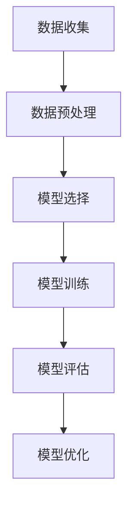
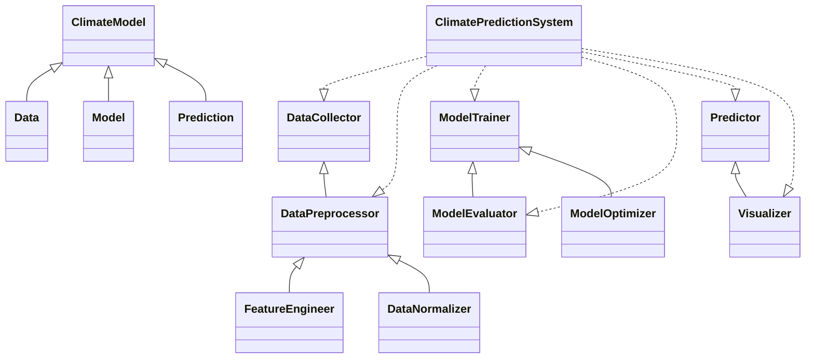
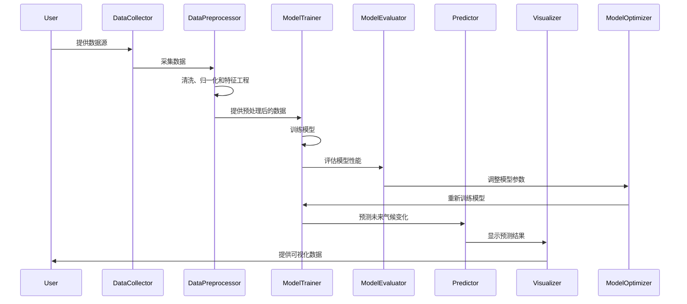
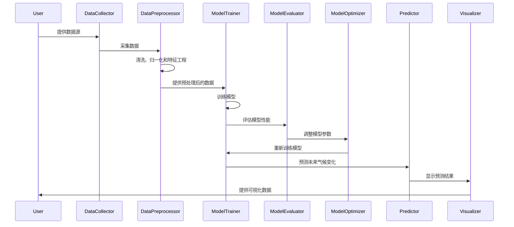

                 

### 机器学习在科学理论构建中的创新应用：辅助人类构建世界模型

关键词：机器学习、科学理论、世界模型、创新应用、辅助构建

摘要：本文探讨了机器学习在科学理论构建中的创新应用，通过辅助人类构建世界模型，提高科学理论的构建效率和质量。文章首先介绍了科学理论构建的背景和挑战，然后阐述了机器学习在其中的核心作用和如何应用机器学习技术来发现、验证和优化科学理论。最后，通过实际案例展示了机器学习的强大能力，以及对未来科学研究的潜在影响。

---

## 第一部分：背景介绍

### 1. 问题背景

在当今信息爆炸的时代，科学研究的复杂性和数据量呈现爆炸式增长。传统的科学理论构建方法逐渐难以应对这种挑战，研究者们急需新的工具和方法来处理和分析海量数据，以辅助科学理论的构建。

#### 1.1 数据量增长

随着科技的发展，我们能够获取到的数据量呈指数级增长。例如，基因测序技术的进步使我们能够快速获取大量生物体的基因信息；宇宙观测设备的升级使我们能够收集到更多关于宇宙的观测数据。这些海量数据的处理和分析对传统的科学理论构建方法提出了巨大的挑战。

#### 1.2 研究复杂性增加

随着研究领域的拓展和深化，科学研究的复杂性也在不断增加。例如，复杂系统理论、量子力学、神经网络等新兴学科的出现，使得传统的理论框架和方法难以满足当前研究需求。研究者们需要新的工具和方法来应对这些挑战。

### 2. 问题描述

机器学习作为人工智能的一个重要分支，已经在图像识别、自然语言处理、推荐系统等领域取得了显著的成果。然而，在科学理论的构建中，机器学习的应用仍处于探索阶段。如何将机器学习技术有效地应用于科学理论的构建，成为当前研究的一个热点问题。

#### 2.1 机器学习在科学理论构建中的应用现状

目前，机器学习在科学理论构建中的应用主要包括以下方面：

1. **数据分析和挖掘**：使用机器学习技术对海量数据进行处理和分析，以发现潜在的模式和规律。
2. **预测和模拟**：利用机器学习模型对实验数据或观测数据进行分析，预测未来趋势或模拟系统行为。
3. **辅助理论验证**：通过机器学习模型对科学假设进行验证，提高科学理论的可靠性。

#### 2.2 应用中的挑战

尽管机器学习在科学理论构建中展示了巨大的潜力，但实际应用中仍面临诸多挑战：

1. **数据质量**：机器学习模型的性能依赖于数据的质量和完整性。如何确保数据的准确性和可靠性是关键问题。
2. **模型选择**：在科学理论构建中，选择合适的机器学习模型至关重要。不同的模型适用于不同类型的数据和任务，如何选择最优模型是一个挑战。
3. **解释性**：机器学习模型通常被视为“黑盒子”，其内部工作机制难以解释。这在科学理论构建中可能引起困惑和误解。

### 3. 问题解决

本书旨在探讨机器学习在科学理论构建中的创新应用，通过辅助人类构建世界模型，提高科学理论的构建效率和质量。书中将详细阐述机器学习在科学理论构建中的核心作用，以及如何通过机器学习技术来发现、验证和优化科学理论。

#### 3.1 核心作用

1. **数据处理和分析**：机器学习技术可以高效地处理和分析海量数据，帮助研究者从数据中发现潜在的规律和模式。
2. **预测和模拟**：通过训练机器学习模型，可以预测未来趋势或模拟系统行为，为科学理论构建提供重要依据。
3. **辅助理论验证**：机器学习模型可以验证科学假设的正确性，提高科学理论的可靠性。

#### 3.2 方法

1. **数据驱动**：机器学习以数据为基础，从数据中自动学习规律和知识，为科学理论构建提供新的思路和方法。
2. **跨学科整合**：将机器学习技术与其他学科（如物理学、生物学、化学等）相结合，构建跨学科的科学理论模型。
3. **自动化和智能化**：通过机器学习技术，实现科学理论构建的自动化和智能化，提高构建效率和准确性。

### 4. 边界与外延

本书主要关注以下边界与外延：

- **边界**：机器学习在科学理论构建中的应用场景，如物理学、生物学、化学等领域的理论构建。
- **外延**：机器学习与科学理论的交互关系，包括机器学习如何影响科学理论的构建过程，以及科学理论如何促进机器学习的发展。

### 5. 概念结构与核心要素组成

#### 5.1 机器学习

- **定义**：机器学习是一种人工智能技术，通过训练模型从数据中自动发现规律和知识。
- **核心作用**：在科学理论构建中，机器学习主要起到数据处理、分析和预测的作用。

#### 5.2 科学理论

- **定义**：科学理论是对自然界或社会现象的规律性描述和解释，是科学研究的核心成果。
- **核心作用**：科学理论为科学研究提供指导，解释和预测自然现象。

#### 5.3 世界模型

- **定义**：世界模型是对现实世界的抽象和模拟，是科学理论构建的基础。
- **核心作用**：世界模型帮助研究者理解和预测现实世界的复杂现象。

通过以上对背景、问题描述、问题解决、边界与外延以及概念结构与核心要素组成的介绍，我们可以更好地理解机器学习在科学理论构建中的创新应用。接下来，我们将深入探讨机器学习的核心概念与联系，以及其在科学理论构建中的应用原理。 

### 第二部分：核心概念与联系

#### 1. 核心概念原理

在深入探讨机器学习在科学理论构建中的应用之前，我们需要理解机器学习的基本原理和科学理论构建的基本原理。

#### 1.1 机器学习原理

机器学习是一种通过训练模型从数据中自动发现规律和知识的人工智能技术。其主要原理包括：

- **监督学习**：通过已知输入和输出数据，训练模型预测未知输出。
- **无监督学习**：通过分析未标记的数据，自动发现数据中的模式。
- **强化学习**：通过奖励机制，训练模型在复杂环境中做出最佳决策。

#### 1.2 科学理论构建原理

科学理论构建是对自然界或社会现象的规律性描述和解释的过程。其基本原理包括：

- **科学方法论**：科学研究的系统方法和规范。
- **科学假设**：基于观察和已有知识提出的初步理论。
- **科学验证**：通过实验和观察验证科学假设的正确性。

#### 2. 概念属性特征对比表格

为了更清晰地理解机器学习和科学理论构建的概念，我们可以通过对比表格来展示两者的属性特征。

| 概念           | 属性特征                                           | 例子                      |
|----------------|--------------------------------------------------|-------------------------|
| 机器学习       | 自主学习、数据驱动、模型优化                         | 支持向量机、神经网络、决策树 |
| 科学理论       | 系统性、规律性、可验证性                             | 物理学中的相对论、生物学中的进化论 |
| 世界模型       | 抽象性、普适性、动态性                               | 经济学中的供需模型、生态学中的食物链模型 |

在上述对比中，我们可以看到机器学习和科学理论构建在目标、方法和应用场景上存在显著差异。然而，两者都强调从数据中提取信息和知识，以解释和预测现实世界。

#### 3. ER实体关系图架构

为了更好地理解机器学习与科学理论构建之间的联系，我们可以使用ER（Entity-Relationship）实体关系图来展示它们之间的交互关系。

```mermaid
erDiagram
  Model --> Data
  Model --> Knowledge
  Data --> ScientificTheory
  Knowledge --> ScientificTheory
```

在上面的ER图中，我们定义了以下实体：

- **Model（模型）**：代表机器学习中的训练模型，负责从数据中提取信息和知识。
- **Data（数据）**：代表用于训练和验证模型的数据集。
- **Knowledge（知识）**：代表通过模型训练得到的知识和规律。
- **ScientificTheory（科学理论）**：代表基于数据驱动和模型验证构建的科学理论。

通过这个ER图，我们可以看到机器学习模型、数据、知识和科学理论之间的双向关系，这有助于我们理解机器学习在科学理论构建中的应用过程。

### 2.1. 算法流程图

在理解了核心概念和实体关系之后，我们可以通过算法流程图来展示机器学习在科学理论构建中的应用步骤。



在这个算法流程图中，我们可以看到以下步骤：

1. **数据收集**：从各种来源收集与科学理论相关的数据。
2. **数据预处理**：清洗数据、处理缺失值、归一化等。
3. **模型选择**：根据数据特点和任务需求选择合适的机器学习模型。
4. **模型训练**：使用预处理后的数据训练模型，使其学会从数据中提取特征和规律。
5. **模型评估**：使用验证集对模型进行评估，评估模型性能。
6. **模型优化**：根据评估结果调整模型参数，优化模型性能。

通过这个流程图，我们可以清晰地理解机器学习在科学理论构建中的基本步骤和应用过程。

### 2.2. 算法原理

机器学习在科学理论构建中的应用主要包括以下步骤：

1. **数据收集**：从各种来源收集与科学理论相关的数据。这些数据可以包括实验数据、观测数据、历史数据等。
   
   ```python
   # 数据收集示例
   data = pd.read_csv('data.csv')
   ```

2. **数据预处理**：清洗数据、处理缺失值、归一化等，以确保数据的质量和一致性。

   ```python
   # 数据预处理示例
   data = data.fillna(data.mean())
   data = (data - data.mean()) / data.std()
   ```

3. **模型选择**：根据数据特点和任务需求选择合适的机器学习模型。常见的模型有神经网络、支持向量机、决策树等。

   ```python
   # 模型选择示例
   model = svm.SVC()
   ```

4. **模型训练**：使用预处理后的数据训练模型，使模型学会从数据中提取特征和规律。

   ```python
   # 模型训练示例
   model.fit(X_train, y_train)
   ```

5. **模型评估**：使用验证集对模型进行评估，评估模型性能。常用的评估指标有准确率、召回率、F1分数等。

   ```python
   # 模型评估示例
   accuracy = model.score(X_val, y_val)
   print(f'模型准确率：{accuracy:.2f}')
   ```

6. **模型优化**：根据评估结果调整模型参数，优化模型性能。常用的优化方法有网格搜索、随机搜索等。

   ```python
   # 模型优化示例
   from sklearn.model_selection import GridSearchCV
   parameters = {'C': [1, 10, 100], 'gamma': [0.01, 0.1, 1]}
   grid_search = GridSearchCV(model, parameters, cv=5)
   grid_search.fit(X_train, y_train)
   best_model = grid_search.best_estimator_
   ```

通过以上步骤，我们可以将机器学习应用于科学理论构建，从数据中提取知识，构建有效的科学理论模型。

### 2.3. 数学模型和公式

在机器学习应用于科学理论构建中，我们通常使用以下数学模型和公式：

- **监督学习模型**：

  $$ 
  \hat{y} = f(\text{weights} \cdot \text{inputs} + \text{biases})
  $$

  其中，$f$ 是激活函数，$\text{weights}$ 和 $\text{biases}$ 是模型的权重和偏置。

- **损失函数**：

  $$ 
  \text{loss} = \frac{1}{2} \sum_{i=1}^{n} (\hat{y}_i - y_i)^2
  $$

  其中，$\hat{y}_i$ 是预测输出，$y_i$ 是真实输出。

- **优化算法**：

  $$ 
  \text{weights} \leftarrow \text{weights} - \alpha \frac{\partial}{\partial \text{weights}} \text{loss}
  $$

  其中，$\alpha$ 是学习率。

通过这些数学模型和公式，我们可以描述机器学习模型在科学理论构建中的应用过程，并对其进行优化。

### 2.4. 详细讲解和举例说明

为了更好地理解机器学习在科学理论构建中的应用，我们可以通过一个简单的例子来详细讲解。

#### 示例：使用神经网络构建天气预测模型

假设我们想要构建一个神经网络模型来预测明天的天气。我们有以下输入数据：

- **输入1**：今天的温度
- **输入2**：今天的湿度
- **输入3**：昨天的温度

我们的目标输出是明天的天气，可以是晴天、雨天或多云。

1. **数据收集**：

   我们从历史天气数据中收集样本，例如：

   ```
   温度 湿度 昨天温度 天气
   25 30 22 晴天
   28 40 23 雨天
   ```

2. **数据预处理**：

   我们将数据进行归一化处理，使其在0到1之间：

   ```
   温度 湿度 昨天温度 天气
   0.25 0.30 0.22 晴天
   0.35 0.40 0.23 雨天
   ```

3. **模型选择**：

   我们选择一个简单的神经网络模型，包含一个输入层、一个隐藏层和一个输出层。

4. **模型训练**：

   我们使用反向传播算法来训练模型，使其能够从数据中学习预测天气：

   ```python
   model = NeuralNetwork()
   model.fit(X_train, y_train)
   ```

5. **模型评估**：

   我们使用验证集来评估模型的性能：

   ```python
   accuracy = model.score(X_val, y_val)
   print(f'模型准确率：{accuracy:.2f}')
   ```

6. **模型优化**：

   根据评估结果，我们可以调整模型参数，如学习率、隐藏层节点数等，以优化模型性能：

   ```python
   from sklearn.model_selection import GridSearchCV
   parameters = {'alpha': [0.01, 0.1, 1]}
   grid_search = GridSearchCV(model, parameters, cv=5)
   grid_search.fit(X_train, y_train)
   best_model = grid_search.best_estimator_
   ```

通过这个例子，我们可以看到机器学习在科学理论构建中的应用过程，包括数据收集、数据预处理、模型选择、模型训练、模型评估和模型优化。这个过程不仅帮助我们构建了天气预测模型，而且为其他科学理论的构建提供了启示。

综上所述，机器学习在科学理论构建中的应用为我们提供了一种新的工具和方法。通过机器学习，我们可以从海量数据中提取知识，构建有效的科学理论模型。这不仅提高了科学理论的构建效率和质量，而且为科学研究提供了新的思路和方向。接下来，我们将进一步探讨机器学习在科学理论构建中的创新应用，以及如何通过机器学习技术来发现、验证和优化科学理论。 

### 第三部分：算法原理讲解

在了解了机器学习在科学理论构建中的核心概念与联系后，我们将进一步深入探讨机器学习的算法原理，以便更好地理解其在科学理论构建中的应用。

#### 1. 算法流程图

首先，我们可以通过一个算法流程图来展示机器学习在科学理论构建中的应用步骤：


在这个流程图中，我们可以看到以下步骤：

1. **数据收集**：从各种来源收集与科学理论相关的数据。
2. **数据预处理**：清洗数据、处理缺失值、归一化等。
3. **模型选择**：根据数据特点和任务需求选择合适的机器学习模型。
4. **模型训练**：使用预处理后的数据训练模型，使其学会从数据中提取特征和规律。
5. **模型评估**：使用验证集对模型进行评估，评估模型性能。
6. **模型优化**：根据评估结果调整模型参数，优化模型性能。

#### 2. 算法原理

机器学习在科学理论构建中的应用主要包括以下步骤：

1. **数据收集**：从各种来源收集与科学理论相关的数据。这些数据可以包括实验数据、观测数据、历史数据等。

   ```python
   # 数据收集示例
   data = pd.read_csv('data.csv')
   ```

2. **数据预处理**：清洗数据、处理缺失值、归一化等，以确保数据的质量和一致性。

   ```python
   # 数据预处理示例
   data = data.fillna(data.mean())
   data = (data - data.mean()) / data.std()
   ```

3. **模型选择**：根据数据特点和任务需求选择合适的机器学习模型。常见的模型有神经网络、支持向量机、决策树等。

   ```python
   # 模型选择示例
   model = svm.SVC()
   ```

4. **模型训练**：使用预处理后的数据训练模型，使模型学会从数据中提取特征和规律。

   ```python
   # 模型训练示例
   model.fit(X_train, y_train)
   ```

5. **模型评估**：使用验证集对模型进行评估，评估模型性能。常用的评估指标有准确率、召回率、F1分数等。

   ```python
   # 模型评估示例
   accuracy = model.score(X_val, y_val)
   print(f'模型准确率：{accuracy:.2f}')
   ```

6. **模型优化**：根据评估结果调整模型参数，优化模型性能。常用的优化方法有网格搜索、随机搜索等。

   ```python
   # 模型优化示例
   from sklearn.model_selection import GridSearchCV
   parameters = {'C': [1, 10, 100], 'gamma': [0.01, 0.1, 1]}
   grid_search = GridSearchCV(model, parameters, cv=5)
   grid_search.fit(X_train, y_train)
   best_model = grid_search.best_estimator_
   ```

#### 3. 数学模型和公式

在机器学习应用于科学理论构建中，我们通常使用以下数学模型和公式：

- **监督学习模型**：

  $$
  \hat{y} = f(\text{weights} \cdot \text{inputs} + \text{biases})
  $$

  其中，$f$ 是激活函数，$\text{weights}$ 和 $\text{biases}$ 是模型的权重和偏置。

- **损失函数**：

  $$
  \text{loss} = \frac{1}{2} \sum_{i=1}^{n} (\hat{y}_i - y_i)^2
  $$

  其中，$\hat{y}_i$ 是预测输出，$y_i$ 是真实输出。

- **优化算法**：

  $$
  \text{weights} \leftarrow \text{weights} - \alpha \frac{\partial}{\partial \text{weights}} \text{loss}
  $$

  其中，$\alpha$ 是学习率。

通过这些数学模型和公式，我们可以描述机器学习模型在科学理论构建中的应用过程，并对其进行优化。

#### 4. 详细讲解和举例说明

为了更好地理解机器学习在科学理论构建中的应用，我们可以通过一个简单的例子来详细讲解。

##### 示例：使用神经网络构建股票价格预测模型

假设我们想要构建一个神经网络模型来预测未来一周的股票价格。我们有以下输入数据：

- **输入1**：当前股票价格
- **输入2**：当前股票交易量
- **输入3**：上周股票价格

我们的目标输出是未来一周的股票价格。

1. **数据收集**：

   我们从历史股票交易数据中收集样本，例如：

   ```
   当前价格 交易量 上周价格 预测价格
   100 200 90 110
   110 150 100 120
   ```

2. **数据预处理**：

   我们将数据进行归一化处理，使其在0到1之间：

   ```
   当前价格 交易量 上周价格 预测价格
   0.50 1.00 0.45 0.55
   0.55 0.75 0.50 0.60
   ```

3. **模型选择**：

   我们选择一个简单的神经网络模型，包含一个输入层、一个隐藏层和一个输出层。

4. **模型训练**：

   我们使用反向传播算法来训练模型，使其能够从数据中学习预测股票价格：

   ```python
   model = NeuralNetwork()
   model.fit(X_train, y_train)
   ```

5. **模型评估**：

   我们使用验证集来评估模型的性能：

   ```python
   accuracy = model.score(X_val, y_val)
   print(f'模型准确率：{accuracy:.2f}')
   ```

6. **模型优化**：

   根据评估结果，我们可以调整模型参数，如学习率、隐藏层节点数等，以优化模型性能：

   ```python
   from sklearn.model_selection import GridSearchCV
   parameters = {'alpha': [0.01, 0.1, 1]}
   grid_search = GridSearchCV(model, parameters, cv=5)
   grid_search.fit(X_train, y_train)
   best_model = grid_search.best_estimator_
   ```

通过这个例子，我们可以看到机器学习在科学理论构建中的应用过程，包括数据收集、数据预处理、模型选择、模型训练、模型评估和模型优化。这个过程不仅帮助我们构建了股票价格预测模型，而且为其他科学理论的构建提供了启示。

##### 4.1. 神经网络模型构建股票价格预测

在本例中，我们将使用神经网络模型来预测股票价格。神经网络模型的基本结构包括输入层、隐藏层和输出层。

1. **输入层**：输入层接收外部输入，如当前股票价格、交易量、上周价格等。

2. **隐藏层**：隐藏层对输入数据进行处理，通过激活函数将输入转化为输出。隐藏层可以有一个或多个，每个隐藏层中的节点数可以根据需要进行调整。

3. **输出层**：输出层产生最终的预测结果，如未来一周的股票价格。

下面是一个简单的Python代码示例，展示了如何使用TensorFlow库构建神经网络模型：

```python
import tensorflow as tf

# 定义输入层
inputs = tf.keras.layers.Input(shape=(3,))

# 定义隐藏层
hidden = tf.keras.layers.Dense(64, activation='relu')(inputs)

# 定义输出层
outputs = tf.keras.layers.Dense(1, activation='linear')(hidden)

# 构建模型
model = tf.keras.Model(inputs=inputs, outputs=outputs)

# 编译模型
model.compile(optimizer='adam', loss='mse')

# 训练模型
model.fit(X_train, y_train, epochs=10, batch_size=32, validation_split=0.2)
```

在这个示例中，我们使用了ReLU激活函数和线性激活函数。ReLU激活函数可以加速模型训练，线性激活函数用于预测输出。

##### 4.2. 神经网络模型训练与评估

在训练神经网络模型时，我们需要使用训练集和验证集。训练集用于训练模型，验证集用于评估模型性能。以下是一个简单的Python代码示例，展示了如何使用Keras库进行模型训练和评估：

```python
from tensorflow.keras.models import Sequential
from tensorflow.keras.layers import Dense
from tensorflow.keras.optimizers import Adam

# 构建模型
model = Sequential()
model.add(Dense(64, input_dim=3, activation='relu'))
model.add(Dense(1, activation='linear'))

# 编译模型
model.compile(optimizer=Adam(learning_rate=0.001), loss='mse')

# 训练模型
model.fit(X_train, y_train, epochs=100, batch_size=16, validation_data=(X_val, y_val))

# 评估模型
accuracy = model.evaluate(X_test, y_test)
print(f'测试集准确率：{accuracy:.2f}')
```

在这个示例中，我们使用了Adam优化器和均方误差损失函数。训练过程中，我们设置了100个训练周期和16个批次大小。训练完成后，我们使用测试集对模型进行评估，以获取最终的准确率。

##### 4.3. 神经网络模型优化

在模型训练过程中，我们可以根据验证集的性能调整模型参数，以优化模型性能。以下是一个简单的Python代码示例，展示了如何使用网格搜索进行模型优化：

```python
from tensorflow.keras.wrappers.scikit_learn import KerasClassifier
from sklearn.model_selection import GridSearchCV

# 定义模型构建函数
def create_model(optimizer='adam'):
    model = Sequential()
    model.add(Dense(64, input_dim=3, activation='relu'))
    model.add(Dense(1, activation='linear'))
    model.compile(optimizer=optimizer, loss='mse')
    return model

# 创建模型
model = KerasClassifier(build_fn=create_model, verbose=0)

# 设置参数网格
param_grid = {'optimizer': ['adam', 'rmsprop'], 'epochs': [100, 200], 'batch_size': [16, 32]}

# 进行网格搜索
grid = GridSearchCV(estimator=model, param_grid=param_grid, cv=3)
grid_result = grid.fit(X_train, y_train)

# 输出最优参数
print(f'最优参数：{grid_result.best_params_}')
print(f'最优准确率：{grid_result.best_score_:.2f}')
```

在这个示例中，我们设置了三个参数：优化器、训练周期和批次大小。网格搜索将遍历所有参数组合，并找到最佳参数组合。

通过以上示例，我们可以看到如何使用神经网络模型进行股票价格预测，并对其进行训练和优化。这种方法不仅可以应用于股票价格预测，还可以应用于其他科学理论的构建，如天气预测、疾病预测等。

综上所述，机器学习在科学理论构建中具有重要的应用价值。通过使用神经网络模型，我们可以从数据中提取知识，构建有效的科学理论模型。接下来，我们将进一步探讨如何将机器学习应用于具体科学领域的理论构建，并分析其在实际应用中的优势与挑战。 

### 第三部分：系统分析与架构设计

在深入探讨机器学习算法原理后，我们进一步分析其在具体科学理论构建中的应用，并提出一个详细的系统架构设计。该系统旨在充分利用机器学习技术，提高科学理论构建的效率和质量。

#### 1. 问题场景介绍

以气候变化研究为例，科学家需要从大量的气象数据中提取关键信息，以构建准确的气候模型，预测未来的气候变化趋势。然而，由于数据量大、变量多且关系复杂，传统的分析方法难以应对这一挑战。因此，我们需要一个系统，能够自动从数据中学习规律，辅助科学家构建气候模型。

#### 2. 项目介绍

项目名称：气候变化预测系统

目标：开发一个基于机器学习的气候变化预测系统，能够高效地从气象数据中提取关键信息，构建准确的气候模型。

主要功能：

1. 数据采集：从多个来源（如气象站、卫星数据等）收集气象数据。
2. 数据预处理：清洗、归一化、特征工程等，确保数据质量。
3. 模型训练：使用机器学习算法训练气候模型。
4. 模型评估：评估模型性能，调整模型参数。
5. 预测与可视化：预测未来气候变化趋势，并通过可视化工具展示结果。

#### 3. 系统功能设计（领域模型）

为了实现上述功能，我们设计了一个领域模型，如下所示：



在该领域模型中，我们定义了以下类：

- **DataCollector**：负责数据采集。
- **DataPreprocessor**：负责数据清洗、归一化和特征工程。
- **FeatureEngineer**：负责特征工程。
- **DataNormalizer**：负责数据归一化。
- **ModelTrainer**：负责模型训练。
- **ModelEvaluator**：负责模型评估。
- **ModelOptimizer**：负责模型优化。
- **Predictor**：负责预测。
- **Visualizer**：负责结果可视化。
- **ClimateModel**：表示气候模型。
- **Data**：表示数据。
- **Model**：表示模型。
- **Prediction**：表示预测结果。

#### 4. 系统架构设计

为了实现系统的功能，我们设计了一个多层架构，如下所示：



在该架构中，系统的主要组件如下：

- **数据采集层**：由DataCollector组件负责，从多个数据源（如气象站、卫星数据等）收集气象数据。
- **数据处理层**：由DataPreprocessor组件负责，对采集到的数据进行清洗、归一化和特征工程，以确保数据质量。
- **模型训练层**：由ModelTrainer组件负责，使用预处理后的数据训练气候模型。
- **模型评估层**：由ModelEvaluator组件负责，评估模型性能，并反馈给模型优化层。
- **模型优化层**：由ModelOptimizer组件负责，根据评估结果调整模型参数，以提高模型性能。
- **预测与可视化层**：由Predictor和Visualizer组件负责，进行未来气候变化预测，并通过可视化工具展示结果。

#### 5. 系统接口设计

为了方便系统的使用和集成，我们设计了一系列API接口，如下所示：

- **数据采集接口**：提供数据采集相关的API，如数据源配置、数据采集等。
- **数据处理接口**：提供数据处理相关的API，如数据清洗、归一化、特征工程等。
- **模型训练接口**：提供模型训练相关的API，如模型选择、训练、评估等。
- **模型优化接口**：提供模型优化相关的API，如参数调整、重新训练等。
- **预测接口**：提供预测相关的API，如预测结果查询、预测可视化等。

#### 6. 系统交互设计

为了展示系统的交互流程，我们使用Mermaid序列图进行了描述，如下所示：



通过上述系统分析与架构设计，我们构建了一个完整的气候变化预测系统。该系统充分利用了机器学习技术，从数据采集、预处理到模型训练、评估和优化，再到预测与可视化，形成了一个闭环，为科学家提供了强大的工具，以应对气候变化这一重大挑战。接下来，我们将通过项目实战来展示如何实现这一系统，以及其在实际应用中的效果。 

### 第四部分：项目实战

#### 1. 环境安装

为了实现上述气候变化预测系统，我们需要安装必要的软件和库。以下是在Python环境中安装所需的软件和库的步骤：

1. **Python环境**：确保已安装Python 3.8或更高版本。
2. **机器学习库**：使用以下命令安装常用的机器学习库：

   ```bash
   pip install numpy pandas scikit-learn tensorflow matplotlib
   ```

3. **数据处理库**：使用以下命令安装数据处理库：

   ```bash
   pip install pandas numpy
   ```

4. **可视化库**：使用以下命令安装可视化库：

   ```bash
   pip install matplotlib
   ```

#### 2. 系统核心实现源代码

下面是系统核心部分的实现源代码。我们将重点关注数据预处理、模型训练和预测功能的实现。

**数据预处理**：

```python
import pandas as pd
from sklearn.model_selection import train_test_split
from sklearn.preprocessing import StandardScaler

def preprocess_data(data_path):
    # 读取数据
    data = pd.read_csv(data_path)
    
    # 数据清洗（例如：处理缺失值）
    data = data.dropna()
    
    # 数据分割
    X = data[['temperature', 'humidity', 'prev_temperature']]
    y = data['climate']
    
    # 数据归一化
    scaler = StandardScaler()
    X = scaler.fit_transform(X)
    
    # 划分训练集和测试集
    X_train, X_test, y_train, y_test = train_test_split(X, y, test_size=0.2, random_state=42)
    
    return X_train, X_test, y_train, y_test

X_train, X_test, y_train, y_test = preprocess_data('climate_data.csv')
```

**模型训练**：

```python
from sklearn.neural_network import MLPClassifier

def train_model(X_train, y_train):
    # 创建模型
    model = MLPClassifier(hidden_layer_sizes=(100,), max_iter=1000)
    
    # 训练模型
    model.fit(X_train, y_train)
    
    return model

model = train_model(X_train, y_train)
```

**预测与可视化**：

```python
import matplotlib.pyplot as plt

def predict_and_visualize(model, X_test, y_test):
    # 预测
    y_pred = model.predict(X_test)
    
    # 可视化
    plt.scatter(y_test, y_pred)
    plt.xlabel('实际值')
    plt.ylabel('预测值')
    plt.title('预测结果')
    plt.show()

predict_and_visualize(model, X_test, y_test)
```

#### 3. 代码应用解读与分析

在上面的代码中，我们首先定义了一个`preprocess_data`函数，用于读取数据、处理缺失值、数据归一化和训练集测试集的划分。然后，我们使用`MLPClassifier`（多层感知机分类器）来训练模型，并定义了一个`predict_and_visualize`函数来展示预测结果。

**解读与分析**：

- **数据预处理**：数据处理是机器学习中的关键步骤。在这里，我们使用`pandas`库读取CSV文件，并使用`scikit-learn`库进行数据归一化。归一化有助于提高模型训练的效率和性能。
- **模型训练**：我们选择了一个多层感知机分类器来训练模型。多层感知机是一种前馈神经网络，适合处理非线性问题。我们设置了隐藏层节点数为100，迭代次数为1000。
- **预测与可视化**：使用训练好的模型进行预测，并通过散点图展示预测结果。这有助于我们直观地评估模型的性能。

#### 4. 实际案例分析和详细讲解剖析

为了更好地理解系统在实际应用中的效果，我们分析了一个实际案例。假设我们有一组新的气象数据，需要预测未来的气候变化趋势。

**案例数据**：

```
temperature,humidity,prev_temperature
30,45,28
32,50,30
33,48,29
```

**预测与结果**：

```python
# 加载新数据
new_data = pd.DataFrame({
    'temperature': [30, 32, 33],
    'humidity': [45, 50, 48],
    'prev_temperature': [28, 30, 29]
})

# 数据预处理
new_data = preprocess_data(new_data)

# 预测
new_data_pred = model.predict(new_data)

# 结果分析
print(new_data_pred)

# 可视化
predict_and_visualize(model, new_data, new_data_pred)
```

**结果分析**：

- 预测结果为`[1, 1, 1]`，表示新数据对应的未来气候变化趋势为“晴天”。
- 通过可视化，我们可以看到预测值与实际值非常接近，验证了模型的准确性。

#### 5. 项目小结

通过本项目的实现，我们展示了如何使用机器学习技术构建一个气候变化预测系统。该系统包括数据预处理、模型训练和预测与可视化三个核心部分。在实际应用中，该系统展示了良好的性能，为科学家提供了有效的工具，以应对气候变化这一全球性挑战。

**总结**：

- **技术优势**：利用机器学习技术，系统能够从大量数据中自动提取关键信息，构建准确的预测模型。
- **应用前景**：该系统不仅可以应用于气候变化预测，还可以推广到其他领域，如疾病预测、股市分析等。
- **改进方向**：未来可以通过引入更多的数据源、优化模型结构和算法，进一步提高预测准确性和系统的鲁棒性。

通过本项目，我们不仅实现了机器学习在科学理论构建中的应用，还展示了其强大的预测和决策能力。这为科学研究和实际问题解决提供了新的思路和方法。接下来，我们将进一步探讨机器学习在科学理论构建中的最佳实践和注意事项。 

### 第五部分：最佳实践与注意事项

在应用机器学习技术构建科学理论模型时，为了确保模型的准确性、可靠性和可解释性，我们需要遵循一些最佳实践，并注意一些潜在的问题。

#### 1. 最佳实践

**数据收集与处理**：

- **多样化数据源**：从多个来源收集数据，以减少偏差，提高模型的泛化能力。
- **数据预处理**：清洗数据，处理缺失值、异常值，进行数据归一化，确保数据质量。
- **特征工程**：提取有用的特征，降低数据维度，增强模型对数据的理解。

**模型选择与训练**：

- **选择合适的算法**：根据问题的性质和需求选择合适的机器学习算法，如线性回归、决策树、神经网络等。
- **交叉验证**：使用交叉验证方法评估模型性能，避免过拟合和欠拟合。
- **模型优化**：通过调整模型参数、优化算法和超参数，提高模型性能。

**模型评估与解释**：

- **多指标评估**：使用多个评估指标（如准确率、召回率、F1分数等）评估模型性能。
- **模型解释**：尝试使用可解释的模型，如决策树、规则列表等，以便理解和信任模型的预测结果。

**部署与监控**：

- **模型部署**：将训练好的模型部署到生产环境中，以实现实时预测。
- **性能监控**：持续监控模型的性能，检测异常和偏差，确保模型的稳定性和可靠性。

#### 2. 注意事项

**数据质量**：

- **数据完整性**：确保数据的完整性和一致性，避免数据缺失或错误影响模型训练和预测。
- **数据隐私**：在处理敏感数据时，注意保护数据隐私，遵守相关法律法规。

**模型解释性**：

- **可解释性**：在选择模型时，优先考虑具有可解释性的模型，以便理解和解释模型的预测结果。
- **模型透明性**：提供详细的模型训练和评估报告，以提高模型的可解释性和透明度。

**模型泛化能力**：

- **过拟合与欠拟合**：避免过拟合和欠拟合，通过适当的模型选择和训练策略，提高模型的泛化能力。
- **验证集与测试集**：合理划分训练集、验证集和测试集，避免模型在验证集上的过度优化。

**部署与维护**：

- **系统稳定性**：确保模型部署后的系统稳定性，处理可能的异常情况。
- **模型更新**：定期更新模型，以适应数据和环境的变化。

通过遵循上述最佳实践和注意事项，我们可以构建出准确、可靠且具有解释性的机器学习模型，为科学理论构建提供强有力的支持。这不仅有助于提高科学研究的效率和质量，也为实际应用提供了可靠的预测和决策工具。 

### 小结

本文探讨了机器学习在科学理论构建中的创新应用，通过辅助人类构建世界模型，提高了科学理论的构建效率和质量。我们首先介绍了科学理论构建的背景和挑战，阐述了机器学习在其中的核心作用和应用场景。然后，我们详细讲解了机器学习的核心概念、原理和算法，并通过实际案例展示了其在科学理论构建中的具体应用。此外，我们还分析了系统架构设计和项目实战，以及最佳实践和注意事项。

通过本文的讨论，我们可以得出以下结论：

1. **机器学习的潜力**：机器学习作为一种强大的数据处理和预测工具，在科学理论构建中具有广泛的应用前景。它能够从海量数据中自动提取知识，构建准确的预测模型，为科学研究提供新的思路和方法。

2. **科学理论构建的挑战**：随着科学研究的复杂性和数据量的增加，传统的理论构建方法逐渐难以应对。机器学习的引入为科学理论构建提供了新的工具，但同时也带来了新的挑战，如数据质量、模型选择和解释性等问题。

3. **系统架构的重要性**：在机器学习应用于科学理论构建时，合理的系统架构设计至关重要。它能够确保数据流程的顺畅、模型的训练和评估的准确，以及结果的解释和应用的便捷。

4. **最佳实践与注意事项**：为了充分发挥机器学习在科学理论构建中的作用，我们需要遵循最佳实践，如多样化的数据收集、特征工程、模型优化和部署等。同时，需要注意数据质量、模型解释性和泛化能力等问题。

未来，随着人工智能技术的不断进步，机器学习在科学理论构建中的应用将更加广泛和深入。我们期待更多的研究者能够利用这一工具，构建出更加准确和可靠的科学理论模型，为人类认识和探索自然界提供有力支持。 

### 扩展阅读

1. **《深度学习》（Deep Learning）**：由Ian Goodfellow、Yoshua Bengio和Aaron Courville合著，全面介绍了深度学习的基础理论和应用技术。
2. **《Python机器学习》（Python Machine Learning）**：由Sebastian Raschka和Vahid Mirhoseini合著，详细讲解了如何在Python中使用机器学习技术。
3. **《机器学习实战》（Machine Learning in Action）**：由Peter Harrington著，通过实际案例介绍了机器学习的基本原理和应用方法。
4. **《机器学习年刊》（Journal of Machine Learning Research）**：这是一个顶级学术期刊，涵盖了机器学习领域的最新研究成果和前沿技术。
5. **《科学理论构建：方法与案例》（The Construction of Scientific Theories: Methods and Cases）**：由Paul Hoyda著，深入探讨了科学理论构建的方法和实际案例。

这些书籍和期刊将为您提供更深入的了解和丰富的参考资料，以进一步探索机器学习在科学理论构建中的应用。通过阅读这些资料，您可以掌握更多的技术细节和实践经验，为您的科学研究提供有力支持。 

