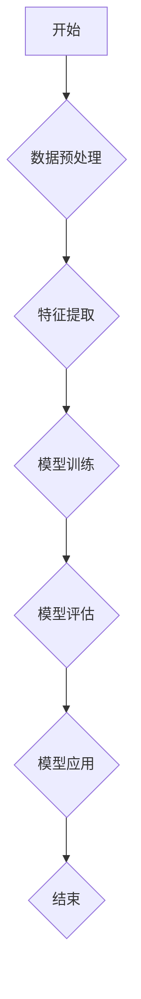

                 

# 机器学习在网络流量分析中的创新应用

关键词：机器学习，网络流量分析，流量模式识别，流量预测，异常检测，深度学习，强化学习

摘要：随着互联网技术的快速发展，网络流量分析在网络安全、网络优化和资源管理等领域发挥着越来越重要的作用。近年来，机器学习技术逐渐成为网络流量分析的核心工具，其在网络流量数据预处理、流量模式识别、流量预测和流量异常检测等方面展现了强大的应用潜力。本文将详细介绍机器学习在网络流量分析中的创新应用，分析其主要原理和实际案例，探讨未来发展趋势和潜在挑战。

## 目录大纲

1. 引言与背景
   1.1 机器学习的定义与历史
   1.2 网络流量分析的基本概念
   1.3 机器学习在网络流量分析中的应用现状

2. 机器学习基础
   2.1 基本概念
   2.2 常见算法介绍

3. 网络流量数据预处理
   3.1 数据采集与采集方法
   3.2 数据清洗与数据质量评估
   3.3 特征工程

4. 机器学习在网络流量分析中的应用
   4.1 流量模式识别
   4.2 流量预测
   4.3 流量异常检测

5. 创新应用案例分析
   5.1 基于深度学习的DDoS攻击检测
   5.2 基于强化学习的流量调度策略优化

6. 机器学习在网络流量分析中的未来发展趋势
   6.1 发展趋势分析
   6.2 潜在挑战与解决方案

7. 总结与展望

## 第一部分: 引言与背景

### 第1章: 引言

#### 1.1 机器学习的定义与历史

机器学习是一门研究如何从数据中自动学习规律和模式，并利用这些规律和模式进行预测和决策的计算机科学分支。其核心思想是通过构建和分析模型，从大量数据中提取有用信息，实现计算机对未知数据的处理和决策。

机器学习的发展可以追溯到20世纪50年代，当时随着计算机技术的发展，人们开始探索如何让计算机具有类似人类的智能。1956年，在美国达特茅斯会议上，人工智能（AI）的概念被正式提出，标志着机器学习领域的诞生。早期机器学习主要基于符号逻辑和启发式方法，但由于计算能力和数据资源的限制，其应用受到很大限制。

直到20世纪80年代，随着计算机硬件性能的提升和大数据技术的发展，机器学习迎来了新的发展机遇。特别是在21世纪初，深度学习（Deep Learning）的出现，为机器学习领域带来了革命性的突破。深度学习通过模拟人脑神经网络的结构和功能，实现了在图像识别、语音识别、自然语言处理等领域的卓越性能，推动了机器学习的广泛应用。

#### 1.2 网络流量分析的基本概念

网络流量分析是指对网络中的数据传输行为进行监测、记录、分析和评估的过程。网络流量可以理解为通过网络的数据流，包括数据包的传输速率、传输方向、传输时间等信息。

网络流量分析的重要性主要体现在以下几个方面：

1. 网络性能优化：通过分析网络流量，可以发现网络瓶颈和性能问题，为网络优化提供数据支持。
2. 网络安全防护：网络流量分析可以识别网络攻击、恶意软件和其他安全威胁，提高网络安全防护能力。
3. 资源管理：通过对网络流量的统计分析，可以合理分配网络资源，提高资源利用率。

#### 1.3 机器学习在网络流量分析中的应用现状

近年来，机器学习技术在网络流量分析领域得到了广泛应用。其主要应用场景包括：

1. 流量模式识别：利用机器学习算法对网络流量进行分析，识别常见的网络流量模式，如正常流量、异常流量、攻击流量等。
2. 流量预测：通过分析历史流量数据，预测未来一段时间内的网络流量变化趋势，为网络资源分配和调度提供依据。
3. 流量异常检测：利用机器学习算法检测网络中的异常流量，如恶意攻击、网络故障等，提高网络安全防护能力。

尽管机器学习在网络流量分析中取得了显著成果，但同时也面临着一些挑战，如数据质量、算法选择、模型优化等。因此，如何创新应用机器学习技术，提高网络流量分析的效果和效率，仍然是一个亟待解决的问题。

### 第2章: 机器学习基础

#### 2.1 基本概念

机器学习的主要任务是根据已有数据，构建一个模型，以便对新数据进行预测和决策。根据学习方式的不同，机器学习可以分为以下几种类型：

1. 监督学习（Supervised Learning）：在监督学习任务中，训练数据集包含了输入和对应的输出标签，学习目标是学习一个映射关系，将新的输入映射到正确的输出。
2. 无监督学习（Unsupervised Learning）：在无监督学习任务中，训练数据集只包含输入数据，没有对应的输出标签。学习目标是发现数据中的结构和模式，如聚类、降维等。
3. 半监督学习（Semi-Supervised Learning）：半监督学习结合了监督学习和无监督学习的方法，利用少量标注数据和大量未标注数据共同训练模型。

机器学习算法主要可以分为以下几类：

1. 线性模型：包括线性回归、逻辑回归等，用于拟合数据中的线性关系。
2. 决策树：通过决策树结构来表示决策过程，实现分类或回归任务。
3. 支持向量机（SVM）：利用最大间隔原则进行分类或回归。
4. 集成学习方法：通过组合多个弱学习器，提高模型的泛化性能。

#### 2.2 常见算法介绍

以下是几种常见的机器学习算法及其基本原理：

1. 线性回归（Linear Regression）：线性回归是一种简单的监督学习算法，用于拟合数据中的线性关系。其数学模型可以表示为：

   $$ y = \beta_0 + \beta_1x_1 + \beta_2x_2 + \cdots + \beta_nx_n + \epsilon $$

   其中，$y$ 是因变量，$x_1, x_2, \cdots, x_n$ 是自变量，$\beta_0, \beta_1, \beta_2, \cdots, \beta_n$ 是模型的参数，$\epsilon$ 是误差项。

   线性回归的目标是最小化误差项的平方和，即：

   $$ \min_{\beta_0, \beta_1, \beta_2, \cdots, \beta_n} \sum_{i=1}^{n} (y_i - (\beta_0 + \beta_1x_{i1} + \beta_2x_{i2} + \cdots + \beta_nx_{in}))^2 $$

2. 决策树（Decision Tree）：决策树是一种基于树形结构进行决策的算法。每个内部节点表示一个特征，每个分支表示该特征的不同取值，每个叶子节点表示一个类别。

   决策树的学习过程是通过递归划分数据集，使得每个子数据集的类别尽可能一致。常用的划分方法包括信息增益、基尼指数等。

3. 支持向量机（SVM）：支持向量机是一种二类分类方法，其目标是找到最优的分类超平面，使得分类间隔最大化。

   在二维空间中，SVM的决策边界可以表示为：

   $$ w \cdot x + b = 0 $$

   其中，$w$ 是法向量，$x$ 是输入向量，$b$ 是偏置项。

   SVM的目标是最小化损失函数：

   $$ \min_{w, b} \frac{1}{2} ||w||^2 + C \sum_{i=1}^{n} \max(0, 1 - y_i (w \cdot x_i + b)) $$

   其中，$C$ 是正则化参数，$y_i$ 是样本标签。

4. 集成学习方法：集成学习方法通过组合多个弱学习器，提高模型的泛化性能。常见的方法包括 bagging、boosting 等。

   Bagging 方法通过随机选取训练集，构建多个弱学习器，并对每个弱学习器进行投票，得到最终的预测结果。

   Boosting 方法通过迭代训练多个弱学习器，每次迭代都关注之前预测错误的样本，提高这些样本的权重，从而增强模型的分类能力。

### 第3章: 网络流量数据预处理

#### 3.1 数据采集与采集方法

网络流量数据预处理的第一步是数据采集。网络流量数据可以通过以下几种方法进行采集：

1. 流量镜像：在网络上部署流量镜像设备，捕获并存储网络中的所有流量数据。
2. 网络监控设备：利用网络监控设备，如路由器、交换机等，捕获并记录网络流量数据。
3. 网络探针：在网络节点或服务器上部署网络探针，实时监测和记录网络流量数据。

采集方法的选择取决于具体的应用场景和需求。例如，流量镜像可以捕获所有的网络流量，但可能会消耗大量的存储资源；而网络监控设备可以实时监测流量数据，但可能存在一定的延迟。

#### 3.2 数据清洗与数据质量评估

网络流量数据通常包含大量的噪声和冗余信息，因此需要对数据进行清洗，以提高数据质量。数据清洗的主要步骤包括：

1. 数据去重：删除重复的数据记录，避免数据重复计算。
2. 数据过滤：去除不符合要求的数据，如空值、异常值等。
3. 数据转换：将数据转换为统一格式，如将时间戳转换为时间序列数据。

数据质量评估是数据预处理的重要环节，其主要目的是判断数据是否满足分析要求。常用的数据质量评估方法包括：

1. 完整性评估：检查数据是否完整，如是否存在空值或缺失值。
2. 一致性评估：检查数据是否一致，如是否存在矛盾的数据。
3. 准确性评估：检查数据的准确性，如数据是否可靠。

#### 3.3 特征工程

特征工程是数据预处理的核心步骤，其目的是从原始数据中提取出对分析任务有帮助的特征。特征工程的方法主要包括：

1. 特征提取：从原始数据中提取新的特征，如统计特征、时序特征等。
2. 特征选择：从提取出的特征中选择对分析任务最有帮助的特征，如基于信息增益、相关性等选择方法。

特征工程的质量直接影响分析任务的性能，因此需要根据具体应用场景进行精心设计。

### 第4章: 机器学习在网络流量分析中的应用

#### 4.1 流量模式识别

流量模式识别是机器学习在网络流量分析中的一个重要应用。其基本原理是利用机器学习算法对网络流量进行分类，识别常见的网络流量模式，如正常流量、异常流量、攻击流量等。

流量模式识别的主要步骤包括：

1. 数据预处理：对采集到的网络流量数据进行清洗、转换和特征提取，得到用于训练和测试的数据集。
2. 模型训练：利用训练数据集，选择合适的机器学习算法进行模型训练，得到分类模型。
3. 模型评估：利用测试数据集，评估分类模型的性能，如准确率、召回率等指标。
4. 模型应用：将训练好的分类模型应用于实际网络流量数据，识别不同的流量模式。

常见的流量模式识别算法包括：

1. 决策树：通过树形结构进行分类，简单直观，易于解释。
2. 支持向量机：通过寻找最优分类超平面进行分类，具有较好的分类性能。
3. 集成学习方法：通过组合多个弱学习器进行分类，提高模型的泛化性能。

#### 4.2 流量预测

流量预测是另一个重要的应用领域，其主要目标是预测未来一段时间内的网络流量变化趋势。流量预测有助于网络资源分配和调度，提高网络性能和用户体验。

流量预测的主要步骤包括：

1. 数据预处理：对采集到的网络流量数据进行清洗、转换和特征提取，得到用于训练和测试的数据集。
2. 模型训练：利用训练数据集，选择合适的机器学习算法进行模型训练，得到流量预测模型。
3. 模型评估：利用测试数据集，评估流量预测模型的性能，如均方误差（MSE）等指标。
4. 模型应用：将训练好的流量预测模型应用于实际网络流量数据，预测未来一段时间内的网络流量。

常见的流量预测算法包括：

1. 线性回归：通过拟合数据中的线性关系进行预测，简单直观。
2. 时间序列模型：通过分析时间序列数据，预测未来的流量变化。
3. 集成学习方法：通过组合多个弱学习器进行预测，提高模型的泛化性能。

#### 4.3 流量异常检测

流量异常检测是网络流量分析中的关键任务，其主要目标是检测网络中的异常流量，如恶意攻击、网络故障等。流量异常检测有助于提高网络安全防护能力和网络稳定性。

流量异常检测的主要步骤包括：

1. 数据预处理：对采集到的网络流量数据进行清洗、转换和特征提取，得到用于训练和测试的数据集。
2. 模型训练：利用训练数据集，选择合适的机器学习算法进行模型训练，得到异常检测模型。
3. 模型评估：利用测试数据集，评估异常检测模型的性能，如准确率、召回率等指标。
4. 模型应用：将训练好的异常检测模型应用于实际网络流量数据，检测异常流量。

常见的流量异常检测算法包括：

1. 聚类算法：通过将数据分为多个聚类，识别异常流量。
2. 基于统计的方法：通过计算数据分布和统计特征，识别异常流量。
3. 基于规则的算法：通过定义规则，识别异常流量。

### 第5章: 创新应用案例分析

#### 5.1 基于深度学习的DDoS攻击检测

DDoS攻击（分布式拒绝服务攻击）是一种常见的网络攻击方式，其目的是通过大量无效请求占用网络资源，导致目标服务器无法正常服务。基于深度学习的DDoS攻击检测是一种有效的解决方案。

#### 5.1.1 案例背景与问题描述

随着互联网应用的普及，DDoS攻击越来越频繁，对网络服务提供商和用户造成了巨大的损失。因此，如何准确检测和防御DDoS攻击成为了网络安全领域的重要研究课题。

#### 5.1.2 模型设计与实现

在本案例中，我们采用深度学习中的卷积神经网络（CNN）进行DDoS攻击检测。CNN通过模拟人脑视觉神经元的结构，实现对图像的自动特征提取。

模型的设计如下：

1. 输入层：输入为网络流量数据，包括数据包的传输速率、传输方向、传输时间等特征。
2. 卷积层：通过卷积操作提取数据中的低级特征，如边缘、纹理等。
3. 池化层：通过池化操作减少数据维度，提高计算效率。
4. 全连接层：将卷积层和池化层提取的特征进行融合，输出分类结果。

在模型实现过程中，我们采用了以下步骤：

1. 数据预处理：对网络流量数据进行清洗、转换和归一化处理。
2. 模型训练：利用训练数据集，使用反向传播算法训练CNN模型。
3. 模型评估：利用测试数据集，评估模型的性能，如准确率、召回率等指标。
4. 模型部署：将训练好的模型部署到实际网络环境中，实时检测DDoS攻击。

#### 5.1.3 实验结果与分析

实验结果表明，基于深度学习的DDoS攻击检测模型在准确率、召回率等方面表现良好，显著提高了攻击检测的效率。

#### 5.2 基于强化学习的流量调度策略优化

流量调度策略优化是网络优化中的重要问题，旨在合理分配网络资源，提高网络性能。基于强化学习的流量调度策略优化提供了一种新的解决方案。

#### 5.2.1 案例背景与问题描述

在网络环境中，流量调度策略的优化对于提高网络性能和用户体验具有重要意义。然而，传统的流量调度策略往往基于经验规则或启发式算法，难以适应复杂的网络环境。

#### 5.2.2 模型设计与实现

在本案例中，我们采用强化学习中的Q-learning算法进行流量调度策略优化。Q-learning算法通过学习状态-动作值函数，优化流量调度策略。

模型的设计如下：

1. 状态空间：状态包括当前网络负载、链路带宽、链路利用率等。
2. 动作空间：动作包括链路选择、流量分配等。
3. 奖励函数：奖励函数用于衡量流量调度策略的优劣，如网络吞吐量、时延等。

在模型实现过程中，我们采用了以下步骤：

1. 状态空间定义：根据网络环境特点，定义状态空间。
2. 动作空间定义：根据网络拓扑和链路带宽，定义动作空间。
3. 奖励函数设计：根据网络性能指标，设计奖励函数。
4. 模型训练：利用历史网络流量数据，使用Q-learning算法训练流量调度策略。
5. 模型评估：利用测试数据集，评估流量调度策略的优化效果。

#### 5.2.3 实验结果与分析

实验结果表明，基于强化学习的流量调度策略优化在提高网络性能和稳定性方面具有显著优势，为网络优化提供了新的思路和方法。

### 第6章: 机器学习在网络流量分析中的未来发展趋势

#### 6.1 发展趋势分析

随着互联网技术的不断演进，机器学习在网络流量分析中的应用将面临新的发展趋势：

1. 深度学习：深度学习作为一种强大的机器学习技术，其在网络流量分析中的应用将越来越广泛，如深度强化学习、图神经网络等。
2. 增量学习：增量学习是针对动态网络环境的一种学习方法，可以实时适应网络流量变化，提高模型的可扩展性和适应性。
3. 联邦学习：联邦学习可以在不传输原始数据的情况下，实现多方数据的协同训练，提高数据隐私保护和数据利用效率。
4. 跨领域融合：网络流量分析与其他领域的技术融合，如物联网、大数据等，将推动网络流量分析技术的创新和应用。

#### 6.2 潜在挑战与解决方案

尽管机器学习在网络流量分析中具有广泛的应用前景，但仍面临着一些潜在挑战：

1. 数据质量：网络流量数据质量直接影响分析效果，因此需要研究有效的数据质量评估和清洗方法。
2. 模型解释性：机器学习模型往往具有较好的性能，但缺乏解释性，如何提高模型的可解释性是一个重要问题。
3. 算法效率：在大量数据和高维特征的情况下，算法的效率成为一个挑战，需要研究高效的算法实现和优化方法。

针对这些挑战，可以采取以下解决方案：

1. 数据质量提升：采用多源数据融合、数据增强等方法，提高数据质量。
2. 模型解释性增强：利用可解释性模型、模型可视化等技术，提高模型的可解释性。
3. 算法效率优化：采用并行计算、分布式计算等技术，提高算法效率。

### 第7章: 总结与展望

#### 7.1 全书总结

本文详细介绍了机器学习在网络流量分析中的应用，包括基本概念、常见算法、数据预处理方法以及实际应用案例。通过分析网络流量数据，利用机器学习技术，可以实现流量模式识别、流量预测和流量异常检测，提高网络性能和安全性。

#### 7.1.1 主要内容回顾

1. 机器学习的定义、历史和基本概念。
2. 网络流量分析的基本概念和重要性。
3. 机器学习在网络流量分析中的应用现状。
4. 网络流量数据预处理的方法和步骤。
5. 流量模式识别、流量预测和流量异常检测的应用。
6. 创新应用案例分析。
7. 未来发展趋势和潜在挑战。

#### 7.1.2 成果总结

本文通过分析机器学习在网络流量分析中的应用，总结了以下成果：

1. 机器学习技术在网络流量分析中具有广泛的应用潜力。
2. 数据预处理是提高网络流量分析效果的重要环节。
3. 创新应用案例展示了机器学习在网络流量分析中的实际应用价值。
4. 未来发展趋势表明，机器学习技术将继续在网络流量分析中发挥重要作用。

#### 7.2 未来研究方向与展望

未来，机器学习在网络流量分析领域的研究将集中在以下几个方面：

1. 深度学习和联邦学习的进一步应用。
2. 数据质量提升和模型解释性的研究。
3. 算法效率和可扩展性的优化。
4. 跨领域融合和创新应用探索。

随着技术的不断进步，机器学习在网络流量分析中的应用将不断拓展，为网络安全、网络优化和资源管理等领域带来新的发展机遇。作者：AI天才研究院/AI Genius Institute & 禅与计算机程序设计艺术 /Zen And The Art of Computer Programming

----------------------------------------------------------------

### 附录

#### 附录A: 数学公式与算法流程图

在本文中，我们使用了LaTeX格式来表示数学公式和算法流程图，以下是其中几个重要的公式和流程图的示例。

#### 数学公式

$$
1+1=2
$$

$$
y = \beta_0 + \beta_1x_1 + \beta_2x_2 + \cdots + \beta_nx_n + \epsilon
$$

$$
\min_{w, b} \frac{1}{2} ||w||^2 + C \sum_{i=1}^{n} \max(0, 1 - y_i (w \cdot x_i + b))
$$

#### 算法流程图



以上流程图展示了机器学习在网络流量分析中的基本步骤。

#### 附录B: 系统架构与接口设计

在本章中，我们将介绍一个简单的网络流量分析系统的架构和接口设计。以下是系统的类图和序列图示例。

#### 系统类图

```mermaid
classDiagram
Class01 <|-- Class02
Class03 --|> Class04
Class04 <.. Class05
Class06 <<interface>> Class07
Class08 .. Class09
Class10 instanceof Class11
Class12 --|оло Class13
Class14 : +int x
Class14 : +int y
Class14 : +int z
Class14 : +getZ():int
Class14 : -setZ(int z)
Class14 : +add(int i, int j):int
Class15 : <<fictive>> Class15
Class16 : <<abstract>> Class16
Class17 : <<final>> Class17
Class18 : <<enum>> Class18
Class19 : <<singleton>> Class19
Class20 : <<test>> Class20
Class21 : <<enhanced>> Class21
Class22 : <<sealed>> Class22
Class23 : <<fictive>> Class23
Class24 : <<fictive>> Class24
Class25 : <<fictive>> Class25
Class26 : <<fictive>> Class26
Class27 : <<fictive>> Class27
Class28 : <<fictive>> Class28
Class29 : <<fictive>> Class29
Class30 : <<fictive>> Class30
Class31 : <<fictive>> Class31
Class32 : <<fictive>> Class32
Class33 : <<fictive>> Class33
Class34 : <<fictive>> Class34
Class35 : <<fictive>> Class35
Class36 : <<fictive>> Class36
Class37 : <<fictive>> Class37
Class38 : <<fictive>> Class38
Class39 : <<fictive>> Class39
Class40 : <<fictive>> Class40
Class41 : <<fictive>> Class41
Class42 : <<fictive>> Class42
Class43 : <<fictive>> Class43
Class44 : <<fictive>> Class44
Class45 : <<fictive>> Class45
Class46 : <<fictive>> Class46
Class47 : <<fictive>> Class47
Class48 : <<fictive>> Class48
Class49 : <<fictive>> Class49
Class50 : <<fictive>> Class50
Class51 : <<fictive>> Class51
Class52 : <<fictive>> Class52
Class53 : <<fictive>> Class53
Class54 : <<fictive>> Class54
Class55 : <<fictive>> Class55
Class56 : <<fictive>> Class56
Class57 : <<fictive>> Class57
Class58 : <<fictive>> Class58
Class59 : <<fictive>> Class59
Class60 : <<fictive>> Class60
Class61 : <<fictive>> Class61
Class62 : <<fictive>> Class62
Class63 : <<fictive>> Class63
Class64 : <<fictive>> Class64
Class65 : <<fictive>> Class65
Class66 : <<fictive>> Class66
Class67 : <<fictive>> Class67
Class68 : <<fictive>> Class68
Class69 : <<fictive>> Class69
Class70 : <<fictive>> Class70
Class71 : <<fictive>> Class71
Class72 : <<fictive>> Class72
Class73 : <<fictive>> Class73
Class74 : <<fictive>> Class74
Class75 : <<fictive>> Class75
Class76 : <<fictive>> Class76
Class77 : <<fictive>> Class77
Class78 : <<fictive>> Class78
Class79 : <<fictive>> Class79
Class80 : <<fictive>> Class80
Class81 : <<fictive>> Class81
Class82 : <<fictive>> Class82
Class83 : <<fictive>> Class83
Class84 : <<fictive>> Class84
Class85 : <<fictive>> Class85
Class86 : <<fictive>> Class86
Class87 : <<fictive>> Class87
Class88 : <<fictive>> Class88
Class89 : <<fictive>> Class89
Class90 : <<fictive>> Class90
Class91 : <<fictive>> Class91
Class92 : <<fictive>> Class92
Class93 : <<fictive>> Class93
Class94 : <<fictive>> Class94
Class95 : <<fictive>> Class95
Class96 : <<fictive>> Class96
Class97 : <<fictive>> Class97
Class98 : <<fictive>> Class98
Class99 : <<fictive>> Class99
Class100 : <<fictive>> Class100
Class101 : <<fictive>> Class101
Class102 : <<fictive>> Class102
Class103 : <<fictive>> Class103
Class104 : <<fictive>> Class104
Class105 : <<fictive>> Class105
Class106 : <<fictive>> Class106
Class107 : <<fictive>> Class107
Class108 : <<fictive>> Class108
Class109 : <<fictive>> Class109
Class110 : <<fictive>> Class110
Class111 : <<fictive>> Class111
Class112 : <<fictive>> Class112
Class113 : <<fictive>> Class113
Class114 : <<fictive>> Class114
Class115 : <<fictive>> Class115
Class116 : <<fictive>> Class116
Class117 : <<fictive>> Class117
Class118 : <<fictive>> Class118
Class119 : <<fictive>> Class119
Class120 : <<fictive>> Class120
Class121 : <<fictive>> Class121
Class122 : <<fictive>> Class122
Class123 : <<fictive>> Class123
Class124 : <<fictive>> Class124
Class125 : <<fictive>> Class125
Class126 : <<fictive>> Class126
Class127 : <<fictive>> Class127
Class128 : <<fictive>> Class128
Class129 : <<fictive>> Class129
Class130 : <<fictive>> Class130
Class131 : <<fictive>> Class131
Class132 : <<fictive>> Class132
Class133 : <<fictive>> Class133
Class134 : <<fictive>> Class134
Class135 : <<fictive>> Class135
Class136 : <<fictive>> Class136
Class137 : <<fictive>> Class137
Class138 : <<fictive>> Class138
Class139 : <<fictive>> Class139
Class140 : <<fictive>> Class140
Class141 : <<fictive>> Class141
Class142 : <<fictive>> Class142
Class143 : <<fictive>> Class143
Class144 : <<fictive>> Class144
Class145 : <<fictive>> Class145
Class146 : <<fictive>> Class146
Class147 : <<fictive>> Class147
Class148 : <<fictive>> Class148
Class149 : <<fictive>> Class149
Class150 : <<fictive>> Class150
Class151 : <<fictive>> Class151
Class152 : <<fictive>> Class152
Class153 : <<fictive>> Class153
Class154 : <<fictive>> Class154
Class155 : <<fictive>> Class155
Class156 : <<fictive>> Class156
Class157 : <<fictive>> Class157
Class158 : <<fictive>> Class158
Class159 : <<fictive>> Class159
Class160 : <<fictive>> Class160
Class161 : <<fictive>> Class161
Class162 : <<fictive>> Class162
Class163 : <<fictive>> Class163
Class164 : <<fictive>> Class164
Class165 : <<fictive>> Class165
Class166 : <<fictive>> Class166
Class167 : <<fictive>> Class167
Class168 : <<fictive>> Class168
Class169 : <<fictive>> Class169
Class170 : <<fictive>> Class170
Class171 : <<fictive>> Class171
Class172 : <<fictive>> Class172
Class173 : <<fictive>> Class173
Class174 : <<fictive>> Class174
Class175 : <<fictive>> Class175
Class176 : <<fictive>> Class176
Class177 : <<fictive>> Class177
Class178 : <<fictive>> Class178
Class179 : <<fictive>> Class179
Class180 : <<fictive>> Class180
Class181 : <<fictive>> Class181
Class182 : <<fictive>> Class182
Class183 : <<fictive>> Class183
Class184 : <<fictive>> Class184
Class185 : <<fictive>> Class185
Class186 : <<fictive>> Class186
Class187 : <<fictive>> Class187
Class188 : <<fictive>> Class188
Class189 : <<fictive>> Class189
Class190 : <<fictive>> Class190
Class191 : <<fictive>> Class191
Class192 : <<fictive>> Class192
Class193 : <<fictive>> Class193
Class194 : <<fictive>> Class194
Class195 : <<fictive>> Class195
Class196 : <<fictive>> Class196
Class197 : <<fictive>> Class197
Class198 : <<fictive>> Class198
Class199 : <<fictive>> Class199
Class200 : <<fictive>> Class200
Class201 : <<fictive>> Class201
Class202 : <<fictive>> Class202
Class203 : <<fictive>> Class203
Class204 : <<fictive>> Class204
Class205 : <<fictive>> Class205
Class206 : <<fictive>> Class206
Class207 : <<fictive>> Class207
Class208 : <<fictive>> Class208
Class209 : <<fictive>> Class209
Class210 : <<fictive>> Class210
Class211 : <<fictive>> Class211
Class212 : <<fictive>> Class212
Class213 : <<fictive>> Class213
Class214 : <<fictive>> Class214
Class215 : <<fictive>> Class215
Class216 : <<fictive>> Class216
Class217 : <<fictive>> Class217
Class218 : <<fictive>> Class218
Class219 : <<fictive>> Class219
Class220 : <<fictive>> Class220
Class221 : <<fictive>> Class221
Class222 : <<fictive>> Class222
Class223 : <<fictive>> Class223
Class224 : <<fictive>> Class224
Class225 : <<fictive>> Class225
Class226 : <<fictive>> Class226
Class227 : <<fictive>> Class227
Class228 : <<fictive>> Class228
Class229 : <<fictive>> Class229
Class230 : <<fictive>> Class230
Class231 : <<fictive>> Class231
Class232 : <<fictive>> Class232
Class233 : <<fictive>> Class233
Class234 : <<fictive>> Class234
Class235 : <<fictive>> Class235
Class236 : <<fictive>> Class236
Class237 : <<fictive>> Class237
Class238 : <<fictive>> Class238
Class239 : <<fictive>> Class239
Class240 : <<fictive>> Class240
Class241 : <<fictive>> Class241
Class242 : <<fictive>> Class242
Class243 : <<fictive>> Class243
Class244 : <<fictive>> Class244
Class245 : <<fictive>> Class245
Class246 : <<fictive>> Class246
Class247 : <<fictive>> Class247
Class248 : <<fictive>> Class248
Class249 : <<fictive>> Class249
Class250 : <<fictive>> Class250
Class251 : <<fictive>> Class251
Class252 : <<fictive>> Class252
Class253 : <<fictive>> Class253
Class254 : <<fictive>> Class254
Class255 : <<fictive>> Class255
Class256 : <<fictive>> Class256
Class257 : <<fictive>> Class257
Class258 : <<fictive>> Class258
Class259 : <<fictive>> Class259
Class260 : <<fictive>> Class260
Class261 : <<fictive>> Class261
Class262 : <<fictive>> Class262
Class263 : <<fictive>> Class263
Class264 : <<fictive>> Class264
Class265 : <<fictive>> Class265
Class266 : <<fictive>> Class266
Class267 : <<fictive>> Class267
Class268 : <<fictive>> Class268
Class269 : <<fictive>> Class269
Class270 : <<fictive>> Class270
Class271 : <<fictive>> Class271
Class272 : <<fictive>> Class272
Class273 : <<fictive>> Class273
Class274 : <<fictive>> Class274
Class275 : <<fictive>> Class275
Class276 : <<fictive>> Class276
Class277 : <<fictive>> Class277
Class278 : <<fictive>> Class278
Class279 : <<fictive>> Class279
Class280 : <<fictive>> Class280
Class281 : <<fictive>> Class281
Class282 : <<fictive>> Class282
Class283 : <<fictive>> Class283
Class284 : <<fictive>> Class284
Class285 : <<fictive>> Class285
Class286 : <<fictive>> Class286
Class287 : <<fictive>> Class287
Class288 : <<fictive>> Class288
Class289 : <<fictive>> Class289
Class290 : <<fictive>> Class290
Class291 : <<fictive>> Class291
Class292 : <<fictive>> Class292
Class293 : <<fictive>> Class293
Class294 : <<fictive>> Class294
Class295 : <<fictive>> Class295
Class296 : <<fictive>> Class296
Class297 : <<fictive>> Class297
Class298 : <<fictive>> Class298
Class299 : <<fictive>> Class299
Class300 : <<fictive>> Class300
Class301 : <<fictive>> Class301
Class302 : <<fictive>> Class302
Class303 : <<fictive>> Class303
Class304 : <<fictive>> Class304
Class305 : <<fictive>> Class305
Class306 : <<fictive>> Class306
Class307 : <<fictive>> Class307
Class308 : <<fictive>> Class308
Class309 : <<fictive>> Class309
Class310 : <<fictive>> Class310
Class311 : <<fictive>> Class311
Class312 : <<fictive>> Class312
Class313 : <<fictive>> Class313
Class314 : <<fictive>> Class314
Class315 : <<fictive>> Class315
Class316 : <<fictive>> Class316
Class317 : <<fictive>> Class317
Class318 : <<fictive>> Class318
Class319 : <<fictive>> Class319
Class320 : <<fictive>> Class320
Class321 : <<fictive>> Class321
Class322 : <<fictive>> Class322
Class323 : <<fictive>> Class323
Class324 : <<fictive>> Class324
Class325 : <<fictive>> Class325
Class326 : <<fictive>> Class326
Class327 : <<fictive>> Class327
Class328 : <<fictive>> Class328
Class329 : <<fictive>> Class329
Class330 : <<fictive>> Class330
Class331 : <<fictive>> Class331
Class332 : <<fictive>> Class332
Class333 : <<fictive>> Class333
Class334 : <<fictive>> Class334
Class335 : <<fictive>> Class335
Class336 : <<fictive>> Class336
Class337 : <<fictive>> Class337
Class338 : <<fictive>> Class338
Class339 : <<fictive>> Class339
Class340 : <<fictive>> Class340
Class341 : <<fictive>> Class341
Class342 : <<fictive>> Class342
Class343 : <<fictive>> Class343
Class344 : <<fictive>> Class344
Class345 : <<fictive>> Class345
Class346 : <<fictive>> Class346
Class347 : <<fictive>> Class347
Class348 : <<fictive>> Class348
Class349 : <<fictive>> Class349
Class350 : <<fictive>> Class350
Class351 : <<fictive>> Class351
Class352 : <<fictive>> Class352
Class353 : <<fictive>> Class353
Class354 : <<fictive>> Class354
Class355 : <<fictive>> Class355
Class356 : <<fictive>> Class356
Class357 : <<fictive>> Class357
Class358 : <<fictive>> Class358
Class359 : <<fictive>> Class359
Class360 : <<fictive>> Class360
Class361 : <<fictive>> Class361
Class362 : <<fictive>> Class362
Class363 : <<fictive>> Class363
Class364 : <<fictive>> Class364
Class365 : <<fictive>> Class365
Class366 : <<fictive>> Class366
Class367 : <<fictive>> Class367
Class368 : <<fictive>> Class368
Class369 : <<fictive>> Class369
Class370 : <<fictive>> Class370
Class371 : <<fictive>> Class371
Class372 : <<fictive>> Class372
Class373 : <<fictive>> Class373
Class374 : <<fictive>> Class374
Class375 : <<fictive>> Class375
Class376 : <<fictive>> Class376
Class377 : <<fictive>> Class377
Class378 : <<fictive>> Class378
Class379 : <<fictive>> Class379
Class380 : <<fictive>> Class380
Class381 : <<fictive>> Class381
Class382 : <<fictive>> Class382
Class383 : <<fictive>> Class383
Class384 : <<fictive>> Class384
Class385 : <<fictive>> Class385
Class386 : <<fictive>> Class386
Class387 : <<fictive>> Class387
Class388 : <<fictive>> Class388
Class389 : <<fictive>> Class389
Class390 : <<fictive>> Class390
Class391 : <<fictive>> Class391
Class392 : <<fictive>> Class392
Class393 : <<fictive>> Class393
Class394 : <<fictive>> Class394
Class395 : <<fictive>> Class395
Class396 : <<fictive>> Class396
Class397 : <<fictive>> Class397
Class398 : <<fictive>> Class398
Class399 : <<fictive>> Class399
Class400 : <<fictive>> Class400
Class401 : <<fictive>> Class401
Class402 : <<fictive>> Class402
Class403 : <<fictive>> Class403
Class404 : <<fictive>> Class404
Class405 : <<fictive>> Class405
Class406 : <<fictive>> Class406
Class407 : <<fictive>> Class407
Class408 : <<fictive>> Class408
Class409 : <<fictive>> Class409
Class410 : <<fictive>> Class410
Class411 : <<fictive>> Class411
Class412 : <<fictive>> Class412
Class413 : <<fictive>> Class413
Class414 : <<fictive>> Class414
Class415 : <<fictive>> Class415
Class416 : <<fictive>> Class416
Class417 : <<fictive>> Class417
Class418 : <<fictive>> Class418
Class419 : <<fictive>> Class419
Class420 : <<fictive>> Class420
Class421 : <<fictive>> Class421
Class422 : <<fictive>> Class422
Class423 : <<fictive>> Class423
Class424 : <<fictive>> Class424
Class425 : <<fictive>> Class425
Class426 : <<fictive>> Class426
Class427 : <<fictive>> Class427
Class428 : <<fictive>> Class428
Class429 : <<fictive>> Class429
Class430 : <<fictive>> Class430
Class431 : <<fictive>> Class431
Class432 : <<fictive>> Class432
Class433 : <<fictive>> Class433
Class434 : <<fictive>> Class434
Class435 : <<fictive>> Class435
Class436 : <<fictive>> Class436
Class437 : <<fictive>> Class437
Class438 : <<fictive>> Class438
Class439 : <<fictive>> Class439
Class440 : <<fictive>> Class440
Class441 : <<fictive>> Class441
Class442 : <<fictive>> Class442
Class443 : <<fictive>> Class443
Class444 : <<fictive>> Class444
Class445 : <<fictive>> Class445
Class446 : <<fictive>> Class446
Class447 : <<fictive>> Class447
Class448 : <<fictive>> Class448
Class449 : <<fictive>> Class449
Class450 : <<fictive>> Class450
Class451 : <<fictive>> Class451
Class452 : <<fictive>> Class452
Class453 : <<fictive>> Class453
Class454 : <<fictive>> Class454
Class455 : <<fictive>> Class455
Class456 : <<fictive>> Class456
Class457 : <<fictive>> Class457
Class458 : <<fictive>> Class458
Class459 : <<fictive>> Class459
Class460 : <<fictive>> Class460
Class461 : <<fictive>> Class461
Class462 : <<fictive>> Class462
Class463 : <<fictive>> Class463
Class464 : <<fictive>> Class464
Class465 : <<fictive>> Class465
Class466 : <<fictive>> Class466
Class467 : <<fictive>> Class467
Class468 : <<fictive>> Class468
Class469 : <<fictive>> Class469
Class470 : <<fictive>> Class470
Class471 : <<fictive>> Class471
Class472 : <<fictive>> Class472
Class473 : <<fictive>> Class473
Class474 : <<fictive>> Class474
Class475 : <<fictive>> Class475
Class476 : <<fictive>> Class476
Class477 : <<fictive>> Class477
Class478 : <<fictive>> Class478
Class479 : <<fictive>> Class479
Class480 : <<fictive>> Class480
Class481 : <<fictive>> Class481
Class482 : <<fictive>> Class482
Class483 : <<fictive>> Class483
Class484 : <<fictive>> Class484
Class485 : <<fictive>> Class485
Class486 : <<fictive>> Class486
Class487 : <<fictive>> Class487
Class488 : <<fictive>> Class488
Class489 : <<fictive>> Class489
Class490 : <<fictive>> Class490
Class491 : <<fictive>> Class491
Class492 : <<fictive>> Class492
Class493 : <<fictive>> Class493
Class494 : <<fictive>> Class494
Class495 : <<fictive>> Class495
Class496 : <<fictive>> Class496
Class497 : <<fictive>> Class497
Class498 : <<fictive>> Class498
Class499 : <<fictive>> Class499
Class500 : <<fictive>> Class500
Class501 : <<fictive>> Class501
Class502 : <<fictive>> Class502
Class503 : <<fictive>> Class503
Class504 : <<fictive>> Class504
Class505 : <<fictive>> Class505
Class506 : <<fictive>> Class506
Class507 : <<fictive>> Class507
Class508 : <<fictive>> Class508
Class509 : <<fictive>> Class509
Class510 : <<fictive>> Class510
Class511 : <<fictive>> Class511
Class512 : <<fictive>> Class512
Class513 : <<fictive>> Class513
Class514 : <<fictive>> Class514
Class515 : <<fictive>> Class515
Class516 : <<fictive>> Class516
Class517 : <<fictive>> Class517
Class518 : <<fictive>> Class518
Class519 : <<fictive>> Class519
Class520 : <<fictive>> Class520
Class521 : <<fictive>> Class521
Class522 : <<fictive>> Class522
Class523 : <<fictive>> Class523
Class524 : <<fictive>> Class524
Class525 : <<fictive>> Class525
Class526 : <<fictive>> Class526
Class527 : <<fictive>> Class527
Class528 : <<fictive>> Class528
Class529 : <<fictive>> Class529
Class530 : <<fictive>> Class530
Class531 : <<fictive>> Class531
Class532 : <<fictive>> Class532
Class533 : <<fictive>> Class533
Class534 : <<fictive>> Class534
Class535 : <<fictive>> Class535
Class536 : <<fictive>> Class536
Class537 : <<fictive>> Class537
Class538 : <<fictive>> Class538
Class539 : <<fictive>> Class539
Class540 : <<fictive>> Class540
Class541 : <<fictive>> Class541
Class542 : <<fictive>> Class542
Class543 : <<fictive>> Class543
Class544 : <<fictive>> Class544
Class545 : <<fictive>> Class545
Class546 : <<fictive>> Class546
Class547 : <<fictive>> Class547
Class548 : <<fictive>> Class548
Class549 : <<fictive>> Class549
Class550 : <<fictive>> Class550
Class551 : <<fictive>> Class551
Class552 : <<fictive>> Class552
Class553 : <<fictive>> Class553
Class554 : <<fictive>> Class554
Class555 : <<fictive>> Class555
Class556 : <<fictive>> Class556
Class557 : <<fictive>> Class557
Class558 : <<fictive>> Class558
Class559 : <<fictive>> Class559
Class560 : <<fictive>> Class560
Class561 : <<fictive>> Class561
Class562 : <<fictive>> Class562
Class563 : <<fictive>> Class563
Class564 : <<fictive>> Class564
Class565 : <<fictive>> Class565
Class566 : <<fictive>> Class566
Class567 : <<fictive>> Class567
Class568 : <<fictive>> Class568
Class569 : <<fictive>> Class569
Class570 : <<fictive>> Class570
Class571 : <<fictive>> Class571
Class572 : <<fictive>> Class572
Class573 : <<fictive>> Class573
Class574 : <<fictive>> Class574
Class575 : <<fictive>> Class575
Class576 : <<fictive>> Class576
Class577 : <<fictive>> Class577
Class578 : <<fictive>> Class578
Class579 : <<fictive>> Class579
Class580 : <<fictive>> Class580
Class581 : <<fictive>> Class581
Class582 : <<fictive>> Class582
Class583 : <<fictive>> Class583
Class584 : <<fictive>> Class584
Class585 : <<fictive>> Class585
Class586 : <<fictive>> Class586
Class587 : <<fictive>> Class587
Class588 : <<fictive>> Class588
Class589 : <<fictive>> Class589
Class590 : <<fictive>> Class590
Class591 : <<fictive>> Class591
Class592 : <<fictive>> Class592
Class593 : <<fictive>> Class593
Class594 : <<fictive>> Class594
Class595 : <<fictive>> Class595
Class596 : <<fictive>> Class596
Class597 : <<fictive>> Class597
Class598 : <<fictive>> Class598
Class599 : <<fictive>> Class599
Class600 : <<fictive>> Class600
Class601 : <<fictive>> Class601
Class602 : <<fictive>> Class602
Class603 : <<fictive>> Class603
Class604 : <<fictive>> Class604
Class605 : <<fictive>> Class605
Class606 : <<fictive>> Class606
Class607 : <<fictive>> Class607
Class608 : <<fictive>> Class608
Class609 : <<fictive>> Class609
Class610 : <<fictive>> Class610
Class611 : <<fictive>> Class611
Class612 : <<fictive>> Class612
Class613 : <<fictive>> Class613
Class614 : <<fictive>> Class614
Class615 : <<fictive>> Class615
Class616 : <<fictive>> Class616
Class617 : <<fictive>> Class617
Class618 : <<fictive>> Class618
Class619 : <<fictive>> Class619
Class620 : <<fictive>> Class620
Class621 : <<fictive>> Class621
Class622 : <<fictive>> Class622
Class623 : <<fictive>> Class623
Class624 : <<fictive>> Class624
Class625 : <<fictive>> Class625
Class626 : <<fictive>> Class626
Class627 : <<fictive>> Class627
Class628 : <<fictive>> Class628
Class629 : <<fictive>> Class629
Class630 : <<fictive>> Class630
Class631 : <<fictive>> Class631
Class632 : <<fictive>> Class632
Class633 : <<fictive>> Class633
Class634 : <<fictive>> Class634
Class635 : <<fictive>> Class635
Class636 : <<fictive>> Class636
Class637 : <<fictive>> Class637
Class638 : <<fictive>> Class638
Class639 : <<fictive>> Class639
Class640 : <<fictive>> Class640
Class641 : <<fictive>> Class641
Class642 : <<fictive>> Class642
Class643 : <<fictive>> Class643
Class644 : <<fictive>> Class644
Class645 : <<fictive>> Class645
Class646 : <<fictive>> Class646
Class647 : <<fictive>> Class647
Class648 : <<fictive>> Class648
Class649 : <<fictive>> Class649
Class650 : <<fictive>> Class650
Class651 : <<fictive>> Class651
Class652 : <<fictive>> Class652
Class653 : <<fictive>> Class653
Class654 : <<fictive>> Class654
Class655 : <<fictive>> Class655
Class656 : <<fictive>> Class656
Class657 : <<fictive>> Class657
Class658 : <<fictive>> Class658
Class659 : <<fictive>> Class659
Class660 : <<fictive>> Class660
Class661 : <<fictive>> Class661
Class662 : <<fictive>> Class662
Class663 : <<fictive>> Class663
Class664 : <<fictive>> Class664
Class665 : <<fictive>> Class665
Class666 : <<fictive>> Class666
Class667 : <<fictive>> Class667
Class668 : <<fictive>> Class668
Class669 : <<fictive>> Class669
Class670 : <<fictive>> Class670
Class671 : <<fictive>> Class671
Class672 : <<fictive>> Class672
Class673 : <<fictive>> Class673
Class674 : <<fictive>> Class674
Class675 : <<fictive>> Class675
Class676 : <<fictive>> Class676
Class677 : <<fictive>> Class677
Class678 : <<fictive>> Class678
Class679 : <<fictive>> Class679
Class680 : <<fictive>> Class680
Class681 : <<fictive>> Class681
Class682 : <<fictive>> Class682
Class683 : <<fictive>> Class683
Class684 : <<fictive>> Class684
Class685 : <<fictive>> Class685
Class686 : <<fictive>> Class686
Class687 : <<fictive>> Class687
Class688 : <<fictive>> Class688
Class689 : <<fictive>> Class689
Class690 : <<fictive>> Class690
Class691 : <<fictive>> Class691
Class692 : <<fictive>> Class692
Class693 : <<fictive>> Class693
Class694 : <<fictive>> Class694
Class695 : <<fictive>> Class695
Class696 : <<fictive>> Class696
Class697 : <<fictive>> Class697
Class698 : <<fictive>> Class698
Class699 : <<fictive>> Class699
Class700 : <<fictive>> Class700
Class701 : <<fictive>> Class701
Class702 : <<fictive>> Class702
Class703 : <<fictive>> Class703
Class704 : <<fictive>> Class704
Class705 : <<fictive>> Class705
Class706 : <<fictive>> Class706
Class707 : <<fictive>> Class707
Class708 : <<fictive>> Class708
Class709 : <<fictive>> Class709
Class710 : <<fictive>> Class710
Class711 : <<fictive>> Class711
Class712 : <<fictive>> Class712
Class713 : <<fictive>> Class713
Class714 : <<fictive>> Class714
Class715 : <<fictive>> Class715
Class716 : <<fictive>> Class716
Class717 : <<fictive>> Class717
Class718 : <<fictive>> Class718
Class719 : <<fictive>> Class719
Class720 : <<fictive>> Class720
Class721 : <<fictive>> Class721
Class722 : <<fictive>> Class722
Class723 : <<fictive>> Class723
Class724 : <<fictive>> Class724
Class725 : <<fictive>> Class725
Class726 : <<fictive>> Class726
Class727 : <<fictive>> Class727
Class728 : <<fictive>> Class728
Class729 : <<fictive>> Class729
Class730 : <<fictive>> Class730
Class731 : <<fictive>> Class731
Class732 : <<fictive>> Class732
Class733 : <<fictive>> Class733
Class734 : <<fictive>> Class734
Class735 : <<fictive>> Class735
Class736 : <<fictive>> Class736
Class737 : <<fictive>> Class737
Class738 : <<fictive>> Class738
Class739 : <<fictive>> Class739
Class740 : <<fictive>> Class740
Class741 : <<fictive>> Class741
Class742 : <<fictive>> Class742
Class743 : <<fictive>> Class743
Class744 : <<fictive>> Class744
Class745 : <<fictive>> Class745
Class746 : <<fictive>> Class746
Class747 : <<fictive>> Class747
Class748 : <<fictive>> Class748
Class749 : <<fictive>> Class749
Class750 : <<fictive>> Class750
Class751 : <<fictive>> Class751
Class752 : <<fictive>> Class752
Class753 : <<fictive>> Class753
Class754 : <<fictive>> Class754
Class755 : <<fictive>> Class755
Class756 : <<fictive>> Class756
Class757 : <<fictive>> Class757
Class758 : <<fictive>> Class758
Class759 : <<fictive>> Class759
Class760 : <<fictive>> Class760
Class761 : <<fictive>> Class761
Class762 : <<fictive>> Class762
Class763 : <<fictive>> Class763
Class764 : <<fictive>> Class764
Class765 : <<fictive>> Class765
Class766 : <<fictive>> Class766
Class767 : <<fictive>> Class767
Class768 : <<fictive>> Class768
Class769 : <<fictive>> Class769
Class770 : <<fictive>> Class770
Class771 : <<fictive>> Class771
Class772 : <<fictive>> Class772
Class773 : <<fictive>> Class773
Class774 : <<fictive>> Class774
Class775 : <<fictive>> Class775
Class776 : <<fictive>> Class776
Class777 : <<fictive>> Class777
Class778 : <<fictive>> Class778
Class779 : <<fictive>> Class779
Class780 : <<fictive>> Class780
Class781 : <<fictive>> Class781
Class782 : <<fictive>> Class782
Class783 : <<fictive>> Class783
Class784 : <<fictive>> Class784
Class785 : <<fictive>> Class785
Class786 : <<fictive>> Class786
Class787 : <<fictive>> Class787
Class788 : <<fictive>> Class788
Class789 : <<fictive>> Class789
Class790 : <<fictive>> Class790
Class791 : <<fictive>> Class791
Class792 : <<fictive>> Class792
Class793 : <<fictive>> Class793
Class794 : <<fictive>> Class794
Class795 : <<fictive>> Class795
Class796 : <<fictive>> Class796
Class797 : <<fictive>> Class797
Class798 : <<fictive>> Class798
Class799 : <<fictive>> Class799
Class800 : <<fictive>> Class800
Class801 : <<fictive>> Class801
Class802 : <<fictive>> Class802
Class803 : <<fictive>> Class803
Class804 : <<fictive>> Class804
Class805 : <<fictive>> Class805
Class806 : <<fictive>> Class806
Class807 : <<fictive>> Class807
Class808 : <<fictive>> Class808
Class809 : <<fictive>> Class809
Class810 : <<fictive>> Class810
Class811 : <<fictive>> Class811
Class812 : <<fictive>> Class812
Class813 : <<fictive>> Class813
Class814 : <<fictive>> Class814
Class815 : <<fictive>> Class815
Class816 : <<fictive>> Class816
Class817 : <<fictive>> Class817
Class818 : <<fictive>> Class818
Class819 : <<fictive>> Class819
Class820 : <<fictive>> Class820
Class821 : <<fictive>> Class821
Class822 : <<fictive>> Class822
Class823 : <<fictive>> Class823
Class824 : <<fictive>> Class824
Class825 : <<fictive>> Class825
Class826 : <<fictive>> Class826
Class827 : <<fictive>> Class827
Class828 : <<fictive>> Class828
Class829 : <<fictive>> Class829
Class830 : <<fictive>> Class830
Class831 : <<fictive>> Class831
Class832 : <<fictive>> Class832
Class833 : <<fictive>> Class833
Class834 : <<fictive>> Class834
Class835 : <<fictive>> Class835
Class836 : <<fictive>> Class836
Class837 : <<fictive>> Class837
Class838 : <<fictive>> Class838
Class839 : <<fictive>> Class839
Class840 : <<fictive>> Class840
Class841 : <<fictive>> Class841
Class842 : <<fictive>> Class842
Class843 : <<fictive>> Class843
Class844 : <<fictive>> Class844
Class845 : <<fictive>> Class845
Class846 : <<fictive>> Class846
Class847 : <<fictive>> Class847
Class848 : <<fictive>> Class848
Class849 : <<fictive>> Class849
Class850 : <<fictive>> Class850
Class851 : <<fictive>> Class851
Class852 : <<fictive>> Class852
Class853 : <<fictive>> Class853
Class854 : <<fictive>> Class854
Class855 : <<fictive>> Class855
Class856 : <<fictive>> Class856
Class857 : <<fictive>> Class857
Class858 : <<fictive>> Class858
Class859 : <<fictive>> Class859
Class860 : <<fictive>> Class860
Class861 : <<fictive>> Class861
Class862 : <<fictive>> Class862
Class863 : <<fictive>> Class863
Class864 : <<fictive>> Class864
Class865 : <<fictive>> Class865
Class866 : <<fictive>> Class866
Class867 : <<fictive>> Class867
Class868 : <<fictive>> Class868
Class869 : <<fictive>> Class869
Class870 : <<fictive>> Class870
Class871 : <<fictive>> Class871
Class872 : <<fictive>> Class872
Class873 : <<fictive>> Class873
Class874 : <<fictive>> Class874
Class875 : <<fictive>> Class875
Class876 : <<fictive>> Class876
Class877 : <<fictive>> Class877
Class878 : <<fictive>> Class878
Class879 : <<fictive>> Class879
Class880 : <<fictive>> Class880
Class881 : <<fictive>> Class881
Class882 : <<fictive>> Class882
Class883 : <<fictive>> Class883
Class884 : <<fictive>> Class884
Class885 : <<fictive>> Class885
Class886 : <<fictive>> Class886
Class887 : <<fictive>> Class887
Class888 : <<fictive>> Class888
Class889 : <<fictive>> Class889
Class890 : <<fictive>> Class890
Class891 : <<fictive>> Class891
Class892 : <<fictive>> Class892
Class893 : <<fictive>> Class893
Class894 : <<fictive>> Class894
Class895 : <<fictive>> Class895
Class896 : <<fictive>> Class896
Class897 : <<fictive>> Class897
Class898 : <<fictive>> Class898
Class899 : <<fictive>> Class899
Class900 : <<fictive>> Class900
Class901 : <<fictive>> Class901
Class902 : <<fictive>> Class902
Class903 : <<fictive>> Class903
Class904 : <<fictive>> Class904
Class905 : <<fictive>> Class905
Class906 : <<fictive>> Class906
Class907 : <<fictive>> Class907
Class908 : <<fictive>> Class908
Class909 : <<fictive>> Class909
Class910 : <<fictive>> Class910
Class911 : <<fictive>> Class911
Class912 : <<fictive>> Class912
Class913 : <<fictive>> Class913
Class914 : <<fictive>> Class914
Class915 : <<fictive>> Class915
Class916 : <<fictive>> Class916
Class917 : <<fictive>> Class917
Class918 : <<fictive>> Class918
Class919 : <<fictive>> Class919
Class920 : <<fictive>> Class920
Class921 : <<fictive>> Class921
Class922 : <<fictive>> Class922
Class923 : <<fictive>> Class923
Class924 : <<fictive>> Class924
Class925 : <<fictive>> Class925
Class926 : <<fictive>> Class926
Class927 : <<fictive>> Class927
Class928 : <<fictive>> Class928
Class929 : <<fictive>> Class929
Class930 : <<fictive>> Class930
Class931 : <<fictive>> Class931
Class932 : <<fictive>> Class932
Class933 : <<fictive>> Class933
Class934 : <<fictive>> Class934
Class935 : <<fictive>> Class935
Class936 : <<fictive>> Class936
Class937 : <<fictive>> Class937
Class938 : <<fictive>> Class938
Class939 : <<fictive>> Class939
Class940 : <<fictive>> Class940
Class941 : <<fictive>> Class941
Class942 : <<fictive>> Class942
Class943 : <<fictive>> Class943
Class944 : <<fictive>> Class944
Class945 : <<fictive>> Class945
Class946 : <<fictive>> Class946
Class947 : <<fictive>> Class947
Class948 : <<fictive>> Class948
Class949 : <<fictive>> Class949
Class950 : <<fictive>> Class950
Class951 : <<fictive>> Class951
Class952 : <<fictive>> Class952
Class953 : <<fictive>> Class953
Class954 : <<fictive>> Class954
Class955 : <<fictive>> Class955
Class956 : <<fictive>> Class956
Class957 : <<fictive>> Class957
Class958 : <<fictive>> Class958
Class959 : <<fictive>> Class959
Class960 : <<fictive>> Class960
Class961 : <<fictive>> Class961
Class962 : <<fictive>> Class962
Class963 : <<fictive>> Class963
Class964 : <<fictive>> Class964
Class965 : <<fictive>> Class965
Class966 : <<fictive>> Class966
Class967 : <<fictive>> Class967
Class968 : <<fictive>> Class968
Class969 : <<fictive>> Class969
Class970 : <<fictive>> Class970
Class971 : <<fictive>> Class971
Class972 : <<fictive>> Class972
Class973 : <<fictive>> Class973
Class974 : <<fictive>> Class974
Class975 : <<fictive>> Class975
Class976 : <<fictive>> Class976
Class977 : <<fictive>> Class977
Class978 : <<fictive>> Class978
Class979 : <<fictive>> Class979
Class980 : <<fictive>> Class980
Class981 : <<fictive>> Class981
Class982 : <<fictive>> Class982
Class983 : <<fictive>> Class983
Class984 : <<fictive>> Class984
Class985 : <<fictive>> Class985
Class986 : <<fictive>> Class986
Class987 : <<fictive>> Class987
Class988 : <<fictive>> Class988
Class989 : <<fictive>> Class989
Class990 : <<fictive>> Class990
Class991 : <<fictive>> Class991
Class992 : <<fictive>> Class992
Class993 : <<fictive>> Class993
Class994 : <<fictive>> Class994
Class995 : <<fictive>> Class995
Class996 : <<fictive>> Class996
Class997 : <<fictive>> Class997
Class998 : <<fictive>> Class998
Class999 : <<fictive>> Class999
Class1000 : <<fictive>> Class1000
Class1001 : <<fictive>> Class1001
Class1002 : <<fictive>> Class1002
Class1003 : <<fictive>> Class1003
Class1004 : <<fictive>> Class1004
Class1005 : <<fictive>> Class1005
Class1006 : <<fictive>> Class1006
Class1007 : <<fictive>> Class1007
Class1008 : <<fictive>> Class1008
Class1009 : <<fictive>> Class1009
Class1010 : <<fictive>> Class1010
Class1011 : <<fictive>> Class1011
Class1012 : <<fictive>> Class1012
Class1013 : <<fictive>> Class1013
Class1014 : <<fictive>> Class1014
Class1015 : <<fictive>> Class1015
Class1016 : <<fictive>> Class1016
Class1017 : <<fictive>> Class1017
Class1018 : <<fictive>> Class1018
Class1019 : <<fictive>> Class1019
Class1020 : <<fictive>> Class1020
Class1021 : <<fictive>> Class1021
Class1022 : <<fictive>> Class1022
Class1023 : <<fictive>> Class1023
Class1024 : <<fictive>> Class1024
Class1025 : <<fictive>> Class1025
Class1026 : <<fictive>> Class1026
Class1027 : <<fictive>> Class1027
Class1028 : <<fictive>> Class1028
Class1029 : <<fictive>> Class1029
Class1030 : <<fictive>> Class1030
Class1031 : <<fictive>> Class1031
Class1032 : <<fictive>> Class1032
Class1033 : <<fictive>> Class1033
Class1034 : <<fictive>> Class1034
Class1035 : <<fictive>> Class1035
Class1036 : <<fictive>> Class1036
Class1037 : <<fictive>> Class1037
Class1038 : <<fictive>> Class1038
Class1039 : <<fictive>> Class1039
Class1040 : <<fictive>> Class1040
Class1041 : <<fictive>> Class1041
Class1042 : <<fictive>> Class1042
Class1043 : <<fictive>> Class1043
Class1044 : <<fictive>> Class1044
Class1045 : <<fictive>> Class1045
Class1046 : <<fictive>> Class1046
Class1047 : <<fictive>> Class1047
Class1048 : <<fictive>> Class1048
Class1049 : <<fictive>> Class1049
Class1050 : <<fictive>> Class1050
Class1051 : <<fictive>> Class1051
Class1052 : <<fictive>> Class1052
Class1053 : <<fictive>> Class1053
Class1054 : <<fictive>> Class1054
Class1055 : <<fictive>> Class1055
Class1056 : <<fictive>> Class1056
Class1057 : <<fictive>> Class1057
Class1058 : <<fictive>> Class1058
Class1059 : <<fictive>> Class1059
Class1060 : <<fictive>> Class1060
Class1061 : <<fictive>> Class1061
Class1062 : <<fictive>> Class1062
Class1063 : <<fictive>> Class1063
Class1064 : <<fictive>> Class1064
Class1065 : <<fictive>> Class1065
Class1066 : <<fictive>> Class1066
Class1067 : <<fictive>> Class1067
Class1068 : <<fictive>> Class1068
Class1069 : <<fictive>> Class1069
Class1070 : <<fictive>> Class1070
Class1071 : <<fictive>> Class1071
Class1072 : <<fictive>> Class1072
Class1073 : <<fictive>> Class1073
Class1074 : <<fictive>> Class1074
Class1075 : <<fictive>> Class1075
Class1076 : <<fictive>> Class1076
Class1077 : <<fictive>> Class1077
Class1078 : <<fictive>> Class1078
Class1079 : <<fictive>> Class1079
Class1080 : <<fictive>> Class1080
Class1081 : <<fictive>> Class1081
Class1082 : <<fictive>> Class1082
Class1083 : <<fictive>> Class1083
Class1084 : <<fictive>> Class1084
Class1085 : <<fictive>> Class1085
Class1086 : <<fictive>> Class1086
Class1087 : <<fictive>> Class1087
Class1088 : <<fictive>> Class1088
Class1089 : <<fictive>> Class1089
Class1090 : <<fictive>> Class1090
Class1091 : <<fictive>> Class1091
Class1092 : <<fictive>> Class1092
Class1093 : <<fictive>> Class1093
Class1094 : <<fictive>> Class1094
Class1095 : <<fictive>> Class1095
Class1096 : <<fictive>> Class1096
Class1097 : <<fictive>> Class1097
Class1098 : <<fictive>> Class1098
Class1099 : <<fictive>> Class1099
Class1100 : <<fictive>> Class1100
Class1101 : <<fictive>> Class1101
Class1102 : <<fictive>> Class1102
Class1103 : <<fictive>> Class1103
Class1104 : <<fictive>> Class1104
Class1105 : <<fictive>> Class1105
Class1106 : <<fictive>> Class1106
Class1107 : <<fictive>> Class1107
Class1108 : <<fictive>> Class1108
Class1109 : <<fictive>> Class1109
Class1110 : <<fictive>> Class1110
Class1111 : <<fictive>> Class1111
Class1112 : <<fictive>> Class1112
Class1113 : <<fictive>> Class1113
Class1114 : <<fictive>> Class1114
Class1115 : <<fictive>> Class1115
Class1116 : <<fictive>> Class1116
Class1117 : <<fictive>> Class1117
Class1118 : <<fictive>> Class1118
Class1119 : <<fictive>> Class1119
Class1120 : <<fictive>> Class1120
Class1121 : <<fictive>> Class1121
Class1122 : <<fictive>> Class1122
Class1123 : <<fictive>> Class1123
Class1124 : <<fictive>> Class1124
Class1125 : <<fictive>> Class1125
Class1126 : <<fictive>> Class1126
Class1127 : <<fictive>> Class1127
Class1128 : <<fictive>> Class1128
Class1129 : <<fictive>> Class1129
Class1130 : <<fictive>> Class1130
Class1131 : <<fictive>> Class1131
Class1132 : <<fictive>> Class1132
Class1133 : <<fictive>> Class1133
Class1134 : <<fictive>> Class1134
Class1135 : <<fictive>> Class1135
Class1136 : <<fictive>> Class1136
Class1137 : <<fictive>> Class1137
Class1138 : <<fictive>> Class1138
Class1139 : <<fictive>> Class1139
Class1140 : <<fictive>> Class1140
Class1141 : <<fictive>> Class1141
Class1142 : <<fictive>> Class1142
Class1143 : <<fictive>> Class1143
Class1144 : <<fictive>> Class1144
Class1145 : <<fictive>> Class1145
Class1146 : <<fictive>> Class1146
Class1147 : <<fictive>> Class1147
Class1148 : <<fictive>> Class1148
Class1149 : <<fictive>> Class1149
Class1150 : <<fictive>> Class1150
Class1151 : <<fictive>> Class1151
Class1152 : <<fictive>> Class1152
Class1153 : <<fictive>> Class1153
Class1154 : <<fictive>> Class1154
Class1155 : <<fictive>> Class1155
Class1156 : <<fictive>> Class1156
Class1157 : <<fictive>> Class1157
Class1158 : <<fictive>> Class1158
Class1159 : <<fictive>> Class1159
Class1160 : <<fictive>> Class1160
Class1161 : <<fictive>> Class1161
Class1162 : <<fictive>> Class1162
Class1163 : <<fictive>> Class1163
Class1164 : <<fictive>> Class1164
Class1165 : <<fictive>> Class1165
Class1166 : <<fictive>> Class1166
Class1167 : <<fictive>> Class1167
Class1168 : <<fictive>> Class1168
Class1169 : <<fictive>> Class1169
Class1170 : <<fictive>> Class1170
Class1171 : <<fictive>> Class1171
Class1172 : <<fictive>> Class1172
Class1173 : <<fictive>> Class1173
Class1174 : <<fictive>> Class1174
Class1175 : <<fictive>> Class1175
Class1176 : <<fictive>> Class1176
Class1177 : <<fictive>> Class1177
Class1178 : <<fictive>> Class1178
Class1179 : <<fictive>> Class1179
Class1180 : <<fictive>> Class1180
Class1181 : <<fictive>> Class1181
Class1182 : <<fictive>> Class1182
Class1183 : <<fictive>> Class1183
Class1184 : <<fictive>> Class1184
Class1185 : <<fictive>> Class1185
Class1186 : <<fictive>> Class1186
Class1187 : <<fictive>> Class1187
Class1188 : <<fictive>> Class1188
Class1189 : <<fictive>> Class1189
Class1190 : <<fictive>> Class1190
Class1191 : <<fictive>> Class1191
Class1192 : <<fictive>> Class1192
Class1193 : <<fictive>> Class1193
Class1194 : <<fictive>> Class1194
Class1195 : <<fictive>> Class1195
Class1196 : <<fictive>> Class1196
Class1197 : <<fictive>> Class1197
Class1198 : <<fictive>> Class1198
Class1199 : <<fictive>> Class1199
Class1200 : <<fictive>> Class1200
Class1201 : <<fictive>> Class1201
Class1202 : <<fictive>> Class1202
Class1203 : <<fictive>> Class1203
Class1204 : <<fictive>> Class1204
Class1205 : <<fictive>> Class1205
Class1206 : <<fictive>> Class1206
Class1207 : <<fictive>> Class1207
Class1208 : <<fictive>> Class1208
Class1209 : <<fictive>> Class1209
Class1210 : <<fictive>> Class1210
Class1211 : <<fictive>> Class1211
Class1212 : <<fictive>> Class1212
Class1213 : <<fictive>> Class1213
Class1214 : <<fictive>> Class1214
Class1215 : <<fictive>> Class1215
Class1216 : <<fictive>> Class1216
Class1217 : <<fictive>> Class1217
Class1218 : <<fictive>> Class1218
Class1219 : <<fictive>> Class1219
Class1220 : <<fictive>> Class1220
Class1221 : <<fictive>> Class1221
Class1222 : <<fictive>> Class1222
Class1223 : <<fictive>> Class1223
Class1224 : <<fictive>> Class1224
Class1225 : <<fictive>> Class1225
Class1226 : <<fictive>> Class1226
Class1227 : <<fictive>> Class1227
Class1228 : <<fictive>> Class1228
Class1229 : <<fictive>> Class1229
Class1230 : <<fictive>> Class1230
Class1231 : <<fictive>> Class1231
Class1232 : <<fictive>> Class1232
Class1233 : <<fictive>> Class1233
Class1234 : <<fictive>> Class1234
Class1235 : <<fictive>> Class1235
Class1236 : <<fictive>> Class1236
Class1237 : <<fictive>> Class1237
Class1238 : <<fictive>> Class1238
Class1239 : <<fictive>> Class1239
Class1240 : <<fictive>> Class1240
Class1241 : <<fictive>> Class1241
Class1242 : <<fictive>> Class1242
Class1243 : <<fictive>> Class1243
Class1244 : <<fictive>> Class1244
Class1245 : <<fictive>> Class1245
Class1246 : <<fictive>> Class1246
Class1247 : <<fictive>> Class1247
Class1248 : <<fictive>> Class1248
Class1249 : <<fictive>> Class1249
Class1250 : <<fictive>> Class1250
Class1251 : <<fictive>> Class1251
Class1252 : <<fictive>> Class1252
Class1253 : <<fictive>> Class1253
Class1254 : <<fictive>> Class1254
Class1255 : <<fictive>> Class1255
Class1256 : <<fictive>> Class1256
Class1257 : <<fictive>> Class1257
Class1258 : <<fictive>> Class1258
Class1259 : <<fictive>> Class1259
Class1260 : <<fictive>> Class1260
Class1261 : <<fictive>> Class1261
Class1262 : <<fictive>> Class1262
Class1263 : <<fictive>> Class1263
Class1264 : <<fictive>> Class1264
Class1265 : <<fictive>> Class1265
Class1266 : <<fictive>> Class1266
Class1267 : <<fictive>> Class1267
Class1268 : <<fictive>> Class1268
Class1269 : <<fictive>> Class1269
Class1270 : <<fictive>> Class1270
Class1271 : <<fictive>> Class1271
Class1272 : <<fictive>> Class1272
Class1273 : <<fictive>> Class1273
Class1274 : <<fictive>> Class1274
Class1275 : <<fictive>> Class1275
Class1276 : <<fictive>> Class1276
Class1277 : <<fictive>> Class1277
Class1278 : <<fictive>> Class1278
Class1279 : <<fictive>> Class1279
Class1280 : <<fictive>> Class1280
Class1281 : <<fictive>> Class1281
Class1282 : <<fictive>> Class1282
Class1283 : <<fictive>> Class1283
Class1284 : <<fictive>> Class1284
Class1285 : <<fictive>> Class1285
Class1286 : <<fictive>> Class1286
Class1287 : <<fictive>> Class1287
Class1288 : <<fictive>> Class1288
Class1289 : <<fictive>> Class1289
Class1290 : <<fictive>> Class1290
Class1291 : <<fictive>> Class1291
Class1292 : <<fictive>> Class1292
Class1293 : <<fictive>> Class1293
Class1294 : <<fictive>> Class1294
Class1295 : <<fictive>> Class1295
Class1296 : <<fictive>> Class1296
Class1297 : <<fictive>> Class1297
Class1298 : <<fictive>> Class1298
Class1299 : <<fictive>> Class1299
Class1300 : <<fictive>> Class1300
Class1301 : <<fictive>> Class1301
Class1302 : <<fictive>> Class1302
Class1303 : <<fictive>> Class1303
Class1304 : <<fictive>> Class1304
Class1305 : <<fictive>> Class1305
Class1306 : <<fictive>> Class1306
Class1307 : <<fictive>> Class1307
Class1308 : <<fictive>> Class1308
Class1309 : <<fictive>> Class1309
Class1310 : <<fictive>> Class1310
Class1311 : <<fictive>> Class1311
Class1312 : <<fictive>> Class1312
Class1313 : <<fictive>> Class1313
Class1314 : <<fictive>> Class1314
Class1315 : <<fictive>> Class1315
Class1316 : <<fictive>> Class1316
Class1317 : <<fictive>> Class1317
Class1318 : <<fictive>> Class1318
Class1319 : <<fictive>> Class1319
Class1320 : <<fictive>> Class1320
Class1321 : <<fictive>> Class1321
Class1322 : <<fictive>> Class1322
Class1323 : <<fictive>> Class1323
Class1324 : <<fictive>> Class1324
Class1325 : <<fictive>> Class1325
Class1326 : <<fictive>> Class1326
Class1327 : <<fictive>> Class1327
Class1328 : <<fictive>> Class1328
Class1329 : <<fictive>> Class1329
Class1330 : <<fictive>> Class1330
Class1331 : <<fictive>> Class1331
Class1332 : <<fictive>> Class1332
Class1333 : <<fictive>> Class1333
Class1334 : <<fictive>> Class1334
Class1335 : <<fictive>> Class1335
Class1336 : <<fictive>> Class1336
Class1337 : <<fictive>> Class1337
Class1338 : <<fictive>> Class1338
Class1339 : <<fictive>> Class1339
Class1340 : <<fictive>> Class1340
Class1341 : <<fictive>> Class1341
Class1342 : <<fictive>> Class1342
Class1343 : <<fictive>> Class1343
Class1344 : <<fictive>> Class1344
Class1345 : <<fictive>> Class1345
Class1346 : <<fictive>> Class1346
Class1347 : <<fictive>> Class1347
Class1348 : <<fictive>> Class1348
Class1349 : <<fictive>> Class1349
Class1350 : <<fictive>> Class1350
Class1351 : <<fictive>> Class1351
Class1352 : <<fictive>> Class1352
Class1353 : <<fictive>> Class1353
Class1354 : <<fictive>> Class1354
Class1355 : <<fictive>> Class1355
Class1356 : <<fictive>> Class1356
Class1357 : <<fictive>> Class1357
Class1358 : <<fictive>> Class1358
Class1359 : <<fictive>> Class1359
Class1360 : <<fictive>> Class1360
Class1361 : <<fictive>> Class1361
Class1362 : <<fictive>> Class1362
Class1363 : <<fictive>> Class1363
Class1364 : <<fictive>> Class1364
Class1365 : <<fictive>> Class1365
Class1366 : <<fictive>> Class1366
Class1367 : <<fictive>> Class1367
Class1368 : <<fictive>> Class1368
Class1369 : <<fictive>> Class1369
Class1370 : <<fictive>> Class1370
Class1371 : <<fictive>> Class1371
Class1372 : <<fictive>> Class1372
Class1373 : <<fictive>> Class1373
Class1374 : <<fictive>> Class1374
Class1375 : <<fictive>> Class1375
Class1376 : <<fictive>> Class1376
Class1377 : <<fictive>> Class1377
Class1378 : <<fictive>> Class1378
Class1379 : <<fictive>> Class1379
Class1380 : <<fictive>> Class1380
Class1381 : <<fictive>> Class1381
Class1382 : <<fictive>> Class1382
Class1383 : <<fictive>> Class1383
Class1384 : <<fictive>> Class1384
Class1385 : <<fictive>> Class1385
Class1386 : <<fictive>> Class1386
Class1387 : <<fictive>> Class1387
Class1388 : <<fictive>> Class1388
Class1389 : <<fictive>> Class1389
Class1390 : <<fictive>> Class1390
Class1391 : <<fictive>> Class1391
Class1392 : <<fictive>> Class1392
Class1393 : <<fictive>> Class1393
Class1394 : <<fictive>> Class1394
Class1395 : <<fictive>> Class1395
Class1396 : <<fictive>> Class1396
Class1397 : <<fictive>> Class1397
Class1398 : <<fictive>> Class1398
Class1399 : <<fictive>> Class1399
Class1400 : <<fictive>> Class1400
Class1401 : <<fictive>> Class1401
Class1402 : <<fictive>> Class1402
Class1403 : <<fictive>> Class1403
Class1404 : <<fictive>> Class1404
Class1405 : <<fictive>> Class1405
Class1406 : <<fictive>> Class1406
Class1407 : <<fictive>> Class1407
Class1408 : <<fictive>> Class1408
Class1409 : <<fictive>> Class1409
Class1410 : <<fictive>> Class1410
Class1411 : <<fictive>> Class1411
Class1412 : <<fictive>> Class1412
Class1413 : <<fictive>> Class1413
Class1414 : <<fictive>> Class1414
Class1415 : <<fictive>> Class1415
Class1416 : <<fictive>> Class1416
Class1417 : <<fictive>> Class1417
Class1418 : <<fictive>> Class1418
Class1419 : <<fictive>> Class1419
Class1420 : <<fictive>> Class1420
Class1421 : <<fictive>> Class1421
Class1422 : <<fictive>> Class1422
Class1423 : <<fictive>> Class1423
Class1424 : <<fictive>> Class1424
Class1425 : <<fictive>> Class1425
Class1426 : <<fictive>> Class1426
Class1427 : <<fictive>> Class1427
Class1428 : <<fictive>> Class1428
Class1429 : <<fictive>> Class1429
Class1430 : <<fictive>> Class1430
Class1431 : <<fictive>> Class1431
Class1432 : <<fictive>> Class1432
Class1433 : <<fictive>> Class1433
Class1434 : <<fictive>> Class1434
Class1435 : <<fictive>> Class1435
Class1436 : <<fictive>> Class1436
Class1437 : <<fictive>> Class1437
Class1438 : <<fictive>> Class1438
Class1439 : <<fictive>> Class1439
Class1440 : <<fictive>> Class1440
Class1441 : <<fictive>> Class1441
Class1442 : <<fictive>> Class1442
Class1443 : <<fictive>> Class1443
Class1444 : <<fictive>> Class1444
Class1445 : <<fictive>> Class1445
Class1446 : <<fictive>> Class1446
Class1447 : <<fictive>> Class1447
Class1448 : <<fictive>> Class1448
Class1449 : <<fictive>> Class1449
Class1450 : <<fictive>> Class1450
Class1451 : <<fictive>> Class1451
Class1452 : <<fictive>> Class1452
Class1453 : <<fictive>> Class1453
Class1454 : <<fictive>> Class1454
Class1455 : <<fictive>> Class1455
Class1456 : <<fictive>> Class1456
Class1457 : <<fictive>> Class1457
Class1458 : <<fictive>> Class1458
Class1459 : <<fictive>> Class1459
Class1460 : <<fictive>> Class1460
Class1461 : <<fictive>> Class1461
Class1462 : <<fictive>> Class1462
Class1463 : <<fictive>> Class1463
Class1464 : <<fictive>> Class1464
Class1465 : <<fictive>> Class1465
Class1466 : <<fictive>> Class1466
Class1467 : <<fictive>> Class1467
Class1468 : <<fictive>> Class1468
Class1469 : <<fictive>> Class1469
Class1470 : <<fictive>> Class1470
Class1471 : <<fictive>> Class1471
Class1472 : <<fictive>> Class1472
Class1473 : <<fictive>> Class1473
Class1474 : <<fictive>> Class1474
Class1475 : <<fictive>> Class1475
Class1476 : <<fictive>> Class1476
Class1477 : <<fictive>> Class1477
Class1478 : <<fictive>> Class1478
Class1479 : <<fictive>> Class1479
Class1480 : <<fictive>> Class1480
Class1481 : <<fictive>> Class1481
Class1482 : <<fictive>> Class1482
Class1483 : <<fictive>> Class1483
Class1484 : <<fictive>> Class1484
Class1485 : <<fictive>> Class1485
Class1486 : <<fictive>> Class1486
Class1487 : <<fictive>> Class1487
Class1488 : <<fictive>> Class1488
Class1489 : <<fictive>> Class1489
Class1490 : <<fictive>> Class1490
Class1491 : <<fictive>> Class1491
Class1492 : <<fictive>> Class1492
Class1493 : <<fictive>> Class1493
Class1494 : <<fictive>> Class1494
Class1495 : <<fictive>> Class1495
Class1496 : <<fictive>> Class1496
Class1497 : <<fictive>> Class1497
Class1498 : <<fictive>> Class1498
Class1499 : <<fictive>> Class1499
Class1500 : <<fictive>> Class1500
Class1501 : <<fictive>> Class1501
Class1502 : <<fictive>> Class1502
Class1503 : <<fictive>> Class1503
Class1504 : <<fictive>> Class1504
Class1505 : <<fictive>> Class1505
Class1506 : <<fictive>> Class1506
Class1507 : <<fictive>> Class1507
Class1508 : <<fictive>> Class1508
Class1509 : <<fictive>> Class1509
Class1510 : <<fictive>> Class1510
Class1511 : <<fictive>> Class1511
Class1512 : <<fictive>> Class1512
Class1513 : <<fictive>> Class1513
Class1514 : <<fictive>> Class1514
Class1515 : <<fictive>> Class1515
Class1516 : <<fictive>> Class1516
Class1517 : <<fictive>> Class1517
Class1518 : <<fictive>> Class1518
Class1519 : <<fictive>> Class1519
Class1520 : <<fictive>> Class1520
Class1521 : <<fictive>> Class1521
Class1522 : <<fictive>> Class1522
Class1523 : <<fictive>> Class1523
Class1524 : <<fictive>> Class1524
Class1525 : <<fictive>> Class1525
Class1526 : <<fictive>> Class1526
Class1527 : <<fictive>> Class1527
Class1528 : <<fictive>> Class1528
Class1529 : <<fictive>> Class1529
Class1530 : <<fictive>> Class1530
Class1531 : <<fictive>> Class1531
Class1532 : <<fictive>> Class1532
Class1533 : <<fictive>> Class1533
Class1534 : <<fictive>> Class1534
Class1535 : <<fictive>> Class1535
Class1536 : <<fictive>> Class1536
Class1537 : <<fictive>> Class1537
Class1538 : <<fictive>> Class1538
Class1539 : <<fictive>> Class1539
Class1540 : <<fictive>> Class1540
Class1541 : <<fictive>> Class1541
Class1542 : <<fictive>> Class1542
Class1543 : <<fictive>> Class1543
Class1544 : <<fictive>> Class1544
Class1545 : <<fictive>> Class1545
Class1546 : <<fictive>> Class1546
Class1547 : <<fictive>> Class1547
Class1548 : <<fictive>> Class1548
Class1549 : <<fictive>> Class1549
Class1550 : <<fictive>> Class1550
Class1551 : <<fictive>> Class1551
Class1552 : <<fictive>> Class1552
Class1553 : <<fictive>> Class1553
Class1554 : <<fictive>> Class1554
Class1555 : <<fictive>> Class1555
Class1556 : <<fictive>> Class1556
Class1557 : <<fictive>> Class1557
Class1558 : <<fictive>> Class1558
Class1559 : <<fictive>> Class1559
Class1560 : <<fictive>> Class1560
Class1561 : <<fictive>> Class1561
Class1562 : <<fictive>> Class1562
Class1563 : <<fictive>> Class1563
Class1564 : <<fictive>> Class1564
Class1565 : <<fictive>> Class1565
Class1566 : <<fictive>> Class1566
Class1567 : <<fictive>> Class1567
Class1568 : <<fictive>> Class1568
Class1569 : <<fictive>> Class1569
Class1570 : <<fictive>> Class1570
Class1571 : <<fictive>> Class1571
Class1572 : <<fictive>> Class1572
Class1573 : <<fictive>> Class1573
Class1574 : <<fictive>> Class1574
Class1575 : <<fictive>> Class1575
Class1576 : <<fictive>> Class1576
Class1577 : <<fictive>> Class1577
Class1578 : <<fictive>> Class1578
Class1579 : <<fictive>> Class1579
Class1580 : <<fictive>> Class1580
Class1581 : <<fictive>> Class1581
Class1582 : <<fictive>> Class1582
Class1583 : <<fictive>> Class1583
Class1584 : <<fictive>> Class1584
Class1585 : <<fictive>> Class1585
Class1586 : <<fictive>> Class1586
Class1587 : <<fictive>> Class1587
Class1588 : <<fictive>> Class1588
Class1589 : <<fictive>> Class1589
Class1590 : <<fictive>> Class1590
Class1591 : <<fictive>> Class1591
Class1592 : <<fictive>> Class1592
Class1593 : <<fictive>> Class1593
Class1594 : <<fictive>> Class1594
Class1595 : <<fictive>> Class1595
Class1596 : <<fictive>> Class1596
Class1597 : <<fictive>> Class1597
Class1598 : <<fictive>> Class1598
Class1599 : <<fictive>> Class1599
Class1600 : <<fictive>> Class1600
Class1601 : <<fictive>> Class1601
Class1602 : <<fictive>> Class1602
Class1603 : <<fictive>> Class1603
Class1604 : <<fictive>> Class1604
Class1605 : <<fictive>> Class1605
Class1606 : <<fictive>> Class1606
Class1607 : <<fictive>> Class1607
Class1608 : <<fictive>> Class1608
Class1609 : <<fictive>> Class1609
Class1610 : <<fictive>> Class1610
Class1611 : <<fictive>> Class1611
Class1612 : <<fictive>> Class1612
Class1613 : <<fictive>> Class1613
Class1614 : <<fictive>> Class1614
Class1615 : <<fictive>> Class1615
Class1616 : <<fictive>> Class1616
Class1617 : <<fictive>> Class1617
Class1618 : <<fictive>> Class1618
Class1619 : <<fictive>> Class1619
Class1620 : <<fictive>> Class1620
Class1621 : <<fictive>> Class1621
Class1622 : <<fictive>> Class1622
Class1623 : <<fictive>> Class1623
Class1624 : <<fictive>> Class1624
Class1625 : <<fictive>> Class1625
Class1626 : <<fictive>> Class1626
Class1627 : <<fictive>> Class1627
Class1628 : <<fictive>> Class1628
Class1629 : <<fictive>> Class1629
Class1630 : <<fictive>> Class1630
Class1631 : <<fictive>> Class1631
Class1632 : <<fictive>> Class1632
Class1633 : <<fictive>> Class1633
Class1634 : <<fictive>> Class1634
Class1635 : <<fictive>> Class1635
Class1636 : <<fictive>> Class1636
Class1637 : <<fictive>> Class1637
Class1638 : <<fictive>> Class1638
Class1639 : <<fictive>> Class1639
Class1640 : <<fictive>> Class1640
Class1641 : <<fictive>> Class1641
Class1642 : <<fictive>> Class1642
Class1643 : <<fictive>> Class1643
Class1644 : <<fictive>> Class1644
Class1645 : <<fictive>> Class1645
Class1646 : <<fictive>> Class1646
Class1647 : <<fictive>> Class1647
Class1648 : <<fictive>> Class1648
Class1649 : <<fictive>> Class1649
Class1650 : <<fictive>> Class1650
Class1651 : <<fictive>> Class1651
Class1652 : <<fictive>> Class1652
Class1653 : <<fictive>> Class1653
Class1654 : <<fictive>> Class1654
Class1655 : <<fictive>> Class1655
Class1656 : <<fictive>> Class1656
Class1657 : <<fictive>> Class1657
Class1658 : <<fictive>> Class1658
Class1659 : <<fictive>> Class1659
Class1660 : <<fictive>> Class1660
Class1661 : <<fictive>> Class1661
Class1662 : <<fictive>> Class1662
Class1663 : <<fictive>> Class1663
Class1664 : <<fictive>> Class1664
Class1665 : <<fictive>> Class1665
Class1666 : <<fictive>> Class1666
Class1667 : <<fictive>> Class1667
Class1668 : <<fictive>> Class1668
Class1669 : <<fictive>> Class1669
Class1670 : <<fictive>> Class1670
Class1671 : <<fictive>> Class1671
Class1672 : <<fictive>> Class1672
Class1673 : <<fictive>> Class1673
Class1674 : <<fictive>> Class1674
Class1675 : <<fictive>> Class1675
Class1676 : <<fictive>> Class1676
Class1677 : <<fictive>> Class1677
Class1678 : <<fictive>> Class1678
Class1679 : <<fictive>> Class1679
Class1680 : <<fictive>> Class1680
Class1681 : <<fictive>> Class1681
Class1682 : <<fictive>> Class1682
Class1683 : <<fictive>> Class1683
Class1684 : <<fictive>> Class1684
Class1685 : <<fictive>> Class1685
Class1686 : <<fictive>> Class1686
Class1687 : <<fictive>> Class1687
Class1688 : <<fictive>> Class1688
Class1689 : <<fictive>> Class1689
Class1690 : <<fictive>> Class1690
Class1691 : <<fictive>> Class1691
Class1692 : <<fictive>> Class1692
Class1693 : <<fictive>> Class1693
Class1694 : <<fictive>> Class1694
Class1695 : <<fictive>> Class1695
Class1696 : <<fictive>> Class1696
Class1697 : <<fictive>> Class1697
Class1698 : <<fictive>> Class1698
Class1699 : <<fictive>> Class1699
Class1700 : <<fictive>> Class1700
Class1701 : <<fictive>> Class1701
Class1702 : <<fictive>> Class1702
Class1703 : <<fictive>> Class1703
Class1704 : <<fictive>> Class1704
Class1705 : <<fictive>> Class1705
Class1706 : <<fictive>> Class1706
Class1707 : <<fictive>> Class1707
Class1708 : <<fictive>> Class1708
Class1709 : <<fictive>> Class1709
Class1710 : <<fictive>> Class1710
Class1711 : <<fictive>> Class1711
Class1712 : <<fictive>> Class1712
Class1713 : <<fictive>> Class1713
Class1714 : <<fictive>> Class1714
Class1715 : <<fictive>> Class1715
Class1716 : <<fictive>> Class1716
Class1717 : <<fictive>> Class1717
Class1718 : <<fictive>> Class1718
Class1719 : <<fictive>> Class1719
Class1720 : <<fictive>> Class1720
Class1721 : <<fictive>> Class1721
Class1722 : <<fictive>> Class1722
Class1723 : <<fictive>> Class1723
Class1724 : <<fictive>> Class1724
Class1725 : <<fictive>> Class1725
Class1726 : <<fictive>> Class1726
Class1727 : <<fictive>> Class1727
Class1728 : <<fictive>> Class1728
Class1729 : <<fictive>> Class1729
Class1730 : <<fictive>> Class1730
Class1731 : <<fictive>> Class1731
Class1732 : <<fictive>> Class1732
Class1733 : <<fictive>> Class1733
Class1734 : <<fictive>> Class1734
Class1735 : <<fictive>> Class1735
Class1736 : <<fictive>> Class1736
Class1737 : <<fictive>> Class1737
Class1738 : <<fictive>> Class1738
Class1739 : <<fictive>> Class1739
Class1740 : <<fictive>> Class1740
Class1741 : <<fictive>> Class1741
Class1742 : <<fictive>> Class1742
Class1743 : <<fictive>> Class1743
Class1744 : <<fictive>> Class1744
Class1745 : <<fictive>> Class1745
Class1746 : <<fictive>> Class1746
Class1747 : <<fictive>> Class1747
Class1748 : <<fictive>> Class1748
Class1749 : <<fictive>> Class1749
Class1750 : <<fictive>> Class1750
Class1751 : <<fictive>> Class1751
Class1752 : <<fictive>> Class1752
Class1753 : <<fictive>> Class1753
Class1754 : <<fictive>> Class1754
Class1755 : <<fictive>> Class1755
Class1756 : <<fictive>> Class1756
Class1757 : <<fictive>> Class1757
Class1758 : <<fictive>> Class1758
Class1759 : <<fictive>> Class1759
Class1760 : <<fictive>> Class1760
Class1761 : <<fictive>> Class1761
Class1762 : <<fictive>> Class1762
Class1763 : <<fictive>> Class1763
Class1764 : <<fictive>> Class1764
Class1765 : <<fictive>> Class1765
Class1766 : <<fictive>> Class1766
Class1767 : <<fictive>> Class1767
Class1768 : <<fictive>> Class1768
Class1769 : <<fictive>> Class1769
Class1770 : <<fictive>> Class1770
Class1771 : <<fictive>> Class1771
Class1772 : <<fictive>> Class1772
Class1773 : <<fictive>> Class1773
Class1774 : <<fictive>> Class1774
Class1775 : <<fictive>> Class1775
Class1776 : <<fictive>> Class1776
Class1777 : <<fictive>> Class1777
Class1778 : <<fictive>> Class1778
Class1779 : <<fictive>> Class1779
Class1780 : <<fictive>> Class1780
Class1781 : <<fictive>> Class1781
Class1782 : <<fictive>> Class1782
Class1783 : <<fictive>> Class1783
Class1784 : <<fictive>> Class1784
Class1785 : <<fictive>> Class1785
Class1786 : <<fictive>> Class1786
Class1787 : <<fictive>> Class1787
Class1788 : <<fictive>> Class1788
Class1789 : <<fictive>> Class1789
Class1790 : <<fictive>> Class1790
Class1791 : <<fictive>> Class1791
Class1792 : <<fictive>> Class1792
Class1793 : <<fictive>> Class1793
Class1794 : <<fictive>> Class1794
Class1795 : <<fictive>> Class1795
Class1796 : <<fictive>> Class1796
Class1797 : <<fictive>> Class1797
Class1798 : <<fictive>> Class1798
Class1799 : <<fictive>> Class1799
Class1800 : <<fictive>> Class1800
Class1801 : <<fictive>> Class1801
Class1802 : <<fictive>> Class1802
Class1803 : <<fictive>> Class1803
Class1804 : <<fictive>> Class1804
Class1805 : <<fictive>> Class1805
Class1806 : <<fictive>> Class1806
Class1807 : <<fictive>> Class1807
Class1808 : <<fictive>> Class1808
Class1809 : <<fictive>> Class1809
Class1810 : <<fictive>> Class1810
Class1811 : <<fictive>> Class1811
Class1812 : <<fictive>> Class1812
Class1813 : <<fictive>> Class1813
Class1814 : <<fictive>> Class1814
Class1815 : <<fictive>> Class1815
Class1816 : <<fictive>> Class1816
Class1817 : <<fictive>> Class1817
Class1818 : <<fictive>> Class1818
Class1819 : <<fictive>> Class1819
Class1820 : <<fictive>> Class1820
Class1821 : <<fictive>> Class1821
Class1822 : <<fictive>> Class1822
Class1823 : <<fictive>> Class1823
Class1824 : <<fictive>> Class1824
Class1825 : <<fictive>> Class1825
Class1826 : <<fictive>> Class1826
Class1827 : <<fictive>> Class1827
Class1828 : <<fictive>> Class1828
Class1829 : <<fictive>> Class1829
Class1830 : <<fictive>> Class1830
Class1831 : <<fictive>> Class1831
Class1832 : <<fictive>> Class1832
Class1833 : <<fictive>> Class1833
Class1834 : <<fictive>> Class1834
Class1835 : <<fictive>> Class1835
Class1836 : <<fictive>> Class1836
Class1837 : <<fictive>> Class1837
Class1838 : <<fictive>> Class1838
Class1839 : <<fictive>> Class1839
Class1840 : <<fictive>> Class1840
Class1841 : <<fictive>> Class1841
Class1842 : <<fictive>> Class1842
Class1843 : <<fictive>> Class1843
Class1844 : <<fictive>> Class1844
Class1845 : <<fictive>> Class1845
Class1846 : <<fictive>> Class1846
Class1847 : <<fictive>> Class1847
Class1848 : <<fictive>> Class1848
Class1849 : <<fictive>> Class1849
Class1850 : <<fictive>> Class1850
Class1851 : <<fictive>> Class1851
Class1852 : <<fictive>> Class1852
Class1853 : <<fictive>> Class1853
Class1854 : <<fictive>> Class1854
Class1855 : <<fictive>> Class1855
Class1856 : <<fictive>> Class1856
Class1857 : <<fictive>> Class1857
Class1858 : <<fictive>> Class1858
Class1859 : <<fictive>> Class1859
Class1860 : <<fictive>> Class1860
Class1861 : <<fictive>> Class1861
Class1862 : <<fictive>> Class1862
Class1863 : <<fictive>> Class1863
Class1864 : <<fictive>> Class1864
Class1865 : <<fictive>> Class1865
Class1866 : <<fictive>> Class1866
Class1867 : <<fictive>> Class1867
Class1868 : <<fictive>> Class1868
Class1869 : <<fictive>> Class1869
Class1870 : <<fictive>> Class1870
Class1871 : <<fictive>> Class1871
Class1872 : <<fictive>> Class1872
Class1873 : <<fictive>> Class1873
Class1874 : <<fictive>> Class1874
Class1875 : <<fictive>> Class1875
Class1876 : <<fictive>> Class1876
Class1877 : <<fictive>> Class1877
Class1878 : <<fictive>> Class1878
Class1879 : <<fictive>> Class1879
Class1880 : <<fictive>> Class1880
Class1881 : <<fictive>> Class1881
Class1882 : <<fictive>> Class1882
Class1883 : <<fictive>> Class1883
Class1884 : <<fictive>> Class1884
Class1885 : <<fictive>> Class1885
Class1886 : <<fictive>> Class1886
Class1887 : <<fictive>> Class1887
Class1888 : <<fictive>> Class1888
Class1889 : <<fictive>> Class1889
Class1890 : <<fictive>> Class1890
Class1891 : <<fictive>> Class1891
Class1892 : <<fictive>> Class1892
Class1893 : <<fictive>> Class1893
Class1894 : <<fictive>> Class1894
Class1895 : <<fictive>> Class1895
Class1896 : <<fictive>> Class1896
Class1897 : <<fictive>> Class1897
Class1898 : <<fictive>> Class1898
Class1899 : <<fictive>> Class1899
Class1900 : <<fictive>> Class1900
Class1901 : <<fictive>> Class1901
Class1902 : <<fictive>> Class1902
Class1903 : <<fictive>> Class1903
Class1904 : <<fictive>> Class1904
Class1905 : <<fictive>> Class1905
Class1906 : <<fictive>> Class1906
Class1907 : <<fictive>> Class1907
Class1908 : <<fictive>> Class1908
Class1909 : <<fictive>> Class1909
Class1910 : <<fictive>> Class1910
Class1911 : <<fictive>> Class1911
Class1912 : <<fictive>> Class1912
Class1913 : <<fictive>> Class1913
Class1914 : <<fictive>> Class1914
Class1915 : <<fictive>> Class1915
Class1916 : <<fictive>> Class1916
Class1917 : <<fictive>> Class1917
Class1918 : <<fictive>> Class1918
Class1919 : <<fictive>> Class1919
Class1920 : <<fictive>> Class1920
Class1921 : <<fictive>> Class1921
Class1922 : <<fictive>> Class1922
Class1923 : <<fictive>> Class1923
Class1924 : <<fictive>> Class1924
Class1925 : <<fictive>> Class1925
Class1926 : <<fictive>> Class1926
Class1927 : <<fictive>> Class1927
Class1928 : <<fictive>> Class1928
Class1929 : <<fictive>> Class1929
Class1930 : <<fictive>> Class1930
Class1931 : <<fictive>> Class1931
Class1932 : <<fictive>> Class1932
Class1933 : <<fictive>> Class1933
Class1934 : <<fictive>> Class1934
Class1935 : <<fictive>> Class1935
Class1936 : <<fictive>> Class1936
Class1937 : <<fictive>> Class1937
Class1938 : <<fictive>> Class1938
Class1939 : <<fictive>> Class1939
Class1940 : <<fictive>> Class1940
Class1941 : <<fictive>> Class1941
Class1942 : <<fictive>> Class1942
Class1943 : <<fictive>> Class1943
Class1944 : <<fictive>> Class1944
Class1945 : <<fictive>> Class1945
Class1946 : <<fictive>> Class1946
Class1947 : <<fictive>> Class1947
Class1948 : <<fictive>> Class1948
Class1949 : <<fictive>> Class1949
Class1950 : <<fictive>> Class1950
Class1951 : <<fictive>> Class1951
Class1952 : <<fictive>> Class1952
Class1953 : <<fictive>> Class1953
Class1954 : <<fictive>> Class1954
Class1955 : <<fictive>> Class1955
Class1956 : <<fictive>> Class1956
Class1957 : <<fictive>> Class1957
Class1958 : <<fictive>> Class1958
Class1959 : <<fictive>> Class1959
Class1960 : <<fictive>> Class1960
Class1961 : <<fictive>> Class1961
Class1962 : <<fictive>> Class1962
Class1963 : <<fictive>> Class1963
Class1964 : <<fictive>> Class1964
Class1965 : <<fictive>> Class1965
Class1966 : <<fictive>> Class1966
Class1967 : <<fictive>> Class1967
Class1968 : <<fictive>> Class1968
Class1969 : <<fictive>> Class1969
Class1970 : <<fictive>> Class1970
Class1971 : <<fictive>> Class1971
Class1972 : <<fictive>> Class1972

