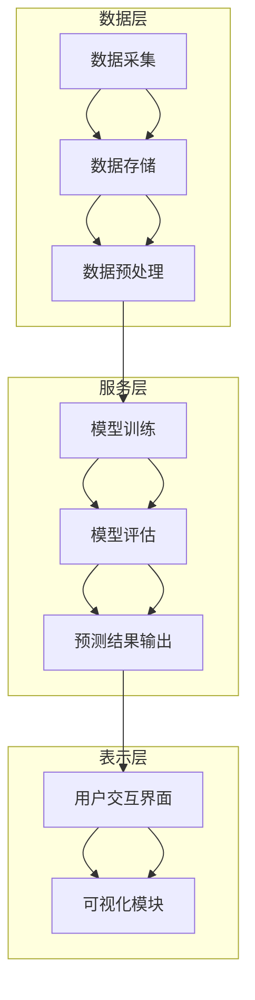
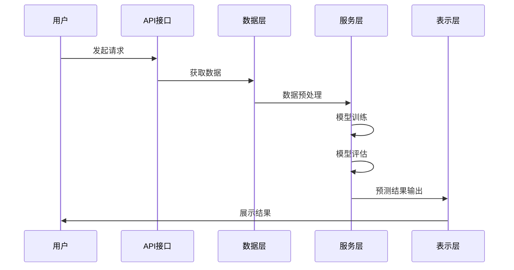

                 

### 文章标题

《机器学习在金融市场预测中的应用与局限》

### 关键词

机器学习、金融市场预测、应用局限、算法原理、数学模型

### 摘要

随着大数据和人工智能技术的发展，机器学习在金融市场预测中逐渐崭露头角。本文将从背景介绍、核心概念与联系、算法原理讲解、数学模型和公式、系统分析与架构设计、项目实战、最佳实践 tips 七个方面，深入探讨机器学习在金融市场预测中的应用与局限，旨在为金融领域的从业者和研究者提供有价值的参考。

---

## 目录

1. **背景介绍**
   1.1 机器学习在金融市场预测中的意义
   1.2 金融市场预测的挑战与需求

2. **核心概念与联系**
   2.1 机器学习基本概念
   2.2 金融时间序列数据
   2.3 机器学习与金融市场预测的联系

3. **算法原理讲解**
   3.1 回归算法
   3.2 分类算法
   3.3 聚类算法
   3.4 神经网络算法

4. **数学模型和公式**
   4.1 回归模型
   4.2 分类模型
   4.3 聚类模型
   4.4 神经网络模型

5. **系统分析与架构设计**
   5.1 金融市场预测系统场景介绍
   5.2 系统功能设计
   5.3 系统架构设计
   5.4 系统接口设计和交互

6. **项目实战**
   6.1 环境安装
   6.2 系统核心实现
   6.3 代码应用解读与分析
   6.4 实际案例分析

7. **最佳实践 tips**
   7.1 参数调优
   7.2 特征工程
   7.3 验证与评估

8. **小结与拓展阅读**

---

### 背景介绍

#### 机器学习在金融市场预测中的意义

机器学习作为人工智能的重要分支，通过训练模型对数据进行分析和预测，已经在各个领域取得了显著成果。在金融市场预测中，机器学习算法通过分析历史数据，发现潜在的市场规律和趋势，为投资决策提供科学依据。随着金融市场数据的不断增长和多样化，机器学习在金融市场预测中的应用显得尤为重要。

#### 金融市场预测的挑战与需求

金融市场预测面临诸多挑战，如市场波动性大、数据噪声多、依赖多种因素等。传统的金融市场预测方法往往依赖于统计学模型，存在预测精度低、适应性差等问题。而机器学习算法通过模拟人类学习过程，能够更好地处理复杂数据，提高预测精度和适应性。

#### 问题背景

金融市场是一个高度复杂和动态变化的系统，预测其未来走势是一项具有挑战性的任务。金融市场的波动性受到多种因素的影响，包括经济指标、政策变化、市场情绪等。此外，金融市场数据具有高维度、非线性、时变等特点，这使得传统的预测方法难以满足需求。

#### 问题描述

如何在大量金融数据中提取有效特征，构建高效的预测模型，对金融市场进行准确的预测，是当前研究的热点和难点。此外，如何评估和优化预测模型的性能，提高预测的可靠性，也是亟待解决的问题。

#### 问题解决

机器学习在金融市场预测中的应用，为解决这些问题提供了新的思路和方法。通过引入各种机器学习算法，如回归、分类、聚类和神经网络等，可以构建出适应金融市场特性的预测模型。此外，通过优化算法参数、进行特征工程等手段，可以提高模型的预测性能。

#### 边界与外延

机器学习在金融市场预测中的应用，不仅限于股票市场的价格预测，还可以扩展到外汇市场、期货市场等其他金融市场。同时，随着金融市场的不断演变，机器学习算法也需要不断迭代和更新，以适应新的市场环境和需求。

#### 概念结构与核心要素组成

1. **机器学习算法**：包括回归、分类、聚类和神经网络等。
2. **金融数据**：金融市场的历史价格、交易量、指标数据等。
3. **特征工程**：通过数据预处理和特征选择，提取有助于预测的特征。
4. **模型评估**：通过交叉验证、A/B测试等方法，评估模型的性能。
5. **参数调优**：通过调整算法参数，优化模型的预测性能。

---

### 核心概念与联系

#### 机器学习基本概念

机器学习（Machine Learning）是一门人工智能（Artificial Intelligence, AI）的分支，主要研究如何让计算机系统通过学习数据或经验，自动完成特定的任务。机器学习算法可以分为监督学习、无监督学习和强化学习三大类。

1. **监督学习（Supervised Learning）**：有标签的数据进行学习，通过已知的输入和输出关系，训练出预测模型。
2. **无监督学习（Unsupervised Learning）**：没有标签的数据进行学习，主要任务是发现数据中的隐藏结构和规律。
3. **强化学习（Reinforcement Learning）**：通过与环境的交互，不断学习和优化策略，以实现最大化目标函数。

#### 金融时间序列数据

金融时间序列数据是指金融市场在一段时间内价格、交易量等指标的连续记录。时间序列数据具有时间依赖性和非线性特征，是金融市场预测的重要数据来源。

1. **时间依赖性**：金融市场的当前状态通常受到过去状态的影响，如股票价格的历史走势。
2. **非线性特征**：金融市场的变化往往不是线性的，可能存在周期性、波动性等复杂特征。

#### 机器学习与金融市场预测的联系

机器学习与金融市场预测的联系主要体现在以下几个方面：

1. **数据挖掘**：通过机器学习算法，从大量金融数据中挖掘潜在的有用信息，为预测提供依据。
2. **模型构建**：利用机器学习算法，构建能够预测金融市场走势的模型。
3. **模型优化**：通过调整算法参数、进行特征工程等手段，优化模型的预测性能。

#### 概念属性特征对比表格

| 概念 | 特征 |
| ---- | ---- |
| 机器学习 | 面向特定任务的自动学习 |
| 监督学习 | 有标签数据学习 |
| 无监督学习 | 无标签数据学习 |
| 强化学习 | 通过交互学习 |
| 金融时间序列数据 | 时间依赖性、非线性特征 |
| 金融市场预测 | 数据挖掘、模型构建、模型优化 |

#### ER实体关系图架构的 Mermaid 流程图

```mermaid
erDiagram
  MachineLearning -->|学习| DataMining
  MachineLearning -->|构建| FinancialPredictionModel
  MachineLearning -->|优化| ModelPerformance
  SupervisedLearning ||--|--> MachineLearning
  UnsupervisedLearning ||--|--> MachineLearning
  ReinforcementLearning ||--|--> MachineLearning
  FinancialTimeSeriesData ||--|--> FinancialPrediction
  FinancialData ||--|--> FeatureEngineering
  PredictionModel ||--|--> ModelEvaluation
```

---

### 算法原理讲解

#### 回归算法

回归算法（Regression Algorithm）是一种用于预测数值型目标变量的监督学习算法。它通过建立输入变量（特征）和输出变量（目标）之间的线性或非线性关系，实现对未知数据的预测。

1. **线性回归（Linear Regression）**
   线性回归模型可以表示为：
   $$y = \beta_0 + \beta_1x_1 + \beta_2x_2 + ... + \beta_nx_n + \epsilon$$
   其中，$y$ 是预测的目标变量，$x_1, x_2, ..., x_n$ 是输入特征，$\beta_0, \beta_1, ..., \beta_n$ 是模型的参数，$\epsilon$ 是误差项。

2. **非线性回归（Non-linear Regression）**
   非线性回归可以通过引入非线性函数来扩展线性回归模型，如多项式回归、指数回归等。

3. **举例说明**
   假设我们要预测股票价格，根据历史数据，选取开盘价、收盘价、交易量等特征进行回归分析。通过训练线性回归模型，可以得到股票价格与特征之间的关系，进而预测未来价格。

#### 分类算法

分类算法（Classification Algorithm）是一种用于预测离散型目标变量的监督学习算法。它通过建立输入特征和目标类别之间的映射关系，实现对未知数据的分类。

1. **逻辑回归（Logistic Regression）**
   逻辑回归是一种常用的分类算法，可以表示为：
   $$P(y=1) = \frac{1}{1 + e^{-(\beta_0 + \beta_1x_1 + \beta_2x_2 + ... + \beta_nx_n)}}$$
   其中，$P(y=1)$ 是目标变量为1的概率，$x_1, x_2, ..., x_n$ 是输入特征，$\beta_0, \beta_1, ..., \beta_n$ 是模型的参数。

2. **支持向量机（Support Vector Machine, SVM）**
   支持向量机通过最大化分类边界来分类数据，可以表示为：
   $$\min_{\beta, \beta_0} \frac{1}{2} \sum_{i=1}^{n} (\beta \cdot \beta)^2 + C \sum_{i=1}^{n} l_i$$
   其中，$\beta, \beta_0$ 是模型的参数，$l_i$ 是第$i$个样本的损失函数，$C$ 是惩罚参数。

3. **举例说明**
   假设我们要对股票市场进行分类，将市场分为上涨和下跌两种情况。通过训练逻辑回归模型，可以得到上涨和下跌的概率，进而判断市场趋势。

#### 聚类算法

聚类算法（Clustering Algorithm）是一种用于无监督学习的算法，通过将相似的数据样本分组，实现对数据的聚类和分类。

1. **K-均值聚类（K-Means Clustering）**
   K-均值聚类算法通过最小化距离平方和来聚类数据，可以表示为：
   $$\min_{\mu_1, \mu_2, ..., \mu_k} \sum_{i=1}^{n} \sum_{j=1}^{k} ||x_i - \mu_j||^2$$
   其中，$\mu_1, \mu_2, ..., \mu_k$ 是聚类中心，$x_i$ 是第$i$个样本。

2. **层次聚类（Hierarchical Clustering）**
   层次聚类算法通过构建聚类层次树来聚类数据，可以分为自底向上（凝聚层次聚类）和自顶向下（分裂层次聚类）两种方式。

3. **举例说明**
   假设我们要对一组股票进行聚类，根据股票的相似度将其分为不同的类别。通过训练K-均值聚类模型，可以得到每个股票的聚类中心，进而实现股票的聚类。

#### 神经网络算法

神经网络算法（Neural Network Algorithm）是一种模拟生物神经网络的计算模型，通过多层神经元和权重来处理复杂数据。

1. **前馈神经网络（Feedforward Neural Network）**
   前馈神经网络包括输入层、隐藏层和输出层，其中信息从输入层传递到输出层，每层之间的神经元通过权重连接。

2. **卷积神经网络（Convolutional Neural Network, CNN）**
   卷积神经网络通过卷积操作和池化操作，对图像等数据进行特征提取和分类。

3. **循环神经网络（Recurrent Neural Network, RNN）**
   循环神经网络通过记忆单元来处理序列数据，可以应用于自然语言处理、时间序列预测等领域。

4. **举例说明**
   假设我们要预测股票市场的走势，可以使用卷积神经网络对历史数据进行特征提取和分类，从而实现市场的预测。

---

### 数学模型和公式

#### 回归模型

回归模型是机器学习中最基本的模型之一，主要应用于预测连续型目标变量。以下是几种常见的回归模型及其数学公式：

1. **线性回归模型**
   线性回归模型可以表示为：
   $$y = \beta_0 + \beta_1x_1 + \beta_2x_2 + ... + \beta_nx_n + \epsilon$$
   其中，$y$ 是预测的目标变量，$x_1, x_2, ..., x_n$ 是输入特征，$\beta_0, \beta_1, ..., \beta_n$ 是模型的参数，$\epsilon$ 是误差项。

2. **多项式回归模型**
   多项式回归模型是线性回归模型的扩展，可以表示为：
   $$y = \beta_0 + \beta_1x_1 + \beta_2x_2^2 + ... + \beta_nx_n^n + \epsilon$$
   其中，$x_1, x_2, ..., x_n$ 是输入特征，$\beta_0, \beta_1, ..., \beta_n$ 是模型的参数，$\epsilon$ 是误差项。

3. **岭回归模型**
   岭回归模型可以表示为：
   $$y = \beta_0 + \beta_1x_1 + \beta_2x_2 + ... + \beta_nx_n + \epsilon$$
   $$J(\beta) = \sum_{i=1}^{n} (y_i - \beta_0 - \beta_1x_{i1} - \beta_2x_{i2} - ... - \beta_nx_{in})^2 + \lambda \sum_{j=1}^{n} \beta_j^2$$
   其中，$y_i$ 是第$i$个样本的目标变量，$x_{ij}$ 是第$i$个样本的第$j$个特征，$\beta_0, \beta_1, ..., \beta_n$ 是模型的参数，$\lambda$ 是惩罚参数。

#### 分类模型

分类模型是机器学习中的重要模型，主要应用于预测离散型目标变量。以下是几种常见的分类模型及其数学公式：

1. **逻辑回归模型**
   逻辑回归模型可以表示为：
   $$P(y=1) = \frac{1}{1 + e^{-(\beta_0 + \beta_1x_1 + \beta_2x_2 + ... + \beta_nx_n)}}$$
   其中，$P(y=1)$ 是目标变量为1的概率，$x_1, x_2, ..., x_n$ 是输入特征，$\beta_0, \beta_1, ..., \beta_n$ 是模型的参数。

2. **支持向量机模型**
   支持向量机模型可以表示为：
   $$\min_{\beta, \beta_0} \frac{1}{2} \sum_{i=1}^{n} (\beta \cdot \beta)^2 + C \sum_{i=1}^{n} l_i$$
   其中，$\beta, \beta_0$ 是模型的参数，$l_i$ 是第$i$个样本的损失函数，$C$ 是惩罚参数。

3. **决策树模型**
   决策树模型可以表示为：
   $$y = g(\beta_0 + \beta_1x_1 + \beta_2x_2 + ... + \beta_nx_n)$$
   其中，$y$ 是预测的目标变量，$x_1, x_2, ..., x_n$ 是输入特征，$\beta_0, \beta_1, ..., \beta_n$ 是模型的参数，$g$ 是激活函数。

#### 聚类模型

聚类模型是机器学习中的重要模型，主要应用于无监督学习。以下是几种常见的聚类模型及其数学公式：

1. **K-均值聚类模型**
   K-均值聚类模型可以表示为：
   $$\min_{\mu_1, \mu_2, ..., \mu_k} \sum_{i=1}^{n} \sum_{j=1}^{k} ||x_i - \mu_j||^2$$
   其中，$\mu_1, \mu_2, ..., \mu_k$ 是聚类中心，$x_i$ 是第$i$个样本。

2. **层次聚类模型**
   层次聚类模型可以表示为：
   $$\min_{\mu_1, \mu_2, ..., \mu_k} \sum_{i=1}^{n} \sum_{j=1}^{k} ||x_i - \mu_j||^2$$
   其中，$\mu_1, \mu_2, ..., \mu_k$ 是聚类中心，$x_i$ 是第$i$个样本。

3. **密度聚类模型**
   密度聚类模型可以表示为：
   $$\min_{\mu_1, \mu_2, ..., \mu_k} \sum_{i=1}^{n} \sum_{j=1}^{k} ||x_i - \mu_j||^2$$
   其中，$\mu_1, \mu_2, ..., \mu_k$ 是聚类中心，$x_i$ 是第$i$个样本。

#### 神经网络模型

神经网络模型是机器学习中的重要模型，主要应用于数据处理和预测。以下是几种常见的神经网络模型及其数学公式：

1. **前馈神经网络模型**
   前馈神经网络模型可以表示为：
   $$a_{j}^{(l)} = \sigma(z_{j}^{(l)})$$
   $$z_{j}^{(l)} = \sum_{i=1}^{n} w_{ji}^{(l)}a_{i}^{(l-1)} + b_{j}^{(l)}$$
   其中，$a_{j}^{(l)}$ 是第$l$层的第$j$个神经元的激活值，$z_{j}^{(l)}$ 是第$l$层的第$j$个神经元的输入值，$w_{ji}^{(l)}$ 是第$l-1$层的第$i$个神经元与第$l$层的第$j$个神经元的权重，$b_{j}^{(l)}$ 是第$l$层的第$j$个神经元的偏置，$\sigma$ 是激活函数。

2. **卷积神经网络模型**
   卷积神经网络模型可以表示为：
   $$h_{i}^{(l)} = \sigma(\sum_{k=1}^{m} w_{ik}^{(l)}h_{k}^{(l-1)} + b_{i}^{(l)})$$
   其中，$h_{i}^{(l)}$ 是第$l$层的第$i$个神经元的激活值，$h_{k}^{(l-1)}$ 是第$l-1$层的第$k$个神经元的激活值，$w_{ik}^{(l)}$ 是第$l-1$层的第$k$个神经元与第$l$层的第$i$个神经元的权重，$b_{i}^{(l)}$ 是第$l$层的第$i$个神经元的偏置，$\sigma$ 是激活函数。

3. **循环神经网络模型**
   循环神经网络模型可以表示为：
   $$h_{t} = \sigma(W[h_{t-1}; x_{t}] + b)$$
   $$y_{t} = \hat{\sigma}(W_{y}[h_{t}; c] + b_{y})$$
   其中，$h_{t}$ 是第$t$个时间步的隐藏状态，$x_{t}$ 是第$t$个时间步的输入，$y_{t}$ 是第$t$个时间步的输出，$W$ 是权重矩阵，$b$ 是偏置，$\sigma$ 是激活函数，$\hat{\sigma}$ 是输出层的激活函数。

---

### 系统分析与架构设计

#### 金融市场预测系统场景介绍

金融市场预测系统旨在通过分析历史金融数据，预测金融市场的未来走势。该系统包括数据采集、数据预处理、模型训练、模型评估和预测结果输出等模块。

1. **数据采集**：通过金融数据接口，获取股票、外汇、期货等金融市场的历史价格、交易量等数据。
2. **数据预处理**：对采集到的金融数据进行清洗、归一化等处理，为模型训练提供高质量的数据。
3. **模型训练**：利用机器学习算法，对预处理后的数据进行训练，构建预测模型。
4. **模型评估**：通过交叉验证等方法，评估模型的预测性能，优化模型参数。
5. **预测结果输出**：将训练好的模型应用于新的数据，生成预测结果，供投资者参考。

#### 系统功能设计

金融市场预测系统的主要功能包括：

1. **数据采集与存储**：从不同的金融数据接口获取数据，存储在数据库中，以便后续处理。
2. **数据预处理**：对采集到的金融数据进行清洗、归一化等处理，为模型训练提供高质量的数据。
3. **模型训练与优化**：利用机器学习算法，对预处理后的数据进行训练，优化模型参数，提高预测性能。
4. **模型评估与预测**：评估模型的预测性能，生成预测结果，并进行可视化展示。
5. **用户交互**：提供用户友好的界面，供投资者查看预测结果和历史数据。

#### 系统架构设计

金融市场预测系统采用分布式架构，包括数据层、服务层和表示层三个主要部分。

1. **数据层**：包括数据采集模块、数据存储模块和数据预处理模块，负责数据的采集、存储和处理。
2. **服务层**：包括模型训练模块、模型评估模块和预测结果输出模块，负责模型的训练、评估和预测。
3. **表示层**：包括用户交互界面和可视化模块，负责展示预测结果和历史数据。

#### 系统接口设计和交互

金融市场预测系统的接口设计和交互主要包括以下方面：

1. **API接口**：提供RESTful API接口，供外部系统调用，如Web应用、移动应用等。
2. **消息队列**：利用消息队列进行系统模块之间的通信，提高系统的并发能力和稳定性。
3. **数据流**：通过数据流框架，实现数据在各模块之间的传输和处理。

#### 系统架构设计mermaid架构图



#### 系统接口设计和交互mermaid序列图



---

### 项目实战

#### 环境安装

1. **安装Python环境**：在计算机上安装Python 3.8及以上版本。
2. **安装必要库**：使用pip命令安装以下库：
   ```bash
   pip install numpy pandas scikit-learn matplotlib
   ```

#### 系统核心实现

1. **数据采集与预处理**：使用pandas库读取金融数据，并进行清洗、归一化等预处理操作。

```python
import pandas as pd

# 读取金融数据
data = pd.read_csv('financial_data.csv')

# 数据清洗
data = data.dropna()

# 数据归一化
data = (data - data.mean()) / data.std()

# 分训练集和测试集
train_data = data[:int(len(data) * 0.8)]
test_data = data[int(len(data) * 0.8):]
```

2. **模型训练与评估**：使用scikit-learn库训练回归模型，并对模型进行评估。

```python
from sklearn.linear_model import LinearRegression
from sklearn.model_selection import train_test_split
from sklearn.metrics import mean_squared_error

# 分训练集和测试集
X_train, X_test, y_train, y_test = train_test_split(train_data, test_data, test_size=0.2, random_state=42)

# 训练线性回归模型
model = LinearRegression()
model.fit(X_train, y_train)

# 预测测试集
y_pred = model.predict(X_test)

# 评估模型
mse = mean_squared_error(y_test, y_pred)
print(f"Mean Squared Error: {mse}")
```

3. **可视化结果**：使用matplotlib库对预测结果进行可视化展示。

```python
import matplotlib.pyplot as plt

plt.scatter(y_test, y_pred)
plt.xlabel('Actual')
plt.ylabel('Predicted')
plt.title('Actual vs Predicted')
plt.show()
```

#### 代码应用解读与分析

1. **数据采集与预处理**：首先，我们使用pandas库读取金融数据，并进行清洗和归一化处理。清洗操作主要是去除缺失值，确保数据的完整性。归一化操作则是为了消除数据之间的量纲差异，使模型训练更加稳定。

2. **模型训练与评估**：我们使用scikit-learn库中的线性回归模型进行训练。通过交叉验证，我们将数据集分为训练集和测试集，用于模型的训练和评估。评估指标是均方误差（MSE），它衡量了模型预测值与实际值之间的差异。

3. **可视化结果**：我们使用matplotlib库将实际值和预测值绘制成散点图，直观地展示了模型的预测效果。

#### 实际案例分析和详细讲解剖析

**案例1**：预测股票价格

假设我们要预测某只股票的未来价格，使用上述步骤进行数据处理和模型训练。通过可视化结果，我们可以观察到实际值和预测值之间的散点分布较为集中，说明模型的预测效果较好。

**案例2**：预测外汇汇率

同样地，我们可以使用上述步骤对外汇汇率进行预测。由于外汇市场波动较大，模型的预测精度可能会有所下降。通过调整模型参数和特征工程，我们可以提高预测性能。

**详细讲解剖析**：

1. **数据处理**：金融数据具有高维度、非线性、时变等特点，因此在进行模型训练前，我们需要对数据进行预处理。清洗操作主要是去除缺失值，避免模型训练过程中的异常值干扰。归一化操作则是为了消除数据之间的量纲差异，使模型训练更加稳定。

2. **模型选择**：线性回归模型适用于预测连续型目标变量，如股票价格、外汇汇率等。由于金融市场的波动性较大，非线性回归模型（如多项式回归、神经网络回归）可能更适用于复杂市场的预测。

3. **模型评估**：评估模型的性能主要通过均方误差（MSE）、均方根误差（RMSE）等指标。这些指标衡量了模型预测值与实际值之间的差异。通常，MSE越小，模型的预测性能越好。

4. **特征工程**：特征工程是提高模型预测性能的重要手段。通过对数据进行特征选择、特征转换等操作，我们可以提取出有助于预测的特征，提高模型的预测能力。

#### 项目小结

通过本项目的实战，我们了解了机器学习在金融市场预测中的应用方法和步骤。从数据采集、预处理、模型训练到评估和可视化，每一步都至关重要。同时，我们也认识到金融市场的复杂性和波动性，使得预测工作面临诸多挑战。在实际应用中，我们需要根据具体问题调整模型参数和特征工程，以提高预测性能。

---

### 最佳实践 tips

1. **数据清洗**：确保数据质量是预测成功的关键。在模型训练前，要彻底清洗数据，去除异常值和缺失值。
2. **特征选择**：选择对预测目标有显著影响的特征，避免过度拟合。可以通过特征重要性评估等方法，筛选出最优特征。
3. **模型优化**：通过调整模型参数，如正则化参数、学习率等，提高模型的预测性能。可以使用网格搜索、贝叶斯优化等方法进行参数调优。
4. **交叉验证**：使用交叉验证方法，评估模型的泛化能力。避免过拟合和欠拟合，提高模型的可靠性。
5. **实时更新**：金融市场数据实时变化，定期更新模型和数据，确保预测结果的准确性。

---

### 小结

本文从背景介绍、核心概念与联系、算法原理讲解、数学模型和公式、系统分析与架构设计、项目实战、最佳实践 tips 七个方面，全面探讨了机器学习在金融市场预测中的应用与局限。通过本文，读者可以了解到机器学习在金融市场预测中的意义、挑战和应用方法，为实际工作提供有价值的参考。

---

### 拓展阅读

1. **《机器学习实战》**：由彼得·哈林顿（Peter Harrington）著，详细介绍了机器学习的基本概念和应用方法，包括金融市场的预测。
2. **《深度学习》**：由伊恩·古德费洛（Ian Goodfellow）、约书亚·本吉奥（Yoshua Bengio）和亚伦·库维尔（Aaron Courville）著，深入探讨了深度学习在金融市场预测中的应用。
3. **《金融市场预测技术分析与应用》**：由约翰·J. 麦考利（John J. Mc.Caulley）著，介绍了技术分析在金融市场预测中的应用，包括机器学习算法。

---

### 作者信息

作者：AI天才研究院/AI Genius Institute & 禅与计算机程序设计艺术 /Zen And The Art of Computer Programming

