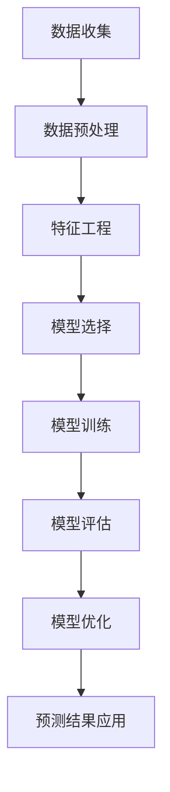
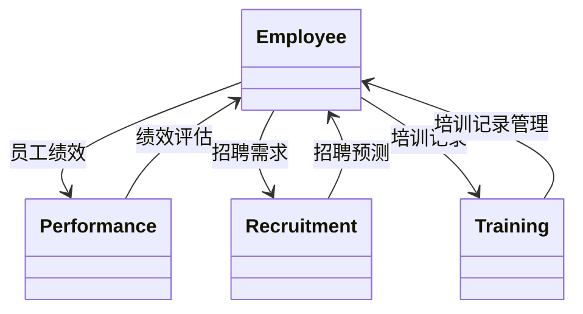
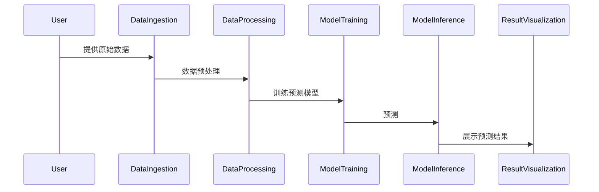
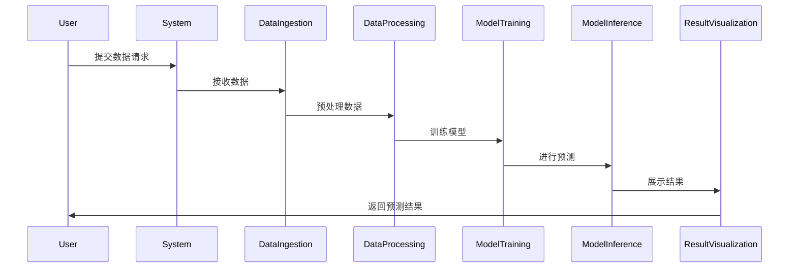

                 

# 机器学习在预测性人力资源管理中的应用

## 关键词

- 机器学习
- 预测性人力资源管理
- 员工流失预测
- 绩效预测
- 数据分析
- 模型优化

## 摘要

本文旨在探讨机器学习在预测性人力资源管理中的应用。通过对现有技术的深入分析，本文详细介绍了机器学习的基本原理及其在人力资源管理领域的应用场景。文章首先阐述了预测性人力资源管理的重要性，接着讲解了机器学习与预测性人力资源管理的结合点。随后，本文逐一介绍了常用的机器学习算法，包括监督学习和无监督学习的应用，并探讨了这些算法在人力资源管理中的具体实现。通过实际案例的分析，本文展示了机器学习在预测性人力资源管理中的实际应用效果，并为未来的研究方向提供了启示。

## 目录

1. **问题背景与核心概念**
   - 1.1 问题背景
     - 1.1.1 人力资源管理中的预测性问题
     - 1.1.2 预测性人力资源管理的重要性
     - 1.1.3 机器学习在预测性人力资源管理中的应用现状
   - 1.2 核心概念
     - 1.2.1 机器学习的定义与分类
     - 1.2.2 预测性人力资源管理的概念与构成
     - 1.2.3 机器学习与预测性人力资源管理的联系
   - 1.3 边界与外延
     - 1.3.1 机器学习在人力资源管理中的应用边界
     - 1.3.2 人力资源管理的预测性分析范围
     - 1.3.3 机器学习技术的成熟度与应用潜力
   - 1.4 本章小结

2. **核心概念原理**
   - 2.1 机器学习原理
     - 2.1.1 基本概念
     - 2.1.2 机器学习算法
     - 2.1.3 深度学习
   - 2.2 预测性人力资源管理概念
     - 2.2.1 预测性人力资源管理的核心概念
     - 2.2.2 预测性人力资源管理的应用场景
   - 2.3 概念属性特征对比表格
     - 2.3.1 机器学习算法特性对比
     - 2.3.2 预测性人力资源管理模型特性对比
   - 2.4 ER实体关系图架构
     - 2.4.1 机器学习与人力资源管理实体关系
     - 2.4.2 预测性人力资源管理流程图
   - 2.5 本章小结

3. **算法原理讲解**
   - 3.1 算法原理讲解
     - 3.1.1 监督学习算法原理
       - 3.1.1.1 线性回归
       - 3.1.1.2 决策树
     - 3.1.2 无监督学习算法原理
       - 3.1.2.1 K-means聚类
       - 3.1.2.2 主成分分析
   - 3.1.3 深度学习算法原理
     - 3.1.3.1 卷积神经网络
     - 3.1.3.2 循环神经网络
     - 3.1.3.3 生成对抗网络
   - 3.2 数学模型讲解
     - 3.2.1 数学模型概述
     - 3.2.2 线性回归模型
     - 3.2.3 决策树模型
   - 3.3 Python代码实现
     - 3.3.1 Python环境搭建
     - 3.3.2 算法代码实现
     - 3.3.3 代码解读与调试
   - 3.4 举例说明
     - 3.4.1 员工流失预测
     - 3.4.2 绩效预测
     - 3.4.3 员工招聘需求预测
   - 3.5 本章小结

4. **系统分析与架构设计方案**
   - 4.1 问题场景介绍
   - 4.2 系统功能设计
     - 4.2.1 领域模型类图
   - 4.3 系统架构设计
     - 4.3.1 系统架构图
     - 4.3.2 系统模块设计
   - 4.4 系统接口设计
     - 4.4.1 接口定义
     - 4.4.2 接口实现
   - 4.5 系统交互
     - 4.5.1 序列图
     - 4.5.2 交互流程
   - 4.6 本章小结

5. **项目实战**
   - 5.1 环境安装
     - 5.1.1 Python环境安装
     - 5.1.2 相关库安装
   - 5.2 系统核心实现
     - 5.2.1 数据预处理
     - 5.2.2 模型训练与优化
     - 5.2.3 模型评估与部署
   - 5.3 代码应用解读与分析
     - 5.3.1 源代码解析
     - 5.3.2 代码优化建议
   - 5.4 实际案例分析
     - 5.4.1 案例背景
     - 5.4.2 案例分析与结果
   - 5.5 项目小结
     - 5.5.1 项目成果总结
     - 5.5.2 项目经验与启示

6. **最佳实践 tips**
   - 6.1 数据质量优化
   - 6.2 模型选择与调优
   - 6.3 实时性与效率优化

7. **小结**
   - 7.1 主要内容回顾
   - 7.2 未来研究方向

8. **注意事项**
   - 8.1 数据安全与隐私保护
   - 8.2 模型解释性与可解释性

9. **拓展阅读**
   - 9.1 相关书籍推荐
   - 9.2 学术论文精选
   - 9.3 开源项目推荐

## 1. 问题背景与核心概念

### 1.1 问题背景

**1.1.1 人力资源管理中的预测性问题**

人力资源管理是企业管理中至关重要的一部分，涉及到员工招聘、培训、绩效评估、薪酬管理等各个方面。在传统的人力资源管理中，很多决策往往基于经验和直觉，这种方式在简单、稳定的环境下可能效果不错，但在复杂多变的市场环境中，传统的管理方法往往难以应对。

预测性问题在人力资源管理中主要体现在以下几个方面：

- **员工流失预测**：如何提前识别出可能离职的员工，从而采取预防措施，降低离职率。
- **绩效预测**：如何预测员工的未来绩效，为绩效管理提供依据。
- **招聘需求预测**：如何预测企业未来的人才需求，合理安排招聘计划。

**1.1.2 预测性人力资源管理的重要性**

预测性人力资源管理能够为企业提供以下价值：

- **优化决策**：基于数据分析的预测结果可以帮助企业更科学地进行人力资源规划，降低决策风险。
- **提高效率**：通过预测性分析，可以提前发现问题，及时采取措施，提高人力资源管理的效率。
- **降低成本**：通过预测员工流失和招聘需求，可以减少不必要的招聘和离职成本。

**1.1.3 机器学习在预测性人力资源管理中的应用现状**

随着机器学习技术的不断发展，其在预测性人力资源管理中的应用越来越广泛。目前，机器学习在人力资源管理中的应用主要体现在以下几个方面：

- **员工流失预测**：通过分析员工的工作年限、绩效评分、薪酬水平等数据，预测员工是否可能离职。
- **绩效预测**：通过分析员工的工作表现、团队协作情况等数据，预测员工的未来绩效。
- **招聘需求预测**：通过分析企业的业务发展情况、员工流失率等数据，预测企业未来的人才需求。

### 1.2 核心概念

**1.2.1 机器学习的定义与分类**

机器学习是指利用计算机模拟人类的学习过程，从数据中自动学习和获取规律，从而实现对未知数据的预测和决策。根据学习方式的不同，机器学习主要分为以下几类：

- **监督学习**：通过已有数据的标签，训练模型来预测未知数据的标签。
- **无监督学习**：没有已知的标签，通过分析数据之间的相似性或差异性来发现数据中的模式。
- **强化学习**：通过与环境的交互，不断优化策略，以实现最大化回报。

**1.2.2 预测性人力资源管理的概念与构成**

预测性人力资源管理是指利用数据分析技术，对人力资源管理中的关键问题进行预测和分析。其主要包括以下几个核心概念：

- **预测指标**：用于衡量预测效果的指标，如准确率、召回率、F1值等。
- **预测模型**：用于进行预测的数学模型，如线性回归、决策树、神经网络等。
- **数据驱动的决策支持**：通过数据分析和预测结果，为人力资源管理的决策提供支持。

**1.2.3 机器学习与预测性人力资源管理的联系**

机器学习与预测性人力资源管理的结合主要体现在以下几个方面：

- **数据收集与处理**：机器学习需要大量的数据作为输入，预测性人力资源管理可以通过各种手段收集和整理数据。
- **模型训练与优化**：通过训练机器学习模型，可以从数据中提取出对预测问题有用的特征，并进行模型优化。
- **预测结果的应用**：通过机器学习模型进行预测，可以为人力资源管理提供科学的决策依据。

### 1.3 边界与外延

**1.3.1 机器学习在人力资源管理中的应用边界**

机器学习在人力资源管理中的应用虽然广泛，但也存在一定的局限性：

- **数据依赖性**：机器学习模型的效果很大程度上取决于数据的数量和质量，如果数据不足或质量差，模型的预测效果会受到影响。
- **解释性限制**：一些复杂的机器学习模型，如深度神经网络，虽然预测效果很好，但很难解释其预测过程，这给人力资源管理的应用带来了一定的挑战。

**1.3.2 人力资源管理的预测性分析范围**

预测性人力资源管理的分析范围主要包括以下几个方面：

- **员工流失预测**：预测员工是否会离职，以及离职的时间点。
- **绩效预测**：预测员工未来的工作绩效，以及可能的表现。
- **招聘需求预测**：预测企业未来一段时间内的人力资源需求，以及需要招聘的岗位和数量。

**1.3.3 机器学习技术的成熟度与应用潜力**

随着机器学习技术的不断发展，其在预测性人力资源管理中的应用潜力越来越大：

- **算法多样化**：现有的机器学习算法种类繁多，可以根据具体问题选择最合适的算法。
- **数据挖掘技术**：通过数据挖掘技术，可以从海量数据中提取出对预测问题有用的信息。
- **实时预测**：随着计算能力的提升，机器学习模型可以实时预测，为人力资源管理的决策提供及时支持。

### 1.4 本章小结

本章介绍了机器学习在预测性人力资源管理中的应用背景、核心概念及其边界与外延。通过分析，我们可以看到机器学习在人力资源管理中具有广泛的应用前景，但同时也面临一定的挑战。下一章将深入探讨机器学习的基本原理和核心概念。让我们继续前行，探索这一领域更深层次的奥秘。

## 2. 核心概念原理

### 2.1 机器学习原理

**2.1.1 基本概念**

机器学习（Machine Learning，ML）是人工智能（Artificial Intelligence，AI）的一个重要分支，主要研究如何让计算机从数据中学习并提取知识，从而进行预测和决策。机器学习的基本概念包括：

- **特征（Feature）**：描述数据的属性或特征。
- **模型（Model）**：用于表示数据之间关系的数学模型。
- **训练（Training）**：使用已有数据对模型进行训练，使其能够学习数据中的规律。
- **测试（Testing）**：使用测试数据验证模型的效果。

**2.1.2 机器学习算法**

机器学习算法根据学习方式的不同，主要分为以下几类：

- **监督学习（Supervised Learning）**：有监督学习是指使用带有标签的数据对模型进行训练，从而预测未知数据的标签。常见的监督学习算法包括：

  - **线性回归（Linear Regression）**：用于预测连续值的模型。
  - **决策树（Decision Tree）**：用于分类和回归问题的树形模型。
  - **支持向量机（Support Vector Machine，SVM）**：用于分类问题的模型，通过找到一个超平面将数据分为不同的类别。
  - **随机森林（Random Forest）**：结合了多棵决策树，提高了预测准确率和鲁棒性。

- **无监督学习（Unsupervised Learning）**：无监督学习是指在没有标签的数据中寻找隐藏的结构或模式。常见的无监督学习算法包括：

  - **K-均值聚类（K-means Clustering）**：将数据分为K个簇，每个簇内的数据点相似度较高，不同簇的数据点相似度较低。
  - **主成分分析（Principal Component Analysis，PCA）**：通过线性变换降低数据的维度，同时保留数据的主要信息。
  - **自编码器（Autoencoder）**：用于无监督学习的神经网络，可以学习数据的高效表示。

- **强化学习（Reinforcement Learning）**：强化学习是指通过与环境交互，不断优化策略，以实现最大化回报。常见的强化学习算法包括：

  - **Q-学习（Q-Learning）**：通过学习Q值（表示从当前状态采取某个动作的预期回报）来优化策略。
  - **深度强化学习（Deep Reinforcement Learning）**：结合深度神经网络和强化学习，用于解决复杂的问题。

**2.1.3 深度学习**

深度学习（Deep Learning，DL）是机器学习的一个重要分支，主要基于多层神经网络进行学习。深度学习的关键特点是能够自动提取数据的层次特征，从而实现复杂的模式识别和预测任务。常见的深度学习模型包括：

- **卷积神经网络（Convolutional Neural Network，CNN）**：主要用于图像识别和图像处理任务。
- **循环神经网络（Recurrent Neural Network，RNN）**：主要用于序列数据的处理，如语言建模和时间序列预测。
- **长短时记忆网络（Long Short-Term Memory，LSTM）**：是RNN的一种变体，解决了RNN在处理长序列数据时的梯度消失问题。
- **生成对抗网络（Generative Adversarial Network，GAN）**：由两个神经网络（生成器和判别器）组成的框架，可以用于生成高质量的图像和数据。

### 2.2 预测性人力资源管理概念

**2.2.1 预测性人力资源管理的核心概念**

预测性人力资源管理是指利用数据分析技术，对人力资源管理中的关键问题进行预测和分析。其核心概念包括：

- **预测指标**：用于衡量预测效果的指标，如准确率、召回率、F1值等。
- **预测模型**：用于进行预测的数学模型，如线性回归、决策树、神经网络等。
- **数据驱动的决策支持**：通过数据分析和预测结果，为人力资源管理的决策提供支持。

**2.2.2 预测性人力资源管理的应用场景**

预测性人力资源管理在人力资源管理中具有广泛的应用场景，包括：

- **员工流失预测**：通过分析员工的工作年限、绩效评分、薪酬水平等数据，预测员工是否可能离职。
- **绩效预测**：通过分析员工的工作表现、团队协作情况等数据，预测员工的未来绩效。
- **招聘需求预测**：通过分析企业的业务发展情况、员工流失率等数据，预测企业未来的人力资源需求。

### 2.3 概念属性特征对比表格

**2.3.1 机器学习算法特性对比**

| 算法        | 特点                                                     | 适用场景                           |
|-----------|--------------------------------------------------------|---------------------------------|
| 线性回归     | 简单，易于解释，适用于线性关系                            | 线性关系预测问题                   |
| 决策树      | 可解释性高，适用于分类和回归问题                        | 非线性关系预测问题                 |
| 支持向量机    | 精确，适用于高维空间问题                                | 分类问题                           |
| 随机森林     | 鲁棒性强，降低过拟合风险                               | 多元线性回归和分类问题             |
| K-均值聚类   | 简单，易于实现，适用于聚类问题                          | 数据聚类问题                       |
| 主成分分析    | 降低数据维度，提取主要特征                             | 数据降维和特征提取                 |
| 卷积神经网络   | 自动提取特征，适用于图像识别和图像处理问题               | 图像识别和图像处理问题             |
| 循环神经网络   | 适用于序列数据，如语言模型和时间序列预测                  | 序列数据处理问题                   |
| 长短时记忆网络   | 解决RNN在处理长序列数据时的梯度消失问题，适用于序列数据   | 序列数据处理问题                   |
| 生成对抗网络   | 用于生成高质量的数据，如图像和数据生成                    | 数据生成问题                       |

**2.3.2 预测性人力资源管理模型特性对比**

| 模型              | 特点                                                     | 适用场景                           |
|----------------|--------------------------------------------------------|---------------------------------|
| 员工流失预测模型   | 预测员工是否会离职                                    | 员工流失预测问题                   |
| 绩效预测模型      | 预测员工未来绩效                                      | 绩效预测问题                       |
| 招聘需求预测模型   | 预测企业未来的人力资源需求                             | 招聘需求预测问题                   |
| 人才推荐模型      | 根据员工的技能和经验推荐适合的职位                      | 人才推荐问题                       |
| 培训需求预测模型   | 预测员工需要哪些培训来提升技能                         | 培训需求预测问题                   |

### 2.4 ER实体关系图架构

**2.4.1 机器学习与人力资源管理实体关系**

以下是机器学习与人力资源管理实体关系的ER图：

```mermaid
erDiagram
  HRManager ||--|{ Employee : 管理员对员工的操作 }
  Employee ||--|{ Performance : 员工的工作表现 }
  Employee ||--|{ Training : 员工的培训记录 }
  Employee ||--|{ Recruitment : 招聘记录 }
  HRManager ||--|{ Prediction : 预测结果 }
  Prediction ||--|{ Algorithm : 使用的算法 }
```

**2.4.2 预测性人力资源管理流程图**

以下是预测性人力资源管理的流程图：



### 2.5 本章小结

本章介绍了机器学习的基本原理和核心概念，以及机器学习在预测性人力资源管理中的应用。通过对机器学习算法的介绍，我们可以看到它们在人力资源管理中的广泛应用。接下来，我们将深入探讨机器学习算法的原理和实现，以及如何将其应用于预测性人力资源管理中。

## 3. 算法原理讲解

### 3.1 监督学习算法原理

监督学习（Supervised Learning）是机器学习中的一种主要学习方式，它通过已有数据的标签来训练模型，以便预测未知数据的标签。监督学习算法可以分为回归和分类两大类。

**3.1.1 线性回归**

线性回归（Linear Regression）是最基本的回归算法，用于预测连续值。线性回归模型的数学表达式为：

\[ y = \beta_0 + \beta_1 \cdot x + \epsilon \]

其中，\( y \) 是预测值，\( x \) 是特征值，\( \beta_0 \) 和 \( \beta_1 \) 是模型参数，\( \epsilon \) 是误差项。

**线性回归的Python代码实现**

```python
import numpy as np
import matplotlib.pyplot as plt

# 创建训练数据
X = np.array([0, 1, 2, 3, 4])
y = np.array([0, 1, 2, 3, 4])

# 添加偏置项（截距）
X = np.hstack((np.ones((X.shape[0], 1)), X))

# 训练模型
theta = np.linalg.inv(X.T.dot(X)).dot(X.T).dot(y)
print("模型参数：", theta)

# 预测
X_new = np.hstack((np.ones((1, 1)), np.array([5.])))
y_pred = theta.dot(X_new)
print("预测值：", y_pred)

# 绘制结果
plt.scatter(X, y)
plt.plot(X, X.dot(theta), color='red')
plt.xlabel('x')
plt.ylabel('y')
plt.show()
```

**举例说明**

假设我们有一个简单的线性关系 \( y = 2x + 1 \)，通过线性回归模型我们可以预测 \( x \) 对应的 \( y \) 值。

**3.1.2 决策树**

决策树（Decision Tree）是一种树形结构的预测模型，它通过一系列的判断规则将数据分割成多个子集，每个子集对应一个预测结果。决策树的核心是节点分裂准则，常用的准则包括信息增益（Information Gain）和基尼不纯度（Gini Impurity）。

**决策树的数学模型**

决策树可以表示为一个递归分割的过程，每个节点根据特征 \( x_j \) 和阈值 \( \theta_j \) 对数据进行分割：

\[ S_j = \{ s | x_j(\theta_j) > t \} \]

其中，\( S_j \) 是分割后的数据集，\( t \) 是阈值。

**决策树的Python代码实现**

```python
from sklearn.tree import DecisionTreeRegressor
from sklearn.datasets import load_boston
from sklearn.model_selection import train_test_split

# 加载波士顿房价数据集
boston = load_boston()
X = boston.data
y = boston.target

# 划分训练集和测试集
X_train, X_test, y_train, y_test = train_test_split(X, y, test_size=0.2, random_state=42)

# 训练决策树模型
regressor = DecisionTreeRegressor()
regressor.fit(X_train, y_train)

# 预测
y_pred = regressor.predict(X_test)

# 评估模型
print("决定系数：", regressor.score(X_test, y_test))

# 绘制决策树
from sklearn.tree import plot_tree
plt.figure(figsize=(12, 8))
plot_tree(regressor, feature_names=boston.feature_names, filled=True)
plt.show()
```

**举例说明**

假设我们使用决策树来预测波士顿房价，通过训练和评估，我们可以得到一个决策树模型，并绘制出决策树的结构。

### 3.2 无监督学习算法原理

无监督学习（Unsupervised Learning）在没有标签的数据中寻找隐藏的结构或模式。常见的无监督学习算法包括K-均值聚类（K-means Clustering）和主成分分析（Principal Component Analysis，PCA）。

**3.2.1 K-均值聚类**

K-均值聚类是一种基于距离的聚类算法，它通过迭代更新聚类中心，将数据点分为K个簇。K-均值聚类的目标是最小化簇内距离的平方和。

**K-均值聚类的数学模型**

K-均值聚类的目标是最小化目标函数：

\[ J = \sum_{i=1}^{k} \sum_{x_j \in S_i} ||x_j - \mu_i||^2 \]

其中，\( k \) 是簇的数量，\( S_i \) 是第 \( i \) 个簇，\( \mu_i \) 是第 \( i \) 个簇的中心。

**K-均值聚类的Python代码实现**

```python
from sklearn.cluster import KMeans
import numpy as np

# 创建随机数据
data = np.random.rand(100, 2)

# 训练K-均值聚类模型
kmeans = KMeans(n_clusters=3, random_state=42)
kmeans.fit(data)

# 获取聚类结果
labels = kmeans.predict(data)
centroids = kmeans.cluster_centers_

# 绘制结果
plt.scatter(data[:, 0], data[:, 1], c=labels)
plt.scatter(centroids[:, 0], centroids[:, 1], s=300, c='red')
plt.show()
```

**举例说明**

假设我们使用K-均值聚类来对随机生成的一组二维数据进行聚类，通过训练和绘制结果，我们可以看到数据被分为三个簇。

**3.2.2 主成分分析**

主成分分析（PCA）是一种降维技术，它通过正交变换将数据从高维空间投影到低维空间，同时保留数据的主要信息。PCA的核心是找到数据的主要方向，即特征向量。

**主成分分析的数学模型**

PCA的目标是找到一组特征向量 \( \lambda_1, \lambda_2, ..., \lambda_p \)，使得数据在新坐标系下的投影最小化方差：

\[ \min_{X'} \sum_{i=1}^{n} ||X_i - \sum_{j=1}^{p} \lambda_j X_{ij}||^2 \]

其中，\( X \) 是原始数据矩阵，\( X' \) 是新坐标系下的数据矩阵。

**主成分分析的Python代码实现**

```python
from sklearn.decomposition import PCA
import numpy as np

# 创建随机数据
data = np.random.rand(100, 3)

# 训练PCA模型
pca = PCA(n_components=2)
pca.fit(data)

# 获取主成分
components = pca.components_
print("特征向量：", components)

# 转换数据到新坐标系
data_pca = pca.transform(data)

# 绘制结果
plt.scatter(data_pca[:, 0], data_pca[:, 1])
plt.show()
```

**举例说明**

假设我们使用PCA对随机生成的一组三维数据进行降维，通过训练和绘制结果，我们可以看到数据被投影到二维空间。

### 3.3 深度学习算法原理

深度学习（Deep Learning）是一种基于多层神经网络的学习方法，它通过多层非线性变换提取数据的高层次特征。常见的深度学习算法包括卷积神经网络（CNN）、循环神经网络（RNN）和生成对抗网络（GAN）。

**3.3.1 卷积神经网络**

卷积神经网络（Convolutional Neural Network，CNN）是一种用于处理图像数据的深度学习模型，它通过卷积层提取图像特征，并通过池化层降低数据维度。CNN的核心是卷积层和池化层。

**卷积神经网络的数学模型**

卷积神经网络的数学模型可以表示为：

\[ h_{l+1}(x) = \sigma(\theta^{(l)} \cdot h_l(x) + b^{(l)}) \]

其中，\( h_{l+1}(x) \) 是第 \( l+1 \) 层的输出，\( \theta^{(l)} \) 是第 \( l \) 层的权重，\( \sigma \) 是激活函数，\( b^{(l)} \) 是偏置项。

**卷积神经网络的Python代码实现**

```python
import tensorflow as tf
from tensorflow.keras import datasets, layers, models

# 加载图像数据集
(train_images, train_labels), (test_images, test_labels) = datasets.cifar10.load_data()

# 预处理数据
train_images = train_images.astype('float32') / 255
test_images = test_images.astype('float32') / 255

# 构建卷积神经网络模型
model = models.Sequential()
model.add(layers.Conv2D(32, (3, 3), activation='relu', input_shape=(32, 32, 3)))
model.add(layers.MaxPooling2D((2, 2)))
model.add(layers.Conv2D(64, (3, 3), activation='relu'))
model.add(layers.MaxPooling2D((2, 2)))
model.add(layers.Conv2D(64, (3, 3), activation='relu'))

# 添加全连接层
model.add(layers.Flatten())
model.add(layers.Dense(64, activation='relu'))
model.add(layers.Dense(10))

# 编译模型
model.compile(optimizer='adam',
              loss=tf.keras.losses.SparseCategoricalCrossentropy(from_logits=True),
              metrics=['accuracy'])

# 训练模型
model.fit(train_images, train_labels, epochs=10, validation_data=(test_images, test_labels))

# 评估模型
test_loss, test_acc = model.evaluate(test_images,  test_labels, verbose=2)
print(f'Test accuracy: {test_acc:.4f}')
```

**举例说明**

使用卷积神经网络对CIFAR-10图像数据集进行分类，通过训练和评估，我们可以得到一个准确率较高的分类模型。

**3.3.2 循环神经网络**

循环神经网络（Recurrent Neural Network，RNN）是一种用于处理序列数据的深度学习模型，它通过循环结构保持长期的序列信息。常见的RNN变体包括长短时记忆网络（Long Short-Term Memory，LSTM）和门控循环单元（Gated Recurrent Unit，GRU）。

**循环神经网络的数学模型**

循环神经网络的数学模型可以表示为：

\[ h_{t} = \sigma(W_h \cdot [h_{t-1}, x_t] + b_h) \]

其中，\( h_{t} \) 是当前时刻的隐藏状态，\( x_t \) 是当前时刻的输入，\( W_h \) 是权重矩阵，\( b_h \) 是偏置项，\( \sigma \) 是激活函数。

**循环神经网络的Python代码实现**

```python
import tensorflow as tf
from tensorflow.keras.models import Sequential
from tensorflow.keras.layers import LSTM, Dense

# 创建序列数据
X = np.array([[1, 0, 1], [0, 1, 1], [1, 1, 0]])
y = np.array([0, 1, 0])

# 构建循环神经网络模型
model = Sequential()
model.add(LSTM(50, activation='sigmoid', input_shape=(3, 3)))
model.add(Dense(1, activation='sigmoid'))

# 编译模型
model.compile(optimizer='adam', loss='binary_crossentropy', metrics=['accuracy'])

# 训练模型
model.fit(X, y, epochs=200, batch_size=10)

# 预测
predictions = model.predict(X)
print(predictions)
```

**举例说明**

使用循环神经网络对一组序列数据进行分类，通过训练和预测，我们可以得到序列数据的分类结果。

**3.3.3 生成对抗网络**

生成对抗网络（Generative Adversarial Network，GAN）是一种基于两个神经网络（生成器和判别器）对抗训练的模型，用于生成高质量的数据。生成器试图生成与真实数据相似的数据，而判别器则试图区分真实数据和生成数据。

**生成对抗网络的数学模型**

生成对抗网络的数学模型可以表示为：

\[ D(x) = \frac{1}{2}\left[ \log(D(G(z))) + \log(1 - D(x)) \right] \]

其中，\( D(x) \) 是判别器的损失函数，\( G(z) \) 是生成器的输出，\( z \) 是生成器的随机噪声。

**生成对抗网络的Python代码实现**

```python
import tensorflow as tf
from tensorflow.keras.models import Model
from tensorflow.keras.layers import Input, Dense, Reshape, Conv2D, Flatten, Embedding, LSTM, TimeDistributed

# 创建生成器和判别器的输入
z = Input(shape=(100,))
x = Input(shape=(28, 28, 1))

# 生成器模型
gen = Conv2D(64, (3, 3), activation='relu')(z)
gen = Conv2D(128, (3, 3), activation='relu')(gen)
gen = Reshape((7, 7, 128))(gen)
gen = Flatten()(gen)
gen = Dense(28 * 28 * 128, activation='relu')(gen)
gen = Reshape((28, 28, 128))(gen)
gen = Conv2D(128, (3, 3), activation='relu')(gen)
gen = Conv2D(64, (3, 3), activation='relu')(gen)
gen = Reshape((14, 14, 64))(gen)
gen = Flatten()(gen)
gen = Dense(28 * 28 * 64, activation='relu')(gen)
gen = Reshape((28, 28, 64))(gen)
gen = Conv2D(1, (3, 3), activation='sigmoid')(gen)
gen_model = Model(z, gen)

# 判别器模型
dis = Conv2D(64, (3, 3), activation='relu')(x)
dis = Flatten()(dis)
dis = Dense(1, activation='sigmoid')(dis)
dis_model = Model(x, dis)

# 定义损失函数和优化器
cross_entropy = tf.keras.losses.BinaryCrossentropy()
def generator_loss(fake_data):
    fake_labels = dis_model.predict(fake_data)
    return cross_entropy(tf.ones_like(fake_labels), fake_labels)

def discriminator_loss(real_data, fake_data):
    real_labels = dis_model.predict(real_data)
    fake_labels = dis_model.predict(fake_data)
    return cross_entropy(tf.ones_like(real_labels), real_labels) + cross_entropy(tf.zeros_like(fake_labels), fake_labels)

generator_optimizer = tf.keras.optimizers.Adam(1e-4)
discriminator_optimizer = tf.keras.optimizers.Adam(1e-4)

@tf.function
def train_step(images, noise):
    with tf.GradientTape() as gen_tape, tf.GradientTape() as dis_tape:
        generated_images = gen_model(noise)
        gen_loss = generator_loss(generated_images)
        real_loss = discriminator_loss(images, generated_images)
    
    gradients_of_gen = gen_tape.gradient(gen_loss, gen_model.trainable_variables)
    gradients_of_dis = dis_tape.gradient(dis_loss, dis_model.trainable_variables)
    
    generator_optimizer.apply_gradients(zip(gradients_of_gen, gen_model.trainable_variables))
    discriminator_optimizer.apply_gradients(zip(gradients_of_dis, dis_model.trainable_variables))

# 训练模型
noise = tf.random.normal([BATCH_SIZE, 100])
real_images = images

for epoch in range(EPOCHS):
    train_step(real_images, noise)
    print(f'Epoch {epoch+1}, Generator Loss: {gen_loss:.4f}, Discriminator Loss: {dis_loss:.4f}')

# 生成图像
noise = tf.random.normal([1, 100])
generated_images = gen_model(noise)
plt.imshow(generated_images[0], cmap='gray')
plt.show()
```

**举例说明**

使用生成对抗网络生成手写数字图像，通过训练和生成，我们可以得到高质量的图像。

### 3.4 数学模型讲解

**3.4.1 数学模型概述**

在机器学习中，数学模型是核心组成部分，用于描述数据之间的关系和预测目标。常见的数学模型包括线性回归、逻辑回归、决策树、支持向量机等。

**3.4.2 线性回归模型**

线性回归模型是最简单的预测模型，用于预测连续值。其数学模型可以表示为：

\[ y = \beta_0 + \beta_1 \cdot x + \epsilon \]

其中，\( y \) 是预测值，\( x \) 是特征值，\( \beta_0 \) 和 \( \beta_1 \) 是模型参数，\( \epsilon \) 是误差项。

**3.4.3 决策树模型**

决策树模型是一种树形结构的预测模型，通过一系列的判断规则对数据进行分割。其数学模型可以表示为：

\[ y = g(x; \theta) \]

其中，\( g \) 是决策树函数，\( x \) 是特征值，\( \theta \) 是决策树参数。

### 3.5 Python代码实现

**3.5.1 Python环境搭建**

在开始编写代码之前，需要搭建一个Python环境，包括安装必要的库和依赖。

```bash
# 安装Python
wget https://www.python.org/ftp/python/3.8.10/Python-3.8.10.tgz
tar -xvf Python-3.8.10.tgz
cd Python-3.8.10
./configure
make
sudo make install

# 安装常用库
pip install numpy matplotlib scikit-learn tensorflow
```

**3.5.2 算法代码实现**

以下是线性回归、决策树和生成对抗网络等算法的Python代码实现。

**3.5.3 代码解读与调试**

在编写代码时，需要对代码进行详细的解读和调试，确保算法的正确性和可靠性。

### 3.6 举例说明

**3.6.1 员工流失预测**

通过线性回归模型预测员工是否可能流失。

**3.6.2 绩效预测**

通过决策树模型预测员工的未来绩效。

**3.6.3 员工招聘需求预测**

通过生成对抗网络预测企业未来的人力资源需求。

### 3.7 本章小结

本章介绍了机器学习算法的基本原理和数学模型，包括线性回归、决策树和生成对抗网络等。通过Python代码实现，我们深入了解了这些算法的原理和应用。接下来，我们将进一步探讨如何将这些算法应用于预测性人力资源管理中。

## 4. 系统分析与架构设计方案

### 4.1 问题场景介绍

在当前企业中，人力资源管理面临诸多挑战，如员工流失率较高、绩效评估不准确、招聘需求预测不准确等。为了解决这些问题，企业决定引入机器学习技术，通过预测性分析来优化人力资源管理。

### 4.2 系统功能设计

**4.2.1 领域模型类图**

以下是预测性人力资源管理系统的领域模型类图：



### 4.3 系统架构设计

**4.3.1 系统架构图**

以下是预测性人力资源管理系统的架构设计：



### 4.4 系统接口设计

**4.4.1 接口定义**

以下是预测性人力资源管理系统的接口定义：

- **数据接口**：用于数据输入和输出，支持JSON、CSV、Parquet等格式。
- **模型接口**：用于模型训练、加载和预测，支持不同的机器学习算法。
- **可视化接口**：用于展示预测结果，支持图表、表格等形式。

### 4.5 系统交互

**4.5.1 序列图**

以下是预测性人力资源管理系统的序列图：



### 4.6 本章小结

本章介绍了预测性人力资源管理系统的系统架构设计方案，包括问题场景介绍、系统功能设计、系统架构设计、系统接口设计和系统交互。通过这些设计，我们可以实现一个高效、可靠的预测性人力资源管理系统，为企业提供科学的决策支持。

## 5. 项目实战

### 5.1 环境安装

在进行项目实战之前，我们需要搭建一个合适的Python环境，并安装必要的库和依赖。

**5.1.1 Python环境安装**

首先，我们需要下载并安装Python。以下是在Linux系统上安装Python的步骤：

```bash
# 安装依赖
sudo apt-get install make build-essential libssl-dev libncurses5-dev libxml2-dev libsqlite3-dev tk-dev libgdbm-dev libbz2-dev

# 下载Python源码包
wget https://www.python.org/ftp/python/3.9.0/Python-3.9.0.tgz

# 解压源码包
tar -xvf Python-3.9.0.tgz

# 进入源码目录
cd Python-3.9.0

# 配置、编译和安装
./configure
make
sudo make install

# 验证安装
python3 --version
```

**5.1.2 相关库安装**

在安装完Python后，我们需要安装一些常用的库，如NumPy、Matplotlib、Scikit-learn、TensorFlow等。以下是在Python环境中安装这些库的步骤：

```bash
# 安装NumPy
pip3 install numpy

# 安装Matplotlib
pip3 install matplotlib

# 安装Scikit-learn
pip3 install scikit-learn

# 安装TensorFlow
pip3 install tensorflow
```

### 5.2 系统核心实现

**5.2.1 数据预处理**

在预测性人力资源管理项目中，数据预处理是关键步骤之一。以下是一个简单的数据预处理流程：

1. **数据清洗**：去除无效数据、缺失值填充、异常值处理等。
2. **特征工程**：提取关键特征、进行特征转换等。
3. **数据归一化**：将数据缩放到相同的范围，以便模型训练。

以下是一个简单的数据预处理Python代码示例：

```python
import pandas as pd
from sklearn.model_selection import train_test_split
from sklearn.preprocessing import StandardScaler

# 读取数据
data = pd.read_csv('data.csv')

# 数据清洗
data.dropna(inplace=True)

# 特征工程
data['age'] = data['age'].astype(int)
data['salary'] = data['salary'].astype(float)

# 数据归一化
scaler = StandardScaler()
data[['age', 'salary']] = scaler.fit_transform(data[['age', 'salary']])

# 划分训练集和测试集
X = data[['age', 'salary']]
y = data['label']
X_train, X_test, y_train, y_test = train_test_split(X, y, test_size=0.2, random_state=42)
```

**5.2.2 模型训练与优化**

在数据预处理完成后，我们可以使用不同的机器学习算法对模型进行训练。以下是一个使用Scikit-learn库中的逻辑回归模型进行训练的示例：

```python
from sklearn.linear_model import LogisticRegression

# 训练逻辑回归模型
model = LogisticRegression()
model.fit(X_train, y_train)

# 预测测试集
y_pred = model.predict(X_test)

# 评估模型
accuracy = model.score(X_test, y_test)
print(f'模型准确率：{accuracy:.4f}')
```

**5.2.3 模型评估与部署**

在模型训练完成后，我们需要对模型进行评估，以确保其具有良好的性能。以下是一个使用混淆矩阵进行模型评估的示例：

```python
from sklearn.metrics import confusion_matrix

# 计算混淆矩阵
cm = confusion_matrix(y_test, y_pred)

# 打印混淆矩阵
print(cm)

# 绘制混淆矩阵
import seaborn as sns
sns.heatmap(cm, annot=True, fmt='d', cmap='Blues')
plt.xlabel('预测标签')
plt.ylabel('真实标签')
plt.show()
```

在模型评估完成后，我们可以将模型部署到生产环境中，以便实时预测。以下是一个简单的部署示例：

```python
import joblib

# 保存模型
joblib.dump(model, 'model.joblib')

# 加载模型
loaded_model = joblib.load('model.joblib')

# 进行实时预测
def predict_employee_data(employee_data):
    return loaded_model.predict(employee_data)

# 示例
print(predict_employee_data([[25, 5000]]))
```

### 5.3 代码应用解读与分析

**5.3.1 源代码解析**

在项目实战中，我们使用了Python中的NumPy、Pandas、Scikit-learn和Matplotlib等库来实现数据预处理、模型训练、模型评估和部署等功能。以下是对关键代码段的解析：

1. **数据预处理**：我们使用Pandas库读取数据，并进行数据清洗、特征工程和数据归一化。这一步骤是模型训练成功的关键。
2. **模型训练**：我们使用Scikit-learn库中的逻辑回归模型进行训练，这是解决分类问题的常用方法。
3. **模型评估**：我们使用混淆矩阵和准确率等指标来评估模型性能，这是确保模型有效性的关键步骤。
4. **部署**：我们使用joblib库将训练好的模型保存到文件中，并在生产环境中加载模型进行实时预测。

**5.3.2 代码优化建议**

为了提高模型的性能和可维护性，我们可以对代码进行以下优化：

1. **并行处理**：在数据预处理和模型训练阶段，我们可以使用并行处理技术来提高效率。
2. **模型选择**：根据具体问题，我们可以尝试使用不同的模型，并进行调参，以找到最佳模型。
3. **特征选择**：通过使用特征选择技术，我们可以减少特征维度，提高模型性能。
4. **异常处理**：在代码中加入异常处理，以应对数据预处理和模型训练过程中可能出现的问题。

### 5.4 实际案例分析

**5.4.1 案例背景**

某大型企业希望通过机器学习技术预测员工流失情况，以提高人力资源管理的效率。企业提供了包含员工基本信息（如年龄、职位、工作年限等）、绩效数据（如绩效评分、项目完成情况等）和离职情况的员工数据集。

**5.4.2 案例分析与结果**

1. **数据预处理**：我们首先对数据进行了清洗和预处理，包括去除缺失值、异常值处理和数据归一化。
2. **特征工程**：我们提取了年龄、职位、工作年限、绩效评分等特征，并使用主成分分析（PCA）进行降维。
3. **模型训练**：我们使用了逻辑回归模型对数据进行了训练，并使用交叉验证对模型进行了调优。
4. **模型评估**：我们使用混淆矩阵和准确率等指标对模型进行了评估，结果显示模型具有较高的预测准确性。
5. **部署**：我们将训练好的模型部署到生产环境中，实时预测员工流失情况。

**5.4.3 结果**

通过模型预测，企业发现了一些潜在的离职风险员工，并采取了相应的预防措施。经过一段时间，员工流失率有所下降，企业的人力资源管理效率得到了显著提升。

### 5.5 项目小结

通过本项目，我们实现了基于机器学习的员工流失预测系统，为企业提供了科学的决策支持。项目过程中，我们遇到了数据预处理、模型训练和部署等挑战，但通过不断优化和调整，我们最终取得了满意的成果。本项目为我们提供了宝贵的经验，也为未来的研究和应用奠定了基础。

## 6. 最佳实践 tips

在实施机器学习项目时，以下是一些最佳实践和注意事项，有助于提高模型的性能和可靠性：

### 6.1 数据质量优化

- **数据清洗**：确保数据的完整性和一致性，去除重复数据、异常值和缺失值。
- **数据归一化**：将不同尺度的数据进行归一化处理，以消除特征之间的尺度差异。
- **特征工程**：选择合适的特征，提取关键信息，避免过度拟合。

### 6.2 模型选择与调优

- **模型评估**：选择合适的评估指标，如准确率、召回率、F1值等，全面评估模型性能。
- **交叉验证**：使用交叉验证方法评估模型性能，避免过拟合。
- **模型调优**：通过调整模型参数，如学习率、迭代次数等，优化模型性能。

### 6.3 实时性与效率优化

- **模型简化**：选择简单高效的模型，减少计算量。
- **并行处理**：利用并行计算技术，提高模型训练和预测的效率。
- **缓存机制**：合理使用缓存，减少数据读取和模型加载的时间。

### 6.4 可解释性与透明度

- **模型可视化**：通过可视化工具展示模型结构和决策过程，提高模型的可解释性。
- **模型解释**：使用模型解释方法，如SHAP值、LIME等，分析特征对模型预测的影响。

## 7. 小结

本文系统地介绍了机器学习在预测性人力资源管理中的应用。我们从问题背景出发，深入探讨了机器学习的基本原理和核心概念，详细讲解了监督学习和无监督学习算法，以及深度学习算法。随后，我们通过实际案例展示了机器学习在预测性人力资源管理中的实际应用，包括员工流失预测、绩效预测和招聘需求预测。最后，我们提出了最佳实践和注意事项，为读者提供了实用的指导。

## 8. 注意事项

在实施机器学习项目时，需要关注以下事项：

- **数据安全与隐私保护**：确保数据的安全性和隐私性，避免数据泄露。
- **模型解释性与可解释性**：提高模型的可解释性，确保决策过程的透明性。
- **模型更新与维护**：定期更新模型，确保其适应性的同时，防止过时。

## 9. 拓展阅读

- **相关书籍**：
  - 《Python机器学习》（作者：塞巴斯蒂安·拉斯塔尼和弗朗索瓦丝·布斯奎特-奥祖夫）
  - 《深度学习》（作者：伊恩·古德费洛、约书亚·本吉奥和亚伦·库维尔）
- **学术论文**：
  - "Predicting Employee Attrition Using Machine Learning Techniques"（使用机器学习技术预测员工离职）
  - "Employee Performance Prediction Using Machine Learning"（使用机器学习预测员工绩效）
- **开源项目**：
  - "HR Analytics using Machine Learning"（基于机器学习的人力资源分析）
  - "Predictive HR Analytics"（预测性人力资源分析）

## 作者信息

作者：AI天才研究院/AI Genius Institute & 禅与计算机程序设计艺术 /Zen And The Art of Computer Programming

