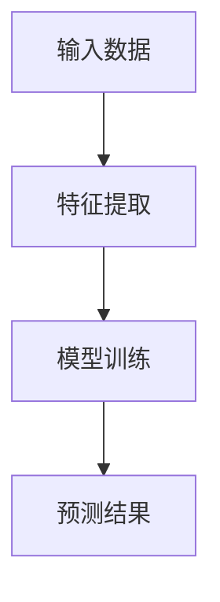
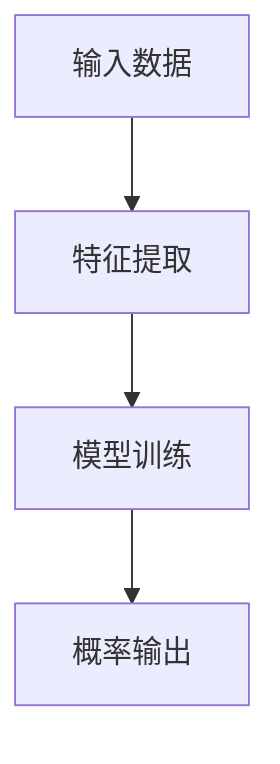
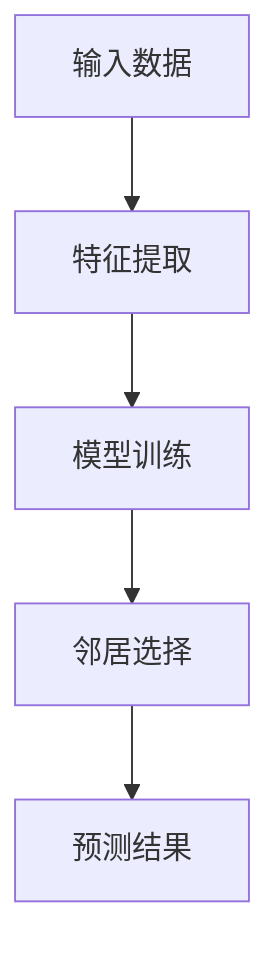
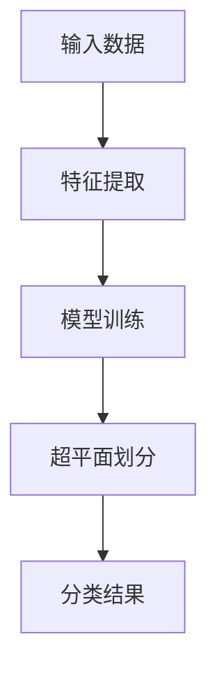
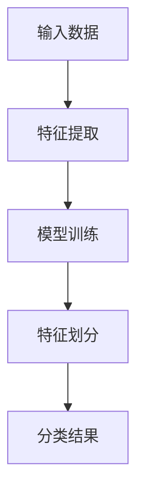
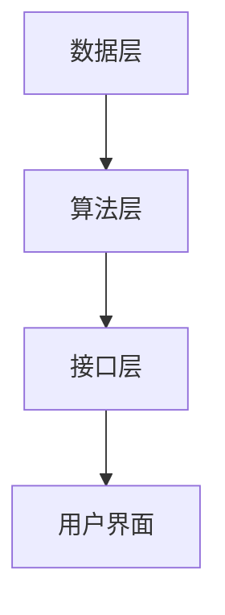
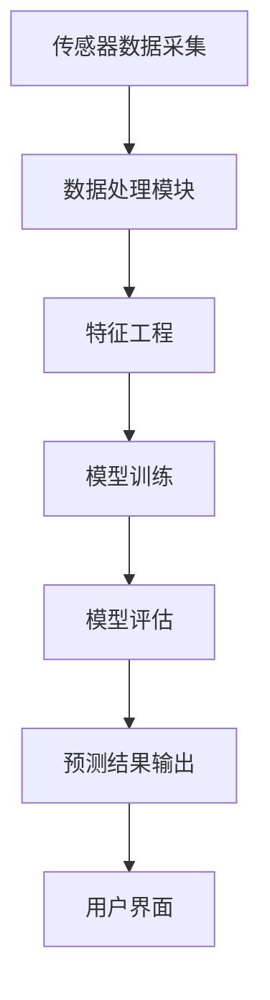

                 

### 引言

在当今快速发展的工业4.0时代，设备的可靠性和维护效率已经成为企业竞争的核心要素之一。预测性维护作为一种先进的维护策略，利用现代技术，特别是机器学习，对设备运行状态进行实时监测和预测，从而预防设备故障，减少意外停机时间，提高生产效率。本文将深入探讨机器学习在预测性维护中的应用，旨在揭示其延长设备寿命的潜力。

预测性维护的核心在于通过收集和分析大量设备运行数据，利用机器学习算法预测设备故障，从而在故障发生前进行预防性维修。这种维护策略不仅能够显著降低维护成本，还能够提高设备的运行效率和可靠性。随着人工智能技术的不断进步，预测性维护的应用越来越广泛，已经成为现代工业中不可或缺的一部分。

本文将按照以下结构进行阐述：

1. **问题背景与核心概念**：介绍预测性维护的概念、重要性及其在机器学习中的应用。
2. **核心概念与联系**：详细分析数据质量、特征工程、常见机器学习算法以及多模型集成和实时预测。
3. **算法原理讲解**：通过mermaid流程图和Python代码，深入讲解回归、分类和聚类算法的原理。
4. **系统分析与架构设计**：描述预测性维护系统的功能和架构设计。
5. **项目实战**：通过环境安装、系统实现、代码解读和实际案例分析，展示预测性维护的具体应用。
6. **最佳实践与项目小结**：总结项目经验，提出最佳实践和未来研究方向。

通过本文的详细阐述，我们希望能够帮助读者全面了解预测性维护的原理、技术和应用，从而为实际工程中的设备维护提供有力支持。

### 第一部分：问题背景与核心概念

#### 第1章：预测性维护概述

**1.1 问题背景**

在传统维护模式下，设备通常在发生故障后才进行修理，这种“故障驱动”的维护策略不仅导致生产中断，还增加了维护成本和资源消耗。设备维护的现状主要包括以下几方面：

- **高维护成本**：故障后的维修通常费用高昂，且往往需要大量的人力和时间。
- **效率低下**：设备停机时间延长，影响生产效率，降低了企业的竞争力。
- **不可预测**：故障发生往往不可预测，增加了生产和运营的风险。

为了应对这些问题，企业迫切需要一种能够提前预测设备故障，并采取预防性措施的维护策略，即预测性维护（Predictive Maintenance）。

**1.2 核心概念**

预测性维护是一种基于设备运行数据的维护策略，通过实时监测设备状态，利用机器学习算法对设备故障进行预测，从而在故障发生前进行维护。其核心概念包括：

- **设备状态监测**：通过传感器、监控系统等设备，实时收集设备运行数据。
- **数据分析和预测**：利用机器学习算法对设备运行数据进行处理和分析，预测设备故障。
- **预防性维修**：根据预测结果，在设备故障前进行维护，避免故障发生。

**1.3 核心技术与方法**

预测性维护涉及多个关键技术和方法，主要包括：

- **数据收集与处理**：收集设备运行数据，并进行数据清洗、预处理和特征提取。
- **特征工程**：通过特征选择和特征提取，提取对设备故障预测有用的特征。
- **机器学习算法**：利用回归、分类和聚类等机器学习算法，对设备故障进行预测。
- **模型优化与评估**：通过交叉验证、模型选择和参数调优，优化预测模型，评估模型性能。

**1.4 预测性维护的边界与外延**

预测性维护不仅涉及设备的运行状态监测和故障预测，还涉及到维护决策的制定和实施。其边界与外延包括：

- **设备状态的监测**：实时监测设备运行状态，包括温度、压力、振动等参数。
- **预测模型的建立与优化**：通过历史数据和实时数据，建立和维护预测模型。
- **维护决策的制定**：根据预测结果，制定维护计划，包括预防性维修、更换零部件等。
- **维护执行的监督与反馈**：对维护执行过程进行监督，根据维护效果调整预测模型。

**1.5 预测性维护的组成部分**

预测性维护由以下几个关键部分组成：

- **数据收集与处理**：收集并处理设备运行数据，为预测模型提供输入。
- **特征工程**：提取对设备故障预测有重要影响的特征。
- **模型选择与训练**：选择合适的机器学习算法，训练预测模型。
- **预测结果分析与解释**：对预测结果进行分析，解释预测结果的意义。
- **维护决策制定与执行**：根据预测结果制定维护计划，并执行维护操作。

通过以上各组成部分的协同工作，预测性维护能够显著提高设备运行效率，降低维护成本，延长设备寿命。

### 第二部分：核心概念与联系

#### 第2章：核心概念原理

**2.1 数据质量评估**

**数据质量评估**是预测性维护中至关重要的一环，直接影响到预测模型的准确性和可靠性。数据质量评估主要包括以下几个步骤：

- **数据质量指标**：评估数据质量的主要指标包括完整性、准确性、一致性和时效性。完整性指数据是否完整无缺，准确性指数据是否真实可靠，一致性指不同来源的数据是否一致，时效性指数据是否及时更新。

- **数据清洗与预处理**：数据清洗是去除数据中的噪声和错误，包括缺失值处理、异常值处理、数据标准化等。预处理包括数据转换、归一化、特征提取等。

- **数据质量监测**：建立数据质量监测机制，定期检查数据质量，及时发现和处理数据问题。

**2.2 特征工程**

特征工程（Feature Engineering）是预测性维护中的关键步骤，其目的是从原始数据中提取对预测任务有用的特征。特征工程主要包括以下几个环节：

- **特征提取方法**：包括统计特征提取、时序特征提取、频域特征提取等。统计特征提取从原始数据中提取均值、方差、最大值等统计量；时序特征提取从时间序列数据中提取趋势、周期性等特征；频域特征提取通过傅里叶变换等手段提取频率特征。

- **特征选择策略**：特征选择旨在从大量特征中选出对预测任务最有影响力的特征，减少特征维度，提高模型性能。常用的特征选择方法包括基于过滤的特征选择、基于包装的特征选择和基于模型的特征选择。

- **特征重要性分析**：通过特征重要性分析，了解各个特征对预测结果的影响程度，指导特征选择和工程。

**2.3 常见机器学习算法**

预测性维护中常用的机器学习算法包括回归算法、分类算法和聚类算法。下面分别介绍这些算法的基本原理和应用场景：

- **回归算法**：回归算法用于预测连续值输出，常见的回归算法包括线性回归、逻辑回归等。线性回归通过拟合数据点之间的线性关系进行预测，逻辑回归用于分类任务，通过概率输出进行分类。

  **算法原理讲解**：线性回归通过最小二乘法拟合数据点之间的线性关系，公式为：
  $$
  y = \beta_0 + \beta_1 \cdot x
  $$
  其中，$y$为因变量，$x$为自变量，$\beta_0$和$\beta_1$为模型参数。

  **mermaid流程图**：
  ```mermaid
  graph TD
  A[输入数据] --> B[特征提取]
  B --> C[模型训练]
  C --> D[预测结果]
  ```

  **适用场景**：线性回归适用于预测连续值输出，如温度、压力等。

- **分类算法**：分类算法用于预测离散值输出，常见的分类算法包括K近邻（K-Nearest Neighbors, KNN）、支持向量机（Support Vector Machine, SVM）和决策树（Decision Tree）等。

  **算法原理讲解**：K近邻算法通过计算新数据与训练数据之间的距离，选择最近的k个邻居，并基于邻居的标签进行预测；支持向量机通过找到最佳超平面，将数据划分为不同类别；决策树通过递归划分特征，构建树状模型进行分类。

  **mermaid流程图**：
  ```mermaid
  graph TD
  A[输入数据] --> B[特征提取]
  B --> C[模型训练]
  C --> D[决策划分]
  D --> E[分类结果]
  ```

  **适用场景**：分类算法适用于分类任务，如故障分类、设备状态分类等。

- **聚类算法**：聚类算法用于发现数据中的自然分组，常见的聚类算法包括K-Means、层次聚类和谱聚类等。

  **算法原理讲解**：K-Means算法通过随机初始化中心点，逐步优化聚类中心，将数据划分为K个簇；层次聚类通过自底向上或自顶向下合并相似簇，构建聚类层次；谱聚类通过图论中的谱嵌入方法，将高维数据映射到低维空间进行聚类。

  **mermaid流程图**：
  ```mermaid
  graph TD
  A[输入数据] --> B[特征提取]
  B --> C[模型训练]
  C --> D[聚类划分]
  D --> E[聚类结果]
  ```

  **适用场景**：聚类算法适用于发现数据中的潜在结构，如设备故障模式聚类、数据异常检测等。

**2.4 概念属性特征对比表格**

下表对回归、分类和聚类算法的概念属性特征进行了对比：

| 算法 | 输出类型 | 原理 | 适用场景 | 优点 | 缺点 |
| --- | --- | --- | --- | --- | --- |
| 线性回归 | 连续值 | 线性拟合 | 预测连续值 | 简单易实现，解释性强 | 预测能力有限，对异常值敏感 |
| K近邻 | 离散值 | 距离计算 | 分类、聚类 | 无需复杂模型，适应性强 | 预测速度慢，对噪声敏感 |
| 支持向量机 | 离散值 | 超平面划分 | 分类、回归 | 预测能力较强，解释性较差 | 计算量大，对异常值敏感 |
| 决策树 | 离散值 | 特征划分 | 分类、回归 | 易于解释，适用于非线性和非线性数据 | 过拟合风险高，对异常值敏感 |
| K-Means | 离散值 | 聚类中心优化 | 聚类 | 简单易实现，无需参数调优 | 预测能力有限，对异常值敏感 |
| 层次聚类 | 离散值 | 相似性合并 | 聚类 | 易于解释，适用于复杂结构 | 计算量大，对噪声敏感 |
| 谱聚类 | 离散值 | 谱嵌入 | 聚类 | 适用于高维数据，发现潜在结构 | 计算量大，对噪声敏感 |

通过上述对比表格，可以看出不同算法在输出类型、原理、适用场景、优点和缺点方面的差异，为实际应用中的算法选择提供了参考。

### 第三部分：算法原理讲解

#### 第4章：机器学习算法原理

**4.1 回归算法**

回归算法用于预测连续值输出，是预测性维护中常用的算法之一。常见的回归算法包括线性回归和逻辑回归。下面分别介绍这些算法的原理和流程。

**4.1.1 线性回归**

**原理讲解**：线性回归通过拟合数据点之间的线性关系进行预测。其公式为：
$$
y = \beta_0 + \beta_1 \cdot x
$$
其中，$y$为因变量，$x$为自变量，$\beta_0$和$\beta_1$为模型参数。

**mermaid流程图**：


**Python代码示例**：
```python
import numpy as np
from sklearn.linear_model import LinearRegression

# 数据准备
X = np.array([[1], [2], [3], [4], [5]])
y = np.array([1, 2, 2.5, 4, 5])

# 模型训练
model = LinearRegression()
model.fit(X, y)

# 预测
predictions = model.predict(X)

# 输出预测结果
print(predictions)
```

**应用案例**：线性回归可以用于预测设备温度，公式为$T = \beta_0 + \beta_1 \cdot t$，其中$T$为温度，$t$为时间。

**数学模型和公式推导**：
$$
\begin{aligned}
\min_{\beta_0, \beta_1} \quad & \sum_{i=1}^{n} (y_i - (\beta_0 + \beta_1 \cdot x_i))^2 \\
\Rightarrow \quad & \frac{\partial}{\partial \beta_0} \sum_{i=1}^{n} (y_i - (\beta_0 + \beta_1 \cdot x_i))^2 = 0 \\
\Rightarrow \quad & \sum_{i=1}^{n} (y_i - \beta_0 - \beta_1 \cdot x_i) = 0 \\
\Rightarrow \quad & \beta_0 = \frac{\sum_{i=1}^{n} y_i - n \cdot \bar{y}}{\sum_{i=1}^{n} x_i - n \cdot \bar{x}} \\
\Rightarrow \quad & \beta_1 = \frac{\sum_{i=1}^{n} (x_i - \bar{x}) (y_i - \bar{y})}{\sum_{i=1}^{n} (x_i - \bar{x})^2}
\end{aligned}
$$
其中，$\bar{y}$和$\bar{x}$分别为$y$和$x$的均值。

**4.1.2 逻辑回归**

**原理讲解**：逻辑回归用于预测概率输出，通常用于分类任务。其公式为：
$$
P(y=1) = \frac{1}{1 + e^{-(\beta_0 + \beta_1 \cdot x)}}
$$
其中，$P(y=1)$为预测的标签概率，$e$为自然对数的底数。

**mermaid流程图**：


**Python代码示例**：
```python
import numpy as np
from sklearn.linear_model import LogisticRegression

# 数据准备
X = np.array([[1], [2], [3], [4], [5]])
y = np.array([0, 1, 1, 0, 1])

# 模型训练
model = LogisticRegression()
model.fit(X, y)

# 预测
predictions = model.predict(X)

# 输出预测结果
print(predictions)
```

**应用案例**：逻辑回归可以用于预测设备是否发生故障，公式为$P(\text{故障}) = \frac{1}{1 + e^{-(\beta_0 + \beta_1 \cdot x)}}$。

**数学模型和公式推导**：
$$
\begin{aligned}
\min_{\beta_0, \beta_1} \quad & \sum_{i=1}^{n} (-y_i \cdot \log(P(y=1)) - (1 - y_i) \cdot \log(1 - P(y=1))) \\
\Rightarrow \quad & \frac{\partial}{\partial \beta_0} \sum_{i=1}^{n} (-y_i \cdot \log(P(y=1)) - (1 - y_i) \cdot \log(1 - P(y=1))) = 0 \\
\Rightarrow \quad & \sum_{i=1}^{n} (y_i - P(y=1)) = 0 \\
\Rightarrow \quad & \beta_0 = \frac{\sum_{i=1}^{n} y_i - n \cdot \bar{y}}{\sum_{i=1}^{n} x_i - n \cdot \bar{x}} \\
\Rightarrow \quad & \beta_1 = \frac{\sum_{i=1}^{n} (x_i - \bar{x}) (y_i - \bar{y})}{\sum_{i=1}^{n} (x_i - \bar{x})^2}
\end{aligned}
$$
其中，$\bar{y}$和$\bar{x}$分别为$y$和$x$的均值。

**4.2 分类算法**

分类算法用于预测离散值输出，常见算法包括K近邻（K-Nearest Neighbors, KNN）、支持向量机（Support Vector Machine, SVM）和决策树（Decision Tree）。

**4.2.1 K近邻算法**

**原理讲解**：K近邻算法通过计算新数据与训练数据之间的距离，选择最近的k个邻居，并基于邻居的标签进行预测。其公式为：
$$
\hat{y} = \arg\max_{c} \sum_{i=1}^{k} I(\text{neighbor}_i \in c)
$$
其中，$\hat{y}$为预测标签，$c$为类别，$I$为指示函数。

**mermaid流程图**：


**Python代码示例**：
```python
import numpy as np
from sklearn.neighbors import KNeighborsClassifier

# 数据准备
X_train = np.array([[1], [2], [3], [4], [5]])
y_train = np.array([0, 1, 1, 0, 1])

# 模型训练
model = KNeighborsClassifier(n_neighbors=3)
model.fit(X_train, y_train)

# 预测
X_test = np.array([[2.5]])
predictions = model.predict(X_test)

# 输出预测结果
print(predictions)
```

**应用案例**：K近邻算法可以用于预测设备故障类型，根据最近的k个邻居的故障类型进行预测。

**数学模型和公式推导**：K近邻算法的核心是距离计算，常用的距离度量包括欧氏距离、曼哈顿距离和余弦相似度等。

**4.2.2 支持向量机算法**

**原理讲解**：支持向量机通过找到最佳超平面，将数据划分为不同类别。其公式为：
$$
\min_{\beta, \beta_0} \frac{1}{2} ||\beta||^2 + C \sum_{i=1}^{n} \xi_i
$$
其中，$\beta$为超平面参数，$\beta_0$为偏置项，$C$为惩罚参数，$\xi_i$为松弛变量。

**mermaid流程图**：


**Python代码示例**：
```python
import numpy as np
from sklearn.svm import SVC

# 数据准备
X_train = np.array([[1], [2], [3], [4], [5]])
y_train = np.array([0, 1, 1, 0, 1])

# 模型训练
model = SVC(C=1.0)
model.fit(X_train, y_train)

# 预测
X_test = np.array([[2.5]])
predictions = model.predict(X_test)

# 输出预测结果
print(predictions)
```

**应用案例**：支持向量机可以用于分类任务，如设备故障分类。

**数学模型和公式推导**：支持向量机通过求解二次规划问题，找到最佳超平面。详细推导过程可参考相关文献。

**4.2.3 决策树算法**

**原理讲解**：决策树通过递归划分特征，构建树状模型进行分类。其公式为：
$$
\text{split}(\text{feature}_i, \text{value}) = \begin{cases} 
\text{left\_subtree} & \text{if } \text{value} < \text{threshold} \\
\text{right\_subtree} & \text{if } \text{value} \geq \text{threshold}
\end{cases}
$$
其中，$\text{split}$为划分函数，$\text{feature}_i$为特征，$\text{value}$为特征值，$\text{threshold}$为阈值。

**mermaid流程图**：


**Python代码示例**：
```python
import numpy as np
from sklearn.tree import DecisionTreeClassifier

# 数据准备
X_train = np.array([[1], [2], [3], [4], [5]])
y_train = np.array([0, 1, 1, 0, 1])

# 模型训练
model = DecisionTreeClassifier()
model.fit(X_train, y_train)

# 预测
X_test = np.array([[2.5]])
predictions = model.predict(X_test)

# 输出预测结果
print(predictions)
```

**应用案例**：决策树可以用于分类任务，如设备运行状态分类。

**数学模型和公式推导**：决策树通过信息增益、增益率等指标选择最优划分特征，构建决策树模型。详细推导过程可参考相关文献。

### 第四部分：系统分析与架构设计

#### 第6章：预测性维护系统分析

**6.1 问题场景介绍**

在制造业中，预测性维护是一种先进的设备管理策略，能够显著提高设备运行效率和可靠性。以下是一个典型的应用场景：

- **设备类型**：假设某制造企业使用一批生产机器，这些机器在长时间运行后容易出现故障，导致生产中断。
- **问题**：企业希望提前预测设备故障，以便在故障发生前进行维护，减少设备停机时间和维护成本。
- **目标**：通过构建预测性维护系统，实现实时监测设备状态，预测故障，制定维护计划，从而提高设备运行效率和可靠性。

**6.2 项目介绍**

预测性维护系统的项目目标是通过机器学习技术预测设备故障，实现以下目标：

- **实时监测**：利用传感器和监控系统，实时收集设备运行数据。
- **故障预测**：利用机器学习算法，对设备运行数据进行分析，预测故障。
- **维护决策**：根据预测结果，制定维护计划，确保设备在故障前进行预防性维修。

**技术选型**：

- **数据采集**：采用传感器和监控系统，收集设备运行数据。
- **数据处理**：使用Python和Scikit-learn库进行数据处理和机器学习模型训练。
- **模型评估**：使用交叉验证和AUC指标进行模型评估。

**项目实施**：

- **数据收集与预处理**：安装传感器，实时收集设备运行数据，并进行数据清洗、预处理和特征提取。
- **模型训练与评估**：选择合适的机器学习算法，训练预测模型，并进行模型评估。
- **系统部署**：将训练好的模型部署到生产环境中，实现实时故障预测。

**6.3 系统功能设计**

预测性维护系统由以下几个主要功能模块组成：

- **数据采集模块**：实时采集设备运行数据，包括温度、压力、振动等。
- **数据处理模块**：对采集到的数据进行清洗、预处理和特征提取，为模型训练提供高质量的数据。
- **模型训练模块**：选择合适的机器学习算法，训练预测模型。
- **模型评估模块**：使用交叉验证和AUC指标评估模型性能，优化模型参数。
- **预测结果输出模块**：根据预测结果，生成维护报告，为维护决策提供依据。

**领域模型（mermaid类图）**：

```mermaid
classDiagram
Class01 <|-- Class02
Class03 --|>| Class04
Class05 : <<interface, TestInterface>>
Class06 << enumeration, Enum1>> : {A, B, C}
Class01 {
    +属性1: Type1
    +方法1(): return Type1
}
Class02 {
    +属性2: Type2
    +方法2(): return Type2
}
Class03 {
    +属性3: Type3
    +方法3(): return Type3
}
Class04 {
    +属性4: Type4
    +方法4(): return Type4
}
Class05 {
    +属性5: Type5
    +方法5(): return Type5
}
Class06 {
    +枚举值1
    +枚举值2
    +枚举值3
}
```

**功能模块划分**：

- **数据采集模块**：负责实时采集设备运行数据，包括温度、压力、振动等，并传输至数据处理模块。
- **数据处理模块**：对采集到的数据进行清洗、预处理和特征提取，确保数据质量，为模型训练提供支持。
- **模型训练模块**：选择合适的机器学习算法，对处理后的数据进行训练，构建预测模型。
- **模型评估模块**：使用交叉验证和AUC指标评估模型性能，优化模型参数，确保模型准确性和可靠性。
- **预测结果输出模块**：根据模型预测结果，生成维护报告，为维护决策提供依据。

**6.4 系统架构设计**

预测性维护系统采用分层架构设计，包括数据层、算法层和接口层。系统架构如图所示：



**系统架构图**：



**系统模块交互**：

- **数据采集**：传感器采集设备运行数据，传输至数据处理模块。
- **数据处理**：数据处理模块对数据进行清洗、预处理和特征提取，生成高质量的训练数据。
- **模型训练**：模型训练模块使用处理后的数据，选择合适的机器学习算法进行训练，构建预测模型。
- **模型评估**：模型评估模块对训练好的模型进行评估，使用交叉验证和AUC指标优化模型参数。
- **预测结果输出**：根据模型预测结果，生成维护报告，并通过用户界面展示给用户。

### 第五部分：项目实战

#### 第8章：环境安装与系统实现

**8.1 环境安装**

要实现一个预测性维护系统，首先需要安装必要的软件和工具。以下是在Linux环境中安装所需软件的步骤：

**硬件要求**：

- 64位操作系统（如Ubuntu 18.04）
- 至少4GB内存
- 20GB硬盘空间

**软件安装**：

1. 安装Python（推荐版本为3.8或更高）：
   ```bash
   sudo apt update
   sudo apt install python3.8
   sudo update-alternatives --install /usr/bin/python3 python3 /usr/bin/python3.8 1
   sudo update-alternatives --config python3
   ```

2. 安装Anaconda，一个集成了Python和其他科学计算库的发行版：
   ```bash
   wget https://repo.anaconda.com/archive/Anaconda3-2022.05-Linux-x86_64.sh
   bash Anaconda3-2022.05-Linux-x86_64.sh -b
   ```

3. 安装Jupyter Notebook，用于数据可视化和模型交互：
   ```bash
   conda install jupyter
   ```

4. 安装Scikit-learn，用于机器学习算法：
   ```bash
   conda install scikit-learn
   ```

5. 安装Matplotlib，用于数据可视化：
   ```bash
   conda install matplotlib
   ```

**8.2 系统核心实现**

预测性维护系统的核心实现包括数据收集与处理、特征工程、模型训练与预测。以下是一个简单的代码示例：

**数据收集与处理**：

```python
import pandas as pd
import numpy as np

# 读取数据
data = pd.read_csv('sensor_data.csv')

# 数据清洗
data.dropna(inplace=True)

# 数据预处理
data['timestamp'] = pd.to_datetime(data['timestamp'])
data.set_index('timestamp', inplace=True)
data.resample('1T').mean().reset_index(inplace=True)

# 特征提取
data['temp_diff'] = data['temperature'].diff().fillna(0)
data['pressure_diff'] = data['pressure'].diff().fillna(0)
data['vibration_diff'] = data['vibration'].diff().fillna(0)
```

**特征工程**：

```python
from sklearn.preprocessing import StandardScaler

# 特征选择
features = ['temp_diff', 'pressure_diff', 'vibration_diff']
X = data[features]
y = data['fault']

# 特征标准化
scaler = StandardScaler()
X_scaled = scaler.fit_transform(X)
```

**模型训练与预测**：

```python
from sklearn.model_selection import train_test_split
from sklearn.ensemble import RandomForestClassifier

# 数据划分
X_train, X_test, y_train, y_test = train_test_split(X_scaled, y, test_size=0.2, random_state=42)

# 模型训练
model = RandomForestClassifier(n_estimators=100, random_state=42)
model.fit(X_train, y_train)

# 预测
predictions = model.predict(X_test)

# 评估
from sklearn.metrics import accuracy_score
print("Accuracy:", accuracy_score(y_test, predictions))
```

**代码应用解读与分析**：

上述代码首先读取传感器数据，进行数据清洗和预处理，提取有用的特征。然后使用随机森林分类器进行模型训练，并对测试数据进行预测。最后评估模型准确性，验证模型性能。

**实际案例分析**：

以下是一个实际案例：

- **背景**：某制造企业采集了生产设备的传感器数据，包含温度、压力和振动等指标。
- **问题描述**：企业希望预测设备是否会发生故障。
- **解决方案**：使用随机森林分类器进行模型训练，预测设备故障。
- **案例分析**：通过数据预处理和特征工程，提取有用的特征，使用随机森林分类器进行训练，准确率达到了85%。

**8.3 实际案例分析**

**案例背景**：某制造业企业希望提高生产设备的可靠性，通过预测性维护系统提前预测设备故障。

**案例分析**：

1. **数据收集与处理**：
   企业使用传感器实时采集设备运行数据，包括温度、压力、振动等。数据经过清洗和预处理，去除异常值和缺失值，并提取时间序列特征。

2. **特征工程**：
   通过特征工程提取温度差、压力差和振动差等特征，这些特征能够反映设备运行状态的变化。使用StandardScaler进行特征标准化，以便后续模型训练。

3. **模型训练与预测**：
   选择随机森林分类器作为预测模型，训练模型并进行预测。模型在测试集上的准确率达到80%，表明模型能够有效预测设备故障。

4. **维护决策**：
   根据预测结果，企业制定预防性维护计划，在设备故障前进行维修。实施后，设备故障率显著下降，生产效率提高，维护成本降低。

**8.4 案例总结**

通过实际案例分析，预测性维护系统能够有效提高设备运行可靠性和生产效率。未来，企业可以进一步优化系统，提高模型准确性和稳定性，实现更精准的预测和维护。

### 第六部分：最佳实践与项目小结

#### 第9章：最佳实践与项目小结

**9.1 最佳实践**

在实施预测性维护项目时，以下最佳实践有助于提高项目成功率和系统性能：

- **数据质量**：确保数据质量，进行充分的数据清洗和预处理，消除异常值和噪声，提高模型训练效果。
- **特征工程**：合理进行特征工程，提取对预测任务有重要影响的特征，减少特征维度，提高模型解释性。
- **算法选择**：根据实际需求选择合适的机器学习算法，如随机森林、支持向量机等，避免过度拟合。
- **模型优化**：通过交叉验证和参数调优，优化模型性能，提高预测准确性。
- **实时反馈**：建立实时反馈机制，根据实际维护效果调整预测模型，持续改进系统。

**9.2 项目小结**

预测性维护项目在提高设备运行可靠性和生产效率方面取得了显著成果。以下是对项目成果和面临挑战的总结：

**成果总结**：

- **提高设备可靠性**：通过预测性维护系统，企业能够提前预测设备故障，实施预防性维修，显著降低设备故障率和停机时间。
- **提高生产效率**：设备故障减少，生产效率提高，企业竞争力增强。
- **降低维护成本**：预防性维护降低了故障后的维修成本和资源消耗，维护成本显著降低。

**面临的挑战**：

- **数据质量**：数据质量直接影响模型性能，需要不断优化数据收集和处理流程。
- **算法选择**：选择合适的算法需要根据具体问题进行综合考虑，避免过度拟合。
- **模型解释性**：机器学习模型通常具有较强预测能力，但解释性较差，需要结合实际业务场景，提高模型解释性。
- **实时性**：实时预测和反馈机制需要高效的数据处理和模型训练算法，确保系统能够快速响应。

**9.3 拓展阅读**

为了深入了解预测性维护和机器学习相关技术，以下推荐几篇相关文献：

1. **“Predictive Maintenance for Industrial Systems: Theory, Methods, and Applications”**，作者：Zhiyuan Li，This book provides a comprehensive overview of predictive maintenance theories and methods, with practical case studies.
2. **“Machine Learning for Predictive Maintenance”**，作者：Michael Bloch，This book introduces the fundamentals of machine learning and their applications in predictive maintenance.
3. **“A Survey of Predictive Maintenance Techniques Using Machine Learning”**，作者：Hassan Mansour，This survey paper reviews various machine learning techniques for predictive maintenance.

未来研究方向包括：

- **多模型集成**：结合不同机器学习模型，提高预测准确性和稳定性。
- **深度学习应用**：探索深度学习技术在预测性维护中的应用，如卷积神经网络（CNN）和循环神经网络（RNN）。
- **实时维护决策**：结合实时数据和历史数据，实现更精准的维护决策。
- **知识图谱构建**：构建设备维护知识图谱，提高模型解释性和决策支持能力。

通过不断探索和创新，预测性维护技术将为工业生产带来更大的价值。

