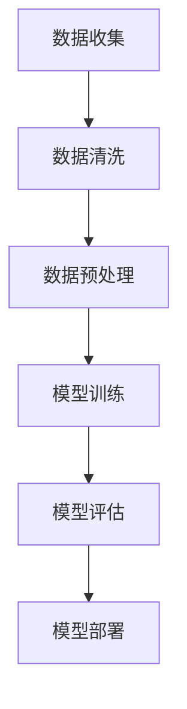

                 

# 构建prompt工程的端到端自动化流水线

## 摘要

本文将深入探讨如何构建prompt工程的端到端自动化流水线。首先，我们将介绍prompt工程的概念及其在人工智能领域的重要性。接着，我们将详细分析数据准备、模型选择与调优、以及自动化流水线设计等核心要素。此外，本文还将通过实际案例解析，展示如何实现prompt工程的自动化流水线，并总结经验教训，展望未来发展趋势。通过本文的阅读，读者将能够全面了解prompt工程自动化流水线的构建方法，为实际项目提供有价值的参考。

## 目录大纲

1. 引言
   1.1 问题的提出
   1.2 问题描述
   1.3 问题解决
   1.4 边界与外延
   1.5 概念结构与核心要素组成

2. prompt工程基础
   2.1 prompt工程的概念与作用
   2.2 prompt工程的核心要素
   2.3 prompt工程的构建流程

3. 数据准备
   3.1 数据来源
   3.2 数据清洗
   3.3 数据预处理

4. 模型选择与调优
   4.1 模型选择
   4.2 模型调优

5. 自动化流水线设计
   5.1 自动化流水线概述
   5.2 自动化流水线设计

6. 自动化流水线实现
   6.1 工具选择
   6.2 实现步骤

7. 实际案例解析
   7.1 案例背景
   7.2 案例分析
   7.3 案例总结

8. 小结与展望
   8.1 小结
   8.2 展望

---

### 1. 引言

在现代人工智能（AI）领域，prompt工程已经成为了一个重要的研究方向。随着深度学习技术的快速发展，prompt工程在自然语言处理（NLP）、计算机视觉（CV）和其他领域取得了显著的成果。然而，构建一个高效的prompt工程不仅需要深入的理论知识，还需要一套完善的自动化流水线来确保工程的可重复性和高效性。

#### 1.1 问题的提出

在实际应用中，prompt工程的构建通常面临以下几个问题：

- **数据质量**：数据是机器学习的基石，然而，数据质量往往参差不齐，需要进行预处理和清洗。
- **模型选择**：不同的模型适用于不同的任务，如何选择合适的模型成为了关键问题。
- **模型调优**：模型参数的调优对模型的性能有重要影响，但调优过程往往复杂且耗时。
- **自动化流程**：人工干预不仅效率低下，还容易引入错误，如何构建自动化流水线来提高工作效率成为了迫切需求。

#### 1.2 问题描述

prompt工程的核心目标是利用外部提示信息（prompt）来增强模型的性能和泛化能力。具体来说，prompt工程包括以下步骤：

1. 数据准备：从各种数据源收集数据，并进行清洗和预处理。
2. 模型选择：根据任务需求选择合适的模型。
3. 模型调优：调整模型参数，以优化模型的性能。
4. 自动化流水线设计：构建自动化流程，以确保工程的可重复性和高效性。

#### 1.3 问题解决

为了解决上述问题，我们需要采取以下策略：

1. **数据质量保障**：引入数据质量管理工具和流程，确保数据清洗和预处理的准确性和效率。
2. **模型选择优化**：使用元学习（meta-learning）和模型评估工具来辅助模型选择。
3. **模型调优自动化**：利用自动化调优工具和算法，如贝叶斯优化（Bayesian optimization）和遗传算法（Genetic algorithm）。
4. **自动化流水线构建**：使用自动化工具和平台，如Apache Airflow和Kubeflow，来构建端到端的自动化流水线。

#### 1.4 边界与外延

prompt工程的边界主要包括以下方面：

- **数据源**：包括公共数据集、企业内部数据、社交媒体等。
- **任务类型**：文本分类、情感分析、图像识别等。
- **模型类型**：传统的机器学习模型、深度学习模型、强化学习模型等。

外延方面，prompt工程还涉及到以下领域：

- **数据预处理**：数据清洗、数据转换、特征提取等。
- **模型评估**：准确率、召回率、F1分数等指标。
- **模型部署**：模型导出、模型服务化、模型监控等。

#### 1.5 概念结构与核心要素组成

prompt工程的核心概念和要素组成如下：

- **数据准备**：包括数据收集、数据清洗、数据预处理等。
- **模型选择**：根据任务需求和模型特性进行选择。
- **模型调优**：调整模型参数，优化模型性能。
- **自动化流水线**：包括数据流、任务流、接口设计等。

接下来，我们将深入探讨prompt工程的基础知识和核心要素，为构建端到端的自动化流水线打下坚实的基础。

---

### 2. prompt工程基础

#### 2.1 prompt工程的概念与作用

prompt工程，即在机器学习和深度学习领域，利用外部提示信息（prompt）来增强模型性能和泛化能力的一门技术。prompt的概念起源于自然语言处理（NLP）领域，后来逐渐扩展到计算机视觉（CV）和其他人工智能（AI）应用中。prompt工程的目标是通过设计合适的提示信息，引导模型更好地理解和处理输入数据，从而提高模型的性能和适用范围。

prompt在AI中的应用非常广泛。例如，在文本分类任务中，通过设计有效的prompt，可以显著提高模型对分类任务的准确率和泛化能力。在图像识别任务中，prompt可以帮助模型更好地理解和分类图像内容。此外，prompt工程还在生成对抗网络（GAN）、强化学习等领域中发挥了重要作用。

#### 2.2 prompt工程的核心要素

prompt工程的核心要素包括数据准备、模型选择和模型调优等，下面我们将逐一介绍。

##### 2.2.1 数据准备

数据准备是prompt工程的基础，其质量直接影响模型的性能。数据准备主要包括以下步骤：

1. **数据收集**：从各种数据源（如公共数据集、企业内部数据、社交媒体等）收集数据。
2. **数据清洗**：去除噪声数据、填补缺失值、去除重复数据等。
3. **数据预处理**：包括数据标准化、归一化、特征提取等操作。

数据准备的关键是确保数据的质量和一致性，从而为模型训练提供可靠的数据基础。

##### 2.2.2 模型选择

模型选择是prompt工程中的关键步骤，不同类型的任务需要选择合适的模型。常见的模型类型包括：

1. **传统机器学习模型**：如决策树、支持向量机（SVM）、朴素贝叶斯等。
2. **深度学习模型**：如卷积神经网络（CNN）、循环神经网络（RNN）、变换器（Transformer）等。
3. **强化学习模型**：如深度确定性策略梯度（DDPG）、异步优势演员-评论家（A3C）等。

选择模型时需要考虑任务的需求、数据的特点以及模型的性能等。

##### 2.2.3 模型调优

模型调优是提高模型性能的重要手段。模型调优主要包括以下步骤：

1. **参数调整**：调整模型参数，如学习率、正则化参数等。
2. **超参数调优**：选择合适的超参数，如网络结构、训练批次大小等。
3. **交叉验证**：使用交叉验证方法来评估模型性能，并进行调优。

模型调优的关键是找到最优的参数组合，从而提高模型的准确率和泛化能力。

##### 2.3 prompt工程的构建流程

prompt工程的构建流程可以分为以下几个步骤：

1. **需求分析**：明确任务需求，包括数据类型、任务类型等。
2. **数据准备**：收集并清洗数据，进行预处理。
3. **模型选择**：根据任务需求和数据特点选择合适的模型。
4. **模型调优**：调整模型参数，优化模型性能。
5. **自动化流水线设计**：构建自动化流水线，实现数据的自动处理和模型的自动训练。
6. **模型评估**：使用交叉验证等方法评估模型性能。
7. **模型部署**：将模型部署到生产环境中，进行实际应用。

通过以上步骤，可以构建一个高效的prompt工程，从而实现人工智能任务的自动化和高效化。

#### 2.4 prompt工程的优点与挑战

prompt工程具有以下优点：

- **提高模型性能**：通过设计有效的prompt，可以显著提高模型的性能和泛化能力。
- **降低开发成本**：自动化流水线的构建可以降低开发成本，提高工作效率。
- **易于维护**：自动化流水线的维护和管理相对简单，降低维护成本。

然而，prompt工程也面临一些挑战：

- **数据质量要求高**：数据准备和质量保障是prompt工程成功的关键，数据质量直接影响模型的性能。
- **模型选择和调优复杂**：不同任务和模型需要不同的选择和调优策略，复杂度高。
- **自动化工具选择困难**：市场上自动化工具繁多，选择合适的工具需要深入研究和实践。

总之，prompt工程在人工智能领域具有重要的应用价值，但同时也面临一系列挑战，需要不断探索和优化。

---

### 3. 数据准备

在构建prompt工程时，数据准备是至关重要的环节，它决定了后续模型训练和调优的效果。数据准备主要包括数据来源、数据清洗和数据预处理等步骤。

#### 3.1 数据来源

数据来源是数据准备的第一步，其决定了数据的质量和数量。常见的数据来源包括：

1. **公共数据集**：如MNIST、IMDB、COCO等，这些数据集通常被广泛使用，并且具有较高的质量。
2. **企业内部数据**：包括用户行为数据、交易数据、产品数据等，这些数据通常具有很高的价值，但需要处理隐私和数据保护问题。
3. **社交媒体**：如Twitter、Facebook等，这些数据通常包含大量的用户生成内容，可以用于文本分类、情感分析等任务。
4. **第三方数据服务**：如 Kaggle、DataCamp 等，这些平台提供丰富的数据集和数据分析工具。

在数据收集过程中，需要注意以下几个方面：

- **数据质量和完整性**：确保数据来源可靠，数据质量高，且数据完整性良好。
- **数据权限和合规性**：处理敏感数据时，需要遵守相关法律法规和数据保护政策。
- **数据收集工具**：使用合适的工具（如Web爬虫、API接口等）来高效地收集数据。

#### 3.2 数据清洗

数据清洗是数据准备的关键步骤，其目的是去除噪声数据、填补缺失值、去除重复数据等，以确保数据的质量和一致性。常见的数据清洗方法包括：

1. **去除噪声数据**：去除包含错误、模糊不清、无关的信息。
2. **填补缺失值**：使用合适的策略（如平均值、中位数、众数等）来填补缺失值，或者删除缺失值较多的数据。
3. **去除重复数据**：删除重复的数据项，以避免对模型训练造成干扰。
4. **数据规范化**：将数据转化为统一的格式，如文本数据编码为字符串、数值数据归一化等。

数据清洗的方法和工具：

- **手动清洗**：对于小规模的数据集，可以使用手动清洗的方法，如Excel、Notepad++等。
- **自动化清洗工具**：如Pandas、SciPy等，这些工具可以高效地处理大规模数据清洗任务。

#### 3.3 数据预处理

数据预处理是数据准备的最后一步，其目的是将清洗后的数据进行转换和特征提取，以适应模型训练的需求。常见的数据预处理方法包括：

1. **数据标准化和归一化**：将数据缩放到一个统一的范围，如[0, 1]或[-1, 1]，以提高模型的训练效率和性能。
2. **特征提取**：从原始数据中提取有用的特征，如文本数据中的词频、TF-IDF等，图像数据中的颜色直方图、边缘检测等。
3. **数据分割**：将数据划分为训练集、验证集和测试集，以评估模型的性能和泛化能力。

数据预处理的工具和库：

- **Python库**：如NumPy、Pandas、SciPy等，这些库提供了丰富的数据预处理功能。
- **机器学习框架**：如TensorFlow、PyTorch等，这些框架可以方便地进行数据预处理和模型训练。

通过以上数据准备步骤，我们可以确保数据的质量和一致性，为后续的模型训练和调优提供可靠的数据基础。

---

### 4. 模型选择与调优

在构建prompt工程时，模型选择与调优是至关重要的环节。模型的选择决定了工程的基本性能，而模型调优则进一步优化了模型的表现。以下是模型选择与调优的详细过程。

#### 4.1 模型选择

模型选择是prompt工程中的关键步骤，不同的模型适用于不同的任务，选择合适的模型可以提高模型的性能。以下是一些常见的模型类型：

1. **传统机器学习模型**：如线性回归、决策树、支持向量机（SVM）、朴素贝叶斯等。这些模型结构简单，易于实现，适用于一些简单的预测任务。
2. **深度学习模型**：如卷积神经网络（CNN）、循环神经网络（RNN）、变换器（Transformer）等。这些模型在处理复杂数据和任务时具有出色的性能。
3. **强化学习模型**：如深度确定性策略梯度（DDPG）、异步优势演员-评论家（A3C）等。这些模型适用于需要决策和策略优化的任务。

在选择模型时，需要考虑以下几个因素：

- **任务类型**：不同类型的任务需要不同的模型。例如，图像识别任务通常使用CNN，而文本分类任务则更适合使用RNN或Transformer。
- **数据特点**：数据的特点（如数据量、数据分布等）也会影响模型的选择。例如，对于小数据集，传统机器学习模型可能更加适用；对于大数据集，深度学习模型可能更具优势。
- **计算资源**：模型的训练和调优需要计算资源。某些复杂模型（如大型深度网络）可能需要更多的计算资源，这需要根据实际情况进行权衡。

模型选择的方法：

- **交叉验证**：通过将数据集划分为训练集和验证集，对不同的模型进行训练和验证，选择性能最优的模型。
- **模型评估指标**：根据任务的需求，选择合适的评估指标，如准确率、召回率、F1分数、均方误差（MSE）等，评估模型的性能。
- **模型比较工具**：如Sklearn中的`compare_benchmarks.py`，可以快速比较不同模型的性能。

#### 4.2 模型调优

模型调优是提高模型性能的重要手段。通过调整模型参数和超参数，可以优化模型的表现。以下是一些常见的模型调优方法：

1. **网格搜索（Grid Search）**：通过遍历所有可能的参数组合，选择最优的参数组合。这种方法计算量大，适用于参数较少的情况。
2. **贝叶斯优化（Bayesian Optimization）**：基于贝叶斯统计模型，通过多次试验和迭代，寻找最优的参数组合。这种方法计算效率高，适用于参数较多的情况。
3. **遗传算法（Genetic Algorithm）**：通过模拟自然进化过程，迭代优化参数组合。这种方法具有较强的全局搜索能力。

模型调优的步骤：

1. **确定调优目标**：明确要优化的指标，如准确率、召回率等。
2. **选择调优方法**：根据实际情况选择合适的调优方法，如网格搜索、贝叶斯优化、遗传算法等。
3. **设置调优参数**：设置调优的超参数，如搜索空间、迭代次数等。
4. **执行调优过程**：运行调优算法，生成参数组合，并评估模型的性能。
5. **选择最优参数**：根据评估结果，选择最优的参数组合。

在实际应用中，模型选择与调优通常需要多次迭代和调整。通过不断优化模型参数，可以提高模型的性能和泛化能力，从而实现更好的预测效果。

---

### 5. 自动化流水线设计

自动化流水线（Automation Pipeline）是现代人工智能项目中的一个核心组成部分，它能够显著提高数据处理和模型训练的效率，减少人为错误，并确保一致性。在构建prompt工程时，设计一个高效、可靠的自动化流水线是至关重要的。以下是自动化流水线设计的关键步骤和原则。

#### 5.1 自动化流水线概述

自动化流水线是一个有序的、自动执行的任务序列，它负责从数据收集、数据预处理、模型训练到模型评估和部署的整个过程。一个典型的自动化流水线包括以下几个主要组件：

1. **数据收集模块**：负责从不同的数据源收集数据，如数据库、文件系统、外部API等。
2. **数据预处理模块**：对收集到的数据进行清洗、转换和格式化，以适应模型训练的需求。
3. **模型训练模块**：使用预处理后的数据训练模型，并根据需要调整模型参数。
4. **模型评估模块**：评估模型的性能，通过交叉验证等方法确定模型的泛化能力。
5. **模型部署模块**：将训练好的模型部署到生产环境中，进行实际应用。

自动化流水线的目的是将整个数据处理和模型训练过程自动化，从而提高工作效率和模型质量。

#### 5.2 自动化流水线设计

设计自动化流水线时，需要考虑以下几个方面：

1. **数据流设计**：定义数据在流水线中的流动路径，包括数据收集、预处理、训练和评估等步骤。
2. **任务流设计**：定义流水线中各个任务的执行顺序和依赖关系，确保任务之间的正确性和一致性。
3. **接口设计**：设计不同模块之间的接口，确保数据在模块之间的传递和转换顺利进行。
4. **监控和告警**：实现流水线的监控和告警机制，及时发现和处理异常情况。

以下是自动化流水线设计的具体步骤：

1. **需求分析**：明确项目需求，包括数据类型、处理流程、模型类型等。
2. **流程设计**：根据需求设计数据流和任务流，确保流水线的合理性和高效性。
3. **模块划分**：将流水线划分为不同的模块，如数据收集、数据预处理、模型训练等。
4. **接口设计**：设计模块之间的接口，定义数据格式和传输协议。
5. **工具选择**：选择合适的工具和平台（如Apache Airflow、Kubeflow等）来构建和运行流水线。
6. **测试和优化**：对流水线进行测试和优化，确保其稳定性和性能。

#### 5.3 流程图与自动化工具

为了更好地设计自动化流水线，可以使用流程图（Process Flowchart）来可视化整个流程，并使用自动化工具来构建和运行流水线。以下是一个简单的自动化流水线流程图：



在这个流程图中，数据收集模块从数据源获取数据，然后经过数据清洗和预处理模块，最后进入模型训练和评估模块。训练好的模型将被部署到生产环境中。

在实际应用中，可以使用如Apache Airflow或Kubeflow等自动化工具来构建和运行流水线。这些工具提供了丰富的功能，如任务调度、依赖管理、监控告警等，能够大大提高流水线的效率和可靠性。

#### 5.4 流水线优化的策略

为了确保流水线的效率和可靠性，可以采取以下优化策略：

1. **并行处理**：对于可以并行处理的任务，采用并行处理策略，提高整体处理速度。
2. **缓存策略**：使用缓存策略，避免重复处理已经处理过的数据，提高数据处理效率。
3. **资源分配**：根据任务的需求和资源情况，合理分配计算资源，确保流水线的稳定运行。
4. **监控与告警**：实时监控流水线的运行状态，及时发现和处理异常情况，确保流水线的稳定性。

通过以上设计原则和优化策略，可以构建一个高效、可靠的自动化流水线，为prompt工程的构建提供强有力的支持。

---

### 6. 自动化流水线实现

在完成自动化流水线的设计之后，我们需要选择合适的工具来实现这一流水线。本文将介绍如何使用Apache Airflow和Kubeflow等工具来搭建和运行自动化流水线。

#### 6.1 工具选择

在众多自动化流水线工具中，Apache Airflow和Kubeflow是两款广泛使用的开源工具。

**Apache Airflow**

Apache Airflow是一个基于Python的自动化工作流管理系统，它提供了丰富的功能，如任务调度、依赖管理、监控告警等。Airflow支持多种数据源和任务执行环境，可以轻松集成各种数据处理和模型训练任务。

**Kubeflow**

Kubeflow是一个基于Kubernetes的开源机器学习平台，它提供了用于构建、部署和管理机器学习工作负载的工具和组件。Kubeflow的核心是Kubeflow Pipelines，它允许用户在Kubernetes集群中定义和运行复杂的机器学习流水线。

**选择理由**

- **灵活性**：Apache Airflow和Kubeflow都提供了高度的灵活性，可以满足各种复杂的工作流需求。
- **可扩展性**：两者都支持大规模集群环境，具有良好的可扩展性。
- **社区支持**：两个项目都有强大的社区支持，提供了丰富的文档和资源。
- **生态系统**：两者都与主流的机器学习和数据科学库（如TensorFlow、PyTorch等）具有良好的集成。

#### 6.2 实现步骤

**环境配置**

1. **安装Python环境**：确保Python环境已经安装，并设置好pip和virtualenv等工具。
2. **安装Apache Airflow**：使用pip安装Airflow，命令如下：
   ```bash
   pip install apache-airflow
   ```
3. **安装Kubeflow**：在Kubernetes集群中安装Kubeflow，具体步骤请参考官方文档。

**Apache Airflow搭建**

1. **创建Airflow集群**：使用Airflow提供的内置命令创建集群：
   ```bash
   airflow create_dagbag
   ```
2. **配置Airflow**：编辑`airflow.cfg`文件，配置数据库、任务执行器等参数。
3. **启动Airflow服务**：使用以下命令启动Airflow Web界面和后台服务：
   ```bash
   airflow webserver -p 8080
   airflow scheduler
   ```

**Kubeflow流水线搭建**

1. **创建Kubeflow组件**：使用kubectl创建Kubeflow所需的组件，如Pipeline、Job等。
2. **定义流水线**：在Kubeflow Pipeline中定义流水线，使用Python或JSON格式描述任务流。
3. **部署流水线**：使用kubectl部署流水线，确保其在Kubernetes集群中正常运行。

**流水线运行与测试**

1. **运行流水线**：使用Airflow Web界面或Kubeflow Pipeline API启动流水线。
2. **监控流水线**：实时监控流水线的运行状态，确保任务按预期执行。
3. **测试与优化**：对流水线进行测试，验证其功能是否正常，并根据需要进行优化。

通过以上步骤，我们可以实现一个高效的自动化流水线，从而为prompt工程的构建提供强有力的支持。

---

### 7. 实际案例解析

#### 7.1 案例背景

假设我们正在开发一个智能客服系统，该系统需要能够自动处理用户的咨询问题，并提供准确的答案。为了实现这一目标，我们需要构建一个prompt工程，该工程将包括数据准备、模型训练和模型部署等步骤。在本案例中，我们将使用一个公开的客服对话数据集，并通过构建自动化流水线来提高工程效率。

#### 7.2 案例分析

**7.2.1 数据准备**

1. **数据来源**：我们从公开数据集（如Kaggle上的Customer Support Ticket Data）中获取了客服对话数据。
2. **数据清洗**：对数据集进行清洗，去除重复的记录、缺失的数据，并处理文本中的噪声信息。
3. **数据预处理**：将文本数据转换为适合模型训练的格式，包括分词、词性标注、去除停用词等。

**7.2.2 模型选择与调优**

1. **模型选择**：由于这是一个文本分类问题，我们选择了Transformer模型（如BERT）。
2. **模型调优**：使用贝叶斯优化（Bayesian Optimization）来调整模型的超参数，如学习率、批量大小等，以优化模型性能。
3. **交叉验证**：使用交叉验证方法评估模型的性能，确保其具有良好的泛化能力。

**7.2.3 流水线设计**

1. **数据流设计**：设计数据从数据源到数据预处理、模型训练和模型评估的流程。
2. **任务流设计**：定义任务之间的依赖关系，确保数据流的正确性和一致性。
3. **接口设计**：设计数据在各个模块之间的传输接口，确保数据的准确传递。

**7.2.4 流水线实现**

1. **环境配置**：配置Apache Airflow和Kubeflow环境，确保其可以正常运行。
2. **流水线搭建**：使用Apache Airflow搭建数据流和任务流，并使用Kubeflow定义模型训练和评估任务。
3. **测试与优化**：运行流水线，验证其功能是否正常，并根据需要进行优化。

**7.2.5 案例总结**

通过本案例，我们成功构建了一个基于Transformer模型的智能客服系统。自动化流水线的使用大大提高了数据处理和模型训练的效率，确保了工程的一致性和可重复性。以下是本案例的经验和教训：

**经验**

- **数据清洗和预处理**：数据质量直接影响模型性能，因此需要投入足够的时间和资源进行数据清洗和预处理。
- **模型调优**：使用自动化调优工具可以显著提高模型性能，减少人工干预。
- **自动化流水线**：自动化流水线提高了工作效率，降低了错误率，是构建高效工程的重要手段。

**教训**

- **监控和告警**：在流水线运行过程中，需要实时监控其状态，及时处理异常情况。
- **版本控制**：对流水线中的代码和配置文件进行版本控制，确保可追溯性和可维护性。
- **资源分配**：合理分配计算资源，避免资源不足或浪费。

通过以上经验和教训，我们可以更好地构建和优化prompt工程，为实际应用提供可靠的支持。

---

### 8. 小结与展望

本文详细探讨了如何构建prompt工程的端到端自动化流水线。我们从问题的提出、问题描述、问题解决等方面入手，深入分析了prompt工程的概念、数据准备、模型选择与调优、自动化流水线设计等核心要素。通过实际案例解析，我们展示了自动化流水线在prompt工程中的应用和效果。

#### 8.1 小结

- **问题背景**：随着AI技术的发展，prompt工程在各个领域取得了显著成果，但构建高效prompt工程面临诸多挑战。
- **核心概念**：prompt工程包括数据准备、模型选择与调优、自动化流水线设计等核心要素。
- **解决方案**：通过设计自动化流水线，可以提高数据处理和模型训练的效率，确保工程的一致性和可重复性。

#### 8.2 重点与难点

- **数据准备**：数据质量对模型性能至关重要，数据清洗和预处理是关键步骤。
- **模型选择与调优**：选择合适的模型和优化策略是提高模型性能的关键，需要根据任务需求和数据特点进行选择。
- **自动化流水线设计**：自动化流水线的构建需要考虑数据流、任务流、接口设计等多个方面，确保流程的高效和可靠。

#### 8.3 展望

- **未来发展趋势**：随着AI技术的不断进步，prompt工程将在更多领域得到应用，如自然语言处理、计算机视觉、强化学习等。
- **拓展领域**：prompt工程可以拓展到智能推荐、自动驾驶、医疗诊断等领域，为这些领域提供强大的支持。

总之，构建prompt工程的端到端自动化流水线是一项复杂而富有挑战性的工作，但通过合理的设计和优化，我们可以实现高效、可靠的工程流程，为AI应用提供强有力的支持。

### 作者信息

作者：AI天才研究院/AI Genius Institute & 禅与计算机程序设计艺术 /Zen And The Art of Computer Programming

---

在未来的发展中，prompt工程将继续在人工智能领域发挥重要作用。随着技术的不断进步，我们有望看到更多创新性的prompt工程应用，为各行各业带来深刻的变革。同时，我们也应关注自动化流水线技术的发展，不断优化和提升工程的效率和可靠性。让我们共同期待人工智能领域的美好未来。

