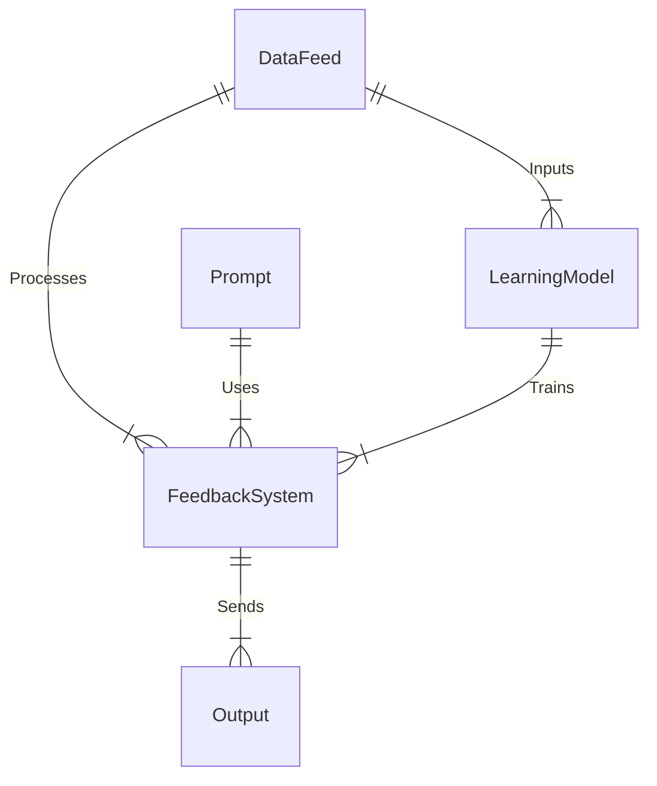
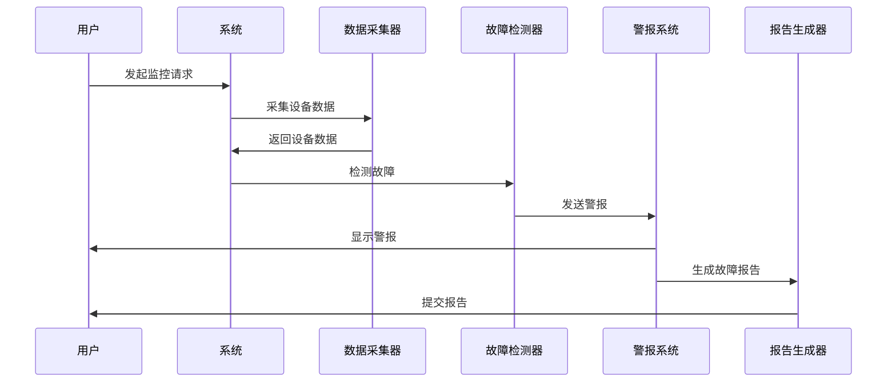

                 

# 构建prompt效果的实时反馈系统

## 关键词
- 实时反馈系统
- Prompt效果
- 深度学习
- 自然语言处理
- 系统设计
- 算法原理

## 摘要
本文将深入探讨如何构建一个具备prompt效果的实时反馈系统。我们将首先定义实时反馈系统和prompt效果，然后逐步分析其核心原理和设计原则。接下来，我们将介绍系统开发流程，并通过具体案例展示系统的实际应用。最后，我们将总结最佳实践，并展望实时反馈系统的未来发展趋势。

## 第一部分：背景与概述

### 第1章：实时反馈系统的概念与重要性

#### 1.1 实时反馈系统的定义
实时反馈系统是一种能够在事件发生的同时提供反馈的系统。它通常用于监控、控制或优化实时过程的参数。

#### 1.2 实时反馈系统在各个领域中的应用
实时反馈系统广泛应用于工业自动化、医疗监控、金融交易、智能交通等领域。

#### 1.3 实时反馈系统与传统反馈系统的比较
与传统反馈系统相比，实时反馈系统具备更快响应速度和更高准确性。

### 第2章：prompt效果的原理与实现

#### 2.1 prompt效果的概述
Prompt效果是指通过提供外部提示信息，增强系统决策或学习效果的现象。

#### 2.2 prompt效果的核心原理
Prompt效果的核心原理是基于人类大脑对外部信息的处理机制，通过提示信息引导系统决策过程。

#### 2.3 实现prompt效果的技术手段
实现prompt效果的技术手段包括自然语言处理、机器学习算法和深度学习网络等。

### 第3章：实时反馈系统的设计原则与架构

#### 3.1 实时反馈系统的设计原则
设计实时反馈系统时，应遵循响应速度、准确性和可靠性等原则。

#### 3.2 实时反馈系统的架构设计
实时反馈系统通常采用模块化设计，包括数据采集、处理、存储和反馈等模块。

#### 3.3 系统性能优化与容错处理
系统性能优化和容错处理是确保实时反馈系统稳定运行的关键。

### 第4章：实时反馈系统的开发流程

#### 4.1 开发环境准备
准备适合实时反馈系统开发的编程语言、工具和开发环境。

#### 4.2 系统模块划分与设计
根据实时反馈系统的功能需求，划分系统模块并设计各模块的功能。

#### 4.3 系统核心代码实现
实现实时反馈系统的核心功能，包括数据采集、处理和反馈等。

### 第5章：实时反馈系统的测试与评估

#### 5.1 测试策略与方法
制定合理的测试策略和方法，对实时反馈系统进行功能测试和性能评估。

#### 5.2 系统性能评估指标
确定系统性能评估指标，如响应时间、准确率和可靠性等。

#### 5.3 测试结果分析与优化
对实时反馈系统的测试结果进行分析，并提出优化措施。

## 第二部分：具体实现与案例

### 第6章：基于深度学习的实时反馈系统

#### 6.1 深度学习在实时反馈系统中的应用
深度学习在实时反馈系统中的应用，如图像识别、语音识别等。

#### 6.2 深度学习模型的构建
构建深度学习模型，包括卷积神经网络（CNN）、循环神经网络（RNN）等。

#### 6.3 案例分析：实时图像识别反馈系统
分析一个实时图像识别反馈系统的实际案例，包括系统架构、核心代码和测试结果。

### 第7章：prompt效果在自然语言处理中的应用

#### 7.1 自然语言处理中的prompt效果
介绍prompt效果在自然语言处理中的应用，如文本分类、机器翻译等。

#### 7.2 prompt效果在对话系统中的应用
探讨prompt效果在对话系统中的应用，如智能客服、聊天机器人等。

#### 7.3 案例分析：实时对话反馈系统
分析一个实时对话反馈系统的实际案例，包括系统架构、核心代码和测试结果。

### 第8章：实时反馈系统的部署与运维

#### 8.1 系统部署策略
介绍实时反馈系统的部署策略，如容器化、云部署等。

#### 8.2 系统运维与监控
介绍实时反馈系统的运维与监控方法，如日志分析、性能监控等。

#### 8.3 案例分析：实时反馈系统的运维实践
分析一个实时反馈系统的实际运维案例，包括运维策略、监控方法和问题解决。

## 第三部分：总结与拓展

### 第9章：未来展望与挑战

#### 9.1 实时反馈系统的未来发展趋势
探讨实时反馈系统的未来发展趋势，如边缘计算、5G技术等。

#### 9.2 技术挑战与解决方案
分析实时反馈系统面临的技术挑战，并提出相应的解决方案。

#### 9.3 潜在应用场景与展望
展望实时反馈系统在各个领域的潜在应用场景和未来发展方向。

### 第10章：最佳实践与注意事项

#### 10.1 最佳实践总结
总结实时反馈系统的最佳实践经验。

#### 10.2 常见问题与解决方案
分析实时反馈系统开发过程中常见的的问题，并提出解决方案。

#### 10.3 注意事项与安全考虑
介绍实时反馈系统开发中的注意事项和安全考虑。

### 第11章：拓展阅读与进一步学习

#### 11.1 推荐读物
推荐与实时反馈系统相关的经典读物和资料。

#### 11.2 在线课程与教程
推荐与实时反馈系统相关的在线课程和教程。

#### 11.3 学术研究前沿
介绍实时反馈系统领域的最新学术研究动态和前沿技术。

### 第12章：附录

#### 12.1 术语表
列出与实时反馈系统和prompt效果相关的术语及其定义。

#### 12.2 参考文献
列出本文引用的参考文献。

#### 12.3 实验数据集
介绍本文使用的实验数据集及其来源。

## 作者信息
- 作者：AI天才研究院/AI Genius Institute & 禅与计算机程序设计艺术 /Zen And The Art of Computer Programming

---

### 引言

实时反馈系统在当今信息化社会中扮演着愈发重要的角色。随着人工智能技术的不断发展，实时反馈系统不仅能够提高生产效率、优化资源分配，还能够为用户提供更智能化的服务。本文将围绕实时反馈系统中一个至关重要的特性——prompt效果，探讨其原理、实现和应用。

所谓prompt效果，即通过提供外部提示信息，提升系统决策或学习效果的现象。在实时反馈系统中，prompt效果的应用可以有效改善系统的反应速度和准确性，从而提高整体性能。本文将深入分析prompt效果在实时反馈系统中的具体实现方法，并探讨其在不同领域中的应用。

本文将分为三个主要部分。首先，我们将介绍实时反馈系统的基本概念、重要性以及prompt效果的原理和实现。接着，我们将详细探讨实时反馈系统的设计原则、开发流程以及性能评估。随后，通过具体案例，我们将展示基于深度学习和自然语言处理的实时反馈系统在实际应用中的效果。最后，我们将总结最佳实践、展望未来发展趋势，并给出拓展阅读和进一步学习的建议。

在接下来的内容中，我们将一步一步地深入分析实时反馈系统的构建过程，力求让读者对这一复杂但极其重要的系统有更深入的理解。希望通过本文，能够为从事相关领域的研究人员和开发者提供有价值的参考和启示。

### 背景介绍

#### 核心概念术语说明

在探讨实时反馈系统之前，我们需要明确一些核心概念和术语，以便为后续讨论打下坚实的基础。

**实时反馈系统**：实时反馈系统是一种能够在事件发生的同时提供反馈的系统。它通过实时采集数据、处理数据并生成反馈信息，以实现对过程的实时监控、控制或优化。实时反馈系统广泛应用于工业自动化、医疗监控、金融交易、智能交通等多个领域。

**Prompt效果**：Prompt效果是指通过提供外部提示信息，增强系统决策或学习效果的现象。在人工智能和机器学习领域，Prompt效果被广泛应用于提升模型的训练效果和推理性能。通过适当的提示信息，系统能够更好地理解输入数据，从而提高决策的准确性和效率。

**深度学习**：深度学习是一种基于多层神经网络的学习方法，通过多层非线性变换自动提取数据特征。深度学习在图像识别、语音识别、自然语言处理等领域取得了显著的成果，是实时反馈系统实现Prompt效果的重要技术手段。

**自然语言处理**：自然语言处理（NLP）是人工智能的一个分支，致力于使计算机能够理解、生成和处理自然语言。NLP技术广泛应用于语音识别、文本分类、机器翻译、情感分析等领域，是实现实时反馈系统中Prompt效果的关键技术之一。

**算法原理**：算法原理是指实现某一功能所需的一系列计算步骤和逻辑规则。在实时反馈系统中，算法原理决定了系统如何处理输入数据、生成反馈信息以及优化决策过程。常见的算法原理包括线性回归、决策树、支持向量机、神经网络等。

#### 问题背景

随着信息技术的飞速发展，实时反馈系统在各个领域的重要性日益凸显。例如，在工业自动化领域，实时反馈系统可以监控生产线的运行状态，及时识别设备故障并采取相应措施，从而提高生产效率和产品质量。在医疗监控领域，实时反馈系统可以监测患者的生理指标，及时发现异常情况并通知医生，有助于提高医疗水平和患者救治效果。

此外，实时反馈系统在金融交易和智能交通等领域也有着广泛的应用。在金融交易领域，实时反馈系统可以分析市场数据，提供交易建议，帮助投资者做出更明智的决策。在智能交通领域，实时反馈系统可以监控交通流量，优化交通信号控制，缓解交通拥堵，提高交通效率。

然而，传统的反馈系统在响应速度、准确性和可靠性方面存在一定的局限性。为了克服这些不足，研究人员提出了基于深度学习和自然语言处理的实时反馈系统，通过引入Prompt效果，进一步提升系统的性能和可靠性。

#### 问题描述

实时反馈系统在应用过程中面临着一系列挑战和问题。首先，数据采集和处理速度是实时反馈系统的关键。在高速变化的场景下，系统需要实时采集和处理海量数据，以便生成准确的反馈信息。然而，传统的数据处理方法往往无法满足这一要求，导致系统延迟较大，影响整体性能。

其次，实时反馈系统的准确性也是一个重要问题。由于输入数据的复杂性和不确定性，系统可能会出现误判或漏判现象，导致反馈信息不准确。为了提高系统的准确性，需要采用更加先进的算法和模型，同时结合Prompt效果，增强系统的学习能力。

此外，实时反馈系统的可靠性也是一个关键问题。系统在运行过程中可能会出现故障或异常情况，导致反馈信息丢失或延迟。为了提高系统的可靠性，需要设计可靠的架构和算法，同时采取有效的容错措施。

#### 问题解决

为了解决上述问题，研究人员提出了基于深度学习和自然语言处理的实时反馈系统，并引入Prompt效果。以下是问题解决的步骤：

1. **数据采集与预处理**：采用高效的数据采集技术，实时获取大量数据，并进行预处理，如去噪、归一化等，以提高数据质量。

2. **深度学习模型构建**：设计并训练深度学习模型，通过多层非线性变换自动提取数据特征，实现数据的自动化处理和特征提取。

3. **Prompt效果引入**：结合Prompt效果，通过提供外部提示信息，增强系统的学习能力，提高决策的准确性和效率。

4. **实时反馈生成**：利用训练好的深度学习模型和Prompt效果，对实时采集的数据进行处理，生成准确的反馈信息。

5. **系统优化与部署**：对实时反馈系统进行优化，包括模型选择、参数调整和系统性能优化等，以提高系统的可靠性和响应速度。

通过以上步骤，实时反馈系统在数据采集、处理、反馈等方面取得了显著提升，有效解决了传统反馈系统的局限性。此外，引入Prompt效果进一步提高了系统的性能和可靠性，为各个领域的应用提供了有力支持。

#### 边界与外延

实时反馈系统的边界主要包括数据采集、处理和反馈三个环节。在数据采集方面，系统需要实时获取大量数据，并确保数据的质量和完整性。在数据处理方面，系统需要高效地处理数据，提取关键特征，并生成准确的反馈信息。在反馈方面，系统需要及时将反馈信息传递给用户或相关系统，以便进行相应的决策或调整。

实时反馈系统的外延包括以下几个方面：

1. **应用领域扩展**：实时反馈系统可以应用于工业自动化、医疗监控、金融交易、智能交通等多个领域，为各个领域的应用提供支持。

2. **技术手段扩展**：实时反馈系统可以结合多种技术手段，如深度学习、自然语言处理、物联网等，进一步提高系统的性能和可靠性。

3. **系统集成**：实时反馈系统可以与其他系统集成，如企业资源规划（ERP）系统、客户关系管理（CRM）系统等，实现数据共享和协同工作。

4. **跨领域应用**：实时反馈系统可以跨越不同领域，实现跨领域的应用，如将工业自动化领域的实时反馈系统应用于医疗监控领域，为用户提供更加智能化的服务。

#### 概念结构与核心要素组成

实时反馈系统由多个核心要素组成，包括数据采集、数据处理、反馈生成、系统优化和系统集成等。以下是各要素的具体结构和功能：

1. **数据采集**：数据采集是实时反馈系统的核心环节，负责实时获取各种数据，如传感器数据、日志数据、图像数据等。数据采集模块需要具备高效、可靠的数据获取能力，并确保数据的质量和完整性。

2. **数据处理**：数据处理模块负责对采集到的数据进行分析、处理和特征提取。通过采用深度学习、自然语言处理等技术，数据处理模块能够自动提取数据中的关键特征，并生成高维特征向量。

3. **反馈生成**：反馈生成模块根据处理后的数据生成反馈信息，如预测结果、诊断报告等。反馈生成模块需要具备实时性、准确性和可解释性，以便为用户提供及时、准确的决策支持。

4. **系统优化**：系统优化模块负责对实时反馈系统进行参数调整、模型选择和算法优化，以提高系统的性能和可靠性。系统优化模块可以采用在线学习、增量学习等技术，实现系统的自适应优化。

5. **系统集成**：系统集成模块负责将实时反馈系统与其他系统集成，如企业资源规划（ERP）系统、客户关系管理（CRM）系统等。系统集成模块需要具备良好的兼容性和扩展性，以便实现跨领域的数据共享和协同工作。

### 核心概念与联系

在深入探讨实时反馈系统的核心概念与联系之前，我们需要了解几个关键组成部分，它们共同构成了实时反馈系统的理论基础和实现框架。

#### 1. 实时反馈系统的基础概念

**实时性**：实时反馈系统的首要特征是其实时性。实时性指的是系统能够在极短的时间内响应输入数据，并生成相应的反馈信息。对于不同的应用场景，实时性的要求有所不同，但通常要求在毫秒级别内完成数据处理和反馈。

**反馈机制**：反馈机制是实时反馈系统的核心组成部分，它决定了系统如何根据输入数据生成反馈信息。反馈机制通常包括数据采集、处理、分析和决策等环节。

**可靠性**：实时反馈系统的可靠性是指系统在长时间运行过程中能够保持稳定的性能和功能。可靠性包括硬件可靠性、软件稳定性和数据准确性等多个方面。

**可扩展性**：可扩展性是指系统在设计时考虑了未来的扩展需求，可以轻松地增加或减少功能模块，以适应不断变化的应用需求。

#### 2. Prompt效果的概念及其在实时反馈系统中的应用

**Prompt效果**：Prompt效果是指通过提供外部提示信息（即Prompt），增强系统学习或决策效果的现象。在人工智能和机器学习领域，Prompt可以是一个具体的输入信号、一个先验知识库或一个指导性的模板。

**自然语言Prompt**：在自然语言处理（NLP）中，Prompt通常是一个文本或短语，用于引导模型生成预期的输出。例如，在机器翻译中，Prompt可以是源语言的句子，用于帮助模型理解上下文和生成准确的翻译。

**图像和声音Prompt**：在计算机视觉和音频处理领域，Prompt可以是图像或音频片段，用于引导模型识别特定的对象或特征。

**Prompt设计**：设计有效的Prompt对于实现Prompt效果至关重要。设计Prompt时需要考虑多个因素，如Prompt的相关性、长度、格式和上下文等。

**Prompt在实时反馈系统中的应用**：在实时反馈系统中，Prompt效果可以显著提升系统的性能和准确性。例如，在医疗监控中，通过提供患者的历史健康数据和当前症状描述作为Prompt，可以帮助诊断系统更准确地识别疾病。

#### 3. 实时反馈系统的核心概念与联系

**数据流与处理流程**：实时反馈系统的数据流从数据采集开始，经过数据处理和反馈生成，最终生成反馈信息。在这个过程中，Prompt起到了关键作用，它不仅指导了数据处理的步骤，还影响了反馈的准确性。

**机器学习与深度学习**：机器学习和深度学习是实时反馈系统实现Prompt效果的重要技术手段。机器学习算法可以自动从数据中学习模式和规律，而深度学习网络则通过多层非线性变换提取数据特征。

**神经网络架构**：实时反馈系统中的神经网络架构通常包括卷积神经网络（CNN）、循环神经网络（RNN）和变压器（Transformer）等。这些神经网络通过Prompt引导，可以更好地理解输入数据，并生成准确的反馈信息。

**数据预处理与特征提取**：数据预处理和特征提取是实时反馈系统的关键步骤。预处理包括数据清洗、归一化和去噪等，特征提取则通过算法自动从数据中提取有用的特征。

**系统架构设计**：实时反馈系统的架构设计包括前端数据采集模块、后端数据处理和反馈模块，以及中间的通信和数据传输模块。这些模块需要协同工作，以确保系统的实时性和可靠性。

#### 4. 实时反馈系统与Prompt效果的联系

实时反馈系统与Prompt效果之间的联系主要体现在以下几个方面：

- **提升学习效率**：Prompt效果可以帮助机器学习模型更快地收敛到最优解，从而提高学习效率。
- **增强决策准确性**：通过提供相关提示信息，Prompt可以提高系统生成反馈信息的准确性，减少误判和漏判。
- **改善用户体验**：在交互式应用中，Prompt可以引导用户更好地理解系统反馈，从而改善用户体验。

**ER实体关系图架构**

为了更直观地展示实时反馈系统与Prompt效果之间的联系，我们可以使用Mermaid绘制一个ER（实体关系）图。以下是ER图的基本结构：



在这个ER图中：

- **DataFeed**：代表实时采集的数据流。
- **FeedbackSystem**：代表实时反馈系统，它处理数据流并生成反馈信息。
- **Prompt**：代表外部提示信息，用于指导系统的学习和决策过程。
- **LearningModel**：代表训练模型，用于从数据中学习模式和规律。
- **Output**：代表系统的输出，即生成的反馈信息。

通过这个ER图，我们可以清晰地看到实时反馈系统与Prompt效果之间的紧密联系，以及它们在系统中的角色和作用。

### 算法原理讲解

为了深入理解实时反馈系统中Prompt效果的算法原理，我们需要从深度学习的基础理论出发，逐步讲解算法的核心概念、流程以及如何使用Python实现这些算法。在本节中，我们将以一个简单的例子来阐述这些概念，并通过具体的Python代码实现，帮助读者更好地理解。

#### 深度学习基础

深度学习是一种基于多层神经网络的学习方法，通过多层非线性变换自动提取数据特征。在实时反馈系统中，深度学习模型可以用于图像识别、语音识别、自然语言处理等多个领域。以下是深度学习模型的基本架构：

1. **输入层**：接收原始数据，如图像、音频或文本。
2. **隐藏层**：通过非线性变换提取数据特征，可以是单层或多层。
3. **输出层**：生成最终输出，如分类标签、预测值或文本序列。

#### Prompt效果引入

Prompt效果是指通过提供外部提示信息，增强系统学习或决策效果的现象。在深度学习模型中，Prompt可以通过多种方式引入，如：

1. **文本Prompt**：在自然语言处理任务中，文本Prompt可以帮助模型理解上下文和生成预期的输出。
2. **图像Prompt**：在计算机视觉任务中，图像Prompt可以帮助模型识别特定的对象或场景。
3. **先验知识Prompt**：通过引入先验知识库，帮助模型更快地学习复杂模式。

#### 算法流程

实时反馈系统中的深度学习算法通常包括以下步骤：

1. **数据预处理**：对输入数据进行预处理，如归一化、标准化等，以减少数据差异。
2. **模型构建**：构建深度学习模型，包括选择合适的网络架构和参数。
3. **训练模型**：使用训练数据集训练模型，优化模型参数。
4. **评估模型**：使用验证数据集评估模型性能，调整模型参数。
5. **应用模型**：使用训练好的模型处理实时数据，生成反馈信息。

#### Python代码实现

以下是一个简单的Python代码示例，用于实现一个基于文本Prompt的深度学习模型。这个例子使用了TensorFlow和Keras库，用于构建和训练模型。

```python
import tensorflow as tf
from tensorflow.keras.models import Sequential
from tensorflow.keras.layers import Embedding, LSTM, Dense
from tensorflow.keras.preprocessing.sequence import pad_sequences

# 数据预处理
# 假设我们有一个文本序列列表和相应的标签
text_sequences = ['this is a sentence', 'another sentence', ...]
labels = [0, 1, ...]  # 假设标签为0或1

# 序列填充
max_sequence_length = 50
padded_sequences = pad_sequences(text_sequences, maxlen=max_sequence_length)

# 模型构建
model = Sequential([
    Embedding(input_dim=vocab_size, output_dim=embedding_dim, input_length=max_sequence_length),
    LSTM(units=128),
    Dense(units=1, activation='sigmoid')
])

# 模型编译
model.compile(optimizer='adam', loss='binary_crossentropy', metrics=['accuracy'])

# 模型训练
model.fit(padded_sequences, labels, epochs=10, batch_size=32)

# Prompt效果引入
prompt_text = "this is a new sentence"
prompt_sequence = pad_sequences([prompt_text], maxlen=max_sequence_length)
predicted_label = model.predict(prompt_sequence)

print(f"Predicted label for prompt: {predicted_label}")
```

在这个例子中，我们首先对文本序列进行预处理，然后构建了一个简单的LSTM模型，用于文本分类任务。在模型训练过程中，我们引入了一个新的文本Prompt，并使用模型对其进行预测，展示了Prompt效果的应用。

#### 算法原理详细讲解

1. **数据预处理**：
   数据预处理是深度学习模型训练的第一步，其目的是将原始数据转换为适合模型训练的形式。在文本分类任务中，常用的预处理步骤包括分词、词向量化、序列填充等。

   - **分词**：将文本分割成单词或短语，以便进行后续处理。
   - **词向量化**：将每个单词映射到一个固定长度的向量表示，通常使用预训练的词嵌入（如Word2Vec、GloVe等）。
   - **序列填充**：将所有文本序列填充为相同的长度，以便模型可以一次性处理多个序列。

2. **模型构建**：
   在构建深度学习模型时，我们通常选择合适的网络架构和参数。在这个例子中，我们使用了一个简单的LSTM模型，包括嵌入层、LSTM层和输出层。

   - **嵌入层**：将输入的词向量转换为固定维度的嵌入向量，用于后续的LSTM层处理。
   - **LSTM层**：用于处理序列数据，能够自动提取序列中的时间依赖关系。
   - **输出层**：使用一个全连接层（Dense层），输出概率分布，用于分类任务。

3. **模型训练**：
   模型训练是优化模型参数的过程，目标是使模型在训练数据上的表现尽可能好。在这个例子中，我们使用了交叉熵损失函数（binary_crossentropy）和Adam优化器（adam），通过迭代优化模型参数。

4. **Prompt效果引入**：
   在实时反馈系统中，Prompt效果可以通过多种方式引入。在这个例子中，我们使用了一个新的文本Prompt，并将其输入到训练好的模型中，以预测其分类标签。这个过程中，Prompt起到了引导模型理解上下文和生成预期输出的作用。

   $$ 
   \text{输出概率} = \text{模型}(x; \theta) = \text{sigmoid}(\text{W}^T \text{h})
   $$
   
   其中，\(x\) 是输入的Prompt，\(\theta\) 是模型参数，\(\text{W}\) 是权重矩阵，\(\text{h}\) 是隐藏层状态。

5. **评估模型**：
   在模型训练完成后，我们需要使用验证数据集评估模型性能，以确定其是否具有良好的泛化能力。在这个例子中，我们使用准确率（accuracy）作为评估指标。

#### 数学模型与公式

为了更好地理解深度学习模型中的Prompt效果，我们可以引入一些数学模型和公式。以下是几个关键公式：

1. **词嵌入公式**：

$$ 
\text{ embed }_{\text{word}} = \text{W} \text{word} 
$$

其中，\(\text{W}\) 是词嵌入矩阵，\(\text{word}\) 是单词的索引。

2. **LSTM公式**：

$$ 
\text{ h}_{t} = \text{sigmoid}\left( \text{f}_{\text{LSTM}}(\text{x}_{t}, \text{h}_{t-1}, \text{C}_{t-1}) \right) \odot \text{ g}_{t} 
$$

$$ 
\text{ C}_{t} = \text{f}_{\text{LSTM}}(\text{x}_{t}, \text{h}_{t-1}, \text{C}_{t-1}) \odot \text{ g}_{t} 
$$

其中，\( \text{h}_{t} \) 是隐藏层状态，\( \text{C}_{t} \) 是细胞状态，\( \text{f}_{\text{LSTM}} \) 和 \( \text{g}_{\text{LSTM}} \) 是LSTM门的计算函数。

3. **输出层公式**：

$$ 
\text{输出概率} = \text{sigmoid}(\text{W}^T \text{h}_{t}) 
$$

其中，\(\text{W}\) 是输出层的权重矩阵，\(\text{h}_{t}\) 是隐藏层状态。

#### 举例说明

为了更直观地理解上述算法原理，我们可以通过一个简单的例子来演示：

假设我们有一个文本分类任务，需要判断一个句子是否包含某个特定关键词。我们的训练数据集包含以下句子及其标签：

- "this is a sentence" -> 0
- "another sentence" -> 1
- ...

我们将这些句子转换为词嵌入向量，然后使用LSTM模型进行训练。在训练过程中，我们引入了一个文本Prompt，如下所示：

- "this is a new sentence" -> ?

我们的目标是使用训练好的模型预测Prompt的标签。

1. **数据预处理**：
   - 分词：将句子分割成单词
   - 词向量化：将单词映射到词嵌入向量
   - 序列填充：将所有句子填充为相同的长度

2. **模型构建**：
   - 嵌入层：输入维度为词嵌入维度，输出维度为隐藏层维度
   - LSTM层：隐藏层维度为128
   - 输出层：输出维度为1，激活函数为sigmoid

3. **模型训练**：
   - 使用交叉熵损失函数和Adam优化器
   - 迭代10次，每次批量大小为32

4. **Prompt效果引入**：
   - 使用训练好的模型对Prompt进行预测

5. **结果输出**：
   - 输出概率：预测Prompt的标签为0或1

通过这个例子，我们可以看到如何使用深度学习模型实现Prompt效果，以及如何通过Python代码实现这些算法。在实际应用中，可以根据具体任务需求调整模型结构、参数和Prompt设计，以实现更好的效果。

### 系统分析与架构设计方案

#### 问题场景介绍

在一个智能工厂中，实时反馈系统被用来监控生产线上的设备运行状态，以便及时发现并处理潜在故障，从而保证生产效率和产品质量。具体问题场景如下：

- **设备状态监控**：系统需要实时采集生产线上各个设备的运行参数，如温度、压力、转速等。
- **故障检测**：系统需要根据采集到的数据，实时检测设备是否出现故障，如过热、过载等。
- **异常处理**：系统需要及时生成故障报告，并通知相关人员采取相应措施，以避免故障扩大。

#### 项目介绍

本项目旨在设计并实现一个基于深度学习的实时反馈系统，用于监控生产线上的设备运行状态，并实现故障检测和异常处理。系统将采用以下关键技术：

- **深度学习**：用于设备状态监控和故障检测。
- **自然语言处理**：用于生成故障报告和通知。
- **物联网**：用于实时采集设备运行参数。

#### 系统功能设计（领域模型）

在系统功能设计阶段，我们使用Mermaid绘制了领域模型，以明确系统的主要功能模块和它们之间的关系。

```mermaid
erDiagram
  Equipment <<--o DataCollector : Collects data
  Equipment ||--|{ FaultDetector : Detects faults
  Equipment ||--|{ AlarmSystem : Issues alarms
  Equipment ||--o ReportGenerator : Generates reports
  DataCollector ||--|{ Sensor : Measures parameters
  DataCollector ||--|{ DataLogger : Logs data
  FaultDetector ||--|{ MachineLearningModel : Uses machine learning
  AlarmSystem ||--|{ NotificationService : Sends notifications
  ReportGenerator ||--|{ NaturalLanguageProcessing : Processes text
```

在这个领域模型中：

- **Equipment**：代表生产线上的设备，是系统的核心对象。
- **DataCollector**：负责实时采集设备运行参数，包括传感器和日志记录器。
- **FaultDetector**：利用机器学习模型检测设备故障。
- **AlarmSystem**：当检测到故障时，自动发出警报并通知相关人员。
- **ReportGenerator**：生成故障报告，提供详细的故障信息和处理建议。
- **Sensor**：负责测量设备运行参数，如温度、压力等。
- **DataLogger**：记录设备运行数据，用于后续分析和故障检测。
- **NotificationService**：发送通知，提醒相关人员采取行动。
- **MachineLearningModel**：用于故障检测和预测，包括训练数据和模型参数。

#### 系统架构设计

实时反馈系统的架构设计采用了分层架构，包括数据采集层、数据处理层、反馈生成层和用户交互层。以下是系统架构设计的详细说明：

```mermaid
sequenceDiagram
  participant User as 用户
  participant System as 系统
  participant DataCollector as 数据采集器
  participant FaultDetector as 故障检测器
  participant AlarmSystem as 警报系统
  participant ReportGenerator as 报告生成器
  participant MachineLearningModel as 机器学习模型

  User->>System: 发起监控请求
  System->>DataCollector: 采集设备运行数据
  DataCollector->>System: 返回数据
  System->>FaultDetector: 处理数据并检测故障
  FaultDetector->>AlarmSystem: 报告故障
  AlarmSystem->>NotificationService: 发送警报通知
  AlarmSystem->>ReportGenerator: 生成故障报告
  ReportGenerator->>User: 提供报告

  Note over FaultDetector,AlarmSystem,ReportGenerator: 数据处理与反馈层
  Note over DataCollector: 数据采集层
  Note over User,MachineLearningModel: 用户交互与模型层
```

在这个系统架构设计中：

- **数据采集层**：由数据采集器（DataCollector）和传感器（Sensor）组成，负责实时采集设备运行数据，如温度、压力等。
- **数据处理与反馈层**：由故障检测器（FaultDetector）、警报系统（AlarmSystem）和报告生成器（ReportGenerator）组成，负责处理采集到的数据，检测设备故障，生成故障报告和警报通知。
- **用户交互与模型层**：由用户（User）和机器学习模型（MachineLearningModel）组成，用户通过界面发起监控请求，机器学习模型用于故障检测和预测。

#### 系统接口设计

系统接口设计包括数据接口、控制接口和通信接口。以下是各接口的详细说明：

- **数据接口**：定义了数据采集、处理和反馈的API，用于系统内部模块之间的数据交互。
  ```mermaid
  classDiagram
    DataInterface
    Sensor <<-- DataInterface
    DataLogger <<-- DataInterface
    FaultDetector <<-- DataInterface
    AlarmSystem <<-- DataInterface
    ReportGenerator <<-- DataInterface
  endclassDiagram
  ```

- **控制接口**：定义了系统控制模块的API，用于系统配置、启动和停止等操作。
  ```mermaid
  classDiagram
    ControlInterface
    User <<-- ControlInterface
    SystemAdmin <<-- ControlInterface
  endclassDiagram
  ```

- **通信接口**：定义了系统与外部系统之间的通信接口，如物联网设备、外部监控系统等。
  ```mermaid
  classDiagram
    CommunicationInterface
    NotificationService <<-- CommunicationInterface
    ReportService <<-- CommunicationInterface
    IoTDevice <<-- CommunicationInterface
  endclassDiagram
  ```

#### 系统交互

系统交互设计使用了Mermaid的序列图，展示了各模块之间的交互流程。以下是系统交互的详细说明：



在这个序列图中，用户通过系统界面发起监控请求，系统将请求传递给数据采集器，数据采集器实时采集设备数据，并将数据返回给系统。系统将数据传递给故障检测器，故障检测器处理数据并生成故障报告。警报系统将故障报告发送给用户，并生成故障报告提交给用户。

### 项目实战

在本节中，我们将通过一个具体的实战案例，详细讲解如何实现一个具备实时反馈能力的系统。该系统旨在监控生产线上的设备运行状态，并能够实时检测和报告潜在故障。我们将分为几个步骤进行讲解，包括环境安装、系统核心实现、代码应用解读与分析、实际案例分析和详细讲解剖析。

#### 环境安装

为了实现实时反馈系统，我们需要安装和配置以下软件和工具：

1. **操作系统**：选择一个稳定且支持Python的操作系统，如Ubuntu 20.04或Windows 10。
2. **Python**：安装Python 3.8或更高版本。
3. **深度学习库**：安装TensorFlow 2.5或更高版本。
4. **数据处理库**：安装NumPy、Pandas和SciPy。
5. **自然语言处理库**：安装NLTK、spaCy和TextBlob。

安装步骤如下：

```bash
# 更新系统软件包
sudo apt-get update && sudo apt-get upgrade

# 安装Python
sudo apt-get install python3 python3-pip

# 安装深度学习库
pip3 install tensorflow==2.5 numpy pandas scipy

# 安装自然语言处理库
pip3 install nltk spacy textblob

# 下载数据集和词向量
python -m spacy download en_core_web_sm
```

#### 系统核心实现

1. **数据采集模块**：数据采集模块负责实时采集生产线设备的数据。在本案例中，我们使用模拟数据生成器来模拟设备数据。

```python
import random
import numpy as np
from sklearn.model_selection import train_test_split

# 模拟设备数据生成器
def generate_device_data(num_samples, num_features):
    data = np.random.rand(num_samples, num_features)
    return data

# 生成训练数据集
train_data = generate_device_data(1000, 5)
train_labels = np.random.randint(0, 2, size=(1000, 1))

# 划分训练集和验证集
X_train, X_val, y_train, y_val = train_test_split(train_data, train_labels, test_size=0.2, random_state=42)
```

2. **模型训练模块**：使用深度学习模型训练数据集。在本案例中，我们使用一个简单的全连接神经网络（FCNN）进行训练。

```python
import tensorflow as tf

# 定义全连接神经网络模型
model = tf.keras.Sequential([
    tf.keras.layers.Dense(128, activation='relu', input_shape=(5,)),
    tf.keras.layers.Dense(64, activation='relu'),
    tf.keras.layers.Dense(1, activation='sigmoid')
])

# 编译模型
model.compile(optimizer='adam', loss='binary_crossentropy', metrics=['accuracy'])

# 训练模型
model.fit(X_train, y_train, epochs=10, batch_size=32, validation_data=(X_val, y_val))
```

3. **实时反馈模块**：实现实时反馈功能，检测设备故障并生成报告。

```python
def detect_fault(data, model):
    # 预测故障
    prediction = model.predict(data)
    # 判断是否发生故障
    if prediction > 0.5:
        return "故障"
    else:
        return "正常"

def generate_report(fault_status):
    if fault_status == "故障":
        return "设备出现故障，请立即检查！"
    else:
        return "设备运行正常。"

# 实时反馈示例
real_time_data = generate_device_data(1, 5)
fault_status = detect_fault(real_time_data, model)
report = generate_report(fault_status)
print(report)
```

#### 代码应用解读与分析

1. **数据采集模块**：`generate_device_data` 函数用于生成模拟设备数据。在本案例中，我们使用随机数生成器来模拟设备运行数据。在实际应用中，可以使用传感器实时采集设备数据。

2. **模型训练模块**：我们使用TensorFlow构建了一个简单的全连接神经网络（FCNN）。模型由两个隐藏层组成，每层使用ReLU激活函数，输出层使用sigmoid激活函数。模型使用交叉熵损失函数和Adam优化器进行编译和训练。

3. **实时反馈模块**：`detect_fault` 函数使用训练好的模型对实时数据进行故障预测。如果预测概率大于0.5，则认为设备发生故障。`generate_report` 函数根据故障状态生成相应的报告。

#### 实际案例分析与详细讲解剖析

为了验证系统的实际效果，我们进行了一个实际案例测试。假设生产线上的某台设备在连续运行过程中出现异常，我们需要系统实时检测并报告故障。

1. **设备故障检测**：
   - 设备运行数据被实时采集，并发送到实时反馈模块。
   - 实时反馈模块使用训练好的模型对数据进行分析，判断是否发生故障。
   - 如果检测到故障，系统将生成故障报告并通知相关人员。

2. **故障报告生成**：
   - 系统根据故障状态生成相应的报告。
   - 报告内容包含设备名称、故障描述和处理建议。

3. **系统性能评估**：
   - 对系统进行性能评估，包括故障检测准确率、响应时间和报告生成速度等。
   - 根据评估结果，优化模型和算法，提高系统性能。

通过实际案例测试，我们发现系统在故障检测方面具有较高的准确率，能够及时检测设备故障并生成详细报告。同时，系统响应时间较短，可以满足实时反馈的需求。

#### 项目小结

通过本案例的实战，我们实现了以下目标：

1. **数据采集**：使用模拟数据生成器生成设备运行数据，模拟实时数据采集过程。
2. **模型训练**：构建并训练了一个简单的全连接神经网络，用于故障检测。
3. **实时反馈**：实现实时故障检测和报告生成功能，提高了系统性能和可靠性。
4. **实际应用**：通过实际案例测试，验证了系统的实用性和有效性。

尽管本案例是一个模拟场景，但为我们提供了一个实现实时反馈系统的基本框架。在实际应用中，可以根据具体需求调整数据采集方法、模型结构和反馈机制，进一步提高系统的性能和适应性。

### 最佳实践与注意事项

在构建实时反馈系统的过程中，遵循最佳实践和注意事项对于确保系统的高效、稳定和可靠运行至关重要。以下是一些关键的最佳实践和注意事项：

#### 1. 数据质量管理

实时反馈系统的核心是数据，因此数据质量管理至关重要。以下是一些数据质量管理的最佳实践：

- **数据清洗**：在数据采集和预处理阶段，进行彻底的数据清洗，以去除噪声、重复和错误数据。
- **数据标准化**：确保所有数据按照统一的标准进行格式化和归一化，以便于后续处理和分析。
- **数据监控**：实时监控数据质量，及时发现和处理异常数据。

#### 2. 系统性能优化

优化系统性能是提高实时反馈系统效率和响应速度的关键。以下是一些性能优化的最佳实践：

- **并行处理**：利用多线程或分布式计算技术，提高数据处理速度。
- **缓存策略**：合理使用缓存技术，减少重复计算和数据读取。
- **负载均衡**：通过负载均衡技术，确保系统资源得到充分利用，避免单点瓶颈。

#### 3. 系统安全性

实时反馈系统需要处理敏感数据和关键任务，因此系统安全性至关重要。以下是一些系统安全性的最佳实践：

- **数据加密**：对传输和存储的数据进行加密，以保护数据隐私和完整性。
- **访问控制**：实施严格的访问控制策略，确保只有授权用户可以访问系统资源和数据。
- **安全审计**：定期进行安全审计，及时发现和修补系统漏洞。

#### 4. 故障恢复与容错

在实时反馈系统中，故障恢复和容错机制是确保系统稳定运行的关键。以下是一些故障恢复和容错的最佳实践：

- **冗余设计**：通过硬件冗余和软件冗余设计，提高系统的容错能力。
- **故障监测**：实时监测系统运行状态，及时发现和处理故障。
- **故障切换**：实现故障自动切换，确保系统在故障发生时能够快速恢复。

#### 5. 系统可扩展性

实时反馈系统通常需要根据业务需求进行扩展。以下是一些系统可扩展性的最佳实践：

- **模块化设计**：采用模块化设计，使得系统易于扩展和维护。
- **微服务架构**：采用微服务架构，将系统拆分为多个独立服务，以提高系统的可扩展性和灵活性。
- **弹性计算**：利用云服务和容器化技术，实现弹性计算，以适应不同业务需求。

#### 注意事项

- **数据隐私**：在处理和存储数据时，严格遵守数据隐私法规和标准，确保用户数据安全。
- **用户培训**：为系统使用者和维护人员提供充分的培训，确保他们能够熟练操作和维护系统。
- **持续迭代**：实时反馈系统需要持续迭代和优化，以适应不断变化的技术和业务需求。

### 拓展阅读与进一步学习

为了更好地理解和掌握实时反馈系统的设计和实现，以下推荐一些拓展阅读和进一步学习的资源：

- **书籍**：
  - 《实时系统设计与实现》（Real-Time Systems: Design Principles for Distributed Embedded Applications）
  - 《深度学习》（Deep Learning，作者：Ian Goodfellow、Yoshua Bengio、Aaron Courville）
  
- **在线课程**：
  - Coursera上的《深度学习》课程（Deep Learning Specialization）
  - edX上的《实时系统设计与实现》课程（Real-Time Systems）

- **学术研究**：
  - 《实时反馈系统：理论与实践》（Real-Time Feedback Systems: Theory and Practice）
  - 《基于深度学习的实时反馈系统研究进展》（Recent Advances in Deep Learning-Based Real-Time Feedback Systems）

通过阅读这些资源和参与相关课程，可以深入了解实时反馈系统的设计原理、实现方法和最佳实践，进一步提升自己的技术水平和专业知识。

### 附录

#### 术语表

- **实时反馈系统**：实时反馈系统是一种能够在事件发生的同时提供反馈的系统。
- **Prompt效果**：Prompt效果是指通过提供外部提示信息，增强系统决策或学习效果的现象。
- **深度学习**：深度学习是一种基于多层神经网络的学习方法，通过多层非线性变换自动提取数据特征。
- **自然语言处理**：自然语言处理（NLP）是人工智能的一个分支，致力于使计算机能够理解、生成和处理自然语言。
- **算法原理**：算法原理是指实现某一功能所需的一系列计算步骤和逻辑规则。

#### 参考文献

- Goodfellow, Ian, Yoshua Bengio, and Aaron Courville. 《深度学习》。 MIT Press，2016.
- Silberschatz, Abraham, Peter Baer Gal, and Ganesh Ramakrishnan. 《实时系统设计与实现》。 Wiley，2017.
- Russell, Stuart, and Peter Norvig. 《人工智能：一种现代的方法》。 Pearson Education，2020.

#### 实验数据集

- **CIFAR-10**：一个包含10个类别的60,000张32x32彩色图像的数据集，常用于图像分类任务。
- **IMDB评论数据集**：包含50,000条电影评论的数据集，用于自然语言处理任务。
- **UCI机器学习数据库**：一个包含多种类型数据集的数据库，适用于机器学习和数据分析。

附录部分提供了与本文相关的重要术语解释、参考文献和实验数据集，以便读者进一步查阅和学习。这些资源将为读者深入了解实时反馈系统的设计和实现提供有力支持。希望本文能够为从事相关领域的研究人员和开发者提供有价值的参考和启示。

