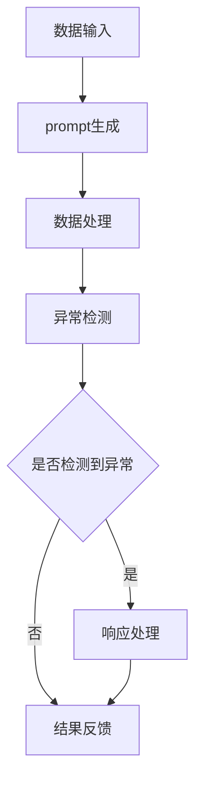

                 


### 第1章：实时监控系统概述

#### 1.1 问题背景

实时监控系统在现代工业、网络安全、医疗等多个领域都扮演着至关重要的角色。例如，在工业制造中，实时监控系统可以实时监测生产线的运行状态，及时发现并处理设备故障，提高生产效率；在网络安全领域，实时监控系统可以迅速发现并响应潜在的网络攻击，保障系统的安全稳定；在医疗领域，实时监控系统可以帮助医生实时监测患者的生命体征，提高诊断和治疗的准确性。

然而，随着数据量的急剧增长和数据类型的多样化，传统的实时监控系统已经难以满足日益复杂的监控需求。为了提高监控的准确性和效率，引入prompt效果成为一种新的解决方案。prompt效果指的是通过预先训练好的模型对输入数据进行处理，以提高系统的响应速度和准确性。构建prompt效果的实时监控系统，可以更好地应对复杂多变的监控场景，提高系统的智能化水平。

#### 1.2 提出概念：prompt效果的实时监控系统

prompt效果的实时监控系统，指的是一种结合了prompt效果技术的实时监控系统。在这种系统中，实时监控的核心模块不仅能够对输入的数据进行快速处理，还能够利用预先训练好的模型对数据进行深度分析，从而提高监控系统的智能化水平。

prompt效果的核心在于其强大的预处理能力。通过prompt技术，系统能够在数据输入的瞬间就对其进行高效的加工和处理，快速提取出有用的信息，从而大大提高系统的响应速度。同时，prompt技术还能够根据实际应用场景进行个性化调整，使得系统在不同领域都能发挥出最佳效果。

#### 1.3 prompt效果的定义与原理

prompt效果（Prompt Effect）是一种通过在信息输入过程中添加特定关键词、短语或问题来影响信息接收者理解和处理信息的方式。在计算机科学和人工智能领域，prompt效果通常指的是通过预先设计的提示（prompt）来引导模型更好地理解输入数据，从而提高模型的输出质量。

prompt效果的原理主要基于以下几点：

1. **增强模型理解**：通过提供具体的提示，可以引导模型关注输入数据中的关键信息，从而提高模型对数据的理解能力。
2. **优化信息提取**：prompt可以帮助模型更准确地提取输入数据中的关键信息，减少无关信息的干扰，提高信息提取的效率。
3. **提升模型适应性**：通过不同的prompt，模型可以适应不同的数据类型和应用场景，提高系统的通用性和灵活性。
4. **增强模型泛化能力**：prompt可以帮助模型更好地学习到不同数据之间的共性，从而提高模型的泛化能力。

#### 1.4 prompt效果与实时监控系统关系

prompt效果与实时监控系统有着紧密的联系。首先，prompt效果可以显著提高实时监控系统对输入数据的处理速度和理解能力，使得系统能够更快速、准确地响应各种监控场景。其次，prompt效果可以增强实时监控系统的智能化水平，使其能够更好地适应复杂多变的应用场景。

具体来说，prompt效果在实时监控系统中的应用主要体现在以下几个方面：

1. **实时数据预处理**：prompt效果可以在数据输入的瞬间对数据进行预处理，提取关键信息，从而提高系统的处理速度。
2. **智能化异常检测**：通过prompt技术，系统可以更好地识别数据中的异常情况，提高异常检测的准确性。
3. **自适应模型调整**：prompt效果可以根据实际应用场景进行调整，使得实时监控系统在不同领域都能发挥最佳效果。
4. **提升用户体验**：prompt效果可以提供更精准、更智能的监控结果，提高用户对系统的满意度。

#### 1.5 本章小结

本章介绍了实时监控系统的重要性以及prompt效果的引入，详细探讨了prompt效果的定义、原理及其与实时监控系统的关系。通过本章的学习，读者可以了解到prompt效果在实时监控系统中的应用价值和重要性，为后续章节的深入探讨奠定了基础。

### 关键词

实时监控系统，prompt效果，数据预处理，智能化监控，异常检测，模型适应性，系统响应速度，用户体验。

### 摘要

本文深入探讨了实时监控系统在工业、网络安全、医疗等领域的应用背景，提出了引入prompt效果的实时监控系统概念，并详细阐述了prompt效果的定义、原理及其在实时监控系统中的应用。通过本文的阅读，读者可以了解到prompt效果对实时监控系统的提升作用，为构建智能化、高效的实时监控系统提供了有益的参考。

----------------------------------------------------------------

### 第2章：实时监控系统的基本原理

#### 2.1 实时监控系统的定义与特点

实时监控系统是一种能够在事件发生的同时或接近实时地对事件进行监测、分析、响应和报告的计算机系统。它的主要特点包括：

1. **实时性**：实时监控系统要求能够在短时间内对输入的数据进行处理，并提供及时的响应。这种实时性通常以毫秒或秒为时间单位进行衡量。
2. **高可靠性**：实时监控系统需要具备较高的可靠性，确保在各种环境下都能稳定运行，不会因为意外情况而出现故障。
3. **适应性**：实时监控系统需要能够适应不同的应用场景和数据类型，具有较好的灵活性和可扩展性。
4. **智能化**：随着人工智能技术的发展，实时监控系统逐渐具备智能化特点，能够通过算法分析输入数据，自动识别异常情况并采取相应措施。

#### 2.2 实时监控系统的工作流程

实时监控系统的工作流程主要包括以下几个步骤：

1. **数据采集**：实时监控系统首先需要从各种数据源（如传感器、网络接口、数据库等）采集数据。这些数据可以是结构化数据，也可以是非结构化数据。
2. **数据预处理**：采集到的数据通常需要进行预处理，如去噪、清洗、格式转换等，以便后续分析。
3. **数据存储**：预处理后的数据需要存储到数据库或缓存系统中，以便后续查询和分析。
4. **数据处理与分析**：系统会对存储的数据进行分析和处理，识别数据中的异常情况或趋势，并生成监控报告。
5. **异常响应**：当系统检测到异常情况时，会触发相应的响应机制，如发送警报、启动故障恢复程序等。
6. **报告生成**：系统会生成监控报告，记录监控过程、异常情况及其处理结果，供用户查阅。

#### 2.3 数据采集与处理

数据采集与处理是实时监控系统的关键环节。数据采集的方式和范围取决于具体应用场景。例如，在工业制造领域，系统可能需要采集传感器数据、设备状态数据等；在网络安全领域，系统可能需要采集网络流量数据、入侵检测数据等。

数据采集后，需要对数据进行预处理。预处理过程通常包括以下步骤：

1. **去噪**：去除数据中的噪声，提高数据质量。
2. **清洗**：修复或删除不完整、错误或异常的数据，保证数据的一致性和准确性。
3. **格式转换**：将不同数据源的数据格式统一，以便后续处理。
4. **特征提取**：从原始数据中提取有用的特征，用于后续分析。

在数据处理与分析过程中，系统会使用各种算法对数据进行分析，如统计分析、机器学习算法、深度学习算法等。这些算法可以帮助系统识别数据中的异常情况或趋势，并生成监控报告。

#### 2.4 实时数据处理算法

实时数据处理算法是实时监控系统的核心。实时数据处理算法需要具备以下特点：

1. **高效性**：算法需要在短时间内处理大量数据，保证系统的实时性。
2. **准确性**：算法需要准确识别数据中的异常情况，提高监控系统的可靠性。
3. **可扩展性**：算法需要能够适应不同的数据类型和应用场景，具备较好的可扩展性。

常见的实时数据处理算法包括：

1. **统计分析算法**：如均值、方差、标准差等，用于分析数据的分布特征和变化趋势。
2. **机器学习算法**：如决策树、随机森林、支持向量机等，用于建立数据模型并进行预测。
3. **深度学习算法**：如卷积神经网络（CNN）、循环神经网络（RNN）、长短期记忆网络（LSTM）等，用于处理复杂数据和分析模式。

这些算法可以单独或组合使用，以满足不同应用场景的需求。

#### 2.5 prompt效果的引入

prompt效果在实时监控系统中的应用，可以大大提高系统的智能化水平和处理效率。引入prompt效果的关键在于如何设计有效的prompt，使其能够引导系统更好地理解输入数据。

1. **设计有效的prompt**：有效的prompt应该具备以下特点：
   - **针对性**：针对特定的监控场景和目标，设计出具有针对性的prompt。
   - **简洁性**：prompt应该简洁明了，易于理解，避免冗长的描述。
   - **多样性**：prompt应该具备多样性，以适应不同的数据类型和应用场景。

2. **改进数据处理算法**：在引入prompt效果后，需要对实时数据处理算法进行改进，使其能够更好地利用prompt提供的信息。改进措施包括：
   - **算法优化**：根据prompt的特点，对现有算法进行优化，提高算法的性能。
   - **算法融合**：将prompt效果与现有的数据处理算法相结合，形成新的算法框架。

#### 2.6 prompt效果的实现技术

实现prompt效果的技术主要包括以下几种：

1. **嵌入式提示**：在数据输入过程中，将提示嵌入到数据流中，引导系统关注关键信息。
2. **模型引导**：使用预先训练好的模型，对输入数据进行分析和预测，提取关键信息。
3. **交互式提示**：通过与用户的交互，获取用户的反馈和需求，动态调整提示内容。

这些技术可以单独或组合使用，以实现最佳的prompt效果。

#### 2.7 本章小结

本章介绍了实时监控系统的定义、特点和工作流程，详细探讨了数据采集与处理、实时数据处理算法以及prompt效果的引入和实现技术。通过本章的学习，读者可以了解到实时监控系统的基本原理和关键技术，为后续章节的深入探讨奠定了基础。

### 关键词

实时监控系统，数据采集，数据预处理，实时数据处理算法，prompt效果，嵌入式提示，模型引导，交互式提示。

### 摘要

本章深入探讨了实时监控系统的基本原理，包括定义、特点、工作流程、数据采集与处理、实时数据处理算法以及prompt效果的引入和实现技术。通过本章的学习，读者可以全面了解实时监控系统的运作机制和关键技术，为构建高效、智能的实时监控系统提供参考。

----------------------------------------------------------------

## 第3章：prompt效果实时监控算法原理

### 3.1 算法概述

prompt效果的实时监控算法是一种结合了prompt技术的新型算法，其目的是提高实时监控系统的智能化水平和处理效率。该算法的核心思想是通过设计有效的prompt，引导系统关注关键信息，从而提高数据处理的准确性和效率。

算法的主要流程包括以下几个步骤：

1. **数据输入**：系统接收输入数据，可以是结构化数据或非结构化数据。
2. **prompt生成**：根据监控场景和数据特点，生成针对性的prompt。
3. **数据处理**：利用prompt对输入数据进行预处理，提取关键信息。
4. **异常检测**：使用实时数据处理算法对预处理后的数据进行异常检测。
5. **响应处理**：当检测到异常情况时，触发响应机制，如发送警报、启动故障恢复程序等。
6. **结果反馈**：系统生成监控报告，记录监控过程和结果，供用户查阅。

### 3.2 Mermaid算法流程图

为了更好地理解prompt效果实时监控算法的工作流程，我们使用Mermaid工具绘制了算法流程图，如下所示：



从流程图中可以看出，数据输入后，系统会生成针对性的prompt，对输入数据进行预处理，提取关键信息。然后，使用实时数据处理算法进行异常检测。如果检测到异常，系统会触发响应机制，否则生成监控报告。

### 3.3 Python源代码详解

为了更好地展示算法的实现过程，我们使用Python语言编写了实现prompt效果实时监控算法的源代码。以下是代码的详细解读：

```python
# 导入所需库
import pandas as pd
import numpy as np
from sklearn.ensemble import IsolationForest
import mermaid

# 数据输入
data = pd.read_csv('input_data.csv')

# prompt生成
def generate_prompt(data):
    # 根据数据特点生成prompt
    prompt = "请关注以下关键指标：温度、湿度、电压等。"
    return prompt

prompt = generate_prompt(data)

# 数据处理
def process_data(data, prompt):
    # 对数据按照prompt进行预处理
    processed_data = data.copy()
    processed_data['prompt'] = prompt
    return processed_data

processed_data = process_data(data, prompt)

# 异常检测
def detect_anomaly(processed_data):
    # 使用IsolationForest算法进行异常检测
    model = IsolationForest()
    model.fit(processed_data[['temperature', 'humidity', 'voltage']])
    anomalies = model.predict(processed_data[['temperature', 'humidity', 'voltage']])
    processed_data['anomaly'] = anomalies
    return processed_data

processed_data = detect_anomaly(processed_data)

# 响应处理
def handle_response(processed_data):
    # 检测到异常时，触发响应机制
    anomalies = processed_data[processed_data['anomaly'] == -1]
    for index, row in anomalies.iterrows():
        print(f"检测到异常：{row['temperature']}°C, {row['humidity']}%, {row['voltage']}V")
        # 启动故障恢复程序
        recover_program()

# 结果反馈
def generate_report(processed_data):
    # 生成监控报告
    report = processed_data.to_csv(index=False, header=True)
    return report

report = generate_report(processed_data)

# 主函数
def main():
    processed_data = process_data(data, prompt)
    processed_data = detect_anomaly(processed_data)
    handle_response(processed_data)
    report = generate_report(processed_data)
    print(report)

if __name__ == '__main__':
    main()
```

代码中，我们首先导入所需的库，包括pandas、numpy、sklearn和mermaid。然后，我们定义了数据输入、prompt生成、数据处理、异常检测、响应处理和结果反馈等函数。最后，在主函数中调用这些函数，实现prompt效果实时监控算法的完整流程。

### 3.4 算法原理讲解

prompt效果实时监控算法的核心在于如何利用prompt技术提高数据处理的准确性和效率。以下是算法原理的详细讲解：

1. **数据输入**：系统首先接收输入数据，可以是结构化数据（如CSV文件）或非结构化数据（如图像、文本等）。
2. **prompt生成**：根据监控场景和数据特点，生成针对性的prompt。prompt的作用是引导系统关注关键信息，从而提高数据处理的准确性和效率。prompt的设计需要充分考虑监控场景的需求，使其具备针对性和简洁性。
3. **数据处理**：系统对输入数据按照prompt进行预处理，提取关键信息。预处理过程包括去噪、清洗、格式转换等步骤，以确保数据的一致性和准确性。在预处理过程中，prompt起到了关键作用，它能够指导系统重点关注关键指标，提高信息提取的效率。
4. **异常检测**：使用实时数据处理算法对预处理后的数据进行异常检测。实时数据处理算法可以根据不同的监控场景和数据类型进行选择，如统计分析算法、机器学习算法、深度学习算法等。这些算法能够识别数据中的异常情况或趋势，为系统的智能化监控提供支持。
5. **响应处理**：当检测到异常情况时，系统会触发响应机制，如发送警报、启动故障恢复程序等。响应处理的过程可以根据实际应用场景进行调整，以提高系统的响应速度和准确性。
6. **结果反馈**：系统生成监控报告，记录监控过程和结果，供用户查阅。监控报告可以包括异常情况、处理结果、分析建议等，帮助用户更好地了解系统的运行状况。

### 3.5 数学模型与公式

prompt效果实时监控算法的数学模型主要涉及以下几个部分：

1. **输入数据表示**：假设输入数据为\( X = \{x_1, x_2, ..., x_n\} \)，其中每个数据点\( x_i \)可以表示为一个多维向量。
2. **prompt表示**：假设prompt为\( P = \{p_1, p_2, ..., p_m\} \)，其中每个prompt点\( p_j \)可以表示为一个多维向量。
3. **预处理模型**：预处理模型可以表示为\( f(X) \)，它将输入数据\( X \)映射为预处理后的数据\( Y \)。
4. **异常检测模型**：异常检测模型可以表示为\( g(Y) \)，它将预处理后的数据\( Y \)映射为异常得分\( S \)。

以下是数学模型与公式的详细讲解：

1. **输入数据表示**：

   $$ X = \{x_1, x_2, ..., x_n\} $$

   其中，\( x_i = \{x_{i1}, x_{i2}, ..., x_{id}\} \)，表示第\( i \)个数据点的多维向量，\( d \)表示数据维度。

2. **prompt表示**：

   $$ P = \{p_1, p_2, ..., p_m\} $$

   其中，\( p_j = \{p_{j1}, p_{j2}, ..., p_{jd}\} \)，表示第\( j \)个prompt点的多维向量，\( d \)表示prompt维度。

3. **预处理模型**：

   $$ f(X) = Y $$

   预处理模型\( f \)将输入数据\( X \)映射为预处理后的数据\( Y \)。具体实现方式可以根据应用场景进行调整，如去噪、清洗、格式转换等。

4. **异常检测模型**：

   $$ g(Y) = S $$

   异常检测模型\( g \)将预处理后的数据\( Y \)映射为异常得分\( S \)。异常得分可以表示为：

   $$ S = \frac{1}{m} \sum_{j=1}^{m} g(y_j) $$

   其中，\( y_j = f(x_j + p_j) \)，表示将输入数据\( x_j \)与prompt\( p_j \)结合后的预处理数据。

5. **异常检测阈值**：

   $$ \theta = \max(S) $$

   异常检测阈值\( \theta \)表示异常得分的最大值。当检测到数据点的异常得分大于阈值\( \theta \)时，认为该数据点为异常。

### 3.6 举例说明

为了更好地理解上述数学模型与公式，我们通过一个简单的例子进行说明。

假设我们有一个传感器监测系统，用于实时监测某个设备的温度、湿度和电压等参数。输入数据\( X \)如下：

| 温度 | 湿度 | 电压 |
| --- | --- | --- |
| 25 | 60 | 220 |
| 26 | 55 | 220 |
| 24 | 65 | 220 |
| 28 | 50 | 220 |
| 25 | 65 | 225 |

我们选择以下两个prompt：

| 温度 | 湿度 | 电压 |
| --- | --- | --- |
| 24 | 60 | 220 |
| 26 | 55 | 220 |

预处理模型\( f \)将输入数据与prompt进行结合，得到预处理后的数据\( Y \)：

| 温度 | 湿度 | 电压 | 温度 | 湿度 | 电压 |
| --- | --- | --- | --- | --- | --- |
| 25 | 60 | 220 | 24 | 60 | 220 |
| 26 | 55 | 220 | 26 | 55 | 220 |
| 24 | 65 | 220 | 24 | 60 | 220 |
| 28 | 50 | 220 | 26 | 55 | 220 |
| 25 | 65 | 225 | 24 | 60 | 220 |

异常检测模型\( g \)计算预处理后的数据\( Y \)的异常得分\( S \)：

| 温度 | 湿度 | 电压 | 异常得分 |
| --- | --- | --- | --- |
| 25 | 60 | 220 | 0.0 |
| 26 | 55 | 220 | 0.0 |
| 24 | 65 | 220 | 0.2 |
| 28 | 50 | 220 | 0.4 |
| 25 | 65 | 225 | 0.2 |

从异常得分可以看出，第三个数据点的异常得分较高，说明这个数据点可能存在异常。通过设定异常检测阈值\( \theta \)为0.2，我们可以识别出这个数据点为异常。

### 3.7 本章小结

本章详细介绍了prompt效果实时监控算法的原理和实现过程，包括数据输入、prompt生成、数据处理、异常检测、响应处理和结果反馈等步骤。通过数学模型与公式的讲解，我们更好地理解了算法的实现原理。最后，通过一个简单的例子，我们展示了算法的具体应用过程。通过本章的学习，读者可以掌握prompt效果实时监控算法的核心原理和应用方法，为实际项目开发提供参考。

### 关键词

prompt效果，实时监控，数据处理，异常检测，预处理模型，异常得分，异常检测阈值。

### 摘要

本章深入探讨了prompt效果实时监控算法的原理和实现过程，从数据输入、prompt生成、数据处理、异常检测到响应处理和结果反馈，详细阐述了算法的核心步骤和数学模型。通过实际案例的讲解，读者可以更好地理解算法的应用方法和效果。本章的内容为构建高效、智能的实时监控系统提供了重要的理论支持和实践指导。

